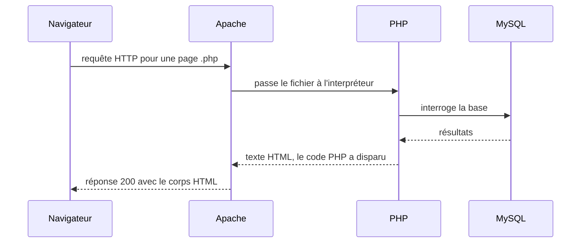

# Introduction à PHP — la pile, l'environnement et la syntaxe

## L'idée en une image {diapos="17-23"}

Imagine un restaurant. Le client s'assoit, lit le menu, passe commande. La cuisine travaille hors
de sa vue. Ce qui revient à la table, c'est une **assiette** — jamais la recette, jamais les
casseroles, jamais le garde-manger.

Une application web fonctionne exactement ainsi, et la pile **LAMP** distribue les rôles :

- **Linux** est le bâtiment : le système d'exploitation qui héberge tout le reste.
- **Apache** est le serveur de salle : il reçoit la commande (la requête HTTP) et rapporte
  l'assiette (la réponse HTTP).
- **PHP** est le cuisinier : il prépare la page, sur le serveur, avant l'envoi.
- **MySQL** (ou **MariaDB**, sa version dérivée) est le garde-manger : les données qui durent.

**PHP** signifie *PHP: Hypertext Preprocessor* — « préprocesseur hypertexte ». Le mot dit tout :
PHP **traite** la page **avant** de la remettre au navigateur. C'est pour cela que le visiteur qui
fait « Afficher le code source » ne voit **aucune ligne de PHP** : elle a déjà été exécutée et
remplacée par sa sortie.



**Où l'analogie casse — et il faut le dire, sinon elle enseigne des erreurs.** D'abord, le
cuisinier **oublie tout** entre deux commandes : chaque requête PHP repart d'une mémoire vierge.
C'est le modèle *shared-nothing*, et c'est pour cela que tout ce qui doit durer passe par la base
de données, une session ou un cookie. Ensuite, et c'est le point décisif : un vrai cuisinier ne
suit pas un mot glissé dans la commande d'un client, alors qu'un programme, lui, **exécute ce
qu'on lui donne**. C'est toute la matière des failles d'injection, que tu croiseras dès l'exemple
complet de cette leçon.

## En bref — la marche à suivre {diapos="25-58"}

:::: marche-a-suivre {titre="Monter WAMP et servir sa première page PHP"}

1. {voir="Monter l'environnement de développement"} Télécharge WAMP depuis
   `wampserver.aviatechno.net`, puis exécute d'abord le paquet de composants requis, ensuite
   l'installateur de WAMP — les deux **en tant qu'administrateur**.

2. {voie="cours"} {voir="Monter l'environnement de développement"} Démarre le service WAMP et
   vérifie que son icône est **verte** dans la barre système : verte veut dire qu'Apache et MySQL
   tournent tous les deux.

3. {voie="moderne"} {voir="Monter l'environnement de développement"} Pour un simple essai jetable,
   aucun serveur à installer : le serveur web intégré à PHP sert le dossier courant.

   ```bash
   php -S localhost:8000 -t .
   ```

4. {voir="Quand le port 80 est déjà pris"} Ouvre `http://localhost/` : si la page d'accueil d'IIS
   s'affiche au lieu de celle d'Apache, fais écouter Apache sur le port **8080**, puis redémarre
   les services et ouvre `http://localhost:8080/`.

5. {voir="Où vivent les fichiers, et comment les servir"} Dépose ton code dans la racine web de
   WAMP, `C:\wamp64\www`, en créant **un sous-dossier par site** — ou le nommage que ton
   enseignant impose, s'il en impose un.

6. {voir="Où vivent les fichiers, et comment les servir"} Nomme ton fichier avec l'extension
   `.php`, jamais `.html` : sans elle, Apache ne passe pas le fichier à l'interpréteur et ton code
   part **en clair** chez le visiteur.

7. {voir="Exemple simple"} Écris ton premier script : du HTML ordinaire, et un îlot de code entre
   les balises `<?php` et `?>`.

   ```php
   <?php echo "Bonjour le monde"; ?>
   ```

8. {voir="Où vivent les fichiers, et comment les servir"} Ouvre `http://localhost/monDossier/` dans
   le navigateur, puis affiche le code source de la page : tu dois y voir le résultat, et aucune
   ligne de PHP.

9. {voir="La syntaxe de PHP, en sommaire"} Écris la suite avec les dix briques de la séance :
   affichage, variables, opérateurs, conditions, `switch`, fonctions, tableaux, boucles,
   modularité, commentaires.

10. {voie="cours"} {voir="Exemple complet"} À l'examen, réponds comme le cours : `switch`, `==`,
    `include "fichier.inc"`, et la valeur de `$_GET` affichée directement.

11. {voie="moderne"} {voir="Exemple complet"} Sur ton projet, écris plutôt `match`, `===`,
    `require __DIR__ . "/fichier.php"`, et **encode toujours à la sortie** avec
    `htmlspecialchars()`.

12. {voir="À toi de jouer"} Fais les **14** exercices de la séance : le cours annonce que les
    examens réutilisent le modèle des exercices.

::::

## Ce que la séance 1 enseigne, et ce que cette leçon ajoute {diapos="3, 6, 7, 8, 12, 13, 19"}

::: cours {diapos="3, 8, 12, 13, 19"}
L'objectif du cours est de **développer une application web complète, correctement conçue,
sécuritaire et utilisable depuis Internet**. Chaque séance est à moitié théorie, à moitié
exercices. Le matériel vit sur le site de l'enseignant : diapositives, exercices, références. Des
frais sont annoncés : environ 3 $ de location de serveur, et un nom de domaine optionnel à environ
15 $. La séance 1 couvre deux choses, et deux seulement : l'**architecture des applications web**
et la **syntaxe de PHP**.
:::

::: cours {diapos="6, 7"}
Les examens **réutilisent le modèle des exercices**, et tout leur contenu se trouve dans les notes
et les exercices. Ils sont à documentation ouverte : notes de cours, exercices faits, Internet et
toute autre documentation sont permis.
:::

**Un désaccord de calendrier, à ne pas trancher soi-même.** Deux documents de l'enseignant
décrivent les évaluations, et ils ne disent pas la même chose :

- **La diapositive 6** annonce **quatre** évaluations mais n'en détaille que **trois** — examen 1
  au cours 9 pour 25 %, projet de session au cours 11 pour 15 %, examen final au cours 15 pour
  60 % — et laisse donc une évaluation sans libellé ni pondération.
- **L'horaire publié sur le site du cours** compte **13** séances et détaille **quatre**
  évaluations : examen 1 à la séance 6 pour 10 %, examen 2 à la séance 9 pour 20 %, projet de
  session à la séance 11 pour 10 %, examen final à la séance 13 pour 60 %. C'est de lui que vient
  le calendrier affiché sur ce site.

Les deux s'accordent sur le **nombre** d'évaluations ; ce qui diffère est la **répartition** — les
pondérations et les séances où elles tombent. Cette leçon ne choisit pas entre les deux : **le plan
de cours remis par l'enseignant fait foi**. En cas de doute, c'est lui qu'il faut relire, ou
l'enseignant qu'il faut questionner.

**Ce que cette leçon ajoute au cours.** Le cours est sommaire par nature : il montre le geste, pas
toujours sa raison. Cette leçon complète sur trois points, chacun signalé à sa place — la
différence entre `==` et `===`, l'encodage de sortie contre les failles d'injection, et
l'équivalent moderne de chaque outil enseigné. À l'examen, donne la réponse du cours ; sur ton
projet, applique la correction.

## Monter l'environnement de développement {diapos="24-38"}

Pour exécuter du PHP sur ta machine, il faut trois programmes : **Apache** (le serveur web),
**PHP** (l'interpréteur) et **MySQL** (la base de données). Les installer un par un est long ;
**WAMP** les pose d'un seul coup. Son nom est l'acronyme de *Windows – Apache – MySQL – PHP*.

::: cours {diapos="28-34"}
La marche enseignée : se rendre sur `wampserver.aviatechno.net`, télécharger le paquet des
composants requis, l'exécuter **en administrateur**, revenir au même site, télécharger le
programme d'installation de WAMP, l'installer, démarrer le service, puis vérifier que le menu
d'administration de WAMP apparaît dans la barre système.
:::

::: correction-du-cours {source="Vérification du propriétaire sur un poste du Cégep, 2026-09-11 (décision D-PHP-3 du projet)" diapos="33"}
La diapositive 33 dit qu'« au Cégep, il faudra **peut-être** utiliser la version *Admin* de WAMP ».
Le doute est levé : sur le poste du Cégep, cette version **est installée et utilisable**. C'est
elle qu'il faut lancer, et il n'y a rien à demander ni à installer de plus.
:::

**Les deux formes d'une commande — la générique, puis la concrète.** C'est la règle de cette leçon
et des suivantes : une commande ne se recopie pas, elle se comprend.

Le serveur web **intégré à PHP** sert un dossier sans aucun Apache. Forme générique :

```bash
php -S <hôte>:<port> -t <dossier-racine>
```

- `-S` (**S majuscule**) démarre le serveur intégré ; la valeur qui suit est l'adresse d'écoute,
  sous la forme `hôte:port`. `localhost` n'accepte que les connexions venant de ta machine.
- `-t` (*document root*, le nom qu'emploie le manuel PHP) désigne le **dossier racine** servi :
  c'est lui qui devient la racine des URL.
  Sans `-t`, PHP sert le dossier courant.
- Aucune des deux valeurs ne prend de guillemets, sauf si le chemin contient une espace.

Forme concrète, sur un poste où WAMP est installé :

```bash
cd C:\wamp64\www\monDossier
C:\wamp64\bin\php\php<version>\php.exe -S localhost:8000 -t .
```

Le chemin complet de `php.exe` est nécessaire parce que l'installation de WAMP n'ajoute pas PHP au
`PATH` de Windows : taper `php` seul dans une console répond « commande introuvable ».

`php<version>` n'est pas à recopier tel quel : le numéro dépend du WAMP installé sur ta machine,
qui peut même livrer plusieurs versions côte à côte. Pour le connaître, ouvre le dossier
`C:\wamp64\bin\php\` dans l'Explorateur : chaque sous-dossier porte le mot `php` suivi de son
numéro de version, et c'est ce nom exact qui remplace `php<version>` dans la commande.

Installer Linux dans Windows, pour la voie moderne, se fait par une commande unique :

```bash
wsl --install -d Ubuntu-24.04
```

- `--install` installe le sous-système Windows pour Linux et une distribution d'un seul geste.
- `-d` (*distribution*) nomme la distribution voulue. `Ubuntu-24.04` est celle qui correspond au
  serveur utilisé plus tard dans la session : mêmes chemins, même gestionnaire de paquets.

**Les trois chemins mènent au même résultat : une page PHP servie en local.** Le premier est celui
du cours et c'est lui qui sera évalué. Le deuxième, WSL2 avec une pile LAMP installée par `apt`,
donne le même système, les mêmes chemins et le même gestionnaire de paquets que le serveur de fin
de session. Le troisième, `php -S`, ne convient qu'à un essai jetable : il n'a ni `.htaccess`, ni
modules Apache, et ne traite qu'une requête à la fois.

**La version de PHP, elle, n'est pas la même pour autant.** `sudo apt install php` sur
Ubuntu 24.04 installe **PHP 8.3**, la version empaquetée par la distribution, alors que l'image
« LAMP on 24.04 » du serveur loué en fin de session livre **PHP 8.4**. Pour aligner les deux, il
faut ajouter le dépôt `ondrej/php` puis installer explicitement `php8.4` :

```bash
sudo add-apt-repository ppa:ondrej/php
sudo apt update
sudo apt install php8.4
php -v
```

La dernière commande, `php -v`, imprime la version réellement active : c'est elle qui tranche, pas
ce qu'on croit avoir installé.

:::: methodes
::: methode {libelle="La voie du cours — WAMP" defaut}
Installer les composants requis, puis WAMP, les deux en administrateur. Démarrer le service et
attendre l'icône verte dans la barre système. Déposer le code sous `C:\wamp64\www\monDossier`.
Ouvrir `http://localhost/monDossier/`.
:::
::: methode {libelle="WSL2 et une pile LAMP par apt"}
Installer la distribution, poser la pile par `apt`, puis copier le code dans la racine servie.

```bash
wsl --install -d Ubuntu-24.04
sudo apt update
sudo apt install apache2 php libapache2-mod-php mysql-server
php -v                       # affiche PHP 8.3 : la version empaquetée par Ubuntu 24.04
sudo cp -r ./monDossier /var/www/html/
```
:::
::: methode {libelle="Le serveur intégré, pour un essai jetable"}
Se placer dans le dossier à servir, puis lancer le serveur intégré et ouvrir
`http://localhost:8000/`.

```bash
cd monDossier
php -S localhost:8000 -t .
```
:::
::::

### Quand le port 80 est déjà pris {diapos="35-37, 46-49"}

Un serveur web écoute par défaut sur le **port 80**. Un port est un numéro qui identifie le
programme destinataire d'une connexion sur une machine : deux programmes ne peuvent pas écouter le
même port en même temps. Sur un poste Windows professionnel, **IIS** — le serveur web de Microsoft
— occupe souvent déjà le port 80. Symptôme : tu ouvres `localhost` et tu vois la page d'accueil
d'IIS au lieu de celle d'Apache.

::: cours {diapos="35-37, 46-49"}
Le correctif enseigné : ouvrir le fichier de configuration d'Apache, `httpd.conf`, remplacer le
port d'écoute par 8080, sauvegarder, redémarrer les services, puis ouvrir `localhost:8080`.
:::

La ligne à modifier est une **directive** Apache, c'est-à-dire une instruction de configuration
écrite sur une seule ligne. Dans `httpd.conf`, la ligne `Listen 80` devient `Listen 8080` ; si le
fichier porte aussi une ligne `ServerName localhost:80`, elle suit le même changement.

`Listen` dit sur quel port Apache accepte les connexions. Le port 8080 n'a rien de magique : c'est
simplement un port libre par convention pour un second serveur web. Concrètement, sous WAMP :
clic gauche sur l'icône de la barre système, puis `Apache`, puis `httpd.conf` ; la modification
faite, `Redémarrer les services`. Les adresses de tes pages deviennent alors
`http://localhost:8080/monDossier/`.

**La règle du port, pour toutes les adresses de ce cours.** Les URL données dans ces leçons sont
écrites **sans port** : le navigateur emploie alors le port 80, celui par défaut. Si ton Apache
écoute sur 8080 — le cas des diapositives 35-37 et 46-49, quand IIS occupe déjà le 80 —, ajoute
`:8080` juste après `localhost` dans **chaque** adresse : `http://localhost/monDossier/` devient
`http://localhost:8080/monDossier/`. Pour savoir lequel s'applique chez toi, ouvre `localhost` :
si c'est la page d'Apache (ou de WAMP) qui répond, le port 80 est le bon ; si c'est celle d'IIS,
Apache est ailleurs, et la ligne `Listen` de son `httpd.conf` dit où.

### XAMPP — et pourquoi il n'est pas une option au Cégep {diapos="26, 39-50"}

**XAMPP** est l'autre installateur tout-en-un. Son nom vient de *Cross-platform, Apache, MariaDB,
PHP, Perl* : le `X` initial dit qu'il fonctionne sur Windows, macOS et Linux. Sa racine web est
`C:\xampp\htdocs`, et la procédure est la même que celle de WAMP : démarrer Apache, créer un
sous-répertoire dans `htdocs`, y copier le code, ouvrir `localhost/monSite/`.

::: cours {diapos="26"}
La diapositive 26 est explicite : XAMPP **n'est pas disponible** sur les ordinateurs du Cégep, en
raison d'une instruction gouvernementale liée à ses retards de mises à jour de sécurité.
:::

**Le déck se contredit sur ce point, et il faut le savoir avant l'examen.** La diapositive 26 dit
que XAMPP est indisponible au Cégep ; la diapositive 107, en conclusion, annonce pourtant que
« l'environnement de développement sera XAMPP ». Les deux affirmations ne peuvent pas être vraies
en même temps sur un poste du Cégep. L'environnement de référence de cette leçon, au Cégep, est
donc **WAMP** : sa présence sur les postes a été vérifiée, et c'est le seul des deux que la
diapositive 26 laisse disponible. Si une question d'examen nomme `htdocs`, elle parle de XAMPP ; si
elle nomme `www`, elle parle de WAMP. Et si l'enseignant impose un autre environnement pour un
travail, c'est sa consigne qui s'applique.

## Où vivent les fichiers, et comment les servir {diapos="45, 51-55"}

Créer un projet PHP, dans ce cours, veut dire exactement ceci : **créer des fichiers texte vides
dont le nom se termine par `.php`**. Aucune arborescence imposée, aucun outil.

::: cours {diapos="45, 52-55"}
Trois règles à retenir telles quelles, parce qu'elles tombent aux examens : (1) un fichier PHP doit
finir par **`.php`** et non `.html` ; (2) sous WAMP, les fichiers vont sous **`C:/wamp64/www`**, et
sous XAMPP sous `C:/XAMPP/htdocs` ; (3) on crée un **sous-répertoire par site**, puis on l'ouvre à
l'adresse `localhost/monSite/`.
:::

**Pourquoi l'extension décide de tout.** Apache choisit quoi faire d'un fichier d'après son
extension. Avec `.php`, il le passe à l'interpréteur, qui exécute le code et ne renvoie que la
sortie. Avec `.html`, il le sert **tel quel** : le visiteur reçoit ton code PHP en clair, mots de
passe compris. Si Windows ne te laisse pas changer l'extension, c'est qu'il masque les extensions
connues : il faut les rendre visibles dans les options de l'Explorateur.

Arborescence type, sous WAMP : la racine servie est `C:\wamp64\www\` ; tu y crées **un
sous-répertoire par site**, `C:\wamp64\www\<nom-du-projet>\`, qui contient ton `index.php` et les
fichiers qu'il inclut. La diapositive 45 en donne l'exemple avec un dossier nommé `monSite`, ouvert
à l'adresse `localhost/monSite/` — mais sa procédure est écrite pour XAMPP : elle range `monSite`
sous `C:\xampp\htdocs`. L'équivalent sous WAMP est `C:\wamp64\www\monSite\`, pour la même adresse. Le nom `<nom-du-projet>` est à toi de choisir — un nom court, sans
espace ni accent, parce qu'il apparaîtra dans l'URL ; le `monDossier` des exemples de cette leçon
en est un. Si l'enseignant impose un nommage (un dossier
par exercice, par exemple), suis sa consigne.

L'adresse correspondante est `http://localhost/<nom-du-projet>/`. Un fichier nommé `index.php` est
servi automatiquement quand l'URL ne nomme aucun fichier.

**L'éditeur — le cours laisse le choix.** L'exercice 1 de la feuille de la séance nomme trois
éditeurs, « VSCode, PHP Storm, Notepad++ », tandis que le déck ne cite que **Notepad++** (diapositive
107, et son lien de téléchargement à la diapositive 111). Tout éditeur de **texte brut** convient :
ce qui compte est qu'il enregistre en texte brut et en UTF-8 — un traitement de texte comme Word ne
convient pas. **VS Code** avec l'extension *Intelephense* apporte en plus la complétion et le
repérage d'erreurs que Notepad++ n'a pas.

## La syntaxe de PHP, en sommaire {diapos="62-63"}

La séance annonce dix briques, et les couvre dans cet ordre : l'affichage, les variables, les
opérateurs, les conditions, le `switch`, les fonctions, les tableaux, les boucles, la modularité et
les commentaires. Ce qui suit en est le sommaire : une définition, un exemple, et le piège quand il
y en a un.

Tout le code PHP vit entre deux balises : `<?php` pour ouvrir, `?>` pour fermer. Le cours écrit
`<?PHP` en majuscules — c'est valide, PHP est insensible à la casse sur ce point — mais `<?php` en
minuscules est la forme qu'écrivent **PSR-1** (§2.1, qui impose la balise longue) et **PSR-12**, et
la convention universelle du code publié.

### Afficher — echo et print {diapos="64-65"}

`echo` envoie une chaîne de caractères au client. `print` fait la même chose, mais n'accepte qu'un
seul argument et retourne `1`, ce qui permet de l'utiliser dans une expression. En pratique, on
écrit `echo`.

```php
<?php
echo "Bonjour";                 // envoie le texte « Bonjour » au navigateur
echo "Bon", "jour";             // echo accepte plusieurs arguments, print non
print "Bonjour";                // équivalent ici, mais retourne 1
```

::: cours {diapos="65"}
Le cours insiste sur un point essentiel : `echo` n'est pas une fonction d'**affichage**, c'est le
canal qui envoie de l'information du code serveur vers le client. Son exemple est frappant :
`echo "<script>alert('bonjour');</script>";` n'affiche rien — il fait **exécuter du JavaScript**
chez le visiteur.
:::

C'est exactement le mécanisme d'une faille **XSS** (*cross-site scripting*, injection de script)
dès que la chaîne envoyée vient du visiteur. Retiens la phrase : ce que `echo` envoie, le
navigateur l'interprète.

### Les variables et leurs types {diapos="66-69"}

Une variable PHP commence par `$` et **ne se déclare pas** : elle naît à sa première affectation.
Son type est déduit de la valeur reçue — c'est le **typage dynamique**.

```php
<?php
$age = 30;              // int    : un entier
$nom = "Alexandre";     // string : une chaîne de caractères
$prix = 13.4;           // float  : un nombre à virgule
$actif = true;          // bool   : vrai ou faux
$saisons = array("Été", "Automne");   // array  : un tableau
$rien = NULL;           // null   : absence de valeur
```

Les sept types du cours sont `string`, `int`, `float`, `bool`, `array`, `object` et `null`. Le nom
d'une variable est **sensible à la casse** : `$nom` et `$Nom` sont deux variables différentes.
Changer le type d'une variable en cours de route est légal, mais le cours le déconseille — et il a
raison : c'est une source de confusion pure.

### Lire ce que le visiteur envoie — $_GET et $_POST {diapos="70-72"}

PHP fournit des variables toutes faites, appelées **superglobales** parce qu'elles sont
accessibles partout sans être passées en paramètre. Deux servent dès la séance 1, et ce sont des
tableaux :

```php
<?php
// URL appelée : www.monsite.com/page.php?langue=fr
echo $_GET["langue"];    // affiche : fr
```

- `$_GET` contient les valeurs passées **dans l'URL**, après le `?`. Elles sont visibles par tout
  le monde : dans la barre d'adresse, dans l'historique, dans les journaux du serveur.
- `$_POST` contient les valeurs envoyées **dans le corps** de la requête HTTP, typiquement par un
  formulaire. Elles ne sont pas visibles dans l'URL — ce qui ne veut **pas** dire qu'elles sont
  protégées : sans HTTPS, elles circulent en clair.

Ces deux tableaux viennent du client : **rien de ce qu'ils contiennent n'est digne de confiance**.
C'est le fil conducteur de l'exemple complet, plus bas.

### Les opérateurs {diapos="73-75"}

```php
<?php
$x = 5; $y = 10;
$nom = "Alexandre";
echo $x + $y;              // 15  addition
echo $x - $y;              // -5  soustraction
echo $x * $y;              // 50  multiplication
echo $x / $y;              // 0.5 division
echo $x % $y;              // 5   modulo : le reste de la division entière
echo "Bonjour " . $nom;    // concaténation : un POINT, jamais un +
```

Le piège numéro un, surtout en venant de C# ou de JavaScript : en PHP, `+` est **exclusivement
arithmétique**. Pour coller deux chaînes, c'est le point `.`. Trois autres opérateurs du cours :
`=` **affecte** une valeur, `==` **compare** deux valeurs, et `->` accède à un membre d'un objet
(l'équivalent du `.` de C#).

::: complement
Le cours ne présente que `==`, qui compare **après conversion de type** : `1 == "1"` vaut `true`.
PHP offre aussi `===`, qui compare **le type et la valeur** : `1 === "1"` vaut `false`. En projet,
utilise `===` par défaut ; comparer un mot de passe ou un jeton avec `==` ouvre des contournements
d'authentification bien réels.
:::

### Les conditions {diapos="76-79"}

Une condition exécute un bloc seulement si un test est vrai.

```php
<?php
if ($x < 5) {
    echo "La variable x est inférieure à 5";
} else {
    echo "La variable x n'est pas inférieure à 5";
}
```

La forme générique est `if (<condition>) { <instructions> }`, suivie éventuellement d'un `else`
(« sinon »). Pour enchaîner un troisième cas, `elseif` s'écrit en un seul mot.

### Le switch {diapos="80-83"}

Le `switch` teste l'**égalité** d'une variable contre plusieurs valeurs possibles. Il évite
d'empiler les `if`.

```php
<?php
$choix = "oui";
switch ($choix) {
    case "oui":
        echo "La réponse est oui";
        break;       // sans break, l'exécution continue dans le case suivant
    case "non":
        echo "La réponse est non";
        break;
    default:         // exécuté si aucun case ne correspond
        echo "Erreur";
}
```

Le `break` n'est pas décoratif : sans lui, PHP poursuit dans le `case` suivant. C'est l'erreur
classique du débutant, et elle ne produit aucun message.

::: complement
Depuis PHP 8.0, `match` fait le même travail en mieux : c'est une expression qui **retourne** une
valeur, sa comparaison est stricte, il n'y a pas de `break` à oublier, et une valeur non couverte
lève une erreur au lieu de passer en silence. À l'examen, écris le `switch` attendu ; en projet,
`match`.
:::

### Les fonctions {diapos="84-92"}

Une fonction nomme un bloc de code pour le réutiliser. Elle peut prendre ou non des **paramètres**
(des valeurs d'entrée) et retourner ou non une valeur. Le cours montre les quatre combinaisons :

```php
<?php
function afficherBonjour() {           // sans paramètre, sans retour
    echo "Bonjour";
}
function afficherTexte($texte) {       // avec paramètre, sans retour
    echo $texte;
}
function obtenirPI() {                 // sans paramètre, avec retour
    return 3.1415;
}
function doubler($x) {                 // avec paramètre, avec retour
    return $x * 2;
}
$valeur = doubler(4);                  // $valeur vaut 8
```

Le cours ajoute le **typage** : on peut annoncer le type attendu d'un paramètre et celui de la
valeur retournée, ce qui provoque une erreur d'exécution si une donnée incompatible arrive.

```php
<?php
function doubler(float $x) : float {   // l'exemple typé de la diapositive 92
    return $x * 2;
}
echo doubler(4);                       // 8
```

Une fonction PHP **ne voit pas** les variables du fichier qui l'entoure : ce qu'elle doit connaître
lui est passé en paramètre.

### Les tableaux {diapos="93-94"}

Un tableau est une variable qui contient plusieurs valeurs, rangées par **position**. La première
position porte le numéro **0**.

```php
<?php
$tableau = array("Été", "Automne", "Hiver", "Printemps");
echo $tableau[0];     // Été
echo $tableau[2];     // Hiver
echo count($tableau); // 4 — le nombre d'éléments
```

L'écriture courte `["Été", "Automne"]` est équivalente à `array(...)` et plus répandue aujourd'hui.

### Les boucles {diapos="95-100"}

Une boucle répète un bloc. Le cours en montre quatre.

```php
<?php
for ($x = 0; $x < 10; $x++) { echo $x; }      // compteur : début ; condition ; incrément
foreach ($tableau as $x)     { echo $x; }      // parcourt chaque valeur d'un tableau
$x = 0;
while ($x < 10)  { echo $x; $x++; }            // tant que la condition est vraie
$x = 0;
do { echo $x; $x++; } while ($x < 10);         // teste APRÈS : s'exécute au moins une fois
```

La seule différence entre `while` et `do…while` est le moment du test : `do…while` exécute toujours
son bloc au moins une fois.

### La modularité — include et require {diapos="101-103"}

`include` et `require` **insèrent le contenu d'un autre fichier** à l'endroit de l'appel, comme si
le code y avait été écrit. C'est ainsi qu'on partage un en-tête, un menu ou un pied de page entre
plusieurs pages.

```php
<?php
include "header.inc";
echo "Contenu de ma page";
include "footer.inc";
?>
```

La seule différence entre les deux tient au fichier manquant : `include` produit un simple
**avertissement** et le script continue ; `require` provoque une **erreur fatale** et le script
s'arrête. Règle d'usage : `include` pour un fragment facultatif, `require` pour tout ce sans quoi la
page n'a aucun sens.

::: correction-du-cours {source="Manuel PHP — include/require, et fiche KB web/php/php-fondamentaux.md, section Modularité (relue le 2026-08-19)" diapos="103"}
Le cours conseille l'extension `.inc` « afin d'éviter l'exécution accidentelle » du fichier inclus.
C'est l'inverse qui se produit : Apache ne connaît pas `.inc`, il le sert donc **en texte brut**.
Une adresse comme `http://localhost/inc/config.inc` affiche alors le contenu du fichier — mot de
passe de base de données compris. Trois correctifs, par ordre de préférence : placer les fichiers
inclus **hors de la racine web** ; sinon doubler l'extension en **`config.inc.php`**, qu'Apache
exécute ; sinon interdire l'accès à `.inc` dans la configuration du serveur. À l'examen, écris
`.inc` comme le cours le demande ; en projet, jamais.
:::

Deux réflexes à prendre tout de suite : `require_once` n'inclut le fichier qu'une fois, ce qui
évite l'erreur « fonction déjà déclarée » ; et `__DIR__` donne le chemin absolu du dossier du
fichier courant, ce qui évite l'include qui marche sur une page et pas sur l'autre.

### Les commentaires {diapos="104-105"}

Un commentaire est du texte ignoré par l'interpréteur. Deux formes en PHP :

```php
<?php
echo "Texte généré par le serveur";
// cette ligne est ignorée jusqu'à la fin de la ligne
/*
    ce bloc entier est ignoré,
    sur autant de lignes qu'on veut
*/
```

Un détail qui a son importance : un commentaire PHP n'est **jamais envoyé** au client, alors qu'un
commentaire HTML `<!-- ... -->` part dans la page et se lit avec « Afficher le code source ». Les
blocs `/* */` ne s'imbriquent pas : le premier `*/` rencontré ferme tout.

## Exemple simple {diapos="56-60"}

Le mécanisme, isolé. Un fichier `index.php` déposé dans `C:\wamp64\www\<nom-du-projet>\` :

```php
<!DOCTYPE html>
<html lang="fr">
<body>
  <h1>Ma première page PHP</h1>
  <?php
    // Ce code est exécuté sur le serveur, avant l'envoi.
    echo "Bonjour le monde";
  ?>
  <p>Ceci est du HTML statique.</p>
</body>
</html>
```

Ouvre `http://localhost/<nom-du-projet>/`, puis affiche le code source de la page reçue. Tu y verras
`<h1>`, le texte `Bonjour le monde`, et le `<p>` — mais **aucune balise `<?php`**, et aucune trace
du commentaire. C'est la démonstration des diapositives 59-60 : le code serveur a disparu parce qu'il
a déjà été exécuté. Tout ce que le client doit voir doit avoir été **envoyé** par `echo` ou `print`.

## Exemple complet {diapos="56, 70-72, 101-103"}

Le même mécanisme en situation réaliste : une page qui salue le visiteur par le nom reçu dans
l'URL, et qui réutilise un en-tête et un pied de page communs. C'est l'exercice 13 de la séance, et
c'est aussi l'occasion de voir une faille réelle du corrigé officiel.

:::: comparaison
::: vulnerable
```php
<?php
include "header.inc";
$nom = $_GET["nom"];
echo "Bonjour $nom";
include "footer.inc";
?>
```

{lignes="2"} Le fichier inclus porte l'extension `.inc` que le cours recommande. Apache ne la
connaît pas et la sert en texte brut : son contenu est lisible par quiconque devine l'adresse.

{lignes="3"} La valeur est lue sans vérifier qu'elle existe. Appelée sans le paramètre, la page
émet `Warning: Undefined array key "nom"` sous PHP 8.

{lignes="4"} La valeur venue du client est réinjectée telle quelle dans la page. Un appel
`?nom=<script>alert('XSS')</script>` fait exécuter ce script chez le visiteur : c'est un XSS
réfléchi, et il est présent dans le corrigé officiel de la séance.
:::
::: corrige
```php
<?php
declare(strict_types=1);
require __DIR__ . "/header.php";
$nom = $_GET["nom"] ?? "visiteur";
echo "Bonjour " . htmlspecialchars($nom, ENT_QUOTES | ENT_SUBSTITUTE, "UTF-8");
require __DIR__ . "/footer.php";
```

{lignes="2"} Cette ligne refuse les conversions de type implicites **dans les appels de fonction et
les valeurs de retour** faits depuis ce fichier : passer `"5"` à un paramètre déclaré `int` devient
une erreur. Elle ne touche pas l'arithmétique ordinaire — `"5" + 5` vaut toujours 10. Une ligne par
fichier, et une bonne part des surprises du typage dynamique disparaît.

{lignes="3"} `require` au lieu d'`include` : sans en-tête, la page n'a aucun sens, autant arrêter
net. `__DIR__` ancre le chemin au dossier du fichier courant, et l'extension redevient `.php`, donc
le fichier n'est plus servi en clair.

{lignes="4"} L'opérateur `??` fournit une valeur de repli quand la clé est absente : plus
d'avertissement, et la page reste utilisable sans paramètre.

{lignes="5"} L'encodage à la sortie transforme `&`, `<`, `>`, `"` et `'` en entités HTML : le navigateur
les **affiche** au lieu de les interpréter. C'est la parade, et elle ne suppose jamais que l'entrée
était propre.
:::
::::

::: correction-du-cours {source="KnowledgeBase web/php/php-fondamentaux.md, section « Ce que montre le corrigé officiel de la séance 1 » (relue le 2026-08-19)"}
Le corrigé officiel de la séance 1 contient deux XSS réels : `echo $nom . "<br>";` après un
`$_POST["nom"]` à l'exercice 6, et `echo "Bonjour $nom";` après un `$_GET["nom"]` à l'exercice 13.
Ce n'est pas une négligence de l'enseignant : `htmlspecialchars()` n'est enseignée qu'à la séance 3,
et l'ordre du cours explique l'omission. À l'examen, donne la réponse du cours ; en projet, encode
toujours à la sortie.
:::

## À toi de jouer {hors-cours}

Les 14 exercices de la séance sont ci-dessous, dans l'ordre de la feuille. Chaque encadré donne une
**piste**, pas la solution : cherche d'abord, la piste ensuite.

::: exercice-du-cours {seance="1" ref="1"}
C'est la marche à suivre en tête de leçon, étapes 1 à 6. Vérifie ton installation en ouvrant
`http://localhost/` : une page d'Apache, et non celle d'IIS.
:::

::: exercice-du-cours {seance="1" ref="2"}
Une seule ligne entre `<?php` et `?>`. Attention à l'extension du fichier : `.php`, jamais `.html`.
:::

::: exercice-du-cours {seance="1" ref="3"}
Deux affectations, puis un `echo` de la somme. Rappel : `+` additionne, `.` concatène — ne les
confonds pas dans le message final.
:::

::: exercice-du-cours {seance="1" ref="4"}
Une fonction avec deux paramètres et un `return`. Un `if` suffit pour comparer, mais la fonction
`max()` de la bibliothèque standard fait le travail en un appel — c'est ce qu'emploie le corrigé.
:::

::: exercice-du-cours {seance="1" ref="5"}
Le quotient entier s'obtient en tronquant la division : `(int)($x / $y)`. Le reste, c'est le modulo
`%`. Compose le message avec l'interpolation dans une chaîne à guillemets doubles.
:::

::: exercice-du-cours {seance="1" ref="6"}
Deux fichiers : la page du formulaire, et la page qui reçoit. Sur le `<form>`, l'attribut `method`
vaut `post` et `action` nomme la page de traitement. Côté PHP, `$_POST["nom"]` et ses voisins.
:::

::: exercice-du-cours {seance="1" ref="7"}
Un fichier séparé qui ne contient que la fonction, chargé par `require`. Le corrigé emploie un
fichier `.inc` ; relis l'encadré sur la modularité avant de faire ça sur un vrai site.
:::

::: exercice-du-cours {seance="1" ref="8"}
La bibliothèque standard fournit `sqrt()`. Ta fonction n'a donc qu'à la retourner — attention au
nom demandé, qui parle de carré alors que le calcul est une racine.
:::

::: exercice-du-cours {seance="1" ref="9"}
Un `foreach` sur le tableau, un accumulateur initialisé à 0 avant la boucle. `array_sum()` fait la
même chose en un appel : écris les deux, compare.
:::

::: exercice-du-cours {seance="1" ref="10"}
Une boucle `for` de 2 à la racine du nombre suffit : si aucun diviseur ne donne un modulo nul, le
nombre est premier. Pense aux cas 0, 1 et 2, qui piègent la plupart des solutions.
:::

::: exercice-du-cours {seance="1" ref="11"}
Reprends la fonction de l'exercice 10 et appelle-la dans une boucle. La borne arrive par
`$_GET["nombre"]` : le corrigé la protège par `isset()` et affiche un message d'aide si le
paramètre manque.
:::

::: exercice-du-cours {seance="1" ref="12"}
Deux fichiers partagés, `header` et `footer`, inclus par les trois pages. Le menu vit dans
l'en-tête : les trois liens y sont écrits une seule fois.
:::

::: exercice-du-cours {seance="1" ref="13"}
C'est l'exemple complet de cette leçon. Écris d'abord la version du cours, puis ajoute
`htmlspecialchars()` et compare ce que produit `?nom=<b>test</b>` dans les deux cas.
:::

::: exercice-du-cours {seance="1" ref="14"}
Un `switch` sur la valeur reçue, chaque `case` écrivant une balise `<link>` différente. Convertis
la valeur en entier avant le test, et prévois un `default` pour l'appel sans paramètre.
:::

Cinq questions pour vérifier que le socle est en place : le rôle de chaque étage de la pile, ce que
le visiteur reçoit vraiment, et les deux pièges de syntaxe de la séance.

[[quiz]]

## À retenir {diapos="107"}

- **PHP s'exécute sur le serveur**, avant l'envoi : le client reçoit le résultat, jamais le code.
  C'est ce qui permet d'y mettre de la logique, des accès à la base et de l'authentification.
- **La pile LAMP** distribue les rôles : Linux le système, Apache le serveur HTTP, MySQL ou MariaDB
  la base de données, PHP le langage serveur.
- **La diapositive 107 conclut sur XAMPP**, alors que la diapositive 26 le déclare indisponible sur
  les postes du Cégep : voir la section « XAMPP — et pourquoi il n'est pas une option au Cégep »
  pour le détail du désaccord. L'environnement de référence retenu ici est donc **WAMP**, racine
  web `C:\wamp64\www`, un sous-dossier par projet, et des fichiers qui finissent par `.php`. Si IIS
  occupe le port 80, Apache écoute sur 8080.
- **`echo` n'affiche pas, il envoie** — et le navigateur interprète ce qu'il reçoit. Toute valeur
  venue de `$_GET` ou de `$_POST` doit être encodée avant d'atterrir dans une page.
- **Deux voies, une règle d'arbitrage** : à l'examen, la réponse du cours (`switch`, `==`, `.inc`) ;
  sur ton projet, l'équivalent moderne (`match`, `===`, `require __DIR__`, `htmlspecialchars()`).

## Aller plus loin {diapos="109, 111"}

**La suite immédiate.** La séance 2 approfondit la syntaxe : classes, fonctions et attributs,
exceptions, et les tableaux en détail.

**Les fiches de la base de connaissances qui portent cette leçon :**

- `web/php/php-fondamentaux.md` — la théorie complète de cette séance : balises, types,
  transtypage, opérateurs, structures de contrôle, fonctions, modularité, plus les partis pris du
  corrigé officiel.
- `web/php/php-environnement-developpement-moderne.md` — le tableau « méthode du cours contre
  équivalent moderne », les cinq façons de monter un environnement local, et la version de PHP à
  viser.

**Une sélection des références citées par l'enseignant (diapositive 111) :** le manuel officiel
<https://www.php.net>, le tutoriel <https://www.w3schools.com/php/>, l'installateur WAMP
<https://wampserver.aviatechno.net/>, et l'éditeur Notepad++ — la diapositive pointe la version 7.5.8
<https://notepad-plus-plus.org/download/v7.5.8.html>, la page de téléchargement courante est
<https://notepad-plus-plus.org/downloads/>. La diapositive en cite d'autres (DigitalOcean, GoDaddy,
apachefriends, guru99) qui ne servent pas cette leçon.

**Pour aller au-delà du cours :** le manuel PHP en français
(<https://www.php.net/manual/fr/langref.php>) est la source d'autorité — chaque page de fonction
indique la version d'apparition et de dépréciation. <https://phptherightway.com/> est l'antidote
aux tutoriels périmés, et <https://www.php.net/supported-versions.php> donne le calendrier de fin
de support. **Version à viser dans ce cours : PHP 8.4**, parce que c'est celle du serveur loué en
fin de session — écrire du code qui tourne en 8.4 évite la mauvaise surprise au déploiement. À
savoir, au 2026-09-14 : PHP **8.5** est sortie le 2025-11-20 et son support actif court jusqu'au
2027-12-31, tandis que le support actif de la 8.4 s'arrête le **2026-12-31**, c'est-à-dire pendant
la session. Et tout ce qui est antérieur à 8.2 est en fin de vie.
