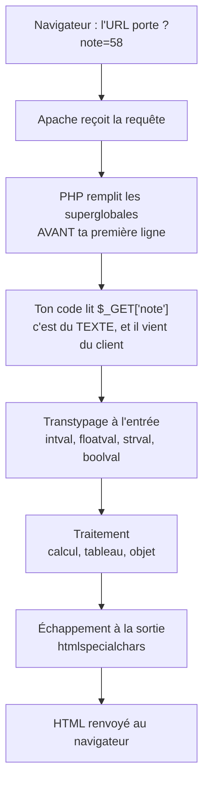

# Superglobales, transtypage, tableaux et classes

## L'idée en une image {diapos="8, 9, 23"}

Imagine un petit théâtre. À l'entrée, un comptoir ; au fond, un vestiaire.

**Le comptoir, ce sont les superglobales.** Avant que la première réplique ne soit dite — avant
que la première ligne de ton code ne s'exécute — un employé a déjà posé sur le comptoir une série
de **fiches** : qui vient d'entrer, par quelle porte, à quelle heure, ce qu'il a déclaré vouloir.
Ces fiches sont lisibles depuis n'importe quelle pièce du bâtiment, sans avoir à les demander à
personne. C'est exactement ce que fait PHP avec `$_GET`, `$_POST`, `$_SERVER` et leurs sœurs : il
les remplit au tout début de la requête, et elles sont visibles partout dans le script.

**Le vestiaire, c'est le tableau PHP.** Tu remets ton manteau, on te donne un **jeton numéroté**.
Ce jeton est une **clé**, pas une place dans la rangée. Si le porteur du jeton 1 récupère son
manteau et s'en va, les autres jetons ne changent pas de numéro : il reste un trou dans la suite
0, 2, 3. Et le prochain manteau ne reçoit pas le jeton 1 laissé libre — il reçoit le suivant
jamais utilisé. C'est, mot pour mot, le comportement de `unset()` en PHP, et c'est la source de la
moitié des surprises de la séance.



**Où l'analogie casse — et il faut le dire, sinon elle enseigne des erreurs.** Trois endroits.

1. **Les fiches ne sont pas remplies par un employé de confiance** : c'est le visiteur qui dicte ce
   qu'on y écrit. Un comptoir d'accueil vérifie une pièce d'identité ; PHP ne vérifie rien.
2. **Le vestiaire ne donne pas « le premier jeton libre »** : PHP prend la plus grande clé entière
   déjà employée et ajoute 1. Après le retrait du jeton 1, le prochain manteau reçoit le 3.
3. **Les fiches sont détruites à la fin du spectacle** : chaque requête reconstruit les
   superglobales à partir de rien, sauf `$_SESSION`, rangée sur le serveur.

## En bref — la marche à suivre {diapos="9, 12, 17-19, 24-31, 36, 42-46"}

:::: marche-a-suivre {titre="Lire une entrée, la convertir, la ranger, l'afficher"}

1. {voir="Les neuf superglobales, et lesquelles serviront"} Décide d'où vient la donnée : `$_GET`
   pour un paramètre d'URL, `$_POST` pour un formulaire, `$_SESSION` pour ce qui doit durer d'une
   page à l'autre.

2. {voie="cours"} {voir="Les neuf superglobales, et lesquelles serviront"} Lis le paramètre
   directement, comme le fait le corrigé de la séance.

   ```php
   $nom = $_GET["nom"];
   ```

3. {voie="moderne"} {voir="Les neuf superglobales, et lesquelles serviront"} Protège la lecture
   contre le paramètre absent.

   ```php
   $nom = $_GET["nom"] ?? "";
   ```

4. {voir="Voir l'intérieur d'un tableau — print_r()"} Quand tu ne sais pas ce que contient une
   superglobale, affiche-la en entier.

   ```php
   print_r($_SERVER);
   ```

5. {voir="Connaître le type — gettype()"} Vérifie le type avec `gettype($nom)` : une valeur reçue
   de l'URL est **toujours** du texte.

6. {voir="Convertir — intval, floatval, strval, boolval"} Convertis avant tout calcul, jamais
   après.

   ```php
   $a = intval($_GET["a"]);
   ```

7. {voie="cours"} {voir="Convertir — intval, floatval, strval, boolval"} Pour une valeur décimale,
   le cours liste `floatval` et `doubleval`.

8. {voie="moderne"} {voir="Convertir — intval, floatval, strval, boolval"} Écris `floatval` :
   `doubleval` n'est qu'un autre nom pour la même fonction.

9. {voir="Créer un tableau — array()"} Crée le tableau avec ses éléments de départ, puis ajoute —
   sans clé pour en laisser PHP générer une, avec crochets nommés pour choisir la tienne.

   ```php
   $saisons = array("Été", "Automne", "Hiver", "Printemps");
   ```

10. {voir="Supprimer — unset(), et le trou qu'il laisse"} Supprime avec `unset()`, en sachant que
    les clés restantes ne sont **pas** renumérotées.

    ```php
    unset($saisons[1]);
    ```

11. {voir="Compter — count()"} Compte les éléments avec `count()`, **une seule fois**, avant la
    boucle.

12. {voir="Parcourir — for, array_keys(), foreach"} Parcours avec `foreach` dès que les clés ne
    sont pas des entiers continus.

    ```php
    foreach ($saisons as $cle => $valeur) { echo "$cle : $valeur<br>"; }
    ```

13. {voir="Déclarer une classe, ses attributs, ses méthodes"} Déclare la classe, ses attributs et
    ses méthodes, chacun précédé de sa visibilité.

14. {voir="Le constructeur et l'instanciation"} Écris le constructeur `__construct()` et affecte
    les attributs avec la **flèche**, jamais avec un point.

    ```php
    public function __construct($p, $n) { $this->prenom = $p; $this->nom = $n; }
    ```

15. {voir="Le constructeur et l'instanciation"} Instancie avec `new Etudiant(…)`, puis appelle une
    méthode sur l'objet obtenu.

16. {voir="Exemple complet"} Échappe à la sortie **tout** ce qui vient du client, avec
    `htmlspecialchars()`.

17. {voir="À toi de jouer"} Fais les **7** exercices de la séance : ils réutilisent exactement ces
    gestes.

::::

## Ce que la séance 2 enseigne, et ce que cette leçon ajoute {diapos="3, 6"}

::: cours {diapos="3, 6"}
La séance 2 s'ouvre sur un rappel : PHP est un langage **serveur**, il sait entre autres accéder
aux bases de données, et on le programme dans l'environnement WAMP. Le programme annoncé de la
séance tient en quatre points — les variables superglobales, le transtypage, les tableaux, les
classes — puis une conclusion.
:::

Cette leçon suit ce plan dans l'ordre, sans en dévier. Elle ajoute trois choses que la séance ne
peut pas contenir, parce qu'un cours est **sommaire par nature** :

- ce que la sortie affichée en classe montre sans que la diapositive le commente (les clés d'un
  tableau après `unset()`, par exemple) ;
- l'écart entre la méthode enseignée et ce qu'on écrirait aujourd'hui en production, toujours
  signalé comme tel ;
- l'échappement à la sortie, absent du corrigé officiel de la séance et pourtant indispensable dès
  qu'une donnée du client repart dans la page.

::: complement
**Ce qui n'est PAS dans la séance 2, et qu'il ne faut donc pas réviser ici** : le gabarit `<form>`
lui-même, la comparaison GET contre POST, la validation par `filter_var`, le téléversement de
fichiers, le tri de tableaux, l'héritage, les interfaces et les exceptions. Le cours garde la
programmation orientée objet en détail pour la séance 4, et la bibliothèque standard pour la
séance 3.
:::

## Les variables superglobales {diapos="7, 8"}

::: cours {diapos="8"}
Les variables superglobales sont des **tableaux qui peuvent être accédés de n'importe où dans ton
code**. Ce sont des tableaux générés par PHP, qui fournissent des informations diverses : ce qui
vient d'un formulaire, les fichiers envoyés au serveur, les informations de session, les
propriétés du serveur (adresse IP, nom de domaine, etc.).
:::

Deux mots méritent d'être posés avant d'aller plus loin.

**Portée** : c'est la zone du programme où une variable existe. En PHP, une variable déclarée hors
d'une fonction n'est **pas** visible à l'intérieur de cette fonction — il faudrait écrire `global`
pour l'y faire entrer. Les superglobales sont la seule famille de variables qui échappe à cette
règle : elles sont visibles partout, sans rien écrire. C'est de là que vient le préfixe *super*.

**Requête** : c'est un aller-retour entre le navigateur et le serveur. Les superglobales sont
remplies **au début de chaque requête** et détruites à la fin. Rien de ce que tu y écris ne
survit à la page suivante — sauf dans `$_SESSION`, dont le contenu est rangé sur le serveur.

### Les neuf superglobales, et lesquelles serviront {diapos="9, 14"}

::: cours {diapos="9, 14"}
Le cours en liste neuf : `$GLOBALS` (les variables globales), `$_SERVER` (des informations sur le
serveur : adresse, IP, méthode HTTP), `$_REQUEST` (des informations sur `$_GET`, `$_POST` et
`$_COOKIE`), `$_POST` (les informations client envoyées en POST), `$_GET` (les informations client
envoyées en GET), `$_FILES` (les fichiers téléversés), `$_ENV` (l'environnement du serveur),
`$_COOKIE` (les cookies du site) et `$_SESSION` (la session utilisateur). Il annonce que la
session emploiera particulièrement `$_GET`, `$_POST` et `$_SESSION`.
:::

Ce que la liste ne dit pas, et qui décide de tout le reste du cours, c'est **le degré de confiance**
qu'on peut accorder à chacune.

| Superglobale | Contenu | Confiance |
|---|---|---|
| `$_GET` | les paramètres qui suivent le `?` dans l'URL | **aucune** |
| `$_POST` | le corps d'une requête POST, typiquement un formulaire | **aucune** |
| `$_REQUEST` | la fusion de `$_GET`, `$_POST` et `$_COOKIE` | **aucune**, et ambiguë |
| `$_COOKIE` | les cookies renvoyés par le navigateur | **aucune** — modifiables côté client |
| `$_FILES` | les métadonnées des fichiers téléversés | le nom et le type sont **déclarés par le client** |
| `$_SESSION` | les données de session rangées sur le serveur | de confiance, si la session est bien gérée |
| `$_SERVER` | l'environnement de la requête et du serveur | mixte, voir plus bas |
| `$_ENV` | les variables d'environnement du processus | de confiance |
| `$GLOBALS` | les variables de portée globale du script | interne |

**« Aucune confiance » n'est pas une figure de style.** Un `<select>` qui n'offre que trois choix,
un `maxlength="20"` sur un champ texte, un bouton désactivé : tout cela vit dans le navigateur, et
le navigateur appartient au visiteur. N'importe qui peut fabriquer la requête à la main. La règle
tient en une phrase : **une valeur venue d'une superglobale d'entrée est une proposition, jamais
un fait.**

::: correction-du-cours {source="Manuel PHP — request_order et variables_order (php.net/manual/fr/ini.core.php)" diapos="9"}
Le cours décrit `$_REQUEST` comme « contenant `$_GET`, `$_POST` et `$_COOKIE` ». C'est vrai par
défaut, mais **la composition exacte est fixée par la directive `request_order` du `php.ini`** :
le même code peut donc se comporter différemment d'un serveur à l'autre. Pire, les trois sources
n'ont pas le même statut — un cookie déposé par un attaquant peut, selon la configuration, écraser
un paramètre POST légitime. À l'examen, réponds ce que dit le cours ; en production, lis
`$_GET["x"]` ou `$_POST["x"]` explicitement, pour que le code dise d'où vient la donnée.
:::

Il y a donc **trois façons** de lire un paramètre reçu dans l'URL, et elles mènent au même
résultat par trois chemins différents.

1. **`$_REQUEST["nom"]`**, la variable fourre-tout du cours : la plus courte à écrire, et celle
   dont on ne peut pas dire, en lisant le code, par quel canal la donnée est arrivée.
2. **`$_GET["nom"]`**, la lecture explicite : le canal est nommé, donc il ne peut pas être
   détourné. Combinée à l'opérateur `??` (« si cette clé n'existe pas, prends plutôt cette
   valeur-là »), elle évite l'avertissement `Undefined array key` que PHP 8 émet sur un paramètre
   absent.
3. **`filter_input(INPUT_GET, "nom", …)`**, la lecture filtrée : elle lit **et** valide en un seul
   geste, et rend `false` quand la valeur ne convient pas. C'est de la matière de la séance 3 ;
   elle est nommée ici pour que tu saches qu'elle existe.

:::: methodes
::: methode {libelle="$_REQUEST, la voie du cours"}
Lire sans nommer le canal.

```php
$nom = $_REQUEST["nom"];
```
:::
::: methode {libelle="$_GET explicite, avec valeur de repli" defaut}
Nommer le canal, et prévoir l'absence du paramètre.

```php
$nom = $_GET["nom"] ?? "";
```
:::
::: methode {libelle="filter_input, lire et valider"}
Lire et valider d'un seul geste.

```php
$age = filter_input(INPUT_GET, "age", FILTER_VALIDATE_INT);
```
:::
::::

::: exercice-du-cours {seance="2" ref="2"}
Une seule ligne suffit pour faire ce que demande l'énoncé. Écris-la d'abord telle qu'elle vient,
puis relis la section « Exemple complet » : ce que tu viens d'écrire est le patron exact d'une
faille XSS réfléchie, et la correction tient en un appel de fonction.
:::

### Lire $_SERVER — un premier exemple {diapos="10, 11"}

`$_SERVER` décrit **la requête en cours et la machine qui la sert**. Les clés employées dans le
cours et ses exercices :

| Clé | Signification |
|---|---|
| `SERVER_ADDR` | l'adresse IP du serveur |
| `SERVER_PORT` | le port sur lequel le serveur écoute |
| `SERVER_NAME` | le nom d'hôte configuré pour le site |
| `DOCUMENT_ROOT` | la racine web sur le disque |
| `REQUEST_METHOD` | `GET`, `POST`… |
| `REMOTE_ADDR` | l'adresse IP du client |

::: cours {diapos="10, 11"}
Le cours projette une page qui affiche quatre de ces valeurs, chacune sous son titre, et prend
soin de préciser que l'adresse **`::1`** obtenue en local est l'adresse IPv6 de la machine
elle-même — **l'équivalent de `127.0.0.1`**.
:::

```php
<h3>Adresse du serveur</h3>
<?php echo $_SERVER["SERVER_ADDR"] . "<br>"; ?>

<h3>Répertoire racine</h3>
<?php echo $_SERVER["DOCUMENT_ROOT"] . "<br>"; ?>
```

Les deux autres titres de la page du cours, « Port du serveur » et « Nom du serveur », suivent le
même patron avec `SERVER_PORT` et `SERVER_NAME`.

**Ce que montre la capture du cours, et ce que tu verras, toi.** La sortie projetée à la
diapositive 11 a été prise sous **XAMPP**, avec Apache sur le port 8080 : elle affiche `::1`,
`8080`, `localhost` et `C:/xampp/htdocs`. Ne t'attends pas à retrouver ces valeurs à l'identique.
Sur ta machine, `SERVER_NAME` vaudra bien `localhost`, mais `DOCUMENT_ROOT` sera le dossier `www`
de **ton** installation de WAMP, et `SERVER_PORT` le port sur lequel **ton** Apache écoute — 80 par
défaut, 8080 si tu as dû le déplacer (voir la règle du port au module 01). La valeur juste est celle
que ta propre page affiche : c'est précisément à ça que sert cet exemple.

::: complement
**Toutes les clés de `$_SERVER` ne se valent pas.** Celles qui commencent par `HTTP_` —
`HTTP_USER_AGENT`, `HTTP_REFERER`, `HTTP_HOST` — sont des **en-têtes envoyés par le client** : une
seule commande suffit à leur faire dire n'importe quoi. Ne fonde jamais une décision de sécurité
dessus. Et `print_r($_SERVER)` sur une page publique révèle les chemins absolus, la version de PHP
et parfois des variables d'environnement : excellent en développement, à retirer avant toute mise
en ligne.
:::

::: exercice-du-cours {seance="2" ref="1"}
Les quatre valeurs de l'exemple ci-dessus, rangées dans un tableau HTML de deux colonnes. Le plus
propre est de construire d'abord un tableau PHP associatif `libellé => valeur`, puis de le
parcourir avec `foreach` pour émettre une ligne `<tr>` par entrée — tu réutilises alors la section
sur les tableaux plus bas. Aucun corrigé officiel n'existe pour cet exercice : le fichier remis
par l'enseignant est vide.
:::

### Voir l'intérieur d'un tableau — print_r() {diapos="12, 13"}

::: cours {diapos="12, 13"}
Pour voir la **totalité** des informations contenues dans une variable, le cours propose la
fonction `print_r()`. Le résultat affiché est une représentation visuelle des associations
clé-valeur du tableau ou de l'objet.
:::

```php
<?php
$etudiant = array("prenom" => "Marine", "nom" => "Cordonier", "note" => 87);
print_r($etudiant);
```

```text
Array ( [prenom] => Marine [nom] => Cordonier [note] => 87 )
```

C'est l'outil de débogage le plus rentable de la séance : il répond à la question « qu'est-ce que
cette variable contient **vraiment** ? » sans supposition. Enveloppe l'appel dans des balises
`<pre>` pour que le navigateur respecte les retours à la ligne.

::: complement
`var_dump()` fait la même chose **et donne les types** : `string(6) "Marine"` plutôt que `Marine`.
Quand la question est « pourquoi ma comparaison échoue-t-elle ? », c'est `var_dump()` qu'il faut,
parce que la réponse est presque toujours qu'un nombre est en réalité une chaîne.
:::

## Le transtypage {diapos="15, 16"}

::: cours {diapos="16"}
En PHP, comme dans les autres langages, on peut **convertir des données d'un type à l'autre** :
du texte vers une valeur numérique, une valeur décimale vers un entier, une valeur numérique vers
du texte, et ainsi de suite.
:::

Le mot **transtypage** (en anglais *casting*) désigne cette conversion. Il faut savoir pourquoi
elle est nécessaire ici plutôt qu'ailleurs : **tout ce qui arrive par HTTP est du texte.** Un
`?a=12` ne transporte pas le nombre douze, il transporte les deux caractères `1` et `2`. PHP est
conciliant — il convertira souvent tout seul, au moment du calcul — mais cette conversion
implicite est justement ce qui rend certains bogues indéchiffrables. Convertir explicitement, à
l'entrée, coûte un appel de fonction et supprime la catégorie entière de problèmes.

### Connaître le type — gettype() {diapos="17"}

::: cours {diapos="17"}
Pour connaître le type d'une variable, le cours emploie la fonction `gettype()`.
:::

```php
<?php
echo gettype(1);          // integer
echo gettype("Banane");   // string
echo gettype(true);       // boolean
```

Remarque le vocabulaire : `gettype()` répond `integer` et `boolean`, alors que les types du
langage s'écrivent `int` et `bool`. Ce ne sont donc **pas** les noms de types du langage, mais des
libellés hérités ; ne compare jamais le retour de `gettype()` à la chaîne `"int"`.

::: complement
`get_debug_type()`, arrivé avec PHP 8.0, retourne les vrais noms du langage — `int`, `bool`,
`string`, et le nom complet de la classe pour un objet. C'est celle qu'on emploie en 2026 quand on
veut afficher un type dans un message d'erreur.
:::

### Convertir — intval, floatval, strval, boolval {diapos="18, 19"}

::: cours {diapos="18, 19"}
Le cours liste cinq fonctions de conversion : `intval` (vers une valeur entière), `floatval` (vers
une valeur décimale), `doubleval` (vers une valeur décimale à double précision), `strval` (vers du
texte) et `boolval` (vers un booléen).
:::

```php
<?php
$valeur = "123.4";
echo intval($valeur);     // 123   — la partie décimale est PERDUE
echo floatval($valeur);   // 123.4
echo strval(42.7);        // "42.7"
echo boolval("0");        // faux  — "0", "", 0, 0.0 et null sont considérés faux
```

Deux pièges tiennent dans ces quatre lignes. Le premier : `intval("123.4")` ne fait pas d'arrondi,
il **tronque**. Le second : `boolval("0")` est **faux**, alors que `boolval("0.0")` est vrai —
seule la chaîne `"0"` exactement compte comme fausse. Une page où l'utilisateur peut légitimement
saisir zéro doit donc éviter les tests de vérité et comparer explicitement.

::: correction-du-cours {source="Manuel PHP, page doubleval : « Alias de floatval() » (https://www.php.net/manual/fr/function.doubleval.php), consulté le 2026-09-16 ; comportement mesuré sur PHP 8.5.10 le 2026-09-16" diapos="18"}
Le cours présente `doubleval` comme convertissant « en valeur décimale à double précision », comme
si elle faisait quelque chose de plus que `floatval`. En réalité, la page du manuel consacrée à
`doubleval` tient en une ligne : **« Alias de floatval() »**. Les deux fonctions font exactement la
même chose — `doubleval("3.5abc")` rend `float(3.5)`, comme `floatval`. PHP n'a pas de type `double`
distinct : son type `float` est déjà en double précision.
:::

Une trace de l'ancien nom subsiste pourtant, et elle surprend : `gettype(1.5)` rend la chaîne
**`"double"`**, pas `"float"`. C'est un nom historique conservé pour la compatibilité ; le type est
bien `float`, et c'est ce nom qu'emploient les déclarations de type (`function f(float $x)`). À
l'examen, la liste du cours reste la liste du cours ; dans ton code, écris `floatval`, qui porte le
nom du type réel.


::: complement
`intval()` **convertit, il ne valide pas** : `intval("abc")` rend `0` sans rien signaler, et
`intval("12abc")` rend `12`. Une saisie fautive devient donc indiscernable d'un zéro légitime.
Quand tu veux pouvoir **refuser** une entrée plutôt que la deviner, c'est
`filter_var($_GET["a"] ?? "", FILTER_VALIDATE_INT)` qu'il faut : elle rend `false` sur une entrée
non numérique. Compare alors avec `===`, jamais avec `==`, parce que `false == 0` est vrai.
:::

::: exercice-du-cours {seance="2" ref="3"}
Deux lectures dans `$_GET`, deux `intval()`, un `echo` de la somme. Le corrigé de l'enseignant
documente l'URL d'appel en commentaire de tête — reprends ce réflexe : une page qui attend des
paramètres est inutilisable sans cette ligne.
:::

::: exercice-du-cours {seance="2" ref="4"}
Même entrée que l'exercice précédent, un `if` de plus. La fonction `max()` de la bibliothèque
standard ferait le travail en un appel ; écris les deux versions et compare-les.
:::

::: exercice-du-cours {seance="2" ref="7"}
Trois paramètres à lire et à convertir : deux entiers et un décimal. Attention au type de la
variable qui accumule — si tu l'initialises par `intval()` puis que tu la multiplies par
`(1 + $interet)`, elle devient un `float` dès la première itération. Le résultat est juste, mais
la variable a changé de type en cours de route, ce que la séance 1 déconseillait explicitement.
:::

## Les tableaux {diapos="21, 22"}

::: cours {diapos="22"}
La séance 1 avait fait une brève introduction aux tableaux ; la séance 2 les reprend en détail. Le
programme annoncé : la syntaxe de création, l'ajout d'éléments, la suppression d'un élément, le
nombre d'éléments, et l'itération à travers un tableau.
:::

### Un tableau PHP est une table associative ordonnée {diapos="23"}

::: cours {diapos="23"}
Le cours pose le bon cadre, et c'est la phrase la plus importante de la séance : **PHP n'a pas de
tableau au même sens que d'autres langages comme C#**, où les valeurs sont indexées de façon
successive. Il s'agit en réalité d'une **table associative ordonnée**, similaire au dictionnaire
de C#, qu'on peut en plus parcourir dans l'ordre. Concrètement, c'est un ensemble de paires
« clé vers valeur ». Si aucune clé n'est fournie, une valeur numérique est associée — mais il
s'agit de **sa clé, pas nécessairement de sa position**.
:::

Reprends le vestiaire. Un tableau C# est une **rangée de crochets numérotés** : le crochet 2 est
physiquement le troisième, et il existe forcément si le crochet 3 existe. Un tableau PHP est un
**registre de jetons** : chaque manteau a son jeton, les jetons sont rangés dans l'ordre où ils
ont été émis, et rien ne garantit que les numéros se suivent.

Cette différence n'est pas une curiosité : elle explique à elle seule les trois comportements
surprenants des sections suivantes — la coexistence de clés numériques et textuelles, le trou
laissé par `unset()`, et l'échec d'une boucle `for` sur un tableau troué.

### Créer un tableau — array() {diapos="24"}

::: cours {diapos="24"}
Un tableau peut être créé avec la fonction `array()` quand on veut lui donner un certain nombre
d'éléments initiaux. Le cours note qu'on peut aussi, comme pour un dictionnaire en C#, ajouter les
éléments un par un.
:::

```php
<?php
$tableau = array("Été", "Automne", "Hiver", "Printemps");
echo $tableau[0];   // Été
echo $tableau[2];   // Hiver
```

::: complement
La **syntaxe courte** `["Été", "Automne", "Hiver", "Printemps"]` fait exactement la même chose,
existe depuis PHP 5.4 et est la forme employée partout aujourd'hui. Les deux sont acceptées ; le
cours et son corrigé emploient `array()`, tu le liras donc souvent sous cette forme à l'examen.
:::

Un tableau dont tu choisis les clés s'écrit avec la même fonction, en nommant chaque clé :

```php
<?php
$etudiant = array("prenom" => "Marine", "nom" => "Cordonier", "note" => 87);
echo $etudiant["nom"];   // Cordonier
```

### Ajouter un élément, avec ou sans clé {diapos="25-28"}

::: cours {diapos="25, 26"}
Pour ajouter un élément, il suffit de **ne pas préciser de clé** : `$tableau[] = "Nouvel élément";`
— PHP s'occupe de générer une clé numérique. Si on veut au contraire choisir la clé, on la fournit
entre les crochets : `$tableau[<cle>] = "Nouvel élément";`.
:::

Le cours construit ensuite, volontairement, un tableau aux clés **mixtes** — des clés textuelles et
des clés générées, dans le même tableau — et pose la question à la classe : est-ce que ça produit
une erreur ?

```php
<?php
$eleves["ALEX"] = "Alexandre";
$eleves[]       = "Jonathan";
$eleves["MAXI"] = "Maxime";
$eleves["OLIV"] = "Olivier";
$eleves[]       = "Marie";
$eleves[]       = "Robert";

print_r($eleves);
echo $eleves["MAXI"];   // Maxime
echo $eleves[1];        // Marie
```

```text
Array ( [ALEX] => Alexandre [0] => Jonathan [MAXI] => Maxime [OLIV] => Olivier [1] => Marie [2] => Robert )
Maxime
Marie
```

::: cours {diapos="27, 28"}
Réponse de l'enseignant : **pas d'erreur**, les deux sortes de clés coexistent très bien. Et le
verdict, à retenir tel quel — « **est-ce que ça marche : oui ; est-ce que c'est recommandé :
discutable** ».
:::

Lis maintenant la sortie de près, parce qu'elle démontre la phrase de la diapositive 23 mieux
qu'aucune explication. **`$eleves[1]` vaut `"Marie"`, la cinquième valeur insérée.** Les clés
générées automatiquement ignorent complètement les clés textuelles : PHP prend la plus grande clé
**entière** déjà présente et ajoute 1, et `"ALEX"` n'est pas un entier. « Clé, pas position »
prend ici tout son sens — `$eleves[1]` n'est ni le deuxième élément, ni l'avant-dernier.

### Supprimer — unset(), et le trou qu'il laisse {diapos="29, 30"}

::: cours {diapos="29, 30"}
Pour supprimer un élément d'un tableau, on emploie la fonction `unset()`, qui reçoit en paramètre
l'élément à retirer. Le cours montre la sortie et conclut : les éléments ont bien été retirés du
tableau.
:::

Ce que la diapositive ne commente pas, mais que sa propre sortie affiche, est le point le plus
piégeant de la séance — et le corrigé officiel de l'exercice 5 le remet sous les yeux :

```php
<?php
$employe = array("Cordonier, Marine", "Poulin, Jean", "Rodriguez, Michel");
unset($employe[1]);
$employe[] = "Tremblay, Lucie";
$employe[] = "Caron, Lucien";
print_r($employe);
```

```text
Array ( [0] => Cordonier, Marine [2] => Rodriguez, Michel [3] => Tremblay, Lucie [4] => Caron, Lucien )
```

Deux faits, tous deux visibles à l'écran. **Un : `unset()` ne renumérote pas.** La clé 1 a disparu
et les clés 0 et 2 sont restées telles quelles. **Deux : le compteur interne ne recule pas.** Les
deux ajouts sans clé prennent 3 et 4, jamais la place laissée libre.

Conséquence immédiate, et c'est le bogue classique : une boucle `for` qui va de 0 à `count($tab)`
sur ce tableau lit `$employe[1]`, qui n'existe plus — `Warning: Undefined array key 1` — et
s'arrête avant d'avoir atteint la clé 4, parce que `count()` vaut 4 alors que la plus grande clé
est 4 elle aussi.

::: complement
Deux réponses, selon ce que tu veux. Si tu veux une **vraie liste** numérotée de 0 à n-1, passe le
tableau dans `array_values($employe)` juste après le `unset()` — c'est aussi ce qu'il faut faire
avant un `json_encode()`, sinon PHP produit un objet `{"0":…,"2":…}` plutôt qu'un tableau JSON. Si
tu veux simplement parcourir, emploie `foreach`, qui est insensible aux trous.
:::

::: exercice-du-cours {seance="2" ref="5"}
C'est exactement le code ci-dessus. Fais-le d'abord sans regarder la sortie attendue, puis
`print_r()` le tableau final : les clés que tu obtiens sont le moment à retenir de la séance. Le
corrigé retire l'élément par son indice, parce qu'il sait où il est ; la forme robuste cherche
d'abord la valeur avec `array_search($valeur, $tableau, true)`, et teste le retour avec
`!== false` pour distinguer « trouvé à l'indice 0 » de « pas trouvé ».
:::

### Compter — count() {diapos="31"}

::: cours {diapos="31"}
Pour connaître le nombre d'éléments d'un tableau, le cours emploie `count()`, à qui l'on passe le
tableau en paramètre.
:::

```php
<?php
$employe = array("Cordonier, Marine", "Rodriguez, Michel", "Tremblay, Lucie");
echo count($employe);   // 3
```

`count()` compte des **éléments**, pas des clés potentielles. Sur le tableau troué de la section
précédente, il rend 4 alors que la plus grande clé est 4 : c'est bien pourquoi on ne peut pas s'en
servir comme borne de boucle sur un tableau dont les clés ont des trous.

::: complement
Depuis PHP 8.0, `count(null)` lève une erreur fatale (`TypeError`) au lieu du simple avertissement
d'autrefois. Quand le tableau peut ne pas exister, écris `count($tab ?? [])`.
:::

### Parcourir — for, array_keys(), foreach {diapos="32-37"}

::: cours {diapos="32, 33, 34"}
Le cours annonce deux approches — la boucle `for` et la boucle `foreach` — puis précise la limite
de la première : **`for` ne permet de parcourir qu'un tableau dont les clés sont numériques et
continues**. Il ajoute une recommandation exacte : compter le nombre d'éléments **une seule fois,
avant** la boucle, pour des raisons de performance. Pour contourner la limitation, il donne deux
méthodes : obtenir la liste des clés avec `array_keys()`, ou employer `foreach`.
:::

Les trois chemins mènent au même résultat — visiter chaque élément une fois — mais ils ne
supportent pas les mêmes tableaux.

**La boucle `for`** demande que les clés soient `0, 1, 2 … n-1` sans trou. Elle compte d'abord,
puis lit `$tableau[$i]` à chaque tour. Sur un tableau troué ou à clés textuelles, elle échoue.

**`array_keys()`** rend un **nouveau tableau** contenant les clés du premier, dans l'ordre. Comme
ce tableau de clés est, lui, numéroté de 0 à n-1, une boucle `for` fonctionne dessus ; on s'en sert
ensuite pour lire la valeur : `$tableau[$cles[$x]]`. C'est le contournement du cours.

**`foreach`** parcourt directement les éléments, **peu importe le type d'index**. Sa forme à deux
variables, `foreach ($tableau as $cle => $valeur)`, donne la clé et la valeur à chaque tour. C'est
la réponse correcte dans tous les cas, et celle qu'on écrit par défaut.

:::: methodes
::: methode {libelle="for, sur des clés continues"}
Compter une fois, puis indexer.

```php
$nombre = count($eleves);
for ($x = 0; $x < $nombre; $x++) { echo $eleves[$x]; }
```
:::
::: methode {libelle="array_keys, pour contourner"}
Passer par la liste des clés.

```php
$cles = array_keys($eleves);
for ($x = 0; $x < count($cles); $x++) { echo $eleves[$cles[$x]]; }
```
:::
::: methode {libelle="foreach, quelles que soient les clés" defaut}
Parcourir les éléments directement.

```php
foreach ($eleves as $cle => $valeur) { echo "$cle : $valeur<br>"; }
```
:::
::::

::: complement
Quand tu veux **modifier** les valeurs pendant le parcours, `foreach ($tab as &$valeur)` te donne
une référence plutôt qu'une copie. Il faut alors écrire `unset($valeur);` juste après la boucle :
sans cela, la référence survit et le prochain `foreach` corrompt silencieusement la dernière case
du tableau. C'est l'un des bogues les plus déroutants de PHP.
:::

## Les classes {diapos="40, 41"}

::: cours {diapos="41"}
Comme dans les autres langages, les classes permettent de **définir des structures de données qui
représentent des éléments du logiciel** : organisation logique du code, ou représentation des
concepts du domaine. La section montre comment les utiliser en PHP.
:::

Un mot de vocabulaire avant d'écrire une ligne. Une **classe** est un plan ; un **objet** est ce
qu'on construit à partir du plan. Le plan « maison » décrit une porte et trois fenêtres ; chaque
maison bâtie a **sa** porte et **ses** fenêtres, qu'on peut peindre sans repeindre les autres.
Écrire `class Etudiant` ne crée aucun étudiant ; c'est `new Etudiant(...)` qui en crée un.

### Déclarer une classe, ses attributs, ses méthodes {diapos="42-44"}

::: cours {diapos="42, 43, 44"}
Les classes regroupent des **attributs** (des variables) et des **méthodes** (des fonctions) qui
leur appartiennent. Une classe se déclare par `class <nom> { }`. Un attribut est une variable de
classe associée à l'instance : `public $nom = "Alice";`. Une méthode est une fonction définie dans
la classe pour être utilisée depuis un objet instancié, et elle accède aux attributs par `$this`.
:::

```php
<?php
class Personne {
    private $nom = "Alice";

    public function afficherNom() {
        echo $this->nom;
    }
}
```

Trois choses à lire dans ces six lignes.

**`private` et `public` sont des modificateurs de visibilité.** `public` veut dire « accessible de
partout, y compris de l'extérieur de la classe » ; `private` veut dire « accessible uniquement
depuis l'intérieur de cette classe ». Mettre un attribut en `private` empêche qu'on écrive
`$personne->nom = "n'importe quoi"` depuis l'extérieur, et force le passage par les méthodes — qui
peuvent, elles, vérifier.

**`$this` désigne l'objet courant**, celui sur lequel la méthode a été appelée. À l'intérieur
d'une méthode, `$this->nom` veut dire « l'attribut `nom` de cet objet-ci ».

**La flèche `->` est l'opérateur d'accès aux membres**, et il n'y a **pas** de `$` après elle :
`$this->nom`, jamais `$this->$nom`. La seconde écriture est légale mais signifie tout autre chose
— elle lit l'attribut dont le *nom* est contenu dans la variable `$nom`.

::: complement
Le cours dit « attribut », et c'est le vocabulaire UML. Le manuel PHP dit **propriété**. Les deux
désignent la même chose ici ; mais en PHP 8 le mot « attribut » a été pris par `#[Attribute]`, qui
désigne des métadonnées attachées au code. Dans un contexte PHP, préfère « propriété ».
:::

### Le constructeur et l'instanciation {diapos="45-47"}

::: cours {diapos="45, 46"}
Comme en C#, on emploie un **constructeur** pour créer des instances de classe. Le cours en donne
la syntaxe : `public function __construct(<param>) { … }`. Pour créer une instance (un objet), on
emploie l'opérateur **`new`** suivi d'un appel au constructeur :
`$variable = new MonObjet($param1, $param2);`.
:::

Le constructeur est une méthode **au nom imposé** : `__construct`, avec deux traits de soulignement
au début. PHP l'appelle automatiquement au moment du `new`, et lui passe les arguments qu'on a
écrits entre les parenthèses. Son rôle est de remplir les attributs pour que l'objet soit
utilisable dès sa naissance.

::: correction-du-cours {source="Manuel PHP — Les bases de la POO, le mot-clé $this et l'opérateur -> (php.net/manual/fr/language.oop5.basic.php)" diapos="45"}
La diapositive écrit le corps du constructeur ainsi : `$this.<attribute> = <param>`. **C'est une
faute de syntaxe PHP, et elle se recopie telle quelle.** En PHP, le point `.` est l'opérateur de
**concaténation de chaînes** ; l'accès à un membre s'écrit avec la flèche, `$this->attribut`. Le
réflexe vient de C# et de Java, où le point joue les deux rôles. La diapositive 44, elle, écrit
correctement `$this->nom` — c'est cette forme-là qu'il faut retenir, à l'examen comme en
production.
:::


Voici l'exemple complet que le cours projette, dans sa forme de référence — sans typage et sans
`declare`, comme il l'écrit :

```php
<?php
class Etudiant {
    public $nom = "";
    public $prenom = "";

    public function __construct($p, $n) {
        $this->prenom = $p;
        $this->nom = $n;
    }

    public function afficherNomComplet() {
        echo $this->nom . ", " . $this->prenom;
    }
}

$e = new Etudiant("Alexandre", "Mageau");
$e->afficherNomComplet();   // Mageau, Alexandre
```

::: cours {diapos="47"}
Relis l'ordre des paramètres : le constructeur reçoit `($p, $n)`, donc **le prénom d'abord**.
L'appel `new Etudiant("Alexandre", "Mageau")` est cohérent, et `afficherNomComplet()` imprime
`nom, prénom`. C'est précisément le genre d'inversion qu'un énoncé d'examen exploite : vérifie
l'ordre du constructeur avant de répondre.
:::

::: complement
**L'écriture 2026 de la même classe** tient en trois lignes, grâce à la *promotion de propriétés*
de PHP 8.0 : les paramètres du constructeur, précédés de leur visibilité, deviennent directement
les propriétés de l'objet, et `readonly` (PHP 8.1) les rend assignables une seule fois. Rien de
cela n'est exigible : le cours enseigne la forme longue, et c'est elle qui sera évaluée.
:::

::: exercice-du-cours {seance="2" ref="6"}
Trois attributs privés, un constructeur, trois accesseurs publics. Le point qui compte : les deux
fonctions de traitement sont **hors de la classe** — l'énoncé l'exige. Elles reçoivent un tableau
d'objets et le parcourent en `foreach ($tableau as $n) { $n->getNote(); }`. Attention à la moyenne
sur un tableau vide : `$total / count($tableau)` lève une `DivisionByZeroError` fatale en PHP 8,
alors teste le cas avant de diviser.
:::

::: correction-du-cours {source="corrige_php_cours02.zip — exercice6.php, corrigé officiel de la séance 2, relevé le 2026-09-14"}
L'énoncé demande une fonction `AfficherEtudiantEnEchec()` qui **retourne un tableau de noms**. Le
corrigé officiel, lui, **affiche** les noms et ne retourne rien, puis l'appelle sous `echo` — on
fait donc `echo` sur `null`. Sans conséquence visible à l'écran, mais le nom de la fonction et son
usage se contredisent. La forme à préférer sépare les deux rôles : la fonction **retourne**
(`return $echecs;`), l'appelant **affiche** (`echo implode(", ", $echecs);`). La fonction devient
alors testable et réutilisable. Suis l'énoncé, qui est la consigne évaluée.
:::

### Le quiz du cours — et la réponse à nuancer {diapos="48-53"}

::: cours {diapos="48-53"}
La séance se termine par trois questions. **Comment doit s'appeler le constructeur ?** Réponse :
`__construct()`. **Vrai ou faux : les attributs et fonctions ont besoin d'un modificateur de
visibilité (par exemple `public`) ?** Réponse du cours : **oui**. **Quelle est la variable
utilisable pour référencer l'objet qui a appelé la fonction, en quatre lettres ?** Réponse :
`$this`.
:::

Les première et troisième réponses sont exactes et sans nuance. La deuxième demande une précision,
parce qu'elle est vraie pour une moitié de la question seulement.

::: correction-du-cours {source="Manuel PHP — Visibilité (https://www.php.net/manual/fr/language.oop5.visibility.php), consulté le 2026-09-16 ; comportement mesuré sur PHP 8.5.10 le 2026-09-16 (php -l, ReflectionMethod::isPublic et ReflectionProperty::isPublic)" diapos="50, 51"}
La réponse « oui » est **juste pour les propriétés, inexacte pour les méthodes**. Une propriété
déclarée **sans rien** devant — `$nom;` seul dans le corps de la classe — est une erreur de
syntaxe : PHP 8.5.10 répond `Parse error: syntax error, unexpected variable "$nom", expecting "function" in <fichier>.php on line 2`
(avec `php -l`, sur une classe écrite `class B { $nom; }`). Il lui faut au moins un
mot-clé : `public`, `private`, `protected`, ou l'ancien `var` hérité de PHP 4, qui reste valide
et vaut `public`. Une **méthode**, en revanche, peut se déclarer avec le seul mot-clé `function` :
le code est valide, et la méthode vaut alors `public`.

La nuance complète, pour qui lit du code existant : ce n'est pas un modificateur de **visibilité**
que la propriété exige, c'est un modificateur quelconque. `var $nom;`, `static $nom;` ou
`readonly int $nom;` sont acceptés tels quels, et la propriété vaut alors `public`. `readonly`
exige en plus un **type** : `readonly $nom;` seul est refusé (« Readonly property B::$nom must
have type »).

La règle d'arbitrage : **à l'examen, donne la réponse du cours** ; et dans ton code, **écris la
visibilité partout de toute façon** — non parce que le langage l'exige, mais parce qu'une méthode
dont la visibilité est implicite oblige chaque lecteur à se souvenir de la valeur par défaut.
:::


## Exemple simple {diapos="10-13"}

Le plus petit programme qui met en œuvre la séance : lire une superglobale, puis regarder ce
qu'elle contient vraiment.

```php
<?php
// Une seule valeur, lue dans la superglobale du serveur.
echo "Adresse du serveur : " . $_SERVER["SERVER_ADDR"] . "<br>";
echo "Nom du serveur : "     . $_SERVER["SERVER_NAME"] . "<br>";

// Et si tu ne sais pas quelles clés existent : affiche tout.
echo "<pre>";
print_r($_SERVER);
echo "</pre>";
```

Trois observations, dans l'ordre où elles arrivent à l'écran.

1. **`SERVER_ADDR` rend `::1` en local.** Ce n'est pas une erreur : c'est l'écriture IPv6 de
   l'adresse de la machine elle-même, l'équivalent de `127.0.0.1`.
2. **`$_SERVER` est un tableau**, exactement comme ceux de la section précédente. `print_r()`
   l'affiche sous forme de paires clé-valeur, et les balises `<pre>` servent uniquement à ce que
   le navigateur respecte les retours à la ligne.
3. **Aucune de ces valeurs ne vient d'un formulaire**, et pourtant certaines viennent quand même du
   client : tout ce qui commence par `HTTP_` est un en-tête que le navigateur a choisi d'envoyer.

## Exemple complet {diapos="9, 18, 24-31, 42-47"}

Une page de bulletin. Elle reçoit un nom et une note dans l'URL, convertit la note, range
l'étudiant dans un tableau avec deux autres, calcule la moyenne et affiche le tout. Les quatre
notions de la séance y passent.

```php
<?php
class Etudiant {
    private $prenom;
    private $nom;
    private $note;

    public function __construct($p, $n, $no) {
        $this->prenom = $p;
        $this->nom    = $n;
        $this->note   = $no;
    }

    public function getNom()  { return $this->nom; }
    public function getNote() { return $this->note; }
}

function moyenneEtudiant($tableau) {
    if (count($tableau) === 0) { return 0.0; }
    $total = 0;
    foreach ($tableau as $e) { $total += $e->getNote(); }
    return $total / count($tableau);
}
```

La fonction de moyenne est **hors de la classe**, comme l'exige l'exercice 6 : elle reçoit un
tableau d'objets et le parcourt en `foreach`. Le test `count($tableau) === 0` en tête est ce qui
évite la `DivisionByZeroError` sur un tableau vide.

Reste la partie qui touche à l'entrée du client — et c'est là que le corrigé officiel de la séance
laisse une faille. Voici les deux versions côte à côte.

:::: comparaison
::: vulnerable
```php
<?php
// bulletin.php?nom=Tremblay&note=58
$nom  = $_REQUEST["nom"];
$note = $_REQUEST["note"];

$liste = array(new Etudiant("Robert", $nom, $note));
echo "<h1>Bulletin de " . $liste[0]->getNom() . "</h1>";
echo "Moyenne : " . moyenneEtudiant($liste);
```
{lignes="3,4"} Les deux valeurs arrivent par `$_REQUEST`, donc sans qu'on sache de quel canal — URL,
formulaire ou cookie — et sans aucune conversion : `$note` est une **chaîne**, et son contenu a été
choisi par le visiteur.

{lignes="7"} La valeur du client repart dans le HTML sans être transformée. Une URL du type
`?nom=` fait exécuter ce script dans le navigateur de la victime :
c'est une **XSS réfléchie** (*cross-site scripting*, l'injection d'un script dans une page). C'est
le patron exact que porte `exercice2.php` du corrigé officiel de la séance.
:::
::: corrige
```php
<?php
// bulletin.php?nom=Tremblay&note=58
$nom  = $_GET["nom"] ?? "";
$note = intval($_GET["note"] ?? 0);

$liste = array(new Etudiant("Robert", $nom, $note));
echo "<h1>Bulletin de " . htmlspecialchars($liste[0]->getNom(), ENT_QUOTES, "UTF-8") . "</h1>";
echo "Moyenne : " . moyenneEtudiant($liste);
```
{lignes="3,4"} Le canal est nommé — `$_GET` et rien d'autre — l'absence du paramètre est prévue par
`??`, et la note est convertie en entier **avant** d'entrer dans l'objet. Le transtypage à
l'entrée, c'est cette ligne-là.

{lignes="7"} `htmlspecialchars()` transforme `<`, `>`, `&` et les guillemets en entités HTML : le
balisage devient du **texte affiché** au lieu d'être interprété. L'échappement se fait à la
**sortie**, au moment précis où l'on écrit dans la page — pas à l'entrée, parce que la bonne
transformation dépend de la destination.
:::
::::

::: correction-du-cours {source="corrige_php_cours02.zip — exercice2.php, corrigé officiel de la séance 2, relevé le 2026-09-14"}
Le corrigé officiel de l'exercice 2 concatène le paramètre reçu directement dans la sortie, sans
échappement et sans valeur de repli. Deux conséquences : la page est vulnérable au XSS réfléchi, et
un appel sans paramètre produit un `Warning: Undefined array key` en PHP 8. La correction tient en
une ligne — `htmlspecialchars($_GET["nom"] ?? "", ENT_QUOTES, "UTF-8")` — et elle ne change rien à
ce que l'énoncé demande. Rends l'exercice tel que l'énoncé le décrit ; prends l'habitude de
l'échappement dès maintenant, parce qu'à partir de la séance 5 les données viendront d'une base et
la faille deviendra permanente.
:::

Pour appeler la page, dépose `bulletin.php` dans ton dossier de projet sous la racine web de WAMP,
puis ouvre `http://localhost/<nom-du-projet>/bulletin.php?nom=Tremblay&note=58`, en remplaçant
`<nom-du-projet>` par le nom de ce dossier. Si ton Apache écoute sur 8080, ajoute `:8080` après
`localhost` : c'est la règle du port posée au module 01.

## À toi de jouer {hors-cours}

Les **7** exercices de la séance sont placés au fil du texte, dans la section qui enseigne la
notion dont ils ont besoin — c'est là qu'il faut aller les chercher :

- l'exercice 1 sous « Lire $_SERVER — un premier exemple » ;
- l'exercice 2 sous « Les neuf superglobales, et lesquelles serviront » ;
- les exercices 3, 4 et 7 sous « Convertir — intval, floatval, strval, boolval » ;
- l'exercice 5 sous « Supprimer — unset(), et le trou qu'il laisse » ;
- l'exercice 6 sous « Le constructeur et l'instanciation ».

Fais-les dans l'ordre de la feuille : chacun réemploie ce que le précédent a installé, et le
septième combine transtypage, boucle et fonction.

Les questions ci-dessous vérifient ce qui se retient mal : d'où vient une valeur, quel type elle a
vraiment, et quelles clés reste-t-il dans un tableau après un `unset()`.

[[quiz]]

## À retenir {diapos="54, 56"}

- **Une superglobale est un tableau rempli par PHP avant ta première ligne**, lisible depuis
  n'importe quelle portée. Celles qui portent une entrée du client — `$_GET`, `$_POST`,
  `$_COOKIE`, `$_FILES` — ne méritent **aucune confiance**, quoi qu'ait affiché le formulaire.
- **Tout ce qui arrive par HTTP est du texte.** Le transtypage (`intval`, `floatval`, `strval`,
  `boolval`) se fait à l'**entrée**, avant tout calcul ; l'échappement (`htmlspecialchars`) se
  fait à la **sortie**. Ce sont deux gestes distincts, et aucun ne remplace l'autre.
- **Un tableau PHP est une table associative ordonnée** : l'indice numérique est une **clé**, pas
  une position. `unset()` ne renumérote pas, et le prochain ajout sans clé prend la plus grande
  clé entière plus un — jamais le trou laissé libre.
- **`foreach` est la boucle par défaut**, parce qu'elle fonctionne quelles que soient les clés.
  `for` n'est correct que sur des clés numériques continues, et `count()` se calcule **une seule
  fois**, avant la boucle.
- **Une classe se déclare avec `class`, s'instancie avec `new`, et son constructeur s'appelle
  obligatoirement `__construct()`.** À l'intérieur, l'accès aux membres passe par la **flèche**
  `$this->attribut`, jamais par un point. Le cours annonce lui-même que la programmation orientée
  objet sera reprise en détail à une séance dédiée.

## Aller plus loin {diapos="58, 60"}

::: cours {diapos="58"}
La séance 3 portera sur plusieurs éléments de la **bibliothèque standard** de PHP : le traitement
des dates, le traitement des chaînes de caractères et les fonctions mathématiques.
:::

**Les fiches de la base de connaissances qui prolongent cette leçon :**

- `web/php/php-formulaires-superglobales.md` — les superglobales dans le détail, les tableaux, le
  corrigé officiel de la séance 2 et ses défauts, et la table de confiance complète.
- `web/php/php-poo.md` — la suite des classes : encapsulation, constructeur, `static`, et la
  comparaison entre un objet et un tableau associatif.
- `web/php/php-fondamentaux.md` — les types, le transtypage détaillé, et la liste des fonctions
  PHP mortes qu'on trouve encore dans les tutoriels en ligne.
- `web/php/exercices-corriges-langage.md` — les sept corrigés de la séance, commentés un par un.

**Les sources originales, citées par la dernière diapositive du cours :**

- [Manuel PHP — la portée des variables](https://www.php.net/manual/fr/language.variables.scope.php)
- [Manuel PHP — les variables superglobales](https://www.php.net/manual/fr/language.variables.superglobals.php)
- [Manuel PHP — les tableaux](https://www.php.net/manual/fr/language.types.array.php) — la section
  sur la conversion des clés explique la plupart des surprises de cette leçon.
- [Manuel PHP — les bases de la programmation orientée objet](https://www.php.net/manual/fr/language.oop5.basic.php)
