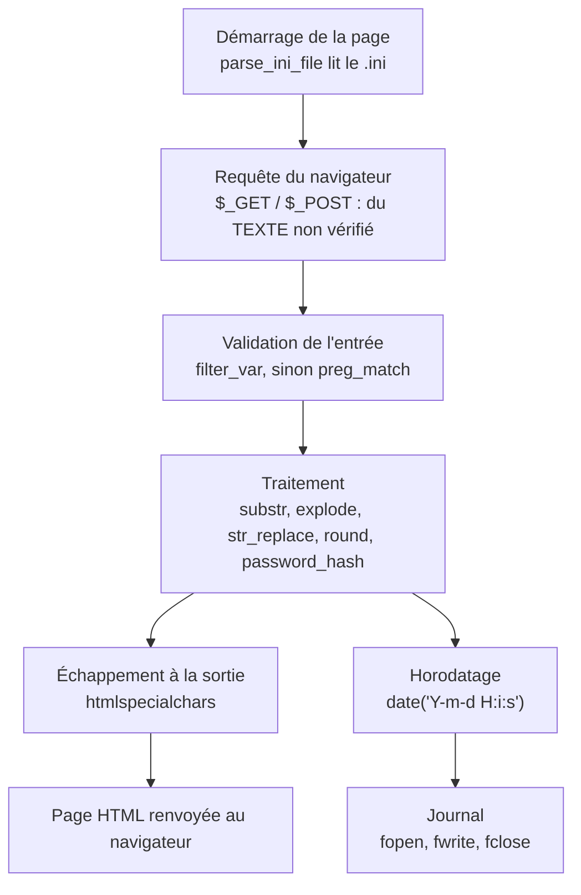
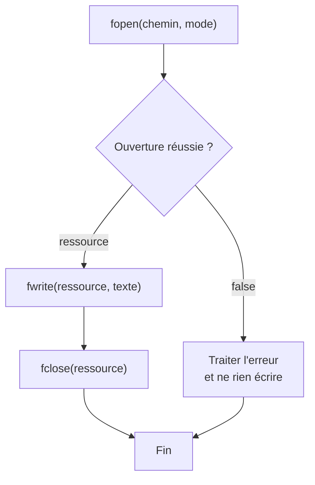
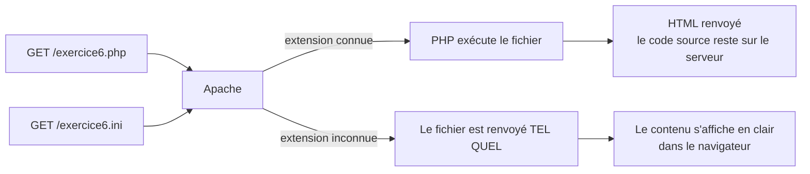
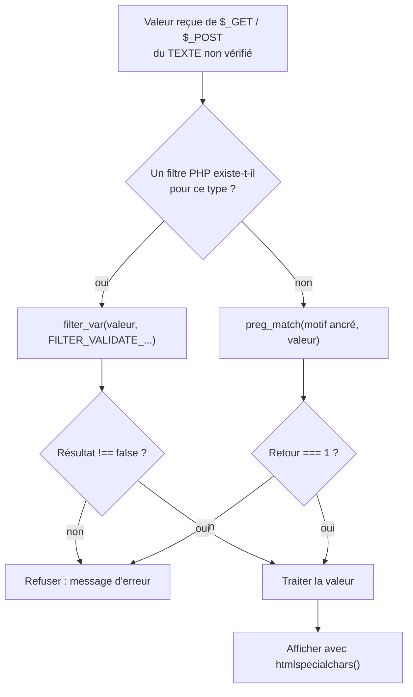

# La librairie standard de PHP

## L'idée en une image {diapos="14, 37, 53"}

Imagine un atelier de menuiserie que tu découvres au premier jour. Tu n'as rien apporté, et
pourtant tout est déjà là : les scies sont au mur, les limes dans le tiroir du haut, la balance
sur l'établi, et un registre est ouvert près de la porte pour noter ce qui entre et ce qui sort.

**Cet atelier, c'est la librairie standard de PHP.** Une librairie standard, c'est l'ensemble des
fonctions que le langage te fournit d'office, sans rien installer : tu les appelles par leur nom,
elles sont là. Aux séances 1 et 2, tu écrivais toi-même la logique de tes pages. À partir
d'aujourd'hui, la première question change : ce n'est plus « comment je programme ça ? », c'est
**« l'outil existe-t-il déjà ? »**. Neuf fois sur dix, la réponse est oui.

La séance 3 te fait faire le tour de six rayons de cet atelier : **les dates**, **les chaînes de
caractères**, **les fonctions de sécurité**, **les fonctions mathématiques**, puis **le système de
fichiers** et **la validation des entrées**.



**Où l'analogie casse — et il faut le dire, sinon elle enseigne des erreurs.** Trois endroits.

1. **L'atelier n'est pas rangé.** Les outils de PHP ont été ajoutés pendant trente ans, sans plan
   d'ensemble : `str_contains($texte, $mot)` prend le texte d'abord, `in_array($valeur, $tableau)`
   prend la valeur d'abord. L'ordre des paramètres se vérifie, il ne se devine pas.
2. **Certains outils sont rouillés, et rien ne l'indique sur le manche.** `md5()` fonctionne
   toujours, s'appelle comme avant, ne produit aucune erreur — et ne doit plus servir à protéger un
   mot de passe. Une fonction qui existe n'est pas une fonction qu'on doit employer.
3. **Un outil ne fait que ce qu'il dit, jamais ce que tu espérais.** `htmlspecialchars()` protège
   ce que tu lui passes, à l'endroit où tu l'appelles : elle ne rend pas ta page sûre en général.

## En bref — la marche à suivre {diapos="9, 18-21, 26-29, 33, 41, 47, 53-55, 64"}

:::: marche-a-suivre {titre="Outiller une page PHP — de l'horodatage à la validation d'une entrée"}

1. {voie="cours"} {voir="Le fuseau horaire, et le piège du support"} Règle
   `date.timezone = America/Toronto` dans le `php.ini` de XAMPP, puis redémarre Apache et MariaDB
   depuis le panneau de XAMPP.

2. {voie="moderne"} {voir="Le fuseau horaire, et le piège du support"} Sur un poste du Cégep, fais
   le même réglage dans le `php.ini` de **WAMP**, et pose en plus le fuseau dans ton code pour ne
   dépendre d'aucune machine.

   ```php
   date_default_timezone_set("America/Toronto");
   ```

3. {voir="Les dates"} Horodate toujours avec le même format, celui qu'attend MariaDB.

   ```php
   echo date("Y-m-d H:i:s");
   ```

4. {voir="Le système de fichiers"} Range les réglages de ton application dans un fichier `.ini` et
   lis-le au démarrage de la page, plutôt que de les écrire en dur dans le code.

   ```php
   $config = parse_ini_file("config.ini");
   ```

5. {voir="Valider les données d'un formulaire"} Valide le format de toute valeur reçue de `$_GET`
   ou de `$_POST` avant de la traiter.

   ```php
   $courriel = filter_var($_POST["courriel"], FILTER_VALIDATE_EMAIL);
   ```

6. Décris la forme attendue avec une expression régulière quand aucun filtre ne correspond à ton
   besoin.

   ```php
   preg_match('/^\([0-9]{3}\) [0-9]{3}-[0-9]{4}$/', $telephone);
   ```

7. {voir="substr() et explode() — extraire, découper"} Découpe une chaîne en tableau sur son
   séparateur.

   ```php
   $mots = explode(" ", "Je suis un étudiant");
   ```

8. {voir="substr() et explode() — extraire, découper"} Extrais une portion de texte en donnant la
   chaîne, la position de départ et le nombre de caractères.

   ```php
   $extrait = substr("ABCDEFGHIJKLMNOP", 3, 5);
   ```

9. {voir="str_replace() et str_contains() — remplacer, chercher"} Remplace un fragment par un
   autre : l'ancien d'abord, le nouveau ensuite, le texte complet en dernier.

   ```php
   echo str_replace("chien", "chat", "Je vais chercher mon chien");
   ```

10. {voir="str_replace() et str_contains() — remplacer, chercher"} Teste la présence d'un fragment
    avec `str_contains()`, qui répond par un booléen.

    ```php
    if (str_contains($texte, $mot)) { echo "Contient le mot"; }
    ```

11. {voie="cours"} {voir="md5() et sha1() — ce qu'elles font, et ce qu'elles ne doivent plus faire"}
    Pour prototyper, le cours hache le mot de passe avec `md5()` ou `sha1()`.

    ```php
    echo md5($motDePasse);
    ```

12. {voie="moderne"} {voir="password_hash() et password_verify()"} Hache le mot de passe avec
    `password_hash()` dès le premier jour : le sel aléatoire et le coût de calcul sont déjà dedans.

    ```php
    $hash = password_hash($motDePasse, PASSWORD_DEFAULT);
    ```

13. {voir="password_hash() et password_verify()"} Vérifie une tentative de connexion en comparant
    la saisie au hash conservé, sans jamais rien déchiffrer.

    ```php
    if (password_verify($tentative, $hash)) { echo "Mot de passe valide"; }
    ```

14. {voir="htmlspecialchars() — afficher sans exécuter"} Échappe à la sortie **tout** ce qui vient
    du client, juste avant de l'écrire dans la page.

    ```php
    echo htmlspecialchars($commentaire, ENT_QUOTES | ENT_SUBSTITUTE, "UTF-8");
    ```

15. {voir="Les fonctions mathématiques"} Arrondis au moment d'afficher, jamais au milieu d'un
    calcul.

    ```php
    echo round(2.5432, 2);
    ```

16. {voir="Le système de fichiers"} Ouvre le journal en mode ajout, écris-y une ligne horodatée,
    puis referme-le.

    ```php
    $journal = fopen("journal.log", "a") or die("Incapable d'ouvrir le fichier de journalisation!");
    ```

17. Fais les neuf exercices de la séance 3 : ils réemploient exactement ces gestes, un par un.

::::

## Ce que la séance 3 enseigne, et ce que cette leçon ajoute {diapos="3, 4, 6"}

::: cours {diapos="3, 4, 6"}
La séance s'ouvre sur un rappel : la séance 2 a couvert la **syntaxe de base** de PHP — tableaux,
variables superglobales, transtypage. La séance 3 couvre « une partie de la librairie standard de
PHP ». Le contenu annoncé tient en sept points : le rappel du dernier cours, la librairie PHP, les
dates, le traitement des chaînes de caractères, les fonctions mathématiques, le traitement de
fichiers, la validation des données, puis une conclusion.
:::

Cette leçon suit ce plan dans l'ordre, sans en dévier. Elle y ajoute trois choses qu'un cours,
**sommaire par nature**, ne peut pas contenir :

- ce que les captures d'écran projetées montrent sans qu'une diapositive le commente — la sortie
  exacte d'un `explode()`, la structure d'un hash `bcrypt` ;
- l'écart entre la méthode enseignée et ce qu'on écrirait aujourd'hui en production, toujours
  signalé comme tel, jamais substitué en silence ;
- le vocabulaire juste là où le support glisse, par exemple entre **hacher** et **chiffrer**.

::: complement
**Ce qui n'est PAS dans la séance 3, et qu'il ne faut donc pas réviser ici** : les objets
`DateTimeImmutable` et `DateTimeZone`, les fonctions `mb_*` pour le texte accentué, `json_encode`
et `json_decode`, le tri des tableaux, les flux de lecture ligne à ligne, la rotation des journaux
et le verrouillage de fichier. La programmation orientée objet arrive à la séance 4.
:::

## Les dates {diapos="8, 9"}

::: cours {diapos="8, 9"}
La fonction `date()` permet d'obtenir la date et l'heure actuelles dans un certain format défini en
paramètre. Pour le cours, on utilisera **presque exclusivement** le format `YYYY-MM-JJ HH:MM:SS`,
parce que c'est celui qu'exige le type de données `datetime` de **MariaDB** et celui qu'emploient
les fichiers de journalisation. L'appel s'écrit `echo date("Y-m-d H:i:s");`, et le cours annonce
qu'on aura plusieurs fois l'occasion de l'employer au cours de la session.
:::

Une précision de lecture, avant d'aller plus loin. `YYYY-MM-JJ HH:MM:SS`, sur la diapositive 8,
décrit le **résultat** attendu à un lecteur humain : quatre chiffres d'année, deux de mois, deux de
jour. Ce n'est pas une chaîne qu'on passe à `date()` — d'ailleurs, `MM` y désigne à la fois le mois
et les minutes, ce qu'aucune chaîne de format ne pourrait faire. La chaîne réelle est celle de la
diapositive 9, `"Y-m-d H:i:s"`, et c'est la seule que cette leçon écrit dans du code.

Dans une chaîne de format, **chaque lettre est un code**, et les autres caractères sont recopiés
tels quels. Les six lettres du format du cours :

| Lettre | Ce qu'elle produit | Exemple |
|---|---|---|
| `Y` | l'année sur quatre chiffres | `2026` |
| `m` | le mois sur deux chiffres | `09` |
| `d` | le jour sur deux chiffres | `14` |
| `H` | l'heure sur 24 h, deux chiffres | `21` |
| `i` | les **minutes** sur deux chiffres | `05` |
| `s` | les secondes sur deux chiffres | `07` |

La lettre à retenir est `i` : c'est elle qui donne les minutes, pas `M` ni `mm`.

**L'exemple simple** — afficher l'instant présent, tel que le cours l'écrit :

```php
<?php
echo date("Y-m-d H:i:s");
```

```text
2026-09-14 21:05:07
```

**L'exemple plus réaliste** — le même appel, mais à l'endroit où il sert vraiment : construire une
ligne de journal. Le format n'est plus un exercice d'affichage, il devient le préfixe de chaque
ligne d'un fichier que quelqu'un relira dans six mois, et qu'un `ORDER BY` pourra trier parce que
`2026-09-14` se classe correctement en ordre alphabétique.

```php
<?php
$evenement = "Connexion refusée pour l'utilisateur 0758510";
$ligne = "[" . date("Y-m-d H:i:s") . "] " . $evenement;
echo $ligne;
```

```text
[2026-09-14 21:05:07] Connexion refusée pour l'utilisateur 0758510
```

::: exercice-du-cours {seance="3" ref="1"}
Une seule ligne fait tout le travail, et tu l'as sous les yeux : `echo date("Y-m-d H:i:s");`. Le
piège n'est pas dans le code, il est dans le **format** — vérifie que tu écris bien `i` minuscule
pour les minutes et `H` majuscule pour l'heure sur 24 heures. Si l'heure affichée n'est pas
l'heure qu'il est chez toi, ne touche pas au format : c'est le fuseau horaire qu'il faut régler,
deux sections plus bas.
:::

### Les autres formats, et où les chercher {diapos="10"}

::: cours {diapos="10"}
La diapositive 10 renvoie au **manuel officiel de PHP**, à la page de la fonction `date()`
(<https://www.php.net/manual/en/function.date.php>), et projette le tableau d'exemples qu'on y
trouve. C'est le seul aide-mémoire de formats que donne le cours.
:::

Voici les lignes de ce tableau qui reviennent le plus souvent, telles qu'elles sont projetées :

```php
$today = date("F j, Y, g:i a");    // March 10, 2001, 5:16 pm
$today = date("m.d.y");            // 03.10.01
$today = date("Ymd");              // 20010310
$today = date("H:i:s");            // 17:16:18
$today = date("Y-m-d H:i:s");      // 2001-03-10 17:16:18
```

Deux enseignements se cachent dans ce tableau. Le premier : une lettre qui doit s'afficher telle
quelle **se neutralise avec un antislash**, `\`. Écrire `date('\i\t \i\s')` imprime « it is », alors
que `date("it is")` imprimerait les minutes, le nombre de jours du mois, puis de nouveau les minutes
et les secondes — parce que `i`, `t` et `s` sont des codes, comme le dit le tableau plus haut. Et
les guillemets **simples** ne sont pas un détail de style : en guillemets doubles, PHP traite `\t`
comme une **tabulation** avant même que `date()` ne voie la chaîne, et la sortie devient « i », une
tabulation, puis « is ». Le manuel écrit d'ailleurs cet exemple en guillemets simples. Le second
enseignement : sur les dix lignes du tableau, **une seule sert dans ce cours**, la dernière.

::: complement
Trois lettres utiles que le cours ne montre pas et que tu rencontreras : `N` donne le jour de la
semaine en chiffre (1 pour lundi, 7 pour dimanche), `j` le jour du mois sans zéro devant, et `L`
vaut 1 si l'année est bissextile. Et pour obtenir une date **autre** que maintenant, `date()` prend
un second paramètre : `date("Y-m-d", strtotime("+3 days"))`.
:::

### Le fuseau horaire, et le piège du support {diapos="11"}

::: cours {diapos="11"}
La configuration de PHP est parfois réglée sur un autre fuseau horaire que le nôtre. Le cours
donne la marche à suivre pour le corriger, en cinq gestes : ouvrir le fichier `php.ini` sous
`C:\xampp\php`, trouver la ligne qui commence par `date.timezone =`, changer la valeur pour
`America/Toronto`, sauvegarder le fichier, puis redémarrer Apache et MariaDB en faisant « Stop »
puis « Start » dans XAMPP.
:::

Le principe est juste et il faut le retenir : **PHP ne devine pas ton fuseau**, quelqu'un doit le
lui dire. Sans réglage, PHP retombe silencieusement sur UTC — pas d'erreur, pas d'avertissement,
juste des heures fausses de quatre ou cinq heures selon la saison. C'est l'un des bugs de date les
plus fréquents en PHP.

::: correction-du-cours {source="Cours 1, diapositive 26 (XAMPP interdit sur les postes du Cégep) ; décision D-PHP-3 du projet — l'environnement de référence est WAMP" diapos="11"}
La marche à suivre est écrite pour **XAMPP**, qui n'est pas installé sur les postes du Cégep : c'est
**WAMP** qui y est l'environnement de référence. La directive à changer reste exactement la même
(`date.timezone`), la valeur aussi (`America/Toronto`), et il faut toujours redémarrer Apache pour
que le fichier soit relu — seul le **chemin** du `php.ini` change, et un chemin faux se recopie tel
quel sans que rien ne prévienne. Le moyen de trouver le bon, sous WAMP, est donné juste en
dessous. À l'examen, donne la marche
du cours ; sur ton poste, applique-la au `php.ini` de WAMP.
:::

Sous WAMP, le `php.ini` vit quelque part sous `C:\wamp64\`, dans un chemin qui dépend de la
version de PHP installée — `php<version>` dans un nom de dossier n'est pas à recopier, c'est le
numéro de **ta** version qui s'y trouve. Plutôt que de deviner ce chemin, **demande-le à PHP
lui-même** : c'est le seul geste qui ne ment jamais, parce qu'il interroge l'interpréteur qui
exécute réellement ta page.

Deux façons de le faire depuis une page servie par Apache. `phpinfo()` affiche un long tableau de
configuration : la ligne **« Loaded Configuration File »** donne le chemin du `php.ini` réellement
chargé. La fonction `php_ini_loaded_file()` retourne ce même chemin, seul, ou `false` si aucun
fichier n'est chargé.

```php
<?php
echo php_ini_loaded_file();
```

En ligne de commande, `php --ini` imprime la même ligne, `Loaded Configuration File`. Sous WAMP,
`php` n'est pas dans le `PATH` de Windows (voir la séance 1) : la commande s'écrit avec le chemin
complet, `C:\wamp64\bin\php\php<version>\php.exe --ini`, où `php<version>` est le nom d'un
sous-dossier de `C:\wamp64\bin\php\`. Mais la
console et Apache ne chargent **pas forcément le même fichier** : pour régler le fuseau de tes
pages, c'est la réponse obtenue **par le navigateur** qui fait foi. Une fois la directive modifiée
et Apache redémarré, `ini_get("date.timezone")` dans une page confirme que la nouvelle valeur est
bien lue.

::: complement
**Le `php.ini` de ta machine ne suivra pas ton code en production.** Le jour où tu déposes ton site
sur un hébergeur, tu ne contrôles plus ce fichier. La parade tient en une ligne — un appel à
`date_default_timezone_set("America/Toronto")` posé en tête du point d'entrée de l'application,
avant tout appel à `date()`. Et retiens que `America/Toronto` désigne une **règle**, pas un
décalage : elle gère l'heure avancée toute seule, là où un décalage fixe comme `-05:00` serait faux
la moitié de l'année.
:::

```php
<?php
date_default_timezone_set("America/Toronto");
echo date("Y-m-d H:i:s");
```

## Traiter les chaînes de caractères {diapos="14, 15, 17"}

::: cours {diapos="14, 15, 17"}
Les fonctions de traitement de chaîne « jouent des rôles fondamentaux dans le traitement de
l'information, mais aussi dans la sécurité ». Le cours en couvre huit, réparties en deux familles :
les **standards** — `substr`, `explode`, `str_replace`, `str_contains` — et celles de **sécurité** —
`sha1` / `md5`, `htmlspecialchars`, `password_hash`, `password_verify`. La référence donnée est la
liste des fonctions de chaînes de W3Schools (<https://www.w3schools.com/php/php_ref_string.asp>).
:::

Cette séparation en deux familles est un **choix pédagogique du cours**, pas une propriété de PHP :
pour l'interpréteur, les huit sont des fonctions de chaînes ordinaires. Ce qui les distingue est
l'usage qu'on en fait. Les quatre premières transforment du texte parce que ton programme en a
besoin ; les quatre suivantes transforment du texte pour qu'il **cesse d'être dangereux** ou pour
qu'il **cesse d'être lisible**. Confondre les deux familles, c'est croire qu'une fonction protège
alors qu'elle ne fait que découper.

::: complement
**Ces fonctions comptent des octets, pas des caractères.** En UTF-8, un `é` occupe deux octets :
`strlen("été")` vaut donc 5. Et `substr("été", 0, 2)` ne rend qu'**un seul** caractère — le `é`
consomme à lui seul les deux octets demandés, là où tu croyais découper deux lettres. Une coupe qui
tombe **au milieu** d'un caractère, comme `substr("été", 0, 1)`, est pire : elle rend un demi-`é`,
que le navigateur affiche en losange noir. Pour du texte saisi par un humain — donc accentué — les
équivalents de l'extension **mbstring** existent : `mb_strlen`, `mb_substr`, `mb_strtoupper`. Ce n'est pas au programme de la
séance, mais c'est la première surprise que tu rencontreras sur un vrai formulaire francophone.
:::

### substr() et explode() — extraire, découper {diapos="18, 19"}

::: cours {diapos="18, 19"}
`substr` (*substring*) permet d'**extraire une partie d'un texte**, à partir de trois paramètres :
le texte original, la position de départ de l'extraction, et le nombre de caractères à extraire.
`explode()` transforme une chaîne de caractères **en tableau** de chaînes, en utilisant un
paramètre comme **séparateur**.
:::

La position de départ se compte **à partir de 0**, comme les indices d'un tableau : le premier
caractère est à la position 0, le quatrième à la position 3.

```php
<?php
$texte   = "ABCDEFGHIJKLMNOP";
$extrait = substr($texte, 3, 5);
echo $extrait;
```

```text
DEFGH
```

`explode()`, lui, ne retourne pas du texte mais un **tableau** — l'objet de la séance 2. Le
séparateur disparaît du résultat : il sert de ciseau, il n'est pas conservé.

```php
<?php
$mots = explode(" ", "Je suis un étudiant");
print_r($mots);
```

```text
Array
(
    [0] => Je
    [1] => suis
    [2] => un
    [3] => étudiant
)
```

C'est bien la sortie de `print_r`, sur cinq lignes. Dans un navigateur, le cours la montre pourtant
sur une seule : sans `<pre>` autour, le HTML écrase les sauts de ligne et tout se replie en
`Array ( [0] => Je [1] => suis … )`. Ce n'est pas `print_r` qui change, c'est la page qui aplatit.

Ce tableau se manipule comme n'importe quel autre : `count($mots)` donne 4, `$mots[0]` donne `Je`,
et un `foreach` le parcourt. La fonction inverse s'appelle `implode()` : elle recolle un tableau en
une chaîne avec le séparateur de ton choix.

::: exercice-du-cours {seance="3" ref="2"}
Toute la fonction tient dans la combinaison de deux gestes que tu viens de voir : `explode()` pour
transformer la phrase en tableau de mots, puis `count()` sur le tableau obtenu. Attention au cas
que l'énoncé ne mentionne pas : deux espaces consécutifs produisent une case **vide** dans le
tableau, donc un mot de trop dans ton compte. Une fois ta fonction écrite, essaie-la sur une phrase
qui commence par un espace — c'est le test qui distingue une fonction qui marche d'une fonction qui
marche sur l'exemple.
:::

### str_replace() et str_contains() — remplacer, chercher {diapos="20, 21"}

::: cours {diapos="20, 21"}
`str_replace()` permet de **remplacer une partie du texte par un nouveau texte**. `str_contains()`
retourne un **booléen** qui indique si le texte (premier paramètre) contient une certaine séquence
(second paramètre).
:::

L'ordre des paramètres de `str_replace()` est celui qui se trompe le plus souvent : **l'ancien, le
nouveau, puis le texte complet**. Le sujet arrive en dernier, alors que `str_contains()` le prend en
premier. Ce n'est pas logique, c'est historique — et c'est exactement le désordre de l'atelier
annoncé en tête de leçon.

```php
<?php
$original   = "chien";
$remplacant = "chat";
$phrase     = "Je vais chercher mon chien";
echo str_replace($original, $remplacant, $phrase);
```

```text
Je vais chercher mon chat
```

```php
<?php
$texte = "What the fox says";
$mot   = "fox";
if (str_contains($texte, $mot)) {
    echo "Contient le mot";
}
```

`str_replace()` remplace **toutes** les occurrences, pas seulement la première, et la comparaison
tient compte de la casse : `str_replace("Chien", "chat", $phrase)` ne trouverait rien dans la phrase
ci-dessus.

::: complement
**`str_contains()` n'existe que depuis PHP 8.0** (novembre 2020). La diapositive 15 la range parmi
les fonctions « standards » sans dire un mot de version, et l'omission peut mordre : WampServer
héberge **plusieurs** versions de PHP en parallèle, 7.x comprises, et c'est celle qui est *active*
qui décide. Un `echo PHP_VERSION;` tranche en deux secondes sur ton poste — prends l'habitude de le
faire avant de blâmer ton code. Tu dois le savoir pour une seconde raison : la moitié des réponses
que tu trouveras sur le web ont été écrites pour PHP 7 et emploient la forme d'avant,
`strpos($texte, $mot) !== false`.
Les deux font la même chose ; la seconde exige le `!== false` parce que `strpos()` retourne une
**position**, et que la position 0 — un mot trouvé au tout début — vaut `false` dans un `if`.
:::

## Les fonctions de sécurité du cours {diapos="24"}

::: cours {diapos="24"}
Le cours annonce quatre fonctions « utilisées principalement pour des rôles de sécurité » :
`md5` et `sha1`, `htmlspecialchars`, `password_hash` et `password_verify`.
:::

Ces quatre fonctions n'ont pas le même métier, et les ranger dans la même case est la source de
confusion la plus coûteuse de la séance. Elles se répartissent en **deux gestes bien distincts** :

| Geste | Fonctions | Ce qu'il protège |
|---|---|---|
| **Hacher** — transformer un secret en empreinte irréversible | `md5`, `sha1`, `password_hash`, `password_verify` | le **mot de passe**, si la base de données est volée |
| **Échapper** — neutraliser les caractères qui ont un sens pour le navigateur | `htmlspecialchars` | la **page**, contre un texte qui essaie de s'exécuter |

Une image pour chacun. **Hacher**, c'est passer une feuille au broyeur : tu peux broyer deux fois
la même feuille et obtenir exactement les mêmes confettis — donc comparer — mais tu ne
reconstitueras jamais la feuille. **Échapper**, c'est mettre une phrase entre guillemets dans un
texte : le lecteur la voit, il ne l'exécute pas comme une consigne.

L'analogie du broyeur casse sur un point, et c'est le point qui compte : un broyeur ordinaire est
**rapide**, et c'est précisément le défaut de `md5`. La section suivante explique pourquoi.

### md5() et sha1() — ce qu'elles font, et ce qu'elles ne doivent plus faire {diapos="25"}

::: cours {diapos="25"}
MD5 et SHA-1 sont des **algorithmes de hachage** : ils transforment du texte en séquence
alphanumérique « de façon constante, mais irréversible » — le cours précise aussitôt que cette
irréversibilité « peut en fait être brisée par certains types d'attaque : force brute, table
arc-en-ciel, analyse de fréquence ». Il conclut que ces algorithmes serviront « à prototyper »,
mais « ne doivent pas être utilisés pour le produit final ».
:::

Deux mots à poser. **Constant** veut dire que la même entrée donne toujours la même sortie : c'est
ce qui permet de comparer deux empreintes sans connaître les textes d'origine. **Irréversible** veut
dire qu'aucun calcul ne remonte de l'empreinte au texte. `md5()` produit 32 caractères hexadécimaux,
`sha1()` en produit 40, quelle que soit la longueur du texte d'entrée.

```php
<?php
echo md5("Message à hacher");
echo "<br>";
echo sha1("Message à hacher");
```

::: correction-du-cours {source="NIST SP 800-63B-4 (2025), §5.1.1.2 — stockage des mots de passe par une fonction lente et salée ; la révision 3 de 2017, longtemps citée, est retirée depuis le 2025-07-24 ; Manuel PHP, function.password-hash.php ; SHAttered (2017), première collision SHA-1" diapos="25"}
Deux choses à corriger dans cette diapositive, et la première n'est qu'un mot. **Hacher n'est pas
chiffrer.** Le support écrit « prototyper de l'encryption de mot de passe » : un chiffrement se
défait avec une clé, un hachage ne se défait pas — le cours le dit lui-même deux lignes plus haut
en écrivant « irréversible ». Le verbe juste est **hacher**.

La seconde est de fond. **MD5 et SHA-1 ne servent plus à protéger un mot de passe, même pour
prototyper.** Leur défaut n'est pas d'être cassées, c'est d'être **rapides** : une carte graphique
grand public teste des milliards d'empreintes MD5 par seconde, et les tables arc-en-ciel — de
gigantesques dictionnaires d'empreintes déjà calculées — couvrent l'essentiel des mots de passe
courants. SHA-1 est de plus cassée en collision depuis 2017. Comme `password_hash()` est enseignée
quatre diapositives plus loin et qu'elle n'est pas plus longue à écrire, il n'y a aucun prototype à
faire avec les deux autres. À l'examen, donne la réponse du cours ; dans ton code, écris
`password_hash()` dès la première ligne.
:::

::: complement
**MD5 et SHA-1 gardent des usages parfaitement légitimes**, hors des mots de passe : une empreinte
pour repérer deux fichiers identiques, une clé de cache, un identifiant court dérivé d'une chaîne.
Pour une empreinte d'intégrité sérieuse — vérifier qu'un fichier téléchargé n'a pas été modifié —
la fonction moderne est `hash("sha256", $donnees)`.
:::

### htmlspecialchars() — afficher sans exécuter {diapos="26"}

::: cours {diapos="26"}
`htmlspecialchars()` « permet de remplacer les caractères spéciaux par leur code d'entité
respectif ». Elle permet d'écrire du code **visible** à l'utilisateur, et « servira éventuellement à
protéger contre les attaques de type *Cross-site scripting* (XSS) », vues au cours de sécurité.
:::

Une **entité HTML** est une écriture de remplacement pour un caractère qui a déjà un sens dans le
langage HTML : `&lt;` pour `<`, `&gt;` pour `>`, `&amp;` pour `&`, `&quot;` pour le guillemet
droit. Le navigateur **affiche** le caractère d'origine, mais il ne le lit plus comme le début
d'une balise. C'est toute la fonction : elle ne supprime rien, elle ne nettoie rien, elle **change
le statut** du texte, de « consigne possible » à « texte à montrer ».

Le **XSS** (*Cross-Site Scripting*, littéralement « script inter-sites ») est l'attaque que cela
empêche : elle consiste à faire exécuter, par le navigateur d'un visiteur, un script qu'un attaquant
a glissé dans une donnée que la page réaffiche.

:::: comparaison
::: vulnerable
```php
$commentaire = $_GET["commentaire"];
echo "<p>" . $commentaire . "</p>";
```
{lignes="1"} La valeur vient du client : c'est une proposition, pas un fait. Rien n'oblige un
visiteur à taper du texte ordinaire dans un paramètre d'URL.

{lignes="2"} Le texte reçu entre dans la page sans transformation. S'il contient
`<script>alert('XSS')</script>`, le navigateur ne voit pas des caractères à afficher : il voit une
balise, et il l'exécute.
:::
::: corrige
```php
$commentaire = $_GET["commentaire"];
echo "<p>" . htmlspecialchars($commentaire, ENT_QUOTES | ENT_SUBSTITUTE, "UTF-8") . "</p>";
```
{lignes="2"} Les caractères `<`, `>`, `&` et les guillemets deviennent des entités : le visiteur
**voit** `<script>` écrit à l'écran, et le navigateur n'a plus aucune balise à interpréter.

{lignes="2"} `ENT_QUOTES` couvre aussi l'apostrophe, `ENT_SUBSTITUTE` remplace un octet UTF-8
invalide par un caractère de remplacement, et le troisième paramètre nomme l'encodage. Depuis
PHP 8.1, c'est déjà le jeu par défaut. Mais les deux drapeaux vont **ensemble** : écrire
`ENT_QUOTES` **seul** ne reproduit pas le défaut, il en **retire** `ENT_SUBSTITUTE`, et une entrée
mal encodée ressort alors en **chaîne vide** au lieu d'être affichée. Un commentaire qui disparaît
sans message d'erreur vient presque toujours de là.
:::
::::

Voici ce que le navigateur reçoit dans les deux cas, pour l'entrée `<script>alert('XSS')</script>` :

```html
<p><script>alert('XSS')</script></p>
<p>&lt;script&gt;alert(&#039;XSS&#039;)&lt;/script&gt;</p>
```

L'exemple du cours, plus sage, montre le même mécanisme sur une balise inoffensive :
`htmlspecialchars("La balise est <br>")` affiche `La balise est &lt;br&gt;`, c'est-à-dire le texte
`La balise est <br>` à l'écran, au lieu d'un saut de ligne invisible.

::: cours {seance="3"}
**Le corrigé officiel de la séance 3 ne contient aucune faille XSS** — contrairement à ceux des
séances 1 et 2, où une valeur reçue repartait telle quelle dans la page. Mieux : son
`exercice04.php` **applique** `htmlspecialchars()`, ce qui est exactement la parade enseignée ici.
Sa seule coquille est un mot : il écrit « il faut utiliser la valide `<script>` » là où l'énoncé dit
« la **balise** `<script>` ».
:::

::: exercice-du-cours {seance="3" ref="4"}
L'énoncé demande d'afficher une balise, pas de l'exécuter : c'est donc `htmlspecialchars()` qui fait
tout le travail, en un seul appel. Le test qui prouve que ta page est juste est visuel — si tu vois
`<script>` écrit noir sur blanc dans la page, c'est réussi ; si tu ne vois rien, la balise a été
interprétée et il manque l'appel. Regarde aussi le code source de la page reçue (Ctrl+U) : tu y
liras `&lt;script&gt;`.
:::

### password_hash() et password_verify() {diapos="27-29"}

::: cours {diapos="27-29"}
`password_hash()` prend une chaîne de texte — le mot de passe — et la transforme avec un algorithme
de hachage, en la combinant à une valeur aléatoire concaténée au mot de passe. « Cette technique
vise à protéger les mots de passe des utilisateurs si la base de données du site est compromise. »
Le cours demande d'employer l'algorithme le plus récent disponible grâce à la constante
`PASSWORD_DEFAULT`. `password_verify()`, elle, vérifie si un mot de passe est valide : elle a besoin
du mot de passe tenté par l'utilisateur et du hash précédemment créé par `password_hash()`.
:::

Le mot important est la **valeur aléatoire** : on l'appelle un **sel** (*salt* en anglais). Sans
sel, deux comptes ayant choisi le même mot de passe auraient la même empreinte dans la base, et un
attaquant qui casse l'une casserait l'autre gratuitement. Avec un sel différent par compte, les deux
empreintes n'ont rien en commun.

::: correction-du-cours {source="Manuel PHP — function.password-hash.php (« password_hash() crée un nouveau hachage ») ; glossaire OWASP, Password Storage Cheat Sheet — salt" diapos="27"}
Deux glissements de vocabulaire, sans conséquence à l'examen et gênants dans un rapport
professionnel. La diapositive parle de **« crypter »** le mot de passe : `password_hash()` ne
chiffre rien, elle **hache** — il n'y a ni clé ni déchiffrement, et c'est justement pour cela que la
fonction convient. Et elle écrit **« un set aléatoire »** : le terme est **sel**, la traduction de
*salt*. Retiens le mot juste, il reviendra au cours de sécurisation des sessions.
:::

```php
<?php
$hash = password_hash("mot de passe", PASSWORD_DEFAULT);
echo $hash;
```

La chaîne produite ressemble à celle-ci, montrée par la diapositive 29 :

```text
$2y$10$T5E83Wu/91Gn3FJivNilgucBVCjYi64GoUqaW6vh8dz8jo1410I6.
```

Elle n'est pas opaque, elle est **structurée**, et elle enseigne trois choses d'un coup. `$2y$`
nomme l'algorithme : **bcrypt** — c'est ce que vaut `PASSWORD_DEFAULT` en septembre 2026. `$10$` est
le **facteur de coût** : 2¹⁰, soit 1024 tours de calcul, ce qui rend la fonction volontairement
lente. Et les 22 caractères qui suivent sont **le sel**, rangé à l'intérieur même de la chaîne.

Ne t'inquiète pas si ta propre sortie n'est pas identique à celle de la diapositive : **depuis
PHP 8.4, le coût par défaut de bcrypt est passé de 10 à 12**, et tu liras donc `$2y$12$…`. Le sel,
lui, est tiré au hasard à chaque appel — deux hachages du même mot de passe ne se ressemblent
jamais, et c'est exactement le but.
C'est pour cette raison que `password_verify()` n'a besoin de rien d'autre que le mot de passe et le
hash : le sel et le coût voyagent avec l'empreinte.

```php
<?php
$mot_de_passe = "mot de passe";
$hash = '$2y$10$T5E83Wu/91Gn3FJivNilgucBVCjYi64GoUqaW6vh8dz8jo1410I6.';
if (password_verify($mot_de_passe, $hash) == true) {
    echo "Mot de passe valide";
} else {
    echo "Mot de passe invalide";
}
```

Deux remarques sur ce code, qui est celui du cours. `password_verify()` retourne déjà un booléen :
le `== true` ne change rien, il est simplement inutile, et `if (password_verify($a, $b))` suffit.
Par ailleurs, la vérification ne **déchiffre** jamais le hash — elle rehache la tentative avec le
sel et le coût lus dans la chaîne, puis compare les deux empreintes.

::: complement
Trois précisions qui serviront au projet de session. La colonne de base de données qui reçoit un
hash doit faire **`VARCHAR(255)`**, jamais 32 ni 60 : la longueur changera le jour où
`PASSWORD_DEFAULT` passera à Argon2id. `password_verify()` compare en **temps constant** : la
comparaison porte sur l'**empreinte recalculée**, jamais sur le mot de passe lui-même, et une
comparaison naïve fuirait, par sa durée, le nombre d'octets d'empreinte qui coïncident. Ne la
remplace donc jamais par un `===` — et le jour où tu auras deux empreintes à comparer toi-même,
c'est `hash_equals()` qu'il faut. Enfin, `password_needs_rehash()` dit si une empreinte a été produite par un
algorithme devenu obsolète, ce qui permet de remettre les comptes à niveau à la connexion suivante.
:::

::: exercice-du-cours {seance="3" ref="3"}
L'exercice se fait en **deux fichiers**, et c'est volontaire : le premier produit une empreinte, le
second la vérifie. Le piège est de croire qu'il faut transporter le mot de passe entre les deux —
non : seul le hash voyage, tu le recopies dans le second fichier comme le fait la diapositive 29.
Et n'essaie pas de comparer deux appels à `password_hash()` sur le même mot de passe : le sel étant
tiré au hasard à chaque appel, les deux chaînes sont différentes, et pourtant toutes deux valides.
C'est `password_verify()` qui tranche, jamais `==`.
:::

## Les fonctions mathématiques {diapos="32-35"}

::: cours {diapos="32-35"}
« Comme les autres langages, PHP supporte plusieurs fonctions d'opération mathématique. » Le cours
en nomme huit, données sous forme de tableau, avec un renvoi à la référence de W3Schools
(<https://www.w3schools.com/php/php_ref_math.asp>).
:::

Le tableau projeté, recopié tel qu'il est enseigné :

| Fonction | Paramètres | Rôle |
|---|---|---|
| `abs` | nombre | retourne le nombre en valeur positive |
| `floor` / `ceil` | nombre | arrondit à la baisse (`floor`) ou à la hausse (`ceil`) |
| `round` | nombre, précision | arrondit à la décimale la plus proche |
| `min` / `max` | nombre1, nombre2 | retourne le plus petit / le plus grand des deux |
| `pow` | base, exposant | retourne la base élevée à l'exposant |
| `log` | nombre, base | retourne le logarithme du nombre dans la base donnée |

::: correction-du-cours {source="Manuel PHP — function.min.php et function.max.php ; la démonstration de la diapositive 34 du même déck, où min(5, 8) donne 5" diapos="33"}
Le tableau de la diapositive 33 décrit `min` / `max` comme retournant « le plus **élevé/petit** des
deux nombres », dans cet ordre. C'est l'inverse : **`min` retourne le plus petit, `max` le plus
grand** — et la diapositive 34 du même support le confirme, puisque `min(5, 8)` y affiche 5. Simple
inversion de rédaction, mais à ne pas recopier telle quelle dans une réponse d'examen.
:::

La démonstration du cours en réunit sept — `max` est la seule du tableau qui n'y figure pas :

```php
<?php
echo abs(-5);            // 5
echo floor(2.34);        // 2
echo ceil(2.34);         // 3
echo round(2.5432, 2);   // 2.54
echo min(5, 8);          // 5
echo pow(2, 4);          // 16
echo log(1024, 2);       // 10
```

Trois de ces fonctions se ressemblent et ne font pas la même chose. `floor()` descend **toujours**,
`ceil()` monte **toujours**, `round()` va vers la valeur la plus proche — et prend un second
paramètre, le nombre de décimales à conserver. Sur 2,5 : `floor` donne 2, `ceil` donne 3, `round`
donne 3. Sur -2,5 : `floor` donne -3, parce que « à la baisse » veut dire vers la gauche sur l'axe,
pas vers zéro.

**Un exemple plus réaliste** — afficher un prix taxes comprises, à deux décimales :

```php
<?php
$prixAvantTaxes = 24.99;
$totalExact = $prixAvantTaxes * 1.14975;
echo "Total : " . round($totalExact, 2) . " $";
```

L'arrondi est fait **au moment d'afficher**, pas avant le calcul : arrondir une valeur intermédiaire
puis continuer à calculer dessus propage l'erreur à chaque opération.

::: complement
Trois pièges qui ne sont pas au programme de la séance et qui coûtent cher en vrai. **Ne calcule
jamais de l'argent en nombre à virgule flottante** : `0.1 + 0.2` ne vaut pas exactement `0.3` en
binaire. Stocke des **entiers en cents**, ou emploie l'extension `bcmath`. **`rand()` et `mt_rand()`
ne sont pas imprévisibles** : pour un jeton de session ou un code de réinitialisation, c'est
`random_int()` qu'il faut. Enfin, `intdiv(7, 2)` donne la division entière `3`, là où `7 / 2` donne
`3.5` — PHP ne fait pas de division entière tout seul.
:::

## Le système de fichiers {diapos="37"}

::: cours {diapos="37"}
« Le système de fichier permet de sauvegarder et de récupérer des fichiers sur le disque dur. » Le
cours précise aussitôt que la plupart des informations iront plutôt dans une base de données, pour
des raisons de performance et de sécurité, et il retient **deux** usages du simple fichier texte :
les **fichiers de configuration** et la **journalisation des évènements**.
:::

Reviens une seconde dans l'atelier. Deux objets y sont restés sans emploi jusqu'ici : la **fiche de
réglages** punaisée au mur — la pression du compresseur, la hauteur de l'établi — et le **registre**
ouvert près de la porte, où l'on note ce qui entre et ce qui sort. Personne ne fabrique rien avec
ces deux objets : ils servent à *paramétrer* l'atelier, et à *se souvenir* de ce qui s'y est passé.

C'est exactement la répartition que fait la séance 3. Un fichier de configuration se **lit** au
démarrage et change rarement. Un journal s'**écrit** en continu et ne se relit qu'après coup, quand
quelque chose a mal tourné.

**Où l'analogie casse — deux points, et ils comptent.** La fiche punaisée au mur, tout le monde la
voit ; c'est précisément le problème d'un `.ini` déposé dans le dossier servi par Apache, et c'est
le sujet du titre qui suit. Et le registre d'un atelier ne grossit pas tout seul la nuit : un
journal de serveur, si — il n'a **aucune borne naturelle**, et le premier mode de panne d'une
application qui journalise n'est pas un bogue, c'est le disque plein.

Trois fonctions suffisent à écrire dans un fichier, et ce sont celles que le cours emploie à la
diapositive 47.

| Fonction | Ce qu'elle fait |
|---|---|
| `fopen($chemin, $mode)` | ouvre le fichier et rend une **ressource** — une poignée — ou `false` |
| `fwrite($ressource, $texte)` | écrit le texte à la position courante |
| `fclose($ressource)` | referme le fichier et libère la poignée |

Une **ressource**, en PHP, est une valeur qui désigne quelque chose d'extérieur au programme : un
fichier ouvert, une connexion réseau. Tu ne l'affiches pas, tu la passes aux fonctions qui savent
s'en servir.

Le **mode** est la lettre qui décide de tout. Quatre suffisent pour la séance.

| Mode | Position | Si le fichier n'existe pas | Écrase le contenu ? |
|---|---|---|---|
| `r` | début | erreur | non — lecture seule |
| `w` | début | il est créé | **oui, tout le contenu est perdu** |
| `a` | **fin** | il est créé | non — ajoute à la suite |
| `x` | début | il est créé | échoue si le fichier **existe déjà** |

`a`, pour *append*, est le mode de la journalisation : chaque appel ajoute une ligne à la suite des
précédentes. `w` est la lettre qui détruit un journal entier quand on se trompe d'une touche.



::: complement
Hors du cours, une ligne remplace souvent les trois appels : `file_put_contents($chemin, $ligne,
FILE_APPEND | LOCK_EX)` ouvre, verrouille, écrit, déverrouille et referme toute seule. Le drapeau
`FILE_APPEND` correspond au mode `a` ; `LOCK_EX` pose un **verrou exclusif**, c'est-à-dire qu'il
empêche deux requêtes simultanées d'entrelacer leurs lignes dans le même fichier. Le code du cours
n'en pose aucun — on y revient au titre sur les défauts de `log_message()`.
:::

### Le fichier de configuration, et parse_ini_file() {diapos="39-43"}

::: cours {diapos="39-43"}
« Les fichiers de configuration permettent de contenir des informations utilisées par votre
application qui pourront être modifiées au besoin comme un simple fichier texte. » Le cours cite
comme exemples le nom de la base de données, un code utilisateur ou un mot de passe de connexion,
et le nombre de tentatives de mot de passe permises. **Chaque ligne suit le format
`<propriété>=<valeur>`**, et la lecture se fait avec `parse_ini_file()`, qui prend le nom du fichier
en paramètre et retourne un **tableau associatif** : la clé est le nom de la propriété, la valeur
est celle définie dans le fichier.
:::

Le mot « configuration » mérite qu'on s'y arrête, parce qu'il répond à un **pourquoi** avant un
comment. Sans fichier de configuration, le nom du serveur de base de données est écrit en dur au
milieu du code. Le jour où il change, il faut rouvrir le code, retrouver toutes ses occurrences et
le remplacer partout. Avec un fichier de configuration, la valeur vit à **un seul endroit**, dans un
fichier texte qu'on modifie sans toucher au programme.

Un fichier `.ini` est du texte, sans guillemets ni ponctuation particulière. Voici celui de la
diapositive 40, relevé dans la capture d'écran du support par la fiche de la base de connaissances :

```text
server=localhost
username=root
password=qwerty
dbname=demo
```

La lecture tient en un appel. `parse_ini_file()` rend un tableau associatif — un tableau dont les
clés sont des mots plutôt que des numéros, comme tu l'as vu à la séance 2 :

```php
<?php
$config = parse_ini_file("config.ini");
echo $config["server"];     // localhost
echo $config["dbname"];     // demo
```

Et si tu veux voir le tableau entier, `print_r()` l'imprime tel qu'il est en mémoire :

```text
Array
(
    [server] => localhost
    [username] => root
    [password] => qwerty
    [dbname] => demo
)
```

Les diapositives 40, 42 et 43 portent leur exemple dans une **capture d'écran** que l'outil
d'extraction du dépôt ne lit pas. Le code ci-dessus n'est donc pas une reconstitution devinée : il
est bâti sur le **texte** de la diapositive 41, qui décrit précisément le paramètre et le tableau
associatif retourné.

::: exercice-du-cours {seance="3" ref="6"}
La piste : écris d'abord le fichier texte, une propriété par ligne, avec le signe `=` sans espace
autour. Lis-le ensuite avec `parse_ini_file()` dans une variable, puis bâtis ton tableau HTML en
sortant une ligne `<tr>` par clé — soit en les nommant une à une, soit avec une boucle
`foreach ($config as $cle => $valeur)`. L'énoncé demande d'afficher le contenu du fichier : fais-le
tel quel, c'est ce qui est évalué. Le titre suivant dit ce qu'on en fait en dehors du cours.
:::

::: complement
Deux détails que la séance ne couvre pas. `parse_ini_file()` retourne **`false`** si le fichier est
absent ou mal formé : tester ce retour évite un message d'erreur incompréhensible trois lignes plus
loin. Et un second paramètre à `true` — `parse_ini_file("config.ini", true)` — fait reconnaître les
**sections** écrites entre crochets, qui deviennent alors des sous-tableaux.

Un troisième détail vaut un avertissement, parce qu'il mord en silence : en mode normal,
`parse_ini_file()` **traduit certains mots**. `on`, `yes` et `true` deviennent la chaîne `"1"` ;
`off`, `no`, `false`, `none` et `null` deviennent la **chaîne vide**. Un `mot_de_passe=off` se lit
donc comme un mot de passe vide, sans le moindre message. Le remède est le troisième paramètre,
`INI_SCANNER_TYPED`, qui rend les vraies valeurs typées — ou, plus simplement, d'entourer la valeur
de guillemets dans le fichier `.ini`. Enfin, il existe
d'autres formats de configuration : un fichier PHP qui fait `return [...]`, du JSON, ou des
variables d'environnement — cette dernière voie étant la convention d'aujourd'hui, parce qu'elle
sort les secrets du disque et du dépôt.
:::

### Un .ini posé dans www/ se télécharge en clair {hors-cours}

Ce titre n'est pas au programme de la séance. Il est ici parce qu'il porte sur **du vrai code du
cours**, et parce qu'un site qui enseigne la sécurité ne peut pas passer à côté.

Le fait est simple, et il tient en une phrase : **Apache ne sait pas ce qu'est un fichier `.ini`**.
Il connaît `.php`, qu'il confie à PHP pour exécution ; tout le reste, il le **sert tel quel**. Donc
si `exercice6.ini` est déposé à côté de `exercice6.php` dans le dossier servi — `C:\wamp64\www` sur
un poste WAMP — alors `localhost/exercice6.ini` **livre le fichier tel quel**, sans exécuter la
moindre ligne de PHP. Selon le navigateur, tu le verras s'afficher en texte brut ou se télécharger ;
dans les deux cas le contenu est exposé, et c'est le seul point qui compte. Le corrigé officiel de
l'exercice 6 est dans ce cas, et son fichier contient un mot de passe.



La même chose vaut pour `journal.log`, que la fonction du cours crée elle aussi à côté des pages :
un journal contient des noms d'utilisateurs, des messages d'erreur et parfois des chemins internes.

Mesurons ce que ça veut dire, et **rien de plus**. Un poste de laboratoire sert `localhost` sur une
machine du Cégep : personne d'autre n'y accède, et un mot de passe imprimé dans une capture de cours
est public depuis longtemps — il ne protège rien. Le problème n'est donc pas ce fichier-là, sur ce
poste-là. Le problème est le **geste**, parce que c'est lui qu'on emporte : la même disposition, sur
un hébergement réel, est une des fuites les plus banales du web.

::: complement
Hors du cours, deux parades, dans cet ordre de préférence.

**La première : sortir le fichier du dossier servi.** Le fichier vit dans un dossier voisin de
`www`, jamais dedans, et la page le désigne par un chemin relatif à elle-même :
`parse_ini_file(__DIR__ . "/../config/config.ini")`. `__DIR__` est une constante magique de PHP qui
vaut le dossier du fichier **où elle est écrite** — et non celui de la page appelante : dans un
fichier inclus, c'est le dossier de l'inclus qu'elle donne. Le chemin reste donc juste même si
l'application change de place. Ce que le serveur ne sert pas, il ne peut pas le divulguer.

Une précision qui décide de tout : `"/.."` ne sort du dossier servi que si ta page est **au premier
niveau** de ce dossier. Une page rangée dans `www/monprojet/` qui écrit `__DIR__ . "/../config"`
atterrit dans `www/config` — toujours sous la racine servie, donc toujours téléchargeable. Vérifie
où tu remontes, ne te fie pas au nombre de `..`.

Sous WAMP, le principe se traduit ainsi : un dossier **à côté** de `www`, pas dedans —
`C:\wamp64\<dossier-hors-www>\`, dont le nom est à ton choix. Ce n'est pas une convention du cours
ni du Cégep, seulement la conséquence de la règle : tout ce qui est sous `www` peut être demandé
par une URL, rien de ce qui est à côté ne le peut — sauf si une directive `Alias` d'Apache y
pointe. WAMP en déclare pour ses propres outils, comme PHPMyAdmin.

**La seconde, quand la première est impossible :** demander au serveur de refuser l'extension, par
une règle de configuration d'Apache. C'est un réglage de serveur, pas de PHP. Sous Apache 2.4, la
règle apparie le nom du fichier avec `FilesMatch`, et refuse l'accès avec `Require all denied` :

```text
<FilesMatch "\.(ini|log)$">
    Require all denied
</FilesMatch>
```

Elle se place dans la configuration d'Apache (`httpd.conf`, ou le bloc qui décrit le dossier
servi), ou dans un fichier `.htaccess` posé dans le dossier à protéger — **à condition** que la
directive `AllowOverride` d'Apache autorise ce fichier à contenir des règles d'accès. Sinon, deux
cas se présentent. Avec `AllowOverride None`, le `.htaccess` est **ignoré en silence**, et c'est là
tout le danger : **une règle inactive ressemble exactement à une règle active**. Si les
`.htaccess` sont lus mais que les directives d'autorisation n'y sont pas permises (`AllowOverride`
sans `AuthConfig`), la ligne `Require` provoque au contraire une **erreur 500** sur tout le
dossier — une panne visible, mais pas une protection. Il n'y a qu'une façon de le savoir, et c'est de l'essayer —
demande l'URL du fichier dans le navigateur, par exemple `http://localhost/<nom-du-projet>/exercice6.ini` :
la réponse doit être **403 Forbidden**. Si le contenu du fichier s'affiche, la règle n'agit pas.
Sources : documentation d'Apache 2.4, directives
[`FilesMatch`](https://httpd.apache.org/docs/2.4/mod/core.html#filesmatch) et
[`Require`](https://httpd.apache.org/docs/2.4/mod/mod_authz_core.html#require) (contexte
d'override « AuthConfig ») et
[`AllowOverride`](https://httpd.apache.org/docs/2.4/mod/core.html#allowoverride). Même active, cette
règle reste la **seconde** défense : un fichier hors de `www` n'a besoin d'aucune règle pour être
à l'abri.

**La troisième, qui n'est pas une parade mais une hygiène** : un fichier de configuration ne se
versionne jamais avec ses secrets, et un identifiant applicatif ne s'appelle pas `root`.
:::

### La journalisation, et la fonction du cours {diapos="46-49"}

::: cours {diapos="46-49"}
« Les journaux d'évènements sont des fichiers texte simples qui servent à journaliser certaines
activités effectuées sur le système (connexion d'un utilisateur, occurrence d'une erreur, accès à
une certaine information, etc.) » Le cours en donne les deux usages : **diagnostiquer des erreurs**
et **effectuer des audits de sécurité** — voir si quelqu'un accède à quelque chose qu'il ne devrait
pas. La diapositive 47 en donne le code, sous forme d'une fonction `log_message()`.
:::

Un journal répond à une question qu'aucune autre partie du programme ne sait traiter : **que s'est-il
passé pendant que je ne regardais pas ?** Une page web s'exécute en quelques millisecondes, puis
disparaît. Sans trace écrite, une erreur survenue à 3 h du matin n'a jamais existé.

Voici le code de la diapositive 47, recopié tel qu'il est enseigné :

```php
<?PHP
function log_message($msg){
    error_reporting(E_ERROR | E_PARSE);
    $logFile = fopen("journal.log","a") or die("Incapable d'ouvrir le fichier de journalisation!");
    $message.= "[" . date("Y-m-d H:i:s") . "] $msg";
    fwrite($logFile, $message. PHP_EOL);
    fclose($logFile);
}
?>
```

**L'idée est juste, et c'est la structure d'une ligne de journal standard partout dans l'industrie :**
ouvrir en mode `a` pour ajouter à la suite, préfixer d'un horodatage `Y-m-d H:i:s` — celui-là même
que tu as vu au début de la leçon — écrire une ligne, refermer. `PHP_EOL` est une constante qui vaut
le saut de ligne du système d'exploitation : c'est lui qui garantit **une entrée par ligne**.

Les diapositives 48 et 49 posent la question « quel sera le résultat ? », puis montrent la réponse
en image. Reconstruisons-la à partir du code ci-dessus, qui est le seul texte disponible. Si la page
appelle la fonction deux fois :

```php
<?php
include "journalisation.inc";
log_message("Le compte est désactivé");
log_message("Le nombre 3 est impair");
```

alors le fichier `journal.log` contient ceci — et le fichier d'exemple livré avec le corrigé
officiel de la séance montre exactement cette forme :

```text
[2025-08-19 19:58:19] Le compte est désactivé
[2025-08-19 20:03:04] Le nombre 3 est impair
```

Chaque ligne se lit toute seule : quand, puis quoi. C'est ce qui rend un journal utile six mois plus
tard, et c'est pourquoi le format de date est le même partout.

::: exercice-du-cours {seance="3" ref="5"}
La piste : récupère le paramètre d'URL dans une variable, puis fais un `switch` à trois `case` plus
un `default`. Chaque `case` appelle `log_message()` avec **son message écrit en toutes lettres dans
le code** — c'est la forme du corrigé, et ce n'est pas un détail de style, comme l'explique le
paragraphe qui suit. Pense à vérifier que le paramètre est bien présent avant de le lire : en
PHP 8, lire une clé absente de `$_GET` produit un avertissement.
:::

**Ce que le corrigé fait bien, et qu'il faut savoir nommer.** Ses deux appels à `log_message()`
n'écrivent jamais une chaîne fournie par l'utilisateur telle quelle dans le journal : le premier
**choisit** parmi trois messages littéraux selon la valeur reçue, le second **transtype en entier**
avec `intval()` avant d'interpoler. C'est, sans que le cours le dise, la parade contre l'**injection
de journal** (*log injection*, référencée CWE-117) : un message qui contiendrait un saut de ligne
suivi de `[2026-01-01 00:00:00] Connexion administrateur réussie` fabriquerait une **fausse entrée**
dans un journal d'audit, et personne ne saurait la distinguer d'une vraie. La règle générale tient
en une phrase : *une entrée de journal = une ligne, toujours* — donc on neutralise `\r` et `\n` de
tout texte venu du client avant de l'écrire.

### Le défaut de log_message() — « .= » sur une variable neuve {diapos="47"}

Relis la cinquième ligne du code ci-dessus. Elle écrit `$message .= ...`, et `$message` **n'existe
pas encore** : c'est la première fois que ce nom apparaît dans la fonction.

::: correction-du-cours {source="Manuel PHP — language.operators.assignment (opérateur .=) et migration80.incompatible (les variables non définies passent de Notice à Warning en PHP 8) ; le code se répète à l'identique à la diapositive 47, dans journalisation.inc du corrigé officiel et dans code_journalisation.inc publié à part" diapos="47"}
L'opérateur `.=` veut dire « ajoute à la fin de ce qu'il y a déjà ». Sur une variable qui n'a jamais
reçu de valeur, il n'y a rien à quoi ajouter : **PHP 8 émet `Warning: Undefined variable $message`**
avant de convertir le `null` en chaîne vide. Le texte écrit dans le journal est donc bien celui
qu'on attend — c'est pour ça que le code « marche » en classe — mais l'avertissement est là.

Et il est **invisible**, à cause de la toute première instruction de la fonction, deux lignes plus
haut — le `fopen` s'intercale entre les deux : `error_reporting(E_ERROR | E_PARSE)`
demande à PHP de n'afficher que les erreurs fatales et les erreurs d'analyse, donc de taire les
avertissements. **Le code masque son propre défaut.**

Le remède tient en un caractère : écrire `$message = ...` au lieu de `$message .= ...`.
:::

Ce défaut-là est le plus instructif de toute la séance, pour une raison qui dépasse PHP : ce n'est
pas le bogue qui est grave, c'est la ligne qui l'**étouffe**. Un avertissement est un message du
langage qui dit « ce que tu écris n'a probablement pas le sens que tu crois ». L'éteindre au début
d'une fonction, c'est débrancher le seul instrument qui aurait signalé la faute — et le code qui
suivra dans la session héritera du réglage, parce que `error_reporting()` agit sur **tout le
script**, pas seulement sur la fonction où il est appelé.

La fiche de la base de connaissances compte **cinq** défauts dans cette fonction. Le premier vient
d'être détaillé ; voici les quatre autres, une ligne chacun.

2. **`error_reporting()` appelé dans la fonction** change le niveau d'erreurs de tout le script,
   définitivement : ce réglage appartient au `php.ini` ou au démarrage de l'application, pas à une
   fonction utilitaire.
3. **`or die(...)`** interrompt toute la page et affiche un message technique à l'utilisateur final ;
   aujourd'hui, on lève une exception et on montre un message générique.
4. **Aucun verrou** : deux requêtes simultanées peuvent entrelacer leurs écritures dans le même
   fichier — `LOCK_EX` existe pour ça.
5. **Le chemin `"journal.log"` est relatif**, donc le fichier atterrit dans le **répertoire
   courant** de PHP au moment de l'appel — et ce répertoire dépend de la façon dont PHP est lancé.
   Mesuré sur PHP 8.5.10 avec le même script : exécuté en CGI (`php-cgi`, comme derrière un
   serveur web), `getcwd()` rend le dossier **du script**, donc un journal posé dans le dossier
   servi — c'est le titre précédent ; exécuté en ligne de commande (`php script.php`), il rend le
   dossier **du terminal**, où qu'il soit. Ne te fie donc pas au répertoire courant : construis le
   chemin à partir de `__DIR__`, qui ne dépend que de l'emplacement du fichier.

:::: comparaison
::: vulnerable
```php
<?PHP
function log_message($msg){
    error_reporting(E_ERROR | E_PARSE);
    $logFile = fopen("journal.log","a") or die("Incapable d'ouvrir le fichier de journalisation!");
    $message.= "[" . date("Y-m-d H:i:s") . "] $msg";
    fwrite($logFile, $message. PHP_EOL);
    fclose($logFile);
}
?>
```

{lignes="0"} Le code enseigné, reproduit tel quel. Il écrit bien la ligne attendue dans le journal :
le défaut n'est pas dans le résultat, il est dans ce que le code tait et dans ce qu'il laisse faire.

{lignes="3"} Le niveau d'erreurs de tout le script est abaissé ici, en silence, par une fonction
dont ce n'est pas le rôle. C'est cette ligne qui rend la suivante invisible.

{lignes="4"} Le chemin est relatif : le fichier se crée là où PHP travaille, sans que le code le
décide. Et `or die(...)` coupe la page avec un message technique.

{lignes="5"} `.=` ajoute à `$message`, qui n'existe pas encore — `Warning: Undefined variable
$message` en PHP 8. Un `=` simple suffit à corriger.

{lignes="5"} L'horodatage et le message sont assemblés sans jamais neutraliser un saut de ligne
venu de `$msg` : une entrée de journal pourrait en fabriquer deux.
:::
::: corrige
```php
<?php
function log_message(string $msg): void
{
    $fichier = __DIR__ . "/../journaux/application.log";
    $ligne = "[" . date("Y-m-d H:i:s") . "] "
           . str_replace(["\r", "\n"], " ", $msg) . PHP_EOL;
    if (file_put_contents($fichier, $ligne, FILE_APPEND | LOCK_EX) === false) {
        error_log("Journalisation impossible : $msg");
    }
}
```

{lignes="4"} Le chemin est bâti depuis `__DIR__`, et il pointe **hors** du dossier servi par
Apache — à condition que la page soit bien au premier niveau de ce dossier, sans quoi le `..` ne
suffit pas à en sortir. Ce que le serveur ne sert pas, il ne peut pas le divulguer.

{lignes="5,6"} `$ligne` est **affectée**, pas concaténée à du néant : plus d'avertissement, et
l'intention est lisible. Aucun `error_reporting()` n'est touché, donc le reste du script garde ses
avertissements.

{lignes="6"} Les sauts de ligne du message sont remplacés par une espace : une entrée de journal
reste une ligne, et on ne peut plus en fabriquer une fausse **par ce chemin-là**.

{lignes="7"} `file_put_contents` avec `FILE_APPEND | LOCK_EX` ouvre, verrouille, écrit et referme :
deux requêtes simultanées n'entrelacent plus leurs lignes — tant que **tous** les écrivains posent
le même verrou. `LOCK_EX` est *consultatif* : il n'arrête que ceux qui le demandent aussi, et le
manuel avertit qu'il peut être sans effet sur certains systèmes de fichiers, dont NFS.

{lignes="8"} Si l'écriture échoue, on le signale au journal du serveur au lieu de couper la page :
un outil de journalisation ne doit jamais faire tomber l'application qu'il observe.
:::
::::

::: exercice-du-cours {seance="3" ref="8"}
La piste : `include` le fichier de fonction en tête de ta page, comme le fait le corrigé — le nom du
fichier importé porte l'extension `.inc`, ce qui ne change rien pour PHP tant que c'est bien du code
PHP qu'il contient. Récupère ensuite le nombre avec `intval()`, teste sa parité avec l'opérateur
modulo `%`, et passe le message à `log_message()`. Attention au nom du fichier à rendre : l'énoncé
de l'enseignant le nomme `exercice11.php`, même si le corrigé livre un `exercice08.php`.
:::

## Valider les données d'un formulaire {diapos="52"}

::: cours {diapos="52"}
« Comme nous avons vu au dernier cours, il est possible de récupérer l'information d'un formulaire
en utilisant les variables `$_POST` et `$_GET`. Toutefois, il y aura plusieurs situations où nous
voudrons **valider le format** de l'information qui a été fournie par l'utilisateur avant de
poursuivre avec le traitement. »
:::

Tout ce qui arrive dans `$_GET` ou `$_POST` est du **texte**, et ce texte n'a été vérifié par
personne. Le navigateur n'est pas un gardien : il envoie ce qu'on lui donne, y compris une URL tapée
à la main, y compris une requête fabriquée sans formulaire du tout. Le champ `<input type="number">`
de ta page HTML n'est **pas** une validation — il aide l'utilisateur honnête, il n'arrête personne.

L'image, ici, est celle du **videur à la porte d'une salle**. Il ne relit pas le spectacle, il ne
juge pas les intentions : il regarde une pièce d'identité et vérifie qu'elle a la **forme** attendue.
Ce qui n'a pas la forme n'entre pas, et le reste de la soirée n'a plus à s'en occuper.

**Où l'analogie casse.** Le videur laisse entrer des gens désagréables munis d'une pièce valide : la
validation de format ne dit **rien** de l'intention. Une adresse courriel parfaitement formée peut
être fausse, une chaîne « valide » peut rester dangereuse dans un autre contexte. D'où les deux
gestes complémentaires, qui ne se remplacent pas l'un l'autre :

- **valider en entrée** — c'est le sujet de cette section ;
- **échapper en sortie** — c'est `htmlspecialchars()`, vu plus haut dans cette leçon, appliqué au
  moment d'afficher.



### filter_var() et les cinq filtres {diapos="53-57"}

::: cours {diapos="53-57"}
« Pour valider les données, PHP offre la méthode `filter_var()`. » Elle prend **deux paramètres** :
une chaîne de caractères, et une constante qui est la règle de validation. Le cours énumère cinq
filtres, et cinq seulement : `FILTER_VALIDATE_EMAIL`, `FILTER_VALIDATE_FLOAT`,
`FILTER_VALIDATE_INT`, `FILTER_VALIDATE_IP` et `FILTER_VALIDATE_URL`.
:::

Le mot **filtre** est bien choisi : on fait passer une valeur à travers une grille, et on regarde ce
qui ressort de l'autre côté. Le premier filtre enseigné est celui de l'adresse courriel, avec la
syntaxe donnée à la diapositive 55 :

```php
<?php
$courriel = "test@test.com";
if (filter_var($courriel, FILTER_VALIDATE_EMAIL)) {
    echo "L'adresse est valide";
} else {
    echo "L'adresse est invalide";
}
```

Ce moule — `if (filter_var($x, FILTER_VALIDATE_...)) { valide } else { invalide }` — est repris à
l'identique pour les cinq filtres du cours. **C'est cette forme-là qui est attendue à l'examen.**
Elle porte pourtant un piège, qui a son propre titre deux sections plus bas.

Le résultat, dans une page, ressemble à ceci :

```text
L'adresse est valide
```

::: exercice-du-cours {seance="3" ref="7"}
La piste : récupère la valeur soumise, passe-la à `filter_var()` avec `FILTER_VALIDATE_EMAIL`, et
affiche l'un ou l'autre message selon le résultat. Tout tient dans le moule de la diapositive 55.
Deux réflexes à garder : vérifie que le champ est bien présent avant de le lire, et échappe la
valeur avec `htmlspecialchars()` si tu la réaffiches dans la page — une adresse refusée est du texte
venu du client comme un autre.
:::

::: complement
Trois choses hors du cours, mais qui servent vite. `filter_var()` accepte un **troisième paramètre
d'options** : `['options' => ['min_range' => 0, 'max_range' => 130]]` avec `FILTER_VALIDATE_INT`
valide un âge et rejette `-5` comme `900`, sans une ligne de `if`. `filter_input(INPUT_GET, 'id',
FILTER_VALIDATE_INT)` lit la superglobale et valide en un seul geste, sans avertissement si la clé
est absente. Enfin, **ne valide jamais un courriel avec une expression régulière** : la grammaire
officielle d'une adresse est monstrueuse, et toute regex « à courriel » trouvée sur le web rejette
des adresses parfaitement valides. C'est exactement le cas où le filtre de PHP gagne.
:::

### FLOAT, INT, IP, URL {diapos="58-63"}

Les quatre filtres restants suivent le même moule, et le cours les présente un à un. Voici ce que
chacun accepte, avec l'exemple **écrit** de sa diapositive quand il existe.

**`FILTER_VALIDATE_FLOAT`** vérifie qu'une chaîne a bien la forme d'un nombre à virgule flottante :

```php
<?php
$valeur = "12.2";
if (filter_var($valeur, FILTER_VALIDATE_FLOAT)) {
    echo "La valeur numérique est bien un float";
} else {
    echo "La valeur numérique n'est pas un float";
}
```

**`FILTER_VALIDATE_INT`** fait la même chose pour un entier — `"12"` passe, `"12.2"` ne passe pas,
parce que la partie décimale n'a rien à faire dans un entier.

**`FILTER_VALIDATE_IP`** vérifie la forme d'une adresse IP. La diapositive 62 emploie
`$adresse = "192.168.0.125"`, avec le même `if` que les autres.

**`FILTER_VALIDATE_URL`**, lui, n'a **aucun exemple dans le matériel du cours**. Voici donc le
nôtre :

```php
<?php
$lien = "https://exemple.ca";
if (filter_var($lien, FILTER_VALIDATE_URL) !== false) {
    echo "Le lien a bien la forme d'une URL";
} else {
    echo "Le lien n'a pas la forme d'une URL";
}
```

::: correction-du-cours {source="Relevé de la capture d'écran de la diapositive 63 du déck Cours03_Librairie_PHP, passe d'archivage du 2026-08-19 de KnowledgeBase/web/php/php-librairie-standard.md, section « Validation des données de formulaire »" diapos="63"}
La diapositive 63 est titrée `FILTER_VALIDATE_URL` et ne porte que le mot « Exemple ». Sa capture
d'écran, elle, montre `FILTER_VALIDATE_IP` — le même `$adresse = "192.168.0.125"` que la
diapositive 62. **Il n'existe donc aucun exemple d'URL dans tout le matériel de la séance**, alors
que la constante figure bien dans la liste enseignée à la diapositive 54.

Ce n'est pas une erreur de fond : le filtre existe et fonctionne. C'est un exemple manquant, et le
bloc ci-dessus le remplace. Retiens la constante, tu peux en avoir besoin à l'examen.
:::

::: complement
**`FILTER_VALIDATE_URL` valide une *forme* d'URL, pas une destination.** Ce n'est en aucun cas un
contrôle de sécurité : il ne dit pas si l'adresse existe, ni si elle mène quelque part de
fréquentable, ni quel schéma elle emploie. Avant d'afficher un lien reçu d'un utilisateur — et à
plus forte raison avant qu'un serveur ne l'appelle — il faut une **liste blanche de schémas** :
découper l'URL avec `parse_url()`, lire son `scheme`, et n'accepter que `http` et `https`, nommés un
à un. Une liste des schémas **interdits** ne refuserait que ce que son auteur a imaginé.

On lit souvent que ce filtre « accepte `javascript:`, `data:` et `file:` ». La formule est trop
simple, et la vraie règle est plus simple encore : le filtre **n'a aucune liste de schémas**. Il
refuse seulement une URL sans schéma du tout, ou une URL sans hôte — sauf pour `mailto`, `news` et
`file`, exemptés d'hôte. Tout le reste passe. Donc `javascript:alert(1)` **nu est rejeté**, faute
d'hôte ; mais `javascript://%0aalert(1)`, qui en porte un, **passe**. `file:///C:/Windows/…` passe.
`php://filter/read=…` passe. `foo://bar` passe. Et `//exemple.ca`, sans schéma, est rejeté. Ce n'est
pas une question de version : la condition est écrite dans `php_filter_validate_url`, au code source
de PHP, et elle est la même de la branche 8.0 à aujourd'hui. Le filtre ne lit d'ailleurs que
l'ASCII — un nom de domaine accentué est rejeté quoi qu'il arrive.

Rien de tout cela ne change la consigne — au contraire, c'est ce qui la justifie : **le raisonnement
de sécurité s'appuie sur ta liste blanche, jamais sur ce que ce filtre écarterait.**
:::

Les diapositives 56, 57, 59, 61 et 63 portent leurs exemples en **capture d'écran**, que l'outil
d'extraction ne lit pas. Les blocs ci-dessus sont donc bâtis sur le **texte** des diapositives 55,
58, 60 et 62, et sur la fiche de la base de connaissances pour l'URL.

### Le piège du retour — « 0 » est valide et pourtant faux {diapos="53, 60"}

::: correction-du-cours {source="Manuel PHP — function.filter-var.php : « Returns the filtered data, or false if the filter fails » ; et KnowledgeBase/web/php/php-librairie-standard.md, section « Validation des données de formulaire »" diapos="53, 60"}
La diapositive 53 affirme : « La méthode retournera une valeur booléenne pour indiquer si le test a
été réussi ou non. » **C'est faux, et l'écart produit un bogue réel.** `filter_var()` retourne la
**valeur filtrée** — un entier, un nombre à virgule, une chaîne — **ou `false`** si la validation
échoue.

Tant que la valeur filtrée est « vraie » au sens de PHP, la différence ne se voit pas. Elle mord sur
les valeurs *falsy*, c'est-à-dire celles que PHP considère comme fausses dans un `if` : `0`, `0.0`,
la chaîne vide. `filter_var("0", FILTER_VALIDATE_INT)` retourne l'entier **`0`** : une entrée
parfaitement valide, que le `if` de la diapositive 60 **rejette**.

Le remède est de comparer explicitement : `!== false`, avec l'opérateur strict à trois signes, qui
compare la valeur **et** le type.

**À l'examen, écris la forme du cours — c'est elle qui est enseignée et attendue. En production,
écris `!== false`.**
:::

:::: comparaison
::: vulnerable
```php
<?php
$valeur = "0";
if (filter_var($valeur, FILTER_VALIDATE_INT)) {
    echo "La valeur numérique est bien un int";
} else {
    echo "La valeur numérique n'est pas un int";
}
```

{lignes="2"} L'entrée est valide : `"0"` est un entier parfaitement légitime, par exemple une
quantité commandée, un nombre de tentatives restantes ou un solde.

{lignes="3"} `filter_var` retourne l'entier `0`. Le `if` évalue cette valeur comme **fausse**, sans
distinguer « la validation a échoué » de « la validation a réussi et a rendu zéro ».

{lignes="6"} Le programme affiche donc l'inverse de la vérité, et refuse un client qui n'a rien fait
de mal. Aucune erreur n'est levée : le bogue est silencieux.
:::
::: corrige
```php
<?php
$valeur = "0";
$entier = filter_var($valeur, FILTER_VALIDATE_INT);
if ($entier !== false) {
    echo "La valeur numérique est bien un int : $entier";
} else {
    echo "La valeur numérique n'est pas un int";
}
```

{lignes="3"} Le résultat est mis dans une variable. On sépare ainsi deux questions distinctes : la
validation a-t-elle réussi, et que vaut la valeur validée ?

{lignes="4"} `!== false` compare la valeur **et** le type. `0 !== false` est vrai, donc l'entrée est
acceptée ; seule la valeur `false` elle-même est rejetée.

{lignes="5"} On emploie ensuite `$entier`, et non la chaîne de départ : `filter_var` a déjà fait la
conversion de type, c'est un cadeau qu'il serait dommage de jeter.
:::
::::

::: complement
Le même piège existe, en pire, avec `FILTER_VALIDATE_BOOL` : il retourne `false` aussi bien pour la
chaîne `"false"` — donc une réussite — que pour une valeur non reconnue, donc un échec. Les deux
sont indiscernables. C'est le drapeau `FILTER_NULL_ON_FAILURE` qui fait retourner `null` en cas
d'échec, et lui seul permet de distinguer « faux » de « invalide ». Attention au prix : ce drapeau
**change le test**. L'échec ne vaut plus `false` mais `null`, donc le `!== false` enseigné plus haut
ne détecte plus rien — c'est `!== null` qu'il faut écrire quand on l'emploie. Le drapeau et le test
se choisissent ensemble, jamais l'un sans l'autre. À savoir aussi :
`FILTER_SANITIZE_STRING` est **dépréciée depuis PHP 8.1** ; contre le XSS, la bonne réponse reste
`htmlspecialchars()` au moment d'afficher.
:::

### Quand les filtres ne suffisent pas — preg_match() {diapos="64-66"}

::: cours {diapos="64-66"}
« Si les filtres offerts par PHP ne conviennent pas à votre situation, il est toujours possible
d'utiliser les expressions régulières. » La validation se fait avec `preg_match()`, qui prend deux
paramètres : **l'expression régulière**, et **le texte à valider**. La diapositive 66 renvoie à la
référence de W3Schools et donne un résumé de cinq règles de syntaxe.
:::

Une **expression régulière** — souvent abrégée *regex* — est une petite langue qui décrit une
**forme** de texte plutôt qu'un texte précis. « Trois chiffres entre parenthèses, une espace, trois
chiffres, un tiret, quatre chiffres » se dit en un motif, là où il faudrait six conditions
imbriquées en PHP ordinaire.

Le critère de choix est simple : **si tu cherches une chaîne littérale, pas de regex** —
`str_contains()` et `str_replace()`, vus plus haut, font le travail et sont beaucoup plus rapides.
**Si tu décris une forme, la regex est le bon outil.**

Voici le résumé de la diapositive 66, **avec ses deux points corrigés** :

| # | Règle | Exemple |
|---|---|---|
| 1 | Le motif est encadré par des **délimiteurs**, `/` par convention | `/abc/` |
| 2 | `^` marque le début de la chaîne, `$` la fin | `/^abc$/` |
| 3 | `[ ]` décrit une **classe** — un ensemble de caractères admis, dont le `-` interne fait un intervalle | `[3-7]`, `[abz]` |
| 4 | `{n}` dit combien de fois, et se place **après** l'élément | `[3-7]{3}` |
| 5 | `\` **échappe** un caractère spécial pour le prendre au pied de la lettre | `\(` |

::: correction-du-cours {source="Manuel PHP — regexp.reference.repetition et regexp.reference.escape-sequences ; et les motifs du corrigé officiel exercice09.php de la séance 3, qui écrivent la forme juste" diapos="66"}
Deux des cinq points de la diapositive 66 sont mal écrits.

**Point 4.** Le support illustre la répétition par `[3-7{3}]`, les accolades **à l'intérieur** des
crochets. Ce motif ne dit pas ce qu'il annonce : il décrit *un seul* caractère choisi parmi `3`,
`4`, `5`, `6`, `7`, `{`, `3` ou `}`. La forme juste est **`[3-7]{3}`** — le quantificateur suit
l'élément, hors des crochets.

**Point 5.** Le support dit qu'on « ajoute un caractère individuel avec le caractère `\` ». En
réalité, l'antislash **échappe** : il retire son pouvoir spécial au caractère qui le suit. `\(`
signifie « une vraie parenthèse ouvrante », et non « le début d'un groupe ».

Le corrigé officiel de la séance, lui, écrit des motifs corrects : la leçon s'appuie sur lui.
:::

Les deux motifs du corrigé méritent d'être comparés, parce que leur différence est **toute la
leçon** sur les ancres :

```php
<?php
preg_match('/^\(819\)/', $telephone);                       // commence par (819)
preg_match('/^\([0-9]{3}\) [0-9]{3}-[0-9]{4}$/', $telephone); // forme COMPLÈTE et rien d'autre
```

Le premier n'est ancré qu'au **début** : il répond à la question « ce numéro commence-t-il par
l'indicatif 819 ? », et ce qui suit ne l'intéresse pas. Le second est ancré aux **deux bouts** : il
exige que la chaîne entière, du premier au dernier caractère, ait la forme décrite.

Le jeu d'essai de l'exercice 9 rend la différence visible. Le numéro `"(450) 230-8194 x123"` a une
forme parfaitement correcte… suivie d'un poste téléphonique. **Il n'est classé invalide que grâce au
`$` final.** Sans lui, il resterait le `^` : la regex vérifierait que la chaîne *commence* par la
bonne forme, et répondrait « valide » sans jamais regarder le ` x123` qui traîne derrière. Retire
les **deux** ancres, et elle se contente de trouver la forme *quelque part* dans la chaîne. C'est
l'erreur numéro un en validation par expression régulière : oublier une ancre, et croire qu'on
vérifie une chaîne alors qu'on y cherche une sous-chaîne.

Et il faut aller un cran plus loin, parce que le `$` n'est pas tout à fait l'ancre qu'on croit :
**`$` accepte aussi la position juste avant un saut de ligne final.** Le motif
`/^\([0-9]{3}\) [0-9]{3}-[0-9]{4}$/` valide donc `"(450) 230-8194\n"` — un numéro suivi d'un retour
à la ligne, exactement ce qu'un champ de formulaire ou un fichier importé peut livrer. L'ancre qui
ne laisse rien passer est **`\z`**, ou le modificateur `D` accolé au motif :
`/^\([0-9]{3}\) [0-9]{3}-[0-9]{4}\z/`. Sur un exercice de classe, la nuance ne se voit pas ; sur une
validation qui protège quelque chose, c'est elle qui décide.

::: exercice-du-cours {seance="3" ref="9"}
La piste : écris une fonction par sous-point, chacune prenant le tableau de numéros et le
parcourant avec un `foreach`. Pour 9.1, un motif ancré **au début seulement** suffit à reconnaître
l'indicatif, et tu incrémentes un compteur. Pour 9.2, même principe, mais tu ajoutes le numéro à un
tableau de résultats au lieu de compter. Pour 9.3, c'est le motif ancré **aux deux bouts** qui
sert, et tu retiens ceux qui **ne** correspondent pas. Vérifie ton troisième cas sur le numéro qui
porte un poste : c'est lui qui révèle une ancre manquante.
:::

::: complement
Trois précisions hors cours. **`preg_match()` ne retourne pas un booléen** : il rend `1` s'il a
trouvé, `0` sinon, et `false` si le motif lui-même est mal formé — d'où l'habitude d'écrire
`=== 1`, qui distingue « pas trouvé » de « motif cassé ». Un troisième paramètre récupère les
**groupes de capture** : `preg_match('/^\((\d{3})\)/', $tel, $m)` met l'indicatif dans `$m[1]`.
Enfin, ajoute le modificateur `u` après le délimiteur fermant dès qu'il y a des accents :
`/^[a-zà-ÿ]+$/u` traite le texte comme de l'UTF-8. Et ne construis **jamais** un motif à partir
d'une saisie utilisateur sans `preg_quote()` — un motif hostile peut faire exploser le temps de
calcul.
:::

## Exemple simple {diapos="9, 47"}

Isolons un seul mécanisme : **écrire une ligne horodatée dans un fichier**, de bout en bout. Rien
d'autre — pas de formulaire, pas de configuration, pas de validation.

```php
<?php
$horodatage = date("Y-m-d H:i:s");
$ligne = "[" . $horodatage . "] Le serveur a démarré" . PHP_EOL;

$journal = fopen("journal.log", "a");
fwrite($journal, $ligne);
fclose($journal);
```

Lis-le ligne à ligne, parce que chacune fait exactement une chose.

1. `date("Y-m-d H:i:s")` produit la date et l'heure courantes dans le format retenu pour toute la
   session — le même que celui du début de cette leçon.
2. La ligne est **assemblée d'abord**, dans une variable, avec son crochet ouvrant, son horodatage,
   son crochet fermant et son message. `PHP_EOL` termine par le saut de ligne du système.
3. `fopen(..., "a")` ouvre en mode ajout : si `journal.log` n'existe pas, il est créé ; s'il existe,
   on se place à sa **fin**, et rien n'est écrasé.
4. `fwrite` dépose la ligne, `fclose` referme.

Exécute la page trois fois, à quelques secondes d'intervalle. Le fichier contient alors :

```text
[2026-09-14 10:12:03] Le serveur a démarré
[2026-09-14 10:12:07] Le serveur a démarré
[2026-09-14 10:12:11] Le serveur a démarré
```

Trois appels, trois lignes, dans l'ordre. Remplace le `"a"` par un `"w"` et relance : le fichier ne
contiendra plus **qu'une seule** ligne à chaque fois. C'est la démonstration la plus rapide de ce
que le mode change, et elle vaut mieux qu'une table apprise par cœur.

Remarque enfin ce que cet exemple ne fait pas : il n'écrit **aucune donnée venue du client**. C'est
pour cela qu'il n'a besoin ni de `htmlspecialchars()` ni du remplacement des sauts de ligne. Dès que
le message viendra d'une URL, il en faudra — c'est l'exemple suivant.

## Exemple complet {diapos="39-43, 47-49, 53-55"}

Mettons maintenant les trois mécanismes ensemble dans une page réaliste : elle **lit sa
configuration**, **valide son entrée**, puis **journalise le résultat**. C'est le trajet complet du
diagramme du début de la leçon.

Le fichier de configuration, d'abord. Il vit hors du dossier servi, dans un dossier voisin — c'est
la parade du titre sur les `.ini`, appliquée :

```text
nom_application=Registre des demandes
maximum_par_page=25
```

La fonction de journalisation ensuite, dans sa **version corrigée** — celle du titre sur les défauts
de `log_message()`, avec son chemin absolu, son affectation simple et son verrou :

```php
<?php
function log_message(string $msg): void
{
    $fichier = __DIR__ . "/../journaux/application.log";
    $ligne = "[" . date("Y-m-d H:i:s") . "] "
           . str_replace(["\r", "\n"], " ", $msg) . PHP_EOL;
    file_put_contents($fichier, $ligne, FILE_APPEND | LOCK_EX);
}
```

Et la page, enfin :

```php
<?php
include __DIR__ . "/journalisation.inc";

$config = parse_ini_file(__DIR__ . "/../config/application.ini");
if ($config === false) {
    log_message("Configuration illisible : la page ne peut pas démarrer");
    exit("Le service est momentanément indisponible.");
}

$parPage = filter_var($_GET["par_page"] ?? "", FILTER_VALIDATE_INT,
                      ["options" => ["min_range" => 1, "max_range" => 100]]);

if ($parPage === false) {
    log_message("Paramètre par_page refusé pour l'application " . $config["nom_application"]);
    $parPage = (int) $config["maximum_par_page"];
}

log_message("Affichage de $parPage éléments par page");
echo "<h1>" . htmlspecialchars($config["nom_application"], ENT_QUOTES | ENT_SUBSTITUTE, "UTF-8") . "</h1>";
echo "<p>Éléments par page : " . $parPage . "</p>";
```

Quatre choses s'y jouent, et chacune vient d'une section de cette leçon.

- **La configuration est lue une fois, au démarrage**, et son échec est traité : `parse_ini_file()`
  retourne `false`, on le journalise et on s'arrête proprement plutôt que de continuer avec un
  tableau inexistant.
- **L'entrée est comparée à `false` explicitement** — ici sous la forme `=== false`, qui est le
  `!== false` retourné comme un gant : `par_page=0` sera refusé par la borne `min_range`, mais si
  les bornes n'y étaient pas, cette comparaison stricte empêcherait le zéro d'être confondu avec un
  échec. Un `if ($parPage)` nu, lui, les confondrait.
- **Le repli est explicite** : une valeur refusée ne fait pas planter la page, elle est remplacée
  par celle de la configuration. Un utilisateur qui se trompe voit une page, pas une erreur.
- **La sortie est échappée** : `$config["nom_application"]` vient d'un fichier, pas du client, mais
  un fichier de configuration se modifie — on échappe à l'affichage, toujours, sans se demander
  d'où vient la valeur.

Voici ce que le journal contient après trois visites : d'abord `?par_page=50`, puis
`?par_page=500` — hors des bornes — puis une visite **sans paramètre du tout**.

```text
[2026-09-14 11:04:18] Affichage de 50 éléments par page
[2026-09-14 11:05:02] Paramètre par_page refusé pour l'application Registre des demandes
[2026-09-14 11:05:02] Affichage de 25 éléments par page
[2026-09-14 11:07:41] Paramètre par_page refusé pour l'application Registre des demandes
[2026-09-14 11:07:41] Affichage de 25 éléments par page
```

**Cinq lignes pour trois visites** : compte-les, l'écart est instructif. Le
`log_message("Affichage de …")` est **hors** du `if`, donc il s'exécute à *chaque* passage — une
visite refusée produit deux lignes, pas une. Et la troisième visite est refusée elle aussi, alors
qu'elle ne porte aucun paramètre : `$_GET["par_page"] ?? ""` donne la chaîne vide, que `filter_var`
rejette. C'est correct — la page se replie sur sa valeur de configuration — mais si tu ne veux pas
qu'une visite normale remplisse ton journal de refus, il faut distinguer « absent » de « invalide »,
en testant `isset($_GET["par_page"])` avant de filtrer.

Reste un dernier réflexe, celui que le corrigé officiel applique sans le nommer : **ce qui vient du
client n'entre jamais brut dans le journal.** Comparons.

:::: comparaison
::: vulnerable
```php
<?php
$message = $_GET["message"];
log_message($message);
```

{lignes="2"} La valeur arrive de l'URL. C'est du texte non vérifié, et rien dans la page ne limite
ce qu'il contient — ni sa longueur, ni ses caractères.

{lignes="3"} Le texte est écrit tel quel dans le journal. S'il contient un saut de ligne suivi d'un
horodatage crédible, il fabrique une **fausse entrée** que personne ne pourra distinguer d'une
vraie : c'est l'injection de journal, CWE-117.
:::
::: corrige
```php
<?php
$nombre = filter_var($_GET["nombre"] ?? "", FILTER_VALIDATE_INT);
if ($nombre === false) {
    log_message("Valeur rejetée : le paramètre n'est pas un entier");
} else {
    log_message("Le nombre $nombre est " . ($nombre % 2 === 0 ? "pair" : "impair"));
}
```

{lignes="2"} L'entrée est d'abord **validée**, et `??` évite l'avertissement si le paramètre est
absent. Ce qui ressort de `filter_var` est un entier, plus une chaîne libre.

{lignes="4"} Le message d'échec est un **littéral** : aucun texte du client n'y entre. C'est ce que
fait le corrigé de l'exercice 5 avec son `switch` à trois messages fixes.

{lignes="6"} Le message de succès n'interpole qu'un **entier**, dont la forme est garantie par la
validation — c'est ce que fait le corrigé de l'exercice 8 avec son `intval()`.
:::
::::

## À toi de jouer {hors-cours}

Le quiz de la leçon reprend les deux moitiés de la séance : les dates, les chaînes, les fonctions de
sécurité, les mathématiques, puis les fichiers et la validation. Il ne demande pas de réciter, il
demande de **prédire** — ce qu'un bout de code affiche, ce qu'un journal contient après trois
appels, ce qu'un `if` fait d'un `0` parfaitement valide.

Trois questions à te poser avant de l'ouvrir, et si l'une te laisse hésitant, relis la section
correspondante :

1. Que contient `journal.log` après trois appels à `log_message()`, et qu'y aurait-il si le mode
   d'ouverture était `"w"` au lieu de `"a"` ?
2. Que vaut `filter_var("0", FILTER_VALIDATE_INT)`, et pourquoi le `if` du cours s'y trompe-t-il ?
3. Pourquoi `/^\([0-9]{3}\) [0-9]{3}-[0-9]{4}$/` refuse-t-il `"(450) 230-8194 x123"` alors que
   `/^\(450\)/` l'accepte ?

Et un geste à faire sur ton poste, qui vaut mieux qu'une explication : dépose un fichier `.ini` de
test — **sans aucun vrai mot de passe** — à côté d'une de tes pages, puis demande-le directement
dans la barre d'adresse du navigateur. Tu verras de tes yeux ce que le titre sur les `.ini`
décrit.

[[quiz]]

## À retenir {diapos="68, 70"}

- **La librairie standard est un atelier déjà outillé.** Avant d'écrire une fonction, demande-toi si
  PHP ne la fournit pas : `date()` pour horodater, `parse_ini_file()` pour lire une configuration,
  `filter_var()` pour valider, `preg_match()` quand aucun filtre ne convient.
- **Un fichier texte sert à deux choses dans ce cours** : se **configurer** au démarrage et se
  **souvenir** en continu. Le mode `a` ajoute, le mode `w` écrase — c'est la lettre qui décide.
- **`filter_var()` ne retourne pas un booléen** : il retourne la valeur filtrée, ou `false`. Le
  `if` nu enseigné à la diapositive 53 rejette l'entrée valide `"0"`. À l'examen, écris la forme du
  cours ; en production, écris `!== false`.
- **Une expression régulière sans ancres cherche une sous-chaîne**, elle ne valide pas une chaîne.
  Le `^` et le `$` sont ce qui fait la différence entre « contient la forme » et « **est** la
  forme ».
- **Ce que le serveur sert, il le sert tel quel.** Un `.ini` ou un `.log` déposé dans le dossier
  servi par Apache se télécharge en texte brut. En dehors du cours, ces fichiers vivent ailleurs — et
  ce qui vient du client n'entre jamais brut dans un journal.

## Aller plus loin {diapos="72, 74"}

**Le prochain cours** porte sur l'application des concepts orientés objet en PHP : les fonctions de
cette séance y deviendront des méthodes appelées depuis des classes, mais elles ne changeront pas.

**Les fiches de la base de connaissances qui ont servi à écrire cette leçon** — ce sont elles qu'il
faut ouvrir pour aller plus loin que le programme :

- `web/php/php-librairie-standard.md` — les dates et les fuseaux, les fonctions de chaînes standards
  et de sécurité, les fonctions mathématiques, `preg_*` et la validation des données de formulaire,
  avec une section consacrée au corrigé officiel de la séance 3 ;
- `web/php/php-fichiers-journalisation.md` — le système de fichiers, les modes d'ouverture, la
  concurrence et les verrous, les fichiers `.ini` du cours, les cinq défauts du `log_message()`
  enseigné et sa version corrigée, la rotation des journaux ;
- `web/php/php-formulaires-superglobales.md` — d'où viennent exactement `$_GET` et `$_POST`, vus à
  la séance 2 et employés dans toute la section de validation.

**Les sources originales**, celles que le support de cours lui-même référence à sa dernière
diapositive :

- Manuel PHP, fonction `date()` — <https://www.php.net/manual/en/function.date.php>
- Manuel PHP, fuseaux horaires d'Amérique — <http://php.net/manual/en/timezones.america.php>
- Manuel PHP, filtres de validation —
  <https://www.php.net/manual/en/filter.filters.validate.php>
- W3Schools, référence des filtres PHP — <https://www.w3schools.com/php/php_filter.asp>
- W3Schools, expressions régulières en PHP — <https://www.w3schools.com/php/php_regex.asp>
- W3Schools, référence des fonctions de chaînes — <https://www.w3schools.com/php/php_ref_string.asp>

**Deux notions voisines que la séance effleure et que le cours de sécurisation des applications web
reprendra** : l'injection de journal (CWE-117), croisée au titre sur la journalisation, et la
règle générale dont `htmlspecialchars()` est un cas particulier — *valider en entrée, échapper en
sortie selon le contexte de sortie*.
