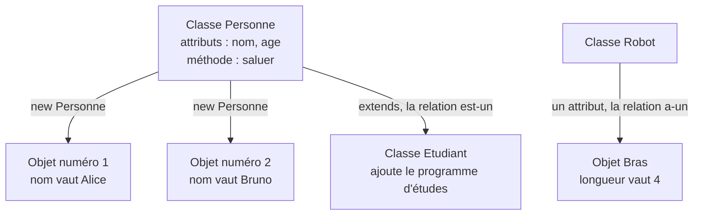
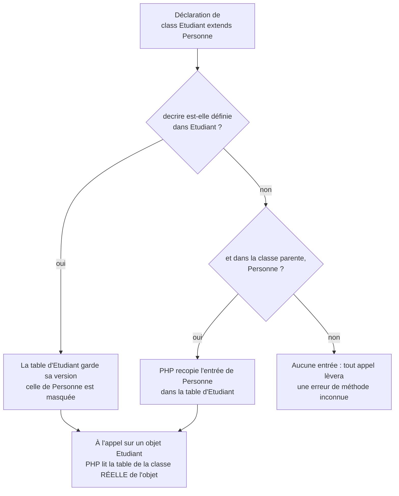
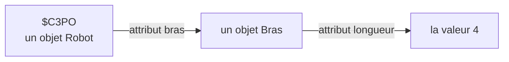
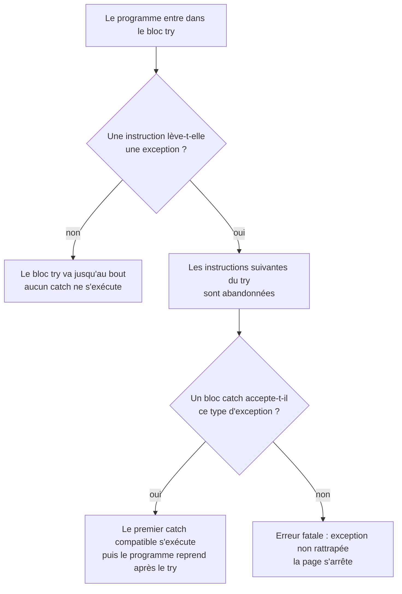
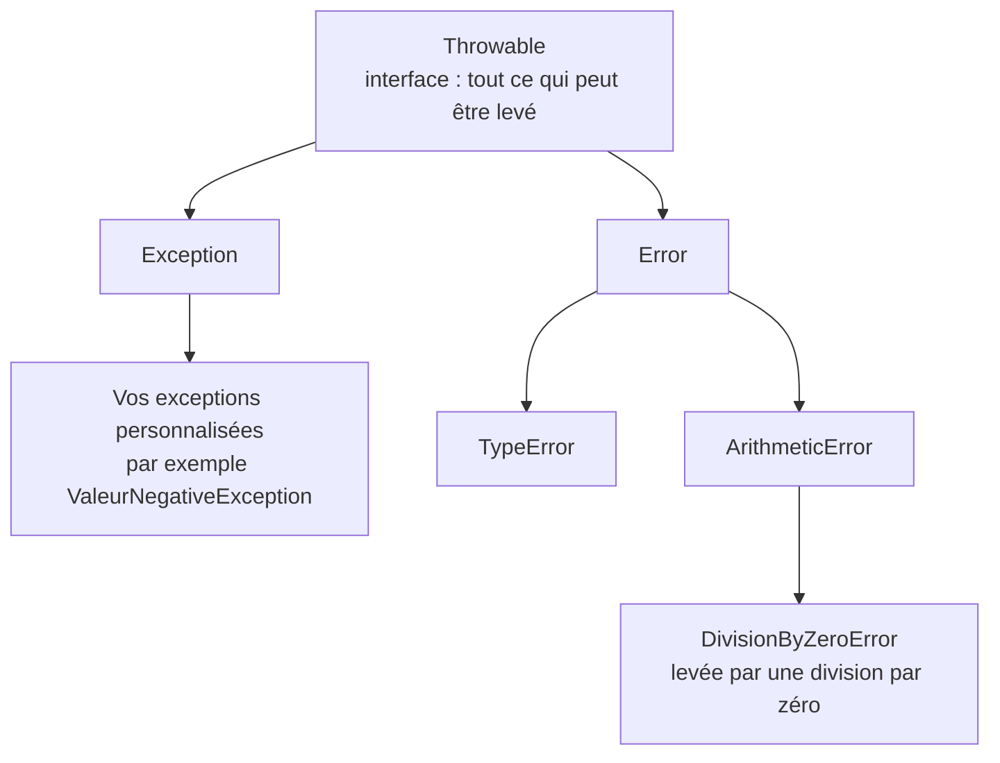
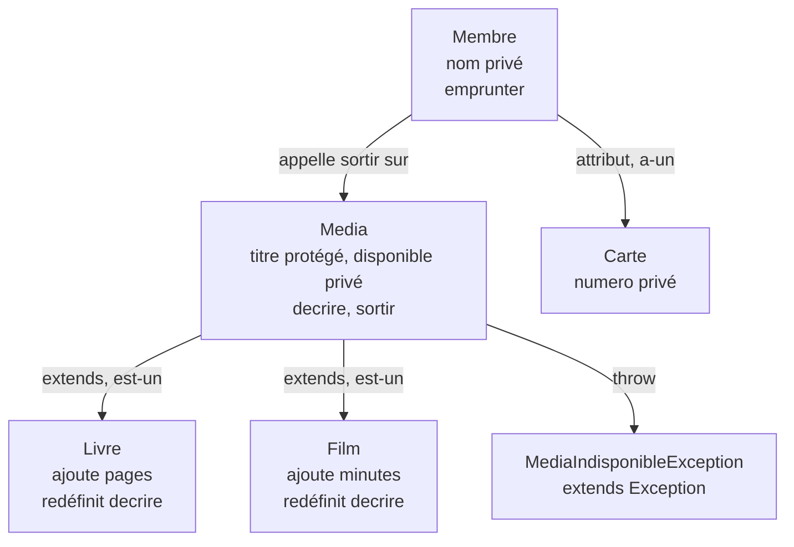

# La programmation orientée objet en PHP

## L'idée en une image {diapos="10, 27, 40"}

Imagine le plan d'architecte d'une maison de quartier. Le plan n'est pas une maison : personne
n'habite dedans. Mais il dit tout ce qu'une maison de ce modèle aura — trois chambres, une entrée,
un compteur électrique — et il dit aussi ce qu'on peut y faire : ouvrir la porte, allumer les
lumières. Avec ce plan, l'entrepreneur bâtit dix maisons identiques dans la rue ; chacune a ensuite
sa propre couleur, ses propres habitants, sa propre facture d'électricité.

**Le plan, c'est la classe. Chaque maison bâtie, c'est un objet.** Une **classe** est un modèle
écrit une seule fois : elle déclare les **données** que chaque exemplaire portera et les **gestes**
qu'on pourra lui demander. Un **objet** est un exemplaire fabriqué à partir de cette classe, avec
ses propres valeurs. Jusqu'ici, tes pages PHP rangeaient les données dans des variables et des
tableaux, et les gestes dans des fonctions séparées. La séance 4 fait tenir les deux au même
endroit.

Le quartier a aussi deux façons de relier ses plans, et ce sont les deux relations que la séance
enseigne. Le plan d'un **chalet** reprend celui de la maison et ajoute une galerie : un chalet
**est une** maison — c'est l'**héritage**. Et une maison **a une** porte, dont le fabricant a son
propre plan : c'est la **composition**. Retiens la petite phrase, elle sert tout le reste de la
leçon : héritage = « est-un », composition = « a-un ».



**Où l'analogie casse — et il faut le dire, sinon elle enseigne des erreurs.** Trois endroits.

1. **Un plan d'architecte est muet ; une classe ne l'est pas.** Le plan décrit des pièces, il
   n'ouvre aucune porte. Une classe, elle, contient le **code** des gestes : c'est l'objet qui sait
   se décrire, se saluer, calculer son solde. C'est même là toute la nouveauté de la séance.
2. **Le plan du chalet est assemblé une fois, il ne se consulte pas à chaque visite.** Au moment où
   l'architecte dépose le plan du chalet, il y reporte ce que le chalet reprend du plan de la
   maison ; ensuite, on ne va plus rien chercher ailleurs. Ce que ce report ne fige pas, c'est le
   contenu : le chalet peut redessiner une pièce à sa façon, et c'est sa version qui vaut. Le
   support de cours emploie le mot « copie » à la diapositive 27 ; on verra à la section sur
   l'héritage pourquoi ce mot est juste sur le mécanisme, mais **ambigu** sur ce qu'il laisse
   croire.
3. **Une maison bâtie ne cache rien à ses visiteurs.** Un objet, si : il peut déclarer qu'une
   donnée n'est lisible que de l'intérieur. Cette idée, l'**encapsulation**, n'a pas d'équivalent
   dans un plan de maison — le plus proche serait une pièce dont seul le propriétaire a la clé.

## En bref — la marche à suivre {diapos="10, 11, 14, 15, 18, 27, 36, 40, 43"}

:::: marche-a-suivre {titre="Écrire une classe PHP, la protéger, la dériver et la composer"}

1. {voir="Une classe, et les deux erreurs de syntaxe du déck"} Déclare la classe, un nom au
   singulier et une majuscule initiale.

   ```php
   class Personne {
   }
   ```

2. {voir="Les attributs"} Déclare à l'intérieur les données que chaque objet portera, avec leur
   visibilité.

   ```php
   public $nom = "Alice";
   ```

3. {voie="cours"} {voir="Le constructeur — et le « $this. » de la diapositive 14"} Écris le
   constructeur, et assigne chaque attribut avec la flèche, jamais avec un point.

   ```php
   public function __construct($n) { $this->nom = $n; }
   ```

4. {voie="moderne"} {voir="Le constructeur — et le « $this. » de la diapositive 14"} Déclare et
   assigne d'un seul geste en typant le paramètre, ce qui fait échouer tôt un attribut oublié. La
   visibilité s'écrit devant le paramètre : `public` ici, pour que l'étape 5 puisse lire l'attribut
   de l'extérieur ; l'étape 7 montre pourquoi on la resserre ensuite.

   ```php
   public function __construct(public string $nom) {}
   ```

5. {voir="Instancier avec « new »"} Fabrique un objet avec `new`, puis atteins ses membres avec la
   flèche.

   ```php
   $p = new Personne("Alice");
   echo $p->nom;
   ```

6. {voir="Les méthodes statiques, et l'opérateur « :: »"} Appelle une fonction utilitaire
   directement sur la classe, sans fabriquer d'objet, avec le double deux-points.

   ```php
   Mathematiques::Facteur(20);
   ```

7. {voir="L'encapsulation"} Mets chaque attribut en `private` par défaut, et n'ouvre que les
   méthodes dont l'appelant a vraiment besoin.

   ```php
   private $solde = 0;
   ```

8. {voir="Les deux jeux-questionnaires du cours"} Fais passer toute modification d'un attribut
   privé par une méthode qui porte la vérification.

   ```php
   public function retirer($montant) { if ($montant > $this->solde) { return false; } }
   ```

9. {voir="L'héritage"} Dérive une classe avec `extends` seulement si tu peux dire « un X est un Y »
   sans hésiter.

   ```php
   class Etudiant extends Personne {
   }
   ```

10. {voir="Ce que le cours dit lui-même contre l'héritage"} Avant d'écrire `extends`, demande-toi
    si la relation n'est pas plutôt « a-un » : dans ce cas, compose.

11. {voir="La redéfinition — que PHP supporte"} Redéfinis dans l'enfant une méthode du parent en
    gardant le même nom, pour en changer le comportement.

    ```php
    public function calculerVolume() { return $this->cote * $this->cote * $this->hauteur; }
    ```

12. {voir="La composition"} Range un objet dans l'attribut d'un autre objet quand la relation est
    « a-un », puis atteins le tout en chaînant les flèches.

    ```php
    $this->bras = new Bras();
    ```

13. {voir="Les exceptions"} Interromps un traitement sur une erreur prévisible en levant une
    exception, et rattrape-la autour de l'appel.

    ```php
    throw new Exception("Le diviseur ne peut pas être zéro");
    ```

::::

## Ce que la séance 4 enseigne, et ce que cette leçon ajoute {diapos="3, 6, 7"}

::: cours {diapos="3, 6, 7"}
La séance s'ouvre sur le rappel de la séance 3, consacrée à la librairie standard de PHP, puis
annonce son propre contenu. Les sections que le support déroule ensuite, dans l'ordre, sont : les
classes, l'encapsulation, l'héritage, le polymorphisme, la relation de composition et les
exceptions, avant une conclusion. La diapositive 6 annonce en outre que la programmation orientée
objet sera abordée « du côté serveur et du côté client ».
:::

Une précision d'abord, pour que tu saches quoi réviser. **La séance ne tient pas la promesse du
côté client** : aucune diapositive ne parle des classes de JavaScript. Tout ce qui suit, du premier
`class` à la dernière exception, se passe en PHP, sur le serveur. Ne va pas réviser les classes
JavaScript pour cette séance-là — mais ne conclus pas non plus que le sujet n'existe pas : le
support l'annonce, il ne le couvre simplement pas.

Cette leçon suit le plan du cours dans son ordre, sans en dévier. Elle y ajoute trois choses qu'un
support de cours, **sommaire par nature**, ne peut pas porter :

- le contenu des captures d'écran projetées, que le fichier du support ne contient qu'en image —
  la sortie exacte d'un appel statique, le code complet d'une classe encapsulée ;
- l'écart entre la façon d'écrire du cours et celle d'aujourd'hui, toujours signalé comme tel,
  jamais substitué en silence ;
- **deux erreurs de syntaxe réelles** dans le code projeté, aux diapositives 14 et 19. Elles ne
  sont pas des maladresses de style : le code qui les porte ne s'exécute pas. Chacune a sa section.

::: complement
**Ce qui n'est PAS dans la séance 4, et qu'il ne faut donc pas réviser ici** : les classes
abstraites, les interfaces, les traits, le mot-clé `final`, les espaces de noms et l'autochargement
par Composer, les énumérations, les propriétés `readonly` et les arguments nommés. Ce sont des
outils courants en production, et cette leçon en nomme quelques-uns au passage — jamais comme
matière d'examen.
:::

## Une classe, et les deux erreurs de syntaxe du déck {diapos="9, 10"}

::: cours {diapos="9, 10"}
Une classe est la description d'un type d'objet : elle regroupe des données et les fonctions qui
travaillent sur ces données. Sa syntaxe tient en une ligne d'ouverture et une accolade fermante :
`class <nom>{ }`. Tout ce qui décrit l'objet — ses attributs, ses fonctions — s'écrit entre ces
deux accolades.
:::

Trois mots à poser tout de suite, parce que toute la séance les emploie.

| Mot | Ce qu'il désigne | Dans le plan de maison |
|---|---|---|
| **classe** | le modèle écrit une fois, qui ne contient aucune donnée réelle | le plan d'architecte |
| **attribut** (ou **propriété**) | une donnée que chaque objet de cette classe portera | « il y aura trois chambres » |
| **méthode** | une fonction déclarée dans la classe, qui travaille sur l'objet | « on peut ouvrir la porte » |

Une classe vide est déjà du PHP valide — inutile, mais valide. C'est le squelette sur lequel tout
se pose :

```php
<?php
class Personne{
}
```

La convention de nommage vaut la peine d'être respectée dès maintenant, parce qu'elle est celle de
tout l'écosystème PHP : **un nom de classe s'écrit au singulier, avec une majuscule initiale**, et
sans le `$` qui marque les variables. `Personne`, `CompteBancaire`, `Robot`. Le `$` réapparaît dès
qu'on parle d'un objet, parce qu'un objet vit dans une variable : `$p`.

::: complement
Le cours dit « attribut », qui est le mot de la modélisation UML. Le manuel officiel de PHP dit
**propriété**, et en PHP 8 le mot « attribut » désigne tout autre chose : des métadonnées posées
au-dessus d'une déclaration. Les deux mots sont acceptés en classe et dans cette leçon ; si tu lis
le manuel de PHP, cherche « propriété ».
:::

**Ce qui vient ensuite, et pourquoi deux sections portent un numéro de diapositive dans leur
titre.** Le support projette du code, et deux de ces extraits contiennent une faute de frappe qui
empêche le fichier de s'exécuter : la diapositive 14 écrit un point là où PHP veut une flèche, la
diapositive 19 oublie le mot `function`. Les deux sont signalées à l'endroit exact où elles
tombent, avec le texte du cours conservé et la forme qui fonctionne à côté.

### Les attributs {diapos="11"}

::: cours {diapos="11"}
Les attributs d'une classe se déclarent à l'intérieur des accolades, avec un mot de visibilité
devant. L'exemple du cours déclare, dans une classe `Personne`, un attribut `$nom` public dont la
valeur initiale est `"Alice"` : `public $nom = "Alice";`.
:::

Cette ligne dit trois choses à la fois, et il faut les séparer pour la comprendre.

```php
<?php
class Personne{
    public $nom = "Alice";
}
```

1. `public` est la **visibilité** : elle dit qui a le droit de toucher à cet attribut. `public`
   veut dire « n'importe quel code, de n'importe où ». La section sur l'encapsulation montre les
   deux autres valeurs possibles et explique pourquoi `public` n'est presque jamais le bon choix.
2. `$nom` est le **nom de l'attribut**. Il porte un `$` au moment de sa déclaration, comme une
   variable.
3. `= "Alice"` est une **valeur par défaut** : tout objet fabriqué à partir de cette classe
   commencera avec ce nom-là, tant que personne ne le change. Elle est facultative ; sans elle,
   l'attribut vaut `null` au départ.

**Le piège de la flèche, et il tombe ici.** Pour lire l'attribut d'un objet, on écrit
`$objet->nom` — **sans `$` devant `nom`**. Le `$` de la déclaration ne se recopie pas à l'usage.
Écrire `$p->$nom` est une autre instruction, parfaitement légale et presque toujours fausse : elle
demande l'attribut dont le nom est contenu dans la variable `$nom`.

```php
<?php
class Personne{
    public $nom = "Alice";
}

$p = new Personne();
echo $p->nom;
```

```text
Alice
```

::: complement
Depuis PHP 7.4, un attribut peut porter un **type** : `public string $nom = "Alice";`. PHP
**contrôle** alors chaque affectation. Attention à ce que ce contrôle fait vraiment : par défaut,
PHP travaille en mode **coercitif**, c'est-à-dire qu'il **convertit** ce qui est convertible.
Ranger le nombre `5` dans `public string $nom;` ne lève aucune erreur — l'attribut contient ensuite
la chaîne `"5"`. L'erreur ne tombe que sur une valeur **non convertible** : `$p->age = "abc";` sur
un `public int $age;` lève `TypeError: Cannot assign string to property Personne::$age of type
int`. Pour exiger le type exact, sans aucune conversion, il faut écrire `declare(strict_types=1);`
en tête du fichier. Le cours n'emploie pas les attributs typés, et le corrigé officiel de la séance
non plus ; c'est pourtant la forme par défaut en production, et son gain principal est ailleurs que
dans la conversion — on verra au sujet du constructeur qu'un attribut typé **jamais initialisé
refuse d'être lu**, ce qui fait remonter un bogue que le code du corrigé laisse passer.
:::

### Le constructeur — et le « $this. » de la diapositive 14 {diapos="14"}

Un objet fraîchement fabriqué part avec les valeurs par défaut de sa classe. C'est rarement ce
qu'on veut : deux personnes n'ont pas le même nom. Il faut donc pouvoir **passer des valeurs au
moment de la fabrication**, et c'est le rôle du constructeur.

::: cours {diapos="14"}
Le cours introduit le constructeur en s'appuyant sur ce que les étudiants connaissent déjà :
« comme en C#, on peut utiliser des constructeurs ». Le constructeur est une fonction de la classe
qui porte le nom réservé `__construct`, avec deux traits de soulignement devant ; elle reçoit des
paramètres et s'en sert pour remplir les attributs de l'objet qu'on est en train de fabriquer.
L'objet en cours de fabrication se désigne, à l'intérieur de la classe, par la variable spéciale
`$this`.
:::

Tout cela est juste, et c'est le mécanisme à retenir. **Le code projeté, lui, ne s'exécute pas** :
la diapositive écrit l'accès à un attribut avec un **point**, `$this.<attribute>`, au lieu de la
flèche `$this->attribut`.

::: correction-du-cours {source="Manuel PHP — language.oop5.properties (l'accès à un membre s'écrit « $this->propriété ») et language.operators.string (l'opérateur « . » est la concaténation de chaînes) ; le corrigé officiel de la séance 4, exercice01.php, qui écrit lui-même « $this->prenom = $p; » ; KnowledgeBase/web/php/php-poo.md, section « Classes, propriétés, méthodes »" diapos="14"}
En PHP, le point n'accède à rien : c'est l'opérateur qui **colle deux chaînes de caractères** bout
à bout. Et ici, PHP ne colle rien du tout : il **rejette la ligne à l'analyse**, avant la moindre
exécution. La grammaire du langage n'admet à gauche d'un `=` qu'une variable, une propriété ou une
case de tableau ; une concaténation n'en est pas une. `php -l` le dit sans détour :
`Parse error: syntax error, unexpected token "=" in personne.php on line 3`. PHP refuse donc le
fichier au lieu de l'exécuter. La nuance se vérifie dans l'autre sens, et elle est instructive : en
**lecture**, `echo $this.nom;` s'analyse très bien — la grammaire accepte une concaténation comme
valeur — et n'échoue qu'à l'exécution, sur
`Fatal error: Uncaught Error: Undefined constant "nom"`. C'est le réflexe de C# et de Java, deux
langages où le point est bien l'opérateur d'accès, et le cours invoque justement C# à cette
diapositive : l'erreur
est d'autant plus contagieuse. **Écris `->` partout, y compris à l'examen** : il ne s'agit pas de
deux écoles de pensée, mais d'une coquille — le corrigé officiel de la séance écrit lui-même
`$this->`, à commencer par le premier exercice.
:::

:::: comparaison
::: vulnerable
```php
class Personne{
    public $nom;
    public function __construct($n){
        $this.nom = $n;
    }
}
```
{lignes="4"} Le point est l'opérateur de concaténation. Cette ligne n'assigne rien et n'est même
jamais exécutée : à gauche d'un `=`, la grammaire de PHP n'accepte qu'une variable, une propriété
ou une case de tableau — une concaténation n'en est pas une, et l'analyseur rejette le fichier
**entier**. Donc **aucune** ligne de la page ne s'affiche — pas même celles qui précèdent.
:::
::: corrige
```php
class Personne{
    public $nom;
    public function __construct($n){
        $this->nom = $n;
    }
}
```
{lignes="3"} Le paramètre `$n` est une variable ordinaire, locale au constructeur : elle disparaît
dès que le constructeur se termine. C'est pourquoi la ligne suivante est indispensable.

{lignes="4"} La flèche relie l'objet courant, `$this`, à son attribut `nom`. La valeur reçue est
recopiée dans l'objet, où elle survivra à la fin du constructeur.
:::
::::

Le constructeur s'appelle tout seul : on ne l'invoque jamais par son nom. C'est `new` qui le
déclenche, en lui passant les arguments écrits entre les parenthèses — la section suivante montre
ce geste.

::: exercice-du-cours {seance="4" ref="1"}
Tout l'exercice tient dans la flèche que cette section vient de décrire, et c'est exactement là que
le corrigé officiel trébuche. Ses deux dernières lignes de constructeur écrivent
`$codePermanent = "";` et `$creditsCompletes = 0;` **sans `$this->`** : ce sont deux variables
locales, détruites à la sortie du constructeur, et les deux attributs restent donc à `null`. Écris
`$this->codePermanent = "";` et `$this->creditsCompletes = 0;`. Deux autres pièges t'attendent :
l'ordre des paramètres du constructeur — **le prénom d'abord**, alors que l'affichage demandé est
« nom, prénom » — et le fait que `substr()` puis `strtoupper()` coupent mal les lettres accentuées,
`mb_substr()` et `mb_strtoupper()` étant les versions qui les respectent.
:::

**Pourquoi ce bogue-là ne se voit pas, et pourquoi le typage le ferait apparaître.** Le code du
corrigé produit quand même le bon affichage, par accident : un attribut non initialisé vaut `null`,
et `null + 3` donne `3` tandis que `null` s'affiche comme une chaîne vide. Rien ne rougit, rien
n'avertit. Voici la même erreur avec un attribut typé :

```php
<?php
class Etudiant{
    private int $creditsCompletes;

    public function __construct(){
        $creditsCompletes = 0;
    }

    public function AjouterCoursComplete(){
        $this->creditsCompletes += 3;
    }
}

$e = new Etudiant();
$e->AjouterCoursComplete();
```

```text
Fatal error: Uncaught Error: Typed property Etudiant::$creditsCompletes
must not be accessed before initialization
```

Le typage ne décore pas le code : il transforme un bogue silencieux en message qui nomme l'attribut
fautif. C'est la raison pour laquelle la voie moderne le recommande partout, et elle vaut la peine
d'être comprise même si l'examen ne l'exige pas.

::: complement
Depuis PHP 8.0, la **promotion de propriétés** écrit la déclaration et l'affectation d'un seul
geste : `public function __construct(private string $nom) {}` déclare l'attribut `$nom`, le rend
privé et l'assigne, sans qu'on écrive une seule fois `$this->`. Le triplet « déclarer, recevoir,
assigner » du cours disparaît — et avec lui l'oubli du `$this->`.
:::

### Instancier avec « new » {diapos="15, 16"}

::: cours {diapos="15, 16"}
Une classe ne sert à rien tant qu'on n'en fabrique pas d'objet. Le cours donne la forme générale
`$variable = new MonObjet(...)` : le mot-clé `new`, le nom de la classe, et entre parenthèses les
arguments que le constructeur attend. La diapositive suivante projette l'exemple complet, de la
déclaration de la classe jusqu'à l'affichage d'un attribut de l'objet fabriqué.
:::

**Instancier**, c'est fabriquer un objet à partir d'une classe. Le résultat s'appelle une
**instance** — le mot est synonyme d'« objet », et l'examen peut employer l'un ou l'autre. Une
seule classe donne autant d'instances qu'on veut, et **chacune a ses propres valeurs** :

```php
<?php
class Personne{
    public $nom;
    public function __construct($n){
        $this->nom = $n;
    }
}

$p1 = new Personne("Alice");
$p2 = new Personne("Bruno");

echo $p1->nom;
echo " et ";
echo $p2->nom;
```

```text
Alice et Bruno
```

Les deux objets viennent du même plan et ne partagent rien : changer `$p1->nom` ne touche pas
`$p2`. C'est la différence essentielle entre une classe et un objet, et c'est aussi ce qui
distingue un objet d'un tableau associatif — le tableau n'impose aucune structure, tandis que le
constructeur, lui, **exige** qu'on lui donne un nom.

Un exemple plus réaliste : plusieurs objets rangés dans un tableau, parcourus comme n'importe
quelle autre donnée. C'est la forme qu'on rencontre dès qu'une page affiche une liste.

```php
<?php
// la classe Personne déclarée plus haut
$groupe = [
    new Personne("Alice"),
    new Personne("Bruno"),
    new Personne("Chloé")
];

foreach ($groupe as $personne){
    echo $personne->nom . "<br>";
}
```

```text
Alice<br>Bruno<br>Chloé<br>
```

**Une distinction à faire tout de suite, parce qu'elle vaut pour toute la séance.** La sortie
ci-dessus est celle du **programme**, telle qu'un terminal la montre : une seule ligne, sans aucun
retour, parce que `echo` n'écrit que ce qu'on lui donne et que `"<br>"` n'est qu'un texte de six
caractères. Dans un navigateur, la page affiche pourtant les trois noms empilés : c'est le
navigateur qui interprète chaque `<br>` comme un saut de ligne, au moment d'afficher le HTML reçu.
Le programme produit du texte ; le navigateur le met en page. Confondre les deux est la source
d'une bonne part des surprises d'affichage en PHP.

::: exercice-du-cours {seance="4" ref="2"}
Cet exercice ne demande rien de plus que ce que tu viens de lire : deux classes, un constructeur
chacune, et des objets qu'on range **dans l'attribut d'un autre objet**. La seule idée neuve est
qu'un répertoire peut pointer vers son parent, et le parent vers le sien, jusqu'à la racine dont le
parent vaut `null`. La méthode qui reconstruit le chemin part donc du fichier et remonte de parent
en parent, en ajoutant chaque nom devant le chemin déjà construit, tant que le parent n'est pas
`null` — une boucle `while`, pas une récursion. Commence par dessiner l'arborescence sur papier :
l'ordre des paramètres des constructeurs est la principale source d'erreurs.
:::

### Les méthodes statiques, et l'opérateur « :: » {diapos="12, 13"}

::: cours {diapos="12, 13"}
Certaines fonctions n'ont pas besoin d'un objet pour travailler. On les déclare `static` dans une
classe, et on les appelle directement sur la classe avec le double deux-points :
`<classe>::<fonction>()`. L'exemple projeté est une classe `Mathematiques` qui contient une
fonction `Facteur`, appelée par `Mathematiques::Facteur(20)` sans qu'aucun objet ne soit fabriqué.
:::

Voici l'exemple du cours, tel qu'il est projeté à la diapositive 13. Il affiche tous les diviseurs
du nombre reçu.

```php
<?php
class Mathematiques {
    public static function Facteur($n){
        for ($x=1;$x<=$n;$x++){
            if ($n % $x == 0){
                echo "$x <br>";
            }
        }
    }
}

Mathematiques::Facteur(20);
```

```text
1 <br>2 <br>4 <br>5 <br>10 <br>20 <br>
```

Encore une seule ligne, pour la raison vue à la section précédente : les six diviseurs de 20 sont
bien là, et c'est le navigateur — pas le programme — qui les empilera en rendant chaque `<br>`.

Deux choses à retenir, et rien de plus, parce que c'est tout ce que le cours dit de `static`.

1. **Le mot-clé `static` devant la fonction** signifie qu'elle appartient à la classe, pas à un
   objet. Conséquence directe : `$this` n'existe pas dans une méthode statique, puisqu'il n'y a
   aucun objet courant à désigner.
2. **Le double deux-points `::` remplace la flèche** pour appeler cette fonction. La flèche part
   d'un objet, `::` part d'une classe. Choisir le mauvais des deux est l'erreur la plus fréquente
   au début : `Mathematiques->Facteur(20)` ne veut rien dire. `$objet::maMethode()`, en revanche,
   est du PHP légal depuis la version 5.3 — PHP prend la classe de l'objet et exécute la méthode
   statique — mais **on ne l'emploie pas dans ce cours**, parce qu'il brouille exactement la
   distinction que cette section te demande de tenir.

::: complement
Le déck ne montre de `static` que cette syntaxe d'appel. Trois voisins existent, utiles à
reconnaître dans du code trouvé en ligne : `self::` désigne, **à l'intérieur** de la classe, la
classe elle-même ; `public const PI = 3.14159;` déclare une constante de classe, qui s'atteint par
`Mathematiques::PI` et ne porte pas de `$` ; et `private static int $appels = 0;` déclare un
attribut partagé par toutes les instances. Aucun des trois n'est matière d'examen.

Une réserve, en revanche, vaut pour la production : une méthode statique ne peut être ni remplacée
en test, ni échangée contre une autre implémentation. Elle est légitime pour une fonction de calcul
pur, comme `Facteur`, qui ne dépend que de ses arguments. Elle devient un piège dès qu'elle touche
à une base de données, à un fichier ou à l'horloge.
:::

## L'encapsulation {diapos="18, 20"}

Jusqu'ici, tous les attributs écrits dans cette leçon étaient `public` : n'importe quelle ligne de
n'importe quel fichier pouvait les lire et les écrire. C'est commode et c'est dangereux, et la
séance consacre six diapositives à expliquer pourquoi.

::: cours {diapos="18, 20"}
Le cours présente les trois niveaux de visibilité de PHP. `public` : accessible partout.
`private` : accessible uniquement à l'intérieur de la classe qui le déclare. `protected` :
accessible à la classe et à ses classes dérivées. Cacher un attribut sert à **protéger les données
de l'objet** : si tout le monde peut modifier une donnée directement, plus rien ne garantit
qu'elle reste cohérente. On expose alors des fonctions qui, elles, contiennent les vérifications.
:::

| Mot-clé | Qui peut y toucher | Quand le choisir |
|---|---|---|
| `public` | n'importe quel code, n'importe où | ce que l'objet offre comme service à l'extérieur |
| `protected` | la classe **et ses classes dérivées** | ce qu'un enfant doit pouvoir utiliser, mais pas le reste du monde |
| `private` | **uniquement** la classe qui le déclare, pas même ses enfants | tout le reste, c'est-à-dire presque tout |

**Une image pour tenir les trois ensemble : le comptoir d'une banque.** La salle d'attente est
`public` : tout le monde y entre. L'arrière-guichet est `protected` : les employés de la
succursale y circulent, pas les clients. La chambre forte est `private` : même un employé ne
l'ouvre pas à la main, il passe par une procédure. Et le service qu'on t'offre au comptoir n'est
pas « modifie toi-même le chiffre de ton solde », c'est « retire 40 dollars » — la vérification de
provision est dans la procédure, pas dans ta bonne volonté.

**Où l'image casse.** À la banque, la porte de la chambre forte existe physiquement, et un voleur
peut la forcer. En PHP, `private` n'est pas une serrure contre un attaquant : c'est une règle que
l'interpréteur fait respecter **au moment de l'accès**. Elle protège contre l'**erreur**, pas
contre la malveillance — le fichier PHP lui-même reste entièrement lisible par qui peut l'ouvrir,
et du code PHP peut même désactiver la règle à la demande avec
`ReflectionProperty::setAccessible(true)`.

**La règle pratique, et elle est simple :** commence tout en `private`. Élargir plus tard une
visibilité ne casse rien ; la restreindre casse tout le code qui s'était mis à en dépendre.

### Le « public getNom() » de la diapositive 19 {diapos="19"}

::: cours {diapos="19"}
La diapositive projette l'exemple qui illustre l'encapsulation : une classe `Personne` dont
l'attribut `$nom` est privé, et une fonction publique `getNom()` qui en retourne la valeur.
L'attribut est caché, la lecture passe par la fonction.
:::

L'idée est la bonne, et c'est celle qu'il faut retenir. Le code projeté, en revanche, **oublie le
mot `function`** dans la déclaration de la méthode.

::: correction-du-cours {source="Manuel PHP — language.oop5.basic : une méthode se déclare avec le mot-clé « function » précédé de sa visibilité ; le corrigé officiel de la séance 4, dont les classes écrivent « public function » ; KnowledgeBase/web/php/php-poo.md, section « Classes, propriétés, méthodes »" diapos="19"}
En PHP, la visibilité ne suffit jamais à déclarer une méthode : il faut écrire
`public function getNom()`. Sans le mot `function`, PHP ne comprend pas la ligne, et l'échec n'est
pas local — c'est une erreur d'analyse, détectée **avant** que la moindre instruction ne
s'exécute. La page entière ne s'affiche pas ; tu n'obtiens pas une demi-page suivie d'un message,
mais un écran vide ou une « Parse error » selon la configuration du serveur. Là encore, il ne
s'agit pas d'une convention du cours : écris `public function` partout, y compris à l'examen.
:::

:::: comparaison
::: vulnerable
```php
class Personne{
    private $nom = "Alice";
    public getNom(){
        return $this->nom;
    }
}
```
{lignes="3"} Il manque le mot `function` entre `public` et le nom de la méthode. Depuis PHP 7.4,
une propriété peut porter un type : l'analyseur prend donc `getNom` pour un **nom de type** et
attend ensuite un `$identifiant` de propriété. Il bute sur la parenthèse et abandonne l'analyse du
fichier — `php -l` rend `Parse error: syntax error, unexpected token "(", expecting variable in
personne.php on line 3`.

{lignes="3"} Le symptôme trompe : comme rien ne s'exécute, un débutant cherche l'erreur dans la
partie de la page qui « ne s'affiche plus », alors qu'elle est dans la classe. Devant une page
entièrement blanche, soupçonne toujours une erreur d'écriture, jamais une erreur de logique.
:::
::: corrige
```php
class Personne{
    private $nom = "Alice";
    public function getNom(){
        return $this->nom;
    }
}
```
{lignes="2"} L'attribut est `private` : `$p->nom` depuis l'extérieur de la classe lève désormais
une erreur au lieu de retourner la valeur. C'est voulu, et c'est tout le propos de la section.

{lignes="3"} `public function` est la forme complète : visibilité, puis le mot `function`, puis le
nom de la méthode. L'ordre des deux premiers mots est libre — `function public` serait refusé, mais
`static public function` et `public static function` sont équivalents.
:::
::::

### Les deux jeux-questionnaires du cours {diapos="21-24"}

::: cours {diapos="21-24"}
Le cours pose deux questions à la classe, chacune suivie de sa réponse à la diapositive suivante.
Le support projette une classe `CompteBancaire` dont l'attribut `$solde` est privé et qui contient
une fonction `estPositif()`, elle aussi privée. Les deux questions sont : pourquoi l'attribut
`$solde` est-il privé, et pourquoi la fonction `estPositif()` l'est-elle également ?
:::

Voici la classe dont il est question, écrite dans la forme du cours :

```php
<?php
class CompteBancaire{
    private $solde = 0;

    public function retirer($montant){
        if (!$this->estPositif($montant)){
            echo "Le montant doit être positif";
            return false;
        }
        if ($montant > $this->solde){
            echo "Fonds insuffisants";
            return false;
        }
        $this->solde -= $montant;
        return true;
    }

    public function getSolde(){
        return $this->solde;
    }

    private function estPositif($n){
        return $n > 0;
    }
}
```

**Première réponse — pourquoi `$solde` est privé.** Parce que sinon, n'importe quelle ligne de
n'importe quel fichier peut écrire `$compte->solde -= 5000;` et contourner entièrement la
vérification de fonds. La promesse « le solde ne descend jamais sous zéro » n'est tenue que si
**tous** les chemins qui modifient le solde passent par la classe. Une règle qui admet une seule
porte dérobée n'est pas une règle.

**Seconde réponse — pourquoi `estPositif()` est privée.** Parce que c'est une brique interne, pas
un service que la banque rend à ses clients. Rendre une méthode publique, c'est promettre qu'elle
existera encore demain avec le même comportement : c'est un engagement, et on n'en prend pas sans
contrepartie. `estPositif()` ne rend aucun service métier ; elle n'a donc aucune raison de figurer
dans ce que la classe offre à l'extérieur.

Retiens la formulation qui vaut pour les deux réponses : **ce qui est public est ce que tu
t'engages à maintenir**. Tout le reste est privé.

### Un accesseur par propriété n'est pas de l'encapsulation {hors-cours}

::: complement
Cette section ne correspond à aucune diapositive : c'est un ajout de cette leçon, parce que le
piège qu'elle décrit est celui dans lequel tombe presque tout le monde juste après avoir compris
`private`. Elle n'est pas matière d'examen, mais elle change la façon d'écrire une classe.
:::

La diapositive 19 montre un `getNom()` : un attribut privé, une méthode publique qui le retourne.
La tentation est alors d'appliquer mécaniquement la recette à tout — un accesseur en lecture et un
accesseur en écriture pour chaque attribut. Un **accesseur** est une méthode dont le seul travail
est de lire ou d'écrire un attribut ; l'usage anglais dit *getter* et *setter*.

Le résultat ressemble à ceci :

```php
<?php
class CompteBancaire{
    private $solde = 0;

    public function getSolde(){
        return $this->solde;
    }

    public function setSolde($valeur){
        $this->solde = $valeur;
    }
}
```

Cette classe **n'encapsule rien**. Tout ce que l'attribut public permettait, `setSolde()` le permet
encore : `$compte->setSolde(-9999);` passe sans broncher. On a ajouté six lignes et un mot-clé pour
obtenir, mot pour mot, le même tableau associatif qu'avant — avec la fausse impression d'avoir
protégé quelque chose.

**La bonne question n'est pas « comment j'expose cette donnée ? », c'est « quelle opération
l'appelant veut-il faire ? ».** Personne ne veut « poser un solde » ; on veut **retirer**, ou
**déposer**. Et ces deux opérations-là, elles, ont des règles :

```php
<?php
class CompteBancaire{
    private $solde = 0;

    public function deposer($montant){
        if ($montant <= 0){
            return false;
        }
        $this->solde += $montant;
        return true;
    }

    public function retirer($montant){
        if ($montant <= 0 || $montant > $this->solde){
            return false;
        }
        $this->solde -= $montant;
        return true;
    }

    public function getSolde(){
        return $this->solde;
    }
}
```

Note que `getSolde()` est resté : **un accesseur en lecture seule est souvent légitime**, parce
que lire une valeur ne casse aucune règle. C'est l'accesseur en **écriture** qui doit se justifier,
à chaque fois. La méthode qui manque à ta classe n'est presque jamais un `set` ; c'est un verbe du
domaine.

## L'héritage {diapos="27, 28"}

::: cours {diapos="27, 28"}
L'héritage permet à une classe de reprendre les attributs et les fonctions d'une autre classe : le
cours dit que la classe enfant « copie » les attributs et fonctions de la classe parent, et peut
ensuite en ajouter qui lui sont propres. La relation qu'exprime l'héritage est un « est-un », et
le cours la présente dans les deux sens : la classe enfant **spécialise** la classe parent, la
classe parent **généralise** ses enfants. La syntaxe s'écrit avec le mot-clé `extends` :
`class Etudiant extends Personne`.
:::

**Une nuance sur le mot « copie », parce qu'elle décide de la suite.** Le mot n'est pas faux sur le
mécanisme. PHP résout l'héritage **au moment où il déclare la classe enfant** : il recopie alors
dans la table des méthodes d'`Etudiant` les entrées qu'il reprend de `Personne`, et il garde même
ce résultat en cache d'une requête à l'autre — ce qui n'aurait aucun sens si la recherche
recommençait à chaque appel. Quand tu demandes `decrire()` à un objet `Etudiant`, PHP trouve donc
la méthode dans la table d'`Etudiant`, sans remonter nulle part.

Ce que le mot « copie » a de gênant est ailleurs : il est **ambigu**. Il peut laisser croire que
l'enfant emporte une version figée du parent, qu'il ne pourrait plus changer. C'est l'inverse : si
`Etudiant` déclare sa propre `decrire()`, c'est celle-là qui occupe sa table, et celle de
`Personne` est masquée. Et ce qui rend une redéfinition effective **partout** — y compris quand une
méthode de `Personne` appelle elle-même `decrire()` — n'est pas une absence de copie, mais le fait
que la version exécutée est choisie d'après la **classe réelle de l'objet** au moment de l'appel :
un objet `Etudiant` exécute la `decrire()` d'`Etudiant`, même si l'appel part d'une ligne écrite
dans `Personne`. L'idée du cours est juste ; c'est le verbe qui demande cette précision.



Voici la forme minimale, dans l'écriture du cours :

```php
<?php
class Personne{
    public $nom;

    public function __construct($n){
        $this->nom = $n;
    }

    public function decrire(){
        return "Je suis " . $this->nom;
    }
}

class Etudiant extends Personne{
    public $programme;
}

$e = new Etudiant("Alice");
$e->programme = "Programmation Web";
echo $e->decrire();
```

```text
Je suis Alice
```

La classe `Etudiant` ne déclare pas `decrire()` : elle en profite quand même, parce que PHP a repris
l'entrée de `Personne` en déclarant `Etudiant`. Elle a en revanche un attribut `$programme` que
`Personne` n'a pas — c'est la
**spécialisation** dont parle le cours.

Trois points que le support souligne et qui tombent souvent à l'examen :

1. **PHP n'a qu'un seul parent par classe** — on dit **héritage simple**, comme en C# et en Java.
   Une classe ne peut pas écrire `extends A, B`.
2. **La relation est « est-un ».** Si tu ne peux pas dire « un X est un Y » sans hésiter, ce n'est
   pas de l'héritage. Un étudiant est une personne : oui. Une voiture est un moteur : non — une
   voiture **a** un moteur, et c'est de la composition.
3. **L'héritage crée un couplage fort.** Le cours le dit lui-même, et la section suivante lui est
   entièrement consacrée.

::: complement
Le déck ne montre pas ce que devient le constructeur quand on hérite, et c'est pourtant la
première chose qui bloque en pratique : **si la classe enfant écrit son propre `__construct`,
celui du parent n'est plus appelé du tout**. Il faut l'appeler à la main, par
`parent::__construct($n);`, en première ligne du constructeur de l'enfant. Le double deux-points
reparaît ici, avec le mot-clé `parent` à la place d'un nom de classe. Sans cet appel, les attributs
déclarés par le parent restent vides, sans le moindre avertissement.
:::

### Ce que le cours dit lui-même contre l'héritage {diapos="29, 30"}

C'est le meilleur passage du support, et il mérite d'être lu deux fois. Un cours d'introduction
s'arrête d'ordinaire à « voici comment faire de l'héritage » ; celui-ci enchaîne immédiatement sur
« voici pourquoi vous devriez souvent vous en passer ».

::: cours {diapos="29, 30"}
« Les relations d'héritage créent un fort couplage… D'autres mesures alternatives peuvent être
préférables comme les relations de compositions et certains patrons de conception
(Ex. Decorator) et architecture (Ex. Injections de dépendances). »
:::

**Le cours a raison, et cette leçon n'a rien à corriger ici — elle n'a qu'à développer.** Trois
termes de cette phrase méritent d'être définis, parce qu'ils reviendront pendant toute ta carrière.

**Le couplage** est la mesure de ce qu'un changement dans un morceau de code oblige à changer
ailleurs. Un couplage **fort** veut dire : « je touche à ceci, et je dois vérifier cela ». Avec
`extends`, l'enfant dépend non pas de ce que le parent **promet**, mais de la façon dont le parent
est **écrit** — y compris des méthodes que le parent s'appelle à lui-même. Le jour où le parent
réorganise sa cuisine interne sans changer une ligne de sa façade, tous ses descendants peuvent
casser. Ce mode d'échec porte un nom, et il vaut la peine de le connaître : le **problème de la
classe de base fragile**.

**Un patron de conception** est une solution éprouvée à un problème d'organisation du code qui
revient souvent, décrite une fois pour toutes et nommée. Le **Decorator** que cite le cours en est
un : plutôt que de créer une sous-classe par variante, on enveloppe un objet dans un autre qui lui
ajoute un comportement et lui délègue le reste.

**L'injection de dépendances** est le fait de **recevoir** ses collaborateurs de l'extérieur au
lieu de les fabriquer soi-même. Une classe qui écrit `new Moteur(150)` dans son constructeur est
mariée à ce moteur-là ; une classe qui reçoit un moteur en paramètre accepte n'importe quel moteur,
y compris un faux moteur le jour où tu voudras la tester.

**La recommandation a un nom et une date.** « Favoriser la composition sur l'héritage » est la
règle la plus ancienne et la plus consensuelle du design objet : elle est formulée ainsi dès 1994,
dans l'ouvrage du « Gang of Four » qui a fondé le vocabulaire des patrons de conception. Trente ans
plus tard, elle n'a pas bougé. La diapositive 29 dit donc exactement ce que dirait un architecte
logiciel d'aujourd'hui.

**Comment trancher, en pratique, devant un cas réel.** Pose-toi les questions dans cet ordre :

1. **Puis-je dire « un X est un Y » sans ajouter « enfin, presque » ?** Si la phrase demande une
   réserve, ce n'est pas de l'héritage.
2. **Est-ce que je contrôle le parent ?** `extends` est raisonnable sur une hiérarchie que tu
   conçois entièrement et qui ne bougera plus — une famille d'exceptions, deux ou trois variantes
   d'un même concept. Il l'est beaucoup moins sur une classe écrite par quelqu'un d'autre.
3. **Est-ce que je veux seulement réutiliser du code ?** C'est le plus mauvais des motifs, et de
   loin le plus fréquent. Hériter pour ne pas retaper trente lignes crée un lien permanent entre
   deux classes qui n'ont rien à voir. Dans ce cas : compose.

Retiens la formule courte : **`extends` pour ce qu'une chose EST ; un attribut pour ce qu'une
chose A.** La section sur la composition montre à quoi ressemble la seconde.

## Le polymorphisme {diapos="32"}

::: cours {diapos="32"}
Le mot **polymorphisme** vient du grec et signifie « plusieurs formes ». Le cours le présente
comme la capacité d'un même nom de méthode à se comporter différemment selon le contexte, et
annonce aussitôt **deux** variantes, qu'il traitera dans cet ordre : la **surcharge**
(*overloading*), puis la **redéfinition** (*overriding*).
:::

**L'image, avant la mécanique.** Donne l'ordre « prépare la salle » à un concierge, à un
technicien de scène et à un professeur. Les trois obéissent au même ordre, et les trois font
quelque chose de complètement différent : l'un passe le balai, l'autre branche les projecteurs, le
troisième écrit au tableau. Tu n'as pas eu à savoir à qui tu parlais pour donner l'ordre — et c'est
tout l'intérêt : **un seul mot, plusieurs comportements, choisis par celui qui reçoit.**

**Où l'image casse.** Deux endroits, et ils comptent. D'abord, un humain qui ne comprend pas
l'ordre te le dira ; PHP, lui, ne vérifie rien à l'avance : si l'objet ne connaît pas la méthode,
l'erreur tombe **au moment de l'appel**, en pleine page. Ensuite, tes trois employés sont des
personnes distinctes par nature, alors qu'en PHP le « qui reçoit » est décidé par la **classe** de
l'objet — donc par du code que tu as écrit, et que tu peux prévoir.

La séance annonce deux variantes. Retiens tout de suite l'essentiel, la suite le détaille : **PHP
n'en supporte qu'une seule**, et c'est heureusement la plus utile des deux.

### La surcharge — que PHP ne supporte PAS {diapos="33-35"}

Avant tout, un mot à définir. La **signature** d'une méthode, c'est son nom accompagné de la liste
de ses paramètres — leur nombre, et dans certains langages leur type. La **surcharge** consiste à
écrire **plusieurs méthodes de même nom** dans la même classe, distinguées uniquement par leur
signature ; c'est alors le langage qui choisit laquelle exécuter d'après les arguments fournis.
C'est une pratique courante en C# et en Java.

::: cours {diapos="33-35"}
Le support présente la surcharge comme la possibilité d'avoir plusieurs fonctions portant le même
nom avec des listes de paramètres différentes, puis projette un exemple de ce que cela donnerait
en PHP, et enfin le message que PHP produit : **PHP ne supporte pas cette forme de
polymorphisme.**
:::

Voici le code projeté, tel quel — la faute de frappe sur « multipler » est celle du support, elle
n'a aucune incidence :

```php
<?PHP
function multiplerValeurs($x, $y){
    return $x * $y;
}

function multiplerValeurs($x, $y, $z){
    return $x * $y * $z;
}

echo multiplerValeurs(1,2);
echo multiplerValeurs(1,2,3);
?>
```

Et le résultat, qui est le point de la démonstration :

```text
Fatal error: Cannot redeclare multiplerValeurs() (previously declared in
C:\xampp\htdocs\polymorphisme_surcharge.php:3) in ...\polymorphisme_surcharge.php on line 7
```

Trois choses à noter, et la troisième est celle qui tombe à l'examen.

1. **La démonstration porte sur des fonctions libres, pas sur des méthodes.** Le verdict est
   exactement le même à l'intérieur d'une classe : un nom, une seule définition.
2. **Le chemin affiché dans le message est celui du poste de l'enseignant** au moment de la
   capture ; sur ton poste, c'est ton propre chemin qui apparaîtra.
3. **Le message à citer est `Cannot redeclare`.** Si une question demande « que se passe-t-il ? »,
   la réponse attendue n'est pas « ça ne marche pas » : c'est une **erreur fatale**, la page ne
   s'affiche pas du tout, et le message nomme la fonction redéclarée ainsi que la ligne de sa
   première déclaration.

La diapositive 35 s'arrête là. Ce qu'elle ne dit pas — que PHP rend le **même service** par
d'autres moyens — fait l'objet de la section « Le vrai polymorphisme en PHP passe par le TYPE »,
un peu plus bas.

### La redéfinition — que PHP supporte {diapos="36-38"}

**Redéfinir**, c'est réécrire dans une classe enfant une méthode qu'elle a héritée de son parent,
en gardant le **même nom**. L'enfant ne crée pas une seconde méthode à côté de celle du parent :
il fournit **sa** version, et c'est elle qui s'exécutera sur ses objets.

::: cours {diapos="36-38"}
Le support présente la redéfinition comme la variante du polymorphisme que PHP supporte, puis la
démontre sur une classe `Carre` dont hérite une classe `PrismeABaseCarre`. La classe enfant
redéfinit `getSurfaceTotale()` et appelle le constructeur du parent par `parent::__construct()`.
:::

L'exemple du support, verbatim :

```php
class Carre {
    protected $longueur;
    protected $largeur;

    public function __construct($lo, $la){
        $this->longueur = $lo;
        $this->largeur  = $la;
    }

    public function getSurfaceTotale(){
        return $this->longueur * $this->largeur;
    }
}

class PrismeABaseCarre extends Carre {
    private $profondeur;

    public function __construct($lo, $la, $pr){
        parent::__construct($lo, $la);
        $this->profondeur = $pr;
    }

    public function getSurfaceTotale(){
        return $this->profondeur * $this->largeur * $this->longueur;
    }
}

$carre  = new Carre(12, 10);
echo $carre->getSurfaceTotale();

$prisme = new PrismeABaseCarre(12, 10, 12);
echo $prisme->getSurfaceTotale();
```

```text
1201440
```

**Une seule ligne, et c'est normal.** Les deux `echo` du support ne posent aucun séparateur : `echo`
n'ajoute rien de lui-même, ni espace ni retour à la ligne. Les deux nombres `120` et `1440` se
collent donc l'un à l'autre. C'est précisément pour éviter cela que les exemples qui suivent
écrivent `. PHP_EOL` — ou `"<br>"` dans une page HTML — après chaque valeur affichée.

**Pourquoi ça fonctionne, et c'est la section sur l'héritage qui l'a déjà expliqué.** Rien n'a été
recopié dans `PrismeABaseCarre`. Quand tu appelles `getSurfaceTotale()` sur le prisme, PHP cherche
d'abord dans `PrismeABaseCarre`, y trouve une version, et s'arrête là : celle de `Carre` est
**masquée**, pas remplacée. Sur un objet `Carre`, c'est toujours celle de `Carre` qui répond. Deux
objets, le même appel écrit à l'identique, deux résultats — voilà le polymorphisme en acte.

**Deux détails de code que le support choisit bien, et qui valent d'être vus.**

- `protected` sur `$longueur` et `$largeur` est **exactement** la bonne visibilité ici : en
  `private`, la classe enfant ne pourrait plus les **lire**. La redéfinition, elle, resterait
  permise — c'est son calcul qui casserait : `$this->longueur` y serait une propriété **non
  définie**, PHP avertirait et le résultat vaudrait `0`. C'est le point pédagogique de l'exemple.
- `parent::__construct($lo, $la)` reprend le double deux-points, avec le mot-clé `parent` à la
  place d'un nom de classe. Sans cet appel, `$longueur` et `$largeur` resteraient vides.

**Trois noms de cet exemple sont trompeurs, et il faut le savoir sans en faire un drame.** La
mécanique enseignée est juste — reproduis-la telle quelle à l'examen — mais la modélisation ne
passerait aucune revue de code.

1. **La classe `Carre` est en réalité un rectangle.** Elle porte une `$longueur` **et** une
   `$largeur` distinctes, et l'objet de démonstration vaut `new Carre(12, 10)`. Un carré n'a qu'un
   côté.
2. **`getSurfaceTotale()` du prisme retourne un volume.** `12 × 10 × 12 = 1440` est bien le volume
   du pavé droit ; sa surface totale vaudrait `2(Lℓ + Lh + ℓh)`, soit 768. Une méthode redéfinie
   qui change **l'unité** de ce qu'elle retourne casse la promesse de la classe mère.
3. **Un prisme n'« est-un » pas un carré.** C'est une relation de dimension, pas de
   spécialisation — exactement le test « est-un » de la section précédente, qui échoue ici.

::: complement
Le troisième point porte un nom et une date : le **principe de substitution de Liskov** (Barbara
Liskov, 1987). Il se dit en une phrase : *partout où le code attend un objet de la classe parente,
on doit pouvoir mettre un objet de la classe enfant sans que rien ne casse.* PHP en applique
d'ailleurs une partie **de force** : une méthode redéfinie doit accepter au moins ce qu'acceptait
celle du parent et retourner au plus ce qu'il retournait, sous peine d'erreur fatale au
chargement. Depuis **PHP 8.3**, l'attribut `#[\Override]` posé au-dessus d'une méthode fait
échouer le code si elle ne redéfinit rien — la parade au nom de méthode mal orthographié, qui
crée silencieusement une méthode neuve au lieu d'en redéfinir une.
:::

### Le vrai polymorphisme en PHP passe par le TYPE {hors-cours}

La diapositive 35 dit **vrai** : PHP refuse deux fonctions ou deux méthodes de même nom, et le
message `Cannot redeclare` le prouve. Mais elle est **incomplète**, et l'incomplétude désoriente :
un étudiant qui retient « PHP ne sait pas faire » ira chercher un contournement dont il n'a pas
besoin. PHP rend le même service, autrement — et ce sont des formes que tu croiseras dès la
première vraie base de code.

**Quatre moyens d'accepter des appels de formes différentes sur un seul nom.**

```php
<?php
// 1. Paramètres par défaut : un seul nom, trois façons de l'appeler.
function creerPoint(int $x = 0, int $y = 0) { return [$x, $y]; }
creerPoint();
creerPoint(3);
creerPoint(3, 4);

// 2. Arguments nommés (PHP 8.0) : on saute ceux qu'on laisse par défaut.
creerPoint(y: 4);

// 3. Arguments variadiques : un nombre libre d'arguments, ramassés en tableau.
function multiplerValeurs(int ...$valeurs): int {
    return array_product($valeurs);
}
multiplerValeurs(1, 2);
multiplerValeurs(1, 2, 3);

// 4. Types d'union (PHP 8.0) : le même paramètre accepte deux types.
function trouver(int|string $identifiant) { }
```

Le troisième bloc mérite un regard : c'est **littéralement** l'exemple de la diapositive 34, qui
échouait, réécrit en une fonction qui fonctionne et accepte les deux appels. Il existe un
cinquième moyen, la **fabrique statique nommée** — `Point::origine()`, `Point::depuisChaine("3,4")`
— souvent le plus lisible de tous, parce que le nom de la fabrique dit ce qu'elle construit.

**Un piège de vocabulaire, à connaître pour ne pas se faire piéger par une recherche web.** Le
manuel de PHP emploie le mot *overloading* — « surcharge » — pour désigner tout autre chose : les
méthodes magiques `__get`, `__set` et `__call`, qui interceptent l'accès à un membre **inexistant ou
inaccessible** — le second cas est le plus surprenant : un membre `private` vu depuis l'extérieur de
la classe déclenche lui aussi ces méthodes.
Elles permettent bien de simuler une surcharge, mais elles cassent l'autocomplétion, l'analyse
statique et le typage. On les réserve à des cas très particuliers, et sûrement pas à cette séance.

**Et le vrai polymorphisme, celui qui sert tous les jours ?** Il ne consiste pas à multiplier les
signatures d'un même nom : il consiste à appeler **le même nom sur des objets de classes
différentes**, sans savoir laquelle, et à laisser PHP choisir l'implémentation à l'exécution.

```php
<?php
$formes = [new Cercle('rouge', 2.0), new Rectangle('bleu', 3.0, 4.0)];

foreach ($formes as $forme) {
    // Le code appelant ignore la classe concrète de $forme : PHP choisit la
    // bonne version de decrire() au moment de l'appel.
    echo $forme->decrire(), PHP_EOL;
}
```

C'est ce que la redéfinition rend possible, et c'est le seul usage du polymorphisme qui change
vraiment la façon d'écrire du code. Retiens la formule : **la surcharge choisit d'après les
arguments, le polymorphisme choisit d'après le type de l'objet.** PHP ne fait que le second — et
c'est le second qui compte.

## La composition {diapos="40, 41"}

::: cours {diapos="40, 41"}
Le support définit la composition en une phrase : « Un attribut d'un objet est un autre objet. »
Il donne ensuite la liste des relations que ce patron sert à modéliser — une école qui possède des
départements, un enseignant qui donne un cours, une fenêtre qui possède un bouton — et précise que
la composition « n'est pas obligatoirement synonyme de propriété, mais peut signifier plus
largement *en relation avec* ».
:::

Souviens-toi du quartier de la première section : un chalet **est une** maison, et une maison **a
une** porte. L'héritage écrivait la première relation ; la composition écrit la seconde. Là où
`extends` fond deux classes en une chaîne, la composition **range simplement un objet dans un
attribut** — rien de plus, et c'est ce qui la rend si souple.

L'exemple du support est le plus court du déck, et il suffit :

```php
<?php
class Bras{
    public $longueur;
    public function __construct(){
        $this->longueur = 4;
    }
}

class Robot{
    public $bras;
    public function __construct(){
        $this->bras = new Bras;
    }
}

$C3PO = new Robot;
echo $C3PO->bras->longueur;
?>
```

```text
4
```



**Le geste nouveau est le chaînage.** `$C3PO->bras` ne donne pas une valeur : il donne un
**objet**. On peut donc enchaîner une deuxième flèche pour atteindre un attribut de cet
objet-là. Rien d'autre à apprendre : c'est deux fois le même geste, appliqué l'un après l'autre.

**Un détail de syntaxe visible dans ce code :** `new Bras` s'écrit **sans parenthèses**. Les
parenthèses sont facultatives **dans tous les cas** — elles ne servent qu'à passer des arguments au
constructeur ; ici il n'y en a aucun à passer, donc `new Bras` et `new Bras()` sont strictement
identiques. La seconde forme est celle que recommande la convention de codage PSR-12 ; les deux
passeront à l'examen.

**Comment choisir entre `extends` et la composition, en un coup d'œil.**

| Critère | `extends` — l'héritage | Un attribut — la composition |
|---|---|---|
| Relation exprimée | « est-un » | « a-un » |
| Couplage | **fort** : l'enfant dépend de la façon dont le parent est écrit | faible : on ne dépend que de ce que le collaborateur promet |
| Changeable en cours d'exécution | non | **oui** : il suffit de ranger un autre objet dans l'attribut |
| Nombre de sources possibles | une seule, PHP n'a qu'un parent par classe | illimité |
| Testabilité | difficile : on traîne le parent avec soi | facile : on remplace le collaborateur par un faux |

::: complement
La forme du cours **crée** le collaborateur : `$this->bras = new Bras;`. En production, on préfère
le **recevoir** de l'extérieur — c'est l'injection de dépendances déjà rencontrée à la section sur
l'héritage.

```php
<?php
final class Moteur
{
    public function __construct(private int $chevaux) {}
    public function demarrer(): string { return "Vroum ({$this->chevaux} ch)"; }
}

final class Voiture
{
    // Le collaborateur est reçu, pas fabriqué : on peut passer un moteur
    // électrique, ou un faux moteur en test, sans toucher une ligne de Voiture.
    public function __construct(private Moteur $moteur) {}
    public function demarrer(): string { return $this->moteur->demarrer(); }
}

$v = new Voiture(new Moteur(150));
```

Au passage, la remarque du support sur « en relation avec » est exacte et correspond à une
distinction officielle de la modélisation UML : dans une **agrégation**, la partie survit au tout
(un enseignant existe encore si son département ferme) ; dans une **composition** stricte, la
partie meurt avec le tout. Le `Robot` du cours crée son `Bras` dans son propre constructeur :
c'est bien une composition stricte.
:::

::: exercice-du-cours {seance="4" ref="4"}
Tout l'exercice est du chaînage, plus une validation dans un constructeur. La piste : écris
d'abord les trois petites classes de parties, puis `Robot`, dont le constructeur crée ses cinq
parties. Le point à ne pas manquer est la validation de `Tete` : une expression faciale non
permise doit empêcher l'objet d'exister, en levant l'exception **depuis le constructeur** —
c'est plus sûr que de corriger la valeur après coup. Deux pièges t'attendent dans le corrigé
officiel : le paramètre `$expression` n'est jamais utilisé (voir l'encadré ci-dessous), et toutes
les propriétés sont `public`, si bien que `$r->tete->expressionFaciale = "colère";` contourne la
validation en une seule ligne. Une validation ne vaut que si l'écriture directe est fermée.
:::

::: correction-du-cours {source="Le corrigé officiel de la séance 4, exercice04.php : le constructeur de Robot déclare le paramètre $expression puis fabrique sa tête avec la chaîne « sourire » écrite en dur ; l'énoncé de l'exercice 4, qui fait de l'expression faciale un paramètre du robot ; KnowledgeBase/web/php/exercices-corriges-poo-application.md, section « Séance 4 — Exercice 4 »"}
Le constructeur de `Robot` **reçoit** `$expression` et ne s'en sert jamais : il fabrique la tête
avec la chaîne `"sourire"` écrite en dur. Conséquence mesurable : `new Robot("rire", 4, 6)`
produit un robot qui sourit. Conséquence plus grave : une expression invalide comme
`new Robot("colère", 4, 6)` ne lève **jamais** l'exception que l'exercice existe pour démontrer —
le seul contrôle d'exception de l'exercice 4 n'est donc jamais réellement éprouvé. La ligne
attendue est `$this->tete = new Tete($expression);`. Retiens aussi le mode d'échec : **un
paramètre mort ne fait rougir personne**, aucun avertissement n'est émis, et le code semble
fonctionner puisqu'il affiche quelque chose.
:::

## Les exceptions {diapos="43"}

::: cours {diapos="43"}
Le support introduit les exceptions comme le moyen d'**interrompre le traitement en cours** quand
une erreur prévisible survient, plutôt que de laisser le programme continuer avec des données
aberrantes. L'exemple qu'il donne est la **division par zéro**.
:::

Trois mots à poser, dans l'ordre. Une **exception** est un objet qui représente une anomalie :
elle porte un message, et son type — le nom de sa classe — dit de quelle sorte d'anomalie il
s'agit. **`throw`** lève l'exception : à cette instruction, l'exécution du bloc en cours s'arrête
net. **`try` / `catch`** entoure le code surveillé : `try` contient les instructions à risque,
`catch` reçoit l'exception si elle survient et décide quoi en faire.

**L'image : le disjoncteur.** Quand un appareil tire trop de courant, le disjoncteur coupe. Il
n'essaie pas de finir le geste en cours, il n'improvise pas une valeur de remplacement : il
interrompt, et il le fait bruyamment, pour qu'un humain vienne voir. Une exception fait la même
chose dans ton code — et pour la même raison : **continuer avec une valeur fausse coûte plus cher
que s'arrêter.**

**Où l'image casse.** Le disjoncteur coupe le courant de toute la maison ; une exception, elle, ne
remonte que le **fil des appels en cours**, et s'arrête au premier `catch` qui accepte son type —
le reste de la page peut très bien continuer. Et surtout, un disjoncteur ne répare rien : il faut
le réarmer à la main. Un `catch`, lui, peut **décider** — afficher un message, essayer autrement,
ou relancer l'exception plus haut.



### Les trois démonstrations du cours {diapos="44-46"}

Le support donne trois exemples, et ils se lisent comme une progression : le moule de base, puis
un type d'exception à soi, puis deux types distingués au même endroit. C'est **ce moule exact** que
reprennent les exercices de la séance.

**(1) L'exception de base.** On lève une `Exception`, la classe fournie par PHP, et on la rattrape.

```php
<?php
$entreeUtilisateur = -4;
try {
    if ($entreeUtilisateur < 0){
        throw new Exception("Erreur nombre négatif");
    }
    echo $entreeUtilisateur;
} catch (Exception $e){
    echo $e->getMessage();
}
```

Note la ligne `echo $entreeUtilisateur;` : elle est **à l'intérieur** du `try`, après le `throw`,
et elle ne s'exécute jamais quand l'exception part. C'est la démonstration visuelle de
l'interruption. Note aussi `$e->getMessage()` : c'est la méthode qui rend la chaîne passée au
constructeur de l'exception.

**(2) L'exception personnalisée.** On se fabrique un **type** d'exception à soi, en héritant
d'`Exception`. Le corps de la classe peut rester vide : c'est le **nom** qui porte l'information.

```php
<?php
class NombreNegatifException extends Exception{
}

$entreeUtilisateur = -4;
try {
    if ($entreeUtilisateur < 0){
        throw new NombreNegatifException("Erreur nombre négatif");
    }
} catch (NombreNegatifException $e){
    echo $e->getMessage();
}
```

**(3) Deux exceptions, deux blocs `catch`.** Un même `try` peut être suivi de plusieurs `catch`,
chacun nommant un type différent.

```php
<?php
class NombreZeroException extends Exception{ }

$entreeUtilisateur = 0;
try {
    if ($entreeUtilisateur < 0){ throw new NombreNegatifException("Erreur nombre négatif"); }
    if ($entreeUtilisateur == 0){ throw new NombreZeroException("0 n'est pas une valeur permise"); }
    echo $entreeUtilisateur;
} catch (NombreNegatifException $e){
    echo $e->getMessage();
} catch (NombreZeroException $e1){
    echo $e1->getMessage();
}
```

**Ces trois blocs se lisent comme un seul fichier, pas comme trois programmes autonomes.** Le
troisième lève une `NombreNegatifException` qui n'est déclarée que dans le deuxième : c'est
**dans cet ordre** qu'il faut les recopier, sous une seule balise `<?php`, en ne déclarant la
classe **qu'une fois**. Redéclarer `class NombreNegatifException` dans le troisième bloc lèverait
un `Cannot redeclare` — exactement l'erreur fatale que la section sur la surcharge vient de
montrer. Un seul autre point mérite d'être signalé : le troisième utilise deux noms de variables
différents, `$e` et `$e1`. Ce n'est pas une obligation — chaque `catch` a sa propre variable, et
réutiliser `$e` partout est parfaitement légal.

::: complement
Un piège d'ordre que ces trois exemples ne peuvent pas montrer, parce que leurs deux types sont
frères : **les blocs `catch` sont examinés de haut en bas, et le premier type compatible gagne.**
Comme `NombreNegatifException` hérite d'`Exception`, écrire

```php
} catch (Exception $e){
} catch (NombreNegatifException $e){
}
```

rend le second bloc **inatteignable** : toute exception aura déjà été avalée par le premier. Aucune
erreur, aucun avertissement — le code se contente de ne jamais faire ce que tu crois. La règle est
donc : **du plus spécifique au plus général, toujours.** Et quand une action doit avoir lieu quoi
qu'il arrive — fermer un fichier, libérer une ressource — un bloc `finally` posé après les `catch`
s'exécute dans tous les cas, exception ou non.
:::

::: exercice-du-cours {seance="4" ref="3"}
La piste : une classe entièrement `static` — on n'instancie jamais `Mathematiques`, on appelle
`Mathematiques::ValeurAbsolue(-3)` — et deux classes d'exception au corps vide héritant
d'`Exception`. Chaque méthode qui refuse une valeur commence par son test et son `throw`, avant
tout calcul. Vérifie tes bornes de boucle **contre une valeur que tu calcules à la main** :
c'est exactement là que le corrigé officiel trébuche, deux fois, comme l'expliquent les deux
encadrés suivants. Et donne un message à tes exceptions : `throw new ValeurNegativeException()`
sans argument produit un `catch` qui affiche « Erreur » sans jamais dire quelle valeur a échoué.
:::

::: correction-du-cours {source="Le corrigé officiel de la séance 4, exercice03.php : « for ($x=2;$x<$n;$x++){ $accumulateur*=$x; } » ; l'énoncé de l'exercice 3 lui-même, qui écrit « Factoriel(5) = 5 * 4 * 3 * 2 * 1 » ; KnowledgeBase/web/php/php-poo.md, section « Ce que montre le corrigé officiel de la séance 4 »"}
**`Factoriel()` s'arrête un cran trop tôt.** La boucle du corrigé est `for ($x=2;$x<$n;$x++)` : elle
multiplie 2, 3 et 4, puis s'arrête **avant** d'atteindre `$n`. `Factoriel(5)` rend donc `24`, alors
que l'énoncé du même exercice annonce `5 * 4 * 3 * 2 * 1`, soit **120**. Le remède tient en un
caractère : `for ($x=2;$x<=$n;$x++)`. Retiens surtout la méthode — c'est l'énoncé lui-même qui
fournissait la valeur attendue, et une seule vérification à la main suffisait à faire tomber le
bogue.
:::

::: correction-du-cours {source="Le corrigé officiel de la séance 4, exercice03.php : « $max = $tab[0]; » suivi de « for ($x=2;$x<$longueur;$x++) » ; KnowledgeBase/web/php/php-poo.md, section « Ce que montre le corrigé officiel de la séance 4 »"}
**`MaxTableau()` ne compare jamais l'élément d'indice 1.** `$max` est initialisé avec `$tab[0]`,
donc la comparaison doit reprendre à l'indice **1** ; or la boucle démarre à `$x = 2`. Le deuxième
élément du tableau est sauté en silence : `MaxTableau([3, 99, 5])` rend **5** au lieu de 99. Le
remède : `for ($x=1;$x<$longueur;$x++)`. C'est la même famille de bogue que le précédent — une
borne de boucle — mais dans l'autre sens, ce qui en fait un bon couple à retenir ensemble :
**vérifie toujours le premier et le dernier tour de tes boucles, pas ceux du milieu.**
:::

Un troisième point, plus incertain celui-là, concerne `Facteur()` : l'énoncé demande de lever
`ValeurIncorrecteException` pour une valeur **inférieure à 2**, alors que le corrigé teste `< 0`.
<!-- à-vérifier: l'énoncé de l'exercice 3 demande ValeurIncorrecteException pour une valeur inférieure à 2, le corrigé officiel teste « $n < 0 » — quelle version est retenue à la correction ? La réponse ne vit ni dans le code source de PHP ni dans une spécification, mais dans la pratique de l'enseignant. Source : renvois-diapos-php-04.md §1a n° 5, et KnowledgeBase/web/php/php-poo.md. -->
Les deux versions se défendent à la lecture de la consigne, et l'écart n'est pas tranchable depuis
le dépôt. En attendant, la version prudente est celle de l'énoncé, qui est plus stricte : elle
refuse aussi `Facteur(0)` et `Facteur(1)`, dont le premier fait de toute façon échouer le calcul.

### Quand une exception personnalisée vaut la peine {diapos="47"}

::: cours {diapos="47"}
L'enseignant donne l'argument en une phrase : on préfère des exceptions personnalisées « si le code
peut possiblement déclencher plusieurs types d'exception au même endroit afin de les gérer
distinctement ».
:::

**Cette phrase est exacte, et c'est le seul critère qui compte.** Elle mérite d'être lue à
l'envers, parce que c'est dans ce sens-là qu'elle sert : **une exception personnalisée qui n'est
jamais rattrapée séparément n'apporte rien.** Si tous tes `catch` finissent par écrire la même
chose, tu as fabriqué dix classes vides pour rien — une `Exception` avec un bon message aurait
fait le travail.

Le bon réflexe est donc une question, posée avant d'écrire la classe : **« est-ce que quelqu'un,
quelque part, va vouloir traiter ce cas-ci autrement que les autres ? »** Si la réponse est oui,
le type dédié se justifie ; il permet un `catch` ciblé, et il documente le contrat de ta méthode.
Si la réponse est non, contente-toi d'un message clair.

Dans l'exercice 3, la réponse est **oui** : `ValeurNegativeException` et `ValeurIncorrecteException`
existent précisément pour qu'un appelant puisse distinguer « tu m'as donné un nombre négatif » de
« tu m'as donné une valeur hors du domaine permis ». C'est le cas d'école de la diapositive 47.

::: complement
Deux habitudes de production, qui ne coûtent rien à prendre tout de suite. D'abord, **donne
toujours un message** à l'exception que tu lèves, et mets-y la valeur fautive :
`throw new ValeurNegativeException("Factoriel indéfini pour $n");`. Ensuite, quand c'est possible,
**hérite d'un type plus précis qu'`Exception`** : PHP fournit déjà `InvalidArgumentException`
(mauvais argument), `RuntimeException` (panne à l'exécution) et quelques autres, et hériter du bon
type permet à du code qui ne connaît pas ta classe de la rattraper quand même correctement.
:::

### « Error » n'est pas « Exception » — le piège de la division par zéro {diapos="43"}

Reviens à la diapositive 43 : elle donne « diviser par 0 » comme exemple canonique d'erreur
prévisible à traiter par exception. L'intuition est bonne — c'est bien le genre de cas qu'il faut
prévoir. Mais en PHP, **ce cas-là précisément n'est pas une `Exception`**, et c'est le piège le
plus rentable de toute la séance.

```php
<?php
class ValeurNegativeException extends Exception { }

try {
    echo 20 / 0;
} catch (ValeurNegativeException $e){
    echo "Erreur <br>";
} catch (Exception $e){
    echo "Attrapé par le catch général";
}
```

```text
PHP Fatal error: Uncaught DivisionByZeroError: Division by zero
```

**Ni l'un ni l'autre des deux `catch` n'a rattrapé quoi que ce soit.** La page meurt. Pour
comprendre pourquoi, il faut connaître la hiérarchie que PHP a mise en place à partir de sa
version 7.



Trois règles se lisent directement sur ce schéma, et elles suffisent.

1. **`Exception` et `Error` sont deux branches séparées.** Elles n'ont aucun ancêtre commun autre
   que l'interface `Throwable`.
2. **`catch (Exception $e)` ne couvre que la branche de gauche.** Il n'attrape donc **jamais** une
   `Error` — ni `DivisionByZeroError`, ni `TypeError`, ni l'appel d'une méthode sur `null`.
3. **`catch (Throwable $t)` couvre les deux.** C'est le seul filet qui attrape tout — à n'utiliser
   qu'en tout dernier recours, au sommet d'une application, jamais autour de trois lignes de
   calcul.

La séparation a une intention : l'idée d'origine est qu'une `Exception` signale une situation que
le programme peut raisonnablement traiter, tandis qu'une `Error` signale un défaut du programme
lui-même, qu'il vaut mieux corriger que rattraper.

::: correction-du-cours {source="Manuel PHP — classe DivisionByZeroError, qui étend ArithmeticError, donc Error, et non Exception ; manuel PHP — language.exceptions, où Exception et Error implémentent toutes deux l'interface Throwable depuis PHP 7 ; KnowledgeBase/web/php/php-poo.md, section « Les exceptions telles que le cours les montre »" diapos="43"}
La diapositive 43 propose la division par zéro comme exemple d'erreur à traiter par exception, mais
en PHP ce cas-là ne produit pas une `Exception` : depuis **PHP 8.0**, l'opérateur `/` appliqué à un
diviseur nul lève une **`DivisionByZeroError`**, qui appartient à la branche `Error`. Les
opérateurs `%` et `intdiv()` s'y comportaient déjà ainsi depuis PHP 7.0. **Ce que le cours veut
enseigner reste valable** — la division par zéro est bien une erreur prévisible, et il faut bien la
prévoir — mais la parade correcte est de **tester le diviseur avant de diviser**, et de lever ta
propre exception, plutôt que d'espérer qu'un `catch (Exception)` fasse le travail.
:::

**Et maintenant le point délicat, parce qu'il est facile d'accuser la mauvaise personne.**
L'exercice 3 demande une classe `Mathematiques` avec une méthode `Division($a, $b)`, et le corrigé
officiel écrit :

```php
public static function Division($a, $b){
    if ($b < 0){throw new ValeurNegativeException();}
    return $a / $b;
}
```

**Ce n'est pas une erreur du corrigé.** L'énoncé de l'exercice demande explicitement de lever
l'exception pour « un diviseur inférieur à 0 », et le corrigé fait **exactement** cela : sur ce
point, il est conforme. Le trou est ailleurs, et il est **partagé par l'énoncé et le corrigé** :
ni l'un ni l'autre ne traite le cas `$b == 0`. Si bien que `Division(20, 0)` lève une
`DivisionByZeroError` que le `catch (ValeurNegativeException)` de la démonstration ne rattrape pas,
et la page s'arrête sur une erreur fatale — alors même que la diapositive 43 donnait ce cas-là en
exemple. **Le support se contredit à distance avec son propre exercice**, et il n'y a personne à
blâmer là-dedans : c'est un angle mort, pas une faute.

Le complément à écrire toi-même tient en deux lignes, et il **garde** le test demandé par
l'énoncé :

```php
public static function Division($a, $b){
    if ($b == 0){throw new ValeurIncorrecteException("Division par zéro impossible");}
    if ($b < 0){throw new ValeurNegativeException("Diviseur négatif : $b");}
    return $a / $b;
}
```

**Comment arbitrer, et c'est la règle générale de cette leçon** : à l'examen, donne la réponse du
cours — le test `< 0` que l'énoncé exige, et rien de plus si la question s'arrête là. En
production, ajoute le test du zéro : il coûte une ligne et il transforme une page morte en message
lisible. Les deux ne s'opposent pas, le second contient le premier.

::: complement
**Et le piège ne se limite pas à l'opérateur `/`.** Le modulo `%` lève lui aussi une
`DivisionByZeroError` quand son diviseur vaut zéro — même branche `Error`, même `catch (Exception)`
qui ne rattrape rien. La leçon à en tirer dépasse PHP : dès qu'une division **ou un modulo**
apparaît dans ton code, le diviseur est une **entrée à valider**, au même titre qu'un champ de
formulaire. La question à se poser n'est pas « d'où vient cette valeur ? » mais « **peut-elle valoir
zéro ?** » — et si rien dans le code ne l'en empêche, c'est qu'il faut l'écrire.
:::

## Exemple simple {diapos="10, 11, 14, 15"}

Isolons un seul mécanisme, celui des étapes 1 à 5 de la marche à suivre : **déclarer une classe,
en fabriquer deux objets, les afficher**. Pas d'héritage, pas de composition, pas d'exception —
ils viennent à l'exemple suivant.

```php
<?php
class Chien {
    public $nom;
    public $age;

    public function __construct($nom, $age) {
        $this->nom = $nom;
        $this->age = $age;
    }

    public function decrire() {
        return $this->nom . " a " . $this->age . " ans";
    }
}

$rex  = new Chien("Rex", 3);
$fido = new Chien("Fido", 7);

echo $rex->decrire() . PHP_EOL;
echo $fido->decrire() . PHP_EOL;

$rex->age = 4;

echo $rex->decrire() . PHP_EOL;
echo $fido->decrire() . PHP_EOL;
```

Ce programme s'exécute tel quel, sans rien autour. Voici ce qu'il imprime :

```text
Rex a 3 ans
Fido a 7 ans
Rex a 4 ans
Fido a 7 ans
```

Lis-le morceau par morceau : chacun fait exactement une chose déjà vue.

1. `class Chien {` ouvre le **plan**. Rien n'existe encore : aucun chien n'a été fabriqué, aucune
   mémoire n'a été réservée pour un nom.
2. `public $nom;` et `public $age;` déclarent les **attributs** — les deux cases que *chaque* chien
   portera. Elles sont déclarées une fois, dans le plan, et existeront en autant d'exemplaires
   qu'il y aura d'objets.
3. `__construct($nom, $age)` est le **constructeur** : PHP l'appelle tout seul, au moment du `new`,
   et lui seul. `$this->nom = $nom;` range la valeur reçue dans la case de l'objet *en train de
   naître*. La flèche, jamais le point — c'est la correction de la diapositive 14.
4. `decrire()` est une **méthode** : une fonction qui vit dans la classe et qui peut lire les
   attributs de son propre objet par `$this`. Elle ne reçoit aucun paramètre parce qu'elle a déjà
   tout ce qu'il lui faut.
5. `new Chien("Rex", 3)` fabrique l'objet et retourne sa référence, qu'on range dans `$rex`. Le
   second `new` recommence **de zéro** avec d'autres valeurs.

**Le point à emporter est dans les quatre lignes de sortie, pas dans les vingt lignes de code.**
`$rex->age = 4;` ne touche qu'un seul chien : la troisième ligne change, la quatrième est
identique à la deuxième. Les deux objets partagent le **plan**, jamais les **données**. C'est la
différence la plus importante de toute la séance, et elle se vérifie en comparant deux lignes.

::: note
`PHP_EOL` est le saut de ligne du système : il sépare bien les lignes dans le **code source** de la
page, mais un navigateur, lui, ne l'affiche pas comme un retour à la ligne. Dans une page HTML,
écris `"<br>"` à la place — ou regarde la source avec `Ctrl+U`. Les sorties de cette leçon sont
données telles qu'un terminal les montre, parce que c'est là que le compte des lignes se lit sans
ambiguïté.
:::

::: complement
Deux attributs `public` dans un exemple d'introduction, c'est un choix assumé : il fallait qu'on
puisse écrire `$rex->age = 4;` pour voir l'indépendance des objets. C'est précisément ce que la
section sur l'encapsulation ferme ensuite — dans du vrai code, `$age` serait `private`, et une
méthode `vieillir()` porterait la règle « un âge ne diminue jamais ». Retiens l'ordre : on ouvre
pour montrer, on ferme pour livrer.
:::

## Exemple complet {diapos="18, 27, 36, 40, 43-46"}

Mettons maintenant **tout** ensemble dans un seul programme qui tient debout : une classe mère qui
encapsule ses données, deux classes filles qui redéfinissent la même méthode, un objet rangé dans
l'attribut d'un autre objet, et une exception levée puis rattrapée. C'est le catalogue d'une petite
bibliothèque.

```php
<?php
class MediaIndisponibleException extends Exception { }

class Media {
    protected $titre;
    private $disponible = true;

    public function __construct($titre) {
        $this->titre = $titre;
    }

    public function getTitre() {
        return $this->titre;
    }

    public function sortir() {
        if ($this->disponible === false) {
            throw new MediaIndisponibleException("« " . $this->titre . " » est déjà sorti");
        }
        $this->disponible = false;
    }

    public function decrire() {
        return "Média : " . $this->titre;
    }
}

class Livre extends Media {
    private $pages;

    public function __construct($titre, $pages) {
        parent::__construct($titre);
        $this->pages = $pages;
    }

    public function decrire() {
        return "Livre : " . $this->titre . " (" . $this->pages . " pages)";
    }
}

class Film extends Media {
    private $minutes;

    public function __construct($titre, $minutes) {
        parent::__construct($titre);
        $this->minutes = $minutes;
    }

    public function decrire() {
        return "Film : " . $this->titre . " (" . $this->minutes . " minutes)";
    }
}

class Carte {
    private $numero;

    public function __construct($numero) {
        $this->numero = $numero;
    }

    public function getNumero() {
        return $this->numero;
    }
}

class Membre {
    private $nom;
    private $carte;

    public function __construct($nom, $numero) {
        $this->nom   = $nom;
        $this->carte = new Carte($numero);
    }

    public function emprunter($media) {
        $media->sortir();
        echo $this->nom . " (carte " . $this->carte->getNumero() . ") emprunte "
           . $media->getTitre() . PHP_EOL;
    }
}

$catalogue = [new Livre("Le Horla", 96), new Film("Les Ordres", 107)];

foreach ($catalogue as $media) {
    echo $media->decrire() . PHP_EOL;
}

$alice = new Membre("Alice", 20260415);

foreach ($catalogue as $media) {
    try {
        $alice->emprunter($media);
    } catch (MediaIndisponibleException $e) {
        echo "Refusé : " . $e->getMessage() . PHP_EOL;
    }
}

try {
    $alice->emprunter($catalogue[0]);
} catch (MediaIndisponibleException $e) {
    echo "Refusé : " . $e->getMessage() . PHP_EOL;
}
```

```text
Livre : Le Horla (96 pages)
Film : Les Ordres (107 minutes)
Alice (carte 20260415) emprunte Le Horla
Alice (carte 20260415) emprunte Les Ordres
Refusé : « Le Horla » est déjà sorti
```



**Six mécanismes de la séance s'y jouent, et chacun tient en une ligne repérable.**

1. **L'encapsulation**, `private $disponible = true;`. Personne, hors de `Media`, ne peut écrire
   `$livre->disponible = true;` pour ressortir un média déjà emprunté : le seul chemin qui mène à
   cette donnée est `sortir()`, et `sortir()` porte la règle. C'est la leçon du jeu-questionnaire
   sur `$solde` du cours, appliquée.
2. **`protected` là où il faut, et pas ailleurs.** `$titre` est `protected` parce que `Livre` et
   `Film` le lisent dans leur `decrire()` ; `$disponible` reste `private` parce qu'aucune classe
   fille n'a de raison d'y toucher. La visibilité se choisit attribut par attribut, jamais en bloc.
3. **L'héritage**, `class Livre extends Media`. `Livre` n'a pas une ligne de code pour le titre ni
   pour la disponibilité — il les obtient de son parent, et `parent::__construct($titre)` va
   chercher le constructeur de la classe mère avant d'ajouter son propre `$pages`.
4. **La redéfinition**, donc le polymorphisme. `decrire()` existe en trois exemplaires : celui de
   `Media`, celui de `Livre`, celui de `Film`. La boucle `foreach` écrit **un seul appel**,
   `$media->decrire()`, et PHP choisit à l'exécution lequel répondre, d'après la classe réelle de
   l'objet.
5. **La composition**, `$this->carte = new Carte($numero);`. L'attribut `$carte` d'un `Membre` ne
   contient pas un nombre : il contient un **objet**. On l'atteint ensuite en chaînant,
   `$this->carte->getNumero()`, exactement comme le `$C3PO->bras->longueur` du support.
6. **L'exception**, `throw new MediaIndisponibleException(...)`. Un média déjà sorti n'est pas une
   panne du programme : c'est une situation prévisible, et c'est le cas d'usage que la
   diapositive 43 décrit. La méthode refuse en levant, l'appelant décide quoi faire en rattrapant.

**Le morceau que la section sur le polymorphisme te devait.** Plus haut, le tableau
`$formes = [new Cercle(...), new Rectangle(...)]` illustrait le principe avec deux classes qui
n'étaient écrites nulle part : c'était un schéma, pas un programme. Ici, les deux classes existent,
le tableau les mélange, la boucle appelle le même nom sur les deux — et les deux premières lignes
de sortie ne se ressemblent pas. **Voilà le polymorphisme réellement exécuté** : un seul appel
écrit, deux implémentations choisies.

**Maintenant, compte les lignes de sortie — c'est là que se cache le raisonnement.** Il y a trois
gestes d'emprunt dans le programme (deux dans la boucle, un après), et pourtant la sortie porte
**cinq** lignes, pas six.

- Les **deux premières** viennent de la première boucle, celle qui ne fait qu'afficher le
  catalogue. Elles ne sont pas des emprunts.
- Les **deux suivantes** viennent de la deuxième boucle : les deux médias sont disponibles, donc
  `sortir()` ne lève rien et l'`echo` s'exécute deux fois.
- La **cinquième** vient du troisième emprunt, sur le livre déjà sorti : `sortir()` lève,
  l'exécution saute directement au `catch`, et c'est le message d'erreur qui s'imprime.

**L'ordre des deux instructions de `emprunter()` décide de ce compte.** `$media->sortir()` est
appelé **avant** l'`echo`. Une exception levée là fait quitter la méthode immédiatement : l'`echo`
n'est jamais atteint, et aucune ligne de succès n'est écrite. Si l'on inversait les deux lignes, le
programme imprimerait **six** lignes, dont une mensongère — « Alice emprunte Le Horla » suivie
aussitôt de « Refusé ». Retiens la règle générale : **la vérification s'exécute avant l'effet, pas
après**, et le journal d'une opération s'écrit une fois qu'elle a réussi.

::: complement
Trois gestes de production que cet exemple laisse volontairement de côté, pour rester dans la
syntaxe du cours.

```php
<?php
abstract class Media
{
    public function __construct(protected string $titre) {}

    // Aucune version par défaut : chaque classe fille DOIT écrire la sienne.
    abstract public function decrire(): string;
}

final class Livre extends Media
{
    public function __construct(string $titre, private int $pages)
    {
        parent::__construct($titre);
    }

    #[\Override]
    public function decrire(): string
    {
        return "Livre : {$this->titre} ({$this->pages} pages)";
    }
}
```

**`abstract`** empêche `new Media("...")`, qui n'a aucun sens ici — un média sans genre n'existe
pas. **Le typage des paramètres et du retour** fait échouer l'appel fautif à l'entrée de la
méthode, pas trois écrans plus loin. Et **`#[\Override]`** (PHP 8.3) fait échouer le code si
`decrire` ne redéfinit rien — la parade au nom de méthode mal orthographié. De même,
`emprunter(Media $media): void` refuserait qu'on lui passe une `Carte` par erreur. Rien de tout
cela n'est exigé à l'examen de la séance 4 ; tout est attendu dans une équipe.
:::

## À toi de jouer {hors-cours}

Voici un exercice **de cette leçon**, distinct des quatre exercices du cours cités plus haut. Il
part du programme de bibliothèque ci-dessus — recopie-le, puis fais-le grandir en trois temps.

**L'énoncé.**

1. **Ajoute une troisième classe fille**, `Revue`, qui hérite de `Media` et ajoute un attribut
   `$numero`. Sa méthode `decrire()` doit rendre par exemple `Revue : Québec Science (no 412)`.
   Range-la dans le même `$catalogue` que les autres, sans toucher à la boucle d'affichage.
2. **Ajoute une méthode `rendre()` à `Media`**, qui remet le média disponible. Elle doit lever une
   exception si le média n'était **pas** sorti : rendre deux fois le même livre est une erreur
   prévisible, exactement comme l'emprunter deux fois.
3. **Donne un quota au membre.** Un `Membre` ne peut pas avoir plus de **deux** médias en main.
   Au troisième emprunt, `emprunter()` lève une `QuotaDepasseException` — une classe distincte de
   `MediaIndisponibleException`. Écris ensuite un appel entouré de **deux `catch`**, qui affichent
   deux messages différents.

**La piste de résolution, si tu bloques.**

- Pour le point 1, tu n'as **rien** à changer ailleurs que dans la nouvelle classe : c'est tout
  l'intérêt du polymorphisme. Si tu te surprends à écrire un `if` sur le genre du média dans la
  boucle d'affichage, c'est le signe que la redéfinition n'a pas été utilisée.
- Pour le point 2, la méthode `rendre()` est le miroir exact de `sortir()` : même test, inversé,
  même geste d'affectation, inversé. Elle vit dans `Media` et nulle part ailleurs, parce que
  `$disponible` est `private` et que c'est très bien ainsi.
- Pour le point 3, il te faut un compteur dans `Membre` — un attribut privé, incrémenté après
  l'emprunt réussi. Pose-toi la question de l'ordre, comme dans l'exemple complet : le compteur
  monte-t-il avant ou après l'appel à `sortir()` ? Un emprunt refusé ne doit pas consommer une
  place du quota.
- Pour les deux `catch`, souviens-toi de la diapositive 47 : deux types distincts ne se justifient
  que si l'appelant les traite **différemment**. Écris donc deux messages qui ne se ressemblent
  pas, sinon une seule classe d'exception aurait suffi.

**Trois questions à te poser avant d'ouvrir le quiz**, et si l'une te laisse hésitant, relis la
section correspondante.

1. Pourquoi `$this.nom = $n;` fait-il échouer toute la page, alors que `$this->nom = $n;`
   fonctionne — et qu'est-ce que le point fait en PHP ?
2. Si `Carre` et `PrismeABaseCarre` définissent toutes deux `getSurfaceTotale()`, laquelle
   s'exécute sur un objet `PrismeABaseCarre`, et laquelle sur un objet `Carre` ?
3. Pourquoi `catch (Exception $e)` ne rattrape-t-il **pas** une division par zéro, alors que la
   diapositive 43 la donne en exemple d'erreur à traiter par exception ?

[[quiz]]

## À retenir {diapos="49"}

::: cours {diapos="49"}
La conclusion du support tient en une phrase : PHP supporte la plupart des concepts orientés objet,
et la façon de les écrire y ressemble beaucoup à ce qui se fait dans les autres langages à objets.
:::

C'est exact, et c'est une bonne nouvelle : ce que tu viens d'apprendre se transporte presque tel
quel en C#, en Java ou en TypeScript. Restent les cinq points à emporter si tu ne dois en garder
que cinq.

- **Une classe est un plan, un objet en est un exemplaire.** Les objets partagent le code, jamais
  les données : modifier l'attribut de l'un ne touche pas l'autre. Le constructeur remplit les
  attributs du nouvel objet, et `$this->` — **avec la flèche** — est le seul chemin vers eux.
- **`private` par défaut, et on n'ouvre que ce qui doit l'être.** L'encapsulation ne sert pas à
  cacher : elle sert à garantir qu'une donnée ne change que **par un chemin qui porte la règle**.
  Un attribut privé doublé d'un accesseur et d'un mutateur qui ne vérifient rien n'encapsule rien.
- **`extends` s'écrit quand « un X est un Y » se dit sans hésiter ; sinon, on compose.** Le support
  le dit lui-même à la diapositive 29, et il a raison : l'héritage crée un couplage fort, la
  composition reste souple et testable. Rien n'est « copié » dans la classe fille — la résolution
  se fait à l'exécution, et c'est ce qui rend la redéfinition possible.
- **PHP ne fait pas la surcharge, il fait le polymorphisme — et c'est le second qui compte.** Deux
  méthodes de même nom sont refusées (`Cannot redeclare`) ; mais la même méthode redéfinie dans
  deux classes filles, appelée dans une boucle sur un tableau mélangé, produit deux comportements
  différents à partir d'un seul appel écrit.
- **Une exception interrompt sur une erreur *prévisible*, et `Error` n'est pas `Exception`.** Lève
  depuis l'endroit qui détecte le problème, rattrape depuis celui qui sait quoi en faire. Et
  souviens-toi du piège : `catch (Exception $e)` n'attrape **jamais** une `DivisionByZeroError` —
  un diviseur se teste avant de diviser.

**La règle d'arbitrage, une dernière fois, parce que cette séance en a plus besoin que les autres**
— le support porte deux erreurs de syntaxe et son corrigé trois défauts. À l'examen, **donne la
réponse du cours** : c'est elle qui est évaluée, et les deux erreurs de syntaxe sont de toute façon
des erreurs de frappe que personne ne te reprochera de corriger. En production, applique la version
corrigée, qui contient toujours celle du cours.

## Aller plus loin {diapos="53"}

**Les trois liens que le support donne lui-même à sa dernière diapositive** — ils sont courts,
illustrés, et c'est la façon la plus rapide de revoir la syntaxe avant un examen :

- W3Schools, classes et objets — <https://www.w3schools.com/php/php_oop_classes_objects.asp>
- W3Schools, le constructeur — <https://www.w3schools.com/php/php_oop_constructor.asp>
- W3Schools, les exceptions — <https://www.w3schools.com/php/php_exceptions.asp>

**Le manuel officiel de PHP**, pour ce que W3Schools ne couvre pas — la visibilité en détail, les
classes abstraites, les interfaces, les traits, et la hiérarchie complète des erreurs :

- Manuel PHP, classes et objets — <https://www.php.net/manual/fr/language.oop5.php>
- Manuel PHP, les exceptions — <https://www.php.net/manual/fr/language.exceptions.php>
- Manuel PHP, la classe `DivisionByZeroError` —
  <https://www.php.net/manual/fr/class.divisionbyzeroerror.php>

**Les fiches de la base de connaissances qui ont servi à écrire cette leçon** — ce sont elles qu'il
faut ouvrir pour aller au-delà du programme de la séance :

- `web/php/php-poo.md` — les classes et leurs membres, `static` et l'opérateur `::`, les trois
  visibilités, l'héritage et ses limites, la surcharge refusée et la redéfinition, la composition,
  les exceptions et la hiérarchie `Throwable`, plus une section consacrée aux défauts du corrigé
  officiel de la séance 4 ;
- `web/php/exercices-corriges-poo-application.md`, section « Séance 4 » — les quatre exercices du
  cours corrigés et commentés, un par un.

**Deux notions voisines que cette séance ouvre sans les nommer**, et qui reviendront dès que tu
travailleras en équipe : l'**injection de dépendances**, déjà citée par la diapositive 29, qui
consiste à *recevoir* ses collaborateurs plutôt qu'à les fabriquer ; et les **interfaces**, qui
permettent le polymorphisme sans imposer de classe parente commune — c'est la réponse au reproche
de couplage fort que le support adresse lui-même à l'héritage.
