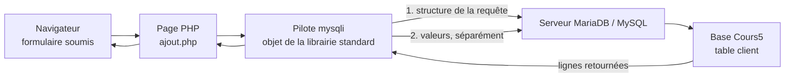
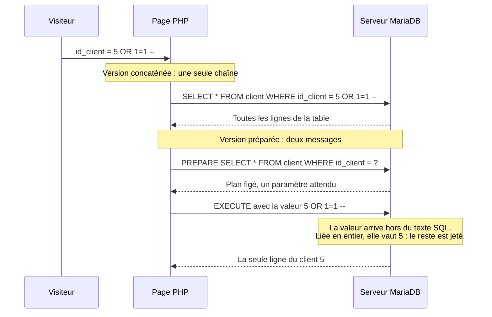
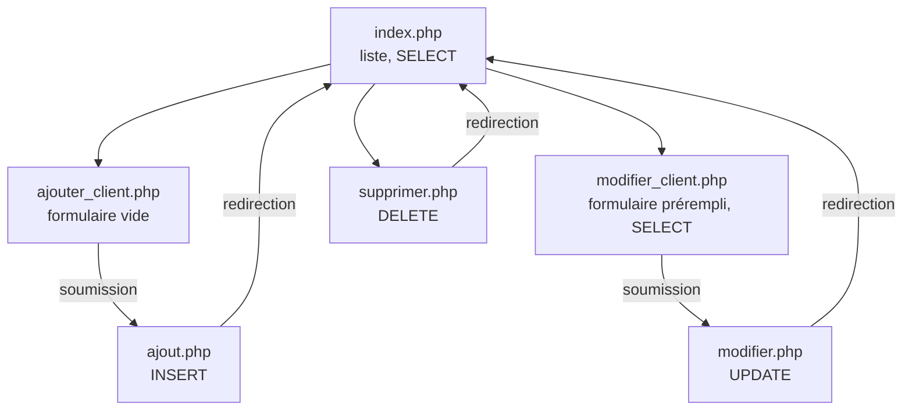

# L'intégration d'une base de données en PHP

## L'idée en une image {diapos="6, 10, 41"}

Imagine le greffe d'un hôtel de ville. Derrière le comptoir dorment les registres : naissances,
permis, taxes. Personne n'entre dans la salle des registres — on remplit un formulaire au guichet,
on le glisse au commis, et le commis revient avec la réponse. Le formulaire est **pré-imprimé** :
les phrases sont déjà écrites, il ne reste que des cases vides à remplir. « Inscrire au registre des
clients : prénom [ ], nom [ ], courriel [ ]. » Quoi que tu écrives dans une case, ça reste le
contenu d'une case. Tu peux écrire « ou effacer tout le registre » dans la case « nom » : ce sera un
nom bizarre, jamais un ordre.

**Le greffe, c'est la base de données. Le commis, c'est le pilote. Le formulaire pré-imprimé, c'est
la requête préparée.** Une **base de données relationnelle** est un logiciel séparé de ton
application, qui range les données en **tables** — des grilles à colonnes fixes et à lignes
numérotées — et qui ne répond qu'à un langage précis. Ce langage est **SQL** (*Structured Query
Language*, « langage de requête structuré »). Ton programme PHP ne touche jamais les fichiers de la
base : il envoie du SQL, il reçoit des lignes. Le support de cours le dit joliment à sa sixième
diapositive : les bases de données sont « en quelque sorte les gardiennes de tout ce qui transige »
dans une application.

Le **pilote** (*driver*) est l'objet PHP qui tient le rôle du commis : il ouvre la conversation avec
le serveur de base de données, transporte ta requête, rapporte le résultat. Le cours en utilise un
seul, `mysqli`.



**Où l'analogie casse, et il faut le dire, sinon elle enseigne des erreurs.** Trois endroits
précis.

1. **Un commis humain devine ; le serveur de base de données ne devine rien.** Un commis qui lit
   « Robert » dans la case « prénom » et « Page » dans la case « nom » corrigera de lui-même une
   inversion. Le serveur, lui, exécute exactement ce qui est écrit, ligne par ligne, et une valeur
   trop longue pour la colonne est tronquée ou refusée sans qu'aucun humain n'intervienne.
2. **Le greffe ne répond pas de ce que tu fais de la réponse.** Le formulaire pré-imprimé protège le
   registre ; il ne protège pas l'affiche que tu iras coller dans le hall avec ce que le commis t'a
   rendu. En clair : la requête préparée défend la **base**, jamais la **page**. C'est une frontière
   différente, et la leçon y revient longuement.
3. **Un commis pourrait relire ton formulaire et changer d'avis ; le serveur, non.** C'est même le
   point le plus important de toute la séance : quand une requête est préparée, l'analyse du texte
   SQL a **déjà eu lieu** au moment où les valeurs arrivent. Rien dans une valeur ne peut plus
   devenir une instruction. Ce n'est pas de la vigilance, c'est de la mécanique.

## En bref — la marche à suivre {diapos="26-29, 34, 37, 50, 56"}

:::: marche-a-suivre {titre="Brancher une page PHP sur une base MariaDB et y lire, ajouter, modifier et supprimer"}

1. {voir="Créer la base avec PHPMyAdmin — XAMPP sur la diapositive, WAMP au Cégep"} Démarre les
   services du serveur local, ouvre PHPMyAdmin, crée la base puis sa première table.

2. {voir="CREATE TABLE — et la virgule en trop des diapositives 13, 14 et 16"} Écris la table en SQL
   si tu préfères l'onglet « SQL » à l'assistant graphique.

   ```sql
   CREATE TABLE client (
     id_client int NOT NULL PRIMARY KEY AUTO_INCREMENT,
     prenom varchar(50),
     nom varchar(50),
     courriel varchar(50)
   );
   ```

3. {voie="cours"} {voir="Le pilote : brancher PHP sur MySQL"} Ouvre la connexion en construisant un
   objet `mysqli` avec les quatre informations de connexion.

   ```php
   $mysqli = new mysqli($server, $username, $password, $dbname);
   ```

4. {voie="moderne"} {voir="Le pilote : brancher PHP sur MySQL"} Préfère PDO, qui parle à une
   douzaine de moteurs, lève des exceptions et fixe l'encodage dans la même ligne.

   ```php
   $pdo = new PDO("mysql:host=localhost;dbname=cours5;charset=utf8mb4", $user, $mdp);
   ```

5. {voie="cours"} {voir="Une requête sans retour"} Vérifie que la connexion a réussi avant d'aller
   plus loin, avec le bloc que le support projette. C'est ce geste-là qui est évalué.

   ```php
   if (mysqli_connect_errno()) { printf("Connexion impossible."); exit(); }
   ```

6. {voie="moderne"} {voir="Une requête sans retour"} Depuis PHP 8.1 (novembre 2021), `mysqli`
   signale ses erreurs par une **exception** : un échec de connexion interrompt le script avant que
   le `if` ci-dessus soit atteint. Capture l'exception au lieu de tester un code de retour.

   ```php
   try {
       $mysqli = new mysqli($server, $username, $password, $dbname);
   } catch (mysqli_sql_exception $e) {
       error_log($e->getMessage());
       exit("Connexion impossible.");
   }
   ```

7. {voir="L'encodage de la connexion"} Fixe l'encodage de la connexion juste après l'avoir ouverte.

   ```php
   mysqli_set_charset($mysqli, "utf8");
   ```

8. {voir="Le « ? » n'est pas un raccourci d'écriture — c'est la défense contre l'injection SQL"}
   Prépare la requête en mettant un point d'interrogation partout où une valeur viendra.

   ```php
   $stmt = $mysqli->prepare("INSERT INTO client (prenom, nom, courriel) values (?,?,?)");
   ```

9. {voir="bind_param lie par RÉFÉRENCE — d'où l'ordre surprenant du cours"} Lie une variable à
   chaque point d'interrogation, en déclarant son type dans le premier argument.

   ```php
   $stmt->bind_param("sss", $prenom, $nom, $courriel);
   ```

10. {voir="bind_param lie par RÉFÉRENCE — d'où l'ordre surprenant du cours"} Remplis les variables
    liées, puis exécute la requête.

    ```php
    $prenom = $_POST["prenom"];
    ```

11. {voir="bind_result, puis fetch"} Pour un SELECT, lie les colonnes retournées à des variables,
    puis parcours les lignes.

    ```php
    $stmt->bind_result($id_client, $prenom, $nom, $courriel);
    ```

12. {voie="cours"} {voir="« Fermer la connexion » ferme en réalité la requête"} Ferme la requête
    quand tu n'en as plus besoin, comme le fait le corrigé de la séance.

    ```php
    $stmt->close();
    ```

13. {voie="moderne"} {voir="« Fermer la connexion » ferme en réalité la requête"} Nomme ce geste
    pour ce qu'il est, et laisse la connexion se libérer d'elle-même à la fin du script.

14. {voie="cours"} {voir="La redirection par header()"} Redirige le visiteur vers la page de liste
    après chaque écriture.

    ```php
    header("location: index.php");
    ```

15. {voie="moderne"} {voir="La redirection par header()"} Redirige avec le code 303 et arrête le
    script tout de suite après.

    ```php
    header('Location: index.php', true, 303);
    exit;
    ```

16. {voir="Exporter et réimporter la base"} Exporte la base en fichier `.sql` avant de déployer, et
    réimporte-la sur le serveur de destination.

::::

## Ce que la séance 5 enseigne, et ce que cette leçon ajoute {diapos="4, 8"}

::: cours {diapos="4, 8"}
Le support ouvre en rappelant que la séance précédente portait sur la programmation orientée objet,
puis annonce huit points pour aujourd'hui : la syntaxe SQL ; les bases de données en pratique ; la
configuration de la base avec PHPMyAdmin ; l'exécution de requêtes sur la base depuis PHP ;
l'encodage de connexion ; l'exportation et l'importation de bases de données ; l'architecture de
page ; la conclusion.
:::

Cette leçon suit ces huit points dans l'ordre. Elle ajoute trois choses que le support ne dit pas,
et qui ne sont **pas** de la matière d'examen.

::: complement
Premièrement, le cours n'enseigne qu'un seul pilote, `mysqli` ; la voie normale en 2026 s'appelle
**PDO**, et l'équivalence entre les deux est donnée chaque fois qu'elle sert. Deuxièmement, le
corrigé officiel de la séance est excellent sur un point et dangereux sur sept autres : ils sont
tous les sept nommés, avec leur correction. Troisièmement, la séance touche sans le dire à deux
sujets du cours de sécurité — l'injection SQL, qu'elle évite très bien, et le XSS stocké, qu'elle
laisse grand ouvert.
:::

## Les bases de données relationnelles, et les propriétés ACID {diapos="6, 7"}

::: cours {diapos="6, 7"}
Les bases de données relationnelles jouent un rôle majeur dans les applications web ; ce sont « en
quelque sorte les gardiennes de tout ce qui transige » dans l'application, et leur caractéristique
dominante est de respecter les propriétés dites **ACID**. Dans le cadre du cours, le moteur utilisé
est **MariaDB / MySQL**. Les quatre lettres, telles que le support les définit : **Atomique**, « la
transaction est effectuée au complet ou pas du tout » ; **Cohérent**, « les règles de la base de
données sont respectées (contraintes) » ; **Isolé**, « deux transactions ne peuvent pas être
effectuées en même temps » ; **Durable**, « le changement persiste après l'arrêt du système ».
:::

Une **transaction**, ici, est un groupe d'opérations qu'on veut voir réussir ou échouer **ensemble**.
Le virement bancaire est l'exemple canonique : retirer 100 $ d'un compte et les déposer sur un autre
sont deux écritures, et il n'existe aucun instant acceptable où la première a eu lieu sans la
seconde. C'est ce que promet la lettre **A**.

La lettre **C** renvoie aux **contraintes**, que la section sur SQL détaille : une règle inscrite
dans la table elle-même, et que la base fait respecter même quand c'est un autre programme que le
tien qui écrit. La lettre **D** dit qu'une fois la confirmation reçue, la donnée survit à une panne
de courant. Reste la lettre **I**, et c'est la seule des quatre dont la définition du support est
fausse.

### L'« Isolé » que le cours définit n'est pas l'isolation {diapos="7"}

::: correction-du-cours {source="KnowledgeBase/web/php/php-base-de-donnees-pdo.md, section « Le socle SQL de la séance — et ses quatre coquilles » ; manuel MariaDB, SET TRANSACTION ISOLATION LEVEL (READ UNCOMMITTED, READ COMMITTED, REPEATABLE READ — défaut d'InnoDB —, SERIALIZABLE)" diapos="7"}
Le support écrit « Isolé : deux transactions ne peuvent pas être effectuées en même temps ». Ce
n'est pas ce que dit l'isolation, et si c'était vrai, aucun serveur de base de données ne tiendrait
la charge d'un site : les transactions **s'exécutent bel et bien en parallèle**. L'isolation
garantit seulement que chacune voit une image **cohérente** des données, comme si elle était seule.
Le degré de cette illusion se règle par le **niveau d'isolation** ; seul le plus strict des quatre,
`SERIALIZABLE`, s'approche de la description du support. C'est justement parce que les transactions
tournent en parallèle qu'existent les anomalies que ces niveaux servent à éviter : lecture sale,
lecture non reproductible, lecture fantôme. **À l'examen**, rends les quatre lettres et leur libellé
du cours, qui est ce qui sera évalué. **En production**, souviens-toi qu'« isolé » veut dire
*cohérent malgré la concurrence*, pas *seul*.
:::

## SQL : le structurel (DDL) et le transactionnel (DML) {diapos="10, 11, 12"}

::: cours {diapos="10, 11, 12"}
SQL, *Structured Query Language*, permet de manipuler les bases de données qui respectent le
standard SQL : créer les tables et leurs structures ; ajouter, lire, modifier et supprimer les
entrées ; faire des tâches d'optimisation (index) ; ajouter des mécanismes d'intégrité (contraintes,
déclencheurs). Le support partage ensuite ces opérations en deux familles. Les opérations
**structurelles (DDL)** changent la **structure** de la base — `CREATE` / `ALTER` / `DROP` sur une
table, une contrainte ou un index — et sont « typiquement faites par le biais d'une application
graphique, par exemple PHPMyAdmin ». Les opérations **transactionnelles (DML)** changent les
**données** — `INSERT`, `SELECT`, `UPDATE`, `DELETE`, soit les opérations **CRUD** — et sont
« typiquement faites par le biais de code PHP dans l'application ».
:::

Retiens la partition par sa conséquence pratique, plus que par ses sigles : **ce que tu fais une
fois pour toutes, tu le fais à la main dans PHPMyAdmin ; ce que tu fais à chaque visite, tu l'écris
en PHP.** DDL veut dire *Data Definition Language* et DML *Data Manipulation Language* ; le sigle
CRUD reprend les quatre opérations en anglais — *Create* (INSERT), *Read* (SELECT), *Update*
(UPDATE), *Delete* (DELETE).

::: complement
Cette règle de partage est un usage de cours, pas une loi. Dans un projet réel, la structure de la
base est décrite dans des fichiers de **migration** versionnés avec le code, précisément pour qu'un
`ALTER TABLE` fait à la main sur le poste d'un développeur ne manque jamais sur le serveur de
production. L'interface graphique reste très bien pour apprendre et pour inspecter.
:::

### CREATE TABLE — et la virgule en trop des diapositives 13, 14 et 16 {diapos="13, 14, 15, 16"}

::: cours {diapos="13, 14, 15, 16"}
Le gabarit donné est `CREATE TABLE <nom_de_la_table> ( <champ> <type>, );`, décliné en trois
exemples : une table `client` nue, la même avec `PRIMARY KEY (id_client)` en fin de définition, et
une troisième où la clé primaire porte `NOT NULL PRIMARY KEY AUTO_INCREMENT` sur sa propre ligne.
Le support précise qu'« une contrainte se met à la fin de la ligne du champ auquel elle s'applique
ou sur une ligne distincte selon les cas », et rappelle qu'`AUTO_INCREMENT` est l'équivalent MySQL
de l'`IDENTITY` de SQL Server.
:::

`AUTO_INCREMENT` demande au serveur de choisir lui-même la valeur de la colonne à chaque insertion,
en prenant le plus grand nombre déjà utilisé plus un. C'est ce qui permet de ne **jamais** fournir
l'identifiant dans un `INSERT`, et c'est pour ça que l'exemple d'insertion, plus bas, n'a que trois
colonnes pour une table qui en compte quatre.

::: correction-du-cours {source="KnowledgeBase/web/php/php-base-de-donnees-pdo.md, section « Le socle SQL de la séance — et ses quatre coquilles » ; texte des diapositives 13, 14, 15 et 16 du support Cours05_integration_base_de_donnees ; MariaDB Error Code Reference, https://mariadb.com/kb/en/mariadb-error-code-reference/ (code 1064, ER_PARSE_ERROR, consultée le 2026-09-16)" diapos="13, 14, 16"}
Trois des quatre exemples portent une **virgule en trop** juste avant la parenthèse fermante :
`… courriel varchar(50),);`. Le gabarit de la diapositive 13, l'exemple nu de la 14 et l'exemple
avec `AUTO_INCREMENT` de la 16 sont donc des instructions que le serveur refuse — il répond par une
erreur de syntaxe, et rien n'est créé. Chez MariaDB, ce refus porte le code 1064,
`ER_PARSE_ERROR`, que la référence officielle des codes d'erreur libelle « … near '…' at line … ».
La **diapositive 15 est correcte** et ne se range pas
avec les trois autres : sa virgule est suivie de `PRIMARY KEY (id_client)`, donc elle sépare bien
deux éléments. C'est une coquille de saisie, sans conséquence sur la matière — mais recopiée telle
quelle dans un examen pratique, elle coûte le point. **Retire la dernière virgule**, à l'examen
comme ailleurs.
:::

:::: comparaison
::: vulnerable
```sql
CREATE TABLE client (
  id_client int,
  prenom varchar(50),
  nom varchar(50),
  courriel varchar(50),
);
```
{lignes="2"} Premier défaut, et c'est le silencieux : sans `PRIMARY KEY`, rien n'empêche deux lignes
identiques, et aucune page ne pourra désigner « ce client-là » de façon fiable.

{lignes="5"} Le second est bruyant, et il frappe avant l'autre. La virgule sépare deux définitions
de colonne ; après la dernière, elle en annonce une sixième qui n'arrive jamais. L'analyseur du
serveur rencontre la parenthèse fermante là où il attend un nom de champ, et rejette l'instruction
entière. Aucune table n'est créée — pas même celle à qui il manquerait une clé primaire.
:::
::: corrige
```sql
CREATE TABLE client (
  id_client int NOT NULL PRIMARY KEY AUTO_INCREMENT,
  prenom varchar(50),
  nom varchar(50),
  courriel varchar(50)
);
```
{lignes="2"} La clé primaire est déclarée sur la ligne de son champ, comme le support l'autorise
explicitement. `AUTO_INCREMENT` charge le serveur de numéroter les lignes.

{lignes="5"} Plus de virgule après la dernière colonne : c'est la seule différence d'écriture avec
la version de gauche, et c'est celle qui décide que l'instruction s'exécute.
:::
::::

### Les contraintes, et pourquoi INDEX n'en est pas une {diapos="17, 18, 19"}

::: cours {diapos="17, 18, 19"}
Le support donne un tableau de sept « types de contrainte » : `NOT NULL`, la valeur ne peut pas être
nulle ; `UNIQUE`, chaque valeur doit être différente ; `PRIMARY KEY`, combinaison de `NOT NULL` et
d'`UNIQUE` ; `FOREIGN KEY`, qui identifie une clé d'une autre table ; `CHECK`, qui s'assure que la
valeur respecte une condition, par exemple un format de code postal ; `DEFAULT`, qui associe une
valeur par défaut si aucune n'est fournie à l'insertion ; et `INDEX`, qui crée un index sur le
champ. Sur les index, la règle d'usage est donnée en une phrase : ils rendent les recherches
(`WHERE`) plus rapides mais les écritures (`UPDATE`) plus lentes, donc on ne les pose que sur des
champs fréquemment recherchés. La syntaxe est `CREATE INDEX <nom_index> ON <table> (<colonnes>);`,
avec l'exemple `CREATE INDEX idx_nom ON client (nom, prenom);`.
:::

Six de ces sept entrées sont exactes et se retiennent telles quelles. La septième mélange deux idées
qu'il vaut la peine de séparer une bonne fois.

::: correction-du-cours {source="KnowledgeBase/web/php/php-base-de-donnees-pdo.md, section « Le socle SQL de la séance — et ses quatre coquilles » ; tableau de la diapositive 17 du support Cours05_integration_base_de_donnees" diapos="17"}
**`INDEX` n'est pas une contrainte.** Une contrainte est une **règle d'intégrité** : elle **refuse**
une écriture qui la violerait. Un index est une **structure d'accès** : il ne refuse jamais rien, il
accélère la recherche — et ralentit l'écriture, comme le support le dit lui-même deux diapositives
plus loin. Ajouter un index ne change **aucune** donnée acceptable ; ajouter une contrainte, si. La
confusion vient de `UNIQUE`, qui est les deux à la fois : MySQL implémente la contrainte d'unicité
*par* un index, ce qui fait que les deux notions se rencontrent effectivement à cet endroit-là. Le
reste de la liste est juste. **À l'examen**, récite la liste des sept telle qu'elle est donnée ;
**en production**, sache que poser un index n'a jamais protégé une donnée.
:::

::: complement
La question à se poser devant un index n'est pas « est-ce utile ? » mais « **quelle requête** va
s'en servir ? ». Un index sur `(nom, prenom)` sert un `WHERE nom = ?` et un
`WHERE nom = ? AND prenom = ?`, mais **pas** un `WHERE prenom = ?` seul : l'ordre des colonnes
compte, parce qu'un index multicolonnes se lit comme un annuaire trié d'abord par nom de famille.
:::

### INSERT, SELECT, UPDATE, DELETE {diapos="20, 21, 22, 23"}

::: cours {diapos="20, 21, 22, 23"}
Les quatre opérations transactionnelles, avec leur gabarit et un exemple chacune.
`INSERT INTO <table> (<colonnes>) VALUES (<valeurs>)` ajoute une ligne.
`SELECT <champs_desires> FROM <table> WHERE <condition>` en obtient : « les champs désirés limitent
les colonnes, la condition limite les lignes ».
`UPDATE <table> SET <assignation> WHERE <condition>` met à jour, par exemple
`UPDATE client SET acces_Premium=1 WHERE code='MDESROSIER';`.
`DELETE FROM <table> WHERE <condition>` retire des entrées, par exemple
`DELETE FROM produit WHERE Prix < 30;`.
:::

Deux réflexes valent d'être pris tout de suite, avant même d'écrire une ligne de PHP.

Le premier : **`UPDATE` et `DELETE` sans `WHERE` s'appliquent à toute la table.** Ce n'est pas une
erreur de syntaxe, c'est une instruction parfaitement valide qui vide un registre. Le serveur
n'émettra aucun avertissement, et il n'existe pas de bouton « annuler ».

Le second : **le `SELECT` choisit ses colonnes.** `SELECT *` demande tout, y compris les colonnes
qu'on n'affichera pas — et, plus loin dans cette leçon, y compris une colonne de mot de passe qu'il
ne fallait surtout pas rapporter dans la page. Nommer les colonnes est un geste gratuit qui évite
cette famille entière de fuites.

::: correction-du-cours {source="KnowledgeBase/web/php/php-base-de-donnees-pdo.md, section « Le socle SQL de la séance — et ses quatre coquilles » ; diapositive 20 du support, et définition de la table client aux diapositives 15 et 16" diapos="20"}
Le support écrit, après son exemple nommé : « la section `<colonne>` n'est pas nécessaire si on
respecte l'ordre des champs », puis donne
`INSERT INTO client VALUES ('Robert', 'rpage@Hotmail.com');`. **La règle énoncée est juste, mais cet
exemple-là échoue sur la table du cours.** La forme courte exige **autant de valeurs que la table a
de colonnes**, identifiant compris ; or la table `client`, définie aux diapositives 15 et 16, en
compte **quatre**. En pratique, on **nomme toujours les colonnes** : l'omission casse silencieusement
le jour où quelqu'un ajoute une colonne au milieu de la table, et elle oblige à fournir une valeur
pour la clé auto-incrémentée, qu'on veut justement laisser au serveur.
:::

## Créer la base avec PHPMyAdmin — XAMPP sur la diapositive, WAMP au Cégep {diapos="25-32"}

::: cours {diapos="25-32"}
PHPMyAdmin est « une interface web pour administrer votre base de données MariaDB / MySQL ». Le
support décrit le chemin complet en huit diapositives : démarrer les services Apache et MySQL, puis
cliquer sur le bouton « Admin » vis-à-vis MySQL ; dans la page d'accueil, cliquer sur « new » pour
créer une base ; lui choisir un nom, **laisser la collation offerte par défaut**
(`utf8mb4_general_ci`), appuyer sur « Create » ; entrer ensuite le nom de la première table et son
nombre de colonnes — « une colonne pour chaque information, une pour votre clé primaire, et si
nécessaire, des colonnes pour les clés étrangères » ; nommer les champs sous la colonne « Name »,
la clé primaire portant normalement le nom de la table précédé de « ID » ; choisir le type, et pour
un `varchar`, indiquer la longueur maximale sous « Length/Values » ; **pour la clé primaire
seulement**, choisir « PRIMARY » dans le menu de la colonne « Index » puis cliquer « GO », et cocher
la case « A_I » qui signifie *auto-increment*. La structure de la table s'affiche une fois la
sauvegarde effectuée.
:::

Une **collation** est le jeu de règles qui décide comment le serveur compare et trie du texte : si
« é » vaut « e », si « ABC » vaut « abc ». Elle se choisit une fois, à la création, et le support a
raison de dire de laisser celle qui est proposée — le sujet dépasse largement la séance.

::: correction-du-cours {source="Décision D-PHP-3 du dépôt (l'environnement de référence est WAMP, vérifié présent au Cégep, XAMPP y étant interdit) ; diapositive 25 du support, qui nomme XAMPP, contre les diapositives 47 et 48 du même support, qui nomment WAMP" diapos="25, 47, 48"}
**Le support se contredit sur l'environnement, et c'est l'endroit où il faut le savoir.** La
diapositive 25 dit de « démarrer le service Apache et MySQL dans **XAMPP** », alors que les
diapositives 47 et 48, vingt-deux diapositives plus loin, expliquent comment lire le port « dans
**WAMP** en ouvrant le fichier `my.ini` ». Les deux logiciels font la même chose — installer Apache,
PHP et MariaDB en un seul geste sur Windows — mais leurs menus, leurs chemins et leurs ports par
défaut diffèrent. **Au Cégep, l'environnement est WAMP** : tout passe par l'icône de WAMP dans la
barre système. Son menu porte les entrées « Démarrer les services » et « Redémarrer les services »
— la capture de la diapositive 47 les montre — et l'icône passe au **vert** quand tous les services
tournent, comme l'a posé la leçon 1. PHPMyAdmin s'ouvre ensuite depuis ce même menu ; si ton WAMP
l'affiche plutôt comme une adresse locale, c'est **cette** adresse-là qu'il faut ouvrir dans le
navigateur, pas une adresse recopiée d'ailleurs. Les écrans de PHPMyAdmin décrits par les
diapositives 26 à 32, eux, sont identiques dans les deux cas : PHPMyAdmin est le même logiciel.
:::

::: exercice-du-cours {seance="5" ref="1"}
C'est exactement la suite de gestes que la section vient de décrire, appliquée à la table de tout le
reste de la séance. Deux points d'attention. D'abord, **la colonne `id_client` doit porter à la fois
« PRIMARY » dans le menu « Index » et la case « A_I » cochée** : la première en fait la clé, la
seconde la fait numéroter toute seule — sans elle, il faudra fournir un identifiant à chaque
insertion. Ensuite, le nom de la base est `Cours5` avec une majuscule ; sur Windows, MySQL ne
distingue pas la casse des noms de base, mais ton code sera un jour déployé sur Linux, où elle la
distingue. Écris-le partout de la même façon, dès maintenant.
:::

## Le pilote : brancher PHP sur MySQL {diapos="34, 35, 47, 48"}

::: cours {diapos="34, 35, 47, 48"}
« L'application PHP doit pouvoir soumettre des requêtes à la base de données. Pour ce faire, elle
utilise un objet de sa librairie standard qui permet de faire cette interface entre PHP et MySQL.
Le terme technique est **pilote** (ou *driver* en anglais). » Ce pilote a besoin de quatre
informations : l'**adresse du serveur** de la base (par exemple `localhost`), le **nom de la base de
données**, le **code utilisateur** (par exemple `root`) et le **mot de passe** de ce code
utilisateur. Le pilote employé dans le cours s'appelle **MySQLi**. Le support ajoute un
avertissement : si le service MariaDB n'utilise pas le port standard **3306**, il faut le préciser
au constructeur ; le port utilisé se lit dans WAMP en ouvrant le fichier `my.ini`. Deux façons de le
donner : ajouter un **cinquième paramètre** au constructeur avec le numéro de port, ou écrire
l'adresse du serveur sous la forme `localhost:3307`.
:::

Le `i` de `mysqli` veut dire *improved* : c'est la deuxième génération de l'extension MySQL de PHP,
celle qui a apporté les requêtes préparées. Elle s'emploie de deux façons, **objet** ou
**procédurale**, et le matériel de la séance **mélange les deux** : `new mysqli(...)` et
`$stmt->execute()` sont de la forme objet, tandis que `mysqli_connect_errno()` et
`mysqli_set_charset($mysqli, "utf8")` sont de la forme procédurale. Ce n'est pas une erreur — les
deux font exactement la même chose — mais sache que tu peux écrire `$mysqli->connect_errno` et
`$mysqli->set_charset("utf8")` si tu préfères une seule écriture partout.

```php
// Les quatre informations, puis la connexion. Forme du code de démonstration de la séance :
// ces valeurs sont celles du poste de l'enseignant — remplace-les par celles du tien.
$server   = "localhost:3307";
$username = "demo";
$password = "demo";
$dbname   = "demotable";

$mysqli = new mysqli($server, $username, $password, $dbname);
```

**Aucune de ces valeurs n'est à recopier telle quelle.** Le port **standard** de MySQL et de
MariaDB est 3306 ; `3307` est le port que WampServer attribue à MariaDB quand MySQL est le SGBD
par défaut, comme sur la capture de la diapositive 47, qui affiche « SGBD par défaut : MySQL 8.4.7 ».
Ton poste a donc probablement la même valeur, mais lis-la dans le menu plutôt que de la supposer
(source : fichier
[`mariadb_mysql.txt`](https://raw.githubusercontent.com/big-dream/wampserver/main/mariadb_mysql.txt)
livré avec WampServer, consulté le 2026-09-16 : « If MySQL is the default DBMS, it uses port 3306
and therefore MariaDB will use port 3307 »). La capture montre ce port deux fois : dans le menu de WAMP, à la ligne « Port utilisé par MariaDB : 3307 », et dans
son `my.ini`, à la ligne `port=3307`. **Le geste qui vaut sur n'importe quel poste** est donc de lire
ton propre port au même endroit — la ligne « Port utilisé par MariaDB » du menu de WAMP, ou la
ligne `port=` de **ton** `my.ini`, ouvert depuis ce menu — et de le reporter dans l'adresse du
serveur. Même chose pour les identifiants : le code de démonstration se connecte en `demo` / `demo`,
le corrigé officiel en `root` sans mot de passe. Emploie ceux de ton poste ; s'ils ne sont pas
écrits quelque part, demande-les plutôt que de les deviner.

::: complement
Dans la capture du `my.ini` de la diapositive 47, la ligne `port=3307` est rangée sous la section
`[client]`, et elle est suivie de `skip_ssl`. Cette directive **désactive le chiffrement** de la
connexion entre le client et le serveur. La capture ne dit pas si la ligne vient de l'installation
de WAMP ou si l'enseignant l'a ajoutée ; ce qui compte est ce qu'elle fait. En local, sur
`localhost`, c'est sans conséquence : rien ne sort de la machine. Le réflexe à ne pas prendre est de
recopier ce fichier sur un serveur où la base vit sur une **autre machine** — requêtes, résultats et
authentification circuleraient alors en clair sur le réseau.
:::

::: complement
PDO, le pilote que le support ne fait que nommer en passant, rassemble les quatre informations dans
une seule chaîne appelée **DSN** : `new PDO("mysql:host=localhost;port=3307;dbname=cours5;charset=utf8mb4", $user, $mdp)`.
Un port non standard s'y écrit donc au même endroit que le reste, et l'encodage aussi — ce qui
supprime d'un coup l'oubli le plus fréquent de la séance. Le reste du code change peu :
l'équivalence ligne à ligne est donnée au fil des sections suivantes.
:::

## Une requête sans retour {diapos="36, 37, 38"}

::: cours {diapos="36, 37, 38"}
Le support partage les transactions en deux familles : **sans retour** — `INSERT`, `UPDATE`,
`DELETE` — et **avec retour** — `SELECT`. Pour une requête sans retour, il énumère les étapes :
« 1. Ouvrir la connexion avec la base de données (valider la connexion) ; 2. Préparer la requête
(INSERT, DELETE, UPDATE) ; 3. Exécuter la requête ; 6. Fermer la connexion avec la base de
données. » La diapositive suivante projette le code correspondant.
:::

La numérotation saute bien de 3 à 6 : le support réutilise la liste en six points de la requête
**avec** retour, en retirant les étapes 4 et 5, qui n'existent que quand il y a un résultat à lire.
Ce n'est pas une étourderie à corriger, c'est une indication utile — les deux familles partagent la
même charpente, et le `SELECT` n'ajoute que le traitement du résultat.

**Le mot « préparer » est le mot important de cette liste.** Préparer une requête, ce n'est pas
l'écrire : c'est l'**envoyer au serveur sans ses valeurs**, pour que le serveur l'analyse et fige
son plan d'exécution. Les valeurs suivront dans un second message. Toute la sécurité de la séance
tient dans cette séparation, et la section qui suit la démonte pas à pas.

### Le code du cours, ligne par ligne {diapos="39-46"}

Voici le code de la démonstration en groupe de l'enseignant, `ajouterCompte.php`, dont la structure
suit exactement les explications des diapositives 39 à 45. Les deux dernières lignes du fichier, un
`</table>` orphelin sans ouvrante, sont omises ici.

```php
<?PHP
$server = "localhost:3307";
$username = "demo";
$password = "demo";
$dbname = "demotable";

$mysqli = new mysqli($server, $username, $password, $dbname);

if (mysqli_connect_errno()) {
    printf("Connect failed: %s\n", mysqli_connect_error());
    exit();
}

$stmt = $mysqli->prepare("insert into compte (prenom, nom, courriel) values (?,?,?)");
$stmt->bind_param('sss', $prenom, $nom, $courriel);

$prenom = $_POST["prenom"];
$nom = $_POST["nom"];
$courriel = $_POST["courriel"];


$stmt->execute();
$stmt->close();

header("location: index.php");
die;
?>
```

::: cours {diapos="39-46"}
L'enseignant commente son code par numéros de ligne. « **Ligne 2-5** : on définit les variables qui
serviront à établir la connexion avec la base de données », soit le nom du serveur, le code
utilisateur, le mot de passe et le nom de la base. « **Ligne 7** : on crée notre instance de
MySQLi ; le constructeur se servira des informations de connexion pour établir la connexion. »
« **Ligne 8-11** : on vérifie si une erreur s'est produite lors de la connexion. On affiche un
message d'erreur et on met fin au programme si c'est le cas. » « **Ligne 12** : on définit notre
requête SQL ; toutefois, les valeurs fournies par l'utilisateur doivent être définies avec des
points d'interrogation. » « **Ligne 13** : on définit les variables qui contiendront les valeurs
injectées dans notre requête. » « **Ligne 15-17** : on assigne des valeurs aux variables qui sont
liées à notre requête SQL. » « **Ligne 19** : on exécute la requête. » « **Ligne 20** : on ferme la
connexion avec la base de données. »
:::

Les numéros de l'enseignant sont ceux de la capture projetée, qui compte **trois** lignes vides de
moins que le fichier reproduit ci-dessus — celles des lignes 8, 13 et 21. La correspondance est
directe : sa ligne 7 est la ligne 7,
son bloc 8-11 est le bloc 9-12, sa ligne 12 est la ligne 14, sa ligne 13 est la ligne 15, son bloc
15-17 est le bloc 17-19, sa ligne 19 est la ligne 22 et sa ligne 20 est la ligne 23.

::: note
Le code de démonstration et le code des captures du support ne décrivent **pas la même table**. Le
code de démonstration, rafraîchi le 1er septembre 2026, se connecte en `demo` sur la base
`demotable` et travaille sur une table `compte` à quatre colonnes : `id_compte`, `prenom`, `nom`,
`courriel`. Les captures des diapositives 38 et 46 — la même image, projetée deux fois — se
connectent en `root` sans mot de passe sur une base `inventaire`, et insèrent dans une table
`compte` des colonnes **`code`, `motdepasse` et `courriel`**, avec des valeurs écrites en dur
(`"CODEDEMO"`, `"MOTDEPASSE_DEMO"`, `"Code@Demo.com"`) plutôt que lues dans `$_POST`. La capture de
la diapositive 51 lit cette même table. L'enseignant a rafraîchi son code sans refaire ses
diapositives. Une réponse d'examen qui mélangerait les deux décrirait un programme qui n'existe
nulle part : tiens-t'en à l'un **ou** à l'autre.
:::

### Le « ? » n'est pas un raccourci d'écriture — c'est la défense contre l'injection SQL {diapos="41"}

::: cours {diapos="41"}
Le support donne, à sa quarante-et-unième diapositive, le meilleur moment de sécurité de tout le
cours de PHP : « Cette séparation entre la requête SQL et les données permet de se protéger contre
une attaque de type *injection SQL*. Il est très important de ne jamais concaténer d'information
provenant d'un utilisateur avec une requête SQL. » Et il écrit le contre-exemple à ne pas
reproduire : `"SELECT * FROM client WHERE id_client = " . $_GET["id_client"];`.
:::

C'est exact, et c'est à retenir mot pour mot. Une **injection SQL** est une attaque où une valeur
envoyée par un visiteur cesse d'être une valeur et devient de la **syntaxe** : le serveur, qui ne
reçoit qu'une longue chaîne de caractères, ne peut pas deviner quelle partie venait du programmeur
et quelle partie venait du formulaire. Avec la concaténation, la frontière n'existe tout simplement
pas.



Le point clé : **l'analyse syntaxique a déjà eu lieu quand la valeur arrive.** Le serveur ne rouvre
pas la requête. Aucune quantité de guillemets, de commentaires ou de mots-clés dans la donnée ne
peut modifier une structure déjà compilée. Ce n'est pas un filtrage, c'est structurel — et c'est
pour cette raison que ça ne se contourne pas.

:::: comparaison
::: vulnerable
```php
$id = $_GET["id_client"];
$sql = "SELECT * FROM client WHERE id_client = " . $id;
$resultat = $mysqli->query($sql);
```
{lignes="2"} La valeur venue de l'URL est **collée dans le texte** de la requête. Ce que le serveur
reçoit est une phrase unique, dont plus rien ne distingue la part écrite par le programmeur de la
part envoyée par le visiteur.

{lignes="3"} `query()` envoie et fait analyser la chaîne d'un seul coup. Avec `5 OR 1=1 --` dans
l'URL, la condition devient toujours vraie et la page rend la table entière. Et le dégât dépasse
cette table-là : `5 UNION SELECT id_compte, courriel, motdepasse, 1 FROM compte --` fait rendre à la
même requête les colonnes d'une **autre table**, puisque `UNION` recolle deux résultats qui ont le
même nombre de colonnes. Empiler une seconde instruction derrière un point-virgule, en revanche, ne
marcherait pas ici : `mysqli::query()` n'exécute **qu'une** requête par appel, et c'est
`mysqli_multi_query()` qui existe pour en envoyer plusieurs.
:::
::: corrige
```php
$stmt = $mysqli->prepare("SELECT * FROM client WHERE id_client = ?");
$stmt->bind_param("i", $id);
$id = $_GET["id_client"];
$stmt->execute();
```
{lignes="1"} Le texte de la requête part **seul**, avec un point d'interrogation à la place de la
valeur. Le serveur l'analyse et fige son plan : il sait déjà qu'il attend exactement un paramètre, à
cet endroit-là.

{lignes="2"} Le `i` déclare que ce paramètre est un entier. La variable est **liée**, pas copiée :
la section suivante explique pourquoi elle peut encore être vide à cette ligne.

{lignes="4"} La valeur part dans un second message, hors du texte SQL. Le `i` de la ligne 2 ayant
déclaré un entier, c'est un entier qui part : `(int) "5 OR 1=1 --"` vaut `5` — mesuré le 16 septembre
2026 sur PHP 8.5.10, qui rend `int(5)`. Le serveur cherche donc l'identifiant **5** et ne rend que
cette ligne-là. C'est le point à retenir, et il est plus fort que « la requête ne trouve rien » : la
défense ne tient pas à un résultat vide, elle tient à ce que la charge a **cessé d'être du code**. Le
`OR 1=1 --` n'est plus qu'un déchet de chaîne que la conversion jette.
:::
::::

::: complement
Le signal à chercher en relisant du code n'est **pas** la présence du mot `prepare`. Un
`prepare("SELECT * FROM client WHERE id_client = $id")` ne protège de **rien** : la valeur est déjà
dans le texte au moment où le serveur le compile. Ce qui protège, c'est le **point
d'interrogation plus le liage**. C'est le contre-exemple à garder en tête pour relire son propre
code comme celui des autres.
:::

::: complement
La garantie s'arrête aux **valeurs**. Un **identifiant** — nom de table, nom de colonne, sens de tri
dans un `ORDER BY` — ne peut pas être un paramètre : `ORDER BY ?` ne fonctionne pas, et il n'existe
aucune façon sûre de l'y faire entrer. La parade est une **liste blanche** en PHP : on ne nettoie
pas ce que le visiteur a envoyé, on le **remplace** par une valeur littérale du code, choisie dans
un tableau fixe, avec une valeur de repli quand rien ne correspond. C'est l'angle mort numéro un
des tris et filtres dynamiques, et il dépasse la séance — mais il arrivera dès ton premier tableau
triable.
:::

### bind_param lie par RÉFÉRENCE — d'où l'ordre surprenant du cours {diapos="42, 43, 44"}

::: cours {diapos="42, 43, 44"}
« Le premier paramètre de la fonction `bind_param` sert à indiquer le type de données de chaque
"?". Nous utiliserons trois valeurs : `s` = chaîne de caractères, `i` = valeur numérique entière,
`d` = valeur décimale. » Puis la règle de la **triple correspondance** : « il faut donc bien
comprendre qu'il y aura le même nombre de points d'interrogation dans la requête SQL, de lettres
dans le premier paramètre de `bind_param()`, et de variables dans `bind_param` après le premier
paramètre ». Le support précise enfin que `bind_param()` **n'est pas obligatoire** : certaines
requêtes n'ont besoin d'aucun paramètre, et il donne en exemple
`SELECT code, motdepasse FROM client`. La diapositive 44 conclut : « on assigne des valeurs aux
variables qui sont liées à notre requête SQL ».
:::

Relis maintenant l'ordre du code de la section précédente, parce qu'il surprend tout le monde la
première fois : `bind_param()` est appelé **avant** que `$prenom`, `$nom` et `$courriel` aient la
moindre valeur. Les affectations viennent deux lignes plus bas. Et pourtant l'insertion reçoit les
bonnes valeurs.

**La raison tient en un mot que le support ne prononce jamais : `bind_param()` lie par
référence.** Il ne copie pas le contenu des variables : il note **quelles variables** lire, et il
ne les lit qu'au moment de l'`execute()`. C'est l'équivalent exact du `bindParam()` de PDO, et
l'inverse de son `bindValue()`, qui copie immédiatement. Tant que l'affectation a lieu avant
l'`execute()`, l'ordre d'écriture n'a aucune importance.

::: note
Ce style ne tolère **aucune expression**. `bind_param("s", trim($_POST['nom']))` ne fonctionne pas
et lève une erreur fatale, `Cannot pass parameter 2 by reference` : il faut une **variable**, jamais
un appel de fonction ni un littéral. Si tu veux nettoyer une valeur, fais-le dans une variable
d'abord, et lie la variable.
:::

::: complement
Depuis PHP 8.1, `execute()` accepte directement un tableau de valeurs en `mysqli` aussi :
`$stmt->execute([$prenom, $nom, $courriel]);` supprime d'un coup `bind_param`, la chaîne de types et
le piège du passage par référence. C'est l'écriture qu'on emploie en 2026 — mais ce n'est pas celle
que la séance évalue, et la triple correspondance reste une question d'examen très probable.
:::

::: correction-du-cours {source="KnowledgeBase/web/php/php-base-de-donnees-pdo.md, sections « Équivalence mysqli ↔ PDO » et « Ce que le cours enseigne sur les mots de passe dans cette séance » ; texte de la diapositive 43 du support, contre le schéma de la table client des diapositives 15 et 16" diapos="43"}
L'exemple de requête sans paramètre donné par la diapositive 43 est
`SELECT code, motdepasse FROM client` — or les colonnes `code` et `motdepasse` n'existent pas dans
la table `client` de cette séance, qui porte `id_client`, `prenom`, `nom` et `courriel`. Elles
appartiennent à la table `compte` du fil rouge des captures. Le support mélange donc ses deux tables
d'exemple sur cette diapositive. La **règle énoncée reste juste** : une requête sans `?` se prépare
et s'exécute sans lier quoi que ce soit. Ne propage pas le mélange dans ta réponse : nomme la table
que tu as réellement créée.
:::

### « Fermer la connexion » ferme en réalité la requête {diapos="37, 45"}

::: cours {diapos="37, 45"}
L'étape 6 de la liste annonce « fermer la connexion avec la base de données », et le commentaire de
la diapositive 45 le répète : « Ligne 20 : on ferme la connexion avec la base de données ».
:::

::: correction-du-cours {source="Code de la démonstration en groupe de l'enseignant (ajouterCompte.php, index.php, modifier.php, supprimer.php) et corrigé officiel de la séance 5 (ajout.php, modifier.php, supprimer.php, index.php), qui écrivent tous « $stmt->close() » ; manuel PHP — mysqli_stmt::close, qui ferme une requête préparée, contre mysqli::close, qui ferme la connexion" diapos="37, 45"}
Le code que commente cette diapositive écrit `$stmt->close();`. Or `$stmt` est la **requête
préparée**, pas la connexion : `close()` appelé sur elle libère la requête et ses ressources côté
serveur, et la connexion reste ouverte. Fermer la connexion s'écrirait `$mysqli->close();`, et ne
figure nulle part dans la séance — ni dans les diapositives, ni dans le corrigé officiel, ni dans le
code de démonstration. **En pratique, c'est sans conséquence** : PHP ferme la connexion tout seul à
la fin du script, et une page web est un script très court. Mais le vocabulaire est faux, et c'est
un vocabulaire d'examen : sache dire que `$stmt->close()` ferme **la requête**. **À l'examen**,
écris ce que le corrigé écrit ; **en production**, laisse la connexion se refermer d'elle-même et
réserve `close()` aux requêtes que tu veux libérer tôt dans un script long.
:::

## Une requête avec retour {diapos="49, 50, 51"}

::: cours {diapos="49, 50, 51"}
« Voici donc qui termine la logique d'exécution d'une requête SQL sans retour. Nous allons
maintenant couvrir les requêtes avec retour (SELECT). La logique sera semblable, à l'exception que
nous devrons traiter le résultat de la requête retournée par la base de données. » Suivent les six
étapes : « 1. Ouvrir la connexion avec la base de données (valider la connexion) ; 2. Préparer la
requête (SELECT) ; 3. Exécuter la requête ; 4. Lier le résultat à des variables ; 5. Itérer à
travers les résultats ; 6. Fermer la connexion avec la base de données. » La diapositive suivante
projette le code correspondant.
:::

Les étapes 4 et 5 sont les deux seules nouveautés, et elles sont la matière de la sous-section
suivante. Tout le reste — connexion, vérification, `prepare`, points d'interrogation, `bind_param`,
`execute` — est identique à ce que tu viens d'écrire pour un `INSERT`.

::: correction-du-cours {source="Texte de la diapositive 50 du support Cours05_integration_base_de_donnees, dont le titre est « Exécuter une requête avec retour » et dont la première phrase écrit « sans retour »" diapos="50"}
La diapositive qui porte cette liste s'intitule « Exécuter une requête **avec** retour », mais son
corps commence par « l'exécution d'une requête **sans** retour se fait ainsi » — avant d'énumérer
six étapes dont « préparer la requête (SELECT) » et « lier le résultat à des variables », qui
n'appartiennent qu'au `SELECT`. C'est une coquille de copier-coller, sans aucune conséquence
conceptuelle. Elle mérite d'être signalée pour une seule raison : un étudiant qui cherche « la liste
des étapes du SELECT » dans ses notes la trouvera sous le mot « sans », et pourrait croire qu'il
s'est trompé de diapositive. **La liste est bien celle du SELECT.**
:::

::: correction-du-cours {source="Capture d'écran de la diapositive 51 du support Cours05_integration_base_de_donnees (relue le 2026-09-16) ; KnowledgeBase/web/php/php-base-de-donnees-pdo.md, section « Ce que le cours enseigne sur les mots de passe dans cette séance » ; mesures effectuées le 2026-09-16 sur PHP 8.5.10 : password_hash avec PASSWORD_DEFAULT rend 60 caractères, avec PASSWORD_ARGON2ID 97 caractères, et password_verify rend false sur un hachage tronqué à 30 caractères" diapos="51"}
Le code projeté par la capture de la diapositive 51 prépare
`SELECT code, motdepasse FROM compte where id_compte=?`, lie les deux colonnes par
`$stmt->bind_result($code, $motdepasse);`, puis, dans sa boucle `while ($stmt->fetch())`, écrit
`echo $code . ", " . $motdepasse . "<br>";`. Autrement dit, **il relit un mot de passe et l'affiche dans la page** — et la table du fil rouge le
stocke **en clair** dans une colonne `motdepasse VARCHAR(30)`. Le premier point est une règle
absolue : **on ne relit jamais un mot de passe**, on vérifie qu'un mot de passe proposé correspond
au haché stocké. Le second point est plus subtil et il a été mesuré : `password_hash()` avec
l'algorithme par défaut produit **60 caractères**, et **97** avec Argon2id. Dans une colonne de 30,
le serveur **tronque** — et `password_verify()` renvoie alors `false` pour toujours. La colonne du
cours ne rend donc pas seulement le stockage peu sûr : elle **rend le correctif impossible sans
changer le schéma**. La correction est `VARCHAR(255)`, `password_hash()` à l'écriture,
`password_verify()` à la lecture. À la décharge du cours, sa **séance 3 enseigne correctement**
`password_hash` et `password_verify` : cette table `compte` est un support de démonstration SQL, ce
que rien dans les diapositives ne dit.
:::

### bind_result, puis fetch {diapos="52, 53"}

::: cours {diapos="52, 53"}
« On peut voir que la logique est très semblable à l'exemple du code sans retour, à une exception :
le traitement du résultat. » Puis, ligne par ligne : « **Ligne 18** permet de définir les variables
qui recevront les valeurs à chacune des itérations. Il est important que le nombre de variables
définies en paramètre dans la fonction `bind_result()` soit le même que le nombre de champs obtenus
par la requête SELECT. » Et : « **Ligne 19-21** permet de passer à travers toutes les lignes
retournées par la base de données. À chaque itération, la fonction `fetch()` remplacera la valeur
des variables définies dans `bind_result()` afin de traiter une nouvelle ligne. Elle retournera
également `true` tant qu'il reste une autre ligne à traiter. Lorsque ce ne sera plus le cas,
`false` sera retourné afin de mettre fin à la boucle. »
:::

Voici ce que donne cette mécanique dans le code de démonstration de l'enseignant. La requête ne
porte aucun paramètre, donc aucun `bind_param` : c'est le cas que la diapositive 43 annonçait.

```php
$stmt = $mysqli->prepare("SELECT id_compte, prenom, nom, courriel FROM compte");
$stmt->execute();

$stmt->bind_result($id_compte, $prenom, $nom, $courriel);

while ($stmt->fetch()) {
    echo "<tr><td>$id_compte</td><td>$prenom</td><td>$nom</td><td>$courriel</td></tr>";
}

$stmt->close();
```

Le mécanisme se décrit en une phrase : `bind_result()` **réserve quatre boîtes**, et chaque appel à
`fetch()` **vide la ligne suivante dans ces quatre boîtes** avant de rendre `true`. Quand il n'y a
plus de ligne, il rend `false` et la boucle s'arrête. Les variables ne sont donc jamais un tableau
de tout le résultat : elles ne contiennent, à chaque tour, que la ligne en cours. La boucle parcourt
les lignes retournées par la base, une par une, dans l'ordre où le serveur les rend.

::: complement
`bind_result()` plus `fetch()` est la partie la plus fragile de `mysqli`, et il faut le savoir avant
de bâtir dessus. Le nombre de variables doit correspondre **exactement** aux colonnes du `SELECT`,
dans l'ordre : ajouter une colonne au `SELECT` sans ajouter la variable correspondante casse le code
sans que le nom des colonnes n'apparaisse nulle part pour aider au diagnostic. Deux écritures
évitent ce couplage : `$stmt->get_result()->fetch_assoc()`, qui rend un tableau associatif indexé
par le **nom** des colonnes, et PDO, dont le `fetch()` fait la même chose sans étape de liage. Dans
les deux cas, `$ligne['prenom']` remplace la troisième variable positionnelle, et renommer une
colonne devient une erreur qui se voit.
:::

::: exercice-du-cours {seance="5" ref="2"}
C'est exactement la boucle ci-dessus, avec la table `client` de l'exercice 1. Trois points
d'attention. D'abord, **le tableau HTML se construit en deux morceaux** : l'en-tête `<tr><th>…</th></tr>`
s'écrit une seule fois, hors de la boucle, et chaque `<tr><td>…</td></tr>` s'écrit dedans — c'est
la faute la plus fréquente sur cet exercice. Ensuite, l'énoncé demande une **bordure d'épaisseur 1**,
ce que le corrigé officiel obtient par l'attribut `border=1` sur la balise `<table>`. Enfin, et ce
n'est pas dans l'énoncé mais tu le regretteras sinon : **échappe tes sorties**. Le corrigé officiel
écrit `echo "<tr><td>" . $prenom . "…"` sans rien encoder, et la section sur le corrigé explique
pourquoi c'est une faille.
:::

## L'encodage de la connexion {diapos="54, 55, 56"}

::: cours {diapos="54, 55, 56"}
« Il est important de définir l'encodage de la connexion entre votre pilote de base de données
(MySQLi et PDO) et la base de données elle-même. Ne pas le faire peut avoir pour effet que les
caractères accentués auront l'air de ce symbole » — suit une capture montrant le losange noir à
point d'interrogation qui remplace un caractère mal décodé. La solution tient en une ligne :
définir le « charset » en utf8, ce que la capture de la diapositive 56 écrit sous la forme
procédurale `mysqli_set_charset($mysqli, "utf8");`.
:::

Il y a **trois** encodages en jeu, et c'est ce qui rend le sujet déroutant : celui de la **base**
(fixé à la création, par la collation), celui de la **page HTML** (fixé par la balise `<meta>`), et
celui de la **connexion** entre les deux. Les deux premiers peuvent être parfaits et les accents
sortir quand même en charabia, parce que le troisième n'a pas été déclaré : le serveur envoie ses
octets dans un jeu de caractères et PHP les lit dans un autre. La ligne ci-dessus est la déclaration
manquante, et elle se place **juste après la connexion**, avant la première requête.

::: complement
Deux précisions qui ne changent rien à l'examen et beaucoup en production. Premièrement, `utf8` en
MySQL est un **faux UTF-8** historique, limité à trois octets par caractère : il ne peut pas stocker
les caractères qui en demandent quatre, dont les émojis, et une insertion les perd ou échoue. Le vrai
nom est **`utf8mb4`**, et c'est d'ailleurs celui que PHPMyAdmin propose à la création de la base
(`utf8mb4_general_ci`, diapositive 27). Écris donc `$mysqli->set_charset('utf8mb4');`. Deuxièmement,
on ne fixe **jamais** l'encodage en envoyant `SET NAMES` comme une requête ordinaire : `set_charset()`
informe aussi le client, ce que `SET NAMES` ne fait pas, et l'écart entre les deux a été à l'origine
d'une famille entière de failles d'injection. En PDO, la déclaration se fait dans le DSN :
`charset=utf8mb4`.
:::

## Exporter et réimporter la base {diapos="57-61"}

::: cours {diapos="57-61"}
« PHPMyAdmin permet d'importer et d'exporter la base de données de son projet. Nous verrons plus tard
que cette technique sera utilisée pour déployer la base de données sur le véritable serveur sur
Internet. » L'exportation tient en deux gestes : dans PHPMyAdmin, choisir une base de données et
cliquer sur « Export », puis cliquer sur « GO ». La réimportation en tient six : cliquer sur « New » ;
recréer une base de données **qui porte le même nom** ; cliquer sur « Import » ; cliquer sur
« Choose File » ; choisir le fichier SQL à importer ; appuyer sur « GO » ; et s'assurer qu'aucune
erreur n'est affichée.
:::

Ce que produit l'exportation est un **fichier texte de SQL**, pas une copie binaire des données :
une suite de `CREATE TABLE` qui reconstruisent la structure, puis de `INSERT` qui remettent les
lignes. C'est pour cette raison que la réimportation exige de **recréer d'abord une base du même
nom** — le fichier décrit des tables, pas la base qui les contient.

C'est aussi ce qui en fait un format lisible : ouvre-en un dans un éditeur de texte, tu y
reconnaîtras tout le SQL de la première moitié de cette leçon. Deux conséquences pratiques. Un
export est un **artefact de déploiement**, qu'on garde avec son projet ; et, parce qu'il contient
littéralement toutes les lignes de toutes les tables, il ne se dépose **jamais** dans un dépôt public
ni dans la racine web d'un site. Le dump livré avec le corrigé de la séance contient d'ailleurs des
adresses courriel réelles.

::: complement
Un export sert deux usages qu'il vaut mieux ne pas confondre. Le **déploiement** transporte la
structure vers un serveur neuf : on veut alors la structure, et rarement les données de test. La
**sauvegarde**, elle, veut les données et rien d'autre. PHPMyAdmin permet de choisir, dans le mode
d'export « personnalisé », de n'exporter que la structure ou que les données. Le mode « rapide » que
décrit le support prend les deux.
:::

## L'architecture des pages d'un CRUD {diapos="62-68"}

::: cours {diapos="62-68"}
« Dans les dernières sections, nous avons vu comment créer une page qui permet d'effectuer une seule
opération CRUD. Mais comment faire pour structurer une application complète qui permet à
l'utilisateur d'interagir avec l'interface pour visualiser, insérer, supprimer et modifier des
données ? » Le support énumère **quatre tâches** : afficher la table de la base de données ; offrir
un formulaire d'ajout ; offrir un formulaire de modification ; offrir un lien de suppression. Puis la
logique de chacune. **Affichage** : « une opération de type SELECT ; elle utilise une boucle pour
afficher le contenu sous forme de tableau ». **Ajout** : « une requête INSERT ; elle passera par le
biais d'un formulaire (page HTML) qui appellera une page qui fera la requête ; l'utilisateur sera
ensuite redirigé vers la page d'affichage initiale (SELECT) ». **Modification** : même chose avec
un UPDATE, « le formulaire aura deux différences avec le INSERT : 1) le formulaire sera déjà
prérempli avec une instruction SELECT ; 2) un champ devra contenir l'ID — on peut lui donner
l'attribut READONLY pour empêcher sa modification ». **Suppression** : « se fera par l'instruction
DELETE ; celle-ci redirigera ensuite la requête vers la page d'affichage ».
:::

Le patron décrit ici est le squelette de la quasi-totalité des applications de gestion, et il vaut
la peine d'être vu comme un **cycle** plutôt que comme une liste de pages. Chaque opération part de
la liste et y revient ; entre les deux, une page d'affichage de formulaire (qui n'écrit rien) et une
page de traitement (qui écrit et ne s'affiche pas).



::: note
La séparation « page qui affiche » et « page qui écrit » n'est pas une lubie d'organisation : c'est
ce qui rend le cycle rechargeable. Une page qui afficherait le formulaire **et** ferait l'insertion
réinsérerait une ligne à chaque fois que le visiteur appuie sur F5. La redirection qui suit
l'écriture existe exactement pour ça, et la sous-section suivante lui est consacrée.
:::

::: exercice-du-cours {seance="5" ref="3"}
Tu écris ici les deux pages du haut du schéma. La première, `ajouter_client.php`, ne contient qu'un
`<form action="ajout.php" method="POST">` avec trois champs ; elle ne touche pas à la base. La
seconde, `ajout.php`, ne montre rien : elle lit `$_POST`, prépare son `INSERT` avec trois points
d'interrogation, lie, exécute, puis redirige. Deux pièges. **Les `name=` des champs du formulaire
sont les clés de `$_POST`** — une faute de frappe entre `name="courriel"` et `$_POST["couriel"]` ne
lève aucune erreur visible, elle insère une valeur vide. Et le corrigé officiel, sur ce point,
mérite d'être amélioré : ses `<label for="prenom">` ne pointent **rien**, parce que les champs
portent un `name` et pas d'`id`. Ajoute `id="prenom"` à chaque champ ; c'est ce qui fait qu'un clic
sur le libellé place le curseur dans le bon champ, et qu'un lecteur d'écran annonce le bon nom.
:::

::: exercice-du-cours {seance="5" ref="5"}
La modification est l'exercice le plus long des huit, parce qu'il demande **deux** requêtes dans deux
pages différentes : un `SELECT … WHERE id_client = ?` pour préremplir le formulaire, puis un
`UPDATE … WHERE id_client = ?` pour écrire. Le champ de l'identifiant voyage entre les deux dans un
`<input readonly>`. Deux avertissements. **`readonly` n'est pas une sécurité** : l'attribut se retire
en deux clics dans les outils de développement du navigateur, et rien n'empêche d'envoyer
directement un `POST` avec l'identifiant qu'on veut — la page de traitement fait son `UPDATE` sur
l'identifiant **reçu du client**, sans rien vérifier. C'est acceptable dans un exercice sans
authentification ; ça ne l'est plus dès qu'il y a des comptes. Et **teste le résultat du `fetch()`** :
sur un identifiant qui n'existe pas, le corrigé officiel affiche un formulaire vide et l'`UPDATE`
suivant ne touche rien, sans jamais le dire.
:::

::: exercice-du-cours {seance="5" ref="4"}
L'énoncé demande explicitement une suppression déclenchée par un **lien** qui ajoute un paramètre à
l'URL. C'est la réponse attendue, et c'est ce que le corrigé officiel livre :
`<a href='supprimer.php?id_client=$id_client'>SUPPRIMER</a>`, puis un `DELETE … WHERE id_client = ?`
correctement préparé et lié. Écris-la ainsi, c'est elle qui est évaluée. Mais sache ce que tu écris,
parce que c'est le seul endroit de la séance où le cours enseigne un patron qu'il faudra désapprendre
— la comparaison qui suit dit lequel, et pourquoi.
:::

:::: comparaison
::: vulnerable
```php
echo "<a href='supprimer.php?id_client=$id_client'>SUPPRIMER</a>";

// supprimer.php
$stmt = $mysqli->prepare("DELETE FROM client WHERE id_client=?");
$stmt->bind_param("i", $id_client);
$id_client = $_GET["id_client"];
$stmt->execute();
```
{lignes="1"} Une **écriture déclenchée par un lien**. Un lien s'ouvre sans confirmation, et pas
seulement par un humain : un préchargeur de navigateur, un antivirus qui inspecte les pages ou un
robot d'indexation peuvent le suivre tout seuls et supprimer des lignes que personne n'a voulu
supprimer.

{lignes="1"} La même adresse posée sur un site tiers, par exemple dans une balise ``, déclenche
la suppression dès qu'un visiteur connecté ouvre cette page-là. C'est une **CSRF**, une requête
falsifiée entre sites.

{lignes="4"} À décharge, et c'est important : la requête elle-même est **irréprochable**. Le point
d'interrogation et le liage sont là, sur une valeur venue de l'URL, exactement comme la séance
l'enseigne. La faille n'est pas dans le SQL.

{lignes="6"} Elle est dans la ligne qui alimente cette requête : rien ne vérifie que le demandeur a
le **droit** de supprimer cette ligne-là. Changer le numéro dans l'adresse suffit à viser n'importe
quelle autre. C'est un **IDOR**, un défaut de contrôle d'accès au niveau de l'objet.
:::
::: corrige
```php
echo "<form action='supprimer.php' method='post'>";
echo "<input type='hidden' name='id_client' value='" . (int) $id_client . "'>";
echo "<input type='hidden' name='jeton' value='" . $_SESSION["jeton"] . "'>";
echo "<button type='submit'>SUPPRIMER</button></form>";

// supprimer.php
if ($_SERVER["REQUEST_METHOD"] !== "POST") { header("Location: index.php", true, 303); exit; }
if (!hash_equals($_SESSION["jeton"], $_POST["jeton"] ?? "")) { http_response_code(403); exit; }
$stmt = $mysqli->prepare("DELETE FROM client WHERE id_client=? AND id_proprietaire=?");
$stmt->bind_param("ii", $id_client, $_SESSION["id_utilisateur"]);
```
{lignes="1"} Un **formulaire en POST** au lieu d'un lien : aucun préchargeur, aucun robot et aucune
balise d'image distante ne déclenche un POST tout seul.

{lignes="2"} L'identifiant voyage toujours, et c'est inévitable — il a seulement changé de place, du
bout de l'adresse au corps de la requête. Le convertir en entier à l'écriture ne le rend pas digne
de confiance pour autant : il revient du client, et c'est la page de traitement qui devra le
revalider.

{lignes="3"} Reste à prouver que ce formulaire est bien le nôtre : un **jeton anti-CSRF**, tiré de la
session du visiteur et revérifié par la page de traitement, montre que la demande vient d'un
formulaire servi par le site lui-même. La séance 7 donne les sessions dont il a besoin.

{lignes="8"} La page de traitement **refuse tout ce qui n'est pas un POST**, puis compare le jeton
avec `hash_equals` plutôt qu'avec `==` — une comparaison qui ne s'arrête pas au premier caractère
différent, donc qui ne laisse pas deviner le jeton par le temps qu'elle met à répondre.

{lignes="10"} Et le contrôle qui manquait vraiment : la propriété de la ligne entre **dans le
`WHERE`**. Ce n'est pas un `if` qui protège d'un IDOR, c'est la requête elle-même — elle ne peut
plus supprimer que ce qui appartient au demandeur, quel que soit le numéro reçu.
:::
::::

### La redirection par header() {diapos="69, 70"}

::: cours {diapos="69, 70"}
« La redirection se fera avec la fonction HEADER de PHP. Elle permet de transférer la responsabilité
de répondre à la requête HTTP par une autre page (SELECT). Par exemple :
`header("location: afficher_client.php");` » La diapositive suivante récapitule l'architecture
complète en un schéma.
:::

`header()` écrit un **en-tête HTTP** dans la réponse, c'est-à-dire une ligne de métadonnée envoyée
au navigateur avant le contenu. L'en-tête `Location` demande au navigateur d'aller chercher une autre
adresse. Une conséquence en découle directement, et elle surprend au premier appel manqué : **aucune
sortie ne doit avoir été envoyée avant.** Un `echo`, une ligne vide avant `<?php`, un espace après
`?>` dans un fichier inclus — et PHP répond `headers already sent`, la redirection n'a pas lieu.

::: complement
Trois améliorations, dans l'ordre où elles comptent. **Le code 303** : `header('Location: index.php',
true, 303);` **oblige** le navigateur à refaire la requête suivante en GET — la RFC 9110 §15.4.4 dit
du 303 que « the method to retrieve the redirected resource is always GET ». Sans ce troisième
argument, PHP émet un **302**, que tous les navigateurs convertissent en GET dans les faits, mais que
le protocole se contente de leur permettre. Le gain est donc une **correction protocolaire**, pas la
disparition d'un double envoi : c'est la redirection elle-même, quel que soit son code, qui fait
disparaître le « voulez-vous renvoyer le formulaire ? ». **L'`exit;` juste après**, qui garantit
qu'aucune ligne de code ne s'exécute après la décision de rediriger. Et **l'adresse absolue** plutôt
que relative, qui évite toute ambiguïté lorsque la page est appelée depuis un sous-dossier. Le
patron complet porte un nom : POST/Redirect/GET.
:::

::: note
La séance 5 donne la redirection **nue**, sans rien après, et ses trois pages de traitement font
pareil. Ce n'est **pas** un oubli à reprocher ici : les trois fichiers se terminent juste après le
`header()`, donc aucune ligne ne s'exécute derrière. C'est la **séance 7** qui imposera d'écrire
`die()` après chaque redirection, et elle aura raison de le faire — à ce moment-là, il y aura du
contenu protégé derrière, et un client peut refuser de suivre une redirection tout en lisant la
suite de la réponse. En PHP, `exit` et `die` sont exactement le même mot-clé.
:::

## Le corrigé officiel de la séance — ce qu'il fait bien, et ses sept défauts {hors-cours}

Le corrigé distribué par l'enseignant contient onze fichiers : `index.php` (la liste),
`ajouter_client.php` et son traitement `ajout.php`, `modifier_client.php` et son traitement
`modifier.php`, `supprimer.php`, `configuration.php`, plus `config.ini`, `logger.inc`, `journal.log`
et le fichier d'export SQL de la base. C'est **la réponse attendue à l'examen**. C'est aussi un
catalogue de ce qu'il ne faut pas déployer. Les deux moitiés comptent, et l'ordre dans lequel on les
lit aussi : on commence par ce qu'il fait bien.

::: a-retenir
**Les cinq requêtes du corrigé sont toutes préparées, et les quatre qui portent une valeur variable
la lient.** Aucune concaténation nulle part, y compris là où c'était tentant : `WHERE id_client=?`
sur une valeur venue de `$_GET`. Trois de ces requêtes écrivent — l'`INSERT` d'`ajout.php`,
l'`UPDATE` de `modifier.php`, le `DELETE` de `supprimer.php` — et deux lisent. La cinquième, le
`SELECT id_client, prenom, nom, courriel FROM client` de la liste, n'a **aucun paramètre** : elle n'a
donc rien à lier, et la diapositive 43 le dit en toutes lettres, `bind_param()` n'est pas
obligatoire. Absence de liage ne veut pas dire absence de défense quand il n'y a pas de valeur à
défendre — le signal à lire est « une valeur variable entre-t-elle dans la requête ? ». C'est le
point pédagogique central de la séance, il est tenu, et c'est ce qu'il faut reproduire.
:::

Les sept défauts, maintenant, dans l'ordre où ils feraient mal.

**Un.** `config.ini` est **dans la racine web**, et le serveur le sert en clair. Apache ne connaît
pas l'extension `.ini` : depuis la version 2.4, il sert un fichier de type inconnu **sans en-tête
`Content-Type`** du tout, et laisse le destinataire deviner — le navigateur l'affiche donc tel quel.
Demander `http://le-site/config.ini` dans un navigateur affiche ainsi les identifiants de connexion. Le même défaut frappe `logger.inc` et
`journal.log`. La correction est de placer le fichier **hors** de la racine web, et d'y accéder par
un chemin relatif remontant d'un cran : `parse_ini_file(__DIR__ . '/../config/database.ini')`.

**Deux.** Le compte utilisé est **`root`, sans mot de passe**. C'est le super-utilisateur du serveur
de base de données, employé ici pour quatre opérations sur une seule table. Une injection réussie
n'importe où ailleurs dans l'application donnerait alors le droit de supprimer des bases entières, de
lire des fichiers du disque et d'en écrire. La correction est un compte applicatif dédié, avec un mot
de passe, et uniquement les privilèges `SELECT, INSERT, UPDATE, DELETE` sur la base du projet.

**Trois.** **Aucune sortie n'est échappée.** C'est le défaut le plus facile à corriger et le plus
souvent oublié — il a sa comparaison, plus bas.

**Quatre.** La suppression est un lien `GET`, sans jeton ni vérification de propriétaire. C'est la
comparaison de la section précédente, et l'énoncé de l'exercice 4 la demande explicitement ainsi.

**Cinq.** **Le corrigé n'appelle jamais `set_charset()`**, alors que trois diapositives de la séance
y sont consacrées. Aucun des cinq fichiers ne le fait. L'export SQL crée pourtant la table en
`utf8mb4` : la base est bonne, c'est la **connexion** qui reste au jeu de caractères par défaut du
client. Les accents traverseront ou non selon la configuration locale, ce qui en fait exactement le
genre de bogue qui marche sur le poste de l'étudiant et casse à la remise.

**Six.** **Les erreurs de connexion ne sont pas vérifiées**, alors que les diapositives 39 et 40
montrent le bloc qui le fait. Depuis PHP 8.1, ce n'est plus silencieux : `mysqli` lève désormais une
exception par défaut, et l'échec devient une erreur fatale dont le message part à l'écran si
l'affichage des erreurs est actif. Et la forme montrée par les diapositives fuit elle aussi :
`printf("Connect failed: %s", mysqli_connect_error())` révèle l'hôte, l'utilisateur et parfois le
port. La correction est un message neutre à l'écran, et le détail dans un journal serveur.

**Sept.** `logger.inc` contient un bogue que sa propre première ligne dissimule. Il mérite d'être vu
en entier.

:::: comparaison
::: vulnerable
```php
function log_message($msg){
    error_reporting(E_ERROR | E_PARSE);
    $logFile = fopen("journal.log","a") or die("Incapable d'ouvrir le fichier!");
    $message.= "[" . date("Y-m-d H:i:s") . "] $msg";
    fwrite($logFile, $message. PHP_EOL);
    fclose($logFile);
}
```
{lignes="2"} Cette ligne **baisse le niveau de rapport d'erreurs**, depuis l'intérieur d'une fonction
métier, et pour tout le reste du script. Elle ne gère aucune erreur : elle les rend invisibles,
toutes, y compris celles qui n'ont rien à voir avec cette fonction.

{lignes="3"} Le journal est ouvert par un **chemin relatif au script**, donc dans la racine web :
`http://le-site/journal.log` le sert en texte brut, avec l'historique complet des opérations.

{lignes="4"} Juste en dessous, un second bogue — et c'est le premier qui le cache : `$message` est
une variable **locale jamais initialisée**, et `.=` la concatène à du vide. Le résultat écrit est
correct **par accident**. PHP émet pourtant un avertissement, et c'est précisément celui que la
ligne 2 fait taire.

{lignes="5"} Trois appels séparés, sans verrou. Deux requêtes simultanées peuvent entrelacer leurs
lignes dans le fichier.
:::
::: corrige
```php
function log_message($msg){
    $ligne = "[" . date("Y-m-d H:i:s") . "] $msg";
    $fichier = __DIR__ . '/../journaux/modification.log';
    file_put_contents($fichier, $ligne . PHP_EOL, FILE_APPEND | LOCK_EX);
}
```
{lignes="1"} La signature n'a pas bougé — mais ce qui la suivait immédiatement, si : le réglage du
rapport d'erreurs a **disparu** de la fonction. Sa place est dans la configuration du serveur, jamais
dans une fonction métier.

{lignes="2"} Une **affectation**, pas une concaténation : la variable reçoit sa valeur au lieu de
s'ajouter à une variable qui n'existe pas. Plus d'avertissement, donc plus rien à faire taire.

{lignes="3"} Le fichier vit **hors** de la racine web, un cran au-dessus du dossier servi. Aucune
adresse ne permet plus de le lire depuis l'extérieur.

{lignes="4"} `file_put_contents` avec `FILE_APPEND` fait l'ouverture, l'écriture et la fermeture en
un seul appel ; `LOCK_EX` pose un verrou exclusif le temps de l'écriture, ce qui interdit
l'entrelacement des lignes.
:::
::::

Deux choses ont été **mesurées** sur cette fonction, le 16 septembre 2026, avec PHP 8.5.10 en ligne
de commande. Telle quelle, elle écrit sa ligne sans afficher le moindre avertissement. Privée de sa
seule ligne `error_reporting()`, elle écrit **exactement la même ligne** et affiche en plus :

```text
Warning: Undefined variable $message in logger.inc on line 5
```

C'est la démonstration complète du défaut : le bogue est réel, il est sans effet sur le résultat, et
il est masqué. Un jour, il y aura un bogue réel avec effet, et il sera masqué de la même façon.

::: exercice-du-cours {seance="5" ref="6"}
L'énoncé demande trois choses que le corrigé officiel ne fait pas toutes. D'abord le **nom du
fichier** : l'énoncé dit `modification.log`, le corrigé écrit dans `journal.log`. **Suis l'énoncé**,
c'est lui qui est évalué. Ensuite, chaque ligne doit porter « la clé primaire de l'entrée visée, ou
son nom et son prénom » : le corrigé journalise `"Un ajout a ete effectue"` sans dire lequel, ce qui
ne répond pas à la question. Passe l'identifiant en paramètre de ta fonction. Enfin, la fonction vit
dans un fichier à part, importé par `include` depuis les trois pages de traitement — c'est la même
fonction que la séance 3, renommée, et la version corrigée ci-dessus est un bon point de départ.
:::

::: exercice-du-cours {seance="5" ref="7"}
Le fichier demandé s'appelle `database.ini` dans l'énoncé et `config.ini` dans le corrigé : **suis
l'énoncé**. Sa lecture se fait avec `parse_ini_file()`, qui rend un tableau associatif dont les clés
sont les noms écrits à gauche des signes égal. Voici ce que le fichier du corrigé contient, et ce que
la lecture en rend — mesuré le 16 septembre 2026 sur PHP 8.5.10 :
:::

```text
server=localhost
username=root
password=
dbname=cours5
```

`parse_ini_file()` sur ce fichier rend bien quatre entrées : `server` vaut `localhost`, `username`
vaut `root`, `password` vaut la chaîne vide, et `dbname` vaut `cours5`. Ce sont les quatre
informations de connexion de la diapositive 34, sorties du code — l'objectif de l'exercice est
atteint. Reste que sortir un secret du code ne le protège que s'il devient **inatteignable** : posé
à côté des `.php`, le fichier est servi en clair à qui en demande l'adresse. C'est le défaut numéro
un de la liste ci-dessus, et il annule tout le bénéfice de l'exercice.

::: exercice-du-cours {seance="5" ref="8"}
Cinq `echo` sur cinq clés du tableau `$_SERVER`, plus un titre : l'exercice est court et sans piège
technique. Le piège est ailleurs, et il vaut la peine d'être nommé, parce que c'est un exercice de
**divulgation d'information**. `SERVER_SOFTWARE` publie la version exacte du serveur web et de PHP,
ce qui suffit à chercher les failles connues de ces versions-là. `DOCUMENT_ROOT` publie le chemin
absolu du site sur le disque. `SERVER_ADDR` publie l'adresse interne de la machine. C'est instructif
en local ; en ligne, c'est offrir la phase de reconnaissance d'une attaque. Et le corrigé lie cette
page **depuis l'accueil**, donc un moteur de recherche la trouvera. Fais l'exercice, puis retire la
page avant toute mise en ligne. Échappe aussi `PHP_SELF` avec `htmlspecialchars()` : son suffixe est
contrôlé par le visiteur, ce qui en fait un XSS réfléchi de manuel.
:::

## Exemple simple {diapos="20, 37, 38"}

Le mécanisme complet d'une écriture, isolé : un seul `INSERT`, aucune page HTML, aucune redirection.
C'est le plus petit programme qui met une ligne dans une table.

```php
<?php
// ajout_simple.php — un INSERT préparé, de la connexion à la fermeture.
// Serveur, utilisateur, mot de passe et base : les valeurs du corrigé officiel (config.ini).
// Remplace-les par celles de ton poste, port compris.
$mysqli = new mysqli("localhost", "root", "", "cours5");

if (mysqli_connect_errno()) {
    echo "La connexion à la base a échoué.";
    exit();
}

$mysqli->set_charset("utf8mb4");

$stmt = $mysqli->prepare("INSERT INTO client (prenom, nom, courriel) VALUES (?, ?, ?)");
$stmt->bind_param("sss", $prenom, $nom, $courriel);

$prenom   = "Robert";
$nom      = "Page";
$courriel = "rpage@example.com";

$stmt->execute();
$stmt->close();
```

La ligne de connexion reprend les valeurs du `config.ini` du corrigé officiel : `localhost`, `root`,
un mot de passe vide et la base `cours5`. Ce sont celles du poste de l'enseignant, pas forcément
celles du tien : si ton service MariaDB écoute sur un autre port que 3306, ou si ton compte a un
mot de passe, reporte tes propres valeurs, comme l'explique la section « Le pilote : brancher PHP
sur MySQL ».

Les sept temps du programme, dans l'ordre, chacun en une phrase.

1. **La connexion** reçoit les quatre informations de la diapositive 34 : serveur, utilisateur, mot
   de passe, base.
2. **La vérification** est celle du cours : elle arrête le programme si la connexion a échoué, plutôt
   que de laisser les lignes suivantes échouer une à une. Depuis PHP 8.1, `mysqli` lève en réalité
   une exception qui interrompt le script **avant** cette ligne — la voie moderne de la marche à
   suivre donne la forme à écrire en production.
3. **L'encodage** est fixé avant la première requête, et c'est justement ce que le corrigé officiel
   oublie.
4. **La préparation** envoie au serveur le texte de la requête, avec un point d'interrogation à la
   place de chaque valeur. Le serveur fige son plan ici.
5. **Le liage** déclare trois chaînes et nomme les trois variables à lire. Rien n'est lu pour le
   moment.
6. **Les affectations** remplissent les variables. Elles pourraient être écrites avant le liage : le
   résultat serait identique, puisque la lecture n'a lieu qu'à l'étape suivante.
7. **L'exécution** envoie les trois valeurs, hors du texte SQL. La fermeture libère la requête.

::: note
Ce programme n'affiche rien, et c'est voulu : il ne cherche qu'à isoler le mécanisme. Pour savoir
s'il a fonctionné, regarde la table dans PHPMyAdmin. Une page réelle, elle, redirige vers la liste —
c'est l'objet de l'exemple suivant.
:::

::: complement
La même chose en PDO, pour comparer les deux écritures sur un cas minuscule :

```php
$pdo = new PDO("mysql:host=localhost;dbname=cours5;charset=utf8mb4", "root", "");
$pdo->setAttribute(PDO::ATTR_ERRMODE, PDO::ERRMODE_EXCEPTION);
$pdo->prepare("INSERT INTO client (prenom, nom, courriel) VALUES (?, ?, ?)")
    ->execute(["Robert", "Page", "rpage@example.com"]);
```

Quatre lignes au lieu de dix-huit : l'encodage est dans la chaîne de connexion, les erreurs
deviennent des exceptions qu'un `try`/`catch` attrape, les valeurs partent dans un tableau, et il n'y
a ni chaîne de types ni liage par référence. Ce n'est pas ce que la séance évalue, mais c'est ce que
tu écriras ensuite.
:::

## Exemple complet {diapos="62-70"}

Le cycle entier de l'ajout, en situation : la liste, le formulaire, le traitement, la redirection.
C'est l'architecture des diapositives 62 à 70, écrite avec les corrections que cette leçon a posées
au fil du texte — sortie échappée, encodage fixé, écriture en POST, redirection en 303.

**La liste**, `index.php`. Elle fait un `SELECT`, et rien d'autre.

```php
<?php
require __DIR__ . '/../lib/bd.php';   // fabrique $mysqli, hors racine web pour les identifiants
$stmt = $mysqli->prepare("SELECT id_client, prenom, nom, courriel FROM client");
$stmt->execute();
$stmt->bind_result($id, $prenom, $nom, $courriel);
?>
<table border="1">
  <tr><th>ID</th><th>PRÉNOM</th><th>NOM</th><th>COURRIEL</th><th></th></tr>
<?php while ($stmt->fetch()): ?>
  <tr>
    <td><?= htmlspecialchars($id, ENT_QUOTES, 'UTF-8') ?></td>
    <td><?= htmlspecialchars($prenom, ENT_QUOTES, 'UTF-8') ?></td>
    <td><?= htmlspecialchars($nom, ENT_QUOTES, 'UTF-8') ?></td>
    <td><?= htmlspecialchars($courriel, ENT_QUOTES, 'UTF-8') ?></td>
    <td><a href="modifier_client.php?id_client=<?= (int) $id ?>">Modifier</a></td>
  </tr>
<?php endwhile; $stmt->close(); ?>
</table>
<a href="ajouter_client.php">Ajouter un client</a>
```

Trois choses ont changé par rapport au corrigé officiel. Les identifiants de connexion vivent dans un
fichier inclus **hors** de la racine web. Chaque valeur sortie passe par `htmlspecialchars()`. Et
l'identifiant glissé dans l'adresse du lien est converti en entier, ce qui garantit qu'il ne peut
plus rien contenir d'autre qu'un nombre.

**Le formulaire**, `ajouter_client.php`. Il n'écrit rien dans la base.

```html
<form action="ajout.php" method="post">
  <label for="prenom">Prénom</label>
  <input type="text" id="prenom" name="prenom" required>

  <label for="nom">Nom</label>
  <input type="text" id="nom" name="nom" required>

  <label for="courriel">Courriel</label>
  <input type="email" id="courriel" name="courriel" required>

  <button type="submit">Ajouter</button>
</form>
```

Chaque champ porte un `id` **et** un `name` : le `for` du libellé vise l'`id`, la clé de `$_POST`
est le `name`. Le corrigé officiel n'a que le second, ce qui laisse les libellés orphelins.

**Le traitement**, `ajout.php`. Il n'affiche rien.

:::: comparaison
::: vulnerable
```php
<?PHP
include 'logger.inc';
$config = parse_ini_file("config.ini");
$mysqli = new mysqli($config["server"], $config["username"], $config["password"], $config["dbname"]);
$stmt = $mysqli->prepare("INSERT INTO client (prenom, nom, courriel) values (?,?,?)");
$stmt->bind_param("sss", $prenom, $nom, $courriel);
$prenom = $_POST["prenom"];
$nom = $_POST["nom"];
$courriel = $_POST["courriel"];
$stmt->execute();
$stmt->close();
header("location: index.php?ajout=1");
?>
```
{lignes="3"} Le fichier de configuration est lu par un chemin **relatif au script**, donc depuis la
racine web, où le serveur le sert en texte brut à qui en demande l'adresse.

{lignes="4"} Aucune vérification de l'échec de connexion, et aucun `set_charset()` : les deux points
que les diapositives 39, 40 et 54 à 56 enseignent pourtant.

{lignes="7"} La page **s'exécute** quelle que soit la méthode de la requête, puisque rien ne vérifie
`REQUEST_METHOD`. Un simple `GET` sur cette adresse ne remplit pas `$_POST` pour autant : les trois
lectures rendent `NULL`, et la page insère une ligne de trois chaînes vides. Rien n'est validé non
plus : ni présence des champs, ni format du courriel, ni longueur.

{lignes="12"} La redirection est **nue** : ni code 303, ni `exit;`. Un `header("location: …")` seul
émet un **302**, pour lequel la conversion de la requête suivante en `GET` n'est qu'une tolérance
historique du protocole, et non une obligation.
:::
::: corrige
```php
<?php
require __DIR__ . '/../lib/bd.php';
require __DIR__ . '/../lib/logger.php';

if ($_SERVER['REQUEST_METHOD'] !== 'POST') { header('Location: index.php', true, 303); exit; }

$courriel = filter_input(INPUT_POST, 'courriel', FILTER_VALIDATE_EMAIL);
if (!$courriel) { header('Location: ajouter_client.php?erreur=courriel', true, 303); exit; }

$prenom = trim($_POST['prenom'] ?? '');
$nom    = trim($_POST['nom'] ?? '');

$stmt = $mysqli->prepare("INSERT INTO client (prenom, nom, courriel) VALUES (?, ?, ?)");
$stmt->bind_param("sss", $prenom, $nom, $courriel);
$stmt->execute();
log_message("Ajout du client " . $mysqli->insert_id);
$stmt->close();

header('Location: index.php?ajout=1', true, 303);
exit;
```
{lignes="5"} Une écriture **refuse** tout ce qui n'est pas un POST. C'est ce qui ferme la porte aux
préchargeurs, aux robots et aux images distantes.

{lignes="7"} La validation précède l'écriture. `filter_input` rend `false` si l'adresse est
invalide, et la page repart vers le formulaire au lieu d'insérer une donnée fausse.

{lignes="10"} Les valeurs sont nettoyées **dans des variables**, avant le liage : `bind_param`
n'accepte pas une expression, seulement une variable.

{lignes="16"} Le journal porte l'identifiant que le serveur vient d'attribuer, ce que l'énoncé de
l'exercice 6 demande et que le corrigé officiel omet.

{lignes="19"} Le code 303 et l'`exit` ferment le cycle : le navigateur refera un GET sur la liste, et
plus rien ne s'exécute après la décision de rediriger.
:::
::::

**Ce que ce cycle garantit, et ce qu'il ne garantit pas.** Il garantit qu'aucune valeur venue du
visiteur ne peut devenir du SQL, qu'aucune ne peut devenir du HTML actif dans la liste, et qu'un
rafraîchissement ne duplique rien. Il ne garantit **pas** que le visiteur avait le droit d'ajouter
un client : il n'y a pas d'authentification dans cette séance. C'est la matière de la séance 7, et
c'est elle qui rendra possible le jeton anti-CSRF évoqué plus haut.

## À toi de jouer {hors-cours}

Voici un exercice **de cette leçon**, distinct des huit exercices du cours cités plus haut. Il part
du cycle de l'exemple complet : reprends-le, puis fais-le grandir en trois temps.

**L'énoncé.**

1. **Ajoute une recherche.** Au-dessus du tableau, un champ de texte et un bouton ; la liste ne
   montre plus que les clients dont le nom **commence** par ce qui a été saisi. La requête reste
   préparée : l'opérateur `LIKE` accepte un point d'interrogation comme n'importe quelle autre
   valeur, et c'est la **valeur liée** qui portera le caractère `%`, jamais le texte SQL.
2. **Ajoute un tri.** Deux liens en tête de colonne, « par nom » et « par courriel ». Attention : un
   nom de colonne **ne peut pas** être un paramètre. Écris la liste blanche décrite dans la section
   sur l'injection, avec une valeur de repli quand ce qui arrive ne correspond à rien.
3. **Rends la suppression sûre.** Remplace le lien `GET` par le formulaire `POST` de la comparaison,
   et fais refuser à `supprimer.php` toute requête qui n'est pas un POST. Tu n'as pas encore les
   sessions, donc pas encore de jeton : écris en commentaire **où** il viendra, et **ce qu'il
   prouvera**.

**La piste de résolution, si tu bloques.**

- Pour le point 1, le piège est de vouloir écrire `LIKE '?%'`. Les guillemets font du point
  d'interrogation un **caractère littéral** dans une chaîne, il cesse d'être un paramètre. La
  requête s'écrit `LIKE ?` et la variable liée vaut `$saisie . '%'`.
- Pour le point 2, si tu te surprends à écrire une expression régulière pour « nettoyer » le nom de
  colonne reçu, arrête-toi : c'est exactement la liste noire que la leçon déconseille. Un
  `in_array($recu, ['nom', 'courriel'], true)` suivi d'une valeur de repli est plus court **et** plus
  sûr.
- Pour le point 3, souviens-toi que le test de méthode se fait **avant** toute connexion à la base :
  une requête illégitime ne doit même pas ouvrir de connexion.

**Trois questions à te poser avant d'ouvrir le quiz**, et si l'une te laisse hésitant, relis la
section correspondante.

1. Pourquoi `bind_param("sss", $prenom, $nom, $courriel)` fonctionne-t-il alors que les trois
   variables sont encore vides à cette ligne — et qu'est-ce qui serait différent en PDO ?
2. Une page fait `$mysqli->prepare("DELETE FROM client WHERE id = $id")`. Le mot `prepare` est bien
   là : la page est-elle protégée contre l'injection SQL, et pourquoi ?
3. Ton tableau affiche correctement tous les clients, mais l'un d'eux s'appelle
   `<b>Robert</b>` et son nom sort en gras. Qu'est-ce qui manque, et à quelle frontière — celle de
   la base, ou celle de la page ?

[[quiz]]

## À retenir {diapos="8"}

Les cinq points à emporter si tu ne dois en garder que cinq.

- **SQL se partage en deux : ce qu'on fait une fois, et ce qu'on fait à chaque visite.** La structure
  (`CREATE`, `ALTER`, `DROP`) se pose une fois, à la main dans PHPMyAdmin ; les données
  (`INSERT`, `SELECT`, `UPDATE`, `DELETE`) se manipulent depuis le code PHP. Et dans les deux
  familles, `UPDATE` et `DELETE` sans `WHERE` s'appliquent à toute la table.
- **Quatre informations ouvrent une connexion, et une cinquième la sauve** : serveur, base,
  utilisateur, mot de passe — puis l'**encodage**, fixé juste après, sans quoi les accents sortent en
  charabia. Le port s'ajoute au serveur (`localhost:3307`) ou en cinquième paramètre quand il n'est
  pas le port standard.
- **Le point d'interrogation est une défense, pas une commodité d'écriture.** La structure de la
  requête part en premier, les valeurs partent ensuite : le plan d'exécution est figé avant qu'une
  donnée n'arrive, et une donnée ne peut plus devenir de la syntaxe. Le signal à chercher dans du
  code n'est jamais le mot `prepare`, c'est le **liage**.
- **`bind_param` lie par référence, `bind_result` remplit des boîtes.** À l'écriture, les variables
  sont lues au moment de l'`execute()`, pas au moment du liage — d'où l'ordre surprenant du cours, qui
  est correct. À la lecture, chaque `fetch()` verse la ligne suivante dans les variables liées et rend
  `false` quand il n'y en a plus.
- **La requête préparée protège la base, jamais la page.** Le corrigé officiel de la séance le
  démontre malgré lui : ses cinq requêtes sont toutes préparées — et les quatre qui portent une
  valeur variable la lient —, et ses sorties non échappées laissent
  passer un script dans un nom de client. Ce sont deux frontières différentes, avec deux parades
  différentes — le point d'interrogation d'un côté, `htmlspecialchars()` de l'autre.

**La règle d'arbitrage, une dernière fois.** À l'examen, **donne la réponse du cours** : `mysqli`,
`bind_param`, `bind_result`, la redirection nue, le lien de suppression en `GET` que l'exercice 4
demande explicitement. C'est cela qui est évalué. En production, applique les corrections de cette
leçon — elles contiennent toujours la version du cours, plus ce qui manque pour qu'elle survive à
Internet.

## Aller plus loin {diapos="73"}

**Les deux références que le support donne lui-même à sa dernière diapositive** — la première est la
plus rapide pour revoir la syntaxe avant un examen, la seconde est la source d'autorité :

- W3Schools, les requêtes préparées en PHP et MySQL —
  <https://www.w3schools.com/php/php_mysql_prepared_statements.asp>
- Manuel PHP, démarrage rapide de `mysqli` sur les requêtes préparées —
  <https://www.php.net/manual/en/mysqli.quickstart.prepared-statements.php>

**Le manuel officiel de PHP**, pour ce que la séance n'ouvre pas — PDO, la classe de requête
préparée en détail, et la fonction d'encodage des sorties :

- Manuel PHP, PDO — <https://www.php.net/manual/fr/book.pdo.php>
- Manuel PHP, la classe `mysqli_stmt` — <https://www.php.net/manual/fr/class.mysqli-stmt.php>
- Manuel PHP, `htmlspecialchars` — <https://www.php.net/manual/fr/function.htmlspecialchars.php>

**Une référence de sécurité, courte et classante**, qui donne les quatre défenses contre l'injection
SQL dans l'ordre où elles comptent :

- OWASP, *SQL Injection Prevention Cheat Sheet* —
  <https://cheatsheetseries.owasp.org/cheatsheets/SQL_Injection_Prevention_Cheat_Sheet.html>

**Les fiches de la base de connaissances qui ont servi à écrire cette leçon** — ce sont elles qu'il
faut ouvrir pour aller au-delà du programme de la séance :

- `web/php/php-base-de-donnees-pdo.md` — le socle SQL de la séance et ses coquilles, l'équivalence
  ligne à ligne entre `mysqli` et PDO, les requêtes préparées et l'angle mort des identifiants, la
  lecture des résultats, les transactions, l'architecture de page en version corrigée, et le corrigé
  officiel analysé défaut par défaut ;
- `web/php/exercices-corriges-poo-application.md`, section « Séance 5 » — les huit exercices du
  cours, corrigés et commentés un par un, avec le code officiel de chacun ;
- `web/php/php-fichiers-journalisation.md` — l'exercice 6 en profondeur : `fopen`/`fwrite` contre
  `file_put_contents`, le verrou `LOCK_EX`, et pourquoi un fichier de journal ou de configuration ne
  vit jamais dans la racine web.

**Trois notions voisines que cette séance ouvre sans les nommer**, et qui arrivent toutes les trois
très vite : les **transactions** en PHP (`begin_transaction`, `commit`, `rollback`), qui rendent
atomique un groupe d'écritures — c'est la lettre A d'ACID, mise en pratique ; les **clés étrangères**,
citées par le tableau des contraintes, qui relient deux tables et interdisent les lignes orphelines ;
et les **sessions**, matière de la séance 7, sans lesquelles aucune des vérifications de propriétaire
évoquées dans cette leçon n'est possible.
