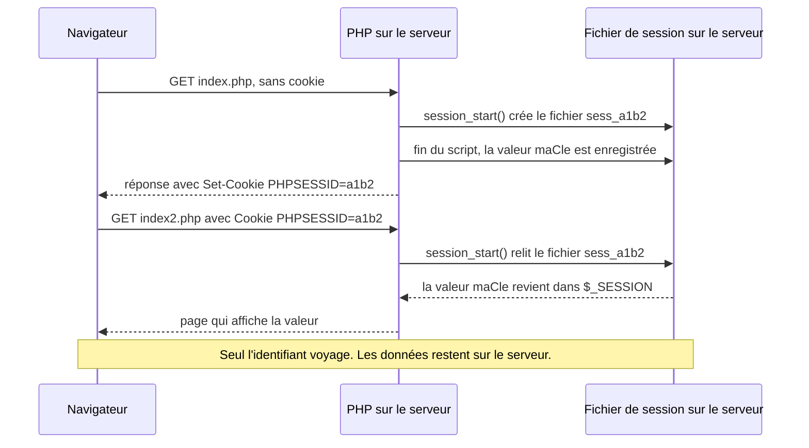
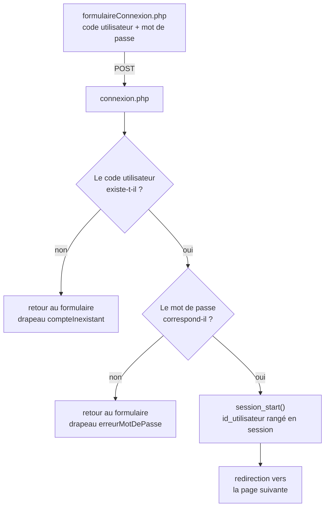
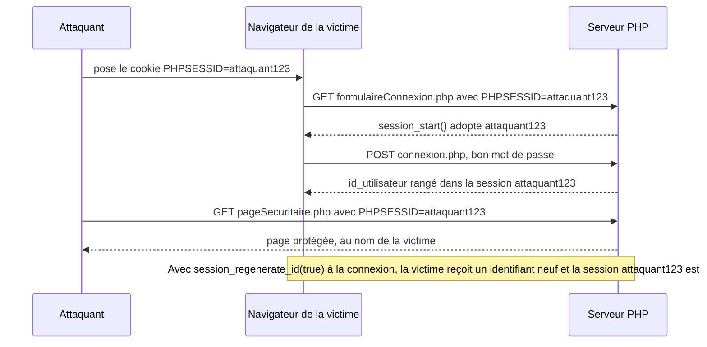
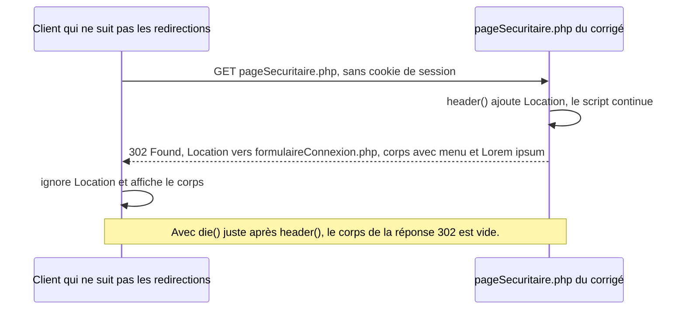
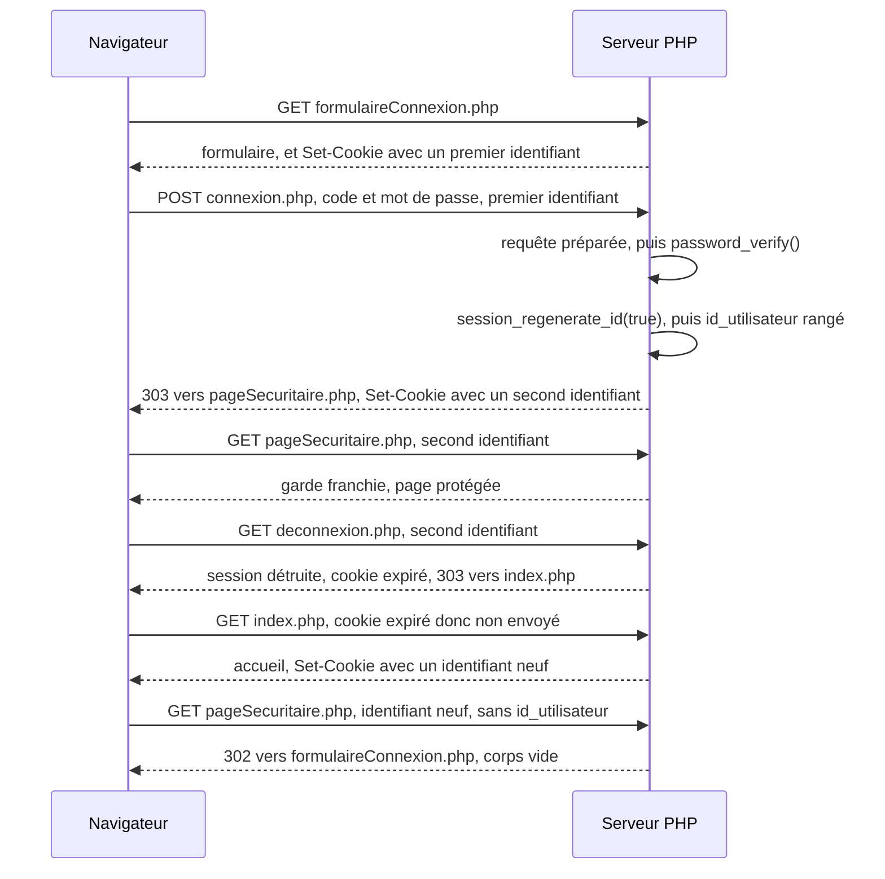

# Les sessions et l'authentification en PHP

## L'idée en une image {diapos="9, 11"}

Imagine le vestiaire d'une salle de spectacle. Tu tends ton manteau au préposé ; il l'accroche au
cintre 147, derrière son comptoir, et il te remet un petit carton qui porte le numéro 147. Pendant
toute la soirée, tu ne transportes pas ton manteau : tu transportes **le numéro**. À la sortie, tu
montres le carton, et le préposé retrouve le bon manteau parmi trois cents.

**Le vestiaire, c'est le serveur. Le manteau, ce sont les données de la session. Le carton, c'est le
cookie.** Une **session** est un petit espace de stockage que le serveur réserve à un visiteur, et
qu'il retrouve à chaque nouvelle page que ce visiteur demande. Un **cookie** est une courte donnée
que le serveur demande au navigateur de garder, et que le navigateur lui renvoie ensuite
automatiquement à chaque requête. Pour une session PHP, ce cookie ne contient qu'une chose : un
**identifiant**, une longue suite de caractères qui joue le rôle du numéro de cintre. Le support du
cours l'appelle un *token* (« jeton ») à sa diapositive 11.

Pourquoi tout ce détour ? Parce que le serveur web, livré à lui-même, **ne reconnaît personne**.
Chaque page demandée est une conversation neuve, sans souvenir de la précédente. Le numéro de
vestiaire est le seul fil qui relie tes visites entre elles.

**Où l'analogie casse, et il faut le dire, sinon elle enseigne des erreurs.** Trois endroits
précis.

1. **Le préposé regarde ton visage ; le serveur ne regarde que le carton.** Quiconque présente ton
   numéro repart avec ton manteau. C'est le **vol de session** : un identifiant copié suffit à se
   faire passer pour toi, sans connaître ton mot de passe. L'identifiant d'une session connectée
   vaut donc autant qu'un mot de passe, et il se protège comme tel.
2. **Un vrai vestiaire refuse un carton qu'il n'a pas imprimé ; PHP, par défaut, l'accepte.** Un
   visiteur qui arrive avec un identifiant inventé de toutes pièces obtient une session à ce numéro.
   Ce n'est pas une hypothèse : c'est mesuré plus bas, et c'est la base de l'attaque par
   **fixation de session**, traitée à la fin de cette moitié de la leçon.
3. **Au vestiaire, tu récupères ton manteau ; ici, les données ne sortent jamais du serveur.** Le
   navigateur ne reçoit que le numéro. C'est précisément ce qui rend la session plus sûre qu'un
   cookie qui contiendrait les données elles-mêmes : le visiteur ne peut pas modifier ce qu'il
   n'a pas entre les mains.

## En bref — la marche à suivre {diapos="17, 22, 28, 37-40, 47-49, 67"}

:::: marche-a-suivre {titre="Connecter un utilisateur, protéger une page et le déconnecter avec les sessions PHP"}

1. {voir="Créer ou charger : session_start()"} Démarre la session en toute première ligne de chaque
   page qui lit ou écrit une variable de session, avant la moindre sortie HTML.

   ```php
   session_start();
   ```

2. {voir="Lire et écrire : $_SESSION"} Écris et relis les informations de l'utilisateur dans la
   superglobale `$_SESSION`, comme dans n'importe quel tableau associatif.

   ```php
   $_SESSION["id_utilisateur"] = $id_utilisateur;
   ```

3. {voir="Lire et écrire : $_SESSION"} Relis une clé qui peut être absente avec `isset()` ou `??`,
   pour ne jamais déclencher d'avertissement.

   ```php
   $id = $_SESSION["id_utilisateur"] ?? null;
   ```

4. {voie="cours"} {voir="La table des utilisateurs — et les mots de passe en clair"} Crée la table
   `utilisateur` avec un code utilisateur et un mot de passe, comme le demande l'exercice 1.

   ```sql
   CREATE TABLE utilisateur (id_utilisateur int NOT NULL PRIMARY KEY AUTO_INCREMENT, code_utilisateur varchar(50), mot_de_passe varchar(100));
   ```

5. {voie="moderne"} {voir="La table des utilisateurs — et les mots de passe en clair"} Rends le code
   unique, élargis la colonne à 255 caractères, et n'y range que le résultat de `password_hash()`.

   ```php
   $mdp = password_hash($motDePasseSaisi, PASSWORD_DEFAULT);
   ```

6. {voir="Le formulaire de connexion — et ses étiquettes reliées à rien"} Écris le formulaire de
   connexion : méthode POST, champ `type="password"`, et chaque étiquette reliée à son champ par un
   `id` identique à son `for`.

   ```html
   <label for="mot_de_passe">Mot de passe</label> <input type="password" id="mot_de_passe" name="mot_de_passe">
   ```

7. {voir="La logique de connexion.php, ligne par ligne"} Cherche le compte avec une requête préparée
   qui filtre sur le code utilisateur, puis lie les deux colonnes retournées.

   ```php
   $stmt = $mysqli->prepare("SELECT id_utilisateur, mot_de_passe FROM utilisateur WHERE code_utilisateur = ?");
   ```

8. {voie="cours"} {voir="La logique de connexion.php, ligne par ligne"} Compare le mot de passe lu en
   base à celui du formulaire avec `==`. C'est la réponse attendue à l'examen.

   ```php
   if ($mot_de_passe == $_POST["mot_de_passe"]) {
   ```

9. {voie="moderne"} {voir="Ce qui manque à cette connexion : password_verify et session_regenerate_id"}
   Vérifie le mot de passe avec `password_verify()`, qui relit le sel dans le haché et compare en
   temps constant.

   ```php
   if (password_verify($_POST["mot_de_passe"], $mot_de_passe)) {
   ```

10. {voie="cours"} {voir="La logique de connexion.php, ligne par ligne"} Mot de passe bon : démarre la
    session, range l'identifiant de l'utilisateur, redirige et arrête le script.

    ```php
    session_start(); $_SESSION["id_utilisateur"] = $id_utilisateur; header("location: pageSecuritaire.php"); die();
    ```

11. {voie="moderne"} {voir="Ce qui manque à cette connexion : password_verify et session_regenerate_id"}
    Régénère l'identifiant de session juste après `session_start()`, avant d'écrire la moindre
    variable : c'est la parade à la fixation de session.

    ```php
    session_regenerate_id(true);
    ```

12. {voie="cours"} {voir="Deux messages d'erreur distincts : l'énumération de comptes"} Mot de passe
    faux ou code inexistant : renvoie au formulaire avec un drapeau distinct pour chaque cas, comme
    l'exige l'exercice 3.

    ```php
    header("location: formulaireConnexion.php?erreurMotDePasse=1"); die();
    ```

13. {voie="moderne"} {voir="Deux messages d'erreur distincts : l'énumération de comptes"} En
    production, affiche un seul message, identique dans les deux cas, pour ne pas révéler quels
    comptes existent.

    ```php
    echo "Code utilisateur ou mot de passe invalide";
    ```

14. {voir="Protéger l'accès à une page"} Protège chaque page réservée par une garde placée tout en
    haut du fichier, avant toute inclusion qui affiche du HTML.

    ```php
    session_start(); if (!isset($_SESSION["id_utilisateur"])) { header("Location: index.php"); die(); }
    ```

15. {voir="Pourquoi die() après header()"} Termine toujours la redirection de la garde par `die()` :
    `header()` ajoute un en-tête, il n'arrête pas le script.

16. {voir="require, pas include"} Range la garde dans un fichier `.inc` et charge-le avec `require`,
    jamais `include` : une faute de frappe dans le nom doit arrêter la page, pas l'afficher.

    ```php
    require "protectionPage.inc";
    ```

17. {voir="Protéger un élément de la page"} Pour un simple élément de menu, entoure son `echo` d'une
    condition sur la session.

    ```php
    if (isset($_SESSION["id_utilisateur"])) { echo "<li>Panneau administrateur</li>"; }
    ```

18. {voir="Cacher un lien ne protège pas la page — et l'exemple 2 le montre"} Cacher un lien ne suffit
    jamais : pose aussi la garde, avec la même condition, sur la page que le lien vise.

19. {voie="cours"} {voir="Se déconnecter"} Écris une page de déconnexion qui vide les variables,
    détruit la session et redirige vers l'accueil.

    ```php
    session_start(); session_unset(); session_destroy(); header("location: index.php"); die();
    ```

20. {voie="moderne"} {voir="Ce que session_destroy() ne fait pas"} Efface aussi le cookie de session
    dans le navigateur, avec les mêmes paramètres que ceux qui l'ont posé.

    ```php
    $p = session_get_cookie_params(); setcookie(session_name(), "", time() - 3600, $p["path"], $p["domain"], $p["secure"], $p["httponly"]);
    ```

::::

## Ce que la séance 7 enseigne, et ce que cette leçon ajoute {diapos="4, 6, 7"}

::: cours {diapos="4, 6, 7"}
« Au dernier cours, c'était l'examen 1. Dans le cours d'aujourd'hui, nous verrons la création
d'application sécurisée par une authentification en utilisant des stratégies de gestion des
sessions. » Le support rappelle que, jusqu'ici, les applications de la session permettaient à
l'utilisateur d'agir sur une base de données, mais qu'il leur manquait un élément présent dans
« la plupart des applications modernes » : **la gestion de session**, qui offre des mécanismes
d'authentification et conserve des données sur l'utilisateur tout au long de sa navigation. Le
sommaire annoncé : introduction aux variables de session, la syntaxe, les stratégies de gestion des
sessions (authentification, protection des pages, déconnexion), puis la conclusion.
:::

C'est pour cette raison que ce module porte le numéro 6 alors qu'il couvre la **séance 7** : la
séance 6 était l'examen. Tous les exercices cités ici sont ceux de la feuille de la séance 7.

Le cours pose lui-même sa limite, et il le fait honnêtement : sa diapositive 41 prévient que la
matière du jour « ne fournit pas une protection optimale » et renvoie au cours de sécurisation des
applications web pour le reste. Cette leçon garde **tout** ce que la séance enseigne, parce que c'est
ce qui est évalué, et elle ajoute, au bon endroit et toujours étiqueté comme tel, ce qui manque pour
qu'une connexion soit sûre en production.

::: complement
Ce que la leçon ajoute, et qui **n'est pas exigible à l'examen** : le hachage des mots de passe avec
`password_hash()` et `password_verify()` dans le contexte de la connexion, la régénération de
l'identifiant de session à la connexion (`session_regenerate_id(true)`), les attributs de sécurité
du cookie de session, l'effacement du cookie à la déconnexion, et le message d'erreur unique. Chaque
ajout est rattaché au passage du cours qu'il complète.
:::

::: a-retenir
**La règle d'arbitrage, valable pour toute la leçon : à l'examen, donne la réponse du cours ; en
production, applique la correction.** Un encadré de correction ne supprime jamais ce que le cours
enseigne : il le conserve, dit pourquoi ce n'est pas suffisant, et donne ce qu'il faut faire à la
place. Une seule exception, écrite là où elle se présente : quand les diapositives et le corrigé
officiel se contredisent, la leçon dit lequel a raison et pourquoi.
:::

Les captures d'écran du support montrent des projets rangés sous `C:\xampp\htdocs\cours7\`, donc
sous **XAMPP**. Au Cégep, l'environnement de référence est **WAMP** : les chemins changent, le code
PHP, lui, est identique.

## Pourquoi les sessions existent : HTTP ne se souvient de rien {diapos="9, 10"}

::: cours {diapos="9, 10"}
« HTTP est un protocole qu'on dit "sans état" (*stateless*) parce qu'il ne conserve aucune
information entre chacun des appels qu'il effectue entre le client et le serveur. » Pourtant, de
nombreuses informations doivent être conservées, pour améliorer l'expérience de l'utilisateur ou
pour effectuer des opérations sécuritaires ; les **variables de session** règlent ce problème. Le
support leur donne plusieurs rôles : mémoriser la langue, le pays ou d'autres préférences ;
conserver les éléments du panier ; créer une session sécurisée après l'authentification par code
utilisateur et mot de passe ; conserver le niveau d'accès auquel l'utilisateur a droit.
:::

Pars de ce que tu connais déjà. Depuis la séance 5, une page comme `ajout.php` reçoit un formulaire,
écrit dans la base, puis redirige. Entre la requête qui envoie le formulaire et la requête qui
affiche la liste, **rien** ne relie les deux dans le protocole lui-même. Le serveur ne sait pas que
c'est la même personne ; il reçoit deux requêtes, il rend deux réponses, et il oublie.

Un protocole **sans état** est un protocole dont chaque échange se suffit à lui-même : la réponse ne
dépend que de la requête en cours, jamais d'un échange précédent. C'est un choix de conception
délibéré — un serveur qui ne se souvient de rien peut répondre à des milliers de visiteurs sans
tenir de registre. Mais une application a besoin de mémoire : « cette personne s'est connectée il y
a deux minutes » est exactement le genre de fait que HTTP ne retient pas.

::: complement
Il existe plusieurs façons de rétablir cette mémoire, et comparer les options aide à comprendre
pourquoi PHP a choisi la sienne.

| Approche | Où vit l'information | Le problème |
|---|---|---|
| Renvoyer le code et le mot de passe à chaque page | nulle part | le secret circule à chaque requête, et aucune déconnexion n'est possible |
| Tout écrire dans un cookie (`role=admin`) | chez le client | **le visiteur peut modifier le cookie**, et devenir administrateur en le réécrivant |
| Un cookie qui ne porte qu'un identifiant, les données sur le serveur | sur le serveur | le serveur doit stocker et retrouver les données : c'est le modèle des sessions |
| Un jeton signé qui porte les données (JWT) | chez le client, mais infalsifiable | difficile à révoquer avant son expiration |

PHP implémente la troisième ligne. La conséquence pratique est la règle la plus importante de cette
section : **ce qui décide d'un droit — l'identité, le rôle, un prix, un solde — va dans la session,
jamais dans un cookie**, parce qu'un cookie est une donnée que le visiteur contrôle.
:::

Un exemple simple : une préférence de langue. La page d'accueil range `fr` dans la session ; les
pages suivantes la relisent et s'affichent en français, sans que le visiteur la choisisse de
nouveau. Un exemple plus réaliste : un site marchand. Le visiteur ajoute trois articles à son panier
sur trois pages différentes, puis se connecte, puis paie. Chacune de ces pages est une requête
indépendante ; c'est la session qui accumule le panier, puis qui retient que la personne est
connectée, puis qui permet à la page de paiement de savoir **qui** paie **quoi**.

### Où vit la session, et ce que le cookie transporte {diapos="11"}

::: cours {diapos="11"}
Le support donne quatre éléments à retenir. Les informations de la session sont **conservées sur le
serveur** ; elles peuvent donc être manipulées à partir de PHP, « mais pas de JavaScript ». La
session est associée à l'utilisateur par un **identifiant** (*token*) sauvegardé dans un cookie et
envoyé à chaque requête HTTP. Si le cookie expire ou s'il est supprimé, la session ne peut plus être
utilisée. Enfin, les informations de session doivent être des informations **clés** qui prennent peu
d'espace : identifiant, nom, langue de préférence.
:::

Voici l'aller-retour complet, sur deux pages. Suis le cookie : c'est lui qui fait le lien.



L'identifiant `a1b2` est raccourci pour la lisibilité ; un vrai identifiant PHP est beaucoup plus
long et tiré au hasard. Par défaut, PHP range chaque session dans un fichier nommé `sess_` suivi de
l'identifiant, dans le dossier que désigne le réglage `session.save_path`. Ce fichier contient la
session **en clair** : c'est une autre raison, en plus de la place, de n'y ranger que des clés — un
numéro d'utilisateur, jamais un mot de passe.

::: correction-du-cours {source="KnowledgeBase/web/php/php-sessions-authentification.md, sections « Cookies en PHP » et « Configuration php.ini — le socle » ; mesure M9 de docs/contenu/renvois-diapos-php-06.md (PHP 8.5.10, php-cgi, 2026-09-16) ; manuel PHP, directive session.cookie_httponly" diapos="11"}
La diapositive dit que la session se manipule depuis PHP, « mais pas de JavaScript ». **C'est exact
pour les données**, qui sont sur le serveur. **Ce ne l'est pas pour l'identifiant** : le cookie qui le
porte est lisible par JavaScript, avec `document.cookie`, tant qu'il ne porte pas l'attribut
`HttpOnly`. Or PHP ne pose pas cet attribut de lui-même. Mesuré le 16 septembre 2026 sur PHP 8.5.10,
sans fichier `php.ini` : l'en-tête envoyé est `Set-Cookie: PHPSESSID=…; path=/`, **sans `HttpOnly`,
sans `Secure`, sans `SameSite`**. Conséquence : une faille XSS (*cross-site scripting*, l'injection
d'un script dans une page du site) peut lire l'identifiant et l'envoyer ailleurs — c'est le vol de
session de l'analogie. À l'examen, la phrase de la diapositive reste la réponse attendue. En
production, active `session.cookie_httponly`, `session.cookie_secure` et `session.cookie_samesite`
dans `php.ini`, ou appelle `session_set_cookie_params()` avant `session_start()`.
:::

Cette mesure porte sur un PHP **sans** `php.ini`. Les deux modèles de `php.ini` livrés avec PHP ne
changent rien à l'affaire : relevé le 16 septembre 2026 dans `php.ini-development` et
`php.ini-production` de PHP 8.5.10, `session.cookie_httponly` et `session.cookie_samesite` y sont
présents **sans valeur**, donc désactivés, et `session.cookie_secure` n'y figure qu'en commentaire.
Un `php.ini` dérivé de l'un d'eux en hérite. Le tien a pu être modifié : pour le savoir, écris
`var_dump(ini_get('session.cookie_httponly'), ini_get('session.cookie_secure'), ini_get('session.cookie_samesite'));`
dans une page de ton poste. Une chaîne vide ou `"0"` veut dire que l'attribut n'est pas posé.

## Le cycle de vie d'une session {diapos="15, 32"}

::: cours {diapos="15, 32"}
« Les sessions ont trois étapes dans leur cycle de vie : 1. Création/chargement de la session ;
2. Utilisation des variables de la session ; 3. Destruction de la session. » En résumé, le support
retient trois choses : les sessions utilisent la variable superglobale `$_SESSION` ; les
informations conservées sont disponibles sur toutes les pages que l'utilisateur appelle, tant que le
cookie n'est pas compromis et que la session n'est pas détruite ; et pour utiliser les variables de
session, il faut d'abord appeler `session_start()`.
:::

Remarque la condition « tant que le cookie n'est pas compromis » : le support lui-même reconnaît que
la session tient à ce petit cookie. Les trois sous-sections qui suivent prennent les trois étapes
dans l'ordre, avec une fonction chacune.

### Créer ou charger : session_start() {diapos="17, 18, 19"}

::: cours {diapos="17, 18, 19"}
Quand une page PHP a besoin des sessions, il faut charger les informations de la session de
l'utilisateur avec `session_start();`. La fonction « a pour effet d'allouer un espace dans le système
de fichiers du serveur pour sauvegarder les informations de l'utilisateur. Si une session existait
déjà pour cette utilisatrice, elle s'occupera de charger les informations de session en mémoire. »
L'exemple de la diapositive 18 est le plus court possible : un fichier `index.php` qui ne contient
que `<?PHP`, `session_start();` et `?>`. Et la diapositive 19 insiste : « Oublier de démarrer la
session est une erreur très fréquente. C'est encore plus vrai lors du stress d'un examen. Gardez-vous
une note quelque part. »
:::

Une même fonction fait donc deux choses selon la situation. Si la requête n'apporte **aucun** cookie
de session, `session_start()` crée une session neuve, choisit un identifiant et prépare l'en-tête
`Set-Cookie` qui le confiera au navigateur. Si la requête apporte un cookie, la fonction retrouve le
fichier correspondant et remplit `$_SESSION` avec ce qu'il contient.

Ce détail d'en-tête explique la règle de placement. Un **en-tête HTTP** est une ligne de
métadonnées qui part **avant** le corps de la réponse. Dès que PHP a commencé à envoyer du HTML — ne
serait-ce qu'une ligne vide avant `<?php` — les en-têtes sont partis, et il est trop tard pour en
ajouter un. Mesuré le 16 septembre 2026 sur PHP 8.5.10, sans tampon de sortie : un `session_start()`
placé après du HTML produit `Warning: session_start(): Session cannot be started after headers have
already been sent`, et la session ne démarre pas. **D'où la règle : `session_start()` en toute
première ligne.**

::: note
Le résultat dépend d'un réglage, `output_buffering`. Quand il vaut `4096` — c'est la valeur des deux
fichiers modèles `php.ini-development` et `php.ini-production` —, PHP retient les 4 096 premiers
octets de sortie avant de les envoyer, et une petite sortie placée avant `session_start()` passe
inaperçue. Quand il vaut `0`, l'erreur ci-dessus apparaît. Un `php.ini` dérivé de l'un des deux
modèles hérite de `4096`, mais rien ne garantit que celui de ton poste n'a pas été modifié : écris
`var_dump(ini_get('output_buffering'));` dans une page pour lire le tien. Un code qui « marche chez
moi » peut donc échouer sur un autre serveur. Ne compte pas sur le tampon : place `session_start()`
en tête, et le réglage n'a plus d'importance.
:::

Et que se passe-t-il quand on oublie la fonction, l'erreur que la diapositive 19 annonce ? La réponse
est plus traître qu'on le croirait, et elle a été mesurée.

:::: comparaison
::: vulnerable
```php
<?php
// preference.php — session_start() est oublié
$_SESSION["langue"] = "fr";
echo "Préférence enregistrée.";
```
{lignes="3"} **Aucun avertissement, aucun cookie.** Mesuré sur PHP 8.5.10 : sans `session_start()`,
`$_SESSION` n'est qu'un tableau ordinaire créé par cette affectation. La valeur est rangée dans la
mémoire du script, et elle disparaît quand le script se termine. Aucun en-tête `Set-Cookie` ne part.

{lignes="4"} Le message affirme un succès qui n'a pas eu lieu. C'est le pire des bogues : le code
semble fonctionner, et la page suivante ne trouvera rien.
:::
::: corrige
```php
<?php
// preference.php
session_start();
$_SESSION["langue"] = "fr";
echo "Préférence enregistrée.";
```
{lignes="3"} La session démarre avant toute sortie. À la première visite, PHP crée le fichier de
session et prépare le cookie qui en porte l'identifiant.

{lignes="4"} La même affectation écrit maintenant dans la session : à la fin du script, PHP
enregistre la valeur dans le fichier, et la page suivante la retrouvera.
:::
::::

L'oubli côté **lecture** est plus bruyant. Mesuré sur PHP 8.5.10 : lire `$_SESSION["id_utilisateur"]`
sans `session_start()` produit `Warning: Undefined global variable $_SESSION`, puis `Warning: Trying
to access array offset on null`. Et le cas le plus déroutant est silencieux :
`isset($_SESSION["id_utilisateur"])` rend simplement `false`, sans rien signaler. Une page qui a
oublié `session_start()` croit donc que **personne** n'est connecté — ce qui, sur une page protégée,
renvoie tout le monde vers la connexion, y compris ceux qui viennent de se connecter. C'est un
bogue, pas une faille : la page devient inutilisable, mais elle ne laisse entrer personne. Il est
d'autant plus long à trouver qu'aucun message ne le désigne.

### Lire et écrire : $_SESSION {diapos="22, 23, 24, 25"}

::: cours {diapos="22, 23, 24, 25"}
Une fois la session démarrée, on utilise la variable superglobale `$_SESSION` pour sauvegarder ou
charger des informations sur l'utilisateur, et ces informations sont conservées d'une page à l'autre.
Pour ce faire, on lit ou on écrit dans la variable en fournissant une clé, « comme pour tous les
autres tableaux associatifs ». L'exemple : qu'est-ce qui sera affiché si l'on ouvre `index.php`,
puis `index2.php` ? Réponse de la diapositive 24 : `index.php` n'affiche rien, et `index2.php`
affiche « Bonjour le monde ». L'explication de la diapositive 25 : `index.php` crée une variable de
session conservée sur le serveur, et `index2.php` charge ensuite cette variable et l'affiche.
:::

Une **superglobale** est une variable que PHP remplit lui-même et qui est accessible partout dans le
script, dans une fonction comme en dehors. Tu en connais déjà deux, `$_GET` et `$_POST`. La
différence est leur durée de vie : `$_POST` décrit **la requête en cours** et disparaît avec elle ;
`$_SESSION` décrit **le visiteur**, et survit d'une requête à l'autre.

Voici les deux pages de la diapositive 23, telles que la capture les montre, à un commentaire près :

```php
<?PHP
// index.php — écrit la valeur
session_start();
$_SESSION["maCle"] = "Bonjour le monde";
?>
```

```php
<?PHP
// index2.php — relit la valeur
session_start();
echo $_SESSION["maCle"];
?>
```

La capture de la diapositive 31 situe le `echo` à la ligne 5 d'`index2.php` : le fichier projeté
compte donc une ligne de plus que cette version, où le commentaire a été ajouté pour la leçon.
L'aller-retour a été reproduit le 16 septembre 2026 sur PHP 8.5.10, avec une valeur plus courte
(`Bonjour`) et en renvoyant à la seconde page le cookie reçu de la première : la valeur écrite par
l'une est bien relue par l'autre.

**Pourquoi `index.php` n'affiche rien ?** Parce qu'elle ne contient aucun `echo`. Écrire dans la
session ne produit aucune sortie. Et remarque l'ordre imposé : ouvrir `index2.php` **en premier**
lirait une clé qui n'existe pas encore.

Un exemple plus réaliste : la page d'un panier, qui relit une préférence et accumule des articles.

```php
<?php
session_start();
$langue = $_SESSION["langue"] ?? "fr";
$_SESSION["panier"][] = (int) ($_GET["article"] ?? 0);
echo count($_SESSION["panier"]);
```

- **Ligne 3** : l'opérateur `??` rend la valeur de gauche si elle existe et n'est pas `null`, sinon
  celle de droite. Une préférence jamais choisie donne `fr`, sans avertissement.
- **Ligne 4** : `[]` ajoute un élément à la fin du tableau rangé sous la clé `panier`. À la première
  visite, la clé n'existe pas encore, et PHP crée le tableau. Le `(int)` convertit en entier le
  numéro reçu dans l'URL : c'est une donnée du visiteur, et on ne range pas n'importe quoi dans la
  session. Le `?? 0` n'est pas décoratif : sans lui, une visite sans `?article=` affiche
  `Warning: Undefined array key "article"` (mesuré sur PHP 8.5.10) avant de ranger `0`.
- **Ligne 5** : le nombre d'articles grandit d'une unité à chaque visite du **même** navigateur, et
  repart de zéro dans un autre navigateur, qui n'a pas le même cookie.

::: complement
Ce qu'on range en session, et ce qu'on n'y range pas. **Oui** : l'identifiant de l'utilisateur, son
rôle, sa langue, le contenu d'un panier. **Non** : un mot de passe, un numéro de carte, ou une copie
de tout le profil. Le fichier de session est en clair sur le disque du serveur, et une copie du
profil devient fausse dès que la base change. Le rôle en est l'exemple : le ranger en session est
commode pour décider quoi **afficher** (un lien vers l'administration, par exemple), mais un
administrateur rétrogradé garderait son ancien rôle jusqu'à la fin de sa session. Toute décision
**sensible** — ouvrir une page d'administration, supprimer un compte — relit donc le rôle **dans la
base**. Range la **clé**, et relis dans la base ce dont dépend une décision.
:::

### Détruire : session_unset() puis session_destroy() {diapos="28, 29, 30, 31"}

::: cours {diapos="28, 29, 30, 31"}
« Quand on souhaite mettre fin à une session, on doit détruire ses variables, puis détruire la
session avec les fonctions suivantes : `session_unset();` `session_destroy();` Cette séquence d'appel
s'assurera que les variables de session sont détruites (`session_unset`) et que le lien entre le
cookie de session et la session est rompu (`session_destroy`). » L'exemple reprend les deux pages
précédentes et ajoute `detruire_session.php`. La question : que se passe-t-il si l'on ouvre, dans
cet ordre, `index.php`, `index2.php`, `detruire_session.php`, puis `index2.php` ? La réponse de la
diapositive 31 : « L'information de session n'existe plus. »
:::

La page ajoutée, telle que la capture de la diapositive 29 la montre :

```php
<?PHP
session_start();
session_unset();
session_destroy();
?>
```

- **Ligne 2** : on ne peut détruire qu'une session **chargée**. Sans cette ligne, `session_destroy()` échoue :
  mesuré sur PHP 8.5.10, il émet `Warning: session_destroy(): Trying to destroy uninitialized session`
  et rend `false`.
- **Ligne 3** : `session_unset()` vide le tableau `$_SESSION` du script en cours. C'est nécessaire,
  parce que `session_destroy()` ne touche pas au tableau déjà chargé en mémoire : sans cette ligne, la
  suite du script verrait encore les anciennes valeurs.
- **Ligne 4** : `session_destroy()` supprime les données de la session sur le serveur.


Déroule l'ordre de la diapositive 30. `index.php` écrit la valeur ; `index2.php` l'affiche ;
`detruire_session.php` efface tout ; la seconde visite d'`index2.php` cherche une clé qui n'existe
plus. La capture de la diapositive 31 montre alors le message `Notice: Undefined index: maCle`,
suivi du chemin du fichier et du numéro de ligne.

::: note
**Ce message est celui de PHP 7.** Depuis PHP 8.0, lire une clé de tableau absente est un
avertissement, et le libellé a changé. Mesuré le 16 septembre 2026 sur PHP 8.5.10, la même
relecture produit `Warning: Undefined array key "maCle"`. **La leçon de la diapositive reste
parfaitement juste** : l'information n'existe plus. Seul le libellé a vieilli. À l'examen, si une
question cite le message, reconnais-le sous l'une ou l'autre forme. La lecture qui ne dépend d'aucune
version est `$_SESSION["maCle"] ?? ""`.
:::

::: correction-du-cours {source="Mesure M5 de docs/contenu/renvois-diapos-php-06.md (PHP 8.5.10, php-cgi, 2026-09-16) ; KnowledgeBase/web/php/php-sessions-authentification.md, TL;DR et section « Déconnexion propre »" diapos="28"}
La diapositive dit que `session_destroy()` rompt « le lien entre le cookie de session et la
session ». L'effet visible qu'elle décrit est exact : les données ont disparu. Mais **le cookie, lui,
reste dans le navigateur**. Mesuré : la réponse de `detruire_session.php` ne contient **aucun**
en-tête `Set-Cookie` ; rien n'a demandé au navigateur d'oublier l'identifiant, et il le renverra à
la requête suivante. À l'examen, la séquence `session_unset()` puis `session_destroy()` est la
réponse attendue. En production, la déconnexion efface aussi le cookie ; la leçon y revient dans la
section « Se déconnecter ».
:::

## L'authentification, pas à pas {diapos="35, 37"}

::: cours {diapos="35, 37"}
La section des stratégies couvre trois sujets : l'authentification et la création des sessions, la
protection des pages, et les mécanismes de déconnexion. Le mécanisme d'authentification « sert à
offrir un formulaire de connexion à l'utilisateur afin de se connecter au système ». La logique va
comme suit : créer une table qui contient les codes utilisateur et les mots de passe ; offrir un
formulaire de connexion qui demande le code utilisateur et le mot de passe ; vérifier que les deux
sont valides ; si oui, créer les variables de session et rediriger vers une autre page ; si non,
retourner au formulaire et afficher un message d'erreur.
:::

**S'authentifier**, c'est prouver qu'on est bien la personne qu'on prétend être — ici, en
fournissant un secret que seul le titulaire du compte connaît. Il ne faut pas confondre avec
**autoriser**, qui est décider ce qu'une personne déjà identifiée a le droit de faire. La connexion
fait la première chose ; la protection des pages, plus loin, fait la seconde.

Les cinq étapes du support, sous forme de décision :



Les cinq sous-sections qui suivent construisent les trois fichiers — la table, le formulaire, la
page de traitement —, puis regardent ce que la séance ne dit pas.

### La table des utilisateurs — et les mots de passe en clair {diapos="38"}

::: cours {diapos="38"}
« La base de données doit contenir des champs qui sauvegardent les codes utilisateur et les mots de
passe. » La capture de la diapositive 38 montre la table `utilisateur` : `id_utilisateur` de type
`int(11)`, `code_utilisateur` et `mot_de_passe` de type `varchar(50)`, interclassement
`utf8mb4_general_ci`. Son contenu : deux comptes, `admin` avec le mot de passe `admin`, et
`alexandre` avec le mot de passe `qwerty`.
:::

L'exercice 1 de la séance demande la même table, avec une différence : la colonne du mot de passe y
fait **100** caractères. En SQL, la version de l'exercice s'écrit ainsi :

```sql
CREATE TABLE utilisateur (
  id_utilisateur int NOT NULL PRIMARY KEY AUTO_INCREMENT,
  code_utilisateur varchar(50),
  mot_de_passe varchar(100)
);
INSERT INTO utilisateur (code_utilisateur, mot_de_passe) VALUES ('admin', 'admin');
```

Chaque élément a son rôle : `id_utilisateur` est la clé que la session retiendra, numérotée par le
serveur (`AUTO_INCREMENT`) ; `code_utilisateur` est ce que la personne tape pour se désigner ;
`mot_de_passe` est ce qu'elle tape pour le prouver.

::: exercice-du-cours {seance="7" ref="1"}
La base se nomme `cours7`, comme dans l'énoncé et à la diapositive 40 : **suis l'énoncé**, même si le
corrigé officiel et son fichier `cours07.sql` utilisent une base `cours08`. Coche « A_I » sur
`id_utilisateur` dans PHPMyAdmin, ou écris `AUTO_INCREMENT` dans l'onglet SQL, comme à la séance 5.
Pour tes comptes de test, invente des mots de passe que tu n'utilises nulle part ailleurs : la table
de l'exercice les garde tels quels, et n'importe qui ouvrant PHPMyAdmin les lira. Le nom de la base
est une consigne ; le serveur, l'utilisateur et le mot de passe avec lesquels tu t'y connecteras, eux,
sont ceux de ton poste — la section sur la connexion y revient.
:::

::: correction-du-cours {source="KnowledgeBase/web/php/php-sessions-authentification.md, section « Les mots de passe sont en clair, et comparés avec == » ; KnowledgeBase/web/php/exercices-corriges-poo-application.md, séance 7, exercice 1 ; manuel PHP, password_hash() (recommandation d'une colonne de 255 caractères) ; documentation MariaDB, SQL_MODE, https://mariadb.com/kb/en/sql-mode/ (mode strict par défaut depuis MariaDB 10.2.4, consultée le 2026-09-16)" diapos="38"}
**Les mots de passe sont stockés en clair**, dans la capture comme dans le corrigé officiel, dont le
fichier `cours07.sql` insère le compte `admin` avec le mot de passe `test`. C'est la faille la plus
grave de la séance. Quiconque lit la table — par une injection SQL ailleurs dans le site, par une
sauvegarde égarée, par un PHPMyAdmin resté ouvert — obtient tous les mots de passe, et avec eux les
comptes que les mêmes personnes ont sur d'autres sites, parce que les gens réutilisent leurs mots de
passe. La séance 3 du même cours enseignait pourtant `password_hash()`. À l'examen, fais la table
que l'énoncé demande. En production : range seulement le résultat de `password_hash()`, dans une
colonne de **255** caractères — un haché bcrypt en fait 60, mais un haché Argon2id approche la
centaine, et l'algorithme par défaut peut changer avec une version de PHP ; une colonne trop courte
tronque le haché ou refuse l'insertion, selon le `sql_mode` du serveur. Si ce réglage contient
`STRICT_TRANS_TABLES` ou `STRICT_ALL_TABLES` — le mode strict, que MariaDB active par défaut depuis
sa version 10.2.4 —, l'`INSERT` échoue avec `ERROR 1406 Data too long` et le compte n'est pas créé ;
sinon, le haché est tronqué avec un simple avertissement, et le compte devient inutilisable. Un
serveur peut avoir été configuré autrement que par défaut : lance `SELECT @@sql_mode;` dans l'onglet
SQL de PHPMyAdmin pour savoir dans quel cas est le tien. Ajoute aussi `UNIQUE` au code utilisateur :
rien d'autre n'empêche deux comptes du même nom.
:::

Un **haché** est le résultat d'une fonction à sens unique : on calcule le haché à partir du mot de
passe, jamais le mot de passe à partir du haché. Pour vérifier une connexion, on refait le calcul sur
ce que la personne vient de taper, et on compare. Voici la différence, côté table puis côté
insertion.

:::: comparaison
::: vulnerable
```sql
CREATE TABLE utilisateur (
  id_utilisateur int NOT NULL PRIMARY KEY AUTO_INCREMENT,
  code_utilisateur varchar(50),
  mot_de_passe varchar(100)
);
```
{lignes="3"} Rien n'empêche deux lignes portant le même code. La page de connexion ne vérifierait
alors que la première que le serveur lui rend.

{lignes="4"} Cent caractères suffisent pour un mot de passe en clair, et c'est bien le problème : la
colonne est pensée pour le garder lisible.
:::
::: corrige
```sql
CREATE TABLE utilisateur (
  id_utilisateur int NOT NULL PRIMARY KEY AUTO_INCREMENT,
  code_utilisateur varchar(50) NOT NULL UNIQUE,
  mot_de_passe varchar(255) NOT NULL
);
```
{lignes="3"} `UNIQUE` fait refuser par le serveur un second compte au même code.

{lignes="4"} 255 caractères laissent la place à tout algorithme de hachage que `PASSWORD_DEFAULT`
pourra désigner dans une version future de PHP.
:::
::: vulnerable
```php
<?php
$stmt = $mysqli->prepare("INSERT INTO utilisateur (code_utilisateur, mot_de_passe) VALUES (?, ?)");
$stmt->bind_param("ss", $code, $mdp);
$code = "admin";
$mdp = "un-mot-de-passe-de-test";
$stmt->execute();
```
{lignes="2"} La requête est préparée : pas d'injection SQL possible ici. Le défaut n'est pas là.

{lignes="5"} Le mot de passe part tel quel vers la base, et il y restera lisible.
:::
::: corrige
```php
<?php
$stmt = $mysqli->prepare("INSERT INTO utilisateur (code_utilisateur, mot_de_passe) VALUES (?, ?)");
$stmt->bind_param("ss", $code, $mdp);
$code = "admin";
$mdp = password_hash("un-mot-de-passe-de-test", PASSWORD_DEFAULT);
$stmt->execute();
```
{lignes="3"} Comme à la séance 5, `bind_param` lie les variables **par référence** : on peut leur
donner leur valeur après la liaison, juste avant `execute()`.

{lignes="5"} `password_hash()` tire un sel aléatoire, calcule le haché et range le sel **dans** la
chaîne produite. Aucune colonne de sel séparée n'est nécessaire, et deux comptes au même mot de passe
obtiennent deux hachés différents.
:::
::::

### Le formulaire de connexion — et ses étiquettes reliées à rien {diapos="39"}

::: cours {diapos="39"}
« Le formulaire de connexion doit permettre à l'utilisateur d'entrer son code utilisateur
(`type=text`) et son mot de passe (`type=password`). » La capture montre un titre « Page de
connexion », un formulaire qui envoie ses données à `connexion.php` avec la méthode `POST`, deux
champs précédés de leur étiquette, et un bouton « Connexion ».
:::

Deux attributs portent l'essentiel. `method="POST"` met les valeurs dans le **corps** de la requête,
et non dans l'adresse : avec `GET`, le mot de passe apparaîtrait dans la barre d'adresse, dans
l'historique et dans les journaux du serveur. `type="password"` masque la saisie à l'écran. Il ne
chiffre rien : c'est HTTPS qui protège le mot de passe pendant le transport.

Voici le cœur du formulaire de la diapositive 39 — ses lignes 5 à 12, recopiées de la capture ; le
reste n'est que `<!DOCTYPE html>`, `<html>` et `<body>` :

```html
<h2>Page de connexion</h2>
<form action="connexion.php" method="POST">
  <label for="code_utilisateur">Code utilisateur:</label><br>
  <input type="text" id="fname" name="code_utilisateur" value=""><br>
  <label for="mot_de_passe">Mot de passe:</label><br>
  <input type="password" id="lname" name="mot_de_passe" value=""><br><br>
  <input type="submit" value="Connexion">
</form>
```

- **Ligne 2** : `action` désigne la page qui traitera les données, `method` la façon de les envoyer.
- **Lignes 4 et 6** : l'attribut `name` fixe la clé sous laquelle la valeur arrivera dans `$_POST`.
  `connexion.php` lira donc `$_POST["code_utilisateur"]` et `$_POST["mot_de_passe"]`.
- **Lignes 3 et 5** : l'attribut `for` d'une étiquette doit reprendre **exactement** l'`id` du champ
  qu'elle décrit. Ici, il ne le fait pas.

::: correction-du-cours {source="Capture de la diapositive 39 du support Cours07_Les_sessions_en_php ; formulaireConnexion.php du corrigé officiel, ligne 21 ; WCAG 2.2, critère 1.3.1 Information et relations" diapos="39"}
**Les étiquettes ne sont reliées à aucun champ.** Les étiquettes annoncent `for="code_utilisateur"`
et `for="mot_de_passe"`, mais les champs portent `id="fname"` et `id="lname"` — des restes de copier-
coller. Deux conséquences : un lecteur d'écran n'annonce pas l'étiquette quand le champ reçoit le
focus, et un clic sur le libellé ne place pas le curseur dans le champ. C'est un manquement au
critère 1.3.1 des WCAG 2.2. Le corrigé officiel a le même défaut sous une autre forme : ses
étiquettes portent `for="fname"` et `for="mot_de_passe"`, et **aucun** de ses deux champs n'a
d'`id`. Le formulaire **fonctionne** quand
même, parce que PHP ne lit que les `name`. Correction : donne à chaque champ un `id` identique au
`for` de son étiquette.
:::

Le même formulaire, corrigé :

```html
<h2>Page de connexion</h2>
<form action="connexion.php" method="POST">
  <label for="code_utilisateur">Code utilisateur</label><br>
  <input type="text" id="code_utilisateur" name="code_utilisateur" autocomplete="username"><br>
  <label for="mot_de_passe">Mot de passe</label><br>
  <input type="password" id="mot_de_passe" name="mot_de_passe" autocomplete="current-password"><br><br>
  <input type="submit" value="Connexion">
</form>
```

- **Lignes 4 et 6** : chaque `id` reprend le `for` de son étiquette. L'attribut `autocomplete`
  (valeurs `username` et `current-password`) aide les gestionnaires de mots de passe à reconnaître le
  formulaire — ce qui encourage des mots de passe longs, que personne n'a à retenir.

::: exercice-du-cours {seance="7" ref="2"}
L'énoncé impose trois choses vérifiables : le nom `formulaireConnexion.php`, un champ de type
`password`, et un envoi vers `connexion.php` en `POST`. Reprends le formulaire corrigé ci-dessus :
les `name` doivent être exactement ceux que `connexion.php` lira. Ce même fichier affichera plus tard
les messages d'erreur de l'exercice 3 : garde de la place au-dessus du formulaire.
:::

### La logique de connexion.php, ligne par ligne {diapos="40"}

::: cours {diapos="40"}
La diapositive 40, « Logique d'authentification », projette la page `connexion.php` en 24 lignes :
ouverture de la connexion, requête préparée, liaison du code utilisateur, exécution, liaison des
colonnes, boucle de lecture, comparaison du mot de passe, puis trois redirections — vers la page
suivante en cas de succès, vers le formulaire avec `?erreurMotDePasse=1` si le mot de passe est
faux, et vers le formulaire avec `?compteInexistant=1` si le code n'existe pas.
:::

Voici cette page, reconstituée d'après la capture ; la numérotation suit celle de la diapositive.

```php
<?PHP
$mysqli = new mysqli('localhost','root','','cours7');
$stmt = $mysqli->prepare("SELECT id_utilisateur, mot_de_passe FROM utilisateur where code_utilisateur=?");
$stmt->bind_param("s", $code_utilisateur);
$code_utilisateur = $_POST["code_utilisateur"];
$stmt->execute();
$stmt->bind_result($id_utilisateur, $mot_de_passe);
while ($stmt->fetch()){
    if ($mot_de_passe == $_POST["mot_de_passe"]){
        $stmt->close();
        session_start();
        $_SESSION["id_utilisateur"] = $id_utilisateur;
        header("location: index.php"); //Connexion valide
        die();
    }
    else
    {
        header("location: formulaireConnexion.php?erreurMotDePasse=1"); //Mot de passe incorrect
        die;
    }
}
$stmt->close();
header("location: formulaireConnexion.php?compteInexistant=1"); //Compte n'existe pas
?>
```

Ligne par ligne :

- **Ligne 2** : la connexion à la base, avec les quatre informations de la séance 5 — serveur,
  utilisateur, mot de passe, nom de la base. `localhost`, `root` sans mot de passe et `cours7` sont
  les valeurs de la diapositive 40, donc du poste de l'enseignant : le code n'y ajoute aucun
  commentaire pour garder la numérotation de la diapositive, mais sur ton poste, reporte ton
  utilisateur, ton mot de passe et, si ton service MariaDB n'écoute pas sur 3306, ton port
  (`localhost:3307`, par exemple), comme à la séance 5.
- **Ligne 3** : la requête est **préparée**. Le point d'interrogation réserve la place du code
  utilisateur ; ce que le visiteur tapera ne pourra jamais devenir du SQL. Sur un formulaire de
  connexion, cible numéro un des injections, c'est le bon geste.
- **Lignes 4 et 5** : la liaison **avant** l'affectation. C'est l'ordre surprenant déjà vu à la
  séance 5 : `bind_param` lie la variable par référence, et c'est sa valeur au moment d'`execute()`
  qui compte.
- **Ligne 6** : la requête part au serveur.
- **Ligne 7** : `bind_result` désigne les deux variables qui recevront, à chaque lecture, les deux
  colonnes du `SELECT`, dans l'ordre.
- **Ligne 8** : `fetch()` lit une ligne et rend `true` s'il y en avait une. Si le code n'existe pas,
  aucune ligne ne revient, la boucle ne s'exécute pas une seule fois, et l'on passe à la ligne 22.
  Si le code existe, le premier tour de boucle se termine **toujours** par un `die` : la boucle ne
  fait donc jamais plus d'un tour.
- **Ligne 9** : la comparaison du mot de passe lu en base avec celui du formulaire. La section
  « Ce qui manque à cette connexion » y revient.
- **Lignes 10 à 12** : la requête est fermée, **puis** la session est démarrée, **puis**
  l'identifiant du compte y est rangé. Le point fort à retenir : la session ne reçoit
  l'identifiant **qu'après** la vérification.
- **Lignes 13 et 14** : la redirection, puis l'arrêt du script. `header()` ajoute un en-tête
  `Location` à la réponse ; c'est le navigateur qui décide de le suivre.
- **Lignes 18 et 19** : même patron pour le mot de passe faux, avec le drapeau `erreurMotDePasse`
  dans l'adresse.
- **Lignes 22 et 23** : on n'arrive ici que si la boucle n'a rien lu, donc si le code n'existe pas.
  Cette dernière redirection n'a pas de `die` : c'est sans conséquence, puisque rien ne la suit,
  mais le réflexe est faux, et la section « Pourquoi die() après header() » montre où il coûte cher.

::: note
**Trois écarts entre la diapositive, l'énoncé et le corrigé officiel.** La diapositive redirige un
succès vers `index.php` ; l'**exercice 3** et le corrigé le redirigent vers `pageSecuritaire.php`.
Le corrigé remplace la boucle `while` par un simple `if ($stmt->fetch())`, ce qui revient au même
puisque la boucle ne fait jamais plus d'un tour. Et le corrigé se connecte à une base `cours08`, là
où l'énoncé et la diapositive disent `cours7`. **Pour l'exercice, suis l'énoncé** : c'est lui qui
est évalué.
:::

::: complement
Deux défauts du corrigé officiel : le premier lui est propre, le second est partagé avec la
diapositive. **Le premier** : le corrigé vérifie la connexion avec
`if ($conn->connect_error) die("Connection failed: " . $conn->connect_error)`, et cette ligne n'est
**jamais atteinte**. Depuis PHP 8.1, `mysqli` signale ses erreurs par exception (mode par défaut
`MYSQLI_REPORT_ERROR | MYSQLI_REPORT_STRICT`) : un échec de connexion lève une
`mysqli_sql_exception` dès `new mysqli(...)`. Mesuré sur PHP 8.5.10, vers un serveur injoignable :
`Fatal error: Uncaught mysqli_sql_exception`, levée dans le constructeur. Ce qui fuit, c'est cette
exception **non attrapée** : si `display_errors` est actif, le visiteur voit la trace, qui affiche
le nom d'hôte et l'utilisateur de la base (le mot de passe, lui, y paraît masqué sous la forme
`Object(SensitiveParameterValue)`). La parade est celle de la séance 5 : entourer la connexion d'un
`try { ... } catch (mysqli_sql_exception $e) { ... }`, journaliser le détail avec `error_log()` dans
le `catch`, et n'afficher au visiteur qu'une phrase neutre. **Le second**, commun au corrigé et à la
diapositive : tous deux lisent `$_POST["code_utilisateur"]` sans vérifier que la clé existe ; une
visite directe de `connexion.php`, sans formulaire, déclenche un avertissement `Undefined array key`.
Source : [manuel PHP, `mysqli_driver::$report_mode`](https://www.php.net/manual/en/mysqli-driver.report-mode.php),
consulté le 2026-09-16.
:::

### Deux messages d'erreur distincts : l'énumération de comptes {diapos="40"}

::: cours {diapos="40"}
La page `connexion.php` de la diapositive distingue deux échecs : le compte existe mais le mot de
passe est faux (`?erreurMotDePasse=1`, ligne 18), ou le compte n'existe pas
(`?compteInexistant=1`, ligne 23).
:::

Ce que les deux drapeaux deviennent à l'écran n'est pas dans le déck : c'est l'**exercice 3** et le
corrigé officiel qui l'écrivent. Le formulaire du corrigé lit ces deux drapeaux et affiche « Le mot de passe est incorrect »
ou « Le compte n'existe pas ». Un bon réflexe s'y cache, et il faut le reconnaître avant la
critique : l'adresse ne porte qu'un **drapeau**, et le texte du message est écrit en dur dans la
page. Faire passer le texte lui-même dans l'adresse (`?msg=...`), puis l'afficher tel quel, ouvrirait
une faille XSS.

L'**énumération de comptes**, maintenant. C'est une attaque où l'on apprend quels comptes existent
sans connaître aucun mot de passe. Il suffit d'essayer des codes au hasard avec un mot de passe
quelconque, et de lire la réponse : « le mot de passe est invalide » veut dire « ce compte existe ».
L'attaquant se constitue ainsi une liste de comptes réels, puis concentre ses essais de mots de passe
sur eux seuls.

:::: comparaison
::: vulnerable
```php
<?php
if (isset($_GET["erreurMotDePasse"])) {
    echo "Le mot de passe est invalide";
}
if (isset($_GET["compteInexistant"])) {
    echo "Le code utilisateur n'existe pas";
}
```
{lignes="3"} Ce message confirme que le code utilisateur tapé correspond à un vrai compte.

{lignes="6"} Celui-ci confirme le contraire. Les deux ensemble répondent à la question « ce compte
existe-t-il ? » pour quiconque la pose.
:::
::: corrige
```php
<?php
session_start();
if (!empty($_SESSION["erreur_connexion"])) {
    echo "Code utilisateur ou mot de passe invalide";
    unset($_SESSION["erreur_connexion"]);
}
```
{lignes="2"} Cette ligne se place en tête du fichier, avant tout HTML, comme toute ouverture de
session.

{lignes="3"} `connexion.php` range un seul indicateur dans la session, quel que soit l'échec. Le
verdict ne voyage plus dans l'adresse, donc il n'apparaît ni dans l'historique du navigateur ni dans
les journaux du serveur.

{lignes="4"} Un seul message pour les deux cas : la réponse ne dit plus rien de l'existence du
compte.

{lignes="5"} L'indicateur est effacé après affichage, pour que le message ne réapparaisse pas à la
visite suivante.
:::
::::

::: correction-du-cours {source="KnowledgeBase/web/php/php-sessions-authentification.md, encadré sur l'exercice 3 (OWASP WSTG-IDNT-04, énumération de comptes) et section « Aucun session_regenerate_id(true), et l'état d'erreur voyage dans l'URL » ; énoncé de l'exercice 3 de la séance 7, relevé le 2026-09-16" diapos="40"}
**Ici, c'est l'énoncé lui-même qui demande la faille.** L'exercice 3 exige d'afficher « Le mot de
passe est invalide » quand le code existe, et un autre message quand il n'existe pas. **À l'examen,
fais ce que l'énoncé demande** : deux messages distincts. **En production, un seul message**, le même
pour les deux cas. Un message unique ne suffit d'ailleurs pas tout à fait : si la page répond plus
vite quand le compte n'existe pas — parce qu'elle saute la vérification du mot de passe —, la durée
de la réponse trahit encore l'existence du compte. La parade habituelle consiste à vérifier le mot de
passe contre un haché factice quand le compte est introuvable, pour que les deux chemins prennent le
même temps.
:::

::: exercice-du-cours {seance="7" ref="3"}
Trois issues, trois redirections. Attention aux textes : l'énoncé exige « Le mot de passe est
invalide », alors que le corrigé officiel écrit « Le mot de passe est incorrect » ; **suis
l'énoncé**. Une connexion réussie va vers `pageSecuritaire.php`, pas vers `index.php` comme à la
diapositive 40. Termine **chacune** des trois redirections par `die()`, y compris la dernière, que la
diapositive et le corrigé laissent sans. Et si tu veux faire mieux que l'énoncé sans le contredire,
ajoute `session_regenerate_id(true)` juste après `session_start()`, comme l'explique la section
suivante : l'énoncé ne l'interdit pas.
:::

### Ce qui manque à cette connexion : password_verify et session_regenerate_id {diapos="41"}

::: cours {diapos="41"}
« Attention ! La matière du cours d'aujourd'hui ne fournit pas une protection optimale pour vos
sessions authentifiées. Nous verrons davantage de stratégies de sécurisation au cours de
Sécurisation des applications web. »
:::

Le cours annonce lui-même la limite ; cette section nomme les deux lignes qui manquent le plus, parce
qu'elles se corrigent en quelques caractères.

**Premier manque : la comparaison du mot de passe.** La ligne 9 de la diapositive compare deux
mots de passe **en clair** avec `==`. Cette ligne n'est possible que parce que la table les garde en
clair ; dès que la table range des hachés, elle devient fausse, et c'est `password_verify()` qui
prend sa place. La fonction reçoit d'abord ce que la personne vient de taper, puis le haché lu en
base ; elle retrouve dans le haché l'algorithme, le coût et le sel, refait le calcul, et compare en
**temps constant** — une durée qui ne dépend pas du nombre de caractères justes. Un `==` s'arrête au
premier caractère différent, et sa durée renseigne, en théorie, sur la part correcte d'une saisie.
Et `==` est l'opérateur de comparaison **souple** de PHP : même entre deux chaînes, il ne compare
pas toujours caractère par caractère. Deux chaînes qui ont l'air de **nombres** se comparent comme
des nombres, en PHP 7 comme en PHP 8. Mesuré sur PHP 8.5.10 : `"1e3" == "1000"` rend `true` (« 1e3 »
se lit 1 × 10³), `"10" == "1e1"` rend `true`, alors que `"abc" == "ABC"` rend `false`. Un mot de
passe stocké `1e3` accepterait donc la saisie `1000`. On n'emploie jamais `==` sur une valeur
d'authentification. Source : [manuel PHP, opérateurs de comparaison](https://www.php.net/manual/en/language.operators.comparison.php),
consulté le 2026-09-16.

**Second manque : l'identifiant de session n'est pas renouvelé.** Dans le corrigé officiel, le
fichier `menu.inc`, inclus par la page d'accueil et par le formulaire, appelle `session_start()` sur
toutes les pages publiques. Le visiteur possède donc **déjà** un identifiant de session **avant** de
se connecter, et la connexion le **garde tel quel**. C'est la porte d'entrée de la **fixation de
session** : un attaquant impose à sa victime un identifiant qu'il connaît, attend qu'elle se
connecte, puis utilise ce même identifiant pour entrer dans la session devenue authentifiée.



Chaque étape de ce scénario a été **mesurée** le 16 septembre 2026, sur PHP 8.5.10 :

- avec les réglages par défaut (`session.use_strict_mode` à `0`), une requête qui apporte le cookie
  `PHPSESSID=attaquant123` obtient une session à ce nom : `session_id()` rend `attaquant123`, et le
  fichier `sess_attaquant123` est **créé** sur le serveur. L'identifiant choisi par le client est
  adopté ;
- avec `session.use_strict_mode` à `1`, le même cookie est refusé : PHP génère un identifiant neuf et
  l'envoie dans un nouvel en-tête `Set-Cookie` ;
- sur la session `attaquant123`, un appel à `session_regenerate_id(true)` fait passer l'identifiant à
  une nouvelle valeur, envoie le nouvel en-tête `Set-Cookie`, et **supprime** le fichier
  `sess_attaquant123`. L'argument `true` est ce qui détruit l'ancienne session ; sans lui, l'ancien
  fichier resterait sur le serveur.

Ces mesures portent sur un PHP sans `php.ini`, où `session.use_strict_mode` vaut `0`. Les deux
modèles de `php.ini` livrés avec PHP ne changent rien : relevé le 16 septembre 2026 dans
`php.ini-development` et `php.ini-production` de PHP 8.5.10, ils fixent tous deux
`session.use_strict_mode = 0`, et un `php.ini` dérivé de l'un d'eux en hérite. Pour connaître la
valeur de ton poste, écris `var_dump(ini_get('session.use_strict_mode'));` dans une page : `"0"`
ou une chaîne vide veut dire que l'identifiant choisi par le client est adopté. Quelle que soit la
réponse, `session_regenerate_id(true)` à la connexion reste la parade qui ne dépend d'aucun réglage.

:::: comparaison
::: vulnerable
```php
<?php
if ($mot_de_passe == $_POST["mot_de_passe"]) {
    session_start();
    $_SESSION["id_utilisateur"] = $id_utilisateur;
}
```
{lignes="2"} Comparaison souple de deux mots de passe en clair : elle exige une table lisible, et sa
durée n'est pas constante.

{lignes="3"} La session démarre au bon moment, après la vérification — c'est le point fort du cours.
Mais si le visiteur avait déjà un identifiant, c'est ce même identifiant qui va devenir authentifié.
:::
::: corrige
```php
<?php
if (password_verify($_POST["mot_de_passe"], $mot_de_passe)) {
    session_start();
    session_regenerate_id(true);
    $_SESSION["id_utilisateur"] = $id_utilisateur;
}
```
{lignes="2"} `$mot_de_passe` contient maintenant le haché lu en base. L'ordre des arguments compte :
d'abord la saisie, ensuite le haché.

{lignes="4"} Nouvel identifiant, ancienne session supprimée, **avant** d'écrire la moindre valeur. Un
identifiant connu d'un attaquant avant la connexion ne donne plus accès à rien après.

{lignes="5"} L'identifiant de l'utilisateur est rangé dans la session neuve, la seule que le
navigateur de la victime détient désormais.
:::
::::

::: correction-du-cours {source="KnowledgeBase/web/php/php-sessions-authentification.md, sections « Aucun session_regenerate_id(true), et l'état d'erreur voyage dans l'URL » et « Configuration php.ini — le socle » ; mesures M6, M6b, M7, M17 et M21 de docs/contenu/renvois-diapos-php-06.md (PHP 8.5.10, php-cgi, 2026-09-16) ; manuel PHP, session_regenerate_id(), password_verify(), opérateurs de comparaison et configuration des sessions (session.use_strict_mode), consultés le 2026-09-16" diapos="40, 41"}
La diapositive 40 et le corrigé officiel comparent les mots de passe avec `==` et ne renouvellent
pas l'identifiant de session à la connexion. **À l'examen, la comparaison `==` sur la table de
l'exercice 1 est la réponse attendue**, puisque cette table garde les mots de passe en clair.
**En production, deux corrections vont ensemble** : des hachés en base, vérifiés par
`password_verify()` ; et `session_regenerate_id(true)` juste après `session_start()`, au moment
où la session devient authentifiée. Le réglage `session.use_strict_mode = 1` complète la seconde en
refusant tout identifiant qui ne correspond à aucune session existante sur le serveur — y compris un
identifiant que PHP avait généré puis détruit. Il ne la remplace pas : un identifiant **valide**,
que l'attaquant a obtenu du serveur lui-même, passe le mode strict, et seul le renouvellement à la
connexion le rend inutile. Aucune de ces trois mesures ne contredit
ce que la séance enseigne : elles s'ajoutent aux lignes du cours, sans en retirer une seule.
:::

## Protéger l'accès à une page {diapos="44, 45, 47, 48"}

::: cours {diapos="44, 45, 47, 48"}
Une fois l'utilisateur connecté, c'est la variable de session qui décide de ce qu'il a le droit de
voir. Le cours distingue deux niveaux de protection : **la page entière**, traitée ici, et **un
élément de la page**, traité à la section suivante. Pour protéger une page entière, on place **au
début de la page** une vérification : si la variable `id_utilisateur` n'existe pas dans la session,
le visiteur n'est pas connecté, et on le redirige vers la page d'accueil.
:::

Une **garde** est ce bloc de quelques lignes placé en tête d'une page réservée. Elle pose une seule
question — « ce visiteur est-il connecté ? » — et renvoie ailleurs quiconque répond non. Voici la
forme du cours :

```php
<?php
session_start();
if (!isset($_SESSION["id_utilisateur"])) {
    header("Location: index.php");
    die();
}
```

Trois instructions, trois rôles. `session_start()` charge la session du visiteur, s'il en a une.
`isset()` vérifie que la clé `id_utilisateur` existe : seule la page `connexion.php` l'écrit, et
seulement après un mot de passe valide. `header("Location: …")` ajoute à la réponse un **en-tête de
redirection**, une ligne qui demande au navigateur d'aller chercher une autre adresse. PHP accompagne
cet en-tête du code de statut **302**, qui signifie « la ressource est ailleurs pour l'instant ».

**L'analogie du videur.** La garde, c'est le videur à l'entrée d'un bar : il vérifie le bracelet
avant que tu passes la porte, pas une fois que tu es assis au comptoir. Une garde placée au milieu
de la page, c'est un videur posté au fond de la salle : tu as déjà vu tout ce qu'il y avait à voir
quand il te demande de sortir.

**Où l'analogie casse.** Un videur te **bloque physiquement**. `header()` ne bloque rien : il glisse
dans la réponse une consigne que le navigateur est libre de suivre ou non. Ce qui bloque vraiment,
c'est la ligne d'après, `die()`, et c'est l'objet de la sous-section suivante.

**Pourquoi « au début » est une exigence, pas un conseil.** Un en-tête HTTP voyage **avant** le
corps de la réponse. Dès que PHP a envoyé le moindre caractère du corps — une balise, un espace, une
ligne vide avant `<?php` —, les en-têtes sont partis, et `header()` comme `session_start()` ne
peuvent plus rien y ajouter. Un **tampon de sortie** (le réglage `output_buffering`) retient le corps
un moment et masque souvent le problème ; il ne le supprime pas.

Le corrigé officiel de l'exercice 4 enfreint les deux règles à la fois, et c'est le meilleur
exemple de la séance pour les comprendre.

:::: comparaison
::: vulnerable
```php
<?php
require "menu.inc";
if (!isset($_SESSION["id_utilisateur"])){
    header("location:formulaireConnexion.php");
}
?>
<br><br>
Lorem ipsum dolor sit amet, consectetur adipiscing elit, …
```
{lignes="2"} Le menu est inclus **avant** la garde. Or `menu.inc` commence par afficher un lien
HTML, puis appelle `session_start()` : de la sortie est déjà partie quand la session démarre et quand
`header()` est appelé.

{lignes="3"} Ce fichier lit `$_SESSION` sans avoir appelé `session_start()` lui-même. Il ne
fonctionne que parce que le menu le fait à sa place : la protection dépend d'un effet de bord du
menu.

{lignes="4"} La redirection n'est suivie d'**aucun** `die()`. Le script continue après cette ligne.

{lignes="8"} Ce texte « protégé » est donc envoyé à tout le monde, dans le corps de la réponse.
:::
::: corrige
```php
<?php
session_start();
if (!isset($_SESSION["id_utilisateur"])) {
    header("Location: formulaireConnexion.php");
    die();
}
require "menu.inc";
?>
<br><br>
Lorem ipsum dolor sit amet, consectetur adipiscing elit, …
```
{lignes="2"} La session démarre en toute première instruction, avant le moindre caractère de sortie.

{lignes="3"} La garde vient immédiatement après : rien de la page n'a encore été produit.

{lignes="5"} Le script s'arrête ici pour un visiteur non connecté. Aucune ligne suivante ne
s'exécute.

{lignes="7"} Le menu n'est inclus qu'une fois la garde franchie. Tel quel, `menu.inc` rappelle
`session_start()` alors qu'une session est déjà active : il faut l'adapter pour qu'il ne démarre la
session que si elle ne l'est pas encore — la version corrigée est dans l'exemple complet.

{lignes="10"} Ce texte n'est plus produit que pour un visiteur connecté.
:::
::::


**Ce que la version vulnérable fait réellement a été mesuré**, le 16 septembre 2026, sur PHP 8.5.10
(`php-cgi`, qui produit les en-têtes HTTP réels), avec un visiteur sans session. Le résultat dépend
du tampon de sortie, et les deux cas sont mauvais.

- **Avec `output_buffering` à `4096`** — la valeur des deux fichiers `php.ini` livrés avec PHP —, la
  redirection a bien lieu : la réponse porte `Status: 302 Found` et
  `location:formulaireConnexion.php`. Mais **le corps de cette même réponse contient le menu, puis le
  Lorem ipsum en entier**. Un navigateur suit la redirection et n'affiche rien : l'écran donne
  l'illusion que la page est protégée.
- **Avec `output_buffering` à `0`** — la valeur d'un PHP sans fichier `php.ini` —, il n'y a **aucune
  redirection**. PHP émet d'abord l'avertissement
  `Warning: session_start(): Session cannot be started after headers have already been sent`, puis
  `Warning: Cannot modify header information - headers already sent by (output started at …menu.inc:1)`,
  et affiche ensuite le Lorem ipsum. **La page s'affiche à tout le monde.**
- **La version corrigée** — garde en première ligne, suivie de `die()` — produit la réponse
  `302` avec son en-tête `Location`, et un **corps vide**.

Lequel des deux premiers cas se produit chez toi dépend donc du `php.ini` de ton poste. Pour le
savoir, `var_dump(ini_get('output_buffering'));` : `"4096"` te place dans le premier cas, `"0"` ou
une chaîne vide dans le second. La version corrigée, elle, se comporte de la même façon dans les deux.

### Pourquoi die() après header() {diapos="49"}

::: cours {diapos="49"}
« Il est important de bien ajouter l'instruction "die()" après la redirection. La raison est qu'il
est possible pour un pirate de refuser la redirection HTTP et de tenter d'exécuter le reste du code.
L'instruction "die()" fait en sorte que le reste de la page ne sera pas affichée en cas d'attaque. »
:::

La diapositive a entièrement raison sur la règle, et la mesure de la section précédente le
confirme. Précisons seulement la mécanique, parce qu'elle est souvent mal comprise. Le « reste du
code » ne s'exécute pas chez le pirate : il s'exécute **sur le serveur**, pour tout le monde, dès que
`header()` n'est pas suivi d'un arrêt. Ce que le pirate fait, c'est **lire le corps** de la réponse
au lieu d'obéir à l'en-tête `Location`. Un navigateur obéit toujours ; un outil en ligne de commande
comme `curl`, qui ne suit pas les redirections sans l'option `-L`, se contente d'afficher ce qu'il a
reçu.

**L'analogie du panneau.** `header("Location: …")` ressemble à une affiche « Entrée interdite,
passez par l'accueil » collée sur une porte **restée ouverte**. Les gens polis font demi-tour. Les
autres entrent. `die()`, c'est la porte qu'on ferme à clé derrière l'affiche.

**Où l'analogie casse.** Une porte ouverte laisse entrer dans la pièce ; ici, personne n'entre dans
le serveur. Le visiteur reçoit une **copie** de ce que la page a produit — ce qui suffit amplement,
puisque c'est précisément le contenu qu'on voulait protéger.



`die()` et `exit` sont deux noms de la **même** instruction en PHP : l'une ou l'autre convient. Les
parenthèses sont facultatives quand on ne passe aucun message, d'où les formes `die;` et `exit;` du
corrigé officiel. Ce qui compte est qu'**aucune** redirection de sécurité ne reste sans arrêt, même
quand elle est la dernière ligne du fichier : le réflexe doit être automatique, pas calculé au cas
par cas.

::: complement
Deux raffinements de production, hors du cours. D'abord, `header("Location: …", true, 303)` : le
code **303** dit explicitement « va chercher cette autre adresse avec un GET », là où le 302 laisse
cette conversion à la tolérance des navigateurs ; il s'impose après un formulaire POST, comme dans
`connexion.php`. Ensuite, un **fichier de garde** partagé par toutes les pages réservées, plutôt
qu'une copie de la garde dans chacune : une correction faite une fois s'applique partout. C'est
exactement ce que la sous-section suivante met en place.
:::

### require, pas include {diapos="50, 51, 52, 53, 54, 55"}

::: cours {diapos="50, 51, 52, 53, 54, 55"}
Plutôt que de recopier la garde dans chaque page, on la range dans un fichier, `protectionPage.inc`,
que chaque page protégée inclut. Le cours insiste : ce fichier se charge avec `require`, pas avec
`include`. Pour le démontrer, l'enseignant inclut la garde dans `pageSecuritaire.php`, qui affiche
ensuite « Information sensible », puis introduit **volontairement une faute de frappe** dans le nom
du fichier inclus. Avec `include`, la page affiche deux avertissements… puis « Information
sensible ». Avec `require`, la même faute produit un avertissement puis une **erreur fatale**, et plus rien de la page.
:::

Le fichier de garde des diapositives 51 et 52 contient exactement la garde de la section précédente,
avec une redirection vers `index.php` :

```php
<?php
// protectionPage.inc
session_start();
if (!isset($_SESSION["id_utilisateur"])){
    header("Location: index.php");
    die();
}
```

Et la page protégée commence par l'inclure — ici avec la faute de frappe de la diapositive 52, où
`protectionPage.inc` est devenu `protectonPage.inc` :

```php
<?php
include 'protectonPage.inc';
```

La différence entre les deux instructions tient en une phrase. **`include` d'un fichier introuvable
émet un avertissement et continue ; `require` d'un fichier introuvable émet une erreur fatale et
arrête le script.** Pour du code ordinaire, continuer peut se défendre. Pour une garde, continuer
veut dire afficher la page **sans** garde.

Les deux comportements ont été mesurés le 16 septembre 2026 sur PHP 8.5.10, avec un fichier absent
nommé `protectoin.inc` suivi d'un `echo "Information sensible"` :

- avec `include`, deux avertissements — `include(protectoin.inc): Failed to open stream…` et
  `include(): Failed opening…` — **puis `Information sensible`** ;
- avec `require`, l'avertissement `Warning: require(…): Failed to open stream…`, puis
  `Fatal error: Uncaught Error: Failed opening required 'protectoin.inc'`, et **rien n'est affiché
  ensuite**.

Les captures des diapositives 53 et 55 montrent des libellés un peu différents — `failed to open
stream` en minuscules, et `Fatal error: require(): Failed opening required 'protectonPage.inc'` —
parce qu'elles ont été prises sous PHP 7. **La leçon des diapositives est exacte** ; seul le texte
des messages a changé avec la version du langage.

**Le nom de ce principe : échouer fermé** (en anglais, *fail closed*). Quand une protection tombe en
panne, le système doit se retrouver dans l'état le plus sûr — ici, une page qui ne s'affiche pas —,
jamais dans l'état le plus permissif. `include` échoue **ouvert** ; `require` échoue **fermé**.

**L'analogie de la serrure électrique.** Certaines portes de secours se déverrouillent en cas de
panne de courant, d'autres restent verrouillées. Pour une sortie d'incendie, on veut la première ;
pour la salle des coffres, la seconde. Une garde est une salle des coffres.

**Où l'analogie casse.** Une porte verrouillée par la panne ne dit rien à personne ; l'erreur fatale
de PHP, elle, **s'affiche** avec le chemin complet du fichier sur le disque tant que l'affichage des
erreurs est actif. Échouer fermé ne dispense pas de configurer ce que l'erreur révèle — c'est
l'objet de l'encadré suivant.

::: complement
Deux défauts que ces diapositives montrent sans les commenter, tous deux sans effet sur la réponse
d'examen.

**Les messages d'erreur publient l'arborescence du serveur.** Les captures affichent le chemin absolu
du projet sur le disque. C'est voulu en développement, où l'on veut voir ses erreurs ; en
production, on règle `display_errors = Off` et `log_errors = On`, pour que le détail aille dans un
journal et non à l'écran.

**L'extension `.inc` n'est pas forcément exécutée par le serveur web.** Un serveur Apache ne confie
à PHP que les extensions qu'on lui a associées. **Si** `.inc` n'en fait pas partie, une adresse qui
vise directement `protectionPage.inc` ou `menu.inc` renvoie le fichier tel quel, **code source
compris**, au lieu de l'exécuter. Le code d'une garde n'est pas un secret, mais il révèle le nom
exact de la clé de session et de la page de repli. **Le test tient en une adresse** : ouvre dans ton
navigateur l'URL d'un de tes `.inc` sur ton poste, **puis affiche le code source de la page reçue
(Ctrl+U)**. Si une ligne de PHP y figure, le fichier est servi en clair et ton serveur est dans ce
cas. Ne te fie pas à la page affichée seule : un navigateur qui lit la réponse comme du HTML traite
`<?php … ?>` comme un commentaire et n'en montre rien. La correction ne dépend d'aucune configuration : nommer les fichiers inclus
`.inc.php`, que le serveur exécute — une requête directe ne reçoit que leur sortie, jamais leur
code —, ou les ranger hors du dossier publié. Un chemin absolu construit avec `__DIR__`
(`require __DIR__ . "/garde.inc.php";`) évite en plus que PHP aille chercher le fichier ailleurs que
dans le dossier de la page.
:::

::: exercice-du-cours {seance="7" ref="4"}
L'exercice redirige vers `formulaireConnexion.php`, alors que la diapositive 47 redirige vers la page
d'accueil : les deux sont légitimes, **suis l'énoncé**. Trois exigences font la différence avec le
corrigé officiel, et aucune ne contredit l'énoncé. La garde se place en **toute première ligne**,
avant l'inclusion du menu. Elle se termine par `die()`, comme l'exige la diapositive 49 — le corrigé
l'oublie, et c'est son défaut le plus grave. Et si tu la ranges dans un fichier à part, charge-le
avec `require`, jamais `include`. Pour vérifier ton travail, ouvre la page dans une fenêtre de
navigation privée : tu dois arriver sur le formulaire. Pour vérifier le `die()`, le navigateur ne
suffit pas, puisqu'il suit la redirection ; `curl` sans `-L`, lui, montre le corps de la réponse,
qui doit être vide.
:::

## Protéger un élément de la page {diapos="58, 59, 60, 61"}

::: cours {diapos="58, 59, 60, 61"}
Parfois, une page est publique, mais une **partie** de son contenu ne doit apparaître qu'aux
utilisateurs connectés — un lien de menu, par exemple. On entoure alors l'`echo` de cet élément
d'une condition sur la session. Dans l'exemple 1, l'élément « Panneau administrateur » n'est affiché
que si la variable de session `id_utilisateur` existe.
:::

Voici le code de la diapositive 60, tel que la capture le montre :

```php
<ul>
<li>Accueil</li>
<li>Liste de produit</li>
<li>Formulaire de contact</li>
<?PHP
session_start();
if (isset($_SESSION["id_utilisateur"])){
    echo "<li>Panneau administrateur</li>";
}
?>
```

Le mécanisme est un **`echo` conditionnel** : PHP ne produit la ligne de liste que si la condition
est vraie. Un visiteur non connecté reçoit une liste de trois éléments, un visiteur connecté en
reçoit quatre. Le quatrième n'est pas « caché » dans la page : pour le premier visiteur, il
**n'existe pas** dans le HTML envoyé.

**L'analogie du menu de restaurant.** Le serveur tend aux clients habitués une carte qui porte un
plat de plus. Les autres ne savent même pas qu'il existe.

**Où l'analogie casse.** Dans le restaurant, un client qui ignore l'existence du plat ne peut pas le
commander. Sur le web, n'importe qui peut taper une adresse dans la barre du navigateur, qu'un lien
la lui montre ou non. Masquer un élément de menu règle **l'affichage**, pas **l'accès** : la
sous-section suivante y revient.

Deux remarques sur ce code, que le cours ne fait pas.

**Premièrement, `session_start()` arrive après la sortie.** Quatre lignes de HTML sont déjà parties
quand la session démarre. C'est la même situation que le `menu.inc` du corrigé : sans tampon de
sortie, la session ne démarre pas, et la condition est fausse pour tout le monde. La forme sûre
démarre la session en tête du fichier, puis affiche :

```php
<?php
session_start();
$connecte = isset($_SESSION["id_utilisateur"]);
?>
<ul>
<li>Accueil</li>
<li>Liste de produit</li>
<li>Formulaire de contact</li>
<?php if ($connecte) { echo "<li>Panneau administrateur</li>"; } ?>
</ul>
```

**Deuxièmement, la condition ne correspond pas à l'élément.** Le code teste « l'utilisateur est-il
connecté ? », mais l'élément affiché est un panneau d'**administration** : n'importe quel compte le
voit. C'est la différence entre deux notions voisines. L'**authentification** répond à « qui es-tu ? ».
L'**autorisation** répond à « qu'as-tu le droit de faire ? ». Savoir qu'une personne est connectée
ne dit rien de ses droits. La diapositive 61 confirme l'intention de l'exemple — afficher l'élément
aux seuls connectés —, et l'exemple 2 passe justement à une condition de rôle.

Précisons la portée de cette remarque, pour ne pas la gonfler : dans la capture, l'élément n'est pas
un lien, et la diapositive ne protège aucune page. Rien n'y est contourné. Le constat est seulement
que la condition d'affichage ne correspond pas au libellé affiché.

### Cacher un lien ne protège pas la page — et l'exemple 2 le montre {diapos="62, 63"}

::: cours {diapos="62, 63"}
L'exemple 2 affiche l'élément « Panneau administrateur » seulement si la variable de session
`typeCompte` vaut `admin` : la condition porte désormais sur le **type de compte**, et non plus sur
la simple connexion.
:::

La condition est la bonne, et c'est la forme à rendre à l'examen. Le code de la capture a pourtant
deux défauts, tous deux confirmés par mesure.

:::: comparaison
::: vulnerable
```php
<ul>
<li>Accueil</li>
<li>Liste de produit</li>
<li>Panneau d'administration</li>
<?PHP
session_start();
if ($_SESSION["typeCompte"] == "admin"){
    echo "<li>Panneau administrateur</li>";
}
?>
```
{lignes="4"} Cet élément est écrit en HTML, **hors de toute condition** : il s'affiche pour tout le
monde, y compris pour un visiteur anonyme. Mesuré le 16 septembre 2026 sur PHP 8.5.10 : un visiteur
non connecté reçoit bien `<li>Panneau d'administration</li>`.

{lignes="7"} La clé `typeCompte` est lue sans vérifier qu'elle existe. Pour un visiteur non connecté,
la même mesure produit `Warning: Undefined array key "typeCompte"`.
:::
::: corrige
```php
<?php
session_start();
$estAdmin = ($_SESSION["typeCompte"] ?? "") === "admin";
?>
<ul>
<li>Accueil</li>
<li>Liste de produit</li>
<?php if ($estAdmin) { echo '<li><a href="admin.php">Panneau administrateur</a></li>'; } ?>
</ul>
```
{lignes="2"} La session démarre avant toute sortie.

{lignes="3"} `??` fournit une chaîne vide quand la clé est absente : plus d'avertissement. `===`
compare sans conversion de type, ce qui est la règle pour toute valeur qui décide d'un droit.

{lignes="8"} L'élément n'existe plus qu'à un seul endroit, à l'intérieur de la condition.
:::
::::

**Le point le plus important de la section, maintenant.** Même corrigé, ce code ne protège **rien**.
Il décide de ce qu'on **voit** dans le menu. La page `admin.php`, elle, reste accessible à quiconque
en tape l'adresse. Si elle ne se défend pas elle-même, le menu conditionnel n'est qu'une commodité
d'interface. La règle est donc : **chaque page porte sa propre garde, avec la même condition que le
lien qui y mène**.

```php
<?php
// admin.php — première ligne de la page
session_start();
if (!isset($_SESSION["id_utilisateur"])) {
    header("Location: formulaireConnexion.php");
    die();
}
if (($_SESSION["typeCompte"] ?? "") !== "admin") {
    http_response_code(403);
    die("Accès refusé.");
}
```

Deux gardes, deux questions. La première est l'**authentification** : un anonyme est renvoyé au
formulaire. La seconde est l'**autorisation** : un utilisateur connecté mais sans le bon rôle reçoit
le code **403**, qui signifie « je sais qui tu es, et la réponse est non ». Le rediriger vers le
formulaire n'aurait aucun sens : il est déjà connecté.

::: complement
D'où vient `typeCompte` ? Pas de la table de la séance : la table `utilisateur` des diapositives et
de l'exercice 1 n'a que trois colonnes, et aucune ne porte de rôle. L'exemple 2 suppose donc une
colonne de plus, lue par `connexion.php` en même temps que le mot de passe, et rangée dans la session
au moment de la connexion. Et une garde de rôle ne suffit pas toujours : savoir qu'un utilisateur a
le droit d'ouvrir `facture.php` ne dit pas qu'il a le droit d'ouvrir **la facture 417**. Cette
vérification-là se fait dans la requête SQL elle-même, en filtrant sur le propriétaire ; c'est
l'objet du cours de sécurisation des applications web, sous le nom de contrôle d'accès au niveau
objet.
:::

::: exercice-du-cours {seance="7" ref="7"}
L'énoncé est précis : connecté, on voit Index, pageSecuritaire et Déconnexion ; non connecté, on voit
Index et Formulaire de connexion. Le corrigé officiel y arrive avec **trois** `if`, dont deux testent
exactement la même condition ; un seul `if`/`else` suffit, et il est impossible à désynchroniser.
Démarre la session **avant** d'afficher le premier lien — le corrigé l'appelle après. Et garde en
tête ce que cette section démontre : ce menu **masque** des liens, il ne protège aucune page. La
seule protection de `pageSecuritaire.php` est sa propre garde, celle de l'exercice 4.
:::

## Se déconnecter {diapos="66, 67, 68, 69, 70"}

::: cours {diapos="66, 67, 68, 69, 70"}
Un utilisateur connecté doit pouvoir mettre fin à sa session. La déconnexion tient en trois
instructions, dans l'ordre : `session_start()`, `session_unset()`, `session_destroy()`. Le menu
porte un lien « Déconnexion » vers une page dédiée, `deconnecter.php`, qui exécute ces trois
instructions puis redirige vers la page d'accueil ; le visiteur y arrive déconnecté.
:::

Le code de la diapositive 69 :

```php
<?php
session_start();
session_unset();
session_destroy();
header("location: index.php");
```

Pourquoi **démarrer** une session qu'on veut détruire ? Parce qu'on ne détruit que ce qu'on a
chargé. Sans `session_start()`, le script ne sait pas quelle session appartient à ce visiteur :
`session_destroy()` n'aurait rien à détruire. Puis `session_unset()` vide les variables en mémoire,
et `session_destroy()` supprime les données de la session sur le serveur.

**Retour au vestiaire.** Se déconnecter, c'est rendre le carton au préposé, qui décroche le cintre
et remet le manteau en circulation. Le numéro 147 ne correspond plus à rien.

**Où l'analogie casse — et c'est tout l'objet de la sous-section suivante.** Au vestiaire, le
préposé **reprend** le carton. Ici, personne ne le reprend : le cookie reste dans le navigateur.

Deux détails de la diapositive. La redirection n'est pas suivie de `die()` : c'est sans conséquence
ici, puisqu'aucune ligne ne suit, mais le réflexe de la sous-section « Pourquoi die() après
header() » vaut aussi pour elle. Et la page s'appelle `deconnecter.php` dans le menu de la
diapositive 68, `deconnexion.php` dans le corrigé officiel : le nom n'a pas d'importance, pourvu que
le lien et le fichier s'accordent.

::: exercice-du-cours {seance="7" ref="5"}
Une ligne de titre, et c'est tout — mais le fichier du corrigé officiel commence par une **ligne
vide**, avant `<?PHP`. Cette ligne vide est de la sortie : elle part avant le `session_start()` du
menu inclus juste après. C'est la même famille de défaut que la garde placée après le menu, mais sa
conséquence est autre : `index.php` n'a pas de garde. Quand le tampon de sortie est désactivé, la
session n'est pas chargée, et le menu affiche les liens d'un visiteur non connecté même à un
utilisateur connecté. Le premier caractère de ton
fichier doit être le `<` de `<?php`.
:::

::: exercice-du-cours {seance="7" ref="6"}
Le lien « Déconnexion » mène à une page qui exécute les trois instructions de la diapositive 69, puis
redirige. L'énoncé veut la redirection vers **`index.php`**, alors que le `deconnexion.php` du
corrigé officiel redirige vers `formulaireConnexion.php` : **suis l'énoncé**. Termine la
redirection par `die()`, comme le fait le corrigé. Et si tu veux aller plus loin sans contredire
l'énoncé, efface aussi le cookie de session, comme le montre la sous-section suivante.
:::

::: complement
Une déconnexion par simple **lien** — donc par une requête GET — peut être déclenchée à l'insu de
l'utilisateur : un lien ou une redirection depuis un autre site, qui vise `deconnexion.php`, suffit à
le déconnecter. Le détail dépend du navigateur. PHP n'envoie pas d'attribut `SameSite` sur son cookie
de session par défaut ; Chromium le traite alors comme `SameSite=Lax`. En `Lax`, le cookie
n'accompagne pas une image chargée depuis un autre site, mais il accompagne une navigation de
premier niveau, comme un clic sur un lien. Un navigateur qui n'applique pas ce défaut peut l'envoyer
aussi avec l'image, selon ses autres protections contre les cookies tiers (source : MDN, en-tête
`Set-Cookie`, attribut `SameSite`, consulté le 2026-09-16). C'est une forme mineure d'attaque par requête intersite (CSRF), qui relève plus de la
nuisance que du vol. La forme robuste est un petit formulaire en POST, protégé par un jeton ; le
cours de sécurisation des applications web en donne le détail.
:::

### Ce que session_destroy() ne fait pas {hors-cours}

`session_destroy()` supprime les données de la session **sur le serveur**. Elle ne touche pas au
**navigateur**. Deux mesures du 16 septembre 2026, sur PHP 8.5.10, le montrent.

- **Le cookie reste.** La réponse de la page de déconnexion du cours ne contient **aucun** en-tête
  `Set-Cookie` : rien ne demande au navigateur d'oublier l'identifiant, et il continuera de
  l'envoyer à chaque requête. Relire ensuite la variable écrite avant la déconnexion produit bien
  `Warning: Undefined array key "maCle"` — les données, elles, ont disparu.
- **L'identifiant peut resservir.** Avec le réglage par défaut `session.use_strict_mode = 0`, un
  `session_start()` qui reçoit un identifiant inconnu du serveur **l'adopte** et crée une session à
  ce nom. Un identifiant orphelin, renvoyé par le navigateur après la déconnexion, redevient donc
  une session valide au prochain passage.

Pourquoi est-ce un problème ? Parce que le prochain utilisateur de ce navigateur — ou le même, un peu
plus tard — se connectera **sous ce même identifiant** si la connexion ne le régénère pas. Toute
personne qui l'avait copié avant la déconnexion retrouve alors une session authentifiée. Les deux
parades se complètent : `session_regenerate_id(true)` à la connexion, vu plus haut, et l'effacement
du cookie à la déconnexion, vu ici.

**L'inverse ne marche pas non plus.** Effacer seulement le cookie, sans `session_destroy()`,
laisserait la session vivante sur le serveur pour quiconque en a copié l'identifiant. La vraie
déconnexion est la destruction côté serveur ; l'effacement du cookie la complète.

:::: comparaison
::: vulnerable
```php
<?php
session_start();
session_unset();
session_destroy();
header("location: index.php");
```
{lignes="3"} Vide les variables de la session en mémoire.

{lignes="4"} Supprime les données sur le serveur, mais n'envoie aucun en-tête au navigateur : le
cookie d'identifiant y reste.

{lignes="5"} Redirection sans `die()` : sans conséquence ici, mais le réflexe est faux.
:::
::: corrige
```php
<?php
session_start();
$_SESSION = [];
if (ini_get("session.use_cookies")) {
    $p = session_get_cookie_params();
    setcookie(session_name(), "", time() - 42000, $p["path"], $p["domain"], $p["secure"], $p["httponly"]);
}
session_destroy();
header("Location: index.php", true, 303);
exit;
```
{lignes="3"} Même effet que `session_unset()` : le tableau de la session est vidé. Cette forme est
celle qu'emploie le manuel de PHP, et elle ne dépend d'aucune fonction dédiée.

{lignes="4"} On n'efface le cookie que si la session en utilise un, ce qui est le cas par défaut.

{lignes="5"} On relit les paramètres avec lesquels le cookie a été posé : chemin, domaine, et
drapeaux. Un navigateur ne remplace un cookie que si le nom, le chemin et le domaine correspondent.

{lignes="6"} Un cookie de même nom, vide, **expiré dans le passé** : le navigateur le supprime.
`session_name()` rend le nom du cookie, `PHPSESSID` par défaut.

{lignes="8"} Les données du serveur sont supprimées, comme dans la version du cours.

{lignes="9"} Redirection en 303, puis arrêt.
:::
::::


::: complement
Cette déconnexion complète n'est **pas** dans le cours ; elle n'est pas exigible à l'examen, où les
trois instructions de la diapositive 69 sont la réponse attendue. Elle ne retire rien à la version
du cours : elle garde `session_start()` et `session_destroy()`, remplace `session_unset()` par son
équivalent, et ajoute l'effacement du cookie.
:::

## Le corrigé officiel de la séance — ce qu'il fait bien, et ses défauts {hors-cours}

Le corrigé distribué par l'enseignant contient sept fichiers, 160 lignes en tout :
`formulaireConnexion.php`, `connexion.php`, `pageSecuritaire.php`, `index.php`, `menu.inc`,
`deconnexion.php`, et l'export SQL `cours07.sql`. Les six fichiers PHP passent la vérification de
syntaxe de PHP 8.5.10 (`php -l`). C'est **le corrigé publié des sept exercices**. On le lit dans
l'ordre qui convient : d'abord ce qu'il fait bien.

::: a-retenir
**Quatre choses que le corrigé fait bien, et qu'il faut reproduire.** La requête de connexion est
**préparée et liée** : un code utilisateur piégé comme `admin' -- ` ne change rien à sa structure.
`session_start()` n'est appelé dans `connexion.php` **qu'après** la validation du mot de passe : aucune
session n'est ouverte par ce fichier pour un visiteur qui échoue. Le menu est chargé par `require`,
pas par `include`. Et la déconnexion suit l'ordre du cours, puis se termine par `die`.
:::

Ses défauts, maintenant, du plus grave au plus bénin. Chacun a sa correction, et aucune ne retire
une ligne que le cours enseigne.

**Un. `pageSecuritaire.php` n'a pas de `die()` après `header()`.** C'est la diapositive 49 qui
l'exige, et c'est la mesure qui lui donne raison : le Lorem ipsum part dans le corps de la réponse
302. Correction : `die();` sur la ligne qui suit la redirection.

**Deux. La garde vient après `require "menu.inc"`,** qui affiche du HTML avant d'appeler
`session_start()`. Sans tampon de sortie, la redirection n'a pas lieu du tout et la page s'affiche à
tout le monde. Correction : la garde en première ligne ; la comparaison de la section « Protéger
l'accès à une page » montre les deux corrections ensemble.

**Trois. `index.php` commence par une ligne vide** avant `<?PHP` : de la sortie, avant le
`session_start()` du menu. Même famille que le défaut deux, mais la conséquence diffère :
`index.php` n'a pas de garde, donc rien ne s'affiche « à tout le monde » par erreur. Sans tampon de
sortie, la session n'est simplement pas chargée, et le menu montre les mauvais liens à un utilisateur
connecté. `formulaireConnexion.php` a le même défaut : ses lignes 1 à 3 sont du HTML, avant le
`require "menu.inc"` de la ligne 4.

**Quatre. `menu.inc` démarre la session après avoir affiché un lien,** et teste deux fois la même
condition dans deux `if` consécutifs. Correction : démarrer la session avant toute sortie — dans
chaque page, en première ligne — et regrouper l'affichage dans un seul `if`/`else`.

**Cinq. Les mots de passe sont en clair et comparés par `==`** (`connexion.php`, ligne 14) ; l'export
SQL insère le compte `admin` avec le mot de passe `test`. Correction : des hachés produits par
`password_hash()`, vérifiés par `password_verify()` — la section « Ce qui manque à cette connexion »
en donne le détail.

**Six. Aucun `session_regenerate_id(true)` à la connexion,** alors que `menu.inc` ouvre une session
sur toutes les pages publiques : le visiteur arrive au formulaire avec un identifiant, et le garde en
se connectant. C'est la porte de la fixation de session. Correction : `session_regenerate_id(true)`
juste après `session_start()`.

**Sept. Deux messages d'erreur distincts,** transmis dans l'adresse (`?erreurMotDePasse=1`,
`?compteInexistant=1`) : ils révèlent quels comptes existent. L'exercice 3 le **demande**. Correction
de production : un message unique, transporté en session.

**Huit. La troisième redirection de `connexion.php` (ligne 30) n'a pas de `die`.** Sans conséquence
ici, puisque c'est la dernière instruction, mais le réflexe est faux.

**Neuf. Les étiquettes du formulaire ne sont reliées à aucun champ.** La première porte
`for="fname"`, la seconde `for="mot_de_passe"`, et **aucun** des deux champs ne porte d'attribut
`id`. Un lecteur d'écran n'annonce pas l'étiquette en arrivant sur le champ, et un clic sur le
libellé ne place pas le curseur. Correction : un `id` sur chaque champ, identique au `for` de son
étiquette.

**Dix. Trois noms et une destination qui divergent des autres documents.** La base s'appelle
`cours08` dans `connexion.php` et dans l'export, `cours7` dans l'énoncé et à la diapositive 40 ; le
formulaire porte le titre « Cours 8 ». Et `deconnexion.php` redirige vers `formulaireConnexion.php`,
alors que l'exercice 6 demande `index.php`. Correction : suivre l'énoncé, qui est ce qui est évalué.

::: correction-du-cours {source="corrige_php_cours07.zip, pageSecuritaire.php, lignes 2 à 5 ; diapositive 49 du support Cours07_Les_sessions_en_php ; mesures M1, M2 et M3 de docs/contenu/renvois-diapos-php-06.md (PHP 8.5.10, php-cgi, 2026-09-16) ; KnowledgeBase/web/php/php-sessions-authentification.md, section « La contradiction : la diapo 49 exige die(), le corrigé ne le met pas »"}
**Ici, le corrigé contredit sa propre diapositive, et c'est la diapositive qui a raison.** Le
`pageSecuritaire.php` distribué appelle `header()` sans `die()`, et après l'inclusion d'un menu qui
affiche du HTML. **À l'examen comme en production**, écris la garde en première ligne et termine-la
par `die()` : rien dans l'énoncé de l'exercice 4 ne l'interdit, et la diapositive 49 l'exige.
:::

::: correction-du-cours {source="corrige_php_cours07.zip, connexion.php, lignes 14 à 16 et 24 à 30, et cours07.sql ; mesures M6 et M7 de docs/contenu/renvois-diapos-php-06.md (PHP 8.5.10, php-cgi, 2026-09-16) ; KnowledgeBase/web/php/php-sessions-authentification.md, sections « Les mots de passe sont en clair, et comparés avec == » et « Aucun session_regenerate_id(true), et l'état d'erreur voyage dans l'URL »"}
**Les défauts cinq, six et sept se corrigent ensemble, et seulement en production.** À l'examen, la
comparaison `==` sur la table en clair de l'exercice 1, et les deux messages distincts de
l'exercice 3, sont la réponse attendue. En production : des hachés vérifiés par `password_verify()`,
un identifiant régénéré à la connexion, et un message d'erreur unique porté par la session.
L'exemple complet ci-dessous assemble les trois.
:::

::: correction-du-cours {source="corrige_php_cours07.zip, formulaireConnexion.php, lignes 5 et 20 à 24, connexion.php, ligne 2, et deconnexion.php, ligne 6 ; énoncés des exercices 1 et 6 de la séance 7, relevés le 2026-09-16 ; diapositive 40 ; WCAG 2.2, critère 1.3.1 Information et relations"}
**Pour les défauts neuf et dix, suis l'énoncé et la norme.** Nomme la base `cours7`, comme l'énoncé
et la diapositive 40 ; redirige la déconnexion vers `index.php`, comme l'exercice 6 ; et relie
chaque étiquette à son champ par un `id`. Aucune de ces corrections ne change la logique enseignée.
:::

## Exemple simple {diapos="23, 24, 25"}

Le mécanisme de la session, isolé de toute authentification : une page écrit une valeur, une autre
la relit. C'est la démonstration des diapositives 23 à 25, réduite à l'essentiel.

```php
<?php
// ecrire.php
session_start();
$_SESSION["maCle"] = "Bonjour";
echo "Valeur rangée dans la session.";
```

```php
<?php
// lire.php
session_start();
echo $_SESSION["maCle"] ?? "Aucune valeur dans la session.";
```

Ces deux fichiers se recopient tels quels dans un même dossier de ton serveur local. Ouvre
`ecrire.php`, puis `lire.php`, **dans le même navigateur**.

**Ce qui se passe, requête par requête.**

1. La première requête arrive sans cookie. `session_start()` crée une session neuve, sur le serveur,
   et ajoute à la réponse l'en-tête `Set-Cookie` qui confie son identifiant au navigateur.
2. L'affectation range `Bonjour` sous la clé `maCle`. À la fin du script, PHP écrit la session dans
   son fichier, sur le serveur.
3. La seconde requête apporte le cookie. `session_start()` retrouve le fichier qui porte cet
   identifiant et remplit `$_SESSION` avec son contenu.
4. `lire.php` affiche `Bonjour`. C'est ce qu'a donné la mesure du 16 septembre 2026, sur PHP 8.5.10,
   en renvoyant à la seconde page le cookie reçu de la première. Avec la valeur de la diapositive 23,
   la page afficherait « Bonjour le monde », comme le montre la capture de la diapositive 24.

**Trois expériences à faire, pour voir le mécanisme casser.**

- **Ouvre `lire.php` dans un autre navigateur**, ou dans une fenêtre privée. Il affiche « Aucune
  valeur dans la session. » : cet autre navigateur n'a pas le cookie, donc pas la session. Le
  vestiaire ne te rend rien sans ton carton.
- **Remplace, dans `lire.php`, le `?? "…"` par une lecture nue** (`echo $_SESSION["maCle"];`), puis
  refais l'expérience précédente. La clé absente produit l'avertissement
  `Warning: Undefined array key "maCle"`, le même que celui de la section sur la destruction.
- **Retire `session_start()` de `lire.php`.** Si la page garde son `?? "…"`, elle n'affiche que
  le message de repli, sans avertissement : l'opérateur `??` tait l'absence de la variable. Avec la
  lecture nue de l'expérience précédente, PHP émet (mesuré)
  `Warning: Undefined global variable $_SESSION`, puis
  `Warning: Trying to access array offset on null`. Sans démarrage, `$_SESSION` n'existe tout
  simplement pas. Et si c'est dans `ecrire.php` que tu l'enlèves, c'est plus sournois : aucun
  avertissement, aucun cookie, et la valeur est rangée dans un tableau ordinaire qui disparaît à la
  fin du script.

::: note
`isset($_SESSION["id_utilisateur"])` rend `false`, **sans le moindre avertissement**, quand la
session n'a pas été démarrée — c'est mesuré. Une garde qui oublie son `session_start()` ne plante
donc pas : elle refuse tout le monde, y compris les utilisateurs connectés. C'est une panne qui
échoue fermé, donc sans danger, mais qui peut faire chercher longtemps.
:::

## Exemple complet {diapos="37, 38, 39, 40, 47, 48, 49, 67, 69"}

Le parcours entier, en situation : le formulaire, la vérification, la page protégée, la déconnexion.
C'est l'architecture des exercices 2 à 7, écrite avec **toutes** les corrections que cette leçon a
posées.



**Le formulaire**, `formulaireConnexion.php`. Il lit l'éventuel message d'échec, puis l'efface.

```php
<?php
session_start();
$echec = !empty($_SESSION["erreur_connexion"]);
unset($_SESSION["erreur_connexion"]);
?>
<!DOCTYPE html>
<html lang="fr">
<head>
  <meta charset="utf-8">
  <title>Connexion</title>
</head>
<body>
<?php require __DIR__ . "/menu.inc.php"; ?>
<h2>Page de connexion</h2>
<?php if ($echec) { echo "<p>Code utilisateur ou mot de passe invalide</p>"; } ?>
<form action="connexion.php" method="POST">
  <label for="code_utilisateur">Code utilisateur</label>
  <input type="text" id="code_utilisateur" name="code_utilisateur" required>
  <label for="mot_de_passe">Mot de passe</label>
  <input type="password" id="mot_de_passe" name="mot_de_passe" required>
  <button type="submit">Connexion</button>
</form>
</body>
</html>
```

La session démarre en première ligne, parce que le fichier la **lit**. Chaque champ porte un `id`
égal au `for` de son étiquette, et un `name` qui devient la clé de `$_POST`. Le message affiché est
écrit en dur dans la page : rien de ce que le visiteur envoie n'y est recopié.

**La vérification**, `connexion.php`. Elle n'affiche rien : elle décide, puis redirige.

:::: comparaison
::: vulnerable
```php
<?php
$mysqli = new mysqli("localhost", "root", "", "cours7");
$stmt = $mysqli->prepare("SELECT id_utilisateur, mot_de_passe FROM utilisateur WHERE code_utilisateur = ?");
$stmt->bind_param("s", $code_utilisateur);
$code_utilisateur = $_POST["code_utilisateur"];
$stmt->execute();
$stmt->bind_result($id_utilisateur, $mot_de_passe);
if ($stmt->fetch()) {
    if ($mot_de_passe == $_POST["mot_de_passe"]) {
        session_start();
        $_SESSION["id_utilisateur"] = $id_utilisateur;
        header("location: pageSecuritaire.php");
        die();
    }
    header("location: formulaireConnexion.php?erreurMotDePasse=1");
    die();
}
header("location: formulaireConnexion.php?compteInexistant=1");
```
{lignes="3,4"} La requête du cours, préparée et liée : cette partie-là est saine, et le corrigé la
garde.

{lignes="5"} Aucune vérification de méthode ni de présence : une visite directe de la page, sans
formulaire, lit une clé absente.

{lignes="9"} Mot de passe en clair en base, comparé par `==`, une comparaison souple.

{lignes="10"} La session garde l'identifiant qu'avait le visiteur avant de se connecter.

{lignes="15"} Premier verdict dans l'adresse : le compte existe, mais le mot de passe est faux.

{lignes="18"} Second verdict, distinct : le compte n'existe pas. Deux drapeaux différents suffisent
à tester, un code après l'autre, quels comptes existent. Et cette dernière redirection n'est suivie
d'aucun arrêt.
:::
::: corrige
```php
<?php
if ($_SERVER["REQUEST_METHOD"] !== "POST") {
    header("Location: formulaireConnexion.php", true, 303);
    exit;
}
$code_utilisateur = $_POST["code_utilisateur"] ?? "";
$saisie = $_POST["mot_de_passe"] ?? "";

$mysqli = new mysqli("localhost", "root", "", "cours7");
$mysqli->set_charset("utf8mb4");

$stmt = $mysqli->prepare("SELECT id_utilisateur, mot_de_passe FROM utilisateur WHERE code_utilisateur = ?");
$stmt->bind_param("s", $code_utilisateur);
$stmt->execute();
$stmt->bind_result($id_utilisateur, $mot_de_passe);
$trouve = $stmt->fetch();
$stmt->close();

// Haché bcrypt factice, 60 caractères, même coût que PASSWORD_DEFAULT
const HASH_FACTICE = '$2y$12$usesomesillystringfore.OwvZLPYHqiP1kBhCqVYGWkGvvBKZay';
$hache = $trouve ? $mot_de_passe : HASH_FACTICE;
$valide = password_verify($saisie, $hache);

session_start();
if ($trouve && $valide) {
    session_regenerate_id(true);
    $_SESSION["id_utilisateur"] = $id_utilisateur;
    header("Location: pageSecuritaire.php", true, 303);
    exit;
}
$_SESSION["erreur_connexion"] = true;
header("Location: formulaireConnexion.php", true, 303);
exit;
```
{lignes="2"} Seul un POST est traité ; une visite directe repart vers le formulaire.

{lignes="6,7"} Les deux valeurs sont lues avec une valeur de repli : plus d'avertissement si une clé
manque.

{lignes="9"} Les informations de connexion : la base `cours7` de l'énoncé, et le serveur, l'utilisateur
et le mot de passe de la diapositive 40, à remplacer par ceux de ton poste. Dans un vrai projet,
elles vivent dans un fichier hors du dossier publié.

{lignes="12,13"} La requête du cours, préparée et liée : c'est la partie qui ne change pas.

{lignes="16"} `fetch()` rend `true` si une ligne a été trouvée. Une seule ligne suffit : le code
utilisateur est censé être unique.

{lignes="20"} Un haché bcrypt factice, complet : 60 caractères, et le coût 12 que `PASSWORD_DEFAULT`
emploie depuis PHP 8.4. Il doit avoir le même coût que les hachés de la base. Un haché tronqué ou
malformé ferait échouer `password_verify()` immédiatement, sans calcul, et la ligne 22 ne servirait
plus à rien.

{lignes="21,22"} `password_verify()` est appelé **dans tous les cas** : contre le haché lu en base si
le compte existe, contre le haché factice sinon. Pourquoi : un appel coûte environ 217 ms (mesuré sur
PHP 8.5.10, sur le poste de rédaction ; la durée varie d'une machine à l'autre). Si seul le compte existant le payait, la **durée** de la réponse révélerait quels codes
utilisateur existent, même avec un message identique (source : OWASP, Authentication Cheat Sheet,
section sur les réponses d'authentification, consultée le 2026-09-16).

{lignes="24"} La session démarre ici dans les deux cas, parce que l'échec, lui aussi, y range une
information.

{lignes="25"} Il faut que le compte existe **et** que le mot de passe soit valide : le haché factice
ne peut jamais ouvrir une session, même par accident.

{lignes="26"} Identifiant neuf, ancienne session supprimée, **avant** d'écrire l'identifiant de
l'utilisateur.

{lignes="31"} Un seul indicateur, quel que soit l'échec : le message ne distingue pas un compte
absent d'un mot de passe faux, et grâce aux lignes 21 et 22, le coût du hachage non plus.

{lignes="33"} Chaque redirection est suivie d'un arrêt, y compris la dernière.
:::
::::

Les deux versions se connectent avec `localhost`, `root` sans mot de passe et la base `cours7` : le
nom de la base vient de l'énoncé, le reste de la diapositive 40, donc du poste de l'enseignant.
Recopiée telle quelle, cette ligne ne se connectera pas forcément chez toi. Reporte l'utilisateur et
le mot de passe de ton poste et, si ton service MariaDB n'écoute pas sur le port standard 3306, le
port que t'indique ton WAMP — le geste est décrit à la séance 5.

Rien de ce qui suit `execute()` n'a pu être **exécuté** pour cette leçon : aucun serveur de base de
données n'était disponible au moment de la rédaction. Le déroulé ci-dessus est un raisonnement sur le
code, pas une mesure. Et depuis PHP 8.1, `mysqli` lève une exception quand la connexion échoue : le
script s'arrête alors sur une erreur fatale, dont le message ne doit s'afficher qu'en développement.

**La garde**, `garde.inc.php`, et **le menu**, `menu.inc.php`. Les deux commencent par la même
précaution : ne démarrer la session que si elle ne l'est pas déjà.

```php
<?php
// garde.inc.php — à charger en première ligne de toute page réservée
if (session_status() !== PHP_SESSION_ACTIVE) {
    session_start();
}
if (!isset($_SESSION["id_utilisateur"])) {
    header("Location: formulaireConnexion.php");
    die();
}
```

```php
<?php
// menu.inc.php — chaque page a déjà démarré la session en première ligne
if (session_status() !== PHP_SESSION_ACTIVE) {
    session_start();
}
if (isset($_SESSION["id_utilisateur"])) {
    echo '<a href="index.php">Index</a> | <a href="pageSecuritaire.php">Page sécuritaire</a> | <a href="deconnexion.php">Déconnexion</a>';
} else {
    echo '<a href="index.php">Index</a> | <a href="formulaireConnexion.php">Formulaire de connexion</a>';
}
```

`session_status()` rend l'état de la session du script en cours ; la constante `PHP_SESSION_ACTIVE`
désigne une session déjà démarrée. Ce test rend les deux fichiers inclusibles dans n'importe quel
ordre, sans second démarrage. Mais il ne rend pas le menu inclusible **n'importe où** : si une page
l'inclut après avoir produit du HTML sans avoir démarré la session, le démarrage tardif retombe dans
le défaut de la section « Protéger l'accès à une page ». D'où la règle, que toutes les pages de cet
exemple respectent : **la session démarre en première ligne de chaque page**.

**La page protégée**, `pageSecuritaire.php`.

```php
<?php
require __DIR__ . "/garde.inc.php";
?>
<!DOCTYPE html>
<html lang="fr">
<head>
  <meta charset="utf-8">
  <title>Page sécuritaire</title>
</head>
<body>
<?php require __DIR__ . "/menu.inc.php"; ?>
<p>Lorem ipsum dolor sit amet, consectetur adipiscing elit, …</p>
</body>
</html>
```

La garde est la **première** instruction ; elle démarre la session elle-même. Le menu, inclus plus
bas, trouve la session active et ne la redémarre pas.

**La déconnexion**, `deconnexion.php`. C'est la version complète de la sous-section « Ce que
session_destroy() ne fait pas » :

```php
<?php
session_start();
$_SESSION = [];
if (ini_get("session.use_cookies")) {
    $p = session_get_cookie_params();
    setcookie(session_name(), "", time() - 42000, $p["path"], $p["domain"], $p["secure"], $p["httponly"]);
}
session_destroy();
header("Location: index.php", true, 303);
exit;
```

**Ce qu'il faut en plus pour que l'ensemble fonctionne.** Ces fichiers ne se recopient pas seuls.
Il leur faut d'abord la page d'accueil de l'exercice 5, `index.php`, écrite selon la même règle : la
session démarre en première ligne, avant le menu.

```php
<?php
if (session_status() !== PHP_SESSION_ACTIVE) {
    session_start();
}
require __DIR__ . "/menu.inc.php";
?>
<h1>Bienvenue sur notre application</h1>
```

Il leur faut surtout **une table qui contient des hachés**. Contre la table de l'exercice
1, qui garde les mots de passe en clair, `password_verify()` refuse **toute** connexion : il ne
reconnaît pas un mot de passe en clair comme un haché. Pour préparer un compte de test, élargis la
colonne `mot_de_passe` à 255 caractères, fais afficher un haché par un petit script, et colle-le dans
la table avec PHPMyAdmin :

```php
<?php
echo password_hash("un mot de passe de test", PASSWORD_DEFAULT);
```

Le résultat change à chaque exécution, parce que le sel est tiré au hasard : c'est normal, et
`password_verify()` saura le relire. Regarde aussi son début : `$2y$12$` indique le coût 12, celui
de `PASSWORD_DEFAULT` depuis PHP 8.4. Si ta version de PHP affiche `$2y$10$`, remplace le `12` du
haché factice de `connexion.php` par `10`, pour que les deux vérifications durent aussi longtemps.

**Ce qui diffère de l'énoncé, et ce qu'il faut rendre à l'examen.** Quatre écarts, tous voulus :

- `password_verify()` au lieu de `==`, appelé même quand le compte n'existe pas — **à l'examen**, avec la table en clair de l'exercice 1, la
  comparaison `==` est la réponse attendue ;
- un message d'échec unique, porté par la session, au lieu des deux drapeaux distincts de
  l'exercice 3 — **à l'examen**, écris les deux messages que l'énoncé demande ;
- `session_regenerate_id(true)` et l'effacement du cookie — des ajouts que l'énoncé n'interdit pas ;
- les redirections en 303 et les fichiers inclus en `.inc.php` — des raffinements de production.

## À toi de jouer {hors-cours}

Voici un exercice **de cette leçon**, distinct des sept exercices du cours cités plus haut. Il part
de l'exemple complet et lui ajoute ce que l'exemple 2 du cours suppose sans le montrer : un **rôle**.

**L'énoncé.**

1. **Ajoute un rôle à la table.** Une colonne `type_compte`, qui vaut `membre` par défaut ; passe un
   de tes comptes de test à `admin`.
2. **Range le rôle en session.** Modifie `connexion.php` pour lire cette colonne avec les deux
   autres, et range-la dans `$_SESSION["typeCompte"]` au moment de la connexion.
3. **Crée `admin.php`**, une page réservée aux administrateurs. Un visiteur anonyme est renvoyé au
   formulaire ; un membre connecté reçoit le code 403 et le message « Accès refusé. ».
4. **Complète le menu** : le lien vers `admin.php` n'apparaît qu'aux administrateurs.
5. **Prouve que la page se défend seule.** Connecte-toi avec un compte `membre`, puis tape
   directement l'adresse de `admin.php` dans la barre du navigateur. Tu dois recevoir le refus.

**La piste de résolution, si tu bloques.**

- Pour le point 2, `bind_result()` reçoit une variable par colonne du `SELECT`, dans le même ordre.
  Ajoute la colonne à la requête **et** une variable à la liaison, sinon le nombre ne correspond plus.
- Pour le point 3, reprends les deux gardes de la section « Cacher un lien ne protège pas la page » :
  la première répond à « qui es-tu ? », la seconde à « qu'as-tu le droit de faire ? ». Compare le
  rôle avec `!==`, et prévois une valeur de repli pour une clé absente.
- Pour le point 4, la condition du menu et celle de la page doivent être **la même**. Si tu les
  écris deux fois, tu finiras par en modifier une seule ; une petite fonction `estAdmin()`, rangée
  dans un fichier inclus par les deux, règle le problème.

**Trois questions à te poser avant d'ouvrir le quiz**, et si l'une te laisse hésitant, relis la
section correspondante.

1. Non connecté, tu ouvres une page protégée, et ton navigateur te renvoie bien au formulaire.
   Est-ce la preuve que la page n'a pas envoyé son contenu ? Avec quel outil le vérifierais-tu ?
2. Ton fichier de garde s'appelle `protection.inc` et ta page l'inclut sous le nom `protetcion.inc`.
   Qu'affiche la page avec `include`, et avec `require` ?
3. Un utilisateur se déconnecte, et son navigateur envoie encore un cookie `PHPSESSID`. Est-ce une
   faille à elle seule, et quelle ligne de la connexion empêche ce cookie de redevenir dangereux ?

[[quiz]]

## À retenir {diapos="32, 74"}

Les cinq points à emporter si tu ne dois en garder que cinq.

- **Le serveur garde les données, le navigateur ne garde qu'un identifiant.** `session_start()` en
  première ligne crée ou recharge la session, `$_SESSION` se lit et s'écrit comme un tableau, et
  `session_unset()` puis `session_destroy()` la détruisent. L'identifiant vaut un mot de passe tant
  que la session est connectée.
- **Une garde se place en première ligne, et se termine par `die()`.** `header()` ajoute un en-tête,
  il n'arrête rien : sans arrêt, le contenu protégé part dans le corps de la redirection, et sans
  première ligne, la redirection peut ne pas partir du tout.
- **Une garde se charge avec `require`, jamais `include`.** Une protection qui tombe en panne doit
  laisser la page fermée : `require` échoue fermé, `include` échoue ouvert.
- **Cacher un lien ne protège pas la page qu'il vise.** Chaque page réservée porte sa propre garde,
  avec la même condition que le menu ; et savoir **qui** est connecté ne dit pas **ce qu'il a le
  droit** de faire.
- **La connexion du cours n'est pas une connexion de production, et le cours le dit.** En
  production : `password_verify()` sur des hachés, `session_regenerate_id(true)` à la connexion, un
  message d'erreur unique, et l'effacement du cookie à la déconnexion.

**La règle d'arbitrage, une dernière fois.** À l'examen, **donne la réponse du cours** : la table en
clair, la comparaison `==`, les deux messages distincts de l'exercice 3, la déconnexion en trois
instructions. C'est cela qui est évalué — avec le `die()` de la diapositive 49, que le corrigé oublie
et que la diapositive exige. En production, applique les corrections de cette leçon : elles
contiennent toujours la version du cours, plus ce qui lui manque pour survivre à Internet.

## Aller plus loin {diapos="41, 78"}

**La suite que le cours annonce lui-même.** La diapositive 41 renvoie au cours **Sécurisation des
applications web**, où l'on verra « davantage de stratégies de sécurisation », sans en dresser la
liste. Celle des sujets que cette leçon a ouverts, et que ce cours approfondit, est la suivante :
attributs du cookie de session, fixation et vol de session, stockage des mots de passe, énumération
de comptes, contrôle d'accès.

**La référence que le support donne à sa dernière diapositive**, la plus rapide pour revoir la
syntaxe avant un examen :

- W3Schools, les sessions en PHP — <https://www.w3schools.com/php/php_sessions.asp>


**Le manuel officiel de PHP**, source d'autorité pour chaque fonction de la séance :

- Manuel PHP, les sessions — <https://www.php.net/manual/fr/book.session.php>
- Manuel PHP, `session_destroy` (avec l'exemple d'effacement du cookie) —
  <https://www.php.net/manual/fr/function.session-destroy.php>
- Manuel PHP, `session_regenerate_id` — <https://www.php.net/manual/fr/function.session-regenerate-id.php>
- Manuel PHP, `password_verify` — <https://www.php.net/manual/fr/function.password-verify.php>

**Trois références de sécurité, courtes et classantes :**

- OWASP, *Authentication Cheat Sheet* — messages d'échec et temps de réponse identiques —
  <https://cheatsheetseries.owasp.org/cheatsheets/Authentication_Cheat_Sheet.html>
- OWASP, *Session Management Cheat Sheet* — régénération, expiration, déconnexion —
  <https://cheatsheetseries.owasp.org/cheatsheets/Session_Management_Cheat_Sheet.html>
- OWASP, *Password Storage Cheat Sheet* — algorithmes et paramètres de hachage —
  <https://cheatsheetseries.owasp.org/cheatsheets/Password_Storage_Cheat_Sheet.html>

**Les fiches de la base de connaissances qui ont servi à écrire cette leçon** — ce sont elles qu'il
faut ouvrir pour aller au-delà du programme de la séance :

- `web/php/php-sessions-authentification.md` — la mécanique des sessions, la configuration
  `php.ini`, l'inscription et la connexion complètes, la protection des pages, le corrigé officiel
  analysé défaut par défaut, et la déconnexion propre ;
- `web/php/exercices-corriges-poo-application.md`, section « Séance 7 » — les sept exercices du
  cours, corrigés et commentés un par un, avec le code officiel de chacun ;
- `web/securite/sessions-cookies-securite.md`, `web/securite/stockage-mots-de-passe.md` et
  `web/securite/controle-acces-idor.md` — les trois fiches du cours de sécurisation vers lesquelles
  la diapositive 41 pointe, sans les nommer.
