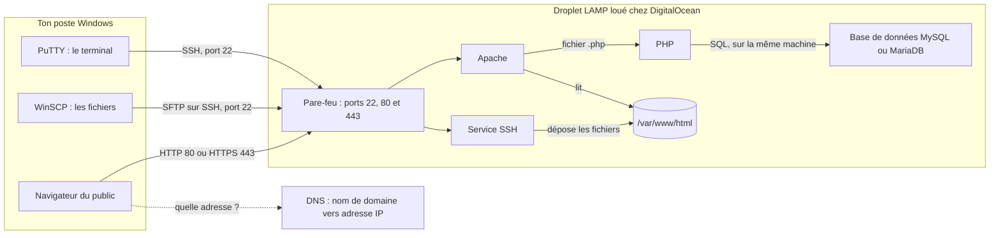
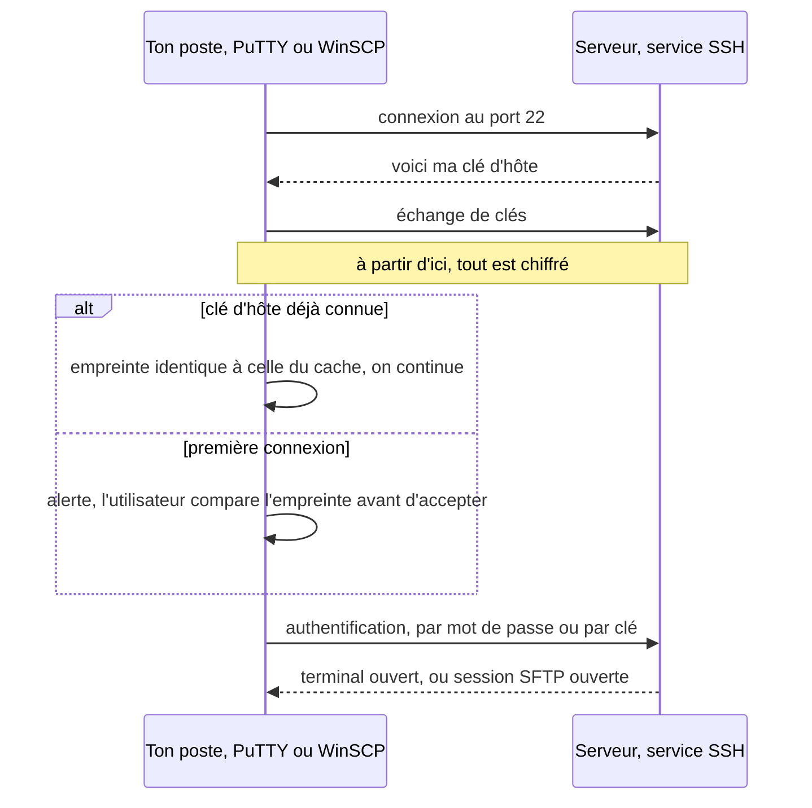
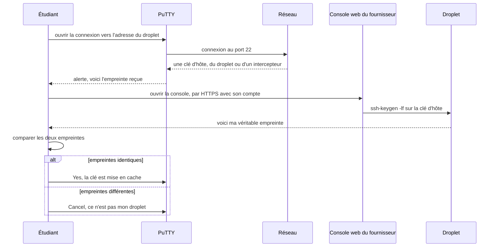
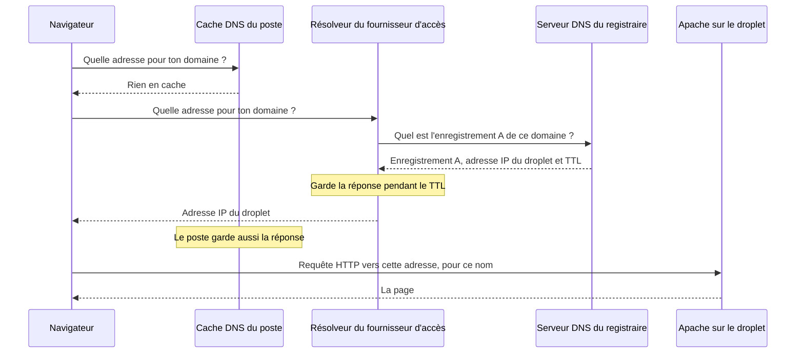
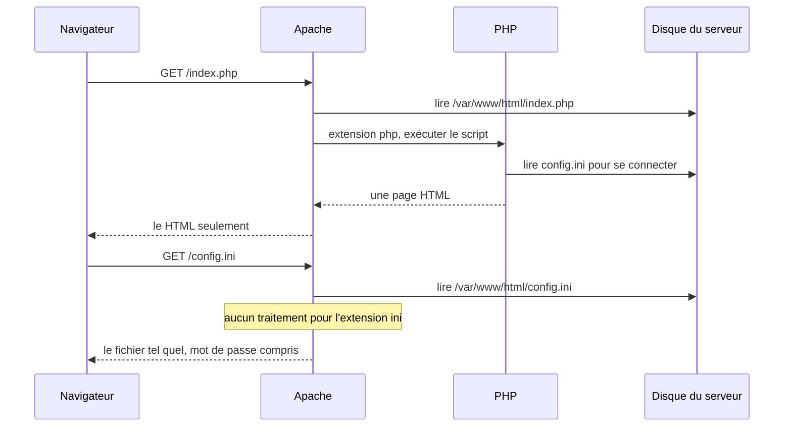
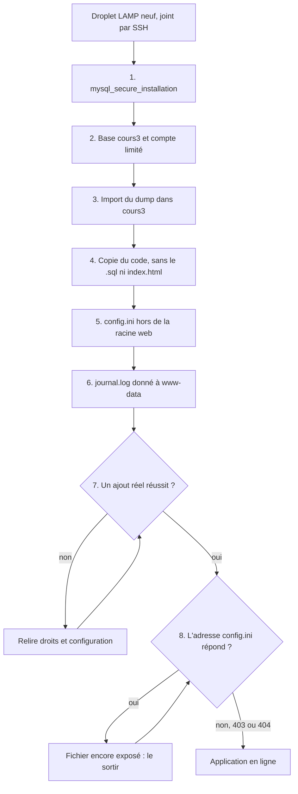

# Déployer une application PHP chez un hébergeur

## L'idée en une image {diapos="5, 8, 10"}

Jusqu'ici, tu as cuisiné pour toi. Ton application tournait dans WAMP, sur ton propre poste, et
l'adresse `localhost` voulait dire « cet ordinateur-ci ». Personne d'autre ne pouvait la visiter. La
séance 8 fait le pas suivant : **ouvrir la cuisine au public**.

Pour ouvrir un restaurant, tu as deux choix. Tu peux acheter un immeuble, le raccorder à l'électricité
et à l'aqueduc, et réparer toi-même la toiture quand elle coule. Ou tu peux **louer un local** : le
propriétaire entretient l'immeuble, et toi, tu installes ta cuisine, tu fixes ton menu et tu ouvres
la porte. La séance 8 choisit la location. Le local loué s'appelle un **serveur virtuel** : une
machine qui n'existe que sous forme logicielle, découpée dans un gros ordinateur physique du
fournisseur. Chez DigitalOcean, le fournisseur retenu par le cours, ce serveur virtuel porte le nom
de **droplet** (« gouttelette »).

Une fois le local loué, trois questions restent à régler, et toute la leçon les traite dans l'ordre.

1. **Comment entrer dans le local pour l'aménager ?** Par un canal chiffré, SSH, avec deux outils :
   PuTTY pour donner des ordres au serveur, WinSCP pour y déposer des fichiers.
2. **Comment les clients trouvent-ils l'adresse ?** Par l'adresse IP du serveur, puis, si tu en
   achètes un, par un nom de domaine que le DNS traduit en cette adresse.
3. **Comment la cuisine sert-elle un plat ?** Par la **pile LAMP** : Linux fait tourner la machine,
   Apache reçoit les requêtes, PHP exécute ton code, et la base de données garde les données.

Le diagramme suivant réunit les trois. Lis-le en deux temps : d'abord les flèches de gauche, qui sont
**les tiennes** (tu administres), puis la flèche du navigateur, qui est **celle du public**.



Le pare-feu du diagramme n'est pas une invention de la leçon : la capture de la diapositive 42 montre
le message d'accueil du droplet LAMP, qui annonce un pare-feu déjà actif où seuls les ports 22, 80 et
443 sont ouverts. Cette capture date de 2019 ; l'image actuelle peut différer dans le détail, et la
section « Se connecter : PuTTY, puis WinSCP » dit comment le constater plutôt que le supposer.

**Où l'analogie casse, et il faut le dire.** Trois endroits.

1. **Un local commercial est dans une rue ; un serveur est dans le monde entier.** Une vitrine n'est
   visitée que par les passants du quartier. Un serveur public reçoit, dans les minutes qui suivent sa
   mise en ligne, des tentatives de connexion automatiques venues de partout. Il n'y a pas de
   « quartier tranquille » sur Internet : c'est pour cette raison que plusieurs gestes du cours
   reçoivent plus bas une correction.
2. **Un bail se signe pour un an ; un droplet se loue à l'heure et se détruit d'un clic.** La
   diapositive 10 le dit : le service est « généralement un coût mensuel (divisé à l'heure) ». Un
   droplet oublié continue d'être facturé. Un droplet détruit emporte ses données avec lui, sans
   déménagement possible.
3. **Le propriétaire d'un local ne touche pas à ta cuisine ; ici, la frontière bouge selon ce que tu
   loues.** Certains fournisseurs entretiennent aussi le système d'exploitation, d'autres toute
   l'application. C'est exactement ce que la grille IaaS, PaaS, SaaS de la section « L'infrastructure,
   et ce que le nuage loue » met en image.

## En bref — la marche à suivre {diapos="36-39, 44, 49-52, 60, 68, 72, 76-80, 84-86, 91, 93"}

:::: marche-a-suivre {titre="Mettre en ligne une application PHP et sa base de données sur un serveur LAMP loué"}

1. {voir="Créer le serveur chez DigitalOcean"} Crée un droplet : bouton « Create Droplet », région
   Toronto, image « LAMP » trouvée sous l'onglet « Solutions », plan le plus petit sous « Regular ».

2. {voie="cours"} {voir="« One-time password » : un mot de passe root reçu par courriel"} Choisis
   « One-time password » dans la section « Authentication » : le mot de passe de root arrive par
   courriel, avec l'adresse IP du serveur.

3. {voie="moderne"} {voir="« One-time password » : un mot de passe root reçu par courriel"} Génère
   une clé SSH sur ton poste avant de créer le droplet, puis choisis « SSH Key » et colle la clé
   publique.

   ```text
   ssh-keygen -t ed25519
   ```

4. {voir="Ce que coûte un droplet"} Note la date de création du droplet, et détruis-le à la fin de la
   session : il est facturé tant qu'il existe, allumé ou non.

5. {voir="Se connecter : PuTTY, puis WinSCP"} Ouvre PuTTY avec l'adresse IP du droplet, le port 22
   et le type de connexion SSH, puis change le mot de passe de root à la première connexion.

6. {voir="L'alerte de clé d'hôte, acceptée sans vérification"} Avant de cliquer « Yes » sur l'alerte
   de PuTTY, compare l'empreinte affichée à celle que le serveur donne de lui-même, lue depuis la
   console web du fournisseur.

   ```bash
   ssh-keygen -lf /etc/ssh/ssh_host_ed25519_key.pub
   ```

7. {voie="cours"} {voir="Se connecter : PuTTY, puis WinSCP"} Travaille avec le compte root et son
   mot de passe, dans PuTTY comme dans WinSCP.

8. {voie="moderne"} {voir="Se connecter : PuTTY, puis WinSCP"} Crée un compte administrateur
   ordinaire, membre du groupe sudo, connecte-toi avec lui par clé, puis interdis la connexion
   directe de root avec `PermitRootLogin no`.

   ```bash
   adduser deploy && usermod -aG sudo deploy
   ```

9. {voir="Se connecter : PuTTY, puis WinSCP"} Ouvre WinSCP avec la même adresse, le port 22 et le
   protocole SFTP, pour transférer les fichiers par glisser-déposer.

10. {voir="Valider le déploiement"} Tape l'adresse IP du droplet dans le navigateur pour confirmer
    que le serveur web répond.

11. {voir="Le fuseau horaire"} Règle le fuseau horaire du système sur America/Toronto, puis vérifie
    le résultat avec `timedatectl` et `date`.

    ```bash
    timedatectl set-timezone America/Toronto
    ```

12. {voir="Le fuseau du système n'est pas celui de PHP"} Règle aussi `date.timezone` dans le
    `php.ini` d'Apache : changer le fuseau du système ne change pas celui que PHP utilise.

13. {voir="Le nom de domaine et le DNS"} Si tu as un nom de domaine, crée chez ton registraire un
    enregistrement A nommé `@` qui pointe vers l'adresse IP du droplet, puis attends la propagation.

14. {voie="moderne"} {voir="HTTPS, que les captures montrent et que la séance n'enseigne plus"} Une
    fois le domaine pointé, obtiens un certificat HTTPS avec Certbot, que l'image LAMP livre déjà
    installé.

    ```bash
    sudo certbot --apache -d votre-domaine.ca
    ```

15. {voir="Sécuriser MariaDB : mysql_secure_installation"} Lance l'assistant de sécurisation et
    accepte le retrait des comptes anonymes, de la connexion de root à distance et de la base de
    test.

    ```bash
    mysql_secure_installation
    ```

16. {voie="cours"} {voir="Le compte de l'application"} Ouvre `mysql`, crée le compte `app_user`,
    donne-lui tous les privilèges sur toutes les bases, puis recharge les privilèges avec
    `FLUSH PRIVILEGES`.

    ```sql
    GRANT ALL PRIVILEGES ON *.* TO 'app_user'@'localhost';
    ```

17. {voie="moderne"} {voir="GRANT ALL PRIVILEGES sur toutes les bases — un second root"} Limite le compte de
    l'application aux quatre opérations sur les données, dans sa seule base, avec un mot de passe
    généré, et garde un compte distinct pour l'administration.

    ```sql
    GRANT SELECT, INSERT, UPDATE, DELETE ON cours3.* TO 'app_user'@'localhost';
    ```

18. {voir="Installer phpMyAdmin"} Télécharge l'archive zip de phpMyAdmin, décompresse-la, renomme le
    dossier en un nom court et téléverse-le sous `/var/www/html` avec WinSCP.

19. {voir="Installer phpMyAdmin"} Tape l'adresse de phpMyAdmin avec exactement la casse du dossier
    téléversé : Linux distingue `phpmyadmin` de `phpMyAdmin`.

20. {voie="moderne"} {voir="Un phpMyAdmin ouvert à tout Internet"} Une fois l'import terminé,
    retire phpMyAdmin de la racine web, ou restreins son accès à ton adresse IP.

    ```bash
    sudo rm -r /var/www/html/phpmyadmin
    ```

21. {voir="Importer la base"} Dans phpMyAdmin, crée la base vide `cours3`, importe le fichier `.sql`
    par l'onglet « Importer », puis ouvre la table pour vérifier ses lignes.

22. {voir="Déployer le code"} Supprime la page `index.html` livrée par défaut, puis copie le code de
    l'application sous `/var/www/html`, sans le fichier `.sql`.

    ```bash
    rm /var/www/html/index.html
    ```

23. {voie="cours"} {voir="config.ini : les guillemets, et un fichier que tout le monde peut lire"}
    Modifie `config.ini`, resté dans `/var/www/html`, pour y inscrire le nouveau compte, chaque
    valeur entre guillemets.

    ```bash
    vi /var/www/html/config.ini
    ```

24. {voie="moderne"} {voir="config.ini : les guillemets, et un fichier que tout le monde peut lire"}
    Range `config.ini` un dossier au-dessus de la racine web, et fais lire ce nouveau chemin par le
    code PHP.

    ```php
    $config = parse_ini_file(__DIR__ . "/../config.ini");
    ```

25. {voie="cours"} {voir="chmod 777 journal.log"} Rends le fichier de journalisation inscriptible
    pour tout le monde.

    ```bash
    chmod 777 journal.log
    ```

26. {voie="moderne"} {voir="chmod 777 journal.log"} Donne le fichier de journalisation à
    l'utilisateur d'Apache, et n'ouvre l'écriture qu'à lui.

    ```bash
    chown www-data:www-data journal.log && chmod 640 journal.log
    ```

27. {voir="Déployer le code"} Ouvre ton domaine ou ton adresse IP dans le navigateur, puis fais un
    ajout réel pour vérifier que l'application écrit bien dans la base.

::::

## Ce que la séance 8 enseigne, et ce que cette leçon ajoute {diapos="3, 6, 99"}

::: cours {diapos="3, 6, 99"}
Le rappel ouvre la séance : « Au dernier cours, nous avons vu comment il est possible de créer des
mécanismes d'authentification dans une application PHP afin de s'assurer que seules les personnes
autorisées puissent avoir accès aux données sensibles. Dans le cours d'aujourd'hui, nous verrons
comment déployer une application sur un serveur web. » Le plan annoncé compte sept points : le
concept d'infrastructure infonuagique, la création du compte DigitalOcean, le logiciel de gestion de
serveur, la configuration du fuseau horaire, la configuration du nom de domaine, le déploiement de la
base de données et le déploiement du code. La dernière diapositive de contenu annonce la suite :
« Au prochain cours, ce sera l'examen 2 qui couvrira la matière des cours 1 à 7. »
:::

Ce module porte le numéro 7 alors qu'il couvre la **séance 8**, pour la même raison que le module
précédent : la séance 6 était l'examen 1. Tous les exercices cités dans cette leçon viennent de la
feuille de la séance 8, qui en compte six, dont un optionnel (le nom de domaine).

Remarque ce que dit la diapositive 99, parce qu'elle change la façon de réviser : selon elle,
l'examen 2 porte sur les cours **1 à 7**. La séance 8 n'y est donc pas annoncée. Elle n'en est pas
moins la séance où ton application quitte ton poste, et ses exercices te font déployer pour vrai ;
la règle d'arbitrage ci-dessous vaut pour toute évaluation qui toucherait cette matière.

La séance est aussi la plus **visuelle** du cours. Beaucoup de diapositives se réduisent à « cliquez
ici » ; ce qui est réellement configuré ne se lit que dans leurs captures d'écran. Cette leçon s'appuie
donc sur les captures autant que sur le texte, et elle le dit chaque fois. Deux particularités du
support sont à connaître dès maintenant.

- **Le support mêle deux applications.** Les diapositives 85, 87 et 93 déploient la base `cours3`,
  qui correspond au corrigé du cours 5 ; les captures des diapositives 86, 90, 92 et 94 montrent une
  autre application, celle de l'examen de pratique, avec sa base `pratique_examen_1`. La section
  « Déployer le code » démêle les deux. L'exercice 6, lui, fait déployer le corrigé du **cours 7** :
  la leçon suit l'énoncé pour l'exercice, et les diapositives pour la démonstration.
- **Le support est rédigé pour WAMP** (diapositive 5), mais la diapositive 81 parle encore de
  l'interface de phpMyAdmin « que nous utilisions dans XAMPP ». Au Cégep, c'est WAMP ; le phpMyAdmin
  que tu installeras sur le serveur est le même logiciel que celui de ton poste.

La séance repose aussi sur un autre cours : la diapositive 68 renvoie au « cours 4 en Sécurisation des
applications web » pour la sécurisation de la base de données. Le cours de sécurité de la même
session déploie sur le même genre de serveur ; ce qui est vu là-bas sur SSH et le pare-feu s'applique
tel quel ici.

::: complement
Ce que la leçon ajoute, et qui **n'est pas exigible** : la connexion par clé SSH plutôt que par mot de
passe, la comparaison de l'empreinte du serveur avant la première connexion, le compte administrateur
ordinaire avec `sudo`, le fuseau horaire propre à PHP, le HTTPS avec Certbot, les privilèges limités
du compte de l'application, la protection de phpMyAdmin, le `config.ini` rangé hors de la racine web
et les permissions exactes du journal. Chaque ajout est rattaché au geste du cours qu'il complète, et
chaque correction cite sa raison.
:::

::: a-retenir
**La règle d'arbitrage, valable pour toute la leçon : à l'examen, donne la réponse du cours ; en
production, applique la correction.** Un encadré de correction ne supprime jamais ce que le cours
enseigne : il le conserve, dit pourquoi ce n'est pas suffisant sur un serveur public, et donne ce
qu'il faut faire à la place. La marche à suivre ci-dessus applique la même règle : les étapes
« Voie du cours » sont celles de la séance, les étapes « Équivalent moderne » celles qu'on ferait
aujourd'hui.
:::

Un mot sur le mot de passe que le support montre à ses diapositives 72, 80 et 93. Il est écrit en
toutes lettres dans un document public ; **ne le reprends pas**, ni sur ton serveur ni ailleurs. Un
mot de passe publié n'est plus un secret, quelle que soit sa complexité. Cette leçon ne le recopie
que là où le cours le montre, ou pour une mesure, et toujours avec cet avertissement. La section « Le compte de l'application » dit comment en générer un.

## L'infrastructure, et ce que le nuage loue {diapos="8, 9, 10, 11"}

::: cours {diapos="8, 9, 10, 11"}
L'**infrastructure** représente l'équipement qui rend une application disponible à ses utilisateurs
finaux : serveurs, équipement réseau, pare-feu, etc. Les choix d'infrastructure « peuvent avoir un
impact considérable » sur le coût, la sécurité et la capacité de mise à l'échelle de l'application.

Elle peut être installée sur les lieux de l'organisation : c'est l'approche **traditionnelle**, dite
*on premise*. L'approche **infonuagique** (*cloud*) a pris une part grandissante du marché ; plusieurs
entreprises offrent des services d'infrastructure (Amazon Web Services, DigitalOcean, Linode,
Heroku, etc.).

Le nuage est « un service permettant de louer des infrastructures informatiques d'un fournisseur
externe », qui en assure l'entretien. Les services sont généralement facturés au mois, **divisés à
l'heure**.

Avantages par rapport à l'approche traditionnelle : réduction et prévisibilité des coûts,
accélération du développement, extensibilité plus facile, sécurité généralement supérieure.
Désavantages : une flexibilité des technologies parfois limitée (« très rare »), et des données
sensibles hébergées sur une infrastructure externe.
:::

Pars de ce que tu connais. Ton poste, avec WAMP, **est** une infrastructure : un ordinateur, une
carte réseau, un système d'exploitation, un serveur web, une base de données. Il lui manque trois
choses pour servir le public : être allumé en permanence, avoir une adresse joignable depuis
Internet, et être protégé contre ceux qui la joignent.

Définissons les deux termes du cours avant de les comparer.

- **Sur place** (*on premise*) : l'organisation achète le matériel, l'installe dans ses locaux et
  s'occupe de tout, du câblage à l'application. Elle paie d'avance, et elle possède.
- **En nuage** (*cloud*, « infonuagique » en français du Québec) : l'organisation **loue** de la
  capacité de calcul à un fournisseur, qui possède les centres de données. Elle paie à l'usage, et
  elle ne possède rien.

Un serveur loué en nuage est presque toujours **virtuel**. La **virtualisation** est la technique qui
découpe un ordinateur physique en plusieurs machines logicielles isolées, chacune avec son propre
système d'exploitation. Le logiciel qui fait ce découpage s'appelle un **hyperviseur**. C'est lui qui
permet au fournisseur de te louer « un serveur » en quelques minutes : il ne branche aucun câble, il
lance une machine virtuelle.

**La facturation à l'heure a une conséquence pratique immédiate.** Un serveur de cours n'a pas besoin
d'exister douze mois : il se crée au début de la session et se détruit à la fin. La section « Ce que
coûte un droplet » revient sur ce que le support annonce comme prix, et sur le piège du droplet
oublié.

**Un exemple simple.** Ton projet de session doit être visible par l'enseignant pendant trois mois.
Acheter un serveur, le brancher chez toi et ouvrir ton routeur à Internet coûterait plus cher, et
exposerait ton réseau domestique. Louer un petit serveur virtuel pour la durée du projet, puis le
détruire, règle les deux problèmes.

**Un exemple plus réaliste.** Une boutique en ligne québécoise reçoit dix fois plus de visites en
novembre qu'en juillet. Sur place, elle doit acheter assez de serveurs pour le pic, qui dormiront onze
mois par an. En nuage, elle loue deux serveurs en juillet et vingt en novembre : c'est ce que la
diapositive 11 appelle une **extensibilité plus facile** (la capacité de mise à l'échelle). En
contrepartie, les données de ses clients vivent dans les centres de données d'une autre entreprise :
c'est le second désavantage de la diapositive 11, et il n'a rien de théorique.

::: correction-du-cours {source="Fiche KB web/php/php-hebergement-domaine-https.md, §1 (maj 2026-08-19) ; D. Heinemeier Hansson, « Why we're leaving the cloud », 37signals, octobre 2022"}
La diapositive 11 range « réduction des coûts » et « sécurité généralement supérieure » parmi les
avantages du nuage. Pour l'examen, retiens la liste telle quelle. En pratique, ces deux avantages ne
sont vrais que **par rapport à un petit parc de serveurs sur place, mal administré**.

- **Le coût.** À grande échelle et avec une charge stable, posséder redevient souvent moins cher que
  louer. L'éditeur 37signals a annoncé en 2022 qu'il quittait le nuage public précisément pour cette
  raison.
- **La sécurité.** Le fournisseur sécurise ce qu'il gère : les bâtiments, le matériel,
  l'hyperviseur. **Tout ce qui est au-dessus reste à toi.** Un serveur virtuel loué dont personne
  n'applique les correctifs n'est pas plus sûr qu'un serveur sur place dans le même état. C'est ce
  qu'on appelle le **modèle de responsabilité partagée**, et la sous-section suivante le met en
  image.
:::

**Le diagramme de responsabilité, en une phrase :** plus tu loues haut, moins tu administres, et plus
tu dépends du fournisseur pour ce que tu n'administres plus. La sous-section qui suit montre où passe
la frontière pour chacun des trois types de service.

### IaaS, PaaS, SaaS — qui gère quoi {diapos="12, 13, 14, 15, 16, 17"}

::: cours {diapos="12, 14, 15, 16"}
Le cours distingue trois types principaux de service.

- **IaaS** (*Infrastructure as a Service*, infrastructure en tant que service) : on a directement
  accès au système d'exploitation « et tout ce qui va dessus » (environnement d'exécution, base de
  données, pare-feu applicatif, etc.). Avantage : une très grande flexibilité et une vitesse de
  déploiement, sans gestion physique du matériel. Fournisseurs donnés en exemple : DigitalOcean,
  Amazon Web Services. **C'est le type de service utilisé dans le cours.**
- **PaaS** (*Platform as a Service*, plateforme en tant que service) : un service de déploiement de
  code et de base de données, « sans vous encombrer avec les détails de l'administration du système
  d'exploitation ». Exemples : Heroku, Amazon Web Services, avec la précision qu'AWS offre certains
  services IaaS et d'autres PaaS.
- **SaaS** (*Software as a Service*, logiciel en tant que service) : « pas une infrastructure
  réellement », mais la somme de l'infrastructure et de l'application ; une solution clé en main
  que les clients utilisent, généralement contre un paiement mensuel. Le support cite les raisons
  qui poussent les entreprises à quitter l'approche par licence : prévisibilité des coûts, avantages
  fiscaux (selon le support, les services de location sont entièrement déductibles d'impôt),
  déploiement simplifié côté serveur, sécurité accrue parce que le code critique reste sur le
  serveur. Exemple : **Office 365**.
:::

L'affirmation fiscale est celle du support ; cette leçon ne la discute pas, parce qu'elle relève de
la comptabilité et non du déploiement.

L'image à retenir de cette sous-section est la grille des diapositives 13 et 17, reprise deux fois à
l'identique : une fois comme plan, une fois comme récapitulatif. Elle empile **neuf couches**, du
matériel en bas à l'application en haut, et colorie chacune selon qui la gère : « You Manage » (toi)
ou « Vendor Manages » (le fournisseur). La voici transcrite en tableau, couche du bas en dernier,
comme dans la capture.

| Couche | Sur place | IaaS | PaaS | SaaS |
|---|---|---|---|---|
| Applications | toi | toi | toi | fournisseur |
| Data (données) | toi | toi | toi | fournisseur |
| Runtime (environnement d'exécution) | toi | toi | fournisseur | fournisseur |
| Middleware (intergiciel) | toi | toi | fournisseur | fournisseur |
| O/S (système d'exploitation) | toi | toi | fournisseur | fournisseur |
| Virtualization (virtualisation) | toi | fournisseur | fournisseur | fournisseur |
| Servers (serveurs) | toi | fournisseur | fournisseur | fournisseur |
| Storage (stockage) | toi | fournisseur | fournisseur | fournisseur |
| Networking (réseau) | toi | fournisseur | fournisseur | fournisseur |

Trois termes de la grille méritent une définition.

- Le **runtime** est le programme qui exécute ton code : pour toi, c'est l'interpréteur PHP.
- Le **middleware** est le logiciel qui se place entre le système et ton application pour lui rendre
  service : le serveur web Apache, le serveur de base de données.
- Le **système d'exploitation** (*O/S*) est Linux, dans le cas du cours : c'est lui que tu
  administres avec `apt-get`, `timedatectl` et `chmod`.

**Ce que la grille enseigne vraiment : la ligne de partage monte d'une colonne à l'autre.** Sur place,
rien n'est au fournisseur. En IaaS, les quatre couches matérielles passent de son côté. En PaaS,
s'ajoutent le système, l'intergiciel et le runtime. En SaaS, tout. À la question « qu'est-ce qui change
entre IaaS et PaaS ? », la réponse attendue est **la hauteur de la ligne** : en PaaS, tu ne touches
plus au système d'exploitation.

**L'analogie du logement**, pour s'en souvenir.

- **Sur place**, c'est être propriétaire de sa maison : la toiture, la plomberie, les meubles et le
  ménage sont à toi.
- **L'IaaS**, c'est louer un appartement **non meublé** : le propriétaire entretient l'immeuble,
  l'électricité et la plomberie ; toi, tu meubles, tu installes les électroménagers et tu verrouilles
  ta porte.
- **Le PaaS**, c'est louer un appartement **meublé et équipé** : tu n'apportes que tes affaires. Tu ne
  choisis pas la cuisinière, et tu ne peux pas la remplacer.
- **Le SaaS**, c'est **l'hôtel** : tu n'apportes que toi, et tu te sers de ce qui est fourni.

**Où l'analogie casse.** Deux endroits, et le second compte.

1. **À l'hôtel, rien de ce que tu laisses dans la chambre n'est à l'hôtel.** La grille, elle, colorie
   la couche « Data » du côté du fournisseur en SaaS. C'est vrai pour l'**exploitation** — le
   fournisseur héberge et sauvegarde les données — et faux pour la **responsabilité**, précisée dans
   l'encadré suivant.
2. **Un immeuble est soit meublé, soit non meublé ; un fournisseur peut être les deux.** Le support
   le dit lui-même pour AWS. DigitalOcean aussi loue à la fois des serveurs virtuels (IaaS) et des
   services où l'on dépose seulement son code. Le type de service se juge **produit par produit**,
   jamais fournisseur par fournisseur.

::: complement
Qui répond des données dans un logiciel en ligne ? Le fournisseur les stocke, mais il n'en est ni le
propriétaire ni le responsable. Au Québec, la **Loi 25** (Loi modernisant des dispositions
législatives en matière de protection des renseignements personnels) fait porter cette responsabilité à l'organisation qui
collecte les renseignements, quel que soit l'étage du nuage où ils sont stockés : droits d'accès,
conservation, déclaration d'un incident. Le règlement européen RGPD suit la même logique.
:::

**Un exemple simple : situer la séance sur la grille.** Le droplet LAMP est un service IaaS. La preuve
tient dans les commandes de la séance : tu règles le fuseau horaire du système (`timedatectl`), tu
changes les droits d'un fichier (`chmod`). Ces deux gestes touchent la couche « O/S ». Dans un PaaS,
tu ne les ferais pas : ils appartiennent au fournisseur.

**Un exemple plus réaliste : la même application sur un PaaS.** Imagine le corrigé du cours 5 déployé
sur une plateforme qui n'accepte que du code. Plus de PuTTY, plus de `mysql_secure_installation`,
plus de fuseau à régler dans le système : la plateforme s'en charge. Mais un problème apparaît, que la
grille ne montre pas. Le corrigé écrit ses événements dans un fichier `journal.log`, à côté de son
code. Or beaucoup de plateformes de ce type ont un **système de fichiers éphémère** : ce qu'une
application écrit sur son disque disparaît au redéploiement suivant. Le journal serait effacé à
chaque mise à jour. Monter d'une colonne dans la grille, c'est abandonner du contrôle, et une
application pensée pour un serveur qu'on administre ne s'y transporte pas toujours sans changement.

## PuTTY et WinSCP, deux clients SSH {diapos="26, 27, 28"}

::: cours {diapos="26, 27, 28"}
Le cours retient deux logiciels de gestion du serveur. **PuTTY** permet de prendre le contrôle d'un
terminal d'un serveur distant ; il se connecte par le protocole **SSH** (*Secure Shell*), « qui
remplace l'ancienne méthode TELNET », et sert à gérer le serveur à distance. **WinSCP** permet le
transfert de fichiers entre l'ordinateur du développeur et un serveur distant ; il utilise lui aussi
le protocole SSH, et transfère les fichiers par un simple glisser-déposer.
:::

Un serveur loué n'a ni écran ni clavier que tu puisses toucher. Tout se fait donc **à distance**, et
deux besoins se présentent : **donner des ordres** au serveur (installer, configurer, redémarrer) et
**lui remettre des fichiers** (ton code, phpMyAdmin). PuTTY répond au premier, WinSCP au second.

Quelques définitions, dans l'ordre où on en a besoin.

- Un **terminal** est une fenêtre où l'on tape des commandes et où le système répond en texte.
  PuTTY affiche, sur ton poste, le terminal d'une machine qui est ailleurs.
- Un **protocole** est l'ensemble des règles qu'appliquent deux programmes pour se parler. HTTP est
  celui du web ; SSH est celui de l'administration à distance.
- Un **port** est un numéro qui désigne, sur une même machine, le service auquel on s'adresse. Le
  port **22** est celui de SSH par convention ; c'est la valeur par défaut que montre la diapositive 39.
- **Telnet**, que SSH remplace, faisait le même travail **en clair** : chaque caractère tapé,
  mot de passe compris, traversait le réseau lisible par quiconque se trouvait sur le chemin.

**L'analogie : la carte postale et le fourgon blindé.** Telnet, c'est envoyer tes ordres sur une carte
postale : chaque facteur peut la lire. SSH, c'est un fourgon blindé entre ton poste et le serveur :
personne ne voit ce qu'il transporte. PuTTY et WinSCP sont deux usages du même fourgon. PuTTY y fait
voyager des **ordres** ; WinSCP y fait voyager des **cartons**. Le transfert de fichiers de WinSCP
passe par **SFTP** (*SSH File Transfer Protocol*), un protocole de fichiers qui roule à l'intérieur de
SSH. La capture de la diapositive 45 l'affiche dans la barre d'état de WinSCP : « SFTP-3 ».

**Où l'analogie casse — et c'est le point de sécurité de toute cette section.** Un fourgon blindé
protège son chargement ; il ne garantit pas que le destinataire est le bon. Si un imposteur se place
sur la route et se présente comme le serveur, le fourgon livre, blindé, **chez l'imposteur**. SSH a
une parade à ce problème, mais elle demande un geste de ta part, et c'est ce que montre le diagramme
suivant.



Le chiffrement protège contre ceux qui **écoutent** ; seule la vérification de la clé d'hôte protège
contre ceux qui **se font passer** pour le serveur. La sous-section « L'alerte de clé d'hôte, acceptée
sans vérification » détaille ce que la capture de la diapositive 41 montre, et le geste qui manque.

**Un exemple simple : les trois champs de PuTTY.** La capture de la diapositive 40 montre la fenêtre
de PuTTY remplie avec trois valeurs, et chacune correspond à une définition ci-dessus. *Host Name* :
l'adresse IP du droplet, lue dans le tableau de bord de DigitalOcean. *Port* : 22, le service SSH.
*Connection type* : SSH. Le bouton « Open » ouvre le terminal ; WinSCP demande les mêmes trois
informations, avec le protocole SFTP à la place du type de connexion.

**Un exemple plus réaliste : les mêmes gestes sans installer de logiciel.**

::: complement
Windows 10 et Windows 11 embarquent un client **OpenSSH** : les commandes `ssh`, `scp` et `sftp`
sont disponibles directement dans PowerShell, sans installer PuTTY ni WinSCP. Les mêmes commandes
existent sous Linux et macOS. Ce n'est pas la méthode du cours, mais elle a deux avantages : une
commande se recopie dans un script, et elle se relance à l'identique au déploiement suivant, là où un
glisser-déposer est un geste manuel qu'on refait de mémoire.
:::

L'adresse `203.0.113.10` ci-dessous appartient à une plage réservée à la documentation : elle ne
désigne aucun serveur réel. Remplace-la par l'adresse IP de ton droplet.

```text
ssh root@203.0.113.10
scp -r mon-application root@203.0.113.10:/var/www/html/
```

La première ligne ouvre un terminal sur le serveur, comme PuTTY. La seconde copie le dossier
`mon-application` et son contenu (`-r`, pour *récursif*) dans `/var/www/html`, comme un glisser-déposer
dans WinSCP. Tel quel, l'application répond sous `/mon-application/` ; pour déposer le **contenu** à
la racine, comme la séance, écris
`scp -r mon-application/* root@<adresse-ip-du-droplet>:/var/www/html/`. Les deux passent par SSH, sur le port 22, et les deux montrent la même alerte de clé
d'hôte à la première connexion. Dans la démarche recommandée, `root` y est remplacé par un compte
ordinaire : c'est l'objet de la section « Se connecter : PuTTY, puis WinSCP ».

::: complement
**FTP en clair, jamais.** Le protocole FTP, qu'on rencontre encore chez des hébergeurs anciens,
transmet l'identifiant, le mot de passe et les fichiers sans chiffrement : c'est la carte postale de
Telnet, appliquée aux fichiers. Sur ce point, la démarche du cours est la bonne : WinSCP s'y connecte
en SFTP, et la capture de la diapositive 45 le prouve. Retiens la raison, parce que ce bon choix
vient ici du réglage par défaut de l'outil ; si un jour un hébergeur te propose « FTP », demande
SFTP ou FTPS.
:::

## La pile LAMP et les commandes Linux du cours {diapos="29, 30, 31, 32"}

::: cours {diapos="29, 30, 31, 32"}
La **pile LAMP** est un ensemble de technologies complémentaires : **L**inux, **A**pache,
**M**ySQL, **P**HP. **Linux** est un système d'exploitation libre (*open source*) très populaire,
soutenu par plusieurs communautés qui proposent chacune leur **distribution** : Fedora, CentOS,
Ubuntu, Debian, etc. Le cours précise que les configurations nécessaires seront minimales, parce qu'il
utilise des modèles déjà configurés, « ce qui est également utilisé dans l'industrie ».

La diapositive 32 donne neuf commandes : `CD` change le répertoire en cours ; `MKDIR` crée un
répertoire ; `MV` déplace ou renomme un fichier ; `VI` est l'éditeur de texte de Linux ; `APT-GET`
gère les installations et leurs dépendances ; `LS` liste les fichiers du répertoire en cours ; `RM`
supprime un fichier ; `CHMOD` change les accès sur un fichier ; `SUDO` donne les droits
d'administrateur.
:::

Une **pile** (*stack*) est un ensemble de logiciels empilés, où chacun rend service à celui du
dessus. Tu utilises déjà une pile : WAMP, c'est **W**indows, **A**pache, **M**ySQL ou MariaDB,
**P**HP. Passer de WAMP à LAMP ne change qu'une lettre, et c'est pour cette raison que ton code PHP
fonctionnera sur le serveur sans être réécrit. Ce qui change, c'est le système autour de lui : des
chemins de fichiers différents, des permissions, et un système qui distingue les majuscules des
minuscules.

Voici le rôle de chaque étage, du bas vers le haut.

1. **Linux** fait tourner la machine : fichiers, utilisateurs, permissions, réseau. Le droplet du
   cours tourne sous **Ubuntu**, une distribution de Linux.
2. **Apache** est le **serveur web** : le programme qui écoute les ports 80 et 443, reçoit les
   requêtes HTTP et renvoie des réponses. Il sert lui-même les fichiers ordinaires (HTML, images,
   CSS) et confie les fichiers `.php` à PHP.
3. **PHP** exécute ton code et produit la page HTML que renvoie Apache.
4. **La base de données** garde les données. Le « M » vient de **MySQL**. **MariaDB** est un
   embranchement (*fork*) de MySQL, créé en 2009 par des développeurs d'origine de MySQL ; les deux
   se parlent avec le même SQL et, pour ce que fait ce cours, les mêmes commandes.

Le support emploie les deux noms : « MySQL » à la diapositive 30, « MariaDB » dans la section sur la
base de données. La capture de la diapositive 69 montre pourtant la sortie de l'assistant de
sécurisation de **MySQL**, avec un lien vers la documentation MySQL 8.0. Le modèle actuel de l'image
LAMP (dépôt `digitalocean/droplet-1-clicks`, `lamp-24-04`, relu le 2026-09-17) installe **MySQL**
(`mysql-server`) ; la capture de la diapositive 81, prise sur un droplet plus ancien
(Ubuntu 20.04), montre pourtant MariaDB 10.3.31. Vérifie le tien avec `mysql --version`. La section « Sécuriser MariaDB : mysql_secure_installation » en tire la
conséquence.

**L'analogie du restaurant, pour la pile.** Linux est le **bâtiment**. Apache est le **serveur de
salle** : il prend les commandes et apporte les plats. PHP est le **cuisinier** : il prépare ce qui
n'est pas prêt d'avance. La base de données est le **garde-manger** : le cuisinier va y chercher les
ingrédients, et le client n'y entre jamais.

**Où l'analogie casse, et c'est la faille la plus importante de la séance.** Un serveur de salle
refuse d'apporter au client le cahier de recettes du chef. **Apache, lui, apporte n'importe quel
fichier posé dans la salle** — la salle, c'est le dossier `/var/www/html` — sauf si on le lui
interdit. Un fichier `.php` est confié au cuisinier, qui ne renvoie que le résultat ; mais un fichier
`config.ini` n'est pas du PHP : Apache le renvoie **tel quel**, mot de passe compris, à qui en demande
l'adresse. Le diagramme de la section « Déployer le code » montre ces deux requêtes côte à côte.

Sous Ubuntu, la configuration installée par le paquet d'Apache ne refuse par défaut que les
fichiers dont le nom commence par `.ht`. L'image LAMP de DigitalOcean n'y ajoute aucune règle pour
les `.ini` ou les `.log` (dépôt public `digitalocean/droplet-1-clicks`, modèle `lamp-24-04`, relu le
2026-09-17) : son hôte virtuel autorise tout `/var/www/html` (`Require all granted`) et y active même
la liste des fichiers d'un dossier (`Options Indexes`). Ne le crois pas sur parole : une fois
l'application copiée, demande toi-même l'adresse du fichier, dans le navigateur ou, depuis
PowerShell sur ton poste, avec la commande suivante. Sous PowerShell 5.1, `curl` seul est un alias
d'`Invoke-WebRequest` ; `curl.exe` appelle le vrai client, livré avec Windows.

```text
curl.exe -I http://<adresse-ip-du-droplet>/config.ini
```

Un code `200` veut dire que le fichier est servi à n'importe qui ; un `403` ou un `404`, qu'il ne
l'est pas. La section « config.ini : les guillemets, et un fichier que tout le monde peut lire »
montre ce que la séance en fait, et comment le corriger.

**Les neuf commandes du cours, à taper en minuscules.** Le tableau suivant les reprend avec un
exemple réel pour chacune.

| Commande | Rôle, selon la diapositive 32 | Exemple |
|---|---|---|
| `cd` | changer de répertoire | `cd /var/www/html` |
| `mkdir` | créer un répertoire | `mkdir sauvegardes` |
| `mv` | déplacer ou renommer | `mv phpMyAdmin-5.2.3-all-languages phpmyadmin` |
| `vi` | éditer un fichier texte | `vi config.ini` |
| `apt-get` | installer des logiciels et leurs dépendances | `sudo apt-get install unzip` |
| `ls` | lister les fichiers | `ls -l` |
| `rm` | supprimer un fichier | `rm index.html` |
| `chmod` | changer les droits d'accès d'un fichier | `chmod 640 journal.log` |
| `sudo` | exécuter une commande avec les droits d'administrateur | `sudo apt-get update` |

::: correction-du-cours {source="Comportement de Linux et de ses systèmes de fichiers (ext4), qui distinguent les majuscules des minuscules ; cartographie des renvois du lot PHP-8, nuance 16, 2026-09-16"}
La diapositive 32 écrit les commandes en **majuscules** (`CD`, `MKDIR`, `APT-GET`…), et la
diapositive 33 écrit `apt-get INSTALL`. Retiens les noms et les rôles tels que le cours les donne,
mais **tape-les en minuscules** : Linux distingue les majuscules des minuscules, `CD` n'est pas `cd`,
et le terminal répondra qu'il ne trouve pas la commande. La même règle vaut pour les noms de fichiers
et de dossiers, ce qui aura une conséquence concrète à la section « Installer phpMyAdmin ».
:::

Deux options du tableau méritent une explication. `ls -l` affiche la liste **longue** : pour chaque
fichier, ses droits, son propriétaire et son groupe. C'est la commande qui te permettra de constater
ce que fait `chmod`. Et `rm` supprime **sans corbeille** : un fichier effacé par `rm` ne se récupère
pas. Avec l'option `-r`, il efface un dossier et tout ce qu'il contient.

::: complement
Une dixième commande manque à la liste, et la démarche corrigée en a besoin : **`chown`** (*change
owner*) change le **propriétaire** d'un fichier. `chmod` règle **ce que** chacun peut faire ;
`chown` règle **à qui** appartient le fichier. Sur un serveur Ubuntu, Apache et PHP s'exécutent sous
l'utilisateur **`www-data`** : un fichier que ton application doit écrire doit donc être accessible
en écriture à cet utilisateur-là, et à lui seul. Une onzième aide à s'orienter : **`pwd`** affiche le
répertoire où tu te trouves.
:::

**Un exemple simple : se situer et regarder.** Juste après la connexion, tu arrives dans le dossier
personnel de l'utilisateur. Trois commandes suffisent pour aller voir ce que sert Apache.

```bash
pwd
cd /var/www/html
ls -l
```

`pwd` te dit où tu es ; `cd` t'amène dans la racine web, le dossier que la capture de la
diapositive 42 désigne comme celui d'Apache ; `ls -l` en liste le contenu. Sur un droplet neuf, tu y
trouveras la page d'accueil livrée par l'image, que la séance fait supprimer au moment de déployer.

**Un exemple plus réaliste : préparer la racine web.** Voici, dans l'ordre, les gestes que la séance
répartit sur plusieurs diapositives, cette fois en commandes. La séance décompresse et renomme le
dossier de phpMyAdmin sur ton poste, avant de le téléverser ; la variante ci-dessous fait le
renommage sur le serveur, pour montrer les commandes, et suppose le dossier décompressé déjà
téléversé dans `/var/www/html`.

```bash
cd /var/www/html
sudo mv phpMyAdmin-5.2.3-all-languages phpmyadmin
sudo rm index.html
ls -l
```

Ligne 2 : `mv` **renomme** le dossier, parce que la source et la destination sont dans le même
répertoire. Le nom choisi est en minuscules, comme dans la capture de la diapositive 78. Ligne 3 :
`rm` supprime la page par défaut, ce que la diapositive 91 demande avant de copier le code. Ligne 4 :
`ls -l` vérifie le résultat, avec le propriétaire de chaque fichier. Si la colonne du propriétaire
affiche `root` pour un fichier que PHP doit écrire, tu viens de trouver la cause exacte du
`chmod 777` de la diapositive 93, traitée dans la section « chmod 777 journal.log ».

### apt-get, vi et sudo {diapos="33, 34, 35"}

::: cours {diapos="33, 34, 35"}
**apt-get** : deux commandes, écrites ainsi sur la diapositive 33 : `sudo apt-get update` puis
`sudo apt-get INSTALL <application>`.

**vi** permet de modifier les fichiers de code source et de configuration. On ouvre un fichier avec
`vi monfichier.txt`. Pour écrire, il faut passer en mode « Insert » en appuyant sur la touche `i`.
Pour sauvegarder, on appuie sur « ESC », puis on tape « : wq » (*write and quit*) et on appuie sur
« entrée ». Pour quitter sans sauvegarder, on appuie sur « ESC » et on tape `:q!`.

**sudo** accorde les droits d'administrateur. Il peut être nécessaire de s'en servir pour accorder
les privilèges nécessaires à une opération, « si vous n'utilisez pas le compte administrateur par
défaut (root) ».
:::

La commande d'installation se tape en minuscules, `install`, pour la raison donnée à la section
précédente.

**apt-get, le gestionnaire de paquets.** Sous Ubuntu, on n'installe pas un logiciel en téléchargeant
un installateur sur un site web. On le demande à un **gestionnaire de paquets**, qui le télécharge
depuis les dépôts officiels de la distribution, avec tout ce dont il dépend. Un **paquet** est un
logiciel prêt à installer ; une **dépendance** est un autre paquet sans lequel il ne fonctionne pas.
L'ordre des deux commandes du cours a une raison.

1. `sudo apt-get update` **ne met rien à jour sur le serveur**. Elle rafraîchit la **liste** des
   paquets disponibles et de leurs versions. Sans elle, le gestionnaire travaille sur un catalogue
   périmé.
2. `sudo apt-get install unzip` installe le paquet demandé, en choisissant la version dans ce
   catalogue fraîchement relu.

**L'analogie du catalogue.** `update`, c'est aller chercher le nouveau catalogue de la quincaillerie ;
`install`, c'est commander un article dans ce catalogue. Commander dans le catalogue de l'an dernier
fait livrer un article qui n'existe plus, ou une version dépassée. **Où l'analogie casse :** relire
le catalogue ne remplace pas les outils que tu as déjà. Pour cela, il faut une troisième commande,
que le cours ne donne pas.

::: complement
`sudo apt-get upgrade` installe les **nouvelles versions** des paquets déjà présents, dont les
**correctifs de sécurité**. Sur un serveur public, c'est le premier geste après la création, puis un
geste régulier : selon la fiche KB, le message d'accueil capturé en 2019 pour la séance annonçait
déjà des mises à jour de sécurité en attente, qu'aucune diapositive n'applique. La commande `apt`, plus récente, fait le même travail avec
un affichage pensé pour un humain : `sudo apt update` puis `sudo apt upgrade`. Dans un script,
`apt-get` reste le choix recommandé, parce que son affichage ne change pas d'une version à l'autre.
:::

```bash
sudo apt-get update
sudo apt-get upgrade
```

**vi, l'éditeur à modes.** Sur un serveur, il n'y a ni Bloc-notes ni Visual Studio Code : on édite un
fichier dans le terminal. `vi` est présent sur presque tous les systèmes Linux, et il déroute au
premier contact pour une seule raison : **il a des modes**. Dans le mode **normal**, celui où il
s'ouvre, les touches sont des **commandes**, pas des lettres à écrire. Taper `dd` n'écrit pas deux
« d » : cela efface une ligne.

| Mode | Comment on y entre | Ce que font les touches |
|---|---|---|
| normal | à l'ouverture, ou avec `Échap` | déplacent le curseur et donnent des ordres |
| insertion | `i` depuis le mode normal | écrivent le texte |
| ligne de commande | `:` depuis le mode normal | tapent une commande : `:wq`, `:q!` |

**L'analogie de la machine à écrire à levier.** Imagine une machine à écrire munie d'un levier. Levier
en bas, les touches **tapent** des lettres. Levier en haut, les mêmes touches **commandent** la
machine : reculer, effacer une ligne, retirer la feuille. `Échap` baisse le levier en position de
commande ; `i` le remet en position d'écriture. **Où l'analogie casse :** une vraie machine montre
la position de son levier ; `vi` n'affiche son mode que discrètement, en bas de l'écran
(`-- INSERT --` en mode insertion, selon la version). Dans le doute, appuie sur `Échap` : tu es alors
certain d'être en mode normal.

La diapositive 34 écrit la commande de sauvegarde avec une espace, « : wq ». La forme qu'on trouve
dans toute la documentation de `vi` est `:wq`, collée : le deux-points ouvre la ligne de commande de
l'éditeur, et la commande suit. Tape-la ainsi ; elle fait exactement ce que le cours décrit, écrire
le fichier puis quitter.

**Un exemple simple : corriger une valeur dans un fichier.** Tu veux changer le nom de la base dans un
fichier de configuration. La suite de gestes est toujours la même.

1. `vi config.ini` ouvre le fichier, en mode normal.
2. Place le curseur sur la valeur avec les flèches, puis appuie sur `i` : tu écris.
3. Corrige la valeur.
4. Appuie sur `Échap` : tu reviens en mode normal.
5. Tape `:wq` puis `Entrée` : le fichier est enregistré et l'éditeur se ferme.

Si tu t'es trompé, remplace l'étape 5 par `:q!` puis `Entrée` : l'éditeur se ferme **sans
enregistrer**, et le fichier reste tel qu'il était.

**Un exemple plus réaliste : modifier un fichier système.** Le fuseau horaire de PHP se règle dans le
fichier `php.ini` qu'utilise Apache, et ce fichier appartient à root. Son chemin contient le numéro
de version de PHP : l'exemple suppose ici la version 8.4, celle qu'installe l'image LAMP (elle
ajoute le dépôt `ondrej/php` et installe `php8.4`, relevé du 2026-09-17) ; remplace ce numéro par
celui que donne `php -v`.

```bash
php -v
sudo vi /etc/php/8.4/apache2/php.ini
sudo systemctl restart apache2
```

Ligne 2 : `sudo` est nécessaire, parce qu'un compte ordinaire n'a pas le droit d'écrire ce fichier.
Dans l'éditeur, tape `/date.timezone` puis `Entrée` en mode normal : la barre oblique **cherche** le
texte qui suit. Passe en insertion avec `i`, retire le point-virgule qui commente la ligne, écris la
valeur `America/Toronto` après le signe égal, puis `Échap` et `:wq`. Ligne 3 : Apache ne relit
`php.ini` qu'à son redémarrage ; `systemctl restart` le relance. Pourquoi ce réglage est nécessaire
même quand le fuseau du système est déjà juste, la section « Le fuseau du système n'est pas celui de
PHP » le démontre.

**sudo, le badge temporaire.** Sous Linux, **root** est le compte administrateur : il peut tout faire,
y compris détruire le système d'une seule commande mal tapée. `sudo` (*superuser do*) permet à un
compte ordinaire, s'il y est autorisé, d'exécuter **une** commande avec les droits de root, après
avoir confirmé son propre mot de passe. Les commandes suivantes, sans `sudo`, redeviennent
ordinaires.

**L'analogie du badge.** Un employé ordinaire n'a pas accès à la salle des serveurs. Quand il doit y
entrer, il passe son badge à la porte : la porte s'ouvre **pour ce passage-là**, et le passage est
consigné. Travailler directement en root, c'est se promener toute la journée avec le passe-partout
du concierge. **Où l'analogie casse :** un badge ouvre une porte précise ; `sudo`, dans sa
configuration habituelle, donne **tous** les droits de root à la commande qu'il précède. Il ne limite
pas ce que la commande peut faire ; il limite **combien de temps** tu portes ces droits, et il laisse
une trace dans le journal du système.

**Pourquoi le cours n'en a presque pas besoin.** La diapositive 35 le dit en creux : `sudo` sert « si
vous n'utilisez pas le compte administrateur par défaut (root) ». Or la démarche de la séance se fait
**en root** du début à la fin : les captures des diapositives 42, 45 et 93 montrent toutes une
session root. Une commande tapée par root n'a pas besoin de `sudo`. C'est pour cette raison que les
commandes de la séance, comme `chmod 777 journal.log` sur la capture de la diapositive 93, n'en
portent pas.

::: correction-du-cours {source="Fiche KB web/php/php-hebergement-domaine-https.md, §2 (maj 2026-08-19), et fiche KB web/securite/securisation-acces-distant-ssh.md"}
Travailler en root de bout en bout, comme le montrent les captures de la séance, est la réponse du
cours, et elle fonctionne. En production, on crée un **compte administrateur ordinaire**, membre du
groupe `sudo`, on se connecte avec lui par **clé SSH**, puis on interdit la connexion directe de root
(`PermitRootLogin no` dans la configuration du service SSH). Deux raisons : une faute de frappe
tapée par un compte ordinaire échoue au lieu de détruire le système, et le compte `root`, dont le nom
est connu de tous, cesse d'être une cible qu'on peut attaquer par Internet. La démarche complète est
donnée à la section « Se connecter : PuTTY, puis WinSCP ».
:::

## Créer le serveur chez DigitalOcean {diapos="21, 24, 36, 37, 38"}

::: cours {diapos="21, 24"}
DigitalOcean est « une plateforme de type IaaS qui permet la création d'instances virtuelles ». Le
système d'exploitation utilisé est Linux, et c'est la plateforme retenue dans le cadre du cours,
accessible à l'adresse www.digitalocean.com. Le serveur virtuel qu'on y configure est appelé un
« Droplet ».
:::

Tu connais maintenant la grille « qui gère quoi » : en IaaS, le fournisseur s'occupe du matériel, de
la virtualisation, du stockage et du réseau, et **tout ce qui est au-dessus est à toi**. C'est
précisément pour cette raison que le cours choisit un IaaS pour apprendre : le système d'exploitation
reste visible, donc on voit ce que les autres formules cachent. Une **instance virtuelle** est un
serveur découpé par logiciel dans une machine physique du fournisseur ; elle a son propre système,
sa propre adresse IP et ses propres comptes, comme un ordinateur à part entière.

Avant de créer le serveur, il faut un compte chez le fournisseur. Les diapositives qui suivent la 21
en montrent les écrans ; la leçon ne les décrit pas, parce qu'une interface commerciale change plus
vite qu'un support de cours.

**L'analogie : le formulaire de location.** Créer un droplet, c'est remplir le formulaire d'une
agence de location de locaux. Tu choisis le **quartier** (la région), l'**aménagement** livré (l'image
préinstallée), la **superficie** (le plan), la **façon de recevoir la clé** (l'authentification) et
l'**enseigne** (le nom d'hôte). **Où l'analogie casse :** une agence te fait visiter avant de signer ;
ici, le local existe dès que tu cliques, il est joignable par tout Internet dans les minutes qui
suivent, et le compteur de location tourne déjà.

::: cours {diapos="36, 37, 38"}
La séance déroule la création en gestes numérotés.

1. Connectez-vous à www.digitalocean.com, avec votre compte.
2. Cliquez sur « Create Droplet ».
3. Choisissez une région dans laquelle votre serveur sera déployé (par exemple, Toronto).
4. Dans « Choose an image », cliquez sur « Solutions », puis cherchez et choisissez « LAMP ».
5. Dans « Choose a plan », prenez le minimum (« celui à 6$ par mois ») sous « Regular ».
6. Dans la section « Authentication », choisissez « One-time password ».
7. Changez le nom dans « Choose a hostname » si vous le souhaitez.
8. Cliquez sur « Create » et attendez quelques minutes.
9. Vous recevrez un courriel avec les informations de connexion du serveur : code utilisateur, mot
   de passe et adresse IP.
:::

Les diapositives numérotent ces gestes avec un petit accroc : le chiffre 3 y apparaît deux fois, une
fois pour la région (diapositive 36) et une fois pour l'image (diapositive 37). La liste ci-dessus
réunit le choix de l'image en un seul geste pour retomber sur les neuf du support.

Chaque choix a une raison, et la connaître évite de cliquer à l'aveugle.

- **La région** détermine le centre de données où la machine tourne. Plus il est proche de tes
  visiteurs, plus la réponse arrive vite. La capture de la diapositive 36 montre **Toronto**
  sélectionné, le choix naturel pour un public québécois.
- **L'image** est le système livré à la création. L'image « LAMP » arrive avec Linux (Ubuntu),
  Apache, PHP et la base de données déjà installés : c'est ce qui dispense la séance de tout
  installer à la main. La capture de la diapositive 37 montre l'onglet **Solutions** et la recherche
  « LAMP ». La version du support republiée le 2026-09-12 ne nomme plus la version d'Ubuntu ; la
  précédente nommait « LAMP on 24.04 », sous un onglet alors appelé « Marketplace ».
- **Le plan** fixe la mémoire, le processeur et le disque, donc le prix. Le plus petit suffit
  largement pour une application d'exercice.
- **L'authentification** décide comment tu prouveras ton identité au serveur. C'est le choix le plus
  lourd de conséquences, et la sous-section consacrée au « One-time password » le détaille.
- **Le nom d'hôte** (*hostname*) est le nom que la machine se donne à elle-même ; il apparaît dans
  l'invite du terminal. Il n'a rien à voir avec un nom de domaine, qui est traité plus loin.

**Un exemple simple : le formulaire rempli selon le cours.** Le nom d'hôte ci-dessous est inventé ;
choisis le tien.

```text
Région ............... Toronto
Image ................ Solutions, recherche « LAMP »
Plan ................. Regular, le plus petit palier
Authentification ..... One-time password          (voie du cours)
Nom d'hôte ........... lamp-cours-php
```

**Un exemple plus réaliste : le même formulaire, préparé la veille.** Une équipe qui déploie pour de
vrai fait deux choses de plus. Avant d'ouvrir le formulaire, elle génère une clé SSH sur son poste,
et elle choisit « SSH Key » à la place du mot de passe (la sous-section suivante explique pourquoi).
Après la création, elle ne suppose rien de l'image : elle demande au serveur ce qu'il contient
réellement, dès la première connexion.

```bash
lsb_release -a
apache2 -v
php -v
mysql --version
```

Ligne 1 : la distribution et sa version, par exemple une Ubuntu LTS. Lignes 2 à 4 : les versions
d'Apache, de PHP et du moteur de base de données. Ces numéros te serviront plus tard, par exemple
pour trouver le bon `php.ini` (section « apt-get, vi et sudo »), et ils valent mieux qu'une capture
d'écran d'une autre année.

::: exercice-du-cours {seance="8" ref="1"}
Crée ton compte chez DigitalOcean, puis déploie un serveur LAMP en suivant les gestes ci-dessus. La
feuille d'exercices fixe l'objectif de toute la séance : mettre en ligne une application que tu as
écrite, ou à défaut le corrigé du cours 5. Avant de cliquer « Create », lis la sous-section « Ce que
coûte un droplet » : un droplet se facture tant qu'il existe, et c'est à toi de le détruire à la fin.
:::

### Ce que coûte un droplet {diapos="10, 38"}

::: cours {diapos="10, 38"}
La diapositive 10 définit le nuage comme un service de location d'infrastructure, dont les services
sont « généralement un cout mensuel (Divisé à l'heure) ». La diapositive 38, dans la version du
support republiée le 2026-09-12, demande de prendre le plan minimum, « celui à 6$ par mois », sous
« Regular ».
:::

**Un prix mensuel, décompté au temps.** Le prix d'un droplet s'affiche par mois, mais il se décompte
au temps pendant lequel la machine **existe**. Deux conséquences en découlent, et la seconde surprend
presque tout le monde.

1. Un droplet créé pour un laboratoire de trois heures, puis détruit, ne coûte qu'une petite fraction
   du prix mensuel.
2. **Éteindre un droplet ne suspend pas la facturation.** La documentation de DigitalOcean (page
   « Droplet Pricing », consultée le 2026-09-16) le dit explicitement : un droplet éteint reste
   facturé, parce que son processeur, sa mémoire, son disque et son adresse IP restent réservés.
   Pour arrêter la facture, il faut le **détruire**.

**L'analogie du stationnement à l'heure.** Un droplet, c'est une voiture laissée dans un stationnement
payant : le compteur tourne tant qu'elle occupe la place, **moteur allumé ou non**. Pour arrêter le
compteur, il faut sortir la voiture. **Où l'analogie casse :** une voiture qu'on sort du stationnement
existe encore. Un droplet détruit disparaît **avec son disque** : le code, la base et la configuration
partent avec lui. D'où la règle : on récupère ce qu'on veut garder **avant** de détruire.

**Ce qu'il faut savoir avant de créer le compte.**

- Un compte DigitalOcean exige un **moyen de paiement**. Ce n'est pas un service gratuit : même un
  exercice d'une soirée est facturé.
- Un droplet **oublié** continue d'être facturé, mois après mois, jusqu'à sa destruction.
- Les options ajoutées au formulaire, comme les sauvegardes automatiques ou un plan plus gros,
  augmentent le prix.
- Les tarifs changent. La fiche KB du cours, vérifiée en août 2026, rapportait déjà une facturation à
  la seconde et un palier d'entrée moins cher que celui de la diapositive. Le prix qui fait foi est
  celui qu'affiche le formulaire **le jour où tu crées le droplet**.

**Un exemple simple : le laboratoire du soir.** Tu crées le droplet à 18 h, tu suis la séance, tu
récupères ce que tu veux garder, et tu le détruis à 21 h. Tu paies trois heures.

**Un exemple plus réaliste : le droplet de septembre retrouvé en décembre.** Tu crées le droplet pour
la séance 8, l'examen arrive, et tu l'oublies. Quatre mois plus tard, tu as payé environ quatre fois
le prix mensuel. Avec le chiffre de la diapositive 38, cela ferait de l'ordre de 24 $ avant taxes,
pour un serveur que personne n'a visité.

::: complement
**Trois gestes qui évitent la mauvaise surprise.** Note la date de création du droplet dans ton
agenda, avec un rappel pour sa destruction. Si la console du fournisseur propose une alerte de
facturation, règle-la sur un petit montant. Et si tu veux conserver un serveur sans le garder allumé,
la même page de documentation propose d'en prendre un **instantané** (*snapshot*), puis de le
détruire : l'instantané permet de recréer le droplet plus tard. Il est facturé lui aussi, selon sa
taille, mais il ne réserve plus de processeur ni de mémoire.
:::

### « One-time password » : un mot de passe root reçu par courriel {diapos="38, 39"}

::: cours {diapos="38, 39"}
Dans la section « Authentication », le cours fait choisir « One-time password ». Après la création,
un courriel apporte les informations de connexion : code utilisateur, mot de passe et adresse IP. À
la première connexion avec PuTTY, « vous devrez changer le mot de passe de « root » ». Le mot de
passe fourni par courriel se colle dans PuTTY avec le bouton droit de la souris.
:::

**Deux termes d'abord.** **root** est le compte administrateur de Linux, celui qui a tous les droits.
Un **mot de passe à usage unique** (*one-time password*) est ici un mot de passe provisoire : il sert
à la première connexion, puis le serveur **exige** d'en choisir un nouveau avant de te laisser
travailler. Le flux complet se déroule ainsi.

1. Tu crées le droplet chez DigitalOcean, avec l'option « One-time password ».
2. DigitalOcean envoie à ta boîte de courriel le nom d'utilisateur `root`, un mot de passe
   provisoire et l'adresse IP du serveur.
3. Tu lis le courriel.
4. Tu ouvres PuTTY sur cette adresse et te connectes en `root` avec le mot de passe provisoire.
5. Le droplet répond que le mot de passe est expiré et qu'il faut en choisir un nouveau.
6. Tu saisis le mot de passe provisoire, puis le nouveau mot de passe deux fois.
7. Le terminal s'ouvre ; seul le nouveau mot de passe est désormais valide.

Un détail qui déroute la première fois : quand tu tapes ou colles un mot de passe dans PuTTY,
**rien ne s'affiche**, pas même des astérisques. C'est voulu : le terminal ne révèle même pas la
longueur du mot de passe. Colle-le avec le bouton droit, comme le dit la diapositive 39, puis appuie
sur `Entrée`.

**Un exemple simple : le changement imposé.** La capture de la diapositive 42, prise en 2019, montre
ce changement du mot de passe de root juste après le message d'accueil. Sous Linux, un mot de passe
expiré se remplace d'ordinaire en redonnant l'actuel, celui du courriel, puis le nouveau deux fois ;
l'ordre exact des questions peut varier d'une version à l'autre, lis-les avant de coller. Choisis un mot de passe **long et généré** par un
gestionnaire de mots de passe, jamais un mot de passe déjà utilisé ailleurs : ce compte ouvre tout le
serveur.

**Pourquoi cette voie est la plus fragile de la séance.** Trois faiblesses s'additionnent.

1. **Le mot de passe voyage par courriel.** Il reste stocké dans ta boîte de réception, sur les
   serveurs de ton fournisseur de courriel, et dans toute copie de ta boîte. Le changer à la première
   connexion réduit le risque, sans l'effacer : entre la création et ta connexion, la porte est ouverte
   avec une clé que d'autres systèmes ont vue passer.
2. **Le compte visé porte un nom connu de tous.** Un attaquant n'a pas à deviner l'identifiant :
   c'est `root`.
3. **Le port 22 est ouvert à tout Internet**, et des robots y essaient des mots de passe en boucle,
   comme le rappelle la fiche KB du cours. Un mot de passe, même bon, peut être essayé ; une clé
   privée qui ne quitte pas ton poste ne peut pas l'être de la même façon.

**L'analogie de la serrure à empreinte.** Un mot de passe, c'est un code de porte : quiconque l'a lu
par-dessus ton épaule, ou dans ton courriel, peut entrer. Une **clé SSH**, c'est une serrure qui ne
s'ouvre qu'avec un objet que tu gardes sur toi : tu déposes au serveur une description de cet objet,
la **clé publique**, et tu gardes l'objet lui-même, la **clé privée**, sur ton poste. **Où l'analogie
casse :** la clé privée n'est jamais présentée au serveur. Ton poste s'en sert pour **signer** une
question que le serveur lui pose, et le serveur vérifie la signature avec la clé publique. La clé
privée ne traverse donc jamais le réseau, ce qu'aucune clé physique ne sait faire.

::: correction-du-cours {source="Fiche KB web/php/php-hebergement-domaine-https.md, §2 (maj 2026-08-19), et fiche KB web/securite/securisation-acces-distant-ssh.md"}
Choisir « One-time password » est la réponse du cours, et c'est elle qu'on attend à l'examen. En
production, on choisit **« SSH Key »** dès la création du droplet : le serveur n'accepte alors que la
clé déposée, et aucun mot de passe de root ne circule par courriel. La clé se génère sur ton poste
**avant** d'ouvrir le formulaire.
:::

**Un exemple plus réaliste : la création par clé.** Dans un terminal de ton poste (PowerShell sous
Windows, où la commande s'écrit de la même façon) :

```text
ssh-keygen -t ed25519 -C "poste-etudiant"
```

La commande crée deux fichiers dans le dossier `.ssh` de ton profil Windows : `id_ed25519`, la clé
privée, qui ne quitte jamais ton poste, et `id_ed25519.pub`, la clé publique. Protège la clé privée
par une **phrase de passe** quand la commande la demande : si ton portable est volé, la clé seule ne
suffira pas. Ouvre ensuite `id_ed25519.pub` avec le Bloc-notes, copie sa ligne unique, et colle-la
dans le formulaire du droplet après avoir choisi « SSH Key ». Le libellé exact de l'option est celui
de la diapositive 38 pour la voie du cours ; si l'interface du fournisseur l'a renommée depuis,
cherche le choix entre une clé et un mot de passe dans la même section « Authentication ».

## Se connecter : PuTTY, puis WinSCP {diapos="39, 40, 41, 42, 43, 44, 45"}

::: cours {diapos="39, 44"}
Pour se connecter avec PuTTY, on ouvre l'application et on entre l'adresse IP du serveur, le port
22 (valeur par défaut) et le type de connexion SSH, puis on appuie sur « Open ». Il faudra changer le
mot de passe de « root » à la première connexion. WinSCP est une application qui permet de téléverser
des fichiers sur le serveur distant ; tout comme PuTTY, il utilise le port 22 et le protocole SSH.
:::

La section « PuTTY et WinSCP, deux clients SSH » a expliqué **ce que** sont ces deux outils. Celle-ci
suit la séance **dans l'ordre des gestes**, capture par capture, puis donne la démarche que le cours
ne montre pas : se connecter sans être root.

**Étape 1 : trouver l'adresse.** La capture de la diapositive 40 montre le tableau de bord de
DigitalOcean, avec le droplet et son adresse IP. C'est la même adresse que dans le courriel de
création. Dans la suite, elle est notée `<adresse-ip-du-droplet>` : remplace-la par la tienne.

**Étape 2 : ouvrir PuTTY.** La même capture montre la fenêtre de PuTTY remplie : l'adresse dans
*Host Name*, `22` dans *Port*, *SSH* comme type de connexion. Le bouton « Open » lance la connexion.

**Étape 3 : l'alerte de clé d'hôte.** À la toute première connexion, PuTTY affiche une alerte de
sécurité (capture de la diapositive 41). Le cours fait cliquer « Yes ». Ce clic mérite une
sous-section à lui seul : « L'alerte de clé d'hôte, acceptée sans vérification ».

**Étape 4 : s'identifier.** Le terminal demande l'utilisateur (`root`), puis le mot de passe du
courriel, puis impose le changement décrit à la sous-section précédente.

**Étape 5 : lire le message d'accueil.** La capture de la diapositive 42 montre ce que le serveur
affiche une fois la connexion ouverte. **Cette capture date de 2019** et provient d'un droplet LAMP
bâti sur Ubuntu 18.04 : l'image actuelle peut différer dans le détail. Sur cette capture, le message
annonçait quatre choses utiles :

- un pare-feu, **UFW**, déjà actif, qui ne laisse passer que les ports 22 (SSH), 80 (HTTP) et 443
  (HTTPS) ;
- la racine web, le dossier `/var/www/html`, où ira ton application ;
- le mot de passe root de MySQL, enregistré selon ce message dans le fichier
  `/root/.digitalocean_password` ;
- l'outil **Certbot**, préinstallé pour obtenir un certificat HTTPS.

Les deux premières informations servent tout de suite. La troisième demande de la prudence : si ce
fichier existe sur ton droplet, il contient un **secret en clair** ; ne le recopie nulle part, et ne
le dépose jamais dans `/var/www/html`. Plutôt que de croire une capture de 2019, constate l'état réel
du pare-feu :

```bash
ufw status verbose
```

La commande liste les règles actives. Si le pare-feu est inactif sur ton image, c'est une chose à
savoir **avant** d'installer quoi que ce soit d'autre.

**Étape 6 : ouvrir WinSCP.** WinSCP demande les mêmes informations que PuTTY : l'adresse, le port 22,
l'utilisateur et le mot de passe, avec le protocole de fichiers **SFTP**. La capture de la diapositive
45 montre la session ouverte en root, la barre d'état indiquant « SFTP-3 », et le dossier
`/var/www/html` affiché côté serveur. Le glisser-déposer d'un dossier de ton poste vers ce panneau
copie les fichiers sur le serveur.

**Un exemple simple : la première session, selon le cours.** Adresse, port 22, SSH, « Open », « Yes »
sur l'alerte, `root`, mot de passe du courriel collé au bouton droit, nouveau mot de passe deux fois.
Puis WinSCP avec les mêmes identifiants. C'est la démarche attendue à l'examen, et elle fonctionne.

::: correction-du-cours {source="Fiche KB web/php/php-hebergement-domaine-https.md, §2 (maj 2026-08-19), et fiche KB web/securite/securisation-acces-distant-ssh.md"}
Travailler en root par mot de passe, dans PuTTY comme dans WinSCP, est la réponse du cours. En
production, on crée un **compte administrateur ordinaire**, membre du groupe `sudo`, on s'y connecte
**par clé**, puis on interdit la connexion directe de root avec `PermitRootLogin no`. L'ordre des
gestes compte : on ferme la porte de root **seulement après** avoir vérifié que l'autre porte
s'ouvre, sinon on se verrouille dehors.
:::

**Un exemple plus réaliste : la démarche recommandée, dans l'ordre.** Elle suppose que le droplet a
été créé avec une clé SSH, donc que le compte root accepte déjà ta clé. Le nom `deploy` est un
exemple ; choisis le tien.

```bash
adduser deploy
usermod -aG sudo deploy
mkdir -p /home/deploy/.ssh
cp /root/.ssh/authorized_keys /home/deploy/.ssh/
chown -R deploy:deploy /home/deploy/.ssh
chmod 700 /home/deploy/.ssh
chmod 600 /home/deploy/.ssh/authorized_keys
```

Ligne 1 : crée le compte `deploy` et lui demande un mot de passe, qui servira à `sudo`. Ligne 2 :
l'ajoute au groupe `sudo`, ce qui l'autorise à emprunter les droits de root commande par commande.
Lignes 3 et 4 : copient la liste des clés publiques autorisées de root dans le dossier du nouveau
compte. Lignes 5 à 7 : donnent ce dossier à `deploy` et en ferment l'accès aux autres comptes ; le
service SSH refuse une clé rangée dans un dossier trop ouvert.

**Avant d'aller plus loin, ouvre une seconde session** avec le compte `deploy` et ta clé, **sans
fermer la première**. Si elle s'ouvre, et si `sudo whoami` y répond `root` après ton mot de passe, tu
peux fermer la porte de root. Dans la session root restée ouverte, ouvre la configuration du service
SSH :

```bash
vi /etc/ssh/sshd_config
```

Mets la ligne `PermitRootLogin` à `no`, enregistre avec `:wq`, puis vérifie la valeur **réellement
appliquée** et relance le service :

```bash
sshd -T | grep -i permitrootlogin
systemctl restart ssh
```

La première ligne affiche la configuration effective du service. Elle est utile parce que les
versions récentes d'Ubuntu lisent aussi les fichiers du dossier `/etc/ssh/sshd_config.d/`, qui
peuvent redéfinir une valeur : c'est la valeur affichée ici qui compte, pas celle que tu as tapée. La
seconde relance le service SSH pour qu'il applique le changement. Garde la session root ouverte
jusqu'à ce qu'une nouvelle connexion en `deploy` réussisse encore.

::: complement
**PuTTY et WinSCP avec une clé.** PuTTY n'emploie pas directement la clé privée produite par
`ssh-keygen` : il utilise son propre format, `.ppk`. L'outil **PuTTYgen**, installé avec PuTTY,
importe la clé privée (menu « Conversions ») et l'enregistre dans ce format. Dans PuTTY, on indique
ensuite ce fichier dans la catégorie « Connection », « SSH », « Auth », « Credentials » (§4.22 de la
documentation de PuTTY ; avant la version 0.77, le champ était directement sous « Auth »). WinSCP accepte le même fichier
`.ppk` dans les réglages avancés de la session. Le client `ssh` intégré à Windows, présenté plus haut,
lit la clé sans conversion.
:::

### L'alerte de clé d'hôte, acceptée sans vérification {diapos="41"}

::: cours {diapos="41"}
La capture de la diapositive 41 montre la fenêtre « PuTTY Security Alert ». Elle dit que la clé
d'hôte du serveur n'est pas encore en cache, et que « You have no guarantee that the server is the
computer you think it is ». Elle affiche l'empreinte de la clé, de type `ssh-ed25519` sur 256 bits.
Le bouton **Yes** est encadré en rouge : c'est le geste que la séance fait faire.
:::

**Ce que PuTTY te demande vraiment.** Chaque serveur SSH possède une **clé d'hôte** : une identité
cryptographique propre à cette machine, créée à son installation. L'**empreinte** (*fingerprint*) est
un résumé court de cette clé, assez court pour être comparé à l'œil. À la première connexion, PuTTY
ne connaît pas encore le serveur ; il te montre l'empreinte reçue et te demande : « est-ce bien la
machine que tu voulais joindre ? ». Si tu réponds oui, il met l'empreinte **en cache** et la compare
automatiquement à chaque connexion suivante.

Ce modèle porte un nom : **TOFU** (*trust on first use*, la confiance au premier usage). Il est solide
pour toutes les connexions **suivantes**, et faible pour la **première** : à ce moment précis, rien
ne distingue le vrai serveur d'un **intercepteur**, une machine placée sur le chemin réseau qui se
fait passer pour lui (une attaque dite de l'*homme du milieu*). Cliquer « Yes » sans comparer, c'est
accepter ce que l'intercepteur présente. La fenêtre de la capture le dit elle-même, en toutes
lettres.

**L'analogie du livreur à la porte.** Un livreur sonne et dit venir de ta banque. Tu ne vérifies pas
son identité avec le numéro de téléphone **qu'il te donne**, mais avec celui qui est imprimé sur ta
carte bancaire : un **autre canal**, qu'il ne contrôle pas. **Où l'analogie casse :** un faux livreur
se trahit souvent par des détails ; un intercepteur SSH, lui, reproduit parfaitement la fenêtre de
connexion. L'empreinte est le seul détail qui le trahit, et seulement si tu la compares.

La parade tient donc en une idée : **obtenir l'empreinte par un autre chemin que la connexion SSH
elle-même**, puis comparer.



::: correction-du-cours {source="Fiche KB web/php/php-hebergement-domaine-https.md, §2 (maj 2026-08-19) ; texte de la capture de la diapositive 41"}
Cliquer « Yes » est le geste du cours, et la connexion fonctionne. En production, on **compare**
l'empreinte avant de cliquer. La fiche KB indique que la console web de DigitalOcean s'ouvre depuis le
menu « Access » du droplet (« Launch Droplet Console ») ; dans cette console, qui ne passe pas par
PuTTY, la commande ci-dessous affiche l'empreinte de la clé d'hôte, calculée **sur la machine
elle-même**.
:::

```bash
ssh-keygen -lf /etc/ssh/ssh_host_ed25519_key.pub
```

L'option `-l` demande l'empreinte, et `-f` désigne le fichier de la clé publique d'hôte. Le type
`ed25519` est celui qu'affiche la capture de la diapositive 41 ; si PuTTY annonce un autre type, lis
le fichier du même nom dans `/etc/ssh/`.

**Un exemple simple : deux chaînes à comparer.** PuTTY affiche une empreinte ; la console en affiche
une autre. Compare-les **caractère pour caractère**, au moins le début et la fin. Identiques : clique
« Yes ». Différentes : clique « Cancel », et ne tape surtout pas ton mot de passe.

**Deux pièges qui font croire à une différence qui n'en est pas une.** Une empreinte peut s'écrire
dans deux formats. Le format **SHA256**, celui que `ssh-keygen` produit par défaut, est une suite de
lettres et de chiffres précédée de `SHA256:`. Le format **MD5**, plus ancien, est une suite de paires
hexadécimales séparées par des deux-points ; c'est ce format que la fiche KB recopie de la capture de
la diapositive 41. Deux empreintes ne se comparent que dans le **même format**. Si ta version de
PuTTY affiche le format MD5, demande le même à `ssh-keygen` :

```bash
ssh-keygen -E md5 -lf /etc/ssh/ssh_host_ed25519_key.pub
```

**Un exemple plus réaliste : l'alerte qui revient.** Une fois l'empreinte en cache, PuTTY ne dit plus
rien, tant que le serveur ne change pas. S'il affiche un jour une alerte disant que la clé **ne
correspond plus** à celle qu'il connaît, deux explications sont possibles. La plus fréquente chez un
étudiant : tu as **détruit puis recréé** un droplet, et le nouveau a reçu la même adresse IP, avec
une nouvelle clé d'hôte. L'autre : quelqu'un s'interpose. La démarche est la même dans les deux cas :
tu vérifies la nouvelle empreinte par la console, **puis seulement** tu acceptes. Une alerte de
changement n'est jamais une formalité à cliquer.

## Valider le déploiement {diapos="46"}

::: cours {diapos="46"}
On peut confirmer le bon fonctionnement du serveur en écrivant son adresse IP dans le fureteur web.
:::

**Pourquoi ce test, et ce qu'il prouve.** Taper l'adresse dans un navigateur vérifie d'un seul coup
toute une chaîne : le droplet est allumé, il est joignable par Internet, le pare-feu laisse passer le
port 80, et Apache répond. C'est le premier jalon de la séance, avant le fuseau horaire, la base de
données et le code.

**Ce qu'il ne prouve pas.** Une page qui s'affiche ne dit rien de PHP, de la base de données ni de ton
application. La page servie à ce stade est celle que l'image livre par défaut. La capture de la
diapositive 46 montre une page de DigitalOcean qui dit « Please log into your Droplet with SSH to
configure the LAMP installation. », avec les boutons « Quickstart Guide » et « Ask a Question »
(© 2018) ; la barre d'adresse affiche « Not secure » devant l'adresse IP. La capture de la
diapositive 61 montre la même page, ouverte sur `www.<domaine>`. Le texte de la diapositive 46 demande
seulement d'écrire l'adresse IP dans le navigateur pour confirmer que le serveur fonctionne ; celui
de la diapositive 61 annonce « la page par défaut d'Apache ». Son contenu importe peu ; ce qui compte, c'est **qu'une page réponde**. La
validation de l'application elle-même, par une écriture réelle dans la base, vient à la section
« Déployer le code ».

**L'analogie de la sonnette.** Taper l'adresse IP, c'est sonner au local loué : quelqu'un vient
répondre, donc le bâtiment est ouvert et la porte d'entrée fonctionne. **Où l'analogie casse :** la
personne qui ouvre n'est pas encore ton personnel. Tant que ton code n'est pas copié, c'est l'accueil
du fournisseur qui répond, pas ton application.

**Un exemple simple : la barre d'adresse.** Tape l'adresse **avec son protocole**, pour que le
navigateur n'essaie pas une connexion chiffrée que le serveur ne sait pas encore offrir :

```text
http://<adresse-ip-du-droplet>
```

Le navigateur marque la page « non sécurisée », comme sur la capture de la diapositive 46 ; c'est
normal à ce stade, puisqu'aucun certificat n'est installé.

**Un exemple plus réaliste : rien ne répond.** L'adresse IP ne donne aucune page. Le diagnostic se
fait du plus simple au plus profond, et chaque étape élimine une cause.

1. **Le droplet a-t-il été créé il y a plus de quelques minutes ?** Si non, attends, puis réessaie,
   comme le demande la diapositive 38.
2. **L'adresse a-t-elle été tapée en `http`, et non en `https` ?** Si non, corrige-la en
   `http://adresse`.
3. **PuTTY se connecte-t-il ?** Si non, le problème est en amont du serveur web : vérifie l'adresse
   et l'état du droplet dans le tableau de bord.
4. **Si PuTTY se connecte**, vérifie qu'Apache tourne (`systemctl status apache2`), puis que le
   pare-feu autorise le port 80 (`ufw status verbose`), puis teste Apache depuis le serveur lui-même
   (`curl -I http://localhost`).
5. **Le serveur répond-il localement, mais rien n'arrive de l'extérieur ?** Si oui, le pare-feu
   bloque : ouvre le port 80. Si non, Apache ne répond pas : lis son état et relance-le.

Les trois commandes de l'étape 4 se tapent dans PuTTY :

```bash
systemctl status apache2
ufw status verbose
curl -I http://localhost
```

Ligne 1 : l'état du service Apache, actif ou arrêté, avec ses derniers messages. Ligne 2 : les règles
du pare-feu. Ligne 3 : une requête HTTP envoyée **depuis le serveur à lui-même** ; l'option `-I` ne
demande que les en-têtes de la réponse. Si Apache répond localement mais pas depuis ton navigateur,
le service fonctionne et c'est le chemin réseau qui bloque.

::: complement
**Aller un cran plus loin : vérifier que PHP répond.** Une page statique ne prouve pas que PHP est
branché sur Apache. Un fichier de test d'une ligne le prouve, à condition de le **supprimer aussitôt**,
parce que tout ce qui est rangé dans `/var/www/html` est public.

```bash
echo '<?php echo "PHP répond";' > /var/www/html/test.php
rm /var/www/html/test.php
```

Entre les deux lignes, ouvre `http://<adresse-ip-du-droplet>/test.php` : si la page affiche « PHP
répond », Apache confie bien les fichiers `.php` à PHP. Si elle affiche le code source tel quel, PHP
n'est pas branché, et ton application ne fonctionnera pas non plus. Évite d'y mettre `phpinfo()` :
cette fonction publie la configuration complète du serveur, et un fichier de test oublié devient une
fuite d'informations.
:::

::: a-retenir
Le serveur répond à son adresse IP : la chaîne réseau, pare-feu et Apache fonctionne. Ce n'est pas
encore ton application. Garde en tête les trois gestes de sécurité de cette partie : une clé plutôt
qu'un mot de passe reçu par courriel, une empreinte comparée avant de cliquer « Yes », et un droplet
détruit dès qu'il ne sert plus.
:::

## Le fuseau horaire {diapos="48, 49, 50, 51, 52, 53"}

::: cours {diapos="48, 49, 50, 51, 52, 53"}
Un serveur fraîchement déployé n'a typiquement pas le bon fuseau horaire. Cela touche la date et
l'heure des fichiers de journalisation, et certaines fonctions SQL comme `now()`. La commande
`timedatectl` contrôle la configuration de la date et de l'heure du système Linux ; parmi les
propriétés qu'elle affiche, celle qui nous intéresse est « Time zone », qui devrait être à
`America/Toronto`. `timedatectl list-timezones` liste les fuseaux disponibles,
`timedatectl set-timezone <fuseau horaire>` en change, la commande `date` confirme le changement
d'heure, et un second `timedatectl` montre que le fuseau a bien changé.
:::

**Pourquoi s'en occuper.** Une horloge d'ordinateur compte un **instant** : le même pour toute la
planète. Un **fuseau horaire** est la règle qui traduit cet instant en heure locale, avec son
décalage et ses changements d'heure. Un droplet neuf applique la règle **UTC** (temps universel
coordonné, l'heure de référence, sans décalage ni heure d'été). Ce n'est pas une erreur du
fournisseur : un serveur ne sait pas où vivent ses utilisateurs. Mais pour toi, à Gatineau ou à
Montréal, une ligne de journal écrite à 14 h affichera 18 h en été. Le jour où tu cherches ce qui
s'est passé « vers 14 h », tu lis au mauvais endroit.

**Les noms de fuseaux.** Linux ne connaît pas « heure de l'Est » : il connaît des noms de la forme
`Région/Ville`, comme `America/Toronto` ou `Europe/Paris`. Le nom désigne toute une règle, heure
d'été comprise. C'est `America/Toronto` que demandent la diapositive 50 et l'exercice 2 ; cette règle
est aussi celle de la plus grande partie du Québec.

**L'analogie du hall d'aéroport.** Au-dessus des comptoirs, plusieurs horloges affichent Montréal,
Paris et Tokyo. Elles montrent le **même instant**, chacune avec son étiquette. Régler le fuseau du
serveur, c'est choisir quelle horloge il regarde, pas remettre les aiguilles à l'heure.
**Où l'analogie casse :** l'aéroport affiche toutes les horloges à la fois, alors que le système
Linux n'en utilise qu'**une**, pour tous ses programmes. Et l'heure exacte elle-même ne vient pas
de ce réglage : elle vient de la synchronisation réseau, la ligne `NTP service` que montre la
capture de la diapositive 50.

**Un exemple simple : la séquence du cours, dans PuTTY.** Tu es connecté en root, comme dans le
cours ; avec un compte ordinaire, chaque commande qui modifie le système prend `sudo` devant.

```bash
timedatectl
timedatectl list-timezones
timedatectl set-timezone America/Toronto
date
timedatectl
```

Ligne 1 : l'état actuel. La capture de la diapositive 50 en montre deux lignes utiles, dont la
première est celle à lire :

```text
Time zone: Etc/UTC (UTC, +0000)
NTP service: active
```

Ligne 2 : la liste des noms admis. Elle est longue ; la fiche KB en cite le début, `Africa/Abidjan`.
Tu n'en as besoin que pour vérifier l'orthographe d'un nom.

Ligne 3 : le changement. La capture de la diapositive 52 montre qu'elle ne répond **rien**. Sous
Linux, une commande qui réussit se tait souvent : l'absence de message est le succès, pas un
oubli.

Ligne 4 : la confirmation. La même capture, prise en 2021, affiche :

```text
Thu Aug 12 08:23:27 EDT 2021
```

Ligne 5 : la vérification finale. La capture de la diapositive 53 montre la ligne changée :

```text
Time zone: America/Toronto (EDT, -0400)
```

**Comment lire ces lignes.** `EDT` est l'heure avancée de l'Est, en vigueur l'été, et `-0400` dit
que l'heure locale retarde de quatre heures sur UTC. L'hiver, la même règle `America/Toronto`
affiche `EST` et `-0500` : tu n'as rien à refaire au changement d'heure, c'est tout l'intérêt d'un
nom de fuseau plutôt que d'un décalage fixe.

**Un exemple plus réaliste : le journal de l'application.** La diapositive 48 donne la bonne
raison de régler le fuseau : les fichiers de journalisation. L'application déployée plus loin écrit
dans `journal.log` par son fichier `logger.inc`, et c'est la fonction `date()` de PHP qui produit
l'heure de chaque ligne. Tu règles le système comme ci-dessus, tu vérifies avec `date` : tout est en
`EDT`. Tu ajoutes un enregistrement à 14 h 05, tu ouvres le journal… et la ligne dit 18 h 05. Le
système est à l'heure, le journal ne l'est pas. La sous-section suivante explique pourquoi, et
comment le corriger.

La diapositive 48 cite aussi la fonction SQL `now()`. Le serveur de base de données a son propre
réglage de fuseau, distinct de celui de PHP ; cette leçon ne l'a pas mesuré, faute de serveur de
base de données sur le poste où elle a été écrite. Après l'exercice, vérifie-le par une requête
`SELECT NOW();` dans phpMyAdmin, et compare avec la commande `date`.

::: exercice-du-cours {seance="8" ref="2"}
Règle le fuseau horaire de ton serveur sur `America/Toronto`. Vérifie le résultat avec `date`, puis
avec un second `timedatectl` : la ligne « Time zone » doit afficher `America/Toronto`. Poursuis avec
la sous-section suivante : le réglage du système ne suffit pas pour que PHP écrive la bonne heure.
:::

### Le fuseau du système n'est pas celui de PHP {hors-cours}

::: complement
La séance 8 règle le fuseau du **système** et s'arrête là. Ce qui suit n'est pas dans les
diapositives : c'est une mesure faite pour cette leçon, et le réglage qui en découle. À l'examen,
la réponse attendue sur le fuseau reste `timedatectl set-timezone America/Toronto` ; en production,
ajoute le réglage de PHP décrit ici.
:::

**Le constat, mesuré.** PHP ne demande pas son fuseau au système. Il lit sa propre directive de
configuration, `date.timezone`, rangée dans le fichier `php.ini`. Quand cette directive est vide,
PHP ne va pas chercher le réglage de Linux : il prend **UTC**. La mesure a été faite le 2026-09-16
avec PHP 8.5.10 en ligne de commande, le système réglé sur `America/Toronto` et `date.timezone`
vide, sur ce court programme :

```php
<?php
echo date_default_timezone_get(), "\n"; // le fuseau que PHP applique réellement
echo date("H:i T"), "\n";               // l'heure, suivie de l'abréviation du fuseau
```

Ligne 2 : `date_default_timezone_get()` renvoie le nom du fuseau que PHP utilise pour **toutes** ses
fonctions de date. Ligne 3 : `date()` formate l'heure ; `H:i` donne heures et minutes, `T`
l'abréviation du fuseau. Résultat mesuré : la première ligne affiche `UTC`, et la seconde une heure
**UTC**, quatre heures en avance sur l'horloge du mur. Le même programme lancé avec l'option
`-d date.timezone=America/Toronto`, qui pose la directive pour une seule exécution, affiche
`America/Toronto` et une heure suivie de `EDT`.

**L'analogie de l'horloge murale et de la montre.** `timedatectl` règle l'horloge murale du
bureau. PHP, lui, porte une montre, réglée d'usine sur UTC, et il ne lève jamais les yeux vers le
mur. Pour qu'il écrive la bonne heure, il faut régler **sa montre** : c'est `date.timezone`.
**Où l'analogie casse :** la montre de PHP n'a pas d'aiguilles à elle. L'instant vient toujours de
l'horloge du système, synchronisée par le réseau ; PHP ne choisit que l'étiquette de lecture. Un
horodatage numérique, comme celui que rend `time()`, est donc le même dans les deux cas : seul
l'affichage diffère.

**Le geste en production : régler `date.timezone` dans le bon fichier.** Un serveur peut porter
plusieurs `php.ini`, un par façon de lancer PHP. Celui qui compte pour ton application est celui
qu'**Apache** charge. Pour le trouver, crée une page de diagnostic, lis-la, puis **supprime-la
aussitôt** : comme le disait la section précédente, `phpinfo()` publie toute la configuration du
serveur, et une page oubliée est une fuite d'informations.

```bash
echo '<?php phpinfo();' > /var/www/html/infos.php
rm /var/www/html/infos.php
```

Entre les deux lignes, ouvre `http://<adresse-ip-du-droplet>/infos.php` et cherche la ligne
**« Loaded Configuration File »** : elle donne le chemin complet du `php.ini` d'Apache. Ouvre ce
fichier avec `vi`, cherche la directive `date.timezone`, et donne-lui cette valeur :

```text
date.timezone = America/Toronto
```

Si la ligne existe déjà et commence par un point-virgule, retire-le : dans un fichier `.ini`, le
point-virgule ouvre un **commentaire**, et une directive commentée n'a aucun effet. Enregistre
avec `:wq`, puis redémarre Apache, qui ne relit sa configuration de PHP qu'à ce moment :

```bash
systemctl restart apache2
```

Pour vérifier, recrée la page de diagnostic le temps d'une lecture : la ligne `date.timezone`
doit afficher `America/Toronto`. Puis supprime la page, et fais un ajout réel dans l'application :
l'heure du journal doit enfin correspondre à celle de ton mur.

**Un piège de vérification.** Tester avec la commande `php` dans PuTTY ne prouve rien pour Apache :
la ligne de commande peut charger un **autre** `php.ini` que le serveur web. C'est pour cette raison
que la vérification passe par une page servie par Apache, et non par le terminal.

**Quand tu n'as pas accès au `php.ini`.** Chez un hébergeur mutualisé, le fichier est souvent hors
de portée. PHP permet alors de fixer le fuseau dans le code, au tout début du traitement, avant
tout appel à une fonction de date :

```php
<?php
date_default_timezone_set("America/Toronto"); // vaut pour toute la suite de cette requête
```

Le réglage ne dure que le temps de la requête : il doit donc se trouver dans un fichier inclus
par toutes les pages, pas dans une seule.

**L'autre école.** La fiche KB le rappelle : beaucoup d'équipes gardent délibérément leurs serveurs
en UTC et convertissent l'heure seulement à l'affichage. C'est plus robuste dès qu'il y a plusieurs
serveurs ou des utilisateurs dans plusieurs fuseaux, et cela évite les heures ambiguës du
changement d'heure d'automne. Les deux choix se défendent ; ce qui ne se défend pas, c'est un
système réglé sur Toronto et un PHP resté en UTC **sans le savoir**.

::: a-retenir
`timedatectl set-timezone America/Toronto` règle le système : c'est la réponse du cours. PHP garde
son propre fuseau, `date.timezone`, et tombe sur UTC quand elle est vide. En production, pose-la
dans le `php.ini` qu'Apache charge, repéré par « Loaded Configuration File », puis redémarre Apache.
:::

## Le nom de domaine et le DNS {diapos="56, 57, 58, 59, 60, 61, 62"}

::: cours {diapos="56, 57, 58, 59, 60, 61, 62"}
Un nom de domaine permet aux utilisateurs d'accéder au site par une adresse comme
`www.monsite.com` plutôt que par son adresse IP ; son achat est décrit au cours 1. On choisit le
nom dans la boîte prévue à cet effet et on crée son compte. Une fois connecté, on se rend dans la
section « My Product », on clique sur le domaine, puis sur « Domain » et « DNS », où l'on configure
l'adresse IP vers laquelle le domaine doit rediriger. La synchronisation avec les serveurs DNS peut
prendre environ 10 minutes ; on voit ensuite la page par défaut d'Apache en tapant le nom de
domaine dans le fureteur. Si la page ne change toujours pas après 10 minutes, le fureteur conserve
peut-être l'ancienne version en cache : on peut faire un rafraîchissement forcé
(Ctrl + Shift + F5), utiliser la navigation privée ou un autre fureteur.
:::

**Pourquoi un nom, et pas seulement une adresse.** Une adresse IP comme celle du droplet est
difficile à retenir, et surtout elle appartient au **serveur** : détruis le droplet, recrée-le,
et l'adresse change. Un nom de domaine découple l'adresse publique de la machine qui répond. Le
jour où tu changes de serveur, tu ne changes pas le nom que tes utilisateurs connaissent : tu
changes la ligne qui dit où il mène. La fiche KB le résume ainsi : changer de serveur devient un
changement d'enregistrement DNS.

**Le vocabulaire.** Le **DNS** (Domain Name System, système de noms de domaine) est l'annuaire
d'Internet : il traduit un nom en adresse IP. Le **registraire** est l'entreprise qui t'a vendu le
nom et qui héberge son annuaire ; selon la fiche KB, c'est GoDaddy dans le cours, d'où les menus
« My Product », « Domain » et « DNS » des diapositives 58 et 59. Un **enregistrement** est une
ligne de cet annuaire. Celui que la séance modifie est de type **A** : il associe un nom à une
adresse IPv4.

**L'analogie de l'annuaire téléphonique.** Tu connais le nom d'un restaurant, pas son numéro : tu
le cherches dans l'annuaire, puis tu appelles. Le navigateur fait pareil avec ton domaine.
**Où l'analogie casse :** l'annuaire d'Internet n'est pas un livre unique. Il est réparti entre des
milliers de serveurs, et chaque intermédiaire garde une **copie** des réponses pour un temps
limité. C'est ce qui explique les délais de la diapositive 61 : pendant ce temps, certains lisent
encore l'ancienne page de l'annuaire.

**Le trajet d'une requête, simplifié.** Le schéma ci-dessous suit la première visite de ton
domaine, une fois l'enregistrement A créé. La hiérarchie complète des serveurs DNS, entre le
résolveur et le registraire, est détaillée dans la fiche KB « Parcours d'une requête web ».



**Un exemple simple : l'enregistrement A de la diapositive 60.** La capture montre une ligne de
l'annuaire, que l'on modifie par l'icône d'édition. Ses quatre champs se lisent ainsi :

```text
Type : A
Nom  : @
Donnée : <adresse-ip-du-droplet>
TTL  : 1/2 Hour
```

Ligne 1 : le type, une adresse IPv4. Ligne 2 : `@` désigne le **domaine nu** lui-même,
`<ton-domaine>` sans rien devant. Ligne 3 : l'adresse IP de ton droplet, celle du tableau de bord
de DigitalOcean. Ligne 4 : le **TTL** (Time To Live, durée de vie), le temps pendant lequel les
intermédiaires peuvent garder cette réponse en cache ; la capture affiche une demi-heure.

**Et `www` ?** La diapositive 56 prend `www.monsite.com` pour exemple, mais l'enregistrement modifié
porte le nom `@`, pas `www`. Selon la fiche KB, GoDaddy crée de lui-même un second enregistrement,
de type **CNAME** (un alias : « ce nom suit tel autre nom »), qui fait suivre `www` vers le domaine
nu ; la fiche lui attribue un TTL d'une heure. Aucune capture lue pour cette leçon ne le montre :
vérifie sa présence dans ton propre tableau DNS, et crée-le s'il manque, sans quoi
`www.<ton-domaine>` ne mènera nulle part.

**Un exemple plus réaliste : « j'ai tout fait, et la page ne change pas ».** Tu as modifié
l'enregistrement A il y a quinze minutes, et `<ton-domaine>` affiche encore la page de
stationnement du registraire. La diapositive 62 propose le rafraîchissement forcé, la navigation
privée ou un autre navigateur. Ce sont des gestes du cours, et ils sont inoffensifs.

::: correction-du-cours {source="Fiche KB web/php/php-hebergement-domaine-https.md, §3 (recalée le 2026-09-16 sur le déck republié le 2026-09-12)"}
Les trois gestes de la diapositive 62 visent le cache des **pages** du navigateur. Or ce qui fait
attendre, c'est le plus souvent le cache des **réponses DNS** : celui du système du poste, puis
celui du résolveur du fournisseur d'accès, qui garde l'ancienne réponse jusqu'à l'expiration de son
TTL. Un rafraîchissement forcé recharge la page, mais pas forcément l'adresse. À l'examen, donne les
trois gestes du cours ; pour diagnostiquer, interroge l'annuaire directement.
:::

Ces deux commandes se tapent dans l'invite de commandes de **ton poste Windows**, pas dans PuTTY :

```text
nslookup <ton-domaine> 8.8.8.8
ipconfig /flushdns
```

Ligne 1 : `nslookup` pose la question à un résolveur public, ici celui de Google, en contournant
celui de ton fournisseur d'accès. S'il répond avec l'adresse de ton droplet, ton enregistrement est
correct, et il ne reste qu'à attendre les caches. S'il répond avec une autre adresse, c'est
l'enregistrement qu'il faut revoir, et attendre ne servira à rien. Ligne 2 : vide le cache DNS de
Windows, pour que ton poste repose la question.

La fiche KB ajoute un conseil pour le jour d'une migration : abaisser le TTL quelques heures à
l'avance, pour que les caches oublient l'ancienne adresse plus vite, puis le remonter une fois la
bascule faite. Le formulaire d'édition de la diapositive 60 permet ce réglage.

::: exercice-du-cours {seance="8" ref="4"}
Cet exercice est **optionnel** : il suppose l'achat d'un nom de domaine, donc une dépense. Si tu en
as un, fais pointer son enregistrement A, nommé `@`, vers l'adresse IP de ton droplet. Vérifie
ensuite avec `nslookup` que la réponse est la bonne, puis ouvre `http://<ton-domaine>` : la page
servie doit être la même qu'à l'adresse IP. Sans domaine, tout le reste de la séance se fait avec
l'adresse IP.
:::

### HTTPS, que les captures montrent et que la séance n'enseigne plus {hors-cours}

::: complement
La version de la séance publiée le 2026-09-12 ne contient **aucune** étape de certificat HTTPS,
et rien de ce qui suit n'est matière d'examen. Pourtant, les captures du déck le montrent : celles
des diapositives 80 et 94 affichent des adresses en `https://`, alors que celle de la diapositive 87
porte la mention « Not secure » sur une page de phpMyAdmin ouverte par adresse IP. Un certificat
existait donc sur le serveur de ces captures, sans que la manière de l'obtenir soit enseignée. Le
détail opératoire est dans la fiche KB `php-hebergement-domaine-https.md`, section 4.
:::

**Pourquoi c'est important malgré tout.** **HTTPS** est HTTP dans un tunnel chiffré par
**TLS** (Transport Layer Security). Sans lui, tout ce qui circule entre le navigateur et le
serveur passe **en clair** : le mot de passe du formulaire de connexion de la séance 7, et celui
que tu tapes dans phpMyAdmin. La capture de la diapositive 87 montre exactement cette situation :
une page de phpMyAdmin, marquée « Not secure » par le navigateur. Sur un réseau Wi-Fi partagé, un
voisin qui écoute le trafic peut lire ce qui passe en clair.

**L'analogie de la carte postale et de l'enveloppe scellée.** En HTTP, tes données voyagent comme
une carte postale : chaque intermédiaire peut les lire. En HTTPS, elles voyagent dans une enveloppe
scellée, et le **certificat** atteste que le destinataire est bien celui dont le nom est écrit
dessus. **Où l'analogie casse :** l'enveloppe ne cache pas tout. Le nom du site demandé reste
visible des intermédiaires, et le serveur, une fois l'enveloppe ouverte, lit tout. HTTPS protège le
**trajet**, jamais un serveur mal configuré.

**Ce que le droplet offre déjà.** La capture du message d'accueil, à la diapositive 42, dit que
**Certbot est préinstallé** et que le pare-feu laisse passer le port 443, celui de HTTPS. Cette
capture date de 2019 : vérifie sur ton propre message d'accueil que c'est toujours vrai. Certbot est
un client de **Let's Encrypt**, une autorité de certification gratuite, qui délivre des certificats
après avoir vérifié que tu contrôles le domaine.

**Les deux prérequis, qui expliquent l'ordre de la séance.** Avec `certbot --apache`, le
certificat est émis pour un **nom** : il faut donc que la section précédente soit faite, et que
`<ton-domaine>` pointe déjà vers le droplet. (Let's Encrypt délivre aussi, depuis janvier 2026,
des certificats d'environ six jours pour une adresse IP, mais ce n'est pas ce que fait cette
commande.) Et, selon la fiche KB, la vérification de Let's
Encrypt passe par le port 80, qui doit rester ouvert. Sans nom de domaine, cette étape ne
s'applique pas, et le site reste en HTTP.

**La commande que donne la fiche KB.** Elle n'a pas été exécutée pour cette leçon, faute de
serveur : lis la section 4 de la fiche avant de la lancer, et suis les questions que Certbot pose.

```bash
sudo certbot --apache -d <ton-domaine>
```

L'option `--apache` demande à Certbot d'obtenir le certificat **et** de modifier la configuration
d'Apache pour s'en servir ; `-d` nomme le domaine couvert. Certbot écrit aussi la redirection de
HTTP vers HTTPS **par défaut** depuis sa version 1.0 (décembre 2019), et ne pose plus la question
depuis la 1.4 (mai 2020) ; sans elle, l'adresse en `http://` resterait servie en clair. Vérifie-la
en ouvrant `http://<ton-domaine>` : le navigateur doit aboutir sur l'adresse en `https://`
(CHANGELOG de Certbot, entrées 1.0.0 et 1.4.0, consulté le 2026-09-17).

**Un certificat expire.** Au 2026-09-17, un certificat Let's Encrypt du profil par défaut vit
90 jours ; Let's Encrypt a annoncé 64 jours à partir du 2027-02-10, puis 45 jours à partir du
2028-02-16 (un profil optionnel à 45 jours existe depuis le 2026-05-13). La durée compte peu si le
renouvellement est automatique : Certbot en installe un, à vérifier avec
`sudo certbot renew --dry-run`. Un certificat expiré ne rend pas le site « un peu moins sûr » : le
navigateur affiche un écran d'avertissement plein écran, et la plupart des visiteurs repartent.

## Sécuriser MariaDB : mysql_secure_installation {diapos="66, 67, 68, 69"}

::: cours {diapos="66, 67, 68, 69"}
La section « Déploiement de la base de données » fait quatre choses : la sécurisation de
l'installation de MariaDB, la création de comptes pour la base de données, l'installation de
phpMyAdmin et l'importation de la base. Comme au cours 4 de « Sécurisation des applications web »,
on sécurise l'installation avec la commande `mysql_secure_installation`, en répondant **Y** (oui),
**2** (mot de passe robuste obligatoire), **Y** (enlever le compte anonyme), **Y** (désactiver
l'utilisation du compte root à distance), **Y** (retirer les bases de données de test) et **Y**
(recharger les privilèges).
:::

**Pourquoi cette étape vient en premier.** Historiquement, un serveur de base de données
s'installait avec des réglages pensés pour **essayer** le produit : comptes sans nom, base `test`
ouverte à tous, `root` joignable de l'extérieur. Sur un poste, ces commodités ne gênaient personne ;
sur un serveur relié à Internet, chacune était une porte. MySQL 8.0 ne crée plus que le compte
`root` local ; l'assistant reste le geste qui vérifie que ces portes sont fermées. `mysql_secure_installation`
est un assistant, livré avec le serveur, qui pose une question par porte et la ferme si tu
réponds oui. Il se lance **avant** de créer le compte de l'application et avant d'importer la
moindre donnée : on ne range pas ses affaires dans un logement dont on n'a pas changé les serrures.

**L'analogie de l'emménagement.** Tu prends possession d'un appartement. Tu fais changer les
serrures (la politique de mot de passe), tu récupères la clé cachée sous le paillasson (les comptes
anonymes), tu condamnes la porte de service qui donne sur la ruelle (root à distance), et tu vides
l'appartement-témoin que l'agence avait meublé (la base de test). **Où l'analogie casse :**
condamner la porte de service n'empêche pas quelqu'un de frapper à la porte d'entrée. L'assistant
interdit à **root** de se connecter à distance, mais il ne ferme pas l'écoute réseau du serveur de
base de données ; selon la fiche KB, c'est la directive `bind-address` de sa configuration qui en
décide.

**Les questions une à une, dans l'ordre de la diapositive 68.**

| Réponse | Ce qu'elle ferme |
|---|---|
| Y | active le contrôle de la robustesse des mots de passe |
| 2 | choisit le niveau le plus exigeant de ce contrôle |
| Y | retire les comptes **anonymes**, qui permettent de se connecter sans nom d'utilisateur |
| Y | interdit à root de se connecter depuis une autre machine que le serveur |
| Y | supprime la base `test`, que tout compte peut utiliser par défaut |
| Y | recharge les privilèges, pour que tout ce qui précède s'applique **tout de suite** |

La dernière réponse relie cette section à la suivante : un serveur de base de données garde ses
tables de privilèges en mémoire, et une modification ne compte qu'une fois rechargée. C'est la
même raison qui fait écrire `FLUSH PRIVILEGES` après la création du compte de l'application.

**Un exemple simple : lancer l'assistant.** Dans PuTTY, en root comme dans le cours :

```bash
mysql_secure_installation
```

Avec un compte ordinaire, la commande prend `sudo` devant, comme dans la fiche KB.

**Un exemple plus réaliste : ce que montre vraiment la capture.** La capture de la diapositive 69
donne la sortie complète de l'assistant, et elle contient trois choses que le texte de la
diapositive ne dit pas.

La première : les trois **niveaux** de la politique de mot de passe, entre lesquels la réponse `2`
choisit. La capture demande « Please enter 0 = LOW, 1 = MEDIUM and 2 = STRONG », et la fiche KB,
qui l'a lue, en donne le sens : `LOW` exige au moins 8 caractères ; `MEDIUM` y ajoute chiffres,
majuscules, minuscules et caractères spéciaux ; `STRONG` ajoute encore un contrôle contre un
dictionnaire.

La deuxième : une ligne qui surprend, et qui n'est pas une erreur.

```text
Skipping password set for root as authentication with auth_socket is used by default.
```

L'assistant ne demande pas de mot de passe pour root, parce que root s'y authentifie par le
**socket Unix**, c'est-à-dire par l'identité du compte Linux qui lance `mysql`. Seul quelqu'un déjà
root sur la machine peut donc ouvrir la base en root. La fiche KB le juge **plus** sûr qu'un mot
de passe, et c'est pourquoi la commande `mysql` de la section suivante s'ouvre sans en demander.

La troisième : la sortie mentionne la documentation de **MySQL 8.0**, et se termine par « All
done! » après les réponses `Y` aux quatre dernières questions.

::: correction-du-cours {source="Capture de la diapositive 69 (déck republié le 2026-09-12) ; fiche KB web/php/php-deploiement.md, section « La séance 8 telle qu'elle se déroule » (recalée le 2026-09-16) ; cartographie des renvois du lot PHP-8, nuance 8"}
La diapositive 68 et le titre de la section parlent de **MariaDB**, mais la sortie capturée à la
diapositive 69 est celle de **MySQL** : le composant de validation des mots de passe, la ligne
`auth_socket` et le lien vers la documentation MySQL 8.0 en témoignent. Le modèle actuel de l'image
LAMP installe lui aussi MySQL, même si la capture de la diapositive 81 montre MariaDB sur un droplet
plus ancien (section « La pile LAMP »). Les deux produits sont proches, et la commande porte le même
nom, mais leurs assistants ne posent pas les mêmes questions dans le même ordre. À l'examen, donne
la séquence du cours, `Y / 2 / Y / Y / Y / Y`. Sur ton serveur, **lis chaque question avant de
répondre** plutôt que de taper la séquence de mémoire : un `Y` donné à la mauvaise question peut,
par exemple, te faire définir un mot de passe que tu n'avais pas prévu.
:::

**Vérifier quel produit tu as.** Avant de lancer l'assistant, une commande le dit :

```bash
mysql --version
```

La réponse nomme le produit et sa version. C'est aussi le premier réflexe à avoir quand la sortie
de ton serveur ne ressemble pas aux captures : les captures sont le passé, ton serveur est le
présent.

**Ce que l'assistant ne fait pas.** Il ferme des portes, il ne crée rien. Le compte que ton
application utilisera n'existe pas encore, et c'est l'objet de la section suivante. Il ne protège
pas non plus le mot de passe que la capture de la diapositive 42, datée de 2019, dit rangé dans
`/root/.digitalocean_password` : ce fichier, s'il existe sur ton image, se lit en root seulement,
et il vaut mieux savoir qu'il est là.

::: exercice-du-cours {seance="8" ref="3"}
Sécurise la base de données de ton serveur avec `mysql_secure_installation`. Vérifie d'abord le
produit installé avec `mysql --version`, puis lis chaque question : refuse les comptes anonymes,
la connexion de root à distance et la base de test, et recharge les privilèges. Note les questions
qui diffèrent de la séquence de la diapositive 68 : elles te diront quel produit tu as vraiment.
:::

::: a-retenir
`mysql_secure_installation` se lance avant tout le reste : c'est le geste du cours, et il est bon.
Les réponses du cours sont `Y / 2 / Y / Y / Y / Y`. L'image actuelle installe MySQL (vérifie le tien
avec `mysql --version`) : lis chaque question avant de répondre. Et la ligne `auth_socket` n'est pas une erreur, c'est une
protection.
:::

## Le compte de l'application {diapos="70, 71, 72, 73"}

::: cours {diapos="71, 72, 73"}
On peut créer de nouveaux comptes dans la base de données, et la séance en crée un, qui servira
**à la fois** pour se connecter à phpMyAdmin et pour l'application. On ouvre la console de la base
avec la commande `mysql`, puis on entre trois commandes : `CREATE USER` crée le compte `app_user`
sur `localhost` avec son mot de passe, `GRANT ALL PRIVILEGES ON *.*` lui accorde les privilèges,
et `FLUSH PRIVILEGES` recharge les privilèges. On sort de la console avec `exit`.
:::

**Pourquoi un compte de plus, alors que root existe déjà.** La section précédente l'a montré : le
root de la base s'authentifie par le **socket Unix**. Il n'accepte donc que le compte Linux root.
Or ton application ne tourne pas en root. Elle tourne sous l'utilisateur du serveur web, un compte
volontairement limité (la section « chmod 777 journal.log » le nomme). Ton code PHP ne peut donc
pas se présenter comme root. Il lui faut **son propre compte**, avec un nom et un mot de passe
qu'il lira dans `config.ini`.

Il y a une seconde raison, plus importante. Même si PHP pouvait emprunter le compte root, il ne le
faudrait pas. Un compte, c'est un **périmètre** : tout ce qu'une faille de l'application permet de
faire, elle le permet avec les droits de ce compte. On donne donc à l'application un compte à elle,
et on se demande ensuite ce qu'il a le droit de faire.

**L'analogie de l'hôtel.** Le directeur de l'hôtel a un passe-partout : c'est root. Le service de
buanderie reçoit un badge à son nom, qui n'ouvre que la buanderie : c'est le compte de
l'application. Si le badge est volé, le voleur entre dans la buanderie, pas dans les chambres.
**Où l'analogie casse :** un badge volé se remarque, et la réception le désactive. Un mot de passe
copié ne disparaît de nulle part. Il fonctionne en silence jusqu'au jour où tu le changes.

**Les trois commandes, une à une.** Tu ouvres d'abord la console. En root, grâce au socket Unix,
elle ne demande aucun mot de passe :

```bash
mysql
```

| Commande | Ce qu'elle fait |
|---|---|
| `CREATE USER 'app_user'@'localhost' IDENTIFIED BY '…'` | crée un compte. Pour la base, un compte est un **couple** nom + provenance : `'app_user'@'localhost'` n'accepte que les connexions faites depuis le serveur lui-même |
| `GRANT … ON … TO …` | accorde des **privilèges** (lire, écrire, supprimer…) sur une **portée** (une base, une table, ou tout le serveur) |
| `FLUSH PRIVILEGES` | recharge en mémoire les tables de privilèges |

Le `@'localhost'` est un bon réflexe du cours, et la fiche KB le souligne : ton application et ta
base vivent sur la même machine. Personne n'a donc besoin de se connecter à ce compte depuis
l'extérieur, et le compte le refuse.

**Un exemple simple : les commandes du cours.** Voici les trois commandes de la diapositive 72,
telles quelles.

```sql
CREATE USER 'app_user'@'localhost' IDENTIFIED BY 'CoursPHP123!';
GRANT ALL PRIVILEGES ON *.* TO 'app_user'@'localhost';
FLUSH PRIVILEGES;
```

Le mot de passe `CoursPHP123!` figure dans le diaporama, qui est **publié sur Internet**, et il
revient aux diapositives 80 et 93. **Ne le reprends pas sur ton serveur** : un mot de passe connu
de tous ne protège rien. Deux détails de copie, aussi. La diapositive écrit `to` en minuscules, et
c'est sans effet, car SQL ignore la casse de ses mots-clés. En revanche, le texte de la diapositive
porte des apostrophes typographiques (`‘ ’`), celles que PowerPoint pose automatiquement. Le
serveur n'accepte que l'apostrophe droite (`'`) autour d'une chaîne : si tu copies-colles depuis le
diaporama, retape les apostrophes.

**Un exemple plus réaliste : générer le mot de passe, puis vérifier le compte.** Sur le serveur, une
commande tire un mot de passe au hasard, que tu colles dans le `CREATE USER` :

```bash
openssl rand -base64 24
```

Le résultat contient des lettres, des chiffres, `+` et `/` : aucun problème dans le `CREATE USER`,
et la section sur `config.ini` explique pourquoi on y met quand même chaque valeur entre
guillemets. Une fois le compte créé, demande au serveur ce qu'il a vraiment
accordé :

```sql
SHOW GRANTS FOR 'app_user'@'localhost';
exit
```

La réponse liste chaque privilège avec sa portée. C'est là que la portée `*.*` du cours se remarque,
et c'est l'objet de la sous-section suivante.

**Et `FLUSH PRIVILEGES` ?** Le cours l'écrit, et le taper ne fait aucun mal. Mais la documentation
de référence de MySQL 8.0 (page « When Privilege Changes Take Effect », consultée le 2026-09-16)
précise que les commandes de gestion des comptes, comme `GRANT`, font recharger les privilèges
**immédiatement**. `FLUSH PRIVILEGES` n'est indispensable qu'après une modification **directe** des
tables de privilèges, par `INSERT`, `UPDATE` ou `DELETE`, ce que la même page déconseille.

::: a-retenir
L'application a son propre compte, parce que root ne s'ouvre qu'au compte Linux root et parce qu'un
compte est un périmètre. Un compte, c'est un nom **et** une provenance : `@'localhost'` est le bon
choix. Le mot de passe du diaporama ne va sur aucun serveur.
:::

### GRANT ALL PRIVILEGES sur toutes les bases — un second root {diapos="72"}

**Lire la portée.** Dans un `GRANT`, la portée s'écrit `base.table`, et l'étoile veut dire
« toutes ». `cours3.client` désigne une table, `cours3.*` désigne toutes les tables de la base
`cours3`, et `*.*` désigne toutes les tables de **toutes** les bases. Cela inclut la base système
`mysql`, où le serveur range les comptes eux-mêmes.

**Lire le privilège.** `ALL PRIVILEGES` accorde tout ce qui peut s'accorder à cette portée. La fiche
KB en cite trois conséquences : supprimer des bases entières (`DROP DATABASE`), créer des comptes
(`CREATE USER`), et lire la table des comptes `mysql.user`. Additionnés, `ALL PRIVILEGES` et `*.*`
font de `app_user` **un second root**, qui a en plus un mot de passe et un nom connu.

**Pourquoi c'est grave, en situation.** Suppose qu'une page de l'application contienne une
**injection SQL**, c'est-à-dire une requête où une saisie de l'utilisateur est collée dans le SQL au
lieu d'être passée en paramètre. Le SQL injecté s'exécute avec les privilèges du compte de
l'application. Tout dépend alors de ce que ce compte peut faire :

| Ce que l'attaquant peut faire par l'injection | `ALL PRIVILEGES ON *.*` (cours) | `SELECT, INSERT, UPDATE, DELETE ON cours3.*` |
|---|---|---|
| lire et modifier les clients de `cours3` | oui | oui |
| lire les autres bases du serveur | oui | non |
| détruire une base entière | oui | non |
| se créer un compte pour revenir plus tard | oui | non |

Le moindre privilège n'empêche pas l'injection : ce sont les **requêtes préparées** de la séance 5
qui l'empêchent. Il en **borne les dégâts**. Les deux protections se cumulent, aucune ne remplace
l'autre.

Ce défaut ne reste pas seul. Le même mot de passe est écrit dans `config.ini`, qu'Apache sert à qui
le demande (section « config.ini : les guillemets, et un fichier que tout le monde peut lire »), et
il ouvre phpMyAdmin, publié à une adresse devinable (section « Un phpMyAdmin ouvert à tout
Internet »). Les trois défauts s'additionnent : lire un fichier donne un mot de passe, et ce mot de
passe donne tout le serveur de bases.

:::: comparaison
::: vulnerable
```sql
CREATE USER 'app_user'@'localhost' IDENTIFIED BY 'CoursPHP123!';
GRANT ALL PRIVILEGES ON *.* TO 'app_user'@'localhost';
```
{lignes="1"} Le mot de passe est celui du diaporama public. Il est connu de quiconque a ouvert le
PowerPoint.

{lignes="2"} Tous les privilèges, sur toutes les bases : le compte de l'application peut détruire
des bases et créer des comptes. C'est un second root.
:::
::: corrige
```sql
CREATE DATABASE cours3 CHARACTER SET utf8mb4;
CREATE USER 'app_user'@'localhost' IDENTIFIED BY '<mot de passe généré>';
GRANT SELECT, INSERT, UPDATE, DELETE ON cours3.* TO 'app_user'@'localhost';
CREATE USER 'admin_bd'@'localhost' IDENTIFIED BY '<autre mot de passe généré>';
GRANT ALL PRIVILEGES ON cours3.* TO 'admin_bd'@'localhost';
```
{lignes="1"} La base est créée ici, en root. Le compte d'administration n'a donc pas besoin du
droit de créer des bases ailleurs.

{lignes="2"} Un mot de passe tiré au hasard, par exemple avec `openssl rand -base64 24`.

{lignes="3"} Les quatre opérations dont le corrigé du cours 5 a besoin (lister, ajouter, modifier,
supprimer des clients), dans sa seule base.

{lignes="4,5"} Un second compte, pour phpMyAdmin et les changements de structure. Il a un autre mot
de passe, et le code de l'application ne le connaît pas.
:::
::::

Adapte la ligne 3 à **ton** application : si elle ne supprime jamais rien, retire `DELETE`. La
bonne liste est celle des opérations que ton code exécute réellement, et aucune de plus.

::: correction-du-cours {source="Fiche KB web/php/php-deploiement.md, §2 « Sécuriser MariaDB et créer un compte applicatif » et encadré « Le compte unique app_user » (recalée le 2026-09-16) ; cartographie des renvois du lot PHP-8, nuances 2 et 3 (2026-09-16)"}
La diapositive 72 accorde `ALL PRIVILEGES ON *.*` au compte de l'application, et la diapositive 73
utilise ce même compte pour phpMyAdmin. Les commandes fonctionnent, et l'application aussi. Mais le
compte cumule deux rôles incompatibles : l'application n'a besoin que de lire et d'écrire des
lignes dans **une** base, tandis que l'administration crée et détruit des structures. Avec ce
réglage, une injection SQL dans une seule page donne le serveur de bases entier. **À l'examen,
donne la réponse du cours** (`GRANT ALL PRIVILEGES ON *.*`, puis `FLUSH PRIVILEGES`). **En
production, applique la correction** : un compte d'application limité à
`SELECT, INSERT, UPDATE, DELETE` sur sa base, un compte d'administration distinct, et deux mots de
passe générés, dont aucun n'est `CoursPHP123!`.
:::

## Installer phpMyAdmin {diapos="74, 75, 76, 77, 78, 79, 80, 81, 82"}

::: cours {diapos="75, 76, 77, 78, 79, 80, 81, 82"}
phpMyAdmin permet de déployer la base de données, puis de l'administrer : vérifier les données,
exécuter des requêtes. L'installation se fait en cinq gestes : aller sur
`https://www.phpmyadmin.net/downloads/`, télécharger le fichier zip de la dernière version,
le décompresser, remonter d'un répertoire et renommer le dossier décompressé en un nom plus court
(comme « phpmyadmin »), puis le copier avec WinSCP sous `/var/www/html` sur le serveur. Le transfert
peut prendre quelques minutes. On se connecte ensuite à l'adresse `<nom de domaine>/phpMyAdmin`,
avec le compte `app_user` créé plus tôt, et on retrouve l'interface déjà utilisée en local.
:::

**Pourquoi l'installer par une simple copie.** phpMyAdmin n'est pas un programme à installer au sens
de Windows. C'est une **application PHP**, comme la tienne : un dossier de fichiers `.php` qu'Apache
exécute quand on les demande. L'installer, c'est donc le déposer dans la racine web, exactement
comme tu y déposeras ton code à la section « Déployer le code ». Une fois en place, il se connecte à
la base avec le nom et le mot de passe que tu tapes dans son écran d'accueil. Il n'a aucun droit à
lui : il emprunte ceux du compte que tu lui donnes.

**Ce que montrent les captures, geste par geste.**

| Geste | Diapositive | Ce que la capture montre |
|---|---|---|
| télécharger | 76 | la page de téléchargement de phpMyAdmin **5.2.3** (8 octobre 2025), le fichier `phpMyAdmin-5.2.3-all-languages.zip` fléché, et une colonne « Verification » avec deux liens, **[PGP]** et **[SHA256]** |
| renommer | 78 | le dossier renommé **`phpmyadmin`**, tout en minuscules |
| téléverser | 79 | aucune capture lue ne montre le transfert : c'est le **texte** de la diapositive qui fait copier le dossier avec WinSCP sous « var/www/html » |
| se connecter | 80 | le navigateur ouvert sur **`/phpMyAdmin/`**, avec une majuscule, et l'écran « Welcome to phpMyAdmin » |
| se connecter | 81 | l'accueil de phpMyAdmin : « Server type: MariaDB », version 10.3.31, « User: app_user@localhost », « SSL is not being used », Apache 2.4.41 et PHP 7.4.3 — une capture d'un ancien serveur Ubuntu 20.04 |

La diapositive 81 compare l'interface à celle « que nous utilisions dans XAMPP ». Au Cégep,
l'environnement de référence du cours est WAMP : c'est le même phpMyAdmin, servi par un autre
paquet.

**Un exemple simple : le chemin exact.** La diapositive 79 écrit « var/www/html », sans la barre
oblique du début. Dans WinSCP, le chemin à atteindre est `/var/www/html`, depuis la racine du
serveur. Le dossier y arrive sous le nom que tu lui as donné :

```text
/var/www/html/phpmyadmin
```

**Un exemple plus réaliste : vérifier l'archive avant de la téléverser.** Les liens [PGP] et
[SHA256] de la capture 76 servent à une chose : prouver que le fichier reçu est bien celui que le
projet a publié, sans modification en route. La fiche KB note que le cours ne fait pas cette
vérification. Le geste le plus simple compare l'empreinte SHA-256 de ton fichier à celle que publie
le site. Sous Windows, dans PowerShell :
`Get-FileHash .\phpMyAdmin-5.2.3-all-languages.zip -Algorithm SHA256`. Les deux suites de
caractères doivent être identiques. Si elles diffèrent, tu supprimes le fichier et tu ne le
téléverses pas.

::: correction-du-cours {source="Captures des diapositives 78 et 80 (déck republié le 2026-09-12) ; cartographie des renvois du lot PHP-8, nuance 10 (2026-09-16)"}
La diapositive 78 fait renommer le dossier en **`phpmyadmin`**, en minuscules. La diapositive 80
fait ouvrir **`<nom de domaine>/phpMyAdmin`**, avec deux majuscules. Sur ton poste Windows, les deux
adresses mènent au même dossier. Sur le serveur, non : **Linux distingue les majuscules des
minuscules** dans les noms de fichiers, et Apache cherche le chemin tel qu'il est tapé. Suivre les
deux diapositives à la lettre donne donc une **erreur 404** (page introuvable). Les captures
elles-mêmes hésitent : la capture 87 montre `/phpmyadmin/`, la capture 92 un dossier `phpMyAdmin`.
**À l'examen, donne l'adresse du cours.** **Sur ton serveur, tape l'adresse avec exactement la
casse du dossier que tu as téléversé.**
:::

::: complement
**Une autre voie, que la séance n'emploie pas.** La fiche KB rappelle que, sur Ubuntu,
`sudo apt install phpmyadmin` installe phpMyAdmin depuis les dépôts du système. Le paquet est
signé, et il se met à jour avec le reste du serveur. Une copie par WinSCP, elle, reste figée à la
version téléchargée tant que tu ne la remplaces pas à la main.
:::

::: exercice-du-cours {seance="8" ref="5"}
Installe phpMyAdmin sur ton serveur.

(La leçon ajoute : compare l'empreinte SHA-256 de l'archive à celle du site avant de la
téléverser, et tape l'adresse de phpMyAdmin avec la casse exacte du dossier.)
:::

### Un phpMyAdmin ouvert à tout Internet {diapos="80"}

**Ce que la diapositive 80 réunit sur une seule page.** Une adresse, `<nom de domaine>/phpMyAdmin`,
et un rappel des identifiants, nom et mot de passe, du compte qui a tous les privilèges sur toutes
les bases. Chacun des trois éléments pose un problème, et ils se renforcent :

- **L'adresse est devinable.** `/phpmyadmin` est, selon la fiche KB, l'un des chemins les plus
  demandés par les robots qui balaient Internet à la recherche d'interfaces d'administration. Ton
  serveur n'a pas besoin d'être connu pour être visité : son adresse IP suffit.
- **Le compte est un second root** (sous-section précédente). Qui entre dans phpMyAdmin avec lui
  obtient le serveur de bases entier.
- **Le mot de passe est public**, puisqu'il est écrit sur la diapositive.

Il y a un quatrième problème, que la capture de la diapositive 87 laisse voir : la barre d'adresse
y affiche la mention **« Not secure »**. La connexion se fait en HTTP, sans chiffrement. Le nom, le
mot de passe et le contenu des tables consultées circulent alors en clair sur le réseau.

**L'analogie du tableau électrique.** phpMyAdmin, c'est le tableau électrique de l'immeuble. Le
cours l'installe dans le hall d'entrée, sur la rue, avec un cadenas dont la combinaison est
affichée à côté. **Où l'analogie casse :** un tableau dans un hall ne se voit que des passants de
cette rue. Un phpMyAdmin public est visible de toute la planète, et ses visiteurs sont des
programmes qui essaient des milliers de serveurs à l'heure sans jamais se lasser.

**Choisir une protection.** La fiche KB classe les options, de la plus sûre à la moins sûre. Une
fois l'import terminé, pose-toi deux questions :

- **As-tu encore besoin d'une interface graphique pour la base ?** Si non, retire phpMyAdmin de la
  racine web.
- **Si oui, peux-tu passer par un tunnel SSH ?**
  - Si oui, supprime phpMyAdmin du serveur et utilise un client de base de données sur ton poste, à
    travers le tunnel.
  - Si non, garde phpMyAdmin, mais cumule trois protections : HTTPS obligatoire, accès limité à ton
    adresse IP, et authentification HTTP devant l'application. Et tiens-le à jour.

**Un exemple simple : le retirer après l'import.** C'est la voie la plus courte, et elle suffit pour
un projet de session :

```bash
sudo rm -r /var/www/html/phpmyadmin
```

Adapte le nom à celui de ton dossier, casse comprise. Tu pourras le téléverser à nouveau le jour où
tu en auras besoin.

**Un exemple plus réaliste : le tunnel SSH.** La fiche KB propose de ne jamais publier d'interface
d'administration. Tu ouvres, depuis ton poste, un tunnel qui fait passer le port de la base par ta
connexion SSH chiffrée, puis tu te connectes avec un client graphique installé sur ton poste
(DBeaver ou HeidiSQL, par exemple) à `localhost:3306` :

```bash
ssh -L 3306:127.0.0.1:3306 deploy@votre-domaine.ca
```

Rien n'est publié : ni page d'administration, ni port de base de données ouvert sur Internet. Le
pare-feu du droplet ne laisse d'ailleurs entrer que les ports 22, 80 et 443, selon le message
d'accueil capturé à la diapositive 42.

::: correction-du-cours {source="Fiche KB web/php/php-deploiement.md, encadrés « phpMyAdmin est publié à la racine du site » et « phpMyAdmin exposé publiquement » (recalée le 2026-09-16) ; captures des diapositives 80 et 87 ; cartographie des renvois du lot PHP-8, nuance 4 (2026-09-16)"}
La diapositive 80 publie phpMyAdmin à une adresse devinable, avec le compte qui a tous les
privilèges et un mot de passe écrit dans le diaporama. **À l'examen, donne la démarche du cours**
(téléverser le dossier sous `/var/www/html`, puis ouvrir `<nom de domaine>/phpMyAdmin`). **En
production, applique la correction** : retire phpMyAdmin une fois l'import terminé, ou passe par un
tunnel SSH. Si tu dois le garder, cumule HTTPS, un accès limité à ton adresse IP et une
authentification HTTP, connecte-toi avec le compte d'administration distinct, jamais avec celui de
l'application, et tiens phpMyAdmin à jour.
:::

::: a-retenir
phpMyAdmin est une application PHP qui emprunte les droits du compte qu'on lui donne. Publié à
`/phpmyadmin`, il est trouvé par des robots. La protection la plus sûre est de ne pas le laisser en
ligne : retire-le après l'import, ou passe par un tunnel SSH.
:::

## Importer la base {diapos="83, 84, 85, 86, 87"}

::: cours {diapos="84, 85, 86, 87"}
La dernière étape du déploiement de la base est de l'importer, en deux temps : créer une base de
données vide appelée « cours3 », puis importer son contenu à partir du fichier SQL par l'onglet
« Importer ». On clique ensuite sur la table pour confirmer que les données sont arrivées.
:::

**Pourquoi une base vide d'abord.** Le fichier `.sql` qu'on importe est un **dump**, c'est-à-dire
une sauvegarde de la base écrite sous forme de commandes SQL : créer chaque table, puis y insérer
chaque ligne. Rejouer ces commandes reconstruit la base. Mais le dump du corrigé du cours 5,
`cours3.sql`, ne contient **aucun** `CREATE DATABASE`. Le nom de la base n'y apparaît que dans un
commentaire. Les tables doivent donc arriver dans une base qui existe déjà : d'où la base vide de la
diapositive 85.

**Un exemple simple : lire la tête du dump.** Voici les premières lignes de `cours3.sql`, tel que
le corrigé le fournit :

```sql
-- phpMyAdmin SQL Dump
-- version 5.1.0
-- https://www.phpmyadmin.net/
--
-- Host: 127.0.0.1
-- Generation Time: Sep 03, 2021 at 04:59 PM
-- Server version: 10.4.18-MariaDB
-- PHP Version: 7.3.27
```

Chaque ligne qui commence par `--` est un commentaire : le serveur l'ignore. Ces lignes disent
seulement d'où vient le fichier : un phpMyAdmin 5.1.0, sur un serveur MariaDB 10.4.18, en
septembre 2021. Plus bas, la ligne `-- Database: cours3` est elle aussi un commentaire. La première
vraie commande qui touche une table est `CREATE TABLE client`.

**Un exemple plus réaliste : les trois gestes, et ce qu'on vérifie.**

1. Dans phpMyAdmin, crée la base `cours3`. La capture 85 choisit la collation
   `utf8mb4_0900_ai_ci`. La **collation** est la règle qui décide comment le serveur compare et
   trie le texte. Le nom `utf8mb4_0900_ai_ci` est, selon la fiche KB, propre à MySQL 8, ce qui
   concorde avec le MySQL que livre le droplet (section « Sécuriser MariaDB :
   mysql_secure_installation »). Si ton serveur est un MariaDB, cette collation peut manquer à la
   liste : choisis alors une collation `utf8mb4` qu'il propose, comme `utf8mb4_unicode_ci`.
   Si tu as déjà créé la base en root, comme dans la version corrigée de la sous-section
   « GRANT ALL PRIVILEGES sur toutes les bases — un second root », saute ce geste.
2. Sélectionne la base, ouvre l'onglet « Importer », choisis `cours3.sql` sur ton poste, et lance.
3. Ouvre la table `client`. La capture 87 montre deux lignes de clients : le nombre de lignes doit
   correspondre à ce que contient ton dump.

La ligne `utf8mb4` compte, et pas seulement ici. C'est l'encodage qui accepte tout l'Unicode ; la
fiche KB rappelle que l'ancien `utf8` de MySQL, limité à 3 octets, ne le fait pas.

::: correction-du-cours {source="Captures des diapositives 85, 86 et 87 et texte de la diapositive 87 (déck republié le 2026-09-12) ; fichier cours3.sql du corrigé du cours 5, lu le 2026-09-16 ; cartographie des renvois du lot PHP-8, §0b et nuance 11"}
Les captures de cette section viennent de **deux applications différentes**. La diapositive 85 crée
la base **`cours3`**, celle du corrigé du cours 5. La capture 86 montre pourtant l'import réussi
d'un autre fichier, `pratique_examen_1.sql`, dans une base `pratique_examen_1`, avec une table
`offre_emploi`. Le texte de la diapositive 87 demande de cliquer sur la table « offer_emploi »
(avec une coquille), alors que sa capture montre la base `cours3` et sa table `client`. Recopié tel
quel, ce montage mène à une application qui cherche une base ou une table qui n'existe pas. **À
l'examen, donne la démarche du cours** : base vide, onglet « Importer », vérification de la table.
**Sur ton serveur, une seule règle** : le nom de la base que tu crées, celui qui figure dans ton
fichier de configuration et celui que tu donnes dans le `GRANT` doivent être **le même**.
:::

**Où va le fichier `.sql`.** Il reste sur ton poste : l'onglet « Importer » le lit depuis ton
navigateur. Il n'a **aucune** raison d'aller sur le serveur, et surtout pas sous `/var/www/html`,
d'où Apache le servirait à qui le demande, avec toutes les données. La diapositive 91 le rappellera
pour le code.

::: complement
**L'import en ligne de commande.** La fiche KB présente la méthode de référence, sans phpMyAdmin :
le dump est copié par SSH dans `/tmp`, importé avec `mysql`, puis **supprimé**, car il contient
toutes les données. Elle ne dépend pas des limites de taille de fichier que PHP impose aux envois
(`upload_max_filesize`, `post_max_size`), au-delà desquelles phpMyAdmin échoue.

```bash
sudo mysql cours3 < /tmp/cours3.sql
rm /tmp/cours3.sql
```
:::

::: a-retenir
Un dump rejoue des `CREATE TABLE` et des `INSERT` : il lui faut une base qui existe déjà, parce que
`cours3.sql` ne la crée pas. Les captures mélangent deux applications ; sur ton serveur, un seul
nom de base partout. Le `.sql` ne va jamais dans la racine web.
:::

## Déployer le code {diapos="65, 89, 90, 91, 92, 93, 94, 95"}

::: cours {diapos="65, 90, 91, 93, 94, 95"}
La séance déploie le code du corrigé du cours 5, téléchargeable sur le site du cours. Déployer une
application est simple : on copie tout son contenu sous le répertoire `/var/www/html` du serveur,
sans oublier deux choses. Il faut supprimer la page « index.html » qui s'y trouve par défaut, et
**ne pas inclure** le fichier `.sql` dans la copie. On fait ensuite deux changements : modifier le
fichier de configuration `config.ini` pour y mettre le nouveau compte de base de données, avec des
valeurs entourées de guillemets, et changer les droits du fichier de journalisation avec
`chmod 777 journal.log`. Enfin, on ouvre le nom de domaine dans le navigateur, et on fait une
opération, comme un ajout, pour confirmer que tout fonctionne.
:::

**Pourquoi « déployer » veut dire « copier ».** Apache sert tout ce qui se trouve sous
`/var/www/html`, qu'on appelle la **racine web** (en anglais, *document root*) : l'adresse
`http://ton-domaine/index.php` correspond au fichier `/var/www/html/index.php`. Copier l'application
dans ce dossier suffit donc à la mettre en ligne. Mais la règle vaut dans les deux sens, et c'est la
clé de toute cette section : **tout fichier de la racine web a une adresse**. Apache n'y fait qu'une
distinction, selon l'extension.



Un fichier `.php` demandé par le navigateur est **exécuté** : le visiteur reçoit ce que le script
affiche, jamais le script. Un fichier d'une autre extension est **servi tel quel**. La fiche KB
l'applique à trois fichiers du corrigé : `config.ini`, `journal.log` et `logger.inc`. Ce dernier
contient du code PHP, mais son extension n'est pas `.php` : Apache le sert comme du texte, et le
visiteur lit le code source.

**L'analogie de la vitrine.** La racine web est la vitrine d'une boutique : tout ce qui y est posé
est à la vue des passants. Les fichiers `.php` sont des vendeurs, qui répondent aux questions sans
montrer leurs notes. Les autres fichiers sont des objets exposés, que tout le monde peut regarder.
Le bon réflexe du cours, ne pas copier le `.sql`, revient à ne pas poser le registre des clients
dans la vitrine. **Où l'analogie casse :** dans une vraie vitrine, on voit tout d'un coup d'œil.
Sur le web, il faut connaître ou deviner le nom du fichier. Ce n'est pas une protection : les noms
comme `config.ini` ou `journal.log` sont précisément ceux que les robots essaient.

**Quel code la séance déploie-t-elle ?** Le déck le dit de deux façons, et ses captures en montrent
une troisième. Le dire franchement évite de chercher un fichier qui n'existe pas :

| Diapositives | Application montrée |
|---|---|
| 65 | « le corrigé de l'**examen de pratique** du cours 5 », et la capture pointe le lien « Corrigé » de la ligne « Cours 5 » du site |
| 90, et les textes de 85 et 93 | « le corrigé du cours 5 » : base `cours3`, table `client`, fichier `config.ini` |
| 91 (texte), captures 90, 92 et 94 | une autre application, « Offre(s) d'emploi » : fichiers `ajouter_offre_emploi.php`, `base_de_donnees.ini`, `pratique_examen_1.sql` |

La leçon suit le **corrigé du cours 5** (dossier `corrige5_php`), celui que nomment les diapositives
85, 90 et 93. Son dossier contient onze fichiers : `ajout.php`, `ajouter_client.php`, `config.ini`,
`configuration.php`, `cours3.sql`, `index.php`, `journal.log`, `logger.inc`, `modifier.php`,
`modifier_client.php` et `supprimer.php`. Appliquée à ce dossier, la consigne de la diapositive 91
devient : ne pas copier `cours3.sql`.

**Un exemple simple : les deux gestes de préparation.** Dans PuTTY, supprime la page par défaut :

```bash
rm /var/www/html/index.html
```

Sur le droplet LAMP actuel, l'hôte virtuel sert `index.php` en priorité. La page par défaut reste
pourtant joignable à `/index.html` et annonce la pile du serveur : supprime-la quand même. Sur un
Apache d'Ubuntu configuré par défaut (`dir.conf` de Debian), c'est au contraire `index.html` qui
passe devant `index.php`. Ensuite, dans WinSCP, glisse le contenu du dossier de l'application dans
`/var/www/html`, **sans** `cours3.sql`. La capture 92 montre ce transfert pour l'autre
application.

**Un exemple plus réaliste : relire ce que tu viens de publier.** Avant de tester, reprends la
liste des onze fichiers avec la règle de la vitrine :

| Fichier | Extension exécutée ? | Ce qu'un visiteur obtient en tapant son nom |
|---|---|---|
| `index.php`, `ajout.php`, `modifier.php`… | oui | la page produite, rien de plus |
| `configuration.php` | oui | une page qui affiche le chemin de la racine web, l'adresse du serveur et le logiciel du serveur. Ce fichier d'exercice n'a rien à faire en ligne : ne le copie pas |
| `logger.inc` | non | le code source de la journalisation |
| `config.ini` | non | le compte de la base et son mot de passe |
| `journal.log` | non | l'historique des opérations |
| `cours3.sql` | non | toute la base : c'est pourquoi le cours l'exclut |

Les deux sous-sections qui suivent traitent `config.ini` et `journal.log`. Pour `logger.inc`, la
fiche KB donne la parade : un fichier inclus porte l'extension `.php`, pour que PHP l'exécute au
lieu qu'Apache l'affiche, ou il vit hors de la racine web.

**Tester par une écriture réelle.** La diapositive 94 fait ouvrir le site, et la 95 fait **ajouter**
quelque chose. Le second test n'est pas redondant : la page d'accueil ne fait que **lire**. Un ajout
vérifie deux choses que la lecture ne touche pas. D'abord, que le compte de la base a le droit
d'écrire. Ensuite, que PHP peut écrire dans `journal.log` : chaque ajout y inscrit une ligne. Si ce
n'est pas le cas, le corrigé s'arrête sur le message « Incapable d'ouvrir le fichier de
journalisation! », que `logger.inc` affiche quand il ne peut pas ouvrir le journal.

::: correction-du-cours {source="Textes et captures des diapositives 65, 85 à 87 et 90 à 94 (déck republié le 2026-09-12) ; énoncé de l'exercice 6 du cours 8, relevé le 2026-09-16 sur le site de l'enseignant ; cartographie des renvois du lot PHP-8, §0b et nuances 11 et 18"}
Le déck **mêle deux applications** : le corrigé du cours 5 (base `cours3`, table `client`,
`config.ini`) et une application d'offres d'emploi, dont les captures datent de 2021 (base
`pratique_examen_1`, `base_de_donnees.ini`). La diapositive 65 parle en plus du corrigé de
l'« examen de pratique » du cours 5, et la diapositive 91 fait exclure `pratique_examen_1.sql`
alors que le corrigé du cours 5 contient `cours3.sql`. Aucune de ces différences ne change la
démarche. Elles changent les **noms** à taper. **À l'examen, donne la démarche du cours** :
supprimer `index.html`, copier le contenu sous `/var/www/html` sans le `.sql`, modifier la
configuration, changer les droits du journal, tester par un ajout. **Sur ton serveur, prends les
noms de l'application que tu déploies réellement.** Le cours fait bien plusieurs choses, et elles
se gardent : retirer `index.html`, exclure le `.sql` de la copie, et valider par une écriture.
:::

::: complement
**Le glisser-déposer est le premier niveau.** La fiche KB compare quatre façons de transférer du
code. Le glisser-déposer de WinSCP, celui du cours, n'offre aucun retour arrière, et pendant le
transfert le site mélange des fichiers anciens et nouveaux. Les niveaux suivants sont `git pull`
sur le serveur, un pipeline d'intégration continue qui copie avec `rsync`, puis un déploiement
atomique par lien symbolique. Pour un projet de session, le premier suffit ; en entreprise, on
commence au deuxième.
:::

::: exercice-du-cours {seance="8" ref="6"}
Déploie sur ton serveur le corrigé du **cours 7**, ou une application que tu as écrite, puis vérifie
qu'elle fonctionne.

(La leçon ajoute : vérifie-le par une opération d'écriture. Les diapositives déploient le corrigé
du cours 5, mais l'énoncé demande celui du cours 7, dont la base porte un autre nom. Crée la base
et le compte sous le nom que ton application attend réellement, adapte sa configuration, et ne
copie aucun fichier `.sql` dans la racine web.)
:::

::: a-retenir
Déployer, c'est copier sous `/var/www/html`, et tout ce qui s'y trouve a une adresse. Un `.php` est
exécuté ; le reste est servi tel quel. Supprime `index.html`, n'envoie pas le `.sql`, et teste par
un ajout, pas seulement par une lecture.
:::

### config.ini : les guillemets, et un fichier que tout le monde peut lire {diapos="93"}

::: cours {diapos="93"}
On change le fichier de configuration `config.ini` pour utiliser le nouveau compte et le nouveau mot
de passe de base de données créés plus tôt. La diapositive précise que les valeurs doivent
maintenant être entourées de guillemets.
:::

**D'où part le fichier, et où il arrive.** Le `config.ini` du corrigé du cours 5 est écrit pour un
poste de développement :

```text
server=localhost
username=root
password=
dbname=cours5
```

Il se connecte en root, sans mot de passe, à une base `cours5`. Sur le serveur, les trois dernières
valeurs changent. La capture de la diapositive 93 montre le résultat :

```text
server="localhost"
username="app_user"
password="CoursPHP123!"
dbname="cours3"
```

Ce mot de passe est celui du diaporama : **ne le reprends pas**, mets le tien. Le code du corrigé
lit ce fichier avec `parse_ini_file("config.ini")`, dans cinq de ses pages.

**Premier problème : pourquoi les guillemets, « maintenant ».** La diapositive le demande sans dire
pourquoi. La raison est le `!` du nouveau mot de passe. Un fichier INI n'est pas du texte libre : le
manuel PHP de `parse_ini_file` (consulté le 2026-09-16) range `!` parmi les caractères qui ont un
**sens spécial** dans une valeur, et demande de mettre entre guillemets doubles toute valeur qui
contient autre chose que des lettres et des chiffres. L'ancien fichier n'en avait pas besoin : ses
valeurs étaient toutes alphanumériques, ou vides.

Trois mesures, faites pour ce lot avec PHP 8.5.10 en ligne de commande le 2026-09-16, montrent ce
qui se passe avec ce petit script :

```php
$config = parse_ini_file("config.ini");
var_dump($config);
```

Avec `password=CoursPHP123!`, **sans** guillemets, PHP affiche un avertissement, et la fonction
renvoie `false` :

```text
Warning: syntax error, unexpected '!' in … on line 3
bool(false)
```

Ce n'est pas seulement le mot de passe qui est perdu : c'est **toute** la configuration. Le code qui
lit ensuite le nom d'utilisateur ou le nom de la base ne trouve plus rien. Avec les quatre valeurs
**entre guillemets**, les quatre clés sont lues, et le mot de passe vaut bien `CoursPHP123!`,
12 caractères.

La troisième mesure est la plus traîtresse. Un point-virgule ouvre un **commentaire** dans un
fichier INI. Avec cette ligne, sans guillemets :

```text
password=Cours;PHP
```

PHP lit le mot de passe `Cours`, **sans aucun avertissement**. La connexion à la base échoue
ensuite, et rien n'indique que la cause est dans le fichier de configuration. D'où la règle, qui
vaut pour tout mot de passe généré : **chaque valeur entre guillemets doubles**, toujours.

**L'analogie du formulaire.** Un fichier INI est un formulaire lu par une machine : certains signes
y sont des instructions, comme une case « voir au verso ». Les guillemets disent : « ce qui suit est
à recopier tel quel ». **Où l'analogie casse :** un employé qui ne comprend pas un formulaire le
signale. `parse_ini_file` le signale pour `!`, mais pas pour `;`, qu'il prend pour un commentaire
parfaitement valide.

**Second problème : l'emplacement.** Le fichier modifié est `/var/www/html/config.ini`, dans la
racine web. Le diagramme de la section « Déployer le code » l'a montré : Apache ne connaît aucun
traitement pour l'extension `.ini` et sert le fichier tel quel. La fiche KB en tire la conséquence :
`https://ton-domaine/config.ini` affiche le nom et le mot de passe du compte de la base, sans
authentification. Avec le réglage du cours, ce compte a tous les privilèges sur toutes les bases,
et il ouvre phpMyAdmin.

La correction tient en deux gestes : sortir le fichier de la racine web, et faire lire ce nouveau
chemin par le code.

:::: comparaison
::: vulnerable
```php
$config = parse_ini_file("config.ini");
```
{lignes="1"} Le chemin relatif désigne un `config.ini` situé à côté du script, donc dans la racine
web, où Apache le sert à qui le demande. En plus, le manuel PHP indique qu'un chemin relatif se
cherche d'abord dans le répertoire courant, puis dans l'`include_path` : le fichier trouvé dépend
de la configuration du serveur.
:::
::: corrige
```php
$config = parse_ini_file(__DIR__ . "/../config.ini");
if ($config === false) {
    exit("Configuration illisible.");
}
```
{lignes="1"} `__DIR__` vaut le dossier du script, ici `/var/www/html`. Le chemin désigne donc
`/var/www/config.ini`, un dossier au-dessus de la racine web, qu'aucune adresse ne permet
d'atteindre. Le chemin est absolu : il ne dépend ni du répertoire courant ni de l'`include_path`.

{lignes="2,3,4"} Si le fichier est mal écrit, la fonction renvoie `false`, comme dans la première
mesure. On s'arrête alors avec un message neutre, au lieu de continuer sans configuration.
:::
::::

Côté serveur, le fichier se déplace, puis se protège. Il appartient à root, et le groupe
`www-data` peut seulement le lire, pour que PHP y accède :

```bash
mv /var/www/html/config.ini /var/www/config.ini
chown root:www-data /var/www/config.ini
chmod 640 /var/www/config.ini
```

Le `640` se lit comme dans la sous-section suivante : lecture et écriture pour root, lecture seule
pour le groupe d'Apache, rien pour les autres comptes. Pense à modifier la ligne
`parse_ini_file` dans **les cinq** pages du corrigé qui la contiennent (`ajout.php`, `index.php`,
`modifier.php`, `modifier_client.php`, `supprimer.php`).

::: correction-du-cours {source="Mesures M2, M3 et M4 du lot PHP-8 (PHP 8.5.10 CLI, 2026-09-16) ; manuel PHP, parse_ini_file, consulté le 2026-09-16 ; fiche KB web/php/php-deploiement.md, encadré « Le fichier de configuration, mot de passe compris, est déposé DANS la racine web » (recalée le 2026-09-16) ; cartographie des renvois du lot PHP-8, nuances 1 et 13"}
La diapositive 93 laisse `config.ini` dans `/var/www/html` et demande des guillemets sans en donner
la raison. Les guillemets sont justes : sans eux, le `!` du mot de passe fait échouer la lecture de
tout le fichier, et un `;` tronquerait le mot de passe sans prévenir. L'emplacement, lui, publie le
mot de passe de la base. **À l'examen, donne la réponse du cours** : modifier `config.ini` dans
`/var/www/html` avec le nouveau compte, chaque valeur entre guillemets. **En production, applique
la correction** : place le fichier hors de la racine web, protège-le avec
`chown root:www-data` et `chmod 640`, et lis-le par un chemin absolu construit avec `__DIR__`. La
fiche KB cite deux autres parades, moins bonnes : faire pointer la racine web sur un sous-dossier
`public/`, ou, en dernier recours, faire refuser par Apache certaines extensions. Cette dernière ne
bloque que les extensions que son auteur a pensé à lister.
:::

::: a-retenir
Dans un fichier INI, toute valeur qui n'est pas alphanumérique va entre guillemets doubles : un `!`
fait perdre tout le fichier, un `;` tronque en silence. Un fichier de configuration ne vit jamais
dans la racine web : Apache le servirait tel quel.
:::

### chmod 777 journal.log {diapos="93"}

::: cours {diapos="93"}
Le second changement de la diapositive 93 donne un nouveau niveau d'accès au fichier de
journalisation, avec la commande `chmod 777 journal.log`. La capture la montre tapée en root, dans
`/var/www/html`, sans aucune sortie.
:::

**Pourquoi il faut toucher aux droits.** Le fichier `logger.inc` du corrigé ouvre le journal ainsi :

```php
$logFile = fopen("journal.log","a") or die("Incapable d'ouvrir le fichier de journalisation!");
```

Le mode `"a"` ouvre le fichier en **ajout** : chaque message s'écrit à la fin. Pour cela, le
programme qui exécute PHP doit avoir le **droit d'écrire** dans le fichier. Or ce programme n'est
pas toi. `www-data` est l'utilisateur d'Apache **sous Ubuntu/Debian** : c'est sous ce compte
limité que tournent Apache et le PHP qu'il exécute. Et le fichier, tu l'as copié avec WinSCP **en
root** : il appartient donc à root. Selon la fiche KB et la cartographie du lot, `www-data` ne peut
alors pas y écrire. Le premier ajout s'arrête sur le message du `die`.

**Lire les droits Unix.** Chaque fichier a un **propriétaire**, un **groupe**, et trois séries de
droits : pour le propriétaire, pour les membres du groupe, et pour tous les autres comptes. Chaque
série combine trois droits, qui valent chacun un nombre : lecture `r` = 4, écriture `w` = 2,
exécution `x` = 1. Un chiffre est la somme des droits accordés.

| Chiffre | Droits | Sens |
|---|---|---|
| 7 | `rwx` | lire, écrire, exécuter |
| 6 | `rw-` | lire, écrire |
| 4 | `r--` | lire seulement |
| 0 | `---` | rien |

`777` se lit donc « tout, pour le propriétaire ; tout, pour le groupe ; tout, pour **tous les autres
comptes du serveur** ». Pour la commande `ls -l journal.log`, qui affiche le propriétaire, le groupe
et les droits d'un fichier, cela s'écrit `rwxrwxrwx`.

**Pourquoi `777` règle le problème, et pourquoi c'est la mauvaise façon.** `777` fonctionne parce
que `www-data` fait partie de « tous les autres ». Mais il ouvre la porte à tout le monde pour en
laisser passer un seul. La fiche KB en tire deux conséquences. Tout compte du serveur peut
réécrire ou vider le journal : un attaquant qui exécute du code **sous un autre compte** que celui
d'Apache peut effacer ses traces ; contre une faille de l'application elle-même, qui s'exécute en
`www-data`, le bon propriétaire ne protège pas le journal. Et le journal reste dans la racine web, donc `https://ton-domaine/journal.log` le
télécharge. Le droit d'exécution, enfin, n'a aucun sens pour un journal, qui n'est pas un
programme.

**L'analogie du journal de bord.** Le journal de bord d'un navire se tient à la passerelle, et seul
l'officier de quart y écrit. `chmod 777`, c'est le poser sur le quai pour que l'officier puisse
écrire depuis la terre : n'importe quel passant peut aussi y écrire ou en arracher des pages.
**Où l'analogie casse :** une page arrachée laisse une trace visible. Un journal réécrit par un
compte qui en a le droit n'en laisse aucune.

**Le vrai correctif : le propriétaire, pas les droits.** Au lieu d'ouvrir le fichier à tous, on le
**donne** à celui qui doit y écrire.

:::: comparaison
::: vulnerable
```bash
chmod 777 journal.log
```
{lignes="1"} Lecture, écriture et exécution pour tous les comptes du serveur. Le fichier appartient
toujours à root, et c'est la troisième série de droits, celle des autres, qui laisse écrire
`www-data`, comme n'importe qui.
:::
::: corrige
```bash
chown www-data:www-data journal.log
chmod 640 journal.log
```
{lignes="1"} Le fichier appartient désormais à `www-data`, l'utilisateur d'Apache sous
Ubuntu/Debian, et à son groupe.

{lignes="2"} `6` : le propriétaire, donc PHP, lit et écrit. `4` : le groupe lit seulement. `0` : les
autres comptes n'ont aucun accès.
:::
::::

**`640` ou `664` : tout dépend de qui doit écrire.** Le chiffre du groupe est celui qu'on ajuste.
Avec `640`, seul le propriétaire écrit, et c'est la bonne valeur quand ce propriétaire est
`www-data`. Si, au contraire, tu gardes le fichier à ton compte d'administration et que tu le mets
dans le groupe `www-data` (`chown deploy:www-data journal.log`), c'est le **groupe** qui doit
pouvoir écrire : il faut alors un `6` au milieu. `664` fait cela, mais il laisse en plus tous les
autres comptes **lire** le journal. Rien ne l'exige : `660` suffit dans ce cas.

::: correction-du-cours {source="Fichier logger.inc du corrigé du cours 5, lu le 2026-09-16 ; capture de la diapositive 93 ; fiche KB web/php/php-deploiement.md, encadré « chmod 777 journal.log » (recalée le 2026-09-16) ; cartographie des renvois du lot PHP-8, nuance 5"}
La diapositive 93 règle le problème d'écriture avec `chmod 777 journal.log`. La commande fonctionne :
l'ajout réussit ensuite. Mais la cause du problème est le **propriétaire** du fichier, copié en
root, et `777` y répond en donnant tous les droits à tous les comptes du serveur. **À l'examen,
donne la réponse du cours** : `chmod 777 journal.log`. **En production, applique la correction** :
`chown www-data:www-data journal.log`, puis `chmod 640 journal.log` (ou `660`, si c'est le groupe
qui doit écrire).
:::

::: complement
**Sortir aussi le journal de la racine web.** Même avec de bons droits, `journal.log` reste
téléchargeable tant qu'il est sous `/var/www/html`. La fiche KB propose de le ranger dans
`/var/log/monsite/`, et de corriger le chemin dans `logger.inc`. Le corrigé ouvre en effet le
journal par un chemin **relatif**, `"journal.log"`, c'est-à-dire à côté du script.

```bash
sudo mkdir -p /var/log/monsite
sudo touch /var/log/monsite/journal.log
sudo chown www-data:www-data /var/log/monsite/journal.log
sudo chmod 640 /var/log/monsite/journal.log
```

Dans `logger.inc`, `fopen` reçoit alors le chemin absolu `/var/log/monsite/journal.log`. Tant
qu'on y est, la fiche KB conseille de renommer `logger.inc` en `logger.php`, pour qu'il ne soit
jamais servi comme du texte. Il faut alors changer l'inclusion dans les trois pages qui l'appellent :
`ajout.php`, `modifier.php` et `supprimer.php` écrivent `include 'logger.inc';`, qui devient
`include 'logger.php';`.
:::

::: a-retenir
`chmod 777` ouvre un fichier à tous les comptes du serveur pour en laisser passer un seul. Le bon
geste change le **propriétaire** : `chown www-data:www-data`, puis `chmod 640`. Et un journal,
comme une configuration, n'a rien à faire dans la racine web.
:::

## Exemple simple {diapos="49, 50, 51, 52, 53"}

Cet exemple isole **un seul** mécanisme de la séance : changer un réglage du système, puis le
**relire** pour prouver que le changement a eu lieu. Il reprend le fuseau horaire, parce que c'est
le seul geste de la séance dont les captures montrent les trois temps : l'état avant, la commande,
l'état après.

::: cours {diapos="49, 50, 51, 52, 53"}
`timedatectl` affiche la configuration de la date et de l'heure du système. La propriété à lire est
« Time zone », qui devrait valoir `America/Toronto`. `timedatectl list-timezones` donne les noms
admis, `timedatectl set-timezone <fuseau horaire>` change le fuseau, et un second `timedatectl`
confirme le changement.
:::

Trois lignes suffisent, tapées dans PuTTY en root comme dans le cours :

```bash
timedatectl
timedatectl set-timezone America/Toronto
timedatectl
```

Voici ce que les captures montrent pour chacune :

| Ligne | Commande | Ce que la capture affiche |
|---|---|---|
| 1 | `timedatectl` | `Time zone: Etc/UTC (UTC, +0000)` (diapositive 50) |
| 2 | `timedatectl set-timezone America/Toronto` | rien du tout (diapositive 52) |
| 3 | `timedatectl` | `Time zone: America/Toronto (EDT, -0400)` (diapositive 53) |

**Ce que l'exemple enseigne.** La ligne 2 ne répond rien, et c'est le comportement d'une commande
qui a réussi. Mais ce silence n'est pas la preuve : la preuve est la ligne 3, qui **relit** l'état.
Retiens le réflexe plus que la commande. Tout au long du déploiement, on vérifie un réglage en le
relisant, jamais en interprétant l'absence de message. La capture 53 a été prise l'été, d'où `EDT`
et `-0400` ; l'hiver, la même règle affiche `EST` et `-0500`, sans rien refaire.

**Le même piège, une couche plus haut.** Le fuseau que la ligne 3 vient de relire est celui du
**système**. PHP ne le consulte pas : il lit sa propre directive, `date.timezone`, et prend UTC
quand elle est vide. La mesure en a été faite le 2026-09-16, avec PHP 8.5.10 en ligne de commande,
le système réglé sur `America/Toronto` et `date.timezone` vide :

```php
<?php
echo date_default_timezone_get(), "\n"; // le fuseau que PHP applique réellement
```

Résultat mesuré : `UTC`. Le système est donc à l'heure de Toronto, et PHP écrit encore ses dates en
UTC. Le remède suit le même réflexe « régler, puis relire », appliqué à PHP : poser `date.timezone`
dans le `php.ini` qu'Apache charge, redémarrer Apache, puis relire la valeur **par une page servie
par Apache**, pas par le terminal. La sous-section « Le fuseau du système n'est pas celui de PHP »
donne le détail de chaque geste.

::: a-retenir
Un réglage se prouve en le relisant. `timedatectl set-timezone America/Toronto` ne répond rien ; le
second `timedatectl` montre `America/Toronto`. Et le fuseau du système n'est pas celui de PHP, qui
reste en UTC tant que `date.timezone` est vide.
:::

## Exemple complet {diapos="68, 72, 85, 86, 91, 93"}

Cet exemple assemble toute la seconde moitié de la séance en un seul parcours : un droplet LAMP
neuf, auquel tu es déjà connecté par PuTTY et WinSCP, et le corrigé du cours 5 à mettre en ligne. Il
suit la **version corrigée** de chaque étape. Chaque étape renvoie à la section qui l'explique : ici,
on ne fait que les enchaîner.

::: cours {diapos="68, 72, 85, 86, 91, 93"}
La séance enchaîne six gestes : sécuriser l'installation avec `mysql_secure_installation` (68), créer
le compte `app_user` avec tous les privilèges (72), créer la base vide `cours3` (85), y importer le
fichier SQL (86), copier le code sous `/var/www/html` sans le fichier `.sql` (91), puis modifier
`config.ini`, avec des valeurs entre guillemets, et exécuter `chmod 777 journal.log` (93).
:::

::: complement
La version corrigée n'est pas la réponse d'examen. **À l'examen, donne la réponse du cours**, celle
de la colonne « Version du cours » du tableau ci-dessous. **En production, applique la
correction**, celle de la colonne de droite. La dernière étape, la vérification de ce qui est
exposé, n'est pas dans la séance.
:::

Le parcours, d'un coup d'œil. La boucle du bas est celle qui manque au cours : une application qui
fonctionne n'est pas encore une application qui ne publie rien de trop.



**Étape 1 : sécuriser le serveur de base de données.** Lance l'assistant et réponds comme la
diapositive 68 : ici, le cours a raison, et la version corrigée est la même. Les questions une à une
sont dans la section « Sécuriser MariaDB : mysql_secure_installation ».

```bash
mysql_secure_installation
```

**Étape 2 : la base et le compte de l'application.** Commence par tirer un mot de passe au hasard,
puis ouvre `mysql` et crée la base et le compte. La section « GRANT ALL PRIVILEGES sur toutes les
bases — un second root » explique chaque ligne, et ajoute un second compte, `admin_bd`, pour
l'administration.

```bash
openssl rand -base64 24
```

```sql
CREATE DATABASE cours3 CHARACTER SET utf8mb4;
CREATE USER 'app_user'@'localhost' IDENTIFIED BY '<mot de passe généré>';
GRANT SELECT, INSERT, UPDATE, DELETE ON cours3.* TO 'app_user'@'localhost';
CREATE USER 'admin_bd'@'localhost' IDENTIFIED BY '<autre mot de passe généré>';
GRANT ALL PRIVILEGES ON cours3.* TO 'admin_bd'@'localhost';
```

Ligne 1 : la base existe dès maintenant, créée en root ; l'étape 3 n'aura donc pas à la créer.
Ligne 2 : le mot de passe est celui que tu viens de générer, jamais celui du diaporama. Ligne 3 :
les quatre opérations dont le corrigé a besoin, dans sa seule base. Lignes 4 et 5 : le compte
d'administration, avec un second mot de passe généré, que le code de l'application ne connaît pas.

**Étape 3 : importer le dump.** Dans phpMyAdmin, connecté avec le compte d'administration, ouvre la
base `cours3`, importe `cours3.sql` par l'onglet « Importer », puis clique sur la table `client`
pour voir ses lignes (section « Importer la base »). Une fois l'import vérifié, retire phpMyAdmin
de la racine web, comme le montre la section « Un phpMyAdmin ouvert à tout Internet ».

**Étape 4 : copier le code.** Supprime la page par défaut, puis glisse le dossier du corrigé dans
`/var/www/html` avec WinSCP. Laisse sur ton poste trois fichiers : `cours3.sql`, que le cours exclut
déjà, `configuration.php`, un fichier d'exercice qui n'a rien à faire en ligne, et `config.ini`, qui
va ailleurs à l'étape suivante (section « Déployer le code »).

```bash
rm /var/www/html/index.html
```

**Étape 5 : la configuration, hors de la racine web.** Crée le fichier un dossier au-dessus de la
racine web, avec chaque valeur entre guillemets doubles. Le mot de passe généré à l'étape 2 peut
contenir `+` ou `/`, et un autre générateur peut produire `=`, `!` ou `;` : les guillemets rendent
la lecture sûre quel que soit le caractère.

```text
server="localhost"
username="app_user"
password="<mot de passe généré à l'étape 2>"
dbname="cours3"
```

Ce fichier devient `/var/www/config.ini`. Protège-le, puis remplace la ligne `parse_ini_file` dans
les cinq pages du corrigé qui la contiennent :

```bash
chown root:www-data /var/www/config.ini
chmod 640 /var/www/config.ini
```

```php
$config = parse_ini_file(__DIR__ . "/../config.ini");
```

Le pourquoi de chaque geste, et les trois mesures des guillemets, sont dans la sous-section
« config.ini : les guillemets, et un fichier que tout le monde peut lire ».

**Étape 6 : le journal, donné à Apache.** Au lieu d'ouvrir le fichier à tous les comptes, donne-le
à l'utilisateur d'Apache, seul à devoir y écrire (sous-section « chmod 777 journal.log ») :

```bash
chown www-data:www-data /var/www/html/journal.log
chmod 640 /var/www/html/journal.log
```

Si c'est plutôt le groupe qui doit écrire, la même sous-section explique pourquoi `660` suffit, et
pourquoi `664` en donne plus que nécessaire. Le complément de cette sous-section range en plus le
journal dans `/var/log/monsite/`, hors de la racine web.

**Étape 7 : tester par une écriture réelle.** Ouvre ton domaine, ou l'adresse IP du droplet, puis
**ajoute** un client. La diapositive 95 demande ce test, et la section « Déployer le code » explique
pourquoi une simple lecture ne suffit pas. Si l'ajout échoue, le message oriente la recherche :
« Incapable d'ouvrir le fichier de journalisation! » renvoie à l'étape 6 ; un échec de connexion à
la base renvoie aux étapes 2 et 5, guillemets compris.

**Étape 8 : vérifier ce qui est exposé.** C'est l'étape que la séance ne fait pas. Tape dans le
navigateur l'adresse du fichier que tu viens de protéger : `https://<ton-domaine>/config.ini`, ou
`http://<adresse-ip-du-droplet>/config.ini` si tu n'as pas de domaine. La liste de contrôle de la
fiche KB exige que cette adresse réponde **403 ou 404**, c'est-à-dire « accès refusé » ou « fichier
introuvable ». Avec l'étape 5, le fichier n'est plus dans la racine web : aucune adresse ne mène à
lui. La même liste fait tester `/journal.log`, `/logger.inc` et `/phpmyadmin/`. Sois honnête avec
le résultat : `journal.log` et `logger.inc` restent téléchargeables tant que tu n'as pas appliqué le
complément de la sous-section « chmod 777 journal.log ».

Le tableau résume l'écart, étape par étape.

| Étape | Version du cours | Version corrigée |
|---|---|---|
| 1. Sécuriser | `mysql_secure_installation`, réponses Y, 2, Y, Y, Y, Y (68) | identique |
| 2. Compte | `GRANT ALL PRIVILEGES ON *.*`, mot de passe du diaporama (72) | `SELECT, INSERT, UPDATE, DELETE` sur `cours3.*`, mot de passe généré, compte d'administration distinct |
| 3. Importer | base vide `cours3` créée dans phpMyAdmin, onglet « Importer » (85, 86) | base créée à l'étape 2, même import, puis phpMyAdmin retiré de la racine web |
| 4. Copier | tout le dossier sous `/var/www/html`, sans le `.sql`, `index.html` supprimé (91) | idem, sans `configuration.php` ni `config.ini` |
| 5. Configurer | `config.ini` dans `/var/www/html`, valeurs entre guillemets (93) | `/var/www/config.ini`, valeurs entre guillemets, `root:www-data` et `640`, chemin construit avec `__DIR__` |
| 6. Journal | `chmod 777 journal.log` (93) | `chown www-data:www-data`, puis `chmod 640` |
| 7. Tester | ouvrir le site, faire un ajout (94, 95) | identique |
| 8. Exposition | absente | `/config.ini` répond 403 ou 404 |

::: a-retenir
Le cours fait bien trois choses qui se gardent : sécuriser le serveur de base de données, ne pas
copier le `.sql`, tester par une écriture. La version corrigée ajoute le moindre privilège (un
compte limité à sa base, des fichiers donnés au bon propriétaire) et une dernière vérification :
ce que le navigateur obtient en demandant les fichiers qui ne devaient pas être publics.
:::

## À toi de jouer {hors-cours}

**Les six exercices de la séance 8** sont cités au fil de la leçon, à l'endroit où leur geste est
expliqué. Enchaînés, ils refont l'exemple complet :

- l'exercice 1, créer le compte et déployer un serveur LAMP, dans la section « Créer le serveur chez
  DigitalOcean » ;
- l'exercice 2, régler le fuseau horaire, dans la section « Le fuseau horaire » ;
- l'exercice 3, sécuriser la base de données, dans la section « Sécuriser MariaDB :
  mysql_secure_installation » ;
- l'exercice 4, **optionnel** parce qu'il suppose l'achat d'un nom de domaine, dans la section « Le
  nom de domaine et le DNS » ;
- l'exercice 5, installer phpMyAdmin, dans la section « Installer phpMyAdmin » ;
- l'exercice 6, déployer une application et la tester par une écriture, dans la section « Déployer
  le code ». Attention : l'énoncé demande le corrigé du **cours 7**, et non celui du cours 5 que
  montrent les diapositives.

Voici en plus un exercice **de cette leçon**, distinct des six exercices du cours : l'étape 8 de
l'exemple complet, faite à fond.

**L'énoncé : l'audit des adresses.**

1. **Dresse l'inventaire.** Dans PuTTY, liste le contenu de `/var/www/html` avec `ls -la`. Note
   chaque fichier dont l'extension n'est pas `.php`.
2. **Demande chacun au navigateur.** Pour chaque fichier noté, tape son adresse complète, puis note
   ce que tu obtiens : son contenu, un téléchargement, ou une erreur 403 ou 404.
3. **Corrige ce qui répond.** Pour chaque fichier servi, choisis une des parades de la leçon : ne pas
   le publier du tout, le sortir de la racine web en adaptant son chemin dans le code, ou,
   **seulement pour un fichier qui contient déjà du code PHP** (comme `logger.inc`), lui donner
   l'extension `.php`. Une configuration ou un journal renommé en `.php` resterait lisible : PHP
   renvoie tel quel tout ce qui se trouve hors d'une balise `<?php` (mesuré le 2026-09-17 avec
   `php-cgi` 8.5.10 : un `c.php` contenant seulement `server="localhost"` et `password="x"`
   s'affiche mot pour mot). Pire, un journal qui recopie une saisie deviendrait du code exécuté :
   ceux-là sortent de la racine web.
4. **Refais les deux tests.** L'audit du point 2 ne doit plus rien montrer, et un ajout réel doit
   toujours réussir.

**La piste de résolution, si tu bloques.**

- Pour le point 1, les fichiers à surveiller en priorité sont ceux du tableau de la section
  « Déployer le code » : `config.ini`, `journal.log`, `logger.inc` et un éventuel `.sql`.
- Pour le point 3, déplacer un fichier ne suffit pas : le code qui l'ouvre par un chemin relatif ne
  le trouvera plus. Le chemin construit avec `__DIR__` de la sous-section sur `config.ini` règle ce
  problème.
- Pour le point 4, si l'ajout échoue après le déplacement du journal, relis le propriétaire et les
  droits du nouveau fichier : c'est `www-data` qui doit pouvoir y écrire.

**Trois questions à te poser avant d'ouvrir le quiz**, et si l'une te laisse hésitant, relis la
section correspondante.

1. `timedatectl set-timezone America/Toronto` n'a rien affiché. Qu'est-ce qui te prouve que le
   réglage a pris, et qu'est-ce qui ne le prouve pas encore pour les dates écrites par PHP ?
2. Ton application lit et affiche correctement la liste des clients. Pourquoi ce test ne dit-il rien
   des droits sur `journal.log` ni des privilèges d'écriture du compte de la base ?
3. `chmod 777 journal.log` fait disparaître l'erreur. Quelle est la vraie cause de l'erreur, et quel
   geste la traite sans ouvrir le fichier à tous les comptes du serveur ?

[[quiz]]

## À retenir {diapos="97"}

La diapositive 97 résume la séance : déployer un serveur dans un environnement infonuagique, pour y
mettre l'application, son code et sa base de données. Les cinq points à emporter si tu ne dois en
garder que cinq :

- **Louer un droplet, c'est de l'IaaS.** Le fournisseur gère la machine ; toi, le système, la pile
  LAMP et l'application. Le droplet est facturé tant qu'il existe, allumé ou non.
- **Déployer, c'est copier sous `/var/www/html`, et tout ce qui s'y trouve a une adresse.** Un
  `.php` est exécuté ; le reste est servi tel quel. Le `.sql`, la configuration et le journal n'ont
  rien à y faire.
- **Un geste se prouve par une relecture, pas par le silence.** Un second `timedatectl` pour le
  fuseau, un ajout réel pour l'application, et une adresse `/config.ini` qui répond 403 ou 404 pour
  la configuration.
- **Le moindre privilège, partout.** Un compte de base de données limité à sa base, un mot de passe
  généré, un fichier donné au propriétaire qui doit y écrire plutôt qu'ouvert à tous par `chmod 777`,
  et une connexion SSH par clé plutôt que root par mot de passe.
- **À l'examen, la réponse du cours ; en production, la correction.** Chaque encadré de correction de
  cette leçon garde la version du cours à côté de la sienne. Selon la diapositive 99, l'examen 2
  couvre les cours 1 à 7 : la séance 8 n'y est pas annoncée, mais la règle vaut pour toute
  évaluation qui toucherait cette matière.

## Aller plus loin {diapos="101"}

**Les deux références que le support donne à sa dernière diapositive**, les sites des deux
fournisseurs de la séance :

- DigitalOcean, l'hébergeur des droplets — <https://www.digitalocean.com/>
- GoDaddy, le registraire de noms de domaine du cours selon la fiche KB — <https://www.godaddy.com/>

**Les sources primaires, pour les gestes que la leçon corrige ou ajoute :**

- Manuel PHP, `parse_ini_file`, les caractères spéciaux d'une valeur INI (consulté le 2026-09-16) —
  <https://www.php.net/manual/fr/function.parse-ini-file.php>
- Certbot, les instructions officielles de l'EFF pour obtenir et renouveler un certificat HTTPS
  (citées par la fiche KB, août 2026) — <https://certbot.eff.org/>
- DigitalOcean, la grille tarifaire des droplets (citée par la fiche KB, août 2026) —
  <https://www.digitalocean.com/pricing/droplets>
- PHP, les versions encore maintenues (vérifié par la fiche KB le 2026-08-19) —
  <https://www.php.net/supported-versions.php>
- phpMyAdmin, la page de téléchargement, avec les empreintes SHA-256 de chaque archive —
  <https://www.phpmyadmin.net/downloads/>

**La feuille d'exercices de la séance**, source d'autorité pour les six consignes (relevée le
2026-09-16) — <https://www.alexandrepetrin.ca/exercice-php-cours-8-2026/>

**Les fiches de la base de connaissances qui ont servi à écrire cette leçon** — ce sont elles qu'il
faut ouvrir pour aller au-delà du programme de la séance :

- `web/php/php-hebergement-domaine-https.md` — le modèle infonuagique, le provisionnement du
  droplet, le fuseau horaire, le nom de domaine et le DNS, et HTTPS avec Certbot ;
- `web/php/php-deploiement.md` — la sécurisation de MariaDB, le compte applicatif, phpMyAdmin,
  l'import, le déploiement du code et ses défauts, les quatre niveaux de transfert, et la liste de
  contrôle avant et après la mise en ligne.
