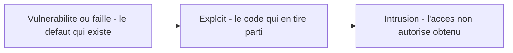
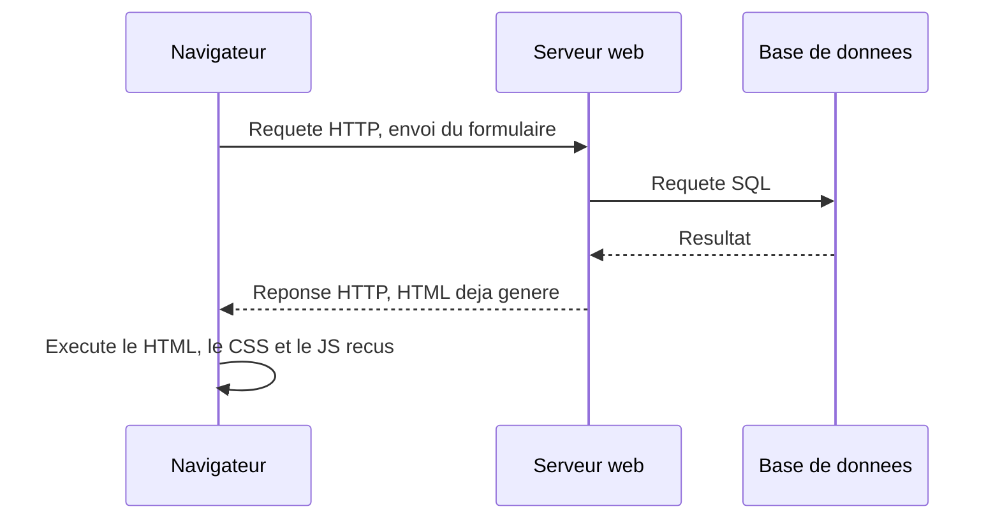

# Fondamentaux de la sécurité des applications web

## L'idée en une image

Imagine le coffre-fort d'une bijouterie. Il tient trois promesses, et il faut les trois pour
qu'il serve à quelque chose :

- personne d'autre que le bijoutier ne voit ce qu'il y a dedans — c'est la **confidentialité** ;
- personne ne remplace un diamant par un faux pendant la nuit — c'est l'**intégrité** ;
- le bijoutier peut l'ouvrir chaque matin pour travailler — c'est la **disponibilité**.

Ces trois mots forment la **triade CIA** (*Confidentiality, Integrity, Availability*), le cadre
qui ouvre ce cours. Toute la session consistera à répondre, attaque après attaque, à la même
question : **laquelle des trois promesses vient d'être brisée ?**

Et l'image porte déjà le piège le plus utile du module. Devant un cambrioleur, on est tenté de
**souder la porte du coffre**. La confidentialité devient parfaite, l'intégrité aussi… et la
bijouterie ferme, parce que le bijoutier n'atteint plus ses bagues. Une protection qui détruit
la disponibilité n'est pas une protection : c'est un déni de service qu'on s'inflige soi-même.
Tu retrouveras ce coffre soudé, en version logicielle et en une seule ligne de configuration,
dans la section suivante.

**Où l'analogie casse — et il faut le dire, sinon elle enseigne des erreurs.** D'abord, un
coffre garde **un** objet, à **un** endroit ; une application, elle, **recopie** tout ce qu'elle
touche — caches, sauvegardes, journaux, écran du visiteur. On peut donc lui voler le contenu de
son coffre sans jamais toucher au coffre. Ensuite, et c'est le point décisif : un coffre est
**passif**, alors qu'une application **exécute ce qu'on lui donne**. Une serrure ne fait jamais
ce qu'un cambrioleur lui écrit sur un bout de papier ; une base de données, si. C'est tout
l'objet des modules sur l'injection et le XSS, et ça n'a aucun équivalent dans une porte
blindée.

## Ce que la séance 1 enseigne, et ce que cette leçon ajoute

Ce module est le plus déséquilibré du cours, et le savoir te fait gagner du temps de révision.
Les diapositives de la séance 1 ne portent que **trois** blocs ; tout le reste de ce que tu vas
lire ici est un **complément** de la base de connaissances : juste, utile en entreprise, mais
**pas exigible à l'examen 2026**.

::: cours
La séance 1 du cours 420-B10-HU (millésime 2026) enseigne trois choses, et ce sont celles-là
qui sont matière d'examen : **la triade CIA** (diapositives 25-30), **le panorama des huit
familles d'attaques courantes** et leur rattachement à la triade (diapositives 31-59), et la
**chaîne d'outils du laboratoire** de la session (diapositives 61-76).
:::

::: complement
Tout le reste de ce module — le vocabulaire (faille, exploit, intrusion, chapeaux), CVE et CWE,
l'architecture client/serveur, l'OWASP Top 10, la kill chain, les types de tests, DVWA et Burp
Suite — vient de la base de connaissances ou de l'édition antérieure du cours (été 2025). C'est
de la matière juste et professionnellement utile, mais aucune question d'examen 2026 ne s'appuie
dessus.
:::

**La règle d'arbitrage, valable pour toute la session :** *à l'examen, donne la réponse du
cours ; en production, applique la correction.* Quand les deux divergent, cette leçon te montre
les deux et te dit laquelle sert où — elle n'efface jamais la version du cours.

## La triade CIA — le cadre qui classe toutes les attaques

::: cours
Une application n'est réputée sécuritaire que si elle garantit **les trois principes à la
fois** ; toute attaque vise à en compromettre au moins un. C'est le cadre qui permet de
répondre à la question d'examen « quel ou quels principes cette attaque viole-t-elle ? ».
:::

| Principe | La garantie | Ce qui la brise (exemples du cours) |
|---|---|---|
| **Confidentialité** | Seuls les acteurs prévus par le propriétaire du système accèdent à l'information | Accès non autorisé à un compte bancaire ; extraction d'une base par injection SQL ; vol d'un cookie de session par XSS |
| **Intégrité** | Personne ne modifie une donnée qu'il n'a pas le droit de modifier | Un utilisateur s'ajoute le rôle administrateur ; modification du message d'un tiers sur un forum ; injection de code dans l'application |
| **Disponibilité** | Le système reste utilisable par ses utilisateurs légitimes aux heures prévues | Déni de service distribué (DDoS), mais aussi **verrouillage massif de comptes** en noyant l'authentification de faux mots de passe |

Deux nuances que le cours souligne, et que presque tout le monde oublie ensuite.

**1. Une protection peut casser la disponibilité — c'est le coffre soudé.** La politique
« compte verrouillé après trois échecs » protège la confidentialité contre la force brute. Elle
offre en même temps un déni de service **trivial** à qui connaît des noms d'utilisateur : trois
mauvais mots de passe par compte, et toute la clientèle est dehors. Ce n'est pas une bonne
pratique absolue, c'est un **arbitrage**. Les parades qui préservent les deux principes
existent : ralentissement exponentiel (*throttling*) plutôt que verrouillage, limitation
combinée par adresse IP **et** par compte, CAPTCHA après N échecs, déverrouillage automatique
au bout de quelques minutes.

**2. La triade couvre l'accident autant que la malveillance.** Une donnée qui ne doit pas être
modifiée doit être en lecture seule **par conception**. Un contrôle qui n'existe que parce
qu'« aucun bouton de l'interface ne le permet » n'existe pas — la section suivante montre
pourquoi.

::: correction-du-cours {source="Modèle STRIDE (Microsoft, années 1990), lettre R — Repudiation ; hexade de Parker. Relevé dans la fiche KB web/securite/fondamentaux-securite-web.md, 2026-08-19"}
Le cours s'en tient à la triade CIA comme cadre de la sécurité de l'information, et c'est la
réponse attendue à l'examen. En pratique, elle ne capture ni l'**authenticité** (la donnée vient
bien de qui elle prétend) ni la **non-répudiation** (l'auteur d'une action ne peut pas la nier).
Exemple concret : un journal d'audit signé protège bien l'intégrité **du journal** — mais ce
qu'on lui demande vraiment, prouver **qui** a agi sans contestation possible, n'a aucune case
dans CIA. Et c'est pourtant lui qu'on réclame en premier après un incident. D'où les extensions courantes du modèle et la lettre R de STRIDE,
qui n'a aucun équivalent dans CIA.
:::

## Le vocabulaire : faille, exploit, intrusion

::: complement
Cette section entière est un ajout de la base de connaissances. La diapositive d'introduction
du cours **liste** ces mots — chapeau blanc, chapeau noir, pirate, éthique, faille, intrusion —
sans les définir ; l'édition antérieure définissait « faille » comme un trou de sécurité
souvent accidentel et « intrusion » comme un trou de sécurité utilisé par un acteur
malicieux, ce qui confond en réalité deux étapes distinctes.
:::

Reprenons l'image du cambriolage, qui sépare les trois étapes sans effort :

- la **fissure dans le mur**, c'est la **vulnérabilité** (ou **faille** — les deux mots sont
  synonymes) : le défaut lui-même, exploité ou non, parfois pendant des années ;
- le **pied-de-biche taillé pour cette fissure-là**, c'est l'**exploit** : le code ou la
  technique qui transforme le défaut en effet concret. Un **PoC** (*Proof of Concept*, preuve
  de faisabilité) démontre seulement qu'une vulnérabilité est exploitable, sans être un outil
  d'attaque prêt à l'emploi ;
- le **cambriolage effectivement commis**, c'est l'**intrusion** : l'événement d'accès non
  autorisé qui résulte de l'exploitation.



**Où l'analogie du cambriolage casse :** une fissure de mur est visible de l'extérieur et une
seule personne à la fois peut s'y glisser. Une vulnérabilité logicielle, elle, est
**reproductible à l'infini et automatisable** — un robot la teste sur cent mille sites la nuit
même de sa publication. C'est cette différence d'échelle qui rend la divulgation coordonnée
nécessaire, alors que personne ne « publie » les fissures d'un quartier.

**Les chapeaux, en une phrase chacun.** Le **chapeau blanc** cherche des failles **avec
l'accord écrit** du propriétaire du système (pentester, chercheur en programme de primes) ; le
**chapeau gris** cherche ou exploite sans autorisation mais sans intention de nuire, souvent
pour prévenir le fabricant ensuite ; le **chapeau noir** exploite à des fins malveillantes.
Deux pièges de vocabulaire : « hacker » désigne historiquement quiconque comprend un système en
profondeur, indépendamment de l'intention — c'est « pirate informatique » qui désigne l'acteur
malveillant ; et « éthique » qualifie le **cadre** (mandat écrit, périmètre défini, objectif de
remédiation), **jamais** la technique, puisque les mêmes outils servent à l'attaque et à la
défense.

**La divulgation.** Le standard actuel de l'industrie est la **divulgation responsable** (ou
coordonnée) : signalement privé au fabricant, puis publication après un délai convenu — souvent
90 jours, la convention popularisée par Google Project Zero. Le *full disclosure* publie
immédiatement, ce qui force une réaction rapide mais expose les utilisateurs pendant toute la
fenêtre sans correctif. Ne rien signaler, ou revendre la faille, est hors du cadre éthique.

## 0-day, CVE et CWE — nommer une faille

::: complement
Ces trois notions ne sont ni dans les diapositives 2026 ni dans le plan de cours. Elles sont
pourtant le vocabulaire quotidien d'une équipe de développement : sans elles, impossible de
lire un bulletin de sécurité ou la sortie de `npm audit`.
:::

Une **0-day** est une vulnérabilité **inconnue du fabricant**, donc non corrigée. Le nom vient
de ce que le fabricant a eu « zéro jour » pour la corriger avant qu'elle circule. Attention au
raccourci fréquent : une 0-day n'est **pas** nécessairement exploitée. « 0-day exploitée dans
la nature » (*in the wild*) est le sous-cas qui fait les manchettes, pas la définition.

Pour les deux suivants, garde en tête un garagiste devant une voiture qui freine mal :

- le **CWE** (*Common Weakness Enumeration*) est le **type de défaut** — « plaquettes qui
  chauffent trop vite », indépendamment du modèle. Côté logiciel : `CWE-89` est l'injection
  SQL, `CWE-79` le XSS. C'est la vue du développeur : **on corrige un CWE**.
- le **CVE** (*Common Vulnerabilities and Exposures*) est **ce défaut-là, sur ce modèle-là,
  entre telle et telle année de production** : un identifiant unique attribué à une **instance
  précise** dans un produit et une version donnés, dans un catalogue public maintenu par MITRE.
  L'exemple le plus célèbre est `CVE-2021-44228`, la faille Log4Shell de la bibliothèque Java
  Log4j. C'est la vue de l'exploitant : **on patche un CVE**. Un CVE référence typiquement un
  ou plusieurs CWE.

Le NVD, tenu par le NIST, enrichit d'un score **CVSS** les CVE qu'il **priorise** — depuis avril
2026 : le catalogue KEV de la CISA, les logiciels de l'État fédéral américain et les logiciels
jugés critiques ; les autres restent listées sans analyse, en *« Lowest Priority »*. Un score
peut aussi venir du CNA qui publie la CVE. La manière de le calculer et, surtout, de
**prioriser** vraiment les corrections fait l'objet du module suivant de ce cours.

**Où l'analogie du garage casse :** un rappel de voitures atteint tous les propriétaires par la
poste, alors qu'un CVE n'atteint que ceux qui **surveillent** le catalogue. Personne ne
téléphone à ton équipe pour l'avertir : c'est l'outillage d'analyse de dépendances qui joue ce
rôle, et seulement si quelqu'un l'a branché.

## Ne jamais faire confiance au client

::: complement
L'architecture client/serveur est un rappel de la base de connaissances ; le cours l'utilise
partout sans la traiter pour elle-même. C'est pourtant le principe qui structure tout le reste
de la session.
:::



Regarde la dernière flèche, celle qui part du navigateur et y revient. Elle se déroule sur une
machine que l'attaquant **contrôle entièrement** : outils de développement, débogueur
JavaScript, proxy d'interception. **Tout code JavaScript côté client est lisible, modifiable et
contournable.** Il en découle une règle sans exception : `min`, `maxlength`, `readonly`,
`hidden`, une liste déroulante limitée à trois valeurs — **tous contournables**, tous à
revalider côté serveur. Une validation côté client est une **aide à la saisie** (un retour
immédiat sans aller-retour réseau), jamais une mesure de sécurité.

La preuve tient en une ligne : l'attaquant n'ouvre pas ta page. Il envoie directement la
requête, avec `curl` ou n'importe quel client HTTP, et ton formulaire n'a jamais existé pour
lui.

```bash
curl -X POST https://boutique.example/api/panier \
  -H 'Content-Type: application/json' \
  -d '{"produitId": 42, "quantite": -5, "prixUnitaire": 0.01}'
```

**La surface d'attaque** est l'ensemble des points par lesquels un acteur non autorisé peut
interagir avec le système : formulaires, paramètres d'URL, en-têtes HTTP, cookies, API, envoi
de fichiers, ports réseau ouverts, dépendances tierces, et l'infrastructure elle-même. La
réduire — désactiver ce qui ne sert pas, restreindre les entrées acceptées, fermer les ports —
est un principe défensif transversal, indépendant de la faille précise qu'on redoute.

Le même raisonnement vaut pour le code **compilé**, et c'est contre-intuitif : un exécutable
.NET se décompile en C# quasi lisible avec dotPeek, un fichier `.pyc` retrouve presque son
source, et même un binaire natif livre sa logique à Ghidra (outil de la NSA, gratuit et
open-source depuis 2019) moyennant plus d'effort. **Un secret placé dans du code livré à
l'utilisateur — clé d'API en dur, logique de licence — n'est pas protégé, seulement obscurci.**
La seule protection réelle est de ne jamais transmettre le secret au client.

## Le panorama des menaces de la séance 1

::: cours
Le cours ouvre la session par un tour d'horizon de **huit familles d'attaques**. Savoir les
nommer et dire **quel principe CIA chacune vise** est de la matière d'examen. Le message du
tableau est explicite : **un système n'est pas plus sécuritaire que sa composante la plus
faible**.
:::

Ce que le tableau **montre**, sans que le cours l'énonce ainsi : sur les huit familles, deux
seulement sont purement applicatives — la sécurité d'une application se joue largement en
dehors de son code.

| Attaque | Principe CIA visé | Couche | Traité dans |
|---|---|---|---|
| **DDoS**, mené par un **botnet** (parc de machines infectées, louable à l'heure) | Disponibilité | Réseau, infrastructure | Durcissement du serveur (module 13) |
| **Injection SQL** | Confidentialité + intégrité (+ disponibilité si `DROP`/`DELETE`) | Applicative | Module 03 |
| **XSS** | Confidentialité + intégrité, dans le navigateur d'un tiers | Applicative | Module 04 |
| **Man-in-the-middle** | Confidentialité + intégrité | Réseau | Cryptographie (module 08) |
| **Force brute** (et ses cousines : dictionnaire, tables arc-en-ciel) | Confidentialité | Authentification | Modules 09 et 10 |
| **Bibliothèques tierces malveillantes** | Les trois à la fois | Chaîne d'approvisionnement | Voir la correction ci-dessous |
| **Hameçonnage** — exploite « la vulnérabilité éternelle », l'erreur humaine | Confidentialité | Humaine | Hors périmètre applicatif |
| **Rançongiciel** — chiffre les données et réclame une rançon ; le vrai danger est sa vitesse de propagation | Disponibilité (+ confidentialité si exfiltration) | Poste, serveur | Sauvegardes hors ligne |

**Une question posée telle quelle en cours : un site « sans données sensibles » mérite-t-il
d'être protégé ?** Réponse attendue : **oui**. Un forum banal sert de **tremplin** — hébergement
de charges malveillantes, relais de pourriel — et surtout, ses utilisateurs **réutilisent leurs
mots de passe** ailleurs. La valeur volée n'est pas dans tes données, elle est dans le fait que
tes visiteurs se répètent. Corollaire : raison de plus pour ne jamais stocker un mot de passe en
clair, même sur un site sans enjeu apparent.

::: correction-du-cours {source="Diapositives 46 et 52 du cours 01 (millésime 2026) ; compromission de polyfill.io, juin 2024 ; fiche KB web/securite/panorama-menaces.md, vérifiée le 2026-08-19"}
Deux affirmations de ce panorama demandent une correction.
**1. « Chiffrer la communication ne protège pas d'une attaque MITM » (diapositive 46).** Le
chiffrement *seul*, en effet, ne suffit pas — mais TLS n'est pas que du chiffrement : c'est
chiffrement **plus authentification du serveur par certificat**. C'est cette authentification
qui fait échouer le MITM, l'attaquant ne pouvant pas présenter de certificat valide pour le
domaine visé. À l'examen, réponds que le chiffrement seul est insuffisant sans authentification
du pair ; en production, ne désactive jamais la vérification de certificat et active HSTS.
**2. « Contre les bibliothèques tierces malveillantes, utilisez les CDN des compagnies »
(diapositive 52).** Contre-productif depuis la compromission de polyfill.io en juin 2024
(rachat du domaine puis injection de code malveillant, plus de 100 000 sites touchés) : un CDN
tiers *déplace* la confiance vers un serveur que tu ne contrôles pas. L'état de l'art est
d'héberger ses dépendances soi-même, de les figer par version (`package-lock.json`,
`composer.lock`), de vérifier leur intégrité par **Subresource Integrity** si un CDN reste
imposé, et de les analyser en continu (`npm audit`, `composer audit`, Dependabot).
:::

## Le déroulé d'une intrusion : la kill chain

::: complement
Ni la kill chain ni MITRE ATT&CK n'apparaissent dans le millésime 2026 du cours — ni dans les
diapositives, ni dans le plan de cours. Cette section vient de l'édition antérieure (été 2025)
et de la base de connaissances. Elle vaut d'être lue pour une raison précise : elle dit **où**
un développeur peut encore agir.
:::

Le panorama ci-dessus classe les menaces par **nature**. Le modèle qui suit les classe par
**moment** : où en est l'attaquant dans sa progression, et donc quelle défense a encore une
chance de l'arrêter.

```mermaid
flowchart LR
  accTitle: Les sept phases de la kill chain de Lockheed Martin
  accDescr { La kill chain décrit une intrusion en sept étapes successives : reconnaissance de la cible, fabrication de la charge, livraison de cette charge, exploitation de la vulnérabilité, installation d'une porte dérobée, mise en place d'un canal de commande et de contrôle, puis actions sur les objectifs comme l'exfiltration ou le sabotage. Le code applicatif est en première ligne aux deux premières phases et à l'exploitation ; les phases suivantes se détectent par la journalisation. }
  R[Reconnaissance] --> W["Weaponization - fabrication de la charge"]
  W --> D["Delivery - livraison"]
  D --> E[Exploitation]
  E --> I["Installation - porte derobee"]
  I --> C["Command and Control"]
  C --> A["Actions on Objectives - exfiltration ou sabotage"]
```



Ce modèle **linéaire en sept phases** a été publié par Lockheed Martin en 2011, adapté de la
doctrine militaire. L'édition antérieure du cours en présentait une version **condensée en cinq
phases** : reconnaissance, livraison, exploitation, post-exploitation, persistance. Elle n'est
pas fausse — c'est une simplification qui fusionne la fabrication dans la livraison et regroupe
les trois dernières étapes.

**MITRE ATT&CK** n'est pas un scénario mais une **matrice** : 14 tactiques (le *pourquoi* :
reconnaissance, accès initial, exécution, persistance, élévation de privilèges, évasion des
défenses, mouvement latéral, exfiltration, impact…), chacune décomposée en dizaines de
**techniques** documentées et rattachées à des groupes d'attaquants réellement observés. Les
deux modèles sont **complémentaires** : la kill chain raconte, ATT&CK cartographie.

**Limite reconnue de la kill chain**, à savoir avant de la citer : elle suppose une progression
propre et séquentielle, alors qu'une intrusion réelle boucle, échoue, recommence, ou saute des
étapes — par exemple quand l'accès initial a simplement été **acheté**.

**Ce que ça change pour toi, développeur web** : les phases *reconnaissance* et *exploitation*
sont celles où ton code est en première ligne (version divulguée dans un en-tête, message
d'erreur bavard, faille exploitable). Les phases suivantes se détectent par la **journalisation
et la surveillance**, pas par du code défensif — ce qui explique qu'une application sans traces
exploitables ne saura jamais qu'elle a été compromise.

## L'OWASP Top 10 — deux millésimes actifs

::: complement
Le deck 2026 **nomme l'organisme OWASP** (diapositive 32) et **ne liste aucune de ses dix
catégories** ; le plan de cours officiel ne mentionne jamais OWASP et énonce son contenu en
clair (« SQL, XSS, CSRF, Session… »), pas en codes A0x. Ce qui est attendu à l'examen, c'est
donc de savoir **ce qu'est l'OWASP et à quoi sert un tel classement** — pas de réciter dix
intitulés. Le tableau ci-dessous reste un excellent index vers la suite du cours. Relevé sur le
deck 2026 et le plan de cours le 2026-08-19.
:::

L'**OWASP** (*Open Worldwide Application Security Project*, organisme à but non lucratif) publie
depuis 2003 le **Top 10** des catégories de risques applicatifs web les plus répandues. Point
capital, souvent mal compris : le classement se fait **par la fréquence à laquelle la faiblesse
est trouvée** dans les applications testées, pondérée par l'exploitabilité et l'impact — pas par
la gravité d'une instance isolée. Une catégorie peut être première sans que chacune de ses
instances soit la plus grave.

Deux millésimes coexistent aujourd'hui : **2021**, celui que reprennent la plupart des cours et
l'édition antérieure de celui-ci, et **2025**, publié en version définitive et état de l'art
au 2026-08.

| # | OWASP Top 10:2021 | OWASP Top 10:2025 | Ce qui a bougé |
|---|---|---|---|
| 1 | Contrôles d'accès défaillants | *Broken Access Control* | Inchangé — premier dans les deux |
| 2 | Défaillances cryptographiques | *Security Misconfiguration* | Monte du 5e au 2e rang |
| 3 | Injection | *Software Supply Chain Failures* (nouveau) | Élargit l'ancienne catégorie « composants vulnérables » à toute la chaîne |
| 4 | Conception non sécurisée | *Cryptographic Failures* | Redescend du 2e au 4e rang |
| 5 | Mauvaise configuration de sécurité | *Injection* | Redescend du 3e au 5e rang |
| 6 | Composants vulnérables et obsolètes | *Insecure Design* | Redescend du 4e au 6e rang |
| 7 | Identification et authentification défaillantes | *Authentication Failures* | Renommé, position stable |
| 8 | Manque d'intégrité des données et du logiciel | *Software or Data Integrity Failures* | Renommé, position stable |
| 9 | Carence de journalisation et de supervision | *Security Logging and Alerting Failures* | Renommé, position stable |
| 10 | Falsification de requête côté serveur (SSRF) | *Mishandling of Exceptional Conditions* (nouveau) | **SSRF est absorbé** dans le contrôle d'accès ; la gestion des erreurs entre au classement |


Ce qu'il faut retenir en une phrase : **le contrôle d'accès défaillant est premier dans les deux
millésimes** — c'est-à-dire que la faille la plus répandue au monde n'est pas une technique
exotique, c'est l'oubli de vérifier « as-tu le droit ? » à chaque requête.

## Comment on cherche les failles

::: complement
Les types de tests ne sont ni dans le deck 2026 ni dans le plan de cours. C'est du vocabulaire
d'entreprise : il te servira en stage et en entrevue, pas à l'examen 1.
:::

On distingue d'abord ce que le testeur **sait** de la cible :

| Critère | Boîte noire | Boîte blanche | Boîte grise |
|---|---|---|---|
| Accès au code source | Aucun | Complet | Souvent partiel |
| Point de vue simulé | Attaquant externe pur | Développeur ou auditeur interne | Utilisateur authentifié, initié partiel |
| Couverture | Dépend de ce qui se découvre de l'extérieur | La plus exhaustive, la plus coûteuse | Bon compromis couverture/effort |
| Risque | Manque les failles internes non exposées | Manque les angles morts « vus de dehors » | Manque des tests faute de contexte complet |

Ce découpage se recoupe presque terme à terme avec l'outillage automatisé : le **SAST**
(*Static Application Security Testing*) est de la boîte blanche automatisée — il lit le code
sans exécuter l'application, tourne dès chaque commit, et produit beaucoup de faux positifs ; le
**DAST** (*Dynamic…*) est de la boîte noire automatisée — il attaque l'application en cours
d'exécution, voit les vrais comportements mais ne pointe pas la ligne fautive ; l'**IAST**
(*Interactive…*) instrumente l'application par un agent, combine les deux visions et produit peu
de faux positifs, au prix d'un coût d'instrumentation.

**Aucune approche ne suffit seule, et c'est le vrai message.** Le SAST est aveugle aux failles
de configuration ou d'authentification qui n'existent qu'à l'exécution. Le DAST ne couvre que
les chemins que le scanner a effectivement parcourus. Et seul le **pentest manuel** détecte les
failles de **logique métier** — contourner un tunnel d'achat, par exemple — qu'aucun scanner ne
devine ; il est en revanche ponctuel et coûteux, donc jamais une ligne de défense continue.

## La chaîne d'outils de la session

::: cours
Le millésime 2026 abandonne le laboratoire volontairement vulnérable au profit d'un
environnement de déploiement **réel** : **XAMPP ou WAMP** en local, **PuTTY** (SSH) et
**WinSCP** (SFTP) pour piloter un serveur Ubuntu chez **DigitalOcean**, et un **nom de domaine**
loué chez un registraire. Le domaine n'est pas un luxe : il est nécessaire pour obtenir des
certificats TLS et donc pour activer les protections qui l'exigent (HSTS, cookies `Secure`,
préfixe `__Host-`). Budget annoncé par le cours : environ 20 $ pour l'infonuagique **et** le domaine. Choisis un registraire
permettant au moins de modifier l'enregistrement **A** et les serveurs de noms, sans quoi tu ne
pourras pas pointer le domaine vers ton serveur.
:::

::: complement
Précision datée : un certificat de confiance publique n'exige plus strictement un nom de
domaine — Let's Encrypt en émet pour des **adresses IP** depuis le 2026-01-15. Mais **HSTS**,
lui, ne s'applique pas à une adresse IP : la RFC 6797 §8.1.1 interdit d'enregistrer une IP
littérale comme hôte HSTS connu. Pour ce laboratoire, le domaine reste donc bien requis — la
raison exacte est simplement plus étroite que « il faut un domaine pour avoir du TLS ».
:::

**Une conséquence que le cours ne dit pas, et elle est importante :** ce laboratoire est un
serveur **réellement exposé à Internet**, balayé par des robots opportunistes en quelques heures.
On n'y déploie donc **jamais** une application volontairement vulnérable, et on y applique le
durcissement dès la première connexion — clé SSH plutôt que mot de passe, pare-feu.

::: complement
L'édition antérieure du cours travaillait sur **DVWA** (*Damn Vulnerable Web Application*, une
application PHP/MySQL délibérément trouée, à quatre niveaux de difficulté) inspectée avec
**Burp Suite**, un **proxy d'interception** qui s'insère entre le navigateur et le serveur pour
lire et modifier chaque requête. Trois outils y suffisent : *Proxy* met la requête en pause,
*Repeater* la renvoie autant de fois qu'on veut, *Intruder* automatise l'envoi en substituant
une position marquée par une liste de valeurs.
**Règle absolue, tirée de la documentation officielle de DVWA :** ne jamais l'installer sur un
serveur accessible depuis Internet — il serait compromis. Machine virtuelle en réseau NAT, ou
conteneur jetable sur une machine non exposée. Et retiens le piège pédagogique de l'exercice :
sur la page de force brute, le code HTTP est `200 OK` que le mot de passe soit bon ou mauvais ;
c'est la **taille de la réponse** qui trahit le succès, technique d'énumération transposable à
des cibles réelles.
:::

::: correction-du-cours {source="Diapositive 75 du cours 01 (millésime 2026) ; enquête MegaLag, décembre 2024 ; In re PayPal Honey Browser Extension Litigation, N.D. Cal. — état vérifié le 2026-08-19"}
Pour réduire la facture du nom de domaine, le cours conseille d'installer l'extension de
navigateur **Honey**. Ce conseil est à ignorer. En décembre 2024, une enquête largement reprise
a **documenté** que l'extension **réécrivait les cookies d'affiliation** des pages visitées pour
s'attribuer les commissions ; PayPal, son propriétaire, fait l'objet du contentieux consolidé
*In re PayPal Honey Browser Extension Litigation* (N.D. Cal.), dont **toutes les demandes ont
survécu à la requête en rejet le 22 juin 2026** (état au 2026-08-20). Le mécanisme est établi ;
sa qualification juridique ne l'est pas encore. Le fond du problème est exactement la matière de ce cours : une
extension de navigateur obtient, **par conception**, la permission de lire et de modifier le
contenu de toutes les pages — c'est le privilège d'un XSS permanent, accordé volontairement, sur
tous les sites, y compris bancaires. Règle à retenir : une extension s'évalue comme une
dépendance de production (éditeur, modèle d'affaires, permissions demandées), jamais comme un
gadget.
:::

## Exemple simple

Le mécanisme isolé, sans rien autour : un panier d'achat qui croit son formulaire. C'est la
faute la plus banale de tout ce cours, et celle qui coûte le plus cher à une boutique.

:::: comparaison
::: vulnerable
```php
$quantite = $_POST['quantite'];
$prix = $_POST['prixUnitaire'];
$total = $quantite * $prix;
enregistrerCommande($total);
```
{lignes="1,2"} Les deux valeurs viennent du formulaire. La page avait beau afficher un champ
borné et un prix en lecture seule, ces attributs ne vivent que dans le navigateur — et
l'attaquant n'ouvre pas la page, il envoie la requête directement.

{lignes="3"} Une quantité négative donne un total négatif : la boutique finit par devoir de
l'argent à son client. Un prix à un cent, lui, vide le stock. Aucune ligne de JavaScript n'a
été exécutée pour en arriver là.
:::
::: corrige
```php
$quantite = filter_input(INPUT_POST, 'quantite', FILTER_VALIDATE_INT, ['options' => ['min_range' => 1, 'max_range' => 10]]);
if ($quantite === false || $quantite === null) {
    http_response_code(400);
    exit('Quantité invalide');
}
$prix = prixUnitaireDuProduit($produitId);
$total = $quantite * $prix;
enregistrerCommande($total);
```
{lignes="1"} Le serveur ne lit plus la valeur, il la valide : le filtre rend faux si ce n'est
pas un entier, et les bornes rejettent aussi bien moins cinq que dix mille. La règle est
déclarée là où le client ne peut pas l'atteindre.

{lignes="2,3,4"} Un contrôle qui laisse le script continuer ne contrôle rien : le refus doit
arrêter le traitement. C'est le principe du refus par défaut — on décide d'abord de refuser,
on n'autorise qu'ensuite.

{lignes="6"} Le prix ne voyage plus par le client du tout : il est relu dans la base à partir
de l'identifiant du produit. Une donnée que l'utilisateur n'a pas à choisir ne doit pas
transiter par lui, même en lecture seule à l'écran.
:::
::::

## Exemple complet

La même faute, en situation réaliste et avec des conséquences bien plus lourdes : c'est
l'**autorisation** elle-même qui est confiée au client. On la voit ici sur deux piles
différentes, parce que le défaut n'est pas une affaire de langage — c'est une affaire de **qui
décide**.

Le scénario : une page d'administration doit n'être visible que des administrateurs.
L'application se souvient du rôle… dans un cookie. C'est exactement le piège de DVWA, dont le
niveau de difficulté est stocké dans un cookie `security` que n'importe qui réécrit dans les
outils de développement, sans le moindre exploit.

:::: comparaison
::: vulnerable
```php
$role = $_COOKIE['role'] ?? 'utilisateur';
if ($role === 'admin') {
    afficherTableauDeBordAdmin();
}
```
{lignes="1"} Un cookie est une donnée que le navigateur envoie, et que son propriétaire réécrit
en deux clics. L'application vient de demander au visiteur s'il est administrateur.

{lignes="2"} La décision d'autorisation est prise sur cette valeur. Le vol de confidentialité
est total, et l'intégrité suit dès la première action d'administration : deux principes de la
triade tombent avec une seule ligne de cookie.
:::
::: corrige
```php
session_start();
$idUtilisateur = $_SESSION['idUtilisateur'] ?? null;
$role = $idUtilisateur === null ? null : roleDepuisLaBase($idUtilisateur);
if ($role !== 'admin') {
    http_response_code(403);
    exit('Accès refusé');
}
afficherTableauDeBordAdmin();
```
{lignes="1,2"} L'identité vient de la session, tenue côté serveur ; le navigateur ne transporte
qu'un identifiant opaque qui ne lui apprend rien et qu'il ne peut pas forger.

{lignes="3"} Le rôle est relu à sa source d'autorité, la base, à chaque requête. Un rôle
recopié dans la session au moment de la connexion resterait vrai après une révocation.

{lignes="4,5,6"} La condition est écrite à l'envers de l'exemple vulnérable, et c'est
volontaire : on ne dit pas « si administrateur, alors montrer », on dit « si pas
administrateur, alors refuser ». Un cas oublié tombe ainsi du côté du refus.
:::
::: vulnerable
```csharp
var role = Request.Cookies["role"] ?? "utilisateur";
if (role == "admin") return View("TableauDeBordAdmin");
return Forbid();
```
{lignes="1"} Même faute, autre pile : la collection de cookies de la requête est une entrée du
client au même titre qu'un champ de formulaire. Changer de langage ou de framework ne déplace
jamais la frontière de confiance.

{lignes="2"} Le refus explicite de la ligne suivante donne l'illusion d'un contrôle d'accès,
alors que la décision a déjà été prise sur une valeur fournie par le visiteur.
:::
::: corrige
```csharp
[Authorize(Roles = "Administrateur")]
public IActionResult TableauDeBordAdmin()
{
    return View();
}
```
{lignes="1"} L'autorisation est déclarée sur l'action elle-même. Le framework la vérifie contre
l'identité établie à la connexion, jamais contre un en-tête que le client compose lui-même.

{lignes="1"} Contrepartie à connaître, et elle nuance l'annotation du volet PHP : ici le rôle
est un *claim* écrit dans le cookie d'authentification à la connexion, pas une lecture en base
à chaque requête. Une révocation ne prend donc effet qu'à la revalidation de l'estampille de
sécurité — `SecurityStampValidatorOptions.ValidationInterval`, **30 minutes par défaut**, ou
immédiatement si l'application appelle `UpdateSecurityStampAsync`.

{lignes="2,3,4,5"} Le corps de l'action ne contient plus aucun contrôle de sécurité : il n'y a
donc plus de chemin par lequel un oubli pourrait le contourner. Ce qui n'est pas écrit ne peut
pas être écrit de travers.
:::
::::

## À toi de jouer

Huit questions pour vérifier que le cadre est en place : le vocabulaire, la triade, la frontière
de confiance, et la distinction entre ce que le cours évalue et ce qui relève du complément.

[[quiz]]

## À retenir

::: a-retenir
- **La triade CIA classe tout.** Confidentialité, intégrité, disponibilité : devant n'importe
  quelle attaque de la session, demande-toi laquelle des trois vient de tomber. C'est le réflexe
  d'examen et le réflexe de priorisation en entreprise.
- **Une protection peut détruire un autre principe.** Le verrouillage après trois échecs protège
  contre la force brute et offre un déni de service gratuit. La sécurité est faite d'arbitrages,
  jamais de bonnes pratiques absolues.
- **Vulnérabilité, exploit, intrusion sont trois choses distinctes** — le défaut, le moyen,
  l'événement. Un **CWE** nomme le *type* de faiblesse (on le corrige), un **CVE** nomme une
  *instance* précise dans un produit et une version (on le patche).
- **Ne jamais faire confiance au client.** Tout ce qui s'exécute dans le navigateur ou vit dans
  un binaire livré est lisible, modifiable et contournable. Une validation côté client est une
  aide à la saisie ; la sécurité se décide côté serveur, à chaque requête.
- **Dans ce module, seuls la triade CIA, le panorama des huit attaques et la chaîne d'outils
  viennent du cours.** Le reste est un complément : utile en production, hors examen 2026.
:::

## Aller plus loin

- **Fiche source principale** — `web/securite/fondamentaux-securite-web.md` (KnowledgeBase) :
  vocabulaire complet, disclosure, STRIDE, processus d'évaluation de la sécurité, DVWA et Burp
  Suite en détail, corrigés des exercices de l'édition antérieure.
- **Panorama et chronologie** — `web/securite/panorama-menaces.md` : les huit familles traitées
  une par une (bien visé, contre-mesure, coût, limites), la typologie des attaquants, et la table
  de correspondance « menace constatée → fiche à lire ».
- **Carte du domaine** — `web/securite/carte.md` : l'ordre de lecture des modules et la liste
  des trous connus du cours.
- **Module suivant** — l'évaluation d'une vulnérabilité par le score CVSS, c'est-à-dire comment
  transformer « il y a une faille » en « on corrige celle-ci d'abord ».
- Sources originales citées dans cette leçon :
  [OWASP Top 10:2025 — Introduction](https://owasp.org/Top10/2025/0x00_2025-Introduction/),
  [Cyber Kill Chain de Lockheed Martin](https://www.lockheedmartin.com/en-us/capabilities/cyber/cyber-kill-chain.html),
  [MITRE ATT&CK — matrice Enterprise](https://attack.mitre.org/matrices/enterprise/),
  [DVWA — dépôt officiel et son avertissement](https://github.com/digininja/DVWA),
  [PortSwigger Web Security Academy](https://portswigger.net/web-security/getting-started).
