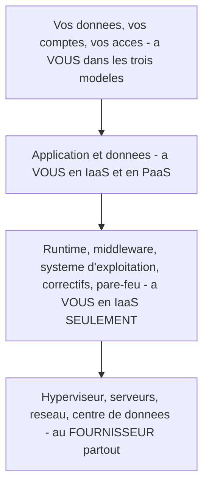
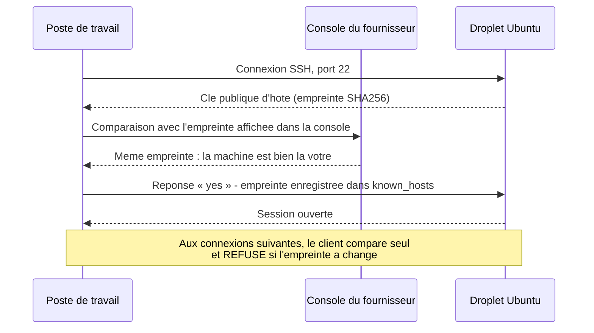
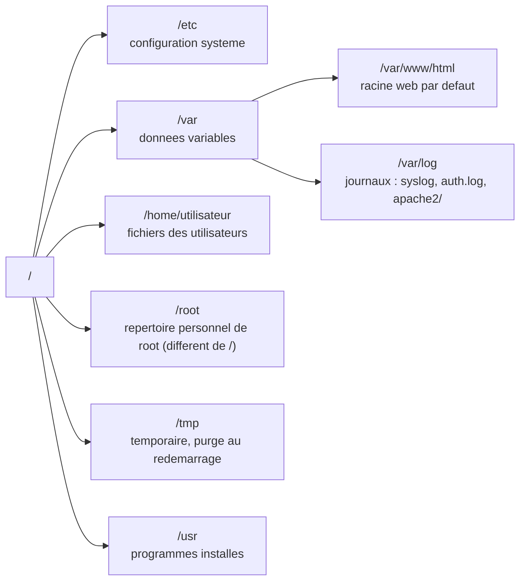

# Gestion d'environnement infonuagique

## L'idée en une image

Tu ouvres un commerce. Trois formules s'offrent à toi.

La première : **tu fais construire ton immeuble**. Tu choisis les murs, la plomberie, le système
d'alarme. Tout est à toi — et tout est à ton entretien, y compris la chaudière qui lâche un
dimanche de janvier.

La deuxième : **tu loues un local nu dans un immeuble commercial**. Le propriétaire garantit la
structure, le toit, l'électricité qui entre dans le bâtiment et le gardien à la porte principale.
Mais à l'intérieur de ton local, tout est à toi : la serrure de ta porte, ce que tu y entreposes,
et le fait de la verrouiller le soir. Personne ne le fera à ta place.

La troisième : **tu loues un kiosque tout monté dans un centre commercial**, mobilier et caisse
enregistreuse compris. Tu n'as plus qu'à vendre.

Ces trois formules portent des noms dans notre métier : **on-premise** (l'immeuble à soi),
**IaaS** (*Infrastructure as a Service*, le local nu), **PaaS** (*Platform as a Service*, le
kiosque monté). Toute cette séance se déroule dans la deuxième : un serveur Linux nu, loué à
l'heure, dont **tu es le seul concierge**.

**Où l'analogie casse — et c'est le point le plus important de la séance.** Un local commercial
mal verrouillé est visité par les cambrioleurs du quartier, peut-être une fois par année. Un
serveur avec une adresse IP publique est, lui, **balayé en permanence par des robots** qui
essaient des mots de passe sur le port SSH, souvent avant même que tu aies fini d'installer quoi
que ce soit — en 2021, 320 pots de miel exposés par l'unité de recherche Unit 42 ont vu leur
service SSH compromis en 184 minutes en moyenne, et 80 % de l'ensemble l'ont été en moins de
24 heures. La différence n'est pas de degré, elle est de nature : ton local n'a pas de rue,
il a **tout Internet** devant sa porte.

::: cours
La séance 2 du cours 420-B10-HU (millésime 2026) enseigne, dans cet ordre : les choix
d'infrastructure et la comparaison on-premise / infonuagique, la **grille des neuf couches**
IaaS / PaaS / SaaS (répétée deux fois, diapositives 13 et 17), le déploiement d'un serveur Ubuntu
chez DigitalOcean, la connexion à distance avec PuTTY, puis les neuf commandes de base — `pwd`,
`clear`, `cd`, `ls`, `cat`, `mkdir`, `rm`, `mv` et `vi`. Les treize exercices de la
feuille de la séance portent tous sur cette dernière partie.
:::

::: complement
Le modèle de responsabilité partagée, les permissions (`chmod`, `chown`), la gestion de paquets
(`apt`), les services (`systemctl`) et les journaux (`journalctl`, `/var/log`) ne sont pas dans
les diapositives de la séance 2. Ils viennent de la base de connaissances. Ce sont pourtant eux
qui font la différence entre « un serveur qui démarre » et « un serveur qu'on peut exploiter » :
tu ne seras pas évalué dessus cette semaine, mais tu en auras besoin dès la séance 3.
:::

## Pourquoi l'infrastructure est un choix d'ingénierie

L'**infrastructure**, c'est l'ensemble de l'équipement qui rend une application accessible à ses
utilisateurs : serveurs, équipement réseau, pare-feu, stockage, DNS. Le cours le formule
exactement comme il faut : ces choix ont un impact considérable sur **le coût, la sécurité et la
capacité de mise à l'échelle**.

Trois décisions se prennent au tout début d'un projet, et coûtent cher à revenir :

1. **Où tourne le code** — sur du matériel qui t'appartient, ou loué chez un fournisseur ?
2. **À quel niveau d'abstraction** — IaaS, PaaS ou SaaS ?
3. **Qui est responsable de quoi** le jour où quelque chose tombe ?

La troisième question est celle qu'on oublie, et c'est celle qui produit des failles.

### On-premise ou infonuagique

L'approche **on-premise** (« sur les lieux ») installe le matériel dans les locaux de
l'organisation. L'approche **infonuagique** loue cette infrastructure à un fournisseur externe
qui en assure l'entretien physique. La facture arrive au mois, mais elle est **calculée à
l'heure** : on ne paie que les heures pendant lesquelles la ressource existe.

| Critère | On-premise | Infonuagique (IaaS) |
|---|---|---|
| **Modèle financier** | CAPEX — achat immobilisé, amorti sur 3 à 5 ans | OPEX — dépense courante, déductible |
| **Coût d'entrée** | Des milliers de dollars avant la première page servie | Quelques dollars, une carte de crédit |
| **Délai de mise en service** | Des semaines : achat, livraison, installation | Des minutes |
| **Mise à l'échelle** | Racheter du matériel | Redimensionner ou ajouter des instances |
| **Sécurité physique** | À votre charge | Centre de données certifié, généralement supérieure |
| **Souveraineté des données** | Totale | Données chez un tiers, sous sa juridiction |
| **Verrouillage** | Faible | Réel dès qu'on emploie les services propriétaires |

::: correction-du-cours {source="Fiche KB web/securite/administration-serveur-linux.md, section « On-premise vs infonuagique » (maj 2026-08-19), nuançant la diapositive « sécurité généralement supérieure »"}
Le cours écrit que la sécurité du modèle infonuagique est « généralement supérieure ». C'est la
réponse à donner à l'examen, et elle n'est pas fausse — mais elle ne parle que d'une moitié du
problème. Le fournisseur sécurise **son** périmètre : centre de données, hyperviseur, réseau
physique. Il ne sécurise **ni ton système d'exploitation, ni ton application**. Une machine
on-premise derrière un pare-feu d'entreprise, non joignable depuis Internet, est structurellement
**moins exposée** qu'un serveur loué avec une adresse IP publique. Le nuage déplace la surface
d'attaque ; il ne la supprime pas.
:::

### Le modèle de responsabilité partagée

C'est le concept qui explique tout le reste, et il tient en une phrase : **dans chaque modèle de
service, une ligne sépare ce que gère le fournisseur de ce que gère le client — et tout ce qui
est du côté client et qu'on oublie de faire est une faille.**



Lis le diagramme de bas en haut : **plus le modèle est abstrait, plus la ligne remonte** et plus
le fournisseur en prend à sa charge. En IaaS, ta responsabilité commence au système
d'exploitation — c'est exactement là que commence cette leçon.

Et regarde l'étage du haut : il ne disparaît **jamais**. Même en SaaS, tes comptes, tes droits et
tes données restent à toi. Un dossier partagé « à toute personne disposant du lien » fuite
exactement comme un serveur mal configuré.

### La grille des neuf couches

::: cours {diapos="13, 17"}
Le cours répète deux fois le même visuel : neuf couches empilées, quatre colonnes, et une
frontière « vous gérez / le fournisseur gère » qui remonte d'un modèle à l'autre. C'est la
**question d'examen la plus probable de la séance**. La coche marque ce qui est à votre charge.
:::

| Couche (de haut en bas) | On-premise | IaaS | PaaS | SaaS |
|---|:--:|:--:|:--:|:--:|
| Applications | oui | oui | oui | — |
| Data (données) | oui | oui | oui | — |
| Runtime | oui | oui | — | — |
| Middleware | oui | oui | — | — |
| **O/S** | oui | **oui** | — | — |
| Virtualization | oui | — | — | — |
| Servers | oui | — | — | — |
| Storage | oui | — | — | — |
| Networking | oui | — | — | — |

Deux façons de retenir la grille sans l'apprendre par cœur : **la frontière ne descend jamais**
(chaque modèle t'enlève des couches, aucun ne t'en rend), et **elle coupe toujours à un endroit
qui porte un nom** — au-dessus de la virtualisation pour l'IaaS, au-dessus du runtime pour le
PaaS, au-dessus de tout pour le SaaS. La ligne « O/S » est la frontière de cette leçon : c'est la
première case que le fournisseur ne remplit plus.

::: correction-du-cours {source="Fiche KB web/securite/administration-serveur-linux.md, encadré « La grille du cours dit — pour le SaaS sur les lignes Applications et Data » (maj 2026-08-19)"}
La grille du cours met un tiret pour le SaaS sur les lignes *Applications* et *Data*. À l'examen,
reproduis la grille telle quelle. En production, sache que ce tiret est trompeur au point d'être
dangereux : le fournisseur gère le logiciel et l'infrastructure de stockage, mais **tes données
restent les tiennes**. Leur classification, qui y accède, ce qui est partagé publiquement, la
durée de conservation et la suppression ne sont jamais délégués. Aucune case de la grille ne le
dit — c'est pourquoi le diagramme de responsabilité partagée, plus haut, garde « vos données, vos
comptes, vos accès » à ta charge jusque dans la colonne SaaS.
:::

### IaaS, PaaS, SaaS en une phrase chacun

- **IaaS** — tu loues une machine virtuelle et tu accèdes au système d'exploitation. Tu installes
  le runtime, la base de données, le serveur web, le pare-feu. Flexibilité maximale, déploiement
  en minutes, aucune gestion de matériel. Exemples cités par le cours : **DigitalOcean**, **AWS**,
  **Linode**. C'est le modèle de la session.
- **PaaS** — tu pousses du code, la plateforme s'occupe du système, du runtime et souvent de la
  base. Exemples : Heroku, Azure App Service, Render, Fly.io.
- **SaaS** — le logiciel complet est loué à l'utilisateur final, par exemple une suite bureautique
  en ligne. Le cours note justement pourquoi les éditeurs migrent du modèle « licence vendue » au
  SaaS : revenus prévisibles, dépense déductible pour le client, déploiement centralisé (on met à
  jour un serveur, pas cinq cents postes), et code critique jamais livré sur la machine du client.

::: correction-du-cours {source="Fiche KB web/securite/administration-serveur-linux.md, liste des fournisseurs cités par le cours (maj 2026-08-19)"}
Le cours cite **Heroku** dans sa liste de fournisseurs d'infrastructure. Heroku est un **PaaS**,
pas un IaaS : on y pousse du code, on n'y administre aucun système d'exploitation. Si la question
d'examen demande de reproduire la liste du cours, reproduis-la ; si elle demande de classer
Heroku dans la grille, la bonne case est PaaS.
:::

## Déployer un serveur Ubuntu et s'y connecter

### Créer la machine

Chez DigitalOcean, une machine virtuelle s'appelle un **droplet**. La procédure du cours, en
cinq choix : **Create → Droplets** ; **image** Ubuntu LTS ; **plan** *Basic / Regular with SSD*,
le plus petit palier ; **région** Toronto (latence courte, et données hébergées au Canada) ;
**authentification** ; **hostname** parlant, du genre `web-prod-01`. L'adresse IP publique
s'affiche dans la console après une ou deux minutes.

Deux de ces choix méritent qu'on s'y arrête, parce que le cours y donne une réponse qui a vieilli.

::: correction-du-cours {source="Canonical, « Ubuntu release cycle » (ubuntu.com/about/release-cycle), relevé le 2026-08-07 dans la fiche KB : fin du support standard d'Ubuntu 18.04 LTS le 31 mai 2023"}
Le cours demande l'image **« LAMP on 18.04 »**. Ubuntu 18.04 LTS est sortie en 2018 et son
support standard s'est terminé le **31 mai 2023** : déployer là-dessus aujourd'hui, c'est mettre
en ligne une machine qui **ne reçoit plus de correctifs de sécurité gratuits**. Une version LTS
d'Ubuntu offre cinq ans de support standard, prolongeables cinq ans par un abonnement payant.
La règle à appliquer : **choisir la LTS la plus récente** — au moment d'écrire (août 2026), c'est
**Ubuntu 26.04 LTS (Resolute Raccoon)**, parue en avril 2026 et maintenue jusqu'en mai 2031 en
support standard, cinq ans de plus avec un abonnement Ubuntu Pro — et refuser toute image dont la
date de fin de support est déjà passée. À l'examen, la réponse attendue reste la procédure du
cours ; en production, tu regardes le calendrier officiel avant de cliquer.
:::

::: correction-du-cours {source="DigitalOcean, « Initial Server Setup with Ubuntu » (digitalocean.com/community/tutorials/initial-server-setup-with-ubuntu), citée en ressource par la fiche KB"}
Le cours choisit **« Authentication : one-time password »**. Cela active l'authentification SSH
**par mot de passe** pour le compte `root` — exactement la configuration que les robots attaquent
en permanence. Le bon choix, dès l'écran de création : **SSH key**. Le fournisseur installe alors
ta clé publique sur la machine et désactive l'authentification par mot de passe. C'est la matière
de la séance 3 ; ici, retiens simplement que le mot de passe sur le port 22 est le point d'entrée
le plus attaqué d'un serveur neuf.
:::

### La première connexion, et l'empreinte qu'on n'accepte pas à l'aveugle

Le cours se connecte avec **PuTTY**, et c'est la méthode de référence de la séance comme de
l'examen. Trois champs et un bouton : dans *Host Name (or IP address)*, l'**adresse IP publique**
de ton droplet ; dans *Port*, **22** ; en *Connection type*, **SSH** ; puis *Open*. La fenêtre
noire qui s'ouvre demande `login as:` — tu réponds `root`, le seul compte que le fournisseur ait
créé — puis le mot de passe d'administration du droplet.

::: complement
Sur Windows 10 (depuis la mise à jour d'avril 2018) et sur Windows 11, le client OpenSSH est une
**fonctionnalité facultative**, présente sur la plupart des installations mais pas garantie :
vérifie par `ssh -V`, et s'il manque, ajoute-le par *Paramètres → Applications → Fonctionnalités
facultatives*. Une fois là, PowerShell, l'invite de commandes ou Windows Terminal ouvrent la même
session, avec exactement la commande qu'emploient macOS et Linux.

```bash
ssh root@203.0.113.10   # le fournisseur ne cree que le compte root
```

C'est le même protocole, le même port et la même vérification d'empreinte que ci-dessous : seul
l'outil change. À l'examen, décris la procédure PuTTY du cours.
:::

À la toute première connexion, le serveur présente sa **clé d'hôte** et ton client affiche son
**empreinte** — une chaîne du genre `SHA256:` suivie d'une quarantaine de caractères. PuTTY
l'affiche dans une boîte **PuTTY Security Alert**, où tu réponds *Accept* (l'empreinte est mise en
cache) ou *Connect Once* ; en ligne de commande, `ssh` pose la même question dans le terminal et
attend `yes`.

C'est le moment le plus vite bâclé de la séance, et c'est le seul qui protège d'une **attaque de
l'intercepteur** (*man-in-the-middle*, MITM) : quelqu'un placé entre ton poste et le serveur peut
répondre à sa place et te faire taper ton mot de passe chez lui. La parade est simple : comparer
l'empreinte affichée par ton client avec celle que la console du fournisseur affiche pour la
machine. Si les deux sont identiques, tu parles bien à ton serveur.

Aucun panneau du tableau de bord n'affiche cette empreinte, et c'est ce qui fait accepter à
l'aveugle. Cette empreinte se lit dans la **console web** du droplet (bouton *Console* du tableau
de bord) : soit dans les lignes `SSH HOST KEY FINGERPRINTS` imprimées au démarrage, soit en tapant
`ssh-keygen -lf /etc/ssh/ssh_host_ed25519_key.pub`.



Une fois l'empreinte enregistrée dans le fichier `~/.ssh/known_hosts`, ton client la vérifie tout
seul à chaque connexion. Le jour où elle change sans raison, il refuse bruyamment de continuer :
ce message d'alerte n'est pas un bogue à contourner, c'est le mécanisme qui fait son travail.

::: exercice-du-cours {ref="1"}
Prends le temps de comparer l'empreinte affichée par ton client SSH avec celle que la console du
fournisseur affiche pour ton droplet, avant de répondre `yes`. Cette empreinte se lit dans la
**console web** du droplet (bouton *Console* du tableau de bord) : soit dans les lignes
`SSH HOST KEY FINGERPRINTS` imprimées au démarrage, soit en tapant
`ssh-keygen -lf /etc/ssh/ssh_host_ed25519_key.pub`. C'est le seul instant de toute la
session où cette vérification est possible : après, ton client fait confiance à ce que tu auras
accepté. Note aussi l'adresse IP publique dans un fichier local — tu en auras besoin à chaque
séance, et un droplet détruit puis recréé n'a plus la même.
:::

### Le premier geste sur un serveur neuf : cesser d'être `root`

`root` est le **superutilisateur** : le compte qui a tous les droits, sans exception et sans
confirmation.

::: correction-du-cours {source="DigitalOcean, « Initial Server Setup with Ubuntu » (digitalocean.com/community/tutorials/initial-server-setup-with-ubuntu), citée en ressource par la fiche KB"}
Le cours fait toute la séance en `root`, et les exercices sont écrits dans cette hypothèse — c'est
d'ailleurs pour cela que `pwd` y répond `/root`. Reproduis-le pour l'examen. En production, c'est
un anti-patron pour trois raisons concrètes : `root` n'a **aucun garde-fou** (une commande
destructrice s'exécute sans confirmation), il n'offre **aucune traçabilité** (impossible de savoir
quel humain a fait quoi), et une session `root` compromise l'est **totalement**. Le premier geste
sur un serveur neuf est donc de créer un utilisateur ordinaire et de lui accorder `sudo`.
:::

::: complement
```bash
adduser philippe            # cree le compte, son repertoire personnel, demande un mot de passe
usermod -aG sudo philippe   # l'ajoute au groupe « sudo » — le « -a » est vital :
                            #   sans lui, « -G » REMPLACE tous les groupes de l'utilisateur
groups philippe             # verification : philippe doit apparaitre dans « sudo »
su - philippe               # basculer d'utilisateur ; « whoami » confirme qui vous etes
sudo apt update             # executer UNE commande avec les privileges administrateur
```

`sudo` n'est pas qu'une commodité : chaque commande privilégiée est **journalisée** dans
`/var/log/auth.log` avec le nom de l'humain qui l'a lancée, une faute de frappe destructrice exige
un `sudo` explicite (ce qui laisse une seconde pour réfléchir), et on peut retirer les droits
d'une seule personne sans changer le mot de passe de tout le monde. La gestion complète des
comptes, des groupes et du fichier `sudoers` est la matière de la **séance 5**.
:::

## L'arborescence Linux : une seule racine

Contrairement à Windows, il n'y a **pas de lettres de lecteur**. Tout part d'une racine unique
notée `/`, et les disques supplémentaires sont *montés* dans un répertoire de cet arbre.



Trois répertoires suffisent pour cette session :

- **`/etc`** — toute configuration que tu auras à modifier y vit (`ssh`, `apache2`, `cron`).
- **`/var/www/html`** — l'endroit où ton application est déployée et servie.
- **`/var/log`** — l'endroit où l'on cherche quand ça casse, ou quand on soupçonne une intrusion.
  `/var/log/auth.log` liste les tentatives de connexion SSH ; tu y verras les robots.

::: cours {diapos="36"}
Le cours fait une démonstration où `pwd` répond **`/root`**, et non `/`. C'est l'ambiguïté
numéro un de la séance : `/root` est le **répertoire personnel du superutilisateur**, un
répertoire comme un autre, situé *dans* l'arbre — alors que `/` est la racine de l'arbre entier.
L'invite de commande abrège le répertoire personnel en `~`. Donc `cd /` et `cd ~` ne mènent pas
au même endroit quand tu es `root`.
:::

## Se repérer, lister, créer

Voici le socle du cours, commande par commande.

```bash
pwd                     # print working directory : ou suis-je ?  →  /root
clear                   # efface l'ecran (Ctrl+L fait la meme chose)
cd /var/log             # chemin ABSOLU : il commence par « / », il part de la racine
cd html                 # chemin RELATIF : il part du repertoire courant
cd ..                   # « .. » designe le repertoire PARENT
cd                      # sans argument : retour au repertoire personnel
ls -l                   # format long : permissions, proprietaire, taille, date
ls -la                  # « -a » ajoute les fichiers caches (ceux qui commencent par un point)
ls -lh                  # « -h » rend les tailles lisibles : 4.0K, 12M
mkdir exercice3         # cree un repertoire
mkdir -p a/b/c          # cree toute l'arborescence d'un coup
```

Deux notions générales sortent de ce bloc et resserviront partout.

**Les interrupteurs** (*switches*, ou options) sont les mots précédés d'un tiret qui modifient le
comportement d'une commande. Ils **se combinent** : `-l` et `-a` s'écrivent `-la`. Ce n'est pas
une convention d'affichage, c'est la grammaire des commandes Unix.

**Chemin absolu ou relatif.** Un chemin qui **commence par `/`** part de la racine et désigne
toujours le même endroit, d'où que tu l'écrives : `/var/www/html`. Un chemin qui ne commence pas
par `/` part de **là où tu es** : `html`, `../log/syslog`. C'est un point d'examen probable, et
c'est aussi la première cause de « la commande ne trouve pas mon fichier ».

Enfin, la sortie de `ls -l` se lit toujours dans le même ordre. Sur la ligne
`-rw-r--r-- 1 www-data www-data 612 Aug 7 10:22 index.html` :

| Position | Valeur de l'exemple | Ce qu'elle dit |
|---|---|---|
| 1er caractère | `-` | le type : `-` fichier, `d` répertoire, `l` lien symbolique |
| caractères 2 à 10 | `rw-r--r--` | les permissions, en trois groupes de trois (voir plus bas) |
| nombre | `1` | nombre de liens vers ce contenu |
| 1er nom | `www-data` | le **propriétaire** |
| 2e nom | `www-data` | le **groupe** propriétaire |
| nombre | `612` | la taille en octets |
| date | `Aug 7 10:22` | dernière modification |

::: exercice-du-cours {ref="2"}
Une seule commande, trois lettres, et la réponse attendue est `/root` si tu travailles en `root`
comme le fait le cours. Prends l'habitude de la lancer avant toute commande destructrice : c'est
le réflexe qui t'évitera un jour de supprimer le bon fichier au mauvais endroit.
:::

::: exercice-du-cours {ref="3"}
Attention à la casse, et vérifie ton travail avec `ls` juste après. Le nom demandé est
**`exercice3`**, tout en minuscules et sans espace. Si tu tapes `Exercice3`, tu auras créé un
répertoire différent, et tous les exercices suivants échoueront sans te dire pourquoi.
:::

**Linux est sensible à la casse.** `Exercice3` et `exercice3` sont deux répertoires distincts, qui
peuvent coexister dans le même dossier. C'est la source d'erreur numéro un quand on arrive de
Windows, et le corrigé officiel de la séance le signale lui-même : l'énoncé de l'exercice 9 écrit
« Exercice3 » avec une majuscule, et `cd Exercice3` échouera.

**Cinq raccourcis** qui font gagner un temps considérable : `Tab` complète le nom d'un fichier ou
d'une commande ; les flèches `haut` et `bas` rejouent l'historique ; `Ctrl+C` interrompt la
commande en cours ; `Ctrl+R` cherche dans l'historique ; et le clic droit colle dans PuTTY (c'est
`Ctrl+Shift+V` dans un terminal ordinaire).

::: complement
Trois habitudes qui ne changent rien à l'examen, mais qui te feront gagner du temps ensuite.

**`ls -la` plutôt que `ls -l`.** Le cours enseigne `ls -l`, et c'est ce qu'on attend de toi. En
pratique, prends `ls -la` par réflexe : sans le `-a`, tu ne vois **pas** les fichiers cachés — et
sur un serveur web, ce sont souvent les plus importants, `.htaccess` à la racine du site et
`.ssh/` dans un répertoire personnel. Un fichier qu'on ne voit pas est un fichier qu'on oublie de
sécuriser.

**`Ctrl+L` plutôt que `clear`.** Effet quasi identique, sans avoir à taper une commande — à une
nuance près : `clear` vide **aussi le tampon de défilement**, tandis que `Ctrl+L` se contente de
redessiner l'invite en haut de l'écran, l'historique restant accessible en remontant.

**Ces commandes sont les mêmes partout.** Elles s'exécutent **sur le serveur Ubuntu**, jamais sur
ton poste : que tu sois entré par PuTTY, par Windows Terminal ou depuis un Mac, tu tapes
exactement les mêmes. Ce qui change d'un outil à l'autre, c'est seulement ce que tu fais **avant**
d'être connecté. Sur ton poste Windows, `pwd` existe d'ailleurs aussi dans PowerShell, où il est
un simple alias de `Get-Location`.
:::

### Lire un fichier sans l'ouvrir

```bash
cat index.html          # affiche TOUT le contenu d'un coup
less /var/log/syslog    # page par page : fleches pour naviguer, /motif pour chercher, q pour sortir
head -20 fichier.txt    # les 20 premieres lignes ; « tail -20 » donne les 20 dernieres
tail -f /var/log/syslog # SUIT le fichier en temps reel (Ctrl+C pour arreter)
```

`cat` convient parfaitement à un fichier de trois lignes, et c'est ce que demandent les exercices.
Sur un journal de trente mille lignes, il fait défiler l'écran pendant une minute : `less` et
`tail -f` sont les bons outils.

::: cours {diapos="55"}
La démonstration de `cat` du cours porte sur `/var/www/html/index.html`, c'est-à-dire la page
« Apache2 Ubuntu Default Page — It works! » livrée avec l'image LAMP.
:::

::: correction-du-cours {source="Fiche KB web/securite/administration-serveur-linux.md, section « Commandes de base », note sur la page par défaut d'Apache (maj 2026-08-19) ; suite dans web/securite/durcissement-serveur-web.md"}
Cette page par défaut n'est pas un décor inoffensif. Servie en production, elle **annonce à tout
visiteur** la distribution utilisée, le serveur web installé et l'emplacement de ses fichiers de
configuration — c'est-à-dire de quoi cibler une attaque. C'est le premier fichier à remplacer sur
un serveur destiné à être public. Le cours ne le dit pas ; le module de durcissement du serveur
web y reviendra.
:::

## L'éditeur `vi` : deux modes, et toute la confusion vient de là

`vi` n'est pas une commande qui fait quelque chose et rend la main : c'est un **éditeur de texte
modal**. Le cours insiste sur ce point à juste titre, parce que c'est là que tout le monde se
bloque. `vim` (*vi improved*) en est la version moderne, celle réellement installée sur Ubuntu.

`vi exercice4.txt` ouvre le fichier ; s'il n'existe pas, il sera créé **à la sauvegarde**, pas à
l'ouverture.

| Mode | On y entre par | On y fait |
|---|---|---|
| **Commande** (le mode initial) | la touche `Échap` | naviguer, supprimer des lignes, sauvegarder, quitter |
| **Insertion** | `i` (avant le curseur), `a` (après), `o` (nouvelle ligne dessous) | taper du texte |

**L'analogie qui débloque tout le monde** : un éditeur modal, c'est une **perceuse à embouts**.
En mode Commande, tu tiens l'outil et tu choisis quoi faire avec ; en mode Insertion, l'embout est
en place et tu perces. On ne change pas d'embout en perçant, et on ne perce pas en changeant
d'embout. `Échap` est le geste qui repose l'outil. **Où l'analogie casse** : une perceuse annonce
clairement dans quel état elle est, alors que `vi` ne montre presque rien — d'où le réflexe à
prendre, taper `Échap` **avant** toute commande, même si tu crois déjà être en mode Commande.
Appuyer sur `Échap` alors qu'on y est déjà ne casse rien.

En mode Commande :

| Frappe | Effet |
|---|---|
| `:w` | sauvegarde (*write*) |
| `:wq` | sauvegarde et quitte |
| `:q` | quitte — **refusé** s'il reste des modifications non sauvegardées |
| `:q!` | quitte en abandonnant les modifications |
| `:set nu` | affiche les numéros de ligne |
| `dd` / `u` / `Ctrl+r` | supprime la ligne / annule / refait |
| `gg` / `G` | va au début / à la fin du fichier |
| `/motif` puis `n` | cherche, puis occurrence suivante |

Les tildes `~` en marge gauche marquent les lignes **qui n'existent pas** dans le fichier : elles
ne font pas partie du contenu. Le cours les décrit comme des « lignes bleues » — c'est une
particularité d'affichage de PuTTY, pas une notion de `vi`.

::: a-retenir
**Si tu es coincé dans `vi`** : `Échap`, puis `:q!`, puis `Entrée`. Cette séquence sort toujours,
sans rien casser et sans rien sauvegarder. C'est le raccourci à mémoriser en premier, avant même
de savoir écrire.
:::

::: complement
**Sur ton poste : VS Code et son extension « Remote - SSH » (éditée par Microsoft).** Elle ouvre
un répertoire du serveur distant directement dans ton éditeur local : coloration syntaxique,
autocomplétion, recherche dans tout le projet — et `Ctrl+S` écrit le fichier **sur le serveur**,
sans transfert manuel. La marche à suivre : `F1`, puis *Remote-SSH: Connect to Host…*, puis
*Add New SSH Host…* où tu tapes `ssh root@<adresse IP>` ; VS Code demande ensuite **quel fichier
de configuration SSH** mettre à jour, puis il faut se connecter à l'hôte ainsi ajouté ; une fois
connecté, *Open Folder* et le chemin `/var/www/html`. **Sache ce que tu installes** : pour
fonctionner, l'extension **dépose un composant serveur sur le droplet** (*VS Code Server*), qui
s'y exécute sous ton compte. Ce n'est pas un transfert de fichiers, c'est du code de plus sur ta
machine — un arbitrage parfaitement raisonnable sur un serveur d'exercice, à poser sciemment sur
un serveur de production.

**Cela ne dispense pas d'apprendre `vi`, et ce n'est pas une formule de politesse.** `vi` reste la
référence évaluée par ce cours, et trois situations le rendent incontournable : la **console web**
du fournisseur — le seul accès qui te reste le jour où SSH ne répond plus, et elle n'a que le
terminal ; un serveur sur lequel tu n'installeras rien ; un dépannage sur une machine que tu ne
connais pas. Dans ces trois cas, c'est `vi` ou rien. Plus doux que `vi` et presque toujours
présent sur Ubuntu : `nano fichier.txt`, qui affiche ses raccourcis en bas de l'écran (`Ctrl+O`
écrit, `Ctrl+X` quitte) — mais ce n'est pas ce que le cours évalue.
:::

::: exercice-du-cours {ref="4"}
La séquence complète, dans l'ordre : `vi exercice4.txt`, puis `i` pour passer en mode Insertion,
puis les deux lignes de texte séparées par `Entrée`, puis `Échap` pour revenir en mode Commande,
puis `:wq` et `Entrée`. Le fichier n'existe **pas** tant que tu n'as pas fait `:w` — si tu quittes
par `:q!`, tu repars les mains vides.
:::

::: exercice-du-cours {ref="5"}
Une seule commande suffit, et tu viens de la voir : le fichier fait deux lignes, `cat` est
exactement l'outil qu'il faut. C'est aussi ta vérification que l'exercice précédent a réussi — si
la sortie est vide ou si le fichier est introuvable, c'est que `:wq` n'a pas été fait.
:::

::: exercice-du-cours {ref="6"}
Même procédure qu'à l'exercice 4, avec un nom de fichier volontairement erroné : `exercice5.txt`.
Ne le corrige pas tout de suite, c'est le sujet de l'exercice suivant. Vérifie simplement avec
`ls` que les deux fichiers et le répertoire `exercice3` coexistent bien dans ton répertoire
courant.
:::

## Renommer, déplacer, se déplacer

Une seule commande fait les deux premiers, et c'est le point à comprendre : **sous Linux,
renommer un fichier, c'est le déplacer sur place**.

```bash
mv demo.txt nouveau.txt          # RENOMMER : meme repertoire, nom different
mv demo.txt contenu/             # DEPLACER : vers un repertoire existant
mv demo.txt contenu/nouveau.txt  # deplacer ET renommer en une fois
cp source.txt copie.txt          # copier ; « cp -r dossier/ backup/ » pour un repertoire
```

La barre oblique finale de `contenu/` n'est pas décorative : elle dit explicitement « la
destination est un répertoire ». Sans elle, si `contenu` n'existe pas, `mv` **renommera** ton
fichier en `contenu` au lieu de te prévenir — un fichier qui disparaît sans erreur.

::: exercice-du-cours {ref="7"}
Une seule commande `mv`, avec l'ancien nom puis le nouveau. Rappelle-toi que renommer et déplacer
sont la même opération : tu déplaces le fichier vers un chemin qui ne diffère que par son dernier
segment. Vérifie ensuite avec `ls` — il ne doit plus rester aucune trace de `exercice5.txt`.
:::

::: exercice-du-cours {ref="8"}
Écris la destination avec sa **barre oblique finale** : `exercice3/`. Si tu avais mal orthographié
le nom du répertoire à l'exercice 3, cette barre te sauve — `mv` refusera au lieu de transformer
silencieusement ton fichier en un fichier nommé `exercice3`.
:::

::: exercice-du-cours {ref="9"}
Chemin **relatif** : tu es déjà dans le répertoire parent, il suffit d'écrire le nom du
sous-répertoire. Attention à la casse — l'énoncé du cours écrit « Exercice3 » avec une majuscule,
et cette commande-là échouera. Enchaîne avec `ls` : tu dois y voir `exercice4.txt`, et rien
d'autre.
:::

## Revenir modifier un fichier existant

Ouvrir un fichier qui existe déjà avec `vi` ne l'efface pas : le curseur se place au début, et
c'est à toi d'aller là où tu veux écrire. Deux frappes suffisent : `G` saute à la dernière ligne,
`o` ouvre une **nouvelle ligne en dessous** et passe en mode Insertion du même geste.

```bash
vi exercice4.txt   # puis :  G   (derniere ligne)  →  o   (nouvelle ligne + Insertion)
                   #         texte  →  Echap  →  :wq
cat exercice4.txt  # verification : le fichier doit compter trois lignes
```

::: exercice-du-cours {ref="10"}
`G` puis `o` t'évitent d'avoir à naviguer à la flèche jusqu'au bas du fichier — et surtout
d'écraser du texte existant en tapant par-dessus. Termine par `Échap`, `:wq`, puis relis le
fichier avec `cat` : trois lignes, dans l'ordre.
:::

::: exercice-du-cours {ref="11"}
`..` désigne le répertoire parent : la commande tient en deux caractères après `cd`. Vérifie avec
`pwd` que tu es bien revenu là où tu étais (`/root` si tu travailles en `root`). Variante utile à
connaître : `cd -` retourne au **répertoire précédent**, qui n'est pas toujours le parent.
:::

::: complement
**Faire passer un fichier de ton poste au serveur.** Les treize exercices se déroulent entièrement
sur le serveur, mais tu auras vite un fichier PHP écrit sur ton ordinateur à déposer dans
`/var/www/html`. L'outil graphique classique sous Windows est **WinSCP** : deux panneaux — ton
poste à gauche, le serveur à droite — et l'on glisse-dépose d'un côté à l'autre.

L'équivalent en ligne de commande s'appelle `scp` (*secure copy*). Il voyage dans le même tunnel
SSH — donc chiffré, et sans mot de passe **différent** de celui de ta session, même s'il te le
redemande à chaque transfert tant que tu n'as pas posé de clé (c'est la matière de la séance 3).
Il s'écrit à l'identique sous Windows, macOS et Linux, avec la syntaxe de `cp` et une destination
qui porte en plus la machine et un deux-points :

```bash
scp index.php root@203.0.113.10:/var/www/html/       # un fichier vers la racine web
scp -r ./monprojet root@203.0.113.10:/var/www/html/  # tout un repertoire : « -r » recursif
scp root@203.0.113.10:/var/log/apache2/error.log .   # dans l'autre sens : « . » = ici
```

Pour des envois répétés, `rsync -av ./monprojet/ root@203.0.113.10:/var/www/html/` ne retransmet
que ce qui a changé depuis la fois précédente ; sur un projet de mille fichiers, la différence se
compte en minutes. **La barre oblique finale sur la source compte** : `./monprojet/` verse le
**contenu** du répertoire dans `/var/www/html`, tandis que `./monprojet` y **crée le répertoire**,
comme le fait le `scp -r` ci-dessus. Attention aussi : `rsync` est standard sur macOS et sur
Linux, mais **il n'est pas livré avec Windows** — il faut passer par WSL, par MSYS2/Cygwin ou par
cwRsync ; Git Bash ne le fournit pas d'origine. `scp`, lui, est là dès que le client OpenSSH
l'est.
:::

## Supprimer : la commande sans corbeille

```bash
rm fichier.txt          # supprime un fichier
rm -i fichier.txt       # « -i » demande confirmation
rm -r contenu/          # « -r » : recursif — le repertoire ET tout son contenu
```

::: cours {diapos="59, 60, 61"}
La démonstration du cours montre que `rm repertoireDemo` **sans** `-r` est refusé, avec le message
`cannot remove: Is a directory`. Le cours le formule ainsi : « si on ne le fait pas, l'opération
sera refusée ». Retiens la règle : **un répertoire exige `-r`, un fichier non**.
:::

::: attention
**`rm` n'a pas de corbeille.** Il n'existe aucun « annuler », aucun dossier d'où récupérer le
fichier. Deux règles qui coûtent trois secondes et sauvent des serveurs : faire un `ls` sur le
motif **avant** de le passer à `rm`, et ne jamais combiner `-r` et `-f` par réflexe. Une variable
vide dans un script — `rm -rf $DOSSIER/*` où `$DOSSIER` ne vaut rien — détruit le système en une
commande.

**Jamais de barre oblique finale derrière un lien symbolique.** La barre force le suivi du lien :
`rm -r lien/` s'attaque au **contenu du répertoire cible**, pas au lien. Pour supprimer le lien
lui-même : `rm lien`, sans barre. Et `ls -l` d'abord — un lien commence par `l`, pas par `d`.
:::

::: exercice-du-cours {ref="12"}
L'énoncé insiste sur un point : le répertoire n'est pas vide, il contient encore `exercice4.txt`.
C'est exactement pour cela que `-r` est nécessaire, et c'est ce que le cours démontre. Sans lui,
la commande est refusée en te disant pourquoi.
:::

::: exercice-du-cours {ref="13"}
Un fichier, donc **pas** de `-r` : la commande la plus simple de la feuille. Termine par `ls` pour
confirmer qu'il ne reste plus rien des treize exercices dans ton répertoire de travail — c'est la
vérification finale prévue par le corrigé.
:::

::: complement
Deux commandes de recherche absentes du cours, mais dont tu ne pourras plus te passer dès la
séance 3 : `grep -i -n "denied" /var/log/auth.log` cherche un texte dans un fichier
(`-i` ignore la casse, `-n` affiche les numéros de ligne), et `find /var/www -name "*.php"`
retrouve des fichiers par leur nom dans toute une arborescence.
:::

## Les permissions, en trois classes et trois droits

::: complement
La séance 2 n'aborde pas les permissions ; la séance 5 les annonce (« configuration des bits
d'accès ») sans les développer. Ce qui suit est la grille minimale, celle qu'il faut pour lire une
sortie de `ls -l` et pour comprendre l'exemple corrigé plus bas. Le calcul de `umask`, la notation
symbolique complète et les bits spéciaux sont la matière du module sur les utilisateurs et les
permissions.
:::

Chaque fichier appartient à un **propriétaire** et à un **groupe**. Trois classes d'accès en
découlent — propriétaire (`u`), groupe (`g`), autres (`o`) — et chacune reçoit trois droits :

| Droit | Lettre | Valeur | Sur un fichier | Sur un répertoire |
|---|---|---|---|---|
| Lecture | `r` | 4 | lire le contenu | lister les entrées |
| Écriture | `w` | 2 | modifier le contenu | créer ou supprimer des entrées |
| Exécution | `x` | 1 | exécuter le programme | **traverser** le répertoire |

Le chiffre d'une classe est la **somme** de ses droits : `rwx` = 4+2+1 = 7, `rw-` = 4+2 = 6,
`r-x` = 4+1 = 5. Trois chiffres, un par classe, dans l'ordre propriétaire-groupe-autres.

```bash
chmod 644 index.html         # rw- r-- r-- : le proprietaire ecrit, tout le monde lit
chmod 755 /var/www           # rwx r-x r-x : repertoire traversable par tous
chmod 600 ~/.ssh/id_ed25519  # rw- --- --- : cle privee, lisible du seul proprietaire
chown -R www-data:www-data /var/www/html   # le serveur web possede ses fichiers
```

**L'analogie du trousseau de clés.** Un fichier est un local ; le propriétaire a sa clé, le groupe
a une clé de service, et « les autres », c'est la rue. `chmod 644` revient à dire : je peux
réécrire l'affiche, tout le monde peut la lire, personne d'autre ne peut y toucher. **Où
l'analogie casse** : sur un répertoire, `x` ne veut pas dire « exécuter » mais « avoir le droit de
passer par ce couloir » — un répertoire sans `x` est un couloir muré, même si tu as la clé des
pièces qui sont derrière.

## Paquets, services et journaux

::: complement
Cette section entière vient de la base de connaissances. Elle n'est pas au programme de la
séance 2, mais elle est indispensable dès qu'un serveur doit faire autre chose que d'exister.
:::

**Les paquets, avec `apt`.** Un *gestionnaire de paquets* installe des logiciels depuis un
catalogue signé par la distribution, avec leurs dépendances, et les met à jour ensuite.

```bash
sudo apt update    # rafraichit le CATALOGUE — ne met RIEN a jour
sudo apt upgrade   # installe reellement les mises a jour disponibles
sudo apt install apache2 php mariadb-server
sudo apt remove apache2   # desinstalle en gardant la configuration ; « purge » l'enleve aussi
```

`update` puis `upgrade`, dans cet ordre. `update` seul ne met **rien** à jour : c'est le
malentendu classique, et il donne l'illusion d'un serveur à jour.

**Les services, avec `systemctl`.** Un *service* (ou démon) est un programme qui tourne en
arrière-plan, comme le serveur web.

```bash
sudo systemctl status apache2    # est-il actif ? depuis quand ? dernieres lignes de journal
sudo systemctl restart apache2   # arret puis demarrage : coupe les connexions en cours
sudo systemctl reload apache2    # recharge la configuration SANS couper le service
sudo systemctl enable apache2    # demarrage automatique — n'agit qu'au prochain redemarrage
```

`enable` n'est pas `start` : le premier programme le démarrage automatique, le second démarre
maintenant. Et réduire le nombre de services actifs est une mesure de sécurité à part entière —
chaque service qui écoute est une porte de plus.

**Les journaux.** C'est là qu'on regarde quand quelque chose ne va pas, et c'est là qu'on voit les
attaques.

```bash
sudo journalctl -u apache2 -n 50     # les 50 dernieres lignes du service
sudo tail -f /var/log/auth.log       # authentifications : tentatives SSH, usages de sudo
sudo grep -c "Failed password" /var/log/auth.log   # compter les echecs de connexion SSH
sudo journalctl -u ssh --since today | grep -c "Failed password"   # si /var/log/auth.log n'existe pas
```

Sur un serveur dont l'authentification par mot de passe est restée active, cette commande renvoie
déjà des dizaines, souvent des centaines de lignes au bout de quelques heures — le compte exact
dépend du fournisseur et de la plage d'adresses. Lance-la sur ton droplet : c'est la démonstration
la plus convaincante de la session.

## Exemple simple

Le cas le plus banal de l'administration d'un serveur web : l'application n'arrive pas à écrire un
fichier, et le premier résultat de recherche conseille `chmod 777`.

:::: comparaison
::: vulnerable
```bash
cd /var/www/html
sudo chmod -R 777 .
```

{lignes="2"} `777` accorde lecture, écriture **et** exécution aux trois classes : propriétaire,
groupe, et « les autres », c'est-à-dire n'importe quel processus et n'importe quel compte présent
sur la machine. Le `-R` propage la règle à tous les fichiers et sous-répertoires.

{lignes="2"} La conséquence concrète n'est pas théorique : tout processus compromis sur ce serveur
peut désormais **remplacer ton code** par un webshell — un script déposé par l'attaquant, qui
exécute ses commandes. La faille d'écriture devient une exécution de code à distance.
:::
::: corrige
```bash
sudo chown -R www-data:www-data /var/www/html
sudo find /var/www/html -type d -exec chmod 755 {} +
sudo find /var/www/html -type f -exec chmod 644 {} +
```

{lignes="1"} On corrige le **propriétaire**, pas les permissions : `www-data` est le compte sous
lequel tourne le serveur web sur Ubuntu. Le problème d'origine était presque toujours celui-là —
le service n'était pas propriétaire de ses propres fichiers. Cela réduit le rayon d'action sans le
fermer : le serveur web reste propriétaire, donc capable de réécrire ses fichiers. Le durcissement
complet donne la propriété à un compte de déploiement et ne laisse à `www-data` que la lecture,
l'écriture étant ouverte aux seuls répertoires qui en ont besoin.

{lignes="2"} Les répertoires reçoivent `755` : traversables et lisibles par tous, modifiables par
le seul propriétaire. Sans le `x`, le serveur web ne pourrait même pas entrer dans le dossier.

{lignes="3"} Les fichiers reçoivent `644` : lisibles par tous, modifiables par le seul
propriétaire, et sans bit d'exécution — le système ne les lancera pas comme des programmes.
**Attention :** le bit `x` ne fait rien contre un webshell — un fichier `.php` déposé dans la racine web est
exécuté par l'interpréteur PHP, bit d'exécution ou non. Ce qui l'arrête, c'est d'interdire
l'écriture dans la racine web et de ne jamais faire interpréter un répertoire de téléversement.
:::
::::

Le raisonnement à retenir dépasse le cas : `chmod 777` répond à la question « comment faire taire
l'erreur ? », alors que la vraie question est « **qui** doit avoir le droit d'écrire ici ? ». La
réponse est presque toujours un `chown`, pas un `chmod` plus large.

## Exemple complet

Les dix premières minutes d'un serveur neuf, telles que le cours les déroule, puis telles qu'on
les déroule en production. Les deux colonnes font la même chose : ouvrir une session et préparer
la machine.

:::: comparaison
::: vulnerable
```bash
ssh root@203.0.113.10
apt update
cd /var/www/html
cat index.html
```

{lignes="1"} Session ouverte **directement en `root`**, authentifiée par mot de passe puisque le
droplet a été créé avec l'option « one-time password ». C'est le compte le plus attaqué du serveur
et le seul qui n'a aucun garde-fou : ni confirmation, ni trace de qui a agi.

{lignes="2"} `apt update` rafraîchit le catalogue et s'arrête là. Aucun correctif de sécurité n'est
installé, mais la commande se termine sans erreur — d'où l'impression, fausse, d'avoir mis la
machine à jour.

{lignes="4"} La page par défaut d'Apache est toujours en place et toujours servie. Elle annonce
publiquement la distribution, le serveur web et l'emplacement de sa configuration.
:::
::: corrige
```bash
ssh -i ~/.ssh/id_ed25519 root@203.0.113.10
adduser philippe
usermod -aG sudo philippe
rsync --archive --chown=philippe:philippe ~/.ssh /home/philippe
apt update && apt upgrade
apt install unattended-upgrades
```

{lignes="1"} Connexion par **clé SSH** : la clé privée reste sur ton poste et ne circule jamais.
Un robot qui essaie des mots de passe sur ce serveur n'a plus rien à deviner. L'empreinte de la
clé d'hôte, elle, se vérifie toujours à la première connexion.

{lignes="2,3"} Création d'un compte humain, puis ajout au groupe `sudo`. Le `-a` d'`usermod` est
vital : sans lui, `-G` **remplace** la liste des groupes de l'utilisateur au lieu d'y ajouter.

{lignes="4"} La clé publique est recopiée dans le compte neuf, sinon la prochaine connexion en
`philippe` retomberait sur un mot de passe. Le `--chown` donne la propriété des fichiers au bon
utilisateur du même geste.

{lignes="5"} `update` **puis** `upgrade` : le catalogue, puis l'installation réelle des correctifs.
C'est la seule des deux commandes qui change quelque chose sur le disque.

{lignes="6"} `unattended-upgrades` applique ensuite les correctifs de sécurité tout seul. Un
serveur mis à jour à la main est un serveur qui, en pratique, n'est jamais mis à jour : c'est le
seul geste de cette liste qui continue d'agir quand plus personne ne regarde.
:::
::::

::: correction-du-cours {source="Fiche KB web/securite/administration-serveur-linux.md, encadré « Le cours n'aborde pas les mises à jour de sécurité automatiques » (maj 2026-08-19) ; procédure de référence : DigitalOcean, « Initial Server Setup with Ubuntu »"}
La colonne de gauche est la procédure du cours, et c'est elle qu'il faut reproduire à l'examen.
La colonne de droite est ce qu'on fait sur un serveur destiné à rester en ligne. L'écart n'est pas
une question de style : entre les deux, il y a un compte administrateur exposé au mot de passe,
une machine qui ne reçoit aucun correctif, et une page qui décrit l'installation à quiconque la
demande. La suite — clés SSH, pare-feu UFW, `fail2ban` — est la matière de la séance 3.
:::

## À toi de jouer

Les treize exercices de la feuille de la séance sont répartis au fil de la leçon, chacun à
l'endroit où sa notion vient d'être expliquée. Ils s'enchaînent : chacun suppose le précédent
réussi, et l'exercice 13 laisse ton répertoire de travail aussi propre qu'au départ.

Le quiz ci-dessous porte sur ce que l'examen est susceptible de demander : la grille des neuf
couches, la distinction entre chemin absolu et relatif, les deux modes de `vi`, la nécessité de
`-r` pour un répertoire, et la sensibilité à la casse.

[[quiz]]

## À retenir

- **La ligne de responsabilité partagée ne descend jamais.** En IaaS, elle commence au système
  d'exploitation : correctifs, comptes, pare-feu et sauvegardes sont à toi. Un serveur « dans le
  nuage » n'est pas un serveur sécurisé — il est seulement entretenu physiquement par quelqu'un
  d'autre.
- **Un chemin qui commence par `/` est absolu**, il désigne le même endroit d'où qu'on l'écrive ;
  tout autre chemin est relatif au répertoire courant, que `pwd` révèle. `..` est le parent, `~`
  le répertoire personnel, et `/root` n'est pas `/`.
- **`vi` a deux modes** : `i` pour écrire, `Échap` pour commander, `:wq` pour sauvegarder et
  sortir, `:q!` pour sortir sans sauvegarder. Un fichier ouvert dans `vi` n'existe sur le disque
  qu'après un `:w`.
- **`mv` renomme et déplace** — c'est la même opération. **`rm` n'a pas de corbeille**, et un
  répertoire exige `-r`. Un `ls` avant chaque `rm` coûte trois secondes.
- **Linux est sensible à la casse**, partout : noms de fichiers, de répertoires et de commandes.
  C'est la première explication à envisager quand « la commande ne trouve pas » quelque chose que
  tu vois pourtant à l'écran.

## Aller plus loin

**Fiche de la base de connaissances**

- `web/securite/administration-serveur-linux.md` — la fiche source de ce module : comparaison
  on-premise / infonuagique, responsabilité partagée, déploiement du droplet, commandes,
  `vi`, permissions, `apt`, `systemctl`, journaux, transfert de fichiers, coût chiffré, et les
  corrigés des treize exercices.

**Les modules voisins de ce cours**

- La sécurisation de l'accès distant — clés SSH, changement de port, pare-feu UFW — est la suite
  immédiate de ce module, et c'est la matière de la séance 3.
- La gestion des utilisateurs, des groupes, des propriétaires et des bits d'accès est développée
  à la séance 5. Ce module n'en donne que la grille minimale.
- Le durcissement du serveur web lui-même (Apache, PHP, MySQL, en-têtes HTTP) vient plus tard dans
  la session.

**Sources originales citées par la fiche**

- *Initial Server Setup with Ubuntu*, DigitalOcean —
  <https://www.digitalocean.com/community/tutorials/initial-server-setup-with-ubuntu> : la
  procédure de référence pour les dix premières minutes d'un serveur neuf. C'est précisément ce
  qui manque au cours.
- *Ubuntu Server documentation*, Canonical — <https://ubuntu.com/server/docs/> : la documentation
  officielle, à privilégier sur les billets de blogue, souvent périmés.
- *Ubuntu release cycle*, Canonical — <https://ubuntu.com/about/release-cycle> : le calendrier des
  versions LTS et de leurs dates de fin de support, à consulter **avant** de choisir une image.
- *Linux Commands Cheat Sheet*, Hostinger —
  <https://www.hostinger.com/tutorials/linux-commands> : la seule référence de commandes citée par
  le cours (diapositive 82), plus large que les neuf commandes de la séance.
- *Linux Journey* (LabEx) — <https://labex.io/linuxjourney> : parcours gratuit et progressif sur la
  ligne de commande, le système de fichiers, les permissions et les paquets.
