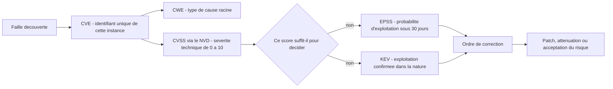
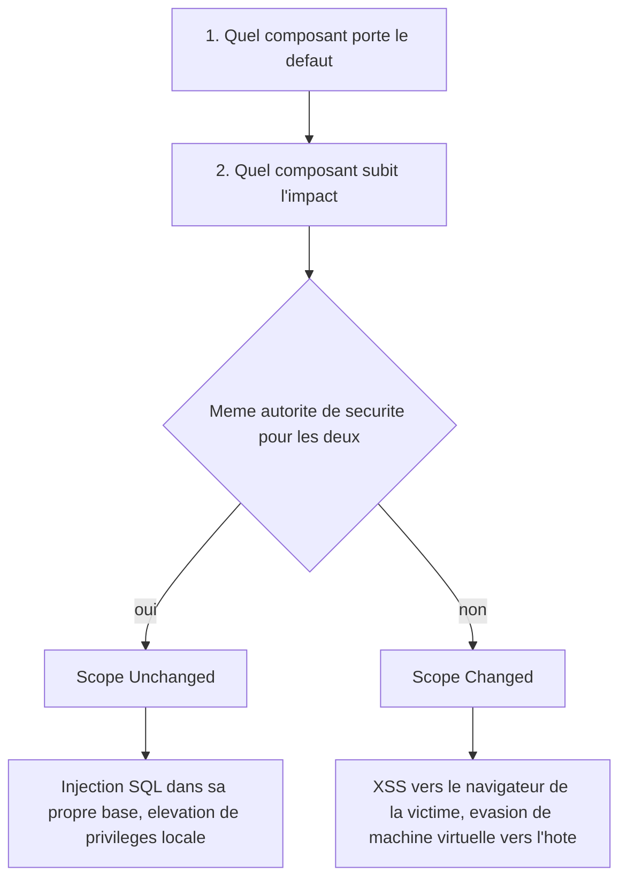
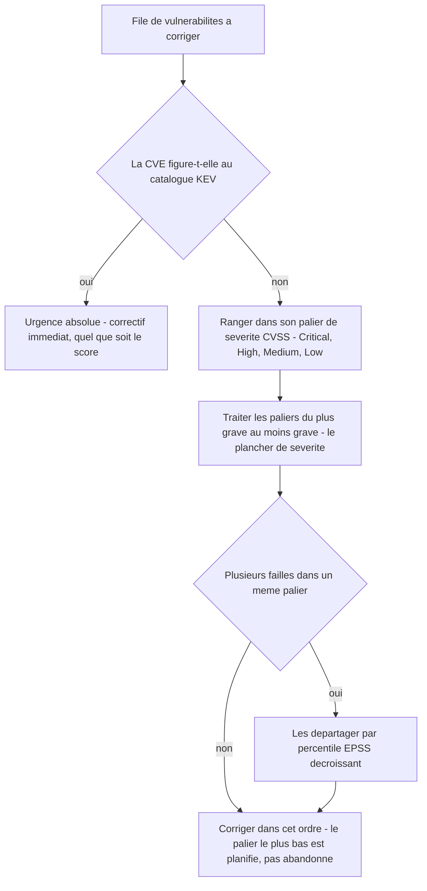

# Évaluation et priorisation des vulnérabilités

## L'idée en une image

Un soir de tempête, six personnes arrivent en même temps aux urgences. L'hôpital n'a pas six
équipes libres : il a une infirmière au triage, et elle doit décider qui passe en premier. Elle
pose exactement trois questions, dans cet ordre :

- **Quelle est la gravité de la blessure ?** Une fracture ouverte n'est pas une entorse. C'est
  une mesure de la blessure elle-même, indépendante de la personne qui la porte — c'est le rôle
  du score **CVSS**.
- **Quel est le risque que ça se dégrade dans l'heure ?** Une entorse ne se dégrade pas ; une
  douleur thoracique, peut-être. C'est une estimation, pas un constat — c'est le rôle d'**EPSS**.
- **Est-ce que ça saigne, là, maintenant, sous mes yeux ?** Ce n'est plus une estimation, c'est
  un fait observé. Un patient qui saigne passe devant tout le monde, même s'il a l'air d'aller
  mieux que le voisin — c'est le rôle du catalogue **KEV**.

Voilà tout le module en trois lignes. Le monde produit des dizaines de milliers de
vulnérabilités par an ; ton équipe corrige ce qu'elle peut dans une journée de travail. Tout
l'enjeu est de **choisir l'ordre**, et le score de gravité ne suffit pas à le donner.

**Où l'analogie casse — et il faut le dire, sinon elle enseigne des erreurs.** Aux urgences, les
patients arrivent d'eux-mêmes : personne n'a besoin d'aller les chercher. Une vulnérabilité, à
l'inverse, ne se présente jamais toute seule à ta salle d'attente — c'est à toi de découvrir
qu'un de tes paquets est concerné, et si tu ne l'inventories pas, elle n'existe simplement pas
pour toi. Deuxième écart, plus subtil : l'infirmière voit son patient, alors qu'un score CVSS est
calculé par quelqu'un qui ne connaît **pas** ton installation. Le même 9.8 peut viser un serveur
exposé à Internet ou une machine hors ligne d'un laboratoire. Le triage médical juge un cas
concret ; CVSS juge une **classe** de cas, et c'est précisément pour ça qu'il ne peut pas décider
seul.

## Avant de lire : ce module n'est pas de la matière d'examen

::: complement
Cette leçon entière est un **complément** de la base de connaissances. Ni CVSS, ni CVE, ni CWE,
ni EPSS, ni KEV n'apparaissent dans les diaporamas du cours 420-B10-HU (millésime automne 2026,
séances 1, 7 et 9, texte **et** images), ni dans le plan de cours officiel — vérification faite
le 2026-08-19 sur les trois sources. Il n'y a donc **aucune réponse du cours à donner** ici, et
la règle habituelle de la session (« à l'examen, donne la réponse du cours ; en production,
applique la correction ») n'a rien à arbitrer : le cours ne dit rien sur le sujet.
:::

Cette précision est la première chose à lire, et pas une formalité. Un étudiant qui réviserait ce
module en croyant préparer son examen **perdrait du temps** au moment exact où il en manque. Lis
cette leçon **après** avoir couvert la matière effectivement enseignée.

Alors pourquoi est-elle dans le cours ? Parce que le contenu, lui, est juste et professionnellement
indispensable. Dès ton premier emploi, `npm audit`, Dependabot ou un rapport de pentest te
livreront des lignes de la forme « CVE-2021-44228 — CVSS 10.0 Critical », et il faudra savoir
lesquelles corriger cette semaine. C'est aussi une question classique d'entrevue d'embauche. Le
Cégep de l'Outaouais offre d'ailleurs un cours distinct, « Gestion des vulnérabilités » (AEC
Cybersécurité), où ces notions sont vraisemblablement enseignées pour elles-mêmes — hors du
parcours Programmeur Web dont relève 420-B10-HU.

Enfin, un pont existe avec ce que tu as vu en séance 1 : les trois dernières métriques de CVSS
**sont** exactement la triade CIA du module précédent. Nous y reviendrons.

## Cinq sigles, cinq questions différentes

La confusion la plus fréquente en gestion des vulnérabilités consiste à traiter CVE, CWE et CVSS
comme trois façons de dire la même chose. Ce sont trois objets distincts, gérés par des
organisations distinctes, qui répondent à des questions distinctes. Prends le temps de lire la
colonne « répond à » : c'est elle qui compte, le reste est de la nomenclature.

| Système | Répond à | Tenu par |
|---|---|---|
| **CVE** (*Common Vulnerabilities and Exposures*) | « Quelle est cette faille **précise** ? » — un identifiant unique de la forme `CVE-2021-44228` | Le CVE Program, coordonné par **MITRE** ; des centaines de **CNA** (*CVE Numbering Authorities* — éditeurs, chercheurs, plateformes de primes) attribuent les identifiants |
| **CWE** (*Common Weakness Enumeration*) | « De quel **type** de faille s'agit-il ? » — une taxonomie des causes racines (`CWE-89` injection SQL, `CWE-79` XSS, `CWE-352` CSRF) | MITRE |
| **CVSS** (*Common Vulnerability Scoring System*) | « Quelle est sa **sévérité technique** ? » — un score de 0 à 10 | **FIRST.org** publie le standard ; le CNA ou le NVD calcule le score d'une CVE donnée |
| **EPSS** (*Exploit Prediction Scoring System*) | « Quelle **probabilité** qu'elle soit exploitée dans les 30 prochains jours ? » — de 0 à 100 %, recalculé chaque jour | FIRST.org |
| **KEV** (*Known Exploited Vulnerabilities*) | « Est-elle **confirmée** exploitée dans la nature, aujourd'hui ? » — une liste, pas un score | La **CISA**, l'agence américaine de cybersécurité |

Il faut y ajouter un sixième acteur, qui n'est pas un système de notation mais une base de
données : le **NVD** (*National Vulnerability Database*), tenu par le **NIST**. Son rôle est
d'**enrichir** chaque CVE — lui attacher un score CVSS, un rattachement CWE, la liste des produits
affectés. C'est le NVD que tu consultes sans le savoir chaque fois qu'un outil t'affiche « CVSS
9.8 » à côté d'une CVE.

La règle de vocabulaire à retenir, reprise du module précédent : **on corrige un CWE, on patche un
CVE.** Le CWE est la vue du développeur (le type de défaut, dans n'importe quel produit), le CVE
est la vue de l'exploitant (ce défaut-là, dans ce produit-là, dans cette version-là).



::: complement
**Fait daté, et il change la pratique.** Le NVD a annoncé le 15 avril 2026 qu'il cesse
d'enrichir automatiquement la majorité des nouvelles CVE, faute de moyens face à l'explosion du
volume. Il priorise désormais les CVE déjà inscrites au catalogue KEV, les logiciels de l'État
fédéral américain et les logiciels jugés critiques ; le reste est listé sans analyse. Conséquence
directe pour toi : **une CVE peut aujourd'hui exister sans score CVSS**, et un outil qui trie
uniquement par score la fera disparaître de ta file ; et quand un score subsiste, c'est de plus en
plus celui du CNA seul, sans le contre-score du NVD — ce qui rend le point suivant sur les
divergences d'autant plus concret. C'est aussi l'argument le plus concret en
faveur d'EPSS et de KEV — l'organisme même qui calcule les scores admet ne plus pouvoir noter
tout le monde, et choisit de prioriser sur l'exploitation confirmée.
:::

## CVSS v3.1 : trois groupes, et un seul qu'on voit vraiment

::: complement
Tout ce qui suit sur CVSS s'appuie sur la spécification officielle de FIRST.org (v3.1, publiée
en juin 2019) et sur les documents d'une **édition antérieure** de ce cours. C'est un complément,
au même titre que le reste du module.
:::

CVSS découpe la notation en **trois groupes de métriques**, et une bonne partie des malentendus
vient de ce que presque personne n'utilise les deux derniers.

| Groupe | Ce qu'il mesure | Qui le calcule | Change dans le temps ? |
|---|---|---|---|
| **Base** | Les caractéristiques **intrinsèques** de la faille : à quel point elle est facile à exploiter, et ce qu'elle casse | L'éditeur, le CNA ou le NVD, une fois pour toutes | Non, figé |
| **Temporel** | L'état **courant** de l'exploitation et du correctif : un code d'exploit circule-t-il ? un correctif existe-t-il ? | Chaque organisation, à relire régulièrement | Oui |
| **Environnemental** | Le contexte de **ton** déploiement : criticité des données hébergées, mesures compensatoires déjà en place | Chaque organisation cliente, pour son propre parc | Oui |

Le score « CVSS » que tu liras dans une CVE, dans `npm audit` ou sur le NVD est **presque
toujours le score Base seul**. C'est aussi celui qu'on demande de calculer dans un exercice.

Et c'est déjà une limite majeure, qu'il vaut mieux voir tout de suite : le groupe
**Environnemental** existe précisément pour dire « ce serveur-là est isolé du réseau, cette
donnée-là n'est pas sensible » — et il est ignoré en pratique. On finit donc par comparer des
installations très différentes avec un chiffre qui n'en connaît aucune.

## Les huit métriques du groupe Base

Le groupe Base se divise en deux moitiés : cinq métriques d'**exploitabilité** (à quel point
c'est facile) et trois métriques d'**impact** (ce que ça casse). Les valeurs entre parenthèses
sont les poids numériques que la formule utilise — tu n'as pas à les mémoriser pour comprendre,
mais les voir aide à sentir ce qui pèse.

| Métrique | Sigle | Valeurs | Ce qu'elle demande |
|---|---|---|---|
| *Attack Vector* | **AV** | **N**etwork (0.85) · **A**djacent (0.62) · **L**ocal (0.55) · **P**hysical (0.2) | D'où l'attaquant peut-il frapper ? N = depuis Internet ; A = depuis le même segment réseau ou en Bluetooth ; L = il lui faut déjà une session sur la machine ; P = il doit toucher l'appareil. Plus c'est distant, plus le score monte. |
| *Attack Complexity* | **AC** | **L**ow (0.77) · **H**igh (0.44) | Faut-il une condition **hors du contrôle de l'attaquant** ? L = ça marche à tous les coups ; H = il faut gagner une course, être déjà positionné en interception, ou tomber sur une configuration particulière. Ce n'est **pas** la difficulté technique ressentie. |
| *Privileges Required* | **PR** | **N**one (0.85) · **L**ow (0.62 ou 0.68) · **H**igh (0.27 ou 0.5) | Quel accès l'attaquant doit-il **déjà** posséder ? N = aucun compte ; L = un compte ordinaire ; H = un compte administrateur. (Les deux valeurs correspondent à Scope Unchanged puis Changed, voir la section suivante.) |
| *User Interaction* | **UI** | **N**one (0.85) · **R**equired (0.62) | Faut-il qu'une **victime** fasse quelque chose — cliquer un lien, ouvrir un fichier ? N = l'attaque est autonome ; R = elle attend un geste humain. |
| *Scope* | **S** | **U**nchanged · **C**hanged | L'impact franchit-il une frontière d'autorité de sécurité ? Pas de poids direct : ce critère **change la formule**. |
| *Confidentiality* | **C** | **H**igh (0.56) · **L**ow (0.22) · **N**one (0) | Quelle divulgation de données ? H = totale ; L = partielle ou limitée ; N = aucune. |
| *Integrity* | **I** | **H**igh (0.56) · **L**ow (0.22) · **N**one (0) | Quelle modification de données ou de comportement ? H = arbitraire et totale ; L = limitée ; N = aucune. |
| *Availability* | **A** | **H**igh (0.56) · **L**ow (0.22) · **N**one (0) | Quelle interruption de service ? H = arrêt complet ; L = dégradation ; N = aucune. |

**Le pont avec la triade CIA de la séance 1.** Regarde les trois dernières lignes : C, I et A
**sont** la confidentialité, l'intégrité et la disponibilité du module précédent. CVSS n'y ajoute
que deux choses. D'abord une **graduation** — au lieu de « le principe est violé ou non », on a
None / Low / High. Ensuite, en face, cinq métriques qui répondent à la question que la triade ne
pose pas : « à quel point est-ce facile ? ».

D'où une méthode de lecture d'énoncé qui fonctionne à tous les coups, et qu'il faut prendre comme
une **procédure**, pas comme une intuition :

1. **Lis l'énoncé et souligne les principes CIA qu'il décrit comme compromis.** Cela remplit C, I
   et A directement.
2. **Puis raisonne AV, AC, PR et UI sur la façon dont l'attaquant s'y prend** : d'où il part, ce
   qu'il possède déjà, s'il a besoin d'une victime.
3. **Tranche Scope en dernier**, avec la règle de la section suivante.

Et le piège numéro un de l'étape 1, celui qui coûte le plus de points : **on ne score que les
impacts décrits**, jamais le pire cas imaginable pour ce type de faille. Une injection SQL dont
l'énoncé dit qu'elle « extrait toute la base » donne `C:H/I:N/A:N` — pas `C:H/I:H/A:H`, même si
on sait qu'une injection SQL *peut* écrire. L'énoncé n'a pas dit qu'elle écrivait.

## Scope — le piège numéro un

Voici le critère qui fait échouer le plus de calculs, parce que son nom trompe. **Scope ne mesure
pas l'ampleur des dégâts.** Il mesure une seule chose : est-ce que l'impact **franchit une
frontière d'autorité de sécurité** ?

Une **autorité de sécurité** (*security authority*), c'est le mécanisme qui décide, pour un
composant donné, qui a le droit de faire quoi : le noyau d'un système d'exploitation pour ses
processus, l'hyperviseur pour ses machines virtuelles, le navigateur et sa politique d'origine
pour les pages qu'il affiche. La définition officielle de FIRST tient en une phrase : le Scope
change lorsqu'« un exploit peut affecter des ressources au-delà de la portée de sécurité gérée
par l'autorité de sécurité du composant vulnérable ».



Deux précisions officielles tranchent la grande majorité des cas.

**1. Un composant utilisé exclusivement par l'application vulnérable reste dans son périmètre.**
La spécification donne l'exemple explicitement : une base de données qui ne sert qu'à cette
application-là fait partie du même Scope, même si techniquement elle a son propre système de
comptes. Conséquence contre-intuitive : **une injection SQL classique est `S:U`**. L'intuition
pousse à dire Changed parce que l'attaquant « sort » du code applicatif vers la base ; mais sortir
d'un composant n'est pas franchir une autorité.

**2. Le Scope change quand le composant impacté dépend d'une autre autorité que le composant
vulnérable.** L'exemple canonique est le **XSS** : le composant vulnérable est le serveur web qui
renvoie l'entrée sans l'encoder, mais le composant impacté est le **navigateur de la victime**,
qui relève d'une autre autorité de sécurité. Un XSS est donc presque toujours `S:C`.

| Aspect | Scope Unchanged (`S:U`) | Scope Changed (`S:C`) |
|---|---|---|
| Exemples typiques | Injection SQL dans sa propre base ; exécution de code qui reste dans le serveur ; élévation de privilèges locale qui reste sur la même machine | XSS (impact dans le navigateur) ; évasion de machine virtuelle ou de conteneur (impact sur l'hôte) ; extension sandboxée qui compromet le processus hôte |
| Effet sur le calcul | `Impact = 6.42 x ISS` | Autre formule d'impact, **et** score final multiplié par 1.08 |
| Effet net | — | Score plus élevé à impact équivalent : franchir une frontière est jugé aggravant |

## Du vecteur au chiffre

Un score CVSS ne se devine pas : il se **calcule** à partir des huit lettres. Et c'est le
**vecteur** qui est la vraie réponse — le chiffre n'en est qu'un résumé qui perd de l'information.
Deux failles à 7.5 peuvent avoir des vecteurs complètement différents, donc appeler des parades
différentes.

Un vecteur complet s'écrit ainsi, préfixé de la version :

`CVSS:3.1/AV:N/AC:L/PR:N/UI:N/S:U/C:H/I:N/A:N`

Et voici la formule, écrite ici comme du code pour qu'elle se lise dans l'ordre où elle
s'exécute. `C`, `I`, `A`, `AV`, `AC`, `PR` et `UI` y valent les poids du tableau précédent.

```typescript
// Sous-score d'impact : combien la triade CIA est touchée, de 0 à 1.
const iss = 1 - (1 - C) * (1 - I) * (1 - A);

// L'impact proprement dit — c'est ici que Scope change la donne.
const impact =
  scope === 'U'
    ? 6.42 * iss
    : 7.52 * (iss - 0.029) - 3.25 * (iss - 0.02) ** 15;

// L'exploitabilité : à quel point c'est facile d'y arriver.
const exploitabilite = 8.22 * AV * AC * PR * UI;
// ⚠️ PR prend sa valeur « Scope Changed » (0.68 au lieu de 0.62 ; 0.5 au lieu de 0.27) dès que scope === 'C'.

// Le score final, plafonné à 10 et arrondi au dixième SUPÉRIEUR.
const scoreDeBase =
  impact <= 0
    ? 0
    : scope === 'U'
      ? arrondiSuperieur(Math.min(impact + exploitabilite, 10))
      : arrondiSuperieur(Math.min(1.08 * (impact + exploitabilite), 10));
```

Trois remarques sur cette formule, parce qu'elles expliquent des comportements qui surprennent.

- **L'arrondi est vers le haut, au dixième.** Un calcul qui tombe à 4.02 donne 4.1, pas 4.0. Ce
  n'est pas un arrondi ordinaire.
- **Si les trois impacts sont `N`, le score est 0**, quelle que soit la facilité d'exploitation.
  Une faille qu'on peut déclencher depuis Internet sans compte mais qui ne casse rien vaut zéro :
  CVSS note des **conséquences**, pas des anomalies.
- **`S:C` agit deux fois** : il remplace la formule d'impact **et** multiplie la somme par 1.08.
  C'est pourquoi se tromper sur Scope déplace le score bien plus qu'on ne le croit.

Une fois le chiffre obtenu, on le traduit en sévérité qualitative — l'échelle que reprennent tous
les outils :

| Score | Sévérité |
|---|---|
| 0.0 | *None* |
| 0.1 – 3.9 | *Low* |
| 4.0 – 6.9 | *Medium* |
| 7.0 – 8.9 | *High* |
| 9.0 – 10.0 | *Critical* |

::: note
En pratique on ne calcule pas à la main : le [calculateur officiel de FIRST](https://www.first.org/cvss/calculator/3.1)
et celui du [NVD](https://nvd.nist.gov/vuln-metrics/cvss/v3-calculator) appliquent exactement
cette formule. Savoir la lire sert à autre chose : comprendre **pourquoi** un changement de
critère bouge le score, et repérer un score qui ne peut pas correspondre au vecteur affiché.
:::

## CVSS v4.0 — ce qui change depuis novembre 2023

FIRST a publié **CVSS v4.0 le 1er novembre 2023**. Il ne s'agit pas d'un ajustement de poids
mais d'une refonte, motivée par les critiques accumulées sur v3.1 — au premier rang desquelles
l'ambiguïté du Scope que tu viens de voir. Au 2026-08, **v3.1 reste la version majoritairement
diffusée** ; v4.0 progresse, et le calculateur du NVD le propose en parallèle.

| Point de comparaison | CVSS v3.1 | CVSS v4.0 |
|---|---|---|
| Groupes | Base, Temporel, Environnemental | **Base, Threat, Environmental, Supplemental** — d'où les sigles CVSS-B, CVSS-BT, CVSS-BE, CVSS-BTE selon les groupes réellement renseignés |
| Scope | Un critère `U`/`C`, ambigu | **Retiré.** Remplacé par deux jeux d'impact séparés : *Vulnerable System* (`VC`/`VI`/`VA`) et *Subsequent System* (`SC`/`SI`/`SA`). On ne tranche plus « est-ce le même composant » : on note l'impact des deux côtés |
| Complexité | `AC` seule (*Low*/*High*) | `AC` conservée **plus** un critère neuf `AT` (*Attack Requirements*), qui sépare les conditions de déploiement de la difficulté technique |
| Interaction | *None* / *Required* | *None* / ***Passive*** / ***Active*** : la victime doit-elle simplement visiter une page, ou poser un geste ciblé ? |
| Suivi dans le temps | Groupe Temporel, 3 métriques | Groupe **Threat**, une seule métrique — *Exploit Maturity* (`E`) — donc bien plus tenable à jour |
| Nouveau | — | Groupe **Supplemental**, purement **informatif** : *Safety*, *Automatable*, *Recovery*, *Value Density*, *Vulnerability Response Effort*, *Provider Urgency*. Il ne modifie pas le score chiffré |

Les trois changements à retenir, si tu n'en retiens que trois : **le Scope disparaît au profit de
deux jeux d'impact**, **le groupe Temporel se réduit à une seule métrique**, et **un groupe
informatif apparaît sans toucher au chiffre**. La direction est claire : v4.0 essaie de rendre
utilisables les groupes que personne ne remplissait.

## Ce que CVSS ne dit pas : EPSS et KEV

::: complement
EPSS et KEV sont la partie de ce module la plus utile en entreprise, et celle dont on parle le
moins dans les cours. Les traiter, c'est traiter la question que CVSS ne pose jamais.
:::

Reprenons la limite fondamentale. **CVSS Base répond à « si ça marche, quels dégâts ? ». Il ne
répond jamais à « est-ce que ça va m'arriver ? »** Deux failles notées 9.8 peuvent avoir des
destins opposés : l'une n'aura jamais été exploitée en quatre ans, l'autre l'est en masse une
semaine après sa divulgation. Trier par score seul revient à les traiter pareil.

**EPSS** estime, pour une CVE, la **probabilité** qu'elle soit exploitée dans les **30 prochains
jours**. C'est un modèle d'apprentissage automatique entraîné sur les caractéristiques de la CVE
(éditeur, âge, CWE, existence d'un code d'exploit public, mentions publiques) et sur des données
d'exploitation réellement observées — sondes, systèmes de détection d'intrusion, rapports de
fournisseurs. Deux propriétés le distinguent radicalement de CVSS :

- il est **recalculé et republié chaque jour**, là où un score CVSS Base est figé à sa
  publication ;
- il se lit surtout en **percentile** — le rang de la CVE parmi toutes celles qui sont notées.
  Une probabilité de 10 % semble faible dans l'absolu, et pourtant elle place déjà la CVE
  au-dessus de 88 % de toutes les CVE notées (FIRST, *Understanding EPSS Probabilities and
  Percentiles*, consulté le 2026-08-21) : l'immense majorité des CVE ne sont jamais exploitées.
  **C'est le rang qui sert à trier, pas le pourcentage brut.**

**KEV** est d'une autre nature : ce n'est pas un score mais un **catalogue**, tenu par la CISA,
des CVE dont l'exploitation active dans la nature est **confirmée**. Une CVE y est, ou elle n'y
est pas. EPSS prédit ; KEV constate. Pour les agences fédérales **civiles** américaines, le KEV
est l'un des quatre critères qui fixent le délai de correctif imposé par la directive
**BOD 26-04** de la CISA (10 juin 2026, qui a révoqué BOD 22-01 et ses délais uniformes de deux
semaines) ; dans le privé, c'est devenu un déclencheur d'urgence de fait.

La combinaison recommandée tient en trois lignes, et l'ordre des lignes est le message :

1. **CVSS est un plancher de sévérité.** On ne déprécie jamais une faille à fort impact sous
   prétexte qu'elle n'est pas encore exploitée : l'absence de preuve n'est pas une preuve
   d'absence.
2. **EPSS donne l'ordre** à l'intérieur d'un même palier de sévérité.
3. **KEV est l'urgence absolue**, qui prime sur les deux autres.



Le tableau de décision, sous une autre forme :

| Situation | Décision |
|---|---|
| Score élevé, EPSS faible, hors KEV | Correctif **planifié** — réel, mais pas urgent |
| Score modéré, EPSS élevé **ou** au KEV | Correctif **prioritaire**, malgré un score « moyen » |
| Score élevé **et** au KEV | **Urgence maximale** |

Et parce qu'aucun de ces outils n'est complet, voici comment ils se répartissent le travail :

| Approche | Sa force | Sa faiblesse | Quand s'en servir |
|---|---|---|---|
| **CVSS seul** | Standard universel, reproductible, exigé par des normes et des contrats (PCI-DSS, ISO 27001) | Ignore le contexte réel d'exploitation ; le score de l'éditeur et celui du NVD divergent souvent | Conformité, communication d'un niveau de risque entre organisations |
| **EPSS** | Quotidien, fondé sur des données observées, excellent pour trier des milliers de CVE | Statistique, jamais une garantie ; peu parlant pour expliquer un risque à une direction | Priorisation opérationnelle à grande échelle |
| **KEV** | Fiable sur ce qu'il couvre ; déclencheur clair | Couverture partielle et parfois tardive ; ne hiérarchise pas **entre** les CVE listées | Déclencheur d'urgence |
| **SSVC** (*Stakeholder-Specific Vulnerability Categorization*, CISA et CERT de Carnegie Mellon) | Arbre de décision qualitatif (*Track*, *Track\**, *Attend*, *Act*) intégrant exposition et impact métier ; pas de fausse précision numérique | Plus lourd à mettre en place, moins standardisé — et depuis le 10 juin 2026, c'est cette famille d'approche que la directive BOD 26-04 de la CISA impose aux agences fédérales civiles, ce qui la rend nettement moins confidentielle qu'avant | Organisation dont le programme de gestion des vulnérabilités est déjà mature |

**Le vrai coût n'est pas le calcul.** Scorer une faille à la main prend une ou deux minutes une
fois les huit critères maîtrisés. Ce qui coûte, c'est de **savoir quelles CVE te concernent** :
tenir un inventaire à jour de tes dépendances (`npm audit`, `composer audit`, Dependabot — c'est
ce qu'on appelle le **SCA**, *Software Composition Analysis*), interroger EPSS et KEV chaque jour,
et recommencer à chaque divulgation. C'est un processus continu, pas un calcul ponctuel.

## Exemple simple

Prenons une seule vulnérabilité et scorons-la de bout en bout. C'est le mécanisme isolé : un
formulaire de connexion qui construit sa requête SQL par concaténation.

D'abord le code, parce qu'on ne peut pas scorer ce qu'on ne comprend pas. La cause racine porte
un nom normalisé : **`CWE-89`**, *Improper Neutralization of Special Elements used in an SQL
Command*.

:::: comparaison
::: vulnerable
```php
$courriel = $_POST['courriel'];
$sql = "SELECT id, role FROM utilisateurs WHERE courriel = '$courriel'";
$resultat = $pdo->query($sql);
$utilisateur = $resultat->fetch();
```
{lignes="1"} La valeur vient du client. À ce stade elle n'est ni fautive ni sûre : ce n'est
qu'une chaîne de caractères, et rien n'est encore décidé.

{lignes="2"} Voilà la ligne fautive. La chaîne du visiteur est **concaténée dans la requête**,
donc interprétée comme de la syntaxe SQL et non comme une donnée. Une valeur bien choisie change
le sens de la requête et fait sortir toute la table.

{lignes="3"} La base exécute ce que le code lui a donné, sans rien avoir fait de mal : elle n'a
aucun moyen de distinguer la partie écrite par le développeur de celle écrite par l'attaquant.
:::
::: corrige
```php
$courriel = $_POST['courriel'];
$requete = $pdo->prepare('SELECT id, role FROM utilisateurs WHERE courriel = :courriel');
$requete->execute(['courriel' => $courriel]);
$utilisateur = $requete->fetch();
```
{lignes="2"} La requête est **préparée** : sa structure est envoyée à la base **avant** toute
donnée. Le plan d'exécution est figé à ce moment-là, et plus rien de ce qui arrivera ensuite ne
pourra le modifier.

{lignes="3"} La valeur du visiteur voyage à part, comme **paramètre**. Elle sera comparée à une
colonne, jamais lue comme de la syntaxe — c'est une frontière structurelle, pas un filtrage.
:::
::::

Maintenant l'énoncé à scorer, formulé comme on le trouverait dans un rapport : « *Un champ du
formulaire de connexion n'est pas correctement protégé. Un attaquant peut y injecter du SQL pour
extraire toute la base de données.* »

On applique la procédure : d'abord les principes CIA décrits, puis la façon d'y arriver, puis
Scope.

| Critère | Valeur | Pourquoi |
|---|---|---|
| **C** | **H**igh | « Extraire toute la base » : divulgation totale |
| **I** | **N**one | L'énoncé décrit une **extraction**, pas une modification. On ne score pas le pire cas générique d'une injection SQL |
| **A** | **N**one | Aucune indication d'impact sur la disponibilité |
| **AV** | **N**etwork | Un formulaire de connexion est exposé sur le web |
| **AC** | **L**ow | Aucune condition particulière mentionnée : injection classique |
| **PR** | **N**one | C'est le formulaire de connexion **lui-même** qui est vulnérable : l'attaquant n'a par définition pas encore de compte |
| **UI** | **N**one | Il soumet le formulaire lui-même, aucune victime tierce n'intervient |
| **S** | **U**nchanged | La base ne sert qu'à cette application : même autorité de sécurité, malgré la sensation de « sortir » de l'application |

**Vecteur : `CVSS:3.1/AV:N/AC:L/PR:N/UI:N/S:U/C:H/I:N/A:N` — score 7.5, sévérité *High*.**

Le calcul, pour le voir tourner une fois :
`ISS = 1 - (1 - 0.56) x (1 - 0) x (1 - 0) = 0.56` ; `Impact = 6.42 x 0.56 = 3.5952` ;
`Exploitabilité = 8.22 x 0.85 x 0.77 x 0.85 x 0.85`, soit environ `3.887` ; somme `7.482`,
arrondie au dixième supérieur : **7.5**.

**Le test qui vérifie ta compréhension :** si l'énoncé avait ajouté que l'injection permet aussi
de modifier et de supprimer des enregistrements, `I` et `A` passeraient à *High* et le score
monterait à **9.8**. Deux mots dans l'énoncé, 2.3 points d'écart. C'est bien l'énoncé qu'on score,
jamais le type de faille en général.

## Exemple complet

En situation réelle, on ne score jamais une faille isolée : on arbitre entre plusieurs, avec un
budget de correctifs limité. Deux temps, donc — d'abord un second scorage qui met Scope en jeu,
ensuite la décision de priorisation.

### Temps 1 — un XSS réfléchi, et pourquoi son score paraît « trop bas »

Le code, sur la même pile que l'exemple précédent. La cause racine est **`CWE-79`**.

:::: comparaison
::: vulnerable
```php
$recherche = $_GET['q'];
echo '<p>Aucun résultat pour ' . $recherche . '</p>';
```
{lignes="1"} La valeur vient du paramètre d'URL, donc entièrement de l'attaquant — c'est lui qui
fabrique le lien qu'il enverra à sa victime.

{lignes="2"} La chaîne est **écrite telle quelle dans la page**. Si elle contient une balise de
script, le navigateur de la victime ne voit aucune différence entre ce balisage et celui du
site : il l'exécute avec les privilèges de l'origine visitée.
:::
::: corrige
```php
$recherche = $_GET['q'];
echo '<p>Aucun résultat pour ' . htmlspecialchars($recherche, ENT_QUOTES, 'UTF-8') . '</p>';
```
{lignes="2"} L'**encodage à la sortie** transforme les caractères de balisage en entités : le
navigateur les affiche comme du texte au lieu de les interpréter. La parade se pose au moment de
l'écriture dans la page, pas au moment de la lecture de l'entrée — c'est le contexte de sortie
qui détermine l'encodage correct.
:::
::::

L'énoncé : « *Une application web ne filtre pas les entrées, ce qui permet d'injecter du
JavaScript qui s'exécute dans le navigateur d'un autre utilisateur.* »

| Critère | Valeur | Pourquoi |
|---|---|---|
| **AV** | **N**etwork | La charge est livrée par une URL |
| **AC** | **L**ow | Fabriquer l'URL piégée est trivial |
| **PR** | **N**one | Aucun compte n'est nécessaire pour fabriquer le lien |
| **UI** | **R**equired | Il faut que la victime charge la page piégée |
| **S** | **C**hanged | Le composant vulnérable est le serveur web ; le composant **impacté** est le navigateur de la victime, sous une autre autorité |
| **C** | **L**ow | Lecture limitée au contexte du navigateur (cookies non protégés, contenu de la page) — pas un accès système |
| **I** | **L**ow | Modification du contenu affiché et actions dans les limites du navigateur |
| **A** | **N**one | Le service reste disponible |

**Vecteur : `CVSS:3.1/AV:N/AC:L/PR:N/UI:R/S:C/C:L/I:L/A:N` — score 6.1, sévérité *Medium*.**

Deux enseignements tiennent dans ce 6.1. **Le premier** : 6.1 est plus bas que le 7.5 de
l'injection SQL, alors que l'attaque touche des utilisateurs réels — parce que CVSS note l'impact
**technique** d'une instance, pas le nombre de victimes ni l'embarras médiatique. **Le second**,
plus concret : si tu t'étais trompé et avais écrit `S:U`, ce même vecteur donnerait **5.4**, soit
un cran plus bas dans les rapports. Scope à lui seul déplace le score de 0.7 point ici.

### Temps 2 — le lundi matin

Ton analyseur de dépendances a produit quatre lignes pendant la fin de semaine. Tu as une
journée. Dans quel ordre ?

| CVE (fictive) | Composant | CVSS v3.1 | Percentile EPSS | Au KEV ? |
|---|---|---|---|---|
| CVE-A | Bibliothèque de journalisation, exécution de code à distance | **9.8** *Critical* | 12 | non |
| CVE-B | Module d'authentification, contournement de connexion | **5.9** *Medium* | 98 | **oui** |
| CVE-C | Analyseur d'images, déni de service | **6.5** *Medium* | 40 | non |
| CVE-D | Composant d'administration, XSS stocké | **6.1** *Medium* | 71 | non |

Le tri par score seul donnerait **A, C, D, B**. C'est l'ordre que produit la plupart des tableaux
de bord, et c'est le mauvais.

L'ordre correct est **B, A, D, C**, et chaque position se justifie :

- **CVE-B d'abord**, malgré son 5.9. Elle est au catalogue KEV : son exploitation est **observée**,
  pas prédite. Le débat sur la gravité théorique est clos par un fait. C'est exactement le patient
  qui saigne devant l'infirmière.
- **CVE-A ensuite.** Score maximal, mais rien n'indique qu'elle soit attaquée aujourd'hui. Elle
  reste prioritaire — le plancher de sévérité de la règle 1 — sans être une urgence de l'heure.
- **CVE-D avant CVE-C**, et c'est le point qui surprend. Les deux tombent dans le **même palier de
  sévérité** — 6.5 et 6.1 sont toutes deux *Medium* —, donc le plancher CVSS ne les départage pas :
  c'est le percentile EPSS qui tranche, et celui de D (71) écrase celui de C (40). Un déni de
  service sur un analyseur d'images à un percentile médian n'est pas ce qui te tombera dessus cette
  semaine. Note bien la condition : EPSS départage **à l'intérieur** d'un palier, il ne fait jamais
  remonter une *Medium* devant une *Critical* — c'est pour ça que D reste derrière A, dont le
  percentile est pourtant six fois plus bas.
- **CVE-C en dernier**, ce qui ne veut pas dire « jamais » : la planifier est une décision, pas un
  oubli. Une file de correctifs sans date de reprise est une file abandonnée.

Deux réflexes à emporter de cet exercice. **Écris la décision quelque part** — un tri fait de
tête n'est pas un programme de gestion des vulnérabilités, et personne ne pourra le contester ni
le refaire. Et **rejoue le tri demain** : EPSS aura changé, et le catalogue KEV aussi. Le score
CVSS, lui, sera identique — c'est bien pour ça qu'il ne peut pas décider seul.

## À toi de jouer

Huit questions. Trois d'entre elles sont des mises en situation à scorer : reprends la procédure
en trois temps (les impacts décrits d'abord, la façon d'y arriver ensuite, Scope en dernier)
plutôt que de chercher le score de mémoire.

[[quiz]]

## À retenir

::: a-retenir
- **Cinq systèmes, cinq questions.** CVE identifie une instance, CWE nomme un type de faiblesse,
  CVSS note une sévérité technique, EPSS estime une probabilité d'exploitation à 30 jours, KEV
  confirme une exploitation observée. Les confondre est l'erreur la plus fréquente du domaine.
- **Scope ne mesure pas les dégâts, il mesure une frontière d'autorité.** Une injection SQL dans
  la base dédiée à l'application est `S:U` ; un XSS, dont l'impact atterrit dans le navigateur de
  la victime, est `S:C`. Se tromper de Scope déplace le score deux fois : formule d'impact et
  facteur 1.08.
- **On score l'impact décrit dans l'énoncé, jamais le pire cas du type de faille.** « Extraire
  toute la base » donne `C:H/I:N/A:N` et 7.5 ; ajouter la modification donnerait 9.8.
- **Un score élevé ne veut pas dire « à corriger en premier ».** L'ordre réel : KEV en urgence
  absolue, CVSS comme plancher de sévérité, EPSS comme ordre à l'intérieur d'un palier. Une 9.8
  jamais exploitée peut attendre ; une 5.9 au KEV, non.
- **Rien de ce module n'est de la matière d'examen 2026** — ni CVSS, ni CVE, ni CWE, ni EPSS, ni
  KEV n'apparaissent dans les diaporamas du cours ni dans le plan de cours. C'est du savoir
  professionnel, à lire après la matière évaluée.
:::

## Aller plus loin

- **Fiche source** — `web/securite/evaluation-vulnerabilites-cvss.md` (KnowledgeBase) : les huit
  métriques une par une, l'exemple décodé de Log4Shell (`CVE-2021-44228`, vecteur
  `CVSS:3.1/AV:N/AC:L/PR:N/UI:N/S:C/C:H/I:H/A:H`, score 10.0), et cinq mises en situation
  corrigées de l'édition antérieure du cours, dont la fixation de session (8.0) et l'élévation de
  privilèges locale (7.8).
- **Module précédent** — `01-fondamentaux` : la triade CIA, dont C, I et A reprennent exactement
  les trois lettres, et la distinction CVE / CWE dans son contexte de vocabulaire.
- **Module suivant** — l'injection : la faille dont on vient de calculer le score, cette fois
  démontée en détail.
- Sources originales citées dans cette leçon :
  [CVSS v3.1 Specification Document (FIRST)](https://www.first.org/cvss/v3.1/specification-document),
  [CVSS v3.1 User Guide (FIRST)](https://www.first.org/cvss/v3.1/user-guide),
  [CVSS v4.0 Specification Document (FIRST)](https://www.first.org/cvss/specification-document),
  [Exploit Prediction Scoring System (FIRST)](https://www.first.org/epss/),
  [CISA Known Exploited Vulnerabilities Catalog](https://www.cisa.gov/known-exploited-vulnerabilities-catalog),
  [National Vulnerability Database (NIST)](https://nvd.nist.gov),
  [CWE — Common Weakness Enumeration (MITRE)](https://cwe.mitre.org).
