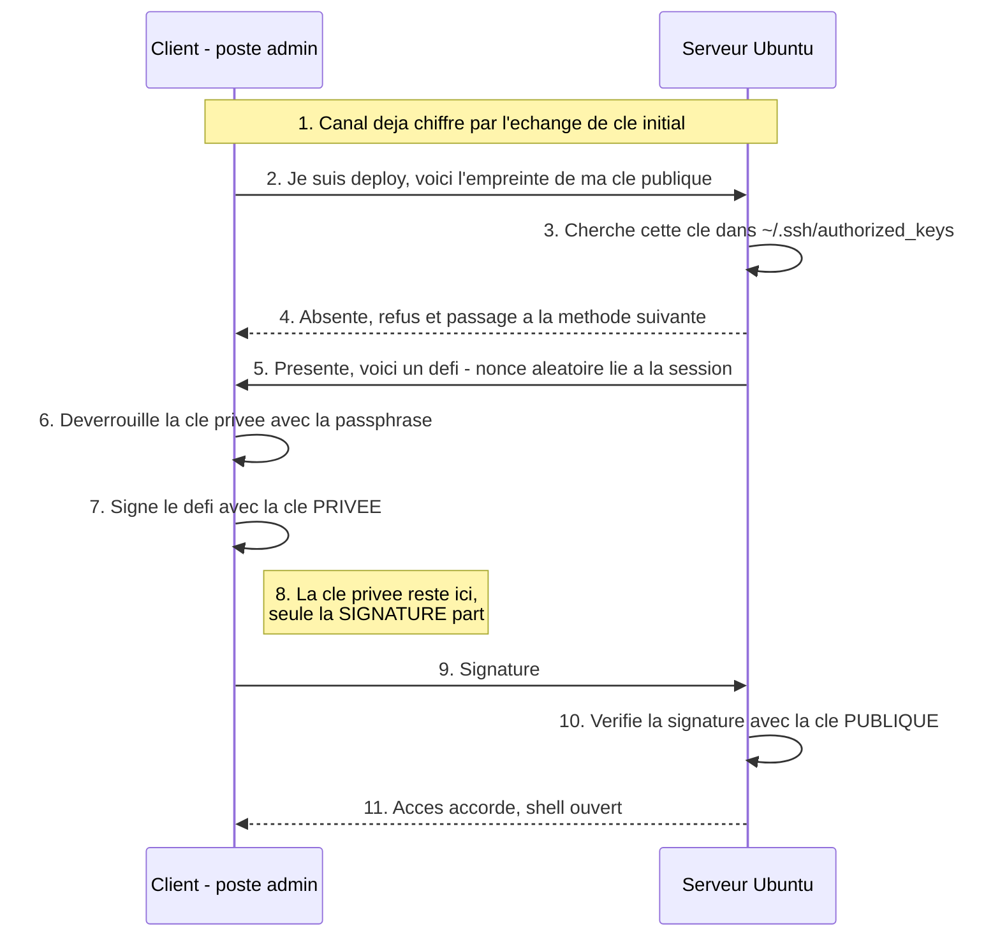
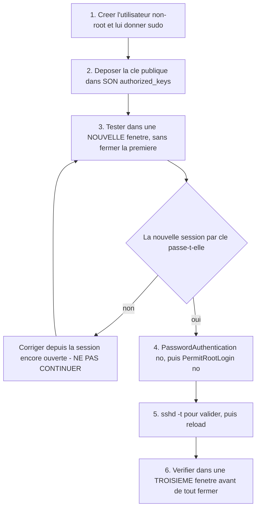
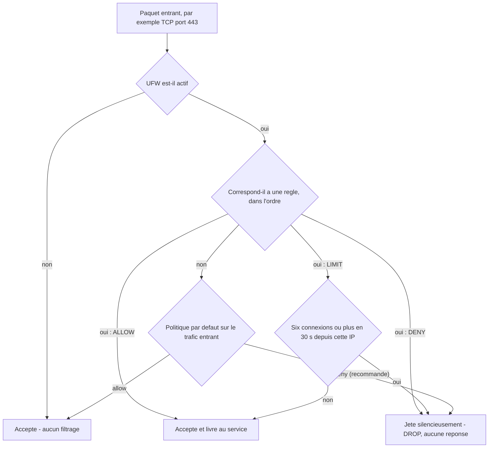

# Sécurité de la communication serveur

## L'idée en une image {diapos="9, 10"}

À la séance précédente, tu as loué un local nu et tu y es entré pour la première fois. La porte
avait un **code** : quatre ou dix caractères reçus par courriel, que tu tapes à l'interphone. Ce
code fonctionne. Le problème n'est pas qu'il fonctionne — c'est qu'il fonctionne **pour quiconque
le devine**, et que rien n'empêche un inconnu d'en essayer un million.

Remplace maintenant le code par un **sceau**. Le portier ne te demande plus rien de secret : il
prend une feuille au hasard, y écrit une phrase que personne n'a jamais écrite avant, te la tend,
et te demande de la sceller. Tu presses ton sceau dessus, tu lui rends la feuille. Il compare
l'empreinte au **modèle de sceau** qu'il garde dans sa fiche, et il ouvre.

Trois choses ont changé, et ce sont exactement les trois qui comptent. **Ton sceau n'a jamais
quitté ta poche** — le portier ne l'a pas vu, il a vu une empreinte. **La feuille était neuve**,
donc un curieux qui aurait photographié l'empreinte d'hier ne peut rien en faire aujourd'hui. Et
**le modèle en fiche n'est pas un secret** : tu pourrais l'afficher sur la porte sans que personne
puisse pour autant sceller à ta place.

Autour de l'immeuble, enfin, on pose une **clôture avec un seul portail**. Le portier reste, mais
il ne voit plus passer les mille badauds qui essayaient les portes au hasard. C'est le rôle du
pare-feu.

**Où l'analogie casse — deux fois, et il faut le savoir.** Un vrai sceau de cire se **recopie** :
il suffit d'en voler une empreinte nette et de graver la même forme. La clé privée SSH, elle, ne
se déduit pas de la clé publique — c'est un problème mathématique hors d'atteinte, pas un travail
d'artisan patient. Et la clôture, contrairement à un pare-feu, se voit : un attaquant qui balaie
tes ports apprend en quelques secondes lesquels sont ouverts. **Un pare-feu ne cache rien, il
refuse.**

::: cours
La séance 3 du cours 420-B10-HU (millésime 2026, paquet de 78 diapositives) enseigne deux choses,
dans cet ordre : l'**authentification par clé SSH** — génération avec `ssh-keygen`, conversion au
format PuTTY avec PuTTYgen, dépôt de la clé publique dans l'interface DigitalOcean, connexion avec
PuTTY, puis transfert de fichiers avec WinSCP — et le **pare-feu UFW**, déroulé comme une suite de
captures d'écran commentées des diapositives 44 à 71. Les quatre exercices de la feuille de la
séance portent exactement sur cette mécanique ; la cinquième activité est l'amorce du projet de
session.
:::

::: complement
Le fichier `/etc/ssh/sshd_config` — c'est-à-dire l'endroit où l'on interdit réellement le mot de
passe — n'est ouvert nulle part dans le **paquet republié de 78 diapositives** (l'édition
antérieure, elle, l'ouvrait pour changer le port ; on y revient plus bas). Mesuré : ni ce nom de
fichier, ni `sshd`, ni `PasswordAuthentication`, ni `fail2ban`, ni `ssh-agent`, ni `ssh-copy-id`
n'apparaissent dans les vingt et un paquets de diapositives des deux cours, ni dans un énoncé
d'exercice. Même chose pour une partie des commandes UFW de cette leçon : les politiques par défaut
`ufw default deny incoming` et `allow outgoing`, la limitation de débit `ufw limit`, la suppression
par règle `ufw delete allow 80/tcp`, le profil `OpenSSH` et `ufw status verbose` **ne sont sur aucune
diapositive** — le cours ouvre et ferme des ports, il ne pose jamais de politique par défaut. À quoi
s'ajoutent le fichier `~/.ssh/config` et la restriction par adresse IP source. Ces compléments
viennent donc de la base de connaissances, et c'est là que se joue la sécurisation réelle : le cours
t'apprend à **poser** la clé, la base de connaissances t'apprend à **fermer la porte** derrière elle.
Les renvois de diapositives, en tête de chaque section, disent lesquelles viennent du cours et
lesquelles n'en viennent pas — ce qui est autrement plus utile qu'une promesse sur le contenu de
l'examen, que personne ici n'est en position de tenir.
:::

## En bref — la marche à suivre {hors-cours}

:::: marche-a-suivre {titre="Verrouiller l'accès d'un droplet neuf : clé SSH, puis pare-feu"}

1. {voir="La séquence du cours, telle qu'elle se déroule à l'écran"} Génère la paire de clés
   **avant** de créer le droplet, dans un dossier hors OneDrive — par exemple `C:\Users\0758510\CleSSH`
   sur le poste du Cégep — et note la passphrase que `ssh-keygen` te fait saisir deux fois : elle ne
   s'affiche pas pendant la frappe, et elle ne se récupère pas.

   ```bash
   ssh-keygen                                        # la commande du cours : nom « maCle », passphrase deux fois
   ssh-keygen -t ed25519 -C "philippe@poste-cours"   # la forme explicite : l'algorithme est DÉCIDÉ, pas hérité
   ```

2. {voir="Convertir la clé pour PuTTY"} Convertis la clé privée au format `.ppk` avec **PuTTYgen** —
   *Load* pour charger `maCle`, passphrase, puis *Save private key* — et retiens que renommer le
   fichier en `.ppk` ne convertit **rien** : seule la sauvegarde par PuTTYgen produit une vraie clé
   PuTTY.

3. {voir="La voie du cours : la coller dans DigitalOcean"} Colle le contenu de `maCle.pub`, la clé
   **publique** et jamais `maCle`, dans l'interface DigitalOcean **au moment même** de créer le
   droplet : la machine naît alors en « clé seulement », sans la moindre fenêtre de temps pendant
   laquelle un mot de passe serait encore accepté.

4. {voir="Se connecter au droplet"} Connecte-toi, et **compare l'empreinte du serveur** à celle
   qu'affiche la console web du fournisseur avant de l'accepter : c'est le seul moment où la
   question se pose. Ce qu'on te demande ensuite est la **passphrase de ta clé**, jamais le mot de
   passe du compte.

   ```bash
   ssh -i ~/.ssh/id_ed25519 root@203.0.113.10    # ou PuTTY, avec « clePutty.ppk » dans Connection / SSH / Auth
   ```

5. {voir="Les permissions, non négociables"} **Voie alternative, si la clé n'a pas été déposée par
   le fournisseur** mais copiée à la main sur un serveur déjà en service : pose toi-même les
   permissions, sans quoi OpenSSH refuse la clé **en silence** et te redemande un mot de passe sans
   fin.

   ```bash
   chmod 700 ~/.ssh                    # rwx pour le propriétaire seul
   chmod 600 ~/.ssh/authorized_keys    # rw  pour le propriétaire seul
   ```

6. {voir="L'ordre des opérations, ou comment ne pas s'enfermer dehors"} Reteste la connexion par clé
   dans une **seconde fenêtre**, sans fermer la première, et ne ferme le mot de passe qu'ensuite :
   valide la syntaxe avant de recharger, et recharge plutôt que redémarrer.

   ```bash
   sudo sshd -t                 # test de syntaxe : le silence signifie que tout va bien
   sudo systemctl reload ssh    # recharge sans couper les sessions établies
   ```

7. {voir="Un service à protéger : le serveur web"} Installe Apache et vérifie qu'il répond **avant**
   de toucher au pare-feu : sans service à ouvrir et à fermer, aucune règle ne se laisse observer.

   ```bash
   sudo apt update && sudo apt install apache2
   systemctl is-active apache2    # doit répondre : active
   ```

8. {voir="Exemple simple"} Active UFW dans l'ordre sûr, celui qui ne souffre aucune exception : les
   politiques par défaut, **l'ouverture de SSH d'abord**, une relecture, et l'activation en tout
   dernier.

   ```bash
   sudo ufw default deny incoming
   sudo ufw default allow outgoing
   sudo ufw allow OpenSSH           # AVANT enable : la ligne qui évite de s'enfermer dehors
   sudo ufw status                  # relire ce qu'on s'apprête à appliquer
   sudo ufw enable                  # en DERNIER, jamais avant
   ```

9. {voir="module:automatisation-surveillance"} Enchaîne sur la séance 4 une fois l'accès verrouillé :
   il reste à savoir ce qui se passe sur la machine quand tu n'y es pas.

::::

## Pourquoi le mot de passe ne suffit pas {diapos="8, 9"}

Un serveur qui possède une adresse IP publique reçoit, **dans l'heure qui suit sa création**, des
tentatives de connexion SSH automatisées. Ce ne sont pas des attaques ciblées : ce sont des
réseaux de machines compromises — des **botnets** — qui balaient des plages d'adresses entières et
essaient `root:123456`, `root:admin`, `ubuntu:ubuntu`, l'un après l'autre. Le coût pour
l'attaquant est nul, et il lui suffit d'une réussite sur des millions d'essais.

Le mot de passe a ici trois défauts **structurels**, c'est-à-dire trois défauts qu'aucune longueur
ne corrige :

1. **C'est un secret réutilisable et devinable.** Son entropie — la quantité d'imprévisible qu'il
   contient — est bornée par ce qu'un humain accepte de retenir. Dix caractères tirés **au hasard**
   dans un alphabet complet valent 60 à 65 bits ; dix caractères **choisis par une personne**
   valent, mesuré sur des corpus réels de dizaines de millions de mots de passe, moins de 25 bits.
   C'est cet écart-là, pas la longueur, qui rend le brute force rentable.
2. **Il est transmis au serveur** à chaque connexion. Chiffré dans le tunnel, certes ; mais un
   serveur compromis, ou un serveur usurpé auquel tu te connecterais par erreur, le lit en clair à
   l'arrivée.
3. **Rien ne limite naturellement le nombre d'essais.** Sans outil ajouté, un robot peut frapper
   indéfiniment.

::: correction-du-cours {source="Fiche KB web/securite/securisation-acces-distant-ssh.md, section « Pourquoi : ce que le mot de passe ne peut pas protéger » (maj 2026-08-19), commentant la diapositive 9"}
La diapositive 9 dit que le pirate cherche à « trouver **la clé** en épuisant les combinaisons
possibles (brute force) ». Reproduis cette formulation si l'examen la reprend — mais la nuance
n'est pas cosmétique. C'est le **mot de passe** qui se brute-force, jamais la clé. Une clé Ed25519
offre environ 128 bits de sécurité effective ; une clé RSA 4096, de l'ordre de 150 bits — une
extrapolation, les tables NIST SP 800-57 (rév. 5, 2020) ne listant que 3072 bits vers 128 et
7680 bits vers 192.
Épuiser 2 puissance 128 combinaisons n'est pas « long » : c'est physiquement hors d'atteinte, quel
que soit le matériel qu'on y consacre. Passer à la clé ne rend donc pas le brute force « plus
difficile », il le rend **sans objet**. C'est un changement de catégorie, pas un changement de
degré.
:::

## La paire de clés : deux fichiers, un seul secret {diapos="10"}

Une **paire de clés** SSH, ce sont deux fichiers mathématiquement liés, produits ensemble et
inséparables.

| Fichier | Où il vit | Est-il secret ? |
|---|---|---|
| `id_ed25519.pub` — la **clé publique** | sur **chaque serveur** où tu veux entrer, dans `~/.ssh/authorized_keys` | Non. Tu peux la publier sur GitHub sans aucun risque. |
| `id_ed25519` — la **clé privée** | uniquement sur **ton poste**, idéalement chiffrée par une passphrase | Oui. C'est la seule chose au monde qui t'authentifie. |

Le point qui surprend presque tout le monde à la première lecture : **la clé privée ne quitte
jamais ta machine et n'est jamais envoyée au serveur.** L'authentification se fait par
**défi-réponse** — le serveur pose une question que seul le détenteur de la clé privée sait
signer.



Trois conséquences pratiques découlent directement de ce déroulé, et il vaut la peine de les
nommer :

- **Un serveur compromis ne peut pas voler ton identité.** Il ne détient que ta clé publique, et
  la clé publique ne signe rien.
- **Une signature capturée n'est pas rejouable.** Le nonce — le nombre aléatoire à usage unique —
  est lié à cette session-là ; la signature d'hier ne répond pas au défi d'aujourd'hui.
- **Perdre la clé privée, c'est perdre le serveur.** Le cours insiste avec raison sur ce point
  (diapositive 10). Il n'y a pas de « mot de passe oublié » : il n'y a qu'une clé de secours que
  tu as pensé à déposer, ou la console web du fournisseur.

[[simulation]]

## Générer la paire de clés {diapos="14-19"}

### La séquence du cours, telle qu'elle se déroule à l'écran {diapos="14-19"}

::: cours {diapos="14, 15, 16, 17, 18, 19"}
Créer un dossier (par exemple `CleSSH`) sur le Bureau, taper `cmd` dans la barre d'adresse de
l'Explorateur Windows — ce qui ouvre une invite de commandes **déjà positionnée dans ce
dossier** — puis lancer `ssh-keygen` sans aucun argument. L'outil demande un nom de fichier
(le cours répond `maCle`), puis une passphrase, deux fois. Résultat sur le disque : `maCle`,
d'environ 3 Ko, la clé **privée** ; et `maCle.pub`, d'environ 1 Ko, la clé **publique**.
:::

Deux détails de cette capture sont vérifiables et souvent mal restitués. Le nom saisi, `maCle`,
est un **chemin relatif** : les deux fichiers atterrissent dans le dossier courant, pas dans
`~/.ssh`. Et la passphrase **ne s'affiche pas pendant la frappe** — pas même des astérisques. Ce
n'est pas un blocage du clavier, c'est le comportement normal de tous les outils Unix qui lisent
un secret.

```bash
# La commande du cours, sans argument :
ssh-keygen

# La forme recommandée en 2026, qui ne dépend d'aucun défaut implicite :
ssh-keygen -t ed25519 -C "philippe@poste-cours"

# Par compatibilité avec du matériel ancien (appliances, cartes de gestion à distance) :
ssh-keygen -t rsa -b 4096 -C "philippe@poste-cours"
```

`-b 4096` ne s'applique **qu'à RSA** : une clé Ed25519 a une taille fixe, il n'y a aucun choix à
faire. `-C` est un simple commentaire collé en fin de clé publique ; mets-y **qui et quelle
machine**, c'est ce qui te permettra dans deux ans de savoir quelle ligne d'`authorized_keys`
supprimer sans casser l'accès de quelqu'un d'autre.

::: note
**Concret, poste du Cégep.** Le dossier personnel s'appelle `C:\Users\0758510` : la clé se range
donc hors OneDrive, par exemple dans `C:\Users\0758510\CleSSH`. Explorateur → créer ce dossier →
cliquer dans la barre d'adresse → taper `cmd` → `Entrée` : une invite s'ouvre déjà positionnée là.

```bash
C:\Users\0758510\CleSSH> ssh-keygen -t ed25519 -C "philippe@poste-cours"
Generating public/private ed25519 key pair.
Enter file in which to save the key (C:\Users\0758510/.ssh/id_ed25519): maCle
Enter passphrase (empty for no passphrase):
Enter same passphrase again:
C:\Users\0758510\CleSSH> dir
maCle
maCle.pub
```

Deux fichiers apparaissent : `maCle` (la clé **privée**, ne la donne jamais) et `maCle.pub` (la clé
**publique**, celle qui va sur le serveur — voir plus bas).
:::

::: correction-du-cours {source="OpenSSH 9.5 release notes (openssh.com/txt/release-9.5, 2023-10-04) : « ssh-keygen(1): generate Ed25519 keys by default »"}
Le cours génère en réalité une clé **RSA 3072 bits**, sans le dire nulle part : l'en-tête
`+---[RSA 3072]----+` de l'image aléatoire, à la diapositive 18, le prouve. C'était le défaut
d'OpenSSH jusqu'à la version 9.4 incluse ; depuis **OpenSSH 9.5 (octobre 2023)**, `ssh-keygen`
sans argument produit une clé **Ed25519**. Conséquence concrète : sur un poste à jour, la même
commande ne donnera **pas** la même chose que la capture du cours, et l'empreinte affichée ne
commencera plus par `RSA`. Reproduis la commande du cours à l'examen ; en production, écris
l'algorithme explicitement — un défaut qui change sous tes pieds n'est pas une décision, c'est un
accident.
:::

::: correction-du-cours {source="Fiche KB web/securite/securisation-acces-distant-ssh.md, encadré « Le cours crée la clé sur le Bureau, dans OneDrive » (maj 2026-08-19)"}
Le chemin du cours, `C:\Users\<nom>\OneDrive\Bureau\cleSSH`, est un dossier **synchronisé dans le
nuage**. La clé privée y est donc répliquée chez Microsoft et sur tous les postes liés au compte.
C'est pédagogiquement pratique — le dossier est visible à l'écran pendant la démonstration — et
opérationnellement à éviter. L'emplacement correct est `~/.ssh/`, c'est-à-dire
`C:\Users\<nom>\.ssh\`, hors OneDrive, avec une passphrase ; la copie de secours va dans un
gestionnaire de mots de passe, jamais dans un dossier synchronisé en clair.
:::

### Convertir la clé pour PuTTY {diapos="20-26"}

PuTTY n'utilise pas le format OpenSSH mais son propre format, l'extension `.ppk`. D'où la
manipulation des diapositives 20 à 26 : ouvrir **PuTTYgen**, cliquer **Load** pour charger la clé
privée, saisir la passphrase, puis **Save private key** pour l'écrire en `.ppk`.

::: correction-du-cours {source="Fiche KB web/securite/securisation-acces-distant-ssh.md, encadré sur l'étape 10 du cours, diapositive 20 (maj 2026-08-19)"}
L'étape 10 du cours fait **renommer** `maCle` en `maCle.ppk`. Ce renommage **ne convertit rien** :
une clé privée OpenSSH n'est pas une clé PuTTY, et changer l'extension ne change que l'étiquette
affichée par l'Explorateur. La conversion réelle est faite par PuTTYgen, au moment du *Save
private key*. Dans les versions récentes de PuTTYgen, *Load* accepte d'ailleurs directement une
clé OpenSSH sans extension : le renommage est au mieux un confort d'affichage dans la boîte de
dialogue.
:::

### Se connecter au droplet {diapos="31-43"}

C'est le geste que la séance met treize diapositives à dérouler — de la configuration de PuTTY
jusqu'à WinSCP —, et sa légende d'arrivée est « Et voilà! Vous êtes connecté! ».

**PuTTY est optionnel en 2026, et c'est le bon moment pour le dire.** Une fois la clé fabriquée,
deux routes mènent au **même shell** sur le droplet, et le cours n'en montre qu'une. La première
est celle de la séance : **PuTTY**, qui n'accepte que son propre format et attend donc le fichier
`clePutty.ppk` produit à l'étape précédente — c'est aussi celui que **WinSCP** réclame, dans
*Advanced → Authentication*, pour le transfert de fichiers (diapositives 38 à 42). La seconde est
le **client OpenSSH** de Windows 10 (depuis la mise à jour d'avril 2018) et de Windows 11 : c'est
une *fonctionnalité facultative*, présente sur la plupart des installations mais pas garantie —
vérifie-la par `ssh -V`, et s'il manque, ajoute-la par *Paramètres → Applications →
Fonctionnalités facultatives*. Il lit la clé OpenSSH telle quelle, **sans aucun `.ppk`**, avec
`ssh -i <chemin de la clé privée> <utilisateur>@<adresse IP>`, dans PowerShell, dans Windows
Terminal comme dans le terminal intégré de VS Code. Il remplace aussi WinSCP, puisque `scp` et
`sftp` sont livrés avec lui et que l'extension Remote-SSH de VS Code édite les fichiers distants
directement. **Utilise PuTTY si l'examen l'exige ; utilise `ssh` pour travailler.**

Les deux routes posent la même question à la première connexion : elles affichent l'**empreinte de
la clé du serveur** et demandent de l'accepter — PuTTY la met en cache dans le registre, `ssh`
l'inscrit dans `~/.ssh/known_hosts`. C'est le seul moment où l'on peut la comparer à celle
qu'affiche la console web du fournisseur, et la question ne se reposera plus ensuite.

Les deux volets qui suivent aboutissent exactement au même résultat — une session ouverte sur le
droplet, authentifiée par ta clé — par deux suites de gestes différentes.

:::: methodes
::: methode {libelle="La méthode du cours — PuTTY" defaut}
Ouvre PuTTY et descends dans *Connection → SSH → Auth* : le bouton *Browse* y charge
`clePutty.ppk`, le fichier produit par PuTTYgen. Remonte ensuite à *Session*, saisis l'**adresse
IP** du droplet, puis *Open*. À la première connexion, PuTTY affiche l'empreinte de la clé du
serveur et propose de la mettre en cache : ne l'accepte qu'après l'avoir comparée à celle
qu'affiche la console web du fournisseur. Saisis enfin `root` comme code utilisateur, puis la
**passphrase de ta clé** — et non le mot de passe du compte, que le droplet n'accepte plus.

**WinSCP** se règle de la même façon pour le transfert de fichiers : la même `clePutty.ppk` se
charge dans *Advanced → Authentication*, et *Login* ouvre la session.
:::
::: methode {libelle="Le client OpenSSH de Windows"}
Une seule commande suffit, en pointant la clé privée **au format OpenSSH** — celle que
`ssh-keygen` a produite, jamais le `.ppk` :

```bash
ssh -i ~/.ssh/id_ed25519 root@203.0.113.10
```

**Concret, poste du Cégep** — la clé générée à l'étape précédente dans `C:\Users\0758510\CleSSH`
s'y prend par son chemin complet :

```bash
ssh -i C:\Users\0758510\CleSSH\maCle root@203.0.113.10
```

À la première connexion, `ssh` affiche l'empreinte du serveur et attend un `yes` avant de
l'inscrire dans `~/.ssh/known_hosts` ; compare-la, elle aussi, à la console web du fournisseur. La
passphrase de la clé est demandée ensuite. Pour ne plus répéter ni l'adresse ni le chemin de la
clé, enregistre l'hôte sous un surnom dans `~/.ssh/config` : une ligne `Host`, puis `HostName`,
`User` et `IdentityFile` indentés en dessous, le fichier protégé par `chmod 600 ~/.ssh/config`. La
connexion se réduit alors à `ssh mon-droplet`, et `scp` comme `sftp` acceptent le même surnom.
:::
::::

### Quel algorithme choisir {hors-cours}

| Algorithme | Sécurité | Taille de la clé publique — brute puis en base64 | Verdict en 2026 |
|---|---|---|---|
| **Ed25519** | ~128 bits, courbe Curve25519 | 32 octets bruts, environ 68 caractères | Le défaut à recommander. Rapide, une seule taille possible donc aucun mauvais choix. |
| **ECDSA** (nistp256/384) | 128 à 192 bits | 32 à 48 octets bruts, environ 140 (nistp256) à 184 (nistp384) caractères | Fonctionne, mais courbes aux paramètres non expliqués et implémentations historiquement fragiles. Aucune raison de le préférer. |
| **RSA 4096** | de l'ordre de 150 bits (extrapolé) | 512 octets bruts, environ 716 caractères | Acceptable. Le choix de compatibilité maximale. Génération et poignée de main plus lentes. |
| **RSA 3072** | ~128 bits | 384 octets bruts, environ 544 caractères | Ce que produit la commande du cours. Ni cassé ni interdit, mais choisi par accident plutôt que décidé. |
| **RSA 2048** | ~112 bits | 256 octets bruts, environ 372 caractères | En sursis. Encore accepté, mais ce n'est plus ce qu'on génère. |
| **RSA 1024, DSA** | trop court, ou retiré | — | À proscrire, pour deux raisons distinctes. DSA est désactivé par défaut depuis OpenSSH 7.0 et **retiré du code** depuis OpenSSH 10.0. RSA 1024, lui, n'est pas refusé : `RequiredRSASize` vaut 1024 par défaut, donc une telle clé passe encore — c'est le plancher exact, pas une marge. |
| **Clé sur token matériel** (`ed25519-sk`) | ~128 bits **plus** possession physique | comme Ed25519, plus le nom de l'application | Le vrai cran au-dessus : la clé privée vit dans une YubiKey et **ne peut pas être copiée**. Exige OpenSSH 8.2 ou plus des deux côtés. |

::: complement
Deux unités se confondent constamment dans ce tableau, et c'est la source d'erreur classique du
sujet. La **clé publique brute** d'une Ed25519 fait **32 octets** : c'est un point de la courbe
Curve25519, et c'est la valeur cryptographique. Ce que tu **vois** dans `id_ed25519.pub` est autre
chose : le paquet SSH — le type `ssh-ed25519`, des longueurs, puis les 32 octets — **encodé en
base64**, ce qui donne la longue chaîne d'environ 68 caractères. La base64 gonfle d'environ un
tiers. Dire « une clé Ed25519 fait 68 octets », c'est mesurer l'enveloppe d'affichage, pas la clé.
:::

### La passphrase, et pourquoi elle ne se tape pas cent fois {diapos="18, 23"}

Le cours fait saisir une passphrase sans expliquer à quoi elle sert. La raison est simple : **la
clé privée est un fichier**. Si ton portable est volé ou infecté, un fichier non chiffré donne un
accès immédiat à tous tes serveurs. La passphrase chiffre la clé **au repos** — elle n'empêche pas
le vol du fichier, elle rend le fichier volé inutilisable seul.

L'objection habituelle — « je vais devoir la taper à chaque connexion » — se règle avec l'**agent
SSH**, un petit service qui garde la clé déchiffrée en mémoire pour la durée de la session.

```bash
eval "$(ssh-agent -s)"                # démarrer l'agent
ssh-add ~/.ssh/id_ed25519             # la passphrase est demandée UNE seule fois
ssh-add -t 3600 ~/.ssh/id_ed25519     # variante : purge automatique après une heure
ssh-add -l                            # lister les clés actuellement chargées
ssh-add -D                            # tout purger avant de quitter un poste partagé
```

Sur Windows, le service s'appelle `ssh-agent` et se vérifie par `Get-Service ssh-agent` ;
l'équivalent dans le monde PuTTY s'appelle **Pageant**.

## Déposer la clé publique sur le serveur {diapos="11-13, 27-29"}

### La voie du cours : la coller dans DigitalOcean {diapos="11-13, 27-29"}

::: cours {diapos="11, 12, 13, 27, 28, 29"}
On ouvre `maCle.pub` dans un éditeur de texte, on copie **toute la ligne**, et on la colle dans
l'interface DigitalOcean **au moment de créer le droplet** : *Create → Droplets →
Authentication → SSH keys → New SSH Key*. Le fournisseur écrit alors lui-même la clé dans
`/root/.ssh/authorized_keys` à la première initialisation de la machine.
:::

Cette voie a une qualité que la fiche relève et que le cours ne souligne pas : elle **supprime
complètement la fenêtre de temps** pendant laquelle le serveur accepterait encore un mot de passe.
Le droplet naît déjà en mode « clé seulement ». C'est la meilleure raison de la préférer, et elle
n'a rien à voir avec la commodité.

::: complement
Sur un serveur **déjà en service**, où il reste un accès par mot de passe, la voie universelle est
`ssh-copy-id`. Elle copie la clé publique, crée le dossier `~/.ssh` s'il manque et pose les
permissions correctes, le tout en une commande.

```bash
ssh-copy-id -i ~/.ssh/id_ed25519.pub deploy@203.0.113.10
```

`ssh-copy-id` n'est **pas** livré avec le client OpenSSH de Windows : il faut WSL, Git Bash ou un
poste Linux/macOS.
Sans lui, la version manuelle fait la même chose. Le `>>` est **crucial** : un simple `>`
écraserait les clés déjà présentes, y compris celle qui te sert en ce moment.

```bash
cat ~/.ssh/id_ed25519.pub | ssh deploy@203.0.113.10 \
  "mkdir -p ~/.ssh && chmod 700 ~/.ssh && cat >> ~/.ssh/authorized_keys && chmod 600 ~/.ssh/authorized_keys"
```
:::

::: complement
Le cours reconfigure l'onglet *Connection → SSH → Auth* de PuTTY à chaque connexion. Du côté
OpenSSH, un fichier `~/.ssh/config` sur ton poste enregistre l'adresse, l'utilisateur et la clé
une fois pour toutes, sous un surnom : tu écris ensuite `ssh mon-droplet` et rien d'autre. Le
fichier contient, pour chaque hôte, une ligne `Host` suivie de `HostName`, `User` et
`IdentityFile` indentés en dessous, et il se protège comme la clé : `chmod 600 ~/.ssh/config`,
car `ssh` refuse un fichier de configuration inscriptible par autrui. C'est du texte de
configuration, pas des commandes — ne le colle pas dans un terminal.
:::

### Les permissions, non négociables {seance="5" diapos="63, 69-71, 75-77, 82-84"}

OpenSSH **refuse silencieusement** une clé si les permissions du dossier ou du fichier sont trop
permissives. C'est la cause numéro un des « ma clé ne marche pas » : rien ne s'affiche côté
client, sinon une demande de mot de passe qui revient sans fin.

```bash
chmod 700 ~/.ssh                     # rwx pour le propriétaire seul
chmod 600 ~/.ssh/authorized_keys     # rw  pour le propriétaire seul
chown -R deploy:deploy /home/deploy/.ssh
```

La logique est celle des droits d'accès Unix — `ls -l`, `chmod`, `chown`, que le cours détaille à la
**séance 5** et non à la séance précédente —, appliquée ici au fichier le plus sensible du système :
si un autre utilisateur de la machine peut **écrire** dans ton `authorized_keys`, il peut y
ajouter **sa** clé et devenir toi. OpenSSH préfère refuser la connexion plutôt que d'honorer un
fichier modifiable par autrui. Le diagnostic se fait toujours du côté **serveur**, dans
`/var/log/auth.log`, sur une ligne du genre `Authentication refused: bad ownership or modes for
directory`.

::: exercice-du-cours {ref="1"}
Fais la clé **avant** de créer le droplet, pas après : c'est tout l'intérêt de la voie
DigitalOcean. Colle la ligne de `maCle.pub`, jamais le contenu de `maCle` — la clé privée ne se
colle nulle part, sur aucun site.

Le piège de cet exercice, que le cours traverse sans le nommer : l'énoncé promet qu'« il ne sera
plus nécessaire d'utiliser un mot de passe », et la démonstration te fait pourtant saisir quelque
chose — la diapositive 36 dit « Entrer votre mot de passe ». Ce n'est **pas** le mot de passe du
compte `root` :
c'est la **passphrase qui déchiffre ta clé privée locale**. Elle ne quitte jamais ton poste et
n'est jamais envoyée au serveur. Confondre les deux est l'erreur d'examen la plus probable de
cette séance.

Pour prouver que l'exercice est réellement réussi — l'énoncé le demande sans donner le moyen de le
vérifier :

```bash
ssh -o PubkeyAuthentication=no root@203.0.113.10   # doit être REFUSÉ : Permission denied (publickey)
sudo sshd -T | grep -i passwordauth                # doit répondre : passwordauthentication no
```
:::

## Durcir la configuration du serveur SSH {hors-cours}

Le fichier `/etc/ssh/sshd_config` est la configuration du **service** SSH, côté serveur. C'est là,
et nulle part ailleurs, qu'on décide quelles méthodes d'authentification sont acceptées.

::: complement
Cette section entière est un complément de la base de connaissances : aucune des directives qui
suivent n'apparaît dans les vingt et un paquets de diapositives des deux cours — c'est ce que
déclare le marqueur « hors du cours » posé sur son titre. Le **fichier**, lui, était ouvert par
l'édition retirée du cours, mais pour y changer le port et non pour y fermer le mot de passe. Ces
directives sont, en revanche, ce qui transforme « j'ai une clé » en « le mot de passe n'existe
plus ».
:::

Trois directives font l'essentiel du travail, et quatre autres complètent utilement :

| Directive | Ce qu'elle fait |
|---|---|
| `PubkeyAuthentication yes` | Accepte l'authentification par clé. C'est déjà le défaut, mais l'écrire vaut documentation. |
| `PasswordAuthentication no` | **Le réglage qui rend le brute force sans objet.** Plus aucun mot de passe n'est accepté. |
| `KbdInteractiveAuthentication no` | Ferme la porte de derrière : sans lui, le sous-système PAM peut réintroduire une invite de mot de passe. |
| `PermitRootLogin no` | Interdit toute session `root` directe. La variante `prohibit-password` la tolère par clé seulement. |
| `AllowUsers deploy` | Liste blanche : personne d'autre ne peut même **tenter** de s'authentifier. |
| `MaxAuthTries 3` | Coupe la connexion après trois tentatives ratées. |
| `AllowAgentForwarding no` | Empêche un serveur compromis de rebondir vers tes autres serveurs avec ton agent. |

### L'ordre des opérations, ou comment ne pas s'enfermer dehors {hors-cours}

`PermitRootLogin no` et `PasswordAuthentication no` sont des **portes qu'on ferme**. Les fermer
dans le mauvais ordre, c'est se retrouver du mauvais côté — et il n'y a pas de serrurier.



L'erreur classique, et elle coûte un serveur : DigitalOcean n'a déposé la clé que chez `root`, on
crée un utilisateur `deploy` en oubliant de lui donner la clé, on désactive `PermitRootLogin`, et
plus personne n'entre.

::: attention
Ne ferme **jamais** ta session administrative après avoir modifié `sshd_config` ou activé le
pare-feu. La règle tient en une phrase : **une session reste ouverte en permanence** pendant
qu'une seconde tente la nouvelle configuration. Si la seconde échoue, la première est encore là
pour annuler. Si tu as tout fermé et que la configuration est mauvaise, il ne reste que la
**console web du fournisseur** — le bouton *Console* du tableau de bord DigitalOcean, qui passe
par le clavier virtuel de la machine et non par le réseau. Quand cette console n'existe pas, le
serveur est perdu.
:::

Valider la syntaxe **avant** de recharger évite à lui seul la majorité des accidents :

```bash
sudo sshd -t                    # test de syntaxe : le silence signifie que tout va bien
sudo systemctl reload ssh       # recharge la configuration sans couper les sessions établies
```

`reload` relit la configuration sans jamais lâcher le port : aucune connexion n'est perdue.
`restart` arrête puis relance le service — les sessions déjà ouvertes survivent, l'unité
`ssh.service` de Debian et d'Ubuntu portant `KillMode=process`, qui ne tue que le processus maître
et non les enfants qui portent les sessions — mais le port cesse d'écouter le temps du
redémarrage, et si la configuration est invalide le service ne remonte **pas du tout** : plus
aucune entrée possible. C'est pour cela qu'on valide par `sshd -t` avant, et qu'on préfère
`reload`.

::: complement
Deux pièges propres à Ubuntu récent, absents du cours et impossibles à deviner.

**Le fichier inclus.** Les droplets DigitalOcean écrivent
`/etc/ssh/sshd_config.d/50-cloud-init.conf`. Depuis Ubuntu 22.04, `sshd_config` commence par une
directive `Include` de ce répertoire, et **la première valeur lue gagne**. Un réglage posé dans le
fichier inclus **écrase** celui que tu écris plus bas dans `sshd_config`, sans le moindre message.
La seule lecture qui fasse foi est la configuration **résolue** :

```bash
ls /etc/ssh/sshd_config.d/
sudo sshd -T | grep -Ei 'passwordauth|permitroot|^port'
```

**Le service démarré par socket.** Depuis Ubuntu 22.10, `sshd` est lancé par une unité
`ssh.socket` et non par `ssh.service` : c'est la socket qui détient le port. Sur 22.10, 23.04 et
23.10, la directive `Port` de `sshd_config` est donc **ignorée**. Sur Ubuntu 24.04 LTS, Canonical
a ajouté un générateur qui relit `Port` dans `sshd_config`, et la directive redevient la bonne
source.
Si un changement de port « ne prend pas » malgré un redémarrage du service, c'est presque toujours
cela.
:::

## Changer le port SSH : ce que ça vaut vraiment {diapos="78"}

::: cours {diapos="78"}
Dans son **édition de 85 diapositives**, retirée du site du cours depuis son ingestion le
2026-08-07, le cours présentait le changement du
port SSH comme l'une des **deux méthodes de protection contre le brute force**, à égalité avec la
clé SSH : ouvrir `/etc/ssh/sshd_config`, décommenter la ligne `#Port 22`, y écrire un port libre
au-dessus de 1024, recharger le service.
La section a disparu du paquet republié de 78 diapositives — **aucune** de ses diapositives ne
traite plus du port SSH — mais elle survit dans la bibliographie de la dernière, la 78, qui renvoie
encore à un article sur le changement de port. Le sujet reste donc plausible à l'examen.
:::

```bash
sudo vi /etc/ssh/sshd_config      # y écrire : Port 2222

# 1) ouvrir le nouveau port AVANT de le mettre en service
sudo ufw allow 2222/tcp

# 2) valider la syntaxe, puis appliquer
sudo sshd -t && sudo systemctl reload ssh

# Sur Ubuntu 22.10 et suivants, c'est ssh.socket qui détient le port :
sudo systemctl daemon-reload && sudo systemctl restart ssh.socket

sudo ss -tlnp | grep 2222         # le serveur écoute-t-il vraiment sur 2222 ?
ssh -p 2222 deploy@203.0.113.10   # à tester dans une SECONDE fenêtre
```

::: correction-du-cours {source="Fiche KB web/securite/securisation-acces-distant-ssh.md, section « Changer le port SSH : ce que ça vaut vraiment » (maj 2026-08-19), et nmap(1) pour le balayage de ports"}
Changer le port est de la **sécurité par l'obscurité**, pas de la sécurité.

**Ce que ça apporte réellement.** Les botnets opportunistes ne visent que le port 22. Les
tentatives quotidiennes chutent de plusieurs milliers à presque zéro, `/var/log/auth.log` redevient
lisible — les échecs qui restent sont des signaux, plus du bruit de fond — et un peu de processeur
et de bande passante sont économisés. C'est un gain **opérationnel** réel, pas nul.

**Ce que ça n'apporte pas.** Aucune protection contre quelqu'un qui te vise :
`nmap -p- 203.0.113.10` énumère les 65 535 ports en quelques secondes, et `nmap -sV -p 2222` lit
« OpenSSH » dans la bannière du service. Le port n'est pas un secret, c'est un détail
découvrable. Aucune protection non plus si le mot de passe reste activé : le brute force se
déplace simplement sur le nouveau port.

**À l'examen**, donne la réponse du cours : changer le port SSH réduit les attaques par force
brute des scripts automatisés qui ciblent le port 22. C'est vrai au sens des scans opportunistes.
**En production**, classe cette mesure avec la rotation des journaux, pas avec le chiffrement. Ce
qui protège vraiment est `PasswordAuthentication no`, complété par `fail2ban` ou une restriction
par adresse IP source.
:::

## Un service à protéger : le serveur web {diapos="64, 69"}

Un pare-feu ne se comprend qu'avec quelque chose à ouvrir et à fermer. C'est le rôle d'Apache dans
cette séance : installer un serveur web, vérifier qu'il répond sur le port 80, puis observer ce
que le pare-feu en fait.

**L'installation d'Apache n'est sur aucune diapositive** : elle est demandée par l'**énoncé de
l'exercice 2**, et les deux diapositives citées en tête de section sont celles où la page web est
déjà debout — « J'ai un site avec une page web active », puis la même page devenue injoignable. Le
cours démontre le pare-feu sur un service qu'il te fait monter en atelier.

::: exercice-du-cours {ref="2"}
La forme exacte de l'énoncé est `apt-get install apache2`. La forme moderne est
`sudo apt update && sudo apt install apache2` : `apt` est la commande destinée aux humains depuis
Ubuntu 16.04, et sans le `update` préalable le catalogue local peut être périmé — d'où l'échec
déroutant « unable to locate package » sur une machine neuve.

Vérifie ensuite que le service tourne, avant même d'ouvrir le navigateur :

```bash
systemctl is-active apache2        # doit répondre : active
```

Puis saisis `http://<IP_DU_DROPLET>` dans ton navigateur : la page **« Apache2 Ubuntu Default
Page — It works! »** doit s'afficher. Deux remarques qui serviront plus tard. Cette page est un
cadeau pour qui fait de la reconnaissance : elle annonce la distribution, le serveur web et l'emplacement
`/var/www/html` de ses fichiers ; la retirer fait partie du durcissement. Et l'exercice se fait
entièrement en **HTTP sur le port 80**, sans TLS : tout ce qui circule est en clair, y compris un
futur formulaire de connexion.
:::

## Le pare-feu UFW {diapos="44-46, 51"}

Un serveur fraîchement créé écoute souvent bien plus de choses que tu ne crois : SSH, mais aussi
une base de données mal configurée qui écoute sur toutes les interfaces, un serveur de
développement sur le port 8080, un service de supervision. Le pare-feu applique le **moindre
privilège réseau** : tout est fermé, sauf ce qu'on ouvre explicitement.

::: cours {diapos="45, 51"}
**UFW** — *Uncomplicated Firewall* — n'est pas vraiment un pare-feu : c'est une **façade** en
ligne de commande sur `iptables`, le vrai moteur de filtrage du noyau Linux. Le cours a raison sur
le fond : `iptables` en direct est verbeux et facile à casser. Il ajoute deux précisions à
retenir : UFW est « la norme de l'industrie » pour administrer les règles simplement, et s'il
manque, `apt-get install ufw` l'installe.
:::

::: complement
Sous le capot d'un Ubuntu récent, ce n'est plus `iptables` mais **`nftables`**, son successeur
officiel. UFW masque les deux : la même commande produit le même effet, seule la mécanique
au-dessous a changé. C'est précisément l'intérêt d'une façade.
:::

### Comment UFW décide du sort d'un paquet {diapos="47, 61"}



Deux idées seulement sont à retenir de ce schéma, et elles expliquent tout le reste : les règles
sont évaluées **dans l'ordre**, et la **politique par défaut** est le filet — c'est elle qui
décide du sort de tout ce que personne n'avait prévu.

Les deux diapositives citées en tête de section portent la moitié gauche du schéma : le pare-feu
actif ou inactif, et ce que veulent dire `allow` et `deny`. Le reste — l'ordre d'évaluation, la
politique par défaut, le `LIMIT`, et surtout la différence entre un paquet **jeté** et un paquet
**refusé** — vient de la base de connaissances. Le cours ne pose jamais de politique par défaut,
comme la section suivante le rappellera.

### Les commandes {diapos="47, 48, 51, 55, 58, 61, 64, 68"}

```bash
# --- Consulter ---
sudo ufw status                   # actif ou non
sudo ufw status verbose           # + les politiques par défaut et la journalisation
sudo ufw status numbered          # + le numéro de chaque règle, indispensable pour supprimer

# --- Politiques par défaut : la base d'une configuration saine ---
sudo ufw default deny incoming    # tout ce qui entre est bloqué, sauf autorisation explicite
sudo ufw default allow outgoing   # le serveur peut sortir : apt, DNS, API tierces

# --- Ouvertures ---
sudo ufw allow OpenSSH            # profil applicatif, équivaut à 22/tcp — la forme la plus lisible
sudo ufw allow 80/tcp             # HTTP
sudo ufw allow 443/tcp            # HTTPS
sudo ufw allow http               # par nom de service, résolu en 80/tcp via /etc/services

# --- Blocage et limitation de débit ---
sudo ufw deny 80
sudo ufw limit 22/tcp             # refuse une IP dès sa 6e connexion en 30 secondes

# --- Suppression ---
sudo ufw delete 3                 # par numéro : les numéros SE DÉCALENT après chaque suppression
sudo ufw delete allow 80/tcp      # par règle : sans ambiguïté, à préférer en script

# --- Activation ---
sudo ufw enable                   # persiste au redémarrage de la machine
sudo ufw disable
sudo ufw reset                    # remet à zéro ET DÉSACTIVE le pare-feu
```

**Ce que le cours montre, et ce que ce bloc ajoute — la distinction compte, parce que le renvoi de
ce titre ne vaut que pour la première moitié.** Les diapositives citées portent `ufw status`,
`enable`, `disable`, `reset`, `status numbered`, `delete <numéro>`, l'installation par `apt-get`,
la syntaxe `allow`/`deny`, et le filtrage par port comme par protocole. Elles ne portent **ni** les
politiques par défaut (`ufw default deny incoming` / `allow outgoing`), **ni** `ufw limit`, **ni**
`ufw status verbose`, **ni** le profil applicatif `OpenSSH`, **ni** la suppression par règle
(`ufw delete allow 80/tcp`) : ces cinq formes viennent de la base de connaissances. Elles sont
meilleures, et c'est pour cela qu'elles sont là — mais seule la première liste est ce que le cours a
réellement montré à l'écran.

::: attention
`ufw enable` lancé depuis une session SSH, **sans avoir autorisé SSH auparavant**, te laisse dehors
dès la connexion suivante : plus aucune nouvelle session n'est acceptée, et le sursis de la session
en cours n'est pas garanti. Le cours le signale sans détour : « N'oubliez surtout pas
l'activation de ssh, sinon vous pourriez ne plus pouvoir accéder à votre serveur… ». Même chose
après un `ufw reset`, qui efface les règles **et désactive le pare-feu** : il faut alors
réautoriser SSH **puis** réactiver UFW, dans cet ordre.

**L'ordre sûr, sans exception** : `default deny incoming`, `default allow outgoing`, puis
`ufw allow OpenSSH` — cette ligne d'abord — puis `ufw status` pour relire ce qu'on s'apprête à
appliquer, et seulement alors `ufw enable`. UFW avertit que la connexion peut être interrompue et
demande confirmation. Le filet : **ouvre une seconde session SSH avant d'activer**, et garde-la
ouverte jusqu'à ce qu'une **troisième** connexion, toute neuve, ait réussi.
:::

### La démonstration du cours, sortie par sortie {diapos="47-50, 55-57, 64-66, 69-71"}

::: cours {diapos="47, 48, 49, 50"}
Le cours déroule UFW comme une suite de captures d'écran. `ufw status` répond d'abord
`Status: inactive`. On autorise ensuite le port 80 puis SSH — **avant** d'activer quoi que ce
soit — chaque commande répondant `Rules updated` suivi de `Rules updated (v6)`. Puis `ufw enable`,
et `ufw status` répond `Status: active` en listant quatre règles.
:::

```bash
ufw status          # Status: inactive
ufw allow 80        # Rules updated / Rules updated (v6)
ufw allow ssh       # Rules updated / Rules updated (v6)
ufw enable
ufw status          # Status: active
```

Le tableau que le cours affiche alors, transcrit tel quel — c'est cette sortie qui sera reconnue à
l'examen :

| To | Action | From |
|---|---|---|
| `22/tcp` | ALLOW | Anywhere |
| `80` | ALLOW | Anywhere |
| `22/tcp (v6)` | ALLOW | Anywhere (v6) |
| `80 (v6)` | ALLOW | Anywhere (v6) |

Deux détails s'y lisent, qui ne sont dits nulle part dans le texte des diapositives.

**Premier détail : chaque règle est créée en double.** Le « Rules updated **(v6)** » et les deux
lignes marquées `(v6)` le montrent — UFW crée systématiquement la règle IPv4 **et** son jumeau
IPv6. C'est ce qui explique la suite de la démonstration : quatre règles pour deux ouvertures.

**Second détail : `ufw allow ssh` produit `22/tcp`, tandis que `ufw allow 80` produit `80` tout
court.** La forme par nom de service est résolue via `/etc/services` en **couple port et
protocole**, et n'ouvre donc que TCP ; la forme numérique nue ouvre **TCP et UDP à la fois**. Les
deux formes cohabitent à l'écran dans la capture du cours, ce qui en fait la preuve visuelle. En
production, écris toujours `ufw allow 80/tcp`.

::: exercice-du-cours {ref="3"}
Pose d'abord les politiques par défaut. Le cours ne les pose jamais — sur Ubuntu le défaut est
déjà « deny incoming », mais l'écrire rend l'intention explicite **et survit à un `ufw reset`**.

```bash
sudo ufw default deny incoming
sudo ufw default allow outgoing

sudo ufw allow 22            # forme de l'énoncé ; ou « sudo ufw allow ssh »
sudo ufw allow 80            # forme de l'énoncé ; ou « sudo ufw allow http »
sudo ufw status              # RELIRE avant d'activer : la ligne SSH doit y être
sudo ufw enable              # « Command may disrupt existing ssh connections. Proceed? » → y
```

Les formes correctes en production sont `sudo ufw allow 22/tcp` et `sudo ufw allow 80/tcp`, qui
n'ouvrent pas l'UDP. La vérification demandée par l'énoncé est que la page Apache **reste**
accessible ; ajoute la vérification qu'il ne demande pas mais qui compte davantage — qu'une
**nouvelle** session SSH passe, depuis une seconde fenêtre, **avant** de fermer la première.
:::

::: cours {diapos="55-57, 64-66, 69-71"}
La suite de la démonstration montre `ufw status numbered`, qui préfixe chaque règle de son numéro
entre crochets, puis `ufw delete 4` — le cours choisit le numéro 4, qui est la règle **IPv6 du
port 80** — et en tire la bonne conclusion : le port 80 reste ouvert en IPv4. Viennent ensuite
`ufw deny 80`, qui fait cesser de répondre la page web dans le navigateur, `ufw allow 80` qui la
fait revenir, puis `ufw allow http`. À la dernière diapositive de la séquence, le cours observe
que `ufw allow http` crée en réalité une règle **TCP sur le port 80** et conclut que « ça revient
au même ».
:::

Cette conclusion est exacte, et il vaut la peine de dire pourquoi. UFW ne filtre pas les
protocoles applicatifs : il traduit un **nom de service** en couple port et protocole via
`/etc/services`. Un pare-feu de couche réseau ne sait rien de HTTP ; ce qui inspecte réellement le
contenu HTTP s'appelle un **WAF**, un pare-feu applicatif web, et c'est un tout autre outil.

::: complement
Un troisième détail que le cours ne relève pas : `ufw deny 80` répond « Rule **updated** » alors
que `ufw allow http` répond « Rule **added** ». UFW **remplace** une règle existante portant sur
le même couple port et protocole, plutôt que d'en empiler une seconde. Il n'y a donc jamais de
conflit `allow`/`deny` sur un même port : le dernier écrit gagne. Cela vaut pour deux règles de
**même portée** ; une règle `allow from <IP> to any port 80` coexiste, elle, avec une règle
générale — et là, c'est l'ordre qui décide.
:::

::: exercice-du-cours {ref="4"}
La voie du cours passe par le numéro. Relève-le d'abord, et sache que les numéros **se décalent**
après chaque suppression : il faut relister entre deux.

```bash
sudo ufw status numbered           # relever le numéro de la règle « 80 »
sudo ufw delete 2                  # la voie du cours, par numéro
sudo ufw delete allow 80           # la voie sans ambiguïté, à préférer
sudo ufw status numbered           # confirmer qu'il ne reste plus aucune règle sur 80
```

Cette seconde forme n'a pas besoin d'être répétée : UFW supprime d'un coup la règle IPv4 **et** sa
jumelle IPv6, et répond « Rule deleted » puis « Rule deleted (v6) ». C'est là qu'elle bat la
suppression par numéro, qui ne retire qu'une seule ligne — celle d'une seule famille d'adresses,
comme le montre le `ufw delete 4` du cours.

Le constat demandé est le plus instructif de la séance. Le navigateur ne doit pas afficher une
erreur immédiate : il doit **rester bloqué sur un délai d'attente**, jusqu'à un
`ERR_CONNECTION_TIMED_OUT`. La raison est qu'UFW **jette** le paquet — un `DROP` — au lieu de le
**refuser** — un `REJECT`. Un refus renvoie un message ICMP *port unreachable* : l'échec est
instantané, mais il confirme à l'attaquant que la machine existe. Un paquet **jeté** ne renvoie
rien du tout : le client attend, et l'hôte paraît absent.

Et Apache, pendant ce temps, **tourne toujours** : `systemctl is-active apache2` répond `active`,
et `curl http://127.0.0.1` depuis le serveur lui-même fonctionne, parce que
`/etc/ufw/before.rules` accepte d'emblée tout ce qui entre par la boucle locale `lo`. C'est la démonstration que le pare-feu et le service sont deux couches
indépendantes.
:::

## Ce que le cours ne dit pas, et qui compte {hors-cours}

::: complement
**`fail2ban`** est le complément naturel de tout ce qui précède : il lit `/var/log/auth.log`,
détecte les échecs répétés et bannit l'adresse au niveau du pare-feu, temporairement. C'est la
vraie réponse au brute force quand on doit conserver un accès par mot de passe.

```bash
sudo apt install fail2ban
sudo systemctl enable --now fail2ban
sudo fail2ban-client status sshd                     # les adresses actuellement bannies
sudo fail2ban-client set sshd unbanip 198.51.100.7   # se débannir soi-même
```

**Lire les journaux** est le geste qui manque le plus au cours.
`grep 'Failed password' /var/log/auth.log | wc -l` mesure ton exposition ;
`grep 'Accepted publickey' /var/log/auth.log` dit qui est entré et quand.

**Sauvegarder la clé privée** : la perdre, c'est perdre le serveur. Une copie chiffrée dans un
gestionnaire de mots de passe, **plus** une seconde clé de secours déjà enregistrée dans
`authorized_keys`.

**Le pare-feu du fournisseur.** DigitalOcean, comme AWS et Azure, propose un pare-feu qui filtre
**en amont** de la machine : le paquet n'atteint jamais le serveur, et une règle erronée ne te
verrouille pas dehors puisqu'on la corrige depuis le panneau web. À utiliser **en plus** d'UFW, et
non à la place : l'un te protège du monde, l'autre te protège des voisins du même réseau privé.
Il est **sans frais supplémentaires** chez DigitalOcean (documentation officielle, consultée le
2026-08-26).
:::

::: complement
La conclusion que le cours ne tire pas : **la meilleure façon de sécuriser SSH est souvent de ne
pas l'exposer**. Une restriction par adresse source — `sudo ufw allow from <ton IP> to any port 22
proto tcp` — n'autorise plus que toi ; un VPN comme WireGuard, ou un réseau maillé comme
Tailscale, rend SSH tout simplement injoignable depuis Internet. C'est aujourd'hui la direction de
l'industrie pour un parc de serveurs. Le prix : une adresse IP fixe, ou un composant
d'infrastructure de plus à opérer.
:::

## Exemple simple {diapos="49"}

Les deux commandes qui séparent un pare-feu correctement activé d'un serveur inaccessible. Ce sont
littéralement les mêmes commandes, dans un ordre différent.

:::: comparaison
::: vulnerable
```bash
sudo ufw default deny incoming
sudo ufw enable
sudo ufw allow OpenSSH
```

{lignes="2"} La politique par défaut est déjà « tout ce qui entre est bloqué », et l'activation
l'applique **immédiatement**. Le piège est qu'il ne se passe rien de visible : les paquets d'une
connexion déjà établie restent acceptés par `/etc/ufw/before.rules`, donc la session en cours
survit le plus souvent — `ufw(8)` prévient seulement que l'activation « may drop existing
connections (eg ssh) ». Mais plus aucune **nouvelle** session n'est acceptée, et la première
coupure de réseau, de Wi-Fi ou de veille ferme la porte pour de bon.

{lignes="3"} Cette ligne est correcte, et il se peut même qu'on ait encore la main pour la taper.
On ne le sait qu'après coup, et jamais d'avance : parier son seul accès sur la survie d'une
session TCP n'est pas une procédure. Si le sursis n'a pas lieu, il ne reste que la console web du
fournisseur.
:::
::: corrige
```bash
sudo ufw default deny incoming
sudo ufw default allow outgoing
sudo ufw allow OpenSSH
sudo ufw status
sudo ufw enable
```

{lignes="2"} Le trafic sortant reste autorisé : sans cette ligne, le serveur ne pourrait plus
joindre les dépôts `apt` ni résoudre un nom de domaine.

{lignes="3"} **L'ouverture précède l'activation.** La règle est enregistrée alors que le pare-feu
dort encore ; elle sera donc en vigueur à la microseconde où il se réveille.

{lignes="4"} On **relit** ce qu'on s'apprête à appliquer. C'est trois secondes contre un serveur
perdu, et c'est le seul moment où l'erreur est encore réparable sans rien de spécial.

{lignes="5"} UFW avertit que la commande peut interrompre les connexions SSH existantes et demande
confirmation. L'avertissement est sérieux : ce n'est pas une formalité à valider par réflexe.
:::
::::

Le raisonnement dépasse le cas particulier et vaut pour toute la séance : **quand on ferme une
porte à distance, on vérifie d'abord qu'une autre est ouverte.** C'est vrai d'`ufw enable`, c'est
vrai de `PasswordAuthentication no`, c'est vrai d'un changement de port.

## Exemple complet {diapos="30, 35, 49"}

Les vingt premières minutes d'un droplet, telles que le cours les déroule, puis telles qu'on les
déroule en production. Les deux colonnes font la même chose : rendre le serveur utilisable et
protégé.

:::: comparaison
::: vulnerable
```bash
ssh root@203.0.113.10
apt-get install apache2
ufw allow 80
ufw allow ssh
ufw enable
```

{lignes="1"} Session ouverte directement en `root`, et personne n'a **vérifié** dans quel état est le
serveur. Un droplet créé avec une clé naît bien avec le mot de passe désactivé — DigitalOcean
l'écrit dans `/etc/ssh/sshd_config.d/50-cloud-init.conf`, pas dans `sshd_config` — mais cet état
est **hérité, pas décidé** : il ne survit pas à une image personnalisée, à une restauration, ni à
quelqu'un qui remet `PasswordAuthentication yes` pour dépanner un collègue. Une seule commande le
dit, et elle n'est pas tapée ici : `sudo sshd -T | grep -i passwordauth`.

{lignes="2"} Le catalogue de paquets n'a pas été rafraîchi. Sur une image un peu ancienne,
l'installation échoue sur un « unable to locate package » qui n'a rien à voir avec Apache.

{lignes="3"} `ufw allow 80` sans protocole ouvre le port 80 en **TCP et en UDP**. Rien n'écoute en
UDP sur ce port, donc la conséquence est faible ici — mais c'est une surface ouverte que personne
n'a décidé d'ouvrir.

{lignes="5"} Le pare-feu est actif et le serveur fonctionne. Trois choses manquent, et aucune ne
produira le moindre message d'erreur : l'état du mot de passe n'a jamais été **relu**, `root` se
connecte toujours directement — il n'existe pas d'autre compte —, et rien ne limite le nombre de
tentatives.
:::
::: corrige
```bash
ssh root@203.0.113.10
apt update && apt upgrade -y
adduser deploy && usermod -aG sudo deploy
rsync --archive --chown=deploy:deploy ~/.ssh /home/deploy/
apt install apache2 -y
ufw default deny incoming && ufw default allow outgoing
ufw allow OpenSSH && ufw allow 80/tcp
ufw status && ufw enable
```

{lignes="2"} `update` **puis** `upgrade` : le catalogue, puis l'installation réelle des correctifs
de sécurité. Seule la seconde change quelque chose sur le disque.

{lignes="3"} Création du compte humain et ajout au groupe `sudo`. Le `-a` d'`usermod` est vital :
sans lui, `-G` **remplace** la liste des groupes au lieu d'y ajouter.

{lignes="4"} La clé publique est recopiée dans le compte neuf, avec les bons propriétaires. C'est
l'étape 2 de l'ordre sûr, et l'oublier est l'erreur qui verrouille le serveur trois lignes plus
loin.

{lignes="6,7"} Politiques par défaut, puis ouvertures — SSH d'abord, le port 80 en TCP seulement.
Rien n'est encore actif à ce stade.

{lignes="8"} Relecture, puis activation. Il reste ensuite à tester `ssh deploy@203.0.113.10` dans
une **seconde fenêtre**, sans fermer celle-ci ; ce n'est qu'après ce test que l'on touche à
`sshd_config` pour poser `PasswordAuthentication no`, `PermitRootLogin no` et `AllowUsers deploy`,
puis que l'on valide par `sshd -t` avant de recharger.
:::
::::

::: correction-du-cours {source="Fiche KB web/securite/securisation-acces-distant-ssh.md, section « Procédure complète — de la création du serveur à l'accès verrouillé » (maj 2026-08-19)"}
La colonne de droite s'arrête volontairement avant la fin : elle laisse le mot de passe actif. La
procédure complète compte neuf étapes et se termine par trois vérifications faites depuis une
**troisième** fenêtre — `ssh deploy@…` doit passer, `ssh root@…` doit être refusé, et
`ssh -o PubkeyAuthentication=no deploy@…` doit être refusé lui aussi. Ce n'est **qu'ensuite**
qu'on ferme les autres sessions. Le cours ne va jamais jusque-là : il s'arrête à « la clé
fonctionne », ce qui est le milieu du travail, pas sa fin.
:::

## À toi de jouer {hors-cours}

Les quatre exercices de la feuille de la séance sont répartis au fil de la leçon, chacun à
l'endroit où sa notion vient d'être expliquée. Ils s'enchaînent strictement : sans la clé de
l'exercice 1 pas de droplet, sans l'Apache de l'exercice 2 rien à observer au pare-feu, et
l'exercice 4 défait ce que l'exercice 3 a posé.

::: exercice-du-cours {ref="projet-de-session"}
Cette cinquième activité n'est pas technique, et c'est un jalon réel : le projet de session vaut
**20 %** de la note. Les quatre livrables attendus sont le rôle de l'application et ses
utilisateurs fictifs, la liste des fonctionnalités, l'inventaire des données avec une première
conception des tables, puis les maquettes des interfaces.

Une suggestion qui te fera gagner du temps plus tard : la procédure de durcissement de cette
leçon — clé SSH, utilisateur non-root, `sshd_config`, UFW — est **directement réutilisable** comme
socle d'infrastructure de ton projet. Note-la quelque part pendant qu'elle est fraîche.
:::

Le quiz porte sur ce que l'examen est susceptible de demander : ce que la clé privée fait et ne
fait pas, la différence entre passphrase et mot de passe de compte, l'ordre des commandes UFW, la
différence entre `allow ssh` et `allow 80`, et ce que voit le navigateur quand une règle disparaît.

[[quiz]]

## À retenir {diapos="9, 10, 18, 49, 78"}

- **La clé privée ne quitte jamais ton poste.** Le serveur ne détient que la clé publique et ne
  reçoit qu'une **signature**, calculée sur un défi neuf à chaque session. C'est pour cela que le
  brute force ne devient pas « plus difficile » : il devient **sans objet**.
- **La passphrase n'est pas le mot de passe du serveur.** Elle déchiffre ta clé privée **sur ton
  poste**, et n'est jamais transmise. Confondre les deux est l'erreur d'examen la plus probable de
  cette séance.
- **Trois lignes de `sshd_config` font l'essentiel** : `PubkeyAuthentication yes`,
  `PasswordAuthentication no`, `PermitRootLogin no` — dans cet ordre, après avoir testé la
  connexion par clé, et **en gardant une seconde session ouverte**.
- **L'ordre sûr d'UFW ne souffre aucune exception** : politiques par défaut, puis
  `ufw allow OpenSSH`, puis `ufw status` pour relire, puis `ufw enable`. L'inverse te laisse
  dehors, et la commande qui t'aurait sauvé est celle que tu n'as pas eu le temps de taper.
- **Changer le port SSH est de l'hygiène de journaux, pas de la sécurité.** Donne quand même la
  réponse du cours à l'examen ; en production, la mesure qui protège est la désactivation du mot
  de passe, complétée par `fail2ban` ou une restriction par adresse source.

## Aller plus loin {diapos="72, 78"}

**Fiche de la base de connaissances**

- `web/securite/securisation-acces-distant-ssh.md` — la fiche source de ce module : principe de la
  paire de clés, génération et choix d'algorithme, dépôt de la clé publique, durcissement complet
  de `sshd_config`, changement de port, UFW commande par commande, alternatives (bastion, VPN,
  certificats SSH signés par une autorité), coût réel, et les corrigés des quatre exercices.

**Les modules voisins de ce cours**

- La gestion de l'environnement infonuagique — droplet, arborescence Linux, `vi`, permissions — est
  le prérequis direct de ce module ; c'était la séance 2.
- L'automatisation et la surveillance par `cron` prolongent la lecture des journaux d'accès
  esquissée ici ; c'est la matière de la séance 4.
- Le durcissement du serveur web lui-même — retirer la page par défaut d'Apache, les en-têtes HTTP,
  la configuration de PHP — vient plus tard dans la session.

**Sources originales citées par la fiche**

- *sshd_config(5)*, pages de manuel OpenBSD — <https://man.openbsd.org/sshd_config> : la référence
  normative de chaque directive. À consulter **avant** de recopier un `sshd_config` trouvé sur un
  blogue, car les valeurs par défaut changent d'une version d'OpenSSH à l'autre.
- *OpenSSH release notes* — <https://www.openssh.com/releasenotes.html> : c'est là que se lit ce
  qui a changé de défaut, comme le passage à Ed25519 en version 9.5.
- *UFW Essentials: Common Firewall Rules and Commands*, DigitalOcean —
  <https://www.digitalocean.com/community/tutorials/ufw-essentials-common-firewall-rules-and-commands> :
  l'aide-mémoire des règles courantes, y compris la restriction par adresse source.
