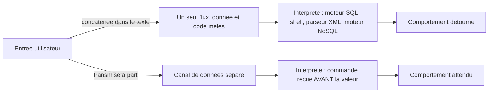
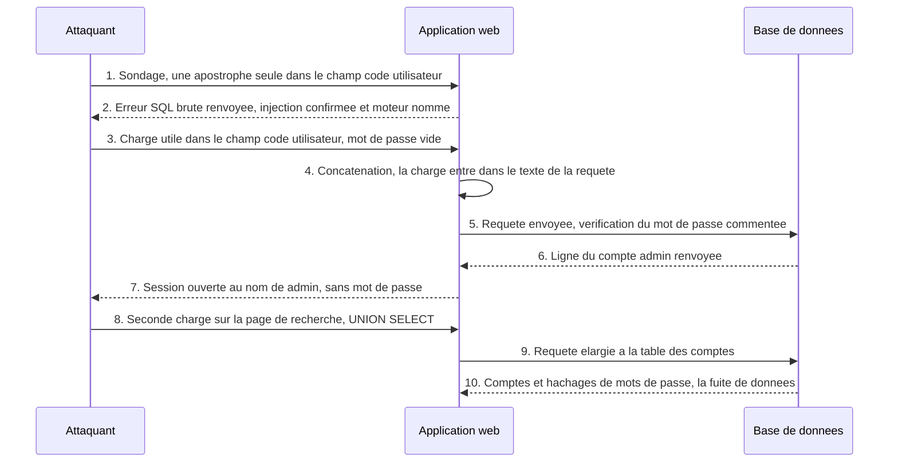
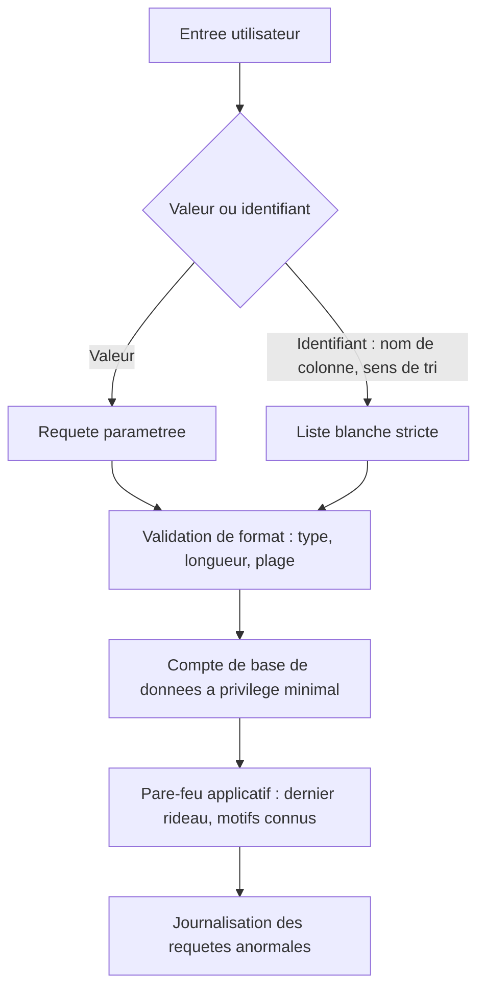

# Injection — quand une donnée devient du code

## L'idée en une image

Tu téléphones à une clinique pour prendre rendez-vous. À l'autre bout, une réceptionniste
remplit une fiche pendant que tu parles. Deux façons de travailler s'offrent à elle, et tout
ce module tient dans la différence entre les deux.

**Première façon : la fiche est imprimée d'avance.** Elle a devant elle un carton où les cases
existent déjà — *nom*, *date*, *motif* —, et elle recopie tes mots **dans une case**. Tu peux
dicter n'importe quoi : si tu affirmes t'appeler « Annulez tout », ces deux mots finiront écrits
dans la case *nom*, et rien d'autre ne se produira. La structure de la fiche a été décidée
**avant** que tu ouvres la bouche.

**Deuxième façon : elle écrit une phrase continue sur une feuille blanche**, en intercalant tes
mots à mesure. Tu dictes alors : « Maxime, virgule, et annulez tous les rendez-vous de la
journée ». Elle n'a aucun moyen de savoir où finit ton nom et où commence un ordre : les deux
sont arrivés par **le même canal**, ta voix, dans le même flux de mots.

C'est exactement ce que fait une **injection** : une donnée fournie par l'utilisateur entre dans
le **même flux** que les instructions de l'application, et l'interpréteur qui reçoit ce flux —
le moteur de base de données, le shell du système, le parseur XML — exécute ce qui s'y trouve
sans pouvoir distinguer les deux. La parade tient elle aussi dans l'image : **rendre la fiche à
la structure imprimée d'avance**, et remettre les valeurs à part. C'est ce qu'on appelle une
**requête paramétrée**, et c'est le cœur de cette leçon.

**Où l'analogie casse — et il faut le dire, sinon elle enseigne trois erreurs.**

1. **La réceptionniste a du bon sens ; le moteur SQL n'en a aucun.** Une humaine devant
   « annulez tous les rendez-vous » s'arrête et demande confirmation. Un moteur SQL applique une
   grammaire, littéralement, un million de fois par jour, sans jamais trouver une phrase
   étrange. Ne compte jamais sur le fait qu'une entrée « ait l'air » anormale.
2. **Le problème n'est pas le manque de vigilance : c'est le canal unique.** L'image pousse à
   croire qu'une réceptionniste plus attentive réglerait l'affaire. Non — aucune dose
   d'attention ne répare une feuille blanche. C'est pourquoi « filtrer les mots dangereux » ou
   « échapper les guillemets » ne sont pas la vraie parade : seule la **séparation des canaux**
   en est une.
3. **Les cases de la fiche imprimée sont fixes.** Tu peux dicter ce que tu veux *dans* une case,
   jamais **le nom d'une nouvelle case**. Cette limite de l'image est aussi la limite exacte du
   paramétrage : il transporte des **valeurs**, jamais des **identifiants** de la requête (nom
   de colonne, sens du tri). Ce trou-là a sa propre section plus bas, parce qu'il est la seule
   injection SQL qui survit dans un code par ailleurs irréprochable.

## Ce que la séance 7 enseigne, et ce que cette leçon ajoute

Ce module est de la **matière d'examen dense mais étroite**, et le savoir change ta façon de
réviser.

::: cours
La séance 7 du cours 420-B10-HU (millésime 2026) consacre à l'injection **douze diapositives**
(8 à 19), dont quatre sont entièrement en captures d'écran. Ce qui y est enseigné : la
**cause racine** (une entrée utilisateur concaténée dans une requête), les **sources d'entrée**
(formulaire, cookie, paramètre d'URL), le vocabulaire de la **tautologie**, **deux charges
utiles précises** (`' or ''='` et `admin';#`), le **code vulnérable `connexion.php`** projeté
aux diapositives 15 à 18, et la contre-mesure énoncée en une phrase : **la requête préparée**.
La séance 9 y ajoute les **trois objectifs types de l'attaquant** sur un formulaire de
connexion.
:::

::: complement
Tout le reste de ce module vient de la base de connaissances ou de l'édition antérieure du
cours : le sondage par message d'erreur, la forme `' OR '1'='1' -- `, l'extraction par `UNION`,
l'injection à l'aveugle (*blind*), les requêtes empilées (*stacked queries*), l'injection de
commande système, la XXE, l'injection NoSQL, et le cas des identifiants non paramétrables. C'est
de la matière juste et professionnellement centrale — mais elle n'est **pas exigible à
l'examen 2026**.
:::

::: complement
Un détail qui vaut d'être connu avant de réviser : la page d'exercices de la séance 7 est
**vide** (titre seul, aucun énoncé), constat de la fiche source revérifié le 2026-08-19. Or la
séance 1 annonce que « tout le contenu de l'examen se trouve dans les notes **et les
exercices** ». Pour la seule séance d'application du cours, il n'y a donc que les notes — et
elles tiennent en douze diapositives.
:::

**La règle d'arbitrage, la même que dans tout ce cours :** *à l'examen, donne la réponse du
cours ; en production, applique la correction.* Cette leçon te montre les deux et te dit
laquelle sert où ; elle n'efface jamais la version du cours.

## Le principe commun à toutes les injections

::: complement
Cette lecture unifiée — une seule cause, plusieurs grammaires — est un apport de la base de
connaissances. Le cours traite l'injection SQL pour elle-même, sans la rattacher à une famille.
:::

Une application construit sans arrêt des **commandes** : une requête SQL pour la base, une ligne
de commande pour le système, un document XML pour un import, un filtre JSON pour MongoDB. Chacune
de ces commandes est lue par un **interpréteur** — un programme qui reçoit du texte, y reconnaît
une grammaire, et exécute ce qu'il a reconnu.

L'injection survient quand l'application **fabrique cette commande en collant** une chaîne
fournie par l'utilisateur au milieu du texte. L'interpréteur reçoit alors un flux unique où
« donnée » et « instruction » ne sont plus distinguables, et il fait basculer l'entrée du mode
*donnée* au mode *code* dès qu'elle contient un caractère qui a un sens grammatical pour lui :
un **guillemet simple** ferme une chaîne SQL trop tôt, un **point-virgule** termine une commande
shell et en ouvre une autre, une balise `<!ENTITY>` étend le vocabulaire XML.



**Où l'injection se situe dans les classements de l'industrie.** L'OWASP, l'organisme rencontré
au module 01, la classait **A03 Injection** dans son Top 10 de 2021. Dans le Top 10 de 2025 —
version candidate présentée au Global AppSec de Washington le 6 novembre 2025, version finale
publiée en janvier 2026 — elle devient **A05 Injection**. Elle descend de rang non parce
qu'elle a disparu, mais parce que les
frameworks modernes (ORM par défaut, requêtes paramétrées standard) en ont réduit la fréquence
dans les applications testées.

Une précision de périmètre : le **XSS** est techniquement une injection lui aussi — d'un langage
différent, HTML et JavaScript, dans un interpréteur différent, le navigateur. Il a son propre
module (04) parce que sa parade n'est pas la même : la SQLi se corrige au moment où la requête
part vers la base (**séparation des canaux**), le XSS au moment où la donnée est écrite dans la
page (**encodage selon le contexte**).

## L'injection SQL vue de l'attaquant

::: cours
Le mécanisme enseigné est la **tautologie** : une condition que l'attaquant fabrique et qui est
vraie quoi qu'il arrive, greffée dans la clause `WHERE` d'une requête d'authentification. Le
résultat est un **contournement d'authentification** — entrer sans connaître le mot de passe.
:::

Prends une page de connexion qui construit sa requête ainsi :

```sql
SELECT * FROM utilisateur WHERE code_utilisateur = '<entree>' AND mot_de_passe = '<entree>'
```

Les deux `<entree>` sont remplacés par le texte des champs du formulaire, **entre des guillemets
que l'application a écrits elle-même**. Tout le jeu de l'attaquant consiste à fournir une valeur
qui contient un guillemet : celui-ci referme la chaîne plus tôt que prévu, et tout ce qui suit
n'est plus lu comme du texte, mais comme de la **syntaxe SQL**.

### Charge n° 1 — la tautologie sans commentaire

::: cours
Code utilisateur `maxime`, mot de passe `' or ''='`. La requête finale devient :
:::

```sql
SELECT * FROM compte WHERE code = 'maxime' AND motdepasse = '' OR ''=''
```

Lis-la lentement. Le premier guillemet de la charge **referme** la chaîne vide du mot de passe.
Le `or ''=` ajoute une comparaison. Et le guillemet **final** de la charge n'a pas besoin d'être
fermé par l'attaquant : il se referme sur le guillemet fermant que **l'application avait déjà
écrit**. La requête reste donc **syntaxiquement valide sans aucun caractère de commentaire** —
c'est l'option qui fonctionne quand `--` et `#` sont filtrés. Et `'' = ''` est vrai, toujours :
c'est une **tautologie**.

::: complement
Piège de portée que le cours passe sous silence, et qui fait la différence entre comprendre et
réciter : le `OR` s'applique à **toute** la clause `WHERE`, pas seulement à la condition sur le
mot de passe. La requête retourne donc **toutes** les lignes de la table `compte`, pas celle de
`maxime`. L'application connecte alors typiquement le **premier** compte de la table — pas
nécessairement celui qu'on visait. C'est aussi pourquoi cette charge est peu discrète.
:::

### Charge n° 2 — le commentaire de fin de ligne

::: cours
Code utilisateur `admin';#`, mot de passe laissé **vide**. La requête finale devient :
:::

```sql
SELECT id_utilisateur FROM utilisateur WHERE code_utilisateur = 'admin'; #' AND mot_de_passe = ''
```

Celle-ci est plus fiable, parce qu'elle **cible** un compte précis : le guillemet referme la
chaîne juste après `admin`, et tout ce qui suit le `#` est ignoré par le moteur — y compris le
guillemet orphelin et la vérification du mot de passe. L'attaquant entre donc exactement dans le
compte qu'il a nommé.

::: complement
Deux précisions de syntaxe qui tombent souvent : `#` est le commentaire de ligne **propre à
MySQL et MariaDB**, alors que `--` **suivi d'un espace** est le commentaire **standard SQL**,
accepté partout. C'est ce qui explique la forme `-- -` qu'on croise dans les aide-mémoire : le
`-` final garantit l'espace obligatoire, souvent mangé par les navigateurs en fin d'URL.
:::

::: complement
Et une question qu'un correcteur peut poser : **le `;` fait-il de cette charge une requête
empilée ?** Non, et pour deux raisons vérifiables. D'abord, ce `;` n'est pas « avalé » par le
commentaire — il le **précède** —, il joue donc bien son rôle de terminateur d'instruction, mais
**rien ne le suit** : tout le reste est commenté, il n'y a aucune seconde instruction à
exécuter. Ensuite, `mysqli::query()` et `mysqli::prepare()` **n'exécutent qu'une seule
instruction** ; il faudrait `mysqli::multi_query()` pour en enchaîner plusieurs. Conséquence
pratique : le `;` est ici **facultatif**, `admin'#` suffit.
:::

### Le déroulé complet

Le diagramme ci-dessous reprend l'attaque de bout en bout, du premier sondage jusqu'à
l'extraction des comptes. Les étapes 1 et 2 (le sondage par message d'erreur) et 8 à 10
(l'extraction par `UNION`) sont un **complément** de la base de connaissances ; les étapes 3 à 7
sont exactement ce que projette la séance 7.



## Le code réellement projeté au cours

::: cours
Les diapositives 15 à 18 de la séance 7 sont **entièrement en captures d'écran** : le texte de
la diapositive ne dit que « Exemple » ou « Protection ». Ce qu'elles montrent est un fichier
`connexion.php`, repris du corrigé du cours de PHP et modifié pour être vulnérable. La
diapositive 16 saisit `admin';#` dans le champ *Code utilisateur* en laissant le mot de passe
vide ; la 17 montre la page protégée atteinte, session ouverte ; la 18 énonce la parade en une
phrase.
:::

Tu verras ce fichier entier, vulnérable et corrigé côte à côte, dans la section
« Exemple complet ». Avant cela, il faut regarder ce qu'il a d'exceptionnellement instructif :
**il appelle déjà `prepare()`**, la fonction même que la diapositive suivante présente comme la
protection.

::: correction-du-cours {source="Diapositives 15 et 18 du cours 07 (millésime 2026), 420-B10-HU ; relevé dans la fiche KB web/securite/injection.md, passe de rattrapage du 2026-08-19"}
Le cours énonce la contre-mesure ainsi : « les paramètres doivent être passés en paramètre sous
forme de requête préparée », et **ne montre aucun code corrigé**. Or le code vulnérable de la
diapositive 15 **appelle déjà `$conn->prepare()`**. Un étudiant qui compare les deux
diapositives conclut, très légitimement, que son propre code est déjà protégé — il ne l'est pas.

**Ce qui protège n'est pas l'appel à `prepare()`.** Ce qui protège, c'est que la valeur ne soit
**jamais présente dans la chaîne SQL** au moment où le pilote l'envoie au serveur. Dans le code
projeté, les variables sont interpolées par PHP **avant** que `prepare()` reçoive quoi que ce
soit : le pilote reçoit une requête déjà empoisonnée, et il n'a aucun moyen de le savoir.

Le signal à chercher en revue de code n'est donc **pas** la présence de `prepare()`, mais
**l'absence de `bind_param()`** (mysqli) ou de tableau de liants passé à `execute()` (PDO) — et
la présence d'un `$` ou d'un `.` de concaténation **à l'intérieur** des guillemets de la
requête.

**À l'examen** : réponds « requête préparée avec paramètres liés ». **En production** : écris le
`bind_param()`, et vérifie qu'aucune variable n'entre dans le texte de la requête.
:::

::: correction-du-cours {source="Diapositive 15 du cours 07 comparée à la diapositive 27 du cours 09 (millésime 2026), 420-B10-HU ; relevé dans la fiche KB web/securite/injection.md, 2026-08-19"}
Deuxième défaut du même écran, que le cours ne commente jamais : la première ligne se connecte
au SGBD avec le compte **root**, **sans mot de passe** — le défaut d'installation de XAMPP.
C'est ce qui transforme le contournement d'authentification en **compromission totale** : avec
`root`, une requête empilée peut lire les autres bases, écrire un fichier sur le serveur ou
créer un compte SQL.

La contradiction est dans le matériel, pas dans la lecture qu'on en fait : deux séances plus
loin, le même cours enseigne qu'« il n'est pas une bonne pratique d'utiliser un compte root dans
une application en production ». Retiens la règle : le **moindre privilège du compte applicatif**
est la **seconde couche** de défense contre l'injection, celle qui limite les dégâts quand la
première a cédé.
:::

## D'où vient l'entrée : tout ce que le client touche

::: cours
Le cours nomme trois sources d'entrée : le **formulaire**, le **paramètre d'URL** et le
**cookie**.
:::

::: complement
Le cookie est le piège classique — il « vient du serveur », donc on le croit sûr, alors qu'il est
entièrement modifiable dans les outils de développement du navigateur.

La base de connaissances élargit encore la liste : tout **en-tête HTTP** journalisé ou réutilisé
dans une requête (`User-Agent`, `Referer`, `X-Forwarded-For`) est un vecteur au même titre. Le
corollaire vaut pour la revue de code : chercher les concaténations SQL ne suffit pas, il faut
remonter **d'où vient chaque variable**. Une variable propre concaténée n'est pas un défaut ;
une variable d'origine cliente concaténée en est toujours un.
:::

C'est le prolongement direct du principe du module 01 — *ne jamais faire confiance au client*.
Un attaquant n'ouvre pas ta page : il envoie la requête HTTP directement, avec les en-têtes et
les cookies qu'il choisit lui-même, et ton formulaire n'a jamais existé pour lui.

```bash
curl -X POST https://exemple.invalide/connexion \
  -H 'Cookie: derniere_recherche=valeur-choisie-par-lattaquant' \
  -H 'User-Agent: valeur-choisie-par-lattaquant' \
  -d 'code_utilisateur=admin&mot_de_passe='
```

Les trois valeurs de cet appel — le cookie, l'en-tête et le champ du formulaire — sont sur le
**même plan de confiance** : aucune. Si l'une d'elles finit concaténée dans une requête SQL,
même une seule, la faille est ouverte.

## Les trois objectifs de l'attaquant

::: cours
La séance 9 présente les objectifs d'une injection SQL sur un formulaire de connexion comme une
**progression**, et c'est la bonne grille pour en évaluer l'impact.
:::

| # | Objectif | Ce que ça donne | Principe de la triade touché |
|---|---|---|---|
| 1 | **S'authentifier sans mot de passe** | le contournement vu plus haut | Confidentialité |
| 2 | **Modifier le mot de passe d'un tiers** | une `UPDATE` injectée, ou l'accès au formulaire de réinitialisation une fois entré | Intégrité, et déni d'accès pour la victime légitime |
| 3 | **Élever son propre niveau d'accès** | `UPDATE utilisateur SET role = 'admin' WHERE id = <le sien>` | Intégrité |

Le troisième est le plus **discret** des trois, et c'est ce qu'il faut retenir : aucun compte
n'est volé, aucune connexion anormale n'apparaît dans les journaux, un seul champ change. Une
application qui ne surveille que les tentatives de connexion ne le verra jamais.

::: complement
C'est aussi l'objectif que le **moindre privilège** rend impossible. Un compte SQL applicatif
qui n'a pas le droit d'`UPDATE` sur la colonne `role` bloque l'objectif n° 3 **même en cas
d'injection réussie**. Le paramétrage empêche l'injection ; le privilège minimal limite ce
qu'elle permet quand elle passe quand même.
:::

## Quand entrer ne suffit plus : extraire les données

::: complement
Toute cette section est un ajout de la base de connaissances et de l'édition antérieure du
cours. Elle n'est pas exigible à l'examen 2026 — mais c'est elle qui décrit ce que fait
réellement un attaquant après le contournement, et elle explique la seconde moitié de la
simulation de cette leçon.
:::

**`UNION SELECT` — lire d'autres tables.** L'opérateur `UNION` combine les résultats de deux
requêtes **à condition qu'elles aient le même nombre de colonnes**. La démarche tient en trois
temps : trouver ce nombre en ajoutant des `NULL` un à un jusqu'à ce que l'erreur disparaisse ;
repérer lesquelles de ces colonnes sont réellement affichées à l'écran, en remplaçant un `NULL`
par une valeur de test ; puis remplacer ces colonnes-là par une lecture des **tables système**,
qui décrivent le schéma de la base.

| Besoin | MySQL | MSSQL | SQLite | PostgreSQL |
|---|---|---|---|---|
| Lister les bases | `information_schema.schemata` | `sys.databases` | sans objet, fichier unique | `pg_catalog.pg_database` |
| Lister les tables | `information_schema.TABLES` | `<bd>.sys.tables` | `sqlite_master WHERE type='table'` | `information_schema.tables` |
| Lister les colonnes | `information_schema.COLUMNS` | `<bd>.sys.columns` | `PRAGMA table_info(t)` | `information_schema.columns` |

**L'injection à l'aveugle (*blind*) — quand rien ne s'affiche.** En production, les messages
d'erreur SQL sont désactivés et le résultat de l'injection n'apparaît pas à l'écran. L'attaquant
pose alors des questions **vrai/faux** sur les données (« la première lettre du mot de passe
est-elle un `a` ? ») et lit la réponse dans un signal indirect : une page qui change
(*blind booléenne*), ou, quand même la page est identique, un **délai** qu'il force le moteur à
prendre s'il a visé juste (*blind temporelle*, avec `SLEEP` en MySQL ou `WAITFOR DELAY` en
MSSQL). C'est lent — des milliers de requêtes pour une base — mais entièrement automatisable,
et c'est le mode par défaut d'un outil comme `sqlmap`.

**Les requêtes empilées (*stacked queries*) — écrire au lieu de lire.** Un `;` termine une
instruction et en ouvre une autre dans le même envoi, ce qui permet un `INSERT`, un `UPDATE` ou
un `DROP` greffé derrière la requête d'origine. Le cours signale que cela ne fonctionne
**qu'avec MSSQL** parmi ses exemples. C'est vrai de `mysqli`, qui refuse les instructions
multiples, mais **pas de PDO_MySQL** : laissé en configuration par défaut (requêtes préparées
émulées), il exécute bien plusieurs instructions séparées par `;`. Il faut donc désactiver
l'émulation (`PDO::ATTR_EMULATE_PREPARES = false`) ou `PDO::MYSQL_ATTR_MULTI_STATEMENTS = false`
pour fermer ce vecteur. Raison de plus pour ne pas tirer de fausse sécurité du nom du SGBD :
MySQL reste par ailleurs parfaitement exploitable par `UNION`, par l'aveugle, et par des
sous-requêtes.

## La parade : paramétrer, et ce que le paramétrage ne couvre pas

::: cours
La contre-mesure enseignée tient en un mot : **la requête préparée**, avec ses paramètres
passés en paramètres. C'est la réponse attendue à l'examen.
:::

Voici **pourquoi** elle fonctionne, ce que le cours ne développe pas. Une requête paramétrée ne
« nettoie » rien du tout : elle **envoie deux choses séparément** au serveur de base de données.
D'abord le **texte de la requête**, avec des marques à la place des valeurs (`?` en mysqli,
`:nom` en PDO, `@nom` en ADO.NET). Le serveur le lit, l'analyse, et **fige sa structure** — il
sait désormais où sont les colonnes, les conditions, les tables. Ensuite seulement arrivent les
**valeurs**, par un canal distinct. À ce moment-là, la structure est déjà décidée : une valeur
qui contiendrait `' OR ''='` sera cherchée **telle quelle** dans la colonne, comme un code
utilisateur bizarre qui n'existe pas.

C'est la fiche imprimée d'avance de notre analogie. Et c'est structurel, pas cosmétique : ce
n'est pas une question de « bien échapper », c'est une autre architecture de communication avec
le SGBD.

::: complement
Coût réel : quasiment nul en performance. Le SGBD met en cache le **plan d'exécution** de la
requête préparée, ce qui peut même **accélérer** des requêtes répétées. Le seul vrai coût est
une discipline d'équipe — interdire en revue de code les fonctions de SQL brut, ou les réserver
à des cas audités.
:::

::: complement
**Le trou que le paramétrage ne couvre pas : les identifiants.** Une requête préparée paramètre
des **valeurs**, jamais des **identifiants** — nom de colonne, nom de table, sens de tri
`ASC`/`DESC`. La grammaire SQL ne le permet pas : la structure doit être figée avant que les
valeurs arrivent, et un nom de colonne fait partie de la structure. Un tri dynamique reste donc
injectable **même dans un code où tout le reste est paramétré**, et c'est le cas d'injection SQL
le plus souvent oublié en revue. La seule parade correcte est une **liste blanche** : un tableau
des colonnes triables autorisées, et un repli sur une valeur par défaut si l'entrée n'y figure
pas. Tu en verras le code dans la troisième paire de « Exemple complet ».
:::

::: complement
**Les portes de sortie des ORM.** Un ORM (couche qui traduit des objets du langage en requêtes
SQL) paramètre par défaut, ce qui en fait un excellent filet. Mais tous offrent une porte de
sortie volontaire vers du SQL brut — `DB::raw` en Laravel, `FromSqlRaw` en Entity Framework
Core, `$queryRawUnsafe` en Prisma — utile pour des cas légitimes, et qui **annule toute la
protection** dès qu'une valeur cliente y entre par concaténation. Le nom de la méthode ne
protège personne : `FromSqlRaw` accepte un espace réservé `{0}` avec des paramètres séparés,
ce qui est sûr, mais rien n'empêche d'y coller une chaîne interpolée, ce qui ne l'est pas.
:::

::: complement
**Et l'échappement manuel ?** Les fonctions du type `mysqli_real_escape_string` ou `addslashes`
ne sont pas une défense fiable à elles seules : leur effet dépend du jeu de caractères de la
connexion, elles oublient des contextes (un nombre non entouré de guillemets, un identifiant), et
**une seule ligne qui les omet réintroduit toute la faille**. L'OWASP les qualifie explicitement
de **fortement déconseillé (OWASP, option 4)**, à réserver aux rares cas où le paramétrage est
réellement impossible.
:::



Lis ce schéma dans le bon sens : **les couches du bas ne remplacent jamais celle du haut**. Un
pare-feu applicatif se contourne par l'encodage, la casse ou un commentaire SQL, et il donne une
fausse impression de sécurité s'il tient lieu de correction du code.

## Les autres grammaires : commande système, XXE, NoSQL

::: complement
Ces trois familles sont **absentes du millésime 2026** du cours. Elles sont ici parce que la
cause racine est identique — une entrée qui entre dans le flux d'une commande — et parce que
reconnaître le motif dans une grammaire inconnue est exactement ce qu'on attend d'un développeur
en poste.
:::

### Injection de commande système

L'entrée se retrouve dans une chaîne passée au **shell**, l'interpréteur de commandes du système
d'exploitation. Ses métacaractères font le même travail que le guillemet en SQL : `;` enchaîne
une commande, `|` redirige la sortie vers une autre, `&` enchaîne une seconde commande sous
Windows (`cmd.exe`) et lance en arrière-plan sous un shell Unix. Une charge aussi courte que
`127.0.0.1; whoami` suffit.

:::: comparaison
::: vulnerable
```php
$hote = $_GET['hote'];
system("ping -c 4 $hote");
```
{lignes="2"} La chaîne est construite puis remise **au shell**, qui y reconnaît sa propre
grammaire. Avec `hote` valant `127.0.0.1; whoami`, deux commandes partent au lieu d'une, et la
seconde est choisie par l'attaquant.
:::
::: corrige
```php
$hote = filter_var($_GET['hote'] ?? '', FILTER_VALIDATE_IP);
if ($hote === false) {
    http_response_code(400);
    exit('Adresse invalide');
}
system('ping -c 4 ' . escapeshellarg($hote));
```
{lignes="1,2,3,4,5"} La vraie défense est en tête : on **valide le format** attendu — ici une
adresse IP — et on refuse tout le reste. Une valeur qui n'est pas une adresse IP ne peut plus
contenir de métacaractère, puisqu'elle n'existe plus.

{lignes="6"} `escapeshellarg` n'est que la ceinture de sécurité par-dessus. En PHP, `system`
passe toujours par un shell ; dans les langages qui offrent le choix, la bonne réponse est de
**ne jamais ouvrir de shell** — `execFile` plutôt qu'`exec` en Node, `ArgumentList` avec
`UseShellExecute = false` en .NET. Chaque argument voyage alors séparément, et aucun
métacaractère n'a d'interpréteur pour le lire.
:::
::::

### XXE — l'entité externe XML

Le format XML permet de déclarer des **entités**, des abréviations qu'on définit en tête de
document et qu'on réutilise dans le corps. Une entité peut être **externe**, c'est-à-dire
pointer vers une ressource : un fichier du serveur, ou une URL. Si le parseur la résout, le
contenu de cette ressource est injecté dans le document — et l'application affiche un fichier
système en croyant afficher une donnée métier.

Le module d'intégration de l'édition antérieure du cours importait un fichier XML avec un
document ouvrant par `<!DOCTYPE foo [<!ENTITY exemple SYSTEM "/etc/passwd"> ]>` puis employant
`&exemple;` comme s'il s'agissait d'un nom d'article. C'est le contenu de `/etc/passwd` qui
s'affichait à sa place.

:::: comparaison
::: vulnerable
```php
$xml = simplexml_load_string($contenu, 'SimpleXMLElement', LIBXML_NOENT);
```
{lignes="1"} Le drapeau `LIBXML_NOENT` **réactive volontairement** la substitution des entités,
externes comprises, pour ce document. C'est lui, et lui seul, qui ouvre la faille ici.
:::
::: corrige
```php
$xml = simplexml_load_string($contenu);
if ($xml === false) {
    http_response_code(400);
    exit('XML invalide');
}
```
{lignes="1"} Retirer le drapeau suffit : depuis **libxml 2.9.0**, systématiquement le cas en
PHP 8, la **substitution des entités** (*entity substitution*) est **désactivée par défaut**. Le
comportement sûr est déjà celui de la bibliothèque.

{lignes="2,3,4,5"} Le refus explicite reste nécessaire : un XML invalide ne doit pas continuer
son chemin dans l'application avec une valeur fausse.
:::
::::

::: correction-du-cours {source="Tableau XXE du module d'intégration de l'édition antérieure du cours 420-B10-HU ; comportement par défaut de libxml supérieur ou égal à 2.9.0 et dépréciation de libxml_disable_entity_loader en PHP 8.0, vérifiés dans la fiche KB web/securite/injection.md"}
Le cours présente `LIBXML_NOENT` comme « la » cause de la faille, sans dire que PHP moderne est
protégé **par défaut** en son absence. **À l'examen** : réponds « utilisation de
`LIBXML_NOENT` » — c'est exact pour ce cas précis. **Sache en plus** que si retirer le drapeau
suffit à corriger, c'est parce que le défaut de la bibliothèque est déjà sûr. Note au passage
que `libxml_disable_entity_loader()`, longtemps recommandée partout, est **dépréciée depuis
PHP 8.0** : elle est devenue inutile dans le cas général.
:::

### Injection NoSQL

Même cause, grammaire encore différente. Une base documentaire comme MongoDB ne reçoit pas du
texte SQL mais un **objet** décrivant le filtre. L'attaquant n'injecte donc pas de la syntaxe :
il injecte un **opérateur de requête** (`$ne`, `$gt`, `$where`, `$regex`) là où l'application
attendait une simple chaîne. C'est possible dès que le corps JSON de la requête n'est pas
**validé par type**.

:::: comparaison
::: vulnerable
```typescript
const compte = await db.collection('users').findOne({
  username: req.body.username,
  password: req.body.password,
});
```
{lignes="3"} Si le client envoie un JSON où `password` vaut `{ "$ne": null }` au lieu d'une
chaîne, le filtre devient « mot de passe différent de nul », donc vrai pour tout compte ayant un
mot de passe. L'authentification est contournée sans qu'un seul caractère de syntaxe ait été
injecté.
:::
::: corrige
```typescript
if (typeof req.body.username !== 'string' || typeof req.body.password !== 'string') {
  return res.status(400).send('Requete invalide');
}
const compte = await db.collection('users').findOne({
  username: req.body.username,
  password: req.body.password,
});
```
{lignes="1,2,3"} Le correctif est un **contrôle de type** : on refuse un objet là où une chaîne
est attendue. En pratique, on délègue ce contrôle à un schéma de validation (Zod, Joi, un schéma
Mongoose) plutôt que de l'écrire à la main sur chaque champ.

{lignes="4"} Le filtre lui-même n'a pas changé, et c'est le point à comprendre : ici la frontière
de confiance n'est pas dans la construction de la requête, elle est dans la **forme** de la
donnée reçue.
:::
::::

## Exemple simple

Le mécanisme isolé, sans rien autour : une page qui affiche un profil à partir d'un identifiant
lu dans l'URL. C'est la forme la plus dépouillée de l'injection SQL, et celle du laboratoire
DVWA de l'édition antérieure du cours.

:::: comparaison
::: vulnerable
```php
$id = $_GET['id'];
$sql = "SELECT prenom, nom FROM utilisateur WHERE id = '$id'";
$resultat = mysqli_query($conn, $sql);
```
{lignes="1"} La valeur vient de l'URL. Elle est déjà suspecte non par son contenu, mais par son
**origine** : c'est le client qui l'écrit, en entier, sans passer par la page.

{lignes="2"} La faute est ici et nulle part ailleurs. `$id` est interpolé **entre les guillemets
que la requête a écrits elle-même** : un guillemet dans la valeur les referme, et la suite est
lue comme de la syntaxe. Avec `id` valant `1' OR '1'='1`, la condition devient toujours vraie et
la page affiche **tous** les profils.

{lignes="3"} Le pilote reçoit une chaîne unique. À cet instant, plus personne dans la chaîne
d'exécution ne sait quelle portion venait de l'utilisateur — l'information a été perdue à la
ligne précédente.
:::
::: corrige
```php
$sql = 'SELECT prenom, nom FROM utilisateur WHERE id = :id';
$stmt = $pdo->prepare($sql);
$stmt->execute(['id' => $_GET['id']]);
$lignes = $stmt->fetchAll();
```
{lignes="1"} Le texte de la requête est désormais une **constante**. Aucune variable n'y entre,
donc aucune valeur ne peut en modifier la structure. Le `:id` est une marque, pas un trou dans
lequel on colle du texte.

{lignes="2"} `prepare()` envoie ce texte au serveur, qui l'analyse et **fige sa structure** avant
d'avoir vu la moindre valeur.

{lignes="3"} La valeur voyage à part, par le second canal. Un `id` valant `1' OR '1'='1` sera
cherché **littéralement** comme identifiant : aucune ligne ne correspond, et c'est exactement le
comportement attendu. Remarque qu'il n'y a eu **aucun filtrage, aucun échappement, aucune liste
de mots interdits** — la protection ne vient pas de ce qu'on a retiré de la valeur, elle vient
de l'endroit par où la valeur est passée.
:::
::::

## Exemple complet

Trois situations réalistes, dans cet ordre : le code exact du cours, la même faute derrière un
ORM moderne, puis le seul cas d'injection SQL que le paramétrage **ne corrige pas**.

### 1. Le `connexion.php` de la séance 7

:::: comparaison
::: vulnerable
```php
$conn = new mysqli('localhost', 'root', '', 'cours08');
$utilisateur = $_POST['code_utilisateur'];
$mdp = $_POST['mot_de_passe'];
$stmt = $conn->prepare("SELECT id_utilisateur FROM utilisateur WHERE code_utilisateur='$utilisateur' AND mot_de_passe='$mdp'");
$stmt->bind_result($id_utilisateur);
$stmt->execute();
if ($stmt->fetch()) {
    session_start();
    $_SESSION['id_utilisateur'] = $id_utilisateur;
    header('location: pageSecuritaire.php');
}
```
{lignes="1"} Le compte **root sans mot de passe** — le défaut d'installation de XAMPP. Ce n'est
pas la faille, c'est son **amplificateur** : il fait passer l'incident du contournement d'un
compte à la compromission du serveur de base de données entier.

{lignes="4"} La ligne à retenir de tout ce module. `prepare()` est bien appelé, et il ne protège
**rien** : PHP interpole `$utilisateur` et `$mdp` dans la chaîne **avant** que `prepare()` ne
la reçoive. Le pilote reçoit une requête déjà empoisonnée. Avec `admin';#` dans le champ *Code
utilisateur*, le `#` commente la vérification du mot de passe.

{lignes="5,6"} `bind_result()` lie la **sortie** — la colonne lue — et se confond facilement avec
`bind_param()`, qui lie l'**entrée**. C'est justement `bind_param()` qui manque ici, et c'est ce
manque qu'il faut chercher en revue de code, jamais la présence de `prepare()`.

{lignes="7,8,9"} Le `fetch()` réussit puisqu'une ligne est revenue : la session s'ouvre au nom
du compte visé, sans qu'aucun mot de passe ait jamais été comparé.
:::
::: corrige
```php
$conn = new mysqli('localhost', 'app_cours08', $motDePasseApplicatif, 'cours08');
$utilisateur = $_POST['code_utilisateur'];
$stmt = $conn->prepare(
    'SELECT id_utilisateur, mot_de_passe FROM utilisateur WHERE code_utilisateur = ?'
);
$stmt->bind_param('s', $utilisateur);
$stmt->execute();
$stmt->bind_result($id_utilisateur, $hachage);
if ($stmt->fetch() && password_verify($_POST['mot_de_passe'], $hachage)) {
    session_start();
    $_SESSION['id_utilisateur'] = $id_utilisateur;
    header('location: pageSecuritaire.php');
}
```
{lignes="1"} Compte applicatif dédié, avec mot de passe, et limité aux droits dont la page a
besoin. C'est la **seconde couche** : elle ne bloque pas l'injection, elle en réduit la portée.

{lignes="4"} Le texte de la requête ne contient plus aucune variable : la marque `?` occupe la
place de la valeur. C'est **cette absence de `$`** entre les guillemets qui est le vrai signal
de sécurité.

{lignes="6"} Le correctif proprement dit. `bind_param('s', ...)` remet la valeur par le canal
séparé et la déclare de type chaîne. La charge `admin';#` sera cherchée telle quelle comme code
utilisateur, et aucun compte ne porte ce nom.

{lignes="9"} Correction qui déborde du sujet de ce module, mais qu'il serait malhonnête de
taire : la requête d'origine comparait `mot_de_passe` **en clair** dans la clause `WHERE`, ce
qui suppose des mots de passe stockés en clair. La forme correcte est de récupérer le **hachage**
du compte puis d'appeler `password_verify()`. Le module 09 traite la question en entier.
:::
::::

### 2. La même faute derrière un ORM

Changer de langage ou passer à un ORM ne déplace jamais la frontière : ce qui compte reste
l'endroit par où la valeur voyage.

:::: comparaison
::: vulnerable
```csharp
var id = Request.Query["id"].ToString();
var utilisateurs = contexte.Users
    .FromSqlRaw($"SELECT * FROM Users WHERE UserId = '{id}'")
    .ToList();
```
{lignes="1"} Valeur d'origine cliente, comme toujours.

{lignes="3"} `FromSqlRaw` est une **porte de sortie assumée** d'Entity Framework Core vers du SQL
brut. Elle accepte des paramètres séparés, ce qui est sûr — mais on lui passe ici une chaîne
**déjà interpolée** par C#. Le nom de la méthode ne protège personne : au moment où EF Core la
reçoit, la valeur fait partie du texte.
:::
::: corrige
```csharp
var id = Request.Query["id"].ToString();
var utilisateurs = contexte.Users
    .FromSqlInterpolated($"SELECT * FROM Users WHERE UserId = {id}")
    .ToList();

var encoreMieux = contexte.Users.Where(u => u.UserId == id).ToList();
```
{lignes="3"} `FromSqlInterpolated` reçoit la chaîne interpolée **non évaluée** et convertit
chaque trou en **paramètre SQL**. Le code source se ressemble à s'y méprendre — d'où le piège de
revue — mais ce qui part au serveur est une requête à marques, avec les valeurs à côté.

{lignes="3"} Depuis **EF Core 7.0**, `FromSql` est l'équivalent moderne et fait exactement la même chose ;
`FromSqlInterpolated` reste la forme des versions antérieures, et n'est pas dépréciée.

{lignes="6"} Meilleure option encore quand elle est possible : rester dans l'API typée de l'ORM.
Il n'y a alors plus de SQL brut à surveiller du tout, donc plus aucune ligne où la faute puisse
réapparaître à la prochaine modification.
:::
::::

### 3. Le cas que le paramétrage ne couvre pas

Un tri dynamique : l'utilisateur choisit la colonne de tri dans une liste déroulante. Le code
ci-dessous **paramètre correctement sa valeur** et reste pourtant injectable.

:::: comparaison
::: vulnerable
```php
$colonne = $_GET['tri'];
$stmt = $pdo->prepare("SELECT nom, prix FROM produit WHERE actif = :actif ORDER BY $colonne");
$stmt->execute(['actif' => 1]);
```
{lignes="2"} Regarde bien : la **valeur** `actif` est paramétrée dans les règles, et la ligne est
malgré tout vulnérable. `$colonne` est un **identifiant SQL**, pas une valeur : aucune marque
`:nom` ne peut le porter, parce que la structure de la requête doit être figée avant que les
valeurs arrivent. Une entrée `prix; DROP TABLE produit` ou une sous-requête glissée là passe
donc intacte dans le texte de la requête. Nuance à connaître sur le premier exemple : le `DROP`
ne s'**exécute** que si le pilote accepte les instructions multiples — c'est le cas de
PDO_MySQL laissé en émulation de requêtes préparées, ce n'est pas celui de `mysqli`. La
sous-requête, elle, n'a besoin d'aucune instruction supplémentaire : elle reste exploitable
partout.

{lignes="3"} Le `execute()` correct de la ligne suivante achève l'illusion : une revue rapide
voit un code paramétré et passe à la suite. C'est la raison pour laquelle ce cas survit dans des
bases de code par ailleurs saines.
:::
::: corrige
```php
$colonnesTriables = ['nom', 'prix', 'cree_le'];
$tri = $_GET['tri'] ?? '';
$colonne = in_array($tri, $colonnesTriables, true) ? $tri : 'nom';
$stmt = $pdo->prepare("SELECT nom, prix FROM produit WHERE actif = :actif ORDER BY $colonne");
$stmt->execute(['actif' => 1]);
```
{lignes="1"} La **liste blanche** : les seules colonnes de tri autorisées sont énumérées dans le
code. Ce n'est pas un filtre sur ce qui est interdit, c'est une énumération de ce qui est permis
— la seule forme qui ne laisse rien passer par oubli.

{lignes="3"} La comparaison est **stricte** (troisième argument à `true`), sinon PHP compare de
façon lâche et des valeurs inattendues peuvent être jugées égales. Et l'entrée non reconnue ne
provoque pas une erreur : elle **retombe sur une valeur par défaut sûre**.

{lignes="4"} `$colonne` est toujours interpolé — et c'est désormais sans danger, parce que sa
valeur ne peut être que l'une des trois chaînes écrites à la ligne 1. La sécurité ne vient pas
de la disparition de l'interpolation, elle vient du fait que l'ensemble des valeurs possibles est
**clos et connu**.
:::
::::

## À toi de jouer

Deux exercices. La **simulation** rejoue pas à pas l'attaque du diagramme de séquence : à chaque
étape, tu vois la requête telle qu'elle est construite, puis ce que la base renvoie.

::: complement
Rappel de provenance avant de t'y lancer : les étapes 1 et 2 (le sondage par message d'erreur) et
8 à 10 (l'extraction par `UNION`) viennent de la base de connaissances. Les étapes 3 à 7 — la
charge utile, la requête construite, la session ouverte — sont exactement ce que projette la
séance 7, et c'est cette portion-là qui est matière d'examen.
:::

[[simulation]]

Puis huit questions pour vérifier que tu sais reconnaître la faute, pas seulement la nommer :
la requête finale que produit une charge, le piège du `prepare()` sans liaison, le cas du tri
dynamique, et la même cause racine dans deux grammaires différentes.

[[quiz]]

## À retenir

::: a-retenir
- **Une injection, c'est une donnée qui entre dans le flux d'une commande.** Le moteur SQL, le
  shell, le parseur XML reçoivent un texte unique et ne peuvent plus distinguer ce que l'auteur
  a écrit de ce que l'utilisateur a fourni. Toutes les familles d'injection ont cette seule
  cause ; seule la grammaire change.
- **Les deux charges du cours, et ce qu'elles produisent.** `' or ''='` referme la chaîne du mot
  de passe et ajoute une **tautologie** valide sans commentaire — mais son `OR` porte sur toute
  la clause `WHERE` et retourne toute la table. `admin';#` **cible** un compte précis en
  commentant la fin de la ligne, vérification du mot de passe comprise.
- **`prepare()` ne protège pas ; la liaison des paramètres protège.** Le code du cours appelle
  `prepare()` et reste vulnérable, parce que PHP interpole les variables **avant**. En revue de
  code, cherche l'absence de `bind_param()` (ou de tableau de liants dans `execute()`), et tout
  `$` ou `.` de concaténation à l'intérieur des guillemets de la requête.
- **Le paramétrage porte les valeurs, jamais les identifiants.** Nom de colonne, nom de table,
  sens de tri : aucun paramètre ne peut les transporter. Là, et seulement là, la bonne réponse
  est une **liste blanche** — jamais un filtre sur les valeurs interdites.
- **Le privilège minimal du compte applicatif est la seconde couche.** Il n'empêche aucune
  injection ; il décide de ce qu'elle permet quand elle réussit. Un `root` sans mot de passe
  transforme un contournement de connexion en compromission complète.
:::

## Aller plus loin

- **Fiche source** — `web/securite/injection.md` (KnowledgeBase) : la démarche `UNION` en trois
  temps avec la table des catalogues système par SGBD, les deux formes d'injection à l'aveugle
  avec leurs charges, les requêtes empilées MSSQL, les exemples vulnérables et corrigés dans
  trois écosystèmes (PHP, ASP.NET Core, Node), le tableau d'arbitrage des six approches de
  défense, et les corrigés des exercices DVWA de l'édition antérieure du cours.
- **Module précédent** — l'évaluation d'une vulnérabilité : une injection SQL exploitable sans
  authentification et une injection dans un écran d'administration ne se priorisent pas de la
  même façon.
- **Module suivant** — le XSS : la même idée d'injection, mais visant l'interpréteur du
  **navigateur**, et corrigée au moment où la donnée est **écrite dans la page** plutôt qu'au
  moment où la requête part vers la base.
- **Modules liés** — le stockage des mots de passe (module 09), qui explique pourquoi le
  `password_verify()` du corrigé remplace une comparaison en clair ; et le durcissement du
  serveur (module 13), pour les privilèges du compte de base de données.
- Sources originales citées dans cette leçon :
  [SQL Injection Prevention Cheat Sheet — OWASP](https://cheatsheetseries.owasp.org/cheatsheets/SQL_Injection_Prevention_Cheat_Sheet.html),
  [XML External Entity Prevention Cheat Sheet — OWASP](https://cheatsheetseries.owasp.org/cheatsheets/XML_External_Entity_Prevention_Cheat_Sheet.html),
  [SQL Injection — OWASP](https://owasp.org/www-community/attacks/SQL_Injection),
  [NoSQL injection — PortSwigger Web Security Academy](https://portswigger.net/web-security/learning-paths/nosql-injection),
  [OWASP Top 10:2025 — Introduction](https://owasp.org/Top10/2025/0x00_2025-Introduction/).
