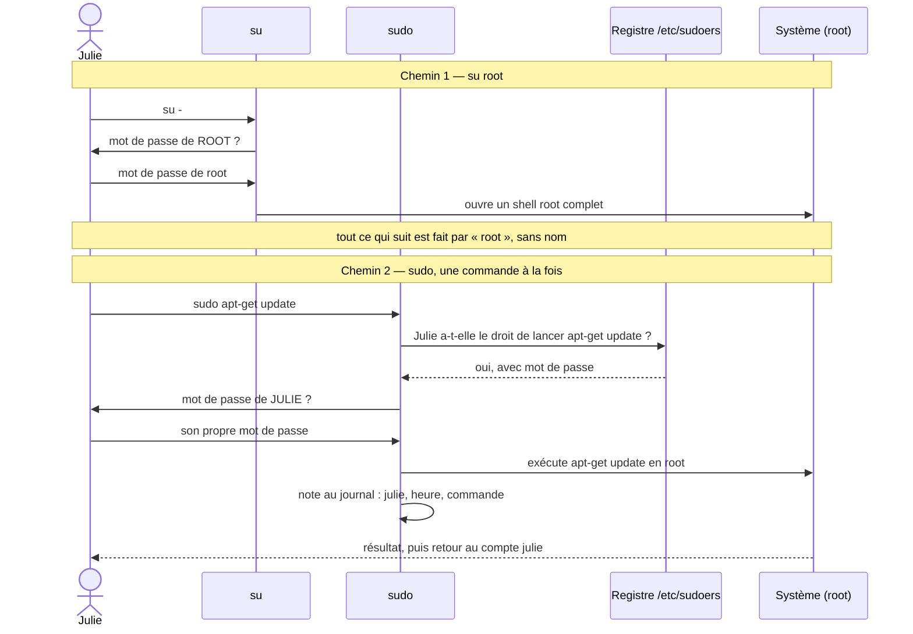
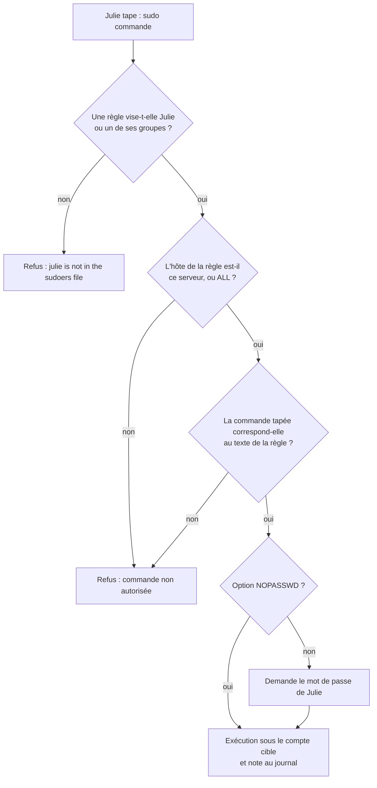

# Sécurité des utilisateurs — comptes, sudo et groupes

## L'idée en une image {diapos="1-6"}

Imagine un immeuble de bureaux. Chaque employé reçoit un **badge à son nom** : il ouvre la porte
d'entrée, l'étage de son équipe, et rien d'autre. Le **concierge**, lui, porte un passe-partout qui
ouvre absolument tout — la chaufferie, le local électrique, les bureaux de la direction.

Personne de sensé ne photocopie le passe-partout pour le distribuer. Quand un employé a besoin
d'entrer dans la chaufferie pour relever un compteur, il passe au **poste de sécurité**. Le gardien
consulte son **registre** : « Julie a-t-elle le droit d'ouvrir la chaufferie ? Seulement la
chaufferie ? Faut-il qu'elle montre son badge ? » Si le registre dit oui, le gardien ouvre la porte
pour elle — et il note l'heure et le nom dans son cahier.

Sur un serveur Linux, c'est exactement le montage :

- le **badge**, c'est le **compte utilisateur** — un par personne ;
- le **passe-partout**, c'est le compte **root**, le « super-utilisateur » qui a tous les droits ;
- le **poste de sécurité**, c'est la commande **`sudo`**, et son **registre**, c'est le fichier
  **`/etc/sudoers`** ;
- les **étages d'équipe**, ce sont les **groupes** : on donne un accès à une équipe entière plutôt
  qu'à chaque personne une par une.

**Où l'analogie casse — deux fois, et les deux comptent.**

- **Un badge ne se prête pas sans qu'on s'en aperçoive ; un mot de passe, si.** Linux ne sait pas
  qui est assis devant le clavier : il sait seulement quel compte a été ouvert. Si trois personnes
  partagent le même compte, le cahier du gardien note trois fois le même nom, et la traçabilité ne
  vaut plus rien. C'est pour cela qu'on crée **un compte par personne**, jamais un compte partagé.
- **Le gardien de l'immeuble juge ; `sudo`, lui, compare.** Un gardien humain remarquerait que Julie
  « relève le compteur » avec un chalumeau. `sudo` vérifie seulement que la commande tapée
  correspond au texte d'une règle. Une règle mal écrite peut donc autoriser bien plus que ce que son
  auteur imaginait — la section « La commande, et le piège du joker » y revient en détail.

::: cours {diapos="5, 6"}
La séance 5 du cours 420-B10-HU, « Sécurité des utilisateurs », part d'un constat : Linux offre des
mécanismes pour restreindre la lecture, la modification et l'exécution des fichiers à des groupes
d'utilisateurs définis. Elle annonce cinq volets : la gestion des comptes utilisateurs, la gestion
des comptes administrateurs, la gestion des groupes, la sécurité des accès aux fichiers et la
politique de mots de passe. **Cette leçon couvre les trois premiers** (diapositives 7 à 60). Les deux
derniers — permissions de fichiers et politique de mots de passe — sont le sujet du module suivant,
« Permissions et mots de passe ».
:::

::: cours {diapos="118"}
La diapositive 118 annonce que l'examen 1 couvre la matière des cours 1 à 4. La séance 5 n'est donc
**pas** à l'examen 1 ; elle entre dans la matière de l'examen final. Ce n'est pas une raison pour la
laisser de côté : c'est sur ces comptes, ces groupes et ces règles `sudo` que s'appuient les
permissions de fichiers du module suivant.
:::

## En bref — la marche à suivre {diapos="10, 11, 24, 26, 28, 38, 42, 57, 59, 60"}

:::: marche-a-suivre {titre="Créer des comptes, déléguer l'administration par sudo et regrouper les comptes"}

1. {voir="Créer : adduser ou useradd"} Crée le compte avec `adduser`, qui pose le répertoire
   personnel et demande le mot de passe au passage.

   ```bash
   # PuTTY, connecté en root sur le serveur Ubuntu — répertoire courant sans importance
   adduser julie
   ```

2. {voir="Changer d'identité : su et whoami"} Vérifie le compte en y basculant, puis confirme
   l'identité active avant de revenir à root.

   ```bash
   # PuTTY, en root sur le serveur Ubuntu — « exit » ramène à la session root d'origine
   su - julie
   whoami
   exit
   ```

3. {voir="Modifier et verrouiller : usermod"} Verrouille un compte qui ne doit plus servir plutôt
   que de le supprimer tout de suite.

   ```bash
   # PuTTY, en root sur le serveur Ubuntu — modifie /etc/shadow (préfixe « ! » sur le hachage)
   usermod -L julie
   ```

4. {voir="Modifier sudoers sans se fermer la porte"} Ouvre le fichier des règles sudo uniquement
   par `visudo`, qui vérifie la syntaxe avant d'enregistrer.

   ```bash
   # PuTTY, en root sur le serveur Ubuntu — édite /etc/sudoers
   visudo
   ```

5. {voir="Écrire une règle sudoers"} Écris des règles étroites — une commande nommée pour un besoin
   nommé — plutôt que `ALL`, sauf pour un vrai administrateur.

6. {voir="Donner à un compte tous les droits sudo"} Pour un vrai administrateur, ajoute son compte
   au groupe `sudo`, que le fichier sudoers d'Ubuntu autorise déjà.

   ```bash
   # PuTTY, en root sur le serveur Ubuntu — modifie /etc/group ; le -a est indispensable
   usermod -aG sudo sara
   ```

7. {voir="Les commandes des groupes"} Crée un groupe par équipe, ajoute-y les comptes, puis vérifie
   ses membres.

   ```bash
   # PuTTY, en root sur le serveur Ubuntu — modifie /etc/group
   groupadd enseignant && usermod -aG enseignant alexandre && getent group enseignant
   ```

8. {voir="Un ajout de groupe ne touche pas les sessions ouvertes"} Fais rouvrir une session au
   compte modifié avant de conclure que l'ajout de groupe « ne marche pas ».

::::

## Un compte, vu par Linux {diapos="7-9, 14"}

Tu connais déjà le compte root : c'est celui avec lequel tu te connectes en PuTTY au serveur Ubuntu
depuis le début du cours. Un **compte utilisateur**, c'est la même chose avec moins de droits : une
identité qui permet à une personne de se connecter au serveur et d'y travailler — copier des
fichiers, consulter des journaux, lancer des programmes.

Pour le système, un compte n'est pas d'abord un nom. C'est un **numéro**, l'**UID** (*user
identifier*, identifiant d'utilisateur). Le noyau de Linux ne manipule que ce numéro ; le nom
`julie` n'est qu'une étiquette, rangée dans un fichier texte, qui sert aux humains. Sur Ubuntu, les
UID inférieurs à 1000 sont réservés aux **comptes système** (ceux sous lesquels tournent des
services, comme `www-data` pour Apache), et les comptes des humains commencent à 1000.

La séance enseigne sept commandes pour gérer ces comptes : `adduser`, `useradd`, `usermod`,
`userdel`, `passwd`, `su` et `whoami`. Elles s'exécutent toutes en **root** (sauf `whoami`, et
`passwd` quand un utilisateur change son propre mot de passe) : créer ou supprimer un compte est
précisément le genre d'opération qu'un utilisateur ordinaire ne doit pas pouvoir faire.

::: note
La diapositive 9 écrit « passw » dans sa liste : la commande s'appelle `passwd`, sans « o » ni
« r » — c'est le nom historique, abrégé, de « password ».
:::

::: exercice-du-cours {ref="1"}
Tous les exercices de la séance se font sur un serveur Ubuntu tout neuf, créé chez l'hébergeur
infonuagique comme à la séance 2. Un serveur jetable a un avantage précieux ici : si une règle
`sudo` mal écrite te bloque, tu peux le détruire et recommencer sans rien perdre.
:::

### Deux fichiers, deux niveaux de secret {diapos="14"}

L'information d'un compte est rangée principalement dans deux fichiers, et leur séparation est une
mesure de sécurité à elle seule.

**`/etc/passwd`** contient les informations **générales** du compte. Il est lisible par tout le
monde, et c'est voulu : beaucoup de programmes ont besoin de traduire un UID en nom pour
l'afficher. Chaque ligne est un compte, découpé en sept champs séparés par des deux-points.

```text
# ce qu'affiche, en PuTTY sur le serveur : getent passwd julie
julie:x:1001:1001:Julie Tremblay,,,:/home/julie:/bin/bash
```

Dans l'ordre : le nom (`julie`), un `x`, l'UID (`1001`), le numéro du **groupe primaire** (`1001`,
on y revient à la section des groupes), un champ libre de description (le nom réel), le
**répertoire personnel** (`/home/julie`) et le **shell**, le programme lancé à l'ouverture de
session (`/bin/bash`).

Le `x` du deuxième champ est la clé de l'affaire : il signifie « le mot de passe n'est pas ici ».
**`/etc/shadow`** contient le **hachage** du mot de passe — le résultat d'une fonction à sens unique
qui permet de vérifier un mot de passe sans le stocker en clair. Ce fichier n'est lisible que par
root (et par le groupe système `shadow`).

```text
# ce qu'affiche, en PuTTY en root sur le serveur : getent shadow julie
julie:$y$j9T$Xk2...$...:20352:0:99999:7:::
```

Le deuxième champ est le hachage ; le préfixe `$y$` désigne l'algorithme **yescrypt**, celui
qu'Ubuntu emploie par défaut depuis sa version 22.04 (relevé dans la fiche source le 2026-08-19).
Les champs suivants portent la date du dernier changement et les règles d'expiration du mot de
passe — ils appartiennent au module suivant.

**Pourquoi deux fichiers ?** À l'origine, le hachage était rangé dans `/etc/passwd`. Comme ce
fichier est lisible par tous, n'importe quel utilisateur pouvait copier les hachages de tout le
monde et les attaquer tranquillement sur sa propre machine, par essais successifs, sans qu'aucun
journal du serveur ne le voie. Déplacer le secret dans un fichier réservé à root, c'est l'exemple le
plus court du **principe du moindre privilège** : chacun n'a accès qu'à ce dont il a besoin.

::: complement
Pour lister les comptes, `getent passwd` vaut mieux que `cat /etc/passwd` sur un serveur
d'entreprise : il interroge **toutes** les sources de comptes configurées (un annuaire LDAP ou
Active Directory, par exemple), alors que `cat` ne lit que le fichier local. Sur le serveur du
cours, qui n'a que des comptes locaux, les deux affichent la même chose. Pour ne garder que les
comptes humains : `awk -F: '$3 >= 1000' /etc/passwd`.
:::

::: exercice-du-cours {ref="9"}
Les comptes existants sont les lignes de `/etc/passwd`. Tu y verras une bonne trentaine de comptes
que tu n'as pas créés : ce sont les comptes système d'Ubuntu (UID sous 1000). Les tiens sont en fin
de fichier, à partir de l'UID 1000.
:::

## Le cycle de vie d'un compte {diapos="10-31"}

Un compte naît, change de mot de passe, sert à travailler, se fait parfois renommer ou suspendre,
et finit par disparaître. Chaque étape a sa commande.

### Créer : adduser ou useradd {diapos="10-13, 29-31"}

Ubuntu offre deux commandes pour créer un compte, et elles ne font pas du tout la même quantité de
travail.

**`adduser`** est la méthode privilégiée par le cours. C'est un assistant : il pose des questions
(mot de passe, nom réel, numéro de bureau…), crée le **répertoire personnel** dans `/home`, y copie
les fichiers de départ, et crée un groupe primaire du même nom que le compte.

```bash
# PuTTY, en root sur le serveur Ubuntu — répertoire courant sans importance
adduser julie
ls /home
```

La deuxième commande montre ce que la diapositive 13 fait remarquer : le répertoire `/home/julie`
existe, créé automatiquement.

**`useradd`** crée le compte, et c'est tout. Pas de question, pas de mot de passe ; sur Ubuntu,
pas de répertoire personnel non plus sans l'option `-m`. Tout le reste se configure à part. Pourquoi
s'en servir, alors ? Justement parce qu'il ne pose pas de questions : il se prête à un **script**
qui crée cinquante comptes d'un coup, là où `adduser` attendrait une réponse au clavier cinquante
fois.

```bash
# PuTTY, en root sur le serveur Ubuntu — la syntaxe minimale du cours, puis la forme complète
useradd marc
useradd -m -s /bin/bash marc2
passwd marc2
```

| Critère | `adduser` | `useradd` |
|---|---|---|
| Pose des questions | oui | non |
| Crée `/home/<compte>` | oui | seulement avec `-m` |
| Demande un mot de passe | oui | non : `passwd` ensuite |
| Usage type | un administrateur à la console | un script d'automatisation |

::: complement
Un compte créé par `useradd` sans `passwd` n'a **aucun mot de passe utilisable** : on ne peut pas s'y
connecter par mot de passe. C'est plus sûr qu'un mot de passe vide, mais c'est souvent la cause d'un
« le compte existe et je ne peux pas m'y connecter ». Sans `-s`, le shell est celui du réglage par
défaut de `useradd`, souvent `/bin/sh`, moins confortable que `/bin/bash`.
:::

::: exercice-du-cours {ref="2"}
Un `adduser` par personne suffit, et c'est l'occasion de voir l'assistant plusieurs fois. Si tu
veux gagner du temps, une boucle `for` sur une liste de noms avec `useradd -m -s /bin/bash`, suivie
d'un `passwd` pour chacun, fait la même chose. Sur un vrai serveur, on ne tient pas une liste des
mots de passe des autres : on pose un mot de passe provisoire et on force son changement à la
première connexion (`passwd -e <compte>`).
:::

### Poser un mot de passe : passwd {diapos="23, 24"}

`passwd` suivi d'un nom de compte change le mot de passe de ce compte. Root peut le faire pour
n'importe quel compte, sans connaître l'ancien mot de passe. Un utilisateur ordinaire, lui, tape
`passwd` seul et ne peut changer que **le sien**, après avoir fourni l'actuel.

```bash
# PuTTY, en root sur le serveur Ubuntu — met à jour le hachage dans /etc/shadow
passwd alexandre
```

La commande demande le nouveau mot de passe deux fois, sans rien afficher pendant la frappe —
aucun astérisque non plus, et c'est normal.

::: exercice-du-cours {ref="3"}
C'est un `passwd` suivi du nom du compte, lancé en root. Le mot de passe imposé par l'énoncé est
faible exprès : garde-le en tête, parce que la politique de qualité des mots de passe du module
suivant existe précisément pour refuser ce genre de choix.
:::

### Changer d'identité : su et whoami {diapos="25-28"}

**`su`** veut dire *switch user*, « changer d'utilisateur ». Il remplace, dans ta fenêtre PuTTY,
l'identité avec laquelle tu travailles, sans fermer la connexion. Il demande le mot de passe **du
compte visé** — sauf si tu pars de root, qui n'a jamais besoin de le fournir.

**`whoami`** (*who am I*, « qui suis-je ») affiche le compte actif. C'est redondant avec l'invite de
commande, qui commence normalement par le nom du compte (`julie@serveur:~$`), mais `whoami` ne ment
pas quand l'invite a été personnalisée.

```bash
# PuTTY, en root sur le serveur Ubuntu — chaque « exit » referme une couche de su
whoami
su - julie
whoami
exit
whoami
```

Les trois `whoami` affichent `root`, puis `julie`, puis de nouveau `root`. `su` n'ouvre pas une
nouvelle connexion : il empile une session par-dessus l'autre, et `exit` la dépile.

::: complement
**`su julie` et `su - julie` ne font pas la même chose.** Avec le tiret, `su` ouvre une session
complète, comme une vraie connexion : il se place dans `/home/julie` et charge l'environnement de
Julie. Sans le tiret, tu deviens Julie mais tu restes dans le répertoire courant, avec une partie de
l'environnement précédent. Pour tester un compte « comme si Julie se connectait », prends le
tiret. Les deux formes, elles, chargent les groupes à jour du compte visé : `su` les relit à chaque
bascule, avec ou sans tiret, point sur lequel la section des groupes reviendra.
:::

::: exercice-du-cours {ref="4"}
Pars de root : `su` suivi du nom de ton compte ne te demandera alors aucun mot de passe. L'invite
de commande change de nom et le `#` final devient un `$`, le signe d'un compte ordinaire.
:::

::: exercice-du-cours {ref="5"}
`whoami` doit afficher ton nom de compte. Pour revenir à root, il ne faut pas refaire un `su` (il
te demanderait le mot de passe de root, qu'un serveur infonuagique n'a souvent même pas) : il suffit
de fermer la couche ouverte par `su`, avec `exit`.
:::

### Modifier et verrouiller : usermod {diapos="15-19"}

**`usermod`** modifie un compte existant. La séance lui donne trois usages : changer le nom,
verrouiller ou déverrouiller, et gérer les groupes (vus plus loin).

**Renommer** un compte :

```bash
# PuTTY, en root sur le serveur Ubuntu — syntaxe : usermod -l <nouveau_nom> <ancien_nom>
usermod -l juliette julie
```

::: complement
`usermod -l` ne change **que** le nom de connexion. Le répertoire personnel reste `/home/julie` et
le groupe primaire s'appelle toujours `julie`. Pour tout aligner : `usermod -d /home/juliette -m
juliette` déplace le répertoire, et `groupmod -n juliette julie` renomme le groupe. L'UID, lui, ne
bouge pas — et c'est lui qui compte pour les fichiers, donc Juliette garde tout ce que Julie
possédait.
:::

**Verrouiller** un compte empêche de s'y connecter par mot de passe, sans rien effacer :

```bash
# PuTTY, en root sur le serveur Ubuntu — modifie le champ du hachage dans /etc/shadow
usermod -L julie
usermod -U julie
```

`-L` (*lock*) verrouille, `-U` (*unlock*) déverrouille. Comme le précise la diapositive 18, le
verrou rend en réalité **le mot de passe inutilisable** : `usermod -L` place un `!` devant le
hachage dans `/etc/shadow`, si bien qu'aucun mot de passe tapé ne peut plus correspondre. Le compte
existe toujours, ses fichiers aussi, et root peut toujours y entrer par `su`, puisque root n'a
jamais besoin du mot de passe.

::: correction-du-cours {source="Page de manuel usermod(8), option -U : « Unlock a user's password »" diapos="18"}
La diapositive 18 décrit les deux options par le même mot : « usermod -L : Vérouiller le compte
(Lock) » et « usermod -U : Vérouiller le compte (Unlock) ». La parenthèse dit juste : **`-U`
déverrouille**. C'est une coquille de copier-coller, sans conséquence si on lit la parenthèse.
:::

::: complement
**Le verrou porte sur le mot de passe, pas sur toutes les portes.** Si le compte possède une clé
SSH dans `~/.ssh/authorized_keys`, `usermod -L` seul ne l'empêche pas forcément d'entrer par cette
clé : la page de manuel usermod(8) d'Ubuntu 24.04 recommande, pour verrouiller le compte lui-même,
de lui poser aussi une date d'expiration dépassée (« you should also set the EXPIRE_DATE to 1 »,
soit `usermod -e 1 julie`). Sur le serveur du cours, où les comptes
créés n'ont pas de clé, `-L` suffit. Pour vérifier l'état d'un compte : `passwd -S julie` affiche
`L` (verrouillé) ou `P` (mot de passe actif) en deuxième colonne.
:::

La diapositive 19 fait la démonstration dans le bon ordre, et il vaut la peine de comprendre
pourquoi : on verrouille Julie **en root**, puis on bascule sur un **autre** compte ordinaire,
Alex, **pour perdre les droits de root**, et c'est depuis Alex qu'on tente `su julie`. Tester depuis
root ne prouverait rien, puisque root entre partout sans mot de passe.

::: exercice-du-cours {ref="6"}
Même démarche que la diapositive 19 : le verrou se pose en root, le test se fait depuis un compte
ordinaire. Le refus attendu est un `su: Authentication failure` après la saisie du mot de passe —
le mot de passe n'est pas « faux », il ne peut simplement plus correspondre à rien. Un seul `exit`
te ramène ensuite à root : le `su` refusé n'a ouvert aucune couche.
:::

### Supprimer : userdel {diapos="20-22"}

**`userdel`** supprime un compte. Ajoute l'option `-r` pour supprimer en même temps son répertoire
personnel ; sans elle, `/home/julie` reste sur le disque, orphelin.

```bash
# PuTTY, en root sur le serveur Ubuntu — retire le compte de /etc/passwd et /etc/shadow
userdel -r julie
```

La suppression peut échouer si le compte a encore des **processus actifs** — par exemple une
session PuTTY encore ouverte à son nom. Le cours propose deux sorties : redémarrer le serveur puis
supprimer le compte sans s'y connecter entre-temps, ou tuer les processus avec `kill -9 <PID>`, en
laboratoire seulement, parce qu'un arrêt brutal peut laisser le système dans un état instable.

::: note
Les diapositives écrivent parfois une commande avec une majuscule initiale (« Kill -9 »,
« Groupadd », « Usermod ») : vraisemblablement la majuscule automatique en début de phrase. Linux
distingue les majuscules des minuscules, et `Kill` n'existe pas. Tape toujours les commandes en
minuscules. Même prudence avec les tirets : un copier-coller depuis une diapositive peut rapporter
un tiret long (`–L`) au lieu du tiret simple (`-L`), et la commande refuse alors l'option.
:::

::: complement
**Le piège de `userdel` : le compte part, ses fichiers restent ailleurs.** `-r` n'efface que le
répertoire personnel. Ce que Julie avait écrit dans `/var/www` ou `/srv` reste sur le disque, au
nom de son **UID** (1001), et `ls -l` affiche alors un nombre au lieu d'un nom. Le jour où un
nouveau compte reçoit l'UID 1001, il **hérite** de tous ces fichiers. Deux réflexes :
`find / -uid 1001 -not -path "/proc/*" 2>/dev/null` **avant** la suppression, et, quand quelqu'un
quitte l'équipe, verrouiller d'abord et supprimer plus tard. Pour les processus, `pkill -u julie`
vise tous ceux d'un compte d'un coup, sans chercher chaque PID.
:::

## Les comptes administrateurs : root, su et sudo {diapos="32-37"}

Jusqu'ici, tout s'est fait en root, et root n'a jamais rencontré de refus. C'est normal : root est
le **super-utilisateur** (*superuser*), conçu pour avoir tous les privilèges sur le système.

Un compte ordinaire, lui, se heurte à un mur dès qu'il touche au système. La diapositive 35 le
montre avec `apt-get`, le gestionnaire de paquets : Julie tente une installation et se fait
refuser l'accès, parce qu'installer un logiciel modifie des répertoires qui n'appartiennent qu'à
root.

On veut pourtant **déléguer** certaines de ces tâches à des comptes ordinaires, sans leur donner le
mot de passe de root. C'est le rôle de **`sudo`**, *super user do*, « le super-utilisateur fait » :
on place `sudo` devant une commande, et elle s'exécute avec les droits de root — **si** une règle
l'autorise.

```bash
# PuTTY, connecté sous le compte julie sur le serveur Ubuntu — sans règle sudo pour elle
apt-get install apache2
sudo apt-get install apache2
```

La première ligne est refusée faute de droits. La seconde demande le mot de passe **de Julie**, puis
est refusée à son tour, avec un message indiquant que Julie ne figure pas dans le fichier
`sudoers` : c'est la situation de la diapositive 37. `sudo` n'est pas un laissez-passer : c'est un
guichet, et le guichet consulte un registre.

```text
# ce qu'affiche, sous le compte julie, la seconde commande (sudo 1.9.15p5 d'Ubuntu 24.04 ;
# les versions plus anciennes ajoutaient « This incident will be reported. »)
[sudo] password for julie:
julie is not in the sudoers file.
```

### Pourquoi sudo plutôt qu'une session root {diapos="34"}

`su` permet aussi de devenir root : il suffit de connaître son mot de passe. Pourquoi, alors,
préférer `sudo` ? Le diagramme ci-dessous met les deux chemins côte à côte.



Quatre différences se lisent sur ce diagramme :

1. **Le secret partagé disparaît.** `su` exige le mot de passe de root : pour que trois
   administrateurs s'en servent, il faut que trois personnes le connaissent. `sudo` demande à chacun
   **son propre** mot de passe.
2. **La traçabilité est nominative.** `sudo` note chaque commande privilégiée avec le nom du compte
   qui l'a lancée. Après `su`, le système ne voit plus que « root ».
3. **Le privilège est ponctuel.** `sudo` élève **une** commande, puis on redevient Julie. Une session
   root reste ouverte jusqu'à `exit`, et la moindre faute de frappe y a des droits complets.
4. **Le retrait est chirurgical.** Pour retirer ses droits à un seul administrateur, on retire sa
   règle ou son groupe ; avec un mot de passe root partagé, il faut changer le mot de passe et le
   redistribuer à tous les autres.

**Où la comparaison s'arrête.** `sudo` n'est pas une protection magique : un compte à qui une règle
donne `ALL` est aussi puissant que root, et `sudo -i` ou `sudo su -` ouvrent une session root
complète tout aussi bien que `su`. Ce que `sudo` apporte, c'est un **registre** — et un registre ne
protège que s'il est rédigé avec soin.

::: complement
Sur Ubuntu, les commandes lancées par `sudo` sont journalisées dans `/var/log/auth.log` (lisible en
root ou par le groupe `adm`) : `grep sudo: /var/log/auth.log` montre qui a lancé quoi, depuis quel
terminal et dans quel répertoire. Après une authentification réussie, `sudo` ne redemande pas le mot
de passe pendant une quinzaine de minutes par défaut ; `sudo -k` oublie cette autorisation tout de
suite, utile avant de quitter son poste.
:::

::: complement
Les serveurs infonuagiques du cours se connectent directement en root, par commodité de
laboratoire. En production, on fait l'inverse : on crée un compte nominatif membre du groupe `sudo`
dès la première connexion, puis on interdit la connexion SSH directe de root (`PermitRootLogin no`).
Ce réglage appartient à la sécurisation de l'accès distant, traitée dans la fiche
« Sécurisation de l'accès distant (SSH) » de la base de connaissances.
:::

## Le fichier sudoers {diapos="38-40"}

Le registre que consulte `sudo`, c'est le fichier **`/etc/sudoers`**. Sur un Ubuntu neuf, en retirant
les commentaires, il contient notamment trois règles :

```text
# ce qu'affiche, en PuTTY en root sur le serveur : grep -v '^#' /etc/sudoers | grep ALL
root    ALL=(ALL:ALL) ALL
%admin  ALL=(ALL) ALL
%sudo   ALL=(ALL:ALL) ALL
```

La diapositive 40 les traduit ainsi : root a pleinement accès à `sudo` ; tous les membres du groupe
`admin` aussi ; tous les membres du groupe `sudo` aussi. Le `%` devant un nom signifie « un
**groupe** », pas un utilisateur. La deuxième ligne mérite une nuance : elle est conservée pour les
anciens serveurs Ubuntu, où les administrateurs étaient rangés dans un groupe `admin` ; depuis
Ubuntu 12.04, une installation neuve ne crée plus ce groupe (la ligne reste dans sudoers par
compatibilité), et c'est `sudo` qui sert.

```bash
# PuTTY, en root sur le serveur Ubuntu — interroge /etc/group
getent group sudo
getent group admin
```

La première commande affiche la ligne du groupe `sudo` (son numéro, 27 sur Ubuntu, puis ses
membres). Si la seconde n'affiche rien, le groupe `admin` n'existe pas sur ton serveur, et la ligne
`%admin` du fichier ne s'applique à personne.

### Modifier sudoers sans se fermer la porte {hors-cours}

Le cours montre le contenu de `/etc/sudoers` ; il ne dit pas comment l'ouvrir. Or c'est le point où
une simple faute de frappe coûte le plus cher : si le fichier contient une erreur de syntaxe,
**`sudo` refuse de fonctionner du tout**. Sur un serveur où l'on administre par `sudo`, plus
personne ne peut alors passer root pour réparer.

D'où la règle : on n'ouvre **jamais** `/etc/sudoers` avec un éditeur ordinaire, mais avec
**`visudo`**. Il ouvre une copie du fichier dans l'éditeur, et au moment d'enregistrer, il **vérifie
la syntaxe** ; en cas d'erreur, il refuse d'écraser le vrai fichier et demande quoi faire (`e` pour
revenir corriger).

```bash
# PuTTY, en root sur le serveur Ubuntu — édite /etc/sudoers avec contrôle de syntaxe
visudo
visudo -f /etc/sudoers.d/support
visudo -c
```

La deuxième ligne crée ou modifie un fichier **séparé** dans `/etc/sudoers.d/`, un répertoire que le
fichier principal inclut à la fin. C'est la façon propre d'ajouter ses propres règles : une règle
par besoin, dans un fichier qu'on peut retirer d'un seul geste. La troisième ligne vérifie la
syntaxe de toute la configuration sans rien ouvrir.

::: complement
Deux détails évitent des surprises avec `/etc/sudoers.d/`. Un nom de fichier contenant un point ou
finissant par `~` y est **ignoré** en silence : `support` est lu, `support.conf` ne l'est pas. Et
sur Ubuntu, `visudo` ouvre l'éditeur `nano` par défaut ; `Ctrl+O` enregistre, `Ctrl+X` quitte.
:::

### Donner à un compte tous les droits sudo {diapos="37-40"}

Pour un véritable administrateur — quelqu'un qui doit pouvoir tout faire — deux méthodes donnent le
même résultat : l'ajouter au groupe `sudo`, que la règle `%sudo ALL=(ALL:ALL) ALL` autorise déjà,
ou lui écrire une règle nominative identique, `sara ALL=(ALL:ALL) ALL`, dans un fichier de
`/etc/sudoers.d/` ouvert par `visudo -f`. La première ne touche pas au fichier sudoers, donc ne
risque aucune erreur de syntaxe ; c'est celle qu'on retient d'habitude sur Ubuntu. La seconde montre
la syntaxe que la section suivante détaille.

:::: methodes
::: methode {libelle="Par le groupe sudo" defaut}
```bash
# PuTTY, en root sur le serveur Ubuntu — modifie /etc/group ; le -a garde les autres groupes
usermod -aG sudo sara
getent group sudo
```
:::
::: methode {libelle="Par une règle nominative"}
```bash
# PuTTY, en root sur le serveur Ubuntu — ouvre /etc/sudoers.d/sara, dans lequel
# on écrit la ligne : sara ALL=(ALL:ALL) ALL
visudo -f /etc/sudoers.d/sara
```
:::
::::

Dans les deux cas, on vérifie de la même façon, en root : `sudo -l -U sara` liste ce que Sara a le
droit de faire.

::: exercice-du-cours {ref="7"}
« Toutes les permissions » correspond à la forme la plus large de la règle : tout hôte, tout compte
cible, toute commande. Les deux méthodes ci-dessus y mènent ; celle du groupe `sudo` n'oblige pas à
ouvrir le fichier.
:::

::: exercice-du-cours {ref="8"}
Bascule sur Sara avec `su - sara` (avec le tiret, pour obtenir l'environnement complet de Sara ;
ses groupes, eux, sont relus à chaque `su`). `sudo` demande alors le mot de passe **de Sara**, pas celui de root. Si l'installation
démarre, la règle fonctionne. Si tu reçois le refus « not in the sudoers file », relis la section sur
les sessions déjà ouvertes, plus bas.
:::

## Écrire une règle sudoers {diapos="41-49"}

Donner `ALL` à tout le monde serait facile, et ce serait redonner le passe-partout. Le vrai intérêt
de sudoers est de **borner** : que Marie puisse mettre à jour les paquets et rien d'autre, que Jean
puisse redémarrer Apache et rien d'autre. Une règle se compose de quatre éléments, toujours dans le
même ordre :

```text
# la forme d'une règle — ce qu'on écrit dans /etc/sudoers ou /etc/sudoers.d/<fichier>
<qui>  <hôte>=(<compte cible>)  <options>:  <commandes>
julie  ALL=(ALL)                NOPASSWD:   /usr/bin/apt-get install *
```

Le schéma ci-dessous montre comment `sudo` s'en sert quand Julie tape une commande.



Simplification : sudo demande le mot de passe avant d'annoncer un refus, et un hôte non couvert
donne un autre message, « julie is not allowed to run sudo on serveur. »

### Qui {diapos="43"}

Le premier élément désigne à qui la règle s'applique : un **utilisateur**, écrit tel quel (`alex`),
ou les **membres d'un groupe**, écrits avec un `%` devant (`%support`). Viser un groupe est presque
toujours préférable : quand quelqu'un arrive dans l'équipe, on l'ajoute au groupe, et la règle n'a
pas à changer.

### Hôte et compte cible {diapos="44, 45"}

Le deuxième élément en contient deux, sous la forme `<HÔTE>=(<COMPTE>)`.

- **L'hôte**, c'est le nom du serveur sur lequel la règle vaut (la commande `hostname` l'affiche).
  L'idée est de pouvoir copier le même fichier sudoers sur plusieurs serveurs. Sur un serveur seul,
  on écrit `ALL`.
- **Le compte cible**, entre parenthèses, c'est le compte **sous lequel** la commande s'exécutera.
  `(root)` limite à root ; `(ALL)` permet n'importe quel compte, qu'on choisit alors avec
  `sudo -u <compte>`. Dans le doute, dit le cours, `ALL=(ALL)` fonctionne.

::: complement
Le fichier d'Ubuntu écrit `(ALL:ALL)` et non `(ALL)` : la partie après le deux-points désigne les
**groupes** sous lesquels la commande peut s'exécuter (`sudo -g`). `(ALL)` seul ne permet `-g` qu'avec
un groupe dont le compte cible est membre, ce qui ne change rien pour l'usage courant. Et un compte cible n'est pas forcément root : la règle
`deploiement ALL=(www-data) /usr/bin/php` permet de lancer PHP **en tant que** `www-data`, le compte
d'Apache, sans jamais devenir root — le moindre privilège appliqué au compte cible lui-même.
:::

### Les options {diapos="46, 47"}

Les options, facultatives, ajoutent des mesures de sécurité. Chacune a son contraire, et chacune se
termine par un deux-points.

| Option | Contraire | Effet |
|---|---|---|
| `NOPASSWD` | `PASSWD` | n'exige plus (ou exige) le mot de passe de l'utilisateur à l'utilisation de `sudo` |
| `NOEXEC` | `EXEC` | interdit (ou permet) à la commande de lancer des sous-processus |
| `SETENV` | `NOSETENV` | permet (ou interdit) de modifier les variables d'environnement de la commande |

Deux options peuvent se suivre, chacune avec son deux-points : `alex ALL=(ALL) NOPASSWD: NOEXEC: ALL`.

**`NOPASSWD` n'est pas une faille en soi.** Pour un script automatisé qui doit redémarrer un service
à 3 h du matin, personne n'est là pour taper un mot de passe. Le risque apparaît quand
`NOPASSWD` est combiné à une commande **large** : quiconque obtient la session de ce compte — un
terminal laissé ouvert, une clé SSH volée — obtient alors ces droits sans aucune vérification.

::: complement
**`NOEXEC` est une protection partielle.** Il empêche un programme autorisé d'en lancer un autre (par
exemple un éditeur qui ouvrirait un shell), en s'appuyant sur un mécanisme du système qui ne
fonctionne qu'avec les programmes liés dynamiquement (sudoers(5) : « prevent a dynamically-linked
executable… »). C'est un filet utile, pas une garantie : un programme lié statiquement, ou qui
modifie directement un fichier sensible, lui échappe.
:::

### La commande, et le piège du joker {diapos="48, 49"}

Le dernier élément liste les commandes permises, **avec leur chemin complet**, séparées par des
virgules, ou `ALL` pour toutes. Le joker `*` y est accepté, mais le cours prévient : il peut
permettre de contourner des contraintes de sécurité, et n'est pas toujours recommandé.

Le chemin complet n'est pas un détail : sans lui, `sudo` ne saurait pas **quel** programme `apt-get`
autoriser, et un utilisateur pourrait placer son propre programme nommé `apt-get` ailleurs. La
commande `which apt-get` donne le chemin à écrire (`/usr/bin/apt-get`).

La diapositive 49 propose un exercice de lecture. Voici les quatre règles, et ce que chacune permet
réellement.

```text
# les quatre règles de la diapositive 49, telles qu'elles figureraient dans /etc/sudoers
alex   ALL=(ALL) NOPASSWD: ALL
bob    ALL=(ALL) NOPASSWD: /usr/bin/apt-get *
sylvie ALL=(ALL) /usr/bin/apt-get update
julie  ALL=(ALL) NOPASSWD: /usr/bin/apt-get install *
```

| Règle | Ce qu'elle dit | Ce qu'elle permet vraiment |
|---|---|---|
| `alex` | toutes les commandes, sans mot de passe | un root complet — honnête, au moins : c'est ce qu'elle annonce |
| `bob` | toute commande `apt-get`, sans mot de passe | en pratique un root complet (voir ci-dessous) |
| `sylvie` | `apt-get update` seulement, avec son mot de passe | exactement ça : rafraîchir la liste des paquets |
| `julie` | installer n'importe quel paquet, sans mot de passe | plus qu'il n'y paraît : installer, c'est exécuter en root les scripts du paquet |

Pourquoi la règle de Bob équivaut-elle à root ? Parce que beaucoup de programmes « innocents »
savent lancer un shell. `apt-get changelog` affiche un journal de modifications dans un
**visualiseur de texte**, et ce visualiseur accepte la commande `!sh`, qui ouvre un shell. Lancé par
`sudo`, ce visualiseur tourne en root, donc le shell aussi. Le même piège existe avec `vi`, `less`,
`find`, `awk`, `tar`, `git` et des centaines d'autres : le projet **GTFOBins** les
recense un par un. La règle de Sylvie, elle, n'a pas de joker : `sudo` n'accepte que la commande
exacte `apt-get update`, et toute autre forme est refusée. Celle de Julie permet d'installer
n'importe quel paquet des dépôts, et même un `.deb` qu'elle a fabriqué (`sudo apt-get install
./paquet.deb`, accepté depuis apt 1.1), dont le `postinst` s'exécute en root : un root complet.

::: complement
**Trois subtilités de la ligne de commande dans sudoers**, que le cours n'énonce pas et qui changent
le sens d'une règle. (1) Une commande **sans arguments** dans la règle (`/usr/bin/apt-get`) autorise
**tous** les arguments, exactement comme `/usr/bin/apt-get *`. (2) Une commande **avec** arguments
(`/usr/bin/apt-get update`) n'autorise que ceux-là, à l'identique. (3) Pour n'autoriser la commande
**que sans argument**, on écrit deux guillemets vides : `/usr/bin/apt-get ""`. Pour vérifier ce
qu'une règle donne vraiment, rien ne vaut `sudo -l -U <compte>`, lancé en root.
:::

Les règles qui tiennent sont celles qui nomment une commande **et** ses arguments, sur un programme
qui n'ouvre ni éditeur, ni visualiseur, ni shell : `/usr/bin/systemctl restart apache2` plutôt que
`/usr/bin/systemctl *`. Quand il faut plus de souplesse, on autorise un **script à soi**, que
l'utilisateur ne peut pas modifier, plutôt qu'un outil généraliste.

::: complement
Pour permettre de **modifier un fichier** protégé, la bonne réponse n'est pas `sudo nano` (l'éditeur
tournerait en root, avec sa commande d'ouverture de fichiers et de shell), mais **`sudoedit`**
(ou `sudo -e`) : il copie le fichier, l'ouvre dans l'éditeur avec **tes** droits ordinaires, puis
recopie le résultat. Aucun éditeur ne tourne jamais en root.
:::

## Les groupes {diapos="50-52"}

Gérer les droits personne par personne devient vite ingérable : dix enseignants, trente étudiants,
et chaque répertoire partagé à configurer quarante fois. Un **groupe** est un ensemble nommé de
comptes, auquel on attribue des droits d'un seul coup. Le cours donne deux usages : un répertoire
accessible aux seules personnes d'un groupe (le sujet du module suivant), et des commandes
d'administration réservées aux membres d'un groupe — c'est exactement ce que fait la règle
`%sudo`.

L'analogie de l'immeuble tient bien ici : un groupe, c'est un **étage d'équipe**. Donner accès à
l'étage à un nouvel employé, c'est l'inscrire dans l'équipe, pas refaire toutes les serrures. Elle
casse sur un point : dans un immeuble, on est sur un étage à la fois ; sous Linux, un compte est
membre de **plusieurs** groupes en même temps, et cumule leurs droits.

### Groupe primaire et groupes secondaires {diapos="52"}

Linux assigne toujours à un nouveau compte un **groupe primaire**. Sur Ubuntu, c'est un groupe créé
pour l'occasion, qui porte le même nom que le compte (`julie` pour Julie) : c'est ce numéro qu'on a
vu dans le quatrième champ de `/etc/passwd`. Les autres groupes du compte sont ses **groupes
secondaires** : ils lui ajoutent des profils d'accès au besoin.

Le cours décrit le groupe primaire comme le groupe d'accès « dominant » de l'utilisateur
(développeur, ressources humaines…). Techniquement, son effet concret est précis : c'est le groupe
qu'on attribue aux **fichiers que ce compte crée**. Les groupes d'équipe, eux, sont le plus souvent
des groupes secondaires.

```text
# ce qu'affiche, en PuTTY sur le serveur : id sara
uid=1003(sara) gid=1003(sara) groups=1003(sara),27(sudo)
```

`gid=` donne le groupe primaire (`sara`) ; `groups=` donne la liste complète, primaire compris,
ici avec un groupe secondaire (`sudo`).

### Les commandes des groupes {diapos="53-60"}

La séance enseigne six gestes, tous en root sauf l'affichage.

```bash
# PuTTY, en root sur le serveur Ubuntu — les groupes vivent dans /etc/group
cat /etc/group                     # tous les groupes existants
groups                             # les groupes du compte connecté
groups alexandre                   # les groupes d'un compte précis
id alexandre                       # idem, avec le groupe PRIMAIRE identifié (gid=)
groupadd enseignant                # créer un groupe
groupdel enseignant                # supprimer un groupe
usermod -aG enseignant alexandre   # ajouter un compte à un groupe
gpasswd -d alexandre enseignant    # retirer un compte d'un groupe
getent group enseignant            # afficher les membres d'un groupe
```

Remarque l'ordre des arguments, qui piège tout le monde une fois : `usermod -aG <groupe> <compte>`
nomme le groupe **d'abord**, et `gpasswd -d <compte> <groupe>` nomme le compte **d'abord**.

```text
# ce qu'affiche, en PuTTY sur le serveur : getent group enseignant
enseignant:x:1010:alexandre
```

Le dernier champ liste les membres **secondaires**. Un compte dont c'est le groupe **primaire** n'y
figure pas : pour lui, c'est `id` qui fait foi.

::: complement
`groupdel` refuse de supprimer un groupe qui est encore le groupe **primaire** d'un compte : il
faudrait d'abord supprimer le compte, ou lui donner un autre groupe primaire. Et `gpasswd -a
<compte> <groupe>` est un équivalent de `usermod -aG` qui ne peut pas, lui, retirer les autres
groupes par erreur.
:::

::: exercice-du-cours {ref="10"}
`groups` suivi du nom du compte suffit. Si Alexandre n'a encore aucun groupe secondaire, la
réponse ne contient que son groupe primaire, qui porte son propre nom : ce n'est pas une erreur.
:::

::: exercice-du-cours {ref="11"}
Trois commandes, dans l'ordre : créer le groupe, ajouter le compte (avec le `-a`), afficher les
membres. La ligne attendue se termine par `:alexandre`.
:::

### Le piège de l'option -a {diapos="59"}

L'option `-G` de `usermod` fixe la **liste des groupes secondaires**. Sans `-a` (*append*,
« ajouter »), elle **remplace** la liste entière par celle qu'on donne. C'est l'erreur la plus
coûteuse de la séance, parce qu'elle ne produit aucun message.

:::: comparaison
::: vulnerable
```bash
# PuTTY, en root sur le serveur Ubuntu — Sara est membre de sudo avant cette ligne
usermod -G enseignant sara
```
{lignes="2"} Sans `-a`, la liste des groupes secondaires de Sara devient « enseignant », et rien
d'autre. Elle perd son appartenance au groupe `sudo`, donc ses droits d'administration, sans le
moindre avertissement. Si Sara était la seule administratrice d'un serveur où root ne se connecte
pas, plus personne ne peut administrer la machine.
:::
::: corrige
```bash
# PuTTY, en root sur le serveur Ubuntu — Sara est membre de sudo avant cette ligne
usermod -aG enseignant sara
```
{lignes="2"} Avec `-a`, « enseignant » s'**ajoute** aux groupes existants : Sara reste dans `sudo`
et entre dans `enseignant`. Un `id sara` avant et après permet de le constater.
:::
::::

### Un ajout de groupe ne touche pas les sessions ouvertes {hors-cours}

Tu ajoutes Alexandre au groupe `enseignant`, et depuis sa session ouverte, `groups` ne le montre
pas. La commande n'a pas échoué : les appartenances aux groupes sont lues **à l'ouverture de
session**, puis inscrites dans les processus de cette session. Une session déjà ouverte garde
l'ancienne liste.

Le remède est de rouvrir une session : se déconnecter et se reconnecter, ou, depuis root, refaire
`su - alexandre` (avec ou sans tiret, `su` relit les groupes). `newgrp enseignant` ouvre aussi
un sous-shell avec le nouveau groupe, pour dépanner. Le même phénomène touche les services : après
avoir ajouté `www-data` à un groupe, il faut redémarrer Apache pour qu'il en tienne compte.

## Exemple simple {diapos="18, 19"}

**Le départ de Julie.** Julie quitte l'équipe vendredi. On ne supprime pas son compte tout de
suite — ses fichiers doivent être récupérés d'abord — mais elle ne doit plus pouvoir s'y connecter.
On verrouille, on vérifie depuis un compte ordinaire, et on constate l'effet dans `/etc/shadow`.

```bash
# PuTTY, en root sur le serveur Ubuntu (les deux dernières lignes se tapent l'une après l'autre,
# la dernière dans la session d'alex) — le verrou modifie /etc/shadow
usermod -L julie
passwd -S julie
grep '^julie:' /etc/shadow | cut -c1-12
su - alex
su - julie
```

Ligne par ligne :

1. Les deux lignes de commentaire situent la scène : root, sur le serveur, puis la session d'Alex.
2. `usermod -L` pose le verrou (ligne 3).
3. `passwd -S` affiche l'état du compte ; la deuxième colonne vaut `L`, *locked* (ligne 4).
4. Le début de la ligne de Julie dans `/etc/shadow` commence maintenant par `julie:!` : le `!`
   devant le hachage est le verrou lui-même (ligne 5).
5. On bascule sur Alex, un compte ordinaire, **pour perdre les droits de root** — sans quoi le test
   ne prouverait rien (ligne 6).
6. Depuis Alex, on tente d'entrer dans le compte de Julie avec son mot de passe habituel (ligne 7).

```text
# ce qu'affiche, sous le compte alex, la dernière commande
Password:
su: Authentication failure
```

Le mot de passe de Julie n'a pas changé, et pourtant il ne fonctionne plus : le hachage stocké
commence désormais par `!`, un caractère qu'aucun calcul de hachage ne produit, donc aucune saisie
ne peut plus correspondre. Le jour où Julie revient, `usermod -U julie` retire le `!`, et son ancien
mot de passe fonctionne de nouveau — rien n'a été effacé.

## Exemple complet {diapos="41, 42, 57, 59"}

**L'équipe web.** Le serveur héberge le site du département. Deux intégrateurs, Alice et Bob, doivent
pouvoir **redémarrer ou recharger Apache** après une modification de configuration, et **lire les
journaux**. Rien d'autre. Un troisième membre, Carole, arrivera le mois prochain.

**Étape 1 — un groupe par besoin, pas une règle par personne.** Carole arrivera : on veut n'avoir
qu'une ligne à taper ce jour-là.

```bash
# PuTTY, en root sur le serveur Ubuntu — crée le groupe et l'inscrit dans /etc/group
groupadd webadmins
usermod -aG webadmins alice
usermod -aG webadmins bob
getent group webadmins
```

La dernière commande doit afficher `webadmins:x:<GID>:alice,bob`.

**Étape 2 — lire les journaux sans sudo.** Lire `/var/log/apache2/` ne demande pas de devenir root :
sur Ubuntu, le groupe système `adm` a le droit de lire les journaux. On ajoute donc les deux
comptes à `adm`. C'est un droit **de lecture**, beaucoup plus étroit que n'importe quelle règle
`sudo`.

```bash
# PuTTY, en root sur le serveur Ubuntu — le groupe adm lit /var/log sans être root
usermod -aG adm alice
usermod -aG adm bob
```

**Étape 3 — la règle sudo.** C'est ici que tout se joue. Voici deux façons d'écrire la règle, et la
différence n'est pas de style.

:::: comparaison
::: vulnerable
```bash
# PuTTY, en root sur le serveur Ubuntu — écrit /etc/sudoers.d/webadmins après contrôle de syntaxe
f=$(mktemp)
printf '%s\n' '%webadmins ALL=(ALL) NOPASSWD: /usr/bin/systemctl *' > "$f"
visudo -cf "$f" && install -m 0440 "$f" /etc/sudoers.d/webadmins
rm -f "$f"
```
{lignes="3"} Le joker autorise **toute** sous-commande de `systemctl` : arrêter le pare-feu ou le
serveur SSH, activer un service de son choix au démarrage, lancer `systemctl edit`, qui ouvre un
éditeur en root, ou encore `systemctl link` sur un fichier d'unité qu'elle a écrit elle-même, dont la
commande de démarrage s'exécutera en root. Avec `NOPASSWD` en
plus, quiconque récupère la session d'Alice obtient tout cela sans rien taper. La règle annonce
« gérer Apache » et donne, en pratique, le serveur entier.
:::
::: corrige
```bash
# PuTTY, en root sur le serveur Ubuntu — écrit /etc/sudoers.d/webadmins après contrôle de syntaxe
f=$(mktemp)
printf '%s\n' '%webadmins ALL=(root) /usr/bin/systemctl restart apache2, /usr/bin/systemctl reload apache2' > "$f"
visudo -cf "$f" && install -m 0440 "$f" /etc/sudoers.d/webadmins
rm -f "$f"
```
{lignes="2"} Un fichier temporaire au nom imprévisible, créé par `mktemp`, plutôt qu'un nom fixe dans
`/tmp` : un autre compte ne peut pas l'avoir préparé à l'avance pour détourner l'écriture.

{lignes="3"} Deux commandes nommées, arguments compris : seules `restart apache2` et `reload apache2`
passent, et ni l'une ni l'autre n'ouvre de visualiseur. Le compte cible est limité à `(root)`, et le
mot de passe reste demandé : une session volée ne suffit pas.

{lignes="4"} `visudo -cf` vérifie la syntaxe du fichier **avant** qu'il n'entre en service ; `install
-m 0440` ne le met en place que si la vérification réussit, avec les droits que `sudo` exige (lecture
seule, propriété de root). Une règle mal tapée ne peut donc jamais casser `sudo`.
:::
::::

**Étape 4 — vérifier ce que la règle donne vraiment.** On ne se fie pas à ce qu'on croit avoir
écrit : on demande à `sudo`.

```bash
# PuTTY, en root sur le serveur Ubuntu — lit la configuration sudo effective pour alice
sudo -l -U alice
```

```text
# ce qu'affiche la commande précédente (extrait)
User alice may run the following commands on serveur:
    (root) /usr/bin/systemctl restart apache2, /usr/bin/systemctl reload apache2
```

**Étape 5 — le test depuis le compte d'Alice**, avec une session neuve pour que ses nouveaux groupes
soient pris en compte.

```bash
# PuTTY, en root sur le serveur Ubuntu, puis sous le compte alice après le su
su - alice
sudo systemctl reload apache2
sudo systemctl stop ssh
```

La première commande `sudo` demande le mot de passe d'Alice et recharge Apache. La seconde est
refusée : `stop ssh` ne correspond à aucune règle. C'est le comportement voulu.

**Le mois suivant**, l'arrivée de Carole se règle en deux lignes — `usermod -aG webadmins carole` et
`usermod -aG adm carole` — sans toucher au fichier sudoers. Et le jour où Bob quitte l'équipe,
`gpasswd -d bob webadmins` lui retire ses droits pour toute nouvelle session ; une session de Bob
encore ouverte garde le groupe jusqu'à sa fermeture (`pkill -u bob`). Rien ne change pour Alice ni
Carole.

## À toi de jouer {hors-cours}

Le quiz de la leçon vérifie que tu sais faire ce que les objectifs annoncent : lire une ligne de
`/etc/passwd`, prédire ce que donne un `su` après un verrouillage, et surtout **lire une règle
sudoers** pour dire ce qu'elle permet réellement — l'exercice de la diapositive 49, poussé plus loin.

[[quiz]]

Les onze exercices de la séance 5 qui portent sur cette leçon sont cités au fil du texte, là où la
notion est enseignée ; fais-les sur ton serveur jetable, dans l'ordre. Les exercices suivants, sur
le répertoire `/cegep`, les permissions et la politique de mots de passe, appartiennent au module
« Permissions et mots de passe ».

## À retenir {diapos="116"}

- **Un compte par personne, jamais de compte partagé.** Un compte, pour Linux, c'est un UID ;
  `/etc/passwd` décrit le compte et est lisible par tous, `/etc/shadow` garde le hachage du mot de
  passe et n'est lisible que par root.
- **`su` change d'identité et demande le mot de passe du compte visé ; `sudo` élève une commande et
  demande le tien.** `sudo` est préféré parce qu'il supprime le mot de passe root partagé, journalise
  au nom de chacun et n'accorde le privilège que le temps d'une commande.
- **Le fichier sudoers se lit « qui, hôte=(compte cible), options, commandes »**, s'édite uniquement
  par `visudo`, et une règle se vérifie par `sudo -l -U <compte>`.
- **Un joker ou un outil généraliste dans une règle sudo donne souvent un root complet** : nomme la
  commande et ses arguments, et préfère un programme qui n'ouvre ni éditeur, ni visualiseur, ni shell.
- **`usermod -aG`, jamais `-G` seul** : sans le `-a`, le compte perd tous ses autres groupes en
  silence. Et un changement de groupe ne vaut qu'à la session suivante.

## Aller plus loin {hors-cours}

**Dans la base de connaissances**

- `web/securite/administration-serveur-linux.md` — sections « Utilisateurs, groupes et `sudo` » et
  « Séance 5 — Sécurité des utilisateurs » : la matière de cette leçon, avec l'audit des comptes
  sans mot de passe, l'expiration des comptes (`usermod -e`) et les groupes système utiles sur un
  serveur web (`adm`, `www-data`, et `docker`, qui équivaut à root).
- `web/securite/securisation-acces-distant-ssh.md` — pour interdire la connexion SSH directe de root
  une fois qu'un compte administrateur nominatif existe.

**Sources originales**

- Les pages de manuel, consultables sur le serveur même : `man usermod`, `man useradd`,
  `man adduser`, `man sudoers` (la grammaire complète des règles, dont les options et les jokers),
  `man visudo`.
- GTFOBins, <https://gtfobins.github.io/> — le recensement, programme par programme, des façons dont
  un binaire autorisé par `sudo` permet d'ouvrir un shell ou de lire un fichier protégé. À consulter
  avant d'écrire toute règle qui nomme un outil généraliste.
