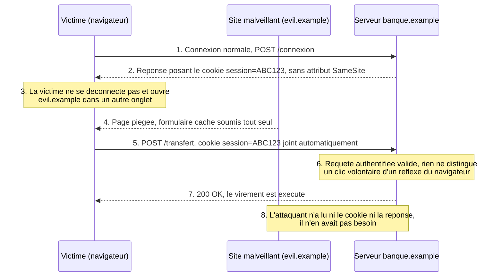
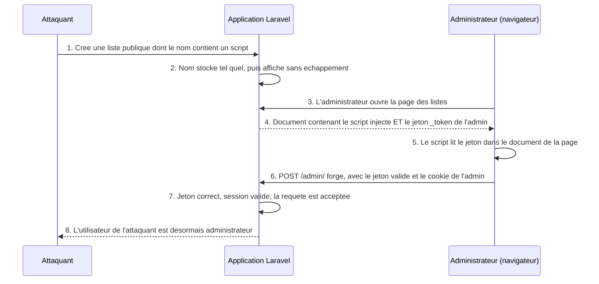
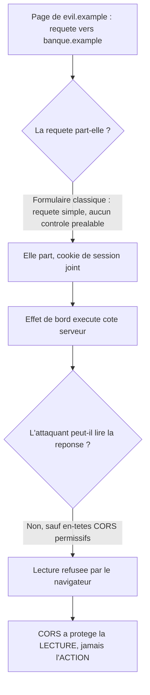
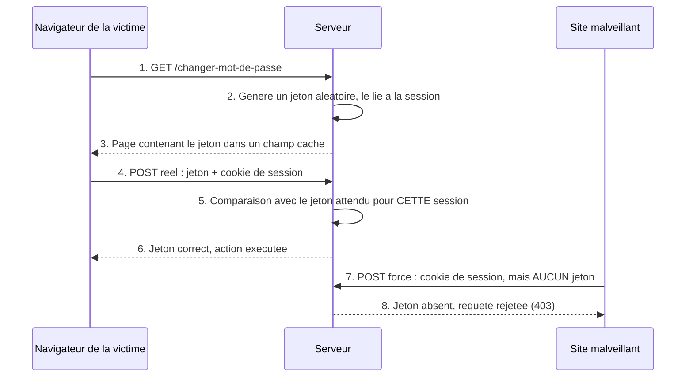
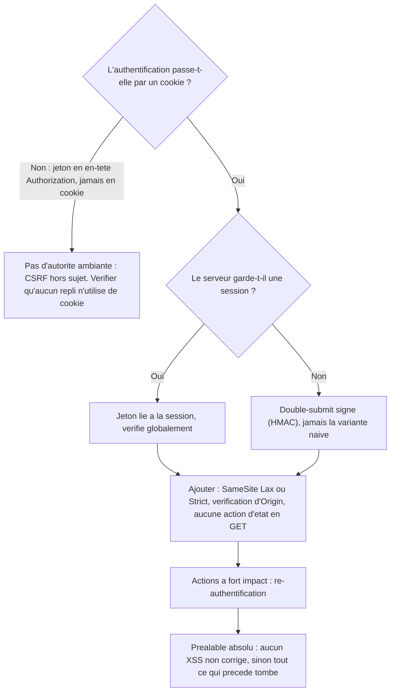

# CSRF — quand le navigateur de la victime agit à sa place

## L'idée en une image

Imagine une gestionnaire qui reçoit beaucoup de courrier et qui a confié son **sceau** à un
adjoint, avec une consigne permanente : « toute enveloppe adressée à la banque, tu y apposes mon
sceau avant de la poster ». L'adjoint est zélé et littéral. Il ne regarde jamais **qui** a écrit
la lettre — il regarde uniquement **à qui elle est adressée**. C'est tout ce que la consigne lui
demande.

Un inconnu glisse alors, sous la porte du bureau, une lettre déjà rédigée et déjà adressée à la
banque : « virez mille dollars au compte suivant ». L'adjoint la ramasse avec le reste du
courrier, y appose le sceau, la poste. À la banque, un employé reçoit un ordre scellé, en bonne et
due forme. Il exécute.

Personne n'a volé le sceau. Personne n'a imité une signature. L'inconnu n'a même pas eu besoin de
**voir** le sceau : il lui a suffi de faire écrire l'adresse au bon endroit et de laisser la
mécanique faire son travail. C'est exactement le **CSRF**, pour *Cross-Site Request Forgery* —
falsification de requête inter-sites. L'adjoint, c'est le **navigateur** de la victime ; le sceau,
c'est le **cookie de session**, ce petit fichier que le site a posé dans le navigateur au moment
de la connexion et que celui-ci renvoie ensuite à chaque requête vers ce site pour prouver « c'est
toujours moi ».

**Où l'analogie casse — trois bornes, et la troisième est le cœur du sujet.**

1. **Le sceau n'est pas fabriqué, il est recopié.** L'adjoint « signe » ; le navigateur, lui, ne
   produit rien du tout. Il rejoint un identifiant que la banque a elle-même émis. Parler de
   signature laisserait croire qu'il existe une preuve cryptographique quelque part : il n'y en a
   aucune. Il n'y a qu'une chaîne de caractères qu'on recolle sur chaque requête.
2. **L'attaquant n'attend pas de réponse.** Une lettre normale appelle un accusé de réception.
   Ici, l'inconnu ne verra jamais ce que la banque répond — et il s'en moque. Ce qu'il veut, c'est
   l'**effet de bord** : le changement d'état côté serveur. Un CSRF est une attaque en écriture,
   aveugle par construction.
3. **L'adjoint, lui, SAIT qui a glissé la lettre sous la porte.** Il ne le dit simplement pas à la
   banque. C'est la borne la plus utile de toute la leçon : le navigateur connaît parfaitement la
   page qui a déclenché la requête, et toutes les défenses modernes que tu verras plus bas
   consistent à **le lui faire dire** — soit en refusant d'envoyer le cookie hors du site
   (`SameSite`), soit en joignant l'origine de départ à la requête (`Origin`), soit en exigeant un
   secret que seule une page du site pouvait connaître (le jeton anti-CSRF).

## Le pont avec le module précédent

Au module 04, tu as établi qu'un script injecté s'exécute **avec l'origine du site vulnérable** —
c'est-à-dire avec tous les droits d'un script légitime de ce site. La question 5 du quiz de ce
module posait déjà la règle **générale** qui va nous occuper ici : **un XSS rend caduque toute
défense CSRF**. Tu l'as admise ; cette leçon la *démontre*, et l'étend **nommément** au
*double-submit* — une variante du jeton anti-CSRF, où la même valeur est déposée à la fois dans un
cookie et dans la requête, détaillée dans la partie sur les défenses. Tu comprendras au passage
pourquoi ce résultat n'est pas une exception, mais une conséquence directe de la définition même
du jeton.

Retiens dès maintenant la différence de nature entre les deux failles, parce qu'elle est la source
d'à peu près toutes les confusions :

| Critère | **XSS** (module 04) | **CSRF** (ce module) |
|---|---|---|
| Confiance trahie | celle de la **victime** envers un contenu affiché sous le nom du site | celle du **serveur** envers son propre cookie de session |
| Du code s'exécute-t-il chez la victime ? | oui, dans la page du site vulnérable | non, aucun script n'est requis dans le site ciblé |
| L'attaquant lit-il quelque chose ? | oui — DOM, cookies non `HttpOnly`, jetons affichés | non, jamais : il déclenche, il ne lit pas |
| Résultat visé | prise de contrôle de la page et de la session | une action précise, exécutée au nom de la victime |

## Ce que le cours enseigne, et ce que cette leçon ajoute

::: cours
Le CSRF appartient à la matière du cours 420-B10-HU, séance 7 — Sécurité du code. Attention
toutefois au périmètre du millésime 2026 : les diapositives de cette séance ne traitent
explicitement que l'**injection SQL** et le **XSS**. Le CSRF n'y figure qu'en filigrane, par une
seule référence bibliographique en dernière diapositive, portant sur l'ajout d'un jeton anti-CSRF
en PHP. La matière ci-dessous reste juste et elle est couverte par l'édition antérieure du cours,
mais son poids à l'examen 2026 est probablement moindre que celui de l'injection SQL et du XSS.
:::

::: cours
Les deux mises en situation détaillées plus bas viennent du cours, **édition antérieure** : le
laboratoire **DVWA** (*Damn Vulnerable Web Application*, une application volontairement trouée
servant de banc d'essai) pour le vecteur simple, et l'exercice d'intégration sur l'application
Laravel « laravulnerable » pour l'enchaînement XSS puis CSRF. Leur présence au millésime 2026
n'est **pas établie** : rien sur le site actuel du cours ne les nomme. Ce second exercice porte le
point que la fiche source désigne comme le plus important de tout le sujet.
:::

::: complement
Ce que cette leçon ajoute, et qui n'est pas exigible à l'examen 2026 : le vocabulaire
d'*ambient authority*, la sémantique des méthodes HTTP sûres de la RFC 9110, la distinction
formelle entre CSRF et vol de session, la comparaison CSRF contre CORS, et le détail des quatre
familles de défenses. C'est de la matière juste et professionnellement centrale — elle sert en
stage et en emploi, pas nécessairement le jour de l'examen.
:::

**La règle d'arbitrage, la même que dans tout ce cours :** *à l'examen, donne la réponse du
cours ; en production, applique la correction.* Cette leçon montre les deux et dit laquelle sert
où ; elle n'efface jamais la version du cours.

## Le principe : une faille de confiance, pas une faille de code

Le web repose sur un contrat implicite. Quand un navigateur envoie une requête à `banque.example`,
il joint automatiquement tout cookie posé par `banque.example`, **quelle que soit la page qui a
déclenché la requête**. Ce comportement n'est pas un bogue : c'est lui qui te permet de rester
connectée en passant d'une page à l'autre d'un site, sans ressaisir ton mot de passe à chaque
clic.

**Une réserve, à garder en tête pendant toute cette première moitié.** Ce « quelle que soit la
page » décrit le comportement d'un cookie **qui ne porte pas d'attribut `SameSite`** — ou qui
porte `SameSite=None`. Cet attribut, apparu bien après le cookie lui-même, restreint précisément
ce réflexe ; c'est l'une des défenses de la seconde moitié, où il est traité **en entier** et une
seule fois. Tous les vecteurs qui suivent supposent donc un cookie de session **sans `SameSite`**,
ce qui reste le cas de beaucoup d'applications existantes — et ce qui est de toute façon le point
de départ à comprendre avant de comprendre la parade.

Mais il ne distingue en rien deux situations que tout humain distinguerait :

- « l'utilisatrice a cliqué un bouton **sur** `banque.example` » ;
- « une page de `evil.example`, ouverte dans un autre onglet, a discrètement soumis un formulaire
  **vers** `banque.example` ».

On appelle cette propriété l'**autorité ambiante** (*ambient authority*) du cookie : l'autorité ne
vient pas de ce que l'appelant a **désigné** — il ne présente aucune preuve, il ne nomme aucun
droit — elle vient de l'**environnement** dans lequel la requête part. Le cookie est là ; sa seule
présence suffit. L'attaquant n'a donc besoin ni de le lire, ni de le connaître, ni de le voler.

Le serveur, de son côté, ne voit qu'une chose : une requête authentifiée, cookie de session valide
à l'appui. Il n'a **aucun moyen natif** de savoir si elle a été initiée volontairement par
l'utilisatrice sur le site lui-même, ou déclenchée à son insu par une page tierce. **C'est
exactement ce trou que le CSRF exploite** — et exactement ce que chaque défense vient combler, en
ajoutant à la requête une information que le simple cookie ne porte pas.



Le point à retenir : **l'attaquant ne lit jamais rien**. C'est ce qui sépare le CSRF d'un vol de
session, où l'attaquant récupère le cookie pour l'utiliser lui-même depuis sa propre machine. Ici,
le cookie ne quitte jamais le navigateur de la victime. D'où le nom : *forgery*, falsification, et
non *theft*, vol.

## Les vecteurs : comment une page tierce déclenche une requête

Deux familles, selon la méthode HTTP visée.

### Vecteur GET — le plus simple, et celui qui ne devrait jamais exister

Si une action d'état — un virement, un changement de mot de passe, une suppression — est
accessible en `GET`, une seule balise suffit. L'attaquant place dans sa page :
``.

Le navigateur charge cette « image » comme il chargerait n'importe quelle autre ressource. Il n'a
aucune notion de « ceci est en fait une action dangereuse » : il voit une URL à récupérer, il la
récupère, et il joint le cookie de session — toujours sous la réserve posée plus haut : un cookie
sans `SameSite` — parce que l'URL pointe vers `banque.example`. La
requête part **sans aucune interaction de la victime**, dès le chargement de la page piégée. Le
`style="display:none"` n'est même pas nécessaire — il sert seulement à ce que l'icône d'image
brisée ne trahisse rien à l'écran.

C'est la raison d'être de la notion de **méthodes sûres** (*safe methods*) de la RFC 9110, la
spécification actuelle de HTTP : `GET`, `HEAD`, `OPTIONS` et `TRACE` sont définies comme
**sans effet de bord observable** demandé par le client. Ce n'est pas une politesse : c'est ce qui
permet à un navigateur, à un préchargeur de liens, à un antivirus de messagerie ou à un robot
d'indexation de suivre une URL sans rien casser. Une application qui vire de l'argent sur un `GET`
a rompu ce contrat, et le CSRF n'est alors que la première mauvaise surprise d'une longue liste.

### Vecteur POST — un formulaire qui se soumet tout seul

Si l'action exige un `POST`, l'attaquant n'est pas bloqué pour autant : il lui suffit d'écrire un
formulaire caché et de le soumettre par script au chargement de sa propre page. Cette page est du
HTML tout à fait ordinaire, servie par `evil.example` :

```php
<!-- evil.example/cadeau.php — la page piegee, servie comme du HTML ordinaire -->
<body onload="document.forms[0].submit()">
  <form action="https://banque.example/transfert" method="POST" style="display:none">
    <input name="vers" value="attaquant">
    <input name="montant" value="1000">
  </form>
</body>
```

Trois remarques sur ce fragment, parce qu'elles décident de la compréhension.

**Le script est dans la page de l'attaquant, pas dans celle de la banque.** Ce `onload` s'exécute
sur `evil.example`, avec l'origine de `evil.example`. Ce n'est donc **pas** un XSS : à aucun
moment du code n'est injecté dans `banque.example`. C'est la différence que la section suivante
détaille.

**Le formulaire soumet vers une autre origine, et c'est parfaitement légal.** Le web autorise
depuis toujours un formulaire à pointer vers n'importe quel site — c'est ce qui fait fonctionner
les boutons de paiement, les recherches externes, les redirections d'authentification. Le
navigateur exécute donc la soumission sans hésiter.

**Un formulaire HTML classique est une « requête simple ».** Son type de contenu par défaut,
`application/x-www-form-urlencoded`, fait partie des trois types qui n'exigent **aucun contrôle
préalable** du navigateur (le fameux *preflight*, cette requête `OPTIONS` que le navigateur envoie
d'abord pour demander la permission). Il n'y a donc rien à contourner : la requête part
directement. On y revient à la section « CSRF vs CORS ».

Comme pour le vecteur `GET`, tout ceci suppose que le cookie de session **parte** — donc qu'il ne
porte pas de `SameSite` restrictif. Ce que cet attribut change est traité plus bas, dans la partie
sur les défenses.

## L'exemple du cours : le module CSRF de DVWA

::: cours
Le cours illustre le vecteur `GET` sur le laboratoire DVWA, en injectant une requête `fetch` dans
une page vulnérable au XSS. La charge utile vise directement le module CSRF de DVWA, dont le
formulaire de changement de mot de passe accepte ses paramètres en `GET`.
:::

Le corps de la charge tient en une ligne. L'attaquant l'enveloppe dans une balise `<script>`
qu'il fait afficher par le point d'injection XSS de DVWA :

```typescript
fetch("http://localhost/dvwa-master/vulnerabilities/csrf/?password_new=asdf&password_conf=asdf&Change=Change#");
```

Cette charge change le mot de passe de la victime **sans qu'elle voie quoi que ce soit**. Aucune
page ne se recharge, aucun formulaire n'apparaît : la réponse du serveur est simplement ignorée.
Le cookie de session DVWA de la victime est joint automatiquement par le navigateur, comme
toujours.

**Est-ce vraiment du CSRF ?** Oui, et le critère est net : ce qui en fait un CSRF, c'est que
**la même requête, émise depuis un lien reçu par courriel ou depuis une page tierce, produirait
exactement le même effet**. Le point d'injection XSS ne sert ici qu'à la **livraison** du script ;
l'attaque elle-même n'a besoin ni d'accéder au DOM, ni de lire le cookie, ni de lire la réponse —
juste d'émettre une requête. Garde ce critère en main : on s'en resservira plus bas sur l'exercice
Laravel, où la charge **devra**, elle, lire le document de la page légitime pour y prendre un
jeton. Cette requête-là ne marcherait plus depuis l'extérieur, et ce ne sera donc plus du CSRF au
sens strict.

Une conséquence de cette livraison va nous servir immédiatement : le script est injecté dans une
page **de DVWA elle-même**, servie par le même hôte. La requête qu'il émet est donc
**same-origin** — la valeur par défaut `credentials: 'same-origin'` de `fetch()` suffit à joindre
le cookie, et le navigateur inscrit dans l'en-tête `Referer` le nom d'hôte de DVWA. Depuis un vrai
site tiers, il faudrait `credentials: 'include'`, et le `Referer` nommerait l'attaquant.

**Effet des quatre niveaux de sécurité de DVWA** (l'exercice du cours) :

- **Low** : aucune vérification. La requête forgée ci-dessus réussit telle quelle.
- **Medium** : **aucun jeton**. DVWA vérifie l'en-tête `Referer` et exige que le nom du serveur y
  apparaisse — en substance, `stripos($_SERVER['HTTP_REFERER'], $_SERVER['SERVER_NAME'])`. Message
  d'échec, quand la vérification tombe : « That request didn't look correct. »
- **High** : c'est **ici seulement** qu'un jeton apparaît. DVWA compare le `user_token` reçu à
  celui qu'il a rangé en session (`$_SESSION['session_token']`). Une requête forgée depuis un site
  tiers ne peut pas le connaître — il faudrait lire la page légitime, ce que la same-origin policy
  interdit — et elle est rejetée : « CSRF token is incorrect ».
- **Impossible** : le jeton, **plus** la saisie du mot de passe actuel. C'est la
  ré-authentification, dernière défense de la partie suivante.

::: attention
**Le résultat contre-intuitif de l'exercice — et c'est lui qui vaut la peine d'être compris.** La
charge du cours est livrée **depuis DVWA elle-même**. Son `Referer` porte donc le bon nom d'hôte,
et elle **passe au niveau *Medium***. Une vérification de `Referer` n'arrête que la forge depuis un
**vrai site tiers** : elle ne voit rien venir quand l'attaquant a déjà un pied dans le site, par un
XSS. Seul le niveau *High*, avec son jeton, coupe cette charge-là — et il ne la coupe que parce
qu'un jeton demande un **secret**, pas une **provenance**.
:::

Cette gradation est en soi une leçon : trois réponses distinctes se succèdent — rien du tout, une
provenance constatée par le navigateur, puis un secret qu'il faut présenter — et chacune arrête une
classe d'attaquants différente. Retiens-la, on reprend les trois une par une dans la partie sur les
défenses. Le niveau *Medium* est d'ailleurs ton exemple vivant de la vérification d'en-tête
`Referer`, et il dit déjà pourquoi on lui préférera `Origin`.

## CSRF vs XSS — deux failles distinctes, souvent confondues

| Critère | **CSRF** | **XSS** |
|---|---|---|
| Ce qui est exploité | la confiance du **serveur** envers le navigateur authentifié de la victime | la confiance de la **victime** envers un contenu affiché comme s'il venait du site |
| Où le code malveillant s'exécute | nulle part dans le site ciblé — aucun script n'y est requis | **dans la page** du site vulnérable, avec tous les privilèges JavaScript de cette origine |
| Ce que l'attaquant obtient | un **effet de bord** précis, une action déclenchée — sans lecture de la réponse ni accès aux données | un **accès complet** au DOM, aux cookies non `HttpOnly`, aux jetons affichés en clair, et la capacité de forger n'importe quelle requête *avec* les bons jetons |
| Défense | jeton anti-CSRF, `SameSite`, vérification d'origine | encodage de sortie contextuel, CSP (module 04) |

Les deux se recoupent parce qu'un XSS — une page qui exécute du JavaScript dans le contexte du
site — peut servir de **rampe de lancement** à une attaque CSRF. C'est exactement ce que fait
l'exemple DVWA ci-dessus. Mais ce sont deux mécanismes indépendants : on peut parfaitement avoir
l'un sans l'autre, et un site sans le moindre XSS reste vulnérable au CSRF s'il n'a aucune des
défenses de la partie suivante.

### Le point le plus important de toute la leçon : un XSS contourne toute protection CSRF

::: attention
Un jeton anti-CSRF repose sur une hypothèse unique : **l'attaquant ne peut pas le connaître**.
Cette hypothèse s'effondre entièrement dès qu'un XSS existe sur la page — parce que le jeton doit,
par construction, être présent **dans le DOM** (champ caché du formulaire, ou variable
JavaScript) pour que la page légitime elle-même puisse l'envoyer. Un script injecté a accès à ce
DOM exactement comme n'importe quel autre script de la page. Il n'a qu'à le lire.
:::

C'est l'enchaînement que construit l'exercice d'intégration du cours, sur l'application Laravel
« laravulnerable ». Une page y liste des « listes » publiques dont le nom n'est **pas échappé** en
sortie. Dans Blade, le moteur de gabarits de Laravel, deux écritures cohabitent — et une seule est
sûre :

:::: comparaison
::: vulnerable
```php
@foreach ($listes as $liste)
  <li>{!! $liste->nom !!}</li>
@endforeach
```

{lignes="2"} La syntaxe `{!! ... !!}` demande explicitement à Blade d'écrire la valeur **sans
l'échapper**. Tout balisage contenu dans `nom` est donc rendu tel quel dans la page : c'est un
XSS stocké, au sens exact du module 04.
:::
::: corrige
```php
@foreach ($listes as $liste)
  <li>{{ $liste->nom }}</li>
@endforeach
```

{lignes="2"} La syntaxe `{{ ... }}` applique l'encodage de sortie HTML par défaut. La même valeur
devient du **texte affiché** : les chevrons se rendent en entités, plus aucune balise ne s'ouvre.
C'est la parade du module 04, appliquée à Blade — et c'est ici le **prérequis** de toute
protection CSRF.
:::
::::

Dans la version vulnérable, l'attaquant crée une liste dont le nom contient une balise de script.
Le corps de ce script tient en quatre lignes :

```typescript
const jeton = document.getElementsByName("_token")[0].value;
fetch("/admin/", {
  method: "POST",
  body: `_token=${jeton}&userid=2&admin=1`,
  headers: { "Content-Type": "application/x-www-form-urlencoded" },
});
```

Quand un **administrateur** consulte cette liste, le script s'exécute dans le contexte de **sa**
session, sur une page qui affiche **son** propre jeton CSRF (`_token`), comme le fait tout
formulaire Laravel légitime. Le script :

1. lit ce jeton — valide, légitime, tout frais — directement dans la page de l'administrateur ;
2. l'inclut dans une requête `POST /admin/` forgée qui élève l'utilisateur d'identifiant 2, c'est-à-dire l'attaquant, au rang d'administrateur (`admin=1`) ;
3. passe **toutes** les vérifications du serveur — jeton présent, jeton correct, cookie de session
   valide — parce que rien, du point de vue du serveur, ne distingue cette requête d'une
   soumission légitime du formulaire d'administration par l'administrateur lui-même.



**Pourquoi le jeton seul ne sert à rien ici.** Le jeton protège contre une requête forgée **depuis
l'extérieur** du site : un `evil.example` qui ne peut pas lire le document de `banque.example`,
précisément parce que la *same-origin policy* le lui interdit. Il ne protège **jamais** contre un
script qui s'exécute **à l'intérieur** de la page elle-même. À ce stade, d'ailleurs, ce n'est plus
du CSRF au sens strict, et c'est le critère posé sur l'exemple DVWA qui le dit : cette requête-ci
ne marcherait **pas** depuis un lien ou une page tierce, puisqu'il faut d'abord lire le document de
la page légitime pour y prendre le jeton. C'est un XSS qui *utilise* le mécanisme CSRF comme étape
intermédiaire.

Et c'est bien ce que posait la question 5 du quiz du module 04, sous sa forme **générale** : un XSS
rend caduque **toute** défense CSRF. Le q5 posait la règle ; cette leçon la démontre et l'étend
**nommément** au double-submit. La raison est structurelle, pas anecdotique — toute
défense qui consiste à *déposer un secret dans la page* est lisible par tout script de la page.
Corriger le XSS n'est donc pas une amélioration à planifier : c'est un **prérequis non
négociable**. Aucune quantité de jetons CSRF ne compense un XSS non corrigé.

## CSRF vs CORS — ce que CORS ne fera jamais pour toi

Dernière confusion à éliminer avant d'aborder les défenses, et elle est fréquente jusqu'en revue
d'architecture. **CORS** (*Cross-Origin Resource Sharing*, partage de ressources entre origines)
est le mécanisme par lequel un serveur autorise, ou non, du JavaScript d'une **autre** origine à
**lire** ses réponses. C'est un contrôle de **lecture**, exercé par le navigateur au moment de
rendre la réponse au script appelant.

Ce n'est **pas** un contrôle d'**envoi**. Une requête CSRF part de toute façon, et son effet de
bord se produit côté serveur avant même que la question de la lecture ne se pose. Un formulaire
HTML classique est une requête simple, sans contrôle préalable ; et l'attaquant, on l'a vu, ne
demande jamais à lire la réponse.



Autrement dit : croire que CORS protège du CSRF, c'est mettre un verrou sur la boîte aux lettres
en pensant qu'il empêche d'entrer par la porte. Les deux mécanismes ne gardent pas le même
passage. À l'inverse, une politique CORS **permissive** aggrave le sujet : elle rend lisible ce qui
protégeait le jeton et fait réussir le contrôle préalable — la défense par en-tête personnalisé
n'a alors plus aucune valeur. C'est la mise en garde de l'OWASP, et c'est le croisement décrit
juste en dessous, pris à l'envers.

Il reste toutefois un croisement utile, et il tient en une phrase : dès qu'une requête cesse
d'être « simple » — parce qu'elle porte un en-tête personnalisé, par exemple — le navigateur
déclenche un contrôle préalable que l'attaquant ne peut pas faire réussir sans la complicité du
serveur. C'est le principe sur lequel s'appuie l'une des défenses de la partie suivante.

Nous savons maintenant **pourquoi** le CSRF existe, **comment** une requête se forge, et **ce
qu'il ne faut pas confondre** avec lui. Reste la question qui intéresse la personne qui écrit du
code : quelle information ajouter à une requête pour que le serveur puisse enfin distinguer une
intention d'un réflexe. C'est l'objet de la suite.

## Les défenses : donner au serveur ce que le cookie ne dit pas

Reprenons le problème par sa formulation la plus courte. Une requête forgée arrive avec **tout ce
qu'il faut** pour être exécutée : la bonne URL, les bons paramètres, le bon cookie. Ce qui lui
manque, c'est la seule chose que le serveur voudrait connaître — **l'intention**. Or l'intention
ne voyage pas sur le réseau.

Toutes les défenses qui suivent font donc la même chose, et c'est la clé pour ne pas les
confondre : elles **ajoutent à la requête une information que le cookie ne porte pas**, et que
l'attaquant ne peut pas fabriquer. Quatre informations différentes, quatre défenses :

| La défense | L'information ajoutée | Qui la produit |
|---|---|---|
| Jeton anti-CSRF | un secret imprévisible, lié à cette session | le serveur, dans la page qu'il a servie |
| `SameSite` | « cette requête vient d'un autre site » | le navigateur |
| Vérification d'`Origin` | « voici le site qui a déclenché la requête » | le navigateur |
| Ré-authentification | « la personne est physiquement là, maintenant » | l'utilisateur |

Elles ne se remplacent pas les unes les autres, précisément parce que les quatre informations sont
distinctes. C'est pourquoi la recommandation qui revient partout est une **combinaison**, jamais un
choix.

### 1. Le jeton anti-CSRF, ou *synchronizer token pattern*

::: complement
Le mécanisme générique, son nom et la distinction avec la variante *stateless* ne sont pas dans
les diapositives du cours. Ce que le cours te fait observer, c'est son **effet** sur DVWA — voir
l'encadré plus bas. Le vocabulaire « synchronizer token » n'est donc pas exigible ; le
raisonnement, lui, l'est.
:::

**Reprenons l'image du début.** La gestionnaire ne peut pas apprendre à son adjoint à lire dans
les pensées. Elle fait autre chose : chaque matin, elle inscrit un **mot du jour** — tiré au sort,
différent chaque fois — sur les formulaires vierges qui restent dans son bureau, et donne à
l'adjoint une consigne de plus : *n'appose le sceau que sur une enveloppe qui porte le mot du
jour*. L'escroc de l'extérieur peut toujours écrire une lettre parfaitement imitée. Il ne peut pas
y écrire le mot du jour, parce qu'il n'entre pas dans le bureau.

**Où l'analogie casse, et il faut le dire :**

1. **Le mot du jour n'est pas « du jour ».** Le jeton est lié à **une session précise**, pas à une
   date : celui d'un autre utilisateur, ou celui d'une session expirée, est refusé. Deux personnes
   connectées en même temps n'ont pas le même.
2. **L'adjoint ne mémorise rien.** C'est le serveur qui conserve la valeur attendue et qui compare ;
   le navigateur, lui, ne fait que renvoyer ce qu'on lui a donné, sans rien comprendre.
3. **Quelqu'un qui est déjà DANS le bureau lit le mot du jour sur la feuille.** C'est le point
   décisif, et on y revient plus bas : c'est exactement ce que fait un script injecté.

**Le mécanisme, en trois temps.**

1. Quand le serveur sert un formulaire (ou au moment de la connexion), il **génère une valeur
   aléatoire cryptographiquement forte et unique**, et la **lie à la session** de l'utilisateur —
   c'est-à-dire qu'il la range de son côté, associée à l'identifiant de session.
2. Il **insère cette valeur dans la page** : un champ de formulaire caché, ou une valeur que le
   JavaScript de la page renverra en en-tête.
3. À la soumission, il **compare** la valeur reçue à celle qu'il attendait **pour cette session**.
   Absente, différente, ou appartenant à une autre session : la requête est rejetée avant tout
   effet de bord.



**Pourquoi l'attaquant ne peut pas fournir ce jeton.** Deux raisons cumulées, et il faut les deux.
La valeur est **imprévisible** : il ne peut pas la deviner. Et il ne peut pas non plus la **lire** :
la *same-origin policy* — cette règle du navigateur, vue au module 04, qui interdit à une page d'un
site de lire le contenu d'un autre site — l'empêche d'ouvrir la page légitime pour en extraire le
champ caché. Il peut **déclencher** la requête ; il ne peut pas en **lire** le contexte.

**Ce que le jeton arrête.** Toute requête forgée depuis un site tiers, quel que soit le vecteur :
image, lien, formulaire auto-soumis, `fetch`, iframe. C'est la défense la plus complète de la
liste, et c'est pour cette raison qu'elle est la défense **principale**.

**Ce que le jeton n'arrête pas** — quatre trous à connaître, parce que ce sont eux qu'on voit en
audit :

- **Un XSS.** Le script s'exécute dans la page où le jeton est écrit, donc il le lit. C'est
  développé plus bas.
- **Une route oubliée.** Si la vérification se pose action par action, il suffit d'en oublier une.
  La parade est structurelle : vérifier **par défaut** et non route par route (voir le code
  ASP.NET Core plus bas — avec la réserve, dite là-bas, des API minimales).
- **Un jeton qui voyage dans l'URL.** Placé en paramètre de requête, il se retrouve dans les
  journaux du serveur, dans l'historique du navigateur et, autrefois, dans l'en-tête `Referer`
  envoyé aux sites tiers. Un jeton se met dans un corps de requête ou un en-tête, jamais dans une
  URL.
- **Une comparaison naïve.** Comparer deux chaînes avec `==` fuit de l'information par le **temps**
  de comparaison ; on emploie une comparaison à temps constant (`hash_equals` en PHP).

::: cours
**L'exercice DVWA de la séance, corrigé.** En niveau *Low*, le formulaire de changement de mot de
passe de DVWA n'a **aucune vérification** : la requête `fetch` de l'exercice reproduit exactement
les paramètres attendus, le cookie part tout seul, le mot de passe change. En *Medium*, DVWA ne
pose toujours **aucun jeton** — il regarde le `Referer` ; et comme la charge de l'exercice est
livrée depuis DVWA elle-même, ce `Referer` est le bon et la requête **passe**. C'est en **High**
seulement que le `user_token` apparaît : généré côté serveur, rangé en session, attendu en champ
caché. Une requête forgée ne peut pas le connaître — il faudrait lire la page légitime, ce que la
same-origin policy interdit à un site tiers — et elle est rejetée, mot de passe inchangé.

**Le raisonnement à retenir pour l'examen**, et c'est lui qu'on te demandera de formuler : le
jeton ne change **rien** à la manière dont la requête est *envoyée* — le cookie part toujours
automatiquement. Il change ce que le serveur peut **vérifier** avant d'agir.
:::

**La variante sans état : le *double-submit cookie*.**

::: complement
Absent du cours, qui ne traite que le cas du formulaire HTML classique de DVWA. Utile dès qu'on
travaille sur une API.
:::

Le *synchronizer token* exige que le serveur **retienne** quelque chose : la valeur attendue pour
chaque session. Une API sans session côté serveur ne peut pas faire ça. La variante *double-submit*
règle le problème en dupliquant le jeton : la même valeur est posée dans un **cookie** et attendue
dans le **corps ou l'en-tête** de la requête. Le serveur compare les deux valeurs reçues, sans
avoir rien à mémoriser.

Ce qui la fait fonctionner : un site tiers déclenche bien l'envoi du cookie, mais il ne peut pas
**lire** sa valeur pour la recopier dans l'en-tête. La différence entre les deux emplacements est
donc exactement la frontière de la same-origin policy.

Ce qui la rend **moins robuste** que le jeton lié à la session : elle suppose que l'attaquant ne
peut pas **écrire** de cookie sur le domaine. Or les cookies ignorent en partie la frontière
d'origine — un sous-domaine compromis, ou loué à un tiers en hébergement partagé, peut poser un
cookie qui sera renvoyé au domaine principal. L'attaquant choisit alors **les deux** valeurs, qui
coïncident forcément. D'où les variantes **signées** (jeton chiffré ou authentifié par HMAC, lié à
la session, plutôt qu'une valeur brute dupliquée), qui sont celles à retenir pour une
implémentation sérieuse.

### 2. `SameSite` : demander au navigateur de ne pas joindre le cookie

::: complement
`SameSite` n'est **jamais nommé** dans les diapositives du cours, alors que c'est la protection la
plus largement déployée aujourd'hui — et active par défaut sur les navigateurs Chromium, comme on
va le préciser. Elle n'est pas exigible à l'examen 2026 ; elle est incontournable en emploi. Le module 11 y revient pour
l'anatomie complète du cookie.
:::

Le jeton corrige le problème **du côté du serveur**. `SameSite` s'attaque à l'autre bout : c'est un
attribut posé sur le cookie, par lequel le site demande au **navigateur** de ne pas le joindre aux
requêtes déclenchées par un autre site. Autrement dit, on ne corrige plus le réflexe après coup :
on le désactive.

```bash
Set-Cookie: session=8f2c...; Path=/; Secure; HttpOnly; SameSite=Lax
```

Trois valeurs, et une seule mérite d'être sue par cœur :

- **`Lax`** — le cookie n'est **pas** joint aux requêtes déclenchées en arrière-plan depuis un autre
  site : image, `fetch`, iframe, formulaire auto-soumis en POST. Il **est** joint sur une
  **navigation de premier niveau en GET**, c'est-à-dire quand l'utilisateur clique un lien externe
  et que la page du site s'ouvre dans l'onglet. C'est le défaut dans les navigateurs **Chromium**
  depuis 2020 (Chrome 80) — **mais pas dans Firefox ni Safari** : Mozilla a explicitement renoncé
  à l'activer par défaut, et sans attribut Firefox traite le cookie comme `None`. L'attribut se
  pose donc **explicitement** ; on ne compte jamais sur le défaut. (Vérifié le 2026-08-21 sur MDN
  et sur le suivi Bugzilla n° 1617609, clos en *WONTFIX*. La fiche de prévention de l'OWASP, qui
  écrit encore « Firefox and Edge have followed suit », est **périmée** sur ce point précis.)
- **`Strict`** — le cookie n'est joint à **aucune** requête venant d'un autre site, navigation de
  premier niveau comprise. Plus sûr, mais l'utilisateur qui arrive par un lien externe est vu
  **déconnecté** et doit se reconnecter, ce qui est souvent inacceptable pour un site grand public.
- **`None`** — aucune protection, et l'attribut `Secure` devient obligatoire. Réservé aux cookies
  volontairement partagés entre sites : widget embarqué, authentification unique. Jamais pour un
  cookie de session ordinaire.

**Relie ça à la règle du début de leçon.** Le seul cas que `Lax` laisse passer est la navigation de
premier niveau en GET. C'est **exactement** la raison pour laquelle « une requête GET ne change
jamais d'état » n'est pas une coquetterie de puriste REST : si aucune action d'état n'est
accessible en GET, le trou que `Lax` laisse ouvert ne mène **nulle part**. Les deux règles se
tiennent l'une l'autre.

**Ce que `SameSite` n'arrête pas** — et c'est pour ça qu'il ne remplace pas le jeton :

- **Les sous-domaines.** « Same-site » se juge sur le **site** (le domaine enregistrable), pas sur
  l'origine : `boutique.exemple.com` et `banque.exemple.com` sont *same-site*. Un sous-domaine
  compromis attaque donc le domaine principal sans jamais franchir la frontière que `SameSite`
  surveille.
- **La navigation GET de premier niveau**, avec `Lax` (voir ci-dessus).
- **Un navigateur qui l'ignore.** L'attribut n'est pas *fail-safe* : un client qui ne l'implémente
  pas retombe sur l'ancien comportement, équivalent à `None`. Une défense dont l'échec est
  silencieux et décidé par le client ne peut pas être la seule.
- **Un cookie tout frais, quand `Lax` n'est qu'un défaut.** Chromium tolère le POST cross-site
  pendant les 2 minutes qui suivent la pose du cookie — c'est l'exception dite « Lax+POST »,
  toujours en vigueur et documentée par MDN. Elle ne concerne que le défaut **implicite** : un
  `SameSite=Lax` écrit noir sur blanc, comme celui de l'en-tête donné plus haut, n'y est pas
  soumis. Raison de plus pour écrire l'attribut plutôt que de compter sur le défaut.
- **Un XSS**, une fois de plus : le script est *same-site* par construction.

::: attention
Retiens la formulation de l'OWASP, parce qu'elle est explicite et qu'elle tombe souvent en
question de cours : `SameSite` est une **défense en profondeur**, pas un remplacement du jeton
anti-CSRF. Les deux coexistent.
:::

### 3. Vérifier l'origine, exiger un en-tête, redemander le mot de passe

::: complement
Ces trois compléments sont absents du cours. Ils coûtent peu et ferment des cas réels ; aucun
n'est exigible à l'examen 2026.
:::

**Vérifier l'en-tête `Origin`.** Le navigateur joint à la plupart des requêtes cross-origin un
en-tête `Origin` qui nomme non pas « le site » mais l'**origine** de départ, au sens strict :
schéma, hôte et port (`https://evil.example:443`). Et ce n'est pas le code de la page qui l'écrit,
c'est le navigateur, hors de portée de l'attaquant. Le serveur compare cette valeur à la liste des
origines attendues et refuse toute requête d'état venue d'ailleurs. C'est exactement la défense
que DVWA tente au niveau *Medium*, en version dégradée — avec `Referer` au lieu d'`Origin`.

Trois précisions décident de la qualité de cette défense.

- **On préfère `Origin` à `Referer`**, qui peut être absent pour des raisons de vie privée, et qui
  porte l'URL complète — donc plus d'information qu'il n'en faut.
- **`Origin` est lui aussi absent** des navigations `GET` cross-site de premier niveau : le
  navigateur ne le joint pas quand l'utilisateur clique simplement un lien externe. C'est sans
  conséquence **ici**, et pour une raison qu'on a déjà posée : aucune action d'état de ton
  application n'est accessible en `GET`. Les deux règles se soutiennent, encore une fois.
- **Quand ni `Origin` ni `Referer` n'est présent, on refuse.** L'OWASP tranche explicitement :
  *« If neither of these headers is present […] we recommend blocking the request. »* Laisser
  passer les requêtes sans en-tête annule la défense, puisqu'il suffit alors de s'arranger pour
  n'en envoyer aucun.

**Exiger un en-tête personnalisé**, pour une API appelée en JSON. Un formulaire HTML classique est
**incapable** de poser un en-tête arbitraire — c'est une limite du langage, pas une politique. Et
le JavaScript d'un site tiers qui en pose un fait basculer sa requête hors de la catégorie
« simple » : le navigateur déclenche alors un **contrôle préalable** que le serveur peut refuser.
C'est le croisement avec CORS annoncé à la fin de la partie précédente : ici, CORS ne protège pas
du CSRF, il **rend vérifiable** une propriété que l'attaquant ne peut pas produire.

*Ce qu'elle n'arrête pas* : cette défense repose **entièrement** sur le fait que le serveur
**refuse** le contrôle préalable. Une politique CORS qui reflète l'origine appelante et accepte
les identifiants l'annule intégralement — l'attaquant obtient alors la permission de poser son
en-tête, et il n'y a plus rien à produire qu'il ne puisse produire. C'est le point de la section
« CSRF vs CORS », vu depuis la défense.

**Redemander un facteur d'authentification** pour les actions à fort impact : changement de mot de
passe, changement d'adresse courriel, virement au-delà d'un seuil. C'est la seule défense de la
liste qui ne dépende ni du navigateur ni d'un secret déposé dans la page — et donc la seule qui ne
s'effondre pas *immédiatement* sous un XSS : le script injecté ne peut pas lire le mot de passe
actuel dans le document, il n'y est pas. Mais **elle n'y résiste pas non plus** : ce même script
peut enregistrer la frappe au clavier, ou peindre un faux formulaire de ré-authentification et
récolter la saisie. Elle augmente le **coût** de l'attaque, elle ne l'annule pas. Son autre coût
est une friction ajoutée, ce qui la réserve aux actions qui la méritent.

### 4. Les bonnes méthodes HTTP : la défense la moins chère

Ne **jamais** exposer une action qui change un état derrière une route `GET`. Cette règle ne bloque
pas le CSRF en elle-même — un POST se forge aussi — mais elle élimine le vecteur le plus simple et
le plus discret : une balise d'image dans un forum, un lien dans un courriel, une page préchargée
par le navigateur. Elle force l'attaquant vers un formulaire auto-soumis, plus bruyant, visible
dans l'onglet, et bloqué par `SameSite=Lax`.

C'est aussi la seule défense de cette leçon qui ne coûte **rien** : elle consiste à respecter la
sémantique HTTP qu'on est censé respecter de toute façon.

## Exemple simple

Le mécanisme isolé, sans framework, pour voir chaque pièce. D'abord la génération, dans la page qui
affiche le formulaire :

```php
// page-changer-mot-de-passe.php
session_start();
if (empty($_SESSION['csrf_token'])) {
    $_SESSION['csrf_token'] = bin2hex(random_bytes(32));
}
?>
<form method="POST" action="/changer-mot-de-passe">
    <input type="hidden" name="csrf_token" value="<?= htmlspecialchars($_SESSION['csrf_token'], ENT_QUOTES, 'UTF-8') ?>">
    <input type="password" name="password_new">
    <button type="submit">Changer</button>
</form>
```

`random_bytes(32)` est un générateur **cryptographiquement sûr** : c'est ce qui rend la valeur
imprévisible. `bin2hex` la rend transportable en texte. Et `htmlspecialchars()`, appris au module
04, encode la valeur avant qu'elle n'entre dans un attribut — le jeton est une donnée comme une
autre, il s'encode comme les autres.

Le traitement de la soumission, maintenant, avant et après correction :

:::: comparaison
::: vulnerable
```php
// traitement-changer-mot-de-passe.php
session_start();
if (!isset($_SESSION['utilisateur'])) {
    http_response_code(403);
    exit('Non authentifie.');
}
changer_mot_de_passe($_SESSION['utilisateur'], $_POST['password_new']);
```
{lignes="3"} La seule question posée est « y a-t-il une session valide ? ». La réponse est oui,
puisque le cookie a été joint automatiquement — y compris pour une requête déclenchée par un autre
site. Ce contrôle vérifie **qui** agit, jamais **si la personne a voulu** agir.

{lignes="7"} L'effet de bord s'exécute. Du point de vue du serveur, cette ligne est indiscernable
d'une soumission légitime du formulaire : c'est précisément la définition du CSRF.
:::
::: corrige
```php
// traitement-changer-mot-de-passe.php
session_start();
if (!isset($_SESSION['utilisateur'])) {
    http_response_code(403);
    exit('Non authentifie.');
}
if (
    empty($_POST['csrf_token'])
    || empty($_SESSION['csrf_token'])
    || !hash_equals($_SESSION['csrf_token'], $_POST['csrf_token'])
) {
    http_response_code(403);
    exit('Requete invalide : jeton CSRF absent ou incorrect.');
}
changer_mot_de_passe($_SESSION['utilisateur'], $_POST['password_new']);
```
{lignes="8"} Le jeton **absent** est refusé explicitement. C'est le cas le plus fréquent en
attaque réelle, et l'oublier revient à n'avoir aucune protection : un attaquant qui ne peut pas
deviner la valeur se contente de ne rien envoyer.

{lignes="10"} `hash_equals()` compare en **temps constant**, c'est-à-dire que sa durée ne dépend
pas du nombre de caractères identiques en tête. Une comparaison ordinaire s'arrête au premier
caractère différent : en mesurant des milliers de réponses, on reconstitue le jeton caractère par
caractère. Ce n'est pas de la paranoïa décorative, c'est une classe d'attaque documentée.

{lignes="12,13"} On refuse **avant** tout effet de bord — le code 403 puis l'arrêt immédiat — et le
message ne révèle rien du jeton attendu.

{lignes="15"} L'action n'est atteinte que si les deux contrôles ont réussi : *qui* agit, et *si
l'action a été voulue depuis une page servie par le site*. Ce sont bien deux questions distinctes.
:::
::::

C'est exactement le mécanisme que DVWA active au niveau *High* sous le nom `user_token` — et pas
avant : *Medium* se contente de regarder le `Referer`. C'est aussi celui qu'un Laravel correctement
configuré applique tout seul, par son intergiciel `VerifyCsrfToken`.

## Exemple complet

### ASP.NET Core — rendre la vérification non oubliable

ASP.NET Core intègre le *synchronizer token pattern* nativement. Le piège n'est donc pas de savoir
l'activer, c'est de ne pas l'activer **à moitié** : décorer les actions une par une est
exactement le bug de DVWA en niveau *Low*, transposé dans un framework moderne.

:::: comparaison
::: vulnerable
```csharp
// Program.cs : la protection existe, mais reste facultative
builder.Services.AddControllersWithViews();

// ComptesController.cs
[HttpPost]
public IActionResult ChangePassword(ChangePasswordModel model)
{
    // Aucun [ValidateAntiForgeryToken] sur cette action
    return View();
}
```
{lignes="2"} Rien n'est faux ici, et c'est ce qui rend le défaut difficile à voir en revue : la
configuration est exactement celle du modèle de projet par défaut.

{lignes="5,6"} L'action accepte n'importe quelle requête POST authentifiée. Une seule action
oubliée suffit : l'attaquant n'a pas besoin des autres.

{lignes="8"} Le commentaire dit le problème, mais un commentaire absent ne se remarque pas. Une
protection qu'il faut **penser à poser** est une protection qui manquera un jour.
:::
::: corrige
```csharp
// Program.cs : la verification devient globale, donc non oubliable
builder.Services.AddControllersWithViews(options =>
{
    options.Filters.Add(new AutoValidateAntiforgeryTokenAttribute());
});

builder.Services.AddAntiforgery(options =>
{
    options.HeaderName = "X-CSRF-TOKEN";
    options.Cookie.SecurePolicy = CookieSecurePolicy.Always;
    options.Cookie.SameSite = SameSiteMode.Strict;
});

// ComptesController.cs
[HttpPost]
public IActionResult ChangePassword(ChangePasswordModel model)
{
    // Rien a ajouter : le filtre global couvre POST, PUT, PATCH et DELETE
    return View();
}
```
{lignes="4"} `AutoValidateAntiforgeryTokenAttribute` applique la vérification à **toutes** les
méthodes qui changent un état. C'est le renversement qui compte : on passe d'une liste des actions
protégées à une liste des actions dispensées. Même raisonnement que la liste blanche du module 04 —
ce qui n'est pas nommé est refusé, pas autorisé. **Une réserve à connaître** : ce renversement vaut
pour les contrôleurs MVC et les Razor Pages. Une **API minimale** n'est pas couverte par ce filtre :
il lui faut `app.UseAntiforgery()` dans le pipeline, et la validation ne s'applique qu'aux
endpoints qui **lient un formulaire** — `DisableAntiforgery()` sert à en dispenser un.

{lignes="9"} Le jeton peut aussi arriver en en-tête : c'est ce dont une application monopage a
besoin, puisqu'elle n'envoie pas de formulaire.

{lignes="10,11"} Le cookie d'antifalsification est lui-même durci — jamais en clair, jamais joint à
une requête venue d'un autre site. Les deux défenses se superposent, elles ne se remplacent pas.

{lignes="18"} Rien à ajouter sur l'action elle-même : le filtre global couvre déjà `POST`, `PUT`,
`PATCH` et `DELETE`. Côté vue non plus, d'ailleurs — dans une vue Razor, la balise de formulaire
génère le champ caché **automatiquement**.
:::
::::

### Node/Express — et un paquet à ne plus utiliser

::: complement
Le paquet `csurf`, longtemps la référence de l'écosystème Express, a été **déprécié le 16 octobre
2022** et n'est plus maintenu depuis. Si un tutoriel, un billet de blogue ou une
réponse trouvée en ligne le recommande encore, l'information est périmée. Les deux paquets
maintenus sont `csrf-sync` (jeton lié à la session) et `csrf-csrf` (double-submit).
:::

```typescript
// Jeton lie a la session — csrf-sync, avec express-session
import { csrfSync } from 'csrf-sync';

const { generateToken, csrfSynchronisedProtection } = csrfSync({
  getTokenFromRequest: (req) => req.body._csrf || req.headers['x-csrf-token'],
});

app.get('/formulaire', (req, res) => {
  const jeton = generateToken(req); // lie a req.session
  res.render('formulaire', { csrfToken: jeton });
});

app.post('/changer-mot-de-passe', csrfSynchronisedProtection, (req, res) => {
  // N'est atteint que si le jeton est valide : sinon, 403 automatique
});
```

Le point à remarquer n'est pas la syntaxe du paquet, c'est **où** la protection se pose : en
intergiciel, **devant** le gestionnaire de route. Le code métier n'est jamais atteint quand le
jeton est invalide, ce qui rend l'oubli impossible **pour cette route** — mais toujours possible
pour une route où l'on n'a pas mis l'intergiciel. D'où l'intérêt, en Express aussi, de poser la
protection globalement plutôt que route par route.

Pour une API sans session côté serveur, la variante double-submit :

```typescript
// Double-submit — csrf-csrf, API sans etat
import { doubleCsrf } from 'csrf-csrf';

const { generateCsrfToken, doubleCsrfProtection } = doubleCsrf({
  getSecret: () => process.env.CSRF_SECRET,
  getSessionIdentifier: (req) => req.session.id,
  cookieOptions: { sameSite: 'strict', secure: true, httpOnly: true },
});

app.get('/csrf-token', (req, res) => {
  res.json({ csrfToken: generateCsrfToken(req, res) });
});

app.post('/api/changer-mot-de-passe', doubleCsrfProtection, (req, res) => {
  // Le jeton recu en en-tete est confronte a celui du cookie signe
});
```

Ni `getSecret` ni `getSessionIdentifier` ne sont décoratifs, et c'est leur couple qui fait la
défense. `getSecret` sépare la variante **signée** de la variante naïve décrite plus haut : sans
secret serveur, un attaquant capable de poser un cookie choisirait les deux valeurs.
`getSessionIdentifier` — que le paquet **exige**, l'initialisation échoue sans lui — est ce qui
**lie le jeton signé à une session précise** : un jeton parfaitement valide obtenu sous une session
ne vaut plus rien sous une autre.

Dans les deux cas, la protection se combine avec `sameSite: 'lax'` ou `'strict'` sur le cookie de
**session** lui-même. Le jeton et `SameSite` ne sont pas redondants : ils couvrent deux angles
différents, comme le tableau des quatre informations le montrait en ouverture.

### Le cas d'une application monopage sur une API

Une application monopage (*SPA*) qui appelle une API JSON authentifiée par cookie `HttpOnly` pose
un problème particulier, et il est intéressant parce qu'il oppose **deux bonnes pratiques** entre
elles. Le cookie est `HttpOnly` — donc illisible par JavaScript, ce qui est voulu et sert contre le
XSS (module 04). Mais alors le JavaScript ne peut pas le recopier dans un en-tête, et le
double-submit classique ne fonctionne plus.

Deux issues légitimes, dont la première est celle que décrit l'OWASP :

1. **Deux cookies distincts.** Le cookie de session reste `HttpOnly` ; un **second** cookie, non
   `HttpOnly`, ne porte que le jeton CSRF. Ce second cookie n'a **aucun pouvoir par lui-même** : le
   voler seul ne donne accès à rien, puisqu'il n'authentifie personne. Le JavaScript le lit, le
   renvoie en en-tête, le serveur compare.
2. **Un point d'entrée dédié** qui renvoie le jeton dans le corps JSON. Le JavaScript le garde
   **en mémoire** — pas dans `localStorage`, qui reste lisible par tout script injecté — et le
   rejoue en en-tête à chaque requête d'état.

```typescript
// Le jeton obtenu est garde en memoire, puis rejoue en en-tete
const { csrfToken } = await (await fetch('/csrf-token')).json();

await fetch('/api/changer-mot-de-passe', {
  method: 'POST',
  headers: { 'Content-Type': 'application/json', 'X-CSRF-Token': csrfToken },
  body: JSON.stringify({ passwordNew: nouveauMotDePasse }),
});
```

Remarque au passage : cette requête porte un en-tête personnalisé et un type de contenu JSON. Elle
n'est donc **plus « simple »** au sens de CORS, et un site tiers ne pourrait pas la reproduire sans
un contrôle préalable que le serveur refusera. Le jeton et l'en-tête personnalisé se renforcent.

## Et si un XSS traîne, rien de tout cela ne tient

Il faut refermer la boucle ouverte plus haut, parce que c'est le point que les correcteurs
d'examen et les auditeurs posent en premier. Toutes les défenses de cette page — jeton lié à la
session, double-submit signé, `SameSite=Strict`, vérification d'`Origin` — partagent la même
hypothèse : **l'attaquant est à l'extérieur de la page**. Elles la vérifient de quatre manières
différentes, mais c'est toujours cette hypothèse-là.

Un XSS la supprime. Le script s'exécute dans la page, dans l'origine du site, *same-site* par
construction : il lit le jeton dans le document, sa requête part avec l'`Origin` attendue, et le
cookie `Strict` est joint puisque rien n'est cross-site. Les quatre défenses répondent
correctement — à la mauvaise question.

D'où l'ordre de correction, qui est une conclusion pratique et non une opinion : **corriger le XSS
d'abord**. Ajouter ou renforcer des jetons CSRF sur une application qui porte un XSS non corrigé
ne referme pas ce chemin d'attaque ; ça donne seulement l'impression de l'avoir refermé, ce qui est
pire que de savoir qu'il est ouvert.

## Quand le CSRF n'est PAS un risque

Une leçon de sécurité qui ne dit pas quand un risque **ne s'applique pas** enseigne un réflexe, pas
un raisonnement. Il existe des architectures où le CSRF disparaît, et la raison est toujours la
même : **il n'y a plus d'autorité ambiante**.

- **Une API authentifiée par un en-tête `Authorization: Bearer`**, où le jeton n'est **jamais**
  rangé dans un cookie. Le navigateur ne joint pas cet en-tête tout seul : c'est le code de
  l'application qui doit l'écrire, requête par requête. Un site tiers ne peut pas l'écrire pour une
  requête cross-origin sans déclencher un contrôle préalable, et de toute façon il ne connaît pas
  la valeur. Sans autorité ambiante, il n'y a rien à détourner. C'est le raisonnement qui rend un
  JWT en en-tête immunisé au CSRF — le module 12 y revient.
- **Attention à la nuance, elle est piégeuse** : si le même jeton est **aussi** posé en cookie —
  pour bénéficier de l'envoi automatique, ou en repli pour un rendu côté serveur — le risque CSRF
  **revient intégralement**. Ce n'est pas le format du jeton qui protège, c'est **l'absence de
  cookie**. « API avec token » n'est une garantie que si le token ne transite jamais par un cookie.
- **Les requêtes purement en lecture**, qui respectent la sémantique GET. Sans effet de bord, il
  n'y a rien à falsifier d'utile. Ce qui redit, une troisième fois, pourquoi on ne détourne jamais
  GET pour une action d'état : c'est cette règle qui rend l'exemption vraie.

## Alternatives et arbitrages

| Défense | Principe | Avantages | Inconvénients | Quand l'employer |
|---|---|---|---|---|
| **Jeton lié à la session** | Généré et vérifié côté serveur, lié à la session | Le plus robuste — recommandation n°1 de l'OWASP | Exige un état serveur ; jeton à propager sur chaque formulaire et chaque appel | Application avec session — le cas par défaut |
| **Double-submit** | Jeton dupliqué cookie + requête, comparé sans état serveur | Sans état, se met à l'échelle sans consultation | Version naïve contournable par un sous-domaine ; préférer la variante signée | API sans session côté serveur |
| **`SameSite`** | Le navigateur ne joint pas le cookie aux requêtes cross-site | Gratuit : un attribut de cookie, aucune logique applicative | Ne couvre pas les sous-domaines ; `Lax` laisse passer la navigation GET ; dépend du navigateur | Toujours l'activer, **en complément** d'un jeton — jamais seul |
| **Vérification d'`Origin`** | Comparer l'origine annoncée à une liste attendue | Simple à ajouter, attrape la plupart des CSRF externes | `Referer` parfois absent ; ne protège pas d'un XSS interne | Défense en profondeur peu coûteuse |
| **Ré-authentification** | Redemander un facteur pour l'action sensible | La seule qui tienne encore quand tout le reste est tombé — un XSS ne la lit pas dans le document | Ne survit pas non plus à un XSS : le script peut enregistrer la frappe ou simuler la demande. Friction ajoutée à chaque fois | Actions à fort impact : mot de passe, courriel, virement |

**L'arbitrage central, en une phrase :** aucune de ces défenses n'est suffisante seule, et le
consensus actuel est la **combinaison** jeton anti-CSRF + `SameSite` + méthodes HTTP correctes,
avec vérification d'origine et ré-authentification en profondeur pour les actions critiques.



## À toi de jouer

Deux exercices, dans cet ordre. La **simulation** rejoue pas à pas la requête forgée depuis un
site tiers : à chaque étape, tu vois ce que la page malveillante déclenche, ce que le navigateur
joint tout seul, ce que le serveur reçoit, et le moment exact où l'effet de bord devient
irréversible.

::: complement
Rappel de provenance avant de t'y lancer. **Matière d'examen** : le scénario DVWA et l'effet du
`user_token`. **Venus de la base de connaissances, donc non exigibles** : `SameSite`, la
vérification d'`Origin`, l'en-tête personnalisé, la ré-authentification, le double-submit, le cas
des applications monopages, la règle sur les méthodes HTTP, et les deux exemples de framework —
ASP.NET Core et Node/Express.
:::

[[simulation]]

Puis les questions, qui portent sur le raisonnement plutôt que sur les formules : dire ce qu'une
défense arrête et ce qu'elle laisse passer, repérer la vérification manquante dans du code, et
trancher l'ordre de correction quand deux failles coexistent.

[[quiz]]

## À retenir

::: a-retenir
- **Le serveur ne peut pas distinguer une intention d'un réflexe** parce que le cookie, seule preuve
  qu'il reçoit, est joint automatiquement. Chaque défense consiste à **ajouter une information que
  le cookie ne porte pas** : un secret imprévisible, une propriété constatée par le navigateur, ou
  une preuve de présence humaine.
- **Le jeton lié à la session est la défense principale**, et sa force tient à deux propriétés
  cumulées : l'attaquant ne peut ni le deviner, ni le lire, parce que la same-origin policy lui
  interdit d'ouvrir la page légitime. Il se vérifie **globalement**, jamais route par route.
- **`SameSite` est une défense en profondeur, jamais un remplacement.** `Lax` laisse passer la
  navigation GET de premier niveau, ignore la frontière entre sous-domaines, et n'existe pas dans
  un navigateur qui ne l'implémente pas — il n'est d'ailleurs le **défaut** que sur Chromium, donc
  l'attribut s'écrit toujours explicitement. C'est exactement pourquoi la règle « aucune action
  d'état en GET » est structurelle.
- **Le CSRF disparaît quand l'autorité ambiante disparaît** — un jeton en en-tête `Authorization`,
  jamais posé en cookie. Dès qu'un repli remet ce jeton dans un cookie, le risque revient entier.
- **Aucune de ces défenses ne survit à un XSS.** Le script travaille à l'intérieur du périmètre
  qu'elles gardent : il lit le jeton et sa requête est *same-site*. Corriger le XSS d'abord n'est
  pas une priorisation, c'est un prérequis.
:::

## Aller plus loin

- **Fiche source** — `web/securite/csrf.md` (KnowledgeBase) : le déroulé complet des vecteurs GET et
  POST, le détail des limites documentées de `SameSite`, les corrigés des deux exercices du cours
  (la `fetch` DVWA et l'élévation de privilège par XSS dans l'application « laravulnerable »), et le
  tableau d'arbitrage dont celui de cette leçon est tiré.
- **Module précédent** — le XSS (module 04) : la faille qui annule tout ce que ce module vient de
  poser. Sa question 5 de quiz établit déjà le résultat ; relis-en la section
  « Requêtes authentifiées » avec les défenses de cette page en tête.
- **Modules liés** — les sessions et cookies (module 11) pour l'anatomie complète d'un cookie et de
  ses attributs `Secure`, `HttpOnly` et `SameSite` ; le JWT (module 12) pour le raisonnement complet
  « jeton en en-tête contre jeton en cookie » ; le durcissement du serveur (module 13) pour les
  en-têtes de sécurité.
- Sources originales citées dans cette leçon :
  [Cross-Site Request Forgery Prevention Cheat Sheet — OWASP](https://cheatsheetseries.owasp.org/cheatsheets/Cross-Site_Request_Forgery_Prevention_Cheat_Sheet.html)
  (jeton de synchronisation, double-submit, `SameSite` comme défense en profondeur et non comme
  substitut),
  [Prevent Cross-Site Request Forgery (XSRF/CSRF) attacks in ASP.NET Core — Microsoft Learn](https://learn.microsoft.com/en-us/aspnet/core/security/anti-request-forgery)
  (`AddAntiforgery`, `ValidateAntiForgeryToken`, `AutoValidateAntiforgeryTokenAttribute`),
  [SameSite — Set-Cookie, MDN Web Docs](https://developer.mozilla.org/en-US/docs/Web/HTTP/Headers/Set-Cookie/SameSite)
  (valeurs `Strict`, `Lax`, `None`, comportements par défaut par navigateur, exception « Lax+POST »
  et limites),
  [Bugzilla n° 1617609 — *Enable sameSite=lax by default*, Mozilla](https://bugzilla.mozilla.org/show_bug.cgi?id=1617609)
  (clos en *RESOLVED WONTFIX* : c'est la source qui établit que le défaut `Lax` n'est **pas** celui
  de Firefox),
  [Dépréciation de `csurf` — expressjs/discussions n° 155](https://github.com/expressjs/discussions/issues/155)
  (le 16 octobre 2022, et le motif publié).
