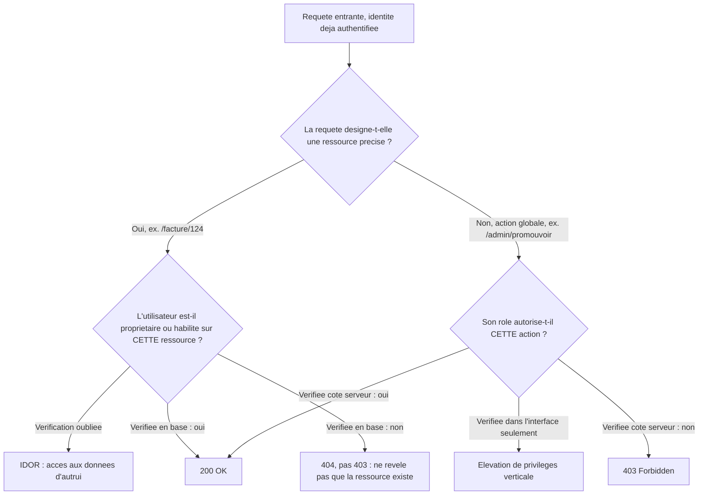
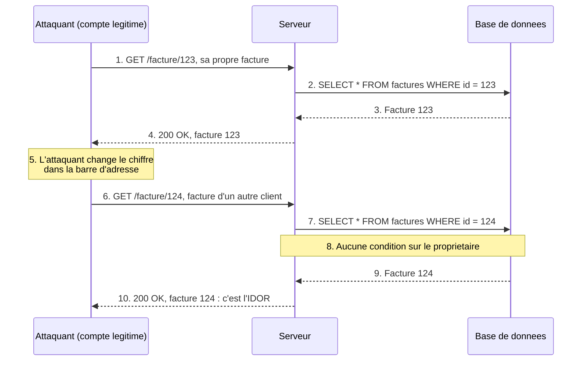
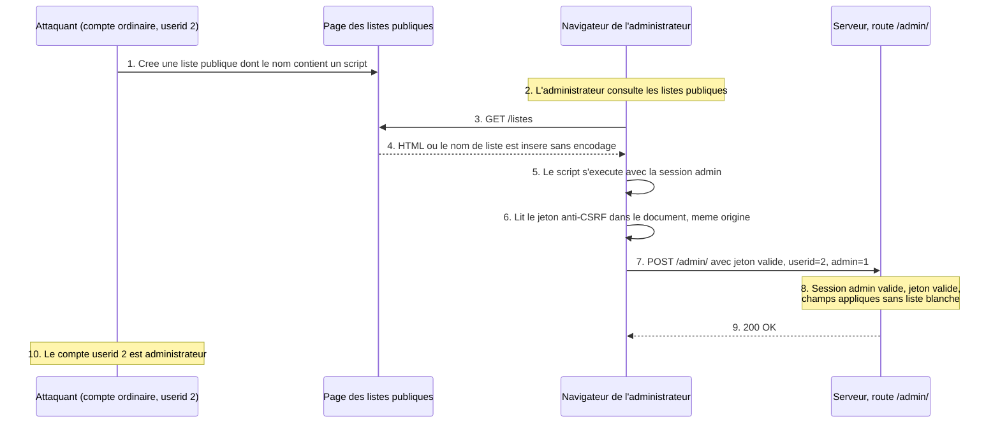
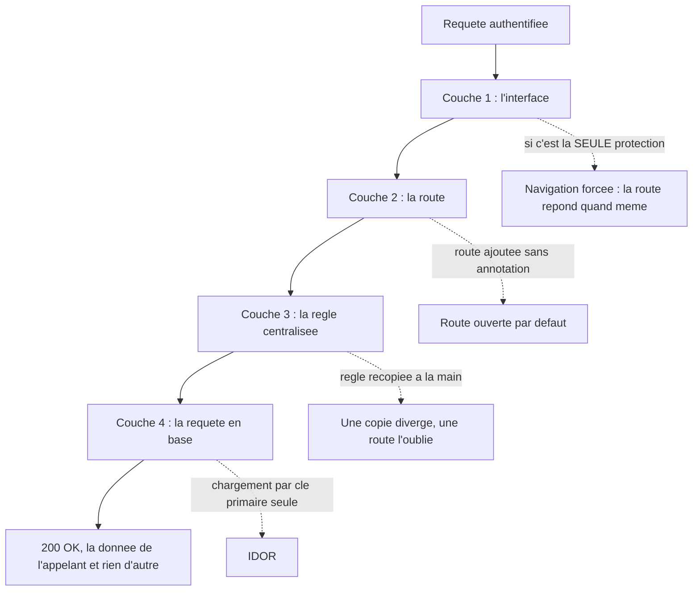
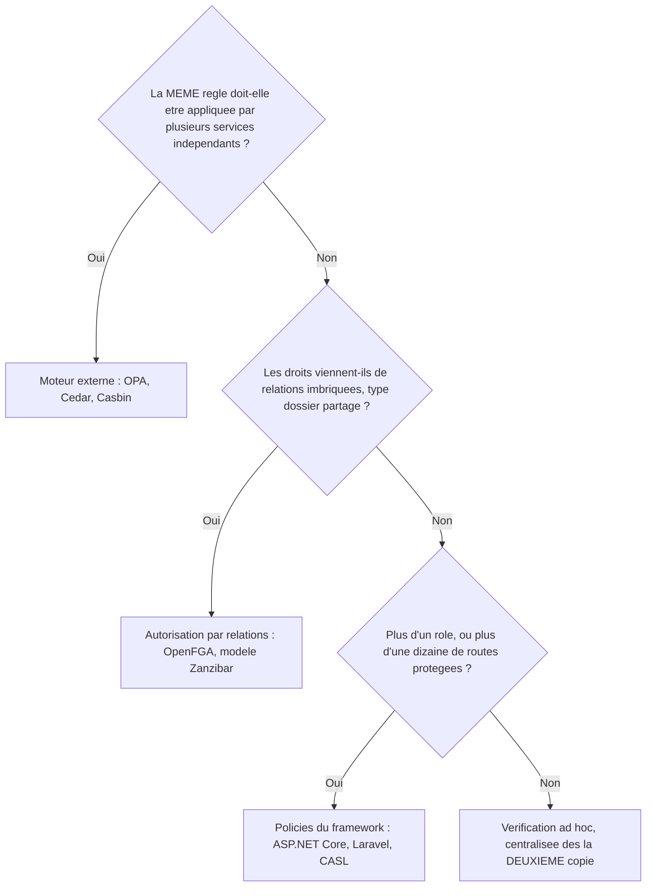

# Contrôle d'accès défaillant — le serveur sait qui tu es, pas ce que tu as le droit de faire

## L'idée en une image

Tu arrives à la réception d'un hôtel. On vérifie ton identité, on te remet une carte magnétique,
on t'annonce la chambre 412. Jusque-là, tout est normal : la réception a fait son travail, elle
t'a **identifiée**.

Maintenant, imagine que les serrures de cet hôtel aient été programmées à l'économie. Chaque porte
pose une seule question à la carte qu'on lui présente : « es-tu une carte valide de cet hôtel ? ».
Si la réponse est oui, elle s'ouvre. Aucune porte ne demande jamais « es-tu la carte **de cette
chambre-ci** ? ». Ta carte t'ouvre donc la 412 — et aussi la 411, la 410, la 315 et la suite du
directeur. Personne n'a piraté quoi que ce soit. Le système fonctionne exactement comme il a été
programmé ; il a simplement été programmé pour vérifier la mauvaise chose.

C'est **tout** le sujet de cette leçon. La réception, c'est l'**authentification** : prouver qui
tu es, une fois, à la connexion. La serrure, c'est l'**autorisation** : décider, à chaque geste,
si *cette* personne a le droit de faire *cette* action sur *cette* ressource. Quand la seconde
manque, on parle de **contrôle d'accès défaillant** (*broken access control*) — et c'est,
aujourd'hui encore, la catégorie de faille la mieux classée au monde.

**Où l'analogie casse — trois bornes, et la troisième te dit déjà où sera le piège.**

1. **Il n'y a pas de couloir à parcourir.** À l'hôtel, essayer trente portes demande de marcher
   trente fois et de se faire voir. Sur le web, le numéro de chambre est écrit **dans l'adresse**
   de la page : changer `412` en `413` coûte une touche du clavier, et une boucle de script essaie
   les cinq cents chambres en quelques secondes, sans que personne ne croise l'attaquant dans le
   couloir.
2. **Il n'y a pas trente portes, il y en a des milliers.** Un hôtel a un nombre fixe de serrures,
   toutes du même modèle. Une application a une décision d'autorisation **par action et par
   ressource** : lire une facture, la modifier, la supprimer, promouvoir un compte… Le correctif
   n'est donc pas « reprogrammer la serrure », c'est « n'en oublier aucune », ce qui est un
   problème de nature complètement différente.
3. **Changer les numéros de chambre ne répare rien.** Si les serrures ne vérifient toujours pas à
   qui appartient la carte, remplacer les numéros `410, 411, 412` par des codes imprononçables
   rend la devinette plus difficile — et rien d'autre. Une carte perdue, un code lu par-dessus une
   épaule, et la porte s'ouvre pareil. Retiens cette borne : c'est **exactement** l'erreur que
   commettent la plupart des équipes qui découvrent cette faille, et on y consacre une section
   entière.

## Le pont avec le module précédent

Les trois modules précédents décrivaient des attaques où l'attaquant fait **entrer quelque chose
d'anormal** dans le système : une chaîne qui change le sens d'une requête SQL (module 03), un
script qui se fait passer pour du contenu du site (module 04), une requête forgée que le
navigateur de la victime signe malgré elle (module 05).

Ici, rien n'est anormal. La requête est bien formée, le cookie de session est authentique, la
victime n'est même pas nécessaire : **c'est l'attaquant lui-même qui est connecté, avec son propre
compte légitime**. Il demande simplement quelque chose qu'il n'a pas le droit d'obtenir, et le
serveur le lui donne. Il n'y a pas de charge utile à filtrer, pas de caractère à échapper, pas de
jeton à vérifier. C'est la faille la plus difficile à détecter par un outil automatique,
précisément parce qu'aucune requête n'a l'air suspecte.

| Critère | Injection (module 03) | XSS (module 04) | CSRF (module 05) | Contrôle d'accès (ce module) |
|---|---|---|---|---|
| Ce que l'attaquant envoie | une donnée qui devient du code | un contenu qui devient un script | une requête déclenchée par une page tierce | une requête ordinaire et valide |
| Qui est authentifié ? | souvent personne | la victime | la victime, à son insu | **l'attaquant, avec son vrai compte** |
| Ce qui est cassé | la frontière donnée / instruction | la frontière contenu / code | la frontière site / site | la frontière **entre deux utilisateurs** |
| Défense principale | requête préparée | encodage en sortie | jeton anti-CSRF, `SameSite` | vérification d'autorisation côté serveur |

Un fil relie tout de même ce module au module 03, et le cours l'emprunte lui-même : quand une
injection SQL réussit sur un formulaire de connexion, l'un des objectifs classiques de l'attaquant
est de **modifier le niveau d'accès de son propre compte**. L'injection est alors le moyen ;
l'élévation de privilèges est le but. On revient sur ce point précis, et sur ce qu'il laisse dans
l'ombre, à la section consacrée à l'élévation de privilèges.

## Ce que le cours enseigne, et ce que cette leçon ajoute

Ce module est le plus déséquilibré de tout le cours entre son importance réelle et sa place au
programme. Il faut le dire franchement avant de commencer, parce que cela change ta façon de
réviser.

::: cours
Le millésime 2026 du cours 420-B10-HU ne consacre **aucun bloc magistral** au contrôle d'accès
applicatif. Il l'aborde par trois portes seulement. **Séance 1** : « un pirate arrive à modifier
son compte pour s'ajouter des accès administrateur » est donné comme exemple de violation de
l'**intégrité**, dans la triade vue au module 01. **Séance 10, diapositive 21** : les trois
objectifs usuels d'une injection SQL sur un formulaire de connexion, dont « modifier le niveau
d'accès d'un compte (y compris le leur) pour obtenir plus d'accès qu'il ne le devrait » — c'est la
première mention explicite de l'élévation de privilèges du millésime. **Séance 5** : un volet sur
la restriction des fichiers aux groupes d'utilisateurs, au niveau du système Linux et non de
l'application.
:::

::: cours
La quatrième porte, et la plus riche, est l'**exercice d'intégration** de fin de session
(`ExercicesIntegration.docx`), bâti sur une application Laravel volontairement trouée nommée
« laravulnerable ». Son tableau de vulnérabilités contient quatre entrées de contrôle d'accès :
listes et items visibles par tous les usagers, identifiants de listes séquentiels, suppression de
listes publiques d'autrui, et élévation vers le compte administrateur. La mise en place de
l'exercice précise en outre que « le menu Administration n'est disponible que pour
l'administrateur ». Ces énoncés-là sont de la matière du cours ; les corrigés, eux, ne sont
publiés nulle part.
:::

::: complement
Tout le reste de cette leçon est un ajout de la base de connaissances : le vocabulaire d'IDOR, la
distinction verticale / horizontale, le mass assignment, le forced browsing, le classement OWASP,
l'arbitrage 404 contre 403, et les implémentations en dehors de Laravel. C'est de la matière
juste, centrale en stage et en emploi, mais **peu probable à l'examen 2026** — la fiche source
parle d'un angle mort du millésime sur la faille classée n° 1 mondiale.
:::

**La règle d'arbitrage, la même que dans tout ce cours :** *à l'examen, donne la réponse du
cours ; en production, applique la correction.* Ici, la traduction pratique est simple : les
encadrés de cours ci-dessus sont ce qui peut tomber ; tout le reste est ce qui te servira le jour
où tu écriras une application réelle.

## Pourquoi c'est la faille classée n°1 mondiale

Il faut d'abord poser proprement les deux mots, parce que la confusion entre eux est la cause
directe de la faille.

**Authentification** : établir *qui* est l'utilisateur. Cela se décide **une fois**, à la
connexion, puis se transporte par un cookie de session ou un jeton. C'est binaire et visible :
soit tu es connectée, soit tu ne l'es pas, et quand ça échoue tout le monde s'en aperçoit.

**Autorisation** : établir si *cet* utilisateur a le droit de faire *cette* action sur *cette*
ressource. Cela se décide **à chaque requête**, **côté serveur**, et le résultat dépend de la
ressource visée, pas seulement de l'identité. Une application de quatre-vingts routes porte
potentiellement quatre-vingts décisions d'autorisation distinctes, chacune écrite à la main par un
développeur pressé. Il suffit d'en **oublier une seule** pour ouvrir une brèche.

Voilà toute l'asymétrie : l'authentification se code une fois pour toute l'application,
l'autorisation se recode à chaque endpoint. C'est une faille de **répétition**, pas une faille
d'ingéniosité — et c'est pour cela qu'elle survit aux revues de code, aux scanners et aux
pare-feux applicatifs.

| Édition du classement OWASP | Rang | Ce que le rapport dit |
|---|---|---|
| Top 10:2021 | A01, en montée depuis la cinquième place de 2017 | 94 % des applications ont été **testées** pour une forme de contrôle d'accès défaillant, avec un taux d'incidence moyen de 3,81 %, et plus de 318 000 occurrences relevées — le plus grand nombre du jeu de données contribué |
| Top 10:2025 | A01, inchangé | Le SSRF, qui était A10 en 2021, y est **fusionné** : même logique de fond, laisser le client influencer une ressource ou une destination sans vérification d'autorisation suffisante. (Édition annoncée en version candidate le 6 novembre 2025, publiée en version finale en janvier 2026.) |

::: attention
Le chiffre de 94 % est très souvent mal lu, y compris dans des articles sérieux. Il ne dit pas que
94 % des applications sont vulnérables : il dit que 94 % des applications du jeu de données ont
été **testées** pour ce type de faille. Le taux d'incidence moyen, lui, est de 3,81 %. Si tu cites
ce chiffre dans un travail, cite-le avec sa phrase d'origine — c'est exactement le genre de
détail qu'un correcteur attend.
:::

Un exemple de l'échelle que la faille peut atteindre : la fuite de données de l'opérateur
australien Optus en septembre 2022, qui a touché jusqu'à dix millions de clients actuels et
anciens, dont 2,1 millions dont un document d'identité a été dérobé.

::: attention
**Attention à la qualification de ce cas — c'est exactement la distinction que le module enseigne.**
Optus n'est **pas** un IDOR au sens strict. Le régulateur australien (ACMA) plaide qu'une **erreur
de codage** avait rendu inopérants les contrôles d'une interface de programmation exposée sur
Internet, laquelle **n'exigeait aucune authentification** ; il suffisait d'incrémenter un
identifiant dans l'URL pour dérouler la clientèle. Un IDOR suppose un utilisateur **déjà
authentifié** dont on ne vérifie pas les droits sur la ressource visée ; ici, il n'y avait **rien à
vérifier**. Les deux appartiennent à la même famille — A01, contrôle d'accès défaillant — et le
second est l'échelon en dessous du premier : oublier la vérification de propriété, c'est grave ;
oublier l'authentification elle-même, c'est publier la base.
:::

Le diagramme suivant résume la seule question que le serveur doit se poser, et les deux façons de
ne pas se la poser.



## IDOR — le mécanisme

**IDOR** signifie *Insecure Direct Object Reference*, référence directe non sécurisée à un objet.
Le nom décrit exactement le défaut : le serveur utilise une **référence** fournie par le client —
un identifiant dans l'URL, dans la chaîne de requête, dans le corps JSON, dans un champ caché de
formulaire — pour aller chercher **directement** l'enregistrement correspondant, sans vérifier que
l'utilisateur courant a le droit d'y toucher.

L'attaque ne demande aucun outil. Elle tient en une phrase : *changer un chiffre*.



::: cours
L'exercice d'intégration décrit ce cas exactement, sur l'application « laravulnerable » : « Les
listes et items sont visibles par tous les usagers — l'identité du propriétaire n'est pas
vérifiée ». Le danger que retient le cours est la **consultation d'information privilégiée**. Les
fichiers en cause sont nommés : `app/Http/Controllers/ItemsController.php` et
`app/Http/Controllers/ListesControllers.php`. Une seconde entrée du tableau porte sur l'écriture :
« Les listes publiques peuvent être supprimées même si elles ne nous appartiennent pas — aucune
validation sur la route ».
:::

### L'exemple simple : un contrôleur Laravel qui charge par identifiant

Voici le cas dans sa forme la plus dépouillée. Un seul appel de méthode sépare la version trouée
de la version saine.

:::: comparaison
::: vulnerable
```php
// app/Http/Controllers/ItemsController.php
public function show($id)
{
    $item = Item::findOrFail($id);
    return view('items.show', compact('item'));
}
```

{lignes="4"} `findOrFail` cherche par **clé primaire** et ne connaît rien d'autre. La valeur de
`$id` vient de l'URL, donc du client, donc de l'attaquant : la requête produite est « donne-moi
l'item numéro tant », jamais « donne-moi l'item numéro tant **s'il est à moi** ».

{lignes="5"} La vue, elle, fait son travail correctement — elle affiche l'item qu'on lui donne. La
faille n'est pas dans l'affichage, elle est dans la **sélection**. C'est ce qui la rend invisible
à la relecture : le code a l'air normal parce qu'il l'est, à une condition près.
:::
::: corrige
```php
// app/Http/Controllers/ItemsController.php
public function show($id)
{
    $item = Item::where('id', $id)
        ->where('user_id', auth()->id())
        ->firstOrFail();
    return view('items.show', compact('item'));
}
```

{lignes="5"} La condition de propriété entre **dans la requête elle-même**. C'est plus robuste
qu'un `if` écrit après le chargement : un `if` s'oublie quand on copie la méthode sur la route
suivante, une clause `where` part avec la requête qu'on copie. `auth()->id()` lit l'identité dans
la session validée par le serveur — jamais dans un paramètre envoyé par le client.

{lignes="6"} `firstOrFail` déclenche une réponse 404 dans les **deux** cas : l'item n'existe pas,
ou il ne t'appartient pas. Cette indistinction est volontaire, et la section suivante explique
pourquoi elle vaut mieux qu'un 403.
:::
::::

### L'exemple complexe : la même faille, protégée par une annotation qui ne protège pas

Le cas précédent est facile à repérer parce qu'il ne contient aucune sécurité. En situation
réelle, le code fautif est presque toujours un code qui **a l'air sécurisé** : il porte une
annotation d'autorisation, il gère le cas « ressource absente », il a passé la revue. Voici une
route ASP.NET Core d'un portail de facturation, telle qu'on en trouve en production.

:::: comparaison
::: vulnerable
```csharp
[HttpGet("factures/{id}")]
[Authorize]
public async Task<IActionResult> GetFacture(int id)
{
    var facture = await _db.Factures.FindAsync(id);
    if (facture is null) return NotFound();
    return Ok(facture);
}
```

{lignes="2"} `[Authorize]` ne vérifie **que l'authentification** : « existe-t-il un utilisateur
connecté ? ». Sans argument, cette annotation ne dit rien du rôle et absolument rien de la
ressource visée. C'est le malentendu le plus coûteux du framework : son nom promet de
l'autorisation, son comportement par défaut n'en fait pas.

{lignes="5"} `FindAsync` est l'équivalent exact de `findOrFail` côté Entity Framework : recherche
par clé primaire, aucune notion de propriétaire. La faille est donc rigoureusement la même que
dans l'exemple Laravel, dans un écosystème différent — ce n'est pas un défaut de langage, c'est un
défaut de raisonnement.

{lignes="6"} Le seul test présent porte sur l'**existence** de la facture. Un lecteur pressé y voit
une vérification et passe à la suite. Demande-toi toujours, devant un `if` de ce genre : est-ce
qu'il compare quelque chose à l'utilisateur connecté ? Ici, non.
:::
::: corrige
```csharp
[HttpGet("factures/{id}")]
[Authorize]
public async Task<IActionResult> GetFacture(int id)
{
    var userId = User.GetUserId();
    var facture = await _db.Factures
        .Where(f => f.Id == id && f.OwnerId == userId)
        .FirstOrDefaultAsync();
    return facture is null ? NotFound() : Ok(facture);
}
```

{lignes="5"} L'identité est extraite du **jeton validé par le serveur** — ici par une méthode
d'extension qui lit la revendication `ClaimTypes.NameIdentifier`. Elle n'est jamais lue dans un
paramètre de requête : un `?userId=` que le client fournirait serait une autre variante de la même
faille.

{lignes="7"} Les deux conditions voyagent ensemble dans la même requête SQL générée. La base ne
renvoie donc jamais une ligne qui n'appartient pas à l'appelant, même si le code qui suit contient
un bogue.

{lignes="9"} Une seule et même réponse pour « facture inexistante » et « facture d'un autre » :
l'attaquant n'apprend rien en comparant les réponses.
:::
::::

### Pourquoi 404 plutôt que 403

Répondre 403 Forbidden quand la ressource existe mais ne t'appartient pas est honnête, et c'est
précisément le problème : la différence entre 403 et 404 **confirme l'existence** de la ressource.
Un attaquant qui reçoit 404 sur les identifiants 1 à 200 et 403 sur les identifiants 201 à 340 n'a
lu aucune donnée, mais il connaît maintenant la taille exacte de la clientèle et l'intervalle
d'identifiants utiles. La règle pratique est donc : **une seule réponse pour « ça n'existe pas »
et « ce n'est pas à toi »** — mais c'est un **arbitrage**, pas un dogme.

La norme HTTP (RFC 9110, §15.5.4) dit qu'un serveur qui souhaite *masquer* l'existence d'une
ressource interdite **peut** répondre 404 à la place de 403 ; elle ne l'impose pas. Le 404 se
justifie quand l'**existence même** de la ressource est confidentielle : dossier médical, brouillon,
compte d'un tiers. Le 403 reste correct — et plus clair pour l'utilisateur légitime comme pour le
support — quand cette existence n'est pas un secret : un document d'entreprise partagé dont on n'a
pas la permission, une page d'administration. Dans les deux cas, la ligne non négociable est
ailleurs : **le refus est journalisé**, et la réponse ne varie ni dans son corps ni dans son délai
selon que la ressource existe ou non — sans quoi le 404 est une façade que le chronomètre traverse.

## L'énumération favorisée par les identifiants séquentiels

::: cours
Une entrée du tableau d'exercices vise directement ce point : « Les listes sont des ID numériques
séquentiels — utilisation du numéro automatique sous SQL — énumération facile de l'information ».
Le danger retenu est donc la facilité d'**énumération**.
:::

Le mécanisme est immédiat. Une colonne auto-incrémentée produit `1, 2, 3, …` : l'utilisateur qui
crée sa liste et reçoit le numéro 47 vient d'apprendre, sans rien faire, que les numéros 1 à 46
existent probablement.

```sql
-- Le schema le plus courant du monde : la cle primaire technique sert aussi d'identifiant public
CREATE TABLE listes (
  id      INT AUTO_INCREMENT PRIMARY KEY,
  user_id INT NOT NULL,
  nom     VARCHAR(120) NOT NULL
);
```

L'exemple simple d'exploitation, c'est la barre d'adresse : `/listes/47` devient `/listes/46`.
L'exemple réaliste, c'est une boucle de quelques lignes, lancée depuis le compte légitime de
l'attaquant.

```bash
# L'attaquant est authentifie avec SON compte ; il parcourt les identifiants des autres
for id in $(seq 1 500); do
  curl -s -o "liste-$id.json" \
    -H "Cookie: session=LE_COOKIE_DE_L_ATTAQUANT" \
    "https://exemple.invalide/api/listes/$id"
done
```

Deux remarques valent plus que la boucle elle-même. D'abord, **cette boucle ne contourne rien** :
elle envoie cinq cents requêtes parfaitement valides, avec un cookie authentique. Aucun filtre
d'entrée n'a de prise dessus. Ensuite, elle laisse une trace énorme — cinq cents requêtes du même
compte sur des identifiants consécutifs — mais uniquement pour qui **regarde** les journaux. On y
revient dans la partie sur les défenses.

::: attention
Le réflexe qui suit la découverte d'un IDOR est presque toujours le mauvais : « on remplace les
identifiants séquentiels par des UUID ». Un **UUID** (*Universally Unique Identifier*) est un
identifiant de 128 bits, imprononçable et non devinable, du type
`3f2a9c14-8b7e-4d51-9f03-1c6e5a2b7d80`. Le remplacer change une chose et une seule : la
**découverte** devient difficile. L'**accès**, lui, reste exactement aussi ouvert. Un UUID qui
fuit — dans un journal de serveur, dans une URL partagée par courriel, dans un en-tête `Referer`,
dans une capture réseau — donne le même accès non contrôlé que l'identifiant `124` deviné. C'est
de la **défense en profondeur**, jamais un substitut à la vérification d'autorisation.
:::

C'est ici que la troisième borne de l'analogie de l'hôtel se referme : changer les numéros de
chambre ne reprogramme pas les serrures.

Une nuance de 2026 mérite d'être connue, parce qu'elle prend à contre-pied ceux qui croient le
sujet clos : l'**UUID v7**, de plus en plus utilisé pour ses bonnes propriétés d'indexation,
encode un horodatage dans son préfixe. Deux ressources créées à quelques minutes d'intervalle ont
donc des identifiants **proches et partiellement prévisibles** — moins opaques qu'un UUID v4
tiré au hasard. Le choix d'un type d'identifiant se fait pour des raisons de base de données ; ne
lui demande pas de faire un travail de sécurité.

La conclusion pratique tient en deux gestes, dans cet ordre : **corriger l'IDOR d'abord** — c'est
la vraie faille — puis, éventuellement, exposer un identifiant public non séquentiel **distinct**
de la clé primaire interne.

```sql
-- Defense en profondeur, APRES avoir corrige l'autorisation : deux identifiants, deux roles
CREATE TABLE listes (
  id        INT AUTO_INCREMENT PRIMARY KEY,   -- interne : jointures, index, jamais expose
  reference CHAR(36) NOT NULL UNIQUE,         -- public : ce qui apparait dans les URL
  user_id   INT NOT NULL,
  nom       VARCHAR(120) NOT NULL
);
```

## L'élévation de privilèges

L'**élévation de privilèges** (*privilege escalation*) désigne toute situation où un utilisateur
obtient des droits qui ne lui ont pas été accordés. On la découpe en deux familles, et le
vocabulaire est demandé tel quel dans les rapports professionnels.

| Famille | Ce que l'attaquant obtient | Exemple typique |
|---|---|---|
| **Verticale** | des droits d'un **rang supérieur** au sien | un utilisateur normal accède aux fonctions d'administration |
| **Horizontale** | les droits d'un **autre utilisateur de même rang** | le compte A lit et modifie les données du compte B |

L'IDOR de la section précédente est donc la forme la plus courante d'élévation **horizontale** :
mêmes droits, autre personne. Ce module traite les deux, parce que la cause est identique — une
décision d'autorisation absente côté serveur.

### L'exemple simple : le menu que l'on cache

::: cours
La mise en place de l'exercice d'intégration précise, côté utilisateur normal, que « le menu
Administration n'est disponible que pour l'administrateur ». C'est un piège volontaire de
l'exercice.
:::

Masquer un élément d'interface ne protège **pas** la route qu'il pointe. Le rendu conditionnel
d'un menu est une décision d'ergonomie : il évite de montrer un bouton qui échouerait. Il ne
s'exécute pas sur le serveur ; il n'a donc aucune valeur de sécurité. Si `/admin/utilisateurs`
répond 200 à n'importe quel compte authentifié qui tape l'adresse directement, le menu caché n'est
qu'un rideau.

On appelle cela de la **sécurité par l'obscurité** : faire reposer une protection sur le fait que
l'attaquant ne connaît pas un détail — l'existence d'une URL, le nom d'un paramètre, le format
d'un identifiant. Le problème n'est pas que ce soit inutile, c'est que ce ne soit **pas une
protection** : le détail finit toujours par se savoir, par un ancien employé, par le code source
du client, par une archive du site, par un simple essai.

Le corollaire est une règle simple, à appliquer sans exception : **toute route sensible doit
supposer que son adresse est connue de tous**. Le fait d'atteindre une URL sans jamais avoir vu le
lien qui y mène porte d'ailleurs un nom, qu'on retrouve dans les rapports d'audit : le *forced
browsing*, la navigation forcée.

### L'écart avec le cours, sur l'élévation par injection

::: cours
La séance 10, diapositive 21, liste les trois objectifs usuels d'une injection SQL sur un
formulaire de connexion : « s'authentifier sans connaître le mot de passe ; modifier le mot de
passe d'un utilisateur pour se connecter à son compte ; modifier le niveau d'accès d'un compte (y
compris le leur) pour obtenir plus d'accès qu'il ne le devrait ». La contre-mesure enseignée est
la **requête préparée**, vue au module 03.
:::

::: correction-du-cours {source="OWASP Top 10:2021 — A01 Broken Access Control ; cours 420-B10-HU, séance 10, diapositive 21"}
Ce que le cours énonce est exact, et la requête préparée corrige bien l'injection. Mais le
raccourci qu'il laisse s'installer est risqué : présenté ainsi, le troisième objectif — modifier
son propre niveau d'accès — apparaît comme une **conséquence de l'injection**, donc comme un
problème réglé une fois l'injection réglée. Il ne l'est pas. Une colonne `niveau_acces` que le
code applicatif accepte d'écrire depuis une donnée venue du client est une faille de **contrôle
d'accès** à part entière, exploitable **sans aucune injection** — c'est le mass assignment de la
section suivante. Et le compte SQL de l'application ne devrait de toute façon pas détenir le droit
d'écrire cette colonne. À l'examen, réponds la requête préparée, c'est la contre-mesure
enseignée ; en production, ajoute les deux autres.
:::

### L'exemple complexe : devenir administrateur en piégeant l'administrateur

::: cours
La dernière entrée du tableau d'exercices décrit une attaque en deux temps : un utilisateur
non-admin injecte un script dans le **nom d'une liste publique** — le champ est vulnérable au XSS,
vu au module 04 — et attend que l'administrateur consulte la page des listes publiques, ce qu'il
fait en routine.
:::

La charge utile tient en deux gestes. Le premier lit le jeton anti-CSRF présent dans la page :
`token = document.getElementsByName('_token')[0].value;`. Le second envoie une requête au panneau
d'administration avec ce jeton et deux paramètres choisis par l'attaquant :
`fetch('/admin/', { method: 'POST', body: '_token=' + token + '&userid=2&admin=1' })`, où `2` est
l'identifiant du compte de l'attaquant. Le script s'exécute dans le navigateur de
l'administrateur, avec sa session valide.



Deux failles se combinent, et il est essentiel de les séparer, parce qu'elles ne se corrigent pas
au même endroit.

**La racine est le XSS.** Le jeton anti-CSRF du module 05 protège contre une requête forgée
envoyée **depuis un autre site** — mais ici, le script s'exécute **sur le site lui-même**. Il lit
donc le jeton dans le document comme n'importe quel script légitime de la page, et l'inclut dans
sa propre requête. **Un jeton anti-CSRF ne protège jamais contre un XSS** : c'est la règle que le
module 05 a démontrée, et la voici en situation. Corriger le XSS par un encodage contextuel en
sortie coupe la chaîne à sa source.

**La faiblesse aggravante est indépendante du XSS.** L'endpoint `/admin/` accepte en POST un
`userid` et un indicateur `admin` arbitraires et les applique tels quels. Même sans XSS, cette
route reste une faille : n'importe quel administrateur distrait, n'importe quelle requête forgée
autrement, n'importe quel outil de test mal configuré peut promouvoir un compte. Une conception
saine exigerait une **confirmation explicite** — re-saisie du mot de passe, authentification
renforcée — avant toute promotion de rôle. Ce défaut-là porte un nom, et c'est la section
suivante.

## Le mass assignment / over-posting

**L'analogie d'abord.** Imagine un greffier qui traite des demandes de changement d'adresse. Le
formulaire imprimé comporte deux cases : nom et adresse. Le greffier, pour aller vite, ne recopie
pas les deux cases : il recopie dans le dossier **tout ce qui est écrit sur la feuille**. Un
demandeur malin ajoute donc, à la main, dans la marge : « statut : employé autorisé ». Le greffier
recopie. Le dossier est modifié. Personne n'a menti sur son nom.

**Où l'analogie casse :** le greffier a l'air négligent, le framework ne l'est pas — il fait
exactement ce qu'on lui a demandé, c'est-à-dire « remplis l'objet avec ce que tu reçois ». Et
surtout, l'attaquant n'a pas besoin de modifier un formulaire à l'écran : il fabrique la requête
directement, avec un outil en ligne de commande ou la console du navigateur. **Ce que le formulaire
propose n'a donc aucune importance** : seul compte ce que le serveur accepte.

**Le mécanisme.** La plupart des frameworks offrent un **binding automatique** (liaison
automatique) : ils transforment le corps d'une requête — JSON ou formulaire encodé — en objet
applicatif, sans que le développeur affecte chaque champ à la main. C'est confortable, et
dangereux dès que l'objet cible porte des champs que le client ne devrait jamais définir :
`isAdmin`, `role`, `solde`, `user_id`. On parle de **mass assignment** (affectation en masse) ou
d'**over-posting** (sur-envoi) : le client poste plus de champs que le formulaire n'en propose.

L'exemple historique de référence date de mars 2012 : le chercheur Egor Homakov a exploité le mass
assignment de Ruby on Rails sur GitHub lui-même. Le formulaire d'ajout de clé SSH existait — il n'a
pas inventé de champ inconnu ; il a ajouté à la requête un **attribut imbriqué du modèle** que le
formulaire ne proposait pas, `public_key[user_id]`, avec l'identifiant du compte `rails`. Le
binding par défaut l'a accepté : sa clé s'est retrouvée associée à un autre compte, et il a pu
pousser un commit sur `rails/rails`.

Retiens la forme du défaut, parce que c'est elle qui se reproduit : ce n'est pas un champ
« exotique » qu'un attaquant devine, c'est un **champ légitime du modèle** que le client n'aurait
jamais dû pouvoir écrire.

### L'exemple simple : un contrôleur Laravel qui met à jour un profil

:::: comparaison
::: vulnerable
```php
// app/Http/Controllers/UserController.php
public function update(Request $request, $id)
{
    $user = User::findOrFail($id);
    $user->update($request->all());
    return redirect()->back();
}
```

{lignes="4"} Première faille, déjà connue : aucun contrôle de propriété. `$id` vient de l'URL,
n'importe quel compte authentifié peut viser le profil d'un autre. C'est l'IDOR de la section
précédente — les deux failles cohabitent très souvent dans la même méthode.

{lignes="5"} Seconde faille, celle qui nous occupe : `$request->all()` renvoie **tout** le corps de
la requête. Si l'attaquant y ajoute un champ `admin` valant `1`, et que le modèle `User` porte une
colonne de ce nom, la valeur est écrite. Le formulaire affiché ne proposait que le nom et le
courriel ; cela n'a jamais empêché personne d'envoyer un champ de plus.
:::
::: corrige
```php
class User extends Model
{
    protected $fillable = ['name', 'email'];
}

public function update(Request $request, $id)
{
    abort_unless((int) $id === auth()->id(), 404);
    $data = $request->validate(['name' => 'required|string', 'email' => 'required|email']);
    $user = User::findOrFail($id);
    $user->update($data);
    return redirect()->back();
}
```

{lignes="3"} `$fillable` est une **liste blanche** posée sur le modèle : tout champ absent de cette
liste est ignoré à l'affectation en masse, y compris `admin` et `id`. Une liste blanche énumère ce
qui est permis ; son contraire, la liste noire, énumère ce qui est interdit et laisse passer tout
ce que son auteur n'a pas imaginé.

{lignes="8"} Le contrôle de propriété, remis en place. Le mass assignment et l'IDOR sont deux
failles distinctes : corriger l'une ne corrige jamais l'autre, et il faut donc les deux lignes.

{lignes="9"} La validation joue le rôle d'une **seconde** liste blanche, plus stricte, au niveau de
la requête : seuls les deux champs déclarés ressortent dans `$data`, et ils ressortent typés.

{lignes="11"} L'écriture ne reçoit que `$data`. Même si quelqu'un élargissait `$fillable` un jour,
cette ligne-ci ne laisserait toujours passer que ce que la validation a accepté.
:::
::::

### L'exemple complexe : binder une entité de base de données dans une API

Le même défaut prend une forme plus insidieuse dans une API, parce que le champ dangereux n'est
même pas visible dans le contrôleur : il est hérité de l'entité de persistance.

:::: comparaison
::: vulnerable
```csharp
[HttpPut("users/{id}")]
public async Task<IActionResult> UpdateUser(int id, [FromBody] User user)
{
    _db.Users.Update(user);
    await _db.SaveChangesAsync();
    return Ok();
}
```

{lignes="2"} `User` est ici l'**entité de base de données**, celle qui porte toutes les colonnes de
la table — `IsAdmin`, `CreatedAt`, `PasswordHash`… En la posant comme paramètre lié au corps JSON,
on déclare implicitement que **chacune** de ces propriétés est modifiable par le client. Un corps
`{ "name": "…", "isAdmin": true }` passe intégralement.

{lignes="4"} L'objet écrit en base est celui qui a été reçu. Remarque au passage que le `id` de
l'URL n'est comparé à rien : l'appelant choisit aussi **quelle** ligne il modifie.
:::
::: corrige
```csharp
public record UpdateUserDto(string Name, string Email);

[HttpPut("users/{id}")]
[Authorize]
public async Task<IActionResult> UpdateUser(int id, [FromBody] UpdateUserDto dto)
{
    var user = await _db.Users
        .Where(u => u.Id == id && u.Id == User.GetUserId())
        .FirstOrDefaultAsync();
    if (user is null) return NotFound();
    user.Name = dto.Name;
    user.Email = dto.Email;
    await _db.SaveChangesAsync();
    return Ok();
}
```

{lignes="1"} Le **DTO** (*Data Transfer Object*, objet de transfert de données) est la liste
blanche, exprimée par le type lui-même : il ne porte que ce que le client a le droit de modifier.
Ajouter une colonne sensible à l'entité n'élargira jamais la surface exposée, puisque le DTO ne
change pas.

{lignes="8"} La ligne visée doit être à la fois celle de l'URL **et** celle de l'appelant. Sans
cette seconde condition, on aurait corrigé le mass assignment et laissé l'IDOR.

{lignes="11"} Affectation **champ par champ**, explicite. C'est plus verbeux qu'un binding
automatique, et c'est le but : ce qui est écrit à la main est ce qui a été décidé à la main.
:::
::::

::: complement
Le même piège existe hors des frameworks à convention forte. En JavaScript, un
`Object.assign(user, req.body)` ou un `Model.updateOne({ _id: req.params.id }, req.body)` reprend
exactement le défaut. Et attention à une subtilité du langage au moment d'écrire le filtre : dans
un littéral d'objet, **une clé dupliquée écrase la précédente**. Écrire
`{ _id: req.params.id, _id: req.user.id }` ne combine pas les deux conditions — la seconde gagne,
le paramètre d'URL n'est jamais comparé, et le « correctif » ne corrige rien tout en donnant
l'impression du contraire. Compare explicitement, puis filtre sur l'identité de l'appelant.
:::

## Les autres défaillances de contrôle d'accès

L'IDOR, l'élévation de privilèges et le mass assignment sont les trois formes les plus fréquentes,
mais la catégorie A01 en couvre d'autres. Les connaître par leur nom suffit à ce stade ; leur
correctif est toujours le même geste, vu dans la partie suivante.

- **Forced browsing** (navigation forcée) — atteindre une URL sans jamais passer par le lien ou le
  bouton qui y mène. C'est le cas du menu administrateur masqué. Toute route sensible doit
  supposer que son adresse est publique.
- **Contournement par méthode HTTP, par casse ou par chemin** — un contrôle posé uniquement sur
  `GET /Admin/Users` peut se contourner par une casse différente, par une autre méthode sur la même
  route, ou par un chemin réécrit du type `/admin/../admin/users`, selon la rigueur du routeur et
  du proxy inverse placé devant. La vérification d'autorisation doit être **indépendante de la
  façon dont la route a été atteinte**.
- **CORS mal configuré** — un en-tête `Access-Control-Allow-Origin: *` combiné à
  `Access-Control-Allow-Credentials: true`, ou une réflexion non filtrée de l'en-tête `Origin`,
  ouvre l'API à n'importe quel site tiers. C'est un contrôle d'accès **au niveau du navigateur**,
  distinct de l'autorisation côté serveur, et le module 05 a montré pourquoi les deux ne se
  remplacent pas.
- **Élévation par paramètre** — un paramètre non prévu par l'API documentée, du type `?debug=true`
  ou `?role=admin` en chaîne de requête plutôt que dans le corps. C'est une variante du mass
  assignment, plus facile à rater en revue de code parce qu'elle ne touche pas le modèle de
  données.
- **SSRF** (*Server-Side Request Forgery*, falsification de requête côté serveur) — le serveur
  effectue lui-même une requête vers une URL fournie par le client, sans restreindre les
  destinations : import d'image, aperçu de lien, webhook. Il atteint alors des services internes
  inaccessibles depuis l'extérieur. Le classement OWASP 2025 l'a **absorbé dans A01**, pour la
  raison de fond qui traverse toute cette leçon : laisser le client influencer une ressource ou une
  destination sans vérification suffisante. Le module 07 y est consacré.

### Le contrôle d'accès du système de fichiers, annoncé par la séance 5

::: cours
La séance 5, « Sécurité des utilisateurs », annonce en diapositive 6 un volet consacré à « la
restriction des fichiers aux groupes d'utilisateurs — création des groupes, configuration des
propriétaires, configuration des bits d'accès », motivé en diapositive 5 par le fait que « Linux
offre un certain nombre de mécanismes afin d'assurer la restriction de lecture, de modification et
d'exécution des fichiers à des groupes d'utilisateurs définis ». C'est le seul bloc du cours
explicitement consacré au contrôle d'accès.
:::

::: attention
Constat daté du 2026-08-19, relevé par la fiche source : les diapositives qui portent ces titres
sont un **squelette**. Aucune des diapositives concernées ne contient de texte, de commande ni
d'image, et la page d'exercices de la séance est vide. Le plan annoncé reste probablement matière
d'examen — l'enseignant l'a écrit et peut le développer à l'oral — mais aucun contenu technique
n'est publié pour l'instant. Si tu révises ce point, appuie-toi sur tes notes de classe, pas sur
les diapositives.
:::

::: complement
Pourquoi ce sujet a sa place ici : le contrôle d'accès du système d'exploitation est **la même
idée**, un cran plus bas dans la pile, et les deux échouent pour la même raison — une vérification
qu'on croyait faite ailleurs. La différence utile à retenir tient en une phrase : le système
d'exploitation protège des **fichiers** contre des **processus**, l'application protège des
**enregistrements** contre des **utilisateurs**. Les deux sont nécessaires et aucun ne remplace
l'autre : un `chmod 600` impeccable ne remplace jamais une clause `where user_id = :moi`, et un
contrôle applicatif impeccable ne survit pas à un fichier `.env` laissé en `chmod 777`.
:::

Tu as maintenant l'inventaire complet des façons dont une application peut oublier de vérifier ce
qu'elle devrait vérifier. La bonne nouvelle, et c'est ce qui rend ce module plus simple qu'il n'en
a l'air, c'est que **toutes ces failles se corrigent avec le même petit nombre de gestes**. C'est
l'objet de ce qui suit.

## Les principes de défense

Cinq principes suffisent à couvrir tout ce qui précède. Ils ne sont pas cinq parades différentes
pour cinq failles différentes : ce sont cinq façons de rendre **improbable l'oubli d'une seule
vérification**, puisque c'est cet oubli-là, et lui seul, qui ouvre la brèche.

**L'image de la liste d'invités.** Deux façons de tenir une porte. La première : « tout le monde
entre, sauf les noms de cette liste noire ». La seconde : « personne n'entre, sauf les noms de
cette liste d'invités ». Les deux paraissent équivalentes tant que la liste est à jour — elles ne
le sont pas du tout le jour où l'on oublie un nom. Dans le premier cas, l'oubli **laisse entrer**
quelqu'un qui n'aurait pas dû ; dans le second, il **refuse** quelqu'un qui aurait dû entrer. La
première erreur est une faille silencieuse, la seconde est un ticket de support à dix heures du
matin. C'est tout le sens de *deny by default* : on choisit délibérément le mode d'échec bruyant.

**Où l'image cesse d'être vraie**, et c'est important : un videur vérifie **une personne**, une
fois, à **une** porte. Une autorisation applicative vérifie un **triplet** — qui, quelle action,
quelle ressource — et le fait à **chaque requête**, sur **chacune** des routes de l'application.
Une liste d'invités correcte protège une soirée entière ; une vérification correcte ne protège
qu'une route. C'est pourquoi le nombre de portes compte autant que la qualité du videur.

::: complement
Les cinq principes ci-dessous viennent de la base de connaissances, pas des diapositives. Le cours
n'en formule aucun explicitement pour le contrôle d'accès applicatif. Ils ne sont donc pas
exigibles à l'examen — mais ce sont eux qui sont attendus en entreprise, et ils reviendront dans
les modules suivants.
:::

| Principe | Ce que ça veut dire concrètement |
|---|---|
| **Refuser par défaut** (*deny by default*) | Toute route est refusée sauf autorisation explicite, jamais l'inverse. Concrètement : configurer le framework pour qu'un endpoint **sans** annotation d'autorisation soit **refusé**, et non accepté. Le nouveau développeur qui oublie l'annotation obtient une route morte, pas une route ouverte. |
| **Vérifier au plus près de la donnée** | Le contrôle ne vit pas seulement dans le contrôleur. Une requête qui filtre déjà sur le propriétaire est plus robuste qu'un `if` posé à côté, parce qu'un `if` peut être oublié à la copie suivante alors que la clause `WHERE` voyage avec la requête. |
| **Centraliser la règle d'autorisation** | Un seul endroit répond « cet utilisateur peut-il faire X sur Y » — une *policy*, un *gate*, un service dédié — plutôt qu'un `if (role == "Admin")` recopié dans chaque contrôleur. Sinon chaque nouvel endpoint réintroduit le risque d'oubli, et les copies divergent avec le temps. |
| **Tester le refus, pas seulement l'acceptation** | Un test d'intégration par paire (rôle, endpoint) qui vérifie que l'accès est **refusé**. Les suites de tests couvrent presque toujours le chemin « ça marche » et presque jamais le chemin « ça doit échouer » — or c'est le second qui constitue la preuve de sécurité. |
| **Journaliser les refus** | Une rafale de 403 ou de 404 produite par un même compte sur des identifiants consécutifs est la signature d'une énumération en cours. Sans journalisation, l'attaque reste invisible jusqu'à la fuite elle-même. |

Ces cinq principes se lisent aussi comme un empilement : chaque couche de l'application peut porter
la décision, et une seule d'entre elles est incapable de la porter seule.



::: attention
Le quatrième principe est celui qu'on saute le plus souvent, et c'est le seul qui **prouve** les
trois autres. Écrire « la route est protégée » dans une revue de code est une intention ; un test
qui se connecte en tant qu'utilisateur B, demande la ressource de l'utilisateur A et **exige** une
404 est une mesure. Tant que ce test n'existe pas, personne ne sait si la protection est branchée
— y compris toi, trois mois plus tard, après un refactoring de routeur.
:::

## Le contrôle d'accès au niveau du système de fichiers

Tu viens de voir, deux sections plus haut, que la séance 5 annonce un volet consacré aux groupes,
aux propriétaires et aux bits d'accès, et que les diapositives correspondantes sont vides. Le fil
rouge y est exactement le même qu'au-dessus : **on part de « personne n'a rien », on ouvre
nommément, et on n'utilise jamais une permission pour faire disparaître une erreur.**

::: complement
Tout le contenu technique qui suit est un ajout de la base de connaissances : rien de tout cela
n'est écrit dans les diapositives publiées. Ce n'est donc pas matière d'examen **tant que
l'enseignant ne l'a pas donné à l'oral** — auquel cas ce sont tes notes de classe qui font foi, pas
cette page. Le détail des commandes appartient de toute façon au module 13, sur le durcissement du
serveur ; on ne garde ici que ce qui relève du raisonnement de contrôle d'accès.
:::

| Notion | La commande | Le piège de contrôle d'accès qui va avec |
|---|---|---|
| **Création de groupe** | `groupadd developpeurs` puis `usermod -aG developpeurs alice` | **Le `-a` n'est pas facultatif.** `usermod -G` **remplace** la liste des groupes secondaires au lieu d'y ajouter : la faute de frappe retire silencieusement à l'utilisateur tous ses autres accès. |
| **Propriétaire et groupe** | `chown alice:developpeurs fichier` | Donner la propriété des fichiers à l'utilisateur du serveur web (`www-data`) est le réflexe qui **rend l'application capable de se réécrire elle-même** : un envoi de fichier mal filtré devient alors une exécution de code. Le bon patron : propriétaire = compte de déploiement, groupe = `www-data`, écriture réservée aux seuls répertoires qui en ont réellement besoin. |
| **Bits d'accès** | `chmod 640 config.php` | **`chmod 777` est le `SELECT *` de la sécurité système** : ça fait disparaître le symptôme et ça donne l'écriture au monde entier. Repères sains : `644` pour un fichier servi, `600` pour un secret, `755` pour un répertoire, `750` pour un répertoire réservé au groupe. |
| **`umask`** | `umask 027` | Les permissions des fichiers **créés par l'application** ne viennent pas du `chmod` d'hier mais du `umask` du processus. Un `umask` permissif annule en silence un durcissement fait à la main la veille. |
| **`setuid`, `setgid`, *sticky bit*** | `chmod u+s`, `chmod g+s`, `chmod +t` | Un binaire **`setuid` root** s'exécute avec les privilèges de root quel que soit l'appelant : c'est le mécanisme d'élévation de privilèges **locale** le plus classique. `find / -perm -4000` liste ceux qui existent — un inventaire à faire une fois, puis à surveiller. |
| **ACL POSIX** | `setfacl -m u:bob:r-- fichier`, `getfacl fichier` | Nécessaires dès que « propriétaire + un groupe + les autres » ne suffit plus. À connaître surtout pour une raison défensive : **`ls -l` ne les affiche pas**, il ajoute seulement un `+` en fin de ligne de permissions. Un audit fait au `ls` seul rate donc des accès bien réels. |

La même séquence, dans l'ordre où on l'exécute réellement sur un serveur :

```bash
# 1. Un groupe pour l'equipe, et un compte de deploiement distinct du serveur web
groupadd developpeurs
usermod -aG developpeurs alice        # -a AJOUTE ; sans lui, -G REMPLACE la liste

# 2. Proprietaire = compte de deploiement, groupe = utilisateur du serveur web
chown deploiement:www-data /var/www/app/.env

# 3. Le secret : lecture-ecriture au proprietaire, lecture au groupe, rien aux autres
chmod 640 /var/www/app/.env

# 4. Les fichiers CREES PLUS TARD par l'application heritent du umask, pas du chmod ci-dessus
umask 027

# 5. Inventaire des binaires setuid : chacun s'execute avec les droits de SON proprietaire
find / -perm -4000 -type f 2>/dev/null
```

::: attention
Les deux contrôles ne se remplacent pas, et c'est la seule chose à retenir si tu ne retiens rien
d'autre de cette section. Un `chmod 600` impeccable ne remplace jamais une clause
`where user_id = :moi` : le système d'exploitation ne sait pas qu'il existe des utilisateurs de
l'application, il ne voit qu'**un seul** processus, celui du serveur web, qui a le droit de lire
toute la base. Inversement, un contrôle applicatif impeccable ne survit pas à un fichier `.env`
laissé en `chmod 777`, parce que l'attaquant n'a alors plus besoin de passer par l'application.
:::

## Le code concret multi-écosystème — « une liste n'est modifiable que par son propriétaire »

Le troisième principe, **centraliser**, est celui dont l'effet est le plus difficile à voir sur un
petit exemple : une vérification écrite deux fois a l'air aussi correcte qu'une vérification écrite
une fois. Elle l'est — le jour où on l'écrit. Les deux comparaisons qui suivent montrent ce qui se
passe **au troisième mois**, quand une route s'ajoute.

### En PHP, avec une Policy Laravel

:::: comparaison
::: vulnerable
```php
public function destroy($id)
{
    $liste = Liste::findOrFail($id);
    if ($liste->user_id !== auth()->id()) {
        abort(403);
    }
    $liste->delete();
    return redirect()->route('listes.index');
}

// Route ajoutee trois mois plus tard, par quelqu'un d'autre
public function archive($id)
{
    $liste = Liste::findOrFail($id);
    $liste->update(['archivee' => true]);
    return redirect()->route('listes.index');
}
```

{lignes="4,5"} Cette vérification-là est **correcte**. Elle compare le propriétaire enregistré à
l'identité de la session, et elle refuse. Le problème n'est pas ce qu'elle fait, c'est qu'elle est
la **seule** chose qui protège cette route : rien dans le code ne la rend obligatoire ailleurs.

{lignes="11,12"} La nouvelle route, écrite par une autre personne, avec une autre tâche en tête.
Elle recopie fidèlement le chargement de la liste — c'est la partie visible du travail.

{lignes="14,15"} Elle ne recopie pas la vérification, parce que rien ne la lui rappelait. Le
résultat est un IDOR **en écriture** : n'importe quel utilisateur authentifié archive la liste de
n'importe qui. Remarque que l'application n'a pas régressé — la route `destroy` est toujours aussi
sûre qu'avant. C'est la surface qui a grandi sans la défense.
:::
::: corrige
```php
// app/Policies/ListePolicy.php
class ListePolicy
{
    public function update(User $user, Liste $liste): bool
    {
        return $user->id === $liste->user_id;
    }

    public function delete(User $user, Liste $liste): bool
    {
        return $user->id === $liste->user_id;
    }
}

// app/Http/Controllers/ListesControllers.php
public function destroy(Liste $liste)
{
    $this->authorize('delete', $liste);
    $liste->delete();
    return redirect()->route('listes.index');
}

public function archive(Liste $liste)
{
    $this->authorize('update', $liste);
    $liste->update(['archivee' => true]);
    return redirect()->route('listes.index');
}
```

{lignes="4,9"} La règle « être propriétaire » n'est plus écrite dans un contrôleur mais dans une
**Policy** : une classe dont le seul rôle est de répondre oui ou non à « cet utilisateur peut-il
faire cette action sur cette liste ». Le jour où la règle change — par exemple pour autoriser aussi
les membres d'une équipe — elle change **à un seul endroit**.

{lignes="16,23"} Le paramètre n'est plus un `$id` mais un objet `Liste`. Laravel le résout
lui-même depuis l'URL : c'est la *liaison de modèle de route*. Le chargement aussi devient donc
uniforme, au lieu d'être recopié.

{lignes="18,25"} Une ligne, visible en tête de méthode. Un relecteur qui parcourt le contrôleur
voit immédiatement quelles méthodes en portent une et lesquelles n'en portent pas — ce qui est
précisément ce qu'on ne voyait pas dans le volet de gauche.
:::
::::

Un détail qui touche la règle « 404 plutôt que 403 » vue plus haut : `$this->authorize()` déclenche
par défaut une réponse **403**, ce qui révèle que la liste existe. Pour une ressource dont
l'existence est elle-même confidentielle, la Policy peut renvoyer un refus explicitement déguisé en
404 plutôt qu'un simple `false` — `Response::denyAsNotFound()`, raccourci de
`Response::denyWithStatus(404)` sur `Illuminate\Auth\Access\Response`, disponible depuis Laravel 9.

### En C#, avec un handler d'autorisation basé sur la ressource

Les attributs déclaratifs d'ASP.NET Core suffisent pour un contrôle qui ne dépend pas de
l'instance — « être administrateur » est vrai ou faux indépendamment de la ligne visée. Ils ne
suffisent pas pour « être propriétaire de **cette** liste » : la réponse dépend d'une donnée qui
n'est connue qu'après le chargement.

:::: comparaison
::: vulnerable
```csharp
[HttpDelete("listes/{id}")]
[Authorize(Roles = "Membre")]
public async Task<IActionResult> DeleteListe(int id)
{
    var liste = await _db.Listes.FindAsync(id);
    if (liste is null) return NotFound();

    _db.Listes.Remove(liste);
    await _db.SaveChangesAsync();
    return NoContent();
}
```

{lignes="2"} L'attribut fait bien quelque chose : il exige que l'appelant soit authentifié **et**
porte le rôle `Membre`. C'est un vrai contrôle d'accès, et c'est ce qui rend ce code trompeur — un
relecteur voit une contrainte de rôle et coche la case « autorisation vérifiée ».

{lignes="5"} Or tous les membres portent le rôle `Membre`. La contrainte ne dit rien de la
**ligne** demandée, et le chargement se fait par clé primaire seule.

{lignes="8"} La suppression s'exécute donc pour toute liste, dès lors que l'appelant est un membre
quelconque. L'élévation est ici **horizontale** : pas de gain de rang, un gain de portée.
:::
::: corrige
```csharp
public class MustBeOwnerRequirement : IAuthorizationRequirement { }

public class ListeOwnerHandler : AuthorizationHandler<MustBeOwnerRequirement, Liste>
{
    protected override Task HandleRequirementAsync(
        AuthorizationHandlerContext context,
        MustBeOwnerRequirement requirement,
        Liste resource)
    {
        var userId = context.User.FindFirstValue(ClaimTypes.NameIdentifier);
        if (resource.OwnerId == userId)
            context.Succeed(requirement);
        return Task.CompletedTask;
    }
}

[HttpDelete("listes/{id}")]
[Authorize]
public async Task<IActionResult> DeleteListe(int id, [FromServices] IAuthorizationService authz)
{
    var liste = await _db.Listes.FindAsync(id);
    if (liste is null) return NotFound();

    var resultat = await authz.AuthorizeAsync(User, liste, new MustBeOwnerRequirement());
    if (!resultat.Succeeded) return NotFound();

    _db.Listes.Remove(liste);
    await _db.SaveChangesAsync();
    return NoContent();
}
```

{lignes="3"} Le *handler* est typé sur **deux** choses : l'exigence à satisfaire et le **type de
ressource** sur lequel elle se juge. C'est cette seconde moitié qui manquait à l'attribut de rôle.

{lignes="11,12"} La règle métier, écrite une fois. Noter le sens du test : le handler **accorde**
explicitement quand la condition est remplie et ne fait rien sinon. Un handler qui n'accorde rien
laisse l'exigence non satisfaite — donc refusée. C'est le premier principe, appliqué dans le
mécanisme lui-même.

{lignes="24"} La vérification porte sur l'**instance déjà chargée**, pas sur un rôle générique.
C'est ce qu'on appelle l'autorisation **basée sur la ressource**.

{lignes="25"} Et le refus emprunte la même sortie que l'absence : `NotFound`, pas `Forbid`. Les
deux chemins de la ligne 22 et de la ligne 25 sont indiscernables de l'extérieur.
:::
::::

**Ce qui change entre les écosystèmes.** ASP.NET Core et Laravel offrent tous deux une autorisation
basée sur la ressource **de première classe** : le framework résout la règle, l'intègre au pipeline
de requête, et le développeur ne l'écrit qu'une fois. Express n'a pas cette notion nativement — le
patron équivalent s'y code à la main, sous forme de *middleware*. Plus flexible, et plus facile à
oublier de brancher sur une route neuve : c'est exactement ce que montre l'exemple complet, plus
bas.

## Exemple simple

Débarrassé de tout framework, l'IDOR tient dans la différence entre deux requêtes SQL. C'est la
forme la plus dépouillée du mécanisme, et celle qu'il faut savoir reconnaître d'un coup d'œil.

Le contexte : l'utilisateur numéro 7 est connecté, et son navigateur demande `GET /facture/124`.

:::: comparaison
::: vulnerable
```sql
-- Requete generee par le serveur pour GET /facture/124
SELECT numero, montant, client
FROM   factures
WHERE  id = 124;
```

{lignes="1"} L'identifiant `124` vient **entièrement du client** : c'est le dernier segment de
l'URL, que n'importe qui peut modifier dans la barre d'adresse.

{lignes="4"} Et il est la **seule** condition de la requête. Rien, dans ce `WHERE`, ne mentionne
l'utilisateur 7. La base fait exactement ce qu'on lui demande, correctement : elle renvoie la
facture 124, à qui qu'elle appartienne. La faille n'est pas dans la base, elle est dans la question
qu'on lui pose.
:::
::: corrige
```sql
-- Requete generee par le serveur pour GET /facture/124,
-- appelee par l'utilisateur 7 (identite lue dans la session, PAS dans l'URL)
SELECT numero, montant, client
FROM   factures
WHERE  id = 124
  AND  proprietaire_id = 7;
```

{lignes="2"} La deuxième valeur, le `7`, ne vient **pas** de la requête HTTP : elle est lue dans la
session ou dans le jeton validé par le serveur. C'est la condition qui rend la parade réelle — un
`proprietaire_id` qu'on accepterait du client ne protégerait rien du tout, il suffirait de mentir.

{lignes="5,6"} Les deux conditions voyagent **ensemble**. Il n'existe pas d'état intermédiaire où
la facture serait chargée sans être vérifiée, donc pas de fenêtre où un développeur pressé pourrait
oublier l'étape suivante. Si la facture 124 appartient à quelqu'un d'autre, la requête renvoie
**zéro ligne** — le même résultat que si elle n'existait pas, ce qui donne naturellement la
réponse 404 recommandée plus haut.
:::
::::

## Exemple complet

Passons à une situation réaliste : une petite API de gestion de listes, en TypeScript sur Express,
écrite par une équipe qui **connaît** le sujet. Les deux premières routes sont correctes. C'est le
troisième sprint qui pose problème.

:::: comparaison
::: vulnerable
```typescript
import express, { Request, Response } from 'express';

const routeur = express.Router();

routeur.get('/listes/:id', requireAuth, async (req: Request, res: Response) => {
  const liste = await db.listes.findOne({ id: req.params.id, ownerId: req.user.id });
  if (!liste) return res.status(404).end();
  res.json(liste);
});

routeur.put('/listes/:id', requireAuth, async (req: Request, res: Response) => {
  const liste = await db.listes.findOne({ id: req.params.id, ownerId: req.user.id });
  if (!liste) return res.status(404).end();
  await db.listes.updateOne({ id: liste.id }, { nom: req.body.nom });
  res.status(204).end();
});

// Route ajoutee au sprint suivant : le partage d'une liste
routeur.post('/listes/:id/partager', requireAuth, async (req: Request, res: Response) => {
  const liste = await db.listes.findOne({ id: req.params.id });
  await db.partages.insertOne({ listeId: liste.id, avec: req.body.courriel });
  res.status(201).end();
});
```

{lignes="6,12"} Deux routes, deux filtres de propriété corrects, appliqués dans la requête
elle-même comme le veut le deuxième principe. Ce code passe une revue sans une remarque — et il la
mérite.

{lignes="18,20"} La troisième route est écrite plus tard. Son auteur copie la ligne de chargement
depuis une route existante, puis l'adapte : il lui faut la liste **et** l'adresse de destinataire,
la structure du filtre change, et `ownerId` disparaît dans l'adaptation. Aucune alarme ne sonne :
le code compile, le test « je partage ma propre liste » passe au vert.

{lignes="21"} Résultat : n'importe quel utilisateur authentifié se partage à lui-même la liste de
n'importe qui, en devinant un identifiant. Aucune des deux routes protégées n'a bougé. Ce sont
`requireAuth` — l'authentification — et la vérification d'autorisation qui se sont **séparées**,
et seule la première est visible dans la déclaration de la route.
:::
::: corrige
```typescript
import { Request, Response, NextFunction } from 'express';

// La regle, ecrite une seule fois pour toutes les routes qui manipulent une liste
async function exigerProprietaire(req: Request, res: Response, suite: NextFunction) {
  const liste = await db.listes.findOne({ id: req.params.id });
  if (!liste) return res.status(404).end();
  if (liste.ownerId !== req.user.id) return res.status(404).end();
  req.liste = liste;
  suite();
}

routeur.get('/listes/:id', requireAuth, exigerProprietaire, (req, res) => {
  res.json(req.liste);
});

routeur.put('/listes/:id', requireAuth, exigerProprietaire, async (req, res) => {
  await db.listes.updateOne({ id: req.liste.id }, { nom: req.body.nom });
  res.status(204).end();
});

routeur.post('/listes/:id/partager', requireAuth, exigerProprietaire, async (req, res) => {
  await db.partages.insertOne({ listeId: req.liste.id, avec: req.body.courriel });
  res.status(201).end();
});
```

{lignes="4"} Un *middleware* est une fonction qui s'exécute **avant** le gestionnaire de route et
qui décide si la requête continue son chemin. Celui-ci porte la règle de propriété, et il la porte
une seule fois.

{lignes="6,7"} Deux causes de refus — la liste n'existe pas, la liste n'est pas à toi — et **une
seule** réponse. De l'extérieur, rien ne les distingue : impossible de se servir des codes de
retour pour cartographier les identifiants qui existent.

{lignes="8"} La liste vérifiée est attachée à la requête, ce qui évite un second chargement dans
chaque gestionnaire. La vérification ne coûte donc rien de plus que le chargement qu'on faisait
déjà.

{lignes="12,16,21"} Et voici le vrai gain : la protection est devenue **lisible dans la
déclaration de la route**. Une route qui ne porte pas `exigerProprietaire` se repère à l'œil, dans
un diff, sans lire le corps de la fonction. On n'a pas rendu l'oubli impossible — on l'a rendu
visible.
:::
::::

::: attention
Deux limites, à ne pas cacher sous le tapis. **La première** : rien n'oblige encore l'auteur d'une
quatrième route à brancher le middleware. Express, contrairement à ASP.NET Core et à Laravel, n'a
pas de mode « refuser toute route non annotée ». La parade est structurelle — monter le middleware
sur le sous-routeur entier plutôt que route par route — et procédurale : un test d'intégration par
paire (rôle, route), qui exige le refus. **La seconde** : `req.liste` et `req.user` n'existent pas
dans les types d'Express. Les y ajouter demande une déclaration d'extension de type, omise ici pour
ne pas noyer le propos ; sans elle, le code ne compilerait pas.
:::

## Alternatives et arbitrages

Le contrôle d'accès n'est pas un choix binaire entre « vérifier » et « ne pas vérifier ». La vraie
question de conception est : **où vit la logique d'autorisation** ? Quatre réponses, du plus léger
au plus lourd.

| Approche | Avantages | Inconvénients | Quand l'utiliser |
|---|---|---|---|
| **Vérification ad hoc** dans chaque contrôleur, du type `if (user.Id != resource.OwnerId)` | Zéro dépendance, zéro courbe d'apprentissage, lisible par n'importe qui | Se duplique, s'oublie, et diverge avec le temps entre des endpoints pourtant similaires | Prototype, très petite application, une seule personne aux commandes |
| **Autorisation par rôle ou par attribut, dans le framework** — policies ASP.NET Core, Gates et Policies Laravel, CASL en JavaScript | Centralisée, testable isolément, cohérente d'un endpoint à l'autre | Demande une discipline de conception dès le départ ; la logique métier se mêle au code applicatif | La majorité des applications métier de taille moyenne. **C'est le bon défaut.** |
| **Moteur d'autorisation externe** — Open Policy Agent et son langage Rego, AWS Cedar, Casbin (les trois sous licence Apache 2.0 ; OPA est un projet CNCF *graduated*, Casbin est en incubation à l'Apache Software Foundation) | Politique déclarative, versionnée à part du code, réutilisable entre plusieurs services et plusieurs langages, auditable indépendamment | Un appel ou un aller-retour réseau de plus, une technologie de plus à opérer, sur-ingénierie flagrante pour un monolithe unique | Plateformes multi-services dont les règles d'autorisation sont partagées entre équipes ou entre langages différents |
| **Autorisation par relations** (*ReBAC*), sur le modèle Google Zanzibar — OpenFGA (Apache 2.0, projet CNCF en incubation depuis octobre 2025) | Modélise nativement des relations que le rôle exprime mal : « membre d'une équipe qui a accès à un dossier partagé par un tiers » | Complexité de modélisation et d'exploitation significative | Systèmes de partage à la Google Drive ou Notion, hiérarchies d'organisations imbriquées |

::: attention
**Oso, que tu croiseras dans presque toutes les listes plus anciennes, n'est plus un choix libre.**
Sa bibliothèque open source est **dépréciée depuis décembre 2023**, l'éditeur ayant basculé sur
*Oso Cloud*, un service géré commercial. Le réflexe à prendre dépasse ce cas précis : avant de
retenir une brique d'infrastructure trouvée dans un article, **va lire sa licence et la date de son
dernier commit**. Une recommandation vieille de deux ans peut t'envoyer vers un produit devenu
payant.
:::



**Quand ne pas sur-concevoir.** Déployer un moteur d'autorisation externe pour une application qui
compte un rôle administrateur et quelques utilisateurs standards est un coût d'exploitation sans
bénéfice : une policy ASP.NET Core ou un Gate Laravel couvre le besoin pour une fraction de la
complexité. Le critère de bascule est le **partage de la règle entre plusieurs services
indépendants**, jamais la complexité ressentie d'un `if`.

**Le coût réel, quelle que soit l'approche.** La vérification d'autorisation ajoute un aller-retour
en base ou une évaluation de policy à **chaque requête portant sur une ressource identifiée**.
C'est négligeable en isolation, et c'est à budgéter sur les endpoints à très fort volume — mais
c'est un arbitrage de performance, jamais une raison de retirer la vérification.

## Ce que le cours ne couvre pas, et qui tombe quand même

Il faut le dire franchement, parce que c'est une information dont tu as besoin pour réviser
efficacement : **le contrôle d'accès n'a pas de bloc magistral dans ce cours**. La faille classée
n°1 mondiale y apparaît de trois façons seulement, toutes indirectes.

::: cours
Les trois points qui viennent réellement du cours, et qui sont donc matière d'examen : la séance 1
donne « un pirate arrive à modifier son compte pour s'ajouter des accès administrateur » comme
exemple de violation d'**intégrité** dans la triade CIA ; la séance 10, diapositive 21, nomme
l'élévation de privilèges parmi les objectifs d'une injection SQL sur un formulaire de connexion ;
la séance 5 annonce le volet « restriction des fichiers aux groupes d'utilisateurs ». S'y ajoute
l'exercice d'intégration de fin de session, dont le tableau de vulnérabilités est repris dans la
section suivante, et une ligne du référentiel de compétences du plan de cours : « assignation
correcte des droits d'accès ».
:::

::: complement
Tout le reste de cette leçon — l'IDOR, le mass assignment, la navigation forcée, les cinq
principes, les policies et les middlewares, les arbitrages, le détail des permissions Linux — est
un apport de la base de connaissances. **Utile en production, pas exigible à l'examen.**
:::

La règle d'arbitrage, la même que dans tous les modules de ce cours : **à l'examen, donne la
réponse du cours ; en production, applique la correction.** Concrètement, ici, cela veut dire deux
choses. Si une question d'examen porte sur la modification d'un niveau d'accès, la réponse attendue
passera probablement par la requête préparée, parce que c'est l'angle du cours. Et si tu écris du
code pour de vrai, souviens-toi que la requête préparée ne ferme que le vecteur d'injection : une
colonne de rôle modifiable depuis un formulaire reste une faille de contrôle d'accès **sans aucune
injection**, et le compte SQL de l'application ne devrait de toute façon pas avoir le droit
d'écrire cette colonne.

## Les exercices du cours, corrigés

::: cours
Les énoncés ci-dessous sont ceux du document d'exercices d'intégration du cours, sur l'application
Laravel volontairement vulnérable qui sert de terrain de jeu à la session. Les entrées qui relèvent
du XSS pur, de l'injection SQL ou de la configuration du serveur appartiennent aux modules 03, 04
et 13 ; seules les entrées de contrôle d'accès sont reprises ici.
:::

::: complement
Aucun corrigé officiel n'est publié pour cette séance — ni pour les autres. Les correctifs de la
troisième colonne sont **reconstruits par la base de connaissances**, et par cette leçon. Traite-les
comme une proposition argumentée, pas comme le barème.
:::

| Ce que l'énoncé relève | Le mécanisme, avec le vocabulaire de cette leçon | Le correctif |
|---|---|---|
| **Listes et items visibles par tous les usagers** — l'identité du propriétaire n'est pas vérifiée | IDOR en lecture : les contrôleurs récupèrent l'enregistrement par son identifiant, sans filtrer sur le propriétaire | Ajouter la condition de propriété **dans la requête** de chaque lecture, ou passer par une Policy `view` — la seconde solution résiste mieux à l'ajout d'une route |
| **Identifiants de listes séquentiels**, issus du numéro automatique SQL | Facilite l'**énumération** : connaître son propre identifiant révèle l'existence probable de tous les précédents | Corriger d'abord l'IDOR ci-dessus, qui est la vraie faille. En défense en profondeur **seulement**, envisager un identifiant public non séquentiel, distinct de la clé primaire interne |
| **Suppression de listes publiques qui ne nous appartiennent pas** — aucune validation sur la route | IDOR en écriture, dont la conséquence est une destruction de données : un déni de service ciblé | Charger la liste avec la condition de propriétaire avant de supprimer, ou déclarer une Policy `delete` et l'invoquer — c'est exactement la comparaison PHP de cette leçon |
| **Élévation vers administrateur par XSS et mass assignment** | Chaîne à deux maillons : un XSS stocké permet de lire le jeton anti-CSRF dans la page, et l'endpoint d'administration accepte un identifiant d'utilisateur et un indicateur d'administrateur arbitraires | Deux correctifs indépendants, dans cet ordre. **Un** : corriger le XSS par l'encodage contextuel en sortie, ce qui élimine le vecteur. **Deux** : ne jamais affecter en masse un champ de rôle depuis le corps de la requête, et exiger une ré-authentification pour toute promotion |
| **Menu Administration masqué, mais route accessible** (mise en place de l'exercice) | Navigation forcée, menant à une élévation **verticale** : le rendu conditionnel de la vue n'a pas d'équivalent côté serveur | Une contrainte de rôle sur **chaque** route d'administration, posée côté serveur et indépendante de ce que l'interface affiche. Le menu conditionnel peut rester : c'est de l'ergonomie, pas de la sécurité |

## À toi de jouer

Deux exercices, dans cet ordre. La **simulation** rejoue pas à pas la manipulation d'identifiant :
tu vois la requête légitime, la valeur que l'attaquant modifie à la main, la requête SQL que le
serveur en dérive, et le moment exact où la donnée d'autrui quitte la base. Suis particulièrement
ce qui n'apparaît **jamais** dans ce déroulé : la condition de propriétaire.

[[simulation]]

Viennent ensuite les questions. Elles portent sur le raisonnement plutôt que sur les définitions :
repérer la ligne fautive dans un contrôleur, prédire ce qu'une parade arrête et ce qu'elle laisse
passer, et trancher l'ordre de correction quand deux failles se combinent.

[[quiz]]

## À retenir

::: a-retenir
- **L'authentification se code une fois, l'autorisation se recode à chaque route.** C'est
  l'asymétrie qui explique tout le reste, y compris la première place mondiale de cette catégorie :
  une application de quatre-vingts routes porte quatre-vingts décisions distinctes, et une seule
  suffit à ouvrir la brèche.
- **Un IDOR se reconnaît à une ligne**, celle qui charge une ressource par un identifiant venu du
  client sans condition de propriétaire. Le correctif fait entrer cette condition **dans la requête
  elle-même**, pour qu'il n'existe aucun instant où la donnée est chargée sans être vérifiée.
- **Changer d'identifiant ne corrige rien.** Un UUID rend la découverte difficile, pas l'accès :
  volé dans un journal ou une URL partagée, il donne exactement le même accès qu'un `124` deviné.
  C'est de la défense en profondeur, jamais un substitut à la vérification.
- **Ce qui est masqué dans l'interface n'est pas protégé sur le serveur.** Un menu caché, un bouton
  absent, un champ de formulaire non proposé : les trois se contournent en tapant l'URL ou en
  ajoutant une clé au corps de la requête. La seule frontière de confiance est le serveur.
- **Refuser par défaut, vérifier au plus près de la donnée, centraliser la règle, tester le refus,
  journaliser les refus.** Ces cinq gestes couvrent l'ensemble des variantes vues dans ce module, et
  le quatrième est celui qui prouve les autres.
:::

## Aller plus loin

- **Fiche source** — `web/securite/controle-acces-idor.md` (KnowledgeBase) : le détail complet des
  cas concrets par écosystème, la note sur les UUID v7 et leur préfixe temporel partiellement
  devinable, le tableau des permissions Linux dont celui de cette leçon est tiré, et le relevé daté
  du matériel de cours qui établit ce que les séances 5 et 10 contiennent réellement.
- **Modules liés** — le module 03 (injection) pour la requête préparée, angle par lequel le cours
  aborde l'élévation de privilèges ; le module 04 (XSS) pour le maillon qui rend possible
  l'élévation vers l'administrateur décrite plus haut ; le module 05 (CSRF) pour comprendre pourquoi
  un jeton anti-CSRF valide ne protège de rien lorsque le script s'exécute sur le site lui-même ; le
  module 07 pour le SSRF, absorbé dans la même catégorie A01 depuis 2025 ; le module 13 pour le
  durcissement du serveur et le détail des permissions de fichiers.
- Sources originales citées dans cette leçon :
  [OWASP Top 10:2021 — A01 Broken Access Control](https://owasp.org/Top10/2021/A01_2021-Broken_Access_Control/)
  (la position, le taux d'incidence de 3,81 % et la lecture correcte du chiffre de 94 %),
  [OWASP Top 10:2025 — A01 Broken Access Control](https://owasp.org/Top10/2025/A01_2025-Broken_Access_Control/)
  (la fusion du SSRF dans la catégorie),
  [OWASP Authorization Cheat Sheet](https://cheatsheetseries.owasp.org/cheatsheets/Authorization_Cheat_Sheet.html)
  (les patrons d'implémentation ; elle a remplacé l'ancien *Access Control Cheat Sheet*, déprécié),
  [OWASP Mass Assignment Cheat Sheet](https://cheatsheetseries.owasp.org/cheatsheets/Mass_Assignment_Cheat_Sheet.html)
  (les équivalents du mass assignment framework par framework),
  [OWASP — Insecure Direct Object Reference](https://owasp.org/www-community/attacks/insecure_direct_object_reference)
  (la définition de référence de l'IDOR),
  [RFC 9110, §15.5.4 — 403 Forbidden](https://www.rfc-editor.org/rfc/rfc9110.html#section-15.5.4)
  (le 404 en lieu et place du 403 est une **option** offerte au serveur, pas une obligation),
  [Laravel — *Customizing policy response status*](https://laravel.com/docs/12.x/authorization#customizing-policy-response-status)
  (`Response::denyAsNotFound()`),
  [Egor Homakov — *How to hack any Rails app*](http://homakov.blogspot.com/2012/03/how-to.html)
  (le mécanisme exact de l'incident GitHub de mars 2012, par son auteur),
  [ACMA — l'erreur de codage à l'origine de la fuite Optus](https://www.itnews.com.au/news/optus-breach-allegedly-enabled-by-access-control-coding-error-608985)
  (pourquoi ce cas n'est pas un IDOR),
  [Oso — avis de dépréciation de la bibliothèque open source](https://www.osohq.com/docs/oss/any/getting-started/deprecation.html)
  (décembre 2023).
  *Toutes consultées le 2026-08-25.*
- **Pour pratiquer** — les laboratoires interactifs gratuits de la
  [Web Security Academy de PortSwigger sur le contrôle d'accès](https://portswigger.net/web-security/access-control) :
  une trentaine d'exercices, du plus simple au plus retors, dans un environnement prévu pour être
  attaqué.
