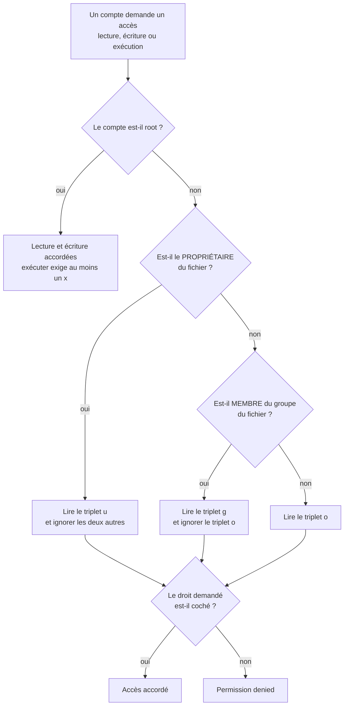
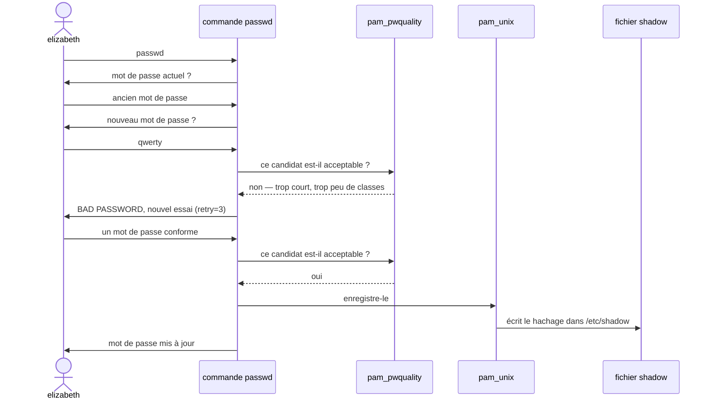
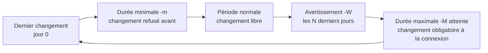
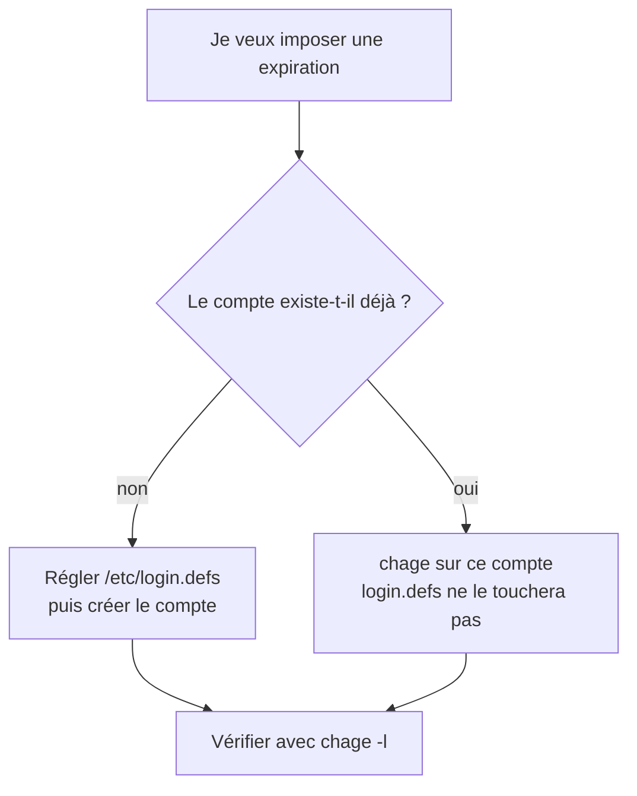

# Sécurité des utilisateurs — permissions et mots de passe

## L'idée en une image {diapos="62, 63"}

Imagine un immeuble de bureaux. Le module précédent, **Comptes, groupes et sudo**, a distribué les
**badges** : chaque personne a le sien (un compte), certains badges portent l'autocollant d'une
équipe (un groupe), et quelques-uns ouvrent la salle des serveurs (les administrateurs).

Un badge ne sert à rien tant que les **portes** ne savent pas qui laisser passer. Cette leçon règle
les portes. Sur chaque porte — chaque fichier, chaque répertoire — est collée une petite fiche à
trois lignes :

- une ligne pour **l'occupant du bureau** (le propriétaire du fichier) ;
- une ligne pour **son équipe** (le groupe du fichier) ;
- une ligne pour **tous les autres** employés de l'immeuble.

Sur chaque ligne, trois cases à cocher : *entrer et regarder*, *modifier*, *utiliser la machine*. En
langage Linux : lecture, écriture, exécution. Le lecteur de badge regarde qui tu es, choisit **la
ligne qui te concerne**, et lit les trois cases de cette ligne-là.

Puis vient la seconde moitié de la leçon : un badge peut se perdre ou se copier. La **politique de
mots de passe** décide à quel point le code d'un badge doit être difficile à deviner, et combien de
temps il reste valide.

**Où l'analogie casse — trois fois.**

- **Le lecteur de badge ne lit qu'UNE ligne.** Dans un vrai immeuble, un employé qui fait partie de
  l'équipe passe au moins aussi bien qu'un inconnu. Sous Linux, non : si tu es le propriétaire, seule
  la ligne du propriétaire compte, même si elle est plus pauvre que celle des « autres ». La section
  « Comment le système choisit la ligne qui s'applique » le montre.
- **Il existe un passe-partout qui ignore les fiches.** Le compte `root` n'est pas arrêté par les
  cases de lecture et d'écriture. Les permissions protègent les utilisateurs les uns des autres ;
  elles ne protègent rien contre l'administrateur.
- **Une porte de bureau n'a pas de contenu ; un répertoire, si.** Les trois cases ne veulent pas dire
  la même chose sur un fichier (le document) et sur un répertoire (la pièce qui contient des
  documents). C'est la source d'erreur numéro un de la séance, et elle a sa propre section.

::: cours {diapos="62, 63"}
La séance 5 du cours 420-B10-HU enchaîne : après avoir créé des utilisateurs et des groupes, on
définit des accès sur les fichiers et les répertoires en fonction du compte et des groupes. Quatre
commandes portent cette partie : `ls -l`, `chmod`, `chown` et `chgrp`. La politique de mots de passe
suit, en deux volets : la complexité et l'expiration.
:::

::: cours {diapos="118"}
La diapositive 118 annonce que l'examen 1 porte sur la matière des cours 1 à 4. La séance 5 n'y est
donc pas. C'est le calendrier de l'enseignant qui la place dans la portée de l'examen final (cours 1
à 5 et 7 à 9). Ce n'est pas une raison de la survoler — les
exercices de la séance se font sur ton serveur, et ce qu'ils règlent (droits d'un répertoire,
politique de mots de passe) revient dans le durcissement de tout serveur que tu administreras.
:::

## En bref — la marche à suivre {diapos="64, 69, 74-77, 79, 80, 83, 86, 94-96, 103-107, 110, 111"}

:::: marche-a-suivre {titre="Réserver un répertoire à un groupe, puis imposer une politique de mots de passe"}

1. {voir="Les sept colonnes de ls -l"} Lis d'abord l'état actuel : permissions, propriétaire et
   groupe de la cible.

   ```bash
   # PuTTY, en root sur le serveur Ubuntu — -d montre le répertoire lui-même, pas son contenu
   ls -ld /cegep
   ```

2. {voir="chown : changer le propriétaire"} Donne le fichier ou le répertoire à son propriétaire.

   ```bash
   # PuTTY, en root sur le serveur Ubuntu — seul root peut céder un fichier à quelqu'un d'autre
   chown alexandre demo.txt
   ```

3. {voir="chgrp : changer le groupe"} Rattache la cible au groupe qui doit la partager.

   ```bash
   # PuTTY, en root sur le serveur Ubuntu — le groupe doit exister (voir le module précédent)
   chgrp enseignant /cegep
   ```

4. {voir="La notation numérique"} Pose le profil complet en notation numérique : un chiffre pour le
   propriétaire, un pour le groupe, un pour les autres.

   ```bash
   # PuTTY, en root sur le serveur Ubuntu — 7 = rwx, 5 = r-x, 4 = r--
   chmod 754 demo.txt
   ```

5. {voir="La notation symbolique"} Ajuste un seul droit en notation symbolique, sans toucher aux
   autres.

   ```bash
   # PuTTY, en root sur le serveur Ubuntu — retire tout aux « autres », laisse u et g intacts
   chmod o-rwx demo.txt
   ```

6. {voir="Installer PW Quality et vérifier le module"} Installe PW Quality, puis vérifie que le
   module est branché dans la pile des mots de passe.

   ```bash
   # PuTTY, en root sur le serveur Ubuntu — le paquet ajoute lui-même la ligne dans common-password
   apt-get install libpam-pwquality && grep pwquality /etc/pam.d/common-password
   ```

7. {voir="Régler les critères dans pwquality.conf"} Décommente et règle les critères dans
   `/etc/security/pwquality.conf`, puis teste avec un compte ordinaire, pas avec root.

   ```bash
   # PuTTY, en root — après avoir décommenté minlen et minclass dans /etc/security/pwquality.conf
   grep -E '^(minlen|minclass)' /etc/security/pwquality.conf
   ```

8. {voie="moderne"} {voir="Ce que recommande le NIST aujourd'hui"} En production, préfère une
   longueur minimale élevée sans règle de composition, et une vérification contre les mots de passe
   ayant fuité.

9. {voir="Lire et régler l'expiration d'un compte"} Affiche puis règle l'expiration d'un compte
   existant.

   ```bash
   # PuTTY, en root sur le serveur Ubuntu — -M durée de validité, -W jours d'avertissement
   chage -l sara && chage -M 30 -W 7 sara
   ```

10. {voir="Forcer le changement et changer un mot de passe"} Oblige un compte à changer son mot de
    passe à la prochaine connexion, par exemple après lui avoir donné un mot de passe temporaire.

    ```bash
    # PuTTY, en root sur le serveur Ubuntu — la valeur réservée « 0 » force le changement à la prochaine connexion
    chage -d 0 elizabeth
    ```

11. {voir="La politique uniformisée dans login.defs"} Pour les comptes créés ensuite, écris les
    mêmes valeurs dans `/etc/login.defs`.

    ```bash
    # PuTTY, en root — après avoir réglé PASS_MAX_DAYS et PASS_WARN_AGE dans /etc/login.defs
    grep -E '^PASS_(MAX_DAYS|WARN_AGE)' /etc/login.defs
    ```

::::

## Lire les droits d'un fichier avec ls -l {diapos="61, 64-67"}

Tu connais déjà `ls`, qui liste les noms des fichiers d'un répertoire. Avec l'option `-l` (*long*),
chaque fichier occupe une ligne entière, et cette ligne dit **qui** peut **quoi**. C'est le geste qui
précède et qui suit tout réglage de droits : on lit avant de modifier, on relit après.

### Les sept colonnes de ls -l {diapos="65, 66"}

```text
# PuTTY, sur le serveur Ubuntu — sortie de la commande : ls -l /root
-rwxr-xr-- 1 root root  512 Sep 21 10:04 demo.txt
drwxr-xr-x 2 root root 4096 Sep 21 10:02 scripts
```

| Colonne | Exemple | Ce qu'elle dit |
|---|---|---|
| 1. Permissions | `-rwxr-xr--` | le type d'entrée, puis les trois triplets de droits |
| 2. Nombre de liens | `1` | combien de noms désignent ce fichier ou ce répertoire |
| 3. Propriétaire | `root` | le compte qui possède l'entrée |
| 4. Groupe | `root` | le groupe rattaché à l'entrée |
| 5. Taille | `512` | en octets |
| 6. Date | `Sep 21 10:04` | la dernière modification |
| 7. Nom | `demo.txt` | le nom du fichier ou du répertoire |

La première colonne se lit en quatre morceaux. Le **premier caractère** est le type : `-` pour un
fichier ordinaire, `d` pour un répertoire (*directory*), `l` pour un lien symbolique. Les **neuf
suivants** forment trois triplets : propriétaire, groupe, autres. Dans chaque triplet, la lettre
présente veut dire « accordé », le tiret veut dire « refusé », et l'ordre est toujours le même :
`r`, puis `w`, puis `x`.

```text
# Lecture de la colonne 1 de demo.txt, découpée à la main
-    rwx    r-x    r--
│    │      │      └── autres      : lecture seule
│    │      └───────── groupe      : lecture et exécution
│    └──────────────── propriétaire : lecture, écriture, exécution
└───────────────────── type        : fichier ordinaire
```

::: complement
Pour lire les droits d'un **répertoire lui-même**, et non ceux des fichiers qu'il contient, ajoute
`-d` : `ls -ld /cegep`. Sans lui, `ls -l /cegep` liste le contenu du répertoire, et une ligne vide ne
dit rien de la porte d'entrée. C'est l'oubli le plus fréquent au moment de vérifier un exercice.
:::

### Trois questions : quels droits, à qui, pour quel groupe {diapos="67"}

Parmi les sept colonnes, le cours n'en retient que trois, et elles répondent à trois questions :

1. **Quels droits ?** la colonne des permissions ;
2. **Qui est le propriétaire ?** la colonne 3 ;
3. **Quel groupe ?** la colonne 4.

Chacune a sa commande de modification : `chmod` pour les permissions, `chown` pour le propriétaire,
`chgrp` pour le groupe. Tout le reste de cette partie de la séance tient dans ces trois commandes.

::: cours {diapos="67"}
Les permissions sont accordées au propriétaire, aux membres du groupe assigné au fichier ou au
répertoire, et au reste des utilisateurs, que le cours appelle « le reste du monde ».
:::

## Les bits d'accès {diapos="68, 70-72"}

Un **bit d'accès** est une case à deux états, accordé ou refusé. Il y en a neuf par fichier : trois
droits multipliés par trois classes d'utilisateurs.

### Trois classes, trois droits {diapos="70"}

| Classe | Lettre en notation symbolique | Qui est dedans |
|---|---|---|
| Propriétaire | `u` (*user*) | le seul compte nommé en colonne 3 |
| Groupe | `g` (*group*) | les membres du groupe nommé en colonne 4 |
| Autres | `o` (*others*) | tous les comptes qui ne sont ni l'un ni l'autre |

| Droit | Lettre | Sur un fichier |
|---|---|---|
| Lecture | `r` (*read*) | lire le contenu |
| Écriture | `w` (*write*) | modifier le contenu |
| Exécution | `x` (*execute*) | lancer le fichier comme programme ou script |

### Le même bit ne veut pas dire la même chose sur un répertoire {diapos="71"}

Un répertoire est, pour le système, une **liste de noms** : chaque entrée associe un nom à un fichier.
Les trois droits portent donc sur cette liste, pas sur les documents qu'elle désigne.

| Droit | Sur un fichier | Sur un répertoire |
|---|---|---|
| `r` | lire le contenu du fichier | lister les noms qu'il contient |
| `w` | modifier le fichier | créer, supprimer ou renommer des entrées |
| `x` | exécuter le fichier | entrer dedans et traverser vers ce qu'il contient |

Deux conséquences qui piègent tout le monde au moins une fois :

- **`w` sur un répertoire est inutile sans `x`.** Pour créer un fichier dans `/cegep`, il faut à la
  fois pouvoir modifier la liste (`w`) et entrer dans la pièce (`x`). Un droit d'écriture « complet »
  sur un répertoire s'écrit donc `rwx`, jamais `rw-`.
- **`r` sans `x` sur un répertoire donne une liste de noms qu'on ne peut pas ouvrir.** `ls` affiche
  les noms (avec des messages d'erreur à la place des détails), mais aucun fichier n'est accessible.
  Un accès « en lecture » utile à un répertoire s'écrit `r-x`.

::: cours {diapos="71"}
Le cours donne, pour un répertoire : lecture = voir le contenu du répertoire ; écriture = modifier
les fichiers et répertoires dans le répertoire ; exécution = accéder au répertoire. Pour un fichier :
lecture = lire le contenu ; écriture = modifier le fichier ; exécution = exécuter le fichier (script
ou programme).
:::

::: correction-du-cours {source="GNU Coreutils Manual, section « Structure of File Mode Bits », gnu.org/software/coreutils/manual/html_node/Mode-Structure.html" diapos="71"}
« Écriture sur un répertoire = modifier les fichiers dans le répertoire » est imprécis, et
l'imprécision a des conséquences. Le `w` d'un répertoire permet de **créer, supprimer et renommer**
ses entrées ; il ne permet **pas** de modifier le contenu d'un fichier existant — ça, c'est le `w` du
**fichier** lui-même qui le décide. Deux cas le montrent : un fichier en `rw-rw-rw-` dans un
répertoire où tu n'as pas `w` se modifie quand même (si tu as `x` sur le répertoire), mais ne se
supprime pas ; un fichier en `r--r--r--` dans un répertoire où tu as `w` et `x` ne se modifie pas,
mais se **supprime** (sauf si le répertoire porte le sticky bit, comme `/tmp`). À
l'examen, donne la formulation du cours ; au moment de régler un serveur, raisonne avec celle-ci.
:::

### Comment le système choisit la ligne qui s'applique {hors-cours}

Quand un compte tente d'ouvrir un fichier, le noyau (le cœur du système d'exploitation, qui arbitre
tous les accès) ne cumule pas les trois triplets. Il en choisit **un seul**, dans cet ordre, et
s'arrête au premier qui correspond :



La conséquence contre-intuitive : un propriétaire peut avoir **moins** de droits que le reste du
monde.

```text
# PuTTY, connecté en alexandre — sortie de : ls -l notes.txt, puis de : cat notes.txt
----r--r-- 1 alexandre enseignant 42 Sep 21 11:04 notes.txt
cat: notes.txt: Permission denied
```

Alexandre est le propriétaire : le triplet `u` (`---`) s'applique, et le `r--` des autres ne le
rattrape pas. Ce n'est pas une protection **contre** lui : le propriétaire garde toujours le droit de
lancer `chmod` sur son propre fichier, et `chmod u+r notes.txt` lui rend la lecture.

::: complement
Deux précisions sur le losange « root » du diagramme. D'abord, root n'est pas arrêté par les bits de
lecture et d'écriture, mais pour **exécuter** un fichier il faut qu'au moins un `x` soit coché
quelque part : root ne lance pas comme programme un fichier que personne ne peut exécuter. Ensuite,
c'est pour ça que l'exercice 12 dit « les autres utilisateurs — root excepté » : aucun réglage de
`chmod` ne limite root, et il ne sert à rien de le chercher.
:::

## Poser les droits avec chmod {diapos="69, 72, 73"}

`chmod` (*change mode*) modifie les neuf bits d'accès. Sa syntaxe est toujours la même : les droits,
puis la cible.

```bash
# PuTTY, en root sur le serveur Ubuntu — dans le répertoire où se trouve demo.txt
chmod 751 demo.txt
```

Le cours pose ensuite un cas concret, qui sert de fil pour les deux notations : on veut que le
**propriétaire** ait tous les accès, que le **groupe** puisse lire et exécuter, et que **tous les
autres** puissent seulement lire. Deux façons de l'écrire existent : la notation numérique et la
notation symbolique.

### La notation numérique {diapos="74-77"}

**L'idée.** Chaque triplet `rwx` est un nombre binaire à trois chiffres : une case cochée vaut 1, une
case vide vaut 0. Et comme tout nombre binaire à trois chiffres, il s'écrit en un seul chiffre
décimal de 0 à 7. On lit les positions de gauche à droite avec leurs poids :

| Droit | Position dans le triplet | Poids |
|---|---|---|
| Lecture `r` | 1re | 4 |
| Écriture `w` | 2e | 2 |
| Exécution `x` | 3e | 1 |

On additionne les poids des droits accordés. Lecture et exécution : binaire `101`, donc
4 + 1 = **5**. Tous les droits : 4 + 2 + 1 = **7**. Lecture seule : **4**. Aucun droit : **0**.

La notation numérique aligne ensuite trois de ces chiffres, **toujours dans l'ordre** propriétaire,
groupe, autres. Pour le cas du cours :

| Classe | Droits voulus | Calcul | Chiffre |
|---|---|---|---|
| Propriétaire | lecture, écriture, exécution | 4 + 2 + 1 | 7 |
| Groupe | lecture, exécution | 4 + 1 | 5 |
| Autres | lecture | 4 | 4 |

```bash
# PuTTY, en root sur le serveur Ubuntu — dans le répertoire où se trouve demo.txt
chmod 754 demo.txt
```

Les huit chiffres possibles valent la peine d'être connus par cœur, parce qu'on les relit dans les
deux sens :

| Chiffre | Triplet | Chiffre | Triplet |
|---|---|---|---|
| 0 | `---` | 4 | `r--` |
| 1 | `--x` | 5 | `r-x` |
| 2 | `-w-` | 6 | `rw-` |
| 3 | `-wx` | 7 | `rwx` |

**Analogie.** Trois interrupteurs côte à côte, qui valent 4, 2 et 1 : le chiffre est la somme des
interrupteurs allumés. Chaque somme de 0 à 7 correspond à une seule combinaison, ce qui rend la
lecture inverse possible. L'analogie casse sur un point : un interrupteur d'éclairage n'a pas d'ordre
de priorité, alors que les **trois chiffres** d'un `chmod`, eux, n'ont de sens que dans l'ordre
`u`, `g`, `o` — `754` et `457` sont deux profils opposés.

**Ce que la notation numérique ne sait pas faire** : ajuster. Elle pose les neuf bits d'un coup. Pour
retirer seulement l'écriture au groupe, il faut recalculer les trois chiffres, et le risque est
d'écraser au passage un droit qu'on voulait garder.

::: correction-du-cours {source="Cours05_Securite_utilisateurs, diapositive 75 du même support : lecture = 4, écriture = 2, exécution = 1" diapos="76"}
La diapositive 76 annonce « le droit de lecture (1) et d'exécution (4) » : les deux nombres entre
parenthèses sont intervertis. La démarche qui suit sur la même diapositive donne, elle, les bonnes
valeurs — lecture 4, exécution 1, binaire `101`, somme 5 — et c'est elle qu'il faut retenir.
:::

### La notation symbolique {diapos="78-81"}

La notation symbolique décrit une **modification** plutôt qu'un état. Elle assemble trois morceaux,
sans espace entre eux :

1. **à qui** : `u` (propriétaire), `g` (groupe), `o` (autres), `a` (*all*, les trois à la fois) ;
2. **l'opération** : `+` ajoute, `-` retire ;
3. **quels droits** : `r`, `w`, `x`, seuls ou combinés.

Les exemples du cours, sur un fichier `demo.php` :

```bash
# PuTTY, en root sur le serveur Ubuntu — dans le répertoire où se trouve demo.php
chmod g+rw demo.php       # ajoute lecture et écriture au groupe
chmod g+x,o+x demo.php    # ajoute l'exécution au groupe ET aux autres : deux clauses, une virgule
chmod o-rwx demo.php      # retire tous les droits aux autres
chmod a+rwx demo.php      # donne tous les droits à tout le monde (voir l'Exemple complet)
```

La force de cette notation : **elle ne touche que ce qu'elle nomme**. `chmod o-rwx` laisse les
triplets `u` et `g` exactement comme ils étaient, sans qu'on ait besoin de les connaître.

::: complement
Deux compléments, absents des diapositives, qu'on rencontre dans tous les tutoriels.
**L'opérateur `=`** pose un triplet exactement, en effaçant ce qui n'est pas nommé :
`chmod u=rwx,g=rx,o=r demo.txt` est l'équivalent symbolique exact de `chmod 754 demo.txt`, et
`chmod o= demo.txt` retire tout aux autres. **Le `X` majuscule** ajoute l'exécution **seulement**
aux répertoires et aux fichiers déjà exécutables : `chmod -R u=rwX,g=rX,o= /var/www/html` rend
toute l'arborescence traversable sans rendre exécutables les pages `.php` et les images.
:::

### Choisir sa notation {hors-cours}

Les deux notations produisent exactement les mêmes neuf bits ; elles diffèrent par ce qu'elles
**demandent de savoir**. La numérique décrit l'état complet, donc elle exige de connaître les trois
triplets voulus. La symbolique décrit un écart, donc elle n'exige de connaître que ce qui change.

Sur l'exemple du répertoire `/cegep` de l'exercice 12, où l'on veut `rwxrwxr-x`, les deux écritures
sont `chmod 775 /cegep` et `chmod u=rwx,g=rwx,o=rx /cegep`. Elles donnent le même résultat :

:::: methodes
::: methode {libelle="Notation numérique" defaut}
```bash
# PuTTY, en root sur le serveur Ubuntu — pose les neuf bits d'un coup
chmod 775 /cegep
```
:::
::: methode {libelle="Notation symbolique"}
```bash
# PuTTY, en root sur le serveur Ubuntu — même résultat, triplet par triplet
chmod u=rwx,g=rwx,o=rx /cegep
```
:::
::::

La règle pratique : **numérique pour poser** un profil sur un fichier neuf, **symbolique pour
ajuster** un fichier dont on ne veut pas écraser le reste.

## Changer le propriétaire et le groupe {diapos="82-88"}

`chmod` décide **quels droits** reçoit chaque ligne de la fiche. Encore faut-il que les bonnes
personnes soient sur les bonnes lignes : c'est le rôle de `chown` et de `chgrp`. Tout fichier a
exactement **un** propriétaire et **un** groupe.

### chown : changer le propriétaire {diapos="82-84"}

`chown` (*change owner*) désigne le compte propriétaire : la syntaxe est le nouvel utilisateur, puis
la cible.

```bash
# PuTTY, en root sur le serveur Ubuntu — alexandre a été créé au module précédent
ls -l demo.txt
chown alexandre demo.txt
ls -l demo.txt
```

```text
# Sortie des deux ls -l ci-dessus : seule la colonne 3 a changé
-rwxr-xr-- 1 root      root 512 Sep 21 10:04 demo.txt
-rwxr-xr-- 1 alexandre root 512 Sep 21 10:04 demo.txt
```

::: cours {diapos="84"}
Le fichier `demo.txt` était assigné à l'utilisateur `root` ; après `chown`, il est assigné à
l'utilisateur `alexandre`, créé plus tôt dans la séance.
:::

::: complement
**Seul root peut donner un fichier à quelqu'un d'autre.** Un utilisateur ordinaire ne peut pas céder
la propriété d'un de ses fichiers : sinon il pourrait faire porter à un autre compte un fichier
compromettant, ou contourner un quota d'espace disque. `chown` accepte aussi le couple
propriétaire:groupe en une seule commande — `chown alexandre:enseignant demo.txt` — et l'option `-R`
(*récursif*) l'applique à toute une arborescence. Un `chown -R` lancé au mauvais endroit (`/etc`,
`/usr`) est l'erreur la plus coûteuse de cette séance : aucun journal ne garde les propriétaires
d'origine.
:::

### chgrp : changer le groupe {diapos="85-87"}

`chgrp` (*change group*) désigne le groupe du fichier : la syntaxe est le nouveau groupe, puis la
cible.

```bash
# PuTTY, en root sur le serveur Ubuntu — le groupe test doit déjà exister
chgrp test demo.txt
ls -l demo.txt
```

```text
# Sortie du ls -l ci-dessus : seule la colonne 4 a changé
-rwxr-xr-- 1 alexandre test 512 Sep 21 10:04 demo.txt
```

::: cours {diapos="87"}
Le fichier `demo.txt` était assigné au groupe `root` ; après `chgrp`, il est assigné au groupe
`test`, créé plus tôt dans la séance.
:::

::: correction-du-cours {source="chgrp(1), GNU Coreutils — synopsis « chgrp [OPTION]... GROUP FILE... », man7.org/linux/man-pages/man1/chgrp.1.html" diapos="86"}
La diapositive 86 donne la syntaxe `chgrp <utilisateur> <fichier/répertoire>`. Le premier argument
est un **groupe**, pas un utilisateur — c'est d'ailleurs ce que montre l'exemple de la diapositive
suivante, avec le groupe `test`. La syntaxe juste est `chgrp <groupe> <fichier/répertoire>`. Un nom
d'utilisateur ne fonctionne que par coïncidence, quand il existe aussi un groupe du même nom (ce que
fait `adduser` en créant le groupe personnel de chaque compte).
:::

Tu as maintenant les trois commandes, et c'est le moment de l'exercice qui les réunit.

::: exercice-du-cours {ref="12"}
Trois gestes, dans cet ordre : créer le répertoire, lui attribuer le groupe, poser les droits. Le
propriétaire restera `root`, qui a créé le répertoire, et c'est très bien. La vraie question est le
chiffre : les enseignants doivent pouvoir **créer** des fichiers dans le répertoire, ce qui exige
`rwx` et pas seulement `rw-` (revois « Le même bit ne veut pas dire la même chose sur un
répertoire »). Pour « les autres, en lecture », demande-toi ce qu'un `r--` seul permet sur un
répertoire, comparé à `r-x`, et écris ta justification à côté du chiffre retenu. Termine par
`ls -ld /cegep` pour relire le résultat.
:::

::: exercice-du-cours {ref="13"}
Si Alexandre a été ajouté au groupe `enseignant` pendant qu'une de ses sessions était ouverte, cette
session **ne le sait pas** : l'appartenance aux groupes est lue à l'ouverture de session. Ouvre-lui
une session neuve (`su - alexandre`) et vérifie avec `id` que `enseignant` figure dans la liste avant
de conclure que les droits sont faux. Pour la vérification « de l'autre côté », passe à un compte
étudiant et tente la même création : le message attendu est `Permission denied`.
:::

### Et les fichiers créés ensuite {hors-cours}

L'exercice 13 laisse un détail en suspens : le fichier qu'Alexandre crée dans `/cegep` n'appartient
**pas** au groupe `enseignant`. Un fichier neuf reçoit le groupe **principal** de son créateur — ici,
le groupe personnel `alexandre` — et des droits calculés par le masque de création.

```text
# PuTTY, connecté en alexandre — sortie de : ls -l /cegep, après avoir créé plan.txt
-rw-rw-r-- 1 alexandre alexandre 120 Sep 21 11:30 plan.txt
```

Le `w` du groupe ne profite qu'au groupe `alexandre`, qui ne contient qu'Alexandre : pour ce fichier,
les autres enseignants restent des « autres ». Ils peuvent donc lire `plan.txt`, mais pas le
modifier. Deux réglages expliquent ou règlent ce cas, et aucun des deux n'est dans les diapositives.

::: complement
**Le bit setgid sur un répertoire** fait hériter à tout fichier créé dedans le **groupe du
répertoire** plutôt que celui du créateur : `chmod g+s /cegep` (ou le quatrième chiffre, `chmod 2775
/cegep`). `ls -ld` l'affiche par un `s` à la place du `x` du groupe : `drwxrwsr-x`. C'est la façon
standard de monter un répertoire d'équipe, et c'est lui qui règle l'exercice : avec le groupe
`enseignant` hérité, le `w` du groupe profite enfin aux autres enseignants.

**Le `umask`** (masque de création) retire des droits à tout fichier neuf. Le `umask` vaut `0022`
pour root, mais généralement `0002` pour un compte ordinaire sur Ubuntu : chaque compte a son groupe
personnel, et le réglage `USERGROUPS_ENAB` de `/etc/login.defs` laisse alors l'écriture au groupe
(d'où le `rw-rw-r--` ci-dessus). Vérifie-le en tapant `umask` dans la session d'alexandre. Le
`umask` n'agit que sur ce qui est créé **après** son réglage ; il ne corrige rien de ce qui existe.
Sources : pam_umask(8), option `usergroups`, et login.defs(5), pages de manuel d'Ubuntu 24.04.
:::

## La politique de mots de passe {diapos="88-91"}

Les droits sur les fichiers supposent une chose : que le compte qui se présente est bien celui qu'il
prétend être. Si le mot de passe d'Alexandre se devine, tous les réglages de `/cegep` travaillent pour
l'attaquant. Une **politique de mots de passe** est l'ensemble des règles qu'une organisation impose
aux mots de passe de ses systèmes. Le cours en traite deux volets :

- **la complexité** — à quel point un mot de passe doit être difficile à deviner ;
- **l'expiration** — combien de temps il reste valide.

### Complexité : le module PW Quality {diapos="92, 93"}

Sous Linux, ce n'est pas la commande `passwd` elle-même qui juge un nouveau mot de passe. Elle
délègue à **PAM** (*Pluggable Authentication Modules*, modules d'authentification enfichables) : une
pile de petits modules, chacun chargé d'une vérification, que le système parcourt dans l'ordre. **PW
Quality** (`pam_pwquality`) est le module qui mesure la qualité d'un mot de passe proposé et le
refuse s'il ne respecte pas les critères.



**Analogie.** Le videur d'une boîte de nuit ne décide pas qui a une réservation — c'est la liste à
l'accueil. Lui vérifie seulement la tenue, et renvoie à la porte ce qui ne respecte pas le code. PW
Quality est ce videur : il ne sait rien de ton identité, il juge seulement si le mot de passe
proposé est « présentable ». L'analogie casse sur un point qui compte à l'exercice 14 : ce videur
laisse passer le patron. Quand c'est **root** qui change un mot de passe, PW Quality affiche son
avertissement mais **n'empêche rien**.

::: cours {diapos="93"}
Une politique de complexité s'assure qu'un utilisateur choisit un mot de passe suffisamment complexe
pour éviter qu'un pirate le trouve facilement. Elle peut porter sur un nombre minimum de caractères,
sur l'usage de types de caractères (chiffre, majuscule, caractère spécial), et ainsi de suite. Le
cours emploie pour cela le module PW Quality.
:::

### Installer PW Quality et vérifier le module {diapos="94, 95"}

```bash
# PuTTY, en root sur le serveur Ubuntu — paquet des dépôts Ubuntu, aucune source externe
apt-get install libpam-pwquality
```

L'installation ajoute d'elle-même le module à la pile des mots de passe. Le cours demande de le
vérifier en ouvrant `/etc/pam.d/common-password`, le fichier que toutes les commandes de changement
de mot de passe d'Ubuntu consultent :

```bash
# PuTTY, en root sur le serveur Ubuntu — lecture seule, rien à modifier dans ce fichier
grep pam_pwquality /etc/pam.d/common-password
```

```text
# Ligne attendue dans /etc/pam.d/common-password
password        requisite                       pam_pwquality.so retry=3
```

Les trois mots de cette ligne se lisent ainsi : `password`, la pile concernée (le changement de mot
de passe) ; `requisite`, « si ce module refuse, on arrête tout de suite » ; `retry=3`, trois essais
avant d'abandonner.

::: attention
N'édite pas `common-password` à la main pour « ajouter » le module s'il semble manquer : une faute
dans ce fichier peut empêcher **tout** changement de mot de passe sur le serveur. Si la ligne est
absente, réinstalle le paquet, qui la replace lui-même, et garde une seconde session root ouverte
pendant que tu testes.
:::

### Régler les critères dans pwquality.conf {diapos="96-99"}

Les critères vivent dans un fichier à part, `/etc/security/pwquality.conf`. Chaque critère y figure
**commenté** (précédé d'un `#`) avec une explication. Pour l'activer : retirer le `#`, puis régler la
valeur.

```bash
# PuTTY, en root sur le serveur Ubuntu — ouvre le fichier des critères dans l'éditeur nano
nano /etc/security/pwquality.conf
```

```text
# Fichier /etc/security/pwquality.conf — les deux lignes décommentées pour l'exercice 14
minlen = 8
minclass = 3
```

| Critère | Ce qu'il exige |
|---|---|
| `minlen` | une longueur minimale |
| `minclass` | un nombre minimal de **classes** de caractères différentes parmi quatre : minuscules, majuscules, chiffres, caractères spéciaux |

Avec `minclass = 3`, `motdepasse` (une seule classe) est refusé, `Motdepasse` (deux classes) aussi,
et `Motdepasse7` (trois classes) satisfait `minclass`, ce qui ne garantit pas qu'il soit accepté : le
module fait aussi par défaut un contrôle de dictionnaire (`dictcheck = 1`, bibliothèque cracklib),
qui peut refuser un candidat tiré d'un mot de sa liste. Teste-le sur ton serveur.

::: cours {diapos="98, 99"}
L'exemple du cours exige au moins 3 caractères et 3 classes de caractères différentes (trois parmi
minuscule, majuscule, chiffre, caractère spécial). Une fois le fichier enregistré, un message
d'erreur apparaît quand un mot de passe proposé ne respecte pas les règles.
:::

::: correction-du-cours {source="pwquality.conf(5), Ubuntu noble, option minlen" diapos="98"}
La diapositive 98 annonce « au moins 3 caractères ». Avec PW Quality, `minlen` ne peut pas descendre
sous 6 : aucun réglage n'impose un minimum de 3 caractères. À l'examen, donne la réponse du cours ;
sur un serveur, la valeur utile commence à 8.
:::

::: complement
Le module accorde aussi des « crédits » (`dcredit`, `ucredit`, `lcredit`, `ocredit`) qui peuvent
faire compter un chiffre ou une majuscule comme un caractère de plus dans le calcul de `minlen`. Dans
la version livrée par Ubuntu, ces crédits sont à 0 par défaut (pwquality.conf(5), Ubuntu 24.04 :
« default 0 » pour chacun) : `minlen = 8` y veut dire huit caractères réels. D'autres réglages existent dans le même fichier — `maxrepeat` (caractères répétés),
`dictcheck` (refus des mots du dictionnaire), `enforce_for_root` (appliquer les règles même quand
root change le mot de passe).
:::
::: exercice-du-cours {ref="14"}
Les deux critères de l'énoncé correspondent chacun à une ligne du fichier. Le piège est dans le
test : si c'est **root** qui lance `passwd elizabeth`, le module affiche `BAD PASSWORD` mais accepte
quand même `qwerty` — le refus ne s'applique pas à l'administrateur tant que `enforce_for_root`
n'est pas activé. Passe donc dans le compte d'Elizabeth (`su - elizabeth`) et lance `passwd` sans
argument : il te demandera d'abord son mot de passe actuel, celui que tu as noté à l'exercice 2 du
module précédent.
:::

### Ce que recommande le NIST aujourd'hui {hors-cours}

Le **NIST** (*National Institute of Standards and Technology*, l'organisme américain de normalisation
dont les guides de sécurité servent de référence bien au-delà des États-Unis) publie, dans le
document **SP 800-63B**, des recommandations sur les mots de passe. Elles ont pris le contre-pied des
règles de composition dès 2017, et la **révision 4, publiée en 2025**, a durci le ton : ce qui était
« ne devrait pas » est devenu « ne doit pas ».

La raison n'est pas une mode. Face à une règle « une majuscule, un chiffre, un symbole », les humains
réagissent de façon **prévisible** : majuscule au début, chiffre et point d'exclamation à la fin.
`Password1!` respecte toutes les règles classiques et figure dans les premières lignes de toute
liste de mots de passe ayant fuité. Et chaque contrainte imposée **réduit** l'espace que l'attaquant
doit fouiller : il n'a plus à essayer les candidats que la règle interdit.

| Question | Politique du cours | NIST SP 800-63B, révision 4 (2025) |
|---|---|---|
| Longueur minimale | un minimum fixé par `minlen` | 15 caractères quand le mot de passe est le seul facteur ; 8 avec un second facteur |
| Classes de caractères imposées | oui, `minclass` | **interdites** |
| Changement périodique | bonne pratique, à une fréquence choisie | **interdit** sans signe de compromission |
| Liste de mots de passe compromis | non abordée | **obligatoire** : refuser un mot de passe qui a déjà fuité |

::: correction-du-cours {source="NIST SP 800-63B, révision 4 (2025), « Password Verifiers », https://pages.nist.gov/800-63-4/sp800-63b.html#passwordver — synthèse tirée de la fiche KB web/securite/stockage-mots-de-passe.md" diapos="93, 98"}
Le cours impose des classes de caractères (`minclass`) : c'est la doctrine des années 2000-2010, que
le NIST proscrit aujourd'hui. **À l'examen, donne la réponse du cours** — installer PW Quality,
régler `minlen` et `minclass` dans `/etc/security/pwquality.conf`. **En production**, préfère une
longueur minimale élevée sans règle de composition, et un refus des mots de passe connus pour avoir
fuité ; PW Quality sait faire la première moitié (`minlen` haut, `minclass = 0`) et, par son contrôle
de dictionnaire, une partie de la seconde.
:::

## Expiration du mot de passe {diapos="100-102"}

Le second volet de la politique limite la **durée de vie** d'un mot de passe. Le raisonnement du
cours : si un mot de passe est découvert par quelqu'un qui n'y a pas droit, le changer à une certaine
fréquence referme la fenêtre pendant laquelle il sert. La fréquence exacte dépend de l'organisation
et du système protégé.

Sous Linux, ces réglages sont rangés **par compte**, dans `/etc/shadow`, et ils se lisent et se
modifient avec `chage` (*change age*). Le cours en couvre sept opérations : afficher, durée maximale,
durée minimale, avertissement, changement forcé, changement du mot de passe, politique uniformisée.

**Analogie.** Une carte d'accès d'hôtel : elle est encodée pour la durée du séjour, l'écran de la
porte prévient la veille du départ, et la réception peut la désactiver d'avance pour forcer un
passage au comptoir. L'analogie casse sur la date de départ : la carte d'hôtel expire à une date
fixe, alors qu'un mot de passe expire **N jours après son dernier changement** — le compteur repart
à chaque changement, pas au moment où tu règles la durée.



::: cours {diapos="101"}
Pour limiter les risques liés à l'utilisation d'un mot de passe par un utilisateur non autorisé, le
cours présente comme une bonne pratique de le changer à une certaine fréquence, la fréquence exacte
dépendant de l'organisation et du type de système auquel il donne accès.
:::

::: correction-du-cours {source="NIST SP 800-63B, révision 4 (2025), « Password Verifiers », https://pages.nist.gov/800-63-4/sp800-63b.html#passwordver — synthèse tirée de la fiche KB web/securite/stockage-mots-de-passe.md" diapos="101"}
Le changement périodique **obligatoire** n'est plus une bonne pratique : le NIST l'interdit sauf
signe de compromission. Forcé tous les 30 ou 90 jours, un mot de passe évolue par variations
triviales (`Ete2025!`, puis `Ete2025!!`, puis `Automne2025!`) que l'attaquant qui a l'ancien devine
aussitôt, et il finit plus souvent noté sur un papier. **À l'examen, donne la réponse du cours** et
sache régler l'expiration avec `chage` et `/etc/login.defs`. **En production**, garde ces outils pour
ce qu'ils font bien : forcer le changement d'un mot de passe temporaire (`chage -d 0`) ou d'un compte
dont le mot de passe a pu fuiter.
:::

### Lire et régler l'expiration d'un compte {diapos="103-106"}

`chage -l` (*list*) affiche l'état d'un compte, sans rien modifier :

```bash
# PuTTY, en root sur le serveur Ubuntu — un compte ordinaire peut lire le sien, pas celui des autres
chage -l sara
```

```text
# Sortie de chage -l sara sur un compte neuf (valeurs par défaut d'Ubuntu)
Last password change                                    : Sep 21, 2026
Password expires                                        : never
Password inactive                                       : never
Account expires                                         : never
Minimum number of days between password change          : 0
Maximum number of days between password change          : 99999
Number of days of warning before password expires       : 7
```

Trois options règlent ensuite les trois durées du diagramme :

| Option | Réglage | Exemple |
|---|---|---|
| `-m` (minuscule) | durée **minimale** : nombre de jours pendant lesquels un nouveau mot de passe doit être gardé avant de pouvoir être changé | `chage -m 1 sara` |
| `-M` (majuscule) | durée **maximale** : nombre de jours pendant lesquels le mot de passe reste valide | `chage -M 30 sara` |
| `-W` | nombre de jours d'**avertissement** avant l'expiration | `chage -W 7 sara` |

La durée minimale a une raison d'être précise : sans elle, un utilisateur forcé de changer son mot
de passe peut le changer cinq fois de suite dans la minute et revenir à l'ancien.

::: correction-du-cours {source="chage(1), paquet shadow-utils — « -M, --maxdays MAX_DAYS : Set the maximum number of days during which a password is valid », manpages.ubuntu.com/manpages/noble/man1/chage.1.html" diapos="105"}
La diapositive 105 décrit `-M` comme « la durée maximum avant de pouvoir modifier le mot de passe ».
La formule peut se lire à l'envers : « avant de pouvoir modifier », c'est la définition de la durée
**minimale** (`-m`). `-M` règle la durée pendant laquelle le mot de passe reste **valide** ; une fois
dépassée, l'utilisateur est **obligé** de le changer. La commande de la diapositive est juste ; c'est
sa phrase d'introduction qui prête à confusion.
:::

::: attention
Recopier une commande depuis une diapositive peut transformer le trait d'union en **tiret
typographique** : `chage –l` (avec un tiret demi-cadratin) n'est pas `chage -l`, et la commande
répond par une erreur d'option. Si une commande copiée échoue sans raison apparente, retape le tiret
au clavier.
:::

::: exercice-du-cours {ref="15"}
Deux options suffisent, et elles se combinent dans une seule commande `chage`. Lis l'état avant
**et** après : le `chage -l` final doit montrer une date d'expiration au lieu de `never`. Si cette
date tombe dans le passé, c'est que le dernier changement de Sara date de plus de 30 jours — la durée
se compte à partir de ce jour-là, pas d'aujourd'hui.
:::

### Forcer le changement et changer un mot de passe {diapos="107-109"}

`chage -d` règle la date du **dernier changement**. La valeur `0` a un sens réservé : elle oblige
l'utilisateur à changer son mot de passe à sa prochaine connexion, quelle que soit la durée maximale
(chage(1), Ubuntu 24.04).

```bash
# PuTTY, en root sur le serveur Ubuntu — typique après avoir donné un mot de passe temporaire
chage -d 0 elizabeth
```

Le changement lui-même se fait par `passwd`, sans argument pour son propre mot de passe, avec le nom
d'un compte pour celui d'un autre (ce qui exige d'être root) :

```bash
# PuTTY, sur le serveur Ubuntu — la 1re ligne dans ta propre session, la 2e en root
passwd
passwd elizabeth
```

Enfin, les options de `chage` se **combinent** : une seule commande règle plusieurs durées.

```bash
# PuTTY, en root sur le serveur Ubuntu — minimum 1 jour, maximum 30, avertissement 7 jours avant
chage -m 1 -M 30 -W 7 sara
```

::: cours {diapos="107"}
Obliger un utilisateur à changer son mot de passe à sa prochaine connexion (`chage -d 0`) est
particulièrement utile quand l'administrateur lui a attribué un mot de passe temporaire.
:::

### La politique uniformisée dans login.defs {diapos="110-114"}

Régler `chage` compte par compte ne passe pas à l'échelle. Le fichier `/etc/login.defs` porte les
**valeurs par défaut** que le système donne à chaque compte **créé** :

```text
# Fichier /etc/login.defs — les trois lignes à modifier (elles existent déjà, non commentées)
PASS_MAX_DAYS   30
PASS_MIN_DAYS   1
PASS_WARN_AGE   7
```

| Ligne de `/etc/login.defs` | Équivaut à | Valeur livrée par Ubuntu |
|---|---|---|
| `PASS_MAX_DAYS` | `chage -M` | `99999`, soit en pratique jamais |
| `PASS_MIN_DAYS` | `chage -m` | `0` |
| `PASS_WARN_AGE` | `chage -W` | `7` |

Le point décisif est dans le mot **créé**. `login.defs` est lu au moment où un compte naît ; il ne
revient jamais sur les comptes qui existent déjà.



::: cours {diapos="113"}
Les nouvelles valeurs s'appliquent automatiquement au nouveau compte. Pour les appliquer aux comptes
déjà existants, un script est nécessaire.
:::

::: complement
Le « script » dont parle le cours n'est qu'une boucle de `chage` sur les comptes humains. Sur Ubuntu,
les comptes créés par un humain ont un identifiant numérique (UID) de 1000 ou plus ; les comptes de
service (`www-data`, `mysql`…) sont en dessous, et il ne faut pas leur imposer d'expiration :

```bash
# PuTTY, en root sur le serveur Ubuntu — applique la politique aux comptes humains existants
awk -F: '$3 >= 1000 && $1 != "nobody" { print $1 }' /etc/passwd | while read -r compte; do chage -M 30 -W 7 "$compte"; done
```
:::

::: exercice-du-cours {ref="16"}
Deux lignes du fichier correspondent aux deux réglages de l'exercice 15. Crée le compte **après**
avoir enregistré le fichier, sinon rien ne change ; puis `chage -l exercice16` doit montrer
`Maximum number of days between password change : 30` et `Number of days of warning before password
expires : 7`. Pour t'en convaincre, compare avec `chage -l sara` — ou mieux, avec un compte créé
avant la modification et jamais passé par `chage`.
:::

## Exemple simple {diapos="74-77"}

On isole un seul mécanisme : passer d'une ligne de `ls -l` au chiffre, et retour.

```text
# PuTTY, sur le serveur Ubuntu — sortie de : ls -l rapport.txt
-rw-r----- 1 alexandre enseignant 2048 Sep 21 14:10 rapport.txt
```

**De la ligne au chiffre.** On retire le premier caractère (`-`, un fichier) et on découpe le reste
en trois triplets : `rw-`, `r--`, `---`. Chaque triplet s'additionne : 4 + 2 = 6, puis 4, puis 0. Le
profil est **640**.

**Du chiffre aux personnes.** Alexandre, propriétaire, lit et modifie. Un enseignant, membre du
groupe `enseignant`, lit seulement. Un étudiant, qui n'est ni l'un ni l'autre, n'a aucun accès.

**Dans l'autre sens.** On veut que le groupe puisse aussi modifier le rapport. Deux commandes au
choix donnent le même résultat :

```bash
# PuTTY, en root ou en alexandre (le propriétaire peut modifier ses propres droits)
chmod 660 rapport.txt
chmod g+w rapport.txt
```

La première recalcule les trois chiffres (6, 6, 0) ; la seconde ajoute seulement le `w` au groupe.
Le résultat relu par `ls -l` est `-rw-rw----` dans les deux cas.

## Exemple complet {diapos="80, 83, 86"}

La situation, qu'on retrouve sur à peu près tous les forums : une application PHP sous Apache doit
écrire un fichier dans son répertoire, et elle échoue avec `Permission denied`. La « solution » qui
circule est la dernière ligne des exemples de la diapositive 80, appliquée à toute l'arborescence.

:::: comparaison
::: vulnerable
```bash
# PuTTY, en root sur le serveur Ubuntu — racine web d'Apache
chmod -R 777 /var/www/html
```
{lignes="2"} `777` coche les neuf cases pour **tous les comptes du serveur** : n'importe quel
utilisateur, et n'importe quel processus compromis, peut désormais remplacer le code PHP du site. Une
faille d'envoi de fichier devient une modification durable de toutes les pages. Et le `-R` rend en
prime exécutables toutes les images et tous les scripts.
:::
::: corrige
```bash
# PuTTY, en root sur le serveur Ubuntu — racine web d'Apache
chown -R alexandre:www-data /var/www/html
chmod -R u=rwX,g=rX,o= /var/www/html
chmod -R g+w /var/www/html/uploads
```
{lignes="2"} On règle d'abord **qui** est sur quelle ligne : Alexandre, qui déploie le code, est
propriétaire ; le groupe est `www-data`, celui du compte sous lequel tourne Apache. C'est `chown`
avec le couple propriétaire:groupe, l'équivalent d'un `chown` suivi d'un `chgrp`.

{lignes="3"} Le propriétaire lit et écrit, le serveur web (par le groupe) lit et traverse, les autres
n'ont rien. Le `X` majuscule ne rend exécutables que les répertoires et les fichiers déjà
exécutables ; si l'arborescence sort d'un 777, retire d'abord le x des fichiers :
`find /var/www/html -type f -exec chmod a-x {} +`. Apache peut servir le site ; il
ne peut pas le réécrire.

{lignes="4"} Seul le répertoire qui doit **vraiment** recevoir des fichiers donne l'écriture au
groupe — un droit accordé là où il sert, et nulle part ailleurs. Un répertoire accessible en
écriture doit aussi être exclu de l'exécution PHP : sinon, un fichier `.php` déposé dans `uploads`
s'exécuterait (fiche `web/securite/administration-serveur-linux.md`).
:::
::::

Le corrigé demande un peu plus de réflexion que `777`, mais il répond à la question qui se pose
devant chaque `chmod` : **qu'est-ce qui casse si je retire ce droit ?** Si la réponse est « rien »,
le droit n'avait pas lieu d'être.

Reste la seconde moitié du tableau : le compte `alexandre` possède maintenant tout le code du site.
C'est son mot de passe qui protège la racine web. D'où la suite du durcissement, qui reprend la
seconde partie de la séance :

```bash
# PuTTY, en root sur le serveur Ubuntu — après avoir réglé /etc/security/pwquality.conf
chage -l alexandre
chage -M 90 -W 7 alexandre
chage -d 0 alexandre
```

Lire l'état ; poser une durée maximale ; forcer un changement à la prochaine connexion, qui passera
par les critères de PW Quality. À l'examen, c'est cette chaîne complète qui démontre la maîtrise de
la séance : **qui** possède, **quels** droits, et **quel** mot de passe garde la porte.

## À toi de jouer {hors-cours}

Les **cinq exercices** de cette moitié de la séance sont posés au fil de la leçon, chacun juste
après la notion qu'il exerce : l'exercice 12 après `chgrp`, le 13 juste à sa suite, le 14 dans les
critères de PW Quality, le 15 dans `chage`, le 16 dans `/etc/login.defs`. Ils forment deux chaînes :

- **12 puis 13** : le répertoire `/cegep` réglé, puis vérifié des deux côtés — un compte qui doit y
  arriver, un compte qui ne doit pas. Une vérification d'un seul côté ne prouve rien : un répertoire
  fermé à tout le monde passerait aussi le test « les étudiants n'y arrivent pas ».
- **15 puis 16** : un réglage sur un compte, puis le même réglage en politique pour les comptes à
  venir. L'exercice 16 n'a de sens que si tu as compris que l'exercice 15 ne touchait **qu'un**
  compte.

Ils supposent tous les comptes et le groupe `enseignant` des exercices 2 à 11, traités dans le module
**Comptes, groupes et sudo**.

Le calendrier de l'enseignant place cette séance dans la portée de l'examen final. Le quiz porte sur
ce que cet examen est susceptible de demander : lire une ligne de `ls -l`,
convertir entre les deux notations, prédire l'effet d'un bit sur un répertoire, choisir entre
`chown` et `chgrp`, et associer chaque option de `chage` à sa durée.

[[quiz]]

## À retenir {diapos="115, 116"}

- **Une ligne de `ls -l` se lit en trois triplets** — propriétaire, groupe, autres — et le système
  n'en applique qu'**un**, le premier qui correspond à ton compte. Root n'est arrêté par aucun, sauf
  pour exécuter un fichier qui n'a aucun x.
- **Numérique pour poser, symbolique pour ajuster** : lecture 4, écriture 2, exécution 1, chiffres
  dans l'ordre `u`, `g`, `o` (`754` = `rwxr-xr--`) ; `g+w`, `o-rwx` ne touchent que ce qu'ils
  nomment.
- **Sur un répertoire, `x` veut dire entrer et `w` veut dire créer ou supprimer des entrées** : un
  répertoire partagé en écriture se règle en `rwx`, jamais en `rw-`.
- **`chown` règle le propriétaire, `chgrp` le groupe**, et seul root peut céder un fichier.
- **La politique de mots de passe du cours** : PW Quality et `/etc/security/pwquality.conf` pour la
  complexité, `chage` pour un compte, `/etc/login.defs` pour les comptes à venir. En production, le
  NIST préfère la longueur sans règle de composition, et le changement forcé seulement en cas de
  compromission.

## Aller plus loin {diapos="117-119"}

**Fiches de la base de connaissances**

- `web/securite/administration-serveur-linux.md` — sections « Permissions », « Configuration des
  propriétaires » et « Configuration des bits d'accès » : l'ordre de résolution des classes, le
  calcul réel du `umask` (un masque, pas une soustraction), les bits setuid, setgid et sticky, et
  l'audit des binaires setuid sur un serveur repris.
- `web/securite/stockage-mots-de-passe.md` — sections « Politique de mots de passe moderne — NIST
  SP 800-63B » et « Politique du cours vs politique NIST — que répondre à l'examen » : le détail des
  recommandations de la révision 4, pourquoi les anciennes règles étaient contre-productives, et la
  vérification contre les mots de passe compromis.

**Sources originales**

- NIST, *SP 800-63B — Authentication and Lifecycle Management*, révision 4 (2025) :
  <https://pages.nist.gov/800-63-4/sp800-63b.html#passwordver>
- GNU Coreutils Manual, « Structure of File Mode Bits » et « Symbolic Modes » :
  <https://www.gnu.org/software/coreutils/manual/html_node/File-permissions.html>
- Pages de manuel d'Ubuntu : `chmod(1)`, `chown(1)`, `chgrp(1)`, `chage(1)`, `login.defs(5)`,
  `pwquality.conf(5)`, `pam_pwquality(8)` — <https://manpages.ubuntu.com/>

**Les modules voisins de ce cours**

- **Comptes, groupes et sudo** — la première moitié de la séance 5 : créer les comptes et les
  groupes que cette leçon place sur les fiches des portes.
- **Environnement Linux** — les commandes de base, la navigation et l'éditeur `nano` employés ici.
