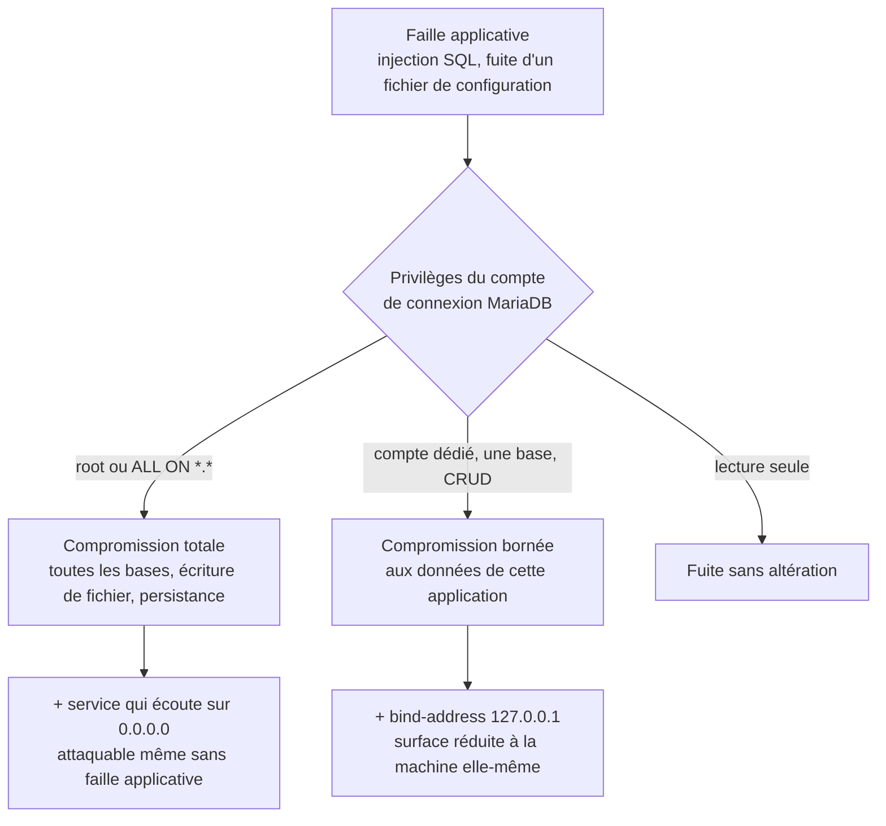
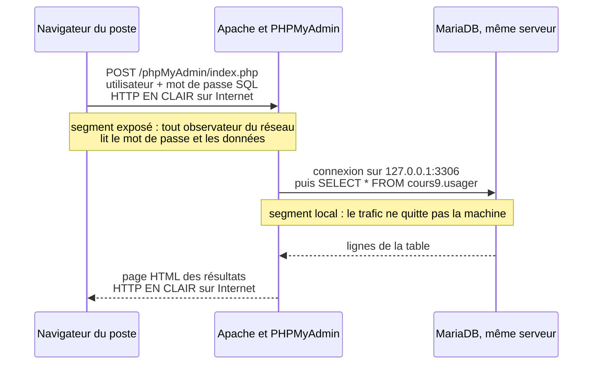

# Sécurité des bases de données

## L'idée en une image {diapos="5, 6, 10"}

Imagine une banque de quartier. Le hall, le comptoir, les caméras, le garde à l'entrée : tout cela,
c'est le **serveur web** et le **code de l'application**. On l'a durci aux séances précédentes.

La **base de données**, elle, c'est la chambre forte au sous-sol. Elle ne reçoit personne
directement : on n'y descend que par l'escalier du personnel. Et ce qui décide de l'ampleur d'un vol
n'est pas la solidité de la porte du hall — c'est le **trousseau de clés** que porte l'employé qui
descend. Un caissier avec la clé de son seul tiroir ne peut vider que son tiroir. Le directeur, dont
le trousseau ouvre tous les coffres, la salle des archives et la porte de service, peut tout
emporter — et même faire une copie de la clé pour revenir demain.

Durcir une base de données, c'est deux gestes, et deux seulement :

1. **Fermer les portes laissées ouvertes à la construction** — un MariaDB qui vient d'être installé
   a un administrateur sans mot de passe, des comptes anonymes et une salle vide où n'importe qui
   peut entreposer ses affaires.
2. **Distribuer des trousseaux étroits** — un compte par application, qui n'ouvre que ce dont elle a
   besoin.

**Où l'analogie casse — trois fois, et chaque fois ça compte.**

- **Une chambre forte protège contre l'effraction ; une base de données, non.** La quasi-totalité
  des vols de données passent par la **porte normale**, avec une clé valide, parce qu'une faille
  applicative a permis de poser une question que l'application n'aurait jamais dû poser. Les
  privilèges ne bloquent pas l'attaque : ils **bornent** ce qu'elle rapporte.
- **Le trousseau du personnel ne se photocopie pas depuis le trottoir.** Un mot de passe de compte
  SQL, lui, peut circuler sur un réseau — et sans chiffrement il se lit au passage. Attention au
  segment dont on parle : l'avertissement de la diapositive 49 vise le canal **HTTP entre ton
  navigateur et PHPMyAdmin**, et non le protocole de MariaDB lui-même, qui dans le montage du cours
  ne quitte pas la machine. La section « Le trajet d'une requête » détaille les deux segments.
- **La chambre forte est un lieu ; la base, un service qui écoute.** Une porte blindée ne répond pas
  quand on frappe. Un SGBD (*système de gestion de base de données*, le logiciel qui stocke et sert
  les données — ici MariaDB) **répond** à qui se présente sur son port, le 3306 — et à qui il répond
  dépend d'un réglage nommé `bind-address`. Sur les paquets Debian et Ubuntu, ce réglage est déjà
  posé sur `127.0.0.1`, « la machine elle-même et personne d'autre » ; d'autres façons d'installer ne
  le posent pas. Le geste n'est donc pas de l'écrire d'office, c'est de le **vérifier**.

::: cours {diapos="6"}
La séance 8 du cours 420-B10-HU annonce elle-même son plan en quatre temps, et la leçon le suit :
installation de MySQL/MariaDB, sécurisation de l'installation, gestion de MariaDB en ligne de
commande, gestion de MariaDB avec PHPMyAdmin. Les 58 diapositives ne sortent pas de ce cadre, et les
sept exercices de la feuille de la séance en couvrent chacun un morceau, dans l'ordre.
:::

::: complement
Le mot **base de données** est ici un raccourci pour deux choses distinctes qu'il vaut mieux séparer
tout de suite. Le **serveur de base de données** (MariaDB) est un programme qui tourne en permanence
et écoute les connexions. Une **base** (ou *schéma*) est un conteneur nommé, à l'intérieur de ce
serveur, qui regroupe des tables. Un même serveur héberge plusieurs bases — celle de la boutique,
celle du blogue, plus la base système `mysql` où sont rangés les comptes et leurs mots de passe
hachés. Toute la gestion des privilèges consiste à dire *quel compte voit quelle base*, et cette
phrase n'a de sens que si les deux mots ne sont pas confondus.
:::

::: correction-du-cours {source="content/cours/securite-web/horaire.json, recopié du calendrier de https://www.alexandrepetrin.ca/securisation-des-applications-web/ (relu le 2026-09-17)" diapos="3"}
La diapositive 3 ouvre sur « au dernier cours, nous avons fait un rappel sur les commandes Linux […]
ainsi que les opérateurs de piping et de redirection ». Dans le calendrier 2026, la séance qui
précède celle-ci est la **séance 7, « Sécurité du code »** ; les commandes Linux et les
redirections ont été vues bien plus tôt. Le support vient d'un millésime antérieur où l'ordre des
séances était différent. Rien de ce que la diapositive annonce ensuite n'en est affecté — mais si
tu révises « le cours d'avant » d'après cette phrase, tu réviseras la mauvaise séance.
:::

## En bref — la marche à suivre {diapos="7-12, 28-31, 41-47"}

:::: marche-a-suivre {titre="Durcir un MariaDB neuf, lui donner un compte borné, et l'administrer par PHPMyAdmin"}

1. {voir="Installer MariaDB"} Installe le serveur de base de données sur la machine Ubuntu, puis
   vérifie qu'il tourne avant d'aller plus loin.

   ```bash
   # PuTTY, connecté en root sur le serveur Ubuntu — répertoire courant sans importance
   apt-get update && apt-get install mariadb-server && systemctl status mariadb
   ```

2. {voir="Les quatre protections, une par une"} Lance la sécurisation initiale et réponds `y` à
   toutes les questions, après avoir choisi un mot de passe long pour l'administrateur.

   ```bash
   # PuTTY, en root sur le serveur Ubuntu — le script est fourni par le paquet mariadb-server
   mysql_secure_installation
   ```

3. {voir="Ce que le script ne désactive pas vraiment"} Vérifie sur quelle interface le service écoute
   réellement : sur Ubuntu le paquet pose déjà `bind-address = 127.0.0.1`, mais c'est la mesure qui
   fait foi, jamais le fichier.

   ```bash
   # PuTTY, en root — le réglage vit dans /etc/mysql/mariadb.conf.d/50-server.cnf, le répertoire des
   # réglages propres à MariaDB ; /etc/mysql/conf.d/ est lu lui aussi, un réglage peut venir de là
   ss -lntp | grep 3306        # attendu : 127.0.0.1:3306 — jamais 0.0.0.0:3306
   ```

4. {voir="Deux façons d'ouvrir la console"} Ouvre la console SQL en administrateur pour créer les
   comptes.

   ```bash
   # PuTTY, en root sur le serveur Ubuntu — root du système, donc aucun mot de passe demandé
   mysql
   ```

5. {voir="Créer la base et la table de la démonstration"} Crée la base et la table de travail, en
   terminant **chaque** requête par un point-virgule.

   ```sql
   -- Console mysql, ouverte en root — aucune base sélectionnée pour l'instant
   CREATE DATABASE cours9 CHARACTER SET utf8mb4 COLLATE utf8mb4_unicode_ci;
   ```

6. {voie="cours"} {voir="CREATE USER, GRANT, FLUSH PRIVILEGES"} Crée le compte de la démonstration
   avec tous les privilèges, comme la séance le demande.

   ```sql
   -- Console mysql, ouverte en root — c'est la séquence exacte de la diapositive 30
   CREATE USER 'demo_utilisateur'@'localhost' IDENTIFIED BY 'Qwerty1Qwerty';
   GRANT ALL PRIVILEGES ON *.* TO 'demo_utilisateur'@'localhost';
   FLUSH PRIVILEGES;
   ```

7. {voie="moderne"} {voir="Ce qu'un compte applicatif ne doit jamais recevoir"} Pour un vrai
   déploiement, remplace la portée `*.*` par la seule base de l'application et n'accorde que le
   nécessaire.

   ```sql
   -- Console mysql, ouverte en root — la forme à écrire en production, pas à l'examen
   GRANT SELECT, INSERT, UPDATE, DELETE ON `cours9`.* TO 'demo_utilisateur'@'localhost';
   ```

8. {voir="Restreindre les privilèges"} Quitte la console, reconnecte-toi avec le compte créé et
   exécute une requête : c'est la seule preuve que les droits sont bien ceux que tu crois.

   ```bash
   # PuTTY, en root sur le serveur Ubuntu — après « exit » de la console mysql
   mysql -u demo_utilisateur -p
   ```

9. {voir="Les prérequis Apache et les deux extensions PHP"} Installe le serveur web et les deux
   extensions PHP dont PHPMyAdmin a besoin, en relevant d'abord ta version de PHP. Ne t'inquiète pas
   si `php8.3-mysqli` reste introuvable dans la liste des paquets : c'est un **paquet virtuel**,
   fourni par `php8.3-mysql`, et `apt-get` le résout tout seul.

   ```bash
   # PuTTY, en root sur le serveur Ubuntu — remplace 8.3 par ce que « php --version » affiche
   apt-get install apache2 php && php --version
   apt-get install php8.3-mysqli php8.3-xml && systemctl restart apache2
   ```

10. {voir="Déposer PHPMyAdmin sur le serveur"} Téléverse le dossier décompressé et renommé dans la
    racine web du serveur avec WinSCP — destination `/var/www/html/phpMyAdmin` — puis ouvre
    `http://<adresse IP du serveur>/phpMyAdmin` dans un navigateur.

11. {voir="Le trajet d'une requête, et où il passe en clair"} Connecte-toi avec le compte créé, pas
    avec root — et n'emploie aucun mot de passe dont tu te sers ailleurs tant qu'il n'y a pas de
    certificat.

12. {voir="Sauvegarder la base, et ce que le fichier .sql contient"} Exporte la base, puis range le
    fichier ailleurs que dans la racine web.

::::

## Pourquoi durcir la base quand le code est déjà corrigé {hors-cours}

Toutes les séances précédentes enseignent à **empêcher** : valider l'entrée, échapper la sortie,
vérifier l'autorisation. Le durcissement de la base répond à une question différente, et
complémentaire : **« et si tout ça a échoué ? »**

Le scénario est banal. Une injection SQL — une faille où une valeur venue du client est recollée
dans le texte d'une requête et devient donc de la **commande** plutôt que de la **donnée** — passe
dans un formulaire oublié. Ce que l'attaquant peut faire ensuite ne dépend pas de la faille : elle
est la même dans les trois cas ci-dessous. Cela dépend **uniquement** des privilèges du compte
MariaDB avec lequel l'application était connectée.

| Compte utilisé par l'application | Ce que l'injection permet |
|---|---|
| `root`, ou `ALL PRIVILEGES ON *.*` | Lire **toutes** les bases, y compris `mysql.user` et ses mots de passe hachés ; modifier n'importe quelle donnée ; `DROP DATABASE` ; créer un compte pour revenir plus tard ; et avec le privilège `FILE`, lire `/etc/passwd` et **écrire un fichier** là où le serveur de base de données a le droit d'écrire, si `secure_file_priv` ne l'en empêche pas. Quand ces conditions sont réunies, la faille applicative devient une prise de contrôle du serveur. |
| Compte dédié, `SELECT, INSERT, UPDATE, DELETE` sur une seule base | Lire et altérer les données de **cette** application seulement. Grave, mais borné : pas de saut vers les autres bases, pas d'écriture de fichier, pas de compte créé en douce. |
| Compte en **lecture seule**, pour les écrans de consultation | Fuite de données, aucune altération. |



C'est le principe de **moindre privilège** : ne donner à chaque acteur que les droits strictement
nécessaires à son travail, et rien de plus. Retiens la conséquence, parce que c'est elle qui rend
tout le reste de la séance convaincant : **`GRANT` n'est pas de l'administration, c'est du
confinement de dégâts.**

::: complement
Le durcissement du compte SQL **borne** une injection ; il ne la corrige pas. La seule vraie parade à
l'injection est la **requête préparée**, où la commande et les valeurs voyagent séparément — c'est le
module « Injection » de ce cours qui la traite, et le cours de PHP qui la met en œuvre. Les deux
mesures se cumulent, aucune ne remplace l'autre.
:::

## Installer MariaDB {diapos="7-9"}

MariaDB s'installe en une commande. C'est un paquet de la distribution : le gestionnaire `apt-get` le
télécharge, le configure, crée son utilisateur système et démarre le service tout seul.

```bash
# PuTTY, connecté en root sur le serveur Ubuntu — répertoire courant sans importance
apt-get update
apt-get install mariadb-server
```

Une fois installé, la commande `mysql` ouvre la **console** du serveur : une invite où l'on tape des
requêtes SQL (`CREATE DATABASE`, `CREATE TABLE`, `SELECT`…) et où l'on gère les comptes. Les **deux**
noms fonctionnent, et il vaut mieux le savoir avant de tomber sur l'autre : depuis MariaDB 10.5
(2020), le client s'appelle `mariadb`, et `mysql` est conservé comme **lien symbolique** vers lui,
pour la compatibilité — même chose pour `mariadb-secure-installation`, dont `mysql_secure_installation`
est l'ancien nom. La commande enseignée par le cours est donc juste et s'exécute telle quelle ;
`mariadb` est simplement le nom moderne du même outil (MariaDB Knowledge Base, *MariaDB Command-Line
Client*, consultée le 2026-09-17).

```bash
# PuTTY, en root sur le serveur Ubuntu — ouvre l'invite « MariaDB [(none)]> »
mysql
```

Pour en sortir et revenir au terminal Linux, une seule commande : `exit`. Elle ferme la connexion au
serveur, pas le serveur — celui-ci continue de tourner en arrière-plan.

::: cours {diapos="7-9"}
Le cours retient exactement trois gestes de cette section : `apt-get install mariadb-server` pour
installer, `mysql` pour entrer dans la console, `exit` pour en sortir. Sache les écrire de mémoire.
:::

## Sécuriser l'installation {diapos="10-12"}

Une installation neuve n'est pas sûre, et ce n'est pas un défaut de MariaDB : c'est le prix d'une
installation qui doit fonctionner sans poser de question. Le paquet laisse donc derrière lui quatre
portes ouvertes, et fournit un script dont le seul métier est de les refermer.

```bash
# PuTTY, en root sur le serveur Ubuntu — script fourni par le paquet mariadb-server
mysql_secure_installation
```

Le script s'ouvre sur `Enter current password for root (enter for none):`. Sur une installation
neuve, il n'y en a pas : on appuie sur Entrée. Il pose ensuite ses questions ; le cours dit de
répondre `y` à toutes, ce qui est le bon réflexe en travaux pratiques comme en production.

### Les quatre protections, une par une {diapos="10"}

La diapositive 10 les énumère. Voici ce que chacune ferme réellement — c'est cette colonne-là qui se
retient, pas la liste.

| Question du script | Ce qu'elle corrige | Pourquoi ça compte |
|---|---|---|
| Définir un mot de passe pour `root` | Une installation neuve laisse l'administrateur du SGBD sans mot de passe | Sans lui, quiconque obtient un shell **en root** sur la machine — ou, sur une installation qui n'emploie pas l'authentification par socket, n'importe quel processus local — est administrateur de toutes les bases |
| Supprimer les comptes anonymes | MySQL et MariaDB créent historiquement un compte `''@'localhost'` qui accepte n'importe quel nom d'utilisateur | Il permet une connexion **sans identifiant valide**, souvent avec des droits sur la base `test` |
| Interdire la connexion de `root` à distance | Restreint `root` à `localhost` | Empêche l'attaque par force brute, depuis Internet, sur le compte le plus puissant |
| Supprimer la base `test` | Base vide, accessible de tous, créée par défaut | Point d'appui gratuit : un attaquant y a des droits d'écriture, donc un endroit où travailler |
| Recharger les privilèges | Applique tout de suite les quatre changements | Sans lui, les tables de droits en mémoire resteraient celles d'avant |

::: exercice-du-cours {seance="8" ref="2"}
Les deux gestes tiennent en deux commandes : `apt-get install mariadb-server`, puis
`mysql_secure_installation`. Les quatre protections que l'énoncé énumère sont exactement les quatre
questions du script, dans l'ordre — tu n'as donc rien à configurer à la main, seulement à répondre.
Choisis le mot de passe administrateur **long** et note-le : tu n'auras pas d'autre occasion de le
définir sans manipuler les tables système. Prends deux minutes de plus pour lire la section
suivante avant de déclarer l'exercice fini : la troisième protection ne fait pas ce que son libellé
promet.
:::

### Ce que le script ne désactive pas vraiment {hors-cours}

C'est le point le plus important de toute la section, et il tient en une phrase : le script
**n'empêche pas les connexions distantes**, il empêche les connexions distantes **du compte root**.

Tout autre compte créé avec un hôte `'%'` — la notation qui veut dire « depuis n'importe où » —
reste joignable, **si** le serveur écoute sur le réseau. Et cela, ce n'est pas le script qui en
décide : c'est un réglage nommé **`bind-address`**, qui dit au serveur sur quelle interface réseau
écouter. La valeur `127.0.0.1` signifie « la machine elle-même, et personne d'autre ».

Sur Debian et Ubuntu, bonne nouvelle : **le paquet le pose déjà**. Le fichier `50-server.cnf` livré
par `mariadb-server` contient une ligne `bind-address = 127.0.0.1` active, et son propre commentaire
l'annonce — *« the default is now to listen only on localhost »* (sources.debian.org,
`mariadb/debian/additions/mariadb.conf.d/50-server.cnf`, consulté le 2026-09-17). Le geste sur la
plateforme du cours n'est donc pas de modifier quoi que ce soit : c'est de **vérifier**, et de
vérifier ce qui écoute réellement plutôt que ce qu'un fichier raconte.

```bash
# PuTTY, en root — le réglage vit dans /etc/mysql/mariadb.conf.d/50-server.cnf, le répertoire des
# réglages propres à MariaDB ; /etc/mysql/conf.d/ est lu lui aussi, d'où le grep sur les deux
grep -rn '^bind-address' /etc/mysql/
ss -lntp | grep 3306        # attendu : 127.0.0.1:3306 — 0.0.0.0:3306 signifie « ouvert à Internet »
```

Ailleurs, la ligne reste à écrire soi-même, et c'est là que le réflexe sert : les paquets RPM (Red
Hat, Rocky, Fedora), une installation depuis une archive `.tar.gz` et beaucoup d'images de conteneur
ne posent pas ce réglage, et le serveur y écoute alors sur toutes les interfaces. Dans ce cas
seulement : ajouter `bind-address = 127.0.0.1` dans la section `[mysqld]` du fichier de
configuration, relancer le service par `systemctl restart mariadb`, puis refaire la mesure `ss -lntp`
ci-dessus — c'est elle, et elle seule, qui prouve que la porte est fermée.

::: complement
Un détail qui évite de chercher au mauvais endroit : `/etc/mysql/mariadb.conf.d/` n'est pas le seul
répertoire de réglages lu par le démon. Le fichier principal `/etc/mysql/mariadb.cnf` de Debian et
d'Ubuntu porte **deux** directives `!includedir` — `/etc/mysql/conf.d/` *et*
`/etc/mysql/mariadb.conf.d/` — et un fichier `~/.my.cnf` dans le dossier personnel est lu en plus,
pour les outils clients. Quand un réglage ne fait pas ce qu'on croit, c'est très souvent qu'un autre
fichier le redéfinit plus loin dans l'ordre de lecture : le dernier lu gagne.
:::

::: correction-du-cours {source="MariaDB Knowledge Base — « mariadb-secure-installation », mariadb.com/kb/en/mariadb-secure-installation/ (consultée le 2026-09-17 ; l'ancienne adresse mysql_secure_installation ne répond plus)" diapos="10"}
La diapositive 10 présente la troisième protection comme « désactiver les connexions distantes sur la
base de données ». Le script, lui, ne pose que la question *« Disallow root login remotely? »* : il
restreint **le seul compte root**. À l'examen, cite les quatre points tels que le cours les liste —
c'est bien ce que le script fait, question par question. Ce qui ferme vraiment la porte du réseau,
c'est `bind-address` : sur Debian et Ubuntu le paquet l'a déjà posé sur `127.0.0.1`, ailleurs il est
à ajouter — et dans les deux cas on le vérifie par `ss -lntp`, jamais en supposant.
:::

### Le port de MariaDB et où le vérifier {cours="php" seance="5" diapos="47"}

Le nombre `3306` qui apparaît dans la vérification ci-dessus est le **port** de MariaDB : le numéro
de la « porte » sur laquelle le service écoute les connexions. C'est le port **par défaut**, et le
cours de PHP le dit explicitement à sa séance 5 — en ajoutant le geste qui va avec : on ne suppose
jamais un port, on le lit. Sur le serveur Ubuntu, `ss -lntp` le montre ; sur un poste WAMP, il se lit
dans le fichier `my.ini` de l'installation.

### Ce que mysql_secure_installation ne fait pas du tout {hors-cours}

Le script est un point de départ obligatoire, jamais une conclusion. Il ne règle **ni** l'exposition
réseau — c'est `bind-address` qui en décide, voir juste au-dessus —, **ni** les privilèges des
comptes que tu créeras ensuite, **ni** le
chiffrement, **ni** les sauvegardes, **ni** la journalisation. Les quatre sections qui suivent
s'occupent des trois premiers ; les deux derniers sont traités en fin de leçon.

## Administrer en ligne de commande {diapos="13-15"}

La console `mysql` est l'outil d'administration de base : elle est toujours présente, elle ne
dépend d'aucun serveur web, et elle fonctionne à travers une connexion SSH. Le cours la couvre en
trois temps — ouvrir la console, exécuter des requêtes, gérer les utilisateurs — et c'est le plan de
cette section.

### Deux façons d'ouvrir la console {diapos="16-22"}

Il y a **deux** commandes, et la différence n'est pas une préférence de style : elles n'ouvrent pas
la même identité.

La première est `mysql`, tapée seule. Aucun mot de passe n'est demandé. Le cours explique cela par
« vous utilisez par défaut le compte root » ; la mécanique exacte est détaillée dans la sous-section
suivante, et elle mérite d'être connue. Cette forme n'est utilisable que si ta session Linux est
celle de `root`.

La seconde est `mysql -u <utilisateur> -p`. L'option `-u` annonce le nom du compte **MariaDB** —
qui n'a rien à voir avec les comptes Linux — et l'option `-p` demande que le mot de passe soit saisi
ensuite, de façon masquée. Une fois connecté, `exit` ramène au terminal Linux dans les deux cas.

Écris toujours `-p` **seul**. La forme `-pMonMotDePasse`, avec le mot de passe accolé, fonctionne
mais inscrit ce mot de passe dans l'historique du shell et le rend visible à tout utilisateur de la
machine qui lance `ps`.

:::: methodes
::: methode {libelle="Entrer en administrateur" defaut}
```bash
# PuTTY, connecté en root sur le serveur Ubuntu — root du système, donc aucune invite de mot de passe
mysql
```
:::
::: methode {libelle="Entrer avec un compte nommé"}
```bash
# PuTTY sur le serveur Ubuntu — le mot de passe est demandé ensuite, saisie masquée
mysql -u demo_utilisateur -p
```
:::
::::

::: correction-du-cours {source="MariaDB Knowledge Base — « mysql Command-line Client », mariadb.com/kb/en/mysql-command-line-client/ (consultée le 2026-09-17)" diapos="20"}
La diapositive 20 écrit la syntaxe `mysql –u < user > p-`. Trois coquilles de mise en forme s'y sont
glissées : le tiret long à la place du tiret simple, les espaces autour du nom d'utilisateur, et le
`p-` inversé. La forme qui s'exécute est `mysql -u <utilisateur> -p`, avec deux tirets simples et le
`-p` en dernier. C'est la même commande, correctement orthographiée — rien n'est à réapprendre.
:::

### Pourquoi la commande mysql ne demande aucun mot de passe {hors-cours}

L'explication du cours est vraie mais incomplète, et l'incomplétude conduit à une conclusion fausse
trente diapositives plus loin.

Sur Debian et Ubuntu, MariaDB installe le compte `root@localhost` avec un **plugin
d'authentification** nommé `unix_socket`. Ce n'est ni récent ni particulier au cours : c'est le
défaut en amont depuis **MariaDB 10.4**, et les paquets `.deb` le livrent ainsi depuis Debian 9 et
Ubuntu 15.10. Un plugin d'authentification est le module qui décide
*comment* un compte prouve son identité. Celui-ci ne vérifie aucun mot de passe : il demande au
système d'exploitation quel est l'utilisateur qui a lancé la commande, et laisse entrer si ce nom est
`root`. La connexion réussit donc parce que **l'utilisateur Linux** s'appelle `root`, pas parce que
le mot de passe serait vide.

La conséquence est immédiate et se retrouve plus loin dans la séance : un compte en `unix_socket`
**ne peut pas** se connecter par mot de passe. Ni depuis PHPMyAdmin, ni depuis du code PHP. Ce n'est
pas un défaut, c'est une excellente propriété de sécurité — l'administrateur du SGBD n'est joignable
que par quelqu'un qui est déjà `root` sur la machine.

::: correction-du-cours {source="MariaDB Knowledge Base — « Authentication Plugin - Unix Socket », mariadb.com/kb/en/authentication-plugin-unix-socket/ et « Differences in MariaDB in Debian and Ubuntu », mariadb.com/kb/en/differences-in-mariadb-in-debian-and-ubuntu/ (consultées le 2026-09-17)" diapos="17, 19"}
Les diapositives 17 et 19 disent « aucun mot de passe ne vous sera demandé puisque vous utilisez par
défaut le compte root ». C'est le bon constat avec la mauvaise cause : ce n'est pas l'absence de mot
de passe qui ouvre la session, c'est le plugin `unix_socket`, qui identifie l'utilisateur **système**
courant. La différence n'est pas théorique — elle explique la diapositive 50, où le compte root est
refusé par PHPMyAdmin.
:::

### Le point-virgule, et ce qui arrive quand on l'oublie {diapos="23-25"}

Une requête SQL se tape dans la console et s'envoie avec Entrée. Mais Entrée ne suffit pas : la
console attend le **point-virgule** pour considérer la requête terminée. Sans lui, elle croit que la
phrase continue à la ligne suivante et affiche une invite de continuation, `->`, qui ne fait rien
d'autre qu'attendre.

```text
# Console mysql, ouverte en root sur le serveur Ubuntu — les deux cas de la diapositive 24 et 25
MariaDB [(none)]> SHOW DATABASES
    -> 
    -> ;
+--------------------+
| Database           |
+--------------------+
| information_schema |
| mysql              |
| performance_schema |
+--------------------+
```

Ce n'est pas un blocage : taper `;` puis Entrée termine la requête restée en suspens. C'est le
premier réflexe à avoir devant une console qui « ne répond plus ».

### Créer la base et la table de la démonstration {diapos="8"}

La diapositive 8 annonce que la console sert à exécuter des requêtes — `CREATE DATABASE`,
`CREATE TABLE`. C'est le moment de le faire, et c'est précisément le quatrième exercice de la
feuille.

```sql
-- Console mysql, ouverte en root sur le serveur Ubuntu — aucune base sélectionnée au départ
CREATE DATABASE cours9 CHARACTER SET utf8mb4 COLLATE utf8mb4_unicode_ci;
USE cours9;
CREATE TABLE usager (
  nom    VARCHAR(50) NOT NULL,
  prenom VARCHAR(50) NOT NULL
);
INSERT INTO usager (nom, prenom) VALUES
  ('Tremblay', 'Camille'), ('Gagnon', 'Alex'),
  ('Roy', 'Sam'),          ('Cote', 'Jules');
```

Le `CHARACTER SET utf8mb4` n'est pas cosmétique. Le jeu de caractères historiquement nommé `utf8`
dans MySQL est **incomplet** : il code au plus trois octets par caractère, ce qui tronque les emoji
et certains caractères. Une troncature silencieuse au mauvais endroit d'une chaîne est une source
classique de corruption de données, et a servi historiquement à contourner des filtres d'injection.
`utf8mb4` est le vrai UTF-8.

::: exercice-du-cours {seance="8" ref="4"}
Trois requêtes, dans cet ordre : `CREATE DATABASE`, puis `USE` pour s'y placer, puis `CREATE TABLE`
et un `INSERT`. Deux pièges seulement. D'abord le point-virgule : la définition de la table tient sur
plusieurs lignes, et tant qu'il manque, la console continue d'afficher `->` — c'est normal. Ensuite,
vérifie ton travail avant de passer à la suite, avec `SHOW TABLES;` puis
`SELECT * FROM usager;`. L'énoncé ne demande pas de clé primaire ; en pratique, ajoute
`id INT AUTO_INCREMENT PRIMARY KEY` — une table sans clé primaire rend toute mise à jour ligne par
ligne ambiguë.
:::

## Comptes et privilèges {diapos="26, 27"}

C'est le cœur de la séance. Tout ce qui précède prépare le terrain ; tout ce qui suit s'appuie
dessus.

### Pourquoi un compte qui n'est pas root {diapos="27"}

Le cours donne deux raisons, et elles sont de nature très différente.

La première est **pratique** : PHPMyAdmin ne permet pas de s'authentifier avec le compte root. On a
vu plus haut pourquoi — le plugin `unix_socket` ne répond pas à un mot de passe. Sans autre compte,
l'interface d'administration est donc inutilisable.

La seconde est une **règle de métier** : il n'est pas une bonne pratique d'employer un compte root
dans une application en production. C'est la formulation du cours, et c'est le moindre privilège du
début de cette leçon. Elle vaut d'être relue à côté du tableau des dégâts : un compte root dans une
chaîne de connexion, c'est une injection SQL qui devient une prise de contrôle du serveur.

### CREATE USER, GRANT, FLUSH PRIVILEGES {diapos="28-31"}

Créer un compte demande trois requêtes, dans cet ordre : créer l'utilisateur, lui accorder des
droits, recharger les privilèges.

```sql
-- Console mysql, ouverte en root sur le serveur Ubuntu — valeurs de la diapositive 29
CREATE USER 'demo_utilisateur'@'localhost' IDENTIFIED BY 'Qwerty1Qwerty';
GRANT ALL PRIVILEGES ON *.* TO 'demo_utilisateur'@'localhost';
FLUSH PRIVILEGES;
```

Trois notations à décoder, parce qu'elles reviennent partout :

- **`'utilisateur'@'hôte'`** — l'hôte fait **partie de l'identité** du compte. `'app'@'localhost'` et
  `'app'@'%'` sont deux comptes **différents**, avec des mots de passe et des privilèges
  indépendants. `'localhost'` veut dire « seulement depuis cette machine » ; `'%'` veut dire
  « depuis n'importe où ».
- **`*.*`** — la portée, sous la forme `base.table`. Le premier `*` veut dire « toutes les bases »,
  le second « toutes les tables ». `` `cours9`.* `` veut dire « toutes les tables de la base
  cours9 ».
- **`FLUSH PRIVILEGES`** — recharge les tables de droits en mémoire.

Le compte se vérifie en quittant la console et en revenant par l'autre porte : `exit`, puis
`mysql -u demo_utilisateur -p`, puis le mot de passe.

::: exercice-du-cours {seance="8" ref="3"}
Les trois requêtes ci-dessus, avec le nom demandé par l'énoncé. Attention à l'orthographe exacte du
compte : la feuille écrit `demo_utilisateur`, les diapositives écrivent `demo_user` — prends celui de
la feuille, c'est lui qui sera relu. « Tous les privilèges » se traduit littéralement par
`GRANT ALL PRIVILEGES ON *.*`. Termine en te reconnectant avec le compte : un `GRANT` accepté sans
erreur ne prouve pas qu'on peut ouvrir une session avec.
:::

::: correction-du-cours {source="MariaDB Knowledge Base — « GRANT », mariadb.com/kb/en/grant/ (consultée le 2026-09-17)" diapos="28"}
La diapositive 28 écrit le gabarit
`GRANT ALL PRIVILEGES ON 'base_de_donnees'.'table' TO 'utilisateur'@'localhost';` — avec des
apostrophes autour du nom de la base et de la table. Cette forme ne s'exécute pas : en SQL, les
apostrophes délimitent une **chaîne de caractères**, pas un identifiant d'objet. Un nom de base ou de
table s'écrit nu, ou entre **accents graves** : `` `cours9`.`usager` ``. Sur la **portée**, la
diapositive 30 est correcte : elle utilise `*.*`, qui s'écrit bien sans rien autour. Mais elle porte
les mêmes **guillemets typographiques** (`‘` et `’`) que la 28 autour du nom d'utilisateur, de l'hôte
et du mot de passe, et ceux-là ne s'exécutent pas davantage : retape les apostrophes droites au
clavier plutôt que de recopier la diapositive. Les deux ont vraisemblablement subi la même mise en
forme automatique des guillemets.
:::

### Restreindre les privilèges {diapos="32-34"}

La diapositive 32 le dit : on peut remplacer `ALL PRIVILEGES` par une liste d'opérations —
`SELECT`, `UPDATE`, `DELETE`, `INSERT`. Ce sont les quatre opérations du **CRUD** : lire, modifier,
supprimer, insérer.

Et surtout, la diapositive 34 annonce le comportement à connaître : si l'utilisateur tente une
action qui n'est pas dans ses accès, **l'opération est refusée**. Le refus ne ressemble pas à un
plantage : c'est un message d'erreur numéroté, et il faut savoir le lire.

```text
# Console mysql — deux sessions successives : d'abord root, puis le compte restreint
MariaDB [(none)]> CREATE USER 'demo_select'@'localhost' IDENTIFIED BY 'Qwerty1Qwerty';
Query OK, 0 rows affected (0.001 sec)
MariaDB [(none)]> GRANT SELECT ON *.* TO 'demo_select'@'localhost';
Query OK, 0 rows affected (0.000 sec)
MariaDB [(none)]> FLUSH PRIVILEGES;
Query OK, 0 rows affected (0.001 sec)
MariaDB [(none)]> exit

$ mysql -u demo_select -p
MariaDB [(none)]> CREATE DATABASE demo_acces_limite;
ERROR 1044 (42000): Access denied for user 'demo_select'@'localhost' to database 'demo_acces_limite'
```

`ERROR 1044` veut dire « privilège refusé sur une **base** ». Son cousin `ERROR 1142` veut dire
« privilège refusé sur une **table ou une commande** ». Savoir les distinguer évite le réflexe le
plus destructeur de cette matière : « corriger » un problème de droits en redonnant
`ALL PRIVILEGES`, ce qui annule tout le chapitre.

Note au passage que la démonstration du cours reste en `ON *.*` : elle restreint la **commande**, pas
la **portée**. Un `demo_select` ainsi défini peut lire la base système `mysql`, donc les mots de
passe hachés de tous les comptes SQL. La forme complète est
`` GRANT SELECT ON `cours9`.* TO 'demo_select'@'localhost'; ``.

::: exercice-du-cours {seance="8" ref="5"}
Deux gestes : sortir de la console avec `exit`, revenir avec `mysql -u demo_utilisateur -p`, puis
`SELECT * FROM cours9.usager;`. Le nom de base préfixé évite d'avoir à faire `USE cours9;` d'abord.
Si la requête échoue, lis le **numéro** de l'erreur avant de toucher aux privilèges : `ERROR 1045`
signifie que l'authentification a échoué (mot de passe ou hôte), `ERROR 1044` que le compte est
entré mais n'a pas le droit sur la base, `ERROR 1146` que la table n'existe pas. Trois causes
différentes, trois corrections différentes.
:::

### Ce qu'un compte applicatif ne doit jamais recevoir {hors-cours}

Le cours enseigne quels privilèges **donner**. Le tableau utile en production est celui de ce qu'il
faut **refuser**, et pourquoi.

| Privilège | À l'application ? | Pourquoi |
|---|---|---|
| `SELECT`, `INSERT`, `UPDATE`, `DELETE` | Oui, sur ses tables | Le CRUD dont l'application a besoin pour fonctionner |
| `CREATE`, `ALTER`, `DROP` | **Non** — sauf à un compte de migration, employé au déploiement puis inutilisé | Une injection avec `DROP` vide ou détruit les tables ; ces droits appartiennent au processus de déploiement, pas au code qui tourne |
| `GRANT OPTION` | **Jamais** | Il permet au compte de s'accorder lui-même des droits : il annule tout le moindre privilège d'un seul coup |
| `FILE` | **Jamais** | `LOAD_FILE()` lit n'importe quel fichier lisible par le serveur, et `SELECT … INTO OUTFILE` en **écrit** un — là où le processus `mysqld` a le droit d'écrire, si `secure_file_priv` ne l'interdit pas, et seulement si le fichier n'existe pas encore (il n'est jamais écrasé). Trois conditions, donc, et `/var/www/html` n'appartient normalement pas à `mysqld` ; quand elles sont réunies, un fichier PHP déposé dans la racine web transforme l'injection SQL en exécution de code |
| `SUPER`, `PROCESS`, `SHUTDOWN` | **Jamais** | Administration du serveur. `PROCESS` laisse voir les requêtes des autres connexions, mots de passe compris s'ils y circulent en clair |
| Portée `*.*` | **Jamais** pour une application | Elle donne accès à la base système `mysql`, donc aux mots de passe hachés de tous les comptes SQL, et à toutes les autres applications hébergées |

::: correction-du-cours {source="OWASP Database Security Cheat Sheet, section « Creating Secure Permissions », cheatsheetseries.owasp.org/cheatsheets/Database_Security_Cheat_Sheet.html (consultée le 2026-09-17)" diapos="27, 30"}
La diapositive 27 pose la règle : « il n'est pas une bonne pratique d'utiliser un compte root dans
une application en production ». La diapositive 30, trois diapositives plus loin, fait créer
`demo_user` avec `GRANT ALL PRIVILEGES ON *.*`. Or un compte `ALL ON *.*` **est** un compte root sous
un autre nom : mêmes droits, même rayon de dégâts. La contradiction est réelle, et elle est
pédagogiquement normale — le TP a besoin d'un compte qui peut tout, pour que rien ne bloque.
À l'examen, si l'énoncé demande « un compte avec tous les privilèges », écris
`GRANT ALL PRIVILEGES ON *.* TO 'demo_utilisateur'@'localhost';` : c'est la réponse attendue.
En production, écris la liste des quatre opérations sur la seule base de l'application, et rien de
plus.
:::

Le découpage standard va plus loin qu'un compte : **un compte par usage**. Un compte *runtime* en
CRUD sur une seule base ; un compte *migration* avec `CREATE`, `ALTER`, `DROP`, employé par le
déploiement et jamais par l'application ; un compte *sauvegarde* en lecture ; un compte *lecture
seule* pour les rapports. Le coût est réel — quatre secrets à gérer au lieu d'un — et il se justifie
dès qu'il y a un déploiement automatisé. Pour un site à un seul environnement, deux comptes suffisent.

### Retirer un privilège et vérifier ce qui reste {hors-cours}

Le cours enseigne à donner des droits, jamais à les retirer ni à les auditer. C'est pourtant
l'opération la plus fréquente en exploitation : corriger un privilège de trop, accordé six mois plus
tôt par quelqu'un d'autre.

```sql
-- Console mysql, en root sur le serveur Ubuntu — corriger un compte trop permissif, sans le recréer
REVOKE ALL PRIVILEGES, GRANT OPTION FROM 'demo_utilisateur'@'localhost';
GRANT SELECT, INSERT, UPDATE, DELETE ON `cours9`.* TO 'demo_utilisateur'@'localhost';
SHOW GRANTS FOR 'demo_utilisateur'@'localhost';
DROP USER 'ancien_compte'@'%';
```

`SHOW GRANTS` est la commande à retenir en priorité : c'est la **seule** façon de savoir ce qu'un
compte peut réellement faire. Un compte inutilisé, lui, ne se laisse pas dormir : il se supprime.
Personne ne surveille le mot de passe d'un compte dont personne ne se sert.

::: complement
`FLUSH PRIVILEGES` n'est en réalité nécessaire **que** si l'on a modifié les tables de droits
(`mysql.user`, `mysql.db`) directement par des requêtes `INSERT` ou `UPDATE`. Après un `CREATE USER`
ou un `GRANT` normal, le serveur recharge tout seul. Le cours l'inclut systématiquement : c'est
inoffensif, et c'est une bonne habitude tant qu'on ne sait pas distinguer les deux cas. Écris-le à
l'examen.
:::

## Administrer avec PHPMyAdmin {diapos="37, 38, 40"}

PHPMyAdmin est une **application web écrite en PHP** qui offre une interface graphique complète
d'administration de MySQL et MariaDB : parcourir les bases, exécuter des requêtes, gérer les comptes,
importer et exporter. C'est un projet libre et gratuit, et c'est l'interface fournie par défaut dans
XAMPP.

Sa position est ambivalente, et il faut la voir tout de suite : c'est **la console d'administration
de ta base, publiée sur le web**. Très pratique en apprentissage, cible prioritaire en production.

L'installation décrite par le cours est un simple copier-coller de fichiers : PHPMyAdmin n'est rien
d'autre qu'un dossier de scripts PHP que le serveur web sert comme n'importe quelle page.

### Les prérequis Apache et les deux extensions PHP {diapos="41, 42"}

Trois choses doivent exister avant de déposer quoi que ce soit : un serveur web **Apache**, un
interpréteur **PHP**, et deux **extensions** PHP — `mysqli` et `xml`. Une extension PHP est un module
compilé qui ajoute des fonctions au langage ; `mysqli` est celui qui sait parler à MySQL et MariaDB,
`xml` celui dont PHPMyAdmin se sert pour ses exports.

Le nom du paquet d'extension **contient le numéro de version de PHP**. Il faut donc relever cette
version avant d'installer, et c'est ce que la diapositive 41 demande. Un détail qui déroute : sur
Ubuntu 24.04, `php8.3-mysqli` est un **paquet virtuel** — un nom qui n'a pas de paquet à lui, mais
qu'un autre paquet déclare fournir, ici `php8.3-mysql`. Chercher `php8.3-mysqli` dans la liste des
paquets ne donne donc rien, et pourtant la commande d'installation ci-dessous fonctionne : `apt-get`
résout le nom virtuel tout seul.

```bash
# PuTTY, en root sur le serveur Ubuntu — l'ordre compte : relever la version AVANT d'installer
apt-get update && apt-get install apache2 php
php --version                      # relève le numéro affiché : 8.3, 8.4, …
apt-get install php8.3-mysqli php8.3-xml && systemctl restart apache2
```

::: correction-du-cours {source="PHP.net, « Supported Versions » — fin de vie de PHP 7.4 le 28 novembre 2022 ; systemd, systemctl(1) — les noms d'unités sont sensibles à la casse (consultés le 2026-09-17)" diapos="41, 42"}
Deux détails des diapositives 41 et 42 ne s'exécutent pas tels quels. D'abord
`systemctl restart Apache2`, avec un A majuscule : les noms d'unités systemd sont sensibles à la
casse, la commande est `systemctl restart apache2`. Ensuite `php7.4-mysqli` et `php7.4-xml` : PHP 7.4
n'est plus maintenu depuis novembre 2022 et ses paquets ne s'installent plus sur un Ubuntu récent.
La diapositive 41 dit d'ailleurs elle-même de relever sa version — c'est ce numéro-là qu'il faut
recopier dans le nom du paquet.
:::

### Déposer PHPMyAdmin sur le serveur {diapos="43-47"}

La procédure du cours, en cinq gestes : télécharger l'archive ZIP depuis `phpmyadmin.net`, la
décompresser sur le poste Windows, renommer le dossier obtenu en quelque chose de court — par
exemple `phpMyAdmin` —, le copier sur le serveur avec **WinSCP**, puis ouvrir l'adresse dans un
navigateur.

La destination est la **racine web** : le répertoire où Apache va chercher les fichiers qu'il sert.
Sur Ubuntu, sa valeur **par défaut** est `/var/www/html`. La diapositive 46 l'écrit `var/www/html`,
sans la barre oblique de tête — c'est le même endroit, écrit sans son chemin absolu. Vérifie-la
plutôt que de la supposer : elle est déclarée par la directive `DocumentRoot` du site actif.

```bash
# PuTTY, en root sur le serveur Ubuntu — vérifier la racine web AVANT de téléverser quoi que ce soit
grep -R 'DocumentRoot' /etc/apache2/sites-enabled/    # attendu par défaut : /var/www/html
ls -ld /var/www/html
```

Dans WinSCP, lancé depuis le poste Windows, le panneau de **gauche** est le poste et celui de
**droite** est le serveur : on fait glisser le dossier `phpMyAdmin` décompressé — typiquement depuis
`C:\Users\<toi>\Downloads\` — vers `/var/www/html/` sur le serveur. Le transfert prend quelques
minutes, parce que PHPMyAdmin contient plusieurs milliers de petits fichiers. L'interface s'ouvre
ensuite à l'adresse `http://<adresse IP du serveur>/phpMyAdmin`.

::: exercice-du-cours {seance="8" ref="6"}
Fais les trois vérifications dans l'ordre, chacune isolant une cause différente. Un, Apache répond-il
seul ? Ouvre `http://<adresse IP>/` : si la page par défaut d'Apache n'apparaît pas, le problème est
le serveur web ou le pare-feu, pas PHPMyAdmin. Deux, les fichiers sont-ils au bon endroit ?
`ls /var/www/html/phpMyAdmin/index.php` doit exister — un ZIP décompressé une fois de trop donne un
dossier dans un dossier, et c'est l'erreur la plus courante du transfert. Trois seulement, ouvre
`/phpMyAdmin` et connecte-toi avec `demo_utilisateur`. Le compte root ne fonctionnera pas, et la
section qui suit dit pourquoi.
:::

### Page blanche ou message d'erreur {diapos="48"}

Si la page reste blanche ou affiche une erreur, c'est qu'une extension manque. Le message à
reconnaître est celui-ci — il vient de PHPMyAdmin lui-même, et il **nomme** ce qui manque :

```text
# Navigateur, sur http://<adresse IP>/phpMyAdmin — message émis par PHPMyAdmin, pas par Apache
Composer detected issues in your platform: Your Composer dependencies require the following
PHP extensions to be installed: mysqli, xml
```

Il n'y a donc rien à deviner : le nom de l'extension absente est écrit. La vérification après
correction se fait côté serveur.

```bash
# PuTTY, en root sur le serveur Ubuntu — les deux extensions doivent apparaître dans la liste
php -m | grep -E 'mysqli|xml'
```

### Le trajet d'une requête, et où il passe en clair {diapos="49"}

Le cours signale lui-même le vrai problème de PHPMyAdmin, et il faut le prendre au sérieux : sans
certificat, l'interface s'emploie en **HTTP en clair**. Le mot de passe SQL et le contenu des tables
sont alors lisibles par quiconque observe le réseau entre ton navigateur et le serveur.

Le diagramme ci-dessous suit une requête du navigateur jusqu'à MariaDB. Deux segments, et un seul est
exposé.



La parade du cours — « n'utilisez pas un mot de passe que vous utilisez ailleurs » — est un
contournement honnête pour un TP, pas une mesure de sécurité : elle limite les dégâts d'une
interception, elle ne l'empêche pas. La vraie parade est **HTTPS**, c'est-à-dire un certificat sur le
serveur web, ce que la diapositive annonce pour plus tard.

::: exercice-du-cours {seance="8" ref="1"}
L'énoncé formule lui-même le compromis, et c'est tout l'intérêt de l'exercice. Si tu disposes d'un
nom de domaine pointant sur la machine, `certbot --apache` obtient un certificat Let's Encrypt
gratuitement et configure Apache tout seul. Sans nom de domaine, un certificat auto-signé
**chiffrerait tout aussi bien** le transport : l'avertissement que le navigateur affiche alors porte
sur l'**authentification** du serveur — « je ne peux pas prouver que c'est bien lui » — pas sur le
chiffrement. Pour une console d'administration que tu es seul à employer et dont tu peux vérifier
l'empreinte, c'est un compromis acceptable ; pour un site public, non. Si tu ne fais ni l'un ni
l'autre, applique la consigne à la lettre : un mot de passe jetable, employé nulle part ailleurs.
:::

### Le compte root ne se connecte pas {diapos="50"}

La diapositive 50 le dit sans détour : on se connecte avec le compte créé plus tôt, et le compte root
ne permettra pas de se connecter. Tu sais maintenant pourquoi — ce n'est pas une limite de
PHPMyAdmin, c'est le plugin `unix_socket` de `root@localhost`, qui n'accepte aucun mot de passe et ne
reconnaît que l'utilisateur système local.

La bonne conclusion n'est pas « il faut réparer root » mais l'inverse : **cette propriété est à
conserver**. Un administrateur de SGBD inaccessible par mot de passe est un administrateur qu'aucune
force brute sur le web ne peut atteindre. On crée un compte à côté, avec les droits dont on a besoin.

### Ce que le cours de PHP enseigne de la même installation {cours="php" seance="8" diapos="66-82"}

Cette matière est enseignée **deux fois**, dans deux cours différents, et ce n'est pas un doublon
inutile : la séance 8 du cours de PHP, « Déploiement d'application », reprend
`mysql_secure_installation`, `GRANT`, `FLUSH PRIVILEGES` et l'installation de PHPMyAdmin du point de
vue de celui qui met une application en ligne. Si un geste de cette leçon te reste obscur, le module
« Déploiement » du cours de PHP le montre dans son contexte applicatif — avec la chaîne de connexion
PHP au bout.

### L'archive ZIP ne se met jamais à jour {hors-cours}

Installer PHPMyAdmin par copier-coller d'un ZIP fonctionne, et c'est ce que le cours enseigne. C'est
aussi une mauvaise pratique **durable** : rien, jamais, ne mettra ce dossier à jour. Or une console
d'administration accumule les vulnérabilités publiées, et c'est une cible de choix — l'attaquant qui
la franchit n'a plus besoin de trouver une injection SQL, il a l'interface d'administration.

Trois options, par ordre de préférence en production :

1. **Ne pas déployer PHPMyAdmin du tout.** Un tunnel SSH suffit : `ssh -L 3306:127.0.0.1:3306
   utilisateur@serveur` rend la base accessible depuis le poste, sur `localhost`, sans publier une
   seule URL. Un client de bureau (DBeaver, HeidiSQL) s'y branche.
2. **Installer le paquet de la distribution** (`apt-get install phpmyadmin`) plutôt que le ZIP : il
   est mis à jour avec le reste du système.
3. **Si l'interface web est nécessaire** : HTTPS obligatoire, restriction par adresse IP au niveau du
   site Apache (directive `Require ip`), et une authentification HTTP posée **en amont** de celle de
   PHPMyAdmin, pour deux barrières indépendantes. Les deux ensemble, jamais l'une sans l'autre :
   l'adresse IP seule tombe quand le réseau change, l'authentification seule se brute-force.

## Sauvegarder la base, et ce que le fichier .sql contient {hors-cours}

Exporter une base produit un fichier `.sql` : une suite de requêtes qui, rejouées, reconstruisent la
base à l'identique. PHPMyAdmin le fait par son onglet *Exporter* ; en ligne de commande, l'outil
s'appelle `mysqldump`.

```bash
# PuTTY, en root sur le serveur Ubuntu — /root/ ou tout répertoire HORS de /var/www/html
mysqldump -u demo_utilisateur -p cours9 > /root/cours9-2026-09-25.sql
mysql -u demo_utilisateur -p cours9 < /root/cours9-2026-09-25.sql   # la restauration, à tester
```

Trois choses à savoir, et la première est celle qu'on oublie :

- **Ce fichier est une copie intégrale et en clair de la base.** Mots de passe hachés et données
  personnelles compris. C'est la forme sous laquelle les bases fuitent le plus souvent : un partage
  réseau, un espace de stockage mal configuré, le poste d'un développeur.
- **Il ne se range jamais dans la racine web.** Un `/var/www/html/cours9.sql` est **téléchargeable
  par n'importe qui** — l'export qui devait protéger les données les publie.
- **Une restauration jamais testée n'est pas une sauvegarde, c'est une hypothèse.** La seule preuve
  qu'un fichier vaut quelque chose est de l'avoir rechargé sur une base vide.

::: exercice-du-cours {seance="8" ref="7"}
Par PHPMyAdmin : sélectionne la base dans le panneau de gauche, onglet *Exporter*, méthode rapide,
format SQL — le fichier arrive dans les téléchargements du poste. Par la console, c'est la première
ligne du bloc ci-dessus. L'énoncé s'arrête là ; ajoute les deux gestes qui font la différence :
ouvre le fichier dans un éditeur de texte pour constater de tes yeux qu'il contient les quatre noms
en clair, et recharge-le dans une base vide pour vérifier qu'il se restaure. Sur le nom de la base :
la feuille écrit « cours8 » ici et « cours9 » à l'exercice 4 — c'est la même base, celle que tu as
créée.
:::

## Ce que le cours ne couvre pas et qui compte autant {hors-cours}

Trois sujets absents des diapositives de la séance et pourtant indissociables de la « sécurité de la
base ». Ils ne sont pas matière d'examen ; ils tombent en entrevue et en production.

### Chiffrement en transit et au repos {hors-cours}

Le cours s'arrête au constat « la communication n'est pas encryptée ». Il y a en réalité deux volets,
qui protègent contre deux choses différentes.

| Ce qu'on compare | En transit | Au repos |
|---|---|---|
| **Le risque** | Requêtes, résultats et mot de passe SQL lisibles sur le réseau entre l'application (ou PHPMyAdmin) et le SGBD | Vol des fichiers de données : disque d'une machine virtuelle, instantané de stockage, **sauvegarde** oubliée sur un partage |
| **La mesure** | TLS sur la connexion, ou tunnel SSH, ou réseau privé | Chiffrement du disque (LUKS), ou chiffrement natif du SGBD (MariaDB *data-at-rest encryption*) |
| **Ce que ça ne protège pas** | Rien contre une injection SQL : la requête malveillante est chiffrée elle aussi | Rien tant que le serveur tourne — il déchiffre à la volée pour toute connexion valide. Protège le **support**, pas la **session** |

Conséquence pratique, et elle vaut pour le TP : si MariaDB et l'application sont sur la **même
machine**, avec `bind-address = 127.0.0.1`, le chiffrement du trafic interne apporte peu — il ne
quitte pas la boucle locale. C'est le segment **navigateur vers Apache** qui est exposé, et c'est
HTTPS qui le couvre. Dès que la base et l'application sont sur deux serveurs, TLS devient
obligatoire.

### Journal d'audit, données de test et rétention {hors-cours}

**Journal d'audit.** Le SGBD sait tracer les connexions et les requêtes — le greffon `server_audit`
sur MariaDB. Sans journal, une exfiltration réussie est **invisible** : on ne découvre la fuite que
lorsque les données apparaissent ailleurs. Le minimum utile : les connexions échouées, les `GRANT` et
`CREATE USER`, les `DROP` — et les journaux écrits **ailleurs** que sur la machine auditée, sinon
l'attaquant les efface en partant.

**Données de test.** Copier la base de production dans l'environnement de test est le raccourci le
plus courant et l'une des fuites les plus fréquentes : l'environnement de test est moins durci, plus
accessible, souvent partagé. Le réflexe est d'**anonymiser** avant toute copie hors production.

**Rétention.** Ne pas conserver indéfiniment ce qui n'est plus nécessaire : une donnée supprimée est
une donnée qui ne peut plus fuiter. Au Québec, ce n'est pas qu'une bonne pratique — la Loi 25 en fait
une obligation, avec déclaration à la Commission d'accès à l'information en cas d'incident de
confidentialité.

## Exemple simple {diapos="32-34"}

Le mécanisme, isolé : **la même faille, deux comptes, deux issues.** Voici les deux `GRANT` côte à
côte, sur le compte de la démonstration.

:::: comparaison
::: vulnerable
```sql
-- Console mysql, en root sur le serveur Ubuntu — la séquence exacte de la diapositive 30
CREATE USER 'demo_utilisateur'@'localhost' IDENTIFIED BY 'Qwerty1Qwerty';
GRANT ALL PRIVILEGES ON *.* TO 'demo_utilisateur'@'localhost';
FLUSH PRIVILEGES;
```

{lignes="2"} Le mot de passe est celui des diapositives, donc public : tout le groupe le connaît, et
il se retrouve dans les travaux remis. Acceptable pour une démonstration en classe, jamais ailleurs.

{lignes="3"} `*.*` donne **toutes les bases et toutes les tables**, y compris la base système
`mysql`. Ce compte peut donc lire les mots de passe hachés de tous les autres comptes SQL, créer un
compte de rechange, et supprimer n'importe quelle base. C'est un compte root sous un autre nom.
:::
::: corrige
```sql
-- Console mysql, en root sur le serveur Ubuntu — la même intention, bornée à une seule base
CREATE USER 'demo_utilisateur'@'localhost' IDENTIFIED BY '<mot de passe long, unique, jamais réemployé>';
GRANT SELECT, INSERT, UPDATE, DELETE ON `cours9`.* TO 'demo_utilisateur'@'localhost';
FLUSH PRIVILEGES;
SHOW GRANTS FOR 'demo_utilisateur'@'localhost';
```

{lignes="3"} La portée `` `cours9`.* `` enferme le compte dans une seule base, et la liste des quatre
opérations lui refuse `DROP`, `CREATE`, `GRANT OPTION` et `FILE`. Une injection SQL sur ce compte
altère les données de `cours9` — et s'arrête là.

{lignes="5"} `SHOW GRANTS` est la vérification : un `GRANT` accepté sans erreur ne prouve pas que les
droits obtenus sont ceux qu'on croit. C'est la sortie de cette commande qui fait foi.
:::
::::

Pour voir le refus de tes yeux, reconnecte-toi avec ce compte et tente une commande hors de sa
portée : `CREATE DATABASE essai;` répond `ERROR 1044 (42000): Access denied`. Ce message n'est pas un
bogue à corriger, c'est la preuve que la mesure fonctionne.

## Exemple complet {diapos="28-30"}

Situation réaliste. Une petite boutique en ligne tourne sur le serveur Ubuntu : Apache, PHP, MariaDB
et PHPMyAdmin sur la même machine. Un formulaire de recherche oublié concatène la valeur saisie dans
sa requête — la faille d'injection SQL du module précédent. On ne la corrige pas ici : on regarde ce
qu'elle **coûte**, selon le compte que l'application emploie pour se connecter.

:::: comparaison
::: vulnerable
```php
// Serveur Ubuntu — /var/www/html/boutique/config/bd.php, inclus par toutes les pages
// Le fichier est DANS la racine web : une erreur de configuration d'Apache le sert en clair
$bd = new mysqli('127.0.0.1', 'root', 'MotDePasseAdmin!', 'boutique', 3306);
$requete = "SELECT * FROM produit WHERE nom LIKE '%" . $_GET['q'] . "%'";
$resultat = $bd->query($requete);
```

{lignes="3"} L'application se connecte en **root**. Le port `3306` est le port par défaut de MariaDB,
et `127.0.0.1` dit que le serveur est sur la même machine — les deux sont corrects. C'est le nom du
compte qui ne l'est pas.

{lignes="4"} La valeur `$_GET['q']` est recollée dans le texte de la requête : c'est l'injection SQL.
Avec le compte de la ligne 3, une valeur bien choisie lit `mysql.user` — et, si le privilège `FILE`
est accordé, que `secure_file_priv` ne l'interdit pas et que le processus `mysqld` a le droit
d'écrire à l'endroit visé, elle y dépose un fichier PHP. Trois conditions, pas une ; réunies, le
serveur entier est perdu.
:::
::: corrige
```php
// Serveur Ubuntu — /etc/boutique/bd.php, HORS de la racine web : Apache ne peut pas le servir
// Le compte n'a que le CRUD sur la base « boutique » ; le mot de passe n'ouvre rien d'autre
$bd = new mysqli('127.0.0.1', 'app_boutique', getenv('BD_MDP'), 'boutique', 3306);
$motif = '%' . $_GET['q'] . '%';
$requete = $bd->prepare('SELECT * FROM produit WHERE nom LIKE ?');
$requete->bind_param('s', $motif);
$requete->execute();
```

{lignes="1"} Le fichier de configuration sort de la racine web. C'est une mesure indépendante des
privilèges : même parfait, un compte dont le mot de passe est téléchargeable ne protège rien.

{lignes="3"} Le compte `app_boutique` n'a que `SELECT, INSERT, UPDATE, DELETE` sur
`` `boutique`.* ``. Le mot de passe vient d'une variable d'environnement, donc il n'est pas dans le
code, donc il n'est pas dans le dépôt Git.

{lignes="5,6"} La **requête préparée** envoie la commande et la valeur séparément : le motif de
recherche reste une donnée et ne peut plus devenir de la commande. C'est la correction de la faille ;
les privilèges, eux, bornaient seulement ses dégâts. Les deux se cumulent.
:::
::::

**Ce que le compte restreint change, concrètement.** Avec `root`, l'injection donne : lecture de
toutes les bases du serveur, écriture d'un fichier partout où le serveur de base de données a le
droit d'écrire — la racine web si elle lui est ouverte —, création d'un compte de persistance. Avec `app_boutique`, la même injection donne : lecture et altération des tables de la
boutique. C'est grave, et c'est **tout** — pas de saut vers les autres applications hébergées, pas
d'exécution de code, rien à nettoyer ailleurs que dans une base.

**Et les deux réglages d'environnement qui finissent le travail** : `bind-address = 127.0.0.1` —
posé d'office par le paquet Ubuntu, à vérifier par `ss -lntp` et à ajouter à la main sur les autres
plateformes —, pour que le port 3306 ne réponde à personne d'autre que la machine elle-même ; et
HTTPS sur Apache, pour
que le mot de passe tapé dans PHPMyAdmin ne traverse pas Internet en clair.

## À toi de jouer {hors-cours}

Les **sept exercices** de la feuille de la séance sont posés au fil de la leçon, chacun juste après
la notion qu'il exerce. Ils forment une **chaîne**, pas une liste : chaque exercice suppose le
précédent terminé, et c'est la seule difficulté réelle de la feuille.

La chaîne va ainsi. L'exercice 1 fabrique le terrain — un serveur nommé `exercicemariadb` chez
l'hébergeur — et pose d'entrée la question du transport chiffré. L'exercice 2 installe MariaDB et
referme les quatre portes de l'installation neuve. L'exercice 3 crée le compte, l'exercice 4 crée la
base et la table, l'exercice 5 prouve que le compte peut lire cette table : trois marches d'un même
escalier, et si la cinquième échoue, la faute est presque toujours à la troisième. L'exercice 6
ajoute l'interface web par-dessus tout ça — c'est le seul qui puisse échouer pour une raison
étrangère à la base, d'où les trois vérifications séparées données plus haut. L'exercice 7 clôt en
sortant les données du serveur, ce qui est aussi la façon la plus banale de les perdre.

Garde une seconde fenêtre PuTTY ouverte sur le serveur pendant les exercices 5 à 7 : passer de la
console `mysql` au terminal Linux et retour est le geste le plus fréquent de la séance, et rouvrir
une session à chaque fois fait perdre le fil.

Le quiz porte sur ce que l'examen est susceptible de demander : nommer les quatre protections de
`mysql_secure_installation`, écrire la séquence `CREATE USER` / `GRANT` / `FLUSH PRIVILEGES`, lire un
`ERROR 1044`, dire pourquoi le compte root ne se connecte pas à PHPMyAdmin, et prédire ce qu'une
injection permet selon la portée accordée au compte.

[[quiz]]

## À retenir {diapos="10, 27, 49, 50"}

- **`mysql_secure_installation` ferme quatre portes** — mot de passe administrateur, comptes
  anonymes, connexion distante de root, base `test` — et rien d'autre. Il est le premier geste après
  l'installation, jamais le dernier.
- **Un compte applicatif n'est pas root.** La séquence est `CREATE USER`, puis `GRANT`, puis
  `FLUSH PRIVILEGES`. `ALL PRIVILEGES ON *.*` est la réponse attendue à l'examen ; en production,
  c'est la liste des quatre opérations CRUD sur **une seule** base.
- **Les privilèges ne corrigent aucune faille, ils bornent ses dégâts.** La même injection SQL vaut
  une prise de contrôle du serveur avec `root` et une altération de données avec un compte dédié. La
  parade à l'injection reste la requête préparée.
- **PHPMyAdmin est la console d'administration de ta base, publiée sur le web.** Sans certificat, le
  mot de passe et les données traversent Internet en clair — c'est le cours lui-même qui le dit, à la
  diapositive 49.
- **Le compte root ne se connecte pas à PHPMyAdmin, et c'est une bonne nouvelle** : son plugin
  `unix_socket` n'accepte aucun mot de passe. On crée un compte à côté ; on ne « répare » pas root.

## Aller plus loin {diapos="35, 58"}

::: correction-du-cours {source="Calendrier du cours 420-B10-HU, https://www.alexandrepetrin.ca/securisation-des-applications-web/ (relu le 2026-09-17)" diapos="56"}
La diapositive 56 annonce « au prochain cours, nous couvrirons la deuxième partie des configurations
de sécurité pour les serveurs web ». Le calendrier 2026 donne, pour la séance 9, « Sécurité des
mécanismes d'authentification et autorisation ». Comme pour la diapositive 3, le support conserve
l'enchaînement d'un millésime antérieur. Prépare la prochaine séance sur l'authentification.
:::

**Fiche de la base de connaissances**

- `web/securite/securite-base-de-donnees.md` — la fiche source de ce module : le tableau du rayon
  d'explosion selon les privilèges, `mysql_secure_installation` question par question,
  `bind-address`, le plugin `unix_socket`, la liste des privilèges à refuser, `REVOKE` et
  `SHOW GRANTS`, les correctifs de procédure de PHPMyAdmin, le chiffrement en transit et au repos,
  les sauvegardes chiffrées, la journalisation d'audit et les corrigés des sept exercices.

**Les modules voisins de ce cours**

- **Injection** — la faille que le moindre privilège borne sans la corriger. À relire juste avant ou
  juste après celui-ci : les deux modules ne prennent leur sens qu'ensemble.
- **Sécurité de la communication serveur** — SSH, le pare-feu et le transport chiffré, qui sont la
  couche sous PHPMyAdmin.
- **Gestion d'environnement infonuagique** — c'est là qu'on crée la machine `exercicemariadb` de
  l'exercice 1.
- Le module **Déploiement d'application** du cours de PHP reprend la même installation du point de
  vue applicatif, chaîne de connexion comprise.

**Sources originales citées par la fiche**

- OWASP — *Database Security Cheat Sheet* : moindre privilège, transport chiffré, durcissement du
  service, comptes par usage.
- MariaDB Knowledge Base — *mariadb-secure-installation*,
  `mariadb.com/kb/en/mariadb-secure-installation/` : documentation officielle du script, citée par les
  références de la séance (diapositive 58). La page a été renommée avec le script ; l'ancienne
  adresse `mariadb.com/kb/en/mysql_secure_installation/` ne répond plus (vérifié le 2026-09-17).
- MariaDB Knowledge Base — *Data-at-Rest Encryption* : chiffrement natif des tablespaces InnoDB.
- TechOnTheNet — *GRANT et REVOKE dans MariaDB* : le lien donné par la diapositive 35, avec la liste
  exhaustive des privilèges.
- Commission d'accès à l'information du Québec — Loi 25 : obligations de protection, de rétention et
  de déclaration d'incident pour toute base contenant des renseignements personnels.
