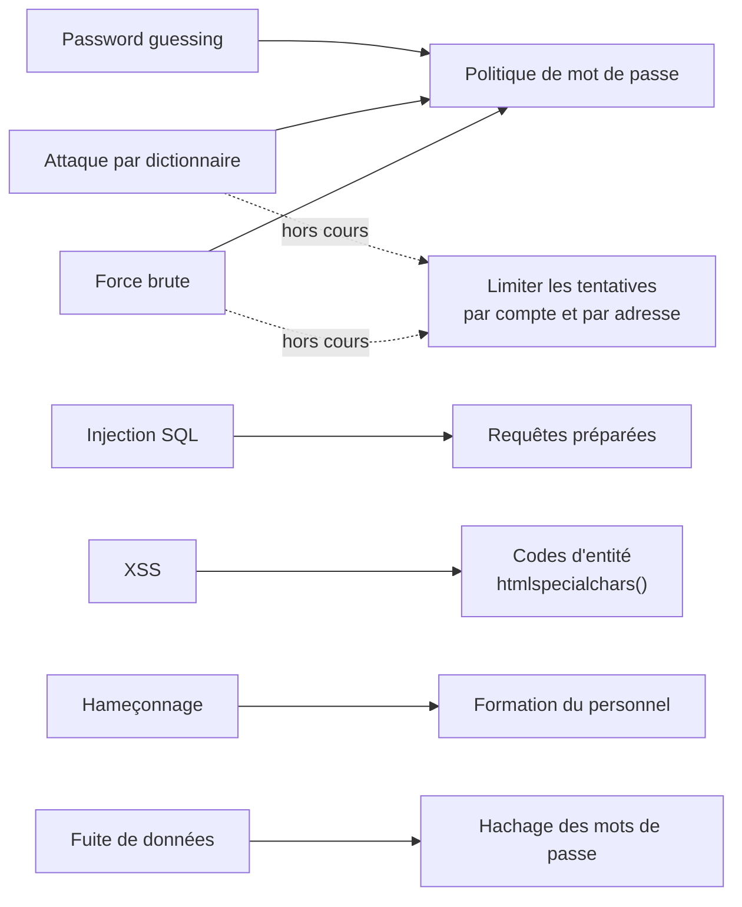
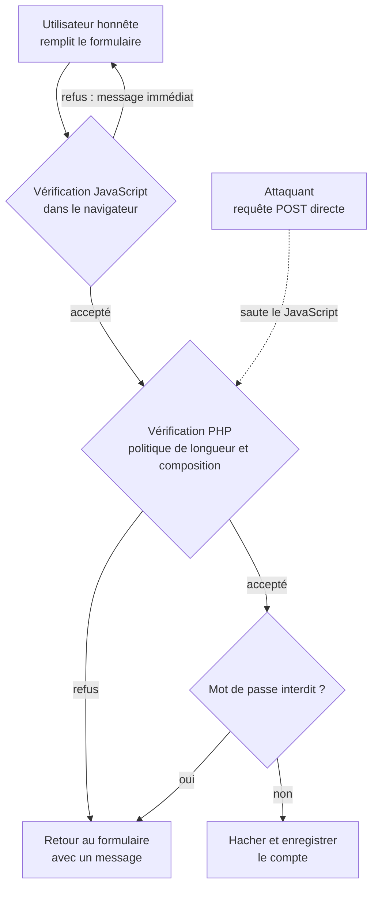
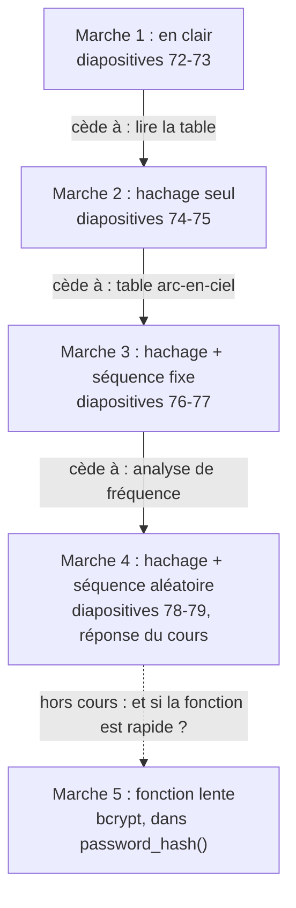
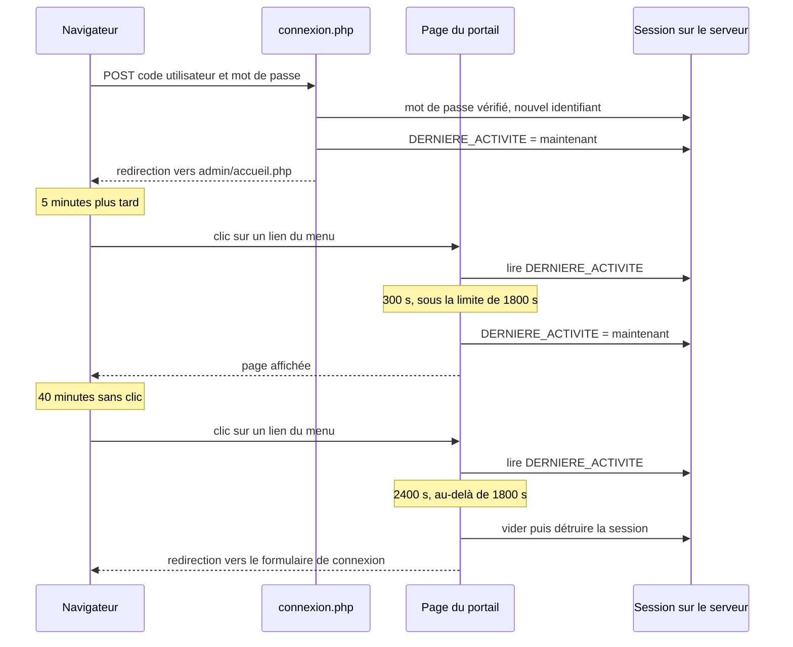
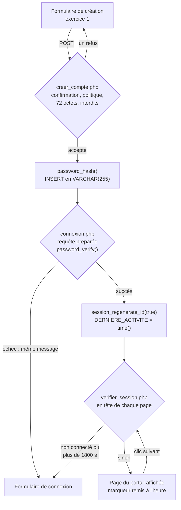

# Sécurité des mécanismes d'authentification et autorisation

## L'idée en une image {diapos="5, 6"}

Imagine un bar privé. À la porte, un **videur** tient une liste de membres. Pour entrer, tu donnes ton
nom et tu lui chuchotes ta **phrase secrète** ; s'il la retrouve à côté de ton nom, il te passe au
poignet un **bracelet** du soir, et tu circules sans avoir à la redire à chaque pièce.

Ce bar, c'est ton application PHP. Le videur qui compare la phrase, c'est l'**authentification** :
prouver qui l'on est. Le bracelet, c'est la **session** : la preuve, conservée par le serveur, que tu
as déjà passé la porte. Et le salon VIP réservé à certains bracelets, c'est l'**autorisation** :
décider ce qu'une personne déjà identifiée a le droit de faire. Les deux s'enchaînent toujours dans
cet ordre — on ne décide pas des droits de quelqu'un dont on ignore l'identité.

Maintenant, mets-toi à la place de quelqu'un qui veut entrer sans être membre. Il peut :

- **deviner** ta phrase, parce qu'il sait comment s'appelle ton chien ;
- essayer, une à une, les **phrases que tout le monde choisit** ;
- essayer **toutes les phrases possibles**, dans l'ordre ;
- **trafiquer la liste** du videur pour que ton nom suffise ;
- poster un **complice** qui écoute ce que tu chuchotes ;
- installer une **fausse porte**, avec un faux videur, un peu plus loin dans la rue ;
- **voler la liste** dans le bureau, avec toutes les phrases écrites dessus.

Ce sont, dans l'ordre, les sept attaques de la séance. La séance oppose une mesure à chacune, puis
s'occupe de deux choses : ce qu'on écrit sur la liste (le **hachage**) et la durée de vie du bracelet
(l'**expiration de la session**).

**Où l'analogie casse — trois fois, et chaque fois ça compte.**

- **Un videur se fatigue ; un serveur, jamais.** Un formulaire de connexion répond au millionième
  essai comme au premier, tant que personne ne lui a appris à **compter les échecs**. Et après un vol
  de la liste, il n'y a plus de videur du tout : l'attaquant essaie chez lui, à la vitesse de sa
  machine.
- **Un chuchotement n'a qu'une oreille ; un mot de passe en traverse plusieurs.** Ce que tu tapes
  passe par la page (qu'un script injecté peut lire), par le réseau, puis par le serveur et sa base :
  autant d'endroits où le secret peut être intercepté.
- **Le bracelet se voit ; la session, non — et c'est pire.** La session est désignée par un
  identifiant rangé dans un cookie. Il ne ressemble à rien, mais **quiconque en obtient une copie
  entre à ta place**, sans connaître ton mot de passe. C'est pourquoi la séance le fait expirer.

::: cours {diapos="6"}
La séance 9 du cours 420-B10-HU annonce son plan en cinq temps : protection des mots de passe,
attaques sur les mots de passe, mécanismes de protection, expiration des sessions, conclusion. La
leçon suit cet ordre. Malgré le mot « autorisation » de son titre, le support ne traite que de
l'authentification par mot de passe et de la durée de la session.
:::

## En bref — la marche à suivre {diapos="36, 58, 59, 64, 81, 84, 91, 92, 96-99"}

:::: marche-a-suivre {titre="Durcir une connexion PHP : choisir, ranger et vérifier le mot de passe, puis faire expirer la session"}

1. {voie="cours"} {voir="Phrase de passe contre mot de passe"} Fixe la politique du cours : au moins
   8 caractères, dont une minuscule, une majuscule, un chiffre et un caractère spécial — ou une
   phrase de passe de 16 caractères ou plus. C'est la réponse attendue à l'examen.

2. {voie="moderne"} {voir="Phrase de passe contre mot de passe"} En production, suis plutôt NIST
   SP 800-63B-4 : une longueur minimale (15 caractères quand le mot de passe est le seul facteur),
   aucune règle de composition imposée, aucun changement périodique forcé.

3. {voir="Longueur, composition et entropie"} Compare deux règles en calculant leur nombre de
   combinaisons : la taille de l'alphabet élevée à la longueur, additionnée sur chaque longueur
   admise quand la règle accepte une plage.

4. {voir="Valider côté serveur"} Vérifie la politique deux fois : en JavaScript pour le confort de
   l'utilisateur honnête (exercice 2), puis en PHP (diapositive 59), le seul contrôle qu'une requête
   `POST` directe ne peut pas sauter ; l'exercice 3 y ajoute la liste des interdits et exige le
   formulaire re-rempli, sauf le mot de passe. Refuse, redirige vers le formulaire, puis appelle `die()`.

5. {voir="Les mots de passe interdits"} Crée la table `mdp_interdit`, puis refuse tout mot de passe
   qui s'y trouve, à la création du compte comme au changement, par une requête préparée.

6. {voir="password_hash()"} Crée la colonne `mot_de_passe` en `VARCHAR(255)`, puis hache le mot de
   passe accepté avec `PASSWORD_DEFAULT` : ce seul appel tire le sel et range tout dans la chaîne.

   ```php
   <?php
   // WAMP, dossier de ton projet · fichier : creer_compte.php, juste avant l'INSERT
   $hache = password_hash($mdp, PASSWORD_DEFAULT); // aucune ligne de salage à écrire
   ```

7. {voir="password_hash()"} Refuse côté serveur un mot de passe de plus de 72 octets, mesuré avec
   `strlen` et non `mb_strlen` : bcrypt ignore tout ce qui dépasse.

8. {voie="cours"} {voir="password_verify() et le code de connexion"} Écris la connexion sur le
   modèle de la diapositive 84 : requête préparée sur `code_utilisateur`, puis
   `password_verify($_POST["mot_de_passe"], $mot_de_passe)`, et la même redirection pour les deux
   échecs (exercice 4).

9. {voie="moderne"} {voir="password_verify() et le code de connexion"} Ajoute ce que la diapositive 84
   n'a pas : `session_regenerate_id(true)` juste après la vérification réussie, un compte de base de
   données à privilèges réduits au lieu de `root`, et `die()` après chaque redirection.

10. {voir="Dans le code"} Pose le marqueur `$_SESSION["DERNIERE_ACTIVITE"] = time()` à la connexion,
    puis inclus `verifier_session.php` en première ligne de chaque page du portail : il refuse le
    visiteur non connecté, détruit la session inactive depuis plus de 1800 secondes, et sinon remet
    le marqueur à l'heure.

    ```php
    <?php
    // WAMP, dossier de ton projet · fichier : admin/accueil.php (et chaque page du portail)
    require_once __DIR__ . "/verifier_session.php"; // première instruction : rien n'est affiché avant
    ```

11. {voir="Dans php.ini"} Monte `session.gc_maxlifetime` (1440 secondes par défaut) à au moins la
    limite du code, soit 1800, dans le `php.ini` d'Apache, pas dans celui de la ligne de commande.

12. {voir="Dans php.ini"} Redémarre Apache, sans quoi PHP ne relit pas `php.ini` ; sous WAMP, par
    l'icône de la zone de notification.

    ```bash
    # PuTTY, sur le serveur Ubuntu du cours — répertoire courant sans importance
    sudo systemctl restart apache2
    ```

13. {voir="Dans php.ini"} Vérifie la valeur réellement chargée avec une page `phpinfo()` (ligne
    `session.gc_maxlifetime`, colonne « Local Value »), puis supprime cette page aussitôt lue.

14. {voir="Ce que le cours ne couvre pas et qui compte autant"} À la déconnexion, vide la session,
    fais expirer le cookie de session puis appelle `session_destroy()` : sans la deuxième étape, le
    navigateur continue d'envoyer l'ancien identifiant.

::::

## Pourquoi le mécanisme du cours de PHP ne suffit pas {diapos="1-6"}

Tu as déjà construit une connexion. La diapositive 5 le rappelle : le cours de PHP a montré comment
les **variables de session** permettent de se souvenir d'un utilisateur d'une page à l'autre, et de
fermer des pages aux visiteurs anonymes. Elle ajoute que cette implémentation « ne mettait pas en
place des mécanismes de sécurité optimale ». Toute la séance consiste à la durcir. Le rappel
d'ouverture (diapositives 2 et 3) porte sur la séance 8, la sécurité des bases de données : le compte
MariaDB à privilèges réduits que tu y as créé est celui que ton code de connexion utilisera.

### Ce que la séance 7 de PHP avait construit {cours="php" seance="7" diapos="17, 32, 48"}

Trois gestes : `session_start()` charge (ou crée) la session, conservée **sur le serveur** ; la
connexion réussie range l'identifiant dans `$_SESSION["id_utilisateur"]` ; chaque page protégée
vérifie que cette variable existe, et sinon redirige puis appelle `die()`.

Ce mécanisme répond à « est-ce la même personne qu'il y a deux clics ? ». Il ne répond à aucune des
questions de cette séance : le mot de passe choisi était-il devinable ? Comment est-il rangé dans la
table ? Que se passe-t-il si l'utilisateur quitte le poste sans se déconnecter ? La diapositive 72 le
dit sans détour : jusqu'ici, les mots de passe étaient enregistrés **tels quels** dans la base.
L'exercice 1 pose le décor sur lequel les quatre autres construiront les réponses.

::: exercice-du-cours {ref="1"}
Aucune sécurité à ce stade : c'est de la plomberie, et c'est voulu. Mets le menu commun dans un
fichier inclus par `require` (un `include` raté affiche la page sans menu ; un `require` raté
l'arrête). Donne à chaque champ un `name` stable (`code_utilisateur`, `mot_de_passe`,
`confirmation`) : les exercices 2 à 4 les liront dans `$_POST`. Et pose `type="password"` sur les
deux champs de mot de passe, ce qui masque la saisie à l'écran — sans rien chiffrer pour autant.
:::

## Comment on attaque un mot de passe {diapos="8, 9"}

On ne choisit pas une défense avant de savoir ce qu'elle doit arrêter. La diapositive 9 énumère sept
attaques, de quatre natures : trois **cherchent le mot de passe** en essayant des valeurs (deviner,
dictionnaire, force brute) ; deux **contournent ou volent** la saisie par une faille du code
(injection SQL, XSS) ; une **trompe l'humain** (hameçonnage) ; une **vole la base entière** (fuite).

### Deviner : le password guessing {diapos="10, 11"}

Le *password guessing* (deviner un mot de passe) consiste à essayer des valeurs tirées de ce qu'on
sait de la victime : nom de l'animal de compagnie, année de naissance, date de graduation. C'est
l'attaque la plus rudimentaire, et elle marche parce que ces informations traînent souvent sur un
profil public. **Exemple simple** : `Rex2004`, pour quelqu'un dont le chien s'appelle Rex et qui est
né en 2004. **Exemple plus riche** : `Rex2004!` respecte la règle « 8 caractères, une majuscule, un
chiffre, un caractère spécial » et reste devinable. Une politique mesure la **forme** d'un mot de
passe, jamais ce que l'attaquant sait de toi.

### L'attaque par dictionnaire {diapos="12-14"}

L'attaque par dictionnaire essaie une **liste** de mots de passe probables : ceux que les gens
choisissent le plus souvent, et ceux qu'on a déjà vus dans des fuites d'autres sites. Ces listes
circulent librement. La diapositive 14 dit pourquoi elle est si efficace : les gens **réutilisent**
leur mot de passe d'un site à l'autre. Le jour où un site se fait voler sa table, tous les sites où
ses utilisateurs ont repris le même mot de passe sont en danger.

::: complement
Cette réutilisation porte un nom que le support ne donne pas : le *credential stuffing* (bourrage
d'identifiants). L'attaquant ne devine rien ; il rejoue des paires « courriel, mot de passe » volées
ailleurs. Il réussit **même contre un mot de passe long et complexe**, pourvu qu'il ait été
réutilisé : aucune règle de longueur n'y change rien. Deux parades le réduisent fortement, sans
l'annuler : l'authentification à plusieurs facteurs, et le refus des mots de passe déjà compromis —
la norme NIST SP 800-63B-4 l'exige (« SHALL compare the prospective secret against a blocklist that
contains known commonly used, expected, or compromised passwords »). Hors cours, non exigible à l'examen.
:::

### La force brute {diapos="15, 16"}

La force brute essaie **toutes** les combinaisons possibles, dans l'ordre, jusqu'à ce qu'une
fonctionne. Elle est plus lente que le dictionnaire, mais elle trouve aussi les mots de passe que
personne d'autre n'a choisis. Son coût dépend entièrement du nombre de combinaisons à parcourir —
c'est pour elle que la section « Longueur, composition et entropie » fera des calculs.

### L'injection SQL {diapos="17-21"}

Si le code de connexion construit sa requête en **collant** les valeurs du formulaire dans le texte
SQL, on peut s'authentifier sans mot de passe. Le support part de
`SELECT * FROM utilisateur WHERE code='<champ1>' AND motdepasse='<champ2>'`, avec `alexandre';#` en
champ 1 et `test` en champ 2. Voici ce que le serveur de base de données reçoit :

```sql
-- Reçu par MariaDB, construit par un code PHP qui concatène (exemple vulnérable, diapositive 19)
-- le # ouvre un commentaire jusqu'à la fin de la ligne : la condition sur le mot de passe disparaît
SELECT * FROM utilisateur WHERE code='alexandre'; #' AND motdepasse = 'test'
```

L'apostrophe de l'attaquant **ferme** la chaîne que le code avait ouverte, et le `#` transforme le
reste en commentaire. Il ne reste que « trouve l'utilisateur alexandre » : quiconque connaît un code
utilisateur entre dans son compte. La forme `alexandre'#` produit le même effet sans dépendre du `;`.

La diapositive 21 nomme les trois buts habituels : s'authentifier sans le mot de passe, **modifier**
celui d'un autre pour prendre son compte, ou **élever le niveau d'accès** d'un compte — ce dernier,
c'est déjà l'autorisation qui cède. Le mécanisme et sa parade sont au module « Injection ».

### Le XSS {diapos="22, 23"}

Le *cross-site scripting* (XSS) injecte du JavaScript dans une page que visite un autre utilisateur
du même site. Appliqué à l'authentification, le script n'a même pas besoin de voler un cookie : il
lit **ce que la victime tape** dans le champ du mot de passe et l'envoie par une requête AJAX vers un
serveur que l'attaquant contrôle. Le drapeau `HttpOnly` d'un cookie n'y change rien (il protège le
cookie, pas un champ de formulaire) : la parade est d'empêcher le script d'exister (module « XSS »).

### L'hameçonnage {diapos="24-26"}

L'hameçonnage (*phishing*) relève de l'**ingénierie sociale** : convaincre la victime de donner
elle-même son mot de passe. Le support en cite deux formes : un courriel qui se fait passer pour un
organisme de confiance et renvoie vers une copie du vrai site ; un faux technicien au téléphone qui
fait exécuter une procédure de prise de contrôle à distance. Cette attaque ne contourne aucune
mesure technique, elle les rend toutes **inopérantes** : un mot de passe long et bien haché reste un
mot de passe que la victime a tapé elle-même dans le mauvais formulaire.

### La fuite de données {diapos="27-30"}

Quelles que soient les protections, la base qui contient les mots de passe peut être copiée : par un
administrateur, par une injection SQL, par une vulnérabilité du serveur de base de données. La
diapositive 29 insiste : l'attaquant obtient d'un coup **des milliers** de mots de passe, qu'il
essaiera ensuite à la banque ou à l'agence du revenu de chaque utilisateur. C'est l'attaque qui change la nature du problème. Toutes les précédentes passent par ton formulaire.
Celle-ci a lieu **hors ligne** : l'attaquant a une copie de la table chez lui, et plus aucun
formulaire ne compte ses essais.

## Une parade par attaque {diapos="31-34"}

La diapositive 33 donne la carte : une mesure de protection par famille d'attaques. La voici, avec en
pointillé ce qu'elle ne dit pas.



Deux choses sautent aux yeux. **La politique de mot de passe porte trois attaques à elle seule** :
c'est pourquoi elle occupe toute la suite de cette leçon. Et **le hachage ne sert qu'à une seule
attaque**, la fuite : il ne protège pas le formulaire, il protège ce qui arrive **après** le vol de
la table. La diapositive 34 annonce que la séance traitera ces deux mesures, et renvoie les requêtes
préparées et les codes d'entité à un autre cours.

::: correction-du-cours {source="content/cours/php/horaire.json, calendrier 2026 du cours 420-4P2-HU (relu le 2026-09-21) ; extraits Cours03_Librairie_PHP (diapositives 26-29), Cours05_integration_base_de_donnees (php-2026/extraits/Cours05_integration_base_de_donnees.txt, diapositives 37-50) et Cours07_Les_sessions_en_php" diapos="18, 23, 34"}
Le support renvoie au « cours 8 de PHP » pour l'injection SQL et le XSS (diapositives 18 et 23), et
au « cours 10 de PHP » pour les requêtes préparées et les codes d'entité (diapositive 34). Dans le
calendrier 2026, la séance 8 de PHP porte sur le **déploiement** et la séance 10 sur l'**introduction
à Laravel** : ces numéros ne correspondent pas au calendrier 2026. Où trouver la matière aujourd'hui :
`htmlspecialchars()` (les « codes d'entité ») et `password_hash()` sont présentés à la **séance 3 de
PHP** ; les requêtes préparées (`prepare`, les `?`, `bind_param`) sont enseignées à la **séance 5 de
PHP** (diapositives 37-50) ; l'injection SQL, les requêtes préparées et le XSS sont aussi traités à la **séance 7 de ce cours-ci**,
dans les modules « Injection » et « XSS ». Rien du contenu des diapositives n'en est affecté.
:::

### Ce que la carte laisse sans parade {hors-cours}

La carte associe la force brute à la seule politique de mot de passe. Or une politique agit sur le
**nombre de combinaisons** ; elle ne fait rien contre un formulaire qui laisse passer un million
d'essais sans broncher. Contre une attaque **en ligne**, la parade se mesure en **débit** : limiter
les tentatives par compte et par adresse IP sur une fenêtre de temps, et allonger le délai après
chaque échec (1 s, 2 s, 4 s…), ce qui gêne un robot sans bloquer l'humain qui s'est trompé une fois.
Méfie-toi du **verrouillage complet** d'un compte après N échecs : qui connaît ton code utilisateur
peut alors t'enfermer dehors exprès. La politique garde tout son sens pour l'attaque **hors ligne**,
après une fuite : là, seuls la longueur du mot de passe et la lenteur du hachage retiennent
l'attaquant. Rien de cette section n'est exigible à l'examen.

## La politique de mot de passe {diapos="35, 36"}

Une **politique de mot de passe** est l'ensemble des règles qu'un mot de passe doit respecter pour
être accepté. La diapositive 36 en retient deux familles : la **longueur et la composition** (combien
de caractères, et de quelles sortes), et l'**interdiction des mots de passe communs** (refuser ceux
qui respectent les règles, mais que tout le monde choisit). La première rend la force brute longue ;
la seconde prive le dictionnaire de ses essais les plus rentables. Aucune ne fait rien contre l'hameçonnage ou le XSS.

### Longueur, composition et entropie {diapos="37-53"}

**Le principe.** Un mot de passe est plus sûr quand il y a **plus de combinaisons à essayer** avant
de tomber dessus. Le calcul de la diapositive 39 est une puissance :

> nombre de combinaisons = (nombre de caractères possibles) ^ (longueur)

**Pourquoi une puissance ?** Parce que chaque position multiplie. Une seule lettre minuscule : 26
valeurs. Deux lettres : chacune des 26 premières se combine avec chacune des 26 secondes (`aa`, `ab`,
… `ba`…), soit 26 × 26 = 26². Chaque lettre ajoutée multiplie encore par 26 (diapositive 40).
**Exemple simple — la diapositive 39.** Cinq lettres minuscules : 26⁵ = 11 881 376 combinaisons.

Pour le nombre de caractères possibles, le cours additionne les familles autorisées (diapositive 41) :
26 minuscules, 26 majuscules, 10 chiffres et 40 caractères spéciaux. Toutes familles permises, cela
fait **102** caractères par position ; sur dix positions, 102¹⁰ = 121 899 441 999 475 713 024
combinaisons (diapositives 42 et 43).

::: complement
Le chiffre 40 est celui du cours (la diapositive 41 renvoie à une page de computerhope.com). Le jeu
ASCII imprimable compte 95 caractères ; retire les 62 lettres et chiffres, il reste 33 caractères
spéciaux, espace comprise (32 sans elle). À l'examen, calcule avec 40 : c'est la valeur enseignée, et
le raisonnement n'en dépend pas.
:::

**Une plage de longueurs (diapositives 44-45).** Un formulaire accepte rarement une seule longueur. On
calcule chaque longueur **séparément**, puis on **additionne** — un mot de passe a l'une **ou**
l'autre longueur, jamais plusieurs à la fois. De 6 à 8 minuscules :

| Longueur | Calcul | Combinaisons |
|---|---|---|
| 6 | 26⁶ | 308 915 776 |
| 7 | 26⁷ | 8 031 810 176 |
| 8 | 26⁸ | 208 827 064 576 |
| **6 à 8** | somme | **217 167 790 528** |

::: correction-du-cours {source="Recalcul de 26⁶, 26⁷, 26⁸ et de leur somme, PHP CLI 8.5.10 et Node, 2026-09-21" diapos="45"}
La diapositive 45 écrit 26⁶ = 309 915 776 ; la valeur exacte est **308 915 776** (un chiffre des
millions a glissé). L'erreur se propage à la somme : la diapositive donne 217 168 790 528, la somme
juste est **217 167 790 528**. Les deux autres termes sont exacts, et la méthode aussi. Si une
question d'examen reprend cet exemple, pose le calcul : c'est lui que l'on corrige.
:::

La diapositive 46 précise ce que ce nombre sert à faire : il ne donne pas le temps que mettra un
ordinateur (cela dépend de la machine et du stockage), mais il permet de **comparer deux règles**.

| Exemple | Règle | Calcul | Combinaisons |
|---|---|---|---|
| n° 1 (diapos 47-48) | 10 chiffres | 10¹⁰ | 10 000 000 000 |
| n° 2 (diapos 49-50) | 6 lettres, minuscules ou majuscules | 52⁶ | 19 770 609 664 |
| n° 3 (diapos 51-52) | 8 caractères des quatre familles, **pas de majuscule au début ni à la fin** | 76 × 102⁶ × 76 | 6 504 714 133 668 864 |

**Exemple plus riche — le n° 3, décortiqué.** La contrainte retire les 26 majuscules des deux
positions extrêmes : il reste 102 − 26 = 76 options au premier et au dernier caractère, et 102 aux
six du milieu. Sans la contrainte, la même longueur donne 102⁸ ≈ 1,17 × 10¹⁶, contre 6,5 × 10¹⁵ :
la règle a **retiré 44 %** des combinaisons. Une contrainte de composition ne fait jamais
qu'enlever des possibilités ; elle n'aide que si elle empêche des choix **que les gens font
vraiment**, comme le tout-minuscules.

**La leçon de la diapositive 53 : allonger bat élargir.** Ajouter un caractère multiplie le total par
la taille de l'alphabet ; ajouter une famille n'augmente que la base de la puissance.

- 10 chiffres (10¹⁰) contre 6 lettres des deux casses (52⁶ ≈ 2 × 10¹⁰) : un alphabet cinq fois plus
  large ne rapporte même pas un facteur 2 ;
- 8 caractères des quatre familles (102⁸ ≈ 1,2 × 10¹⁶) contre 16 minuscules seulement
  (26¹⁶ ≈ 4,4 × 10²²) : l'alphabet le plus pauvre, deux fois plus long, l'emporte d'un facteur
  proche de quatre millions.

::: complement
Le cours appelle **entropie** le nombre de combinaisons lui-même (diapositive 38). En sécurité, on
l'exprime plus souvent en **bits**, c'est-à-dire par son logarithme en base 2 : 26⁵ vaut environ
23,5 bits, 102¹⁰ environ 66,7 bits. Chaque bit de plus double le travail de l'attaquant. Pour
comparer deux règles, les deux écritures donnent exactement le même classement ; à l'examen, réponds
en nombre de combinaisons, comme le cours.
:::

### Phrase de passe contre mot de passe {diapos="54-58"}

Les diapositives 54 à 57 font l'expérience avec l'estimateur de security.org. Le premier essai,
`E$r^q!3)` — huit caractères, les quatre familles —, affiche : « It would take a computer about
8 hours to crack your password ». Le second, `JAimeLaCremeGlace` — dix-sept lettres, sans chiffre ni
caractère spécial —, donne environ **100 milliards d'années**. Et c'est le second qui se retient.
D'où la **phrase de passe** (*passphrase*) : une suite de mots, longue et facile à mémoriser, plutôt
qu'un mot court et illisible. La diapositive 58 en tire la politique que le cours retient :

::: cours {diapos="58"}
Un mot de passe devrait contenir au minimum **8 caractères**, dont **1 lettre minuscule**,
**1 lettre majuscule**, **1 chiffre** et **1 caractère spécial** — et idéalement, on utilise une
**phrase de passe de 16 caractères ou plus**. C'est la règle que l'exercice 2 fait implémenter, et
la réponse attendue à l'examen.
:::

::: complement
L'estimateur suppose que chaque lettre a été tirée au hasard. Or `JAimeLaCremeGlace` est faite de
**mots du dictionnaire**, et un attaquant qui le sait essaie des mots, pas des lettres. S'il pioche
dans une liste de 10 000 mots courants (hypothèse d'illustration), quatre mots **tirés au hasard**
font 10 000⁴ = 10¹⁶ combinaisons, environ 53 bits — l'ordre de grandeur du mot de passe de huit
caractères. Ce calcul ne décrit pas `JAimeLaCremeGlace` elle-même : elle compte cinq mots (J, Aime,
La, Creme, Glace), mais ils forment une phrase grammaticale et banale, que l'attaquant essaie bien
avant une suite de mots au hasard. Une phrase
de passe tient sa promesse quand ses mots sont **tirés au hasard** et assez nombreux. Hors cours.
:::

::: correction-du-cours {source="NIST SP 800-63B, révision 4 (juillet 2025), exigences sur les vérificateurs de mots de passe, citée par la fiche KB web/securite/authentification-failles.md" diapos="58"}
Les règles de composition obligatoires ne sont plus la recommandation de référence. La norme NIST
SP 800-63B, dans sa révision 4 finalisée en juillet 2025, les **proscrit** (« SHALL NOT impose other
composition rules ») et les remplace par trois exigences : une **longueur minimale** plutôt qu'une
complexité, **aucune rotation périodique** forcée, et la **vérification contre une liste de mots de
passe compromis**. La longueur minimale est de **15 caractères** quand le mot de passe est le seul
facteur (« SHALL »), de **8** quand il accompagne un second facteur ; et la norme recommande
(« SHOULD », donc sans l'imposer) d'accepter au moins **64 caractères**
(<https://csrc.nist.gov/pubs/sp/800/63/b/4/final>). Ces règles poussent vers des motifs prévisibles comme `Password1!`, le calcul du
n° 3 montre qu'elles réduisent l'espace de recherche, et elles ne font rien contre le bourrage
d'identifiants. **À l'examen, donne la règle du cours ; en production, applique la norme.** La moitié
« phrase de passe de 16 caractères » de la diapositive 58 va déjà dans son sens.
:::

### Valider côté serveur {diapos="59, 60"}

La diapositive 59 dit où appliquer la politique : sur les formulaires où l'utilisateur choisit son
mot de passe (création du compte **et** changement), et idéalement **côté serveur**. Pourquoi ?
Parce que tout ce qui s'exécute dans le navigateur appartient à l'utilisateur : il peut désactiver le
JavaScript, modifier la page, ou envoyer sa requête `POST` sans jamais afficher le formulaire. Une
vérification en JavaScript est un **panneau** au bord de la route ; celle du serveur, la **barrière**.



Le diagramme éclaire le découpage des exercices : l'exercice 2 demande la vérification en
**JavaScript**, l'exercice 3 en ajoute une **côté serveur**. Ce n'est pas une contradiction avec la
diapositive 59, ce sont deux rôles. Le JavaScript sert le **confort** de l'utilisateur honnête ; le
PHP assure le **contrôle**, le seul qu'on ne peut pas sauter. Garde les deux. Côté serveur, la règle
du cours tient en une fonction :

```php
<?php
// WAMP, dossier de ton projet · fichier : politique_mdp.php, inclus par require
// jamais appelé seul : il ne fait que déclarer la fonction que la page de traitement appellera
function respectePolitique(string $mdp): bool
{
    if (mb_strlen($mdp) >= 16) {
        return true;                               // phrase de passe : la longueur suffit
    }
    return mb_strlen($mdp) >= 8
        && preg_match('/[a-z]/', $mdp) === 1       // au moins une minuscule
        && preg_match('/[A-Z]/', $mdp) === 1       // au moins une majuscule
        && preg_match('/[0-9]/', $mdp) === 1       // au moins un chiffre
        && preg_match('/[^a-zA-Z0-9]/', $mdp) === 1; // au moins un caractère spécial
}
```

Deux choix à comprendre. `mb_strlen` compte des **caractères**, là où `strlen` compterait des
octets : un `é`, qui en occupe deux en UTF-8, ferait passer sept caractères pour huit. Et la dernière
expression range `é` et l'espace parmi les caractères spéciaux : c'est une décision de politique.
`mb_strlen` appartient à l'extension **mbstring** : avant de t'y fier, vérifie qu'elle est chargée,
avec `php -m` (elle doit figurer dans la liste) ou, dans une page, `extension_loaded('mbstring')`.
Sur le serveur Ubuntu 24.04, c'est un paquet séparé (`sudo apt install php8.3-mbstring`, puis
redémarrer Apache) : sans lui, `mb_strlen` n'existe pas et la page échoue.

La différence entre une page de traitement qui fait confiance au formulaire et une qui revérifie :

:::: comparaison
::: vulnerable
```php
<?php
// WAMP, dossier de ton projet · fichier : creer_compte.php, partie qui traite le POST
// exemple vulnérable — ne pas reproduire : la règle n'existe que dans le JavaScript
$mdp = $_POST["mot_de_passe"];
$hache = password_hash($mdp, PASSWORD_DEFAULT);
// ... INSERT INTO utilisateur ... avec $hache
```
{lignes="4"} Le serveur prend le mot de passe tel qu'il arrive : un `POST` envoyé sans passer par le
formulaire fait accepter `a`, ou une chaîne vide — que la ligne 5 hachera sans broncher.
:::
::: corrige
```php
<?php
// WAMP, dossier de ton projet · fichier : creer_compte.php, partie qui traite le POST
// le serveur revérifie : c'est la seule vérification qu'aucune requête ne peut sauter
require "politique_mdp.php";
$mdp = $_POST["mot_de_passe"] ?? "";
if (!respectePolitique($mdp)) {
    header("Location: creer_compte.php?erreur=politique");
    die();
}
$hache = password_hash($mdp, PASSWORD_DEFAULT);
```
{lignes="4"} `require` et non `include` : si le fichier de la politique manque, la page s'arrête au
lieu de créer des comptes sans aucune règle.

{lignes="6,7,8"} Le refus renvoie au formulaire, et `die()` interdit à la suite de s'exécuter même
si le client ignore la redirection — le réflexe de la séance 7 de PHP.
:::
::::

### Les mots de passe interdits {diapos="61-66"}

Certains mots de passe respectent toutes les règles, mais sont si fréquents qu'ils ouvrent chaque
dictionnaire d'attaque. La diapositive 63 en cite une série, tirée d'une liste publique : `1234567`,
`babygirl`, `password123`, `computer`, `qwerty123`, `1q2w3e`, `pokemon`… Elle ajoute que les
attaquants essaient aussi leurs **variantes simples**, comme la première lettre en majuscule.

La parade du cours tient en trois gestes (diapositive 64) : créer une table des mots de passe
interdits ; vérifier que le mot de passe choisi n'y figure pas, **à la création comme au
changement** ; enrichir la liste avec le temps. Le pseudo-code de la diapositive 65 dit « s'il n'est
pas interdit, accepter ; sinon, refuser ». En PHP, avec la table que l'exercice 3 nomme
`mdp_interdit` (la diapositive 64 dit `mot_de_passe_interdit` : prends le nom de l'exercice) :

```php
<?php
// WAMP, dossier de ton projet · fichier : politique_mdp.php, à côté de respectePolitique()
// requête préparée : le mot de passe est une entrée comme une autre, jamais collé dans le SQL
function estInterdit(mysqli $mysqli, string $mdp): bool
{
    $stmt = $mysqli->prepare("SELECT 1 FROM mdp_interdit WHERE mot_de_passe = ?");
    $stmt->bind_param("s", $mdp);
    $stmt->execute();
    $stmt->store_result();
    $interdit = $stmt->num_rows > 0;
    $stmt->close();
    return $interdit;
}
```

La page de traitement l'appelle juste après `respectePolitique()`, avec la même redirection en cas
de refus. Attention : telle quelle, cette redirection nue vers `?erreur=…` **perd les champs
saisis**, alors que l'exercice 3 exige de réafficher le formulaire rempli (sauf le mot de passe) ;
l'encadré de l'exercice 3, plus bas, dit comment les garder. Le mot de passe voyage dans une **requête préparée**, comme toute valeur du formulaire : un
mot de passe qui contient une apostrophe est légitime, et il ne doit ni casser la requête ni la
détourner. Quant aux majuscules : si la colonne porte une collation insensible à la casse (nom en
`_ci`), `Password123` est trouvé comme `password123`. Vérifie la collation de ta table plutôt que de
le supposer.

La diapositive 66 clôt la politique. Il reste à décider ce que la table `utilisateur` conserve une
fois le mot de passe accepté : c'est le hachage.

## Hacher les mots de passe {diapos="67-70"}

Reviens au bar de l'ouverture. La dernière attaque de la liste était le **vol de la liste** du
videur. La politique de mot de passe n'y peut rien : si la liste porte les phrases secrètes en toutes
lettres, le voleur les lit, qu'elles soient longues ou courtes. La diapositive 68 ajoute la
conséquence qui dépasse ton site : l'utilisateur a très souvent repris **le même mot de passe
ailleurs**. Une table volée chez toi ouvre donc aussi ses comptes chez d'autres.

La parade tient dans une idée simple : **ne jamais écrire la phrase sur la liste**. Le videur y écrit
à la place une **empreinte** de la phrase. Quand tu te présentes, il calcule l'empreinte de ce que tu
chuchotes et la compare à celle de la liste. Il n'a jamais besoin de connaître ta phrase ; il lui
suffit de savoir si les deux empreintes coïncident.

**Où l'analogie casse.** Une empreinte digitale ne se fabrique pas à partir d'un nom. Une empreinte
de mot de passe, si : quiconque connaît la recette peut calculer l'empreinte de `motdepasse123` et
la chercher dans la liste volée. C'est toute la suite de cette section.

La diapositive 69 donne la définition : le **hachage** transforme un texte en une autre valeur, de
sorte qu'on ne puisse pas retrouver le texte d'origine. Une fonction de hachage est **déterministe**
(même texte, même empreinte : sans cela, aucune comparaison), sa sortie a une **longueur fixe**, elle
est **à sens unique**, et changer une seule lettre de l'entrée change toute l'empreinte. C'est ce
qu'illustre le schéma de la diapositive 70, tiré de Wikipédia.

Conséquence du sens unique : **on ne « déchiffre » jamais un hachage**. Pour retrouver un mot de
passe à partir de son empreinte, l'attaquant n'a qu'une voie : **deviner** des candidats, calculer
leur empreinte, comparer. C'est la force brute et le dictionnaire de tout à l'heure, mais **hors
ligne**, sur sa propre machine.

::: correction-du-cours {source="Fiche KB web/securite/stockage-mots-de-passe.md, sections « Hachage, pas chiffrement » et « MD5/SHA ne sont pas des fonctions de hachage de mots de passe », qui s'appuient sur l'OWASP Password Storage Cheat Sheet (consultée le 2026-08-25)" diapos="69"}
La diapositive 69 cite MD5 et SHA-1 comme exemples, et les range parmi les « algorithmes de cryptage
irréversible ». Deux précisions. **Le mot « cryptage » est à éviter ici** : un chiffrement se
déchiffre avec une clé, c'est sa raison d'être ; un hachage n'a pas de clé et ne se renverse pas. Ce
sont deux outils distincts, pas deux variantes du même. Et **MD5 et SHA-1 sont bien des fonctions de
hachage, mais jamais des fonctions pour mots de passe** : elles sont conçues pour être **rapides**, ce
qui avantage l'attaquant qui essaie des milliards de candidats. La diapositive ne dit pas de les
employer pour les mots de passe — la séance emploie `password_hash()` — mais elle ne dit pas non plus
de s'en garder. À l'examen, la définition du cours suffit ; en production, un mot de passe ne passe
jamais par `md5()` ni `sha1()`.
:::

### Quatre façons de stocker, trois qui échouent {diapos="71-79"}

Les diapositives 71 à 79 montent un escalier. À chaque marche, la même question — « est-ce
sécuritaire ? » —, une attaque qui répond « non », et une amélioration qui mène à la marche
suivante. Voici l'escalier en entier, avant de le gravir marche par marche.



**Marche 1 — en clair (diapositives 72-73).** C'est ce que tu faisais jusqu'ici. Deux raisons de
l'abandonner : un administrateur de la base voit les mots de passe, et un pirate qui copie la base
les lit sans aucun effort.

**Marche 2 — hachage seul (diapositives 74-75).** On range l'empreinte, et à la connexion on compare
l'empreinte du mot de passe tapé à celle de la table. Le défaut : la même entrée donne toujours la
même empreinte, **chez tout le monde**. Quelqu'un a donc pu calculer d'avance l'empreinte de millions
de mots de passe probables et les ranger dans une table de consultation. Face à une empreinte volée,
l'attaquant ne calcule plus rien : il la **cherche**. Le cours nomme cet outil *rainbow table* (table
arc-en-ciel). Le principe à retenir : **le travail de l'attaquant a été fait d'avance, une seule
fois, pour tout le monde** — même si, au sens strict, une telle table ne couvre qu'un espace borné,
et non « toutes les combinaisons ».

**Marche 3 — hachage et séquence fixe (diapositives 76-77).** On colle une même séquence à chaque mot
de passe avant de le hacher : `motdepasse123` devient `motdepasse123Xq9!…`, trop long et trop
insolite pour figurer dans une table générique. Mais deux utilisateurs au même mot de passe ont
encore **la même empreinte**. L'attaquant trie les empreintes par nombre d'occurrences — celle qui
revient quarante fois est sans doute `123456` — et essaie les mots de passe populaires sur les
comptes aux empreintes les plus répétées : c'est l'**analyse de fréquence**.

**Marche 4 — hachage et séquence aléatoire (diapositives 78-79).** La séquence, appelée **sel**
(*salt*), est tirée au hasard **pour chaque utilisateur**. Il n'est pas secret — il est rangé en
clair à côté de l'empreinte, puisque le serveur en a besoin pour refaire le calcul — mais il doit
être **aléatoire**, jamais tiré d'une donnée connue comme le code utilisateur.

::: cours {diapos="79"}
La réponse attendue à l'examen : on hache le mot de passe **avec une séquence aléatoire propre à
chaque utilisateur**. Elle déjoue les tables arc-en-ciel (le mot haché est trop long et trop
singulier pour y figurer) et l'analyse de fréquence (tous les hachages sont différents). « Oui, c'est
la stratégie que nous utiliserons ! »
:::

::: complement
La marche 4 arrête deux attaques de **précalcul**, mais elle laisse entière une troisième : la
**force brute ciblée**. L'attaquant qui a volé la table possède l'empreinte et le sel de chaque
compte ; il n'a plus qu'à essayer des candidats, un compte à la fois. Ce qui décide alors de son
succès, c'est la **vitesse** de la fonction de hachage. Une fonction rapide comme SHA-256 se calcule
à environ 22 milliards d'essais par seconde sur une seule carte graphique haut de gamme (relevé
hashcat, cité par la fiche KB le 2026-08-19). Tous les mots de passe de huit caractères alphanumériques
— environ 2 × 10¹⁴ combinaisons — y passent en moins de trois heures, sel ou pas. Qu'un essai coûte
0,1 seconde au lieu d'une fraction de nanoseconde, et le même parcours demanderait près de
700 000 ans à un seul cœur de calcul. L'attaquant en aligne beaucoup, mais il part de là.
D'où une **cinquième marche**, que le support ne dessine pas : une fonction **délibérément lente**
et réglable. Ce n'est pas un détail d'implémentation : c'est ce que `password_hash()` apporte, en
plus du sel. Hors cours, non exigible à l'examen.
:::

### password_hash() {diapos="80-82"}

Tu n'as à écrire ni le sel ni la fonction lente. La diapositive 80 annonce deux fonctions de PHP qui
font les deux à ta place, `password_hash()` pour enregistrer et `password_verify()` pour vérifier.
La diapositive 81 décrit la première : elle prend **le texte à hacher** et **l'algorithme à
employer**, et le cours retient la constante `PASSWORD_DEFAULT`. La diapositive 82 est une capture
d'écran, que voici transcrite :

```php
<?php // WAMP, dossier de ton projet · fichier : hacher.php, ouvert par localhost dans le navigateur ?>
<?php // un essai « ad hoc », jamais une page du site ; la ligne 3 est la capture de la diapositive 82 ?>
<?PHP echo password_hash("admin", PASSWORD_DEFAULT); ?>
```

```text
$2y$10$4/7mMRi1HllpHDXeEznGyO8M9jpfdT28M7xEZCVISjH/iaLV3gSpG
```

Cette chaîne de 60 caractères se lit en quatre morceaux, et savoir la lire est un réflexe utile à
l'examen comme en audit :

| Morceau | Ici | Ce qu'il dit |
|---|---|---|
| `$2y$` | l'algorithme | **bcrypt**, une fonction lente conçue pour les mots de passe |
| `10$` | le **coût** | bcrypt fait 2¹⁰ tours de calcul ; chaque cran de plus **double** le travail |
| 22 caractères | `4/7mMRi1HllpHDXeEznGyO` | le **sel**, tiré au hasard par PHP |
| 31 caractères | `8M9jpfdT28M7xEZCVISjH/iaLV3gSpG` | l'empreinte elle-même |

Tout ce dont `password_verify()` aura besoin est **dans la chaîne** : l'algorithme, le coût et le
sel. Une seule colonne suffit donc, sans colonne séparée pour le sel. Et si tu exécutes le même code
deux fois, tu obtiens deux chaînes différentes : c'est le sel aléatoire de la marche 4, à l'œuvre.

Relancé sur PHP 8.5.10 le 2026-09-21, ce code rend une chaîne qui commence par **`$2y$12$`** et non
`$2y$10$`. Rien ne cloche dans la capture : PHP 8.4 a relevé le coût par défaut de bcrypt de 10 à 12
(journal des modifications de `password_hash` sur php.net). La capture date d'avant. Un coût de 12
représente quatre fois le travail d'un coût de 10 — pour toi, une fois par connexion ; pour
l'attaquant, à chaque candidat. La mesure du fil principal a aussi confirmé que la capture est
authentique : `password_verify("admin", …)` sur la chaîne de la diapositive rend `true`.

::: complement
La diapositive 81 promet avec `PASSWORD_DEFAULT` « le meilleur algorithme disponible ». La constante
désigne en fait **bcrypt**, depuis PHP 5.5 et encore aujourd'hui (php.net : « Use the bcrypt
algorithm (default as of PHP 5.5.0) ») ; `PASSWORD_ARGON2ID`, premier choix de l'OWASP en 2026, se
demande explicitement. Bcrypt reste une fonction lente acceptable. **À l'examen, écris
`PASSWORD_DEFAULT`, comme le cours ; en production, choisis l'algorithme et son coût.** Non exigible.
:::

Deux précautions de mise en œuvre, qui ne sont pas dans les diapositives mais qui feront échouer ton
exercice si tu les ignores :

- **La colonne doit être plus large que 60 caractères.** La documentation de PHP recommande une
  colonne « that can expand beyond 60 bytes (255 bytes would be a good choice) » : un algorithme par
  défaut plus récent produira des chaînes plus longues. Un `VARCHAR(60)` tient aujourd'hui, et
  tronquerait en silence demain — le compte deviendrait alors impossible à ouvrir.
- **bcrypt ne lit que les 72 premiers octets.** php.net le dit sans détour : au-delà, le mot de passe
  est tronqué. Pour une phrase de passe de l'exercice 2, cela n'arrive qu'au-delà de 72 octets, mais
  une lettre accentuée en occupe deux en UTF-8. Deux phrases qui ne diffèrent qu'après le 72ᵉ octet
  sont acceptées l'une pour l'autre par `password_verify()`. La parade la plus simple : refuser côté serveur un mot de passe de plus
  de 72 octets (`strlen`, qui compte des octets, et non `mb_strlen`).

L'enregistrement tient alors en quelques lignes, sans une seule ligne de salage :

```php
<?php
// WAMP, dossier de ton projet · fichier : creer_compte.php, après respectePolitique() et estInterdit()
// PHP tire le sel, applique bcrypt et range tout dans une seule chaîne, pour une colonne VARCHAR(255)
$hache = password_hash($mdp, PASSWORD_DEFAULT);
$stmt = $mysqli->prepare("INSERT INTO utilisateur (nom, code_utilisateur, mot_de_passe) VALUES (?, ?, ?)");
$stmt->bind_param("sss", $_POST["nom"], $_POST["code_utilisateur"], $hache);
$stmt->execute();
```

Le réflexe inverse, `md5($mdp . $code_utilisateur)`, cumule deux fautes : une fonction rapide et un
« sel » que l'attaquant connaît d'avance.

::: exercice-du-cours {ref="2"}
La partie JavaScript s'appuie sur la politique vue plus haut (section « Valider côté serveur ») :
mêmes règles, écrites cette fois pour le navigateur. La partie qui compte ici est la dernière phrase
de l'énoncé : « haché et salé aléatoirement » ne demande **aucun code de salage**. Un seul appel à
`password_hash($mdp, PASSWORD_DEFAULT)` fait les deux. Crée la colonne `mot_de_passe` en
`VARCHAR(255)`, puis vérifie dans phpMyAdmin que la valeur enregistrée commence bien par `$2y$`.
Crée deux comptes avec le même mot de passe : leurs deux chaînes doivent différer.
:::

::: exercice-du-cours {ref="3"}
Les deux fonctions de la section « Les mots de passe interdits » font le gros du travail :
appelle-les dans la page de traitement, **avant** `password_hash()`. Pour renvoyer le formulaire
pré-rempli, garde le nom et le code utilisateur (en session, par exemple), jamais le mot de passe :
un mot de passe réaffiché finit dans le cache du navigateur et dans l'historique. Et quand tu
réécris ces valeurs dans `value="…"`, passe-les par `htmlspecialchars()` : un code utilisateur
contenant `"><script>` est une saisie comme une autre, et c'est le XSS de la diapositive 22.
:::

### password_verify() et le code de connexion {diapos="83-85"}

Le compte est créé ; il reste à ouvrir la porte. La diapositive 83 présente `password_verify()`,
qui prend deux paramètres : **le mot de passe en clair**, tel que l'utilisateur vient de le taper,
et **la chaîne hachée** lue dans la base. La fonction lit l'algorithme, le coût et le sel dans la
chaîne, refait le calcul sur le texte tapé, et compare. Elle rend `true` ou `false`.

Retiens le geste, car c'est l'erreur la plus fréquente des débutants : **on ne hache pas le mot de
passe tapé pour le comparer soi-même** à la colonne. `password_hash()` tirerait un nouveau sel, et
l'empreinte obtenue ne correspondrait jamais. Seule `password_verify()` sait réutiliser le sel
rangé dans la chaîne.

Le code de la diapositive 84, « Code d'authentification sécuritaire », est une capture d'écran : il
n'existe nulle part ailleurs dans le support. C'est celui que l'exercice 4 demande de reproduire.
Il fait trois choses **bien**, à savoir citer : la requête est **préparée**, donc le formulaire
échappe à l'injection de la diapositive 19 ; le mot de passe passe par **`password_verify()`** ; et
les deux échecs reçoivent **la même redirection** — les commentaires distinguent « mot de passe
incorrect » et « compte n'existe pas », pas la réponse. Le **message** ne permet donc pas à un
attaquant de savoir quels codes utilisateurs existent. Hors cours : le **temps de réponse**, lui,
trahit le compte existant, puisque bcrypt n'est calculé que si le compte est trouvé ; la parade est
d'appeler `password_verify()` même quand le compte n'existe pas, sur un hachage factice (OWASP,
*Authentication Cheat Sheet*, « Authentication and Error Messages »,
<https://cheatsheetseries.owasp.org/cheatsheets/Authentication_Cheat_Sheet.html>).

Une ligne ressemble à un bogue et n'en est pas un : `bind_param` est appelé **avant** l'affectation
de `$code_utilisateur`. Cela fonctionne, parce que `bind_param` lie la **variable** et ne lit sa
valeur qu'à `execute()`. Écrire l'affectation d'abord se relit mieux, c'est tout. Il manque en
revanche trois choses au code, annotées ci-dessous avec la version qui les ajoute :

:::: comparaison
::: vulnerable
```php
<?PHP
// WAMP, dossier de ton projet · fichier : connexion.php, cible du formulaire de form_connexion.php
// code de la diapositive 84, tel quel — trois manques annotés : ne pas reproduire sans eux
$mysqli = new mysqli('localhost','root','','cours7');
$stmt = $mysqli->prepare("SELECT id_utilisateur, mot_de_passe FROM utilisateur where code_utilisateur=?");
$stmt->bind_param("s", $code_utilisateur);
$code_utilisateur = $_POST["code_utilisateur"];
$stmt->execute();
$stmt->bind_result($id_utilisateur, $mot_de_passe);
while ($stmt->fetch()){
    if (password_verify($_POST["mot_de_passe"], $mot_de_passe) == true){
        $stmt->close();
        session_start();
        $_SESSION["id_utilisateur"] = $id_utilisateur;
        header("location: zoneSecure.php"); //Connexion valide
        die();
    }
    else
    {
        header("location: form_connexion.php?connexionInvalide=1"); //Mot de passe incorrect
        die;
    }
}
$stmt->close();
header("location: form_connexion.php?connexionInvalide=1"); //Compte n'existe pas
?>
```
{lignes="4"} Le compte `root`, sans mot de passe. Acceptable dans un environnement de laboratoire
fraîchement installé, jamais ailleurs : la séance 8 t'a fait créer un compte MariaDB aux privilèges
réduits, c'est lui qui doit servir ici.

{lignes="13,14"} La session devient authentifiée **sans changer d'identifiant**. Si un attaquant a
réussi à imposer cet identifiant à la victime avant sa connexion, il partage maintenant sa session
authentifiée : c'est la **fixation de session**, détaillée plus bas.

{lignes="25"} Aucun `die()` après cette redirection. Sans conséquence ici, puisque le script se
termine, mais `header()` n'arrête rien : une ligne ajoutée plus tard s'exécuterait.
:::
::: corrige
```php
<?php
// WAMP, dossier de ton projet · fichier : connexion.php, cible du formulaire de form_connexion.php
// même logique que la diapositive 84, trois manques comblés
require "connexion_bd.php"; // crée $mysqli avec le compte à privilèges réduits de la séance 8
$code_utilisateur = $_POST["code_utilisateur"] ?? "";
$stmt = $mysqli->prepare("SELECT id_utilisateur, mot_de_passe FROM utilisateur WHERE code_utilisateur = ?");
$stmt->bind_param("s", $code_utilisateur);
$stmt->execute();
$stmt->bind_result($id_utilisateur, $mot_de_passe);
if ($stmt->fetch() && password_verify($_POST["mot_de_passe"] ?? "", $mot_de_passe)) {
    $stmt->close();
    session_start();
    session_regenerate_id(true);             // nouvel identifiant ; l'ancien est détruit
    $_SESSION["id_utilisateur"] = $id_utilisateur;
    $_SESSION["DERNIERE_ACTIVITE"] = time(); // premier marqueur de temps (diapositive 91)
    header("Location: admin/accueil.php");   // le portail de l'exercice 4
    die();
}
$stmt->close();
header("Location: form_connexion.php?connexionInvalide=1"); // même réponse, quelle que soit la cause
die();
```
{lignes="4"} Les identifiants de la base vivent dans un seul fichier inclus, et désignent le
compte applicatif de la séance 8, pas `root`.

{lignes="10"} Un `if` remplace le `while` : un code utilisateur ne désigne qu'un compte. Cette
hypothèse doit être garantie **en base**, par une contrainte `UNIQUE` sur `code_utilisateur`. Si
`fetch()` ne trouve rien, `password_verify()` n'est pas appelée — et ce n'est pas un avantage : la
réponse arrive alors des centaines de millisecondes plus tôt, faute de calcul bcrypt. Hors cours :
le temps de réponse trahit le compte existant ; la parade est d'appeler `password_verify()` même
quand le compte n'existe pas, sur un hachage factice (OWASP, *Authentication Cheat Sheet*,
« Authentication and Error Messages »).

{lignes="13"} `true` demande à PHP de supprimer l'ancienne session sur le serveur, en plus de
changer l'identifiant envoyé au navigateur.

{lignes="15"} Le marqueur de temps que la section suivante vérifiera à chaque page.

{lignes="20,21"} Une seule redirection pour les deux échecs, suivie de `die()`. Le `== true` du
cours a disparu, sans que ce soit une correction : `password_verify()` rend déjà un booléen.
:::
::::

::: correction-du-cours {source="Fiche KB web/securite/sessions-cookies-securite.md, section « Session fixation », et fiche KB web/securite/authentification-failles.md, section « Le code de connexion de la séance 10 (diapo 84), annoté »" diapos="84"}
La diapositive 84 s'intitule « Code d'authentification sécuritaire ». Il l'est contre l'injection SQL
et la fuite de la table, les deux sujets de la séance ; pas contre la fixation de session, faute d'un
`session_regenerate_id(true)`, et il se connecte en `root` sans mot de passe, ce que la séance 8
déconseille. **À l'examen, reproduis la structure du cours ; en production, ajoute la régénération
de l'identifiant et un compte de base de données dédié.**
:::

::: exercice-du-cours {ref="4"}
Pars du code corrigé ci-dessus : il redirige déjà vers `admin/accueil.php`. Crée le dossier `admin`
dans ton projet, avec ses trois pages et leur menu commun inclus par `require`. Pour tester, connecte-toi
avec un compte de l'exercice 2, puis avec un mauvais mot de passe, puis avec un code qui n'existe
pas : les deux échecs doivent te ramener au **même** message. Dans les outils de développement du
navigateur (onglet Application ou Stockage, puis Cookies), note la valeur de `PHPSESSID` avant et
après la connexion : elle doit changer. Le portail n'est pas encore protégé — c'est l'exercice 5.
:::

La diapositive 85 clôt le hachage. Le mot de passe est maintenant bien choisi et bien rangé. Reste
ce qui se passe **après** la porte.

## Faire expirer la session {diapos="86-89"}

Tout ce qui précède protège le moment où l'on entre. La diapositive 87 regarde **après** : quelqu'un
se connecte au poste du laboratoire, part en pause et laisse l'onglet ouvert. La personne suivante
n'a besoin d'aucun mot de passe, la session est là. Reprends le bracelet du bar : laissé sur le
comptoir, il ouvre le salon à qui le ramasse. La parade de la séance est un bracelet qui se
**désactive** si tu ne passes devant aucun lecteur pendant un certain temps ; chaque passage le
réactive pour une nouvelle période.

**Où l'analogie casse.** Un bracelet se désactive tout seul, à ton poignet. Le cookie de session,
lui, ne sait rien et ne change jamais : c'est le **serveur** qui décide, à chaque requête, s'il
accepte encore l'identifiant qu'il reçoit. Tant que le code ne fait pas ce contrôle, la session ne
meurt pas, quel que soit le temps écoulé.

La diapositive 88 précise la règle : la session expire quand l'utilisateur **n'a chargé aucune
page** pendant une durée donnée — une expiration par **inactivité**, pas une durée totale. La durée
varie beaucoup : quinze minutes sur certains sites bancaires, des jours ou des semaines ailleurs. Elle
**se discute avec le client**, dit le cours : c'est un compromis entre confort et risque.

La diapositive 89 annonce deux volets, à garder distincts : **le code** décide qu'une session a
expiré et la détruit ; **la configuration de PHP** décide combien de temps le serveur **conserve** ses
données. La seconde ne fait rien expirer ; elle doit seulement ne pas détruire trop tôt une session
que le code juge encore valide.

### Dans le code {diapos="90-94"}

La diapositive 91 décrit le mécanisme en deux temps :

1. **à la connexion**, poser un premier **marqueur de temps** (*timestamp*, le nombre de secondes
   écoulées depuis une date de référence, que rend la fonction `time()`) ;
2. **à chaque changement de page**, mesurer l'âge du marqueur : s'il dépasse la limite, détruire la
   session ; sinon, le **remettre à l'heure**.

Voici le déroulé, pour une limite de 30 minutes (1800 secondes), celle de l'exercice 5 :



La diapositive 92 donne le code, à placer dans **toutes** les pages authentifiées, avec une limite de
600 secondes (10 minutes). La capture de la diapositive 93 montre le même code avec `> 10` : une
démonstration réglée à **10 secondes**, pour voir la déconnexion en classe, et c'est elle que la
diapositive 94 commente. Les deux valeurs sont justes, chacune dans son contexte. La diapositive 94
prévient aussi que PHP **supprime par défaut les données de session après 1440 secondes** (24
minutes) : pour les 30 minutes de l'exercice 5, le code seul ne suffira pas.

:::: comparaison
::: vulnerable
```php
<?php
// WAMP, dossier de ton projet · en tête de CHAQUE page authentifiée, avant tout affichage
// code de la diapositive 92, tel quel (la capture de la diapositive 93 le règle à 10 s)
session_start();
if (isset($_SESSION["DERNIERE_ACTIVITE"])) {
    if (time() - $_SESSION["DERNIERE_ACTIVITE"] > 600) {
        session_unset();
        session_destroy();
        header("Location: deconnection.php");
        die();
    }
}
$_SESSION["DERNIERE_ACTIVITE"] = time();
?>
```
{lignes="2"} « Dans toutes les pages » veut dire **recopié** dans chaque fichier. Il suffit d'en
oublier une pour qu'elle reste ouverte, et rien ne signalera l'oubli.

{lignes="5"} Le code ne fait **qu'expirer**. Un visiteur jamais connecté n'a pas de marqueur : il
saute le bloc, reçoit un marqueur neuf à la ligne 13, et voit la page. Il faut en plus vérifier que
l'utilisateur est authentifié — le contrôle de la séance 7 de PHP.

{lignes="8"} `session_destroy()` supprime les données sur le serveur, mais le navigateur garde son
cookie et continuera d'envoyer l'ancien identifiant.
:::
::: corrige
```php
<?php
// WAMP, dossier de ton projet · fichier : admin/verifier_session.php
// inclus en PREMIÈRE ligne de chaque page du portail : un seul endroit à tenir, impossible à oublier
const INACTIVITE_MAX = 1800; // 30 minutes sans clic (exercice 5)
session_start();
$connecte = isset($_SESSION["id_utilisateur"]);
$expire = isset($_SESSION["DERNIERE_ACTIVITE"])
    && time() - $_SESSION["DERNIERE_ACTIVITE"] > INACTIVITE_MAX;
if (!$connecte || $expire) {
    $_SESSION = [];
    $p = session_get_cookie_params();
    setcookie(session_name(), "", time() - 42000, $p["path"], $p["domain"], $p["secure"], $p["httponly"]);
    session_destroy();
    header("Location: ../form_connexion.php");
    die();
}
$_SESSION["DERNIERE_ACTIVITE"] = time();
```
{lignes="6,9"} L'absence d'authentification et l'expiration mènent au même endroit : dehors.

{lignes="10,11,12,13"} On vide les données, on fait expirer le cookie en lui donnant une date
passée, puis on détruit la session sur le serveur.

{lignes="17"} Toute page chargée remet le marqueur à l'heure : c'est l'inactivité qu'on mesure,
pas la durée totale.
:::
::::

Chaque page du portail commence alors par une seule ligne :

```php
<?php
// WAMP, dossier de ton projet · fichier : admin/accueil.php (et admin.php)
require_once __DIR__ . "/verifier_session.php"; // première instruction : rien n'est affiché avant
?>
```

`require_once` plutôt qu'`include` : si le fichier de contrôle manque, la page s'arrête au lieu de
s'afficher sans protection. Et rien, pas même un espace, ne doit précéder `<?php` : du contenu déjà
envoyé ferait échouer la redirection (« headers already sent »).

### Dans php.ini {diapos="95-99"}

La diapositive 96 introduit **`php.ini`**, où est rangée la durée de conservation des sessions. Le
cours l'attribue à Apache, ce qui se comprend : PHP tourne ici **à l'intérieur** d'Apache et lit son
`php.ini` quand Apache démarre — d'où le redémarrage final. Mais c'est bien le fichier de **PHP**, pas
`apache2.conf` ni `httpd.conf`.

Le réglage en cause est **`session.gc_maxlifetime`**. Il se mesure en secondes, et sa valeur par
défaut est **1440**, soit les 24 minutes de la diapositive 94. Le préfixe `gc` vient de *garbage
collector* (ramasse-miettes) : le mécanisme qui fait le ménage dans les vieux fichiers de session.

La procédure du cours tient en trois étapes.

**1. Ouvrir `php.ini` (diapositive 97).** La capture montre deux voies. Sous le panneau de contrôle
de XAMPP, le bouton « Config » ouvre un menu, et une flèche rouge désigne l'entrée
« PHP (php.ini) ». Sous Ubuntu, le texte donne `vi /,etc/php/7.4/apache2/php.ini`. Sur le serveur
Ubuntu, le numéro de version dans le chemin est celui du PHP installé : lis-le avant de taper le
chemin.

```bash
# PuTTY, connecté au serveur Ubuntu du cours — depuis n'importe quel répertoire
# le dossier de /etc/php/ porte le numéro de version : c'est lui qui remplace le 7.4 de la diapositive
ls /etc/php/
sudo vi /etc/php/8.3/apache2/php.ini   # remplace 8.3 par le numéro affiché ; nano convient aussi
```

Attention au sous-dossier : `apache2/php.ini` sert les pages web, `cli/php.ini` la commande `php` du
terminal. Modifier le second ne change rien au site — et `php -i` dans PuTTY affiche, lui aussi, la
configuration du terminal, pas celle d'Apache.

Sur le poste, l'environnement de référence du Cégep est **WAMP**, pas XAMPP. Le `php.ini` qu'Apache
charge s'y ouvre par l'icône de WAMP dans la zone de notification, menu **PHP**, entrée
**php.ini**.

**2. Modifier la ligne (diapositive 98).** Cherche `session.gc_maxlifetime` et remplace 1440 par le
nombre de secondes voulu. La règle : **au moins** la durée d'inactivité que ton code accepte, sinon
le ménage détruira une session que le code juge encore valide.

```text
; /etc/php/<version>/apache2/php.ini (serveur Ubuntu) ou le php.ini d'Apache sous WAMP (poste)
; en secondes : 30 minutes = 1800, au moins la limite INACTIVITE_MAX du code
session.gc_maxlifetime = 1800
```

**3. Redémarrer Apache (diapositive 99).** Tant qu'il ne redémarre pas, PHP ne relit pas son
`php.ini`, et la modification n'a **aucun** effet. Sous XAMPP, le cours dit « Stop » puis « Start » ;
sous WAMP, l'icône de la zone de notification propose de redémarrer tous les services ; sur le
serveur, dans PuTTY, `sudo systemctl restart apache2`.

Pour **vérifier** la valeur que le site utilise vraiment, demande-la à PHP depuis le navigateur. La
page affiche une ligne « Loaded Configuration File », qui nomme le `php.ini` réellement chargé, et une
ligne `session.gc_maxlifetime`, dont la colonne « Local Value » doit indiquer 1800.

```php
<?php
// WAMP ou serveur, racine web du site · fichier : info.php, ouvert dans le navigateur
// à SUPPRIMER aussitôt lu : cette page expose toute la configuration du serveur à qui la visite
phpinfo();
```

::: correction-du-cours {source="Transcription de la capture de la diapositive 97 ; packages.ubuntu.com/noble/php, paquet php 2:8.3+93ubuntu2 (relevé le 2026-09-21) ; environnement de référence du Cégep pour le cours de PHP : WAMP (décision D-PHP-3 du projet)" diapos="97"}
Le chemin de la diapositive 97, `vi /,etc/php/7.4/apache2/php.ini`, porte une virgule parasite : le
dossier est `/etc/php/…`. Le numéro 7.4 est celui d'une installation antérieure : PHP 7.4 n'est plus
maintenu, et Ubuntu 24.04 installe PHP 8.3, soit `/etc/php/8.3/apache2/php.ini`. Plutôt que de
recopier un numéro, lis celui du serveur avec `ls /etc/php/`. Enfin, la capture montre XAMPP, alors
qu'au Cégep l'environnement de référence est WAMP : la démarche est la même, seul le menu change.
**Le contenu de la procédure — ouvrir `php.ini`, modifier `session.gc_maxlifetime`, redémarrer
Apache — est exact, et c'est lui qui est matière d'examen.**
:::

La diapositive 98 se termine par une mise en garde, et **l'enseignant a raison** : le nettoyage ne se
produit pas automatiquement au bout de ce nombre de secondes, ce n'est donc pas une méthode fiable
pour protéger un système. `session.gc_maxlifetime` fixe l'âge à partir duquel un fichier de session
**peut** être supprimé, pas le moment où il l'est.

::: complement
Qui fait réellement le ménage ? Cela dépend de l'installation. **Le PHP d'origine** — celui de
WAMP, par exemple — tire son ramasse-miettes au hasard : à chaque `session_start()`, avec une
probabilité `session.gc_probability / session.gc_divisor` ; sur un site peu visité, un fichier
expiré peut survivre des heures. **Sur Ubuntu 24.04**, le `php.ini` installé porte
`session.gc_probability = 0` : le ramasse-miettes de PHP y est désactivé, parce que l'utilisateur
d'Apache, `www-data`, n'a pas le droit de lister `/var/lib/php/sessions`. Le ménage y est fait par
le **système** : le minuteur `phpsessionclean.timer` sous systemd (à défaut, la tâche de
`/etc/cron.d/php`), toutes les 30 minutes. Il supprime les fichiers plus vieux que la **plus
grande** valeur de `session.gc_maxlifetime` trouvée parmi les `php.ini` du serveur. Dans aucun des
deux cas le ménage ne tombe à la seconde près : l'expiration qui protège est celle du code. Source :
le correctif `0047-Disable-garbage-collection-routine.patch` du paquet php8.3 d'Ubuntu 24.04
(Canonical, 2024-01-20),
<https://git.launchpad.net/ubuntu/+source/php8.3/plain/debian/patches/0047-Disable-garbage-collection-routine.patch?h=ubuntu/noble>,
consulté le 2026-09-21. Hors cours, non exigible.
:::

::: exercice-du-cours {ref="5"}
Trois morceaux, trois endroits. **La déconnexion** : `admin/deconnecter.php` vide la session, fait
expirer le cookie, détruit la session sur le serveur, puis redirige vers `../index.php` (la section
suivante donne le code). **La protection** : `require_once` de `verifier_session.php` en première
ligne de `accueil.php` et `admin.php` ; teste en ouvrant `admin/accueil.php` dans une fenêtre de
navigation privée, sans t'être connecté. **L'expiration** : `INACTIVITE_MAX` à 1800 dans le code,
**et** `session.gc_maxlifetime` à 1800 ou plus dans `php.ini`, suivi d'un redémarrage d'Apache. Pour
voir la déconnexion sans attendre une demi-heure, fais comme la diapositive 93 : règle
temporairement la limite du code à 10 secondes, puis remets 1800.
:::

## Ce que le cours ne couvre pas et qui compte autant {hors-cours}

La séance protège le mot de passe et borne la durée de la session. Trois trous restent ouverts, que
le code corrigé plus haut a déjà commencé à boucher. Rien de cette section n'est exigible à
l'examen ; tout y sert dès qu'un site est réellement en ligne.

**La fixation de session.** L'identifiant de session est la seule preuve que tu es connecté. Si un
attaquant parvient à t'en **imposer** un avant ta connexion — un lien piégé qui porte l'identifiant,
un cookie posé par une autre faille —, il le connaît d'avance. Tu te connectes, la session devient
authentifiée, et lui y entre avec le même identifiant. La parade tient en une ligne, au moment
précis où le niveau de privilège change : `session_regenerate_id(true)`, juste après la vérification
du mot de passe. Elle se complète, dans `php.ini`, par `session.use_strict_mode = 1`, qui fait
refuser à PHP tout identifiant qu'il n'a pas lui-même créé.

**La déconnexion qui laisse le cookie.** Le cours de PHP enseigne `session_unset()` puis
`session_destroy()`. C'est la bonne base : la destruction **sur le serveur** est la vraie
déconnexion, puisque c'est elle qui rend l'identifiant inutile à quiconque en aurait une copie. Mais
ni l'une ni l'autre n'efface le cookie du navigateur, qui continue d'envoyer un identifiant orphelin.
La page de l'exercice 5 ajoute donc une étape :

```php
<?php
// WAMP, dossier de ton projet · fichier : admin/deconnecter.php, cible du lien « Déconnexion » du menu
// deux destructions : la session sur le serveur ET le cookie dans le navigateur
session_start();
$_SESSION = [];
$p = session_get_cookie_params();
setcookie(session_name(), "", time() - 42000, $p["path"], $p["domain"], $p["secure"], $p["httponly"]);
session_destroy();
header("Location: ../index.php");
die();
```

**L'autorisation.** Le titre de la séance l'annonce, mais le support s'arrête à l'authentification.
`verifier_session.php` répond à « qui es-tu ? » ; il ne répond pas à « as-tu le droit de voir
**cette** page, ou **cet** enregistrement ? ». Dans le portail de l'exercice 4, tout utilisateur
connecté peut ouvrir `admin.php`. Si certaines pages sont réservées à un rôle, le rôle doit être lu
**sur le serveur**, à chaque requête, et chaque objet demandé doit être rapproché de son
propriétaire — sinon changer un numéro dans l'URL suffit pour lire le compte d'un autre. C'est tout
le sujet du module complémentaire « Contrôle d'accès défaillant », publié dans ce cours.

## Exemple simple {diapos="82, 83"}

Un seul mécanisme, isolé : **le sel est rangé dans la chaîne**. C'est lui qui explique à la fois
pourquoi deux comptes au même mot de passe ne se ressemblent pas en base, et pourquoi on ne compare
jamais deux hachages soi-même. L'essai tient en une page jetable :

```php
<?php
// WAMP, dossier de ton projet · fichier : essai_sel.php, ouvert par localhost dans le navigateur
// un essai jetable, jamais une page du site : supprime-le une fois lu
$a = password_hash("admin", PASSWORD_DEFAULT);
$b = password_hash("admin", PASSWORD_DEFAULT);
echo $a, "<br>", $b, "<br>";
echo $a === $b ? "identiques" : "différentes", "<br>";           // deux sels, deux chaînes
echo password_verify("admin", $a) ? "a accepte" : "a refuse", "<br>";
echo password_verify("admin", $b) ? "b accepte" : "b refuse", "<br>";
echo password_verify("Admin", $a) ? "Admin accepte" : "Admin refuse", "<br>";
echo password_hash("admin", PASSWORD_DEFAULT) === $a ? "égales" : "jamais égales"; // l'erreur du débutant
```

```text
$2y$12$…
$2y$12$…
différentes
a accepte
b accepte
Admin refuse
jamais égales
```

Lis la sortie ligne par ligne ; les deux chaînes y sont abrégées, et les tiennes différeront des
miennes à chaque rechargement, c'est tout le propos. Elles commencent par le même préfixe, `$2y$` et
le coût (12 sur PHP 8.4 et plus, 10 avant — la section « password_hash() » l'explique), puis
divergent dès les 22 caractères du sel. `password_verify()` accepte pourtant **les deux** : elle lit dans chaque chaîne le sel qui
lui est propre, refait le calcul avec lui, et compare. Une majuscule de trop suffit à refuser. La
dernière ligne met à nu l'erreur de débutant de la section « password_verify() et le code de
connexion » : rehacher le mot de passe tapé tire un
**troisième** sel, et l'égalité avec la chaîne rangée n'arrive jamais.

**L'image.** Deux serruriers fabriquent chacun une serrure pour la même clé, et chacun y grave un
motif de son invention. Les deux serrures ne se ressemblent pas, mais chacune porte son motif
gravé sur sa face : qui a la bonne clé peut ouvrir l'une comme l'autre. **Où l'image casse** : une
serrure s'ouvre en y glissant la clé, alors que `password_verify()` refait tout le calcul lent à
chaque essai. C'est ce coût, payé une fois par connexion, que l'attaquant paie à chaque candidat.

## Exemple complet {diapos="59, 64, 81, 84, 91, 92, 98"}

Les cinq exercices de la séance construisent, morceau par morceau, un seul parcours : **créer un
compte, se connecter, circuler dans le portail, être mis dehors après une pause**. Chaque morceau
est déjà écrit plus haut ; voici comment ils s'emboîtent, et ce qu'il faut observer pour savoir que
chacun tient.



**1. L'inscription.** C'est le seul morceau dont la page de traitement n'apparaît nulle part en
entier : la section « Valider côté serveur » en donne le refus de politique, « Les mots de passe
interdits » la fonction `estInterdit()`, « password_hash() » l'enregistrement. Assemblés, dans
l'ordre qui compte :

```php
<?php
// WAMP, dossier de ton projet · fichier : creer_compte.php, partie qui traite le POST
// chaque refus arrive AVANT le hachage : un mot de passe refusé n'est jamais haché ni enregistré
require "connexion_bd.php";   // crée $mysqli, avec le compte à privilèges réduits de la séance 8
require "politique_mdp.php";  // respectePolitique() et estInterdit()
$mdp = $_POST["mot_de_passe"] ?? "";
$refus = null;
if ($mdp !== ($_POST["confirmation"] ?? "")) { $refus = "confirmation"; }
elseif (!respectePolitique($mdp))            { $refus = "politique"; }
elseif (strlen($mdp) > 72)                   { $refus = "longueur"; }    // octets : la limite de bcrypt
elseif (estInterdit($mysqli, $mdp))          { $refus = "interdit"; }
if ($refus !== null) {
    header("Location: creer_compte.php?erreur=" . $refus); // le mot de passe ne voyage jamais dans l'URL
    die();
}
$hache = password_hash($mdp, PASSWORD_DEFAULT);
$stmt = $mysqli->prepare("INSERT INTO utilisateur (nom, code_utilisateur, mot_de_passe) VALUES (?, ?, ?)");
$stmt->bind_param("sss", $_POST["nom"], $_POST["code_utilisateur"], $hache);
$stmt->execute();
header("Location: form_connexion.php");
die();
```

L'ordre des tests suit leur coût : les trois premiers sont des calculs en mémoire, le quatrième
interroge la base, donc il vient en dernier. La redirection ne porte que le **motif** du refus, un
mot fixe choisi par le code : la page du formulaire peut en tirer son message sans jamais réafficher
ce que l'utilisateur a tapé. Si `code_utilisateur` porte la contrainte `UNIQUE` recommandée plus
haut, un code déjà pris fait échouer `execute()` — depuis PHP 8.1, par une exception
`mysqli_sql_exception` qu'il faudra attraper pour répondre « ce code est déjà utilisé ».
**Vérifie** : dans phpMyAdmin, la colonne commence par `$2y$`, et deux comptes au même mot de passe
portent deux chaînes différentes — l'exemple simple, en base.

**2. La connexion.** C'est la version corrigée de la comparaison de la section « password_verify()
et le code de connexion », sans une ligne de plus. **Vérifie** : un mauvais mot de passe et un code
inexistant ramènent au **même** message ; la valeur du cookie `PHPSESSID` change au moment de la
connexion réussie.

**3. Le portail.** Chaque page commence par le `require_once` de la section « Dans le code », et
`verifier_session.php` est la version corrigée de sa comparaison. **Vérifie** : `admin/accueil.php`
ouvert dans une fenêtre de navigation privée, sans connexion, renvoie au formulaire. C'est le test
que la version de la diapositive 92 échoue : elle ne fait qu'expirer, et laisse entrer qui n'a
jamais eu de marqueur.

**4. L'expiration.** Deux réglages qui doivent s'accorder : `INACTIVITE_MAX` à 1800 dans le code,
`session.gc_maxlifetime` à 1800 ou plus dans le `php.ini` d'Apache, Apache redémarré (section
« Dans php.ini »). **Vérifie** : avec la limite du code réglée à 10 secondes, attends, clique, et
tu dois être dehors ; remets ensuite 1800. Ne cherche pas à faire le même test avec `php.ini` seul :
la diapositive 98 le dit, le ménage de PHP ne tombe pas à la seconde près, et ce n'est pas lui qui
protège.

Ce parcours ne fait **rien** contre l'hameçonnage, et rien contre un robot qui essaie mille mots de
passe par minute sur le formulaire de connexion : ce sont les deux trous nommés dans les sections
« Une parade par attaque » et « Ce que la carte laisse sans parade ».

## À toi de jouer {hors-cours}

Les **cinq exercices** de la séance sont posés au fil de la leçon, chacun juste après la notion
qu'il exerce, et ils forment une **chaîne** : l'exercice 1 bâtit les formulaires, le 2 et le 3
créent des comptes dont le mot de passe est choisi puis haché correctement, le 4 ouvre le portail
avec ces comptes, le 5 le protège et le fait expirer. Si la connexion de l'exercice 4 échoue sur un
compte pourtant créé, la faute est presque toujours dans l'exercice 2 : colonne trop courte, ou mot
de passe haché deux fois. L'exemple complet ci-dessus donne, pour chaque maillon, le test qui prouve
qu'il tient.

Le quiz porte sur ce que l'examen final peut demander : associer une attaque à sa parade, calculer
et comparer deux politiques, lire une chaîne `$2y$`, prédire ce que rend `password_verify()`, et
repérer ce qui manque à un code d'expiration de session.

[[quiz]]

## À retenir {diapos="100-102"}

- **Chaque attaque appelle sa parade, et aucune parade ne les couvre toutes.** La politique de mot
  de passe retarde la devinette, le dictionnaire et la force brute ; le hachage ne sert qu'après une
  fuite. La conclusion du cours le dit : un **nombre raisonnable** de mécanismes, pas un seul.
- **Une politique s'applique sur le serveur.** Le JavaScript sert le confort ; le PHP est la seule
  vérification qu'une requête ne peut pas sauter. À l'examen, la règle du cours (8 caractères, quatre
  familles, ou une phrase de 16 caractères et plus) ; en production, la longueur et la liste des mots
  de passe compromis de la norme NIST.
- **`password_hash()` pour enregistrer, `password_verify()` pour vérifier — jamais une comparaison
  faite à la main.** Le sel, l'algorithme et le coût vivent dans la chaîne, qui demande une colonne
  `VARCHAR(255)`.
- **Une session expire parce que le code la tue.** Le marqueur `DERNIERE_ACTIVITE`, vérifié et remis
  à l'heure en tête de chaque page, mesure l'inactivité ; `session.gc_maxlifetime` doit seulement ne
  pas détruire la session plus tôt, et ne protège rien à lui seul.
- **Le code « sécuritaire » de la diapositive 84 est la réponse d'examen, pas le code de
  production** : il lui manque `session_regenerate_id(true)` et un compte de base de données dédié.

## Aller plus loin {diapos="103-106"}

**La séance suivante.** La diapositive 104 l'annonce, et le calendrier 2026 le confirme : la
séance 10 (9 octobre 2026) est consacrée au **projet de session**, avec du temps en classe pour le
finaliser. Le module « Amorcer un projet LAMP » de ce cours rassemble l'énoncé et la grille. Le
formulaire de connexion de ce module en est une brique directe. La séance 9 fait aussi partie de la
matière de l'examen final.

**Les fiches de la base de connaissances**

- `web/securite/authentification-failles.md` — les attaques sur l'authentification, la politique de
  mot de passe confrontée à la norme NIST, et le code de connexion de la diapositive 84 annoté.
- `web/securite/stockage-mots-de-passe.md` — du texte clair aux fonctions lentes, le sel, bcrypt et
  Argon2id.
- `web/securite/sessions-cookies-securite.md` — la fixation de session, les attributs du cookie de
  session et l'expiration.
- `web/php/php-sessions-authentification.md` — les sessions de PHP, côté cours de PHP.

**Les sources primaires citées dans cette leçon** (relues le 2026-09-21)

- php.net — *password_hash*, <https://www.php.net/manual/en/function.password-hash.php> : bcrypt
  derrière `PASSWORD_DEFAULT`, la colonne de 255 octets, la limite de 72 octets, et le coût passé de
  10 à 12 en PHP 8.4.
- NIST — *SP 800-63B-4, Digital Identity Guidelines: Authentication and Authenticator Management*,
  <https://pages.nist.gov/800-63-4/sp800-63b.html>, section sur les vérificateurs de mots de passe.

**Les références de la diapositive 106**

- Wikipédia (en anglais) — *Cryptographic hash function*,
  <https://en.wikipedia.org/wiki/Cryptographic_hash_function>.
- Wikipédia (en anglais) — *Password policy*, <https://en.wikipedia.org/wiki/Password_policy>.
- Stack Overflow — *How do I expire a PHP session after 30 minutes?*,
  <https://stackoverflow.com/questions/520237/how-do-i-expire-a-php-session-after-30-minutes> : la
  question porte sur la même limite de 30 minutes que l'exercice 5.
