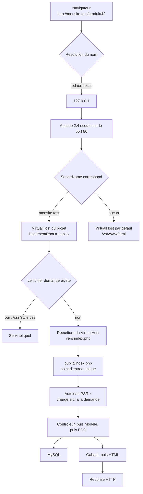
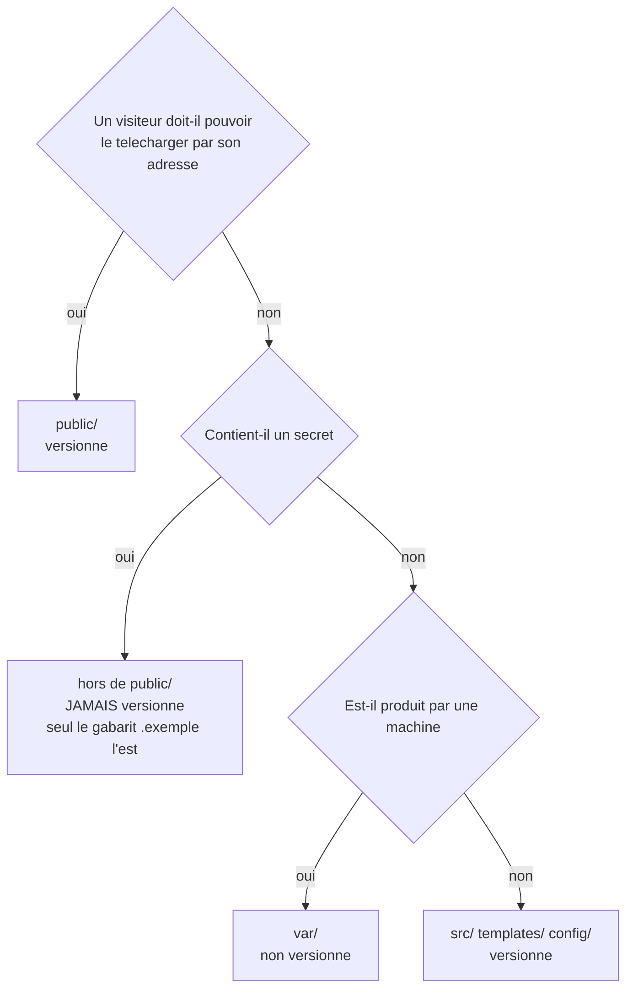

# Amorcer un projet LAMP

## L'idée en une image {hors-cours}

Une troupe de théâtre monte une pièce. Pendant deux mois, elle répète dans le sous-sol d'un membre :
plafond bas, moquette, une porte au fond, pas de rideau, une lampe de bureau en guise
d'éclairage. Tout le monde connaît son texte, les entrées sont réglées à la seconde, la pièce est
prête.

Le soir de la première, la troupe découvre la vraie scène. Elle fait douze mètres de large au lieu
de quatre : les déplacements réglés au sous-sol ne remplissent plus rien. Le plateau est en pente,
la chaise glisse. Il y a deux entrées latérales, pas une porte au fond. Et l'éclairage vient du
haut, si bien que le comédien qui se plaçait toujours du même côté est désormais dans le noir.

Rien de tout cela n'est un problème de talent. C'est un problème de **parité** : la salle où l'on a
répété ne ressemblait pas à la salle où l'on joue. Le mot est celui qu'on emploie en informatique, et
il désigne exactement la même chose — le degré de ressemblance entre la machine sur laquelle tu
développes et la machine sur laquelle ton application tournera pour de vrai.

Une scène de répétition aux dimensions de la vraie scène ne supprime pas le trac. Elle supprime les
**surprises**, c'est-à-dire la catégorie de problèmes qu'on ne peut découvrir qu'au pire moment. Et
c'est là toute la leçon : *le jour où tu déploies n'est pas le jour où tu découvres que ta machine
ne ressemblait pas au serveur.*

L'image porte encore un peu plus loin. Une scène a des **coulisses** : des perches, des costumes,
des câbles, la régie. Le public voit le plateau et rien d'autre. Ton projet aussi a des coulisses —
le mot de passe de la base de données, les bibliothèques téléchargées, les journaux, le code
source. Une bonne arborescence de projet, c'est un plateau qu'on peut regarder et des coulisses
qu'on ne peut pas atteindre.

**Où l'analogie casse — trois fois, et la troisième est le cœur du sujet.**

1. **Une salle de répétition identique coûte une fortune ; un serveur local identique est gratuit.**
   Aucune troupe ne peut se payer un double du Théâtre du Nouveau Monde. Toi, tu peux installer
   exactement la distribution, exactement les versions du serveur cible, en une heure et sans
   dépenser un sou. L'excuse budgétaire n'existe pas de ton côté.
2. **Le théâtre pardonne l'improvisation ; le serveur, jamais.** Un comédien qui se trompe de porte
   invente un mouvement et personne ne le remarque. Un `require` qui cherche `Modele/Client.php`
   alors que le fichier s'appelle `modele/client.php` produit une erreur fatale, une page blanche,
   et rien d'autre. La machine ne rattrape rien.
3. **Au théâtre, les coulisses sont hors d'atteinte par construction ; sur un serveur web, elles ne
   le sont que si tu l'as décidé.** Personne dans la salle ne peut escalader le mur pour aller
   fouiller la régie. Sur le web, n'importe qui peut taper une adresse. Si ton fichier de
   configuration est dans un dossier servi, il est **public** — il n'y a pas de mur, il n'y a que la
   configuration que tu as écrite. C'est cette différence qui rend la section « arborescence » de
   cette leçon non négociable.

::: cours {seance="1" diapos="6"}
Ce module accompagne le **projet de session**, la dernière évaluation pratique du cours. Il ne
remplace pas l'énoncé du projet : il donne le socle technique — environnement, arborescence,
contrôle de version — sur lequel le projet se construit.

**Deux chiffres circulent pour sa pondération, et il vaut mieux le savoir avant de s'en inquiéter.**
La diapositive de présentation du cours annonce **15 %** ; l'**horaire publié de la session** annonce
**20 %**, et c'est celui-là que ce site retient, parce que l'horaire fait foi pour les dates comme
pour les pondérations. Si ta diapositive dit 15 %, tu n'as pas mal lu : demande à l'enseignant lequel
des deux s'applique à ta session.
:::

## En bref — la marche à suivre {hors-cours}

:::: marche-a-suivre {titre="Amorcer un projet LAMP, du poste vide au premier commit"}

1. {voir="Les commandes, dans l'ordre"} Installer WSL2 et Ubuntu 24.04 depuis PowerShell **en
   administrateur**.

   ```bash
   wsl --install -d Ubuntu-24.04     # une seule fois par poste
   ```

2. Activer `systemd` dans la distribution, sans quoi aucune commande `systemctl` de cette leçon ne
   répondra.

   ```bash
   printf '[boot]\nsystemd=true\n' | sudo tee /etc/wsl.conf
   # puis, depuis PowerShell : wsl --shutdown, et rouvrir Ubuntu
   ```

3. {voir="Les commandes, dans l'ordre"} Installer la pile LAMP, puis PHP 8.4 depuis le dépôt
   `ondrej/php` — celui d'Ubuntu 24.04 s'arrête à 8.3.

   ```bash
   sudo apt update && sudo apt install -y apache2 mysql-server git
   sudo add-apt-repository -y ppa:ondrej/php && sudo apt update
   sudo apt install -y php8.4 libapache2-mod-php8.4 php8.4-mysql
   sudo a2dismod php8.3; sudo a2enmod php8.4; sudo systemctl restart apache2
   ```

4. {voir="La cible : ce que le serveur livre réellement"} Mesurer les versions réellement installées
   plutôt que celles qu'on croit avoir installées.

   ```bash
   php -v                     # la ligne de commande
   apache2ctl -M | grep php   # ce qu'Apache exécute vraiment
   mysql --version            # doit afficher MySQL, PAS MariaDB
   ```

5. {voir="Une arborescence qui ne sert pas ses secrets"} Créer l'arborescence du projet, avec un seul
   dossier destiné à être servi.

   ```bash
   mkdir -p monsite/{public/{css,js,img},src,templates,config,var/log,tests}
   cd monsite && composer init
   ```

6. {voir="Le VirtualHost : le geste qui remplace localhost/monSite/"} Écrire le VirtualHost dont le
   `DocumentRoot` pointe `public/`, puis l'activer.

   ```bash
   sudo a2enmod rewrite headers
   sudo a2ensite monsite
   sudo systemctl reload apache2
   ```

7. Ajouter la ligne `127.0.0.1   monsite.test` au fichier `hosts` de Windows
   (`C:\Windows\System32\drivers\etc\hosts`), édité en administrateur.

8. {voir="Une arborescence qui ne sert pas ses secrets"} Sortir la configuration de la racine web, et
   ne versionner que son gabarit sans valeurs.

   ```bash
   cp config/bd.ini.exemple config/bd.ini   # puis y écrire les vraies valeurs
   ```

9. {voir="Cinq gestes de la mise en ligne qui ouvrent une porte"} Créer un compte SQL restreint à la
   base du projet et aux seuls verbes dont l'application a besoin.

   ```sql
   CREATE USER 'app_boutique'@'localhost' IDENTIFIED BY 'MotDePasseLongEtUnique';
   GRANT SELECT, INSERT, UPDATE, DELETE ON boutique.* TO 'app_boutique'@'localhost';
   ```

10. {voir="Cinq gestes de la mise en ligne qui ouvrent une porte"} Donner le journal à Apache par
    propriétaire et par groupe, jamais par `chmod 777`.

    ```bash
    sudo chown www-data:www-data var/log/app.log
    sudo chmod 640 var/log/app.log
    ```

11. {voir="Le contrôle de version, exigé et jamais enseigné"} Mettre le projet sous contrôle de
    version dès le premier jour, une fois le `.gitignore` écrit.

    ```bash
    git init && git add . && git commit -m "Amorce du projet : arborescence, autoload, configuration"
    ```

::::

## Deux machines qui doivent se ressembler {hors-cours}

### D'où vient la méthode que tu connais déjà {cours="php" seance="1" diapos="25-26, 35, 45-49, 52-55, 107"}

Commençons par ce que tu as appris ailleurs, sans le déformer — et en disant d'où ça vient, parce
que la provenance décide de ce qui est évalué.

::: cours {seance="1" diapos="63"}
**XAMPP n'est pas une affaire propre à l'autre cours.** La liste du matériel exigé par ce cours-ci le
réclame aussi, en toutes lettres : « XAMPP ou WAMP ». Un serveur local sous Windows fait donc partie
des attendus des **deux** cours, et le terme peut tomber à l'examen ici comme là-bas.
:::

::: complement
Ce qui appartient en propre au cours **420-4P2-HU « Développement d'application en PHP »**, c'est la
**procédure d'installation détaillée** — celle que la plupart d'entre vous ont réellement pratiquée,
et que ce cours-ci ne montre nulle part. Elle prescrit **XAMPP** (ou
WAMP, présenté comme équivalent) : un installateur Windows unique qui pose Apache, PHP et MariaDB
d'un bloc, avec un panneau de contrôle pour les démarrer et les arrêter. La marche à suivre tient en
trois gestes : installer XAMPP et démarrer Apache ; déposer le code dans `C:\xampp\htdocs\monSite` ;
ouvrir `localhost/monSite/` dans le navigateur. Elle ajoute un dépannage réel et utile — si **IIS
occupe déjà le port 80**, fréquent sur une installation Windows professionnelle, on change le port
d'Apache pour **8080** et l'adresse devient `localhost:8080/monSite/`. Enfin, « créer un projet PHP »
y signifie littéralement créer des fichiers texte vides portant l'extension `.php` : aucun éditeur,
aucune arborescence et aucun outil n'y sont prescrits.
:::

C'est cohérent : ces séances-là enseignaient un **langage**, pas un outillage — et c'est cette
réponse-là qui était attendue à l'examen de ce cours-là. Retiens la règle d'arbitrage qui vaut pour
toute cette leçon : **à l'examen, donne la réponse du cours qui pose la question ; sur ta machine et
sur le serveur du projet, applique la correction.** Les deux vivent côte à côte, jamais l'une contre
l'autre.

### La cible : ce que le serveur livre réellement {seance="2" diapos="22-25"}

Le projet, lui, ne se remet pas dans `C:\xampp`. Il se déploie sur un **droplet** — le nom que
DigitalOcean donne à ses serveurs virtuels loués à l'heure — créé depuis l'image toute faite
« LAMP on 24.04 ». **LAMP** est l'acronyme des quatre briques de cette pile : **L**inux,
**A**pache, **M**ySQL, **P**HP.

::: cours {seance="2" diapos="24"}
**Le numéro de version de l'image n'est pas le même selon le support que tu relis, et ce n'est pas
une faute de frappe.** La capture de la séance 2 de ce cours-ci montre l'image « LAMP on **18.04** » ;
celle du cours de PHP montre « LAMP on **24.04** ». Cette leçon retient **24.04**, parce que c'est ce
que le catalogue de l'hébergeur propose aujourd'hui et ce que mesure le tableau ci-dessous. Si ta
diapositive dit 18.04, la leçon n'est pas fautive : c'est la capture d'écran qui a vieilli — le
catalogue d'un hébergeur suit les versions LTS d'Ubuntu, il ne les fige pas.
:::

| Brique de la pile | Version livrée par l'image |
|---|---|
| Système | Ubuntu 24.04 LTS |
| Serveur web | Apache 2.4.58 |
| Langage | PHP 8.4.11 |
| Base de données | MySQL 8.0.43 |

Ces quatre numéros sont un **relevé daté du 2026-08-31**, pas une garantie. Une image toute faite est
reconstruite régulièrement et ses paquets reçoivent des correctifs : le numéro de correctif d'Apache
et celui de MySQL auront bougé bien avant la fin de la session. C'est précisément pourquoi la
méthode enseignée plus bas consiste à **mesurer** les versions sur les deux machines plutôt qu'à
recopier ce tableau. Retiens surtout la ligne de PHP : **8.4 n'est pas la version que le dépôt
d'Ubuntu 24.04 livre**, ce qui a une conséquence directe sur ton installation locale — on y revient
au moment de l'installer.

Compare maintenant ligne à ligne. Ce n'est pas un nom de produit qui change, c'est un modèle de
machine.

| Axe de comparaison | Poste du cours (XAMPP) | Serveur cible (droplet) |
|---|---|---|
| Système | Windows | Ubuntu 24.04 |
| Chemins | `C:\xampp\htdocs\` (séparateur `\`) | `/var/www/` (séparateur `/`) |
| Casse des noms de fichiers | insensible | **sensible** |
| Permissions de fichiers | inexistantes en pratique | propriétaire, groupe, bits |
| Base de données | MariaDB | MySQL 8.0 |

**La ligne « casse » est celle qui casse.** Sous Windows, `Modele` et `modele` désignent le même
dossier : `require "Modele/Client.php"` fonctionne même si le fichier s'appelle réellement
`modele/client.php`. Sous Linux, ce sont deux chemins différents, et le second n'existe pas —
erreur fatale. Le piège est parfait parce qu'il est **silencieux du bon côté** : ta machine ne te
signale jamais l'incohérence, elle te la cache. Tu la découvres après le transfert, la veille de la
remise, sur un site qui affichait tout à l'heure.

::: correction-du-cours {source="Image marketplace DigitalOcean LAMP on 24.04 — Ubuntu 24.04, Apache 2.4.58, PHP 8.4.11 et MySQL 8.0.43 relevés le 2026-08-31 ; fiche KB web/php/php-environnement-developpement-moderne.md ; chapitre « déploiement d'une base de données MariaDB » de la séance 9 du 420-B10-HU" seance="9" diapos="3, 7"}
**MariaDB n'est pas une bizarrerie de l'autre cours : ce cours-ci l'installe aussi.** Sa séance 9
consacre un chapitre entier au déploiement d'une base de données **MariaDB** et fait installer le
paquet `mariadb-server`. Le matériel d'installation du 420-4P2-HU parle lui aussi de MariaDB, parce
que c'est ce que XAMPP embarque depuis des années. L'image de production, elle, sert **MySQL 8.0** :
l'écart n'est donc pas entre les deux cours, il est **entre les deux cours et le serveur cible**.

Garde le terme du cours pour l'examen — mais sache que ce
ne sont plus le même produit depuis 2012 : les deux moteurs divergent sur les rôles et
l'authentification, sur le type `JSON`, sur les index fonctionnels et sur certaines fonctions de
fenêtrage. Un script de création de base écrit contre MariaDB peut donc échouer à la remise. La
vérification tient en une requête, et elle ne coûte rien : `SELECT VERSION();` répond soit une
version suivie de `-MariaDB`, soit une version MySQL nue.
:::

::: cours {seance="1" diapos="13"}
**Le prix du serveur n'a pas le même chiffre selon le support que tu relis — et aucun des quatre
n'est faux.** Le plan de cours de ce cours-ci annonce « plateforme infonuagique **5 $ (maximum)** »
et « nom de domaine **15 $ (environ)** », et la capture de sa séance 2 montre la taille facturée
**5 $ par mois** ; le plan de cours de PHP annonce **3 $ (environ)**, et sa capture montre **6 $ par
mois**. Ce n'est pas une contradiction entre les deux cours : c'est le catalogue d'un hébergeur,
relevé à des dates différentes, sur des tailles de machine qui ont changé de prix entre-temps.

Retiens l'**ordre de grandeur** plutôt qu'un chiffre — cinq à six dollars par mois pour la plus
petite taille, plus le nom de domaine si tu en prends un — et vérifie avec l'enseignant ce que ton
inscription couvre avant de créer quoi que ce soit.
:::

::: attention
Le droplet est un serveur **loué**, facturé à l'heure jusqu'à un plafond mensuel. Retiens le seul
fait qui coûte réellement de l'argent, parce qu'il surprend tout le monde :
**éteindre un droplet ne cesse pas de le facturer.** Un serveur arrêté réserve toujours son disque
et son adresse, donc il continue de coûter. Seule sa **destruction** arrête la facture — et les
**instantanés** (*snapshots*) que tu aurais pris se facturent séparément, eux aussi jusqu'à leur
suppression. Après la remise : détruis le droplet, puis va vérifier qu'il ne reste ni instantané ni
volume orphelin.
:::

### Pourquoi ce module existe dans un cours de sécurité {hors-cours}

L'écart n'est pas un caprice de puriste. Le **plan de cours du 420-4P2-HU** — le cours de PHP, dans
le même programme, dont le projet prolonge directement celui-ci — exige en toutes lettres un « outil
de développement parmi les plus récents dans l'industrie », les « bibliothèques les plus sécurisées »
et une « configuration appropriée du système de gestion de versions ». Or le matériel de ses
premières séances n'enseigne ni contrôle de version, ni gestionnaire de dépendances, ni outil
d'analyse.

::: complement
La conséquence pratique est contre-intuitive et vaut d'être dite clairement : monter un
environnement moderne n'est **pas** aller au-delà de ce qu'on te demande, c'est satisfaire le
référentiel déjà écrit. L'écart est **interne** au programme — entre ce que les plans de cours
réclament et ce que les diapositives montrent — et non entre le programme et cette leçon. Tout ce
qui suit dans ce module est un complément non exigible à un examen écrit ; c'est en revanche
exactement ce que le projet de session, lui, est censé démontrer.
:::

## Monter la salle de répétition {hors-cours}

Cinq options existent pour se donner un serveur local. Elles ne se valent pas du tout du point de
vue de la parité.

| Option d'environnement local | Parité avec le serveur | Coût | Quand la choisir |
|---|---|---|---|
| **WSL2 + LAMP par `apt`** | exacte : même distribution, même gestionnaire de paquets, mêmes chemins | gratuit, environ une heure | Cours de PHP **et** cours de sécurité : on administre le vrai serveur |
| **DDEV** sur Docker dans WSL2 | très bonne, versions choisies par projet | gratuit, environ dix minutes | Plusieurs projets à des versions différentes |
| **Docker Compose écrit à la main** | très bonne | gratuit, friction élevée | Quand on veut comprendre l'orchestration |
| **Laragon** | inférieure : pile native Windows | gratuit, léger | Rester sous Windows sans XAMPP |
| **Serveur intégré `php -S`** | faible | gratuit, instantané | Un test jetable, une page de démonstration |

**Le choix retenu ici : WSL2 + LAMP installé par `apt`.** La raison n'est pas idéologique. Ce cours
porte précisément sur l'administration d'un serveur Linux — utilisateurs, permissions, tâches
planifiées, journaux — et un environnement qui **masque** cette administration retire la moitié de la
pratique. DDEV et Docker sont d'excellents outils, mais ils placent une couche de conteneur entre toi
et la machine : la commodité te prive exactement de ce qui est évalué.

::: attention
Deux options méritent un avertissement explicite. Le serveur intégré `php -S` ne lit pas les
fichiers `.htaccess`, ne charge aucun module Apache et ne traite qu'une requête à la fois : il est
parfait pour un essai de dix minutes, et **jamais** comme environnement principal — ce qui marche
chez lui ne prouve rien sur ce qui marchera sur le serveur. Et ne monte pas WSL2 la veille d'une
remise : changer d'environnement est un chantier, il se fait entre deux travaux.
:::

### Les commandes, dans l'ordre {seance="9" diapos="7, 41-42"}

Depuis PowerShell **en administrateur**, une seule commande installe WSL2 et Ubuntu — elle s'écrit
`wsl --install -d Ubuntu-24.04`, et c'est la seule de toute cette leçon qui se tape côté Windows.

Tout le reste se passe **dans le terminal Ubuntu**, et c'est déjà la moitié du bénéfice : ce sont
mot pour mot les commandes que tu retaperas sur le serveur. Voici la pile qui lui correspond :

Une précision s'impose avant de taper quoi que ce soit, et c'est elle qui décide de la parité :
**`apt install php` ne donne pas PHP 8.4 sur Ubuntu 24.04.** Le dépôt de la distribution y livre
**PHP 8.3**, et il le livrera pour toute la durée de vie de cette version du système — c'est le
principe d'une distribution *LTS* : elle fige une version et n'y applique ensuite que des correctifs.
Le serveur cible, lui, sert du **8.4**, ce qui prouve d'ailleurs que son image emploie elle aussi un
dépôt supplémentaire.

Conclusion à ne pas contourner : le dépôt **`ondrej/php`** — la référence de l'écosystème PHP sous
Debian et Ubuntu, qui empaquette toutes les versions maintenues en parallèle — n'est pas un recours
en cas de problème, c'est le **passage obligé** pour atteindre la parité. Il entre donc dans la
marche à suivre principale.

```bash
sudo apt update && sudo apt upgrade -y
sudo apt install -y apache2 mysql-server git

sudo add-apt-repository -y ppa:ondrej/php
sudo apt update
sudo apt install -y php8.4 libapache2-mod-php8.4 php8.4-cli php8.4-mysql php8.4-mbstring php8.4-xml php8.4-curl php8.4-zip

sudo a2dismod php8.3
sudo a2enmod php8.4
sudo systemctl restart apache2

sudo apt install -y composer
```

Les trois commandes du milieu méritent un mot. Rien n'interdit à une machine de porter **deux
versions de PHP à la fois** — c'est même tout l'intérêt de ce dépôt. Apache, lui, ne peut charger
qu'un seul module PHP : `a2dismod` retire celui de la 8.3, `a2enmod` met celui de la 8.4, et le
redémarrage rend le changement effectif. Si la 8.3 n'a jamais été installée sur ta machine,
`a2dismod php8.3` répondra que le module n'existe pas : c'est bon signe, continue.

::: cours {seance="9" diapos="41-42"}
**Cette séquence-là est bien celle du cours** — et c'est la seule installation de la pile par
`apt` que portent les deux cours réunis. La séance 9 déroule `apt-get update`, puis
`apt-get install apache2`, puis `apt-get install php`, puis `systemctl restart Apache2`, et elle te
fait relever la version obtenue par `php --version`.

Ce que la marche à suivre ci-dessus **ajoute** tient en une ligne : le dépôt `ondrej/php`. Sans lui,
ce relevé affiche 8.3 — c'est-à-dire exactement l'écart que la diapositive te fait mesurer sans le
nommer.

Le cours de PHP donne le même rappel, en plus court, à sa séance 8 : `apt-get`, `sudo` et `chmod` y
sont posés comme les trois commandes d'administration à connaître. **Les deux cours enseignent donc
ces gestes** ; ni l'un ni l'autre ne montre `a2dismod`, `a2enmod` ou `apache2ctl`.
:::

::: complement
`sudo apt install composer` installe la version de Composer empaquetée par la distribution — une
**2.7.x** contre une **2.8.x** en amont au moment d'écrire ces lignes. C'est un retard de version
**mineure**, pas majeure : mêmes commandes, même format de `composer.json`, même verrou. On garde
donc `apt`, qui ne demande ni compte, ni clef, ni script téléchargé puis exécuté à l'aveugle, et on
rattrape l'écart en une commande le jour où c'est nécessaire : `sudo composer self-update`.
:::

Le geste suivant est le plus important de tous, et c'est celui qu'on saute : **vérifier ce qu'on a
réellement installé**, plutôt que ce qu'on croit avoir installé.

```bash
php -v                     # SAPI en ligne de commande — doit afficher 8.4.x
apache2ctl -M | grep php   # module charge par Apache — doit afficher php8_4_module
mysql --version            # doit afficher MySQL, PAS MariaDB
apache2 -v                 # doit afficher Apache/2.4.x
```

::: attention
**`php -v` ne mesure pas le PHP qu'Apache exécute**, et c'est le piège le plus coûteux de cette
section. PHP s'exécute derrière plusieurs **SAPI** — *Server API*, l'interface par laquelle un
programme appelle PHP. Celle que `php -v` interroge s'appelle **CLI**, la ligne de commande ; celle
qui sert tes pages est le **module Apache**. Ce sont deux binaires distincts, avec **deux fichiers
`php.ini` distincts**, et rien n'oblige les deux à porter la même version — la manœuvre
`a2dismod`/`a2enmod` ci-dessus est exactement le moment où elles peuvent diverger.

D'où deux mesures qui ne se remplacent pas : `php -v` dit ce qu'exécuteront Composer et tes tâches
planifiées, `apache2ctl -M` dit ce qu'exécutera ton **site**. Et note ce qu'on ne fait **pas** pour
l'apprendre : déposer un fichier contenant `phpinfo()` dans la racine web. Cette page publie la
version, les extensions, les chemins absolus et la configuration complète du serveur à qui en devine
l'adresse — c'est exactement le genre de fichier que cette leçon passe son temps à sortir du
`DocumentRoot`.
:::

Si l'une de ces quatre commandes ne rend pas la version attendue, tu viens de gagner une demi-heure :
tu as trouvé un écart de parité aujourd'hui plutôt que le jour de la remise.

### Le VirtualHost : le geste qui remplace localhost/monSite/ {hors-cours}

Un **VirtualHost** est un bloc de configuration par lequel Apache dit : « quand une requête arrive
pour ce nom d'hôte, sers ce dossier-là, avec ces règles-là ». C'est le seul travail de configuration
manuel de cette option, et il se fait **une fois par projet**, dans un fichier
`/etc/apache2/sites-available/monsite.conf`.

Voici ce que ce fichier contient, directive par directive.

| Directive du VirtualHost | Valeur posée | Ce qu'elle décide |
|---|---|---|
| `ServerName` | `monsite.test` | Le nom d'hôte auquel ce bloc répond ; toute autre requête ira au VirtualHost par défaut |
| `DocumentRoot` | `/home/moi/projets/monsite/public` | **La racine web** : la frontière entre ce qui est servi et ce qui ne l'est pas |
| `<Directory>` | le même chemin | Ouvre le bloc de règles qui s'applique à ce dossier |
| `AllowOverride None` | — | N'autorise **aucun** `.htaccess` : les règles de réécriture vivent ici même, dans le VirtualHost |
| `RewriteEngine` puis `RewriteRule` | vers `index.php` | Envoie au point d'entrée unique toute requête qui ne correspond à aucun fichier existant |
| `Require all granted` | — | Autorise Apache à servir ce dossier ; sans elle, tout répond 403 |
| `Header always set` | `X-Content-Type-Options: nosniff` | Interdit au navigateur de deviner le type d'un fichier |
| `Header always set` | `X-Frame-Options: DENY` | Interdit l'affichage du site dans un cadre tiers |
| `Header always set` | `Referrer-Policy: strict-origin-when-cross-origin` | Limite ce que le site fuit dans l'en-tête `Referer` |
| `ErrorLog` | `${APACHE_LOG_DIR}/monsite-erreur.log` | Où partent les erreurs du serveur |
| `CustomLog` | `${APACHE_LOG_DIR}/monsite-acces.log combined` | Où partent les accès, au format complet |

::: cours {seance="9" diapos="42"}
**De tout ce tableau, le cours ne porte qu'une case : la dernière commande.** La séance 9 montre
`systemctl restart Apache2` — le geste qui rend une configuration effective — et s'arrête là. Ni
`VirtualHost`, ni `DocumentRoot`, ni `ServerName`, ni `AllowOverride`, ni `.htaccess`, ni
`RewriteRule`, ni `a2ensite` n'apparaissent dans les diapositives des **deux** cours.

Ce n'est pas un reproche, c'est un repère : rien de ce qui suit ne peut tomber à un examen écrit,
et tout y est exigible du **projet**, qui se remet sur un serveur où ces directives existent de
toute façon — l'image du droplet en pose déjà un.
:::

::: complement
**Pourquoi `AllowOverride None` plutôt que `All`.** Un `.htaccess` est un fichier de configuration
qu'Apache relit **à chaque requête**, dans chaque dossier traversé, parce qu'il ne peut pas savoir
s'il a changé depuis la précédente. Il existe pour une seule situation : celle de l'hébergement
mutualisé, où tu n'as pas la main sur la configuration du serveur. Ici, tu l'as — le VirtualHost
t'appartient. La documentation d'Apache dit elle-même d'éviter `.htaccess` quand on peut écrire dans
la configuration du serveur, et Debian comme Ubuntu posent d'ailleurs `AllowOverride None` par
défaut sur `/var/www` : croire que `All` est « comme sur le serveur cible » est une supposition de
parité, pas une mesure.

Le bénéfice n'est pas que de performance. Une règle écrite dans le VirtualHost est **au même endroit
que le reste de la configuration**, versionnée avec le déploiement du serveur, et elle ne peut pas
disparaître silencieusement parce qu'un transfert de fichiers a oublié un fichier commençant par un
point — ce qui arrive tout le temps avec un client graphique qui masque les fichiers cachés.
:::

Trois commandes activent l'ensemble :

```bash
sudo a2enmod rewrite headers
sudo a2ensite monsite
sudo systemctl reload apache2
```

::: attention
**Sous WSL2, `systemctl` ne répond pas tant qu'on ne l'a pas activé**, et le message d'erreur
(« System has not been booted with systemd as init system ») n'indique pas la solution. Il faut créer
ou compléter le fichier `/etc/wsl.conf` dans Ubuntu avec une section `[boot]` contenant la ligne
`systemd=true`, puis fermer la distribution depuis PowerShell par `wsl --shutdown` et la rouvrir.

Tant que ce n'est pas fait, toutes les commandes `systemctl` de cette leçon échouent — et c'est un
blocage total, pas une gêne. Sur le droplet, rien à faire : `systemd` y est actif d'origine.
:::

Il reste à faire pointer le nom vers ta propre machine, en ajoutant la ligne
`127.0.0.1   monsite.test` au fichier `hosts` de **Windows**
(`C:\Windows\System32\drivers\etc\hosts`, à éditer en administrateur).

::: complement
**Pourquoi `.test` et pas `.local` ni `.dev`.** `.test` est un domaine de premier niveau **réservé**
par la RFC 6761 pour exactement cet usage : il ne sera jamais vendu, donc ton nom local n'entrera
jamais en collision avec un vrai site. `.dev`, lui, est un vrai domaine de premier niveau, et il est
**préchargé en HSTS** dans les navigateurs — autrement dit, ton navigateur refusera catégoriquement
d'ouvrir `monsite.dev` en HTTP clair, et ton site local ne s'affichera pas. `.local` entre en
conflit avec la découverte de services mDNS. Le choix n'est pas cosmétique.
:::

### Le chemin d'une requête, du navigateur au code {cours="php" seance="1" diapos="21-22, 56, 59-60"}



Ce schéma explique du même coup **pourquoi la méthode `htdocs/monSite/` finit par coincer**. Dans
cette méthode, le projet vit dans un *sous-dossier* de la racine web. Un chemin absolu comme
`/css/style.css` part donc de `htdocs/` et non du projet : il ne trouve rien. On compense avec des
chemins relatifs (`../css/style.css`), qui sont fragiles — ils dépendent de la profondeur de la page
qui les écrit — et qui cassent tous le jour où le site est déployé **à la racine du domaine**. Le
VirtualHost supprime la classe entière de problèmes, parce qu'il fait de la racine du projet la
racine de l'URL, en local comme en production.

## Une arborescence qui ne sert pas ses secrets {hors-cours}

Voici la deuxième idée structurante de la leçon, et elle tient en une phrase : **le `DocumentRoot`
est une frontière de sécurité, pas un choix de rangement.** Tout ce qui est dedans est atteignable
par une adresse ; tout ce qui est dehors ne l'est pas, quoi qu'il arrive.

D'où la règle : le `DocumentRoot` ne pointe pas la racine du projet, il pointe un sous-dossier
`public/` qui ne contient que ce que le monde a le droit de demander.

Les commandes qui créent cette arborescence :

```bash
mkdir -p monsite/{public/{css,js,img},src/{Modele,Service,Controleur},templates,config,var/log,tests}
cd monsite
git init
composer init          # nom, description, licence, autoload PSR-4 : App\ vers src/
```

Et ce que chaque dossier contient, avec les deux seules questions qui comptent :

| Dossier ou fichier | Contenu | Servi par HTTP | Versionné |
|---|---|---|---|
| `public/` | point d'entrée `index.php`, CSS, JS, images | **oui — et lui seul** | oui |
| `src/` | le code : classes, espace de noms `App\` | non | oui |
| `templates/` | les vues : HTML et affichage seulement | non | oui |
| `config/bd.ini` | **le secret** : hôte, base, utilisateur, **mot de passe** | non | **non — jamais** |
| `config/bd.ini.exemple` | le **gabarit** : les mêmes clefs, **sans les valeurs** | non | oui |
| `var/` | généré à l'exécution : journaux, cache, téléversements | non | non |
| `tests/` | tests automatisés | non | oui |
| `vendor/` | dépendances installées par le gestionnaire | non | **non** |
| `composer.json` | les dépendances **voulues** | non | oui |
| `composer.lock` | les dépendances **réellement installées** | non | **oui** |

Lis la colonne « Servi par HTTP » de haut en bas : une seule case dit « oui ». C'est tout le
principe. Le mot de passe de la base, le code source, les journaux et les bibliothèques ne sont pas
protégés par une règle qu'on pourrait oublier d'écrire — ils sont **hors de portée par
construction**, parce qu'Apache ne sait littéralement pas qu'ils existent.

**Le couple `bd.ini` / `bd.ini.exemple` est le geste à retenir de tout ce tableau**, et il mérite ses
trois phrases, parce que c'est là que les projets d'étudiants perdent leur mot de passe. Le dossier
`config/` n'est pas « du non-secret » : il contient **les deux à la fois**, et c'est le nom du
fichier qui tranche. `config/bd.ini` porte les vraies valeurs, il ne quitte jamais ta machine ni le
serveur, il n'entre **jamais** dans le dépôt. `config/bd.ini.exemple`, lui, porte exactement les
mêmes clefs avec des valeurs vides ou fictives, et il est versionné — c'est lui qui dit à la
personne suivante (y compris toi, dans trois mois, sur une machine neuve) **quoi remplir**. Le
premier geste sur une machine neuve devient alors :
`cp config/bd.ini.exemple config/bd.ini`, puis on remplit.

Un fichier de configuration sans gabarit versionné est un projet qu'on ne peut pas réinstaller ; un
gabarit qui contient les vraies valeurs est un mot de passe publié. Il faut les deux fichiers, et
l'exclusion qui les sépare — on l'écrit dans le `.gitignore`, plus bas.

::: cours {seance="9" diapos="46"}
**Ce que le cours prescrit à la place, il faut le savoir avant de choisir.** La séance 9 demande de
« copier ce répertoire sur votre serveur » et de « le mettre sous `/var/www/html` » ; le cours de PHP
dit la même chose à sa séance 8 — « déployer une application est très simple, il faut simplement
copier tout son contenu sous le répertoire `/var/www/html` ». C'est l'arborescence **plate**, celle
où tout est servi, exactement l'inverse de celle ci-dessus.

Les deux méthodes cohabitent sans se contredire, parce qu'elles ne répondent pas à la même question.
Le cours te montre **comment mettre un site en ligne** ; cette section te montre **ce que le serveur
ne doit pas pouvoir servir**. À l'examen, la réponse attendue est celle du cours. Sur le serveur du
projet, c'est le `DocumentRoot` qui décide, et lui seul.
:::

Quand tu hésites sur l'endroit où poser un fichier neuf, une seule question suffit :



::: complement
Le point d'entrée unique — un seul `index.php` dans `public/`, qui reçoit toutes les requêtes et
décide quoi faire — porte un nom : le **contrôleur frontal**. Il n'est pas obligatoire pour un
projet de session, mais il découle naturellement de l'arborescence ci-dessus : si `src/` n'est pas
servi, aucune page ne peut y être atteinte directement, donc toutes les pages doivent passer par un
même fichier. C'est la même idée qu'une entrée unique dans un bâtiment : une porte à surveiller
plutôt que trente.
:::

## Cinq gestes de la mise en ligne qui ouvrent une porte {seance="9" diapos="28-30, 38, 46-47, 49"}

Passons à la partie qui appartient vraiment à un cours de sécurité. La méthode de mise en ligne
enseignée est efficace et elle fonctionne — c'est d'ailleurs pour ça qu'elle est dangereuse : rien
n'échoue, rien n'avertit, et le site est en ligne.

Cette méthode ne vient pas d'un seul endroit, et la distinction compte pour tes révisions. Une
partie appartient à **ce cours-ci**, une autre au cours de PHP — et deux gestes, les plus lourds de
conséquences, sont enseignés **par les deux**. Chaque bloc ci-dessous dit d'où il sort, sans
raccourci : « ce n'est pas de la matière d'ici » est une phrase qui se vérifie avant de s'écrire.

::: cours {seance="2" diapos="23, 26-31"}
L'administration de la machine se fait par **PuTTY**, en SSH sur le port 22 : c'est la matière de
cette séance-ci, et c'est sous ce nom-là que l'outil peut être nommé à l'examen.
:::

::: cours {seance="1" diapos="63"}
**WinSCP, le second outil, n'appartient pas à la séance 2 — et la nuance vaut pour tes révisions.**
Il est exigé dès la liste du matériel du cours, à la toute première séance, aux côtés de PuTTY ; sa
configuration par clé est reprise à la séance 3, et c'est à la séance 9 qu'on s'en sert réellement,
pour téléverser le code sur le serveur. La séance 2, elle, ne le mentionne nulle part. Le
glisser-déposer reste bien la méthode de transfert enseignée par ce cours ; seule son adresse dans
le plan de séances change.
:::

::: cours {seance="9" diapos="28-30, 38, 46-47"}
Côté base de données, la marche à suivre consiste à **téléverser phpMyAdmin dans la racine web**
pour administrer MySQL depuis le navigateur, puis à créer le compte SQL de l'application avec
`GRANT ALL PRIVILEGES ON *.*`.

**Le cours de PHP enseigne exactement la même séquence**, dans les mêmes mots et le même ordre : les
deux ne diffèrent que par le nom du compte créé et par l'adresse à laquelle on rejoint phpMyAdmin.
Ce n'est donc pas une matière propre à ce cours-ci, et tu la retrouveras des deux côtés.
:::

::: complement
Le reste de la séquence vient du cours **420-4P2-HU**, pas de celui-ci : déposer un `config.ini`
**dans la racine web** avec le mot de passe en clair, employer des fichiers d'inclusion en `.inc`, et
rendre le journal inscriptible par `chmod 777`. On l'examine ici parce que c'est ce que la plupart
des projets contiennent réellement, mais ce n'est pas de la matière d'examen pour ce cours-ci.

Un constat vaut pour les deux ensembles : aucun de ces matériels ne contient de VirtualHost, ni de
contrôle de version, ni de gestionnaire de dépendances.
:::

::: cours {seance="9" diapos="49"}
**Le HTTPS est annoncé, puis jamais couvert — et c'est vrai des DEUX cours, pas seulement de
l'autre.** La séance qui installe phpMyAdmin le dit elle-même en toutes lettres : la communication
avec le serveur n'est pas chiffrée, le mot de passe peut être intercepté, et « cette situation sera
corrigée lorsque nous installerons un certificat SSL ». Le cours de PHP fait exactement la même
promesse à la même étape de son déploiement. Dans les deux cas, la diapositive suivante change de
sujet.

Ce n'est donc **pas** un angle mort : le risque est nommé par le cours, correctement. Ce qui manque
est la suite. Retiens-le tel quel — tu connais le danger *et* tu sais qu'aucun des deux supports ne
te donnera la parade ; c'est à ton projet de la porter.
:::

Chacun de ces gestes a une parade qui coûte moins de cinq minutes **le premier jour**, et une
réécriture complète si elle est ajoutée à la fin.

| Geste enseigné | Ce qu'il expose | La parade |
|---|---|---|
| `config.ini` déposé dans la racine web | Apache ne connaît pas l'extension `.ini` et sert le fichier **en texte brut** : une seule adresse livre l'utilisateur, le mot de passe et le nom de la base | Placer la configuration **au-dessus** du `DocumentRoot`, dans `config/bd.ini` ; ne jamais la versionner, et ne versionner que le gabarit `config/bd.ini.exemple` |
| Fichiers d'inclusion en `.inc` | Même mécanisme : Apache ne sait pas qu'un `.inc` contient du PHP, il le sert comme du texte. Un `config.inc` livre le mot de passe, un `fonctions.inc` livre la logique | Nommer tous les fichiers PHP `.php`, et les placer hors de `public/` ; l'extension n'est pas un détail esthétique |
| `chmod 777` sur le journal | Tout compte du serveur — y compris celui d'un service compromis — peut lire, réécrire et effacer le journal ; les traces d'une intrusion deviennent modifiables par l'intrus | `chown www-data:www-data` puis `640`, dans `var/log/` hors racine web, quand **seul** Apache écrit ; le droit d'écriture se donne par **propriétaire et groupe**, pas par « tout le monde » |
| `GRANT ALL PRIVILEGES ON *.*` | Le compte de l'application peut lire et détruire **toutes** les bases du serveur, créer des comptes, et lire des fichiers de la machine dans les limites dites plus bas. Une injection SQL cesse d'être un incident local | Un compte par application, restreint à **sa** base et aux verbes dont elle a besoin : `SELECT, INSERT, UPDATE, DELETE ON boutique.*` |
| phpMyAdmin téléversé, servi en HTTP clair | Une interface d'administration complète, publique, dont le mot de passe circule en clair sur le réseau ; les robots la cherchent à l'adresse `/phpmyadmin` en permanence | Ne pas l'exposer : administrer la base par un **tunnel SSH**, ou servir un outil d'un seul fichier restreint à l'adresse de bouclage, et n'ouvrir aucune interface d'administration sans HTTPS |

::: cours {seance="9" diapos="32-35"}
**La quatrième parade, tu l'as déjà vue en classe — et il faut le dire, parce que la nuance est
ailleurs.** Ce cours-ci enseigne bel et bien le privilège restreint : après avoir créé le compte avec
`ALL PRIVILEGES`, il montre qu'on peut remplacer cet accès par des verbes nommés — `SELECT`,
`UPDATE`, `DELETE`, `INSERT` — et que toute opération hors de cette liste sera refusée. La séquence
du cours est donc un **ordre pédagogique** (large d'abord, pour que phpMyAdmin fonctionne ; restreint
ensuite), pas une omission.

La critique juste est plus étroite, et c'est elle qu'il faut retenir : le cours ne **revient jamais**
restreindre le compte qu'il vient de créer, et c'est précisément ce compte-là que l'application
emploie ensuite. Le geste manquant n'est pas de connaître `GRANT SELECT` — tu le connais — c'est de
l'appliquer au compte qui tourne réellement en production.
:::

::: attention
Le fil conducteur des cinq parades n'est pas « en faire plus ». C'est de remplacer un **défaut
silencieux** par une **impossibilité structurelle**. Un fichier hors du `DocumentRoot` ne peut pas
fuir, même si tu oublies de le protéger ; un compte SQL sans le droit `DROP` ne peut pas détruire
une table, même si une faille est trouvée dans ton code. C'est le seul type de mesure de sécurité
qui survit à un projet pressé : celle qu'on ne peut pas oublier d'appliquer.
:::

::: note
**Deux précisions sur les permissions du journal, parce que `640` seul ne suffit pas à décider.** Le
chiffre ne dit rien tant qu'on n'a pas nommé **qui** possède le fichier. Si le journal n'est écrit
que par PHP servi par Apache, le propriétaire et le groupe sont ceux du serveur —
`chown www-data:www-data`, puis `640` : le propriétaire lit et écrit, le groupe lit, le reste du
monde n'a rien.

Mais dès qu'une **tâche planifiée** exécutée sous un autre compte écrit dans le même fichier — un
script de nettoyage lancé par `cron` sous ton propre utilisateur, par exemple — `640` le fait
échouer en silence, puisque le groupe n'a que la lecture. La bonne réponse n'est alors **pas** de
revenir à `777` : c'est `660` avec un **groupe partagé** entre `www-data` et ce compte-là. Le
principe est intact — on élargit d'un cran, pour un groupe nommé, jamais pour « tout le monde ».
:::

::: correction-du-cours {source="Fiche KB web/php/php-organisation-projet.md — corrigé officiel de la séance 1 du cours 420-4P2-HU, relevé le 2026-08-30 ; comportement par défaut d'Apache pour une extension sans gestionnaire déclaré"}
Le partage de gabarit par `include "header.inc"` est un **bon geste pédagogique** : il introduit
`include` et `require`, et la différence entre les deux — un avertissement contre une erreur fatale.
Garde-le tel quel pour l'examen de ce cours-là. Mais change l'extension dans tes propres fichiers :
un `.inc` n'est pas associé au moteur PHP, donc Apache le sert comme un fichier texte ordinaire. Tant
que le fichier ne contient que du HTML, personne ne s'en aperçoit. Le jour où c'est `config.inc` qui
contient le mot de passe de la base, une seule requête HTTP le publie.

Une borne, parce que c'est un comportement **par défaut** et non une loi : la configuration
`php8.x.conf` de Debian et d'Ubuntu n'associe le moteur PHP qu'à `.php`, `.phar` et `.phtml`, donc un
`.inc` tombe bien en texte brut — à moins qu'une directive `FilesMatch` de la configuration n'en
interdise l'accès. Cela se mesure sur ton droplet, en demandant l'adresse d'un `.inc` de test, plutôt
que cela ne se suppose.
:::

## Le contrôle de version, exigé et jamais enseigné {hors-cours}

Le dernier morceau du socle est celui que le plan de cours du **420-4P2-HU** réclame nommément — une
« configuration appropriée du système de gestion de versions » — et qu'aucune diapositive ne montre.

Un **système de contrôle de version** est un journal de bord du projet : il retient chaque état
successif du code, qui l'a écrit, et pourquoi. `git` en est le standard. Trois commandes suffisent
pour commencer, et elles remplacent définitivement les dossiers `monsite_v2_final_VRAIMENT/`.

```bash
git init
git add .
git commit -m "Amorce du projet : arborescence, autoload, configuration"
```

Le fichier qui décide de ce qui **n'entre pas** dans le dépôt s'appelle `.gitignore`. Le contenu de
départ tient en sept lignes, et chacune a une raison différente.

| Ligne du `.gitignore` | Pourquoi elle y est |
|---|---|
| `/vendor/` | Reconstruit par le gestionnaire de dépendances ; des milliers de fichiers qui n'appartiennent pas à ton projet |
| `/config/*.ini` | **Le secret.** Un mot de passe poussé sur un dépôt public y reste, même après suppression : l'historique le garde |
| `!/config/*.ini.exemple` | La **ré-inclusion** : le point d'exclamation annule l'exclusion précédente pour le seul gabarit, qui ne contient aucune valeur et doit être versionné |
| `*.log` | Bruit, volume, et parfois données personnelles écrites par mégarde |
| `/var/` | Cache, sessions, fichiers téléversés — tout ce qui est produit par la machine |
| `.idea/`, `.vscode/` | Réglages de **ton** éditeur, pas du projet |
| `.DS_Store` | Fichier d'aperçu déposé par macOS dans chaque dossier |

**L'ordre de ces deux lignes-là n'est pas libre.** Git lit le fichier de haut en bas et la
**dernière** règle qui correspond l'emporte : `!/config/*.ini.exemple` doit donc venir **après**
`/config/*.ini`, sinon l'exclusion large reprend le dessus et le gabarit ne part jamais dans le
dépôt. Écrites dans le bon ordre, ces deux lignes disent exactement ce que la section précédente
demandait : la copie remplie reste chez toi, le gabarit voyage.

::: attention
`composer.lock` **ne va pas** dans le `.gitignore`, et c'est l'erreur la plus fréquente. Elle annule
tout l'intérêt du gestionnaire de dépendances. `composer.json` déclare une **intention** (« une
version 3 quelconque de cette bibliothèque ») ; `composer.lock` fige la **réalité** (« exactement la
version 3.7.0, dont voici l'empreinte »). Sans le fichier verrouillé dans le dépôt, le serveur
installe d'autres versions que ta machine — et « ça marche chez moi » revient par la porte que tu
croyais avoir fermée.
:::

Un `composer.json` d'amorçage, avec le chargement automatique des classes selon la norme PSR-4 :

```json
{
    "name": "moi/monsite",
    "require": { "php": ">=8.4" },
    "autoload": { "psr-4": { "App\\": "src/" } },
    "autoload-dev": { "psr-4": { "Tests\\": "tests/" } }
}
```

::: complement
**PSR-4** est la convention qui associe un espace de noms à un dossier : la classe
`App\Modele\Client` se trouve dans `src/Modele/Client.php`, sans qu'aucun `require` n'ait à être
écrit. C'est la fin des cascades d'inclusions.

**Et voici exactement ce que ça t'apporte en sécurité — ni plus, ni moins.** PSR-4 supprime le
principal *prétexte* à écrire un `require` dont le chemin se fabrique dans une variable : quand
l'outillage trouve les classes tout seul, plus personne n'a de raison d'assembler un nom de fichier à
la main. C'est un gain réel, parce que la plupart des inclusions dangereuses naissent d'une commodité,
pas d'un besoin.

Ce n'est pas une protection, et il faut le dire clairement, sous peine d'enseigner une fausse
sécurité. D'abord parce que l'autoloader lui-même **construit bel et bien un chemin de fichier à
partir d'une chaîne** — le nom de la classe : si ce nom vient de l'utilisateur, par exemple dans un
`new $_GET['type']`, on est revenu au même problème par une autre porte. Ensuite parce que
l'inclusion de **gabarit** paramétrée — le fameux `include $_GET['page']`, qui est la vraie source
des failles d'inclusion locale de fichiers — n'est pas touchée du tout par PSR-4 : ce n'est pas une
classe, l'autoloader n'y est pour rien. La parade de ces deux cas-là reste la même que partout
ailleurs : une **liste blanche** de valeurs admises, jamais un chemin reçu du client. Le sujet a son
propre module dans ce cours.
:::

::: complement
Le contrôle de version transforme aussi le **transfert**. Au glisser-déposer par WinSCP — non
reproductible, non réversible, et qui laisse sur le serveur les fichiers d'une version précédente
qu'on croyait supprimés — se substitue un `git pull` exécuté **sur le serveur** : la même commande,
le même résultat, à chaque fois, et un historique qui dit quelle version tourne réellement en ligne.
:::

## Exemple simple {cours="php" seance="3" diapos="37, 39, 41"}

Le mécanisme isolé, dans sa plus petite forme : **où vit le fichier de configuration**. Rien d'autre
ne change entre les deux volets.

:::: comparaison
::: vulnerable
```php
<?php
// public/index.php — le fichier de configuration est juste a cote, dans la racine web
$config = parse_ini_file(__DIR__ . '/config.ini');

$pdo = new PDO(
    "mysql:host={$config['hote']};dbname={$config['base']}",
    $config['utilisateur'],
    $config['motdepasse']
);
```

{lignes="3"} `__DIR__` est le dossier du fichier courant, donc `public/` : la configuration est
**dans** la racine web. Apache ne connaît pas l'extension `.ini` et ne lui associe aucun moteur ; il
la sert donc comme un fichier texte. `http://monsite.test/config.ini` affiche l'utilisateur, le mot
de passe et le nom de la base, en clair, à qui devine le nom du fichier — et « config » est le
premier nom que testent les robots.

{lignes="8"} Le code, lui, est irréprochable. C'est ce qui rend la faute difficile à voir en revue :
il n'y a **aucune ligne fautive**. La faute est un chemin, pas une instruction.
:::
::: corrige
```php
<?php
// public/index.php — la configuration vit un niveau AU-DESSUS du DocumentRoot
$config = parse_ini_file(dirname(__DIR__) . '/config/bd.ini');

$pdo = new PDO(
    "mysql:host={$config['hote']};dbname={$config['base']}",
    $config['utilisateur'],
    $config['motdepasse'],
    [PDO::ATTR_ERRMODE => PDO::ERRMODE_EXCEPTION]
);
```

{lignes="3"} `dirname(__DIR__)` remonte d'un cran : on sort de `public/` pour atteindre la racine du
projet, puis on descend dans `config/`. Le fichier reste parfaitement lisible **par PHP**, qui
travaille sur le système de fichiers, et devient inatteignable **par HTTP**, qui ne connaît que ce
qui est sous le `DocumentRoot`. Aucune règle à écrire, aucune règle à oublier.

{lignes="9"} Ajout gratuit pendant qu'on y est : en mode exception, une erreur de connexion ou de
requête **lève** au lieu de renvoyer `false` en silence. Un échec bruyant vaut mieux qu'un défaut
discret — c'est le même principe que la ligne 3, appliqué au comportement plutôt qu'aux chemins.
:::
::::

## Exemple complet {cours="php" seance="8" diapos="74, 93, 95"}

Le même projet, cette fois en situation : le point d'entrée d'une petite application, tel que la
méthode enseignée le produit, puis tel que la parité et l'arborescence le corrigent. Le second
volet est plus long — c'est normal, il fait explicitement ce que le premier laissait implicite.

:::: comparaison
::: vulnerable
```php
<?php
// /var/www/html/index.php — la mise en ligne enseignee, transcrite telle quelle
include "config.inc";          // hote, base, utilisateur, mot de passe
include "header.inc";

session_start();
session_set_cookie_params(['httponly' => true, 'samesite' => 'Lax']);

ini_set('display_errors', '1');
error_log('commande consultee', 3, '/var/www/html/app.log');   // fichier en chmod 777

$pdo = new PDO("mysql:host=$hote;dbname=$base", $utilisateur, $motDePasse);
```

{lignes="3,4"} Les deux fichiers sont dans la racine web **et** portent une extension qu'Apache
n'associe à aucun moteur. `http://…/config.inc` renvoie le mot de passe de la base en texte brut.
Le fichier fonctionne parfaitement du point de vue de PHP : `include` lit le disque, pas le web.
C'est exactement pour cela que le défaut est invisible en développement.

{lignes="6,7"} L'ordre est inversé, et cette inversion rend les trois options **inertes**.
`session_start()` émet immédiatement l'en-tête `Set-Cookie` avec les paramètres en vigueur à cet
instant ; les régler après n'a plus aucun effet sur le cookie déjà envoyé. Le code a l'air sécurisé,
le cookie ne l'est pas — le pire des deux mondes, parce que la relecture rassure.

{lignes="7"} Une précision qui rend la faute encore plus retorse : PHP **n'est pas muet** ici. Depuis PHP 7.2,
`session_set_cookie_params()` appelée sur une session déjà démarrée retourne `false` et émet un
avertissement, « *Cannot change session cookie parameters when session is active* ». Seulement, en
production, `display_errors` vaut `0` : l'avertissement part dans le journal d'erreurs, que personne
ne relit tant que le site répond. Et pendant ce temps, le cookie non protégé, lui, est **déjà chez le
visiteur**. Un avertissement qu'on n'a pas lu ne rattrape rien — c'est aussi pour ça que la
journalisation, plus bas, n'a d'intérêt que si quelqu'un regarde le journal.

{lignes="9"} `display_errors` à `1` en production affiche à l'écran le chemin absolu des fichiers,
le nom des tables et parfois la requête SQL fautive. C'est un plan du bâtiment offert à l'attaquant.
En local, ce réglage est au contraire souhaitable : c'est précisément pourquoi il faut **deux
configurations distinctes**, donc un fichier de configuration séparé du code.

{lignes="10"} Le journal est dans la racine web : `http://…/app.log` le publie. Et son `chmod 777`
autorise **tout** compte de la machine à le réécrire — donc à effacer la trace d'une intrusion.
Deux fautes indépendantes dans une seule ligne : l'emplacement et les permissions.
:::
::: corrige
```php
<?php
// public/index.php — meme application, arborescence et ordre corriges
require dirname(__DIR__) . '/vendor/autoload.php';
$config = parse_ini_file(dirname(__DIR__) . '/config/bd.ini');

session_set_cookie_params([
    'httponly' => true,
    'samesite' => 'Lax',
    'secure'   => (bool) $config['https'],
]);
session_start();

ini_set('display_errors', $config['afficher_erreurs']);
ini_set('log_errors', '1');
error_log('commande consultee', 3, dirname(__DIR__) . '/var/log/app.log');

$pdo = new PDO(
    "mysql:host={$config['hote']};dbname={$config['base']}",
    $config['utilisateur'],
    $config['motdepasse'],
    [PDO::ATTR_ERRMODE => PDO::ERRMODE_EXCEPTION]
);
```

{lignes="3,4"} Un seul `require`, celui du chargeur automatique : toutes les classes du projet
seront trouvées sans qu'aucune autre inclusion ne soit écrite. La configuration remonte d'un cran,
hors du `DocumentRoot`. Les deux fichiers sont désormais lisibles par PHP et invisibles du web.

{lignes="6,11"} L'ordre est rétabli : on **règle** le cookie, puis on **démarre** la session. Les
trois options prennent effet parce qu'elles existent avant l'émission de l'en-tête. Et remarque la
valeur de `secure` : elle n'est **pas** écrite `true` en dur. `secure` interdit au navigateur
d'envoyer le cookie ailleurs que sur HTTPS — donc, en local sur HTTP clair, il empêcherait
purement et simplement la session de fonctionner. Sa valeur vient de la configuration (`0` chez toi,
`1` sur le serveur), exactement comme celle de la ligne 13. Un réglage qui dépend de l'environnement
est une **donnée**, jamais une constante du code.

{lignes="13,14,15"} L'affichage des erreurs devient une **valeur de configuration** au lieu d'une
constante : `1` sur ta machine, `0` sur le serveur, sans toucher au code. La journalisation reste
active des deux côtés, et le journal descend dans `var/log/`, hors racine web.

{lignes="21"} Le mode exception est le dernier étage du même principe : rendre visible ce qui,
autrement, échouerait en silence. Un projet qui échoue bruyamment pendant son développement est un
projet qui n'échoue pas discrètement en production.
:::
::: vulnerable
```sql
-- Le compte SQL de l'application, tel que la mise en ligne enseignee le cree
CREATE USER 'appuser'@'%' IDENTIFIED BY 'motdepasse';
GRANT ALL PRIVILEGES ON *.* TO 'appuser'@'%' WITH GRANT OPTION;
FLUSH PRIVILEGES;
```

{lignes="2"} `'%'` autorise la connexion **depuis n'importe quelle adresse**, pas seulement depuis le
serveur lui-même. Si le port de MySQL est joignable, le compte est attaquable par force brute
depuis Internet, avec un mot de passe court par-dessus le marché.

{lignes="3"} `ON *.*` signifie « toutes les bases, toutes les tables », et `ALL PRIVILEGES` inclut
`DROP` et `CREATE USER`. `WITH GRANT OPTION` ajoute le droit de **donner ces droits à d'autres**. Une
injection SQL dans une page de recherche cesse alors d'être un incident local : elle devient un accès
complet au serveur de bases de données.

{lignes="3"} Le privilège `FILE`, également compris dans `ALL PRIVILEGES`, mérite sa nuance plutôt que la phrase
tout-terrain « le compte peut lire les fichiers du serveur ». Il donne bien accès à `LOAD_FILE()` et
à `SELECT … INTO OUTFILE`, mais MySQL 8 les enferme dans le dossier que désigne le réglage
`secure_file_priv` — `/var/lib/mysql-files` par défaut. Le compte ne lit donc pas `/etc/passwd` sur
une installation par défaut. Ce qu'il faut en retenir n'est pas « c'est sans risque » : c'est que la
gravité dépend d'un réglage que tu peux **vérifier**, par `SELECT @@secure_file_priv;`, et qu'une
valeur vide y signifie « aucune limite ».

{lignes="4"} `FLUSH PRIVILEGES` n'est pas la faute de ce bloc, mais il est **inutile** ici, et ce
petit détail vaut d'être su : la documentation de MySQL dit que la commande n'est *pas* nécessaire
après une instruction de gestion de comptes comme `GRANT` ou `REVOKE`, qui prennent effet
immédiatement. Elle ne sert qu'après une modification **directe** des tables de privilèges. On la
recopie par habitude, de tutoriel en tutoriel : c'est un geste rituel, pas une précaution.
:::
::: corrige
```sql
-- Un compte par application, un hote, et le strict necessaire
CREATE USER 'boutique_app'@'localhost' IDENTIFIED BY 'UnMotDePasseLongEtTireAuHasard';
GRANT SELECT, INSERT, UPDATE, DELETE ON boutique.* TO 'boutique_app'@'localhost';
```

{lignes="0"} Et note ce que le corrigé **ne contient pas** : la quatrième ligne du volet
fautif a disparu. Un exemple exemplaire n'enseigne pas un geste inutile, même inoffensif ; les
deux instructions suffisent, le compte est utilisable dès la seconde.

{lignes="2"} `'localhost'` restreint la connexion à la machine elle-même : l'application y accède,
Internet non. C'est la même idée que le `DocumentRoot` appliquée au réseau — rendre l'accès
impossible plutôt que le rendre difficile.

{lignes="3"} Quatre verbes, une seule base. Le compte ne peut pas supprimer une table, ni en créer,
ni lire une autre base, ni créer un compte, ni lire le moindre fichier — `FILE` n'est pas dans la
liste. Le dommage maximal d'une faille dans le code est désormais **borné par la configuration**, et
non par la qualité du code — c'est ce qu'on appelle le principe du **moindre privilège**.
:::
::::

## À toi de jouer {seance="9" diapos="41"}

Ce module n'a pas de feuille d'exercices : son évaluation, c'est le projet lui-même. Le meilleur
usage que tu puisses en faire est donc une **liste de vérification**, à dérouler dans cet ordre le
jour où tu amorces ton projet, et non la veille de la remise.

D'abord la parité : lance les **quatre** commandes de mesure sur ta machine locale, puis les mêmes
sur le serveur, et écris les huit réponses côte à côte — sans oublier `apache2ctl -M | grep php`, qui
est la seule des quatre à te dire ce que ton **site** exécute vraiment. Toute ligne qui diffère est
une panne future que tu viens de rendre visible aujourd'hui. Ensuite l'arborescence : crée les
dossiers, pointe le `DocumentRoot` sur `public/`, puis fais le test qui compte — dépose un fichier
`secret.txt` à la racine du projet, demande `http://monsite.test/secret.txt` dans ton navigateur, et
vérifie que tu obtiens une erreur 404. Si tu obtiens le contenu du fichier, ton `DocumentRoot` est
mal placé, et tu viens de l'apprendre pour le prix d'un fichier vide. Enfin le dépôt : `git init`, le
`.gitignore` avant le premier `git add`, et une relecture de `git status` pour vérifier qu'aucun
`config/bd.ini` ni aucun `vendor/` n'attend d'être ajouté — pendant que `config/bd.ini.exemple`, lui,
doit bel et bien y figurer.

Le quiz porte sur ce qui se raisonne plutôt que sur ce qui se retient : dire ce qu'une adresse
renvoie selon l'emplacement d'un fichier, repérer l'inversion qui rend trois options de cookie
inertes, choisir la parade proportionnée à un privilège SQL, et distinguer ce qui est matière
d'examen de ce qui est apport de production.

[[quiz]]

## À retenir {hors-cours}

- **La parité se mesure, elle ne se suppose pas — et `php -v` ne suffit pas.** Quatre commandes des
  deux côtés : `php -v` (la ligne de commande), `apache2ctl -M | grep php` (ce que ton **site**
  exécute, qui peut être une autre version), `mysql --version` et `apache2 -v`. L'écart le plus
  coûteux du lot n'apparaît d'ailleurs dans aucune des quatre : la **sensibilité à la casse** des
  noms de fichiers, insensible sous Windows, stricte sous Linux.
- **Le `DocumentRoot` est une frontière de sécurité.** Seul `public/` est servi ; la configuration,
  le code, les journaux et les dépendances vivent au-dessus. Un fichier hors de portée par
  construction ne peut pas fuir parce qu'on a oublié une règle.
- **L'extension d'un fichier décide de qui le lit.** Un `.ini` ou un `.inc` posé dans la racine web
  est servi en **texte brut** : le mot de passe de la base est alors à une seule adresse de
  distance, et rien dans le comportement du site ne le signale.
- **Un privilège se donne par ce dont on a besoin, jamais par confort.** `GRANT ALL PRIVILEGES ON
  *.*` transforme n'importe quelle faille locale en compromission du serveur ; quatre verbes sur une
  seule base bornent le dommage maximal quoi qu'il arrive au code.
- **À l'examen, la réponse du cours qui pose la question ; sur ton projet, la version moderne.** Les
  deux tiennent ensemble, à condition de savoir d'où vient quoi — et la provenance se vérifie, elle
  ne se devine pas. **De ce cours-ci** : PuTTY (séance 2), WinSCP (posé à la séance 1, employé à la
  séance 9), phpMyAdmin et le compte SQL (séance 9). **Des deux cours à la fois** : XAMPP comme
  environnement local, phpMyAdmin dans la racine web, `GRANT ALL PRIVILEGES` et le HTTPS annoncé sans
  être couvert. **Propres au 420-4P2-HU** : la procédure XAMPP détaillée avec `htdocs`, les fichiers
  `.inc` et le `config.ini` en racine web. Et ce que le projet, lui, doit démontrer sans qu'aucune
  diapositive ne le montre : WSL2, le VirtualHost, `public/`, le couple `bd.ini` /
  `bd.ini.exemple` et le contrôle de version.

## Aller plus loin {hors-cours}

**Fiches de la base de connaissances**

- `web/php/php-environnement-developpement-moderne.md` — la fiche source principale de ce module :
  ce que le cours enseigne diapositive par diapositive, les versions mesurées sur l'image du
  serveur, le tableau complet « méthode du cours face à équivalent moderne », les cinq façons de
  monter un environnement local avec leurs arbitrages, la marche à suivre WSL2 détaillée, le choix
  de la version de PHP, l'outillage de démarrage et les six gestes de sécurité du premier jour.
- `web/php/php-organisation-projet.md` — l'arborescence de projet, le tableau des éléments de
  compétence du référentiel ministériel, et l'analyse du corrigé officiel qui emploie les fichiers
  `.inc`.
- `web/securite/administration-serveur-linux.md` — la séance 2 de **ce** cours : la création du
  droplet, son coût annoncé au plan de cours, WinSCP et PuTTY, puis les permissions et les
  propriétaires de fichiers qu'on applique au journal.
- `web/securite/securite-base-de-donnees.md` — la séance 9 de **ce** cours : phpMyAdmin, les
  privilèges MySQL, `GRANT` et la façon dont le privilège d'un compte décide de la gravité d'une
  injection.

**Les modules voisins de ce cours**

- L'arborescence Linux, les permissions et les propriétaires de fichiers sont le prérequis direct de
  ce module : c'est ce que tu appliques en posant `640` sur un journal plutôt que `777`.
- Le durcissement du serveur web — en-têtes de sécurité, HTTPS, surface exposée — prolonge la
  section sur le VirtualHost.
- L'injection SQL explique pourquoi le privilège du compte de base de données décide de la gravité
  d'une faille, et non seulement de sa probabilité.

**Sources originales citées par les fiches**

- *PHP — Supported Versions* — <https://www.php.net/supported-versions.php> : le calendrier officiel
  de fin de support, la seule source à consulter avant de choisir une version.
- *PSR-4 — Autoloader* — <https://www.php-fig.org/psr/psr-4/> et *PSR-12 — Extended Coding Style* —
  <https://www.php-fig.org/psr/psr-12/> : les deux normes que suit l'outillage PHP moderne.
- *Install Linux on Windows with WSL* —
  <https://learn.microsoft.com/windows/wsl/install> : la procédure officielle d'installation de WSL2.
- *RFC 6761 — Special-Use Domain Names* — <https://www.rfc-editor.org/rfc/rfc6761> : la réservation
  du domaine de premier niveau `.test` pour les usages locaux et de test.

**Sources vérifiées pendant la rédaction de ce module (consultées le 2026-08-31)**

- *Paquet `php` d'Ubuntu 24.04 « Noble »* — <https://launchpad.net/ubuntu/noble/+package/php> : la
  preuve que le dépôt de la distribution livre PHP 8.3, d'où le recours obligé à `ondrej/php`.
- *DigitalOcean Marketplace — LAMP on Ubuntu 24.04* —
  <https://marketplace.digitalocean.com/apps/lamp> : le contenu réel de l'image du serveur cible.
- *Apache HTTP Server — When (not) to use .htaccess files* —
  <https://httpd.apache.org/docs/2.4/howto/htaccess.html> : pourquoi les règles vivent dans le
  VirtualHost quand on a la main sur la configuration.
- *`session_set_cookie_params`* —
  <https://www.php.net/manual/en/function.session-set-cookie-params.php> : le retour `false` et
  l'avertissement émis quand la session est déjà active.
- *MySQL 8.0 — `FLUSH`* — <https://dev.mysql.com/doc/refman/8.0/en/flush.html> : « not needed for
  account management statements such as GRANT or REVOKE ».
- *OWASP WSTG — Testing for Local File Inclusion* —
  <https://owasp.org/www-project-web-security-testing-guide/latest/4-Web_Application_Security_Testing/07-Input_Validation_Testing/11.1-Testing_for_Local_File_Inclusion> :
  la classe de failles que PSR-4 ne couvre pas.
- *Advanced settings configuration in WSL* —
  <https://learn.microsoft.com/en-us/windows/wsl/wsl-config> : la section `[boot]` et `systemd=true`
  de `/etc/wsl.conf`.
