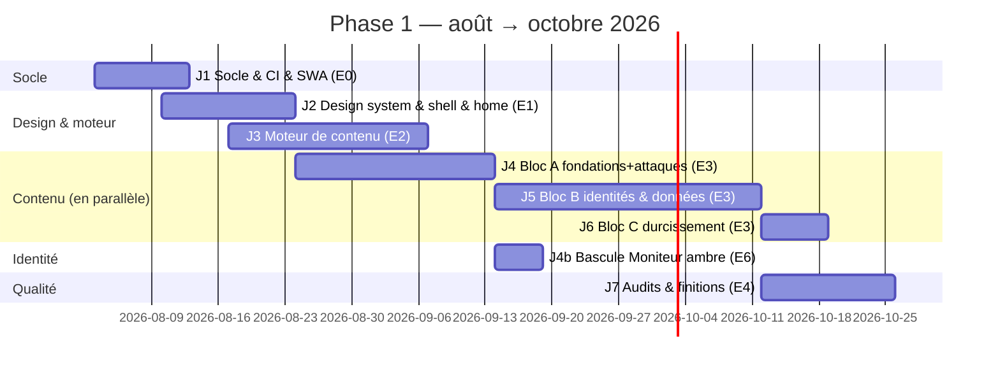

# Roadmap — Dr. Je-Sais-Tout

> Quatre phases ; seule la **phase 1 est engagée et datée finement** (échéance ferme : le cours
> 420-B10-HU repris **août–octobre 2026**). Les phases 2–4 sont des intentions cadrées, à
> re-planifier à la fin de la phase précédente. Détail exécutable : `docs/agile/backlog-phase-1.md`.

---

## Vue d'ensemble

| Phase | Contenu | Fenêtre | Statut |
|---|---|---|---|
| **1** | Cours sécurité web public + home, site statique SWA Free | août → 31 oct. 2026 | 🟢 en cours |
| 2 | Backend .NET (comptes, progression, scores), Container Apps + SQL S0 | hiver 2027 | ⬜ |
| 3 | Multi-sujets depuis la KnowledgeBase, navigation par domaines | 2027 | ⬜ |
| 4 | Tutorat / plateforme (maternelle → université) | horizon ouvert | ⬜ |

---

## Phase 1 — jalons datés

Principe directeur : **déploiement continu dès le premier module**. Le site part en ligne quasi vide
et s'enrichit module par module — jamais de « big bang » d'octobre. La production des leçons (E3)
tourne **en parallèle** du reste dès que le moteur de contenu (E2) tient.

| Jalon | Échéance | Livrable vérifiable |
|---|---|---|
| **J1 — Socle en ligne** | ~15 août | Workspace Angular 21 + SCSS + eslint + Vitest ; CI GitHub Actions verte ; page « bientôt » déployée sur SWA Free avec en-têtes/CSP de base (`staticwebapp.config.json`) ; spikes S-01/S-02/S-03 tranchés |
| **J2 — Identité visible** | ~24 août | Jetons SCSS (échelle typo ≥ 25 %, espacement 8pt, polices auto-hébergées), layout/nav, home « carnet de laboratoire », thèmes clair/sombre, zéro violation AXE **+ passe clavier manuelle** |
| **J3 — Moteur de contenu** | ~7 sept. | Pipeline `content/` → pages prerendues ; routage des leçons ; `QuizComponent`, `CodeCompareComponent`, `SimulationComponent` ; page sommaire du cours ; une leçon-témoin de bout en bout |
| **J4 — Premier bloc en ligne** | **mi-septembre** | Modules 1–7 publiés (fondamentaux, CVSS, injection, XSS, CSRF, contrôle d'accès, inclusion/SSRF) — couvre le début du cours de l'auteur (août-septembre) |
| **J4b — Bascule d'identité** | ~19 sept. | 🆕 **E6 · « Moniteur ambre »** : palette recalibrée, Fraunces retirée, police d'affichage passée au gate de glyphes, motifs arcade, logotype typographique. **Sombre seul** (décision D-2 ; le thème clair est une dette portée par E4-ST1). Ne démarre **qu'une fois J4 atteint** — l'habillage ne prend jamais le chemin critique du contenu |
| **J5 — Deuxième bloc** | ~12 oct. | Modules 8–12 publiés (crypto, mots de passe, authentification, sessions, JWT) |
| **J6 — Cours complet** | ~19 oct. | Module 13 (durcissement serveur) publié — 13/13 |
| **J7 — Phase 1 close** | **31 octobre** | Audit a11y (WCAG 2.2 AA / AXE 0), audit sécurité du site (`/security-audit`), Lighthouse ≥ 90, npm audit vert ; option E5 : squelette backend .NET si le temps le permet |

> ⚠️ **J2 tel qu'il est écrit ci-dessus décrit une identité qui va changer.** « Home carnet de
> laboratoire » et « thèmes clair/sombre » étaient les livrables *réellement atteints* le 2026-08-15 —
> la ligne reste donc vraie **comme trace historique**. Ce qui la remplace est **J4b** : la bascule
> vers « Moniteur ambre », décidée par le propriétaire le **2026-08-17**
> (`docs/design/direction-visuelle.md` §0). Le jalon n'est pas réécrit : un jalon atteint ne se
> réécrit pas rétroactivement, il se **complète** par celui qui le corrige.

**Avancement au 2026-08-15** : **J1 atteint** (E0 clos) et **J2 atteint avec neuf jours d'avance**
sur son échéance du ~24 août — E1-ST1, ST2 et ST3 sont ✅, donc **E1 est close** : jetons et polices
auto-hébergées, coquille et navigation, home « pièces à conviction », deux thèmes dessinés, et la
passe clavier promise par ce jalon **outillée** plutôt que seulement cochée (G-e2e Playwright, sous
la CSP réelle). Prochain jalon : **J3, le moteur de contenu (E2)** — le chemin critique.

**Chemin critique :** J1 → J3 → J4. Tout retard sur le moteur de contenu (J3) mange directement la
fenêtre de production des leçons ; en cas de glissement, on coupe dans le raffinement de la home et
des simulations (une simulation par module n'est pas obligatoire), jamais dans les leçons ni les quiz.

**Cadence E3 :** les modules sortent dans l'ordre de lecture de la carte KB
(`KnowledgeBase/web/securite/carte.md`) pour suivre le déroulé du cours de l'auteur — les
fondamentaux, l'injection et le XSS d'abord (août), le durcissement en dernier. Chaque module passe
par le skill `/lecon` (`professeur-web` → `verificateur-theorie`) et se déploie dès son gate vert.

---

## Phase 2 — backend comptes & progression *(hiver 2027, à re-planifier fin phase 1)*

- API .NET 10 (à partir du squelette E5 s'il existe) : comptes, progression, scores de quiz.
- Provisionnement Container Apps free grant + Azure SQL S0 (crédit étudiant) —
  `.claude/rules/budget-free-tier.md` fait foi.
- Import de la progression `localStorage` vers le compte.
- Jalon de sortie : un utilisateur peut créer un compte et retrouver sa progression sur un autre
  appareil, sans régression du site statique.

## Phase 3 — multi-sujets *(2027)*

- Généralisation du pipeline contenu à d'autres domaines de la KB (web, cs, ai…).
- Navigation par sujets, recherche côté client, ponts entre domaines voisins.
- Jalon de sortie : ≥ 2 nouveaux cours en ligne avec le même niveau de qualité que la sécurité web.

## Phase 4 — tutorat / plateforme *(horizon ouvert)*

- Cadrage produit à refaire (publics maternelle → université, modèle d'accompagnement,
  éventuelle monétisation). Aucune décision technique prise aujourd'hui, sinon que l'API phase 2
  en serait le socle.
