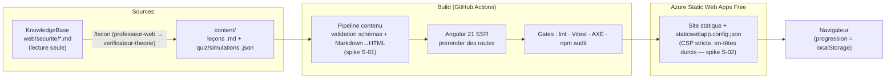
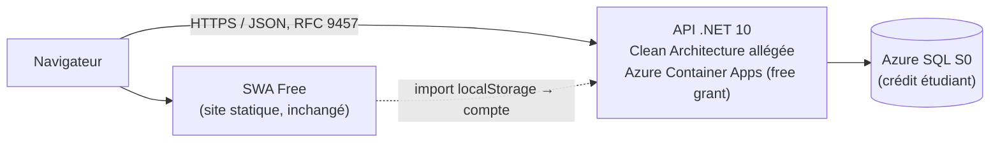

# Stack et architecture — décisions (style ADR)

> Chaque décision suit le format **Contexte → Décision → Alternatives écartées → Conséquences**.
> Les décisions sont **arrêtées** par le propriétaire ; ce document les trace pour que les agents
> (et le futur soi) sachent *pourquoi*, pas seulement *quoi*. Les points encore ouverts sont listés
> en [§8 Spikes](#8--spikes-à-trancher-par-le-solution-architect).

Contraintes transverses (non négociables) : backend C#, styles SCSS (conditions du propriétaire) ;
zéro dépense — gratuit ET sans clé (`.claude/rules/budget-free-tier.md`) ; WCAG 2.2 AA / zéro
violation AXE ; le site exemplifie la sécurité qu'il enseigne (`.claude/rules/security.md`).

---

## ADR-001 · Frontend : Angular 21 (standalone, signaux, OnPush) + SCSS

**Contexte.** Site de contenu pédagogique riche en interactivité (quiz, simulations pas-à-pas,
comparateur de code). Développeur solo dont le capital de compétences est Angular ; le repo dispose
déjà d'un outillage dédié (serveur MCP `angular-cli`, skill `angular`,
`.claude/rules/angular-best-practices.md`) ; conventions éprouvées sur le projet frère
`AbrisAutoOutaouais-WebApp`.

**Décision.** **Angular 21+**, composants standalone, signaux, `ChangeDetectionStrategy.OnPush`
partout, **SCSS** avec jetons sémantiques (condition du propriétaire).

> ⚠️ **Version à confirmer au scaffold (E0).** La fiche KB `web/angular/angular-fondamentaux.md`
> date **Angular 22 (zoneless par défaut) de juin 2026** — soit avant le démarrage de ce projet.
> Au moment du `ng new`, prendre la **dernière stable** (21 ou 22), via le **CLI officiel
> uniquement** (jamais un scaffold généré à la main par l'IA — versions obsolètes garanties), puis
> régénérer `.claude/rules/angular-best-practices.md` via le MCP `get_best_practices`. Si Angular 22
> est retenu, le spike S-03 (zoneless) est probablement résolu par le défaut du framework.

**Alternatives écartées.**

| Option | Pourquoi écartée |
|---|---|
| **Astro** | Excellent pour du contenu statique (islands, zéro JS par défaut), mais casse le capital de compétences Angular et prive le projet de l'outillage existant (MCP angular-cli, skill angular, conventions du projet frère). L'interactivité riche (simulations) réduirait l'avantage « zéro JS ». |
| **Analog (méta-framework Angular)** | Séduisant (routage fichiers, Markdown natif), mais couche supplémentaire moins mature que l'Angular CLI officiel ; l'outillage MCP cible le CLI standard. Le prerender natif d'Angular couvre le besoin. |
| **Blazor** | Aurait unifié le C# full-stack, mais frontend moins mature pour l'interactif riche côté client, payload WASM lourd pour un site de contenu, et aucune synergie avec l'outillage Angular existant. Le C# reste au backend (ADR-004). |

**Conséquences.** Réutilisation directe des conventions du projet frère ; les agents s'appuient sur
`.claude/rules/angular-best-practices.md`. Le poids d'Angular impose la discipline SSR/prerender
(ADR-002) et des budgets de bundle en CI.

---

## ADR-002 · Rendu : SSR + prerender des routes de contenu

**Contexte.** Les leçons sont du contenu public qui doit être indexable (SEO), rapide au premier
affichage, et hébergeable **gratuitement** — donc sans serveur Node facturé.

**Décision.** Angular SSR avec **prerender** (SSG) de toutes les routes de contenu au build : home,
sommaire du cours, chaque leçon. Le résultat est un site 100 % statique, servi par SWA Free.
L'hydratation ne s'active que pour les composants interactifs.

**Alternatives écartées.**

| Option | Pourquoi écartée |
|---|---|
| CSR pur (SPA classique) | SEO médiocre pour du contenu pédagogique, premier rendu lent, contraire à la vitrine « bonnes pratiques ». |
| SSR à la demande (serveur Node) | Exige un hôte serveur ; SWA Free ne l'offre pas sans fonctions managées. Coût et complexité sans bénéfice : le contenu est connu au build. |

**Conséquences.** Chaque ajout de leçon = nouvelle route prerendue (la liste des routes est générée
depuis `content/`). Le déploiement est un simple upload statique. Points ouverts : intégration fine
du pipeline Markdown dans le prerender (S-01), CSP avec le style d'hydratation Angular (S-02),
zoneless (S-03).

---

## ADR-003 · Contenu : « contenu-as-code » dans `content/`, compilé au build

**Contexte.** Le contenu source existe déjà en Markdown dans la KnowledgeBase (13 fiches sécurité).
Un développeur solo n'a pas besoin d'interface d'édition ; il a besoin de versionnage, de revue par
agents (`/lecon` : `professeur-web` → `verificateur-theorie`) et de gabarits stables
(`docs/contenu/pipeline-contenu.md`).

**Décision.** Leçons en **Markdown enrichi** + quiz/simulations en **JSON** sous `content/`,
validés et compilés au build en pages prerendues. Git est le CMS.

**Alternatives écartées.**

| Option | Pourquoi écartée |
|---|---|
| CMS headless (Strapi, Contentful, Decap…) | Coût (tiers gratuits avec carte = refusés par la règle zéro-dépense), complexité d'hébergement, dépendance réseau au build, aucun bénéfice pour un auteur unique qui vit dans Git. |
| Base de données de contenu | Injustifiée en phase 1 (contenu statique, pas de contribution externe). Réévaluée en phase 2+ si des besoins dynamiques apparaissent (progression serveur, commentaires). |

**Conséquences.** Le contenu est diffable, révisable par agents, testable (schémas JSON pour
quiz/simulations, lint Markdown). Le build échoue si un contenu est invalide — c'est voulu.

---

## ADR-004 · Backend : .NET 10 C#, Clean Architecture allégée — squelette fin phase 1

**Contexte.** Condition du propriétaire : backend C#. Aucune fonctionnalité serveur nécessaire en
phase 1 (pas de comptes, progression en `localStorage`). Le projet frère
`AbrisAutoOutaouais-WebApp` fournit les conventions : Mediator maison (pas de MediatR),
FluentValidation, erreurs RFC 9457 (Problem Details), découpage Domain/Application/Infrastructure/Api.

**Décision.** **.NET 10 C#**, Clean Architecture **allégée** (pas de couche pour la couche),
conventions alignées sur le projet frère. En phase 1 : au plus un **squelette** compilable en fin de
phase (E5, optionnel). Les fonctionnalités (comptes, progression, scores, tutorat) arrivent en
phases 2+.

**Alternatives écartées.**

| Option | Pourquoi écartée |
|---|---|
| Node/TypeScript backend | Écarté d'emblée : condition ferme « backend C# ». |
| Backend dès la phase 1 | Risque direct pour l'échéance d'octobre ; aucune fonctionnalité ne le justifie. |
| Azure Functions (SWA managed functions) en C# | Possible plus tard pour de petits endpoints, mais l'architecture cible phase 2 (Container Apps + SQL S0) offre un vrai hôte pour la Clean Architecture ; on évite de bâtir deux backends. |

**Conséquences.** Phase 1 reste 100 % statique. Le squelette E5, s'il est fait, fige la structure de
solution et le pipeline CI .NET sans exposer d'API.

---

## ADR-005 · Hébergement : Azure Static Web Apps Free (ph. 1) → Container Apps + SQL S0 (ph. 2)

**Contexte.** Règle dure zéro-dépense ; seul actif : crédit étudiant Azure ~120 $. Le site phase 1
est statique ; la phase 2 ajoute une API et une BD.

**Décision.** **Phase 1 : Azure Static Web Apps Free** — hébergement statique, TLS gratuit,
sous-domaine `*.azurestaticapps.net`, en-têtes personnalisés via `staticwebapp.config.json`.
**Phase 2 : Azure Container Apps (free grant)** pour l'API .NET + **Azure SQL S0** sur le crédit
étudiant. Détail des paliers : `.claude/rules/budget-free-tier.md`.

**Alternatives écartées.**

| Option | Pourquoi écartée |
|---|---|
| GitHub Pages / Netlify / Cloudflare Pages | Viables, mais SWA s'aligne sur la cible Azure phase 2 (même portail, même CI), gère les en-têtes/CSP via config native, et le crédit étudiant ancre l'écosystème Azure. Certains tiers gratuits exigent une carte au dépassement → exclus. |
| SWA Standard / App Service | SKU payants sans besoin phase 1 → refusés par la règle budget. |

**Conséquences.** Pas de SSR serveur possible (cohérent avec ADR-002). La CSP doit être posée via
`staticwebapp.config.json` (spike S-02). DNS personnalisé : seulement si un domaine est acheté avec
accord explicite.

---

## ADR-006 · CI/CD : GitHub Actions → SWA, gates de qualité obligatoires

**Contexte.** Déploiement continu dès le premier module en ligne (roadmap) ; les barres dures
(AXE, CSP, `npm audit`) doivent être des **gates**, pas des intentions.

**Décision.** **GitHub Actions** (tier gratuit, repo public) : pipeline `lint → test (Vitest) →
build/prerender → axe (pages prerendues) → npm audit → déploiement SWA` sur `main` ; les mêmes gates
sans déploiement sur PR. Le token de déploiement SWA vit en secret GitHub (pas une clé facturée).

**Alternatives écartées.**

| Option | Pourquoi écartée |
|---|---|
| Azure DevOps Pipelines | Fonctionnel, mais le repo vit sur GitHub ; l'intégration SWA↔GitHub Actions est native (workflow généré) ; parallélisme gratuit suffisant. |
| Déploiement manuel (`swa deploy`) | Contredit « déploiement continu dès le premier module » et invite l'oubli de gates. Toléré uniquement pour le tout premier smoke test. |

**Conséquences.** Aucun contenu ne part en ligne sans gates verts. Les budgets Lighthouse/bundle
peuvent s'ajouter au pipeline (E4) sans changer d'outil.

---

## 7 · Architecture cible

### Phase 1 — site statique prerendu



**Composants pédagogiques** (hydratés côté client, contenu injecté depuis le JSON compilé) :

| Composant | Rôle |
|---|---|
| `QuizComponent` | Quiz interactifs (choix multiples, vrai/faux, mises en situation type CVSS), correction expliquée, score en `localStorage` |
| `CodeCompareComponent` | Code annoté **vulnérable / corrigé** côte à côte (PHP, C#, TypeScript), annotations ancrées aux lignes |
| `SimulationComponent` | Simulations pas-à-pas visuelles d'une attaque/défense (ex. déroulé d'un XSS, d'un CSRF), pilotées par un JSON d'étapes |
| Rendu Markdown | Effectué **au build** (pas de parseur Markdown embarqué au runtime) — HTML sûr, coloration syntaxique précompilée |

#### Organisation du code front — vérifiée contre l'état de l'art (2026-08-17)

Le propriétaire a demandé si le front devait adopter **DDD** ou un autre patron d'architecture
frontend. Réponse, après confrontation à l'état de l'art 2026 et aux fiches KB
(`web/frontend/architecture-frontend-comparatif.md`, `web/angular/angular-fondamentaux.md`,
`cs/architecture/clean-architecture-dotnet-ddd.md`) : **la structure actuelle est déjà celle qui est
recommandée**, et il n'y a rien à refondre.

```
src/app/
  core/      singletons applicatifs — thème, layout, (à venir) progression
  features/  un dossier par domaine — home/, cours/
  shared/    réutilisable sans état
```

C'est le patron *feature-first* / domaine : composants standalone, signaux, `OnPush`, zoneless,
`inject()` — tout ce que `.claude/rules/angular-best-practices.md` exige est déjà en place.

**Ce que le DDD tactique n'apporte PAS ici.** Agrégats, *value objects*, événements de domaine
répondent à de la **complexité métier transactionnelle**. Un site statique prerendu sans compte ni
serveur n'en a aucune : les importer ajouterait des couches sans problème à résoudre. Le DDD a bien
sa place dans ce projet — dans l'**API .NET de la phase 2** (ADR-004), où la fiche KB
`cs/architecture/clean-architecture-dotnet-ddd.md` le couvre déjà.

**La seule règle de l'état de l'art qui manquait, et elle est désormais dure :**

> 🔴 **Aucune feature n'importe une autre feature.** Si `features/cours/sommaire` a besoin de la
> progression que `features/cours/quiz` produit, elle passe par un service de `core/progression/`
> que les deux **injectent** — jamais par un import direct de l'une vers l'autre. C'est ce qui
> empêche `features/` de redevenir un plat de spaghettis, et c'est **bloquant en revue**
> (`code-reviewer`).

Elle devient concrète immédiatement : **E2-ST3** (le quiz) écrit la progression, **E2-ST6** (le
sommaire) la lit. C'est le premier couple de features du dépôt à partager un état — donc le premier
endroit où la règle se gagne ou se perd.

**✅ Depuis la clôture d'E2-ST6 (2026-08-19), la règle n'est plus une intention : elle est
EXÉCUTABLE.** `src/regles-architecture.spec.ts` traverse les imports réels (`ts.preProcessFile()` +
`path.resolve`) et confronte les arêtes constatées à une liste blanche nominative
(`lecon/rendu-blocs → quiz`, `lecon/rendu-blocs → simulation`, tout vers
`cours/contenu-compile`) ; ce spec est câblé dans G-test des deux workflows. Dette connue : la
granularité est par paire d'unités (7 paires, dont 5 le long de l'axe de confinement plutôt que de
vraies traversées) et `core/` reste hors du corpus analysé — une arête `core → features` y serait
invisible.

### Phase 2 — ajout de l'API .NET



---

## 8 · Spikes à trancher par le solution-architect

À résoudre en **début d'implémentation** (E0/E2), chacun via un spike court, conclusion consignée
ici en addendum d'ADR.

| ID | Question | Enjeux / pistes |
|---|---|---|
| **S-01** | **Pipeline Markdown→HTML au build** : marked + Shiki ? autre combinaison ? Et comment l'intégrer proprement au prerender Angular (plugin de build, script pré-build générant du HTML/JSON consommé par les routes, ou loader) ? | Coloration syntaxique de qualité (PHP/C#/TS) précompilée, blocs enrichis des gabarits `docs/contenu/pipeline-contenu.md` (encadrés ⚠️, quiz inline), génération de la liste des routes à prerendre depuis `content/`. Zéro parseur au runtime. |
| **S-02** | **CSP stricte sur SWA avec Angular SSR/prerender** : atteindre une CSP sans `unsafe-inline` (styles inline d'hydratation Angular, `ngCspNonce` inapplicable en statique → hashes ? extraction ?) via `staticwebapp.config.json`. | La barre dure « le site exemplifie la sécurité » en dépend. Vérifier aussi `frame-ancestors`, `Trusted Types`, et les limites de SWA sur les en-têtes. |
| **S-03** | **Zoneless ou zone.js** : trancher selon la version installée en E0 — la KB (`web/angular/angular-fondamentaux.md`) donne zoneless **par défaut depuis Angular 22 (juin 2026)** ; si Angular 21, vérifier la stabilité zoneless pour ce périmètre (signaux partout, OnPush) ? | Zoneless = moins de JS, meilleure perf ; vérifier la compatibilité SSR/hydratation et l'outillage de test (Vitest). Décision avant E1 pour ne pas migrer en cours de route. |

Toute autre décision structurante découverte en chemin suit le même chemin : spike court →
addendum ADR ici → mise à jour du backlog.

---

## 9 · Addendums de spikes (E0-ST1)

### Addendum S-01 · Pipeline Markdown→HTML au build — **tranché le 2026-08-03**

> Complète **ADR-003**. Prototype jetable (scratchpad de session, non versionné) : parsing du
> gabarit réel de `docs/contenu/pipeline-contenu.md`, coloration, rendu Mermaid, validation JSON.

**Décision — chaîne retenue** (toutes MIT, gratuites, **sans clé** ; conforme
`.claude/rules/budget-free-tier.md`) :

| Rôle | Paquet | Version prototypée |
|---|---|---|
| Frontmatter YAML | `gray-matter` | 4.0.3 |
| Markdown → blocs | `markdown-it` (`html: false`) | 15.0.0 |
| Coloration syntaxique | `shiki` + `@shikijs/transformers` | 4.4.1 |
| Diagrammes | `@mermaid-js/mermaid-cli` (Puppeteer/Chromium) | 11.16.0 |
| Schémas quiz/simulation | `ajv` | 8.20.0 |

**Mode d'intégration.** Un **script Node pré-build** (hors Angular) lit `content/**`, écrit pour
chaque leçon un **AST de blocs JSON** (`{type: prose|code|mermaid, …}`) plus un **manifeste de
routes** consommé par le prerender. Angular ne charge que du JSON déjà rendu : **zéro parseur
Markdown, zéro Shiki, zéro Mermaid dans le bundle client**. Les blocs typés (`code` avec
`variante: vulnerable|corrige` et `ligneFautive`, `mermaid`, ancres de quiz) sont rendus par de
**vrais composants Angular**, pas par un `[innerHTML]` massif — ce qui garde l'interactivité
(quiz, affichage côte à côte) et limite `[innerHTML]` aux seuls blocs de prose assainis
(`.claude/rules/security.md` §4).

**Mesures qui ont tranché** (et non des présomptions) :

1. **Info-string du gabarit** — ` ```php vulnerable ligne=2 ` est intégralement exposée par
   `token.info` de markdown-it ; les 4 blocs de code du fichier d'essai ont été classés
   correctement (`php/vulnerable/2`, `php/corrige/-`, `csharp/vulnerable/3`, `sql/-/-`).
2. **Shiki casse une CSP stricte par défaut** — une seule ligne de PHP produit **7 attributs
   `style=` inline**, ce qui imposerait `style-src 'unsafe-inline'` (les hachages ne couvrent pas
   les attributs de style). Avec `transformerStyleToClass` : **0 style inline**, une feuille
   générée de **368 octets**, et le thème sombre préservé via variables CSS (`--shiki-dark`) —
   donc compatible avec les deux thèmes exigés par E1-ST1.
3. **Mermaid en jsdom : écarté.** Le `sequenceDiagram` sort correctement (579–651 px), mais le
   `flowchart` est inutilisable : **33 234 px** de large pour des libellés courts et **34 251 px**
   pour des libellés longs — quasi identiques, donc aucune mesure de texte réelle. `htmlLabels:
   false` **ne supprime pas** le `foreignObject` en Mermaid 11.16, contrairement au correctif
   habituel. Or `.claude/rules/contenu-pedagogique.md` §3 impose `flowchart` pour toute
   architecture ou décision.
4. **Mermaid via Chromium : retenu.** `mmdc` produit une mise en page proportionnelle correcte —
   **424 px** (libellés courts) contre **896 px** (libellés longs) — et aucun `<script>` dans le
   SVG.
5. **Le marqueur de doute fuite** — avec `html: false`, markdown-it **échappe** au lieu de
   supprimer : `<!-- à-vérifier: … -->` s'afficherait aux apprenants sous la forme
   `&lt;!-- à-vérifier: … --&gt;`. Le pré-build **doit** retirer ces marqueurs, et **échouer** s'il
   en reste dans une leçon `statut: publiee`.
6. **Le gate de contenu tient** — Ajv rejette les 4 cas fautifs testés (moins de 5 questions,
   `explication` absente, `ficheSource` absente, slug non kebab-case) avec des messages pointant
   la question en cause. Préférer `if/then/else` à `oneOf` par type de question : `oneOf` produit
   des erreurs secondaires trompeuses.

**Alternatives écartées.**

| Option | Pourquoi écartée |
|---|---|
| `marked` au lieu de `markdown-it` | Écosystème de plugins plus pauvre pour les blocs enrichis (encadrés, conteneurs personnalisés) dont le gabarit aura besoin ; aucun gain mesuré. |
| `unified`/`remark`+`rehype` | Plus puissant, mais chaîne nettement plus lourde à maîtriser pour un besoin que markdown-it couvre déjà ; réévaluable si les besoins de transformation explosent. |
| Mermaid rendu **côté client** | Bundle lourd et surtout injection de styles inline → incompatible avec la CSP stricte, qui est une barre dure du projet. |
| Mermaid rendu en **jsdom** (sans Chromium) | Mise en page des `flowchart` fausse (mesure 3). Conservable seulement si l'on renonçait aux flowcharts — ce que le guide de contenu interdit. |
| SVG servi en `` plutôt qu'inline | Les libellés Mermaid vivent dans un `foreignObject`, que le mode image des SVG ne rend pas ; le diagramme perdrait son texte. **À confirmer en navigateur à E0-ST3** avant de figer. |
| Coloration au runtime (Prism/highlight.js côté client) | Contredit « zéro parseur au runtime » d'ADR-003 et alourdit le bundle sans bénéfice. |

**Conséquences.**

- **E0-ST2** : le workspace ajoute les 5 paquets ci-dessus et un script `content:build` exécuté
  avant `ng build`. Chromium (Puppeteer) est téléchargé au `npm ci` — à surveiller en CI (E0-ST4).
- **E0-ST3 / S-02** : une **passe unique de normalisation CSP** s'applique à *toute* sortie
  générée — `transformerStyleToClass` pour Shiki, passe équivalente « attributs `style` → classes »
  pour les SVG Mermaid (26 attributs inline + une balise `<style>` mesurés). Sans elle, la CSP
  stricte est inatteignable. **S-01 et S-02 sont donc couplés** : ne pas traiter S-02 comme un
  simple problème d'en-têtes.
- **E2** : le contrat de `docs/contenu/pipeline-contenu.md` est confirmé tel quel — aucune
  modification du gabarit n'est nécessaire. À y ajouter : la suppression des marqueurs
  `à-vérifier:` et le passage à `if/then/else` dans les schémas.

### Addendum S-02 · CSP stricte sur SWA avec prerender — **tranché le 2026-08-03**

> Complète **ADR-002** et **ADR-005**. Mesures faites sur un scaffold Angular **22.1.0** réel
> (`ng new --ssr`), `outputMode: "static"`, build prerender exécuté.

**Décision.** CSP stricte **basée sur des hachages calculés au build**, sans `unsafe-inline` ni
`unsafe-eval`, avec **deux réglages obligatoires** du build Angular. La cible :

```
default-src 'self'; script-src 'self'; style-src 'self' 'sha256-…'; img-src 'self' data:;
font-src 'self'; object-src 'none'; base-uri 'self'; frame-ancestors 'none'; form-action 'self'
```

**Mesures.**

1. **`ngCspNonce` est bien inapplicable** — confirmé par construction : `outputMode: "static"`
   produit des fichiers HTML figés, sans serveur pour générer un nonce par requête. La voie est
   donc **le hachage**, pas le nonce.
2. **Aucun `<script>` inline exécutable dans la sortie prerendue.** Le seul script exécutable est
   `main-*.js`, externe et `type="module"` → couvert par `script-src 'self'`.
3. **Piège critique du build par défaut** — Angular émet
   `<link rel="stylesheet" media="print" onload="this.media='all'">`. Ce `onload` est un
   **gestionnaire d'événement inline**, bloqué par toute CSP sans `unsafe-inline` : la feuille
   resterait en `media="print"` et **le site s'afficherait sans aucun style**. Le build par défaut
   ajoute aussi un **second `<style>` inline** (CSS critique).
   → Correctif vérifié : `optimization.styles.inlineCritical: false` supprime **les deux**
   (0 gestionnaire inline, `<link rel="stylesheet">` simple).
4. **Un seul bloc inline subsiste** : `<style ng-app-id="ng">` (styles de composants injectés par
   le SSR, 4 062 octets sur le scaffold nu). Il impose un hachage `style-src`. La sortie étant
   statique et déterministe, le hachage se calcule au build — mesuré ici :
   `'sha256-mG14zorumNNcSZbZ1cLwW2zXbOrVMv/TW9pb61apDpc='`.
5. **`ng-state`** est un `<script type="application/json">` (79 octets) : un bloc de **données**,
   non exécuté.

**Conséquence structurante — la CSP doit être générée, pas écrite à la main.**
`staticwebapp.config.json` est un fichier statique, or chaque page prerendue porte son propre bloc
de styles donc son propre hachage. Il faut donc une **étape de build qui parcourt `dist/browser`,
calcule l'ensemble des hachages distincts et écrit la directive `style-src`** (CSP acceptant une
liste de hachages). Une CSP recopiée à la main se désynchronisera au premier changement de style.

**Points à vérifier en ligne à E0-ST3** (règle `.claude/rules/security.md` : *enabler ≠
enforcement*) :

- que Chrome **ne bloque pas** `<script id="ng-state" type="application/json">` sous
  `script-src 'self'` — l'hydratation en dépend ; à constater dans la console, pas à supposer ;
- que le hachage `style-src` correspond bien au bloc **tel que servi par SWA** (toute
  post-transformation invaliderait le hachage) ;
- les limites propres à SWA sur `globalHeaders` et les en-têtes par route.

> Tentative de constat live faite pendant ce spike : un serveur local servant le build avec la CSP
> ci-dessus répond correctement en `curl` (200, en-têtes présents), mais l'onglet Chrome piloté n'a
> pas pu atteindre `localhost:4321` (permission de site de l'extension). Vérification **reportée à
> E0-ST3**, où elle est déjà un gate via `swa start`.

### Addendum S-03 · Zoneless ou zone.js — **tranché le 2026-08-03**

> Complète **ADR-001**. Constaté sur le scaffold `ng new` **sans** passer `--zoneless`.

**Décision. Zoneless**, en acceptant le défaut d'Angular 22 — aucune configuration à écrire.

**Mesures.**

1. **`zone.js` est absent des dépendances** du scaffold : la KB
   (`web/angular/angular-fondamentaux.md`) est confirmée, le zoneless est bien le défaut en v22.
   Aucun `provideZonelessChangeDetection()` n'est requis, et `angular.json` ne déclare **aucun**
   `polyfills`.
2. **Zoneless et hydratation SSR cohabitent** dans le scaffold par défaut :
   `provideClientHydration()` est présent et le prerender s'exécute sans erreur.
3. **Vitest est le runner par défaut** d'Angular 22 (ni Karma ni Jasmine dans les dépendances) :
   l'exigence Vitest de E0-ST2 est satisfaite par le scaffold, sans configuration supplémentaire.
4. Le scaffold applique le **style de nommage « 2025 »** (`app.ts`, `app.html`, `app.scss` — pas
   `app.component.ts`). À adopter tel quel pour rester aligné sur les schematics.

**Conséquences pour E0-ST2.** `ng new … --ssr --style=scss --ai-config=none` sans `--zoneless`
(inutile), puis deux réglages non négociables dans `angular.json` :
`outputMode: "static"` et `optimization.styles.inlineCritical: false` (mesure S-02 n°3).
Le build produit aussi des bundles serveur : ils servent au prerender et **ne sont pas déployés** —
seul `dist/<app>/browser` part sur SWA.

> **Prérequis d'environnement (résolu le 2026-08-03).** Angular 22 exige Node
> `^22.22.3 || ^24.15.0 || >=26`. Le poste était en 24.14.0 ; mise à niveau en **24.18.1 LTS**
> (`winget install --id OpenJS.NodeJS.LTS` — l'identifiant `OpenJS.NodeJS.22` plafonne à 22.x et
> ne propose aucune mise à niveau).
