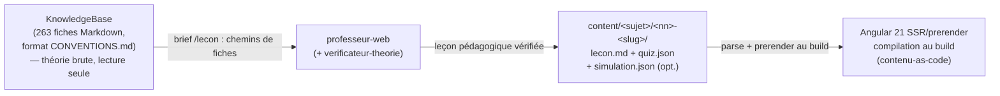

# Pipeline de contenu — de la KnowledgeBase au site (Dr. Je-Sais-Tout)

> **Statut : contrat de départ.** Les gabarits et schémas ci-dessous sont la référence pour la
> production de contenu dès aujourd'hui ; le schéma exact (validation JSON Schema, types
> TypeScript, loaders Angular) sera **validé par le `solution-architect` au spike S-01** du
> `docs/agile/backlog-phase-1.md`. Toute évolution se fait ICI d'abord — ce document reste la
> source de vérité du format.

## Vue d'ensemble



- **Amont** : la théorie vit dans `C:\Users\phili\ProjetsPortfolio\KnowledgeBase\` (format défini
  par `KnowledgeBase/CONVENTIONS.md`). Lecture seule — seule exception : correction d'une erreur
  certaine par le `verificateur-theorie`.
- **Milieu** : la chaîne `/lecon` (skill) produit les fichiers de leçon dans `content/` du repo.
  Barre de qualité : `.claude/rules/contenu-pedagogique.md`.
- **Aval** : Angular 21 compile `content/` au build (SSR/prerender). Pas de labo exécutable, pas
  de comptes en phase 1 : quiz interactifs, code annoté côte à côte, simulations visuelles.

## Arborescence d'une leçon

```
content/
  securite-web/                      # le sujet (cours), kebab-case
    01-fondamentaux/                 # <nn>-<slug> : nn = ordre sur 2 chiffres
      lecon.md                       # obligatoire
      quiz.json                      # obligatoire
      simulation.json                # optionnel (recommandé pour toute attaque/flux)
    02-evaluation-cvss/
      ...
```

## Gabarit `lecon.md`

### Frontmatter (tous les champs requis sauf mention)

```yaml
---
titre: "XSS — Cross-Site Scripting"
slug: xss                        # unique dans le sujet, kebab-case, sans le préfixe nn
sujet: securite-web              # dossier de premier niveau sous content/
ordre: 4                         # position dans le cours (= le nn du dossier)
niveau: cegep                    # maternelle | primaire | secondaire | cegep | universite
duree-estimee: 45                # minutes de lecture + exercices
objectifs:                       # 3 à 5, verbes observables
  - "Expliquer pourquoi le navigateur exécute un script injecté comme s'il venait du site"
  - "Distinguer XSS réfléchi, stocké et basé sur le DOM"
  - "Repérer et corriger une sortie non encodée dans un gabarit"
prerequis:                       # slugs de leçons du même sujet, ou libellé libre ; [] si aucun
  - fondamentaux
fiches-sources:                  # chemins relatifs à la racine de la KnowledgeBase
  - web/securite/xss-cross-site-scripting.md
cree: 2026-08-03
maj: 2026-08-03
statut: brouillon                # brouillon | verifiee | publiee
---
```

### Structure du corps (sections dans cet ordre)

```markdown
# <Titre>
## L'idée en une image          <!-- l'accroche : l'analogie principale, bornée -->
## <Sections de théorie>         <!-- progressives ; Mermaid dès qu'un flux est expliqué -->
## Exemple simple                <!-- isole le mécanisme -->
## Exemple complet               <!-- situation réaliste ; vulnérable/corrigé côte à côte -->
## À toi de jouer                <!-- renvoi au quiz.json (+ simulation.json le cas échéant) -->
## À retenir                     <!-- résumé : 3-5 puces -->
## Aller plus loin               <!-- fiches KB + sources originales -->
```

**Blocs de code vulnérable/corrigé** — convention de marquage (parsée au build pour le rendu
côte à côte ; le code vulnérable n'est JAMAIS exécutable sur le site) :

````markdown
```php vulnerable ligne=2
// Le paramètre "name" est renvoyé sans encodage
echo 'Hello ' . $_GET['name'];
```
```php corrige
echo 'Hello ' . htmlspecialchars($_GET['name'], ENT_QUOTES, 'UTF-8');
```
````

**Marqueur de doute** (posé par le `professeur-web`, consommé par le `verificateur-theorie`,
absent de toute leçon `statut: publiee`) : `<!-- à-vérifier: <affirmation> — <raison du doute> -->`.

## Schéma `quiz.json`

```jsonc
{
  "lecon": "xss",                          // slug de la leçon
  "titre": "Quiz — XSS",
  "melanger": true,                        // ordre aléatoire des questions au rendu
  "questions": [
    {                                      // — type 1 : choix multiple —
      "id": "q1",
      "type": "choix-multiple",
      "question": "…",
      "choix": [ { "id": "a", "texte": "…" }, { "id": "b", "texte": "…" } ],
      "bonneReponse": "b",
      "explication": "Pourquoi b est bonne ET pourquoi les distracteurs plausibles sont faux.",
      "ficheSource": "web/securite/xss-cross-site-scripting.md"
    },
    {                                      // — type 2 : vrai/faux avec justification —
      "id": "q2",
      "type": "vrai-faux",
      "affirmation": "…",
      "bonneReponse": false,
      "justification": "Obligatoire : la raison, pas juste le verdict.",
      "ficheSource": "…"
    },
    {                                      // — type 3 : associer —
      "id": "q3",
      "type": "associer",
      "consigne": "Associe chaque type de XSS à sa caractéristique.",
      "paires": [ { "gauche": "XSS stocké", "droite": "Persisté, touche chaque visiteur" } ],
      "explication": "…",
      "ficheSource": "…"
    },
    {                                      // — type 4 : trouver-la-faille-dans-le-code —
      "id": "q4",
      "type": "trouver-la-faille",
      "consigne": "Quelle ligne rend ce code vulnérable, et à quoi ?",
      "langage": "php",
      "code": "…\n…",                      // lignes séparées par \n ; numérotation dès 1
      "ligneFautive": 2,
      "faille": "XSS réfléchi",
      "explication": "Pourquoi cette ligne, et pourquoi les autres candidates n'en sont pas.",
      "correction": "…",                   // le code corrigé, affiché après réponse
      "ficheSource": "…"
    }
  ]
}
```

Contraintes : 5 à 10 questions par leçon ; au moins 2 types différents ; `explication`/
`justification` jamais vide (règle contenu-pedagogique §5) ; `ficheSource` sur chaque question.

### Les trois unicités que JSON Schema ne sait pas exprimer

Elles sont vérifiées **hors schéma** par `valider.mjs`, donc refusées avec un message qui **nomme
le fichier**, la question et le champ — et non au prerender, au milieu d'une pile Angular.

- **`questions[].id` — deux à deux distincts dans un même quiz.** C'est le seul des trois qui
  alimente le langage de requête : le composant retrouve une radio par
  `[id="…"] input[type=radio]:checked`, et `querySelector` rend le **premier** match — deux
  questions homonymes feraient donc relire l'état d'une **autre** question à l'amorçage de
  pré-hydratation (L-033).
- **`choix[].id` — deux à deux distincts dans une même question.** Deux choix au même `id` rendent
  deux radios de même `value` dans le même groupe : le visiteur en coche une, la correction lit
  l'autre, et la question devient infalsifiable.
- **`paires[].gauche` — deux à deux distincts dans une même question.** Le rendu pose un `<select>`
  par ligne de gauche, indexé par son **rang** (décision D-1, backlog §E2-ST3) : deux libellés
  identiques donnent deux champs que rien ne distingue à l'écran, sur une correction ligne à ligne
  devenue illisible.

🔴 **L'unicité se juge sur une clef NORMALISÉE, pas sur l'égalité d'octets** (`clefIndiscernable`,
écrite des deux côtés) : `NFC`, toute suite de blanches repliée sur une espace, bords rognés.
L'invariant voulu est « deux champs que **rien ne distingue à l'écran** » — `HSTS` contre `HSTS`
suivi d'une U+00A0 passait les deux contrôles. Ce n'est pas un cas exotique :
[`.claude/rules/contenu-pedagogique.md`](../../.claude/rules/contenu-pedagogique.md) §3 **impose**
U+00A0 dans le contenu. Le message d'erreur cite les valeurs **brutes**, celles que l'auteur
retrouvera dans son fichier, et dit quand la différence est invisible.

ℹ️ **Un champ de texte doit porter au moins un caractère non blanc** : `texte`, `gauche`, `droite`,
`correction` et `code` sont sous `pattern: "\\S"`, pas sous `minLength: 1`. Le composant exige
`trim() !== ''` — un `"gauche": "   "` sortait donc G-content **vert** avant de casser `ng build`
au prerender, sur un message qui ne nomme pas le fichier.

⚠️ **`paires[].droite`, lui, PEUT se répéter** — c'est une décision, pas un trou. Forcer l'unicité
des réponses transformerait l'exercice en sudoku et masquerait la vraie erreur de compréhension.
Les `<option>` sont dédupliquées au rendu, et la correction se prononce **ligne par ligne**.

Le composant (`src/app/features/cours/quiz/quiz.ts`) applique **les mêmes règles** à sa frontière
(l'unicité des `questions[].id` y étant tenue par `lireLeconCompilee`) : il n'est plus le premier à
parler, mais il reste la défense contre un artéfact produit par une **autre version** du pipeline.

### Ce que le pipeline en émet

Le quiz voyage **dans la leçon** : il sort en `LeconCompilee.quiz`, dans le même
`lecons/<slug>.json` que le corps, et s'affiche à l'ancre `[[quiz]]`. Pas de fichier séparé, pas
d'import paresseux dédié — le composant lit une donnée déjà chargée.

Il est passé **fidèlement**, à un seul ajout près : `trouver-la-faille` reçoit un `htmlColore`
produit au build par le même colorateur Shiki que les blocs de code du corps (couleur en classes
`clr-…`, jamais en `style=` — la CSP du site est à hachages). Le `code` brut reste à côté : c'est
lui qui porte la numérotation des lignes de `ligneFautive` et le texte accessible.

Le compilateur **revalide** `quiz.json` contre le même schéma, et revérifie que `quiz.lecon` égale
le `slug` du frontmatter — il s'exécute aussi hors de `npm run content:build` (ligne de commande,
tests sur fixtures), là où `valider.mjs` n'a pas tourné. Le contrat détaillé des quatre types vit
dans `tools/content-pipeline/types.d.ts` (`QuestionQuiz`, `QuizCompile`).

## Schéma `simulation.json` (pas-à-pas visuel)

Une simulation raconte un déroulé (ex. attaque XSS stockée) en étapes navigables
« précédent/suivant ». Chaque étape = **narration** + **état visuel** déclaratif que le
composant Angular sait rendre (acteurs, panneaux, flèche active).

```jsonc
{
  "lecon": "xss",
  "titre": "Déroulé d'une attaque XSS stockée",
  "acteurs": [                             // les colonnes/boîtes du rendu
    { "id": "attaquant", "libelle": "Attaquant", "type": "personne" },
    { "id": "serveur",   "libelle": "Serveur web", "type": "serveur" },
    { "id": "base",      "libelle": "Base de données", "type": "stockage" },
    { "id": "victime",   "libelle": "Victime", "type": "personne" }
  ],
  "etapes": [
    {
      "numero": 1,
      "titre": "Dépôt du payload",
      "narration": "L'attaquant soumet un commentaire contenant <script>…</script>…",
      "etatVisuel": {
        "acteurActif": "attaquant",
        "fleche": { "de": "attaquant", "vers": "serveur", "libelle": "POST /commentaire" },
        "panneaux": {                      // contenu affiché sous chaque acteur (texte/code court)
          "serveur": { "code": "INSERT INTO commentaires…", "langage": "sql" }
        },
        "surbrillance": []                 // ids d'acteurs à mettre en évidence (danger)
      }
    }
    // … 5 à 12 étapes ; la séquence complète doit correspondre au diagramme Mermaid de la leçon
  ]
}
```

## Correspondance modules ↔ fiches KB (cours « Sécurité des applications web »)

Les **13 fiches** de `KnowledgeBase/web/securite/` (voir `web/securite/carte.md`) sont les
modules candidats, dans l'ordre de lecture de la carte. L'ordre définitif et le découpage
(1 fiche ≈ 1 leçon, sauf scission si trop dense) sont arbitrés dans `docs/agile/backlog-phase-1.md`.

| nn | Module (slug proposé) | Fiche source (`KnowledgeBase/web/securite/`) |
|----|----------------------|---------------------------------------------|
| 01 | fondamentaux | `fondamentaux-securite-web.md` |
| 02 | evaluation-cvss | `evaluation-vulnerabilites-cvss.md` |
| 03 | injection | `injection.md` |
| 04 | xss | `xss-cross-site-scripting.md` |
| 05 | csrf | `csrf.md` |
| 06 | controle-acces-idor | `controle-acces-idor.md` |
| 07 | inclusion-fichiers-ssrf | `inclusion-fichiers-ssrf.md` |
| 08 | cryptographie | `cryptographie-appliquee.md` |
| 09 | mots-de-passe | `stockage-mots-de-passe.md` |
| 10 | authentification | `authentification-failles.md` |
| 11 | sessions-cookies | `sessions-cookies-securite.md` |
| 12 | jwt | `jwt-securite.md` |
| 13 | durcissement-serveur | `durcissement-serveur-web.md` |

Les « Trous connus » de la carte (threat modeling, chaîne d'approvisionnement, journalisation,
upload, API Top 10, clickjacking, logique métier) ne sont PAS des modules phase 1 : la KB ne les
couvre pas encore — ne pas produire de leçon sans fiche source.

## Rôles et règles associées

| Étape | Qui | Règle/contrat |
|-------|-----|---------------|
| Orchestration | skill `/lecon` | `.claude/skills/lecon/SKILL.md` |
| Rédaction | agent `professeur-web` | `.claude/rules/contenu-pedagogique.md` + ce document |
| Vérification | agent `verificateur-theorie` | idem (read-only sur `content/`) |
| Budget contexte | tous | `.claude/rules/agent-context-budget.md` (150k visé) |
| Rendu | build Angular 21 | à définir au spike S-01 (`docs/agile/backlog-phase-1.md`) |
