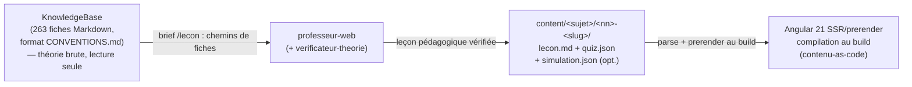

# Pipeline de contenu — de la KnowledgeBase au site (Dr. Je-Sais-Tout)

> **Statut : contrat de départ.** Les gabarits et schémas ci-dessous sont la référence pour la
> production de contenu dès aujourd'hui ; le schéma exact (validation JSON Schema, types
> TypeScript, loaders Angular) sera **validé par le `solution-architect` au spike S-01** du
> `docs/agile/backlog-phase-1.md`. Toute évolution se fait ICI d'abord — ce document reste la
> source de vérité du format.

## Vue d'ensemble



- **Amont** : la théorie vit dans `C:\Users\phili\ProjetsPortfolio\KnowledgeBase\` (format défini
  par `KnowledgeBase/CONVENTIONS.md`). Lecture seule — seule exception : correction d'une erreur
  certaine par le `verificateur-theorie`.
- **Milieu** : la chaîne `/lecon` (skill) produit les fichiers de leçon dans `content/` du repo.
  Barre de qualité : `.claude/rules/contenu-pedagogique.md`.
- **Aval** : Angular 21 compile `content/` au build (SSR/prerender). Pas de labo exécutable, pas
  de comptes en phase 1 : quiz interactifs, code annoté côte à côte, simulations visuelles.

## Arborescence d'une leçon

```
content/
  cours/                              # racine canonique (backlog §E2-ST1, §E3)
    securite-web/                    # le sujet (cours), kebab-case
      01-fondamentaux/                # <nn>-<slug> : nn = ordre sur 2 chiffres
        lecon.md                      # obligatoire
        quiz.json                     # obligatoire
        simulation.json               # optionnel (recommandé pour toute attaque/flux)
      02-evaluation-cvss/
        ...
```

## Gabarit `lecon.md`

### Frontmatter (tous les champs requis sauf mention)

```yaml
---
titre: "XSS — Cross-Site Scripting"
slug: xss                        # unique dans le sujet, kebab-case, sans le préfixe nn
sujet: securite-web              # dossier de premier niveau sous content/
section: "Attaques classiques"   # OPTIONNEL — le SEUL champ qui le soit ; voir la note ci-dessous
ordre: 4                         # position dans le cours (= le nn du dossier)
niveau: cegep                    # maternelle | primaire | secondaire | cegep | universite
duree-estimee: 45                # minutes de lecture + exercices
objectifs:                       # 3 à 5, verbes observables
  - "Expliquer pourquoi le navigateur exécute un script injecté comme s'il venait du site"
  - "Distinguer XSS réfléchi, stocké et basé sur le DOM"
  - "Repérer et corriger une sortie non encodée dans un gabarit"
prerequis:                       # slugs de leçons du même sujet, ou libellé libre ; [] si aucun
  - fondamentaux
fiches-sources:                  # chemins relatifs à la racine de la KnowledgeBase
  - web/securite/xss-cross-site-scripting.md
cree: 2026-08-03
maj: 2026-08-03
statut: brouillon                # brouillon | verifiee | publiee
---
```

#### `section` — le seul champ OPTIONNEL (E2-ST6, décision D-2)

C'est le **libellé du groupe de modules** qu'affiche le sommaire du cours (« Fondamentaux »,
« Attaques classiques »…) : un titre rendu tel quel, pas un identifiant. Trois règles, et rien
d'autre :

- **Optionnel.** Un sujet qui n'en porte aucune est parfaitement valide ; le sommaire rend alors
  une liste ordonnée à plat.
- **Tout-ou-rien par SUJET.** Si **une** leçon d'un sujet porte une `section`, **toutes** celles
  de ce sujet doivent en porter une. *Pourquoi :* un groupement partiel ne casse rien au build —
  il produit une carte de parcours où quelques modules flottent hors de toute section, c'est-à-dire
  un défaut d'affichage silencieux que personne ne voit avant la mise en ligne. La règle vit dans
  `tools/content-pipeline/valider.mjs` (`exigerSectionsToutOuRien`), parce qu'elle porte sur une
  **collection** : ni le schéma JSON ni le compilateur ne voient plus d'une leçon à la fois.
  L'échec **nomme** la leçon fautive et celle qui porte déjà une section.
- **Aucune contrainte de contiguïté.** Deux leçons d'une même section n'ont pas à se suivre :
  le regroupement se fait sur la **valeur** du champ, jamais sur la position. Exiger la contiguïté
  obligerait à renuméroter un cours entier pour déplacer un module d'un groupe à l'autre.

Le champ traverse toute la chaîne — schéma → compilateur → `manifeste-routes.json` →
`types.d.ts` → `src/app/features/cours/contenu-compile.ts`, où il a son **propre chemin de
lecture** : absent est légal, présent oblige à une chaîne non vide (`null`, `''` ou des blanches
sont **refusés**, jamais assimilés à « absent »).

### Structure du corps (sections dans cet ordre)

```markdown
# <Titre>
## L'idée en une image          <!-- l'accroche : l'analogie principale, bornée -->
## En bref — la marche à suivre  <!-- CONDITIONNELLE : imposée aux seuls modules du format actionnable -->
## <Sections de théorie>         <!-- progressives ; Mermaid dès qu'un flux est expliqué -->
## Exemple simple                <!-- isole le mécanisme -->
## Exemple complet               <!-- situation réaliste ; vulnérable/corrigé côte à côte -->
## À toi de jouer                <!-- renvoi au quiz.json (+ simulation.json le cas échéant) -->
## À retenir                     <!-- résumé : 3-5 puces -->
## Aller plus loin               <!-- fiches KB + sources originales -->
```

**Blocs de code vulnérable/corrigé** — un conteneur `comparaison` à **quatre** deux-points, qui
apparie explicitement chaque volet (parsé au build pour le rendu côte à côte ; le code vulnérable
n'est JAMAIS exécutable sur le site) :

````markdown
:::: comparaison
::: vulnerable
```php
$nom = $_GET['nom'];
echo 'Bonjour ' . $nom;
```
{lignes="2"} La valeur vient du client et atteint la page sans encodage : tout balisage qu'elle
contient est interprété par le navigateur.
:::
::: corrige
```php
$nom = $_GET['nom'];
echo 'Bonjour ' . htmlspecialchars($nom, ENT_QUOTES, 'UTF-8');
```
{lignes="0"} L'encodage à la sortie transforme le balisage en texte affiché, sans jamais supposer
que l'entrée était propre.

{lignes="2"} Une deuxième note peut porter sur une autre portée : chaque paragraphe qui suit le
code est SA PROPRE annotation.
:::
::::
````

> 🔴 **La forme ci-dessus est la seule qui compile**, et elle est vérifiée sur la leçon-témoin
> (`tools/content-pipeline/__fixtures__/temoin/cours/securite-web/01-lecon-temoin/lecon.md`, section
> « Exemple complet »). La notation ` ```php vulnerable ligne=2 ` que ce document décrivait jusqu'au
> 2026-08-18 n'a **jamais** été implémentée — le compilateur ne lit que le **premier mot** de la
> clôture (`langageDe`), donc `vulnerable ligne=2` était **ignoré en silence**.
> ⚠️ **Depuis le lot B (2026-08-18), l'écriture qui suit — `{lignes="…"}` posé sur le `:::`
> lui-même — est elle aussi ABANDONNÉE, mais cette fois le build la REFUSE au lieu de l'ignorer :**
> `::: vulnerable {lignes="2"}` échoue en nommant « clef inconnue », parce que `lireAttributs` lit
> le conteneur avec une liste d'attributs fermée **désormais vide** (`lireExemple`,
> `tools/content-pipeline/compiler-markdown.mjs`). Un auteur qui a lu une version antérieure de ce
> document perd une passe complète, pas une leçon publiée sans comparaison. La portée se pose
> maintenant **sur chaque paragraphe d'annotation**, pas sur le conteneur.
> Le langage se met sur la clôture de code (jamais sur le `:::`), et la portée s'écrit `lignes`,
> au pluriel, **entre guillemets droits**.

Ce qu'il faut savoir pour écrire un volet :

- **`::::` pour la comparaison, `:::` pour chaque volet.** Un conteneur qui en imbrique un autre
  prend un deux-points de plus. Les volets vont par paires `vulnerable` → `corrige`, dans cet
  ordre ; une comparaison peut en enchaîner plusieurs (deux langages, deux failles distinctes).
- **Exactement une clôture de code par volet**, et son langage est un des HUIT du contrat
  (`php`, `csharp`, `typescript`, `javascript`, `html`, `sql`, `bash`, `json`).
  ⚠️ **N'étiquette jamais un bloc avec une langue qu'il ne contient pas** pour contourner la liste :
  `rendu-blocs` recopie cette étiquette à la fois dans le `<figcaption>` VISIBLE et dans
  l'`aria-label` du défileur — le lecteur voit, et le lecteur d'écran entend, une langue fausse.
  `javascript` et `html` sont entrés le 2026-08-24 précisément pour supprimer ce contournement.
- **Un volet n'admet que sa clôture de code et des paragraphes** — dans cet ordre : la clôture
  d'abord, les paragraphes d'annotation après. Un item de liste, une citation ou un titre glissé
  dans un volet est un **refus** nommé (`lireExemple`) ; avant le lot B, leur balisage était
  **jeté en silence** et le paragraphe lu comme une note ordinaire. Une note écrite **avant** le
  bloc de code est également refusée — le gabarit de rendu place toujours le code, puis ses
  annotations, jamais l'inverse.
- **Chaque paragraphe qui suit le code est UNE annotation distincte**, et il doit **ouvrir** par sa
  propre portée `{lignes="…"}` en tout début de paragraphe. ⚠️ Avant le lot B, toute la prose d'un
  volet était jointe en une seule note ; ce n'est plus le cas — un volet peut désormais porter
  autant d'annotations qu'il a de paragraphes. Une portée citée **au milieu** d'un paragraphe (par
  exemple pour en parler dans le texte) reste du simple texte, jamais une annotation : la position
  qui compte est le tout début du paragraphe (`lireNote`). Un paragraphe sans portée en tête, ou
  qui ne porte que sa portée sans texte derrière, est un refus.
- **L'ordre des notes d'un même volet est imposé, et jamais corrigé à ta place** : portées
  croissantes par leur plus petite ligne, `{lignes="0"}` (le bloc entier) admis en tête. Deux notes
  désordonnées font échouer le build en nommant les deux portées en cause. **Deux notes peuvent en
  revanche citer la même ligne** — deux remarques distinctes sur une même ligne sont légitimes et
  restent admises.
- **`{langage="php"}` est accepté sur `comparaison`** : c'est alors une ASSERTION, vérifiée contre
  les blocs — elle échoue si elle les contredit. À omettre dès que les paires changent de langage.

**Portée d'une annotation — `{lignes="…"}`.** `{lignes="1,2"}` dit « cette note porte sur ces deux
lignes-là » : rendue « Lignes 1 et 2 : ». `{lignes="0"}` dit « cette note porte sur le bloc entier »,
rendue « Ensemble du bloc : ». Les numéros de ligne commencent à **1**. ⚠️ Depuis le lot B, la
portée n'a plus de valeur par défaut : elle est portée par CHAQUE note, pas par le conteneur, et
une note sans `{lignes="…"}` en tête est un refus — il n'y a plus d'attribut « omis ».

Les six écritures que le build **refuse** en nommant le fichier et la valeur (`lirePortee`,
`tools/content-pipeline/compiler-markdown.mjs`) :

| Écrit | Refusé parce que |
|---|---|
| `{lignes="3"}` sur un extrait de 2 lignes | la ligne n'existe pas — la leçon publiée annoncerait « Ligne 3 : » devant un bloc qui n'en a que deux |
| `{lignes="1,,2"}`, `{lignes=""}` | valeur vide ; `Number("")` vaut `0`, la coquille basculerait en silence sur « le bloc entier » |
| `{lignes="-1"}`, `{lignes="1.5"}`, `{lignes="1e2"}`, `{lignes="0x2"}` | seule une suite de chiffres est lue ; `Number` accepte les quatre, et `0x2` compilerait **silencieusement** en ligne 2 |
| `{lignes="1,1"}` | la même ligne citée deux fois DANS UNE MÊME portée (deux notes distinctes citant chacune la ligne 1 restent admises) |
| `{lignes="0,2"}` | `0` désigne le bloc ENTIER : il ne se combine avec aucun numéro de ligne |
| `::: vulnerable {lignes="2"}` | l'ANCIENNE écriture (portée sur le conteneur) — `lireAttributs` refuse toute clef hors de sa liste fermée, désormais VIDE pour un volet |

Et trois refus de forme, du même garde-fou : `{lignes=2}` sans guillemets, `{ligne="2"}` au
singulier (clef inconnue — les clefs sont en liste fermée, une faute de frappe ne se perd pas), et
une note dont le `{lignes="…"}` n'est pas écrit **littéralement** en tête (un `\{lignes="1"\}`
échappé, par exemple, reste du texte et fait échouer la note).

> **Côté sortie (rien à écrire, mais bon à savoir).** Chaque ligne colorée porte son **ancre**
> `class="line ancre-ligne-N"`, N en base **1** — la même base que `{lignes="…"}`. C'est ce qui permettra
> au rendu d'ancrer une annotation **à sa ligne**. Le compilateur **analyse sa propre sortie**
> (jsdom) et refuse une compilation où une ligne n'aurait pas reçu la sienne, ou dont les ancres ne
> formeraient pas la suite `1…N` — il ne cherche pas un motif dans le HTML, parce que le **texte du
> code** en contient parfois un. ⚠️ C'est une **classe**, et non `data-ligne` ou `id`, parce que
> le sanitizer d'Angular **efface** ces deux-là du HTML posé en `[innerHTML]` — mesuré
> (`src/sonde-sanitizer-shiki.spec.ts` : `class` 15 → 15, `id` 3 → **0**, `data-ligne` 3 → **0**).

**Marqueur de doute** (posé par le `professeur-web`, consommé par le `verificateur-theorie`,
absent de toute leçon `statut: publiee`) : `<!-- à-vérifier: <affirmation> — <raison du doute> -->`.

### Encadrés — les sept variantes, dont trois de provenance (décision tranchée le 2026-08-20, voie b)

Le compilateur reconnaît **sept** variantes d'encadré (`VARIANTES_ENCADRE`,
`tools/content-pipeline/compiler-markdown.mjs`) : `attention`, `note`, `a-retenir`, `cours`,
`complement`, `correction-du-cours`, `exercice-du-cours`. Les trois du milieu portent la
distinction 📘/🧩/⚠️ de `.claude/rules/contenu-pedagogique.md` §6 — voir ce document pour le
**sens** des marqueurs, ici seulement leur **syntaxe**.

```markdown
::: cours
Le cours enseigne X.
:::

::: complement
Ajout KB, hors du cours.
:::

::: correction-du-cours {source="OWASP Top 10 2021 — A02"}
Le cours dit X ; en production, faire Y.
:::

::: exercice-du-cours {seance="2" ref="8"}
La PISTE de résolution, jamais l'énoncé — celui-ci vient de `exercices.json`.
:::
```

- **`source` est obligatoire et non vide** sur `correction-du-cours`, et **refusé partout
  ailleurs** — une correction qui n'accuse pas le cours sur une citation vérifiable est un défaut
  grave (`.claude/rules/contenu-pedagogique.md` §6).
- **`ref` est obligatoire** sur `exercice-du-cours`, et **refusé partout ailleurs**. Il désigne une
  entrée de `content/cours/<sujet>/exercices.json`, **seule** source des énoncés : un `ref` inconnu
  fait échouer le build en se nommant, et le corps de l'encadré est la **piste**, éventuellement
  vide. Contrat complet — registre, gate de complétude, libellé rendu :
  [`ancrage-au-cours.md`](ancrage-au-cours.md) §6.
- **`diapos` et `seance`** sont admis sur `cours`, `correction-du-cours` et `exercice-du-cours`
  seulement ([`ancrage-au-cours.md`](ancrage-au-cours.md) §3).
- **Un TITRE de section porte lui aussi un renvoi**, en fin de ligne :
  `## Les commandes, dans l'ordre {diapos="12-18"}`. Matrice fermée à `diapos` (**requis**),
  `seance` (une autre séance du même cours) et `cours` (**refusé tant que la résolution
  inter-cours n'est pas livrée**). L'attribut est retiré du titre AVANT l'ancre, le sommaire et
  la reconnaissance des sections imposées — donc `## Exemple simple {diapos="30-34"}` **est** la
  section « Exemple simple ». Contrat : [`ancrage-au-cours.md`](ancrage-au-cours.md) §3bis.
- **Aucun pictogramme ne s'écrit en Markdown source.** Le 📘/🧩/⚠️ est posé par le **rendu**, jamais
  tapé par l'auteur — un pictogramme littéral dans le corps d'une leçon est refusé par **G1**
  (il reste légal à l'intérieur d'un bloc de code d'exemple : une leçon peut citer un extrait qui le
  contient).

**Trois règles hors schéma, dans `valider.mjs`, qui rendent la provenance vérifiable :**

- **G1** — aucun `📘`/`🧩`/`⚠️` littéral dans le corps d'une leçon, hors bloc de code. Les deux
  formes de saisie du dernier sont refusées : U+26A0 nue comme la séquence émoji U+26A0 U+FE0F.
  ⏳ **Trou connu** : la règle balaie la source **brute**, et markdown-it décode les entités — un
  `&#x1F4D8;` rend 📘 dans la page sans que G1 le voie (mesuré le 2026-08-20). La parade est de
  porter G1 sur la sortie **compilée**, pas d'énumérer des motifs d'entités ; lot à part.
- **G2** — toute leçon en `statut: publiee` porte **au moins un** encadré `cours` ou `complement`.
- **G3** — un `correction-du-cours` sans `{source="…"}` non vide est refusé.

### Le conteneur `marche-a-suivre` — le résumé actionnable en tête de leçon

> **Décision D-A, tranchée par le propriétaire le 2026-08-31**
> ([`docs/design/refonte-lecons-actionnables.md`](../design/refonte-lecons-actionnables.md), bloc
> « VERDICT »). Motif : une leçon dont la théorie est juste reste **inutilisable pour agir** s'il
> faut la lire en entier pour retrouver une commande.

La section `## En bref — la marche à suivre` se place **juste après `## L'idée en une image`**, avant
la première section de théorie. Elle ne contient **que** ce conteneur, à quatre deux-points :

🔴 **CE QUE LE GATE JUGE, ET CE QU'IL LAISSE À LA RELECTURE — écrit ici pour que les deux ne se
confondent pas.** Une clause de contrat que rien ne mesure est une promesse plus forte que le gate
(patron **S-005**), et c'est exactement ce qu'une revue a trouvé sur ce paragraphe le 2026-09-02.

| Clause | Jugée par | Comment |
|---|---|---|
| la **place** de la section — elle suit immédiatement `## L'idée en une image` | `valider.mjs` | refus nommé, pour **tout** module qui porte une marche à suivre |
| le `{titre="…"}` obligatoire et non vide | les **deux** copies | refus nommé |
| la grammaire et la position en tête du `{voir="…"}`, la cible d'un titre de section | les **deux** copies | refus nommé |
| la cible d'un `{voir="module:<slug>"}` — slug connu **et** `statut: publiee` | les **deux** copies | refus nommé, à la racine entière (une leçon seule ne voit pas ses sœurs) |
| la **structure** d'une étape (un seul bloc de code, aucune liste imbriquée, aucun titre) | `compiler-markdown.mjs` **seul** | refus nommé, à la compilation |
| « la section ne contient **que** ce conteneur » | **personne** | convention éditoriale, tenue à la relecture |

⚠️ **La dernière ligne est un choix, pas un oubli.** Le validateur lit des **lignes brutes** : juger
ce qu'une section contient *en plus* du conteneur l'obligerait à réimplémenter l'analyse des blocs
de CommonMark — continuations, paragraphes lâches, indentation — c'est-à-dire la liste de motifs sur
un format structuré que [`.claude/rules/security.md`](../../.claude/rules/security.md) §4 interdit.
Même arbitrage, mot pour mot, que la structure d'une étape, laissée au compilateur. Le jour où cette
clause doit mordre, elle se juge **sur l'AST compilé**, jamais par un balayage de lignes.

````markdown
:::: marche-a-suivre {titre="Monter l'environnement LAMP local"}

1. {voir="Les commandes, dans l'ordre"} Installer WSL2 et Ubuntu 24.04 depuis PowerShell **en
   administrateur**.

   ```bash
   wsl --install -d Ubuntu-24.04     # une seule fois par poste
   ```

2. {voir="module:02-environnement-linux"} Vérifier ce qui est réellement installé — pas ce qu'on
   croit avoir installé.

::::
````

**Ce qu'une étape admet, et rien d'autre** : une phrase **impérative**, puis **au plus un** bloc de
code clôturé (langage pris dans les huit du contrat), puis **au plus un** renvoi `{voir="…"}` écrit
**littéralement en tête** de l'item — même position imposée que `{lignes="…"}` sur une annotation. Un
item sans phrase, un deuxième bloc de code, un titre ou une liste imbriquée sont des **refus
nommés**. ⚠️ **C'est voulu** : le jour où une étape a besoin de trois paragraphes, elle appartient à
la théorie, pas au résumé — et le renvoi existe exactement pour ça.

**`titre` est obligatoire et non vide.** Il nomme la tâche que la marche accomplit ; c'est lui que lit
un lecteur d'écran avant la liste.

**La résolution de `{voir="…"}` — deux formes, toutes deux vérifiées au build.**

| Forme | Se résout contre | Échec |
|---|---|---|
| `{voir="Titre de section"}` | le **texte écrit** des titres `##`/`###` de la **même leçon** | titre introuvable → build refusé, en nommant le titre cherché |
| `{voir="module:<slug>"}` | le **manifeste de routes** | slug inconnu, **ou** module dont le `statut` n'est pas `publiee` → build refusé |

**Ce que le lecteur voit, et c'est le RENDU qui le fixe (lot 4).** Le renvoi est le seul `<a>` de
l'étape, bâti en `routerLink` + `fragment` — jamais un `href="#…"` nu, qui se résoudrait contre le
`<base href="/">` et renverrait à l'accueil (**L-030**, mesurée sur ce dépôt).

| Forme | Phrase rendue |
|---|---|
| `{voir="Les commandes, dans l'ordre"}` | Voir la section : « Les commandes, dans l'ordre » |
| `{voir="module:02-environnement-linux"}` | Voir le module : « 02-environnement-linux » |

🔴 **Le lien de module affiche le SLUG, pas le titre de la leçon cible — c'est un choix, et il est
noté ici parce qu'il ne l'était nulle part.** Le contrat compilé ne porte que `{ cible:'module',
slug }` : rendre le titre demanderait de l'ajouter au type, donc **d'amender le lot 3**, ce qui n'est
pas un correctif de rendu. La matière existe pourtant (`compiler-markdown.mjs` bâtit déjà
`statutParSlug` depuis `lecon.frontmatter`, qui porte `titre`) : **c'est un lot à part, pas un trou**.
En attendant, un slug est un identifiant technique montré à un apprenant — l'auteur qui trouve cela
rugueux renvoie vers une **section** plutôt que vers un module.

🔴 **Le renvoi désigne un titre par son TEXTE, jamais par son ancre.** L'ancre est fabriquée par le
compilateur (`ancrer`, qui **suffixe en cas de collision**) : un auteur qui écrirait
`#les-commandes-dans-lordre` poserait un littéral fragile, qui casserait **en silence** au premier
renommage. Même patron de liste blanche nominative que `ref` sur `exercice-du-cours`.

🔴 **Deux sections au même titre rendent le renvoi AMBIGU — et l'ambiguïté est un refus**, jamais
« la première gagne ». Le message nomme les **deux** sections en cause, avec leurs deux ancres
suffixées, et l'auteur tranche en renommant l'une d'elles. Une résolution positionnelle serait
exactement le littéral fragile qu'on vient d'interdire, déguisé en commodité.

🔴 **`{voir="module:<slug>"}` exige `statut: publiee` sur la cible.** Un renvoi vers un module
`verifiee` produit un **lien vers une page qui n'est pas prerendue**, donc une 404 servie — c'est
l'incident de production du 2026-08-27, à l'identique. La vérification porte sur le statut **au
moment du build**, pas sur l'intention de publier plus tard.

### Le conteneur `methodes` — la même tâche par deux chemins, en onglets

> **Décision D-C, tranchée par le propriétaire le 2026-08-31.** Elle **ne rouvre pas** la décision
> **ST4-1** de `CLAUDE.md` (aucun sélecteur, aucun repliage sur `comparaison`) : elle porte sur un
> conteneur **différent**, dont les bornes ci-dessous sont ce qui l'empêche d'y glisser.

````markdown
:::: methodes
::: methode {libelle="La méthode du cours" defaut}
```bash
crontab -e
```
:::
::: methode {libelle="L'équivalent moderne"}
```bash
systemctl edit --force --full surveillance.timer
```
:::
::::
````

**Les bornes, toutes validées au build** — ce sont elles, et non une intention, qui tiennent le
conteneur :

- **2 ou 3 volets**, pas plus, pas moins. Un seul volet n'est pas une comparaison ; quatre est un
  sommaire déguisé.
- **Exactement un `defaut`**, marqueur sans valeur. Zéro `defaut` ou deux sont des refus : c'est ce
  qui garantit qu'**un volet exactement** est visible dans le HTML servi, donc que « zéro volet à
  l'écran » n'est pas un état atteignable (motif (c) de ST4-1, désarmé par construction).
- **`libelle` obligatoire, non vide et unique dans le conteneur.** C'est le texte de l'onglet ; deux
  onglets homonymes ne se distinguent ni à l'œil ni au lecteur d'écran.
- **Aucun volet `vulnerable` / `corrige` à l'intérieur**, et aucun conteneur `comparaison` imbriqué.
  Refus nommé.

⚠️ **LA LONGUEUR DES MARQUEURS SE CHOISIT D'AVANCE — l'exemple ci-dessus ne laisse aucune place en
dessous** (mesuré le 2026-09-07 ; ce paragraphe corrige une promesse que le contrat faisait sans sa
condition). `markdown-it-container` ferme un conteneur à la **première** ligne dont le marqueur est
**au moins aussi long** que celui de l'ouverture : les longueurs doivent donc **décroître
strictement** en descendant. Avec `::::` pour le conteneur et `:::` pour un volet — la forme écrite
juste au-dessus — un `::: note` imbriqué dans un volet est **refermé par la fermeture du volet**, et
le `:::` orphelin devient un paragraphe que plus rien n'attend. Ce n'est donc pas le **contenu** d'un
volet qui est borné : un volet admet bien du contenu de bloc général, encadré compris, à condition
d'ouvrir `:::::` methodes / `::::` methode / `:::` note. Mesuré sous cette forme, un volet rend
`['prose', 'code', 'encadre']`.
✅ **Depuis le lot 5, l'auteur qui se trompe est prévenu au lieu d'être ignoré** : tout jeton égaré
entre deux volets — le `:::` orphelin comme un filet `---` — fait échouer la construction en
**nommant le type du jeton rencontré**, au lieu d'être avalé en silence.

🔴 **LA CLAUSE QUI DISTINGUE CE CONTENEUR DE CE QU'INTERDIT ST4-1 — elle est au contrat, pas dans un
commentaire de code.** Les volets d'un `methodes` sont **le même résultat par deux routes**
(`crontab` ou un timer systemd ; `apt install composer` ou l'installeur amont). **Le contenu masqué
est toujours l'ÉQUIVALENT du contenu visible, jamais une matière que le lecteur ne trouverait nulle
part ailleurs.** Un volet qui enseigne quelque chose que l'autre n'enseigne pas n'est pas une
méthode : c'est une section, et elle s'écrit dépliée. Aucun gate ne peut mesurer ça — c'est une
**règle de rédaction**, relue par le `verificateur-theorie`.

⚠️ **Le coût accepté (R-4), écrit ici pour qu'il ne se redécouvre pas** : le texte d'un volet masqué
**n'est pas trouvable au `Ctrl+F`**, et un lien `#fragment` visant son intérieur ne l'ouvrira pas —
il n'y a aucun JavaScript pour le faire. Le propriétaire a tranché le 2026-08-31 : **coût assumé**,
les onglets sont gardés. C'est précisément pourquoi la clause ci-dessus est non négociable — ce qui
est masqué doit être un doublon de but, jamais une information unique.

**Les trois états du lecteur, qui sont un critère d'acceptation et non une note d'intention.**

- **Sans JavaScript** : entièrement fonctionnel. Le mécanisme est un groupe de `<input type="radio">`
  de même `name`, chacun suivi de son `<label>`, les panneaux montrés par `:checked ~ …`. Onglets
  cliquables, pilotables aux flèches (comportement natif d'un groupe de radios). C'est le seul
  mécanisme interactif du site qui n'a **pas besoin** de JS.
- **Pendant la fenêtre de pré-hydratation** (**L-033**) : rien à perdre — il n'y a **aucune liaison**
  Angular sur ces radios, donc aucune détection de changements ne peut écraser l'état que le DOM
  natif a accepté. ⚠️ **À mesurer quand même en navigateur avant d'écrire le rendu** (risque R-1,
  spike du lot 4bis) : si l'hydratation réécrivait le `checked` d'une radio statique, le repli écrit
  est l'empilement vertical actuel.
- **À l'impression** : **tous** les volets, chacun sous son libellé, dans l'ordre du document. Le
  bloc `@media print` de `rendu-blocs.scss` doit le couvrir explicitement.

⚠️ **`forced-colors: active` (contraste élevé Windows) réécrit fond et couleur** : l'onglet actif doit
donc se signaler par un canal **non chromatique** (risque R-8). Le dépôt a déjà payé ce mode d'échec
exact avec le filet `.ligne-annotee` d'E2-ST4, invisible en contraste forcé. WCAG 1.4.1 et 1.4.11.

**CSP** : `script-src` reste à **zéro** — aucune solution ne peut le toucher. La règle CSS vit dans la
feuille du composant `rendu-blocs`, qui **existe déjà** : son bloc `<style>` change de **contenu**,
donc de **hachage**, sans que le **compte** de 14 bouge. Si un compte épinglé rougit, la première
question est « **quelle page mesure-t-il maintenant ?** », jamais « quel chiffre y mettre » (S-010).

### Le gate du format actionnable — une liste qui se durcit module par module

> **Décision D-D, tranchée par le propriétaire le 2026-08-31.** Les dix modules déjà publiés se
> reprennent **un à la fois** ; le format neuf ne peut donc pas être exigé de tous d'un coup, ni
> rester une convention que rien ne mesure (mode d'échec **L-007**).

`valider.mjs` porte une liste **nominative, écrite à la main** — jamais dérivée du corpus (**S-005**,
même patron que les hachages de CSP) :

```js
// Les modules au FORMAT ACTIONNABLE. Un slug n'entre ici qu'au DERNIER geste de son lot de reprise,
// après revue humaine. Entrer dans la liste, c'est déclarer le module ENTIÈREMENT conforme.
const MODULES_AU_FORMAT_ACTIONNABLE = new Set(['projet-de-session']);
```

**Pour un module de la liste**, le build **échoue** si :

1. sa section `## En bref — la marche à suivre` est absente, mal placée (elle suit immédiatement
   `## L'idée en une image`) ou ne porte pas de conteneur `marche-a-suivre` ;
2. le module déclare un `seance` et **un de ses titres `##` ou `###`** n'a pas de renvoi `diapos`.
   ⚠️ **Les deux niveaux comptent**, pas seulement `##` : le relevé qui a dimensionné ce chantier
   compte 247 titres `##` **et** `###` ensemble, et n'exiger que les `##` laisserait la moitié du
   corpus hors du gate sans que rien ne le dise ;
3. le module **n'a pas** de `seance` — un module de la liste qui perdrait son `seance` perdrait
   l'exigence (2) **en silence**. Le format actionnable suppose un ancrage au cours ; sortir du cours
   se fait en sortant de la liste, à la main, visiblement.

**Pour tout autre module**, les constructions neuves restent **optionnelles** : rien ne casse, on
livre un module à la fois — exactement le comportement du gate de complétude des exercices
([`ancrage-au-cours.md`](ancrage-au-cours.md) §6.4). ⚠️ **Corollaire de gabarit** : `## En bref — la
marche à suivre` n'entre **pas** dans les sections inconditionnellement requises — l'y mettre ferait
rougir le build sur les dix leçons publiées le jour de sa livraison, ce que D-D existe pour éviter.
Quand elle est présente, sa **place** est vérifiée pour tout le monde.

🔴 **La liste ne peut pas contenir de permission morte.** Un slug présent dans
`MODULES_AU_FORMAT_ACTIONNABLE` **sans leçon publiée correspondante** fait rougir un gate : sans
cette règle, un module renommé ou retiré laisserait derrière lui une entrée qui n'exige plus rien de
personne, et que personne ne relirait (famille **S-005** — une permission qui ne correspond à rien
est une permission qu'on croit appliquée).

⚠️ **CE CONTRÔLE-LÀ NE VIT PAS DANS `valider.mjs`, ET LA RAISON EST MESURÉE (lot 9, 2026-09-08).**
Le contrat écrivait « fait échouer le build », ce qui se lisait naturellement comme « dans le
validateur ». Porté là, il mordrait sur **chaque racine** que le validateur examine — or il en
examine **toutes celles** de
`tools/content-pipeline/__fixtures__/`, qui n'ont aucune raison de porter un `projet-de-session`.
Les verdir demanderait de leur écrire un module qu'elles n'ont pas lieu d'avoir. Le contrôle vit
donc dans **`src/format-actionnable.spec.ts`**, seul à voir `content/cours/…` et lui seul — et
**G-test est rouge tant que la liste ment**, ce qui bloque la PR au même titre. 🔴 **La leçon plus
générale : une règle dont l'énoncé dit « le corpus » ne peut pas s'appliquer là où « la racine » est
paramétrable.** Chaque racine de fixtures est, pour ce validateur, un corpus à part entière.

**Le compteur, c'est ce qui interdit d'oublier le durcissement.** Le même spec compare la liste aux
modules **éligibles** et **imprime combien il en reste** (`FORMAT ACTIONNABLE — 1/9 module(s)
ancré(s) au cours repris`). Le compte n'est **pas épinglé** : l'épingler obligerait à le corriger à
chaque module repris sans rien prouver de plus que le contrôle de permission morte. Le jour où les
deux ensembles coïncident, la constante est **supprimée** et la règle devient inconditionnelle. Un
compteur qui descend vaut mieux qu'une promesse dans un backlog — et il **ne redescend jamais** : un
slug n'en sort que si le module disparaît.

🔴 **« ÉLIGIBLE » N'EST PAS « PUBLIÉ », ET LA DIFFÉRENCE DÉCIDE SI CETTE PROMESSE EST TENABLE**
(constat de revue du 2026-09-08, mesuré). `20-evaluation-cvss` est **publiée**, porte
`section: Compléments hors cours` et **aucune** `seance` : elle est hors du cours par construction,
et l'exigence (3) refuse tout module listé sans séance. La compter au dénominateur rendait
« supprimer la constante » **inatteignable**, et l'exécuter quand même aurait rendu cette leçon
rouge à jamais. Le dénominateur est donc **les leçons publiées qui déclarent une `seance`** ; les
autres sont nommées à part au journal, hors décompte. ⚠️ **Patron S-005 pris à l'envers : une
promesse écrite plus forte que ce que le gate peut tenir.** Un contrat qui annonce un état final doit
nommer l'ensemble qu'il épuise, pas « tout ce qui est publié ».

🔴 **CE QUI PROUVE QUE LE GATE DISCRIMINE, ET QUI N'EST PAS UN REFUS.** Le module 11 est **déjà
conforme** depuis le lot 8-B : `content:build` vert ne dit donc rien de la sensibilité de la règle,
et le corpus ne peut pas la démontrer. La preuve vit dans la racine témoin
`tools/content-pipeline/__fixtures__/format-actionnable/` — un module au slug `projet-de-session`,
conforme, que le spec copie dans un bac à sable jetable et abîme d'**une** mutation par cas. La
moitié qui compte le plus n'est aucun de ses refus : c'est le cas **`hors-liste`**, où la *même*
faute est **acceptée** parce que le seul `slug` a changé. Sans lui, « refuse un titre sans renvoi »
serait indistinguable de « refuse **tout** titre sans renvoi » — c'est-à-dire du gate que D-D existe
pour ne pas construire.

⚠️ **UNE SECONDE CAUSE SE CACHE DERRIÈRE UN CAS DE TEST BIEN COMPOSÉ** (constat de revue du
2026-09-08). La règle 13 juge la place du **titre** ; la règle 11 (`causeDeLaPlaceDeLaMarche`) juge
celle du **conteneur** — deux copies qui portent sur la même faute quand l'auteur déplace la section
**entière**, ce qui est la façon dont on se trompe réellement. Le premier cas de contrôle positif
esquivait la question en renommant deux titres et en laissant le conteneur en place : un montage
qu'aucun auteur ne produit, qui rendait bien une cause unique, et qui ne prouvait donc rien.
**Quand une règle neuve recoupe une règle existante sur la même donnée, le cas à écrire est la forme
NATURELLE de la faute** — pas celle qui isole proprement la branche visée. Fermé aux deux bouts : la
règle 13 se tait quand le conteneur a suivi son titre, et le message de la règle 11 nomme désormais
**aussi** la section qui occupe la place attendue (sans quoi « est dans « ## En bref — la marche à
suivre » » se lit comme une confirmation que tout va bien).

⚠️ **LA SECTION EST UNIQUE, et `findIndex` ne le disait pas.** Une seconde
`## En bref — la marche à suivre` posée ailleurs, sans conteneur, sortait **verte** : la recherche
prenait la première et se taisait. Deux sections au même titre fabriquent deux ancres identiques —
ce dont le lot 6 avait fait son critère d'acceptation, et ce que `jugerRenvoiDEtape` refuse déjà pour
un `{voir="…"}` ambigu. Le refus nomme les deux lignes.

## Schéma `quiz.json`

```jsonc
{
  "lecon": "xss",                          // slug de la leçon
  "titre": "Quiz — XSS",
  "melanger": true,                        // ordre aléatoire des questions au rendu
  "questions": [
    {                                      // — type 1 : choix multiple —
      "id": "q1",
      "type": "choix-multiple",
      "question": "…",
      "choix": [ { "id": "a", "texte": "…" }, { "id": "b", "texte": "…" } ],
      "bonneReponse": "b",
      "explication": "Pourquoi b est bonne ET pourquoi les distracteurs plausibles sont faux.",
      "ficheSource": "web/securite/xss-cross-site-scripting.md"
    },
    {                                      // — type 2 : vrai/faux avec justification —
      "id": "q2",
      "type": "vrai-faux",
      "affirmation": "…",
      "bonneReponse": false,
      "justification": "Obligatoire : la raison, pas juste le verdict.",
      "ficheSource": "…"
    },
    {                                      // — type 3 : associer —
      "id": "q3",
      "type": "associer",
      "consigne": "Associe chaque type de XSS à sa caractéristique.",
      "paires": [ { "gauche": "XSS stocké", "droite": "Persisté, touche chaque visiteur" } ],
      "explication": "…",
      "ficheSource": "…"
    },
    {                                      // — type 4 : trouver-la-faille-dans-le-code —
      "id": "q4",
      "type": "trouver-la-faille",
      "consigne": "Quelle ligne rend ce code vulnérable, et à quoi ?",
      "langage": "php",
      "code": "…\n…",                      // lignes séparées par \n ; numérotation dès 1
      "ligneFautive": 2,
      "faille": "XSS réfléchi",
      "explication": "Pourquoi cette ligne, et pourquoi les autres candidates n'en sont pas.",
      "correction": "…",                   // le code corrigé, affiché après réponse
      "ficheSource": "…"
    }
  ]
}
```

Contraintes : 5 à 10 questions par leçon ; au moins 2 types différents ; `explication`/
`justification` jamais vide (règle contenu-pedagogique §5) ; `ficheSource` sur chaque question.

### Les trois unicités que JSON Schema ne sait pas exprimer

Elles sont vérifiées **hors schéma** par `valider.mjs`, donc refusées avec un message qui **nomme
le fichier**, la question et le champ — et non au prerender, au milieu d'une pile Angular.

- **`questions[].id` — deux à deux distincts dans un même quiz.** C'est le seul des trois qui
  alimente le langage de requête : le composant retrouve une radio par
  `[id="…"] input[type=radio]:checked`, et `querySelector` rend le **premier** match — deux
  questions homonymes feraient donc relire l'état d'une **autre** question à l'amorçage de
  pré-hydratation (L-033).
- **`choix[].id` — deux à deux distincts dans une même question.** Deux choix au même `id` rendent
  deux radios de même `value` dans le même groupe : le visiteur en coche une, la correction lit
  l'autre, et la question devient infalsifiable.
- **`paires[].gauche` — deux à deux distincts dans une même question.** Le rendu pose un `<select>`
  par ligne de gauche, indexé par son **rang** (décision D-1, backlog §E2-ST3) : deux libellés
  identiques donnent deux champs que rien ne distingue à l'écran, sur une correction ligne à ligne
  devenue illisible.

🔴 **L'unicité se juge sur une clef NORMALISÉE, pas sur l'égalité d'octets** (`clefIndiscernable`,
écrite des deux côtés) : `NFC`, toute suite de blanches repliée sur une espace, bords rognés.
L'invariant voulu est « deux champs que **rien ne distingue à l'écran** » — `HSTS` contre `HSTS`
suivi d'une U+00A0 passait les deux contrôles. Ce n'est pas un cas exotique :
[`.claude/rules/contenu-pedagogique.md`](../../.claude/rules/contenu-pedagogique.md) §3 **impose**
U+00A0 dans le contenu. Le message d'erreur cite les valeurs **brutes**, celles que l'auteur
retrouvera dans son fichier, et dit quand la différence est invisible.

ℹ️ **Un champ de texte doit porter au moins un caractère non blanc** : `texte`, `gauche`, `droite`,
`correction` et `code` sont sous `pattern: "\\S"`, pas sous `minLength: 1`. Le composant exige
`trim() !== ''` — un `"gauche": "   "` sortait donc G-content **vert** avant de casser `ng build`
au prerender, sur un message qui ne nomme pas le fichier.

⚠️ **`paires[].droite`, lui, PEUT se répéter** — c'est une décision, pas un trou. Forcer l'unicité
des réponses transformerait l'exercice en sudoku et masquerait la vraie erreur de compréhension.
Les `<option>` sont dédupliquées au rendu, et la correction se prononce **ligne par ligne**.

Le composant (`src/app/features/cours/quiz/quiz.ts`) applique **les mêmes règles** à sa frontière
(l'unicité des `questions[].id` y étant tenue par `lireLeconCompilee`) : il n'est plus le premier à
parler, mais il reste la défense contre un artéfact produit par une **autre version** du pipeline.

### Ce que le pipeline en émet

Le quiz voyage **dans la leçon** : il sort en `LeconCompilee.quiz`, dans le même
`lecons/<slug>.json` que le corps, et s'affiche à l'ancre `[[quiz]]`. Pas de fichier séparé, pas
d'import paresseux dédié — le composant lit une donnée déjà chargée.

Il est passé **fidèlement**, à un seul ajout près : `trouver-la-faille` reçoit un `htmlColore`
produit au build par le même colorateur Shiki que les blocs de code du corps (couleur en classes
`clr-…`, jamais en `style=` — la CSP du site est à hachages). Le `code` brut reste à côté : c'est
lui qui porte la numérotation des lignes de `ligneFautive` et le texte accessible.

Le compilateur **revalide** `quiz.json` contre le même schéma, et revérifie que `quiz.lecon` égale
le `slug` du frontmatter — il s'exécute aussi hors de `npm run content:build` (ligne de commande,
tests sur fixtures), là où `valider.mjs` n'a pas tourné. Le contrat détaillé des quatre types vit
dans `tools/content-pipeline/types.d.ts` (`QuestionQuiz`, `QuizCompile`).

## Schéma `simulation.json` (pas-à-pas visuel)

Une simulation raconte un déroulé (ex. attaque XSS stockée) en étapes navigables
« précédent/suivant ». Chaque étape = **narration** + **état visuel** déclaratif que le
composant Angular sait rendre (acteurs, panneaux, flèche active).

```jsonc
{
  "lecon": "xss",
  "titre": "Déroulé d'une attaque XSS stockée",
  "acteurs": [                             // les colonnes/boîtes du rendu
    { "id": "attaquant", "libelle": "Attaquant", "type": "attaquant" },
    { "id": "serveur",   "libelle": "Serveur web", "type": "serveur" },
    { "id": "base",      "libelle": "Base de données", "type": "stockage" },
    { "id": "victime",   "libelle": "Victime", "type": "personne" }
  ],
  "etapes": [
    {
      "numero": 1,
      "titre": "Dépôt du payload",
      "narration": "L'attaquant soumet un commentaire contenant <script>…</script>…",
      "etatVisuel": {
        "acteurActif": "attaquant",
        "fleche": { "de": "attaquant", "vers": "serveur", "libelle": "POST /commentaire" },
        "panneaux": {                      // contenu affiché sous chaque acteur (texte/code court)
          "serveur": { "code": "INSERT INTO commentaires…", "langage": "sql" }
        },
        "surbrillance": []                 // ids d'acteurs à mettre en évidence (danger)
      }
    }
    // … 5 à 12 étapes ; la séquence complète doit correspondre au diagramme Mermaid de la leçon
  ]
}
```

### Ce que le pipeline en émet

Comme le quiz, la simulation voyage **dans la leçon** : elle sort en `LeconCompilee.simulation`,
dans le même `lecons/<slug>.json` que le corps, et s'affiche à l'ancre `[[simulation]]`. Pas de
fichier séparé, pas d'import paresseux dédié.

Elle est passée **fidèlement** : rien n'est ajouté (aucun `htmlColore` — le `code` d'un panneau se
rend en **texte brut monospace**, par interpolation, comme le rendu `comparaison` ; Shiki tourne au
build et ne part jamais au navigateur, la CSP du site étant à hachages) et rien n'est retiré. Le compilateur
**revalide** `simulation.json` contre le même schéma et revérifie que `simulation.lecon` égale le
`slug` du frontmatter — il s'exécute aussi hors de `npm run content:build`, là où `valider.mjs` n'a
pas tourné.

⚠️ **Le champ est OPTIONNEL** (`simulation?`), à la différence de `quiz` : une leçon qui ne décrit
aucun flux n'a pas de `simulation.json`, et le contrat n'invente pas de simulation vide.

### 🟢 Ce qui reste à surveiller côté HTML prerendu (le balayage de texte brut a disparu)

`tools/deploiement/generer-config-swa.mjs` **analysait autrefois** le HTML prerendu par recherche
de texte brut (` style="`, ` on<événement>="`) — ce garde-fou a été remplacé, au lot de dette
sécurité pré-E3-ST1 (2026-08-19), par un **parse jsdom structurel** : la décision porte désormais
sur les **attributs réellement construits par l'analyseur**, jamais sur une séquence de caractères
trouvée dans un nœud texte. **Un nœud texte ne produit aucun attribut.** Résultat mesuré sur la
leçon `04-xss` publiée (2026-08-21) : `panneaux.code`/`narration`/etc. peuvent écrire
`` ou `onerror=alert(1)` **en toutes lettres**, `npm run build` reste
**vert**. **La parade éditoriale (guillemets typographiques, entités) N'EST PLUS NÉCESSAIRE pour du
texte d'auteur rendu en nœud texte** — l'imposer dégraderait la pédagogie sans corriger de risque
réel : une charge XSS d'exemple avec des guillemets typographiques n'illustre plus la charge
canonique du sujet.

**Ce qui reste un site de collision réel, et où la parade éditoriale est REQUISE — ce n'est pas
hypothétique :** la sérialisation HTML n'échappe **pas** `<` dans une **valeur d'attribut**, et
**des champs d'auteur sont AUJOURD'HUI rendus en valeur d'attribut** — trois en `aria-label`, un en
`<option value>` (mesuré le 2026-08-21 sur l'artéfact publié de `04-xss`) :

| Champ d'auteur | Rendu en | Où |
|---|---|---|
| `simulation.titre` | `aria-label` | `src/app/features/cours/simulation/simulation.ts:278` (alimenté l. 500) |
| `simulation.etapes[].titre` | `aria-label` | `src/app/features/cours/simulation/simulation.ts:381` (alimenté l. 721) |
| `quiz.paires[].droite` | `<option value>` | `src/app/features/cours/quiz/quiz.ts` |
| `accTitle` d'un bloc `mermaid` | `aria-label` | `src/app/features/cours/lecon/rendu-blocs/rendu-blocs.ts:551` |

Sur **ces champs-là**, un `<script` ou un `<style` suivi d'un blanc, d'un `/` ou d'un `>` casse le
contrôle de **conservation** que le générateur fait toujours sur le compte brut de
`<script[\s>/]`/`<style[\s>/]` confronté au compte analysé — donc **casse le build**. La parade
éditoriale (« la balise script », `‹script›`) y est **requise**. **Partout ailleurs — c'est-à-dire
pour tout champ rendu par interpolation en nœud texte — elle ne l'est pas**, et l'imposer
dégraderait la pédagogie. Voir `.claude/lessons/security-lessons.md` **S-011** et **S-015**.

### La règle « ancre ⇔ fichier »

L'optionalité porte sur la **paire**, jamais sur l'une de ses moitiés. `compilerLecon` fait
**échouer le build** dès que les deux ne s'accordent pas :

| `simulation.json` | ancres `[[simulation]]` dans le corps | verdict |
|---|---|---|
| absent | 0 | ✅ leçon sans simulation |
| absent | ≥ 1 | ❌ ancre orpheline — un trou dans la page |
| présent | 0 | ❌ donnée livrée, affichée nulle part |
| présent | 1 | ✅ |
| présent | ≥ 2 | ❌ simulation rendue plusieurs fois, `id` d'étape dupliqués |

Le comptage est **récursif** : une ancre écrite dans un conteneur `::: note` compte comme les
autres. Le contrôle vit dans `compilerLecon` parce que c'est la seule fonction qui voit à la fois le
**dossier** (présence du fichier) et l'**AST** (compte exact des ancres) — `valider.mjs` ne lit que
la source, et y chercher un motif serait le patron de liste noire que
[`.claude/rules/security.md`](../../.claude/rules/security.md) §4 interdit. Il est **redit** à la
lecture de l'artéfact par `lireLeconCompilee`
(`src/app/features/cours/contenu-compile.ts`) : un invariant qui n'existe qu'au compilateur n'est
pas tenu à la lecture d'un JSON produit par une autre version du pipeline.

### Les `id` de document de la simulation

La région porte l'`id` `simulation` (`ID_SIMULATION`) et l'étape `numero: N` est rendue sous
`simulation-etape-N` (`PREFIXE_ID_ETAPE`) — les deux constantes sont exportées par
`src/app/features/cours/contenu-compile.ts`, jamais recopiées en chaînes dans un composant. Elles
partagent l'espace de noms du document avec les **ancres de section** que l'auteur choisit
librement : `lireLeconCompilee` **refuse nominativement** une leçon dont une ancre vaudrait
`simulation` ou `simulation-etape-<n>` alors qu'une simulation est présente.

## Correspondance modules ↔ fiches KB (cours « Sécurité des applications web »)

Les **13 fiches** de `KnowledgeBase/web/securite/` (voir `web/securite/carte.md`) sont les
modules candidats, dans l'ordre de lecture de la carte. L'ordre définitif et le découpage
(1 fiche ≈ 1 leçon, sauf scission si trop dense) sont arbitrés dans `docs/agile/backlog-phase-1.md`.

| nn | Module (slug proposé) | Fiche source (`KnowledgeBase/web/securite/`) |
|----|----------------------|---------------------------------------------|
| 01 | fondamentaux | `fondamentaux-securite-web.md` |
| 02 | evaluation-cvss | `evaluation-vulnerabilites-cvss.md` |
| 03 | injection | `injection.md` |
| 04 | xss | `xss-cross-site-scripting.md` |
| 05 | csrf | `csrf.md` |
| 06 | controle-acces-idor | `controle-acces-idor.md` |
| 07 | inclusion-fichiers-ssrf | `inclusion-fichiers-ssrf.md` |
| 08 | cryptographie | `cryptographie-appliquee.md` |
| 09 | mots-de-passe | `stockage-mots-de-passe.md` |
| 10 | authentification | `authentification-failles.md` |
| 11 | sessions-cookies | `sessions-cookies-securite.md` |
| 12 | jwt | `jwt-securite.md` |
| 13 | durcissement-serveur | `durcissement-serveur-web.md` |

Les « Trous connus » de la carte (threat modeling, chaîne d'approvisionnement, journalisation,
upload, API Top 10, clickjacking, logique métier) ne sont PAS des modules phase 1 : la KB ne les
couvre pas encore — ne pas produire de leçon sans fiche source.

## Rôles et règles associées

| Étape | Qui | Règle/contrat |
|-------|-----|---------------|
| Orchestration | skill `/lecon` | `.claude/skills/lecon/SKILL.md` |
| Rédaction | agent `professeur-web` | `.claude/rules/contenu-pedagogique.md` + ce document |
| Vérification | agent `verificateur-theorie` | idem (read-only sur `content/`) |
| Budget contexte | tous | `.claude/rules/agent-context-budget.md` (150k visé) |
| Rendu | build Angular 21 | à définir au spike S-01 (`docs/agile/backlog-phase-1.md`) |
