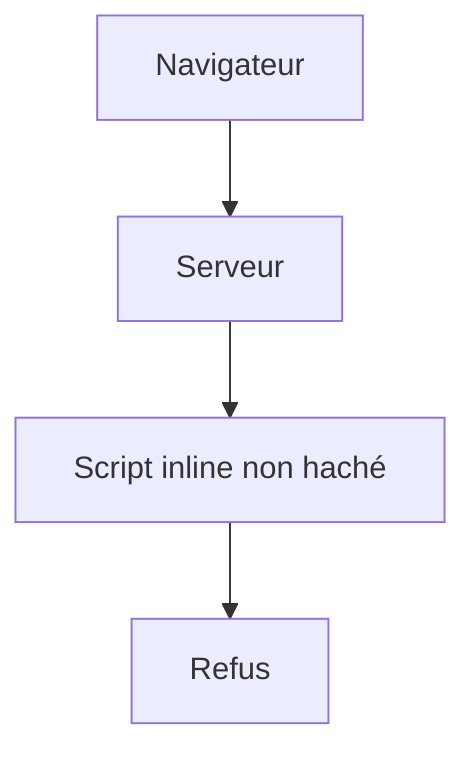
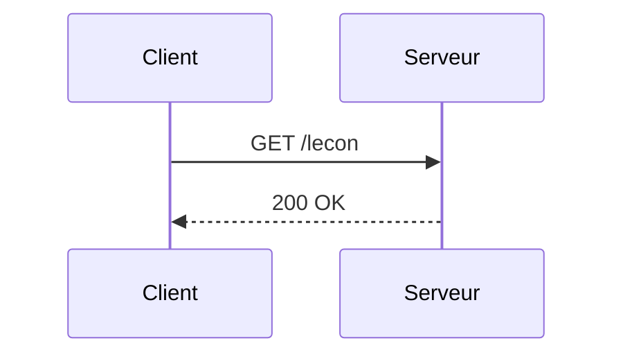

# Fixture Mermaid — deux sources, trois occurrences

<!-- ÉCHANTILLON DE TEST DU MOTEUR, PAS UNE LEÇON. Ce fichier appartient à E2-ST1 et vit
     hors de `content/` : le build de production ne peut donc pas le publier. La rédaction
     des vraies leçons appartient à la boucle contenu (`/lecon`), pas à celle-ci.

     CE QU'IL PORTE, ET POURQUOI CHAQUE PIÈCE EST LÀ :
       · DEUX sources de diagramme DISTINCTES (flowchart, sequenceDiagram) — deux mécanismes
         de nommage différents chez Mermaid (`my-svg-…` d'un côté, `actor0`/`root-0` de
         l'autre), donc deux jeux d'identifiants à préfixer, pas un seul répété ;
       · la PREMIÈRE source, RÉPÉTÉE MOT POUR MOT en troisième position. C'est le cas de
         régression du bug le plus retors du lot : la clef du cache est le hachage du CODE,
         donc deux diagrammes identiques d'une même leçon recevaient le MÊME SVG — donc les
         mêmes `id` deux fois dans la même page (`duplicate-id-aria` chez axe, et un
         `url(#…)` pointant chez le voisin). Le préfixe se calcule désormais PAR OCCURRENCE.
         Rendre ces deux blocs différents (une espace, un mot) rend le test aveugle : c'est
         leur identité stricte qui est la fixture. -->

## L'idée en une image

Un diagramme rendu se comporte comme une pièce détachée estampillée : deux pièces issues du
même moule sont interchangeables, mais chacune doit porter son propre numéro de série une fois
montée. L'analogie casse ici : une pièce mal numérotée se remarque à l'inventaire, alors que
deux diagrammes qui partagent leurs identifiants s'affichent parfaitement — c'est seulement la
flèche du second qui va chercher le marqueur du premier.

## Une seconde famille de diagrammes

Le bloc qui suit emploie une autre famille, dont Mermaid tire un autre jeu d'identifiants : la
preuve porte donc sur deux mécanismes de nommage distincts.

## Exemple simple

Le bloc qui suit est la COPIE MOT POUR MOT du premier diagramme de cette leçon. Une seule
invocation de `mmdc` le rend, le cache ne le compte qu'une fois — et pourtant ses identifiants
doivent différer de ceux du premier, parce que les deux occupent la même page.

## Exemple complet

Aucun bloc de code supplémentaire n'est nécessaire ici : la fixture existe pour ses diagrammes,
et cette section n'est présente que parce que le gabarit l'ancre.

## À toi de jouer

[[quiz]]

## À retenir

- Une seule invocation de `mmdc` rend tous les diagrammes d'une leçon.
- Le SVG livré a traversé un analyseur à liste blanche, pas un jeu de motifs.
- Chaque OCCURRENCE porte ses propres identifiants, même quand deux occurrences partagent
  leur source à l'octet près.

## Aller plus loin

- `tools/content-pipeline/rendre-mermaid.mjs` — l'analyseur et le préfixage par occurrence.
- `docs/contenu/pipeline-contenu.md` — le gabarit dont ce fichier respecte la forme minimale.
