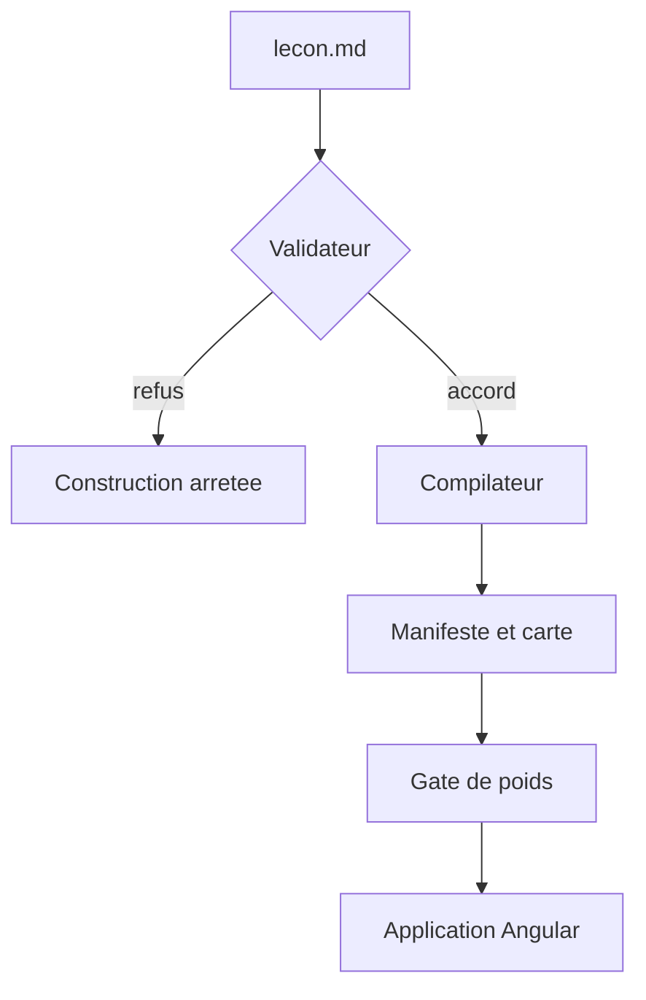
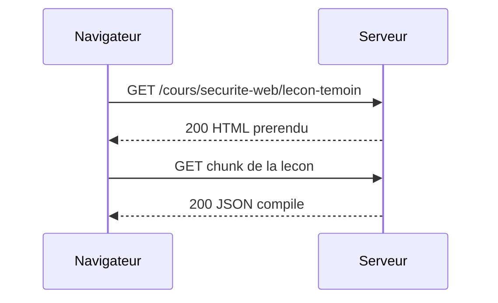

# Leçon-témoin grasse — tout le contrat du pipeline dans un fichier

<!-- ÉCHANTILLON DE TEST, PAS UNE LEÇON. Ce fichier appartient au MOTEUR (E2-ST1,
     lot 4) et vit hors de `content/` : le build de production ne peut donc pas le
     publier, quelle que soit la valeur de son frontmatter. C'est ce déplacement
     qui a permis de supprimer le champ `factice` du contrat (objection S6 du plan) —
     une leçon-témoin ne se protège pas par un drapeau qu'on peut oublier, elle se
     protège en n'étant pas là où le build regarde.

     Sa raison d'être : exercer TOUTES les formes de `BlocContenu` en une passe —
     deux diagrammes Mermaid, huit blocs de code, une comparaison à deux langages,
     les trois variantes d'encadré, les deux ancres d'exercice, des sections de
     niveau 2 ET 3. La rédaction des vraies leçons appartient à la boucle contenu
     (`/lecon`), jamais à celle-ci. -->

## L'idée en une image

Un pipeline de contenu se comporte comme le poste de contrôle d'un aéroport : rien n'entre
sans être passé au même détecteur, et ce qui sonne ne repart pas « quand même ». L'analogie
casse sur un point, et il vaut la peine de le dire : un passager refusé rate son vol, alors
qu'un fichier refusé ici arrête la construction du site entier — le refus est plus bruyant
que dans l'aéroport, et c'est voulu.



::: note
Un encadré `note` sert le contexte utile mais non essentiel. Les trois variantes de la liste
fermée sont exercées dans ce fichier : `note` ici, `attention` plus bas, `a-retenir` à la fin.
:::

### Ce que la carte ne montre pas

Une section de niveau 3 existe dans le contrat (`NiveauTitre = 2 | 3`) parce qu'un sommaire
imbriqué en a besoin. Ce paragraphe n'a pas d'autre fonction que de prouver qu'elle survit à
la compilation avec son ancre propre.

## Anatomie d'un rendu

Le second diagramme emploie une autre famille que le premier, donc un autre jeu
d'identifiants internes : c'est ce qui rend la preuve d'unicité des identifiants non
triviale.



::: attention
Un encadré `attention` peut contenir un bloc de code — c'est précisément ce qui a fait
retenir `markdown-it-container` plutôt qu'une clôture maison.

```bash
# La commande qui régénère tout ce que l'application voit du contenu.
npm run content:build
```
:::

## Exemple simple

Le mécanisme isolé, sans rien autour : une requête paramétrée, en SQL.

```sql
SELECT id, titre FROM lecons WHERE slug = @slug;
```

### Le même mécanisme, en TypeScript

Et le même isolé côté client, pour montrer qu'un bloc de code hors comparaison existe aussi
dans le contrat (`{ type: 'code' }`).

```typescript
const chargeur = carteLecons[slug];
const lecon = chargeur === undefined ? null : (await chargeur()).default;
```

## Exemple complet

Deux paires vulnérable/corrigé dans une même comparaison, et dans deux langages différents :
c'est la forme que le contrat appelle `comparaison`, et l'attribut `{langage="…"}` est
volontairement omis puisqu'il porterait sur toutes les paires.

:::: comparaison
::: vulnerable
```php
$nom = $_GET['nom'];
echo 'Bonjour ' . $nom;
```
{lignes="2"} La valeur vient du client et atteint la page sans encodage : tout balisage qu'elle
contient est interprété par le navigateur.
:::
::: corrige
```php
$nom = $_GET['nom'];
echo 'Bonjour ' . htmlspecialchars($nom, ENT_QUOTES, 'UTF-8');
```
{lignes="0"} Deux notes de portées distinctes dans un même volet : c'est ce que le témoin doit
exercer, sans quoi le chemin « N annotations » ne serait parcouru par aucun gate.

{lignes="2"} L'encodage à la sortie transforme le balisage en texte affiché, sans jamais supposer
que l'entrée était propre. Une note peut citer la syntaxe — {lignes="1"} écrit ici au milieu d'une
phrase reste du texte, parce que la portée se lit en tête de paragraphe et nulle part ailleurs.
:::
::: vulnerable
```csharp
var requete = "SELECT * FROM Lecons WHERE Slug = '" + slug + "'";
return await connexion.QueryAsync<Lecon>(requete);
```
{lignes="1,2"} La concaténation fait du paramètre une partie de la requête : le client écrit du SQL.
:::
::: corrige
```csharp
const string requete = "SELECT * FROM Lecons WHERE Slug = @Slug";
return await connexion.QueryAsync<Lecon>(requete, new { Slug = slug });
```
{lignes="1"} Le paramètre voyage à côté de la requête, jamais dedans : sa valeur ne peut plus en
changer la structure.
:::
::::

Et un dernier bloc isolé, en JSON, pour que le témoin couvre les six langages du contrat :

```json
{ "sujet": "securite-web", "slug": "lecon-temoin", "ordre": 1 }
```

## À toi de jouer

Les deux ancres d'exercice du contrat sont posées ici. Chacune est un paragraphe qui ne
contient qu'elle : le compilateur les remplace par un bloc `ancre-quiz` et un bloc
`ancre-simulation`, et c'est E2-ST3 puis E2-ST5 qui décideront de leur rendu.

[[quiz]]

[[simulation]]

## À retenir

::: a-retenir
- Un fichier de contenu malformé fait **échouer** la construction, jamais une page vide.
- Le contenu compilé sort en un fichier PAR leçon, chargé par un import paresseux dédié.
- Ce fichier-ci est un échantillon de test : il n'a jamais vocation à être publié.
:::

## Aller plus loin

- `docs/contenu/pipeline-contenu.md` — le gabarit dont ce fichier exerce toutes les formes.
- `tools/content-pipeline/types.d.ts` — le contrat que la sortie de ce fichier doit satisfaire.
